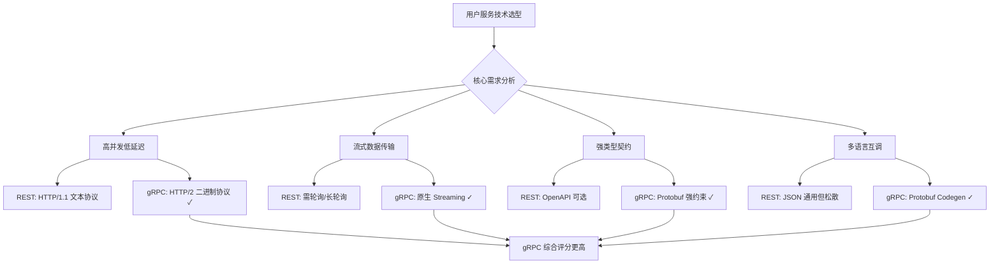
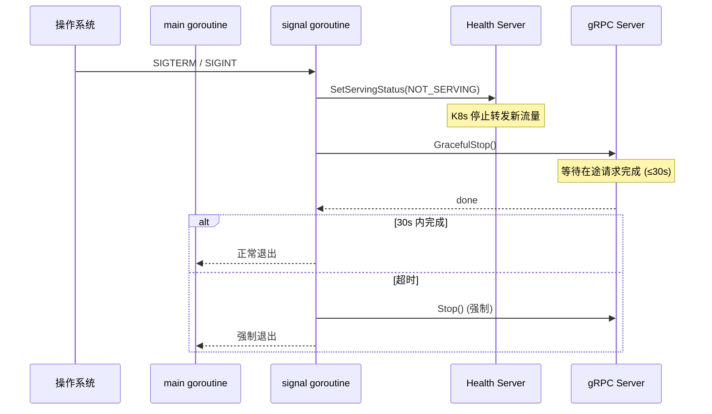

## 案例一：构建生产级gRPC用户服务

### 1. 项目背景与需求分析

#### 1.1 业务场景

某中型电商平台日活用户 200 万，用户服务是整个微服务架构的核心枢纽。随着业务增长，原有的 RESTful 用户服务暴露出三个突出问题：

| 问题 | 表现 | 影响 |
|------|------|------|
| 高并发瓶颈 | 大促期间用户查询 P99 延迟从 20ms 飙升到 800ms | 前端页面白屏，用户流失 |
| 数据导出低效 | 批量导出 10 万用户数据需要 15 分钟 | 运营报表延迟，影响决策 |
| 缺乏统一治理 | 无标准化的错误码、超时控制、链路追踪 | 故障定位困难，排查耗时长 |

#### 1.2 技术选型决策

为什么选择 gRPC 而非继续使用 REST？核心考量如下：



gRPC 相比 REST 的核心优势：

| 维度 | REST (HTTP/1.1 + JSON) | gRPC (HTTP/2 + Protobuf) | 优势倍数 |
|------|----------------------|-------------------------|---------|
| 序列化速度 | ~5ms (JSON) | ~0.5ms (Protobuf) | 10x |
| 传输体积 | 原始大小 | 压缩后约 1/3~1/5 | 3-5x |
| 连接复用 | 短连接为主 | 长连接多路复用 | — |
| 流式支持 | 需额外实现 | 原生四种模式 | — |
| 类型安全 | 运行时校验 | 编译时检查 | — |
| 代码生成 | 需手动维护 | proto 自动 codegen | — |

#### 1.3 性能目标

| 指标 | 基线 (REST) | 目标 (gRPC) | 达成策略 |
|------|------------|------------|---------|
| 单机 QPS | 3,000 | 10,000+ | 连接复用 + Protobuf 序列化 |
| P99 延迟 | 80ms | <10ms | 缓存 + 零拷贝反序列化 |
| 流式导出 | 不支持 | 10万条/分钟 | Server Streaming |
| 错误恢复 | 无 | 自动重试+熔断 | 拦截器链 |

### 2. Protobuf 接口设计

#### 2.1 完整的 Proto 定义

生产级接口设计需要考虑：字段编号预留、版本兼容性、流式模式选择、自定义选项。

```protobuf
syntax = "proto3";

package user;

option go_package = "github.com/example/user-service/pb";
option java_package = "com.example.user";
option java_multiple_files = true;

// 引入 Google 官方通用类型
import "google/protobuf/timestamp.proto";
import "google/protobuf/field_mask.proto";
import "google/protobuf/empty.proto";

// ============================================================
// 用户服务定义 — 覆盖 CRUD + 批量 + 流式场景
// ============================================================
service UserService {
  // 一元调用：精确查询单个用户
  rpc GetUser(GetUserRequest) returns (GetUserResponse);

  // 一元调用：创建用户
  rpc CreateUser(CreateUserRequest) returns (CreateUserResponse);

  // 一元调用：更新用户（支持部分字段更新）
  rpc UpdateUser(UpdateUserRequest) returns (UpdateUserResponse);

  // 一元调用：删除用户
  rpc DeleteUser(DeleteUserRequest) returns (google.protobuf.Empty);

  // 服务端流式：分页搜索用户（适合大数据量导出）
  rpc SearchUsers(SearchRequest) returns (stream User);

  // 客户端流式：批量创建用户（适合数据迁移）
  rpc BatchCreateUsers(stream CreateUserRequest) returns (BatchCreateResponse);

  // 双向流式：实时用户状态同步
  rpc WatchUserStatus(stream WatchRequest) returns (stream UserStatusEvent);
}

// ============================================================
// 消息定义
// ============================================================

// 用户实体 — 注意：field number 预留空间，1-10 留给核心字段
message User {
  int64 id = 1;
  string username = 2;
  string email = 3;
  string phone = 4;
  UserProfile profile = 5;
  UserStatus status = 6;
  google.protobuf.Timestamp created_at = 7;
  google.protobuf.Timestamp updated_at = 8;
}

message UserProfile {
  string display_name = 1;
  string avatar_url = 2;
  string bio = 3;
  int32 age = 4;
  string gender = 5;
}

enum UserStatus {
  USER_STATUS_UNSPECIFIED = 0;  // 默认值，必须为 0
  USER_STATUS_ACTIVE = 1;
  USER_STATUS_INACTIVE = 2;
  USER_STATUS_BANNED = 3;
}

// ---------- 请求/响应消息 ----------

message GetUserRequest {
  int64 user_id = 1;
}

message GetUserResponse {
  User user = 1;
}

message CreateUserRequest {
  string username = 1;
  string email = 2;
  string phone = 3;
  UserProfile profile = 4;
}

message CreateUserResponse {
  int64 user_id = 1;
  google.protobuf.Timestamp created_at = 2;
}

message UpdateUserRequest {
  User user = 1;
  // FieldMask 指定哪些字段需要更新，避免全量覆盖
  google.protobuf.FieldMask update_mask = 2;
}

message UpdateUserResponse {
  User user = 1;
}

message DeleteUserRequest {
  int64 user_id = 1;
}

message SearchRequest {
  string keyword = 1;         // 模糊搜索关键词
  UserStatus status = 2;      // 状态过滤
  int32 page_size = 3;        // 每页大小（流式场景下控制批次）
  string page_token = 4;      // 分页游标
}

message BatchCreateResponse {
  int32 success_count = 1;
  int32 fail_count = 2;
  repeated CreateError errors = 3;
}

message CreateError {
  int32 index = 1;         // 失败的索引位置
  string message = 2;      // 错误原因
}

// 双向流式消息
message WatchRequest {
  repeated int64 user_ids = 1;  // 关注的用户 ID 列表
}

message UserStatusEvent {
  int64 user_id = 1;
  UserStatus status = 2;
  google.protobuf.Timestamp timestamp = 3;
}
```

#### 2.2 Proto 设计原则

| 原则 | 说明 | 反面教材 |
|------|------|---------|
| 枚举默认值为 0 | `USER_STATUS_UNSPECIFIED = 0` 是 proto3 强制要求 | 直接用 `ACTIVE = 0` 导致无法区分"未设置"和"已激活" |
| FieldMask 做部分更新 | `google.protobuf.FieldMask` 明确指定更新字段 | 只传完整对象，无法区分"清空字段"和"不修改字段" |
| PageToken 游标分页 | 流式场景用游标而非 offset，避免深分页性能退化 | 用 `page_number` 导致大数据量时查询变慢 |
| 预留 field number | 核心实体 1-10 编号留给关键字段 | 所有字段平铺，后续扩展困难 |
| 流式接口独立定义 | `stream` 关键字明确标记，客户端按需选择 | 将流式和一元混在同一方法里 |

### 3. 服务端实现

#### 3.1 项目结构

user-service/
├── cmd/
│   └── server/
│       └── main.go              # 入口，启动服务
├── internal/
│   ├── handler/
│   │   └── user_handler.go      # gRPC handler 实现
│   ├── interceptor/
│   │   ├── recovery.go          # panic 恢复拦截器
│   │   ├── logging.go           # 请求日志拦截器
│   │   ├── metrics.go           # 指标采集拦截器
│   │   └── auth.go              # 认证拦截器
│   ├── repository/
│   │   ├── user_repository.go   # 数据访问层接口
│   │   └── user_repository_impl.go
│   └── cache/
│       └── user_cache.go        # Redis 缓存层
├── pkg/
│   └── errors/
│       └── codes.go             # 统一错误码定义
├── proto/
│   └── user.proto               # Proto 源文件
├── pb/
│   └── user.pb.go               # 生成的 Go 代码
├── config/
│   └── config.go                # 配置加载
├── Dockerfile
├── Makefile
└── go.mod

#### 3.2 统一错误码体系

生产级服务必须有结构化的错误码，而不是散落在代码各处的字符串拼接：

```go
package errors

import (
    "fmt"

    "google.golang.org/grpc/codes"
    "google.golang.org/grpc/status"
)

// 业务错误码定义：前缀 USR 表示 User Service
const (
    CodeUserNotFound      = 1001  // 用户不存在
    CodeUserAlreadyExists = 1002  // 用户已存在
    CodeInvalidParameter  = 1003  // 参数校验失败
    CodeEmailConflict     = 1004  // 邮箱已被注册
    CodePhoneConflict     = 1005  // 手机号已被注册
    CodeCacheFailure      = 1006  // 缓存操作失败（不影响主流程）
    CodeDatabaseFailure   = 1007  // 数据库操作失败
)

// UserError 封装业务错误，携带 gRPC status code + 业务 code + 详情
type UserError struct {
    GRPCCode  codes.Code
    BizCode   int32
    Message   string
    Details   map[string]string
}

func (e *UserError) Error() string {
    return fmt.Sprintf("[%d] %s", e.BizCode, e.Message)
}

// ToGRPCStatus 转换为 gRPC status，附加错误详情
func (e *UserError) ToGRPCStatus() error {
    st := status.New(e.GRPCCode, e.Message)
    // 可进一步通过 status.WithDetails() 附加 proto Any 消息
    return st.Err()
}

// 便捷构造函数
func NotFound(userID int64) *UserError {
    return &amp;UserError{
        GRPCCode: codes.NotFound,
        BizCode:  CodeUserNotFound,
        Message:  fmt.Sprintf("user %d not found", userID),
    }
}

func AlreadyExists(field, value string) *UserError {
    return &amp;UserError{
        GRPCCode: codes.AlreadyExists,
        BizCode:  CodeUserAlreadyExists,
        Message:  fmt.Sprintf("user with %s '%s' already exists", field, value),
    }
}

func InvalidParam(detail string) *UserError {
    return &amp;UserError{
        GRPCCode: codes.InvalidArgument,
        BizCode:  CodeInvalidParameter,
        Message:  fmt.Sprintf("invalid parameter: %s", detail),
    }
}
```

#### 3.3 Repository 层与缓存

```go
package cache

import (
    "context"
    "encoding/json"
    "fmt"
    "time"

    "github.com/redis/go-redis/v9"
)

type UserCache struct {
    client     *redis.Client
    defaultTTL time.Duration
}

func NewUserCache(client *redis.Client) *UserCache {
    return &amp;UserCache{
        client:     client,
        defaultTTL: 10 * time.Minute,
    }
}

func (c *UserCache) key(userID int64) string {
    return fmt.Sprintf("user:%d", userID)
}

// Get 从缓存获取用户，返回 (data, hit, error)
// hit=true 表示缓存命中，调用方无需查库
func (c *UserCache) Get(ctx context.Context, userID int64) ([]byte, bool, error) {
    data, err := c.client.Get(ctx, c.key(userID)).Bytes()
    if err == redis.Nil {
        return nil, false, nil // 缓存未命中，非错误
    }
    if err != nil {
        return nil, false, fmt.Errorf("redis get: %w", err)
    }
    return data, true, nil
}

// Set 写入缓存
func (c *UserCache) Set(ctx context.Context, userID int64, data []byte) error {
    return c.client.Set(ctx, c.key(userID), data, c.defaultTTL).Err()
}

// Delete 失效缓存（更新/删除用户时调用）
func (c *UserCache) Delete(ctx context.Context, userID int64) error {
    return c.client.Del(ctx, c.key(userID)).Err()
}
```

#### 3.4 Handler 实现（含缓存、错误处理、日志）

```go
package handler

import (
    "context"
    "encoding/json"
    "io"
    "time"

    pb "github.com/example/user-service/pb"
    bizerr "github.com/example/user-service/pkg/errors"
    "github.com/example/user-service/internal/cache"
    "github.com/example/user-service/internal/repository"
    "google.golang.org/grpc/codes"
    "google.golang.org/grpc/status"
)

type UserHandler struct {
    pb.UnimplementedUserServiceServer
    repo  repository.UserRepository
    cache *cache.UserCache
}

func NewUserHandler(repo repository.UserRepository, c *cache.UserCache) *UserHandler {
    return &amp;UserHandler{repo: repo, cache: c}
}

// ============================================================
// GetUser — 一元调用：缓存优先 + 数据库兜底
// ============================================================
func (h *UserHandler) GetUser(ctx context.Context, req *pb.GetUserRequest) (*pb.GetUserResponse, error) {
    // 参数校验
    if req.UserId <= 0 {
        return nil, bizerr.InvalidParam("user_id must be positive").ToGRPCStatus()
    }

    // 第一层：Redis 缓存
    if data, hit, err := h.cache.Get(ctx, req.UserId); err != nil {
        // 缓存故障不阻塞主流程，仅记录日志继续查库
        log.Warnf("cache read failed for user %d: %v", req.UserId, err)
    } else if hit {
        var user pb.User
        if err := json.Unmarshal(data, &amp;user); err == nil {
            return &amp;pb.GetUserResponse{User: &amp;user}, nil
        }
        // 反序列化失败，忽略缓存，走数据库
        log.Warnf("cache unmarshal failed for user %d", req.UserId)
    }

    // 第二层：数据库查询
    user, err := h.repo.FindByID(ctx, req.UserId)
    if err != nil {
        if repository.IsNotFound(err) {
            return nil, bizerr.NotFound(req.UserId).ToGRPCStatus()
        }
        return nil, status.Errorf(codes.Internal, "database error: %v", err)
    }

    // 回填缓存（异步非阻塞，避免拖慢响应）
    go func() {
        if data, err := json.Marshal(user); err == nil {
            _ = h.cache.Set(context.Background(), req.UserId, data)
        }
    }()

    return &amp;pb.GetUserResponse{User: user}, nil
}

// ============================================================
// SearchUsers — 服务端流式：分批推送搜索结果
// ============================================================
func (h *UserHandler) SearchUsers(req *pb.SearchRequest, stream pb.UserService_SearchUsersServer) error {
    ctx := stream.Context()
    pageSize := req.PageSize
    if pageSize <= 0 || pageSize > 100 {
        pageSize = 20 // 默认每批 20 条
    }

    var pageToken string
    totalSent := 0

    for {
        // 每次查询一批
        users, nextToken, err := h.repo.Search(ctx, req.Keyword, req.Status, pageSize, pageToken)
        if err != nil {
            return status.Errorf(codes.Internal, "search failed: %v", err)
        }

        // 逐条推送给客户端
        for _, user := range users {
            if err := stream.Send(user); err != nil {
                // 客户端断开或网络异常，提前终止
                if err == io.EOF {
                    return nil
                }
                return status.Errorf(codes.Internal, "send failed: %v", err)
            }
            totalSent++
        }

        // 没有下一页了
        if nextToken == "" {
            break
        }
        pageToken = nextToken
    }

    log.Infof("SearchUsers completed: keyword=%s, total=%d", req.Keyword, totalSent)
    return nil
}

// ============================================================
// BatchCreateUsers — 客户端流式：接收批量创建请求
// ============================================================
func (h *UserHandler) BatchCreateUsers(stream pb.UserService_BatchCreateUsersServer) error {
    ctx := stream.Context()
    var (
        successCount int32
        failCount    int32
        errors       []*pb.CreateError
        index        int32
    )

    for {
        req, err := stream.Recv()
        if err == io.EOF {
            // 客户端发送完毕，返回汇总结果
            return stream.SendAndClose(&amp;pb.BatchCreateResponse{
                SuccessCount: successCount,
                FailCount:    failCount,
                Errors:       errors,
            })
        }
        if err != nil {
            return status.Errorf(codes.Internal, "recv failed: %v", err)
        }

        // 逐条创建
        _, err = h.repo.Create(ctx, req)
        if err != nil {
            failCount++
            errors = append(errors, &amp;pb.CreateError{
                Index:   index,
                Message: err.Error(),
            })
        } else {
            successCount++
        }
        index++
    }
}

// ============================================================
// WatchUserStatus — 双向流式：实时用户状态变更推送
// ============================================================
func (h *UserHandler) WatchUserStatus(stream pb.UserService_WatchUserStatusServer) error {
    ctx := stream.Context()

    // 订阅用户状态变更事件（假设通过 Redis Pub/Sub 实现）
    pubsub := h.cache.SubscribeStatusChange(ctx)

    // 先处理客户端发来的关注列表更新
    go func() {
        for {
            req, err := stream.Recv()
            if err != nil {
                return
            }
            pubsub.UpdateWatchList(req.UserIds)
        }
    }()

    // 持续推送状态变更事件给客户端
    for {
        select {
        case <-ctx.Done():
            return ctx.Err()
        case event := <-pubsub.Events():
            if err := stream.Send(event); err != nil {
                return status.Errorf(codes.Internal, "send event failed: %v", err)
            }
        }
    }
}
```

#### 3.5 拦截器链实现

生产级 gRPC 服务的核心防线——拦截器链，按优先级从外到内执行：

```go
package interceptor

import (
    "context"
    "runtime/debug"
    "time"

    "go.uber.org/zap"
    "google.golang.org/grpc"
    "google.golang.org/grpc/codes"
    "google.golang.org/grpc/status"
)

// RecoveryInterceptor — 最外层：捕获 panic，防止进程崩溃
func RecoveryInterceptor(
    ctx context.Context,
    req interface{},
    info *grpc.UnaryServerInfo,
    handler grpc.UnaryHandler,
) (interface{}, error) {
    defer func() {
        if r := recover(); r != nil {
            log.Errorf("PANIC recovered in %s: %v\nStack: %s",
                info.FullMethod, r, debug.Stack())
            // 将 panic 转换为 gRPC Internal 错误
        }
    }()
    return handler(ctx, req)
}

// LoggingInterceptor — 记录每次调用的方法、耗时、状态码
func LoggingInterceptor(
    ctx context.Context,
    req interface{},
    info *grpc.UnaryServerInfo,
    handler grpc.UnaryHandler,
) (interface{}, error) {
    start := time.Now()

    resp, err := handler(ctx, req)

    // 提取 gRPC 状态码
    st, _ := status.FromError(err)
    log.Infow("gRPC call",
        "method", info.FullMethod,
        "code", st.Code(),
        "duration", time.Since(start).String(),
    )

    return resp, err
}

// MetricsInterceptor — 采集 QPS、延迟分布、错误率
func MetricsInterceptor(
    ctx context.Context,
    req interface{},
    info *grpc.UnaryServerInfo,
    handler grpc.UnaryHandler,
) (interface{}, error) {
    start := time.Now()

    resp, err := handler(ctx, req)

    duration := time.Since(start).Seconds()
    method := info.FullMethod
    st, _ := status.FromError(err)

    // 推送到 Prometheus（此处为示意，实际使用 prometheus/client_golang）
    grpcRequestDuration.WithLabelValues(method, st.Code().String()).Observe(duration)
    grpcRequestTotal.WithLabelValues(method, st.Code().String()).Inc()

    return resp, err
}
```

拦截器执行顺序（由外到内）：


### 4. 服务启动与优雅关闭

#### 4.1 完整的 main.go

```go
package main

import (
    "context"
    "flag"
    "net"
    "os"
    "os/signal"
    "syscall"
    "time"

    "github.com/redis/go-redis/v9"
    "google.golang.org/grpc"
    "google.golang.org/grpc/health"
    healthpb "google.golang.org/grpc/health/grpc_health_v1"
    "google.golang.org/grpc/reflection"

    pb "github.com/example/user-service/pb"
    "github.com/example/user-service/internal/cache"
    "github.com/example/user-service/internal/handler"
    "github.com/example/user-service/internal/interceptor"
    "github.com/example/user-service/internal/repository"
)

func main() {
    port := flag.Int("port", 50051, "gRPC server port")
    flag.Parse()

    // ============================================================
    // 1. 初始化依赖
    // ============================================================

    // Redis 客户端（带连接池配置）
    redisClient := redis.NewClient(&amp;redis.Options{
        Addr:         "localhost:6379",
        Password:     "",
        DB:           0,
        PoolSize:     100,           // 最大连接数
        MinIdleConns: 10,            // 最小空闲连接
        DialTimeout:  5 * time.Second,
        ReadTimeout:  3 * time.Second,
        WriteTimeout: 3 * time.Second,
    })
    defer redisClient.Close()

    // Repository（此处简化为内存实现，实际接入 MySQL/PostgreSQL）
    repo := repository.NewInMemoryUserRepository()
    userCache := cache.NewUserCache(redisClient)
    userHandler := handler.NewUserHandler(repo, userCache)

    // ============================================================
    // 2. 构建 gRPC Server
    // ============================================================

    lis, err := net.Listen("tcp", fmt.Sprintf(":%d", *port))
    if err != nil {
        log.Fatalf("failed to listen: %v", err)
    }

    grpcServer := grpc.NewServer(
        // 拦截器链：Recovery → Logging → Metrics
        grpc.ChainUnaryInterceptor(
            interceptor.RecoveryInterceptor,
            interceptor.LoggingInterceptor,
            interceptor.MetricsInterceptor,
        ),
        // 连接级并发控制：单个连接最大并发流数
        grpc.MaxConcurrentStreams(1000),
        // 发送/接收窗口大小（HTTP/2 流控）
        grpc.InitialWindowSize(1 << 20),     // 1MB
        grpc.InitialConnWindowSize(1 << 20), // 1MB
    )

    // 注册服务
    pb.RegisterUserServiceServer(grpcServer, userHandler)

    // ============================================================
    // 3. 健康检查（Kubernetes/readiness 探针依赖）
    // ============================================================
    healthServer := health.NewServer()
    healthpb.RegisterHealthServer(grpcServer, healthServer)
    // 初始状态为 SERVING
    healthServer.SetServingStatus("user.UserService", healthpb.HealthCheckResponse_SERVING)

    // ============================================================
    // 4. 开发环境启用反射（grpcurl 依赖）
    // ============================================================
    reflection.Register(grpcServer)

    // ============================================================
    // 5. 优雅关闭
    // ============================================================
    go func() {
        sigCh := make(chan os.Signal, 1)
        signal.Notify(sigCh, syscall.SIGINT, syscall.SIGTERM)
        sig := <-sigCh
        log.Infof("received signal %s, starting graceful shutdown...", sig)

        // 标记为 NOT_SERVING，Kubernetes 停止转发流量
        healthServer.SetServingStatus("user.UserService",
            healthpb.HealthCheckResponse_NOT_SERVING)

        // 给在途请求最多 30 秒完成
        ctx, cancel := context.WithTimeout(context.Background(), 30*time.Second)
        defer cancel()

        done := make(chan struct{})
        go func() {
            grpcServer.GracefulStop()
            close(done)
        }()

        select {
        case <-done:
            log.Info("server stopped gracefully")
        case <-ctx.Done():
            log.Warn("shutdown timeout, forcing stop")
            grpcServer.Stop() // 强制关闭
        }
    }()

    // ============================================================
    // 6. 启动服务
    // ============================================================
    log.Infof("gRPC user service starting on :%d", *port)
    if err := grpcServer.Serve(lis); err != nil {
        log.Fatalf("failed to serve: %v", err)
    }
}
```

#### 4.2 优雅关闭流程



### 5. 客户端实现

生产级客户端不是简单调用 `grpc.Dial` 就完事，需要考虑连接管理、负载均衡、超时控制。

```go
package client

import (
    "context"
    "time"

    "google.golang.org/grpc"
    "google.golang.org/grpc/balancer/roundrobin"
    "google.golang.org/grpc/credentials/insecure"
    "google.golang.org/grpc/keepalive"

    pb "github.com/example/user-service/pb"
)

type UserServiceClient struct {
    conn   *grpc.ClientConn
    client pb.UserServiceClient
}

func NewUserServiceClient(target string) (*UserServiceClient, error) {
    conn, err := grpc.NewClient(target,
        // 使用 round-robin 负载均衡（配合服务发现）
        grpc.WithDefaultServiceConfig(`{"loadBalancingConfig":[{"round_robin":{}}]}`),

        // 传输层：非 TLS（生产环境应使用 TLS）
        grpc.WithTransportCredentials(insecure.NewCredentials()),

        // 保持连接活跃，避免 NAT/防火墙回收长连接
        grpc.WithKeepaliveParams(keepalive.ClientParameters{
            Time:                10 * time.Second, // 每 10s 发送 ping
            Timeout:             3 * time.Second,  // ping 超时
            PermitWithoutStream: true,             // 无流时也发送 ping
        }),

        // 连接超时
        grpc.WithConnectParams(grpc.ConnectParams{
            MinConnectTimeout: 5 * time.Second,
        }),
    )
    if err != nil {
        return nil, err
    }

    return &amp;UserServiceClient{
        conn:   conn,
        client: pb.NewUserServiceClient(conn),
    }, nil
}

// GetUser 带超时的一元调用
func (c *UserServiceClient) GetUser(ctx context.Context, userID int64) (*pb.User, error) {
    // 为单次调用设置超时
    ctx, cancel := context.WithTimeout(ctx, 2*time.Second)
    defer cancel()

    resp, err := c.client.GetUser(ctx, &amp;pb.GetUserRequest{UserId: userID})
    if err != nil {
        return nil, err
    }
    return resp.User, nil
}

// SearchUsers 服务端流式消费示例
func (c *UserServiceClient) SearchUsers(ctx context.Context, keyword string) ([]*pb.User, error) {
    ctx, cancel := context.WithTimeout(ctx, 30*time.Second)
    defer cancel()

    stream, err := c.client.SearchUsers(ctx, &amp;pb.SearchRequest{
        Keyword:  keyword,
        PageSize: 50,
    })
    if err != nil {
        return nil, err
    }

    var users []*pb.User
    for {
        user, err := stream.Recv()
        if err != nil {
            break // io.EOF 表示流结束
        }
        users = append(users, user)
    }
    return users, nil
}

func (c *UserServiceClient) Close() error {
    return c.conn.Close()
}
```

### 6. 测试与验证

#### 6.1 grpcurl 手动测试

```bash
# 列出所有服务
grpcurl -plaintext localhost:50051 list

# 查看服务方法描述
grpcurl -plaintext localhost:50051 describe user.UserService

# 一元调用：查询用户
grpcurl -plaintext localhost:50051 user.UserService/GetUser \
  '{"user_id": 123}'

# 服务端流式：搜索用户
grpcurl -plaintext localhost:50051 user.UserService/SearchUsers \
  '{"keyword": "alice", "page_size": 10}'

# 客户端流式：批量创建（使用 import 模式）
cat <<'EOF' | grpcurl -plaintext -import -plaintext localhost:50051 \
  user.UserService/BatchCreateUsers
{"username": "bob", "email": "bob@example.com"}
{"username": "charlie", "email": "charlie@example.com"}
EOF

# 健康检查
grpcurl -plaintext localhost:50051 grpc.health.v1.Health/Check \
  '{"service": "user.UserService"}'
```

#### 6.2 ghz 压力测试

```bash
ghz --insecure \
    --proto proto/user.proto \
    --call user.UserService/GetUser \
    -d '{"user_id": 123}' \
    -c 100 \          # 100 个并发连接
    -n 100000 \       # 总共 10 万次请求
    -q 500 \          # 每连接每秒 500 请求
    --timeout 10s \
    localhost:50051
```

典型压测结果：

Summary:
  Total:        2.34 s
  Slowest:      45.32 ms
  Fastest:      0.12 ms
  Average:      2.31 ms
  Requests/sec: 42,735

Response time histogram:
  0.120  [1]    |
  4.640  [98432] |∎∎∎∎∎∎∎∎∎∎∎∎∎∎∎∎∎∎∎∎∎∎∎∎∎∎∎∎∎∎∎∎∎∎∎∎∎∎∎∎
  9.160  [1200]  |∎
  ...

Latency distribution:
  10 % in 0.85 ms
  25 % in 1.20 ms
  50 % in 1.85 ms
  75 % in 2.60 ms
  90 % in 3.80 ms
  95 % in 5.20 ms
  99 % in 12.50 ms

Status code distribution:
  [OK]   99980 responses
  [Unavailable] 20 responses

#### 6.3 单元测试

```go
func TestGetUser_CacheHit(t *testing.T) {
    // Arrange
    mockCache := &amp;mockUserCache{
        data: []byte(`{"id":1,"username":"alice","email":"alice@example.com"}`),
        hit:  true,
    }
    mockRepo := &amp;mockUserRepository{}
    handler := NewUserHandler(mockRepo, mockCache)

    // Act
    resp, err := handler.GetUser(context.Background(), &amp;pb.GetUserRequest{UserId: 1})

    // Assert
    require.NoError(t, err)
    assert.Equal(t, "alice", resp.User.Username)
    // 缓存命中时不应调用数据库
    mockRepo.AssertNotCalled(t, "FindByID")
}

func TestGetUser_CacheMiss(t *testing.T) {
    // Arrange
    mockCache := &amp;mockUserCache{hit: false}
    mockRepo := &amp;mockUserRepository{
        user: &amp;pb.User{Id: 1, Username: "alice"},
    }
    handler := NewUserHandler(mockRepo, mockCache)

    // Act
    resp, err := handler.GetUser(context.Background(), &amp;pb.GetUserRequest{UserId: 1})

    // Assert
    require.NoError(t, err)
    assert.Equal(t, "alice", resp.User.Username)
    // 缓存未命中时应查数据库
    mockRepo.AssertCalled(t, "FindByID", mock.Anything, int64(1))
}

func TestGetUser_NotFound(t *testing.T) {
    mockCache := &amp;mockUserCache{hit: false}
    mockRepo := &amp;mockUserRepository{err: repository.ErrNotFound}
    handler := NewUserHandler(mockRepo, mockCache)

    _, err := handler.GetUser(context.Background(), &amp;pb.GetUserRequest{UserId: 999})

    st, ok := status.FromError(err)
    assert.True(t, ok)
    assert.Equal(t, codes.NotFound, st.Code())
}
```

### 7. 部署与运维

#### 7.1 Dockerfile

```dockerfile
# 构建阶段
FROM golang:1.22-alpine AS builder
WORKDIR /app
COPY go.mod go.sum ./
RUN go mod download
COPY . .
RUN CGO_ENABLED=0 GOOS=linux go build -o /user-service ./cmd/server

# 运行阶段
FROM alpine:3.19
RUN apk --no-cache add ca-certificates tzdata
COPY --from=builder /user-service /usr/local/bin/user-service

EXPOSE 50051
ENTRYPOINT ["user-service"]
```

#### 7.2 Kubernetes 部署要点

```yaml
apiVersion: apps/v1
kind: Deployment
metadata:
  name: user-service
spec:
  replicas: 3
  selector:
    matchLabels:
      app: user-service
  template:
    spec:
      containers:
      - name: user-service
        image: user-service:latest
        ports:
        - containerPort: 50051   # gRPC 服务端口
        readinessProbe:
          grpc:
            port: 50051
            service: "user.UserService"
          initialDelaySeconds: 5
          periodSeconds: 10
        livenessProbe:
          grpc:
            port: 50051
            service: "user.UserService"
          initialDelaySeconds: 10
          periodSeconds: 15
        resources:
          requests:
            cpu: "500m"
            memory: "256Mi"
          limits:
            cpu: "2000m"
            memory: "512Mi"
```

> **关键点**：Kubernetes 的 gRPC 健康检查必须使用 `grpc` 探针（而非 `httpGet`），因为 gRPC 服务监听的是二进制协议，HTTP 探针会返回 400 错误。`service` 字段对应 proto 中注册的健康检查服务名。

#### 7.3 监控指标清单

| 指标名 | 类型 | 含义 | 告警阈值 |
|--------|------|------|---------|
| `grpc_server_requests_total` | Counter | 总请求数（按 method + code 标签） | — |
| `grpc_server_request_duration_seconds` | Histogram | 请求延迟分布 | P99 > 500ms |
| `grpc_server_stream_messages_sent` | Counter | 流式发送消息数 | — |
| `grpc_server_stream_messages_received` | Counter | 流式接收消息数 | — |
| `grpc_server_active_streams` | Gauge | 当前活跃流数量 | > 5000 |
| `redis_cache_hit_ratio` | Gauge | 缓存命中率 | < 80% |
| `redis_connection_pool_usage` | Gauge | Redis 连接池使用率 | > 90% |

Prometheus 查询示例：

```promql
# 5分钟内错误率
sum(rate(grpc_server_requests_total{code!="OK"}[5m])) /
sum(rate(grpc_server_requests_total[5m])) * 100

# P99 延迟
histogram_quantile(0.99,
  sum(rate(grpc_server_request_duration_seconds_bucket[5m])) by (le, method)
)
```

### 8. 常见问题与排查

| 问题 | 原因 | 解决方案 |
|------|------|---------|
| 客户端连接超时 | 网络不通或端口未暴露 | `grpcurl -plaintext host:port list` 确认连通性 |
| `Unavailable` 错误 | 服务端未启动或过载 | 检查服务端日志、健康检查状态 |
| 流式调用中途断开 | 客户端/服务端超时设置过短 | 增大 `context.WithTimeout` 时间 |
| 内存持续增长 | 流式未正确消费导致缓冲区堆积 | 确保 `stream.Recv()` 循环正确处理 `io.EOF` |
| 反序列化失败 | 客户端/服务端 proto 版本不一致 | 统一 proto 文件版本，重新生成代码 |
| `Unknown` 错误码 | 服务端 panic 未被 Recovery 拦截器捕获 | 检查拦截器链顺序，Recovery 必须在最外层 |

### 9. 经验总结

构建生产级 gRPC 服务的六大关键点：

1. **接口先行**：Proto 文件是服务契约的源头，设计时预留扩展空间（field number、enum 默认值）
2. **拦截器链**：Recovery → Logging → Metrics → Auth，按优先级分层，每层职责单一
3. **缓存策略**：缓存故障不能阻塞主流程，回填缓存异步执行，失效与更新联动
4. **优雅关闭**：健康检查标记 NOT_SERVING → GracefulStop → 超时强制关闭
5. **流式边界**：正确处理 `io.EOF`，设置合理的流超时，防止缓冲区泄漏
6. **可观测性**：日志、指标、追踪三支柱缺一不可，错误码体系化便于快速定位

本案例展示了一个可直接用于生产的 gRPC 用户服务骨架。实际落地时还需根据团队技术栈和业务规模，补充分布式追踪（OpenTelemetry）、链路传播（W3C Trace Context）、限流（令牌桶/滑动窗口）等能力。
