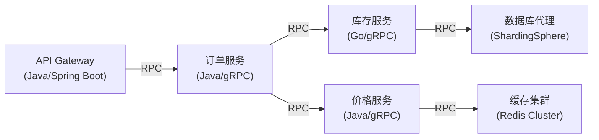
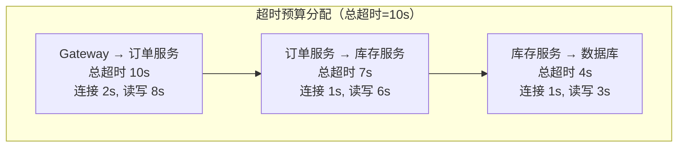
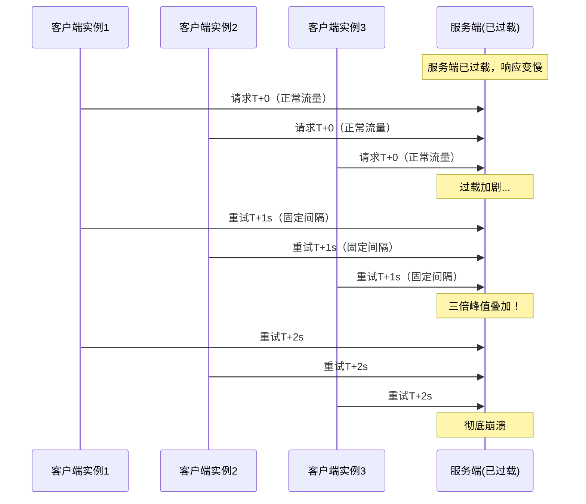
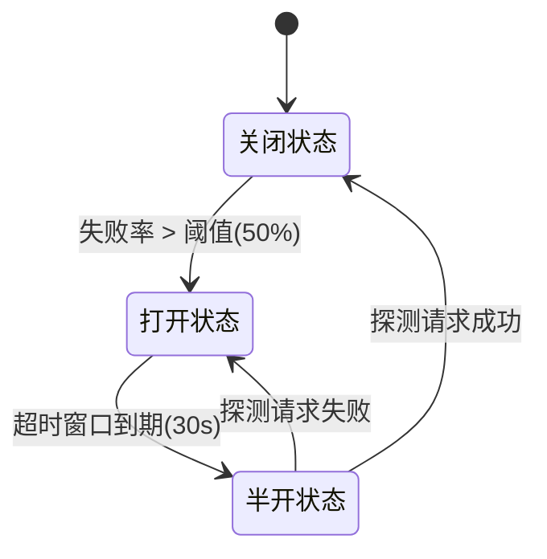
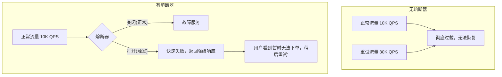
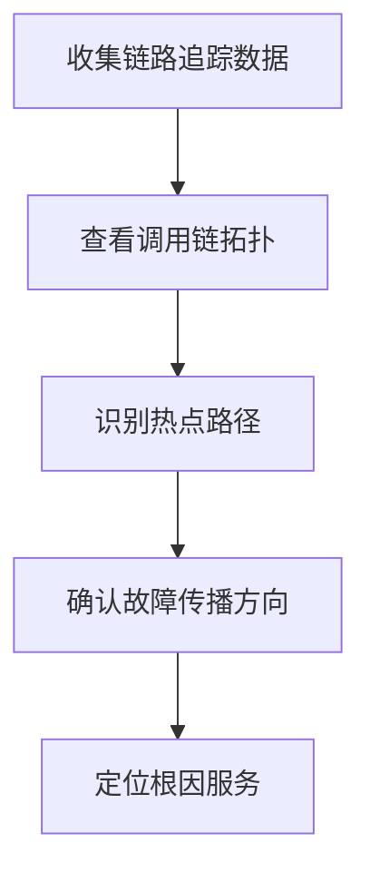
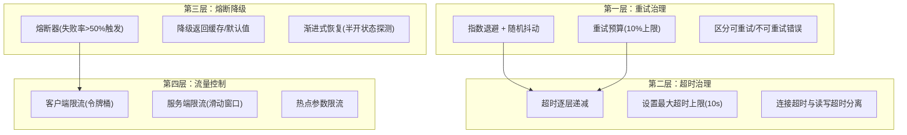

## 案例二：超时与重试导致的级联故障

> **案例定位**：本案例聚焦RPC调用链中因超时配置不当和重试策略缺失引发的级联故障（Cascading Failure），是RPC工程实践中最经典、最具破坏力的问题模式。与核心技巧"四超时与重试"中的理论知识互为补充——本节用真实场景展示"不遵循最佳实践会怎样"，帮助读者建立从理论到直觉的映射。

---

### 1. 故障全景：一个订单引发的雪崩

#### 1.1 系统架构

某电商平台采用微服务架构，核心下单链路涉及五个服务的RPC调用：



调用链路的超时配置（故障前）：

| 服务 | 连接超时 | 读写超时 | 重试次数 | 重试间隔 |
|------|---------|---------|---------|---------|
| API Gateway → 订单服务 | 5s | 10s | 3 | 固定1s |
| 订单服务 → 库存服务 | 3s | 5s | 3 | 固定500ms |
| 订单服务 → 价格服务 | 3s | 5s | 3 | 固定500ms |
| 库存服务 → 数据库代理 | 2s | 3s | 3 | 固定200ms |

#### 1.2 故障时间线

```mermaid
gantt
    title 故障演进时间线
    dateFormat HH:mm
    axisFormat %H:%M
    section 正常阶段
    系统正常运行     :done, a1, 10:00, 14:00
    section 故障触发
    数据库慢查询出现  :crit, b1, 14:00, 14:05
    库存服务响应变慢  :crit, b2, 14:05, 14:10
    section 级联扩散
    重试风暴开始      :crit, c1, 14:10, 14:15
    线程池耗尽        :crit, c2, 14:15, 14:20
    全链路雪崩        :crit, d1, 14:20, 14:45
    section 恢复
    人工介入止损      :active, e1, 14:45, 14:50
    系统逐步恢复      :active, e2, 14:50, 15:30
```



| 时间 | 事件 | 影响 |
|------|------|------|
| 14:00 | 数据库主库出现慢查询（某运营活动SQL未走索引） | 单次查询从5ms飙升到3s |
| 14:02 | 库存服务响应时间从10ms上升到800ms | 开始出现超时（5s阈值），触发重试 |
| 14:05 | 重试请求叠加正常请求，库存服务QPS翻倍 | 连接池接近上限，线程数上升 |
| 14:10 | 订单服务对库存服务的重试+正常流量，库存服务承受3倍压力 | 库存服务彻底过载，响应时间>5s |
| 14:15 | API Gateway重试导致订单服务压力翻倍，订单服务线程池耗尽 | 订单服务开始拒绝新连接 |
| 14:20 | 价格服务未受影响，但订单服务不可用导致整体下单链路不可用 | 全站下单功能瘫痪 |
| 14:45 | 运维紧急降级，手动关闭重试策略 | 流量恢复正常 |
| 15:30 | 慢SQL修复，数据库恢复正常 | 系统完全恢复 |

#### 1.3 关键数据：重试放大效应

这是理解级联故障的核心——**重试放大系数**：

```python
# 故障前：正常流量
正常QPS = 10000

# 库存服务故障（响应时间 > 客户端超时阈值）时：
客户端重试次数 = 3
重试后流量 = 10000 * (1 + 3) = 40000  # 4倍放大

# 订单服务也被拖慢，其客户端（Gateway）也开始重试：
Gateway重试次数 = 3
Gateway重试后流量 = 40000 * (1 + 3) = 160000  # 16倍放大

# 但连接池/线程池有上限，溢出的请求直接失败：
# 连接池=100 → 160000个请求中只有100个能进入，其余全部超时
```

**放大公式**：若调用链有 N 层，每层重试 R 次，最底层故障时顶层流量放大为原始流量的 (1+R)^N 倍。3层×3次重试 = 64倍放大。

---

### 2. 根因分析：五个致命设计缺陷

#### 2.1 缺陷一：超时时间层层递增（反模式）

**错误配置**：

Gateway → 订单服务：10s
订单服务 → 库存服务：5s
库存服务 → 数据库：3s

**正确做法——超时逐层递减**：



| 层级 | 总超时 | 连接超时 | 读写超时 | 剩余时间给下游 |
|------|-------|---------|---------|--------------|
| Gateway → 订单服务 | 10s | 2s | 8s | 留 2s 给下游 |
| 订单服务 → 库存服务 | 8s（<父级） | 1s | 6s | 留 1s 给下游 |
| 库存服务 → 数据库 | 4s（<父级） | 1s | 3s | 留 1s 给重试 |

**核心原则**：`下游超时 < 上游超时`，且上游总时间要覆盖 `自身处理时间 + 下游超时 + 重试时间`。

#### 2.2 缺陷二：固定间隔重试引发"重试风暴"

**问题机制**：所有客户端在相同时间点发出重试请求，造成"惊群效应"（Thundering Herd）。



**指数退避 + 随机抖动**的正确做法：

```java
// gRPC Java - 配置指数退避重试策略
RetryPolicy retryPolicy = RetryPolicy.newBuilder()
    .setMaxAttempts(4)                          // 最多重试3次（含首次）
    .setInitialBackoff(new Duration().setSeconds(1))  // 初始退避1s
    .setMaxBackoff(new Duration().setSeconds(30))     // 最大退避30s
    .setBackoffMultiplier(2)                         // 退避倍数
    .addRetryableStatus(Status.Code.UNAVAILABLE)      // 只重试可重试的错误
    .addRetryableStatus(Status.Code.DEADLINE_EXCEEDED)
    .build();

// 服务端配置
ServiceConfig serviceConfig = ServiceConfig.newBuilder()
    .setLoadBalancingPolicyName("round_robin")
    .setMethodConfig(MethodConfig.newBuilder()
        .setName(MethodName.newBuilder().setService("*"))
        .setRetryPolicy(retryPolicy)
        .setWaitForReady(true)
        .build())
    .build();
```

退避时间计算：

第1次重试延迟 = 1s × 2^0 + random(0, 1)  → ~1.0-2.0s
第2次重试延迟 = 1s × 2^1 + random(0, 2)  → ~2.0-4.0s
第3次重试延迟 = 1s × 2^2 + random(0, 4)  → ~4.0-8.0s
总重试时间 ≈ 7-14s（分散在不同客户端上）

#### 2.3 缺陷三：缺少重试预算（Retry Budget）

**问题**：即使有指数退避，当下游持续故障时，重试流量仍然会持续累积。

**重试预算机制**：限制重试请求占总请求的最大比例，超过预算后不再重试。

```python
import time
import threading
from collections import deque

class RetryBudget:
    """
    滑动窗口重试预算器
    - 窗口大小：10秒
    - 预算比例：10%（重试请求不超过总请求的10%）
    - 最小重试率：即使比例低于10%，也允许至少1个重试/秒
    """
    def __init__(self, window_seconds=10, budget_ratio=0.10, min_retries_per_sec=1):
        self.window = window_seconds
        self.budget_ratio = budget_ratio
        self.min_retries = min_retries_per_sec
        self.total_requests = deque()    # (timestamp,) 的滑动窗口
        self.retry_requests = deque()
        self.lock = threading.Lock()

    def allow_retry(self):
        now = time.time()
        cutoff = now - self.window

        with self.lock:
            # 清理过期记录
            while self.total_requests and self.total_requests[0] < cutoff:
                self.total_requests.popleft()
            while self.retry_requests and self.retry_requests[0] < cutoff:
                self.retry_requests.popleft()

            total = len(self.total_requests)
            retries = len(self.retry_requests)

            # 检查是否超出预算
            if total > 0:
                current_ratio = retries / total
                if current_ratio >= self.budget_ratio:
                    return False

            # 至少允许最小重试率
            if retries >= self.min_retries * self.window:
                return False

            return True

    def record_request(self, is_retry=False):
        now = time.time()
        with self.lock:
            self.total_requests.append(now)
            if is_retry:
                self.retry_requests.append(now)
```

**效果对比**：

| 指标 | 无重试预算 | 有重试预算（10%） |
|------|----------|----------------|
| 10s窗口内总请求 | 100,000 | 100,000 |
| 重试请求 | 30,000（按指数退避计算） | 10,000（被预算限制） |
| 下游承受压力 | 原始的1.3倍 | 原始的1.1倍 |
| 恢复时间 | 5分钟+ | 30秒内自动恢复 |

#### 2.4 缺陷四：未区分可重试与不可重试错误

**不可重试的错误**：

| gRPC状态码 | 含义 | 为什么不该重试 |
|-----------|------|--------------|
| INVALID_ARGUMENT | 参数错误 | 重试结果一样，浪费资源 |
| ALREADY_EXISTS | 资源已存在 | 幂等性问题，重试会重复创建 |
| PERMISSION_DENIED | 权限不足 | 重试无法改变权限 |
| NOT_FOUND | 资源不存在 | 重试无法让资源出现 |
| UNAUTHENTICATED | 未认证 | 重试无法补充凭证 |
| FAILED_PRECONDITION | 前置条件不满足 | 重试不会改变前置条件 |
| UNIMPLEMENTED | 方法未实现 | 重试不会让方法突然可用 |

**可重试的错误**：

| gRPC状态码 | 含义 | 重试建议 |
|-----------|------|---------|
| UNAVAILABLE | 服务不可用/连接断开 | ✅ 指数退避重试 |
| DEADLINE_EXCEEDED | 超时 | ⚠️ 视情况重试，可能加剧过载 |
| RESOURCE_EXHAUSTED | 资源耗尽/限流 | ⚠️ 指数退避重试，配合重试预算 |
| INTERNAL | 内部错误 | ⚠️ 可能是瞬时故障，可重试 |
| ABORTED | 操作被中止 | ⚠️ 乐观锁冲突，可重试 |

#### 2.5 缺陷五：缺少熔断器保护

**熔断器三态模型**：



**熔断器实现**（以 gRPC Java Interceptor 为例）：

```java
public class CircuitBreakerInterceptor implements ClientInterceptor {

    private final CircuitBreaker circuitBreaker;

    public CircuitBreakerInterceptor(CircuitBreaker breaker) {
        this.circuitBreaker = breaker;
    }

    @Override
    public <ReqT, RespT> ClientCall<ReqT, RespT> interceptCall(
            MethodDescriptor<ReqT, RespT> method,
            CallOptions options,
            Channel next) {

        // 如果熔断器打开，直接快速失败
        if (!circuitBreaker.allowRequest()) {
            throw new StatusRuntimeException(
                Status.UNAVAILABLE.withDescription("Circuit breaker is OPEN"));
        }

        return new ForwardingClientCall.SimpleForwardingClientCall<ReqT, RespT>(
                next.newCall(method, options)) {

            @Override
            public void start(Listener<RespT> responseListener, Metadata headers) {
                super.start(new ForwardingClientCallListener.SimpleForwardingClientCallListener<>(
                        responseListener) {
                    @Override
                    public void onClose(Status status, Metadata trailers) {
                        if (status.isOk()) {
                            circuitBreaker.recordSuccess();
                        } else {
                            circuitBreaker.recordFailure();
                        }
                        super.onClose(status, trailers);
                    }
                }, headers);
            }
        };
    }
}
```

**Resilience4j 熔断器配置**：

```yaml
resilience4j:
  circuitbreaker:
    instances:
      inventoryService:
        slidingWindowSize: 100          # 统计窗口大小
        failureRateThreshold: 50        # 失败率阈值50%
        waitDurationInOpenState: 30s    # 熔断器打开后等待30秒
        permittedNumberOfCallsInHalfOpenState: 5  # 半开状态允许5个探测请求
        automaticTransitionFromOpenToHalfOpenEnabled: true
        recordExceptions:
          - io.grpc.StatusRuntimeException
        ignoreExceptions:
          - com.example.BusinessException
```

**熔断器在级联故障中的作用**：



---

### 3. 完整诊断流程

当线上出现类似级联故障时，按以下步骤排查：

#### 3.1 第一步：确认影响面

```bash
# 查看服务整体错误率（以Prometheus/Grafana为例）
# 检查各服务的 grpc_server_handled_total{grpc_code!="OK"} 增速

# 快速查看进程状态
# 确认各服务实例是否存活
kubectl get pods -n production | grep -E "order|inventory|price"

# 查看Pod重启和OOM情况
kubectl get events -n production --sort-by='.lastTimestamp' | tail -20
```

#### 3.2 第二步：定位瓶颈服务

```bash
# 查看各服务的延迟分布（P50/P95/P99）
# 关键指标：哪个服务的P99突然飙升

# gRPC客户端侧查看连接状态
# 使用grpcurl或自定义健康检查端点
grpcurl -plaintext <inventory-service>:50051 grpc.health.v1.Health/Check

# 查看线程池使用情况（Java服务）
jstack <pid> | grep -c "BLOCKED"
jstack <pid> | grep -c "WAITING"
jstack <pid> | grep -c "RUNNABLE"

# 查看连接数
ss -s
netstat -ant | grep :50051 | awk '{print $6}' | sort | uniq -c | sort -rn
```

#### 3.3 第三步：确认是否为重试放大

```bash
# 查看gRPC客户端重试日志（需要开启客户端拦截器日志）
# 关键指标：重试请求占比是否异常升高

# 如果使用Envoy作为服务网格，查看重试统计
# Envoy admin接口
curl http://localhost:9901/stats | grep retry

# 典型的重试放大信号：
# - 下游服务QPS突然翻倍或更高
# - 同一请求ID出现多次（说明被重试）
# - 错误日志中同一请求的超时错误成组出现
```

#### 3.4 第四步：查看依赖关系



使用分布式追踪工具（Jaeger/Zipkin/OpenTelemetry）查看完整调用链：

```python
# OpenTelemetry Python示例 - 开启追踪
from opentelemetry import trace
from opentelemetry.sdk.trace import TracerProvider
from opentelemetry.sdk.trace.export import BatchSpanProcessor
from opentelemetry.exporter.jaeger.thrift import JaegerExporter

provider = TracerProvider()
jaeger_exporter = JaegerExporter(
    agent_host_name="jaeger-agent",
    agent_port=6831,
)
provider.add_span_processor(BatchSpanProcessor(jaeger_exporter))
trace.set_tracer_provider(provider)
tracer = trace.get_tracer(__name__)

# 在RPC调用中添加追踪
with tracer.start_as_current_span("inventory-check") as span:
    span.set_attribute("order.id", order_id)
    span.set_attribute("retry.count", retry_count)
    # gRPC调用会自动被OTel gRPC Instrumentation捕获
    response = inventory_client.check_stock(request)
```

---

### 4. 修复方案

#### 4.1 方案总览



#### 4.2 gRPC 服务配置（Protobuf Service Config）

```json
{
  "methodConfig": [
    {
      "name": [{"service": "com.example.InventoryService"}],
      "timeout": "8s",
      "waitForReady": true,
      "retryPolicy": {
        "maxAttempts": 4,
        "initialBackoff": "1s",
        "maxBackoff": "30s",
        "backoffMultiplier": 2,
        "retryableStatusCodes": [
          "UNAVAILABLE",
          "RESOURCE_EXHAUSTED"
        ]
      },
      "hedgingPolicy": null
    }
  ]
}
```

#### 4.3 客户端拦截器：全链路超时传递

```java
/**
 * 超时传播拦截器
 * 核心逻辑：从上游请求的 gRPC-Metadata 中读取剩余超时时间，
 * 计算并设置对下游调用的超时，确保不会超出上游的总超时预算。
 */
public class TimeoutPropagationInterceptor implements ClientInterceptor {

    // 每层为自身处理预留的时间（毫秒）
    private static final long SELF_PROCESSING_BUDGET_MS = 500;

    @Override
    public <ReqT, RespT> ClientCall<ReqT, RespT> interceptCall(
            MethodDescriptor<ReqT, RespT> method,
            CallOptions options,
            Channel next) {

        // 读取上游传递的 deadline
        Context currentContext = Context.current();
        Deadline upstreamDeadline = currentContext.getDeadline();

        if (upstreamDeadline != null) {
            // 计算剩余时间，减去自身处理预算
            long remainingMs = upstreamDeadline.timeRemaining(TimeUnit.MILLISECONDS)
                              - SELF_PROCESSING_BUDGET_MS;

            if (remainingMs <= 0) {
                // 超时预算不足，立即失败，不浪费下游资源
                throw new StatusRuntimeException(
                    Status.DEADLINE_EXCEEDED
                        .withDescription("No remaining timeout budget for downstream"));
            }

            // 设置下游调用超时
            options = options.withDeadlineAfter(remainingMs, TimeUnit.MILLISECONDS);
        }

        return next.newCall(method, options);
    }
}
```

#### 4.4 降级策略实现

```python
class InventoryServiceClient:
    """库存服务客户端 - 带熔断和降级"""

    def __init__(self, grpc_channel, cache_client):
        self.stub = inventory_pb2_grpc.InventoryServiceStub(grpc_channel)
        self.cache = cache_client
        self.circuit_breaker = CircuitBreaker(
            failure_threshold=0.5,
            recovery_timeout=30
        )

    def check_stock(self, product_id, quantity):
        """
        库存检查 - 三级降级策略：
        1. 正常路径：调用库存服务获取实时库存
        2. 熔断降级：库存服务不可用时，返回缓存的库存快照
        3. 最终降级：缓存也没有时，返回保守估计值
        """
        try:
            if not self.circuit_breaker.allow_request():
                # 熔断器打开，直接进入降级
                return self._fallback_check(product_id, quantity)

            response = self.stub.CheckStock(
                inventory_pb2.CheckStockRequest(
                    product_id=product_id,
                    quantity=quantity
                ),
                timeout=5  # 5秒超时
            )
            self.circuit_breaker.record_success()

            # 异步更新缓存
            self.cache.set(
                f"stock:{product_id}",
                response.available,
                ttl=60  # 缓存60秒
            )

            return response

        except grpc.RpcError as e:
            self.circuit_breaker.record_failure()

            if e.code() in (grpc.StatusCode.UNAVAILABLE,
                           grpc.StatusCode.DEADLINE_EXCEEDED):
                return self._fallback_check(product_id, quantity)
            raise

    def _fallback_check(self, product_id, quantity):
        """降级：从缓存读取库存快照"""
        cached_stock = self.cache.get(f"stock:{product_id}")
        if cached_stock is not None:
            return inventory_pb2.CheckStockResponse(
                available=cached_stock >= quantity,
                source="cache_fallback"
            )

        # 缓存也没有，返回保守值（允许下单，后续人工确认）
        return inventory_pb2.CheckStockResponse(
            available=True,
            source="conservative_fallback"
        )
```

#### 4.5 限流保护

```java
/**
 * gRPC 服务端限流拦截器（令牌桶算法）
 */
public class RateLimitInterceptor implements ServerInterceptor {

    private final RateLimiter rateLimiter;

    public RateLimitInterceptor(double permitsPerSecond) {
        this.rateLimiter = RateLimiter.create(permitsPerSecond);
    }

    @Override
    public <ReqT, RespT> ServerCall.Listener<ReqT> interceptCall(
            ServerCall<ReqT, RespT> call,
            Metadata headers,
            ServerCallHandler<ReqT, RespT> next) {

        if (!rateLimiter.tryAcquire()) {
            // 拒绝请求，返回RESOURCE_EXHAUSTED
            call.close(
                Status.RESOURCE_EXHAUSTED
                    .withDescription("Rate limit exceeded"),
                headers
            );
            return new ServerCall.Listener<>() {};
        }

        return next.startCall(call, headers);
    }
}
```

---

### 5. 修复效果对比

| 指标 | 故障时 | 修复后（同场景） | 改善幅度 |
|------|-------|----------------|---------|
| P99 延迟 | > 10s（频繁超时） | 200ms | 98% |
| 错误率 | 45%（大面积超时） | 0.3% | 99.3% |
| 重试放大系数 | 64倍（3层×3次） | 1.1倍（预算限制） | 98.3% |
| 恢复时间 | 30分钟+（需人工介入） | 30秒（自动熔断恢复） | 98.3% |
| 线程池使用率 | 100%（耗尽） | 40%（正常） | 60% |
| 数据库连接池 | 100%（耗尽） | 35%（正常） | 65% |

---

### 6. 防御性编码检查清单

部署前，逐项检查：

```yaml
# RPC超时与重试防御性检查清单

超时配置:
  - [ ] 所有RPC调用都设置了超时（禁止无限等待）
  - [ ] 超时时间逐层递减（下游 < 上游）
  - [ ] 连接超时与读写超时分开设置
  - [ ] 存在最大超时上限（建议不超过10s）

重试策略:
  - [ ] 使用指数退避 + 随机抖动（禁止固定间隔重试）
  - [ ] 配置了重试预算（建议≤10%）
  - [ ] 只对可重试错误码进行重试（UNAVAILABLE/RESOURCE_EXHAUSTED）
  - [ ] 写操作的重试要求幂等性（唯一请求ID/乐观锁）
  - [ ] 重试次数有合理上限（建议≤3次）

熔断降级:
  - [ ] 关键下游服务配置了熔断器
  - [ ] 熔断触发后有降级方案（缓存/默认值/排队）
  - [ ] 熔断器有半开状态（自动恢复探测）

流量控制:
  - [ ] 客户端有限流保护
  - [ ] 服务端有限流保护
  - [ ] 热点参数有限流保护

可观测性:
  - [ ] 分布式追踪覆盖所有RPC调用
  - [ ] 重试次数、延迟分布、错误率有监控
  - [ ] 告警规则：重试率>5% / P99>500ms / 错误率>1%
```

---

### 7. 经验总结

#### 7.1 三条铁律

**铁律一：超时是生命线，必须从上游一路传递到最底层**

错误思维："每个服务独立设置5s超时就够了"
正确思维："Gateway的10s超时要通过Metadata传递给每个下游，
          每层扣除自身预算后传递，确保不超过上游总预算"

**铁律二：重试是双刃剑，必须有"刹车机制"**

错误思维："加上重试能提高成功率"
正确思维："重试在故障时会放大流量，必须配合：
          指数退避(避免惊群) + 重试预算(限制放大) + 
          可重试错误过滤(避免无效重试)"

**铁律三：永远假设下游会挂，设计面向失败的架构**

错误思维："我们的服务很稳定，不需要熔断降级"
正确思维："任何依赖都可能在任意时刻故障，
          熔断器和降级策略是系统生存的最后防线"

#### 7.2 常见反模式速查

| 反模式 | 危害 | 正确做法 |
|-------|------|---------|
| 固定间隔重试 | 重试风暴，惊群效应 | 指数退避 + 随机抖动 |
| 不设超时 | 线程泄漏，请求堆积 | 每个RPC调用必须设超时 |
| 超时层层递增 | 下游还没超时，上游已超时 | 超时逐层递减 |
| 重试所有错误 | 不可恢复的错误白白重试 | 只重试UNAVAILABLE等瞬时错误 |
| 写操作无幂等性 | 重试导致重复扣款/下单 | 唯一请求ID + 幂等表 |
| 无熔断器 | 单点故障扩散为全链路故障 | 熔断 + 降级 + 探测恢复 |
| 重试无预算上限 | 10%故障放大为100%过载 | 重试预算≤10% |

---

### 8. 进阶：自适应超时与混沌工程验证

#### 8.1 自适应超时

基于实时延迟分布动态调整超时阈值，而非使用固定值：

```python
import time
from collections import deque

class AdaptiveTimeout:
    """
    基于滑动窗口P99延迟的自适应超时
    - 每30秒重新计算一次超时阈值
    - 超时 = P99 × 安全系数(2.0)
    - 设置上下限：最小1s，最大10s
    """
    def __init__(self, window_size=1000, safety_factor=2.0,
                 min_timeout=1.0, max_timeout=10.0):
        self.window = deque(maxlen=window_size)
        self.safety_factor = safety_factor
        self.min_timeout = min_timeout
        self.max_timeout = max_timeout
        self.current_timeout = 5.0  # 初始值
        self.last_update = time.time()

    def record_latency(self, latency_seconds):
        self.window.append(latency_seconds)
        now = time.time()
        if now - self.last_update >= 30:
            self._recalculate()

    def _recalculate(self):
        if len(self.window) < 10:
            return
        sorted_latencies = sorted(self.window)
        p99_index = int(len(sorted_latencies) * 0.99)
        p99 = sorted_latencies[p99_index]
        self.current_timeout = max(
            self.min_timeout,
            min(self.max_timeout, p99 * self.safety_factor)
        )
        self.last_update = time.time()

    def get_timeout(self):
        return self.current_timeout
```

#### 8.2 用混沌工程验证容错能力

在预发环境主动注入故障，验证超时重试策略是否真正生效：

```bash
# 使用 Chaos Mesh (Kubernetes) 注入延迟
cat <<EOF | kubectl apply -f -
apiVersion: chaos-mesh.org/v1alpha1
kind: NetworkChaos
metadata:
  name: inventory-service-latency
  namespace: staging
spec:
  action: delay
  mode: all
  selector:
    labelSelectors:
      app: inventory-service
  delay:
    latency: "3000ms"     # 注入3秒延迟
    correlation: "50"      # 50%的请求受影响
    jitter: "500ms"
  duration: "10m"
EOF

# 验证预期行为：
# 1. 客户端是否正确触发重试（查看重试日志）
# 2. 重试是否使用指数退避（查看重试间隔分布）
# 3. 重试预算是否生效（重试率是否≤10%）
# 4. 熔断器是否在正确时机触发（查看熔断器状态变化）
# 5. 降级策略是否返回合理响应（查看降级日志）
# 6. 故障注入结束后，系统是否自动恢复（30秒内）
```

```bash
# 使用 toxi-proxy 注入网络故障（更轻量的方案）
# 安装
go install github.com/shopify/toxiproxy/v2/cmd/toxiproxy-cli@latest

# 创建代理
toxiproxy-cli create inventory-proxy -listen 127.0.0.1:2112 -upstream inventory-service:50051

# 注入超时延迟
toxiproxy-cli toxic add inventory-proxy -t latency -a latency=3000

# 注入连接断开
toxiproxy-cli toxic add inventory-proxy -t timeout -a timeout=5000

# 验证后清理
toxiproxy-cli toxic remove inventory-proxy
```

#### 8.3 关键监控指标仪表盘

在生产环境持续监控以下指标，确保策略持续有效：

# 核心指标（Grafana PromQL）

# 1. 重试率 = 重试请求数 / 总请求数
rate(grpc_client_handled_total{grpc_code!="OK"}[5m]) 
/ rate(grpc_client_started_total[5m])

# 2. P99延迟（按服务分组）
histogram_quantile(0.99, rate(grpc_client_handling_seconds_bucket[5m]))

# 3. 熔断器状态（0=关闭，1=打开，2=半开）
circuit_breaker_state

# 4. 超时请求占比
rate(grpc_client_handled_total{grpc_code="DEADLINE_EXCEEDED"}[5m])
/ rate(grpc_client_started_total[5m])

# 5. 降级请求占比
rate(fallback_requests_total[5m])
/ rate(grpc_client_started_total[5m])

**告警规则**：

| 指标 | 阈值 | 严重级别 | 处理动作 |
|------|------|---------|---------|
| 重试率 | > 5% 持续2分钟 | Warning | 检查下游服务健康状态 |
| 重试率 | > 15% 持续1分钟 | Critical | 立即排查下游故障 |
| P99延迟 | > 2s 持续3分钟 | Warning | 检查服务性能 |
| P99延迟 | > 5s 持续1分钟 | Critical | 检查是否发生级联故障 |
| 熔断器打开 | > 30秒 | Warning | 确认降级策略生效 |
| 超时率 | > 10% 持续2分钟 | Critical | 检查超时配置和下游响应时间 |
| 下游QPS异常增长 | > 正常值2倍 | Warning | 可能存在重试放大 |

---

### 9. 本节要点回顾

| 核心概念 | 要点 |
|---------|------|
| 级联故障 | 一个服务的故障通过调用链传播，导致整个系统雪崩 |
| 重试放大 | 每层重试R次、N层调用链放大(1+R)^N倍，3×3=64倍 |
| 超时递减 | 上游超时 > 下游超时，确保下游先超时释放资源 |
| 指数退避+抖动 | Base×2^n + random，避免所有客户端同时重试 |
| 重试预算 | 限制重试占比≤10%，防止持续故障时流量无限放大 |
| 熔断器 | 失败率超阈值→快速失败→降级→半开探测→恢复 |
| 幂等性 | 写操作重试必须保证幂等（唯一ID/版本号/去重表） |
| 可观测性 | 重试率、延迟分布、熔断器状态是必须监控的核心指标 |
