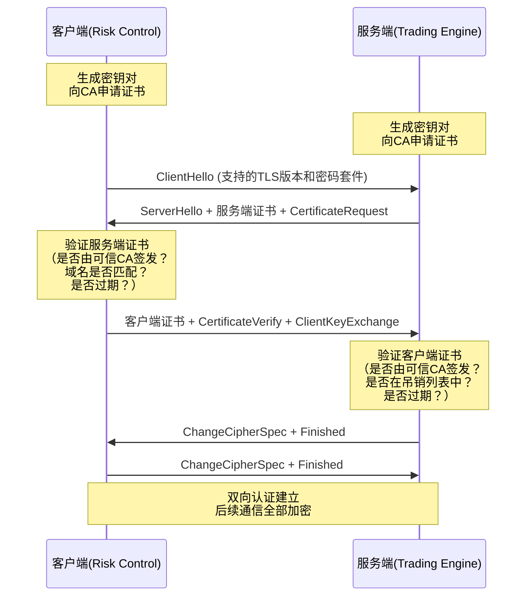
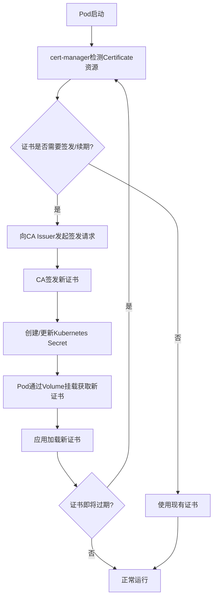
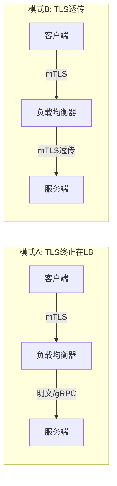
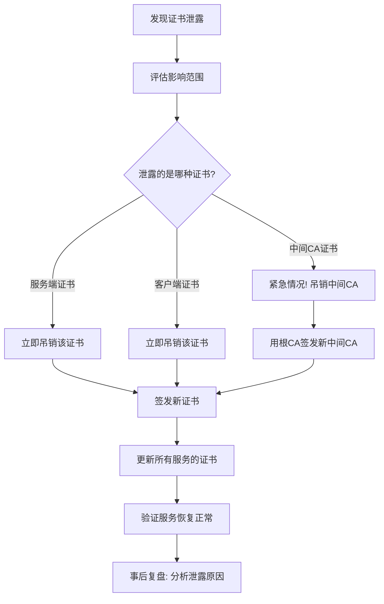

## 案例三：mTLS安全通信

### 1. 问题背景

#### 1.1 业务场景

某金融科技公司采用微服务架构，核心交易链路包含六个服务：网关服务（Gateway）、交易引擎（Trading Engine）、风控服务（Risk Control）、账户服务（Account Service）、清算服务（Settlement Service）和审计服务（Audit Service）。所有服务间通过gRPC通信，日均处理交易请求超过500万笔，峰值QPS达12000。

#### 1.2 安全需求

该公司通过了PCI DSS（支付卡行业数据安全标准）认证，对内部服务间通信有严格的安全合规要求：

- 所有服务间通信必须加密（防止数据在传输过程中被窃听）
- 服务端必须验证客户端身份（防止未授权服务发起交易请求）
- 客户端必须验证服务端身份（防止中间人攻击和钓鱼服务）
- 证书必须定期轮转（降低证书泄露后的风险窗口）
- 所有通信必须可审计（满足合规审查要求）

#### 1.3 当前问题

在实施mTLS之前，系统使用API Key认证，无加密传输：

```go
// ❌ 旧方案：仅使用API Key认证，无加密
conn, _ := grpc.Dial("trading-engine:50051", grpc.WithInsecure())

// 通过Metadata传递API Key
md := metadata.Pairs("x-api-key", "secret-key-123")
ctx := metadata.NewOutgoingContext(context.Background(), md)
resp, err := tradingClient.PlaceOrder(ctx, req)
```

这种方案存在严重安全隐患：

| 风险类型 | 具体表现 | 风险等级 |
|----------|----------|----------|
| 数据泄露 | API Key以明文传输，网络抓包可直接获取 | 严重 |
| 身份伪造 | 攻击者获取API Key后可冒充合法服务 | 严重 |
| 中间人攻击 | 未加密通信可被篡改和劫持 | 高 |
| 合规不达标 | PCI DSS要求所有支付数据传输必须加密 | 高 |
| 密钥管理困难 | API Key无自动轮转机制，泄露后难以快速响应 | 中 |
| 无法审计来源 | API Key无法区分具体哪个服务实例发起请求 | 中 |

### 2. mTLS原理回顾

#### 2.1 什么是mTLS

mTLS（Mutual TLS）是TLS协议的双向认证扩展。标准TLS只有服务端向客户端出示证书（单向认证），mTLS则要求双方都出示证书并互相验证。这意味着每个参与通信的服务既是TLS的服务端（接受连接时出示证书），也是TLS的客户端（发起连接时出示证书）。

#### 2.2 mTLS握手流程



关键步骤说明：

1. **ClientHello**：客户端发送支持的TLS版本、密码套件列表和随机数
2. **ServerHello + CertificateRequest**：服务端选择密码套件，发送自己的证书，并**主动请求**客户端证书（这是mTLS与标准TLS的关键区别）
3. **客户端验证服务端证书**：检查CA签名链、域名匹配（SAN）、有效期、吊销状态
4. **客户端发送证书**：客户端出示自己的证书，并用私钥签名（CertificateVerify）证明自己持有私钥
5. **服务端验证客户端证书**：同样检查CA签名链、有效期、吊销状态

#### 2.3 mTLS与标准TLS的关键差异

| 对比维度 | 标准TLS | mTLS |
|----------|---------|------|
| 认证方向 | 客户端验证服务端 | 双向验证 |
| 证书要求 | 仅服务端需要证书 | 双方都需要证书 |
| 身份验证 | 仅服务端身份 | 双方身份 |
| 适用场景 | 对外API、Web服务 | 内部微服务、金融交易 |
| 安全等级 | 中 | 高 |
| 吊销检查 | 通常不检查客户端 | 必须检查客户端证书吊销状态 |
| 性能开销 | 基准 | 约8%-20%额外开销 |

#### 2.4 mTLS在零信任架构中的位置

mTLS是零信任安全模型的核心组件之一。零信任的核心原则是"永不信任，始终验证"——即使在网络内部，每个请求都必须经过身份验证和授权。mTLS提供了：

- **身份层**：通过证书证明"你是谁"
- **传输层**：通过TLS加密保证"数据不被窃听"
- **认证层**：通过双向验证保证"双方都可信"

但mTLS不是万能的。它只解决传输安全和身份认证，不解决授权（"你能做什么"）和审计（"你做了什么"）。完整的零信任架构还需要：

┌─────────────────────────────────────────────────────────┐
│                    零信任安全架构                          │
├─────────────┬───────────────┬───────────────────────────┤
│  传输安全    │   身份认证     │   授权与审计              │
│  (mTLS)     │  (证书/SPIFFE) │  (JWT/RBAC/审计日志)      │
├─────────────┼───────────────┼───────────────────────────┤
│ 加密通信    │ 双向身份验证   │ 细粒度访问控制            │
│ 防窃听      │ 防冒充         │ 操作审计追踪              │
│ 防篡改      │ 自动轮转       │ 最小权限原则              │
└─────────────┴───────────────┴───────────────────────────┘

### 3. 证书基础设施搭建

#### 3.1 自建CA体系

对于内部微服务通信，通常使用自建CA（Certificate Authority）而非公共CA。原因有三：

- **速率限制**：Let's Encrypt等公共CA有严格的速率限制（每周50个证书/域名），不适合频繁轮转
- **域名隐私**：公共CA会将签发记录写入CT（Certificate Transparency）日志，暴露内部服务域名
- **签发策略**：自建CA可以完全控制证书的签发策略、有效期和吊销机制

#### 3.2 创建根CA

根CA是整个PKI体系的信任锚点，必须离线保管私钥。

```bash
#!/bin/bash
# 创建根CA目录结构
mkdir -p ca/{certs,crl,newcerts,private}
chmod 700 ca/private
touch ca/index.txt
echo 1000 > ca/serial

# 生成根CA私钥（RSA 4096位）
openssl genrsa -aes256 -out ca/private/ca.key.pem 4096
chmod 400 ca/private/ca.key.pem

# 创建根CA配置文件
cat > ca/openssl.cnf << 'EOF'
[ca]
default_ca = CA_default

[CA_default]
dir               = ./ca
certs             = $dir/certs
crl_dir           = $dir/crl
new_certs_dir     = $dir/newcerts
database          = $dir/index.txt
serial            = $dir/serial
RANDFILE          = $dir/private/.rand

private_key       = $dir/private/ca.key.pem
certificate       = $dir/certs/ca.cert.pem

crlnumber         = $dir/crlnumber
crl               = $dir/crl/ca.crl.pem
crl_extensions    = crl_ext
default_crl_days  = 30

default_md        = sha256
name_opt          = ca_default
cert_opt          = ca_default
default_days      = 375
preserve          = no
policy            = policy_strict

[policy_strict]
countryName             = match
stateOrProvinceName     = match
organizationName        = match
organizationalUnitName  = optional
commonName              = supplied
emailAddress            = optional

[req]
default_bits        = 4096
distinguished_name  = req_distinguished_name
string_mask         = utf8only
default_md          = sha256
x509_extensions     = v3_ca

[req_distinguished_name]
countryName                     = Country Name
stateOrProvinceName             = State
localityName                    = Locality
0.organizationName              = Organization
organizationalUnitName          = Organizational Unit
commonName                      = Common Name
emailAddress                    = Email

[v3_ca]
subjectKeyIdentifier = hash
authorityKeyIdentifier = keyid:always,issuer
basicConstraints = critical, CA:true
keyUsage = critical, digitalSignature, cRLSign, keyCertSign

[v3_intermediate_ca]
subjectKeyIdentifier = hash
authorityKeyIdentifier = keyid:always,issuer
basicConstraints = critical, CA:true, pathlen:0
keyUsage = critical, digitalSignature, cRLSign, keyCertSign

[server_cert]
basicConstraints = CA:FALSE
nsCertType = server
nsComment = "Internal Service Certificate"
subjectKeyIdentifier = hash
authorityKeyIdentifier = keyid,issuer:always
keyUsage = critical, digitalSignature, keyEncipherment
extendedKeyUsage = serverAuth
subjectAltName = @alt_names

[client_cert]
basicConstraints = CA:FALSE
nsCertType = client
nsComment = "Internal Service Client Certificate"
subjectKeyIdentifier = hash
authorityKeyIdentifier = keyid,issuer:always
keyUsage = critical, digitalSignature, keyEncipherment
extendedKeyUsage = clientAuth

[alt_names]
DNS.1 = trading-engine
DNS.2 = trading-engine.default.svc.cluster.local
DNS.3 = localhost
IP.1 = 127.0.0.1
EOF

# 生成根CA证书（有效期10年）
openssl req -config ca/openssl.cnf \
  -key ca/private/ca.key.pem \
  -new -x509 -days 3650 -sha256 \
  -extensions v3_ca \
  -out ca/certs/ca.cert.pem \
  -subj "/C=CN/ST=Beijing/O=MyCompany/OU=Infrastructure/CN=MyCompany Root CA"

chmod 444 ca/certs/ca.cert.pem

# 验证根CA证书
openssl x509 -noout -text -in ca/certs/ca.cert.pem
```

**安全要点**：根CA私钥应存放在离线的HSM（Hardware Security Module）或加密的USB设备中，仅在签发中间CA时使用。日常的证书签发由中间CA完成。

#### 3.3 创建中间CA

在生产环境中，应该使用中间CA来签发服务证书，而非直接使用根CA。这样即使中间CA泄露，根CA仍然安全——只需吊销中间CA并重新签发。

```bash
# 创建中间CA
mkdir -p intermediate/{certs,crl,csr,newcerts,private}
chmod 700 intermediate/private
touch intermediate/index.txt
echo 2000 > intermediate/serial

# 生成中间CA私钥
openssl genrsa -out intermediate/private/intermediate.key.pem 4096
chmod 400 intermediate/private/intermediate.key.pem

# 创建中间CA CSR
openssl req -config ca/openssl.cnf \
  -new -sha256 \
  -key intermediate/private/intermediate.key.pem \
  -out intermediate/csr/intermediate.csr.pem \
  -subj "/C=CN/ST=Beijing/O=MyCompany/OU=Infrastructure/CN=MyCompany Intermediate CA"

# 用根CA签发中间CA证书
openssl ca -config ca/openssl.cnf \
  -extensions v3_intermediate_ca \
  -days 1825 -notext -md sha256 \
  -in intermediate/csr/intermediate.csr.pem \
  -out intermediate/certs/intermediate.cert.pem

# 创建证书链文件
cat intermediate/certs/intermediate.cert.pem \
  > intermediate/certs/ca-chain.cert.pem

# 验证证书链
openssl verify -CAfile ca/certs/ca.cert.pem \
  intermediate/certs/intermediate.cert.pem
```

#### 3.4 为服务签发证书

```bash
# 签发服务端证书（以交易引擎为例）
# 生成服务私钥（2048位足够，ECDSA P-256更佳）
openssl genrsa -out intermediate/private/trading-engine.key.pem 2048

# 创建服务CSR
openssl req -config ca/openssl.cnf \
  -new -sha256 \
  -key intermediate/private/trading-engine.key.pem \
  -out intermediate/csr/trading-engine.csr.pem \
  -subj "/C=CN/ST=Beijing/O=MyCompany/OU=Trading/CN=trading-engine"

# 用中间CA签发服务证书（有效期90天，短有效期降低泄露风险）
openssl ca -config ca/openssl.cnf \
  -extensions server_cert \
  -days 90 -notext -md sha256 \
  -in intermediate/csr/trading-engine.csr.pem \
  -out intermediate/certs/trading-engine.cert.pem

# 签发客户端证书（用于其他服务连接交易引擎时使用）
openssl genrsa -out intermediate/private/trading-client.key.pem 2048

openssl req -config ca/openssl.cnf \
  -new -sha256 \
  -key intermediate/private/trading-client.key.pem \
  -out intermediate/csr/trading-client.csr.pem \
  -subj "/C=CN/ST=Beijing/O=MyCompany/OU=Trading/CN=trading-client"

openssl ca -config ca/openssl.cnf \
  -extensions client_cert \
  -days 90 -notext -md sha256 \
  -in intermediate/csr/trading-client.csr.pem \
  -out intermediate/certs/trading-client.cert.pem

# 验证服务证书
openssl verify -CAfile intermediate/certs/ca-chain.cert.pem \
  intermediate/certs/trading-engine.cert.pem
```

#### 3.5 ECDSA证书（性能优化推荐）

对于性能敏感的场景，推荐使用ECDSA（Elliptic Curve Digital Signature Algorithm）证书替代RSA证书。ECDSA P-256曲线的密钥更短（256位 vs 2048位），但安全性相当，握手速度提升约30%。

```bash
# 生成ECDSA P-256私钥
openssl ecparam -genkey -name prime256v1 | \
  openssl ec -out intermediate/private/trading-engine-ecdsa.key.pem

# 使用ECDSA密钥签发证书
openssl req -new -sha256 \
  -key intermediate/private/trading-engine-ecdsa.key.pem \
  -out intermediate/csr/trading-engine-ecdsa.csr.pem \
  -subj "/C=CN/ST=Beijing/O=MyCompany/OU=Trading/CN=trading-engine"

openssl ca -config ca/openssl.cnf \
  -extensions server_cert \
  -days 90 -notext -md sha256 \
  -in intermediate/csr/trading-engine-ecdsa.csr.pem \
  -out intermediate/certs/trading-engine-ecdsa.cert.pem
```

RSA vs ECDSA对比：

| 对比维度 | RSA-2048 | ECDSA P-256 |
|----------|----------|-------------|
| 密钥长度 | 2048位 | 256位 |
| 签名速度 | 基准 | 快约30% |
| 验签速度 | 基准 | 快约50% |
| 证书大小 | ~1.2KB | ~0.6KB |
| 安全强度 | ~112位 | ~128位 |
| 适用场景 | 通用 | 性能敏感场景 |

#### 3.6 最终目录结构

certs/
├── ca/
│   ├── certs/
│   │   └── ca.cert.pem              # 根CA证书
│   ├── crl/
│   │   └── ca.crl.pem               # 证书吊销列表
│   └── private/
│       └── ca.key.pem               # 根CA私钥（离线保管）
├── intermediate/
│   ├── certs/
│   │   ├── ca-chain.cert.pem        # 证书链（中间CA + 根CA）
│   │   ├── intermediate.cert.pem    # 中间CA证书
│   │   ├── trading-engine.cert.pem  # 服务端证书
│   │   └── trading-client.cert.pem  # 客户端证书
│   ├── csr/
│   ├── newcerts/
│   └── private/
│       ├── intermediate.key.pem     # 中间CA私钥
│       ├── trading-engine.key.pem   # 服务端私钥
│       └── trading-client.key.pem   # 客户端私钥
└── openssl.cnf                      # CA配置文件

### 4. 服务端mTLS实现

#### 4.1 gRPC服务端配置

```go
package main

import (
    "context"
    "crypto/tls"
    "crypto/x509"
    "fmt"
    "log"
    "net"
    "os"
    "time"

    "google.golang.org/grpc"
    "google.golang.org/grpc/credentials"
    "google.golang.org/grpc/health"
    healthpb "google.golang.org/grpc/health/grpc_health_v1"
    "google.golang.org/grpc/keepalive"
    "google.golang.org/grpc/peer"
)

// loadTLSCredentials 加载服务端TLS凭证
// 路径约定：/etc/certs/service/
//   ├── server.crt      服务端证书
//   ├── server.key       服务端私钥
//   └── ca.crt           CA证书链（用于验证客户端证书）
func loadTLSCredentials(certDir string) (credentials.TransportCredentials, error) {
    // 1. 加载服务端证书和私钥
    serverCert, err := tls.LoadX509KeyPair(
        certDir+"/server.crt",
        certDir+"/server.key",
    )
    if err != nil {
        return nil, fmt.Errorf("failed to load server certificate: %w", err)
    }

    // 2. 加载CA证书（用于验证客户端证书）
    caCert, err := os.ReadFile(certDir + "/ca.crt")
    if err != nil {
        return nil, fmt.Errorf("failed to read CA certificate: %w", err)
    }

    certPool := x509.NewCertPool()
    if !certPool.AppendCertsFromPEM(caCert) {
        return nil, fmt.Errorf("failed to parse CA certificate")
    }

    // 3. 配置TLS
    tlsConfig := &amp;tls.Config{
        Certificates: []tls.Certificate{serverCert},
        ClientAuth:   tls.RequireAndVerifyClientCert, // 要求客户端证书
        ClientCAs:    certPool,                        // 用于验证客户端证书的CA
        MinVersion:   tls.VersionTLS12,                // 最低TLS 1.2
        // 推荐的密码套件（排除不安全的算法）
        CipherSuites: []uint16{
            tls.TLS_ECDHE_ECDSA_WITH_AES_256_GCM_SHA384,
            tls.TLS_ECDHE_RSA_WITH_AES_256_GCM_SHA384,
            tls.TLS_ECDHE_ECDSA_WITH_CHACHA20_POLY1305,
            tls.TLS_ECDHE_RSA_WITH_CHACHA20_POLY1305,
            tls.TLS_ECDHE_ECDSA_WITH_AES_128_GCM_SHA256,
            tls.TLS_ECDHE_RSA_WITH_AES_128_GCM_SHA256,
        },
    }

    return credentials.NewTLS(tlsConfig), nil
}

func main() {
    // 加载TLS凭证
    creds, err := loadTLSCredentials("/etc/certs/trading-engine")
    if err != nil {
        log.Fatalf("Failed to load TLS credentials: %v", err)
    }

    // 创建gRPC服务器
    server := grpc.NewServer(
        grpc.Creds(creds),
        // 拦截器链
        grpc.ChainUnaryInterceptor(
            loggingInterceptor,
            recoveryInterceptor,
            authInterceptor,    // 基于证书的认证拦截器
        ),
        // 连接保活配置
        grpc.KeepaliveParams(keepalive.ServerParameters{
            MaxConnectionIdle:     15 * time.Minute,
            MaxConnectionAge:      30 * time.Minute,
            MaxConnectionAgeGrace: 5 * time.Minute,
            Time:                  5 * time.Minute,
            Timeout:               1 * time.Minute,
        }),
        // 最大并发流数
        grpc.MaxConcurrentStreams(1000),
    )

    // 注册健康检查
    healthpb.RegisterHealthServer(server, health.NewServer())

    // 监听端口
    lis, err := net.Listen("tcp", ":50051")
    if err != nil {
        log.Fatalf("Failed to listen: %v", err)
    }

    log.Println("Trading Engine gRPC server starting on :50051 (mTLS enabled)")
    if err := server.Serve(lis); err != nil {
        log.Fatalf("Failed to serve: %v", err)
    }
}
```

#### 4.2 关键配置说明

`ClientAuth` 字段是mTLS的核心配置，有以下选项：

| 配置值 | 含义 | 适用场景 |
|--------|------|----------|
| `NoClientCert` | 不要求客户端证书 | 标准TLS（对外API） |
| `RequestClientCert` | 请求客户端证书但不验证 | 渐进式迁移 |
| `RequireAnyClientCert` | 要求客户端证书但不验证内容 | 仅要求有证书 |
| `VerifyClientCertIfGiven` | 如果提供了证书则验证 | 混合模式 |
| `RequireAndVerifyClientCert` | 要求并验证客户端证书 | **mTLS（生产推荐）** |

密码套件选择原则：
- 仅使用AEAD（Authenticated Encryption with Associated Data）模式：GCM、Poly1305
- 仅使用ECDHE进行密钥交换（前向保密）
- 禁用CBC模式（易受Padding Oracle攻击）
- 禁用RC4、3DES等弱算法

#### 4.3 从客户端证书提取身份用于授权

mTLS解决了"你是谁"的问题，但服务端需要知道客户端具体是什么身份，才能做细粒度的访问控制。通过gRPC的`peer`包可以从连接中提取客户端证书信息：

```go
package interceptor

import (
    "context"
    "crypto/x509"
    "fmt"
    "log"

    "google.golang.org/grpc"
    "google.golang.org/grpc/codes"
    "google.golang.org/grpc/peer"
    "google.golang.org/grpc/status"
)

// certAuthInterceptor 基于客户端证书的认证拦截器
func certAuthInterceptor(
    ctx context.Context,
    req any,
    info *grpc.UnaryServerInfo,
    handler grpc.UnaryHandler,
) (any, error) {
    // 从上下文中提取对等方信息
    p, ok := peer.FromContext(ctx)
    if !ok {
        return nil, status.Error(codes.Unauthenticated, "no peer info")
    }

    // 类型断言为TLS对等方
    tlsInfo, ok := p.AuthInfo.(credentials.TLSInfo)
    if !ok {
        return nil, status.Error(codes.Unauthenticated, "no TLS info")
    }

    // 提取客户端证书
    if len(tlsInfo.State.PeerCertificates) == 0 {
        return nil, status.Error(codes.Unauthenticated, "no client certificate")
    }

    clientCert := tlsInfo.State.PeerCertificates[0]

    // 验证证书用途
    if err := verifyCertUsage(clientCert); err != nil {
        return nil, status.Error(codes.PermissionDenied, err.Error())
    }

    // 提取身份信息（CN或SAN中的URI）
    identity := extractIdentity(clientCert)
    log.Printf("[Auth] client identity: %s, CN: %s", identity, clientCert.Subject.CommonName)

    // 将身份信息注入上下文，供后续业务逻辑使用
    ctx = context.WithValue(ctx, "client_identity", identity)
    ctx = context.WithValue(ctx, "client_cert_serial", clientCert.SerialNumber.String())

    return handler(ctx, req)
}

// verifyCertUsage 验证证书的扩展用途
func verifyCertUsage(cert *x509.Certificate) error {
    // 检查证书是否包含客户端认证用途
    for _, usage := range cert.ExtKeyUsage {
        if usage == x509.ExtKeyUsageClientAuth {
            return nil
        }
    }
    return fmt.Errorf("certificate does not have clientAuth extended key usage")
}

// extractIdentity 从证书中提取服务身份
// 优先使用SAN URI（SPIFFE格式），其次使用CN
func extractIdentity(cert *x509.Certificate) string {
    // 优先检查SAN中的SPIFFE URI
    for _, uri := range cert.URIs {
        if uri.Scheme == "spiffe" {
            return uri.String()
        }
    }
    // 其次使用SAN DNS名称
    if len(cert.DNSNames) > 0 {
        return cert.DNSNames[0]
    }
    // 最后使用CN
    return cert.Subject.CommonName
}
```

#### 4.4 证书吊销状态检查

对于安全性要求高的场景，服务端应当在每次TLS握手时检查客户端证书是否已被吊销。gRPC通过自定义`VerifyPeerCertificate`回调实现：

```go
tlsConfig := &amp;tls.Config{
    Certificates: []tls.Certificate{serverCert},
    ClientAuth:   tls.RequireAndVerifyClientCert,
    ClientCAs:    certPool,
    // 自定义证书验证逻辑
    VerifyPeerCertificate: func(
        rawCerts [][]byte,
        verifiedChains [][]*x509.Certificate,
    ) error {
        // 遍历所有验证过的证书链
        for _, chain := range verifiedChains {
            if len(chain) == 0 {
                continue
            }
            clientCert := chain[0]

            // 检查证书是否在CRL吊销列表中
            if isRevoked(clientCert) {
                return fmt.Errorf(
                    "certificate revoked: serial=%s",
                    clientCert.SerialNumber.String(),
                )
            }
        }
        return nil
    },
}

// isRevoked 检查证书是否在CRL中
func isRevoked(cert *x509.Certificate) bool {
    // 实际生产中应从缓存中读取CRL
    // 并定期更新（如每小时）
    crlData, err := os.ReadFile("/etc/certs/crl/current.crl")
    if err != nil {
        log.Printf("[WARN] failed to load CRL: %v", err)
        return false // CRL加载失败时不阻止连接（根据安全策略决定）
    }

    crl, err := x509.ParseCRL(crlData)
    if err != nil {
        log.Printf("[WARN] failed to parse CRL: %v", err)
        return false
    }

    for _, revoked := range crl.TBSCertList.RevokedCertificates {
        if cert.SerialNumber.Cmp(revoked.SerialNumber) == 0 {
            return true
        }
    }
    return false
}
```

### 5. 客户端mTLS实现

#### 5.1 gRPC客户端配置

```go
package main

import (
    "context"
    "crypto/tls"
    "crypto/x509"
    "fmt"
    "os"
    "time"

    "google.golang.org/grpc"
    "google.golang.org/grpc/credentials"
    "google.golang.org/grpc/keepalive"
    pb "trading-engine/proto"
)

// loadClientTLSCredentials 加载客户端TLS凭证
func loadClientTLSCredentials(certDir string) (credentials.TransportCredentials, error) {
    // 1. 加载客户端证书和私钥
    clientCert, err := tls.LoadX509KeyPair(
        certDir+"/client.crt",
        certDir+"/client.key",
    )
    if err != nil {
        return nil, fmt.Errorf("failed to load client certificate: %w", err)
    }

    // 2. 加载CA证书（用于验证服务端证书）
    caCert, err := os.ReadFile(certDir + "/ca.crt")
    if err != nil {
        return nil, fmt.Errorf("failed to read CA certificate: %w", err)
    }

    certPool := x509.NewCertPool()
    if !certPool.AppendCertsFromPEM(caCert) {
        return nil, fmt.Errorf("failed to parse CA certificate")
    }

    // 3. 配置TLS
    tlsConfig := &amp;tls.Config{
        Certificates: []tls.Certificate{clientCert},
        RootCAs:      certPool,                          // 用于验证服务端证书的CA
        ServerName:   "trading-engine",                  // 服务端证书的CN/SAN
        MinVersion:   tls.VersionTLS12,
    }

    return credentials.NewTLS(tlsConfig), nil
}

// connectToTradingEngine 建立到交易引擎的安全连接
func connectToTradingEngine() (*grpc.ClientConn, error) {
    creds, err := loadClientTLSCredentials("/etc/certs/risk-control")
    if err != nil {
        return nil, fmt.Errorf("failed to load client TLS credentials: %w", err)
    }

    conn, err := grpc.Dial(
        "trading-engine:50051",
        grpc.WithTransportCredentials(creds),
        grpc.WithKeepaliveParams(keepalive.ClientParameters{
            Time:                10 * time.Second,
            Timeout:             3 * time.Second,
            PermitWithoutStream: true,
        }),
        // 默认负载均衡策略
        grpc.WithDefaultServiceConfig(`{"loadBalancingPolicy":"round_robin"}`),
    )
    if err != nil {
        return nil, fmt.Errorf("failed to dial: %w", err)
    }

    return conn, nil
}

// placeOrder 通过mTLS安全通道发起交易请求
func placeOrder(conn *grpc.ClientConn, req *pb.PlaceOrderRequest) (*pb.PlaceOrderResponse, error) {
    client := pb.NewTradingEngineClient(conn)

    // 设置请求超时
    ctx, cancel := context.WithTimeout(context.Background(), 5*time.Second)
    defer cancel()

    resp, err := client.PlaceOrder(ctx, req)
    if err != nil {
        return nil, fmt.Errorf("failed to place order: %w", err)
    }

    return resp, nil
}
```

#### 5.2 客户端连接池与复用

在高并发场景下，频繁创建和销毁TLS连接会产生大量握手开销。使用连接池复用已建立的mTLS连接：

```go
package mtls

import (
    "sync"
    "time"

    "google.golang.org/grpc"
    "google.golang.org/grpc/credentials"
    "google.golang.org/grpc/keepalive"
)

// ConnPool mTLS连接池
type ConnPool struct {
    mu      sync.RWMutex
    conns   map[string]*grpc.ClientConn
    creds   credentials.TransportCredentials
    maxIdle time.Duration
}

// NewConnPool 创建连接池
func NewConnPool(creds credentials.TransportCredentials) *ConnPool {
    pool := &amp;ConnPool{
        conns:   make(map[string]*grpc.ClientConn),
        creds:   creds,
        maxIdle: 5 * time.Minute,
    }
    // 启动清理过期连接的协程
    go pool.cleanup()
    return pool
}

// Get 获取或创建到目标地址的连接
func (p *ConnPool) Get(target string) (*grpc.ClientConn, error) {
    p.mu.RLock()
    conn, ok := p.conns[target]
    p.mu.RUnlock()

    if ok &amp;&amp; conn.GetState().String() != "SHUTDOWN" {
        return conn, nil
    }

    // 创建新连接
    p.mu.Lock()
    defer p.mu.Unlock()

    // 双重检查
    if conn, ok := p.conns[target]; ok &amp;&amp; conn.GetState().String() != "SHUTDOWN" {
        return conn, nil
    }

    newConn, err := grpc.Dial(
        target,
        grpc.WithTransportCredentials(p.creds),
        grpc.WithKeepaliveParams(keepalive.ClientParameters{
            Time:                10 * time.Second,
            Timeout:             3 * time.Second,
            PermitWithoutStream: true,
        }),
    )
    if err != nil {
        return nil, err
    }

    p.conns[target] = newConn
    return newConn, nil
}

// cleanup 定期清理空闲连接
func (p *ConnPool) cleanup() {
    ticker := time.NewTicker(p.maxIdle)
    defer ticker.Stop()

    for range ticker.C {
        p.mu.Lock()
        for target, conn := range p.conns {
            if conn.GetState().String() == "SHUTDOWN" {
                delete(p.conns, target)
            }
        }
        p.mu.Unlock()
    }
}

// Close 关闭所有连接
func (p *ConnPool) Close() {
    p.mu.Lock()
    defer p.mu.Unlock()
    for _, conn := range p.conns {
        conn.Close()
    }
    p.conns = make(map[string]*grpc.ClientConn)
}
```

### 6. 自动化证书管理

在大规模微服务环境中，手动管理证书是不现实的。本节介绍三种主流的自动化方案。

#### 6.1 方案一：Kubernetes + cert-manager

cert-manager是Kubernetes上最流行的证书管理控制器，可以自动签发和续期证书。

```yaml
# 1. 定义内部CA Issuer
apiVersion: cert-manager.io/v1
kind: ClusterIssuer
metadata:
  name: internal-ca-issuer
spec:
  ca:
    secretName: internal-ca-key-pair  # 包含CA证书和私钥的Secret
---
# 2. 为交易引擎自动签发证书
apiVersion: cert-manager.io/v1
kind: Certificate
metadata:
  name: trading-engine-tls
  namespace: trading
spec:
  # cert-manager会自动创建此Secret
  secretName: trading-engine-tls
  issuerRef:
    name: internal-ca-issuer
    kind: ClusterIssuer
  # 证书中的Subject Alternative Names
  dnsNames:
    - trading-engine                    # 服务名
    - trading-engine.trading.svc        # 全限定域名
    - trading-engine.trading.svc.cluster.local  # 集群内DNS
  ipAddresses:
    - 127.0.0.1
  # 证书有效期
  duration: 2160h   # 90天
  renewBefore: 720h  # 到期前30天自动续期
  # 证书用途
  usages:
    - server auth
    - client auth  # 同时支持服务端和客户端认证
  # 私钥配置
  privateKey:
    algorithm: ECDSA
    size: 256       # P-256曲线
    encoding: PKCS1
---
# 3. 服务Pod挂载证书
apiVersion: apps/v1
kind: Deployment
metadata:
  name: trading-engine
  namespace: trading
spec:
  replicas: 3
  selector:
    matchLabels:
      app: trading-engine
  template:
    metadata:
      labels:
        app: trading-engine
    spec:
      containers:
        - name: trading-engine
          image: myregistry/trading-engine:v1.0.0
          ports:
            - containerPort: 50051
          # 挂载证书Secret
          volumeMounts:
            - name: tls-certs
              mountPath: /etc/certs/trading-engine
              readOnly: true
          env:
            - name: TLS_CERT_DIR
              value: /etc/certs/trading-engine
      volumes:
        - name: tls-certs
          secret:
            secretName: trading-engine-tls
            # 映射Secret的key到文件名
            items:
              - key: tls.crt
                path: server.crt
              - key: tls.key
                path: server.key
              - key: ca.crt
                path: ca.crt
```

cert-manager的工作流程：



#### 6.2 方案二：HashiCorp Vault PKI

Vault提供了完整的PKI后端，适合需要更细粒度控制的场景：

```bash
# 启用Vault PKI后端
vault secrets enable pki

# 配置最大TTL
vault write pki/config/urls \
  issuing_certificates="http://vault:8200/v1/pki/ca" \
  crl_distribution_points="http://vault:8200/v1/pki/crl"

# 创建角色（限制可签发的证书类型）
vault write pki/roles/trading-engine \
  allowed_domains="trading-engine,trading.svc.cluster.local" \
  allow_subdomains=true \
  max_ttl=8760h \
  key_type=ec \
  key_bits=256 \
  key_usage="DigitalSignature,KeyEncipherment" \
  ext_key_usage="ServerAuth,ClientAuth"

# 签发证书
vault write pki/issue/trading-engine \
  common_name="trading-engine" \
  ttl=2160h

# 吊销证书
vault write pki/revoke serial_number="<证书序列号>"
```

#### 6.3 方案三：SPIRE（SPIFFE Runtime Environment）

对于非Kubernetes环境或需要跨集群、多云部署的场景，SPIRE是更合适的选择。SPIRE基于SPIFFE（Secure Production Identity Framework for Everyone）标准，提供短期、自动轮转的SVID（SPIFFE Verifiable Identity Document）。

```bash
# SPIRE Server配置
cat > spire-server.conf << 'EOF'
server {
    bind_address = "0.0.0.0:8081"
    bind_port = "8081"
    trust_domain = "mycompany.internal"
    data_dir = "/opt/spire/data"
    log_level = "INFO"
    ca_key_type = "ec-p256"
    default_x509_svid_ttl = "1h"
}

plugins {
    DataStore "sql" {
        plugin_data {
            database_type = "sqlite3"
            connection_string = "/opt/spire/data/datastore.sqlite3"
        }
    }
    NodeAttestor "join_token" {
        plugin_data {}
    }
    KeyManager "disk" {
        plugin_data {
            keys_path = "/opt/spire/data/keys.json"
        }
    }
}
EOF

# SPIRE Agent配置（部署在每个节点上）
cat > spire-agent.conf << 'EOF'
agent {
    server_address = "spire-server"
    server_port = "8081"
    socket_path = "/run/spire/sockets/agent.sock"
    trust_domain = "mycompany.internal"
    data_dir = "/opt/spire/data"
    log_level = "INFO"
}

plugins {
    NodeAttestor "join_token" {
        plugin_data {
            join_token = "your-join-token"
        }
    }
    WorkloadAttestor "k8s" {
        plugin_data {
            skip_kubelet_verification = false
        }
    }
    KeyManager "disk" {
        plugin_data {
            keys_path = "/opt/spire/data/agent_svid.key"
        }
    }
}
EOF

# 注册工作负载（让SPIRE知道哪些进程可以获得证书）
spire-server entry create \
  -spiffeID spiffe://mycompany.internal/service/trading-engine \
  -parentID spiffe://mycompany.internal/node/agent-1 \
  -selector k8s:pod-label:app:trading-engine \
  -selector k8s:ns:trading
```

#### 6.4 三种方案对比

| 对比维度 | cert-manager | Vault PKI | SPIRE |
|----------|-------------|-----------|-------|
| 运行环境 | 仅Kubernetes | 任意环境 | 任意环境 |
| 身份模型 | 基于Kubernetes资源 | 基于Vault策略 | 基于SPIFFE标准（SVID） |
| 证书轮转 | 自动（基于Certificate资源） | 自动（基于Vault租约） | 自动（默认1小时TTL） |
| 集成复杂度 | 低（Kubernetes原生） | 中（需要Vault运维） | 中（需要Server+Agent） |
| 跨集群支持 | 需要额外配置 | 原生支持 | 原生支持 |
| 细粒度控制 | 中 | 高（基于策略引擎） | 高（基于选择器） |
| 适用场景 | Kubernetes为主的微服务 | 需要密钥管理的场景 | 混合环境、多云部署 |

#### 6.5 方案选择决策树

你的服务运行在什么环境？
├── 仅Kubernetes → 使用 cert-manager
│   ├── 需要更细粒度控制？ → 集成 Vault PKI 作为 cert-manager 的 Issuer
│   └── 不需要 → 直接使用 cert-manager + 内部CA Issuer
├── 非Kubernetes / 混合环境 → 使用 SPIRE
│   ├── 需要密钥管理功能？ → SPIRE + Vault 集成
│   └── 不需要 → SPIRE 独立部署
└── 需要跨团队、跨部门的证书管理 → Vault PKI
    ├── 已有Vault实例？ → 直接启用PKI后端
    └── 没有 → 考虑部署Vault + SPIRE

### 7. 证书轮转与热加载

证书轮转是mTLS运维中最关键的环节。如果证书过期未续期，会导致所有服务间通信中断。某金融公司曾因证书过期导致全站交易中断2小时，直接经济损失超过500万元。

#### 7.1 证书热加载实现

```go
package mtls

import (
    "context"
    "crypto/tls"
    "crypto/x509"
    "fmt"
    "log"
    "os"
    "sync"
    "time"
)

// CertManager 证书热加载管理器
type CertManager struct {
    mu        sync.RWMutex
    certDir   string
    tlsConfig *tls.Config
    onChange   chan struct{}
    version   int64 // 证书版本号，用于跟踪变更
}

// NewCertManager 创建证书管理器
func NewCertManager(certDir string) *CertManager {
    cm := &amp;CertManager{
        certDir:  certDir,
        onChange:  make(chan struct{}, 1),
    }
    return cm
}

// Load 加载证书并返回TLS配置
func (cm *CertManager) Load() (*tls.Config, error) {
    cm.mu.Lock()
    defer cm.mu.Unlock()

    // 加载服务端证书
    serverCert, err := tls.LoadX509KeyPair(
        cm.certDir+"/server.crt",
        cm.certDir+"/server.key",
    )
    if err != nil {
        return nil, fmt.Errorf("load server cert: %w", err)
    }

    // 加载CA证书
    caCert, err := os.ReadFile(cm.certDir + "/ca.crt")
    if err != nil {
        return nil, fmt.Errorf("read CA cert: %w", err)
    }

    certPool := x509.NewCertPool()
    if !certPool.AppendCertsFromPEM(caCert) {
        return nil, fmt.Errorf("parse CA cert failed")
    }

    cm.tlsConfig = &amp;tls.Config{
        Certificates: []tls.Certificate{serverCert},
        ClientAuth:   tls.RequireAndVerifyClientCert,
        ClientCAs:    certPool,
        MinVersion:   tls.VersionTLS12,
    }

    cm.version++
    log.Printf("[CertManager] certificates loaded (version=%d)", cm.version)
    return cm.tlsConfig, nil
}

// GetConfig 获取当前的TLS配置（线程安全）
func (cm *CertManager) GetConfig() *tls.Config {
    cm.mu.RLock()
    defer cm.mu.RUnlock()
    return cm.tlsConfig
}

// Version 获取当前证书版本号
func (cm *CertManager) Version() int64 {
    cm.mu.RLock()
    defer cm.mu.RUnlock()
    return cm.version
}

// Watch 启动证书文件监控，自动热加载
// 注意：go 1.16+推荐使用 fsnotify 替代轮询
func (cm *CertManager) Watch(ctx context.Context) {
    ticker := time.NewTicker(1 * time.Hour) // 每小时检查一次
    defer ticker.Stop()

    var lastModTime time.Time

    // 获取初始修改时间
    if info, err := os.Stat(cm.certDir + "/server.crt"); err == nil {
        lastModTime = info.ModTime()
    }

    for {
        select {
        case <-ctx.Done():
            return
        case <-ticker.C:
            info, err := os.Stat(cm.certDir + "/server.crt")
            if err != nil {
                log.Printf("[CertManager] failed to stat cert file: %v", err)
                continue
            }

            if info.ModTime().After(lastModTime) {
                log.Printf("[CertManager] certificate file changed, reloading...")
                _, err := cm.Load()
                if err != nil {
                    log.Printf("[CertManager] failed to reload certificate: %v", err)
                    // 不更新lastModTime，下次重试
                    continue
                }
                lastModTime = info.ModTime()
                log.Printf("[CertManager] certificate reloaded successfully")

                // 通知监听者
                select {
                case cm.onChange <- struct{}{}:
                default:
                }
            }
        }
    }
}

// ExpiryCheck 检查证书是否即将过期
func (cm *CertManager) ExpiryCheck(ctx context.Context, alertDays []int) {
    ticker := time.NewTicker(1 * time.Hour)
    defer ticker.Stop()

    alerted := make(map[int]bool) // 已告警的天数

    for {
        select {
        case <-ctx.Done():
            return
        case <-ticker.C:
            cm.mu.RLock()
            config := cm.tlsConfig
            cm.mu.RUnlock()

            if config == nil || len(config.Certificates) == 0 {
                continue
            }

            // 解析服务端证书
            cert, err := x509.ParseCertificate(config.Certificates[0].Certificate[0])
            if err != nil {
                continue
            }

            daysRemaining := int(time.Until(cert.NotAfter).Hours() / 24)

            for _, days := range alertDays {
                if daysRemaining <= days &amp;&amp; !alerted[days] {
                    log.Printf("[CertManager] WARNING: certificate expires in %d days (before %d-day alert threshold)", daysRemaining, days)
                    // 实际生产中应发送告警（邮件/PagerDuty/Slack等）
                    alerted[days] = true
                }
            }

            // 证书已过期
            if daysRemaining <= 0 {
                log.Printf("[CertManager] CRITICAL: certificate has EXPIRED! Expiry: %s", cert.NotAfter)
            }
        }
    }
}
```

#### 7.2 使用文件通知（inotify）替代轮询

```go
// 使用fsnotify实现更高效的证书监控
import "github.com/fsnotify/fsnotify"

func (cm *CertManager) WatchWithFsnotify(ctx context.Context) error {
    watcher, err := fsnotify.NewWatcher()
    if err != nil {
        return fmt.Errorf("create watcher: %w", err)
    }
    defer watcher.Close()

    // 监控证书目录
    if err := watcher.Add(cm.certDir); err != nil {
        return fmt.Errorf("watch cert dir: %w", err)
    }

    // 防抖：cert-manager写入证书可能涉及多个文件
    debounceTimer := time.NewTimer(0)
    if !debounceTimer.Stop() {
        <-debounceTimer.C
    }

    for {
        select {
        case <-ctx.Done():
            return nil
        case event, ok := <-watcher.Events:
            if !ok {
                return nil
            }
            // 只关心写入和创建事件
            if event.Op&amp;(fsnotify.Write|fsnotify.Create) != 0 {
                log.Printf("[CertManager] file event: %s", event.Name)
                // 500ms防抖
                debounceTimer.Reset(500 * time.Millisecond)
            }
        case <-debounceTimer.C:
            log.Printf("[CertManager] reloading certificates...")
            if _, err := cm.Load(); err != nil {
                log.Printf("[CertManager] reload failed: %v", err)
            } else {
                log.Printf("[CertManager] reloaded successfully")
            }
        case err, ok := <-watcher.Errors:
            if !ok {
                return nil
            }
            log.Printf("[CertManager] watcher error: %v", err)
        }
    }
}
```

#### 7.3 证书轮转的最佳实践

证书轮转看似简单，但在生产环境中有很多陷阱：

| 陷阱 | 表现 | 解决方案 |
|------|------|----------|
| 新旧证书切换不平滑 | 部分实例使用旧证书，部分使用新证书 | 使用滚动更新，确保所有实例加载同一版本证书 |
| 证书文件写入不原子 | 应用读取到部分写入的证书文件 | 使用fsnotify防抖+WriteFile原子写入（先写临时文件再rename） |
| 轮转后连接不恢复 | 已建立的连接使用旧证书，新请求用新证书 | gRPC自动处理：新连接用新证书，旧连接在超时后断开 |
| 时钟偏移导致误判 | 某节点时钟快/慢，导致提前/延迟告警 | 使用NTP同步时钟，告警阈值留足余量 |
| 中间CA证书过期 | 所有服务证书验证失败 | 中间CA证书有效期设为5年，比服务证书长得多 |

### 8. 负载均衡器与L7代理的mTLS集成

在生产环境中，gRPC流量通常经过负载均衡器或L7代理（如Envoy、Nginx、HAProxy）。这些中间层对mTLS的处理方式不同，需要特别注意。

#### 8.1 两种mTLS终止模式



- **模式A（TLS终止）**：负载均衡器终止TLS连接，解密后以明文转发给后端服务。优点是后端无需处理TLS，缺点是LB成为安全边界，需要LB自身足够安全。
- **模式B（TLS透传）**：负载均衡器不终止TLS，直接将加密流量转发给后端服务。mTLS握手在客户端和后端服务之间完成，LB只做四层（TCP）转发。

#### 8.2 Envoy代理的mTLS配置

Envoy是Istio服务网格的数据面代理，原生支持mTLS：

```yaml
# Envoy Listener配置（TLS透传模式）
static_resources:
  listeners:
    - name: grpc_listener
      address:
        socket_address:
          address: 0.0.0.0
          port_value: 50051
      filter_chains:
        - transport_socket:
            name: envoy.transport_sockets.tls
            typed_config:
              "@type": type.googleapis.com/envoy.extensions.transport_sockets.tls.v3.DownstreamTlsContext
              require_client_certificate: true
              common_tls_context:
                tls_certificates:
                  - certificate_chain:
                      filename: /etc/envoy/certs/server.crt
                    private_key:
                      filename: /etc/envoy/certs/server.key
                validation_context:
                  trusted_ca:
                    filename: /etc/envoy/certs/ca.crt
          filters:
            - name: envoy.filters.network.http_connection_manager
              typed_config:
                "@type": type.googleapis.com/envoy.extensions.filters.network.http_connection_manager.v3.HttpConnectionManager
                stat_prefix: ingress_grpc
                codec_type: AUTO
                route_config:
                  virtual_hosts:
                    - name: backend
                      domains: ["*"]
                      routes:
                        - match:
                            prefix: /
                          route:
                            cluster: trading_engine
                http_filters:
                  - name: envoy.filters.http.router
                    typed_config:
                      "@type": type.googleapis.com/envoy.extensions.filters.http.router.v3.Router
  clusters:
    - name: trading_engine
      type: STRICT_DNS
      lb_policy: ROUND_ROBIN
      typed_extension_protocol_options:
        envoy.extensions.upstreams.http.v3.HttpProtocolOptions:
          "@type": type.googleapis.com/envoy.extensions.upstreams.http.v3.HttpProtocolOptions
          explicit_http_version_config:
            http2_protocol_options: {}
      load_assignment:
        cluster_name: trading_engine
        endpoints:
          - lb_endpoints:
              - endpoint:
                  address:
                    socket_address:
                      address: trading-engine
                      port_value: 50051
```

#### 8.3 Istio服务网格中的mTLS

在Istio中，sidecar代理（Envoy）自动处理mTLS，应用代码无需修改：

```yaml
# 启用PeerAuthentication策略（强制mTLS）
apiVersion: security.istio.io/v1beta1
kind: PeerAuthentication
metadata:
  name: default
  namespace: trading
spec:
  mtls:
    mode: STRICT  # STRICT: 强制mTLS; PERMISSIVE: 允许明文; DISABLE: 禁用mTLS
---
# AuthorizationPolicy：基于mTLS身份的访问控制
apiVersion: security.istio.io/v1beta1
kind: AuthorizationPolicy
metadata:
  name: trading-engine-policy
  namespace: trading
spec:
  selector:
    matchLabels:
      app: trading-engine
  rules:
    - from:
        - source:
            principals:
              - cluster.local/ns/trading/sa/risk-control
              - cluster.local/ns/trading/sa/account-service
      to:
        - operation:
            methods: ["POST"]
            paths: ["/trading.TradingEngine/PlaceOrder"]
```

### 9. 测试与验证

#### 9.1 使用openssl验证mTLS连接

```bash
# 1. 验证服务端证书
openssl s_client -connect trading-engine:50051 \
  -cert risk-control.crt \
  -key risk-control.key \
  -CAfile ca.crt \
  -verify 5

# 预期输出：
# Verify return code: 0 (ok)
# --- 
# SSL handshake has read XXXX bytes and written XXXX bytes
# Verification: OK

# 2. 测试无客户端证书的连接（应该被拒绝）
openssl s_client -connect trading-engine:50051 \
  -CAfile ca.crt

# 预期输出：
# error:XXXX:SSL routines:ssl3_get_client_certificate:certificate required

# 3. 测试使用错误证书的连接（应该被拒绝）
openssl s_client -connect trading-engine:50051 \
  -cert wrong-client.crt \
  -key wrong-client.key \
  -CAfile ca.crt

# 预期输出：
# Verify return code: 20 (unable to get local issuer certificate)

# 4. 检查协商的TLS版本和密码套件
openssl s_client -connect trading-engine:50051 \
  -cert risk-control.crt \
  -key risk-control.key \
  -CAfile ca.crt \
  -brief

# 预期输出：
# Protocol version: TLSv1.3
# Cipher: TLS_AES_256_GCM_SHA384
# Verify return code: 0 (ok)
```

#### 9.2 使用grpcurl测试

```bash
# 1. 列出服务方法（需要提供客户端证书）
grpcurl -cacert ca.crt \
  -cert risk-control.crt \
  -key risk-control.key \
  trading-engine:50051 \
  list

# 预期输出：
# grpc.health.v1.Health
# trading.TradingEngine

# 2. 调用RPC方法
grpcurl -cacert ca.crt \
  -cert risk-control.crt \
  -key risk-control.key \
  -d '{
    "symbol": "AAPL",
    "quantity": 100,
    "price": 150.50,
    "order_type": "LIMIT"
  }' \
  trading-engine:50051 \
  trading.TradingEngine/PlaceOrder

# 3. 测试无证书连接（应该失败）
grpcurl -insecure \
  trading-engine:50051 \
  list

# 预期输出：
# Error: desc = "transport: authentication handshake failed:
#   tls: client didn't provide a certificate"

# 4. 查看服务端证书详情
grpcurl -cacert ca.crt \
  -cert risk-control.crt \
  -key risk-control.key \
  -v trading-engine:50051 \
  list 2>&amp;1 | grep -A5 "Certificate"
```

#### 9.3 Go集成测试

```go
package mtls_test

import (
    "context"
    "crypto/ecdsa"
    "crypto/elliptic"
    "crypto/rand"
    "crypto/tls"
    "crypto/x509"
    "crypto/x509/pkix"
    "math/big"
    "net"
    "os"
    "testing"
    "time"

    "google.golang.org/grpc"
    "google.golang.org/grpc/codes"
    "google.golang.org/grpc/credentials"
    "google.golang.org/grpc/status"
    pb "trading-engine/proto"
)

// TestMTLSConnection 测试mTLS连接建立
func TestMTLSConnection(t *testing.T) {
    // 加载服务端TLS凭证
    serverCreds := loadServerCreds(t, "/test-certs/server")
    // 加载客户端TLS凭证
    clientCreds := loadClientCreds(t, "/test-certs/client")

    // 启动测试服务器
    lis, _ := net.Listen("tcp", "localhost:0")
    server := grpc.NewServer(grpc.Creds(serverCreds))
    // 注册服务实现...
    go server.Serve(lis)
    defer server.Stop()

    // 客户端连接（使用mTLS）
    conn, err := grpc.Dial(
        lis.Addr().String(),
        grpc.WithTransportCredentials(clientCreds),
        grpc.WithBlock(),
        grpc.WithTimeout(5*time.Second),
    )
    if err != nil {
        t.Fatalf("failed to dial: %v", err)
    }
    defer conn.Close()

    // 验证连接正常
    client := pb.NewTradingEngineClient(conn)
    ctx, cancel := context.WithTimeout(context.Background(), 3*time.Second)
    defer cancel()

    resp, err := client.GetQuote(ctx, &amp;pb.GetQuoteRequest{Symbol: "AAPL"})
    if err != nil {
        t.Fatalf("RPC failed: %v", err)
    }
    if resp.Symbol != "AAPL" {
        t.Errorf("expected AAPL, got %s", resp.Symbol)
    }
}

// TestMTLSRejectNoClientCert 测试拒绝无证书连接
func TestMTLSRejectNoClientCert(t *testing.T) {
    serverCreds := loadServerCreds(t, "/test-certs/server")

    lis, _ := net.Listen("tcp", "localhost:0")
    server := grpc.NewServer(grpc.Creds(serverCreds))
    go server.Serve(lis)
    defer server.Stop()

    // 使用不安全凭证连接（应该被拒绝）
    conn, err := grpc.Dial(
        lis.Addr().String(),
        grpc.WithInsecure(),
        grpc.WithBlock(),
        grpc.WithTimeout(3*time.Second),
    )
    if err == nil {
        conn.Close()
        t.Fatal("expected connection to fail, but it succeeded")
    }

    // 验证错误类型
    st, ok := status.FromError(err)
    if !ok {
        t.Fatalf("expected gRPC error, got: %v", err)
    }
    if st.Code() != codes.Unavailable {
        t.Errorf("expected Unavailable, got %s", st.Code())
    }
    t.Logf("correctly rejected connection: %v", err)
}

// TestMTLSRejectWrongCert 测试拒绝使用错误证书的连接
func TestMTLSRejectWrongCert(t *testing.T) {
    serverCreds := loadServerCreds(t, "/test-certs/server")
    // 使用不同的客户端证书（不属于信任的CA签发）
    wrongClientCreds := loadClientCreds(t, "/test-certs/wrong-client")

    lis, _ := net.Listen("tcp", "localhost:0")
    server := grpc.NewServer(grpc.Creds(serverCreds))
    go server.Serve(lis)
    defer server.Stop()

    conn, err := grpc.Dial(
        lis.Addr().String(),
        grpc.WithTransportCredentials(wrongClientCreds),
        grpc.WithBlock(),
        grpc.WithTimeout(3*time.Second),
    )
    if err == nil {
        conn.Close()
        t.Fatal("expected connection with wrong cert to fail")
    }
    t.Logf("correctly rejected wrong certificate: %v", err)
}

// TestCertRotation 测试证书轮转后连接恢复
func TestCertRotation(t *testing.T) {
    // 步骤1：使用旧证书启动服务器
    serverCreds := loadServerCreds(t, "/test-certs/server")
    lis, _ := net.Listen("tcp", "localhost:0")
    server := grpc.NewServer(grpc.Creds(serverCreds))
    go server.Serve(lis)

    // 步骤2：客户端连接成功
    clientCreds := loadClientCreds(t, "/test-certs/client")
    conn, err := grpc.Dial(
        lis.Addr().String(),
        grpc.WithTransportCredentials(clientCreds),
        grpc.WithBlock(),
        grpc.WithTimeout(3*time.Second),
    )
    if err != nil {
        t.Fatalf("initial dial failed: %v", err)
    }

    // 验证初始连接正常
    client := pb.NewTradingEngineClient(conn)
    ctx := context.Background()
    _, err = client.GetQuote(ctx, &amp;pb.GetQuoteRequest{Symbol: "AAPL"})
    if err != nil {
        t.Fatalf("initial RPC failed: %v", err)
    }
    t.Log("initial connection verified")

    // 步骤3：更新服务器证书（模拟轮转）
    // 实际测试中需要复制新证书到测试目录
    // t.Log("updating server certificate...")

    // 步骤4：等待热加载完成
    // time.Sleep(2 * time.Second)

    // 步骤5：验证新连接使用新证书
    // 新连接应使用轮转后的证书
    // newConn, err := grpc.Dial(...)

    // 步骤6：验证旧连接断开
    // 旧连接在MaxConnectionAge后应被主动关闭

    server.Stop()
    conn.Close()
    t.Log("cert rotation test completed (partial - requires cert file setup)")
}

// TestCertExpiryAlert 测试证书过期告警
func TestCertExpiryAlert(t *testing.T) {
    // 创建一个即将过期的证书用于测试
    caCert, caKey := generateTestCA(t)
    soonExpiringCert := generateTestCert(t, caCert, caKey, 1*time.Hour)

    certPool := x509.NewCertPool()
    certPool.AddCert(caCert)

    tlsConfig := &amp;tls.Config{
        Certificates: []tls.Certificate{soonExpiringCert},
        ClientAuth:   tls.RequireAndVerifyClientCert,
        ClientCAs:    certPool,
    }

    // 解析证书检查过期时间
    cert, err := x509.ParseCertificate(soonExpiringCert.Certificate[0])
    if err != nil {
        t.Fatalf("parse cert: %v", err)
    }

    daysRemaining := time.Until(cert.NotAfter).Hours() / 24
    if daysRemaining > 1 {
        t.Errorf("expected cert to expire within 1 day, got %.1f days", daysRemaining)
    }
    t.Logf("certificate expires in %.2f days (as expected for test)", daysRemaining)
    _ = tlsConfig
}

// 辅助函数
func loadServerCreds(t *testing.T, certDir string) credentials.TransportCredentials {
    t.Helper()
    cert, err := tls.LoadX509KeyPair(certDir+"/server.crt", certDir+"/server.key")
    if err != nil {
        t.Fatalf("load server cert: %v", err)
    }
    caCert, _ := os.ReadFile(certDir + "/ca.crt")
    pool := x509.NewCertPool()
    pool.AppendCertsFromPEM(caCert)
    return credentials.NewTLS(&amp;tls.Config{
        Certificates: []tls.Certificate{cert},
        ClientAuth:   tls.RequireAndVerifyClientCert,
        ClientCAs:    pool,
        MinVersion:   tls.VersionTLS12,
    })
}

func loadClientCreds(t *testing.T, certDir string) credentials.TransportCredentials {
    t.Helper()
    cert, err := tls.LoadX509KeyPair(certDir+"/client.crt", certDir+"/client.key")
    if err != nil {
        t.Fatalf("load client cert: %v", err)
    }
    caCert, _ := os.ReadFile(certDir + "/ca.crt")
    pool := x509.NewCertPool()
    pool.AppendCertsFromPEM(caCert)
    return credentials.NewTLS(&amp;tls.Config{
        Certificates: []tls.Certificate{cert},
        RootCAs:      pool,
        ServerName:   "trading-engine",
        MinVersion:   tls.VersionTLS12,
    })
}

// generateTestCA 生成测试用CA证书
func generateTestCA(t *testing.T) (*x509.Certificate, *ecdsa.PrivateKey) {
    t.Helper()
    key, _ := ecdsa.GenerateKey(elliptic.P256(), rand.Reader)
    template := &amp;x509.Certificate{
        SerialNumber: big.NewInt(1),
        Subject:      pkix.Name{Organization: []string{"Test CA"}},
        NotBefore:    time.Now(),
        NotAfter:     time.Now().Add(24 * time.Hour),
        KeyUsage:     x509.KeyUsageCertSign | x509.KeyUsageCRLSign,
        IsCA:         true,
    }
    certDER, _ := x509.CreateCertificate(rand.Reader, template, template, &amp;key.PublicKey, key)
    cert, _ := x509.ParseCertificate(certDER)
    return cert, key
}

// generateTestCert 生成测试用服务证书
func generateTestCert(t *testing.T, caCert *x509.Certificate, caKey *ecdsa.PrivateKey, validity time.Duration) tls.Certificate {
    t.Helper()
    key, _ := ecdsa.GenerateKey(elliptic.P256(), rand.Reader)
    template := &amp;x509.Certificate{
        SerialNumber: big.NewInt(2),
        Subject:      pkix.Name{CommonName: "test-server"},
        NotBefore:    time.Now(),
        NotAfter:     time.Now().Add(validity),
        KeyUsage:     x509.KeyUsageDigitalSignature,
        ExtKeyUsage:  []x509.ExtKeyUsage{x509.ExtKeyUsageServerAuth},
    }
    certDER, _ := x509.CreateCertificate(rand.Reader, template, caCert, &amp;key.PublicKey, caKey)
    return tls.Certificate{Certificate: [][]byte{certDER}, PrivateKey: key}
}
```

### 10. 性能影响评估

mTLS引入了额外的握手开销和加密计算。在高并发场景下，需要评估其对性能的影响。

#### 10.1 基准测试方法

```bash
# 使用ghz进行基准测试
# 对比明文连接和mTLS连接的性能差异

# 明文连接（基准）
ghz --insecure --proto trading.proto \
  --call trading.TradingEngine.GetQuote \
  -d '{"symbol": "AAPL"}' \
  -c 100 -n 100000 \
  trading-engine:50051

# mTLS连接
ghz --cacert ca.crt --cert client.crt --key client.key \
  --proto trading.proto \
  --call trading.TradingEngine.GetQuote \
  -d '{"symbol": "AAPL"}' \
  -c 100 -n 100000 \
  trading-engine:50051

# 也可使用hey进行对比
# 明文
hey -n 100000 -c 100 -z 30s -disable-keepalive \
  -m POST -d '{"symbol":"AAPL"}' \
  -T "application/grpc+proto" \
  http://trading-engine:50051/trading.TradingEngine/GetQuote

# mTLS
hey -n 100000 -c 100 -z 30s -disable-keepalive \
  -m POST -d '{"symbol":"AAPL"}' \
  -T "application/grpc+proto" \
  --ca-cert ca.crt --cert client.crt --key client.key \
  https://trading-engine:50051/trading.TradingEngine/GetQuote
```

#### 10.2 实测数据

某金融公司的实测数据（基于4核8G云服务器）：

| 指标 | 明文连接 | mTLS连接 | 性能损耗 |
|------|---------|---------|----------|
| QPS | 42,000 | 38,500 | ~8% |
| 平均延迟 | 2.3ms | 2.6ms | ~13% |
| P99延迟 | 8.5ms | 10.2ms | ~20% |
| CPU使用率（峰值） | 65% | 72% | ~7% |
| 内存使用 | 128MB | 135MB | ~5% |
| 首次连接延迟 | N/A | +15ms | 握手开销 |

结论：mTLS在高并发场景下的性能损耗约8%-20%，在绝大多数业务场景下可以接受。

#### 10.3 性能优化手段

```go
// 优化1：使用ECDSA证书 + TLS会话票据
tlsConfig := &amp;tls.Config{
    Certificates: []tls.Certificate{serverCert},
    ClientAuth:   tls.RequireAndVerifyClientCert,
    ClientCAs:    certPool,
    // 启用TLS会话票据（减少后续握手开销）
    SessionTicketsDisabled: false,
    // 注意：mTLS场景下会话票据的复用受限于客户端证书
    // 因为客户端证书是每次握手都需要验证的
}

// 优化2：HTTP/2连接复用（gRPC默认使用HTTP/2）
// gRPC天然支持HTTP/2多路复用，单个TCP连接可并发多个RPC调用
// 合理配置MaxConcurrentStreams避免单连接瓶颈
server := grpc.NewServer(
    grpc.Creds(creds),
    grpc.MaxConcurrentStreams(1000), // 最大并发流数
)

// 优化3：连接保活配置
// 通过Keepalive保持长连接，减少握手次数
grpc.KeepaliveParams(keepalive.ServerParameters{
    MaxConnectionIdle:     15 * time.Minute, // 空闲连接最大存活时间
    MaxConnectionAge:      30 * time.Minute, // 连接最大存活时间
    MaxConnectionAgeGrace: 5 * time.Minute,  // 强制关闭前的宽限期
    Time:                  5 * time.Minute,  // 发送keepalive探测的间隔
    Timeout:               1 * time.Minute,  // keepalive探测超时
})
```

各优化手段的效果：

| 优化手段 | 适用场景 | 性能提升 |
|----------|----------|----------|
| ECDSA证书替代RSA | 所有场景 | 握手速度+30% |
| HTTP/2连接复用 | 所有gRPC场景 | 减少握手次数90%+ |
| Keepalive保活 | 长连接场景 | 减少重连开销 |
| TLS会话票据 | 非mTLS场景 | 握手速度+50% |
| 合理配置MaxConcurrentStreams | 高并发场景 | 提升吞吐量 |

### 11. 紧急证书吊销

当发现证书泄露或私钥被窃取时，需要立即吊销相关证书。以下是完整的应急响应流程。

#### 11.1 应急响应流程



#### 11.2 证书吊销操作

```bash
# 1. 吊销服务端证书
openssl ca -config ca/openssl.cnf \
  -revoke intermediate/certs/trading-engine.cert.pem \
  -crl_reason keyCompromise

# 2. 更新CRL（证书吊销列表）
openssl ca -config ca/openssl.cnf \
  -gencrl -out intermediate/crl/intermediate.crl.pem

# 3. 验证CRL内容
openssl crl -in intermediate/crl/intermediate.crl.pem -noout -text

# 4. 分发CRL到所有服务节点
scp intermediate/crl/intermediate.crl.pem \
  node1:/etc/certs/crl/current.crl
scp intermediate/crl/intermediate.crl.pem \
  node2:/etc/certs/crl/current.crl

# 5. 签发新证书
# （与正常签发流程相同，但建议使用新的密钥对）
openssl ecparam -genkey -name prime256v1 | \
  openssl ec -out intermediate/private/trading-engine-new.key.pem

openssl req -new -sha256 \
  -key intermediate/private/trading-engine-new.key.pem \
  -out intermediate/csr/trading-engine-new.csr.pem \
  -subj "/C=CN/ST=Beijing/O=MyCompany/OU=Trading/CN=trading-engine"

openssl ca -config ca/openssl.cnf \
  -extensions server_cert \
  -days 90 -notext -md sha256 \
  -in intermediate/csr/trading-engine-new.csr.pem \
  -out intermediate/certs/trading-engine-new.cert.pem
```

#### 11.3 OCSP装订（生产环境推荐）

CRL的缺点是需要定期下载整个吊销列表，可能导致延迟。OCSP（Online Certificate Status Protocol）装订允许服务端主动查询证书状态并将结果附在TLS握手中，客户端无需单独查询：

```go
// 在TLS配置中启用OCSP装订
tlsConfig := &amp;tls.Config{
    Certificates: []tls.Certificate{serverCert},
    ClientAuth:   tls.RequireAndVerifyClientCert,
    ClientCAs:    certPool,
    // OCSP装订：客户端会缓存OCSP响应
    // 服务端在握手时附带最新的OCSP响应
}

// 查看服务端是否支持OCSP装订
// openssl s_client -connect trading-engine:50051 -status
// 如果看到 "OCSP response: no response sent"，说明服务端未配置OCSP
```

### 12. 常见问题与排查

#### 12.1 证书验证失败

```bash
# 问题1：x509: certificate signed by unknown authority
# 原因：客户端不信任签发服务端证书的CA
# 排查：
openssl verify -CAfile ca.crt server.crt

# 问题2：x509: cannot validate certificate for IP without any SAN IP addresses
# 原因：证书的SAN中没有包含IP地址
# 排查：
openssl x509 -in server.crt -noout -text | grep -A1 "Subject Alternative Name"

# 问题3：tls: client didn't provide a certificate
# 原因：客户端没有提供证书，或证书不在CA信任链中
# 排查：
openssl s_client -connect server:50051 -cert client.crt -key client.key -CAfile ca.crt

# 问题4：x509: certificate has expired or is not yet valid
# 原因：证书过期或尚未生效（检查系统时钟）
# 排查：
openssl x509 -in server.crt -noout -dates
date  # 检查系统时间

# 问题5：tls: handshake failure
# 原因：TLS版本或密码套件不匹配
# 排查：
openssl s_client -connect server:50051 -tls1_2  # 测试TLS 1.2
openssl s_client -connect server:50051 -tls1_3  # 测试TLS 1.3
```

#### 12.2 常见错误速查表

| 错误信息 | 原因 | 解决方案 |
|----------|------|----------|
| `certificate signed by unknown authority` | CA证书不在信任链中 | 确保客户端加载了正确的CA证书；检查证书链是否包含中间CA |
| `certificate has expired or is not yet valid` | 证书过期或尚未生效 | 检查系统时间；更新证书；检查cert-manager日志 |
| `remote error: tls: bad certificate` | 客户端证书无效 | 检查证书是否由服务端CA签发；检查证书是否已吊销 |
| `tls: handshake failure` | TLS版本或密码套件不匹配 | 检查MinVersion和CipherSuites配置；确保双方支持相同版本 |
| `connection reset by peer` | 网络层问题 | 检查防火墙规则、端口可达性；检查服务是否在监听 |
| `x509: certificate signed by unknown authority` | 中间CA证书缺失 | 确保证书链包含完整的中间CA；cat中间CA和根CA到chain文件 |
| `tls: bad certificate cert` | 证书过期 | 检查证书有效期；触发证书轮转 |
| `transport is closing` | 连接已关闭 | 检查MaxConnectionAge配置；检查Keepalive参数 |

#### 12.3 运维排查命令

```bash
# 查看证书详细信息
openssl x509 -in server.crt -noout -text

# 查看证书有效期
openssl x509 -in server.crt -noout -dates

# 查看证书链
openssl s_client -connect trading-engine:50051 -showcerts

# 查看服务端支持的TLS版本
openssl s_client -connect trading-engine:50051 -tls1_2
openssl s_client -connect trading-engine:50051 -tls1_3

# 检查证书吊销状态（如果配置了CRL）
openssl verify -crl_check -CAfile ca.crt -CRLfile crl.pem server.crt

# 检查OCSP（如果配置了OCSP）
openssl s_client -connect trading-engine:50051 -status

# 查看gRPC服务端的TLS信息（使用grpcurl）
grpcurl -v -cacert ca.crt -cert client.crt -key client.key \
  trading-engine:50051 list

# 检查证书的SAN信息
openssl x509 -in server.crt -noout -ext subjectAltName

# 验证完整的证书链
openssl verify -CAfile ca.crt -untrusted intermediate.crt server.crt
```

### 13. 经验总结

#### 13.1 核心原则

1. **安全优先**：即使在内网环境，也应该使用mTLS加密所有服务间通信。内网不等于安全——内部网络也可能被攻击（如2020年SolarWinds供应链攻击事件）。

2. **自动化是关键**：手动管理证书在小规模环境可行，但在大规模微服务系统中必须使用cert-manager或SPIRE等自动化工具。根据Ponemon Institute的研究，证书过期导致的服务中断比证书泄露更常见。

3. **证书链完整性**：确保客户端和服务端都加载了完整的证书链（包括中间CA证书）。很多"证书验证失败"的问题都是因为证书链不完整。

4. **热加载不可少**：证书轮转时不能重启服务。实现证书热加载机制，确保轮转过程中服务不中断。

5. **监控告警**：对证书过期时间设置告警（如到期前30天、7天、1天），避免因证书过期导致的服务不可用。

6. **性能可接受**：mTLS的性能损耗在8%-20%之间，对于绝大多数业务场景是可以接受的。如果对性能极度敏感，可以使用ECDSA证书和TLS会话复用优化。

7. **分层防御**：mTLS提供传输层安全，但不应作为唯一的安全措施。在应用层仍然需要JWT Token认证、请求签名、限流等纵深防御措施。

#### 13.2 常见误区

| 误区 | 正确做法 |
|------|----------|
| "内网不需要加密" | 内网同样需要mTLS，横向移动是攻击者常用手段 |
| "证书有效期越长越安全" | 短有效期（90天）+ 自动轮转才是最佳实践 |
| "自建CA不安全" | 自建CA配合HSM和严格的访问控制，安全性不亚于公共CA |
| "mTLS能防止所有攻击" | mTLS只解决传输安全和身份认证，不解决授权和审计 |
| "证书过期前再处理" | 必须建立自动化轮转机制，不能依赖人工 |
| "所有服务用同一个证书" | 每个服务应该有独立的证书，便于隔离和吊销 |

#### 13.3 实施检查清单

在部署mTLS之前，使用以下检查清单确保覆盖所有关键环节：

- [ ] CA基础设施已搭建（根CA离线，中间CA在线）
- [ ] 所有服务已签发独立的服务端证书和客户端证书
- [ ] 证书SAN包含了所有必要的DNS名称和IP地址
- [ ] TLS版本最低设置为1.2（推荐1.3）
- [ ] 密码套件仅使用AEAD模式（GCM/Poly1305）
- [ ] 证书自动轮转机制已配置（cert-manager/Vault/SPIRE）
- [ ] 证书热加载已实现（fsnotify或定时轮询）
- [ ] 证书过期告警已配置（30天/7天/1天）
- [ ] 证书吊销流程已制定并演练过
- [ ] 性能基准测试已通过（mTLS损耗<20%）
- [ ] 集成测试覆盖正常连接、无证书拒绝、错误证书拒绝
- [ ] 负载均衡器/L7代理的mTLS配置已验证
- [ ] 运维文档已编写（排查命令、常见错误速查表）
