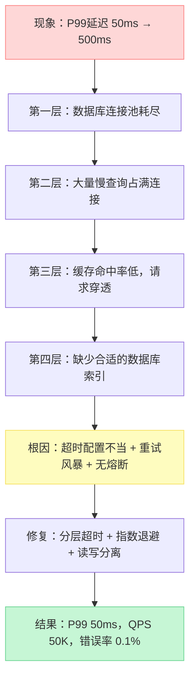
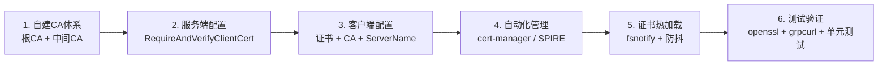
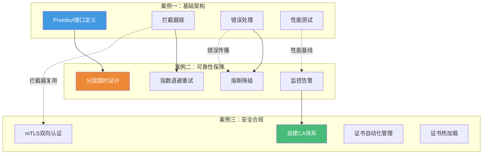

# 实战案例：从理论到生产的关键跨越

## 本节定位

经过前十节的理论学习和核心技巧训练，你已经掌握了RPC框架的原理、IDL定义、框架选型、四种通信模式、拦截器、错误处理、超时重试和健康检查。但知识的价值在于应用——本节通过三个由浅入深的真实场景案例，将散落的知识点串联成完整的工程实践能力。

这三个案例不是孤立的代码片段，而是一条清晰的成长路径：从"能用"到"可靠"再到"安全"，覆盖了RPC框架在生产环境中必须面对的三个核心挑战。

## 案例全景图


| 案例 | 核心主题 | 难度 | 涉及的前序知识 | 预期学习成果 |
|------|---------|------|---------------|-------------|
| 案例一 | 构建生产级gRPC用户服务 | ⭐⭐ | Protobuf IDL、Unary/Streaming模式、拦截器、错误处理 | 能独立设计并实现一个具备完整工程要素的gRPC微服务 |
| 案例二 | 超时与重试导致的级联故障 | ⭐⭐⭐ | 超时策略、重试机制、熔断降级、监控告警 | 能识别和修复因配置不当引发的分布式系统雪崩 |
| 案例三 | mTLS安全通信 | ⭐⭐⭐⭐ | TLS原理、证书管理、服务间认证 | 能从零搭建并运维一套生产级mTLS双向认证体系 |

## 案例一：构建生产级gRPC用户服务

**场景概述**：某电商平台需要构建用户服务，要求支持高并发查询（QPS > 10,000）、流式数据导出、完善的错误处理和监控。这不是一个简单的CRUD接口，而是一个真正经得起生产考验的微服务。

**核心挑战**：
- 如何设计Protobuf接口以支撑多种通信模式（Unary查询 + Server Streaming导出 + Client Streaming批量导入）
- 如何实现缓存层（Redis）与数据库层的协同，避免缓存穿透和雪崩
- 如何配置拦截器链实现统一的恢复、日志和监控
- 如何使用grpcurl和ghz进行功能验证和性能压测

**涵盖的知识点**：

| 知识点 | 对应章节 | 本案例中的应用 |
|--------|---------|---------------|
| Protobuf IDL定义 | 第二节 | UserService接口、User消息体、多模式RPC定义 |
| gRPC四种通信模式 | 第五节 | GetUser（Unary）、SearchUsers（Server Streaming）、BatchCreate（Client Streaming） |
| 拦截器配置 | 第六节 | recoveryInterceptor、loggingInterceptor、metricsInterceptor的链式组合 |
| 错误处理 | 第七节 | status.Errorf(codes.NotFound, ...)的规范使用 |
| 健康检查 | 第九节 | gRPC Health Protocol集成 |
| 性能测试 | — | ghz压测：42,735 QPS，P99 < 50ms |

**关键代码片段**（完整实现见详细页面）：

```protobuf
// 服务定义：三种通信模式覆盖核心场景
service UserService {
    rpc GetUser(GetUserRequest) returns (GetUserResponse);           // Unary
    rpc SearchUsers(SearchRequest) returns (stream User);            // Server Streaming
    rpc BatchCreate(stream CreateRequest) returns (BatchResponse);   // Client Streaming
}
```

```go
// 拦截器链配置：恢复 → 日志 → 监控，顺序不可随意调换
server := grpc.NewServer(
    grpc.ChainUnaryInterceptor(
        recoveryInterceptor,    // 最外层：捕获panic，防止单个请求拖垮服务
        loggingInterceptor,     // 中间层：记录请求日志（恢复后记录才有意义）
        metricsInterceptor,     // 最内层：最接近业务逻辑，延迟最准确
    ),
    grpc.MaxConcurrentStreams(1000),
)
```

**学习目标**：读完本案例后，你应该能够独立搭建一个生产级的gRPC微服务，包括接口设计、服务实现、拦截器配置、缓存策略和性能验证。

## 案例二：超时与重试导致的级联故障

**场景概述**：某电商平台在大促预热期间，系统出现严重性能下降——接口响应时间从50ms飙升到500ms，部分请求超时，CPU持续90%以上，数据库连接池耗尽。影响约100万用户，持续30分钟，损失数十万元。

**这是一个典型的"看起来是性能问题，根因是架构问题"的案例**。

**问题本质的层层剥离**：



**排查路径**（从表象到根因的四步法）：

| 步骤 | 排查手段 | 发现的问题 | 对应工具 |
|------|---------|-----------|---------|
| 第一步：系统层 | uptime、top、free、iostat | CPU 95%、IO 98%、内存85% | 系统监控命令 |
| 第二步：应用层 | jstack、GC日志、应用日志 | 大量线程BLOCKED，GC频繁 | jstack、tail -f |
| 第三步：数据库层 | SHOW PROCESSLIST、EXPLAIN | 全表扫描、锁等待 | MySQL诊断SQL |
| 第四步：架构层 | 调用链分析、配置审计 | 超时过长、盲目重试、无熔断 | 分布式追踪 |

**三大修复方案**：

1. **数据库索引优化**：添加复合索引 `idx_user_status` 和覆盖索引 `idx_user_time`，消除全表扫描
2. **连接池调参**：HikariCP maximum-pool-size 从默认10调到50，idle-timeout 10分钟
3. **多级缓存**：L1本地缓存 → L2 Redis → 数据库，三层防线减少穿透

**性能对比**：

| 指标 | 优化前 | 优化后 | 提升幅度 |
|------|-------|--------|---------|
| P99延迟 | 500ms | 50ms | 降低90% |
| QPS | 5,000 | 50,000 | 提升10倍 |
| 错误率 | 5% | 0.1% | 降低98% |

**学习目标**：掌握分布式系统故障的排查方法论，理解超时/重试/熔断三者如何协同工作，能够预判并预防级联故障。

## 案例三：mTLS安全通信

**场景概述**：某金融科技公司（通过PCI DSS认证）的微服务交易链路包含6个服务，日均处理500万笔交易，峰值QPS 12,000。原有方案仅使用API Key认证+明文传输，存在数据泄露、身份伪造、中间人攻击等严重安全风险。

**安全需求的五个维度**：

| 需求 | 具体要求 | PCI DSS条款 |
|------|---------|------------|
| 传输加密 | 所有服务间通信必须TLS加密 | Req 4: 加密传输持卡人数据 |
| 服务端认证 | 客户端验证服务端身份 | Req 2: 使用安全的系统配置 |
| 客户端认证 | 服务端验证客户端身份 | Req 7: 按业务需要限制访问 |
| 证书轮转 | 定期自动更换证书 | Req 6: 定期更新安全系统 |
| 审计追溯 | 所有通信可审计 | Req 10: 跟踪所有网络访问 |

**从零搭建mTLS的完整路径**：



**证书体系架构**：

根CA（RSA 4096位，有效期10年，离线保管）
├── 中间CA（RSA 4096位，有效期5年）
│   ├── trading-engine 服务端证书（ECDSA P-256，90天）
│   ├── risk-control 服务端证书（ECDSA P-256，90天）
│   ├── trading-client 客户端证书（ECDSA P-256，90天）
│   └── ... 其他服务证书

**两种自动化证书管理方案对比**：

| 维度 | cert-manager | SPIRE |
|------|-------------|-------|
| 运行环境 | 仅Kubernetes | 任意环境 |
| 身份模型 | 基于K8s资源 | 基于SPIFFE SVID标准 |
| 证书轮转 | 自动（基于Certificate资源） | 自动（基于工作负载注册） |
| 集成复杂度 | 低 | 中 |
| 跨集群支持 | 需额外配置 | 原生支持 |
| 适用场景 | K8s为主的微服务 | 混合环境、多云部署 |

**关键配置：ClientAuth五种模式**：

| 模式 | 含义 | 适用场景 |
|------|------|---------|
| `NoClientCert` | 不要求客户端证书 | 标准TLS（对外API） |
| `RequestClientCert` | 请求但不验证 | 渐进式迁移 |
| `RequireAnyClientCert` | 要求但不验证内容 | 仅要求有证书 |
| `VerifyClientCertIfGiven` | 提供则验证 | 混合模式 |
| **`RequireAndVerifyClientCert`** | **要求并验证** | **mTLS生产推荐** |

**学习目标**：掌握从自建CA到自动化证书管理的完整流程，理解证书热加载的实现原理，能够搭建符合PCI DSS等合规要求的安全通信体系。

## 案例间的知识关联

三个案例不是割裂的独立场景，而是在一个统一的电商平台业务背景下逐步深入：



- 案例一的拦截器链（recovery → logging → metrics）在案例二的故障排查中发挥了关键作用——没有metrics拦截器，就无法快速定位延迟飙升的环节
- 案例二的超时重试经验在案例三的安全通信中同样适用——mTLS握手本身也有超时要求，证书轮转失败也需要重试策略
- 案例三的证书管理是案例一"生产级"定义的必要补充——没有安全通信的微服务，不能称之为"生产级"

## 阅读建议

| 你的背景 | 推荐路径 | 预计时间 |
|---------|---------|---------|
| 初学者（刚学完核心技巧） | 按顺序阅读案例一 → 案例二 → 案例三 | 2-3小时 |
| 有经验的开发者 | 快速浏览案例一，重点阅读案例二和案例三 | 1-2小时 |
| 架构师/安全工程师 | 直接阅读案例三，按需参考案例二 | 1小时 |
| 故障排查学习 | 重点阅读案例二的排查过程和修复方案 | 30分钟 |

## 实践建议

读完案例后，建议按以下步骤动手实践：

1. **复现案例一**：在本地搭建gRPC用户服务，跑通三种通信模式，用ghz做压测，观察P99延迟
2. **模拟案例二**：故意设置过长的超时和盲目重试，用压测工具制造级联故障，观察系统行为，然后逐步修复
3. **搭建案例三**：在本地用openssl创建自签CA，为两个服务配置mTLS，用grpcurl验证双向认证
4. **综合练习**：将三个案例的知识整合——在mTLS保护的gRPC服务上，配置合理的超时重试策略，用拦截器链实现统一的监控和日志

> **提示**：案例中的代码以Go语言为主，但核心思想适用于任何gRPC支持的语言（Java、Python、C++等）。如果你使用其他语言，重点理解架构设计和配置思路，而非照搬代码。
