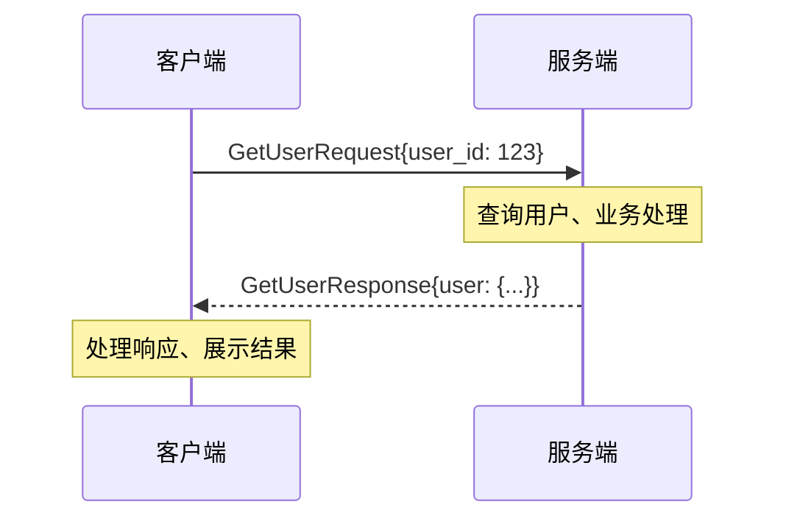
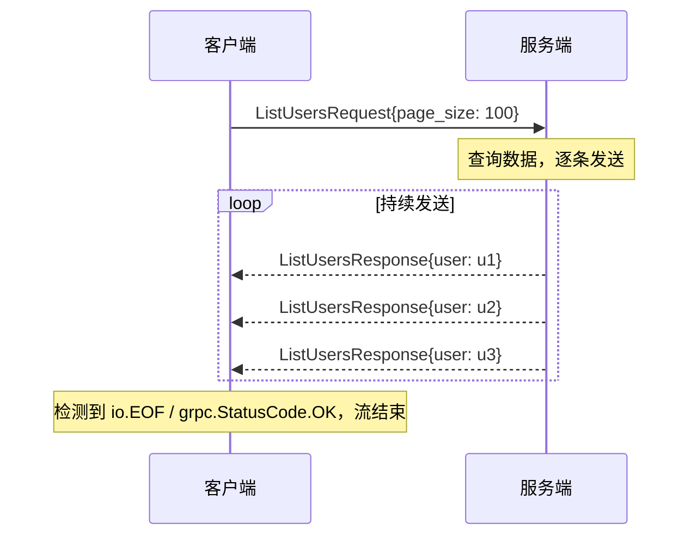
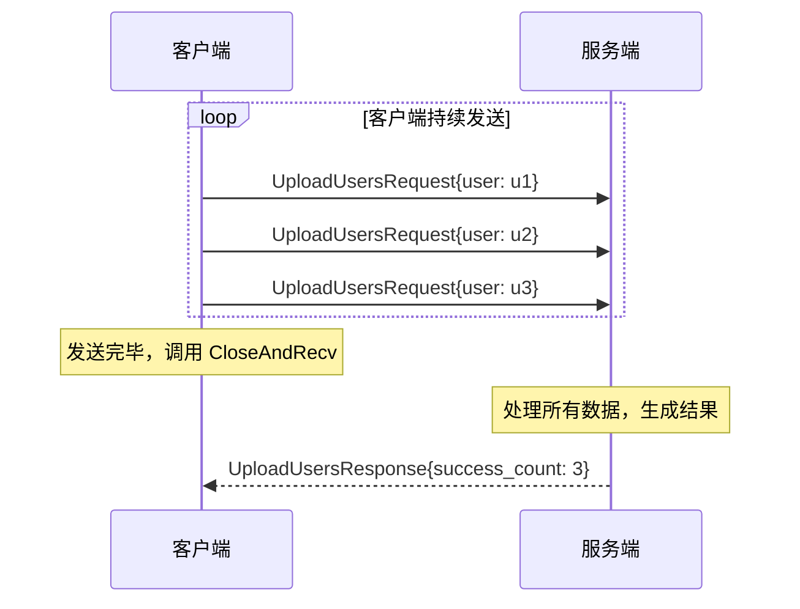
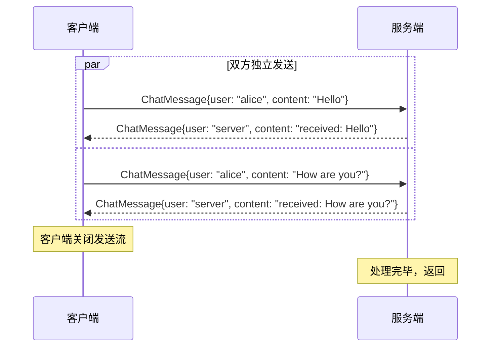
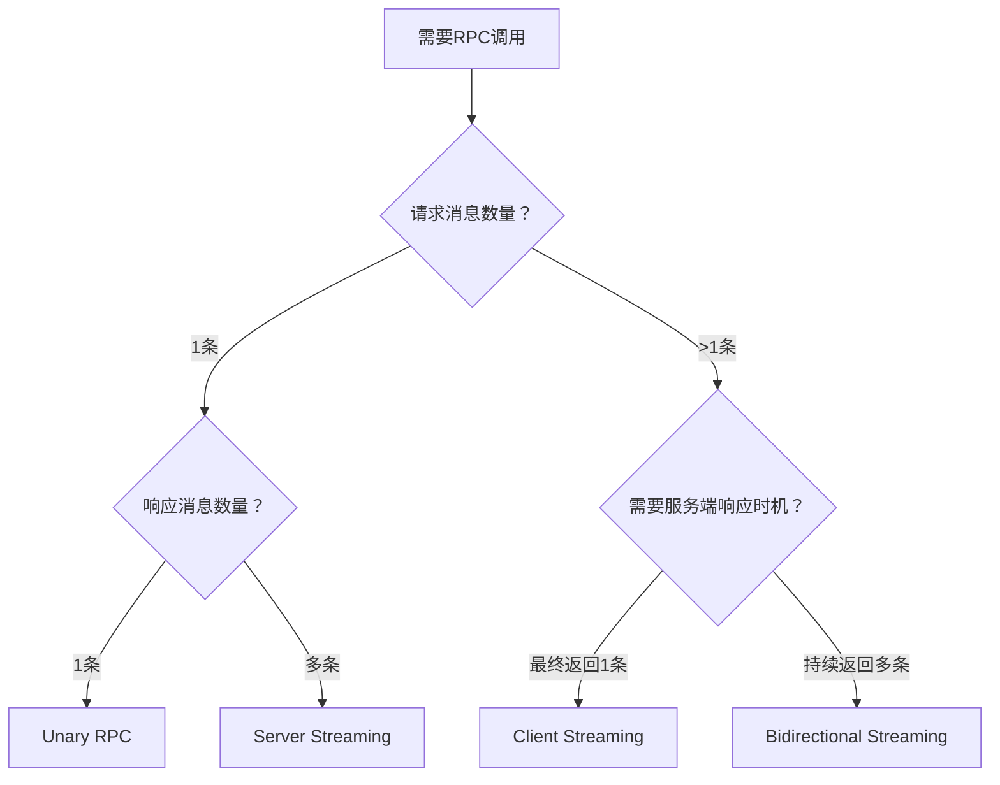
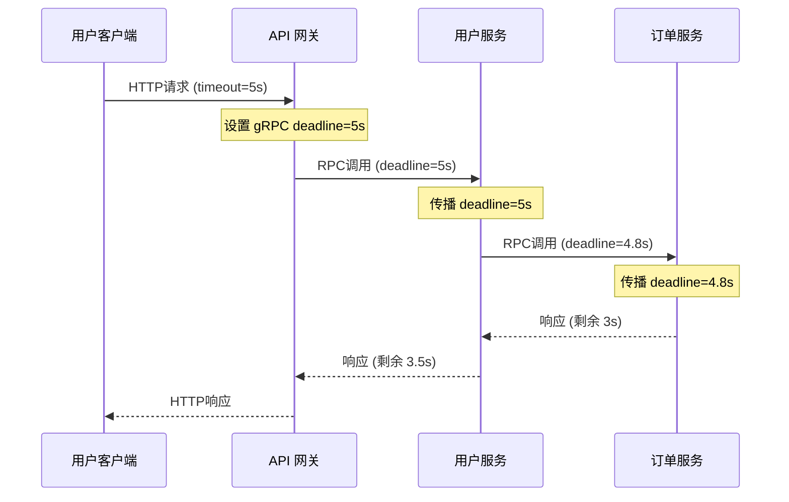

## 一、gRPC四种通信模式

gRPC 基于 HTTP/2 协议构建，天然支持**多路复用**和**流式传输**，由此衍生出四种通信模式。理解这四种模式的区别与适用场景，是正确设计 gRPC 服务接口的前提——选错模式会导致接口难以演进、性能低下甚至架构返工。

四种模式的核心差异在于**消息的收发方向和数量**：

| 模式 | 请求消息数 | 响应消息数 | 数据流方向 | 类比 |
|------|-----------|-----------|-----------|------|
| Unary RPC | 1 | 1 | 客户端 → 服务端 → 客户端 | 普通 HTTP 请求 |
| Server Streaming | 1 | N（流） | 客户端 → 服务端 ⇄ 客户端 | 下载文件 / 推送通知 |
| Client Streaming | N（流） | 1 | 客户端 ⇄ 服务端 → 客户端 | 上传文件 / 批量导入 |
| Bidirectional Streaming | N（流） | N（流） | 客户端 ⇄ 服务端 | 聊天室 / 实时数据管道 |

```mermaid
graph LR
    subgraph "Unary RPC"
        C1[客户端] -->|"1个请求"| S1[服务端]
        S1 -->|"1个响应"| C1
    end
    subgraph "Server Streaming"
        C2[客户端] -->|"1个请求"| S2[服务端]
        S2 -->|"流式响应 N条"| C2
    end
    subgraph "Client Streaming"
        C3[客户端] -->|"流式请求 N条"| S3[服务端]
        S3 -->|"1个响应"| C3
    end
    subgraph "Bidi Streaming"
        C4[客户端] ⇄|"双向独立流"| S4[服务端]
    end
```

### 1.1 HTTP/2 基础：流式传输的底层支撑

gRPC 的流式能力完全建立在 HTTP/2 之上。理解底层机制有助于排查流式 RPC 中的疑难问题——当你在生产环境中遇到流中断、消息丢失或连接重置时，能从 HTTP/2 帧级别定位根因。

#### HTTP/2 的关键特性

- **多路复用（Multiplexing）**：一个 TCP 连接上可以并行传输多个 HTTP 请求和响应，每个请求/响应对应一个 **Stream**，用 Stream ID 区分。这意味着 gRPC 客户端与服务端之间通常只需要一个 TCP 连接，即可并发发起多个 RPC 调用。相比 HTTP/1.1 的"一个请求占一个连接"（或 Keep-Alive 复用），多路复用显著减少了 TCP 握手和 TLS 协商的开销
- **流式传输（Streaming）**：HTTP/2 允许将一个请求或响应拆分为多个 **DATA 帧**连续发送，不需要等待完整消息构建完成。gRPC 的 Streaming RPC 正是利用这一特性实现持续的数据推送。每个 DATA 帧携带一部分负载，接收端按序组装后得到完整消息
- **头部压缩（HPACK）**：HTTP/2 使用 HPACK 算法压缩请求/响应头，减少重复 header 的传输开销。在高频 RPC 调用场景下，头部压缩可节省 30%-50% 的带宽。HPACK 维护一个动态表，后续请求只需发送索引号而非完整 header 值
- **流优先级与依赖**：HTTP/2 允许客户端为每个 Stream 指定优先级和依赖关系。gRPC 框架默认将所有流设为同等优先级，但在自定义场景下可以通过 `x-http2-priority` 头部调整带宽分配
- **服务端推送（Server Push）**：HTTP/2 支持服务端主动推送资源，但 gRPC 并未使用此特性——gRPC 的"服务端推送"通过 Server Streaming RPC 实现，而非 HTTP/2 的 Push Promise

#### HTTP/2 帧类型与 gRPC 映射

| HTTP/2 帧类型 | 帧标志 | gRPC 中的用途 |
|--------------|--------|-------------|
| HEADERS | END_STREAM（可选） | 传递 gRPC 方法名（`:method`、`:path`）、Content-Type、自定义 metadata |
| DATA | END_STREAM（可选） | 携带序列化后的 protobuf 消息体。END_STREAM 标志标记流的最后一个消息 |
| RST_STREAM | — | 强制终止一个 Stream，用于取消 RPC 调用或报告不可恢复错误 |
| GOAWAY | — | 通知对端不再接受新 Stream，用于优雅关闭连接或负载均衡迁移 |
| PING | — | 连接级保活探测，gRPC 默认每 10 秒发送一次 |
| WINDOW_UPDATE | — | 流量控制窗口更新，直接影响 `stream.Send()` 的阻塞行为 |

**gRPC 消息在 HTTP/2 帧中的编码方式：**

每条 gRPC 消息并非直接放入一个 DATA 帧，而是遵循 **Length-Prefixed Message** 格式：

+------------------------------------+
| Compressed-Flag (1 byte)           |
+------------------------------------+
| Message-Length (4 bytes, big-endian)|
+------------------------------------+
| Message (变长 protobuf 负载)        |
+------------------------------------+

- **Compressed-Flag**：1 表示负载经过 gzip 等压缩，0 表示未压缩
- **Message-Length**：4 字节大端序整数，表示后续 Message 的字节数
- **Message**：序列化后的 protobuf 消息

当一条消息过大时，gRPC 会将其拆分为多个 DATA 帧发送。接收端根据 Message-Length 知道何时组装完毕。这个机制对开发者透明——你只需调用 `Send()` 和 `Recv()`，帧级拆装由框架自动完成。

**一个 Unary RPC 的完整帧级交互：**

客户端 → 服务端:
  HEADERS帧 (:method=POST, :path=/example.UserService/GetUser, content-type=application/grpc)
  DATA帧 (Length-Prefixed GetUserRequest)

服务端 → 客户端:
  HEADERS帧 (:status=200, content-type=application/grpc)
  DATA帧 (Length-Prefixed GetUserResponse)
  HEADERS帧 (grpc-status=0, END_STREAM)  ← Trailer

注意最后的 **Trailer**（尾部）——gRPC 的状态码和错误信息不在响应头中返回，而是在流末尾的 Trailer 中携带。这意味着客户端必须等到流结束后才能确定 RPC 是否成功。这也是为什么 gRPC 的错误码被称为"gRPC Status Code"而非"HTTP Status Code"。

这种映射关系意味着：**Streaming RPC 并非一个全新的协议，而是 HTTP/2 流式能力在应用层的标准化封装**。理解这一点，排查问题时就能从 HTTP/2 帧级别入手分析——例如，看到 `RST_STREAM` 帧就知道是某一方主动终止了流，而非网络丢包。

### 1.2 Proto 定义：四种模式的 IDL 规范

在编写 Go/Java/Python 代码之前，必须先在 `.proto` 文件中定义服务接口。四种模式在 Proto 中的定义方式有明确区别：

```protobuf
syntax = "proto3";
package example;
option go_package = "example/pb";
option java_package = "com.example.grpc";
option python_package = "example.grpc";

// ========== 消息定义 ==========
message User {
  int64 id = 1;
  string name = 2;
  string email = 3;
}

message GetUserRequest {
  int32 user_id = 1;
}

message GetUserResponse {
  User user = 1;
}

message ListUsersRequest {
  int32 page_size = 1;
  string page_token = 2;
}

message ListUsersResponse {
  User user = 1;
}

message UploadUsersRequest {
  User user = 1;
}

message UploadUsersResponse {
  int32 success_count = 1;
  int32 fail_count = 2;
  repeated string error_messages = 3;
}

message ChatMessage {
  string user = 1;
  string content = 2;
  int64 timestamp = 3;
}

// ========== 服务定义 ==========
service UserService {
  // Unary RPC：一请求一响应
  rpc GetUser(GetUserRequest) returns (GetUserResponse);

  // Server Streaming：一请求，流式响应
  rpc ListUsers(ListUsersRequest) returns (stream ListUsersResponse);

  // Client Streaming：流式请求，一响应
  rpc UploadUsers(stream UploadUsersRequest) returns (UploadUsersResponse);

  // Bidirectional Streaming：双向流
  rpc Chat(stream ChatMessage) returns (stream ChatMessage);
}
```

**Proto 定义的关键规则：**

| 模式 | 关键字位置 | 生成代码特征 |
|------|----------|------------|
| Unary RPC | 不加 `stream` | 服务端接收 `(ctx, *Request) (*Response, error)`，客户端返回 `(*Response, error)` |
| Server Streaming | 返回类型前加 `stream` | 服务端接收 `(*Request, Stream) error`，客户端返回 `Stream`（可反复 `Recv()`） |
| Client Streaming | 请求类型前加 `stream` | 服务端接收 `(Stream) error`（可反复 `Recv()`），客户端返回 `Stream`（`Send` + `CloseAndRecv`） |
| Bidirectional Streaming | 两侧都加 `stream` | 服务端和客户端都持有双向 Stream，可独立 `Send`/`Recv` |

`protoc` 编译器根据 `stream` 关键字生成不同的接口签名。例如，Go 语言中 Server Streaming 的服务端接口接收一个 `stream.Writer` 参数，客户端返回一个 `stream.Reader`——这些生成代码的差异直接影响后续编码方式。

**Proto 设计建议：**

1. **为 Streaming 响应预留分页元数据**：即使是 Server Streaming，也建议在响应消息中加入 `next_page_token`、`total_count` 等字段，方便客户端判断进度和完整性
2. **使用 `repeated` 还是 Stream**：如果单次响应需要返回多条记录且总量可预测（<1000条），用 `repeated User` 字段打包在一个消息中更简单；如果总量不可预测或可能很大，用 Server Streaming 逐条推送
3. **消息粒度**：Streaming 模式下单条消息应尽量小（建议 <1MB），过大的消息会导致单个 DATA 帧过大，增加内存压力和重传成本

### 1.3 Unary RPC（一元调用）

**核心特征**：最基础的模式，一请求一响应，与传统 HTTP REST 调用的语义完全一致。底层对应 HTTP/2 上的一次完整请求-响应周期。

**适用场景**：绝大多数常规 RPC 调用——查询用户信息、创建订单、更新配置、执行业务逻辑等。据统计，生产环境中 80% 以上的 gRPC 调用属于 Unary 模式。



**Go 服务端实现：**

```go
// server.go
type userServer struct {
    pb.UnimplementedUserServiceServer
    userRepo UserRepository
}

func (s *userServer) GetUser(ctx context.Context, req *pb.GetUserRequest) (*pb.GetUserResponse, error) {
    // 1. 参数校验
    if req.UserId <= 0 {
        return nil, status.Error(codes.InvalidArgument, "user_id must be positive")
    }

    // 2. 业务逻辑
    user, err := s.userRepo.FindByID(ctx, req.UserId)
    if err != nil {
        if errors.Is(err, ErrNotFound) {
            return nil, status.Errorf(codes.NotFound, "user %d not found", req.UserId)
        }
        return nil, status.Errorf(codes.Internal, "failed to get user: %v", err)
    }

    // 3. 返回响应
    return &amp;pb.GetUserResponse{User: user}, nil
}
```

**Go 客户端实现：**

```go
// client.go
func main() {
    conn, err := grpc.NewClient("localhost:50051",
        grpc.WithTransportCredentials(insecure.NewCredentials()),
    )
    if err != nil {
        log.Fatalf("failed to connect: %v", err)
    }
    defer conn.Close()

    client := pb.NewUserServiceClient(conn)

    // 设置超时，防止无限等待
    ctx, cancel := context.WithTimeout(context.Background(), 3*time.Second)
    defer cancel()

    resp, err := client.GetUser(ctx, &amp;pb.GetUserRequest{UserId: 123})
    if err != nil {
        st, ok := status.FromError(err)
        if ok {
            log.Printf("RPC error: code=%s, message=%s", st.Code(), st.Message())
            // 可进一步遍历 st.Details() 获取结构化错误信息
        } else {
            log.Printf("non-gRPC error: %v", err)
        }
        return
    }
    fmt.Printf("User: %s (%s)\n", resp.User.Name, resp.User.Email)
}
```

**Python 客户端实现：**

```python
# client.py
import grpc
import time
from example import user_service_pb2, user_service_pb2_grpc

def main():
    with grpc.insecure_channel("localhost:50051") as channel:
        stub = user_service_pb2_grpc.UserServiceStub(channel)

        # 设置超时（秒）
        try:
            response = stub.GetUser(
                user_service_pb2.GetUserRequest(user_id=123),
                timeout=3.0
            )
            print(f"User: {response.user.name} ({response.user.email})")
        except grpc.RpcError as e:
            print(f"RPC failed: code={e.code()}, details={e.details()}")

if __name__ == "__main__":
    main()
```

**Python 服务端实现：**

```python
# server.py
import grpc
from concurrent import futures
from example import user_service_pb2, user_service_pb2_grpc

class UserServiceServicer(user_service_pb2_grpc.UserServiceServicer):
    def __init__(self, user_repo):
        self.user_repo = user_repo

    def GetUser(self, request, context):
        # 参数校验
        if request.user_id <= 0:
            context.abort(
                grpc.StatusCode.INVALID_ARGUMENT,
                "user_id must be positive"
            )

        # 业务逻辑
        user = self.user_repo.find_by_id(request.user_id)
        if user is None:
            context.abort(
                grpc.StatusCode.NOT_FOUND,
                f"user {request.user_id} not found"
            )

        return user_service_pb2.GetUserResponse(user=user)

def serve():
    server = grpc.server(futures.ThreadPoolExecutor(max_workers=10))
    user_service_pb2_grpc.add_UserServiceServicer_to_server(
        UserServiceServicer(user_repo), server
    )
    server.add_insecure_port("[::]:50051")
    server.start()
    server.wait_for_termination()
```

**关键细节：**

- **超时控制**：`context.WithTimeout`（Go）/ `timeout` 参数（Python）是 Unary RPC 中最关键的防御手段。不设置超时的 Unary 调用可能永久阻塞客户端线程/goroutine，导致资源泄漏。超时时间应基于上游调用链的总预算倒推——如果整个请求链路的 SLA 是 5s，经过 A→B→C 三个服务，则 C 的超时应 ≤2s，B ≤3s，A ≤5s
- **错误码选择**：参数校验失败用 `InvalidArgument`，资源不存在用 `NotFound`，内部错误用 `Internal`，权限不足用 `PermissionDenied`。错误码的选择直接影响客户端的重试策略——例如 `Unavailable` 会触发自动重试，而 `InvalidArgument` 不会
- **grpc.NewClient vs grpc.Dial**：`grpc.Dial` 在新版本 gRPC-Go 中已标记为废弃（deprecated），推荐使用 `grpc.NewClient`。新版本默认不建立懒连接（lazy connection），而是按需建立——这对 Unary RPC 的首次调用延迟有影响，需注意预热
- **消息大小限制**：gRPC 默认单条消息最大 4MB（客户端和服务端各自独立限制）。如果响应可能超过此限制，需配置 `grpc.MaxRecvMsgSize`（Go）或 `options.max_receive_message_length`（Python）：

```go
// Go：调整消息大小限制
conn, err := grpc.NewClient("localhost:50051",
    grpc.WithTransportCredentials(insecure.NewCredentials()),
    grpc.WithDefaultCallOptions(grpc.MaxCallRecvMsgSize(16*1024*1024)), // 16MB
)
```

```python
# Python：调整消息大小限制
channel = grpc.insecure_channel(
    "localhost:50051",
    options=[
        ("grpc.max_receive_message_length", 16 * 1024 * 1024),  # 16MB
        ("grpc.max_send_message_length", 16 * 1024 * 1024),
    ]
)
```

**注意事项——`grpc.WithInsecure()` 已废弃：**

早期 gRPC 教程中常见的 `grpc.WithInsecure()` 在新版本中已被移除。正确做法是使用 `grpc.WithTransportCredentials(insecure.NewCredentials())`。如果在生产环境，应使用 TLS 凭证替换 `insecure.NewCredentials()`，参见第43章 mTLS 安全通信部分。

### 1.4 Server Streaming RPC（服务端流式）

**核心特征**：客户端发送单个请求，服务端通过流持续返回多条消息。客户端发送完毕后即可等待接收，服务端按需逐条推送。

**适用场景**：

- **大数据导出**：查询结果集很大（数万条记录），一次性返回会导致内存溢出或网络超时，分批流式返回更安全
- **实时推送**：股票行情、日志流、监控指标等持续推送场景。例如，客户端订阅某个股票的实时价格，服务端持续推送最新报价
- **服务端控制的分页查询**：虽然可以放在 Unary 中实现，但 Server Streaming 天然支持服务端控制分页节奏，避免客户端频繁轮询。服务端可以根据数据库游标逐批读取，无需客户端维护分页状态
- **任务进度通知**：客户端提交一个长时间运行的任务，服务端通过流返回实时进度



**Go 服务端实现：**

```go
func (s *userServer) ListUsers(req *pb.ListUsersRequest, stream pb.UserService_ListUsersServer) error {
    // 1. 参数校验
    if req.PageSize <= 0 || req.PageSize > 1000 {
        req.PageSize = 100 // 默认值
    }

    // 2. 分批查询并流式返回
    var offset int32
    for {
        // 每次发送前检查客户端是否已断开
        select {
        case <-stream.Context().Done():
            return stream.Context().Err()
        default:
        }

        users, err := s.userRepo.List(stream.Context(), req.PageSize, offset)
        if err != nil {
            return status.Errorf(codes.Internal, "query failed: %v", err)
        }
        if len(users) == 0 {
            break // 没有更多数据
        }

        for _, user := range users {
            if err := stream.Send(&amp;pb.ListUsersResponse{User: user}); err != nil {
                // Send 失败通常意味着客户端已断开
                return status.Errorf(codes.Internal, "send failed: %v", err)
            }
        }

        offset += int32(len(users))
        // 如果返回数量少于请求量，说明已是最后一页
        if len(users) < int(req.PageSize) {
            break
        }
    }
    return nil // 返回 nil 表示流正常结束，客户端收到 grpc.StatusOK
}
```

**Go 客户端实现：**

```go
func listUsers(client pb.UserServiceClient) error {
    ctx, cancel := context.WithTimeout(context.Background(), 30*time.Second)
    defer cancel()

    stream, err := client.ListUsers(ctx, &amp;pb.ListUsersRequest{PageSize: 100})
    if err != nil {
        return fmt.Errorf("ListUsers failed: %v", err)
    }

    count := 0
    for {
        resp, err := stream.Recv()
        if err == io.EOF {
            // 流正常结束，所有消息已接收完毕
            // 此时可以检查 grpc trailers 中的统计信息
            trailers := stream.Trailer()
            if total := trailers.Get("x-total-count"); len(total) > 0 {
                fmt.Printf("Total records: %s\n", string(total))
            }
            break
        }
        if err != nil {
            return fmt.Errorf("recv error: %v", err)
        }
        count++
        fmt.Printf("[%d] User: %s (%s)\n", count, resp.User.Name, resp.User.Email)
    }
    fmt.Printf("Received %d users\n", count)
    return nil
}
```

**Python 客户端实现：**

```python
def list_users(stub):
    try:
        stream = stub.ListUsers(
            user_service_pb2.ListUsersRequest(page_size=100),
            timeout=30.0
        )
        count = 0
        for response in stream:
            count += 1
            print(f"[{count}] User: {response.user.name} ({response.user.email})")
        print(f"Total received: {count}")
    except grpc.RpcError as e:
        print(f"RPC failed: code={e.code()}, details={e.details()}")
```

Python 的 Stream 对象实现了迭代器协议，可以直接用 `for response in stream` 遍历，比 Go 的 `Recv()` + `io.EOF` 检查更简洁。这是 Python gRPC 客户端的一个设计优势。

**关键细节：**

- **流结束信号**：服务端返回 `nil`（Go）或正常结束方法（Python）表示流正常结束，客户端收到 `io.EOF`（Go）或迭代结束（Python）。如果服务端返回 error，客户端会收到该 error（而非 `io.EOF`），需要区分处理
- **context 生命周期**：`stream.Context()` 绑定了调用方的 context，客户端取消请求时服务端会收到取消信号。务必在服务端循环中检查 `stream.Context().Err()`，及时释放资源——否则服务端可能继续执行已经无人消费的查询，浪费数据库连接和 CPU
- **流量控制与背压**：gRPC 基于 HTTP/2 的流量控制窗口（默认 64KB）限制发送速率。如果客户端消费过慢，服务端 `stream.Send()` 会阻塞，直到客户端消费数据释放缓冲区。这种背压机制防止了快服务端淹没慢客户端的场景。但需注意：如果服务端在独立 goroutine 中发送，需要处理发送失败的错误并协调退出
- **Trailer 传递元数据**：流结束时可以通过 Trailer 传递额外信息。例如，服务端可以在 Trailer 中携带 `x-total-count`（总记录数）或 `x-processing-time-ms`（处理耗时），客户端通过 `stream.Trailer()` 读取

**进阶——带进度反馈的 Server Streaming：**

对于需要实时反馈进度的场景，可以在流中交替发送数据消息和进度消息：

```protobuf
message ListUsersResponse {
  oneof payload {
    User user = 1;                    // 数据消息
    StreamProgress progress = 2;      // 进度消息
  }
}

message StreamProgress {
  int32 total = 1;
  int32 sent = 2;
  string status = 3; // "streaming" / "completed"
}
```

客户端通过 `oneof` 的类型判断当前消息是数据还是进度：

```go
for {
    resp, err := stream.Recv()
    if err == io.EOF {
        break
    }
    switch payload := resp.Payload.(type) {
    case *pb.ListUsersResponse_User:
        processUser(payload.User)
    case *pb.ListUsersResponse_Progress:
        fmt.Printf("Progress: %d/%d (%s)\n", payload.Progress.Sent, payload.Progress.Total, payload.Progress.Status)
    }
}
```

### 1.5 Client Streaming RPC（客户端流式）

**核心特征**：客户端通过流持续发送多条消息，服务端在接收完所有消息后返回一个响应。适用于客户端需要上传大量数据或批量提交的场景。

**适用场景**：

- **文件上传**：大文件分块上传，避免单次请求体过大。每块包含文件片段和元数据（偏移量、校验和）
- **批量导入**：客户端持续推送待导入的数据行，服务端聚合后统一写入数据库。比 Unary 的 repeated 字段更灵活，不受消息大小限制
- **日志上报**：客户端持续发送日志条目，服务端批量写入存储。支持"边产生边发送"的流式模式
- **传感器数据采集**：物联网设备持续上报采集数据（温度、湿度、GPS 坐标），服务端汇总后做时序分析
- **语音识别输入**：客户端持续发送音频帧，服务端接收完整音频后返回识别结果



**Go 服务端实现：**

```go
func (s *userServer) UploadUsers(stream pb.UserService_UploadUsersServer) error {
    var (
        successCount int32
        failCount    int32
        errors       []string
    )

    for {
        req, err := stream.Recv()
        if err == io.EOF {
            // 客户端发送完毕，返回最终结果
            return stream.SendAndClose(&amp;pb.UploadUsersResponse{
                SuccessCount:  successCount,
                FailCount:     failCount,
                ErrorMessages: errors,
            })
        }
        if err != nil {
            return status.Errorf(codes.Internal, "receive failed: %v", err)
        }

        // 参数校验
        if req.User == nil || req.User.Name == "" {
            failCount++
            errors = append(errors, "empty user data")
            continue
        }

        // 业务处理（每条数据独立处理，部分失败不影响整体）
        if err := s.userRepo.Create(stream.Context(), req.User); err != nil {
            failCount++
            errors = append(errors, fmt.Sprintf("user %s: %v", req.User.Name, err))
            continue
        }
        successCount++
    }
}
```

**Go 客户端实现：**

```go
func uploadUsers(client pb.UserServiceClient, users []*pb.User) error {
    ctx, cancel := context.WithTimeout(context.Background(), 5*time.Minute)
    defer cancel()

    stream, err := client.UploadUsers(ctx)
    if err != nil {
        return fmt.Errorf("UploadUsers failed: %v", err)
    }

    for _, user := range users {
        if err := stream.Send(&amp;pb.UploadUsersRequest{User: user}); err != nil {
            return fmt.Errorf("send error: %v", err)
        }
    }

    // 关闭发送流，等待服务端响应
    resp, err := stream.CloseAndRecv()
    if err != nil {
        return fmt.Errorf("CloseAndRecv error: %v", err)
    }

    fmt.Printf("Uploaded: %d success, %d failed\n", resp.SuccessCount, resp.FailCount)
    if len(resp.ErrorMessages) > 0 {
        fmt.Printf("Errors: %v\n", resp.ErrorMessages)
    }
    return nil
}
```

**Python 客户端实现：**

```python
def upload_users(stub, users):
    def user_generator():
        for user in users:
            yield user_service_pb2.UploadUsersRequest(user=user)

    try:
        response = stub.UploadUsers(
            user_generator(),
            timeout=300.0  # 5分钟
        )
        print(f"Uploaded: {response.success_count} success, {response.fail_count} failed")
    except grpc.RpcError as e:
        print(f"RPC failed: code={e.code()}, details={e.details()}")
```

Python 的 `stub.UploadUsers()` 直接接受一个生成器（generator），框架会自动将生成器的每个 yield 作为一条流式消息发送。这是 Python gRPC 的又一个便利特性——无需手动管理 `Send()`/`CloseAndRecv()`。

**关键细节：**

- **SendAndRecv vs Recv + SendAndClose**：服务端使用 `stream.Recv()` 循环接收，直到 `io.EOF` 后调用 `stream.SendAndClose()` 返回唯一响应。`SendAndClose` 同时关闭发送方向并返回响应，调用后不能再发送任何消息
- **客户端 CloseAndRecv**：客户端发送完毕后必须调用 `CloseAndRecv()`，它会关闭客户端的发送流并等待服务端的响应。如果在 `Send` 后直接读取响应而不先关闭发送流，会导致**死锁**——服务端在等客户端关闭流，客户端在等服务端的响应
- **失败处理**：如果中途某个数据处理失败，服务端应记录错误并继续处理（而非立即返回 error），最终在 `SendAndClose` 中汇总成功/失败统计。如果服务端中途返回 error，客户端会收到该错误，但**已发送的消息无法撤回**——这是 Client Streaming 的固有局限
- **取消机制**：客户端可以通过 `context.Cancel()` 取消上传，服务端的 `stream.Recv()` 会返回 `context.Canceled` 错误。这在客户端检测到重复数据或格式错误时很有用

### 1.6 Bidirectional Streaming RPC（双向流式）

**核心特征**：客户端和服务端各自维护独立的发送流，双方可以同时收发消息，无需等待对方完成。这是 gRPC 中最灵活也最复杂的模式。

**适用场景**：

- **实时聊天**：聊天室、客服系统、即时通讯。每条消息通过 `Send()` 发出，通过 `Recv()` 接收
- **状态同步**：多人协作编辑（如 Google Docs 的协同编辑）、游戏状态同步。客户端发送本地操作，服务端广播给其他客户端
- **双向数据管道**：客户端持续上传处理结果，服务端同时返回验证反馈。类似 TCP 的全双工通信
- **语音/视频流**：实时音视频传输中的双向数据交换，客户端发送音频帧，服务端返回转码后的流
- **交互式查询**：客户端逐步细化查询条件，服务端逐步返回匹配结果。类似于数据库的交互式游标



**Go 服务端实现——聊天室：**

```go
func (s *chatServer) Chat(stream pb.ChatService_ChatServer) error {
    for {
        msg, err := stream.Recv()
        if err == io.EOF {
            // 客户端已关闭发送流，服务端可以做清理工作
            return nil
        }
        if err != nil {
            return status.Errorf(codes.Internal, "recv error: %v", err)
        }

        // 校验消息内容
        if msg.Content == "" {
            continue
        }

        // 广播给所有连接的客户端
        // 注意：broadcast 需要处理并发安全，通常通过 channel 分发
        if err := s.broadcast(stream.Context(), msg); err != nil {
            return status.Errorf(codes.Internal, "broadcast failed: %v", err)
        }
    }
}

// broadcast 广播实现（简化版）
type chatServer struct {
    pb.UnimplementedChatServiceServer
    mu      sync.RWMutex
    clients map[pb.ChatService_ChatServer]struct{}
}

func (s *chatServer) broadcast(ctx context.Context, msg *pb.ChatMessage) error {
    s.mu.RLock()
    defer s.mu.RUnlock()

    for client := range s.clients {
        if err := client.Send(msg); err != nil {
            // 发送失败，移除该客户端
            s.removeClient(client)
        }
    }
    return nil
}
```

**Go 客户端实现——交互式聊天：**

```go
func chat(client pb.ChatServiceClient) error {
    ctx, cancel := context.WithTimeout(context.Background(), 10*time.Minute)
    defer cancel()

    stream, err := client.Chat(ctx)
    if err != nil {
        return fmt.Errorf("Chat failed: %v", err)
    }

    done := make(chan struct{})
    var recvErr error

    // goroutine 1：持续接收服务端消息
    go func() {
        defer close(done)
        for {
            msg, err := stream.Recv()
            if err == io.EOF {
                return
            }
            if err != nil {
                recvErr = err
                log.Printf("recv error: %v", err)
                return
            }
            fmt.Printf("[%s] %s\n", msg.User, msg.Content)
        }
    }()

    // goroutine 2：从标准输入读取并发送
    scanner := bufio.NewScanner(os.Stdin)
    for scanner.Scan() {
        text := scanner.Text()
        if text == "quit" {
            break
        }
        if err := stream.Send(&amp;pb.ChatMessage{
            User:    "alice",
            Content: text,
        }); err != nil {
            log.Printf("send error: %v", err)
            break
        }
    }

    // 关闭客户端发送流，等待接收 goroutine 结束
    stream.CloseSend()
    <-done

    if recvErr != nil &amp;&amp; recvErr != io.EOF {
        return recvErr
    }
    return nil
}
```

**Python 客户端实现——双向聊天：**

```python
import threading

def chat(stub):
    # 使用异步流实现双向通信
    def send_messages(stream):
        """发送线程：从标准输入读取并发送"""
        try:
            while True:
                text = input()
                if text == "quit":
                    break
                stream.send(user_service_pb2.ChatMessage(
                    user="alice", content=text
                ))
        except Exception as e:
            print(f"Send error: {e}")

    # 创建双向流
    def message_generator():
        """接收端：yield 服务端发来的消息"""
        # 注意：Python 的 gRPC 双向流需要更精细的线程协调
        pass

    # Python 中更常见的做法是使用异步 API
    async def async_chat(stub):
        stream = stub.Chat()
        # 发送和接收通过 asyncio 协程并行
        async def send_loop():
            while True:
                text = input()
                if text == "quit":
                    break
                await stream.send(user_service_pb2.ChatMessage(
                    user="alice", content=text
                ))
            await stream.done_writing()

        async def recv_loop():
            async for msg in stream:
                print(f"[{msg.user}] {msg.content}")

        await asyncio.gather(send_loop(), recv_loop())
```

**关键细节：**

- **独立的生命周期**：客户端和服务端的发送流是完全独立的。客户端可以在不停止接收的情况下关闭发送流（`CloseSend()`），反之亦然。一方关闭发送不影响另一方继续发送。这种独立性使得 Bidirectional Streaming 能模拟全双工通信
- **双向并发**：客户端可以在接收消息的同时发送新消息。通常的做法是启动两个 goroutine/线程——一个负责 `Recv()`，一个负责 `Send()`，用 `sync.WaitGroup`/`channel`（Go）或 `asyncio.gather()`（Python）协调退出
- **流关闭顺序**：客户端调用 `CloseSend()` 关闭自己的发送流，服务端在 `Recv()` 中收到 `io.EOF` 后可以决定何时结束。服务端返回 `nil` 后，客户端的 `Recv()` 也会收到 `io.EOF`。但要注意：服务端不一定要等客户端关闭流才返回——如果服务端主动返回 error，客户端的 `Recv()` 会收到该 error
- **广播模式的并发安全**：多客户端聊天时，广播函数需要处理并发写入。常见方案是为每个连接维护一个发送 channel，由一个独立的 broadcast goroutine 负责分发。直接在 broadcast 中遍历所有客户端调用 `Send()` 存在竞态风险
- **超时与空闲检测**：双向流没有天然的消息边界，一个空闲的连接会无限期占用资源。建议实现心跳机制——客户端定期发送心跳消息，服务端检测超时无心跳则主动关闭连接

### 1.7 四种模式的选型决策

选择通信模式不是技术偏好问题，而是**数据流特征**决定的架构决策。选错模式会导致接口难以演进——例如，将本应是 Server Streaming 的场景做成 Unary，后续数据量增长时不得不修改接口签名，破坏向后兼容性。

**选型决策树：**



**各模式的决策要素对比：**

| 决策维度 | Unary | Server Streaming | Client Streaming | Bidi Streaming |
|---------|-------|-----------------|-----------------|----------------|
| 数据量 | 小（KB级） | 大（MB-GB级） | 大（客户端批量） | 不确定 |
| 延迟要求 | 低延迟优先 | 允许延迟 | 允许延迟 | 实时优先 |
| 实现复杂度 | 最低 | 低 | 中等 | 最高 |
| 错误处理 | 简单 | 中等（流中断） | 中等（部分失败） | 复杂（双向错误） |
| 资源消耗 | 最低 | 服务端流控 | 客户端缓冲 | 双向缓冲 |
| 典型超时 | 3-30s | 30s-5min | 30s-10min | 无固定超时 |
| 调试难度 | 容易（一次交互） | 中等（多条消息） | 中等（多条消息） | 困难（并发流） |
| 测试复杂度 | 低 | 中等 | 中等 | 高 |

**选型原则：**

1. **默认使用 Unary**：如果不确定，先用 Unary。它的生态支持最好，调试最方便，绝大多数场景够用。80% 以上的生产环境 gRPC 调用是 Unary
2. **数据量决定流式**：当响应数据超过 1MB 或请求数据需要分块传输时，考虑 Streaming。经验值：1000 条以上的小记录（每条 <1KB）适合 Server Streaming，单条大记录（>1MB）适合 Unary + 分块 protobuf
3. **实时性决定双向**：如果双方需要同时推送数据（聊天、协作），必须用 Bidirectional Streaming
4. **宁可粗不可细**：接口定义时留有余地——即使当前是 Unary，如果预见到未来可能需要流式，可以设计成 Server Streaming（发送单个消息的流等价于 Unary）。反之，从 Unary 升级到 Streaming 需要修改 Proto 定义，破坏向后兼容
5. **考虑负载均衡**：Unary RPC 可以被任何负载均衡器（L4/L7）分发。Streaming RPC（特别是长连接的 Bidi Streaming）需要 gRPC-aware 的负载均衡器（如 Envoy、Istio），否则所有消息会固定路由到同一个后端实例

**典型场景的选型推荐：**

| 场景 | 推荐模式 | 理由 |
|------|---------|------|
| 用户信息查询 | Unary | 一请求一响应，数据量小 |
| 订单创建 | Unary | 事务操作，需要立即确认结果 |
| 电商商品列表 | Server Streaming | 数据量大，分批推送避免超时 |
| 实时股票行情 | Server Streaming | 客户端订阅，服务端持续推送 |
| 日志收集 | Client Streaming | 客户端持续产生日志，批量上报 |
| 文件上传 | Client Streaming | 大文件分块上传 |
| 聊天室 | Bidi Streaming | 双方同时收发消息 |
| 实时协作编辑 | Bidi Streaming | 多端同时操作和同步 |
| 语音识别 | Client Streaming | 客户端发送音频流，服务端返回识别结果 |
| 语音对话（AI） | Bidi Streaming | 双方交替发送语音/文本 |

### 1.8 流式 RPC 的错误处理与资源管理

流式 RPC 的错误处理比 Unary 复杂得多，因为错误可能发生在流传输的任何时刻——建立连接时、发送中途、接收中途、甚至流结束后。以下是必须掌握的处理模式：

**错误类型与处理策略：**

| 错误发生时机 | 服务端表现 | 客户端表现 | 处理策略 |
|-------------|-----------|-----------|---------|
| 流建立前（连接失败） | 不适用 | 连接超时/拒绝 | 重试或切换地址 |
| 流建立后、发送前 | stream.Context() 被取消 | 收到 context.Canceled | 检查 context |
| 发送/接收中途 | stream.Send/Recv 返回 error | stream.Recv 返回 error | 记录日志，按需重试 |
| 服务端处理异常 | 返回 error（含状态码） | 收到服务端 error（非 io.EOF） | 根据 gRPC 状态码决策 |
| 客户端主动取消 | stream.Recv 返回 Canceled | context.Cancel 触发 | 清理资源 |
| 流正常结束 | 返回 nil | 收到 io.EOF（Go）/ 迭代结束（Python） | 正常退出循环 |
| HTTP/2 层面错误 | RST_STREAM 帧 | 连接断开 | 重建连接 |

**gRPC 状态码与重试策略：**

| 状态码 | 含义 | 是否可重试 | 典型场景 |
|--------|------|-----------|---------|
| OK (0) | 成功 | — | 正常完成 |
| Canceled (1) | 客户端取消 | 否（客户端主动行为） | 用户中断操作 |
| InvalidArgument (3) | 参数错误 | 否 | 参数校验失败 |
| NotFound (5) | 资源不存在 | 否 | 查询不存在的数据 |
| AlreadyExists (6) | 资源已存在 | 否 | 重复创建 |
| PermissionDenied (7) | 权限不足 | 否 | 鉴权失败 |
| ResourceExhausted (8) | 资源耗尽 | 是（可能） | 限流/配额超限 |
| FailedPrecondition (9) | 前置条件不满足 | 否 | 乐观锁冲突 |
| Internal (13) | 内部错误 | 是（谨慎） | 服务端 bug |
| Unavailable (14) | 服务不可用 | 是 | 服务重启/过载 |
| DeadlineExceeded (4) | 超时 | 是（调整超时后） | 服务端处理过慢 |

**流式 RPC 的资源管理要点：**

```go
// 错误模式：未关闭流导致资源泄漏
func badExample(client pb.UserServiceClient) {
    stream, _ := client.ListUsers(context.Background(), &amp;pb.ListUsersRequest{})
    // 如果这里出错直接 return，流没有被正确关闭
    // goroutine 和连接资源会泄漏
    for {
        resp, err := stream.Recv()
        if err != nil {
            return // ← 资源泄漏！没有关闭发送方向
        }
        process(resp)
    }
}

// 正确模式：确保流的完整生命周期管理
func goodExample(client pb.UserServiceClient) error {
    ctx, cancel := context.WithTimeout(context.Background(), 30*time.Second)
    defer cancel() // 确保 context 被释放

    stream, err := client.ListUsers(ctx, &amp;pb.ListUsersRequest{PageSize: 100})
    if err != nil {
        return fmt.Errorf("open stream: %w", err)
    }

    for {
        resp, err := stream.Recv()
        if err == io.EOF {
            break // 流正常结束
        }
        if err != nil {
            return fmt.Errorf("recv: %w", err)
        }
        if err := process(resp); err != nil {
            return fmt.Errorf("process: %w", err)
        }
    }
    return nil
}
```

**Server Streaming 的流量控制与背压（Backpressure）：**

当服务端发送速率远大于客户端消费速率时，gRPC 依赖 HTTP/2 的流量控制窗口进行背压。HTTP/2 的默认初始窗口大小为 65,535 字节（64KB），通过 WINDOW_UPDATE 帧动态调整。

这意味着：如果服务端在独立 goroutine 中发送，而主线程在做其他操作，`Send()` 的阻塞不会影响主线程。但如果发送和业务逻辑在同一个 goroutine，阻塞会导致整体处理暂停——这通常是期望的行为，可以防止客户端被淹没。

**流量控制参数调优：**

```go
// 增大初始窗口大小（适用于高吞吐场景）
server := grpc.NewServer(
    grpc.InitialWindowSize(1*1024*1024),     // 流级别窗口：1MB
    grpc.InitialConnWindowSize(4*1024*1024), // 连接级别窗口：4MB
)
```

过大的窗口会增加内存占用（每个流的接收缓冲区），过小的窗口会限制吞吐量。一般建议：
- 低频 RPC（<100 QPS）：默认 64KB 即可
- 高频小消息（100-1000 QPS）：调整到 256KB-1MB
- 大消息传输（文件上传等）：调整到 4MB-16MB

### 1.9 超时传播与 Deadline 管理

在微服务架构中，一个用户请求往往经过 A→B→C 多级服务调用。gRPC 的 Deadline 机制允许超时在调用链中自动传播，避免"超时竞赛"（Timeout Race）问题。

**Deadline 传播原理：**



**Go 实现——Deadline 自动传播：**

```go
// 用户服务：接收请求并调用订单服务
func (s *userServer) GetUser(ctx context.Context, req *pb.GetUserRequest) (*pb.GetUserResponse, error) {
    // ctx 已经携带了上游传来的 Deadline
    // 直接传给下游调用，Deadline 自动传播
    user, err := s.userRepo.FindByID(ctx, req.UserId)
    if err != nil {
        return nil, err
    }

    // 查询用户的最近订单（使用同一个 ctx，Deadline 自动传播）
    orders, err := s.orderClient.ListOrders(ctx, &amp;pb.ListOrdersRequest{UserId: req.UserId})
    if err != nil {
        // 如果是 DeadlineExceeded，说明上游超时了，不需要重试
        st, ok := status.FromError(err)
        if ok &amp;&amp; st.Code() == codes.DeadlineExceeded {
            return nil, status.Error(codes.DeadlineExceeded, "upstream timeout")
        }
        return nil, err
    }

    return &amp;pb.GetUserResponse{User: user, RecentOrders: orders}, nil
}
```

**常见 Deadline 反模式：**

| 反模式 | 问题 | 正确做法 |
|--------|------|---------|
| 不设 Deadline | 请求可能永久阻塞 | 所有 RPC 调用必须设置 Deadline |
| 每层都设独立 Deadline | 上游超时后下游还在执行 | 让 Deadline 自动传播，只在入口层设置 |
| Deadline 过短 | 下游服务来不及处理 | 基于 P99 延迟 + 安全余量设置 |
| Deadline 过长 | 占用资源时间过长 | 合理预估，不超过 SLA 要求 |
| 忽略 DeadlineExceeded | 重试已超时的请求无意义 | 检查状态码，跳过不可重试的错误 |

**Python 的 Deadline 传播：**

```python
# Python gRPC 的 Deadline 通过 context 自动传播
def get_user(request, context):
    # context 已经携带上游的 Deadline
    # 直接用 context 调用下游
    orders = order_stub.ListOrders(
        pb.ListOrdersRequest(user_id=request.user_id),
        timeout=context.time_remaining()  # 显式传递剩余时间
    )
    return pb.GetUserResponse(user=user, recent_orders=orders)
```

### 1.10 流式 RPC 的测试策略

流式 RPC 的测试比 Unary 复杂得多——你需要模拟流的建立、多条消息的发送/接收、中途断开、超时等场景。以下是经过验证的测试模式：

**Server Streaming 测试（Go）：**

```go
func TestListUsers(t *testing.T) {
    // 创建内存中的 gRPC 服务器
    lis := bufconn.Listen(1024 * 1024)
    server := grpc.NewServer()
    pb.RegisterUserServiceServer(server, &amp;userServer{userRepo: mockRepo()})
    go server.Serve(lis)
    defer server.Stop()

    // 创建客户端连接
    conn, err := grpc.NewClient("passthrough:///bufnet",
        grpc.WithContextDialer(func(ctx context.Context, addr string) (net.Conn, error) {
            return lis.DialContext(ctx)
        }),
        grpc.WithTransportCredentials(insecure.NewCredentials()),
    )
    require.NoError(t, err)
    defer conn.Close()

    client := pb.NewUserServiceClient(conn)

    // 发起 Server Streaming 调用
    ctx, cancel := context.WithTimeout(context.Background(), 5*time.Second)
    defer cancel()

    stream, err := client.ListUsers(ctx, &amp;pb.ListUsersRequest{PageSize: 10})
    require.NoError(t, err)

    // 逐条接收并验证
    var users []*pb.User
    for {
        resp, err := stream.Recv()
        if err == io.EOF {
            break
        }
        require.NoError(t, err)
        users = append(users, resp.User)
    }

    assert.Len(t, users, 5) // 假设 mock 返回 5 条
}
```

**Bidirectional Streaming 测试（Go）：**

```go
func TestChat(t *testing.T) {
    // ... 连接建立同上 ...

    stream, err := client.Chat(ctx)
    require.NoError(t, err)

    // 并行发送和接收
    go func() {
        for i := 0; i < 3; i++ {
            stream.Send(&amp;pb.ChatMessage{User: "test", Content: fmt.Sprintf("msg-%d", i)})
        }
        stream.CloseSend()
    }()

    // 收集所有响应
    var responses []*pb.ChatMessage
    for {
        msg, err := stream.Recv()
        if err == io.EOF {
            break
        }
        require.NoError(t, err)
        responses = append(responses, msg)
    }

    assert.Len(t, responses, 3)
}
```

**使用 grpc-testing 工具：**

gRPC 提供了官方的测试工具库，可以录制和回放 RPC 交互：

```go
// 使用 grpc/testing 拦截器记录请求
func TestWithRecorder(t *testing.T) {
    recorder := &amp;testServiceRecorder{}
    server := grpc.NewServer(
        grpc.StreamInterceptor(recorder.StreamInterceptor),
    )
    // ... 注册服务、发起调用 ...

    // 验证调用记录
    assert.Equal(t, 1, len(recorder.StreamCalls))
    assert.Equal(t, "/example.UserService/ListUsers", recorder.StreamCalls[0].Method)
}
```

### 1.11 流式 RPC 的可观测性与监控

在生产环境中，流式 RPC 需要与 Unary RPC 不同的监控策略——你需要跟踪的不只是请求/响应，还包括消息数量、流持续时间、背压事件等。

**关键监控指标：**

| 指标类别 | 指标名 | 含义 | 告警阈值参考 |
|---------|--------|------|------------|
| 流消息 | grpc.stream.messages.sent | 流中发送的消息数 | — |
| 流消息 | grpc.stream.messages.received | 流中接收的消息数 | — |
| 流时长 | grpc.stream.duration_seconds | 流从建立到关闭的持续时间 | Bidi > 1h 可能是泄漏 |
| 流错误 | grpc.stream.errors | 流中途出错的次数 | 错误率 > 1% |
| 背压 | grpc.flow_control.stalled_seconds | Send() 因背压阻塞的总时间 | 持续 > 10s |
| 并发 | grpc.stream.active_streams | 当前活跃的流数量 | 超过服务端容量 |

**Go 拦截器实现——流式 RPC 指标收集：**

```go
func streamMetricsInterceptor() grpc.StreamServerInterceptor {
    return func(srv interface{}, ss grpc.ServerStream, info *grpc.StreamServerInfo, handler grpc.StreamHandler) error {
        start := time.Now()

        // 包装 stream，拦截 Send/Recv 调用
        wrapped := &amp;metricsServerStream{
            ServerStream: ss,
            method:       info.FullMethod,
        }

        err := handler(srv, wrapped)

        duration := time.Since(start)
        labels := []string{"method", info.FullMethod, "status", status.Code(err).String()}

        // 记录指标
        streamDuration.WithLabelValues(labels...).Observe(duration.Seconds())
        streamTotal.WithLabelValues(labels...).Inc()
        streamMessagesSent.WithLabelValues(labels...).Add(float64(wrapped.sentCount))
        streamMessagesReceived.WithLabelValues(labels...).Add(float64(wrapped.recvCount))

        return err
    }
}

type metricsServerStream struct {
    grpc.ServerStream
    method    string
    sentCount int
    recvCount int
}

func (s *metricsServerStream) SendMsg(m interface{}) error {
    s.sentCount++
    return s.ServerStream.SendMsg(m)
}

func (s *metricsServerStream) RecvMsg(m interface{}) error {
    err := s.ServerStream.RecvMsg(m)
    if err == nil {
        s.recvCount++
    }
    return err
}
```

**分布式追踪（OpenTelemetry）：**

流式 RPC 的追踪需要特别注意——每个流内消息应作为 Span 的 Events 记录，而非独立的 Span：

```go
func traceStreamInterceptor() grpc.StreamServerInterceptor {
    return func(srv interface{}, ss grpc.ServerStream, info *grpc.StreamServerInfo, handler grpc.StreamHandler) error {
        ctx, span := tracer.Start(ss.Context(), info.FullMethod)
        defer span.End()

        wrapped := &amp;tracingServerStream{ServerStream: ss, ctx: ctx, span: span}
        err := handler(srv, wrapped)

        span.SetStatus(codes.Ok, "")
        if err != nil {
            span.SetStatus(codes.Error, err.Error())
        }
        span.AddEvent("stream_completed", trace.WithAttributes(
            attribute.Int("messages_sent", wrapped.sentCount),
            attribute.Int("messages_received", wrapped.recvCount),
        ))

        return err
    }
}
```

### 1.12 常见误区与最佳实践

**误区 1：所有场景都用 Unary，不考虑流式**

Unary RPC 适合小数据量的一次性调用。但当响应数据持续增长（例如用户列表从 100 条增长到 100 万条），Unary 的单次传输模式会导致内存溢出和超时。在接口设计阶段就应评估数据量趋势，对可能增长的场景预留流式能力。

**误区 2：Server Streaming 不检查客户端断开**

如果服务端在发送流时不检查 context 状态，即使客户端已经断开，服务端仍然会继续执行查询和发送逻辑，浪费计算和 I/O 资源。始终在发送循环中检查 `stream.Context().Err()`。一个已断开的流，`Send()` 最终会返回 error，但在此之前服务端可能已经做了大量无用功。

**误区 3：Client Streaming 中途失败后重试导致重复数据**

Client Streaming 不支持"回滚"——已发送的消息无法撤回。如果上传 1000 条数据，第 500 条失败，客户端重试时会从头发送，导致前 400 条被重复处理。解决方案：
- 服务端设计幂等操作（基于唯一 ID 去重）
- 客户端记录已成功发送的偏移量，实现断点续传
- 使用带唯一请求 ID 的幂等键
- 在响应中返回已处理的条数，客户端据此跳过已处理部分

**误区 4：Bidirectional Streaming 不设超时**

双向流式连接没有固定的消息边界，如果不设置 deadline，一个僵尸连接可能无限期占用服务端资源。始终通过 `context.WithTimeout` 或 `context.WithDeadline` 设置最大生命周期。对于长连接（如聊天），可以设置心跳机制：定期发送空消息或 Ping，超过一定时间无响应则关闭连接。

**误区 5：在 Unary 中做 Streaming 语义**

有些开发者将 Unary 接口的响应封装为一个大消息（包含所有数据），本质上回避了流式。这在数据量小时可以接受，但当数据量增长到 MB 级别，序列化/反序列化的内存开销和传输延迟会显著增加。应该在数据量增长前就切换到 Server Streaming。

**误区 6：忽略流式 RPC 的负载均衡**

Unary RPC 的每次调用可以被负载均衡器独立路由到不同的后端实例。但 Streaming RPC 的所有消息都绑定在同一个 HTTP/2 连接上，所有消息会固定路由到同一个后端实例。如果后端实例的处理能力不均，可能导致热点问题。解决方案：
- 使用 gRPC-aware 的负载均衡器（Envoy、Istio、gRPC-LB）
- 在客户端实现负载均衡（`grpc.WithDefaultServiceConfig` + pick_first/round_robin）
- 对于 Bidi Streaming，考虑基于连接数而非请求数的负载均衡策略

**误区 7：流式 RPC 中使用阻塞操作**

在流式 RPC 的处理函数中使用阻塞 I/O（如同步数据库查询、文件读写）会阻塞整个流的处理。对于 Server Streaming，应使用异步查询或连接池；对于 Bidi Streaming，应在独立的 goroutine 中处理 I/O，避免阻塞接收循环。

**最佳实践清单：**

| 实践 | 说明 |
|------|------|
| 默认 Unary，数据量驱动流式 | 不过度设计，但预留演进空间 |
| 所有流式 RPC 必须设 deadline | 防止资源泄漏 |
| 检查 context.Err() | 服务端发送循环中及时响应取消 |
| 使用 grpc.NewClient | 避免使用已废弃的 grpc.Dial |
| 客户端接收循环以 io.EOF 终止 | 区分正常结束和异常错误 |
| Client Streaming 设计幂等 | 防止重试导致数据重复 |
| Bidi Streaming 用 goroutine 分离收发 | 发送和接收并行执行 |
| 流式响应前校验参数 | 避免无效数据进入流 |
| 用 Trailer 携带元数据 | 在流结束时传递统计信息 |
| 监控流式 RPC 的指标 | 跟踪消息数、延迟、错误率 |
| 测试中断场景 | 模拟客户端断开、服务端超时、网络分区 |
| 消息大小控制在 1MB 以内 | 过大的消息增加重传成本和内存压力 |
| 为 Streaming 接口预留扩展字段 | 在 Proto 中添加 `oneof` 或 `map` 字段 |
| 使用 buf lint 检查 Proto 设计 | 防止 API 设计违反最佳实践 |

### 1.13 本节小结

gRPC 的四种通信模式——Unary、Server Streaming、Client Streaming、Bidirectional Streaming——构成了完整的 RPC 通信范式。它们不是互相替代的关系，而是针对不同数据流特征的最优解：

- **Unary** 是默认选择，覆盖 80% 以上的场景
- **Server Streaming** 解决大数据量推送和服务端控制的场景
- **Client Streaming** 解决客户端批量上传的场景
- **Bidirectional Streaming** 解决实时双向通信的场景

选择通信模式的核心依据是**数据流的方向和数量**，而非技术偏好。在接口设计阶段就应评估数据量趋势和实时性需求，选择合适的模式——因为从 Unary 升级到 Streaming 需要修改 Proto 定义，会破坏向后兼容性。

掌握 HTTP/2 的帧级机制、Deadline 传播、背压控制和资源管理，是从"会用 gRPC"到"精通 gRPC"的关键跨越。在下一节中，我们将深入探讨拦截器（Interceptor）——gRPC 最强大的横切关注点处理机制。
