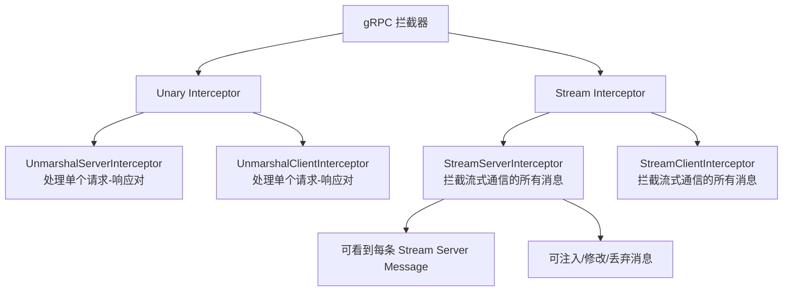
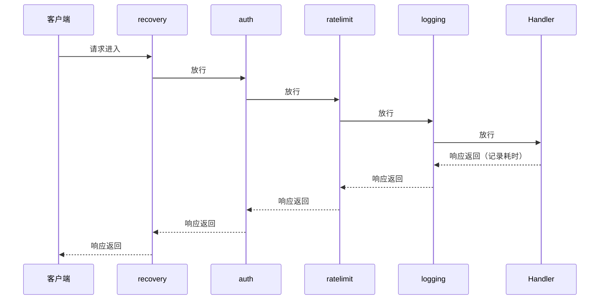
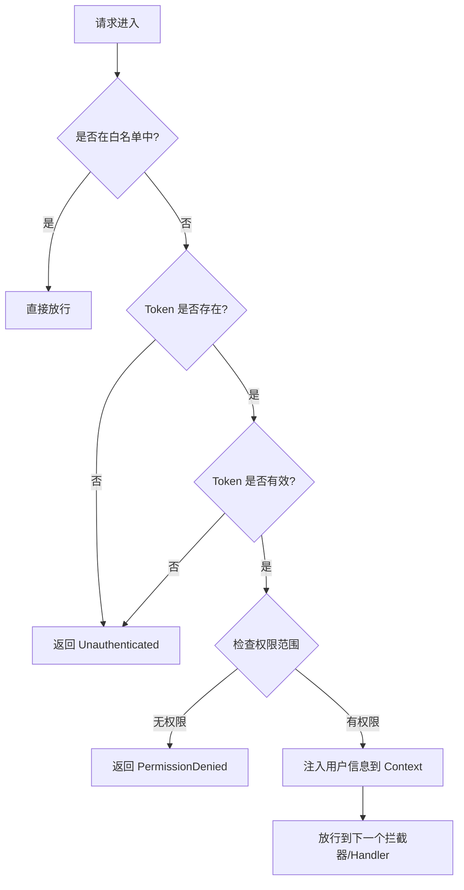
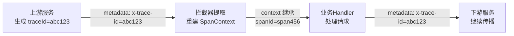

## 二、拦截器 Interceptor

RPC 框架的拦截器（Interceptor）是分布式系统中**横切关注点**（Cross-Cutting Concerns）的核心承载体。认证鉴权、日志采集、链路追踪、限流熔断、请求重试——这些与业务逻辑正交的职责，如果散落在每个服务方法中，代码将迅速腐化为不可维护的意大利面条。拦截器通过统一的拦截点，将这些横切逻辑从业务代码中彻底剥离，实现**一次编写、全局生效**。

本节从拦截器的设计原理出发，系统讲解 gRPC/Thrift 等主流 RPC 框架中拦截器的分类、实现、链式组合与工程实践。

---

### 2.1 拦截器的设计原理

#### 2.1.1 什么是拦截器

拦截器本质上是一种**中间件模式**（Middleware Pattern）——在请求到达业务处理函数之前、以及响应返回客户端之后，插入一段可复用的处理逻辑。其思想源自面向切面编程（AOP），但比 AOP 更轻量、更显式：

客户端发起 RPC 调用
    │
    ▼
┌─────────────────────────┐
│  客户端拦截器链           │  ← 发送前：注入 metadata、记录请求日志、压缩请求体
│  Client Interceptor Chain│
└─────────┬───────────────┘
          │  网络传输（HTTP/2、TCP 等）
          ▼
┌─────────────────────────┐
│  服务端拦截器链           │  ← 接收后：认证鉴权、参数校验、限流、业务处理
│  Server Interceptor Chain│
└─────────┬───────────────┘
          │
          ▼
┌─────────────────────────┐
│  服务端拦截器链（反向）    │  ← 响应前：注入响应头、记录耗时、异常转换
│  Server Interceptor Chain│
└─────────┬───────────────┘
          │
          ▼
┌─────────────────────────┐
│  客户端拦截器链（反向）    │  ← 接收后：重试逻辑、响应缓存、指标采集
│  Client Interceptor Chain│
└─────────────────────────┘
          │
          ▼
    客户端收到响应

**拦截器与装饰器（Decorator）的区别：**

| 维度 | 装饰器模式 | 拦截器模式 |
|------|-----------|-----------|
| 绑定对象 | 固定绑定某个具体类 | 与框架生命周期绑定，可拦截所有方法 |
| 组合方式 | 手动嵌套，层数由调用方控制 | 框架自动链式调用，声明式注册 |
| 控制粒度 | 方法级别 | 方法级别 + 服务级别 + 全局级别 |
| 典型场景 | 日志包装器 | RPC 全链路横切逻辑 |

#### 2.1.2 为什么 RPC 框架需要拦截器

在微服务架构中，一个服务通常有几十甚至上百个 RPC 方法。假设需要为每个方法添加认证检查：

**没有拦截器的做法（反面教材）：**

```go
// 每个方法都重复写认证逻辑——典型的代码坏味道
func (s *UserService) GetUser(ctx context.Context, req *pb.GetUserRequest) (*pb.User, error) {
    // 重复的认证代码，散布在每个方法中
    token := extractToken(ctx)
    if token == "" {
        return nil, status.Error(codes.Unauthenticated, "missing token")
    }
    claims, err := validateToken(token)
    if err != nil {
        return nil, status.Error(codes.Unauthenticated, "invalid token")
    }
    // ... 业务逻辑开始
}

func (s *UserService) UpdateUser(ctx context.Context, req *pb.UpdateUserRequest) (*pb.User, error) {
    // 又是一模一样的认证代码
    token := extractToken(ctx)
    if token == "" {
        return nil, status.Error(codes.Unauthenticated, "missing token")
    }
    claims, err := validateToken(token)
    if err != nil {
        return nil, status.Error(codes.Unauthenticated, "invalid token")
    }
    // ... 业务逻辑开始
}
```

**使用拦截器的做法（正面教材）：**

```go
// 认证拦截器：一次编写，全局生效
func authInterceptor(ctx context.Context, req any, info *grpc.UnaryServerInfo, handler grpc.UnaryHandler) (any, error) {
    token := extractToken(ctx)
    if token == "" {
        return nil, status.Error(codes.Unauthenticated, "missing token")
    }
    if _, err := validateToken(token); err != nil {
        return nil, status.Error(codes.Unauthenticated, "invalid token")
    }
    return handler(ctx, req)  // 放行到下一个拦截器或业务方法
}

// 注册：一行代码覆盖所有 RPC 方法
server := grpc.NewServer(grpc.UnaryInterceptor(authInterceptor))
```

**拦截器的核心价值：**

- **单一职责原则**：业务代码只关心业务，横切逻辑由拦截器统一处理
- **DRY 原则**：认证、日志、监控等逻辑只写一次
- **关注点分离**：新增横切需求（如接入链路追踪）只需添加新拦截器，不改动任何业务代码
- **可测试性**：拦截器可独立单元测试，无需启动整个 RPC 服务
- **可组合性**：多个拦截器按顺序组合，各司其职，灵活调整

---

### 2.2 拦截器的分类体系

#### 2.2.1 按位置分类：客户端 vs 服务端

RPC 拦截器按部署位置分为两大类：

| 分类 | 位置 | 典型职责 | 执行时机 |
|------|------|---------|---------|
| 客户端拦截器 | 调用方 | 注入认证信息、请求日志、链路追踪 Header、请求重试、超时设置 | 请求发出前 / 响应接收后 |
| 服务端拦截器 | 提供方 | 认证鉴权、参数校验、限流、请求日志、响应包装 | 请求接收后 / 响应发出前 |

#### 2.2.2 按消息模式分类：Unary vs Streaming

gRPC 支持四种通信模式，拦截器也相应分为两种：



**Unary 拦截器**处理普通的"一次请求、一次响应"调用，签名简洁，使用最广：

```go
// gRPC Unary Server Interceptor 签名
type UnaryServerInterceptor func(
    ctx context.Context,
    req any,
    info *UnaryServerInfo,
    handler UnaryHandler,
) (any, error)
```

**Stream 拦截器**处理流式调用，需要拦截流中每条消息，复杂度显著更高：

```go
// gRPC Stream Server Interceptor 签名
type StreamServerInterceptor func(
    srv any,
    ss ServerStream,
    info *StreamServerInfo,
    handler StreamHandler,
) error
```

> **选型建议**：如果你的服务主要是 Unary RPC，优先实现 Unary 拦截器。Stream 拦截器在流式场景（如实时推送、大文件传输）中才有必要，且实现时需特别注意消息边界和流生命周期的处理。

---

### 2.3 gRPC 拦截器实战

gRPC 是当前最主流的 RPC 框架之一，其拦截器机制设计精良、生态丰富。以下用 Go 语言讲解核心实现。

#### 2.3.1 Unary Server Interceptor 基础实现

```go
package main

import (
    "context"
    "log"
    "time"

    "google.golang.org/grpc"
    "google.golang.org/grpc/codes"
    "google.golang.org/grpc/metadata"
    "google.golang.org/grpc/status"
)

// 日志拦截器：记录每次 RPC 调用的方法名、耗时、状态
func loggingInterceptor(
    ctx context.Context,
    req any,
    info *grpc.UnaryServerInfo,
    handler grpc.UnaryHandler,
) (any, error) {
    start := time.Now()

    // 调用下一个拦截器或最终的业务 handler
    resp, err := handler(ctx, req)

    duration := time.Since(start)
    statusCode := codes.OK
    if err != nil {
        statusCode, _ = status.FromError(err)
    }

    log.Printf("[RPC] %s | %v | %s | err=%v",
        info.FullMethod,       // 如 "/user.UserService/GetUser"
        duration.Round(time.Microsecond),
        statusCode,
        err,
    )

    return resp, err
}
```

#### 2.3.2 Unary Client Interceptor 基础实现

```go
// 客户端拦截器：自动注入认证 Token 和链路追踪 Header
func clientAuthInterceptor(
    ctx context.Context,
    method string,
    req, reply any,
    cc *grpc.ClientConn,
    invoker grpc.UnaryInvoker,
    opts ...grpc.CallOption,
) error {
    // 注入 Bearer Token
    md, ok := metadata.FromOutgoingContext(ctx)
    if !ok {
        md = metadata.New(nil)
    }
    md.Set("authorization", "Bearer "+getMyToken())

    // 注入链路追踪 ID（从当前 context 的 Span 中提取）
    if span := trace.SpanFromContext(ctx); span != nil {
        md.Set("x-trace-id", span.SpanContext().TraceID().String())
    }

    ctx = metadata.NewOutgoingContext(ctx, md)
    return invoker(ctx, method, req, reply, cc, opts...)
}
```

#### 2.3.3 认证鉴权拦截器（生产级）

```go
// 定义需要放行的方法白名单（如健康检查接口无需认证）
var authWhitelist = map[string]bool{
    "/grpc.health.v1.Health/Check":           true,
    "/grpc.reflection.v1alpha.ServerReflection/ServerReflectionInfo": true,
}

// 拦截顺序：先检查是否在白名单，再验证 Token
func authInterceptor(
    ctx context.Context,
    req any,
    info *grpc.UnaryServerInfo,
    handler grpc.UnaryHandler,
) (any, error) {
    // 白名单放行
    if authWhitelist[info.FullMethod] {
        return handler(ctx, req)
    }

    // 从 metadata 中提取 Token
    md, ok := metadata.FromIncomingContext(ctx)
    if !ok {
        return nil, status.Error(codes.Unauthenticated, "missing metadata")
    }

    tokens := md.Get("authorization")
    if len(tokens) == 0 {
        return nil, status.Error(codes.Unauthenticated, "missing authorization header")
    }

    // 校验 JWT Token
    claims, err := validateJWT(tokens[0])
    if err != nil {
        return nil, status.Errorf(codes.Unauthenticated, "invalid token: %v", err)
    }

    // 将用户信息注入 context，业务代码可直接读取
    ctx = context.WithValue(ctx, userClaimsKey, claims)

    return handler(ctx, req)
}
```

#### 2.3.4 限流拦截器（令牌桶算法）

```go
import "golang.org/x/time/rate"

// 为每个客户端 IP 创建独立的限流器（带自动清理）
type rateLimiterMap struct {
    mu       sync.RWMutex
    limiters map[string]*rate.Limiter
}

func (m *rateLimiterMap) getLimiter(ip string) *rate.Limiter {
    m.mu.RLock()
    limiter, ok := m.limiters[ip]
    m.mu.RUnlock()
    if ok {
        return limiter
    }
    m.mu.Lock()
    defer m.mu.Unlock()
    // 双重检查：可能在加锁期间被其他 goroutine 创建了
    if limiter, ok = m.limiters[ip]; ok {
        return limiter
    }
    // 每个 IP：每秒 100 个请求，允许突发 200
    limiter = rate.NewLimiter(100, 200)
    m.limiters[ip] = limiter
    return limiter
}

var clientLimiters = &amp;rateLimiterMap{limiters: make(map[string]*rate.Limiter)}

func rateLimitInterceptor(
    ctx context.Context,
    req any,
    info *grpc.UnaryServerInfo,
    handler grpc.UnaryHandler,
) (any, error) {
    // 提取客户端 IP
    md, _ := metadata.FromIncomingContext(ctx)
    ip := "unknown"
    if vals := md.Get("x-forwarded-for"); len(vals) > 0 {
        ip = vals[0]
    }

    limiter := clientLimiters.getLimiter(ip)
    if !limiter.Allow() {
        return nil, status.Error(codes.ResourceExhausted, "rate limit exceeded")
    }

    return handler(ctx, req)
}
```

#### 2.3.5 拦截器的链式组合

gRPC 提供 `ChainUnaryInterceptor` 将多个拦截器按顺序串联。执行顺序为**从左到右**，最终到达业务 Handler：

```go
// 拦截器链：按声明顺序依次执行
//   recovery → auth → ratelimit → logging → 业务handler
//   (recovery 最外层，确保任何异常都能被捕获)
server := grpc.NewServer(
    grpc.ChainUnaryInterceptor(
        recoveryInterceptor,     // 1. 最外层：panic 恢复
        authInterceptor,         // 2. 认证鉴权
        rateLimitInterceptor,    // 3. 限流
        loggingInterceptor,      // 4. 请求日志（最靠近 handler，记录实际耗时）
    ),
)
```

**拦截器执行顺序图：**



> **拦截器顺序原则**：`recovery` 永远放最外层（兜底 panic）；`auth` 在 `ratelimit` 之前（未认证请求不应消耗限流配额）；`logging` 靠近 `handler`（记录真实业务耗时而非拦截器耗时）。

#### 2.3.6 Stream Interceptor 实现

流式 RPC 的拦截器需要处理流中的每一条消息，复杂度高于 Unary：

```go
// 服务端 Stream 拦截器：记录流式通信的消息数
func streamLoggingInterceptor(
    srv any,
    ss grpc.ServerStream,
    info *grpc.StreamServerInfo,
    handler grpc.StreamHandler,
) error {
    start := time.Now()

    // 包装原始流，拦截 SendMsg 和 RecvMsg
    wrappedStream := &amp;loggingServerStream{
        ServerStream: ss,
        method:       info.FullMethod,
    }

    err := handler(srv, wrappedStream)

    log.Printf("[STREAM] %s | msgs_sent=%d msgs_recv=%d | %v | err=%v",
        info.FullMethod,
        wrappedStream.sentCount,
        wrappedStream.recvCount,
        time.Since(start).Round(time.Microsecond),
        err,
    )
    return err
}

type loggingServerStream struct {
    grpc.ServerStream
    method    string
    sentCount int64
    recvCount int64
}

func (s *loggingServerStream) SendMsg(m any) error {
    err := s.ServerStream.SendMsg(m)
    if err == nil {
        atomic.AddInt64(&amp;s.sentCount, 1)
    }
    return err
}

func (s *loggingServerStream) RecvMsg(m any) error {
    err := s.ServerStream.RecvMsg(m)
    if err == nil {
        atomic.AddInt64(&amp;s.recvCount, 1)
    }
    return err
}
```

---

### 2.4 主流 RPC 框架的拦截器对比

不同 RPC 框架对拦截器的命名和 API 设计有所差异，但核心思想一致：

| 框架 | 拦截器术语 | Unary 位置 | Stream 位置 | 注册方式 |
|------|-----------|-----------|------------|---------|
| **gRPC (Go)** | Interceptor | `UnaryServerInterceptor` | `StreamServerInterceptor` | `grpc.NewServer(grpc.ChainUnaryInterceptor(...))` |
| **gRPC (Java)** | Interceptor | `ServerInterceptor` | `ServerInterceptor`（同一接口） | `ServerBuilder.intercept(...)` |
| **gRPC (Python)** | Interceptor | `ServerInterceptor` | `StreamServerInterceptor` | `server.intercept_service(...)` |
| **Apache Thrift** | Processor Decoration | 不支持拦截器 | 不支持拦截器 | 通过 `TProcessorDecorator` 手动包装 |
| **Apache Dubbo** | Filter | `@Activate(group=PROVIDER)` | 同一 Filter 接口 | SPI 机制自动激活或配置指定 |
| **Spring Cloud** | Filter | `LoadBalancerFilter` 等 | N/A | Bean 注册 + `@Order` 排序 |

**gRPC Java 拦截器示例：**

```java
// Java 版本：同一接口同时处理 Unary 和 Stream
public class MetricsInterceptor implements ServerInterceptor {

    private final MeterRegistry registry;

    public MetricsInterceptor(MeterRegistry registry) {
        this.registry = registry;
    }

    @Override
    public <ReqT, RespT> ServerCall.Listener<ReqT> interceptCall(
            ServerCall<ReqT, RespT> call,
            Metadata headers,
            ServerCallHandler<ReqT, RespT> next) {

        Timer.Sample sample = Timer.start(registry);

        return new ForwardingServerCallListener.SimpleForwardingServerCallListener<ReqT>(
                next.startCall(call, headers)) {

            @Override
            public void onHalfClose() {
                super.onHalfClose();
                // 记录方法名和耗时
                sample.stop(Timer.builder("grpc.server.duration")
                    .tag("method", call.getMethodDescriptor().getFullMethodName())
                    .tag("status", call.getStatus().getCode().name())
                    .register(registry));
            }
        };
    }
}

// 注册
server = ServerBuilder.forPort(8080)
    .addService(new UserServiceImpl())
    .intercept(new MetricsInterceptor(prometheusRegistry))
    .build();
```

---

### 2.5 拦截器的典型应用场景

#### 2.5.1 统一认证与授权

认证拦截器是生产环境中最常用的拦截器，负责验证调用方身份并提取用户信息：



**关键设计决策：**

- **白名单机制**：健康检查（`grpc.health.v1.Health/Check`）、反射接口等无需认证
- **Token 提取位置**：优先从 `metadata`（gRPC Header）获取，兼容 `authorization` 和 `x-auth-token` 等多种 Header 名
- **用户信息传递**：通过 `context.WithValue` 将解析后的用户信息传递给下游，业务代码直接从 context 读取，避免重复解析

#### 2.5.2 分布式链路追踪

在微服务调用链中，每个 RPC 方法的耗时和状态需要被完整追踪：

```go
import (
    "go.opentelemetry.io/otel"
    "go.opentelemetry.io/otel/trace"
)

// OpenTelemetry Unary Server Interceptor
func tracingUnaryInterceptor(
    ctx context.Context,
    req any,
    info *grpc.UnaryServerInfo,
    handler grpc.UnaryHandler,
) (any, error) {
    // 从传入的 metadata 中提取上游的 SpanContext
    md, _ := metadata.FromIncomingContext(ctx)
    parentCtx := otel.GetTextMapPropagator().Extract(ctx, &amp;metadataCarrier{md: md})

    // 创建当前服务的 Span
    ctx, span := otel.Tracer("grpc-server").Start(
        parentCtx,
        info.FullMethod,
        trace.WithSpanKind(trace.SpanKindServer),
    )
    defer span.End()

    // 调用业务方法
    resp, err := handler(ctx, req)

    // 将错误信息记录到 Span
    if err != nil {
        span.RecordError(err)
        span.SetStatus(codes.Error, err.Error())
    }

    return resp, err
}

// 实现 TextMapCarrier 接口，使 OTel Propagator 能读取 gRPC metadata
type metadataCarrier struct {
    md metadata.MD
}

func (c *metadataCarrier) Get(key string) string {
    vals := c.md.Get(key)
    if len(vals) > 0 {
        return vals[0]
    }
    return ""
}

func (c *metadataCarrier) Set(key, value string) {
    c.md.Set(key, value)
}

func (c *metadataCarrier) Keys() []string {
    keys := make([]string, 0, len(c.md))
    for k := range c.md {
        keys = append(keys, k)
    }
    return keys
}
```

**traceId 传递流程：**



#### 2.5.3 请求/响应审计日志

生产环境需要记录完整的请求和响应内容，用于问题排查和审计合规：

```go
import "go.uber.org/zap"

func auditInterceptor(
    ctx context.Context,
    req any,
    info *grpc.UnaryServerInfo,
    handler grpc.UnaryHandler,
) (any, error) {
    // 序列化请求体（截断超长内容）
    reqBytes, _ := proto.Marshal(req.(proto.Message))
    if len(reqBytes) > 4096 {
        reqBytes = reqBytes[:4096]
    }

    resp, err := handler(ctx, req)

    // 序列化响应体
    var respBytes []byte
    if resp != nil {
        respBytes, _ = proto.Marshal(resp.(proto.Message))
        if len(respBytes) > 4096 {
            respBytes = respBytes[:4096]
        }
    }

    // 结构化日志记录
    logger.Info("rpc_audit",
        zap.String("method", info.FullMethod),
        zap.ByteString("request", reqBytes),
        zap.ByteString("response", respBytes),
        zap.Error(err),
        zap.String("trace_id", traceIDFromContext(ctx)),
    )

    return resp, err
}
```

> **性能提醒**：请求/响应审计日志的序列化开销在高并发下不可忽视。建议：(1) 仅在特定方法启用，通过白名单控制；(2) 日志写入异步队列而非同步落盘；(3) 对敏感字段脱敏后再记录。

#### 2.5.4 请求参数校验拦截器

gRPC 原生支持 Protobuf `validate` 扩展，但很多团队需要更灵活的自定义校验：

```go
import "github.com/mennanov/formm"

// 使用 form 库自动校验 Protobuf 消息中的 Validate 规则
func validationInterceptor(
    ctx context.Context,
    req any,
    info *grpc.UnaryServerInfo,
    handler grpc.UnaryHandler,
) (any, error) {
    if v, ok := req.(interface{ Validate() error }); ok {
        if err := v.Validate(); err != nil {
            return nil, status.Errorf(codes.InvalidArgument, "validation failed: %v", err)
        }
    }
    return handler(ctx, req)
}
```

#### 2.5.5 请求重试拦截器

在客户端实现透明重试，对业务代码完全不可见：

```go
func retryInterceptor(
    ctx context.Context,
    method string,
    req, reply any,
    cc *grpc.ClientConn,
    invoker grpc.UnaryInvoker,
    opts ...grpc.CallOption,
) error {
    maxRetries := 3
    var lastErr error

    for attempt := 0; attempt <= maxRetries; attempt++ {
        lastErr = invoker(ctx, method, req, reply, cc, opts...)

        if lastErr == nil {
            return nil
        }

        // 仅对可重试的状态码进行重试
        st, ok := status.FromError(lastErr)
        if !ok || !isRetryable(st.Code()) {
            return lastErr
        }

        // 指数退避：100ms, 200ms, 400ms
        backoff := time.Duration(1<<uint(attempt)) * 100 * time.Millisecond
        select {
        case <-ctx.Done():
            return ctx.Err()
        case <-time.After(backoff):
        }
    }
    return lastErr
}

func isRetryable(code codes.Code) bool {
    switch code {
    case codes.Unavailable, codes.DeadlineExceeded, codes.ResourceExhausted:
        return true
    default:
        return false
    }
}
```

> **注意**：重试拦截器只适用于**幂等操作**（如 GET、UPDATE）。非幂等操作（如扣款、发邮件）盲目重试会导致重复执行，后果严重。

#### 2.5.6 超时传播拦截器

将上游设置的 deadline 自动传播到下游 RPC 调用：

```go
func timeoutPropagationInterceptor(
    ctx context.Context,
    req any,
    info *grpc.UnaryServerInfo,
    handler grpc.UnaryHandler,
) (any, error) {
    // 如果 ctx 没有 deadline，设置一个默认值
    if _, ok := ctx.Deadline(); !ok {
        var cancel context.CancelFunc
        ctx, cancel = context.WithTimeout(ctx, 5*time.Second)
        defer cancel()
    }

    // 传递带 deadline 的 ctx，下游拦截器和 Handler 都会继承
    return handler(ctx, req)
}
```

---

### 2.6 拦截器链的执行模型深度剖析

#### 2.6.1 洋葱模型（Onion Model）

gRPC 的 `ChainUnaryInterceptor` 采用经典的洋葱模型。以下代码展示了拦截器链的内部执行逻辑：

```go
// ChainUnaryInterceptor 的简化实现（理解其本质）
func ChainUnaryInterceptor(interceptors ...grpc.UnaryServerInterceptor) grpc.UnaryServerInterceptor {
    return func(ctx context.Context, req any, info *grpc.UnaryServerInfo, handler grpc.UnaryHandler) (any, error) {
        // 递归构建调用链
        return buildChain(interceptors, 0, handler)(ctx, req, info)
    }
}

func buildChain(interceptors []grpc.UnaryServerInterceptor, idx int, finalHandler grpc.UnaryHandler) grpc.UnaryHandler {
    if idx == len(interceptors) {
        return finalHandler
    }
    // 当前拦截器的 handler = 下一层拦截器
    return func(ctx context.Context, req any) (any, error) {
        return interceptors[idx](ctx, req, nil, buildChain(interceptors, idx+1, finalHandler))
    }
}
```

**执行时序详解（以 `recovery → auth → logging → handler` 为例）：**

| 步骤 | 拦截器 | 执行动作 | 调用 `handler` 后 |
|------|--------|---------|------------------|
| 1 | recovery | 注入 defer recover | 进入 auth |
| 2 | auth | 验证 Token | 进入 logging |
| 3 | logging | 记录请求开始时间 | 进入 handler |
| 4 | handler | 执行业务逻辑 | 返回响应 |
| 5 | logging | 记录耗时、状态码 | 返回给 auth |
| 6 | auth | （无额外操作） | 返回给 recovery |
| 7 | recovery | 检查是否有 panic | 返回给客户端 |

#### 2.6.2 拦截器之间的数据传递

拦截器之间需要共享数据（如认证后的用户信息），最佳实践是通过 `context.Context`：

```go
// 定义 context key（避免 key 冲突，使用私有类型）
type contextKey string
const userClaimsCtxKey contextKey = "user_claims"

// 认证拦截器：写入
func authInterceptor(ctx context.Context, req any, info *grpc.UnaryServerInfo, handler grpc.UnaryHandler) (any, error) {
    claims, err := validateToken(extractToken(ctx))
    if err != nil {
        return nil, status.Error(codes.Unauthenticated, "invalid token")
    }
    ctx = context.WithValue(ctx, userClaimsCtxKey, claims)
    return handler(ctx, req)
}

// 日志拦截器：读取
func loggingInterceptor(ctx context.Context, req any, info *grpc.UnaryServerInfo, handler grpc.UnaryHandler) (any, error) {
    if claims, ok := ctx.Value(userClaimsCtxKey).(*UserClaims); ok {
        log.Printf("user=%s method=%s", claims.UserID, info.FullMethod)
    }
    return handler(ctx, req)
}
```

#### 2.6.3 拦截器中的错误处理

拦截器抛出的错误会被 gRPC 框架转换为对应的状态码返回给客户端：

```go
func errorHandlingInterceptor(
    ctx context.Context,
    req any,
    info *grpc.UnaryServerInfo,
    handler grpc.UnaryHandler,
) (any, error) {
    resp, err := handler(ctx, req)

    if err != nil {
        // 区分业务错误和系统错误
        st, ok := status.FromError(err)
        if ok {
            // 已经是 gRPC 状态码，直接返回
            return nil, st.Err()
        }

        // 未知错误：包装为 Internal 错误，避免泄露内部信息
        log.Printf("[ERROR] %s: %v", info.FullMethod, err)
        return nil, status.Error(codes.Internal, "internal server error")
    }

    return resp, nil
}
```

**gRPC 标准状态码参考：**

| 状态码 | 名称 | 含义 | 是否可重试 |
|--------|------|------|-----------|
| `OK` (0) | 成功 | 请求正常处理 | — |
| `INVALID_ARGUMENT` (3) | 参数无效 | 客户端传入非法参数 | 否 |
| `NOT_FOUND` (5) | 未找到 | 请求的资源不存在 | 否 |
| `ALREADY_EXISTS` (6) | 已存在 | 资源重复创建 | 否 |
| `PERMISSION_DENIED` (7) | 权限不足 | 无权访问 | 否 |
| `UNAUTHENTICATED` (16) | 未认证 | 缺少或无效凭证 | 否 |
| `RESOURCE_EXHAUSTED` (8) | 资源耗尽 | 限流触发或配额不足 | 是（降速后） |
| `UNAVAILABLE` (14) | 服务不可用 | 服务暂时不可达 | 是 |
| `DEADLINE_EXCEEDED` (4) | 超时 | 请求处理超时 | 是（视场景） |
| `INTERNAL` (13) | 内部错误 | 服务端内部故障 | 否 |

---

### 2.7 高级模式

#### 2.7.1 按方法选择性启用拦截器

并非所有方法都需要同一套拦截器。通过 `UnaryServerInfo.FullMethod` 可以实现条件分支：

```go
func selectiveInterceptor(
    ctx context.Context,
    req any,
    info *grpc.UnaryServerInfo,
    handler grpc.UnaryHandler,
) (any, error) {
    switch {
    // 写操作才启用审计日志
    case strings.HasSuffix(info.FullMethod, "/Create") ||
         strings.HasSuffix(info.FullMethod, "/Update") ||
         strings.HasSuffix(info.FullMethod, "/Delete"):
        return auditInterceptor(ctx, req, info, handler)

    // 读操作只记录轻量日志
    case strings.HasSuffix(info.FullMethod, "/Get") ||
         strings.HasSuffix(info.FullMethod, "/List"):
        return lightLoggingInterceptor(ctx, req, info, handler)

    // 其他方法直接放行
    default:
        return handler(ctx, req)
    }
}
```

#### 2.7.2 Panic Recovery 拦截器

防止业务代码中的 panic 导致整个 gRPC Server 进程崩溃：

```go
func recoveryInterceptor(
    ctx context.Context,
    req any,
    info *grpc.UnaryServerInfo,
    handler grpc.UnaryHandler,
) (resp any, err error) {
    defer func() {
        if r := recover(); r != nil {
            // 记录完整的 panic 栈信息
            buf := make([]byte, 8192)
            n := runtime.Stack(buf, false)
            log.Printf("[PANIC RECOVERED] method=%s panic=%v\nstack:\n%s",
                info.FullMethod, r, buf[:n])

            err = status.Errorf(codes.Internal, "internal server error: %v", r)
        }
    }()

    return handler(ctx, req)
}
```

#### 2.7.3 负载均衡与实例感知拦截器

在客户端拦截器中实现自定义负载均衡策略：

```go
func weightedBalancerInterceptor(
    ctx context.Context,
    method string,
    req, reply any,
    cc *grpc.ClientConn,
    invoker grpc.UnaryInvoker,
    opts ...grpc.CallOption,
) error {
    // 注入自定义的负载均衡 Header（告知服务端选择哪个实例）
    md, _ := metadata.FromOutgoingContext(ctx)
    md.Set("x-preferred-zone", "cn-east-1a")
    ctx = metadata.NewOutgoingContext(ctx, md)

    return invoker(ctx, method, req, reply, cc, opts...)
}
```

#### 2.7.4 响应缓存拦截器

对幂等的 GET 类请求实现透明缓存，减少重复计算：

```go
import (
    "crypto/sha256"
    "sync"
    "time"
)

type cacheEntry struct {
    resp      any
    expireAt  time.Time
}

type responseCache struct {
    mu      sync.RWMutex
    entries map[string]*cacheEntry
}

func (c *responseCache) get(key string) (any, bool) {
    c.mu.RLock()
    defer c.mu.RUnlock()
    entry, ok := c.entries[key]
    if !ok || time.Now().After(entry.expireAt) {
        return nil, false
    }
    return entry.resp, true
}

var rpcCache = &amp;responseCache{entries: make(map[string]*cacheEntry)}

func cacheInterceptor(
    ctx context.Context,
    req any,
    info *grpc.UnaryServerInfo,
    handler grpc.UnaryHandler,
) (any, error) {
    // 仅缓存查询方法
    if !strings.HasSuffix(info.FullMethod, "/Get") &amp;&amp;
       !strings.HasSuffix(info.FullMethod, "/Find") {
        return handler(ctx, req)
    }

    // 用方法名 + 请求体哈希作为缓存 Key
    reqBytes, _ := proto.Marshal(req.(proto.Message))
    key := fmt.Sprintf("%s:%x", info.FullMethod, sha256.Sum256(reqBytes))

    if cached, ok := rpcCache.get(key); ok {
        return cached, nil
    }

    resp, err := handler(ctx, req)
    if err == nil {
        rpcCache.mu.Lock()
        rpcCache.entries[key] = &amp;cacheEntry{
            resp:     resp,
            expireAt: time.Now().Add(30 * time.Second),
        }
        rpcCache.mu.Unlock()
    }

    return resp, err
}
```

---

### 2.8 常见误区与踩坑

#### 误区一：拦截器顺序搞反，日志不准

```go
// ❌ 错误：logging 在 auth 外面，会记录被 auth 拒绝的请求耗时
grpc.ChainUnaryInterceptor(loggingInterceptor, authInterceptor, handler)

// ✅ 正确：logging 在最内层，只记录到达 handler 的真实业务耗时
grpc.ChainUnaryInterceptor(authInterceptor, loggingInterceptor, handler)
```

#### 误区二：拦截器中 panic 未恢复，导致进程崩溃

```go
// ❌ 错误：没有 recovery 拦截器，业务代码 panic 直接杀死进程
server := grpc.NewServer(grpc.ChainUnaryInterceptor(authInterceptor, handler))

// ✅ 正确：recovery 永远放最外层
server := grpc.NewServer(grpc.ChainUnaryInterceptor(recoveryInterceptor, authInterceptor, handler))
```

#### 误区三：Stream 拦截器中缓存消息引用

```go
// ❌ 错误：直接修改流中消息的引用，会影响后续读取
func badStreamInterceptor(srv any, ss grpc.ServerStream, info *grpc.StreamServerInfo, handler grpc.StreamHandler) error {
    return handler(srv, ss)  // 无法拦截具体消息
}

// ✅ 正确：包装流，拦截 SendMsg/RecvMsg
func goodStreamInterceptor(srv any, ss grpc.ServerStream, info *grpc.StreamServerInfo, handler grpc.StreamHandler) error {
    wrapped := &amp;countingStream{ServerStream: ss}
    return handler(srv, wrapped)
}
```

#### 误区四：Token 解析在每次请求时重复执行

```go
// ❌ 错误：每次都解析完整的 JWT payload，浪费 CPU
func badAuthInterceptor(ctx context.Context, req any, info *grpc.UnaryServerInfo, handler grpc.UnaryHandler) (any, error) {
    token := extractToken(ctx)
    claims, _ := jwt.Parse(token, keyFunc)  // 每次都完整解析
    return handler(ctx, req)
}

// ✅ 正确：解析后将结果注入 context，下游直接读取
func goodAuthInterceptor(ctx context.Context, req any, info *grpc.UnaryServerInfo, handler grpc.UnaryHandler) (any, error) {
    token := extractToken(ctx)
    claims, err := jwt.Parse(token, keyFunc)
    if err != nil {
        return nil, status.Error(codes.Unauthenticated, "invalid token")
    }
    ctx = context.WithValue(ctx, userClaimsCtxKey, claims)
    return handler(ctx, req)
}
```

#### 误区五：限流拦截器不区分客户端

```go
// ❌ 错误：全局限流，一个慢客户端拖垮所有人
var globalLimiter = rate.NewLimiter(1000, 2000)

// ✅ 正确：按客户端 IP 或 API Key 限流
func perClientRateLimitInterceptor(...) (any, error) {
    clientID := extractClientID(ctx)
    limiter := getLimiterForClient(clientID)
    if !limiter.Allow() {
        return nil, status.Error(codes.ResourceExhausted, "rate limit exceeded")
    }
    return handler(ctx, req)
}
```

---

### 2.9 性能优化

#### 2.9.1 拦截器开销的量化分析

拦截器并非免费的——每个拦截器都会增加一次函数调用和可能的序列化开销。实测数据显示：

| 拦截器类型 | 单次调用开销 | 高 QPS 影响 | 优化建议 |
|-----------|------------|------------|---------|
| 空拦截器（pass-through） | ~200ns | 可忽略 | 基准参考值 |
| 日志拦截器 | ~2-5μs | 中等 | 异步写入，批量落盘 |
| 认证拦截器（JWT 解析） | ~10-50μs | 较高 | Token 缓存 + context 传递 |
| 链路追踪拦截器（OTel） | ~5-15μs | 中等 | 采样率控制，生产环境建议 1%-10% |
| 限流拦截器（令牌桶） | ~1-3μs | 可忽略 | 令牌桶本身开销极低 |
| 响应缓存拦截器 | ~1-5μs | 可忽略（命中时避免远程调用） | 适合高频读场景 |

#### 2.9.2 拦截器优化策略

```go
// 1. 避免在拦截器中做序列化（特别是 proto.Marshal/Unmarshal）
//    如果必须序列化，缓存结果或使用更轻量的格式

// 2. 使用 sync.Pool 复用临时对象
var bufferPool = sync.Pool{
    New: func() any { return new(bytes.Buffer) },
}

// 3. 对于不需要的拦截器，完全不要注册
//    比如开发环境不需要审计日志，不要注册 auditInterceptor

// 4. 客户端拦截器中避免频繁创建 metadata
//    复用已有的 metadata 对象，只添加需要的字段
```

---

### 2.10 本节小结

拦截器是 RPC 框架中处理横切关注点的核心机制。掌握拦截器的关键要点：

1. **理解洋葱模型**：拦截器按声明顺序从外到内执行，再从内到外返回，错误和 panic 由外层兜底
2. **位置决定职责**：`recovery` 最外层，`auth` 靠外（拦截无效请求），`logging` 最内层（记录真实耗时）
3. **context 是数据通道**：拦截器之间、拦截器与业务代码之间通过 `context.Context` 传递数据
4. **Unary 和 Stream 分开处理**：Stream 拦截器需要包装流对象，不能直接 pass-through
5. **性能意识**：拦截器开销虽然微小，但高 QPS 下会被放大；避免在拦截器中做重计算和频繁序列化
6. **错误处理**：拦截器中的 panic 必须被捕获并转换为 gRPC 状态码，绝不能让进程崩溃
7. **条件启用**：通过方法名匹配实现选择性拦截，避免所有方法都经过全套拦截器链
