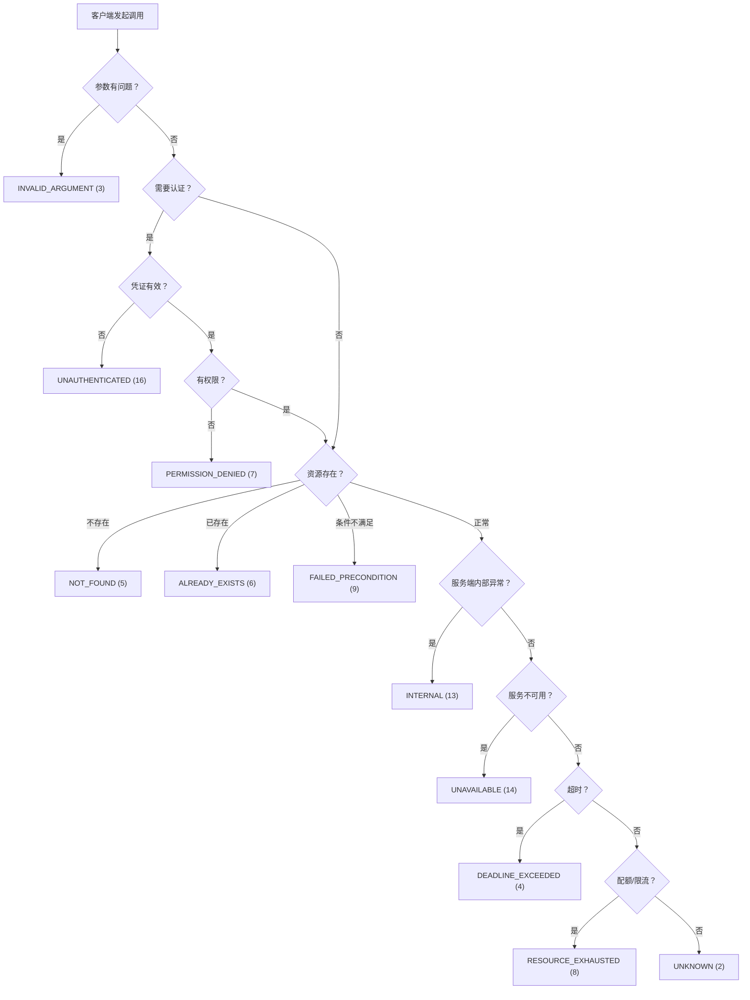
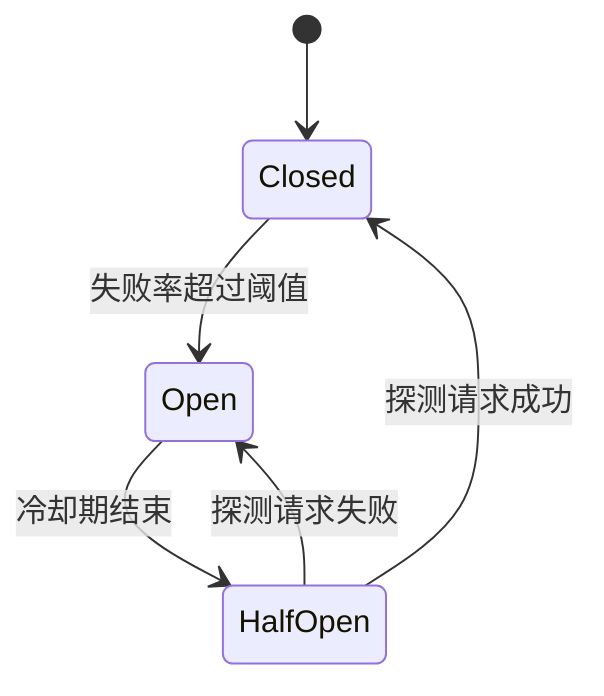
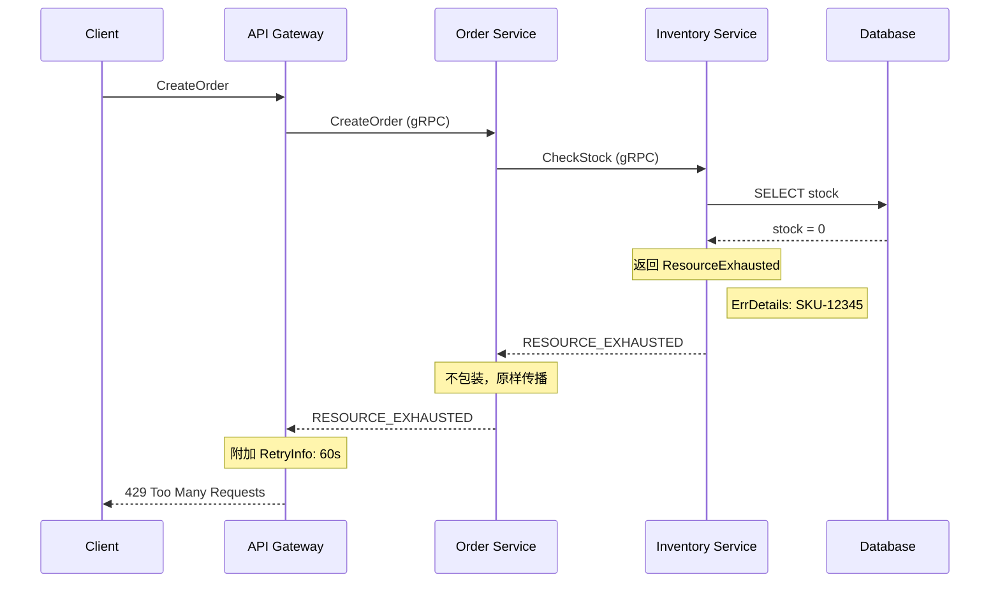

## 三、错误处理

RPC 框架中的错误处理与本地调用有着本质区别：本地函数调用失败时，异常的传播是单机、同步、确定性的；而 RPC 调用跨越了网络边界，面临着超时、序列化失败、服务不可用、部分成功等一系列分布式系统特有的问题。**错误处理的质量直接决定了微服务架构的鲁棒性**——处理不当会导致级联故障、数据不一致和难以定位的生产事故。

Netflix 在 2012 年的一次故障中，一个服务的响应变慢导致了数百个下游服务的连锁超时，整个推荐系统不可用超过 1 小时。Google 的 SRE 团队统计发现，在大规模集群中，每天都有机器宕机和网络抖动发生，错误处理机制是保障 SLA 的最后一道防线。

本节从 gRPC 的错误模型出发，系统性地讲解 RPC 框架中错误处理的理论基础、实战方法和工程最佳实践。

---

### 3.1 RPC 错误处理的本质区别

#### 3.1.1 本地调用 vs RPC 调用的错误模型

| 维度 | 本地调用 | RPC 调用 |
|------|---------|---------|
| 错误类型 | 异常（Exception） | 状态码（Status Code） |
| 传播方式 | 调用栈自动传播 | 跨网络序列化传输 |
| 错误信息 | 完整堆栈、类型系统 | 精简的状态码 + 可选消息 |
| 恢复机制 | try-catch | 重试、熔断、降级 |
| 超时语义 | 无（或 OS 层面） | 核心概念，需显式设置 |
| 部分失败 | 不存在 | 存在（如流式传输） |
| 幂等性 | 天然保证（无副作用假设） | 必须显式设计 |
| 调试难度 | 本地堆栈完整 | 跨服务链路追踪困难 |

理解这些差异是设计正确错误处理策略的前提。最根本的区别在于：本地调用的失败是**确定性**的（同一个 bug 一定触发同一个异常），而 RPC 调用的失败是**概率性**的（网络抖动、服务过载等问题时好时坏），因此需要一套完全不同的错误处理哲学。

#### 3.1.2 RPC 错误的四个层次

一个完整的 RPC 错误处理体系需要覆盖以下四个层次：


各层次的典型错误和处理策略：

| 层次 | 典型错误 | 处理策略 | 是否可恢复 |
|------|---------|---------|-----------|
| 传输层 | 连接拒绝、TCP RST、DNS 解析失败 | 重试（换节点）、健康检查剔除 | 通常可恢复 |
| 协议层 | Proto 不匹配、消息过大、压缩失败 | 升级客户端版本、调整配置 | 需要修复 |
| 应用层 | 参数校验失败、业务规则违反 | 根据状态码决定是否重试 | 取决于错误类型 |
| 系统层 | 线程池满、连接池耗尽、熔断触发 | 退避重试、降级、告警 | 等待恢复 |

在 gRPC 中，这四层错误被统一映射为 **gRPC Status Code**，但客户端需要能够区分底层传输错误和上层业务错误，才能做出正确的处理决策。传输层错误通常表现为连接级别的异常（不经过 gRPC 层），而协议层和应用层错误则映射为标准状态码。

---

### 3.2 gRPC 状态码体系

#### 3.2.1 完整状态码速查表

gRPC 定义了 17 个标准状态码（基于 HTTP/2），每个状态码有明确的语义和推荐使用场景：

| 状态码 | 数值 | 名称 | 含义 | 是否可重试 | 典型场景 |
|--------|------|------|------|-----------|---------|
| `OK` | 0 | 成功 | 调用正常完成 | — | 正常业务响应 |
| `CANCELLED` | 1 | 已取消 | 客户端主动取消 | 否 | 用户取消操作、超时取消 |
| `UNKNOWN` | 2 | 未知 | 未知错误 | 谨慎 | 未预期的异常，需排查 |
| `INVALID_ARGUMENT` | 3 | 参数无效 | 客户端传入非法参数 | 否 | 格式错误、值域越界 |
| `DEADLINE_EXCEEDED` | 4 | 超时 | 操作超时未完成 | 是（幂等） | 查询超时、大表扫描 |
| `NOT_FOUND` | 5 | 未找到 | 资源不存在 | 是 | 查询不存在的用户/订单 |
| `ALREADY_EXISTS` | 6 | 已存在 | 资源已存在 | 否 | 重复创建、唯一键冲突 |
| `PERMISSION_DENIED` | 7 | 权限不足 | 无权执行该操作 | 否 | 未授权访问、RBAC 拒绝 |
| `RESOURCE_EXHAUSTED` | 8 | 资源耗尽 | 资源不足或限流 | 是（退避后） | 配额用尽、内存不足 |
| `FAILED_PRECONDITION` | 9 | 前置条件不满足 | 操作条件不满足 | 否 | CAS 失败、非空目录删除 |
| `ABORTED` | 10 | 已中止 | 操作被中止 | 是 | 事务冲突、乐观锁失败 |
| `OUT_OF_RANGE` | 11 | 越界 | 操作超出范围 | 否 | 分页偏移越界、游标失效 |
| `UNIMPLEMENTED` | 12 | 未实现 | 方法未实现 | 否 | 调用了不存在的接口 |
| `INTERNAL` | 13 | 内部错误 | 服务端内部异常 | 谨慎 | 空指针、未捕获异常 |
| `UNAVAILABLE` | 14 | 不可用 | 服务不可用 | 是 | 服务重启、网络不可达 |
| `DATA_LOSS` | 15 | 数据丢失 | 不可恢复的数据损失 | 否 | 数据损坏、日志丢失 |
| `UNAUTHENTICATED` | 16 | 未认证 | 缺少有效凭证 | 否 | Token 过期、未携带凭证 |

#### 3.2.2 状态码选择决策树

选择正确的状态码是 RPC 错误处理的基础。以下决策流程帮助开发者快速定位：



**关键原则：** `INTERNAL` 表示服务端的 bug，`UNAVAILABLE` 表示服务暂时不可达。二者的区别决定了客户端是否应该重试——`INTERNAL` 通常不应重试（同样的 bug 会再次触发），而 `UNAVAILABLE` 应该重试（服务可能很快恢复）。

#### 3.2.3 容易混淆的状态码

| 状态码对 | 区别 | 选择标准 |
|---------|------|---------|
| `INTERNAL` vs `UNAVAILABLE` | bug vs 暂时不可达 | 内部异常用 INTERNAL，网络/重启用 UNAVAILABLE |
| `PERMISSION_DENIED` vs `UNAUTHENTICATED` | 无权限 vs 未认证 | 没登录用 UNAUTHENTICATED，登录了但没权限用 PERMISSION_DENIED |
| `INVALID_ARGUMENT` vs `FAILED_PRECONDITION` | 参数本身非法 vs 参数合法但条件不满足 | 参数格式错用 INVALID_ARGUMENT，余额不足用 FAILED_PRECONDITION |
| `ALREADY_EXISTS` vs `ABORTED` | 静态冲突 vs 动态冲突 | 首次创建冲突用 ALREADY_EXISTS，并发写入冲突用 ABORTED |
| `CANCELLED` vs `DEADLINE_EXCEEDED` | 客户端主动取消 vs 超时自动取消 | 用户点了取消按钮用 CANCELLED，等太久自动断开用 DEADLINE_EXCEEDED |

---

### 3.3 服务端错误处理实战

#### 3.3.1 Go 服务端：标准化错误返回

```go
package server

import (
    "context"
    "database/sql"
    "errors"
    "fmt"

    "google.golang.org/genproto/googleapis/rpc/errdetails"
    "google.golang.org/grpc/codes"
    "google.golang.org/grpc/status"
    "google.golang.org/protobuf/types/known/wrapperspb"
)

// 自定义业务错误类型
type BizError struct {
    Code    string
    Message string
    Details map[string]string
}

func (e *BizError) Error() string {
    return fmt.Sprintf("[%s] %s", e.Code, e.Message)
}

// 用户服务实现
type UserService struct {
    pb.UnimplementedUserServiceServer
    db *sql.DB
}

func (s *UserService) GetUser(ctx context.Context, req *pb.GetUserRequest) (*pb.User, error) {
    // 1. 参数校验 → INVALID_ARGUMENT
    if req.UserId == "" {
        st := status.New(codes.InvalidArgument, "user_id is required")
        // 附加详细字段信息，帮助客户端定位问题
        st, _ = st.WithDetails(&amp;errdetails.BadRequest{
            FieldViolations: []*errdetails.BadRequest_FieldViolation{
                {
                    Field:       "user_id",
                    Description: "must not be empty",
                },
            },
        })
        return nil, st.Err()
    }

    // 2. 查询数据库
    user, err := s.db.QueryUser(ctx, req.UserId)
    if err != nil {
        switch {
        case errors.Is(err, sql.ErrNoRows):
            // 资源不存在 → NOT_FOUND
            st, _ := status.New(codes.NotFound,
                fmt.Sprintf("user %s not found", req.UserId)).
                WithDetails(&amp;errdetails.ResourceInfo{
                    ResourceType: "user",
                    ResourceName: req.UserId,
                })
            return nil, st.Err()

        case errors.Is(err, context.DeadlineExceeded):
            // 上下文超时 → DEADLINE_EXCEEDED（不包装，保留原始状态码）
            return nil, status.Error(codes.DeadlineExceeded, "database query timeout")

        case errors.Is(err, context.Canceled):
            // 客户端取消 → CANCELLED
            return nil, status.Error(codes.Canceled, "request cancelled")

        default:
            // 其他数据库错误 → INTERNAL，记录详细日志但不暴露给客户端
            logger.Error("database query failed",
                "user_id", req.UserId,
                "error", err,
            )
            return nil, status.Error(codes.Internal,
                "internal server error, please retry later")
        }
    }

    return &amp;pb.User{
        Id:    user.ID,
        Name:  user.Name,
        Email: user.Email,
    }, nil
}

func (s *UserService) CreateUser(ctx context.Context, req *pb.CreateUserRequest) (*pb.User, error) {
    // 权限检查 → PERMISSION_DENIED
    if !hasPermission(ctx, "user:create") {
        st, _ := status.New(codes.PermissionDenied,
            "insufficient permissions to create user").
            WithDetails(&amp;errdetails.PreconditionFailure{
                Violations: []*errdetails.PreconditionFailure_Violation{
                    {
                        Type:        "permission",
                        Subject:     getUserIDFromContext(ctx),
                        Description: "requires user:create permission",
                    },
                },
            })
        return nil, st.Err()
    }

    // 唯一性检查 → ALREADY_EXISTS
    exists, err := s.db.CheckEmailExists(ctx, req.Email)
    if err != nil {
        logger.Error("check email failed", "error", err)
        return nil, status.Error(codes.Internal, "internal server error")
    }
    if exists {
        st, _ := status.New(codes.AlreadyExists,
            fmt.Sprintf("user with email %s already exists", req.Email)).
            WithDetails(&amp;errdetails.ErrorInfo{
                Reason: "DUPLICATE_EMAIL",
                Domain: "myapp.example.com",
                Metadata: map[string]string{
                    "email": req.Email,
                },
            })
        return nil, st.Err()
    }

    // 创建用户
    user, err := s.db.CreateUser(ctx, &amp;User{
        Name:  req.Name,
        Email: req.Email,
    })
    if err != nil {
        // 区分重复创建（竞态条件）和数据库内部错误
        if isDuplicateKeyError(err) {
            return nil, status.Error(codes.AlreadyExists,
                "user already exists (concurrent creation detected)")
        }
        logger.Error("create user failed", "error", err)
        return nil, status.Error(codes.Internal, "internal server error")
    }

    return &amp;pb.User{
        Id:    user.ID,
        Name:  user.Name,
        Email: user.Email,
    }, nil
}
```

**关键要点：**

1. **永远不要直接返回 `fmt.Errorf` 的结果**——这会被 gRPC 框架包装为 `UNKNOWN` 状态码，客户端无法区分错误类型
2. **`INTERNAL` 错误要记录详细日志但只向客户端返回通用消息**——避免泄露内部实现细节（数据库表名、SQL 语句等）
3. **使用 `errdetails` 附加结构化错误信息**——帮助客户端做精细化处理
4. **竞态条件要特别处理**——`CreateUser` 中检查唯一性后再创建，仍可能因并发请求导致重复键，需捕获并返回 `ALREADY_EXISTS`

#### 3.3.2 Python 服务端：优雅的错误处理

```python
from grpc import StatusCode
from grpc_status import rpc_status
from google.rpc import error_details_pb2, status_pb2
from google.protobuf import any_pb2
import logging

logger = logging.getLogger(__name__)


def create_error_status(code: StatusCode, message: str, details=None) -> Exception:
    """构建带有丰富错误详情的 gRPC 错误"""
    status = status_pb2.Status(
        code=code.value,
        message=message,
    )

    if details:
        for detail in details:
            any_detail = any_pb2.Any()
            any_detail.Pack(detail)
            status.details.append(any_detail)

    return rpc_status.to_exc(status)


def validate_user_request(request):
    """参数校验，返回结构化错误"""
    errors = []
    if not request.user_id:
        errors.append(error_details_pb2.BadRequest.FieldViolation(
            field="user_id",
            description="must not be empty",
        ))
    if request.email and "@" not in request.email:
        errors.append(error_details_pb2.BadRequest.FieldViolation(
            field="email",
            description="must be a valid email address",
        ))
    if errors:
        raise create_error_status(
            StatusCode.INVALID_ARGUMENT,
            "request validation failed",
            details=[error_details_pb2.BadRequest(field_violations=errors)]
        )


class UserServiceServicer(pb_grpc.UserServiceServicer):
    def GetUser(self, request, context):
        try:
            validate_user_request(request)
            user = self.db.query_user(request.user_id)
            if user is None:
                # NOT_FOUND
                resource_info = error_details_pb2.ResourceInfo(
                    resource_type="user",
                    resource_name=request.user_id,
                    owner_service="user-service",
                )
                raise create_error_status(
                    StatusCode.NOT_FOUND,
                    f"user {request.user_id} not found",
                    details=[resource_info],
                )
            return pb.User(id=user.id, name=user.name, email=user.email)

        except Exception as e:
            if isinstance(e, Exception) and hasattr(e, 'code'):
                raise  # 已经是 gRPC 错误，直接抛出
            # 未预期异常 → INTERNAL，记录日志
            logger.exception("GetUser failed for user_id=%s", request.user_id)
            raise create_error_status(
                StatusCode.INTERNAL,
                "internal server error",
            )
```

**Python 特有注意事项：**
- `grpc_status.to_exc()` 将 `google.rpc.Status` 转换为 Python 异常，客户端通过 `except grpc.RpcError` 捕获
- `hasattr(e, 'code')` 是检测是否为 gRPC 错误的简易方法，但更严谨的做法是使用 `grpc.is_channel_error(e)` 或 `rpc_status.from_call(e)`
- Python 的 gRPC 拦截器比 Go/Java 更灵活，可以在 `UnaryServerInterceptor` 中统一处理所有错误

#### 3.3.3 Java 服务端：拦截器统一错误处理

在 Java gRPC 中，可以通过 `ServerInterceptor` 实现全局的错误处理和日志记录：

```java
import io.grpc.*;
import io.grpc.ForwardingServerCall.SimpleForwardingServerCall;
import io.grpc.ForwardingServerCallListener.SimpleForwardingServerCallListener;
import org.slf4j.Logger;
import org.slf4j.LoggerFactory;

public class ErrorHandlingInterceptor implements ServerInterceptor {
    private static final Logger logger = LoggerFactory.getLogger(ErrorHandlingInterceptor.class);

    @Override
    public <ReqT, RespT> ServerCall.Listener<ReqT> interceptCall(
            ServerCall<ReqT, RespT> call,
            Metadata headers,
            ServerCallHandler<ReqT, RespT> next) {

        return new SimpleForwardingServerCallListener<ReqT>(
                next.startCall(call, headers)) {
            @Override
            public void onHalfClose() {
                try {
                    super.onHalfClose();
                } catch (Exception e) {
                    // 捕获所有未处理的异常，统一转换为 gRPC Status
                    logger.error("RPC method={} failed",
                        call.getMethodDescriptor().getFullMethodName(), e);

                    Status status;
                    if (e instanceof IllegalArgumentException) {
                        status = Status.INVALID_ARGUMENT.withDescription(e.getMessage());
                    } else if (e instanceof SecurityException) {
                        status = Status.PERMISSION_DENIED.withDescription(e.getMessage());
                    } else if (e instanceof io.grpc.StatusRuntimeException) {
                        // 已经是 gRPC 状态，保留原始状态码
                        status = ((StatusRuntimeException) e).getStatus();
                    } else {
                        // 不向客户端暴露内部错误细节
                        status = Status.INTERNAL
                            .withDescription("internal server error");
                    }

                    call.close(status, new Metadata());
                }
            }
        };
    }
}

// 注册拦截器
Server server = ServerBuilder.forPort(8080)
    .addInterceptor(new ErrorHandlingInterceptor())
    .addService(new UserServiceImpl())
    .build();
```

**Java 拦截器设计要点：**
- `onHalfClose()` 是捕获业务逻辑异常的最佳位置，因为此时客户端消息已接收完毕
- 已经是 `StatusRuntimeException` 的异常要保留原始状态码，避免二次包装
- 生产环境建议在拦截器中添加 Metrics 上报，按方法名和状态码统计错误率

---

### 3.4 客户端错误处理模式

#### 3.4.1 错误分类与处理策略

客户端收到 RPC 错误后，需要根据错误类型选择不同的处理策略：

```python
import grpc
from grpc import StatusCode
import time
import random


class RPCErrors:
    """RPC 错误分类器"""

    # 永久性错误：无论重试多少次都会失败，不应重试
    PERMANENT_ERRORS = frozenset({
        StatusCode.INVALID_ARGUMENT,
        StatusCode.NOT_FOUND,
        StatusCode.ALREADY_EXISTS,
        StatusCode.PERMISSION_DENIED,
        StatusCode.UNAUTHENTICATED,
        StatusCode.FAILED_PRECONDITION,
        StatusCode.OUT_OF_RANGE,
        StatusCode.UNIMPLEMENTED,
        StatusCode.DATA_LOSS,
    })

    # 可重试错误：由于暂时性原因失败，重试可能成功
    RETRYABLE_ERRORS = frozenset({
        StatusCode.UNAVAILABLE,
        StatusCode.DEADLINE_EXCEEDED,
        StatusCode.RESOURCE_EXHAUSTED,
        StatusCode.ABORTED,
    })

    @classmethod
    def should_retry(cls, grpc_status_code: StatusCode) -> bool:
        return grpc_status_code in cls.RETRYABLE_ERRORS

    @classmethod
    def is_auth_error(cls, grpc_status_code: StatusCode) -> bool:
        return grpc_status_code in (
            StatusCode.UNAUTHENTICATED,
            StatusCode.PERMISSION_DENIED,
        )

    @classmethod
    def classify(cls, grpc_status_code: StatusCode) -> str:
        """返回错误分类标签，用于监控和告警"""
        if grpc_status_code == StatusCode.OK:
            return "success"
        if grpc_status_code in cls.RETRYABLE_ERRORS:
            return "retryable"
        if grpc_status_code in cls.PERMANENT_ERRORS:
            return "permanent"
        return "unknown"
```

#### 3.4.2 指数退避重试（Exponential Backoff with Jitter）

```python
import random
import time
from functools import wraps


def rpc_retry(
    max_retries=3,
    base_delay=0.1,       # 初始延迟 100ms
    max_delay=5.0,        # 最大延迟 5s
    jitter=True,
    retryable_codes=None,
):
    """
    带指数退避和抖动的 RPC 重试装饰器。

    退避公式：delay = min(base_delay * 2^attempt, max_delay)
    加入抖动避免惊群效应（Thundering Herd）。

    抖动策略对比：
    - 纯指数退避：所有客户端在完全相同的时间重试，造成瞬间流量峰值
    - Full Jitter：delay = random(0, min(base * 2^attempt, max))
    - Equal Jitter：delay = min(base * 2^attempt, max) / 2 + random(0, min(base * 2^attempt, max) / 2)
    - Decorrelated Jitter：delay = min(random(base, delay_prev * 3), max)
    本实现使用 Equal Jitter 策略，兼顾退避效果和分散性。
    """
    if retryable_codes is None:
        retryable_codes = {StatusCode.UNAVAILABLE, StatusCode.DEADLINE_EXCEEDED}

    def decorator(func):
        @wraps(func)
        def wrapper(*args, **kwargs):
            last_exception = None
            for attempt in range(max_retries + 1):
                try:
                    return func(*args, **kwargs)
                except grpc.RpcError as e:
                    last_exception = e
                    code = e.code()

                    # 非重试错误或最后一次尝试，直接抛出
                    if code not in retryable_codes or attempt == max_retries:
                        raise

                    # 计算退避延迟
                    delay = min(base_delay * (2 ** attempt), max_delay)
                    if jitter:
                        delay = delay * random.uniform(0.5, 1.0)

                    logger.warning(
                        "RPC call failed (attempt %d/%d), code=%s, "
                        "retrying in %.2fs: %s",
                        attempt + 1, max_retries + 1,
                        code.name, delay, e.details(),
                    )
                    time.sleep(delay)

            raise last_exception
        return wrapper
    return decorator


# 使用示例
@rpc_retry(max_retries=3, base_delay=0.2)
def get_user_with_retry(stub, user_id):
    return stub.GetUser(pb.GetUserRequest(user_id=user_id))
```

#### 3.4.3 对冲请求（Hedged Requests）

当延迟敏感度高于重试成本时，可以使用对冲请求：同时向多个副本发送请求，取第一个成功的响应。与重试不同，对冲请求不是等失败了再重试，而是**并行发送**。

```python
import concurrent.futures
from typing import Callable, TypeVar, Optional

T = TypeVar('T')


def hedge_request(
    func: Callable,
    *args,
    max_hedges: int = 2,
    hedging_delay: float = 0.1,  # 第二个请求延迟 100ms 发出
    **kwargs,
) -> Optional[T]:
    """
    对冲请求：先发一个请求，延迟后发第二个，取先到的成功响应。

    适用场景：
    - P99 延迟敏感的查询类请求
    - 请求本身是幂等的（重复执行无副作用）
    - 下游服务存在尾延迟问题

    不适用场景：
    - 写操作（非幂等）
    - 服务端已经过载（并行请求会加重负担）
    """
    results = [None]
    errors = [None]
    first_result = concurrent.futures.Future()

    def _execute():
        try:
            result = func(*args, **kwargs)
            return result
        except Exception as e:
            return e

    with concurrent.futures.ThreadPoolExecutor(max_workers=max_hedges + 1) as pool:
        # 立即发起第一个请求
        futures = [pool.submit(_execute)]

        # 延迟后发起对冲请求
        for i in range(max_hedges):
            time.sleep(hedging_delay)
            futures.append(pool.submit(_execute))

        # 等待第一个成功结果
        for future in concurrent.futures.as_completed(futures):
            result = future.result()
            if not isinstance(result, Exception):
                # 取消剩余请求
                for f in futures:
                    f.cancel()
                return result

        # 所有请求都失败了
        raise Exception("all hedge requests failed")
```

**对冲请求 vs 重试的选择标准：**

| 维度 | 重试 | 对冲请求 |
|------|------|---------|
| 时机 | 失败后发送 | 并行/延迟发送 |
| 延迟影响 | 增加 N 倍延迟 | 最坏情况 = 单次请求延迟 + hedging_delay |
| 资源开销 | 较低（串行） | 较高（并行） |
| 适用操作 | 幂等操作 | 幂等且延迟敏感的查询 |
| 典型用户 | 普通业务请求 | P99 延迟要求 < 100ms 的搜索/推荐 |

#### 3.4.4 客户端统一错误处理封装

```python
class RPCClient:
    """带完整错误处理的 RPC 客户端基类"""

    def __init__(self, channel, service_stub_class):
        self._channel = channel
        self._stub = service_stub_class(channel)

    def call(self, method_name: str, request, timeout=30.0, metadata=None):
        """
        统一的 RPC 调用入口，处理所有错误场景。

        返回 (result, None) 或 (None, error_info)
        """
        method = getattr(self._stub, method_name)
        try:
            response = method(request, timeout=timeout, metadata=metadata or {})
            return response, None

        except grpc.RpcError as e:
            error_info = self._handle_rpc_error(e, method_name)
            return None, error_info

        except grpc.FutureTimeoutError:
            # unary 调用超时
            return None, {
                "code": "DEADLINE_EXCEEDED",
                "message": f"call {method_name} timed out after {timeout}s",
                "retryable": True,
            }

    def _handle_rpc_error(self, e: grpc.RpcError, method_name: str):
        """统一的错误信息提取和分类"""
        code = e.code()
        details = e.details()
        metadata = dict(e.trailing_metadata()) if e.trailing_metadata() else {}

        error_info = {
            "code": code.name,
            "message": details,
            "grpc_code": code,
            "retryable": RPCErrors.should_retry(code),
            "metadata": metadata,
            "method": method_name,
        }

        # 结构化日志记录
        log_level = "warning" if error_info["retryable"] else "error"
        getattr(logger, log_level)(
            "RPC call failed: method=%s code=%s details=%s retryable=%s",
            method_name, code.name, details, error_info["retryable"],
        )

        return error_info


# 使用示例
client = RPCClient(channel, pb_grpc.UserServiceStub)
user, error = client.call("GetUser", pb.GetUserRequest(user_id="123"))
if error:
    if error["retryable"]:
        # 触发重试逻辑
        ...
    elif error["grpc_code"] == StatusCode.NOT_FOUND:
        # 返回空结果或默认值
        ...
    elif RPCErrors.is_auth_error(error["grpc_code"]):
        # 刷新 Token 后重试
        ...
```

---

### 3.5 Rich Error Model：结构化错误详情

#### 3.5.1 为什么需要 Rich Error Model

gRPC 的 Status Code 只提供了粗粒度的错误分类（17 种），在实际业务中往往不够用。例如：

- `INVALID_ARGUMENT` 无法告诉客户端具体哪个参数有问题
- `ALREADY_EXISTS` 无法说明已存在的资源的具体信息
- `FAILED_PRECONDITION` 无法说明具体是哪个前置条件不满足

gRPC 的 **Rich Error Model**（基于 `google.rpc.Status`）允许在错误中附加结构化的详情信息，实现了"粗粒度状态码 + 细粒度详情"的两层错误传递模型。

#### 3.5.2 标准错误详情类型

| 类型 | 包路径 | 用途 | 适用状态码 |
|------|--------|------|-----------|
| `BadRequest` | `errdetails.BadRequest` | 字段级参数校验错误 | INVALID_ARGUMENT |
| `ErrorInfo` | `errdetails.ErrorInfo` | 机器可读的错误分类 | 通用 |
| `RetryInfo` | `errdetails.RetryInfo` | 建议的重试间隔 | RESOURCE_EXHAUSTED, UNAVAILABLE |
| `DebugInfo` | `errdetails.DebugInfo` | 调试堆栈（内部使用） | INTERNAL |
| `ResourceInfo` | `errdetails.ResourceInfo` | 资源标识信息 | NOT_FOUND, FAILED_PRECONDITION |
| `PreconditionFailure` | `errdetails.PreconditionFailure` | 前置条件不满足详情 | FAILED_PRECONDITION |
| `QuotaFailure` | `errdetails.QuotaFailure` | 配额超额详情 | RESOURCE_EXHAUSTED |
| `Help` | `errdetails.Help` | 相关链接/文档 | 通用 |
| `LocalizedMessage` | `errdetails.LocalizedMessage` | 国际化错误消息 | 通用 |

#### 3.5.3 Proto 定义与使用

```protobuf
syntax = "proto3";

package myapp.v1;

import "google/rpc/error_details.proto";
import "google/rpc/status.proto";

// 在 proto 文件中导入 error_details.proto 即可使用
// 服务端通过 WithDetails() 附加信息
// 客户端通过 status.FromError() + Details() 解析

service OrderService {
  rpc CreateOrder(CreateOrderRequest) returns (Order);
}
```

```python
# 客户端解析 Rich Error
from google.rpc import errdetails, status_pb2
from google.protobuf import any_pb2


def parse_rpc_error(e: grpc.RpcError):
    """解析 Rich Error，提取结构化信息"""
    # 获取基础状态
    code = e.code()
    message = e.details()

    # 尝试解析 details
    trailing_metadata = dict(e.trailing_metadata())
    status_bin = trailing_metadata.get("grpc-status-details-bin")
    if not status_bin:
        return {"code": code, "message": message, "details": []}

    # 解析 google.rpc.Status
    status = status_pb2.Status()
    status.ParseFromString(status_bin)

    parsed_details = []
    for any_detail in status.details:
        # 尝试解析为已知类型
        if any_detail.Is(errdetails.BadRequest.DESCRIPTOR):
            bad_request = errdetails.BadRequest()
            any_detail.Unpack(bad_request)
            parsed_details.append({
                "type": "BadRequest",
                "violations": [
                    {"field": v.field, "description": v.description}
                    for v in bad_request.field_violations
                ],
            })
        elif any_detail.Is(errdetails.ErrorInfo.DESCRIPTOR):
            error_info = errdetails.ErrorInfo()
            any_detail.Unpack(error_info)
            parsed_details.append({
                "type": "ErrorInfo",
                "reason": error_info.reason,
                "domain": error_info.domain,
                "metadata": dict(error_info.metadata),
            })
        elif any_detail.Is(errdetails.RetryInfo.DESCRIPTOR):
            retry_info = errdetails.RetryInfo()
            any_detail.Unpack(retry_info)
            parsed_details.append({
                "type": "RetryInfo",
                "retry_delay_seconds": retry_info.retry_delay.seconds,
            })

    return {
        "code": code,
        "message": message,
        "details": parsed_details,
    }
```

#### 3.5.4 客户端根据 Rich Error 做精细化处理

```python
def handle_create_order_error(e: grpc.RpcError):
    """根据 Rich Error 的 details 做精细化处理"""
    parsed = parse_rpc_error(e)

    for detail in parsed["details"]:
        if detail["type"] == "BadRequest":
            # 字段校验失败 → 提示用户修正
            field_errors = {
                v["field"]: v["description"]
                for v in detail["violations"]
            }
            return {"action": "show_validation_errors", "errors": field_errors}

        elif detail["type"] == "ErrorInfo":
            reason = detail["reason"]
            if reason == "INSUFFICIENT_BALANCE":
                return {"action": "show_insufficient_balance",
                        "metadata": detail["metadata"]}
            elif reason == "STOCK_EXHAUSTED":
                return {"action": "show_out_of_stock",
                        "sku": detail["metadata"].get("sku")}

        elif detail["type"] == "RetryInfo":
            retry_delay = detail["retry_delay_seconds"]
            return {"action": "auto_retry", "delay": retry_delay}

    # 无法解析的错误，回退到通用处理
    return {"action": "show_generic_error", "message": parsed["message"]}
```

---

### 3.6 流式 RPC 的错误处理

#### 3.6.1 四种通信模式的错误处理差异

| 通信模式 | 错误发送方 | 错误时机 | 处理要点 |
|---------|-----------|---------|---------|
| Unary | 服务端 | 任意时刻 | 单个错误，完整处理 |
| Server Streaming | 服务端 | 任意时刻 | 可在已发送部分数据后中断 |
| Client Streaming | 服务端 | 收到全部客户端消息后 | 客户端可能已发送多条消息 |
| Bidirectional Streaming | 双方 | 任意时刻 | 需处理双向错误传播 |

#### 3.6.2 服务端流式错误处理

```python
# 服务端：在流式响应中优雅地处理错误
def ListOrders(self, request, context):
    try:
        orders = self.db.query_orders(request.user_id)
        for order in orders:
            # 检查客户端是否已断开
            if context.is_active():
                try:
                    yield pb.Order(id=order.id, status=order.status)
                except Exception as e:
                    # 单条消息发送失败，记录日志后继续
                    logger.warning("failed to send order %s: %s", order.id, e)
                    continue
            else:
                # 客户端已断开，停止流式发送
                logger.info("client disconnected, stopping stream")
                break
    except Exception as e:
        logger.exception("ListOrders failed for user_id=%s", request.user_id)
        # 在流式 RPC 中，context.abort() 会立即终止流并发送错误
        context.abort(
            grpc.StatusCode.INTERNAL,
            "failed to list orders",
        )


# 客户端：处理流式响应中的错误
def receive_orders(stub, user_id):
    try:
        responses = stub.ListOrders(
            pb.ListOrdersRequest(user_id=user_id),
            timeout=30.0,
        )
        for response in responses:
            process_order(response)
    except grpc.RpcError as e:
        if e.code() == grpc.StatusCode.CANCELLED:
            print("stream was cancelled")
        elif e.code() == grpc.StatusCode.DEADLINE_EXCEEDED:
            print("stream timed out, received partial results")
        else:
            print(f"stream error: {e.code().name} - {e.details()}")
```

#### 3.6.3 双向流式错误处理

```python
# 双向流式：双方都可以独立发送错误
def ChatStream(self, request_iterator, context):
    """双向聊天流"""
    try:
        for message in request_iterator:
            try:
                # 处理收到的消息
                response = self.process_message(message)
                if context.is_active():
                    yield response
            except ValidationError as e:
                # 验证错误 → 发送错误响应但不中断流
                if context.is_active():
                    yield pb.ChatMessage(
                        type=pb.MessageType.ERROR,
                        content=f"invalid message: {e}",
                    )
            except Exception as e:
                logger.exception("error processing chat message")
                # 严重错误 → 中断流
                context.abort(
                    grpc.StatusCode.INTERNAL,
                    "failed to process message",
                )
    except grpc.RpcError:
        # 客户端提前关闭了流
        logger.info("client closed the stream")
    except Exception as e:
        logger.exception("ChatStream failed")
        context.abort(grpc.StatusCode.INTERNAL, "chat stream failed")
```

#### 3.6.4 流式 RPC 错误处理的关键原则

1. **客户端断开检测**：服务端必须在每次发送前调用 `context.is_active()`，避免向已断开的客户端发送数据导致不必要的错误
2. **部分成功语义**：流式 RPC 允许"已发送部分数据后失败"，客户端需要设计能够处理不完整结果的逻辑
3. **错误与数据混合**：在双向流中，可以通过消息类型字段（如 `MessageType.ERROR`）在流内传递非致命错误，而不中断流
4. **资源清理**：流中断后，双方都必须正确释放持有的资源（数据库连接、文件句柄等），通常使用 `defer` 或 `try-finally`

---

### 3.7 熔断器模式（Circuit Breaker）

熔断器是 RPC 错误处理中与重试互补的核心模式。如果说重试是"给失败的请求第二次机会"，那么熔断器就是"在大量失败时主动切断请求，避免无意义的重试和级联故障"。

#### 3.7.1 熔断器的三态模型



| 状态 | 行为 | 触发条件 |
|------|------|---------|
| **Closed** | 正常放行所有请求，同时统计失败率 | 初始状态 |
| **Open** | 直接拒绝所有请求，快速失败（返回 UNAVAILABLE） | 失败率超过配置阈值（如 50%） |
| **Half-Open** | 允许少量探测请求通过 | 冷却期结束（如 30 秒） |

核心思想：当服务持续出错时，与其让每个请求都等待超时后失败（浪费时间和资源），不如快速失败并等待服务恢复。这避免了"重试风暴"——所有客户端同时重试已过载的服务，导致负载进一步恶化。

#### 3.7.2 Go 实现：带滑动窗口的熔断器

```go
package circuitbreaker

import (
    "sync"
    "time"
)

type State int

const (
    StateClosed   State = iota
    StateOpen
    StateHalfOpen
)

type CircuitBreaker struct {
    mu               sync.Mutex
    state            State
    failureCount     int
    successCount     int
    lastFailureTime  time.Time

    // 配置参数
    failureThreshold int           // 触发熔断的失败次数
    successThreshold int           // 半开状态恢复所需成功次数
    cooldownPeriod   time.Duration // 熔断冷却期
    windowSize       time.Duration // 滑动窗口大小
    window           []requestRecord
}

type requestRecord struct {
    success   bool
    timestamp time.Time
}

func NewCircuitBreaker(failureThreshold, successThreshold int, cooldown, window time.Duration) *CircuitBreaker {
    return &amp;CircuitBreaker{
        state:            StateClosed,
        failureThreshold: failureThreshold,
        successThreshold: successThreshold,
        cooldownPeriod:   cooldown,
        windowSize:       window,
        window:           make([]requestRecord, 0, failureThreshold*2),
    }
}

// Execute 通过熔断器执行 RPC 调用
func (cb *CircuitBreaker) Execute(fn func() error) error {
    cb.mu.Lock()
    state := cb.state

    switch state {
    case StateOpen:
        // 检查冷却期是否已过
        if time.Since(cb.lastFailureTime) > cb.cooldownPeriod {
            cb.state = StateHalfOpen
            cb.successCount = 0
            state = StateHalfOpen
        } else {
            cb.mu.Unlock()
            return ErrCircuitOpen
        }

    case StateHalfOpen:
        // 半开状态放行请求，但记录探测结果
    }

    cb.mu.Unlock()

    // 执行调用
    err := fn()

    cb.mu.Lock()
    defer cb.mu.Unlock()

    // 更新滑动窗口
    now := time.Now()
    cb.window = append(cb.window, requestRecord{success: err == nil, timestamp: now})

    // 清理过期记录
    cutoff := now.Add(-cb.windowSize)
    validWindow := cb.window[:0]
    for _, r := range cb.window {
        if r.timestamp.After(cutoff) {
            validWindow = append(validWindow, r)
        }
    }
    cb.window = validWindow

    // 根据当前状态更新
    switch cb.state {
    case StateClosed:
        cb.failureCount = cb.countFailures()
        if cb.failureCount >= cb.failureThreshold {
            cb.state = StateOpen
            cb.lastFailureTime = now
            logger.Warn("circuit breaker opened",
                "failures", cb.failureCount,
                "threshold", cb.failureThreshold,
            )
        }

    case StateHalfOpen:
        if err != nil {
            cb.state = StateOpen
            cb.lastFailureTime = now
        } else {
            cb.successCount++
            if cb.successCount >= cb.successThreshold {
                cb.state = StateClosed
                cb.failureCount = 0
                cb.window = cb.window[:0]
                logger.Info("circuit breaker closed")
            }
        }
    }

    return err
}

func (cb *CircuitBreaker) countFailures() int {
    count := 0
    for _, r := range cb.window {
        if !r.success {
            count++
        }
    }
    return count
}

var ErrCircuitOpen = fmt.Errorf("circuit breaker is open")
```

#### 3.7.3 熔断器与重试的配合

熔断器和重试必须配合使用，否则会产生冲突：

```python
class ResilientRPCClient:
    """集成熔断器 + 重试 + 超时的客户端"""

    def __init__(self, stub, circuit_breaker):
        self._stub = stub
        self._breaker = circuit_breaker

    def call_with_resilience(self, method_name, request, timeout=5.0):
        """
        调用链路：超时 → 熔断器 → RPC 调用 → 重试（如果可重试）

        关键设计：熔断器在重试之外，避免重试已知不可用的服务
        """
        method = getattr(self._stub, method_name)

        # 1. 熔断器检查：如果服务已熔断，直接快速失败
        if self._breaker.is_open():
            raise CircuitBreakerOpenError(
                f"circuit breaker is open for {method_name}"
            )

        # 2. 执行 RPC 调用（通过熔断器的 Execute）
        def _rpc_call():
            return method(request, timeout=timeout)

        try:
            result = self._breaker.execute(_rpc_call)
            self._breaker.record_success()
            return result
        except grpc.RpcError as e:
            self._breaker.record_failure()
            raise
```

**配合原则：**

| 场景 | 熔断器行为 | 重试行为 |
|------|-----------|---------|
| 服务正常 | Closed，放行 | 不触发 |
| 偶尔失败（< 阈值） | Closed，记录 | 触发重试 |
| 大量失败（≥ 阈值） | Open，快速失败 | 不触发（被熔断器拦截） |
| 冷却期后 | Half-Open，放探测请求 | 不触发（只有一个探测请求） |
| 探测成功 | Closed，恢复正常 | 可以触发 |

#### 3.7.4 熔断器参数调优指南

| 参数 | 推荐值 | 调优方向 |
|------|--------|---------|
| failureThreshold | 滑动窗口内 50% 失败 | 太低会误熔断（网络抖动），太高会延迟熔断 |
| successThreshold | 3-5 次连续成功 | 太低可能恢复了假阳性，太高会延迟恢复 |
| cooldownPeriod | 10-60 秒 | 取决于下游服务恢复时间，太快会频繁探测 |
| windowSize | 30-120 秒 | 太短无法反映真实失败率，太长会延迟触发 |

**常见陷阱：**
- 不要为每个请求创建独立的熔断器——应该按服务或方法粒度共享同一个熔断器实例
- 熔断器的状态变化需要触发告警——Open 状态意味着下游服务有问题
- Half-Open 的探测请求不要使用重试——探测的目的就是测试服务是否恢复

---

### 3.8 错误处理与拦截器的集成

#### 3.8.1 服务端：通过拦截器统一错误日志和监控

```go
// Go 服务端拦截器：统一错误处理
func ErrorLoggingInterceptor() grpc.UnaryServerInterceptor {
    return func(
        ctx context.Context,
        req interface{},
        info *grpc.UnaryServerInfo,
        handler grpc.UnaryHandler,
    ) (interface{}, error) {
        start := time.Now()
        resp, err := handler(ctx, req)
        duration := time.Since(start)

        // 提取 gRPC 状态码
        st, _ := status.FromError(err)

        // 结构化日志
        logEntry := map[string]interface{}{
            "method":     info.FullMethod,
            "code":       st.Code().String(),
            "duration_ms": duration.Milliseconds(),
        }
        if st.Code() != codes.OK {
            logEntry["error_message"] = st.Message()
            // 提取 Rich Error Details
            for _, detail := range st.Details() {
                switch d := detail.(type) {
                case *errdetails.ErrorInfo:
                    logEntry["error_reason"] = d.Reason
                case *errdetails.BadRequest:
                    logEntry["validation_errors"] = len(d.FieldViolations)
                }
            }
            logger.Error("RPC call failed", logEntry)
        } else {
            logger.Info("RPC call completed", logEntry)
        }

        // 指标上报
        rpcCallCounter.WithLabelValues(
            info.FullMethod, st.Code().String(),
        ).Inc()
        rpcCallDuration.WithLabelValues(
            info.FullMethod,
        ).Observe(duration.Seconds())

        return resp, err
    }
}
```

#### 3.8.2 客户端：通过拦截器统一错误处理

```go
// Go 客户端拦截器：统一错误处理和重试
func RetryInterceptor(maxRetries int, retryableCodes map[codes.Code]bool) grpc.UnaryClientInterceptor {
    return func(
        ctx context.Context,
        method string,
        req, reply interface{},
        cc *grpc.ClientConn,
        invoker grpc.UnaryInvoker,
        opts ...grpc.CallOption,
    ) error {
        var lastErr error

        for attempt := 0; attempt <= maxRetries; attempt++ {
            err := invoker(ctx, method, req, reply, cc, opts...)
            if err == nil {
                return nil // 成功
            }

            lastErr = err
            st, _ := status.FromError(err)

            // 不可重试或最后一次尝试
            if !retryableCodes[st.Code()] || attempt == maxRetries {
                return err
            }

            // 指数退避 + 抖动
            delay := time.Duration(math.Min(
                float64(time.Second)*math.Pow(2, float64(attempt)),
                float64(5*time.Second),
            ))
            delay = time.Duration(float64(delay) * (0.5 + rand.Float64()*0.5))

            log.Printf("retrying %s (attempt %d/%d) after %v: %s",
                method, attempt+1, maxRetries, delay, st.Message())
            time.Sleep(delay)
        }

        return lastErr
    }
}
```

#### 3.8.3 拦截器链的设计模式

gRPC 的拦截器支持链式组合（`grpc.ChainUnaryInterceptor`），错误处理拦截器的顺序有讲究：

```go
s := grpc.NewServer(
    // 拦截器链：从外到内执行
    grpc.ChainUnaryInterceptor(
        RecoveryInterceptor,     // 1. 最外层：panic 恢复，保证进程不崩溃
        MetricsInterceptor,      // 2. 记录所有请求的指标（包括失败的）
        TracingInterceptor,      // 3. 分布式追踪，创建 Span
        AuthInterceptor,         // 4. 认证授权
        RateLimitInterceptor,    // 5. 限流
        ErrorLoggingInterceptor, // 6. 最内层：记录错误日志（看到最终状态码）
    ),
)
```

**顺序原则：**
1. **安全类拦截器靠外**——认证/授权失败应该尽早拒绝，减少无效处理
2. **可观测性拦截器靠中**——Metrics 需要看到所有请求（含被拦截的）
3. **错误处理拦截器靠内**——它需要看到经过所有业务逻辑后的最终错误状态

---

### 3.9 错误处理与分布式追踪的协同

#### 3.9.1 将错误信息注入 Trace

在分布式系统中，错误信息需要与 Trace/Span 关联，才能在链路追踪系统中定位问题：

```go
import "go.opentelemetry.io/otel/codes"

func tracedUnaryInterceptor() grpc.UnaryClientInterceptor {
    return func(ctx context.Context, method string,
        req, reply interface{}, cc *grpc.ClientConn,
        invoker grpc.UnaryInvoker, opts ...grpc.CallOption) error {

        ctx, span := tracer.Start(ctx, method)
        defer span.End()

        err := invoker(ctx, method, req, reply, cc, opts...)
        if err != nil {
            st, _ := status.FromError(err)
            // 将 gRPC 错误映射到 OpenTelemetry 状态
            span.SetStatus(codes.Error, st.Message())
            span.SetAttributes(
                attribute.Int("rpc.grpc.status_code", int(st.Code())),
                attribute.String("rpc.error.message", st.Message()),
            )

            // 记录 Rich Error Details 到 Span Events
            for _, detail := range st.Details() {
                if errorInfo, ok := detail.(*errdetails.ErrorInfo); ok {
                    span.AddEvent("rpc_error_detail", trace.WithAttributes(
                        attribute.String("error.reason", errorInfo.Reason),
                        attribute.String("error.domain", errorInfo.Domain),
                    ))
                }
            }
        } else {
            span.SetStatus(codes.Ok, "")
        }

        return err
    }
}
```

#### 3.9.2 错误传播链路示意



**错误传播原则：**

1. **不要吞掉错误**：除非有明确的降级策略，否则应将错误向上传播
2. **不要错误包装**：下层的 `NOT_FOUND` 不应被包装成上层的 `INTERNAL`
3. **可以丰富错误**：在传播过程中附加更多上下文信息（如 `RetryInfo`）
4. **保持状态码语义**：如果底层是 `UNAVAILABLE`，中间层也应该返回 `UNAVAILABLE`
5. **逐层添加上下文**：每层可以追加自己的 `ErrorInfo`，形成错误链（类似异常链）

---

### 3.10 错误预算与 SLO 驱动的错误处理

#### 3.10.1 什么是错误预算

错误预算（Error Budget）是 SRE（Site Reliability Engineering）的核心概念，它将 SLA/SLO 转化为可操作的工程决策依据：

错误预算 = 1 - SLO 目标

示例：SLO = 99.9%（每月允许 0.1% 的请求失败）
30 天 × 24 小时 × 60 分钟 × 60 秒 = 2,592,000 秒
0.1% × 2,592,000 = 2,592 秒 = 43.2 分钟
→ 每月允许最多 43.2 分钟的不可用时间

#### 3.10.2 错误预算对 RPC 错误处理的影响

错误预算直接影响你的重试和熔断策略：

| 错误预算状态 | 含义 | 对错误处理的影响 |
|------------|------|----------------|
| 充裕（> 50%） | 系统运行良好 | 正常重试策略，可以激进一些 |
| 中等（20%-50%） | 开始消耗 | 加大重试间隔，降低熔断阈值 |
| 紧张（< 20%） | 需要保守 | 减少重试次数，放宽熔断阈值，快速失败优先 |
| 耗尽（= 0%） | 已违反 SLO | 停止所有非必要重试，全力保障可用性 |

#### 3.10.3 自适应错误处理

```python
class AdaptiveErrorPolicy:
    """基于错误预算的自适应错误处理策略"""

    def __init__(self, slo_target=0.999, window_minutes=60):
        self.slo_target = slo_target
        self.window = window_minutes * 60  # 转为秒
        self.total_requests = 0
        self.failed_requests = 0

    def record(self, success: bool):
        self.total_requests += 1
        if not success:
            self.failed_requests += 1

    @property
    def error_budget_remaining(self) -> float:
        """返回剩余错误预算比例（0.0 ~ 1.0）"""
        if self.total_requests == 0:
            return 1.0
        actual_error_rate = self.failed_requests / self.total_requests
        budget = 1.0 - self.slo_target
        consumed = actual_error_rate / budget if budget > 0 else 1.0
        return max(0.0, 1.0 - consumed)

    def get_max_retries(self) -> int:
        """根据错误预算剩余量动态调整最大重试次数"""
        budget = self.error_budget_remaining
        if budget > 0.5:
            return 3   # 预算充裕，标准重试
        elif budget > 0.2:
            return 2   # 预算中等，减少重试
        elif budget > 0.0:
            return 1   # 预算紧张，最多重试一次
        else:
            return 0   # 预算耗尽，不重试

    def should_circuit_break(self, recent_error_rate: float) -> bool:
        """错误预算越紧张，熔断越容易触发"""
        budget = self.error_budget_remaining
        threshold = 0.5 * (1 + budget)  # 预算充裕→50%阈值，耗尽→100%阈值
        return recent_error_rate >= threshold
```

---

### 3.11 常见误区与反模式

#### 3.11.1 误区一：所有错误都返回 INTERNAL

```python
# ❌ 反模式：捕获所有异常后统一返回 INTERNAL
def get_user(request, context):
    try:
        user = db.query(request.user_id)
        return user
    except Exception as e:
        # 这会导致客户端无法区分"参数错误"和"数据库挂了"
        context.abort(grpc.StatusCode.INTERNAL, str(e))

# ✅ 正确做法：区分异常类型，返回对应状态码
def get_user(request, context):
    try:
        user = db.query(request.user_id)
        return user
    except NotFoundError:
        context.abort(grpc.StatusCode.NOT_FOUND, "user not found")
    except ValidationError as e:
        context.abort(grpc.StatusCode.INVALID_ARGUMENT, str(e))
    except DatabaseError as e:
        logger.error("database error: %s", e)
        context.abort(grpc.StatusCode.INTERNAL, "internal error")
```

#### 3.11.2 误区二：错误消息包含敏感信息

```python
# ❌ 反模式：将内部实现细节暴露给客户端
context.abort(
    grpc.StatusCode.INTERNAL,
    f"PostgreSQL connection pool exhausted: 50/50 connections in use, "
    f"query timeout after 30s on table orders WHERE user_id=123 "
    f"AND status='pending' using index idx_orders_user_status"
)

# ✅ 正确做法：向客户端返回通用消息，详细信息写入日志
logger.error(
    "database connection pool exhausted",
    table="orders",
    query="SELECT * FROM orders WHERE user_id=123 AND status='pending'",
    pool_stats={"active": 50, "max": 50},
)
context.abort(grpc.StatusCode.RESOURCE_EXHAUSTED,
    "service temporarily unavailable, please retry later")
```

**泄露风险清单——永远不要出现在错误消息中的内容：**
- 数据库表名、列名、SQL 语句
- 内部 IP 地址、端口号
- 连接池配置、线程池大小
- 文件路径、堆栈信息
- 第三方服务的内部 URL
- 加密密钥、Token、密码

#### 3.11.3 误区三：无限重试

```python
# ❌ 反模式：无限重试导致级联过载
while True:
    try:
        return stub.GetData(request)
    except grpc.RpcError:
        time.sleep(1)  # 固定间隔重试，会放大故障

# ✅ 正确做法：限制重试次数 + 指数退避 + 最大延迟 + 抖动
@rpc_retry(max_retries=3, base_delay=0.5, max_delay=10.0)
def get_data_with_retry(stub, request):
    return stub.GetData(request)
```

#### 3.11.4 误区四：忽略 CANCELLED 状态码

```python
# ❌ 反模式：将 CANCELLED 视为可重试错误
RETRYABLE = {StatusCode.UNAVAILABLE, StatusCode.DEADLINE_EXCEEDED,
             StatusCode.CANCELLED}  # CANCELLED 不应该重试！

# ✅ 正确做法：CANCELLED 表示客户端主动取消，重试没有意义
# 如果客户端已经取消了请求，重试会导致：
# 1. 服务端重复执行已取消的操作
# 2. 客户端资源浪费（结果不会被消费）
# 3. 可能触发幂等性问题
```

#### 3.11.5 误区五：吞掉 Rich Error Details

```java
// ❌ 反模式：服务端返回了 Rich Error，但客户端只看状态码
try {
    stub.getUser(request);
} catch (StatusRuntimeException e) {
    // 丢弃了 e.getTrailers() 中的结构化错误信息
    if (e.getStatus().getCode() == Status.Code.INVALID_ARGUMENT) {
        showToast("参数错误");
    }
}

// ✅ 正确做法：解析 Rich Error Details，提供精准的用户提示
try {
    stub.getUser(request);
} catch (StatusRuntimeException e) {
    Status status = e.getStatus();
    List<Any> details = status.getDetails();
    for (Any detail : details) {
        if (detail.is(BadRequest.class)) {
            BadRequest badRequest = detail.unpack(BadRequest.class);
            for (FieldViolation v : badRequest.getFieldViolationsList()) {
                showFieldError(v.getField(), v.getDescription());
            }
        }
    }
}
```

#### 3.11.6 误区六：在写操作上使用对冲请求

```python
# ❌ 反模式：对非幂等操作使用对冲
# 对冲会导致请求被执行多次，造成数据不一致
hedge_request(create_order, request)  # 创建订单不是幂等的！

# ✅ 正确做法：只对幂等操作使用对冲
# 方案一：先生成幂等键，再使用对冲
idempotency_key = generate_uuid()
hedge_request(create_order_with_idempotency, request, idempotency_key)

# 方案二：对非幂等操作使用重试而非对冲
@rpc_retry(max_retries=3)
def create_order_safe(stub, request):
    return stub.CreateOrder(request)
```

---

### 3.12 错误处理的测试策略

#### 3.12.1 单元测试：模拟各种错误场景

```python
import pytest
from unittest.mock import Mock, patch
from grpc import StatusCode
import grpc


class TestUserServicer:
    def setup_method(self):
        self.servicer = UserServiceServicer(db=MockDB())

    def test_get_user_not_found(self):
        """测试资源不存在场景"""
        context = Mock()
        context.set_code = Mock()
        context.set_details = Mock()

        request = pb.GetUserRequest(user_id="nonexistent")
        self.servicer.GetUser(request, context)

        context.set_code.assert_called_with(StatusCode.NOT_FOUND)
        context.set_details.assert_called_with("user nonexistent not found")

    def test_get_user_invalid_argument(self):
        """测试参数校验失败场景"""
        context = Mock()
        request = pb.GetUserRequest(user_id="")
        self.servicer.GetUser(request, context)

        context.set_code.assert_called_with(StatusCode.INVALID_ARGUMENT)

    def test_get_user_database_error(self):
        """测试数据库异常不泄露给客户端"""
        self.servicer.db.query_user = Mock(
            side_effect=Exception("connection refused")
        )
        context = Mock()
        request = pb.GetUserRequest(user_id="123")
        self.servicer.GetUser(request, context)

        # 验证返回 INTERNAL 而不是泄露数据库错误信息
        context.set_code.assert_called_with(StatusCode.INTERNAL)
        details = context.set_details.call_args[0][0]
        assert "connection refused" not in details

    def test_create_user_duplicate(self):
        """测试唯一性冲突"""
        self.servicer.db.create_user = Mock(
            side_effect=DuplicateKeyError("email already exists")
        )
        context = Mock()
        request = pb.CreateUserRequest(name="test", email="test@example.com")
        self.servicer.CreateUser(request, context)

        context.set_code.assert_called_with(StatusCode.ALREADY_EXISTS)


class TestClientRetry:
    def test_retry_on_unavailable(self):
        """测试 UNAVAILABLE 状态码触发重试"""
        stub = Mock()
        # 第一次返回 UNAVAILABLE，第二次成功
        error = grpc.RpcError()
        error.code = Mock(return_value=StatusCode.UNAVAILABLE)
        error.details = Mock(return_value="service unavailable")
        error.trailing_metadata = Mock(return_value={})

        stub.GetUser.side_effect = [
            error,
            pb.User(id="123", name="test"),
        ]

        client = RPCClient(Mock(), lambda ch: stub)
        result, err = client.call("GetUser", pb.GetUserRequest(user_id="123"))
        assert result is not None
        assert result.id == "123"

    def test_no_retry_on_invalid_argument(self):
        """测试 INVALID_ARGUMENT 不触发重试"""
        stub = Mock()
        error = grpc.RpcError()
        error.code = Mock(return_value=StatusCode.INVALID_ARGUMENT)
        error.details = Mock(return_value="invalid user_id")
        error.trailing_metadata = Mock(return_value={})

        stub.GetUser.side_effect = error

        # 验证调用一次后直接抛出异常
        with pytest.raises(grpc.RpcError):
            stub.GetUser(pb.GetUserRequest(user_id=""))

    def test_max_retries_respected(self):
        """测试不超过最大重试次数"""
        retry_count = [0]

        @rpc_retry(max_retries=2, base_delay=0.01)
        def failing_call():
            retry_count[0] += 1
            raise grpc.RpcError()

        with pytest.raises(grpc.RpcError):
            failing_call()

        # max_retries=2 意味着总共 3 次尝试（1次初始 + 2次重试）
        assert retry_count[0] == 3

    def test_auth_error_no_retry(self):
        """测试认证错误不触发重试"""
        retry_count = [0]

        @rpc_retry(max_retries=3, base_delay=0.01)
        def auth_fail():
            retry_count[0] += 1
            error = grpc.RpcError()
            error.code = Mock(return_value=StatusCode.UNAUTHENTICATED)
            error.details = Mock(return_value="token expired")
            error.trailing_metadata = Mock(return_value={})
            raise error

        with pytest.raises(grpc.RpcError):
            auth_fail()

        # UNAUTHENTICATED 不在可重试列表中，只调用 1 次
        assert retry_count[0] == 1


class TestCircuitBreaker:
    def test_opens_after_threshold(self):
        """测试达到失败阈值后熔断器打开"""
        cb = CircuitBreaker(
            failure_threshold=3,
            success_threshold=2,
            cooldown_period=1.0,
            window_size=10.0,
        )

        # 连续失败 3 次
        for _ in range(3):
            cb.execute(lambda: (_ for _ in ()).throw(Exception("fail")))

        assert cb.state == StateOpen

    def test_rejects_when_open(self):
        """测试熔断器打开时拒绝请求"""
        cb = CircuitBreaker(
            failure_threshold=1,
            success_threshold=1,
            cooldown_period=10.0,  # 长冷却期
            window_size=10.0,
        )
        cb.execute(lambda: (_ for _ in ()).throw(Exception("fail")))

        with pytest.raises(CircuitBreakerOpenError):
            cb.execute(lambda: "should not reach")

    def test_half_open_recovery(self):
        """测试半开状态探测成功后恢复"""
        cb = CircuitBreaker(
            failure_threshold=1,
            success_threshold=2,
            cooldown_period=0.1,  # 短冷却期
            window_size=10.0,
        )
        # 触发熔断
        cb.execute(lambda: (_ for _ in ()).throw(Exception("fail")))
        assert cb.state == StateOpen

        # 等待冷却期
        time.sleep(0.15)

        # 探测成功
        cb.execute(lambda: "ok")
        cb.execute(lambda: "ok")
        assert cb.state == StateClosed
```

#### 3.12.2 集成测试：端到端错误传播

```go
// Go 集成测试：验证错误在服务间正确传播
func TestErrorPropagation(t *testing.T) {
    // 启动 mock 的下游服务
    downstream := grpc.NewServer()
    pb.RegisterInventoryServiceServer(downstream, &amp;mockInventoryServer{
        checkStockFn: func(ctx context.Context, req *pb.CheckStockRequest) (*pb.CheckStockResponse, error) {
            // 返回 RESOURCE_EXHAUSTED
            st, _ := status.New(codes.ResourceExhausted, "out of stock").
                WithDetails(&amp;errdetails.ErrorInfo{
                    Reason: "STOCK_EXHAUSTED",
                    Domain: "inventory.example.com",
                })
            return nil, st.Err()
        },
    })

    // 启动上游服务
    orderServer := NewOrderService(downstreamAddr)

    // 发起调用
    ctx, cancel := context.WithTimeout(context.Background(), 5*time.Second)
    defer cancel()

    _, err := orderServer.CreateOrder(ctx, &amp;pb.CreateOrderRequest{
        ProductId: "SKU-12345",
        Quantity:  10,
    })

    // 验证错误传播
    st, ok := status.FromError(err)
    assert.True(t, ok)
    assert.Equal(t, codes.ResourceExhausted, st.Code())

    // 验证 Rich Error 信息被传播
    details := st.Details()
    assert.Len(t, details, 1)
    errorInfo, ok := details[0].(*errdetails.ErrorInfo)
    assert.True(t, ok)
    assert.Equal(t, "STOCK_EXHAUSTED", errorInfo.Reason)
}
```

#### 3.12.3 混沌测试：验证错误处理的韧性

混沌测试（Chaos Testing）通过主动注入故障来验证错误处理机制是否在真实故障场景下正常工作：

| 故障类型 | 注入方式 | 验证目标 |
|---------|---------|---------|
| 网络延迟 | tc netem delay 200ms | 超时设置是否合理 |
| 网络丢包 | tc netem loss 10% | 重试机制是否生效 |
| 连接重置 | iptables DROP | 熔断器是否正确打开 |
| 服务宕机 | kill -9 进程 | 健康检查 + 故障转移是否正常 |
| 资源耗尽 | stress-ng 模拟 | 降级策略是否生效 |

---

### 3.13 工具链与调试技巧

#### 3.13.1 grpcurl：命令行调试 RPC 错误

```bash
# 普通调用，查看返回的错误状态
grpcurl -plaintext localhost:8080 myapp.v1.UserService/GetUser \
  -d '{"user_id": "nonexistent"}'

# 输出：
# {
#   "code": "not-found",
#   "message": "user nonexistent not found"
# }

# 启用详细模式，查看完整的 trailer 信息（包括 Rich Error Details）
grpcurl -plaintext -v localhost:8080 myapp.v1.UserService/GetUser \
  -d '{"user_id": "nonexistent"}'

# 列出服务支持的方法
grpcurl -plaintext localhost:8080 list myapp.v1.UserService
```

#### 3.13.2 gRPC Reflection 与错误诊断

```go
// 启用 Server Reflection，便于调试
import "google.golang.org/grpc/reflection"

func main() {
    lis, _ := net.Listen("tcp", ":8080")
    s := grpc.NewServer()
    pb.RegisterUserServiceServer(s, &amp;UserService{})

    // 启用反射——生产环境建议关闭或限制访问
    reflection.Register(s)

    s.Serve(lis)
}
```

#### 3.13.3 常用监控指标

```go
// Prometheus 指标定义
var (
    rpcCallTotal = prometheus.NewCounterVec(
        prometheus.CounterOpts{
            Name: "grpc_server_handled_total",
            Help: "Total number of RPCs completed",
        },
        []string{"grpc_service", "grpc_method", "grpc_code"},
    )

    rpcCallDuration = prometheus.NewHistogramVec(
        prometheus.HistogramOpts{
            Name:    "grpc_server_handling_seconds",
            Help:    "Histogram of response latency",
            Buckets: []float64{.001, .005, .01, .025, .05, .1, .25, .5, 1, 2.5, 5, 10},
        },
        []string{"grpc_service", "grpc_method"},
    )
)

// Grafana Dashboard 关键查询
// 1. 错误率：按服务和方法分组
// rate(grpc_server_handled_total{grpc_code!="OK"}[5m])
//   / rate(grpc_server_handled_total[5m]) * 100

// 2. P99 延迟：
// histogram_quantile(0.99, rate(grpc_server_handling_seconds_bucket[5m]))

// 3. 错误趋势：
// sum by (grpc_code) (rate(grpc_server_handled_total{grpc_code!="OK"}[5m]))
```

---

### 3.14 最佳实践清单

| 分类 | 实践 | 优先级 |
|------|------|--------|
| 状态码 | 每个错误返回精确的状态码，避免全部返回 INTERNAL | P0 |
| 状态码 | 客户端根据状态码决定重试策略，不要盲目重试 | P0 |
| 日志 | 服务端记录完整错误上下文，向客户端返回脱敏信息 | P0 |
| Rich Error | 使用 ErrorInfo 附加机器可读的错误分类 | P1 |
| Rich Error | 使用 BadRequest 附加字段级校验错误 | P1 |
| Rich Error | 使用 RetryInfo 告知客户端建议的重试间隔 | P1 |
| 重试 | 限制最大重试次数（通常 3-5 次） | P0 |
| 重试 | 使用指数退避 + 抖动，避免惊群效应 | P0 |
| 重试 | 只对幂等操作或可重试状态码进行重试 | P0 |
| 熔断器 | 为每个下游服务配置独立的熔断器 | P0 |
| 熔断器 | 熔断器状态变化触发告警 | P1 |
| 熔断器 | 配合健康检查使用，不要仅依赖失败率 | P1 |
| 流式 RPC | 检查 `context.is_active()` 再发送 | P1 |
| 流式 RPC | 单条消息发送失败不中断整个流 | P1 |
| 追踪 | 将 gRPC 错误码注入 OpenTelemetry Span | P2 |
| 测试 | 为每种错误状态码编写单元测试 | P1 |
| 测试 | 集成测试验证错误在服务间的传播链路 | P2 |
| 调试 | 使用 grpcurl 和 Server Reflection 进行在线调试 | P2 |
| 安全 | 不要在错误消息中暴露数据库表名、SQL 语句等内部细节 | P0 |
| SLO | 基于错误预算动态调整重试和熔断策略 | P2 |

---

### 3.15 小结

RPC 框架的错误处理是微服务架构中最容易被忽视却最容易引发生产事故的环节。核心要点：

1. **理解 RPC 错误的四个层次**（传输层、协议层、应用层、系统层），每一层都有对应的处理策略
2. **精确使用 gRPC 状态码**，它是客户端和服务器之间错误沟通的唯一契约；状态码选择错误会导致客户端做出错误的重试决策
3. **使用 Rich Error Model** 提供结构化的错误详情，让客户端能够做精细化处理，而不是只看到一个笼统的错误消息
4. **熔断器是重试的必要补充**——没有熔断器的重试在大规模故障时会变成"重试风暴"，加速系统崩溃
5. **流式 RPC 的错误处理需要特别关注**，错误可能发生在流的任意时刻，客户端和服务端都必须处理部分成功的语义
6. **错误传播不要吞掉也不要错误包装**，保持语义一致性——底层的 `UNAVAILABLE` 不应被包装成上层的 `INTERNAL`
7. **测试覆盖每种错误路径**，错误处理代码的覆盖率应该和正常路径一样高；混沌测试验证韧性
8. **基于错误预算做决策**，SLO 驱动的错误处理策略比固定策略更科学

下一节将讲解**超时与重试**的深入策略，包括超时预算传播、级联超时问题和自适应重试。
