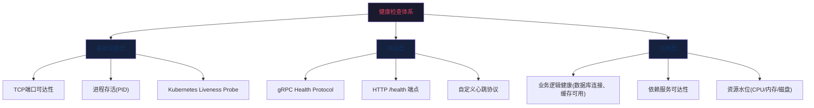
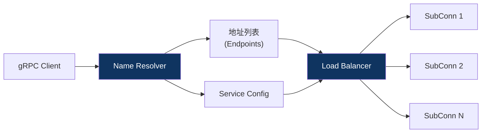
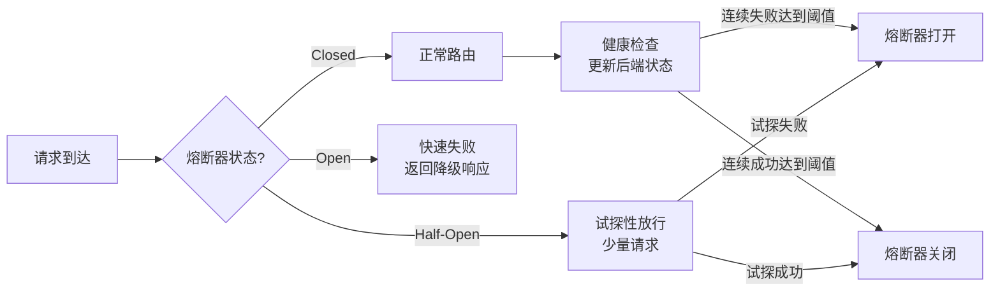

## 五健康检查：gRPC Health Protocol与负载均衡

在分布式系统中，服务实例的上线、下线、故障是常态而非异常。一个微服务集群可能有数十甚至数百个实例，负载均衡器必须实时感知每个实例的健康状态，才能将请求分发到健康的节点。如果健康检查机制缺失或不完善，负载均衡器会将流量发送到已故障的实例，导致请求失败率飙升、用户体感恶化，甚至引发级联故障。

gRPC原生提供了标准化的健康检查协议——**grpc.health.v1.Health**，配合客户端负载均衡策略和自定义服务发现Resolver，构成了一套完整的RPC服务健康管理方案。本节将从协议原理、实现代码、负载均衡集成、生产部署四个层面，系统讲解健康检查的核心知识。

### 1. 为什么健康检查是RPC系统的生命线

#### 1.1 没有健康检查会发生什么

考虑一个典型场景：某电商系统部署了5个订单服务实例，其中一个实例因OOM被Kubernetes标记为Terminating，但Pod仍在运行（等待优雅关闭完成）。如果负载均衡器不知道该实例已经不健康，它仍然会将约20%的流量分发过去，导致：

- 该实例上的新请求全部超时或失败
- 客户端触发重试，将失败请求重新发送到其他实例，流量放大1-2倍
- 如果重试没有退避机制，短时间内可能产生请求风暴
- 其他4个健康实例的负载从20%飙升到25%以上，可能触发连锁反应

这就是**健康检查缺失导致的静默故障**——系统看起来还在运行，但已经有相当比例的请求在失败。

**真实案例：** 2019年某头部互联网公司的故障复盘报告显示，一次因健康检查配置不当导致的故障持续了47分钟，影响了约30%的用户请求。根因是Liveness探针超时设置为1秒，而服务端Health Check需要查询数据库（P99为800ms），导致探针频繁超时→Pod被反复重启→服务雪崩。

#### 1.2 健康检查的核心目标

| 目标 | 说明 | 关键指标 |
|------|------|---------|
| 故障检测 | 快速发现不健康实例，停止向其分发流量 | 检测延迟（Detection Latency）：从实例故障到负载均衡器感知的时间 |
| 优雅关闭 | 实例下线前完成在途请求的处理 | 排空时间（Drain Period）：从停止接新请求到处理完所有在途请求的时间 |
| 恢复感知 | 实例恢复健康后重新纳入流量分发 | 恢复延迟（Recovery Latency）：从实例恢复到开始接收流量的时间 |
| 防止误判 | 避免因瞬时抖动误将健康实例标记为不健康 | 误判率（False Positive Rate）：健康实例被错误标记为不健康的比例 |

#### 1.3 健康检查的三大层次



| 层次 | 检查内容 | 检测能力 | 适用场景 |
|------|---------|---------|---------|
| 基础设施层 | TCP端口可达、进程存活 | 只能发现进程崩溃、端口未监听 | Kubernetes Liveness Probe、基础存活检查 |
| 协议层 | gRPC Health Protocol、HTTP健康端点 | 能发现服务内部状态异常（初始化未完成、正在关闭） | gRPC负载均衡、Envoy/Istio集成 |
| 应用层 | 数据库连接、缓存可用、磁盘空间 | 能发现业务依赖故障 | 全量健康评估、告警触发 |

三层健康检查是互补关系，不是替代关系。生产环境通常需要同时部署：基础设施层保证进程存活，协议层保证服务可达，应用层保证业务可用。

### 2. gRPC Health Protocol详解

#### 2.1 协议规范

gRPC Health Protocol定义在 `grpc.health.v1` 包中，是一个标准化的服务健康检查接口。其Protocol Buffers定义如下：

```protobuf
syntax = "proto3";

package grpc.health.v1;

service Health {
  // 查询指定服务的健康状态
  rpc Check(HealthCheckRequest) returns (HealthCheckResponse);

  // 服务端主动推送健康状态变化（Watch模式）
  rpc Watch(HealthCheckRequest) returns (stream HealthCheckResponse);
}

message HealthCheckRequest {
  // 要查询的服务名称，空字符串表示整体健康
  string service = 1;
}

message HealthCheckResponse {
  enum ServingStatus {
    UNKNOWN = 0;         // 未知状态（服务未注册或未收到首次响应）
    SERVING = 1;         // 正常服务中
    NOT_SERVING = 2;     // 已注册但无法服务（如初始化未完成）
    SERVICE_UNKNOWN = 3; // 服务未注册
  }
  ServingStatus status = 1;
}
```

**关键设计要点：**

- **按服务粒度**：同一个gRPC服务器可以承载多个服务（如UserService、OrderService），每个服务可以独立报告健康状态。例如，UserService正常但OrderService因数据库连接池耗尽而不可用时，可以精确报告每个服务的状态。
- **整体健康**：当 `service` 字段为空字符串时，查询的是服务器的整体健康状态。
- **Watch模式**：客户端可以订阅健康状态变化，避免轮询开销。服务端在状态变化时主动推送，适合负载均衡器的长期连接场景。

#### 2.2 四种ServingStatus的语义

| 状态 | 含义 | 触发条件 | 负载均衡器行为 |
|------|------|---------|--------------|
| UNKNOWN | 未知 | 服务刚启动，尚未明确设置状态 | 保守策略：不发送流量（避免向未就绪实例发请求） |
| SERVING | 正常服务中 | 所有初始化完成，依赖服务可用 | 正常分发流量 |
| NOT_SERVING | 不可用 | 服务已注册但无法处理请求（如正在关闭、资源不足） | 停止分发新流量，等待在途请求处理完成 |
| SERVICE_UNKNOWN | 未注册 | 查询的服务名称未注册 | 按服务查询时返回此状态，不影响整体健康判断 |

**状态流转规则：**

启动 → UNKNOWN → 初始化完成 → SERVING
                                  ↓
                          依赖故障/收到关闭信号 → NOT_SERVING → 恢复 → SERVING
                                                                    ↓
                                                              服务终止 → (连接断开)

UNKNOWN状态是一个容易被忽略但非常重要的设计：服务启动后，在没有显式调用 `SetServingStatus` 之前，默认是UNKNOWN。这意味着如果负载均衡器在UNKNOWN状态下发送流量，可能打到一个还没有初始化完成的实例。因此，**最佳实践是启动后保持UNKNOWN直到初始化完成，再显式设置为SERVING**。

#### 2.3 Go语言实现

```go
package main

import (
    "context"
    "log"
    "net"
    "sync"
    "time"

    "google.golang.org/grpc"
    "google.golang.org/grpc/health"
    healthpb "google.golang.org/grpc/health/grpc_health_v1"
    "google.golang.org/grpc/reflection"
)

// AppHealth 管理应用级健康状态
type AppHealth struct {
    mu              sync.RWMutex
    dbConnected     bool
    cacheConnected  bool
    ready           bool
    healthServer    *health.Server
}

func NewAppHealth() *AppHealth {
    h := &amp;AppHealth{
        healthServer: health.NewServer(),
    }
    return h
}

// SetDBConnected 设置数据库连接状态
func (h *AppHealth) SetDBConnected(connected bool) {
    h.mu.Lock()
    defer h.mu.Unlock()
    h.dbConnected = connected
    h.updateStatus()
}

// SetCacheConnected 设置缓存连接状态
func (h *AppHealth) SetCacheConnected(connected bool) {
    h.mu.Lock()
    defer h.mu.Unlock()
    h.cacheConnected = connected
    h.updateStatus()
}

// SetReady 设置服务就绪状态
func (h *AppHealth) SetReady(ready bool) {
    h.mu.Lock()
    defer h.mu.Unlock()
    h.ready = ready
    h.updateStatus()
}

// updateStatus 根据所有依赖状态更新gRPC健康状态
func (h *AppHealth) updateStatus() {
    var status healthpb.HealthCheckResponse_ServingStatus

    if !h.ready {
        status = healthpb.HealthCheckResponse_NOT_SERVING
    } else if !h.dbConnected || !h.cacheConnected {
        // 部分依赖不可用，降级为NOT_SERVING
        status = healthpb.HealthCheckResponse_NOT_SERVING
    } else {
        status = healthpb.HealthCheckResponse_SERVING
    }

    // 设置整体健康状态
    h.healthServer.SetServingStatus("", status)

    // 设置各服务的健康状态
    h.healthServer.SetServingStatus("user.UserService", status)
    h.healthServer.SetServingStatus("order.OrderService", status)

    log.Printf("Health status updated: %v (db=%v, cache=%v, ready=%v)",
        status, h.dbConnected, h.cacheConnected, h.ready)
}

func main() {
    lis, err := net.Listen("tcp", ":50051")
    if err != nil {
        log.Fatalf("failed to listen: %v", err)
    }

    s := grpc.NewServer()
    health := NewAppHealth()

    // 注册健康检查服务
    healthpb.RegisterHealthServer(s, health.healthServer)

    // 注册反射服务（便于grpcurl调试）
    reflection.Register(s)

    // 模拟异步初始化
    go func() {
        log.Println("Connecting to database...")
        time.Sleep(2 * time.Second)
        health.SetDBConnected(true)
        log.Println("Connecting to cache...")
        time.Sleep(1 * time.Second)
        health.SetCacheConnected(true)
        health.SetReady(true)
        log.Println("Service is ready to serve")
    }()

    log.Println("gRPC server listening on :50051")
    if err := s.Serve(lis); err != nil {
        log.Fatalf("failed to serve: %v", err)
    }
}
```

#### 2.4 Watch模式的实现与使用

Watch模式是gRPC Health Protocol中容易被忽略但极具价值的特性。与Check的请求-响应模式不同，Watch是一个服务端流式RPC，客户端订阅后，服务端在健康状态发生变化时主动推送。这避免了客户端轮询的开销，特别适合负载均衡器的长期连接场景。

**Go服务端——Watch已由官方库自动支持：**

gRPC-Go的 `health.Server` 内置了Watch支持，只需注册HealthServer，Watch即可自动工作。当调用 `SetServingStatus` 时，所有订阅该服务的Watch流都会收到状态更新。

**Go客户端——使用Watch订阅健康状态：**

```go
package main

import (
    "context"
    "io"
    "log"
    "time"

    "google.golang.org/grpc"
    "google.golang.org/grpc/credentials/insecure"
    healthpb "google.golang.org/grpc/health/grpc_health_v1"
)

func watchHealth(ctx context.Context, addr string, serviceName string) {
    conn, err := grpc.Dial(addr,
        grpc.WithTransportCredentials(insecure.NewCredentials()),
    )
    if err != nil {
        log.Fatalf("failed to dial: %v", err)
    }
    defer conn.Close()

    client := healthpb.NewHealthClient(conn)

    // 创建Watch流
    stream, err := client.Watch(ctx, &amp;healthpb.HealthCheckRequest{
        Service: serviceName,
    })
    if err != nil {
        log.Fatalf("failed to watch: %v", err)
    }

    log.Printf("Watching health for service: %s", serviceName)

    for {
        resp, err := stream.Recv()
        if err == io.EOF {
            log.Println("Watch stream ended")
            return
        }
        if err != nil {
            log.Printf("Watch error: %v", err)
            return
        }

        log.Printf("Health status changed: %v -> %v", serviceName, resp.Status)

        switch resp.Status {
        case healthpb.HealthCheckResponse_SERVING:
            log.Println("  → Instance is healthy, routing traffic")
        case healthpb.HealthCheckResponse_NOT_SERVING:
            log.Println("  → Instance is unhealthy, stopping traffic")
        case healthpb.HealthCheckResponse_UNKNOWN:
            log.Println("  → Instance status unknown, waiting")
        }
    }
}

func main() {
    ctx, cancel := context.WithTimeout(context.Background(), 5*time.Minute)
    defer cancel()

    watchHealth(ctx, "localhost:50051", "")
}
```

**Watch vs Check的选型对比：**

| 维度 | Check模式 | Watch模式 |
|------|----------|----------|
| 通信方式 | 一元RPC（请求-响应） | 服务端流式RPC |
| 数据推送 | 客户端主动轮询 | 服务端状态变化时推送 |
| 实时性 | 取决于轮询间隔 | 状态变化即刻通知 |
| 资源消耗 | 每次检查一次RPC调用 | 长连接，仅状态变化时传输数据 |
| 适用场景 | 调试、Kubernetes探针、低频检查 | 负载均衡器、Service Mesh、长期监控 |
| 连接管理 | 无状态，每次独立调用 | 需维护长连接，处理断线重连 |

**生产建议：** 负载均衡器（如Envoy）通常使用Watch模式订阅健康状态，减少轮询开销。Kubernetes探针和grpcurl调试则使用Check模式。两者可以共存于同一服务。

#### 2.5 Java语言实现

```java
import io.grpc.health.v1.HealthCheckResponse;
import io.grpc.health.v1.HealthGrpc;
import io.grpc.health.v1.HealthProto;
import io.grpc.services.HealthStatusManager;
import io.grpc.Server;
import io.grpc.ServerBuilder;

public class GrpcHealthExample {

    private final HealthStatusManager healthManager = new HealthStatusManager();
    private volatile boolean dbConnected = false;
    private volatile boolean cacheConnected = false;

    public Server startServer() throws Exception {
        Server server = ServerBuilder.forPort(50051)
            .addService(healthManager.getHealthService())  // 注册健康检查服务
            .addService(new UserServiceImpl())
            .build();

        server.start();

        // 模拟异步初始化
        new Thread(() -> {
            try {
                Thread.sleep(2000);
                dbConnected = true;
                updateHealthStatus();

                Thread.sleep(1000);
                cacheConnected = true;
                updateHealthStatus();
            } catch (InterruptedException e) {
                Thread.currentThread().interrupt();
            }
        }).start();

        return server;
    }

    private void updateHealthStatus() {
        HealthCheckResponse.ServingStatus status;
        if (dbConnected &amp;&amp; cacheConnected) {
            status = HealthCheckResponse.ServingStatus.SERVING;
        } else {
            status = HealthCheckResponse.ServingStatus.NOT_SERVING;
        }

        // 设置整体健康状态
        healthManager.setStatus("", status);
        // 设置特定服务的健康状态
        healthManager.setStatus("user.UserService", status);
        healthManager.setStatus("order.OrderService", status);
    }
}
```

#### 2.6 Python语言实现

```python
import grpc
from concurrent import futures
import time
import threading

from grpc_health.v1 import health_pb2_grpc, health_pb2
from grpc_health.v1 import health


class ApplicationHealth:
    """管理应用级健康状态"""

    def __init__(self):
        self._db_connected = False
        self._cache_connected = False
        self._ready = False
        self._health_servicer = health.HealthServicer()
        self._lock = threading.Lock()

    @property
    def health_servicer(self):
        return self._health_servicer

    def set_db_connected(self, connected: bool):
        with self._lock:
            self._db_connected = connected
            self._update_status()

    def set_cache_connected(self, connected: bool):
        with self._lock:
            self._cache_connected = connected
            self._update_status()

    def set_ready(self, ready: bool):
        with self._lock:
            self._ready = ready
            self._update_status()

    def _update_status(self):
        if not self._ready or not self._db_connected or not self._cache_connected:
            status = health_pb2.HealthCheckResponse.NOT_SERVING
        else:
            status = health_pb2.HealthCheckResponse.SERVING

        # 设置整体和各服务的健康状态
        for service in ["", "user.UserService", "order.OrderService"]:
            self._health_servicer.set(service, status)

        print(f"Health status: {'SERVING' if status == health_pb2.HealthCheckResponse.SERVING else 'NOT_SERVING'}")


def serve():
    app_health = ApplicationHealth()

    server = grpc.server(futures.ThreadPoolExecutor(max_workers=10))

    # 注册健康检查服务
    health_pb2_grpc.add_HealthServicer_to_server(
        app_health.health_servicer, server
    )

    server.add_insecure_port("[::]:50051")
    server.start()

    # 模拟异步初始化
    def init_dependencies():
        time.sleep(2)
        app_health.set_db_connected(True)
        time.sleep(1)
        app_health.set_cache_connected(True)
        app_health.set_ready(True)
        print("Service is ready to serve")

    threading.Thread(target=init_dependencies, daemon=True).start()

    print("gRPC server listening on :50051")
    server.wait_for_termination()


if __name__ == "__main__":
    serve()
```

#### 2.7 多语言实现对照表

| 特性 | Go | Java | Python |
|------|-----|------|--------|
| Health Server | `health.NewServer()` | `HealthStatusManager` | `health.HealthServicer()` |
| 注册方式 | `healthpb.RegisterHealthServer(s, srv)` | `.addService(healthManager.getHealthService())` | `add_HealthServicer_to_server(servicer, server)` |
| 设置状态 | `srv.SetServingStatus(service, status)` | `healthManager.setStatus(service, status)` | `servicer.set(service, status)` |
| Watch支持 | 自动支持 | 自动支持 | 需要 `grpcio-health-checking` ≥1.48 |
| 依赖包 | `google.golang.org/grpc`（内含） | `grpc-services` | `grpcio-health-checking` |

### 3. 健康检查的客户端调用与诊断

#### 3.1 使用grpcurl手动检查

`grpcurl` 是gRPC的命令行调试工具，类似于REST API中的 `curl`。它依赖服务器启用Server Reflection才能动态发现服务。

```bash
# 安装grpcurl
go install github.com/fullstorydev/grpcurl/cmd/grpcurl@latest

# 查看服务器所有服务
grpcurl -plaintext localhost:50051 list

# 输出示例：
# grpc.health.v1.Health
# reflection.ServerReflection
# user.UserService
# order.OrderService

# 检查整体健康状态
grpcurl -plaintext localhost:50051 grpc.health.v1.Health/Check

# 输出示例：
# {
#   "status": "SERVING"
# }

# 检查特定服务的健康状态
grpcurl -plaintext \
  -d '{"service": "user.UserService"}' \
  localhost:50051 grpc.health.v1.Health/Check

# 输出示例：
# {
#   "status": "SERVING"
# }

# 检查未注册的服务
grpcurl -plaintext \
  -d '{"service": "payment.PaymentService"}' \
  localhost:50051 grpc.health.v1.Health/Check

# 输出示例：
# {
#   "status": "SERVICE_UNKNOWN"
# }
```

**grpcurl调试技巧：**

```bash
# 查看Health服务的方法列表
grpcurl -plaintext localhost:50051 describe grpc.health.v1.Health

# 查看ServingStatus枚举值
grpcurl -plaintext localhost:50051 describe grpc.health.v1.HealthCheckResponse.ServingStatus

# 使用Watch模式订阅（需要服务端支持反射）
grpcurl -plaintext -emit-defaults -stream-bytes \
  localhost:50051 grpc.health.v1.Health/Watch

# 使用protobuf格式请求（非JSON）
grpcurl -plaintext -format=text \
  -d '{"service": "order.OrderService"}' \
  localhost:50051 grpc.health.v1.Health/Check
```

#### 3.2 使用grpc-health-probe（Kubernetes集成）

`grpc-health-probe` 是一个独立的二进制工具，专为Kubernetes探针设计。它不依赖Server Reflection，通过直接调用Health Protocol来检查健康状态。

```bash
# 安装grpc-health-probe
# https://github.com/grpc-ecosystem/grpc-health-probe
wget https://github.com/grpc-ecosystem/grpc-health-probe/releases/latest/download/grpc_health_probe-linux-amd64
chmod +x grpc_health_probe-linux-amd64
mv grpc_health_probe-linux-amd64 /usr/local/bin/grpc-health-probe

# 基本用法
grpc-health-probe -addr=localhost:50051
# 退出码 0 = SERVING, 1 = NOT_SERVING, 2 = 连接失败

# 检查特定服务
grpc-health-probe -addr=localhost:50051 -service=user.UserService

# 自定义超时
grpc-health-probe -addr=localhost:50051 -connect-timeout=3s -rpc-timeout=5s

# TLS加密连接
grpc-health-probe \
  -addr=localhost:50051 \
  -tls \
  -tls-ca-cert=/etc/ssl/ca.crt \
  -tls-client-cert=/etc/ssl/client.crt \
  -tls-client-key=/etc/ssl/client.key
```

**退出码含义详解：**

| 退出码 | 含义 | Kubernetes处理 |
|--------|------|---------------|
| 0 | SERVING——服务正常 | 探针成功 |
| 1 | NOT_SERVING或SERVICE_UNKNOWN——服务不正常 | Liveness失败→重启Pod；Readiness失败→摘除流量 |
| 2 | 连接失败——无法建立gRPC连接 | 探针失败，按failureThreshold处理 |

#### 3.3 Kubernetes探针配置

```yaml
apiVersion: apps/v1
kind: Deployment
metadata:
  name: order-service
spec:
  replicas: 3
  selector:
    matchLabels:
      app: order-service
  template:
    metadata:
      labels:
        app: order-service
    spec:
      containers:
      - name: order-service
        image: order-service:v1.2.0
        ports:
        - containerPort: 50051
          name: grpc

        # 存活探针：进程是否还活着
        # 失败时kubelet会重启Pod
        livenessProbe:
          exec:
            command:
            - /usr/local/bin/grpc-health-probe
            - -addr=:50051
          initialDelaySeconds: 10
          periodSeconds: 15
          timeoutSeconds: 3
          failureThreshold: 3    # 连续3次失败则重启

        # 就绪探针：是否可以接收流量
        # 失败时Service摘除该Pod的Endpoint
        readinessProbe:
          exec:
            command:
            - /usr/local/bin/grpc-health-probe
            - -addr=:50051
            - -service=order.OrderService
          initialDelaySeconds: 5
          periodSeconds: 10
          timeoutSeconds: 3
          failureThreshold: 2

        # 启动探针：等待服务初始化完成
        # 防止初始化较慢的服务被Liveness探针误杀
        startupProbe:
          exec:
            command:
            - /usr/local/bin/grpc-health-probe
            - -addr=:50051
          initialDelaySeconds: 5
          periodSeconds: 5
          failureThreshold: 30   # 最多等待150秒初始化完成
```

**三种探针的区别：**

| 探针 | 作用 | 失败后果 | 检查频率 | 适用阶段 |
|------|------|---------|---------|---------|
| startupProbe | 等待服务初始化完成 | 阻塞后续探针直到成功 | 一次（成功后停止） | 启动阶段 |
| livenessProbe | 检查进程是否存活 | 重启Pod | 周期性 | 运行全阶段 |
| readinessProbe | 检查是否可接收流量 | 从Service Endpoint摘除 | 周期性 | 运行全阶段 |

**探针参数调优指南：**

| 参数 | 推荐值 | 调优依据 |
|------|--------|---------|
| startupProbe.initialDelaySeconds | 5 | 给容器基础启动时间 |
| startupProbe.failureThreshold | 按服务启动时间计算 | failureThreshold × periodSeconds ≥ 服务最长启动时间 |
| livenessProbe.periodSeconds | 10-15 | 平衡检测速度和kubelet负载 |
| livenessProbe.failureThreshold | 3 | 允许1-2次瞬时抖动，第3次确认故障 |
| livenessProbe.timeoutSeconds | 3-5 | 应大于Health Check P99延迟的2倍 |
| readinessProbe.periodSeconds | 5-10 | 比liveness更频繁，快速感知流量接收能力变化 |
| readinessProbe.failureThreshold | 1-2 | 快速摘除不健康实例，减少用户影响 |

**重要提示：** gRPC健康检查与Kubernetes HTTP探针不兼容（kubelet不支持gRPC探针，除非Kubernetes 1.24+），需要通过 `grpc-health-probe` 或 `exec` 方式调用。Kubernetes 1.24+原生支持 `grpc` 探针类型：

```yaml
# Kubernetes 1.24+ 原生gRPC探针
livenessProbe:
  grpc:
    port: 50051
  initialDelaySeconds: 10
  periodSeconds: 15
  timeoutSeconds: 3
```

原生gRPC探针的优势在于：无需额外安装 `grpc-health-probe` 二进制文件，kubelet直接与gRPC服务通信，减少了容器镜像体积和exec调用的进程开销。

### 4. 客户端负载均衡

gRPC支持客户端负载均衡（Client-Side Load Balancing），由客户端直接决定将请求发送到哪个服务端实例，避免了服务端代理（如Envoy、Nginx）带来的额外网络跳转和延迟。

#### 4.1 内置负载均衡策略

gRPC内置两种负载均衡策略：

| 策略 | 工作原理 | 优点 | 缺点 | 适用场景 |
|------|---------|------|------|---------|
| pick_first（默认） | 选择服务端列表中的第一个可用实例 | 简单、连接数最少 | 完全不均衡，所有流量打到一个实例 | 开发调试、简单场景 |
| round_robin | 轮询所有可用实例 | 均衡分发、实现简单 | 不感知后端负载差异 | 实例配置相同、负载均匀 |

```go
// 创建带负载均衡的客户端连接
conn, err := grpc.Dial(
    "dns:///order-service.default.svc.cluster.local:50051",
    grpc.WithDefaultServiceConfig(`{"loadBalancingConfig": [{"round_robin":{}}]}`),
    grpc.WithTransportCredentials(insecure.NewCredentials()),
)
if err != nil {
    log.Fatalf("failed to dial: %v", err)
}
defer conn.Close()
```

**注意：** gRPC的 `grpc.Dial` 默认使用 `pick_first`，不会自动启用负载均衡。必须通过 `WithDefaultServiceConfig` 显式配置，或通过Name Resolver返回的Service Config指定。很多开发者在这一步踩坑——以为配了DNS多地址就能自动负载均衡，实际必须设置LB策略。

#### 4.2 Name Resolver机制

gRPC的负载均衡架构由三个核心组件构成：



- **Name Resolver**：将服务名解析为地址列表（类似DNS，但支持更多功能）
- **Service Config**：提供负载均衡策略、重试策略等配置
- **Load Balancer**：根据策略从地址列表中选择目标实例

gRPC内置了以下Resolver：

| Resolver | URI格式 | 说明 |
|----------|--------|------|
| dns | dns:///hostname:port | DNS解析，支持A/AAAA/SRV记录 |
| unix | unix:///path/to/socket | Unix域套接字，同机通信 |
| passthrough | passthrough:///host:port | 直接使用提供的地址 |
| ipv4/ipv6 | ipv4:///x.x.x.x:port | 强制使用IPv4/IPv6 |

#### 4.3 自定义Name Resolver（以Consul为例）

生产环境中，服务地址通常由Consul、etcd、Nacos等服务发现系统管理。以下是集成Consul的完整示例：

```go
package consulresolver

import (
    "context"
    "fmt"
    "log"
    "net/url"
    "sync"
    "time"

    api "github.com/hashicorp/consul/api"
    "google.golang.org/grpc/resolver"
)

const consulScheme = "consul"

// consulResolverBuilder 实现resolver.Builder接口
type consulResolverBuilder struct {
    consulClient *api.Client
}

// consulResolver 实现resolver.Resolver接口
type consulResolver struct {
    consulClient *api.Client
    serviceName  string
    cc           resolver.ClientConn
    cancel       context.CancelFunc
    wg           sync.WaitGroup
}

func init() {
    // 注册consul:// scheme
    resolver.Register(&amp;consulResolverBuilder{})
}

// Build 创建Resolver实例
func (b *consulResolverBuilder) Build(
    target resolver.Target,
    cc resolver.ClientConn,
    opts resolver.BuildOptions,
) (resolver.Resolver, error) {
    ctx, cancel := context.WithCancel(context.Background())

    serviceName := target.Endpoint()

    r := &amp;consulResolver{
        consulClient: b.consulClient,
        serviceName:  serviceName,
        cc:           cc,
        cancel:       cancel,
    }

    // 启动服务发现监听
    r.wg.Add(1)
    go r.watch(ctx)

    return r, nil
}

// Scheme 返回此Resolver支持的URI scheme
func (b *consulResolverBuilder) Scheme() string {
    return consulScheme
}

// watch 监听Consul服务变化
func (r *consulResolver) watch(ctx context.Context) {
    defer r.wg.Done()

    // 首次全量查询
    r.resolve()

    // 持续监听变化
    ticker := time.NewTicker(10 * time.Second)
    defer ticker.Stop()

    for {
        select {
        case <-ctx.Done():
            return
        case <-ticker.C:
            r.resolve()
        }
    }
}

// resolve 执行服务发现并更新地址列表
func (r *consulResolver) resolve() {
    services, _, err := r.consulClient.Health().Service(
        r.serviceName, "", true, nil,
    )
    if err != nil {
        log.Printf("consul resolve error for %s: %v", r.serviceName, err)
        return
    }

    var addrs []resolver.Address
    for _, svc := range services {
        addr := resolver.Address{
            Addr:       fmt.Sprintf("%s:%d", svc.Service.Address, svc.Service.Port),
            ServerName: svc.Service.Meta["grpc_service_name"],
        }
        addrs = append(addrs, addr)
    }

    r.cc.UpdateState(resolver.State{Addresses: addrs})
    log.Printf("resolved %s: %d endpoints", r.serviceName, len(addrs))
}

// ResolveNow 触发重新解析（由gRPC框架调用）
func (r *consulResolver) ResolveNow(opts resolver.ResolveNowOptions) {
    go r.resolve()
}

// Close 关闭Resolver
func (r *consulResolver) Close() {
    r.cancel()
    r.wg.Wait()
}

// NewConsulResolverBuilder 创建Consul Resolver Builder
func NewConsulResolverBuilder(consulAddr string) (*consulResolverBuilder, error) {
    config := api.DefaultConfig()
    config.Address = consulAddr
    client, err := api.NewClient(config)
    if err != nil {
        return nil, err
    }
    return &amp;consulResolverBuilder{consulClient: client}, nil
}
```

**使用方式：**

```go
// 创建Consul Resolver
builder, _ := consulresolver.NewConsulResolverBuilder("consul.service.local:8500")

// 通过consul:// scheme使用
conn, err := grpc.Dial(
    "consul:///order-service",
    grpc.WithResolvers(builder),
    grpc.WithDefaultServiceConfig(`{"loadBalancingConfig": [{"round_robin":{}}]}`),
    grpc.WithTransportCredentials(insecure.NewCredentials()),
)
```

#### 4.4 连接池管理

gRPC默认使用HTTP/2多路复用，单个TCP连接可以承载大量并发请求。但在以下场景中，单连接可能成为瓶颈：

- 服务端处理能力有限，单连接的队列深度不足
- 需要利用多核CPU并行处理
- 跨可用区部署，需要多条网络路径

gRPC-Go提供了连接池支持：

```go
package main

import (
    "sync/atomic"
    "time"

    "google.golang.org/grpc"
    "google.golang.org/grpc/credentials/insecure"
    "google.golang.org/grpc/keepalive"
)

// ConnectionPool gRPC连接池
type ConnectionPool struct {
    conns     []*grpc.ClientConn
    nextIndex atomic.Uint64
    size      int
}

// NewConnectionPool 创建连接池
func NewConnectionPool(addr string, poolSize int) (*ConnectionPool, error) {
    pool := &amp;ConnectionPool{
        size:  poolSize,
        conns: make([]*grpc.ClientConn, poolSize),
    }

    for i := 0; i < poolSize; i++ {
        conn, err := grpc.Dial(addr,
            grpc.WithTransportCredentials(insecure.NewCredentials()),
            grpc.WithKeepaliveParams(keepalive.ClientParameters{
                Time:                10 * time.Second,
                Timeout:             3 * time.Second,
                PermitWithoutStream: true,
            }),
        )
        if err != nil {
            // 关闭已创建的连接
            pool.Close()
            return nil, err
        }
        pool.conns[i] = conn
    }

    return pool, nil
}

// Get 获取下一个连接（Round-Robin，无锁原子操作）
func (p *ConnectionPool) Get() *grpc.ClientConn {
    idx := p.nextIndex.Add(1) - 1
    return p.conns[idx%uint64(p.size)]
}

// Close 关闭所有连接
func (p *ConnectionPool) Close() {
    for _, conn := range p.conns {
        if conn != nil {
            conn.Close()
        }
    }
}
```

**关键改进说明：** 原版使用 `sync.RWMutex` + `uint64` 实现Round-Robin，存在竞态条件——`nextIndex++` 不是原子操作，多goroutine并发调用 `Get()` 可能读到相同索引。改用 `atomic.Uint64` 的 `Add` 方法，既消除锁开销又保证线程安全。

**连接池大小的经验值：**

| 场景 | 推荐连接数 | 说明 |
|------|-----------|------|
| 一般微服务 | 1-2 | HTTP/2多路复用足够处理大多数场景 |
| 高吞吐数据管道 | 4-8 | 充分利用多核CPU和网络带宽 |
| 跨可用区部署 | 每AZ 2-4 | 利用多条网络路径降低延迟 |
| 超大规模集群 | 按需压测确定 | 基于实际吞吐量和延迟要求调优 |

### 5. 与Envoy/Istio集成

在Service Mesh架构中，Envoy作为Sidecar代理承担了负载均衡和健康检查的职责。Envoy原生支持gRPC Health Protocol：

```yaml
# Envoy配置片段 - gRPC健康检查
static_resources:
  clusters:
  - name: order-service
    type: STRICT_DNS
    lb_policy: ROUND_ROBIN
    health_checks:
    - timeout: 3s
      interval: 10s
      unhealthy_threshold: 3
      healthy_threshold: 2
      grpc_health_check: {}    # 使用gRPC Health Protocol
      # 也可指定特定服务：
      # grpc_health_check:
      #   service_name: order.OrderService
    load_assignment:
      cluster_name: order-service
      endpoints:
      - lb_endpoints:
        - endpoint:
            address:
              socket_address:
                address: order-service
                port_value: 50051
```

**Envoy健康检查配置要点：**

| 参数 | 说明 | 推荐值 |
|------|------|--------|
| timeout | 单次健康检查超时 | 3s（不应超过实例处理延迟的P99） |
| interval | 检查间隔 | 10s（平衡检测速度和资源消耗） |
| unhealthy_threshold | 连续失败几次标记为不健康 | 3（避免瞬时抖动误判） |
| healthy_threshold | 连续成功几次恢复为健康 | 2（快速恢复） |

**Envoy的三种健康检查类型：**

| 类型 | 配置字段 | 适用场景 |
|------|---------|---------|
| HTTP | `http_health_check` | HTTP服务的 `/health` 端点 |
| TCP | `tcp_health_check` | 仅检查端口可达性 |
| gRPC | `grpc_health_check` | gRPC服务的Health Protocol |

在Istio服务网格中，健康检查配置通过 `DestinationRule` 和 `PeerAuthentication` 策略注入，无需手动修改Envoy配置。Istio会自动为gRPC服务配置gRPC健康检查。

### 6. 健康检查与熔断器的协同

健康检查发现实例不健康后，除了从负载均衡器摘除，还应触发熔断器（Circuit Breaker）快速失败，避免请求在故障实例上堆积。两者的协同关系：



**实现示例——健康检查驱动的熔断器：**

```go
type HealthAwareBreaker struct {
    mu               sync.Mutex
    consecutiveFails int32
    state            int32 // 0=closed, 1=open, 2=half-open
    openExpiry       time.Time
    failThreshold    int32
    recoveryTimeout  time.Duration
    halfOpenMax      int32
    halfOpenCount    int32
}

const (
    BreakerClosed = iota
    BreakerOpen
    BreakerHalfOpen
)

// OnHealthCheck 健康检查结果回调
func (b *HealthAwareBreaker) OnHealthCheck(healthy bool) {
    b.mu.Lock()
    defer b.mu.Unlock()

    if healthy {
        b.consecutiveFails = 0
        if b.state == BreakerHalfOpen {
            b.state = BreakerClosed
            log.Println("Circuit breaker: half-open → closed (healthy)")
        }
    } else {
        b.consecutiveFails++
        if b.consecutiveFails >= b.failThreshold &amp;&amp; b.state == BreakerClosed {
            b.state = BreakerOpen
            b.openExpiry = time.Now().Add(b.recoveryTimeout)
            log.Printf("Circuit breaker: closed → open (fails=%d)", b.consecutiveFails)
        }
    }
}

// AllowRequest 检查是否允许请求通过
func (b *HealthAwareBreaker) AllowRequest() bool {
    b.mu.Lock()
    defer b.mu.Unlock()

    switch b.state {
    case BreakerClosed:
        return true
    case BreakerOpen:
        if time.Now().After(b.openExpiry) {
            b.state = BreakerHalfOpen
            b.halfOpenCount = 0
            log.Println("Circuit breaker: open → half-open (timeout expired)")
            return true
        }
        return false
    case BreakerHalfOpen:
        if b.halfOpenCount < b.halfOpenMax {
            b.halfOpenCount++
            return true
        }
        return false
    }
    return false
}
```

**集成方式：** 将健康检查回调注入 `AppHealth.updateStatus()` 中，每次状态变化时调用 `OnHealthCheck`。负载均衡器在选择实例时先调用 `AllowRequest`，熔断器Open时直接返回降级响应，不再发起网络调用。

### 7. 常见误区与最佳实践

#### 7.1 常见误区

**误区1：只检查TCP端口可达性**

```go
// ❌ 错误做法：只检查TCP端口
func isHealthy(addr string) bool {
    conn, err := net.DialTimeout("tcp", addr, 3*time.Second)
    if err != nil {
        return false
    }
    conn.Close()
    return true
}
```

TCP端口可达只意味着进程在监听，不代表服务能正常处理请求。服务可能正在初始化、数据库连接已断开、或正在优雅关闭。必须使用gRPC Health Protocol检查应用级健康状态。

**误区2：健康检查过于频繁**

```yaml
# ❌ 错误做法：每100ms检查一次
health_checks:
- interval: 100ms
  timeout: 50ms
```

过于频繁的健康检查会消耗大量CPU和网络资源。在100个实例的集群中，每100ms检查一次意味着每秒产生1000次Health Check RPC，这些开销是不必要的。推荐间隔为5-15秒。

**误区3：健康检查超时设置过短**

```yaml
# ❌ 错误做法：1秒超时
health_checks:
- timeout: 1s
```

如果服务端的Health Check实现需要访问数据库来验证依赖可用性，1秒超时可能不够。超时应设置为服务端Health Check实现P99延迟的2-3倍。

**误区4：没有区分Liveness和Readiness**

```yaml
# ❌ 错误做法：只配置一种探针
livenessProbe:
  grpc:
    port: 50051
```

Liveness探针失败会重启Pod，Readiness探针失败只会摘除流量。如果服务因临时依赖不可用（如缓存雪崩）而无法处理新请求，应该只影响Readiness（停止接收新请求），而不是Liveness（重启Pod）。重启并不能解决依赖问题。

**误区5：忽略优雅关闭的健康状态切换**

```go
// ❌ 错误做法：直接关闭服务
func gracefulShutdown(server *grpc.Server) {
    sigCh := make(chan os.Signal, 1)
    signal.Notify(sigCh, syscall.SIGTERM)
    <-sigCh
    server.GracefulStop()  // 没有先设置健康状态为NOT_SERVING
}
```

正确的优雅关闭流程：先设置健康状态为NOT_SERVING → 等待负载均衡器摘除流量 → 再执行GracefulStop。

**误区6：健康检查实现中引入阻塞操作**

```go
// ❌ 错误做法：Health Check中执行耗时查询
func (s *HealthServer) Check(ctx context.Context, req *healthpb.HealthCheckRequest) (*healthpb.HealthCheckResponse, error) {
    // 在健康检查中执行全表查询——绝对禁止
    rows, err := db.QueryContext(ctx, "SELECT COUNT(*) FROM orders")
    // ...
}
```

健康检查应该快速返回（毫秒级），不应执行耗时的业务查询。正确的做法是在后台定期检测依赖状态，缓存结果，健康检查只返回缓存的状态值。上文的 `AppHealth` 结构体就是这种模式——后台线程定期检查依赖，`updateStatus` 只更新状态标志，`Check` RPC直接返回当前状态。

#### 7.2 生产级最佳实践

```go
// ✅ 正确的优雅关闭流程
func gracefulShutdown(server *grpc.Server, healthServer *health.Server) {
    sigCh := make(chan os.Signal, 1)
    signal.Notify(sigCh, syscall.SIGTERM, syscall.SIGINT)
    <-sigCh

    log.Println("Received shutdown signal, starting graceful shutdown")

    // 第1步：设置健康状态为NOT_SERVING，通知负载均衡器停止分发新流量
    healthServer.SetServingStatus("", healthpb.HealthCheckResponse_NOT_SERVING)
    healthServer.SetServingStatus("user.UserService", healthpb.HealthCheckResponse_NOT_SERVING)
    healthServer.SetServingStatus("order.OrderService", healthpb.HealthCheckResponse_NOT_SERVING)

    // 第2步：等待负载均衡器感知状态变化
    // 排空时间 = unhealthy_threshold × interval + 安全余量
    // Envoy默认: 3次 × 10s = 30s，加5s余量
    drainTimeout := getDrainTimeout()  // 建议从环境变量或配置中心读取
    log.Printf("Waiting %v for load balancer to drain connections...", drainTimeout)
    time.Sleep(drainTimeout)

    // 第3步：关闭gRPC服务器，等待在途请求处理完成
    // GracefulStop会等待所有RPC调用完成后才关闭
    log.Println("Stopping gRPC server...")
    done := make(chan struct{})
    go func() {
        server.GracefulStop()
        close(done)
    }()

    // 第4步：设置超时，防止GracefulStop卡住
    select {
    case <-done:
        log.Println("Server stopped gracefully")
    case <-time.After(30 * time.Second):
        log.Println("GracefulStop timeout, forcing shutdown")
        server.Stop()
    }
}

// getDrainTimeout 根据Envoy健康检查配置计算排空时间
// 公式: unhealthy_threshold × interval + safety_margin
func getDrainTimeout() time.Duration {
    // 生产环境应从配置中心读取
    // 这里使用Envoy默认值作为示例
    unhealthyThreshold := 3
    interval := 10 * time.Second
    safetyMargin := 5 * time.Second
    return time.Duration(unhealthyThreshold)*interval + safetyMargin
}
```

**关键改进：** 排空等待时间不应硬编码，而应根据负载均衡器的实际健康检查参数动态计算。如果Envoy的配置变更了 `unhealthy_threshold` 或 `interval`，排空时间应同步更新。

**生产环境健康检查检查清单：**

| 检查项 | 要求 | 重要性 |
|--------|------|--------|
| 实现gRPC Health Protocol | 所有gRPC服务必须注册Health Server | ⭐⭐⭐⭐⭐ |
| 支持按服务粒度查询 | 每个服务独立报告健康状态 | ⭐⭐⭐⭐ |
| 包含应用级检查 | 验证关键依赖（数据库、缓存）的可用性 | ⭐⭐⭐⭐ |
| Kubernetes三探针配置 | startup + liveness + readiness完整配置 | ⭐⭐⭐⭐⭐ |
| 优雅关闭流程 | NOT_SERVING → 等待排空 → GracefulStop | ⭐⭐⭐⭐⭐ |
| 健康检查可观测性 | 记录健康状态变化日志，接入监控告警 | ⭐⭐⭐ |
| 健康检查超时合理 | 超时 > 服务端Health Check P99 × 2 | ⭐⭐⭐⭐ |
| 不健康阈值合理 | 至少3次连续失败才标记为不健康 | ⭐⭐⭐ |
| 恢复阈值合理 | 至少2次连续成功才恢复为健康 | ⭐⭐⭐ |
| 避免健康检查风暴 | 间隔不低于5秒，集群级别限流 | ⭐⭐⭐ |
| 健康检查不阻塞 | Health Check实现中禁止执行耗时操作 | ⭐⭐⭐⭐ |

### 8. 总结

健康检查是RPC系统从"能跑"到"可靠"的关键跨越。本节覆盖了以下核心内容：

| 知识模块 | 核心要点 |
|----------|---------|
| gRPC Health Protocol | 标准化的grpc.health.v1.Health接口，支持整体健康和按服务健康，提供Check和Watch两种调用模式 |
| ServingStatus语义 | UNKNOWN/SERVING/NOT_SERVING/SERVICE_UNKNOWN四种状态的精确含义和负载均衡器行为 |
| Kubernetes集成 | 通过grpc-health-probe工具集成三种探针（startup/liveness/readiness），实现完整的生命周期管理 |
| 客户端负载均衡 | round_robin/pick_first策略、Name Resolver机制、自定义Resolver与服务发现系统集成 |
| 连接池管理 | HTTP/2多路复用下的连接池设计，按场景选择合适的连接数 |
| 熔断器协同 | 健康检查驱动的Circuit Breaker，快速失败避免故障扩散 |
| 优雅关闭 | NOT_SERVING → 排空等待 → GracefulStop的三步流程，防止关闭过程中的请求失败 |
| 服务网格集成 | Envoy/Istio的gRPC健康检查配置，与Service Mesh架构的无缝衔接 |

健康检查不是一个孤立的功能，它是服务治理体系中连接负载均衡、服务发现、可观测性和故障恢复的核心纽带。一个完善的健康检查机制，配合分层超时和指数退避重试，构成了微服务可靠性的基石。
