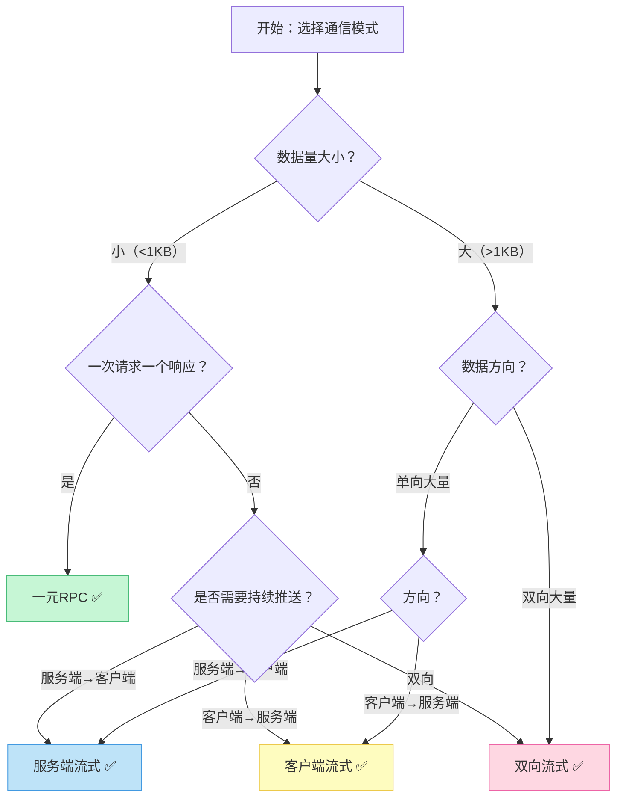
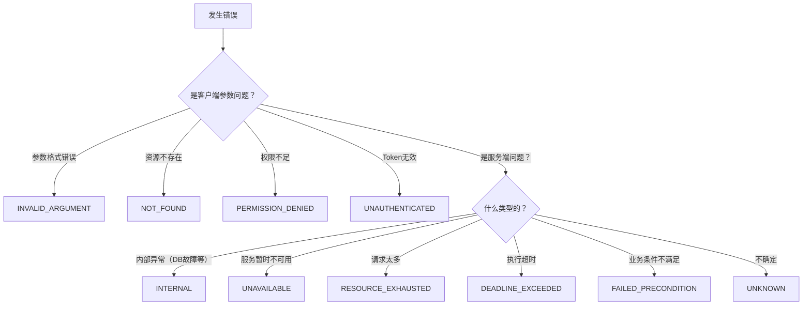
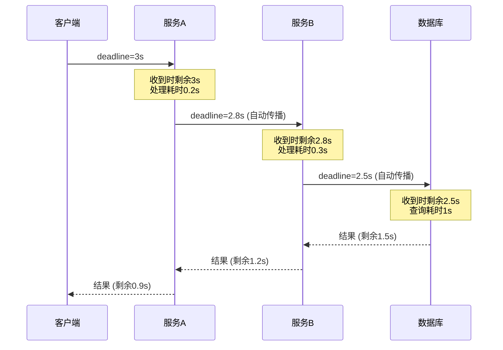

# 核心技巧

## 本节定位

掌握了RPC框架的基本原理和IDL定义之后，真正决定一个RPC服务能否在生产环境稳定运行的，是以下五项核心技巧：通信模式选择、拦截器机制、错误处理、超时与重试、健康检查。它们分别解决了"怎么传数据"、"怎么插入横切逻辑"、"怎么传递失败信息"、"怎么应对不稳定网络"和"怎么判断服务是否可用"这五个关键问题。

本节不是对理论的简单复述，而是面向工程实践的深度指南——每一项技巧都给出经过生产验证的实现方案、常见的踩坑经验和性能数据，帮助读者从"能用"跨越到"可靠"。

---

## 一、gRPC四种通信模式

gRPC提供了四种通信模式，适用于不同的数据传输场景。选择错误的模式不仅浪费网络资源，还会增加开发复杂度。下面逐一解析每种模式的原理、实现要点和典型应用场景。

### 1.1 一元RPC（Unary RPC）

一元RPC是最基本的模式：客户端发送一个请求，服务端返回一个响应。它与传统的HTTP请求-响应模型完全一致。

```go
// 服务端实现
type orderServer struct {
    pb.UnimplementedOrderServiceServer
}

func (s *orderServer) CreateOrder(ctx context.Context, req *pb.CreateOrderRequest) (*pb.CreateOrderResponse, error) {
    // 参数校验
    if req.UserId == "" {
        return nil, status.Error(codes.InvalidArgument, "user_id is required")
    }

    // 业务逻辑
    orderID := generateOrderID()
    order := &amp;Order{
        ID:        orderID,
        UserID:    req.UserId,
        ProductId: req.ProductId,
        Quantity:  req.Quantity,
        Status:    pb.OrderStatus_ORDER_STATUS_PENDING,
        CreatedAt: time.Now().Unix(),
    }

    if err := s.orderRepo.Save(ctx, order); err != nil {
        return nil, status.Errorf(codes.Internal, "failed to save order: %v", err)
    }

    return &amp;pb.CreateOrderResponse{
        OrderId:   orderID,
        Status:    pb.OrderStatus_ORDER_STATUS_PENDING,
        CreatedAt: order.CreatedAt,
    }, nil
}
```

**适用场景**：简单的查询和写入操作，如获取用户信息、创建订单、验证Token等。绝大多数RPC调用都使用一元模式。

**关键约束**：gRPC默认最大消息大小为4MB。如果单次请求或响应超过此限制，需要在服务端和客户端同时调整：

```go
// 服务端
server := grpc.NewServer(
    grpc.MaxRecvMsgSize(50 * 1024 * 1024),  // 接收最大50MB
    grpc.MaxSendMsgSize(50 * 1024 * 1024),  // 发送最大50MB
)

// 客户端
conn, err := grpc.Dial(target,
    grpc.WithDefaultCallOptions(
        grpc.MaxCallRecvMsgSize(50*1024*1024),
        grpc.MaxCallSendMsgSize(50*1024*1024),
    ),
)
```

**性能数据**：在典型的Go + Protobuf环境下，一元RPC单连接QPS可达10万以上（取决于消息大小和业务处理耗时）。

### 1.2 服务端流式RPC（Server Streaming RPC）

客户端发送一个请求，服务端返回一个消息流。服务端可以在一段时间内持续向客户端推送数据。

```go
// 服务端实现
func (s *orderServer) ListOrders(req *pb.ListOrdersRequest, stream pb.OrderService_ListOrdersServer) error {
    // 校验参数
    if req.UserId == "" {
        return status.Error(codes.InvalidArgument, "user_id is required")
    }

    // 分页查询并逐条发送
    var cursor string
    for {
        orders, nextCursor, err := s.orderRepo.ListByUserID(
            stream.Context(), req.UserId, req.PageSize, cursor,
        )
        if err != nil {
            return status.Errorf(codes.Internal, "failed to list orders: %v", err)
        }

        for _, order := range orders {
            if err := stream.Send(order); err != nil {
                // 客户端可能已断开连接，不需要返回错误
                return err
            }
        }

        if nextCursor == "" || len(orders) == 0 {
            break
        }
        cursor = nextCursor
    }

    return nil
}

// 客户端调用
func listOrders(client pb.OrderServiceClient, userID string) ([]*pb.Order, error) {
    stream, err := client.ListOrders(context.Background(), &amp;pb.ListOrdersRequest{
        UserId:   userID,
        PageSize: 100,
    })
    if err != nil {
        return nil, err
    }

    var orders []*pb.Order
    for {
        order, err := stream.Recv()
        if err == io.EOF {
            break  // 流正常结束
        }
        if err != nil {
            return nil, err
        }
        orders = append(orders, order)
    }
    return orders, nil
}
```

**背压控制**：当客户端处理速度跟不上服务端发送速度时，gRPC的HTTP/2层会自动进行流控。但业务层也需要处理——如果 `stream.Send()` 返回 `codes.Unavailable` 或 `context.DeadlineExceeded`，说明客户端积压了太多未处理的消息。

**适用场景**：
- 分页数据导出（替代传统的分页API，避免多次往返）
- 实时事件推送（如订单状态变更通知）
- 大数据集的渐进式传输

**常见陷阱**：服务端流式RPC没有内置的"查询进度"机制。如果传输中断，客户端只能从头开始。解决方法是在每条消息中携带序号，支持断点续传。

### 1.3 客户端流式RPC（Client Streaming RPC）

客户端持续向服务端发送消息流，服务端在接收完所有消息后返回一个响应。

```go
// 服务端实现
func (s *orderServer) UploadOrders(stream pb.OrderService_UploadOrdersServer) error {
    var (
        count     int32
        failCount int32
        batchSize = 100
        batch     []*pb.UploadOrderRequest
    )

    for {
        req, err := stream.Recv()
        if err == io.EOF {
            // 客户端发送完毕，处理剩余批次并返回
            if len(batch) > 0 {
                if err := s.batchProcess(stream.Context(), batch); err != nil {
                    failCount += int32(len(batch))
                }
            }
            return stream.SendAndClose(&amp;pb.UploadOrderResponse{
                SuccessCount: count,
                FailCount:    failCount,
            })
        }
        if err != nil {
            return status.Errorf(codes.Internal, "failed to receive: %v", err)
        }

        batch = append(batch, req)
        if len(batch) >= batchSize {
            if err := s.batchProcess(stream.Context(), batch); err != nil {
                failCount += int32(len(batch))
            } else {
                count += int32(len(batch))
            }
            batch = batch[:0]  // 重置批次
        }
    }
}
```

**适用场景**：
- 批量数据导入（如CSV导入、日志上传）
- 客户端持续采集数据并上传（如IoT设备上报）
- 文件分块上传

**关键设计要点**：
- 服务端必须在所有客户端消息都接收完毕后才返回响应（`SendAndClose`只能调用一次）
- 批量处理比逐条处理效率高10-100倍（减少数据库事务开销）
- 客户端应控制发送速率，避免压垮服务端

### 1.4 双向流式RPC（Bidirectional Streaming RPC）

客户端和服务端各自维护独立的消息流，可以同时发送和接收消息。两个流互不依赖——客户端不需要等待服务端的响应就可以继续发送。

```go
// 服务端实现
func (s *orderServer) WatchOrderStatus(stream pb.OrderService_WatchOrderStatusServer) error {
    // 收集所有订阅的订单ID
    var orderIDs []string
    for {
        req, err := stream.Recv()
        if err == io.EOF {
            break  // 客户端停止发送订阅请求
        }
        if err != nil {
            return err
        }
        orderIDs = append(orderIDs, req.OrderId)
    }

    if len(orderIDs) == 0 {
        return status.Error(codes.InvalidArgument, "at least one order_id is required")
    }

    // 创建事件通道
    eventCh := s.eventBus.Subscribe(orderIDs...)
    defer s.eventBus.Unsubscribe(eventCh)

    // 持续推送状态更新
    for {
        select {
        case event, ok := <-eventCh:
            if !ok {
                return nil  // 事件源关闭
            }
            if err := stream.Send(&amp;pb.OrderStatusUpdate{
                OrderId:   event.OrderID,
                NewStatus: event.Status,
                UpdatedAt: event.Timestamp,
            }); err != nil {
                return err
            }
        case <-stream.Context().Done():
            return stream.Context().Err()
        }
    }
}

// 客户端调用
func watchOrders(client pb.OrderServiceClient, orderIDs []string) {
    stream, err := client.WatchOrderStatus(context.Background())
    if err != nil {
        log.Fatalf("failed to open stream: %v", err)
    }

    // 先发送所有订阅请求
    for _, id := range orderIDs {
        if err := stream.Send(&amp;pb.WatchOrderRequest{OrderId: id}); err != nil {
            log.Fatalf("failed to send: %v", err)
        }
    }

    // 关闭发送端（告诉服务端不再有新订阅）
    // 注意：双向流可以不关闭发送端，保持连接即可

    // 持续接收更新
    for {
        update, err := stream.Recv()
        if err == io.EOF {
            break
        }
        if err != nil {
            log.Printf("stream error: %v", err)
            break
        }
        fmt.Printf("Order %s status: %s\n", update.OrderId, update.NewStatus)
    }
}
```

**适用场景**：
- 实时聊天/IM系统
- 多订单状态实时同步
- 游戏状态同步
- 双向协商（如服务端引导的握手协议）

**并发安全注意事项**：双向流的 `Send()` 和 `Recv()` 不是并发安全的。如果你需要同时读写，必须加锁或使用goroutine隔离：

```go
// 正确的并发读写模式
func bidirectionalHandler(stream pb.Service_BidiMethodServer) error {
    // 用一个goroutine处理发送，主goroutine处理接收
    errCh := make(chan error, 1)

    go func() {
        // 发送goroutine
        for {
            select {
            case msg := <-outgoingCh:
                if err := stream.Send(msg); err != nil {
                    errCh <- err
                    return
                }
            case <-stream.Context().Done():
                errCh <- stream.Context().Err()
                return
            }
        }
    }()

    // 接收循环（主goroutine）
    for {
        msg, err := stream.Recv()
        if err == io.EOF {
            return nil
        }
        if err != nil {
            return err
        }
        processMessage(msg)
    }
}
```

### 1.5 四种模式的选择决策树



| 模式 | 请求/响应 | 消息顺序 | 典型场景 | 连接效率 |
|------|----------|---------|---------|---------|
| 一元RPC | 1对1 | 严格有序 | CRUD操作 | 最高 |
| 服务端流式 | 1对多 | 严格有序 | 数据导出、推送 | 高 |
| 客户端流式 | 多对1 | 严格有序 | 批量上传 | 高 |
| 双向流式 | 多对多 | 独立有序 | 实时通信、协商 | 中（需维护两个流） |

---

## 二、拦截器（Interceptor）

拦截器是gRPC提供的中间件机制，允许在请求处理的各个阶段插入横切关注点的逻辑（如认证、日志、追踪、限流）。理解拦截器的设计原则和执行顺序，是构建可靠RPC服务的基础。

### 2.1 拦截器的分类

gRPC的拦截器分为四大类：

| 拦截器类型 | 适用场景 | 签名特征 |
|-----------|---------|---------|
| UnaryServerInterceptor | 一元RPC服务端 | 接收 `(ctx, req, info, handler)` |
| StreamServerInterceptor | 流式RPC服务端 | 接收 `(srv, ss, info, handler)` |
| UnaryClientInterceptor | 一元RPC客户端 | 接收 `(ctx, method, req, cc, invoker, opts)` |
| StreamClientInterceptor | 流式RPC客户端 | 接收 `(ctx, desc, cc, method, opts)` |

### 2.2 服务端拦截器实战

#### 日志拦截器

记录每次RPC调用的方法名、耗时、状态码和追踪ID。这是最基本的可观测性拦截器。

```go
func loggingInterceptor(
    ctx context.Context,
    req interface{},
    info *grpc.UnaryServerInfo,
    handler grpc.UnaryHandler,
) (interface{}, error) {
    start := time.Now()

    // 提取追踪ID（如果有OpenTelemetry集成）
    traceID := ""
    if span := trace.SpanFromContext(ctx); span.SpanContext().IsValid() {
        traceID = span.SpanContext().TraceID().String()
    }

    // 调用实际的处理方法
    resp, err := handler(ctx, req)

    // 计算耗时和状态码
    duration := time.Since(start)
    statusCode := status.Code(err)
    clientIP := extractClientIP(ctx)

    // 结构化日志（生产环境应使用JSON格式）
    log.Printf("[RPC] method=%s duration=%v status=%s client=%s trace=%s",
        info.FullMethod,
        duration,
        statusCode,
        clientIP,
        traceID,
    )

    // 记录Prometheus指标
    rpcDurationHistogram.WithLabelValues(
        info.FullMethod,
        statusCode.String(),
    ).Observe(duration.Seconds())

    rpcRequestCounter.WithLabelValues(
        info.FullMethod,
        statusCode.String(),
    ).Inc()

    return resp, err
}

func extractClientIP(ctx context.Context) string {
    md, ok := metadata.FromIncomingContext(ctx)
    if !ok {
        return "unknown"
    }
    if vals := md.Get("x-forwarded-for"); len(vals) > 0 {
        return vals[0]
    }
    if vals := md.Get("x-real-ip"); len(vals) > 0 {
        return vals[0]
    }
    return "unknown"
}
```

#### Recovery拦截器

捕获业务代码中的panic，防止单个请求的异常导致整个服务崩溃。这是生产环境中必须配置的拦截器。

```go
func recoveryInterceptor(
    ctx context.Context,
    req interface{},
    info *grpc.UnaryServerInfo,
    handler grpc.UnaryHandler,
) (resp interface{}, err error) {
    defer func() {
        if r := recover(); r != nil {
            // 记录panic的堆栈信息
            buf := make([]byte, 2048)
            n := runtime.Stack(buf, false)
            log.Printf("[PANIC] method=%s panic=%v\nstack=%s",
                info.FullMethod, r, string(buf[:n]),
            )

            // 返回Internal错误给客户端
            err = status.Errorf(codes.Internal,
                "internal server error: method=%s", info.FullMethod)
        }
    }()
    return handler(ctx, req)
}
```

#### 认证拦截器

验证客户端携带的JWT Token或API Key，拒绝未认证的请求。

```go
func authInterceptor(
    ctx context.Context,
    req interface{},
    info *grpc.UnaryServerInfo,
    handler grpc.UnaryHandler,
) (interface{}, error) {
    // 白名单方法跳过认证（如健康检查）
    if isPublicMethod(info.FullMethod) {
        return handler(ctx, req)
    }

    // 从Metadata中提取Token
    md, ok := metadata.FromIncomingContext(ctx)
    if !ok {
        return nil, status.Error(codes.Unauthenticated, "missing metadata")
    }

    tokens := md.Get("authorization")
    if len(tokens) == 0 {
        return nil, status.Error(codes.Unauthenticated, "missing authorization token")
    }

    // 验证JWT
    claims, err := validateJWT(tokens[0])
    if err != nil {
        return nil, status.Errorf(codes.Unauthenticated, "invalid token: %v", err)
    }

    // 将用户信息注入Context，供后续handler使用
    ctx = context.WithValue(ctx, "user_id", claims.UserID)
    ctx = context.WithValue(ctx, "user_roles", claims.Roles)

    return handler(ctx, req)
}

func isPublicMethod(method string) bool {
    publicMethods := map[string]bool{
        "/grpc.health.v1.Health/Check":     true,
        "/grpc.reflection.v1alpha.ServerReflection/ServerReflectionInfo": true,
    }
    return publicMethods[method]
}
```

#### 限流拦截器

基于令牌桶算法限制请求速率，防止突发流量压垮服务。

```go
import "golang.org/x/time/rate"

func rateLimitInterceptor(rps int, burst int) grpc.UnaryServerInterceptor {
    limiter := rate.NewLimiter(rate.Limit(rps), burst)

    return func(
        ctx context.Context,
        req interface{},
        info *grpc.UnaryServerInfo,
        handler grpc.UnaryHandler,
    ) (interface{}, error) {
        if !limiter.Allow() {
            // 返回429 Too Many Requests等价的状态码
            return nil, status.Error(codes.ResourceExhausted,
                "rate limit exceeded, try again later")
        }
        return handler(ctx, req)
    }
}

// 基于方法的差异化限流
func perMethodRateLimitInterceptor(limits map[string]int) grpc.UnaryServerInterceptor {
    limiters := make(map[string]*rate.Limiter)
    for method, rps := range limits {
        limiters[method] = rate.NewLimiter(rate.Limit(rps), rps)
    }

    return func(
        ctx context.Context,
        req interface{},
        info *grpc.UnaryServerInfo,
        handler grpc.UnaryHandler,
    ) (interface{}, error) {
        limiter, ok := limiters[info.FullMethod]
        if !ok {
            return handler(ctx, req)  // 未配置限流的方法直接放行
        }
        if !limiter.Allow() {
            return nil, status.Error(codes.ResourceExhausted,
                "rate limit exceeded for this method")
        }
        return handler(ctx, req)
    }
}
```

### 2.3 拦截器链的执行顺序

gRPC的 `ChainUnaryInterceptor` 按注册顺序形成一个洋葱模型——先注册的在外层，后注册的在内层：

```go
server := grpc.NewServer(
    grpc.ChainUnaryInterceptor(
        recoveryInterceptor,       // 最外层：捕获panic，保护整个链
        authInterceptor,           // 第二层：认证，拒绝未授权请求
        rateLimitInterceptor(1000, 2000),  // 第三层：限流，控制请求速率
        loggingInterceptor,        // 最内层：记录实际耗时（排除被拦截的请求）
    ),
)
```

执行顺序如下：

请求进入 → recovery → auth → rateLimit → logging → handler
响应返回 ← recovery ← auth ← rateLimit ← logging ← handler

**为什么顺序很重要？**

- Recovery必须在最外层：如果auth或rateLimit本身panic了，recovery也能捕获
- Auth在RateLimit之前：未认证的请求不应该消耗限流配额
- Logging在最内层：记录的时间最接近实际业务耗时，不包含被拦截请求的耗时

### 2.4 客户端拦截器

客户端拦截器用于在请求发出前和响应收到后执行逻辑，常见用途包括注入追踪上下文、设置超时、重试逻辑等。

```go
// 客户端追踪拦截器：自动注入追踪上下文
func clientTracingInterceptor(
    ctx context.Context,
    method string,
    req, reply interface{},
    cc *grpc.ClientConn,
    invoker grpc.UnaryInvoker,
    opts ...grpc.CallOption,
) error {
    // 从当前上下文提取追踪信息，注入到gRPC Metadata中
    ctx = injectTraceContext(ctx)
    return invoker(ctx, method, req, reply, cc, opts...)
}

// 客户端日志拦截器
func clientLoggingInterceptor(
    ctx context.Context,
    method string,
    req, reply interface{},
    cc *grpc.ClientConn,
    invoker grpc.UnaryInvoker,
    opts ...grpc.CallOption,
) error {
    start := time.Now()
    err := invoker(ctx, method, req, reply, cc, opts...)
    duration := time.Since(start)

    log.Printf("[Client RPC] method=%s duration=%v err=%v",
        method, duration, err)

    return err
}

// 注册客户端拦截器
conn, err := grpc.Dial(target,
    grpc.WithChainUnaryInterceptor(
        clientTracingInterceptor,
        clientLoggingInterceptor,
    ),
)
```

### 2.5 拦截器的常见误区

| 误区 | 后果 | 正确做法 |
|------|------|---------|
| 在拦截器中做耗时的IO操作（如同步写日志文件） | 请求延迟增加，吞吐量下降 | 使用异步日志（如zap的Asynchronous模式） |
| Recovery拦截器放在内层 | 内层拦截器的panic无法被捕获 | Recovery永远放在最外层 |
| 认证拦截器没有白名单 | 健康检查等系统调用被拒绝 | 维护一个公共方法白名单 |
| 拦截器中修改了请求对象 | 后续拦截器和handler看到的是被修改的数据 | 拦截器应尽量只读，修改数据通过Context传递 |

---

## 三、错误处理

gRPC定义了一套标准的状态码体系，比HTTP的状态码更加精细。正确的错误处理不仅影响客户端的重试策略，还决定了问题排查的效率。

### 3.1 gRPC状态码全景

gRPC共有16个状态码，每个码都有明确的语义。以下是按使用频率分类的完整列表：

| 状态码 | 名称 | 含义 | 是否可重试 | 典型场景 |
|--------|------|------|-----------|---------|
| OK | 成功 | 请求成功处理 | — | 正常返回 |
| CANCELLED | 取消 | 调用方取消了请求 | 否 | context.WithCancel |
| UNKNOWN | 未知 | 未知错误 | 否 | 未分类的异常 |
| INVALID_ARGUMENT | 无效参数 | 参数校验失败 | 否 | 缺少必填字段、格式错误 |
| DEADLINE_EXCEEDED | 超时 | 超过截止时间 | 通常可重试 | 数据库查询慢、网络延迟 |
| NOT_FOUND | 未找到 | 资源不存在 | 否 | 查询不存在的订单 |
| ALREADY_EXISTS | 已存在 | 资源已存在 | 否 | 重复创建 |
| PERMISSION_DENIED | 权限不足 | 调用方无权限 | 否 | 无权访问他人订单 |
| RESOURCE_EXHAUSTED | 资源耗尽 | 配额或限流 | 可重试（需退避） | 请求频率超限 |
| FAILED_PRECONDITION | 前置条件不满足 | 业务条件不满足 | 否 | 库存不足、状态不正确 |
| ABORTED | 中止 | 操作被中止 | 可重试 | 事务冲突、乐观锁失败 |
| OUT_OF_RANGE | 超出范围 | 参数越界 | 否 | 分页页码超出范围 |
| UNIMPLEMENTED | 未实现 | 方法未实现 | 否 | 调用了不存在的接口 |
| INTERNAL | 内部错误 | 服务端内部异常 | 通常可重试 | 数据库连接失败、空指针 |
| UNAVAILABLE | 不可用 | 服务暂时不可用 | 可重试 | 服务重启、网络分区 |
| DATA_LOSS | 数据丢失 | 不可恢复的数据丢失 | 否 | 磁盘损坏、日志丢失 |
| UNAUTHENTICATED | 未认证 | 认证失败 | 否 | Token过期、签名错误 |

**选择状态码的决策流程**：



### 3.2 错误详情（Error Details）

gRPC支持在错误状态中附加结构化的详细信息，帮助客户端理解错误的具体原因。这是gRPC相比REST API的一个显著优势。

```go
import (
    "google.golang.org/genproto/googleapis/rpc/errdetails"
    "google.golang.org/grpc/status"
)

// 创建带详情的参数校验错误
func createValidationError(fieldErrors map[string]string) error {
    st := status.New(codes.InvalidArgument, "request validation failed")

    var violations []*errdetails.BadRequest_FieldViolation
    for field, desc := range fieldErrors {
        violations = append(violations, &amp;errdetails.BadRequest_FieldViolation{
            Field:       field,
            Description: desc,
        })
    }

    detailed, _ := st.WithDetails(&amp;errdetails.BadRequest{
        FieldViolations: violations,
    })

    return detailed.Err()
}

// 使用示例
func validateCreateOrder(req *pb.CreateOrderRequest) error {
    fieldErrors := make(map[string]string)

    if req.UserId == "" {
        fieldErrors["user_id"] = "user_id is required and cannot be empty"
    }
    if req.Quantity <= 0 {
        fieldErrors["quantity"] = "quantity must be positive"
    }
    if req.Quantity > 999 {
        fieldErrors["quantity"] = "quantity cannot exceed 999"
    }

    if len(fieldErrors) > 0 {
        return createValidationError(fieldErrors)
    }
    return nil
}
```

客户端解析错误详情：

```go
func handleGRPCError(err error) {
    st, ok := status.FromError(err)
    if !ok {
        log.Printf("非gRPC错误: %v", err)
        return
    }

    log.Printf("状态码: %s, 消息: %s", st.Code(), st.Message())

    // 遍历所有详情
    for _, detail := range st.Details() {
        switch d := detail.(type) {
        case *errdetails.BadRequest:
            log.Printf("参数校验失败:")
            for _, v := range d.FieldViolations {
                log.Printf("  - %s: %s", v.Field, v.Description)
            }
        case *errdetails.RetryInfo:
            log.Printf("建议重试间隔: %v", d.RetryDelay.AsDuration())
        case *errdetails.ErrorInfo:
            log.Printf("错误原因: %s, 域: %s", d.Reason, d.Domain)
            log.Printf("元数据: %v", d.Metadata)
        }
    }
}
```

### 3.3 错误包装与传播

在微服务调用链中，错误需要被正确地包装和传播，而不是简单地返回原始错误信息。

```go
// ❌ 错误做法：暴露内部实现细节
func (s *orderServer) GetOrder(ctx context.Context, req *pb.GetOrderRequest) (*pb.Order, error) {
    order, err := s.orderRepo.FindByID(ctx, req.OrderId)
    if err != nil {
        // 直接暴露SQL错误给客户端——安全隐患
        return nil, status.Errorf(codes.Internal, "error: %v", err)
    }
    return order, nil
}

// ✅ 正确做法：包装错误，返回有意义的信息
func (s *orderServer) GetOrder(ctx context.Context, req *pb.GetOrderRequest) (*pb.Order, error) {
    if req.OrderId == "" {
        return nil, status.Error(codes.InvalidArgument, "order_id is required")
    }

    order, err := s.orderRepo.FindByID(ctx, req.OrderId)
    if err != nil {
        if errors.Is(err, ErrNotFound) {
            return nil, status.Errorf(codes.NotFound,
                "order %s not found", req.OrderId)
        }

        // 内部错误：记录详细日志，返回通用信息
        log.Errorf("failed to get order %s: %v", req.OrderId, err)
        return nil, status.Errorf(codes.Internal,
            "failed to retrieve order, please try again later")
    }

    return order, nil
}
```

**错误传播原则**：

1. **对外只返回安全信息**：不要暴露数据库错误、内部路径、堆栈信息
2. **对内记录完整信息**：日志中必须包含完整的错误链和上下文
3. **保持状态码语义**：不要将所有错误都标记为 `Internal`
4. **错误信息国际化**：生产环境的错误消息应考虑多语言支持，或使用错误码代替硬编码文本

### 3.4 自定义错误码

对于复杂的业务场景，可以在gRPC状态码的基础上扩展业务错误码：

```go
import "google.golang.org/genproto/googleapis/rpc/errdetails"

type BusinessErrorCode int32

const (
    BIZ_ORDER_NOT_FOUND      BusinessErrorCode = 1001
    BIZ_INSUFFICIENT_STOCK   BusinessErrorCode = 1002
    BIZ_PAYMENT_FAILED       BusinessErrorCode = 1003
    BIZ_ORDER_ALREADY_PAID   BusinessErrorCode = 1004
)

func bizError(code BusinessErrorCode, msg string, metadata map[string]string) error {
    // 基础状态码根据业务错误码映射
    var grpcCode codes.Code
    switch {
    case code == BIZ_ORDER_NOT_FOUND:
        grpcCode = codes.NotFound
    case code == BIZ_INSUFFICIENT_STOCK:
        grpcCode = codes.FailedPrecondition
    case code == BIZ_PAYMENT_FAILED:
        grpcCode = codes.Internal
    default:
        grpcCode = codes.Unknown
    }

    st, _ := status.New(grpcCode, msg).WithDetails(
        &amp;errdetails.ErrorInfo{
            Reason:   fmt.Sprintf("BIZ_%d", code),
            Domain:   "order-service",
            Metadata: metadata,
        },
    )
    return st.Err()
}

// 使用
return nil, bizError(BIZ_INSUFFICIENT_STOCK, "insufficient stock", map[string]string{
    "product_id": req.ProductId,
    "available":  fmt.Sprintf("%d", available),
    "requested":  fmt.Sprintf("%d", req.Quantity),
})
```

---

## 四、超时与重试

超时和重试是RPC框架中最容易出错的两个配置项。设置不当不仅不能提高可用性，反而可能引发级联故障。

### 4.1 Deadline传播机制

gRPC的超时机制基于`context deadline`，而不是简单的"等待时间"。当一个请求经过多个服务的调用链时，deadline会自动传播和递减。



```go
// 客户端设置deadline
func callWithDeadline(client pb.OrderServiceClient, orderID string) (*pb.Order, error) {
    // 设置3秒超时
    ctx, cancel := context.WithTimeout(context.Background(), 3*time.Second)
    defer cancel()

    return client.GetOrder(ctx, &amp;pb.GetOrderRequest{OrderId: orderID})
}

// 服务端检查deadline
func (s *orderServer) GetOrder(ctx context.Context, req *pb.GetOrderRequest) (*pb.Order, error) {
    // 检查是否还有足够的时间完成操作
    deadline, ok := ctx.Deadline()
    if ok {
        remaining := time.Until(deadline)
        if remaining < 500*time.Millisecond {
            // 剩余时间不足以完成操作，提前返回
            return nil, status.Error(codes.DeadlineExceeded,
                "insufficient time remaining to process request")
        }
    }

    order, err := s.orderRepo.FindByID(ctx, req.OrderId)
    if err != nil {
        if errors.Is(err, context.DeadlineExceeded) {
            return nil, status.Error(codes.DeadlineExceeded,
                "database query timeout")
        }
        return nil, status.Errorf(codes.Internal, "failed to get order: %v", err)
    }

    return order, nil
}
```

**关键原则**：超时时间应该在调用链的最外层设置，内层服务自动继承。不要在每一层都重新设置超时——这会导致deadline不一致。

### 4.2 gRPC原生重试配置

gRPC 1.33+ 支持通过Service Config声明式配置重试策略，无需手写重试逻辑：

```go
// 客户端通过Service Config配置重试
conn, err := grpc.Dial(target,
    grpc.WithDefaultServiceConfig(`{
        "methodConfig": [{
            "name": [{"service": "order.OrderService"}],
            "retryPolicy": {
                "maxAttempts": 4,
                "initialBackoff": "0.1s",
                "maxBackoff": "1s",
                "backoffMultiplier": 2,
                "retryableStatusCodes": ["UNAVAILABLE", "RESOURCE_EXHAUSTED"]
            }
        }]
    }`),
)

// 服务端配置允许的重试次数（防止客户端重试无限放大流量）
server := grpc.NewServer(
    grpc.MaxRetryAttempts(3),  // 服务端允许的最大重试次数
)
```

**重试预算（Retry Budget）**：Google内部的实践表明，盲目重试可能将故障放大10倍。gRPC支持设置重试预算，限制重试请求占总请求的比例：

```go
// 高级重试配置（需要gRPC 1.56+）
"retryPolicy": {
    "maxAttempts": 4,
    "initialBackoff": "0.1s",
    "maxBackoff": "5s",
    "backoffMultiplier": 2,
    "retryableStatusCodes": ["UNAVAILABLE"],
    "perAttemptRetryTimeout": "1s",  // 单次重试超时
    "totalRetryTimeout": "5s"        // 总重试超时
}
```

### 4.3 手动实现指数退避

当gRPC原生重试配置不够灵活时（如需要根据错误类型决定是否重试），可以手写重试逻辑：

```go
func retryWithExponentialBackoff(
    ctx context.Context,
    fn func() error,
    opts ...RetryOption,
) error {
    cfg := &amp;retryConfig{
        maxRetries:  3,
        baseDelay:   100 * time.Millisecond,
        maxDelay:    5 * time.Second,
        multiplier:  2.0,
        jitterRatio: 0.3,
    }
    for _, opt := range opts {
        opt(cfg)
    }

    var lastErr error
    for attempt := 0; attempt <= cfg.maxRetries; attempt++ {
        if err := fn(); err != nil {
            lastErr = err

            // 检查是否可重试
            if !isRetryable(err) {
                return err
            }

            // 已达最大重试次数
            if attempt == cfg.maxRetries {
                break
            }

            // 检查Context是否已取消
            if ctx.Err() != nil {
                return ctx.Err()
            }

            // 计算退避时间（指数退避 + 随机抖动）
            backoff := time.Duration(float64(cfg.baseDelay) *
                math.Pow(cfg.multiplier, float64(attempt)))
            if backoff > cfg.maxDelay {
                backoff = cfg.maxDelay
            }
            jitter := time.Duration(float64(backoff) * cfg.jitterRatio *
                (rand.Float64()*2 - 1))
            delay := backoff + jitter

            select {
            case <-ctx.Done():
                return ctx.Err()
            case <-time.After(delay):
                continue
            }
        }
        return nil
    }

    return fmt.Errorf("all %d retries exhausted: %w", cfg.maxRetries, lastErr)
}

func isRetryable(err error) bool {
    st, ok := status.FromError(err)
    if !ok {
        return false
    }
    switch st.Code() {
    case codes.Unavailable,       // 服务暂时不可用
        codes.DeadlineExceeded,   // 超时
        codes.ResourceExhausted,  // 资源耗尽（限流）
        codes.Aborted:            // 事务冲突
        return true
    default:
        return false
    }
}

// 使用示例
err := retryWithExponentialBackoff(ctx, func() error {
    _, err := client.CreateOrder(ctx, req)
    return err
}, func(cfg *retryConfig) {
    cfg.maxRetries = 3
    cfg.baseDelay = 200 * time.Millisecond
})
```

### 4.4 超时与重试的协同设计

超时和重试必须协同设计，否则会导致严重问题：

**反模式：超时过长 + 无重试限制**

请求超时=30s × 重试5次 = 最坏情况150s
→ 客户端线程被阻塞150秒
→ 连接池耗尽 → 服务不可用

**正确模式：分层超时 + 有限重试**

总超时=5s, 每次请求超时=1s, 最多重试3次
→ 最坏情况 = 1s × 4次 = 4s < 5s ✅
→ 连接不会被长时间占用 ✅

```go
// 分层超时设计示例
func createOrderWithTimeout(client pb.OrderServiceClient, req *pb.CreateOrderRequest) error {
    // 总超时：5秒
    outerCtx, outerCancel := context.WithTimeout(context.Background(), 5*time.Second)
    defer outerCancel()

    return retryWithExponentialBackoff(outerCtx, func() error {
        // 单次请求超时：1秒（从outerCtx继承deadline）
        innerCtx, innerCancel := context.WithTimeout(outerCtx, 1*time.Second)
        defer innerCancel()

        _, err := client.CreateOrder(innerCtx, req)
        return err
    })
}
```

### 4.5 幂等性保证

有重试就必须保证幂等性。以下是三种常见的幂等性实现方案：

| 方案 | 实现复杂度 | 适用场景 | 性能影响 |
|------|-----------|---------|---------|
| 请求ID去重 | 低 | 写入类操作（创建、更新） | 需要额外的存储查询 |
| 乐观锁（版本号） | 中 | 更新操作 | 需要版本号字段 |
| 数据库唯一约束 | 低 | 有天然唯一键的操作 | 数据库层面保证 |

```go
// 方案1：请求ID去重
func (s *server) CreateOrder(ctx context.Context, req *pb.CreateOrderRequest) (*pb.CreateOrderResponse, error) {
    // 从Metadata获取请求ID
    md, _ := metadata.FromIncomingContext(ctx)
    requestIDs := md.Get("x-request-id")
    if len(requestIDs) == 0 {
        return nil, status.Error(codes.InvalidArgument, "missing x-request-id")
    }
    requestID := requestIDs[0]

    // 检查是否已处理（使用Redis SET NX保证原子性）
    exists, err := s.redis.SetNX(ctx, "idemp:"+requestID, "1", 24*time.Hour).Result()
    if err != nil {
        return nil, status.Errorf(codes.Internal, "idempotency check failed: %v", err)
    }
    if !exists {
        // 已处理过，查询之前的结果
        return s.getResultFromCache(ctx, requestID)
    }

    // 执行业务逻辑
    resp, err := s.createOrderInternal(ctx, req)
    if err != nil {
        s.redis.Del(ctx, "idemp:"+requestID)  // 失败时删除标记，允许重试
        return nil, err
    }

    // 缓存结果
    s.cacheResult(ctx, requestID, resp, 24*time.Hour)
    return resp, nil
}
```

---

## 五、健康检查

健康检查是微服务治理的基石。没有健康检查，负载均衡器无法判断服务是否可用，Kubernetes无法决定是否重启Pod，调用方无法及时发现故障实例。

### 5.1 gRPC Health Checking Protocol

gRPC定义了标准的健康检查协议（基于gRPC自身），所有gRPC服务都应该实现这个协议。

```go
import (
    "google.golang.org/grpc/health"
    healthpb "google.golang.org/grpc/health/grpc_health_v1"
)

func main() {
    server := grpc.NewServer()

    // 注册健康检查服务
    healthServer := health.NewServer()
    healthpb.RegisterHealthServer(server, healthServer)

    // 注册业务服务
    orderSvc := &amp;orderServer{}
    pb.RegisterOrderServiceServer(server, orderSvc)

    // 设置各服务的健康状态
    // "": 检查整个服务器的状态
    // "order.OrderService": 检查特定服务的状态
    healthServer.SetServingStatus("", healthpb.HealthCheckResponse_SERVING)
    healthServer.SetServingStatus("order.OrderService", healthpb.HealthCheckResponse_SERVING)

    // 启动服务
    lis, _ := net.Listen("tcp", ":50051")
    go server.Serve(lis)

    // graceful shutdown时更新状态
    go func() {
        sigCh := make(chan os.Signal, 1)
        signal.Notify(sigCh, syscall.SIGTERM, syscall.SIGINT)
        <-sigCh

        // 标记为NOT_SERVING，等待现有请求完成
        healthServer.SetServingStatus("", healthpb.HealthCheckResponse_NOT_SERVING)
        healthServer.SetServingStatus("order.OrderService", healthpb.HealthCheckResponse_NOT_SERVING)

        // 给负载均衡器时间传播状态变更
        time.Sleep(5 * time.Second)

        server.GracefulStop()
    }()

    server.Serve(lis)
}
```

**使用grpcurl进行健康检查**：

```bash
# 检查整个服务
grpcurl -plaintext localhost:50051 grpc.health.v1.Health/Check

# 检查特定服务
grpcurl -plaintext -d '{"service":"order.OrderService"}' \
    localhost:50051 grpc.health.v1.Health/Check

# 返回结果
# {
#   "status": "SERVING"
# }
```

### 5.2 Readiness vs Liveness

在Kubernetes环境中，健康检查分为两种语义，必须正确区分：

| 类型 | 目的 | 检查失败的后果 | 检查内容 |
|------|------|--------------|---------|
| Liveness | 判断服务是否存活 | 重启Pod | 进程是否卡死、是否有不可恢复的错误 |
| Readiness | 判断服务是否可接收流量 | 从Service的Endpoints中移除 | 依赖服务是否可用、预热是否完成 |

```yaml
# Kubernetes健康检查配置
apiVersion: apps/v1
kind: Deployment
metadata:
  name: order-service
spec:
  template:
    spec:
      containers:
      - name: order-service
        image: order-service:v1.2.0
        ports:
        - containerPort: 50051
          name: grpc
        # Liveness探针：判断Pod是否需要重启
        livenessProbe:
          grpc:
            port: 50051
          initialDelaySeconds: 10
          periodSeconds: 15
          failureThreshold: 3  # 连续失败3次则重启
          timeoutSeconds: 5
        # Readiness探针：判断Pod是否可以接收流量
        readinessProbe:
          grpc:
            port: 50051
          initialDelaySeconds: 5
          periodSeconds: 10
          failureThreshold: 2
          timeoutSeconds: 3
        # Startup探针：给慢启动应用更多时间
        startupProbe:
          grpc:
            port: 50051
          failureThreshold: 30
          periodSeconds: 2
```

**关键设计要点**：

- **Liveness和Readiness必须分离**：一个服务可能暂时无法接收新请求（Readiness失败），但仍在正常处理已有的请求（Liveness正常）。如果合并两者，会误杀正在处理请求的Pod。
- **Startup探针解决慢启动问题**：如果服务启动时间超过 `initialDelaySeconds`，Liveness会误判并重启Pod，形成"启动-重启-启动"死循环。Startup探针在启动期间替代Liveness探针。

### 5.3 优雅关停（Graceful Shutdown）

优雅关停确保服务在停止时能正确处理已有请求，并通知负载均衡器不再路由新请求。

```go
func serveWithGracefulShutdown(server *grpc.Server, lis net.Listener, healthSvr *health.Server) {
    // 启动服务
    go func() {
        if err := server.Serve(lis); err != nil {
            log.Fatalf("failed to serve: %v", err)
        }
    }()

    // 等待终止信号
    sigCh := make(chan os.Signal, 1)
    signal.Notify(sigCh, syscall.SIGTERM, syscall.SIGINT)
    sig := <-sigCh
    log.Printf("received signal %v, starting graceful shutdown", sig)

    // 第1步：标记为NOT_SERVING（停止接收新请求）
    healthSvr.SetServingStatus("", healthpb.HealthCheckResponse_NOT_SERVING)
    log.Println("health status set to NOT_SERVING")

    // 第2步：等待一段时间，让负载均衡器感知状态变更
    time.Sleep(5 * time.Second)
    log.Println("drain period completed, stopping server")

    // 第3步：优雅关停（等待正在处理的请求完成）
    // GracefulStop的最大等待时间由shutdown_timeout控制
    done := make(chan struct{})
    go func() {
        server.GracefulStop()
        close(done)
    }()

    select {
    case <-done:
        log.Println("server stopped gracefully")
    case <-time.After(30 * time.Second):
        log.Println("shutdown timeout reached, forcing stop")
        server.Stop()  // 强制停止
    }
}
```

**关停时序图**：

T+0s   收到SIGTERM
       ↓
T+0s   health status → NOT_SERVING
       ↓
T+0-5s 等待负载均衡器传播（Kubernetes endpoint更新）
       ↓
T+5s   调用GracefulStop()
       ↓
T+5-35s 等待正在处理的请求完成（最多30秒）
       ↓
T+35s  所有请求处理完毕，服务退出
       （或超过30秒后强制退出）

### 5.4 高级健康检查模式

#### 依赖检查

除了检查服务本身，还应该检查下游依赖的健康状态：

```go
type dependencyHealthChecker struct {
    redisClient    *redis.Client
    postgresDB     *sql.DB
    kafkaProducer  sarama.Producer
}

func (d *dependencyHealthChecker) Check(ctx context.Context) error {
    errors := []string{}

    // 检查Redis
    if err := d.redisClient.Ping(ctx).Err(); err != nil {
        errors = append(errors, fmt.Sprintf("redis: %v", err))
    }

    // 检查PostgreSQL
    if err := d.postgresDB.PingContext(ctx); err != nil {
        errors = append(errors, fmt.Sprintf("postgres: %v", err))
    }

    // 检查Kafka（只检查连接，不发送消息）
    if d.kafkaProducer == nil {
        errors = append(errors, "kafka: producer is nil")
    }

    if len(errors) > 0 {
        return fmt.Errorf("dependency check failed: %s", strings.Join(errors, "; "))
    }
    return nil
}
```

#### 渐进式恢复

服务重启后不要立即接受全部流量，应逐步增加流量权重：

```go
// 基于请求数的渐进式恢复
func (s *server) gradualRecovery(healthSvr *health.Server, target int) {
    // 初始阶段：标记为NOT_SERVING
    healthSvr.SetServingStatus("", healthpb.HealthCheckResponse_NOT_SERVING)

    // 等待依赖服务就绪
    time.Sleep(5 * time.Second)

    // 预热：执行一些轻量级操作（如建立连接池）
    s.warmup()

    // 逐步增加流量权重（需要配合服务网格如Istio）
    // 简化版本：直接标记为SERVING
    healthSvr.SetServingStatus("", healthpb.HealthCheckResponse_SERVING)
    log.Println("service is now SERVING, accepting traffic")
}
```

---

## 常见误区与最佳实践

### 误区一：不设置超时

这是最常见的错误。没有超时的RPC调用会导致：
- 线程/goroutine长时间阻塞，资源泄漏
- 下游故障传播到上游，引发级联故障
- 连接池耗尽，所有请求失败

**正确做法**：所有RPC调用都必须设置deadline。最外层设置总超时，内层自动继承。

### 误区二：重试风暴

盲目重试会在故障期间放大流量10-100倍，使原本的局部故障演变为全局故障。

正常: 1000 QPS
故障: 1000 QPS × 3次重试 = 3000 QPS 到达故障服务
      如果上游有多个调用方: 3000 × 10 = 30000 QPS → 级联崩溃

**正确做法**：
- 限制重试次数（最多3次）
- 使用指数退避+随机抖动
- 设置重试预算（如不超过总请求的10%）
- 只重试幂等操作和瞬时故障

### 误区三：错误信息泄露

将内部错误直接返回给客户端是一个安全隐患。

**正确做法**：
- 对外返回安全的错误描述
- 在服务端日志中记录完整的错误链
- 使用错误详情（errdetails）传递结构化信息
- 使用业务错误码代替硬编码文本

### 误区四：健康检查只检查端口

仅检查端口是否监听是不够的——端口在监听但数据库连接已断开的情况下，服务仍然不可用。

**正确做法**：健康检查应覆盖所有关键依赖（数据库、缓存、消息队列等），并在检查失败时返回 `NOT_SERVING`。

### 误区五：拦截器顺序随意

拦截器的执行顺序对安全性和性能有重大影响。

**正确做法**：遵循"Recovery → Auth → RateLimit → Logging → Handler"的顺序。Recovery永远在最外层，Logging最接近Handler。

---

## 本节小结

| 技巧 | 核心要点 | 生产环境关键配置 |
|------|---------|----------------|
| 通信模式 | 根据数据方向和大小选择合适的模式 | 大数据用流式，控制消息大小限制 |
| 拦截器 | 洋葱模型，顺序决定行为 | Recovery外层 → Auth → Limit → Log内层 |
| 错误处理 | 标准状态码 + 结构化详情 | 对外安全，对内完整 |
| 超时与重试 | Deadline自动传播，指数退避+预算 | 最外层设置超时，最多重试3次 |
| 健康检查 | Readiness与Liveness分离 | 覆盖依赖检查，优雅关停 |

掌握这五项核心技巧，你的RPC服务就具备了在生产环境可靠运行的基础能力。接下来在实战案例中，我们将看到这些技巧如何在真实的业务场景中协同工作。
