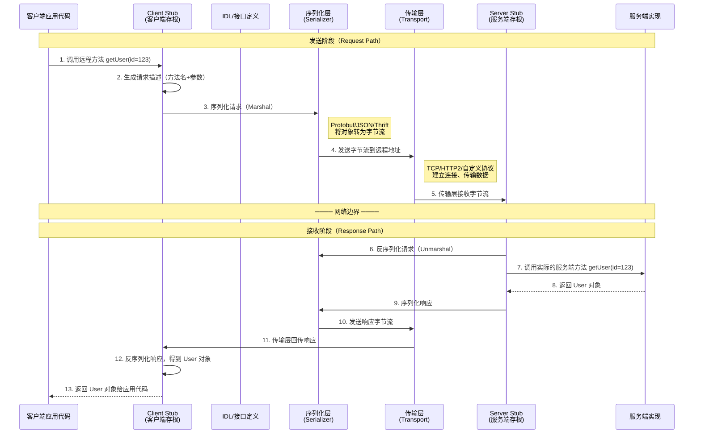
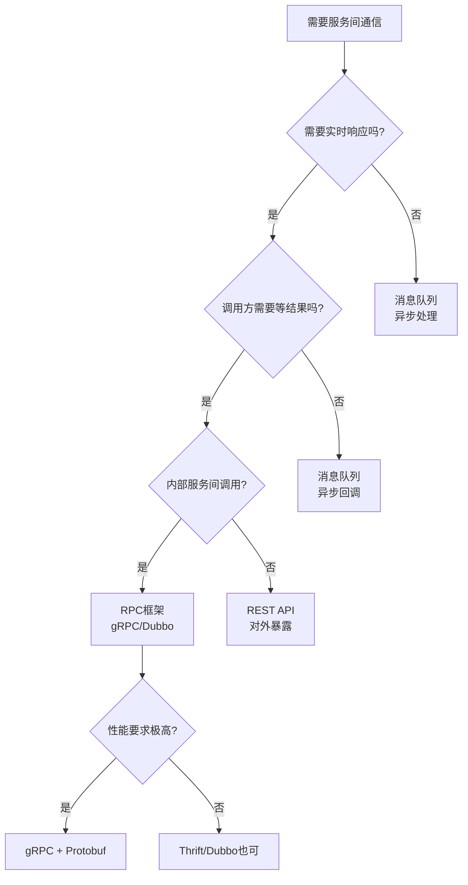

## 一、什么是RPC

### 1.1 从一个真实问题说起

假设你正在开发一个电商系统，拆分成了用户服务、订单服务、库存服务和支付服务。当用户下单时，订单服务需要：

1. 调用用户服务验证用户身份
2. 调用库存服务检查库存并锁定
3. 调用支付服务完成扣款

这些服务分布在不同的机器上，可能使用不同的编程语言。如果用最原始的 HTTP + JSON 方式调用，你需要：

```java
// 手动构建HTTP请求
String url = "http://user-service:8080/api/verify";
HttpClient client = HttpClient.newHttpClient();
HttpRequest request = HttpRequest.newBuilder()
    .uri(URI.create(url))
    .header("Content-Type", "application/json")
    .POST(HttpRequest.BodyPublishers.ofString(
        "{\"userId\": \"12345\", \"token\": \"abc\"}"))
    .build();

HttpResponse<String> response = client.send(request, 
    HttpResponse.BodyHandlers.ofString());

// 手动解析JSON响应
JsonObject result = JsonParser.parseString(response.body())
    .getAsJsonObject();
boolean verified = result.get("verified").getAsBoolean();
```

这段代码充满了"噪音"：URL拼接、HTTP头设置、JSON序列化/反序列化、异常处理、超时控制……**你真正想做的事情只有一件：调用一个远程函数验证用户身份**。

RPC（Remote Procedure Call，远程过程调用）要解决的核心问题就在这里：**让远程方法调用像调用本地方法一样自然，把网络通信的复杂性隐藏在框架底层**。

用RPC重写上面的代码：

```java
// 使用RPC框架（以gRPC为例）
boolean verified = userStub.verifyUser(userId, token);
```

一行代码，干净利落。底层的序列化、网络传输、错误处理全由框架完成。

### 1.2 什么是远程过程调用

"远程过程调用"这个词可以拆开理解：

| 术语 | 含义 | 对应的动作 |
|------|------|-----------|
| **过程（Procedure）** | 一段可执行的代码逻辑，即函数/方法 | 调用某个功能 |
| **远程（Remote）** | 代码逻辑不在本机，而在另一台机器上 | 跨网络访问 |
| **调用（Call）** | 像调用本地函数一样发起请求并获取返回值 | 同步或异步执行 |

综合起来：**远程过程调用就是让你在本地代码中调用一个函数，但这个函数的实际执行发生在网络另一端的服务器上，调用者完全感知不到网络的存在**。

### 1.3 生活类比：三个层次理解RPC

**类比一：餐厅点餐（简单直觉）**

- 本地调用 = 你自己去厨房做菜（自己执行函数）
- RPC调用 = 你对服务员说"来一份宫保鸡丁"（调用远程函数）
- 服务员 = Client Stub（把你的请求翻译成厨房能理解的格式）
- 厨房接单员 = Server Stub（把订单翻译成具体的烹饪步骤）
- 菜单 = IDL/接口定义（规定了你能点什么、怎么描述需求）
- 骑手/传菜通道 = 网络传输层

你不需要知道厨房在哪、厨师用什么锅、食材从哪来——你只需要说出菜名，就能得到结果。

**类比二：银行转账（理解分布式事务）**

你在北京的招商银行柜台说"给我转账1万到朋友的工商银行卡"。招行（Client Stub）并不直接操作你的钱，而是通过银联/央行的清算系统（Network）通知工商银行（Server Stub），工商银行在自己的系统中完成入账（Server执行）。

这个过程中：
- 你不需要知道清算系统如何路由消息
- 你不需要知道工商银行用什么数据库
- 你只需要信任"转账会完成"（或超时失败）

**类比三：电话订货（理解协议与序列化）**

供应商打电话给工厂订货。双方约定好：
- 说普通话，语速正常（传输协议：TCP/HTTP/自定义协议）
- 用标准订单格式报编号、数量、规格（序列化格式：Protobuf/JSON/Thrift）
- 挂断电话就是确认接收（连接管理）

### 1.4 RPC的完整调用流程

一次RPC调用的完整过程包含以下8个步骤：



**关键观察**：

- 对客户端应用代码来说，它只执行了一次方法调用（步骤1→13），完全感知不到中间的序列化、网络传输、反序列化过程
- Client Stub 是"欺骗"应用代码的关键——它伪装成本地对象，但实际做了网络通信
- 这种透明性正是RPC的核心价值：**将分布式调用的复杂性封装在基础设施层**

### 1.5 核心组件详解

| 组件 | 职责 | 详细说明 | 类比 |
|------|------|---------|------|
| **Client Stub（客户端存根）** | 将本地调用转换为网络请求 | 由IDL编译器自动生成，包含方法签名和序列化逻辑。调用方看到的接口和本地方法完全一致 | 餐厅服务员（代你下单） |
| **Server Stub（服务端存根）** | 将网络请求转换为本地调用 | 反序列化请求参数，找到对应的业务方法，执行调用后序列化返回结果 | 厨房接单员（分配任务） |
| **IDL（接口定义语言）** | 定义服务接口和消息格式 | 使用语言无关的语法描述方法签名、参数类型、返回类型。如 .proto 文件、.thrift 文件 | 菜单（规定能点什么） |
| **序列化器（Serializer）** | 将对象转换为字节流 | 将内存中的对象编码为可在网络上传输的二进制或文本格式，反向操作为反序列化 | 打包外卖的包装盒 |
| **传输层（Transport）** | 负责网络通信 | 管理TCP/HTTP连接、数据分包、流控、错误重传。不同框架支持不同的传输协议 | 送外卖的骑手 |
| **服务注册与发现** | 帮助客户端找到服务端地址 | 服务端启动时注册自己的地址，客户端通过注册中心获取可用的服务实例列表 | 外卖平台上查找附近的餐厅 |
| **负载均衡** | 将请求分发到多个服务实例 | 根据策略（轮询、权重、最少连接等）将客户端请求均匀分配到后端多个实例，避免单点过载 | 平台自动将订单分配给不忙的餐厅 |

### 1.6 RPC vs REST vs 消息队列：选哪个？

这是工程实践中最常见的决策问题。三种通信方式各有适用场景：

| 对比维度 | RPC | REST（HTTP API） | 消息队列（MQ） |
|---------|-----|-----------------|--------------|
| **通信模型** | 函数调用语义 | 资源操作语义（CRUD） | 生产者-消费者语义 |
| **传输效率** | 高（二进制协议如gRPC） | 中（JSON文本+HTTP头开销） | 取决于MQ实现 |
| **延迟** | 低（通常<5ms内网） | 中等（HTTP解析+JSON开销） | 异步，延迟不稳定 |
| **耦合程度** | 中等（IDL约束） | 松耦合（URL+JSON） | 完全解耦 |
| **适用场景** | 服务间高性能调用 | 对外暴露API、浏览器调用 | 异步处理、削峰填谷、事件驱动 |
| **典型框架** | gRPC、Thrift、Dubbo | Spring Boot、Express.js | Kafka、RabbitMQ、RocketMQ |
| **接口契约** | 强类型（IDL） | 弱类型（通常无强制约束） | 消息格式自定义 |
| **双向通信** | 支持（gRPC流式） | 不原生支持 | 天然支持 |
| **调用方式** | 同步/异步均可 | 主要同步 | 异步 |
| **跨语言** | IDL生成多语言代码 | 各语言HTTP库通用 | 各语言客户端SDK |

**选型决策树**：



**关键区分原则**：

- **对外服务**：优先 REST/HTTP（浏览器友好、生态丰富、调试方便）
- **内部服务间调用**：优先 RPC（高性能、强类型、自动代码生成）
- **异步场景**：优先消息队列（解耦、削峰、可靠投递）
- **混合使用**：现实中很常见——对外用 REST，对内用 RPC，异步用 MQ

### 1.7 RPC的历史演进

RPC不是新技术，它的历史比互联网本身还要长：

| 年代 | 里程碑 | 关键技术 | 代表系统 |
|------|--------|---------|---------|
| 1984 | RPC概念提出 | XDR（外部数据表示） | Sun RPC / ONC RPC |
| 1989 | DCERPC | 分布式计算环境 | Open Group DCE |
| 1991 | CORBA | 多语言互操作 | ORB（对象请求代理） |
| 1998 | .NET Remoting | 微软生态RPC | SOAP/XML Web Services |
| 2000 | Web Services兴起 | SOAP + WSDL + UDDI | Apache Axis |
| 2006 | Thrift开源 | 高性能跨语言 | Facebook Thrift |
| 2009 | Protocol Buffers开源 | 高效序列化 | Google Protobuf |
| 2011 | Dubbo开源 | 阿里巴巴微服务RPC | Alibaba Dubbo |
| 2015 | gRPC开源 | 基于HTTP/2的现代RPC | Google gRPC |
| 2019 | gRPC成为CNCF毕业项目 | 云原生RPC标准 | Service Mesh集成 |
| 2023+ | gRPC-Web、Connect | 浏览器直接调用gRPC | Buf Connect |

**演进规律**：

1. **从复杂到简单**：CORBA需要学习IDL+ORB+POA等大量概念，gRPC只需定义.proto文件即可
2. **从重到轻**：SOAP的XML信封臃肿不堪，Protobuf二进制编码效率高出数倍
3. **从封闭到开放**：早期RPC框架各自为战，现代框架拥抱HTTP/2标准和开源生态
4. **从单体到云原生**：从单机部署到Kubernetes + Service Mesh环境下的服务网格

### 1.8 RPC的三大核心挑战

使用RPC并不是"银弹"，它引入了分布式系统中经典的问题：

**挑战一：网络不可靠**

本地函数调用永远不会"失败"（除非程序崩溃），但RPC调用可能因为网络分区、超时、服务端宕机等原因失败。调用方需要处理：

| 失败类型 | 表现 | 应对策略 |
|---------|------|---------|
| 网络超时 | 请求发出后无响应 | 设置合理超时 + 异常处理 |
| 网络抖动 | 时延忽高忽低 | 连接池复用 + 平滑重试 |
| 服务端宕机 | 连接拒绝 | 健康检查 + 故障转移 |
| 网络分区 | 请求可能到达也可能丢失 | 超时 + 幂等设计 + 去重 |
| 部分失败 | 调用方收到响应但服务端未收到确认 | 幂等性保证 + 状态对账 |

**挑战二：序列化与反序列化开销**

所有数据在传输前必须从内存对象转换为字节流（序列化），接收后必须还原为对象（反序列化）。这个过程有性能开销，而且不同序列化格式的效率差异巨大：

| 序列化格式 | 编码大小（相对） | 编码速度（相对） | 可读性 | 适用场景 |
|-----------|----------------|----------------|--------|---------|
| JSON | 100%（基准） | 100%（基准） | 高 | 调试、对外API |
| Protobuf | 30-50% | 200-500% | 低（二进制） | 高性能内部RPC |
| Thrift | 30-50% | 200-400% | 低（二进制） | 跨语言RPC |
| MessagePack | 50-70% | 150-300% | 低 | JSON替代、带宽敏感 |
| Avro | 30-50% | 200-400% | 低 | 大数据序列化 |
| Kryo（Java） | 20-40% | 500-1000% | 无 | Java内部通信 |

**挑战三：服务治理**

当系统规模扩大，几百上千个微服务之间通过RPC互相调用时，你需要解决：

- **服务发现**：客户端怎么知道服务端地址？（Nacos、Consul、etcd、ZooKeeper）
- **负载均衡**：请求应该发给哪个实例？（轮询、加权、一致性哈希）
- **熔断降级**：下游服务挂了怎么办？（Hystrix、Sentinel）
- **链路追踪**：一个请求经过了哪些服务？（Jaeger、Zipkin、SkyWalking）
- **版本管理**：接口升级后新旧版本怎么共存？（灰度发布、版本号管理）

### 1.9 一次真实的RPC调用：从代码到网络

让我们通过一个完整的示例，看看RPC调用在底层到底发生了什么。

**第一步：定义IDL接口**

```protobuf
// user_service.proto
syntax = "proto3";
package user;

service UserService {
  rpc GetUser(GetUserRequest) returns (GetUserResponse);
}

message GetUserRequest {
  int64 user_id = 1;
}

message GetUserResponse {
  int64 user_id = 1;
  string name = 2;
  string email = 3;
  int32 age = 4;
}
```

**第二步：编译生成代码**

```bash
# 生成Java代码
protoc --java_out=./src/main/java user_service.proto

# 生成Python代码
protoc --python_out=./src/user_pb2.py user_service.proto

# 生成Go代码
protoc --go_out=./userpb user_service.proto
```

**第三步：服务端实现业务逻辑**

```java
// Java服务端实现（gRPC）
public class UserServiceImpl extends UserServiceGrpc.UserServiceImplBase {
    @Override
    public void getUser(GetUserRequest request, 
                        StreamObserver<GetUserResponse> responseObserver) {
        // 实际的业务逻辑——从数据库查询用户
        User user = userDAO.findById(request.getUserId());
        
        // 构建响应
        GetUserResponse response = GetUserResponse.newBuilder()
            .setUserId(user.getId())
            .setName(user.getName())
            .setEmail(user.getEmail())
            .setAge(user.getAge())
            .build();
        
        // 返回响应
        responseObserver.onNext(response);
        responseObserver.onCompleted();
    }
}
```

**第四步：客户端调用**

```java
// Java客户端调用
ManagedChannel channel = ManagedChannelBuilder
    .forAddress("user-service", 8080)
    .build();

UserServiceGrpc.UserServiceBlockingStub stub = 
    UserServiceGrpc.newBlockingStub(channel);

// 这一行代码背后发生了什么？
GetUserResponse response = stub.getUser(
    GetUserRequest.newBuilder().setUserId(12345L).build());

System.out.println("用户名: " + response.getName());
```

**这一行调用背后的完整链路**：

客户端调用 stub.getUser(request)
  → Stub 将请求对象编码为 Protobuf 字节流（约 10-20 字节）
  → gRPC HTTP/2 层将字节流封装为 HTTP/2 DATA 帧
  → TCP 层将帧拆分为 TCP 段，通过网卡发出
  → 网络交换机/路由器将数据包路由到目标服务器
  → 目标服务器 TCP 层重组数据包
  → gRPC HTTP/2 层解析 DATA 帧
  → Server Stub 将字节流反序列化为 GetUserRequest 对象
  → 调用 UserServiceImpl.getUser() 执行业务逻辑
  → 将响应对象序列化为字节流，通过原路返回
  → 客户端反序列化得到 GetUserResponse 对象
  → stub.getUser() 返回 GetUserResponse

整个过程在内网环境下通常在 **1-5毫秒** 内完成，对应用代码完全透明。

### 1.10 RPC与相关概念的区分

| 概念 | 本质 | 与RPC的关系 |
|------|------|-----------|
| **API Gateway** | 统一入口，负责路由、鉴权、限流 | RPC的流量入口，Gateway将外部HTTP请求转换为内部RPC调用 |
| **Service Mesh** | 基础设施层的网络代理（Sidecar） | 将RPC的网络通信下沉到Sidecar（如Envoy），业务代码无需感知 |
| **REST** | 基于HTTP的资源导向架构风格 | 一种RPC的替代方案，更偏向面向资源而非面向过程 |
| **GraphQL** | 查询语言和运行时 | 与RPC不同维度——RPC关注"调用哪个函数"，GraphQL关注"要什么数据" |
| **gRPC** | 基于HTTP/2的现代RPC框架 | RPC的一种具体实现，由Google开源，支持多种通信模式 |
| **Dubbo** | 阿里巴巴开源的微服务RPC框架 | RPC的一种实现，面向Java生态，强调服务治理 |
| **Thrift** | 跨语言的序列化和RPC框架 | RPC的一种实现，由Facebook开源 |

### 1.11 什么时候该用RPC？

**适合使用RPC的场景**：

- 微服务之间的内部通信（用户服务调用订单服务）
- 需要高性能、低延迟的调用（游戏服务器、实时计算）
- 需要强类型约束的跨语言通信（Java服务调用Go服务）
- 需要流式传输的场景（实时推送、日志流、文件上传）

**不适合使用RPC的场景**：

- 需要浏览器直接调用（浏览器不支持原生TCP连接）——除非使用gRPC-Web或Connect
- 对外暴露公开API给第三方开发者（REST更通用、调试更方便）
- 完全异步的事件驱动架构（消息队列更合适）
- 数据获取而非操作的查询场景（GraphQL可能更好）

### 1.12 常见误区

| 误区 | 正确理解 |
|------|---------|
| "RPC比REST快所以一定更好" | 速度快不等于更适合。REST的生态、可调试性、浏览器支持都是优势。选型要看场景 |
| "用了RPC就自动解决了分布式问题" | RPC只解决了"调用"问题。服务发现、熔断、重试、追踪需要额外的基础设施 |
| "RPC调用和本地调用完全一样" | RPC有网络延迟、有失败可能、有序列化开销。忽略这些差异是分布式系统Bug的根源 |
| "Protobuf的性能一定比JSON好" | 在小数据量+高频序列化场景下Protobuf确实更快，但对于简单的配置类数据，JSON的可读性优势更大 |
| "RPC框架会绑架我的技术栈" | 现代RPC框架（如gRPC）是开源的，IDL是语言无关的。你可以随时替换底层实现 |

### 1.13 本节核心要点

1. **RPC的本质**：通过封装网络通信的复杂性，让远程方法调用在语法上和本地调用一致
2. **核心组件**：Client Stub → 序列化 → 网络传输 → 反序列化 → Server Stub → 业务执行
3. **与REST的区别**：RPC面向"过程/函数调用"语义，REST面向"资源操作"语义
4. **核心挑战**：网络不可靠、序列化开销、服务治理
5. **选型原则**：内部服务间调用优先RPC，对外API优先REST，异步场景优先MQ
6. **不要神化RPC**：它是一种工具，解决的是特定问题，而不是所有分布式问题的万能解

接下来我们将深入了解RPC的核心基础设施——IDL（接口定义语言）与代码生成机制，这是RPC实现跨语言通信的关键。
