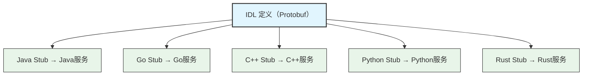
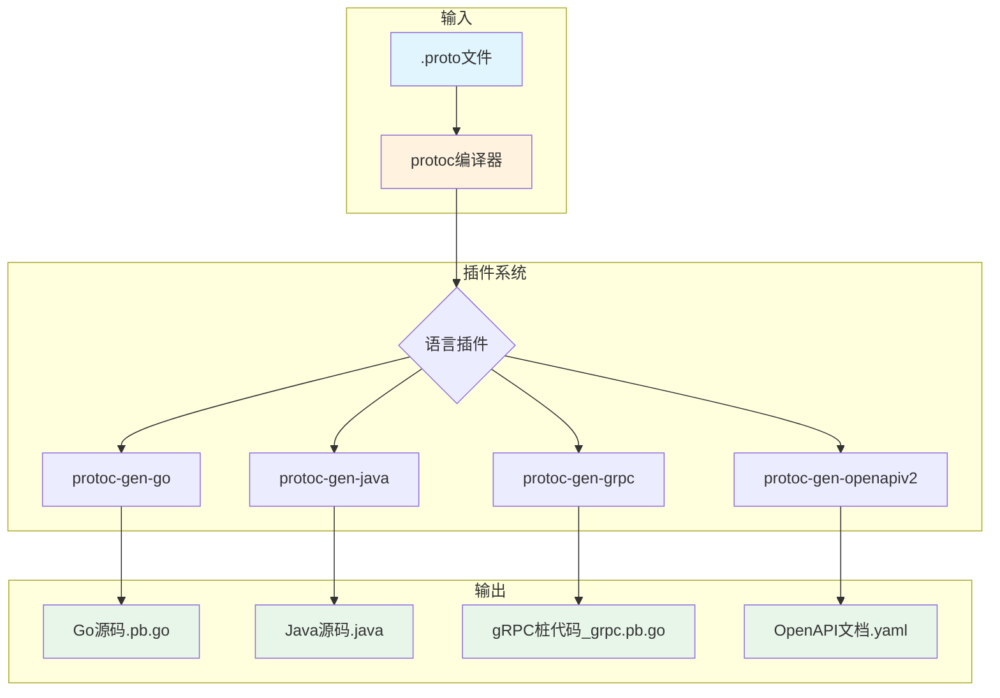

## 二、IDL与代码生成

在上一节中，我们了解了RPC的核心思想和调用流程。其中有一个关键组件贯穿整个RPC生命周期——**IDL（Interface Definition Language，接口定义语言）**。如果说RPC是分布式系统中的"服务员"，那么IDL就是服务员手中的"菜单"：它精确描述了哪些菜品（服务）可以点、每道菜的配料（参数）是什么、上菜的规格（返回值）是什么。

没有IDL的RPC就像没有菜单的餐厅——你不知道能点什么、服务员不知道怎么做、厨师不知道用什么料。IDL是RPC框架实现跨语言、跨平台通信的基石，而代码生成则是将这份"契约"转化为可运行代码的自动化引擎。

本节将从IDL的本质出发，深入剖析主流IDL语言的设计哲学与语法细节，系统讲解代码生成的完整流程与工程实践，最终帮助你掌握Schema演进的核心规则——这是保证大规模微服务系统长期健康运行的关键能力。

---

### 1. 什么是IDL

#### 1.1 IDL的本质：语言无关的契约

IDL（Interface Definition Language）是一种**中立的、描述性**的编程语言，专门用于定义软件组件之间的接口契约。它不关心调用方用Java写还是用Go写，只关心：

- **服务有哪些方法**（接口）
- **每个方法接收什么参数**（输入消息）
- **每个方法返回什么结果**（输出消息）
- **数据的组织结构**（消息类型、嵌套、枚举）

这种"语言无关性"是IDL的核心价值。通过IDL定义一次接口，可以自动生成多种编程语言的客户端和服务端代码，使得不同语言编写的服务能够无缝通信。



#### 1.2 为什么需要IDL

**问题一：跨语言通信的痛点**

假设你用Java写了一个用户服务，现在Python团队想调用它。没有IDL，你需要：

1. 手写HTTP接口文档（容易过期、不精确）
2. 双方各自实现序列化/反序列化逻辑（容易不一致）
3. 协商数据格式（JSON? XML? 自定义二进制?）
4. 手动维护客户端SDK（每种语言一份，工作量巨大）

有了IDL，这些工作全部自动化：

```protobuf
// user_service.proto — 一份定义，多语言共用
syntax = "proto3";
package user;

service UserService {
  rpc GetUser(GetUserRequest) returns (GetUserResponse);
}

message GetUserRequest {
  int64 user_id = 1;
}

message GetUserResponse {
  int64 id = 1;
  string name = 2;
  string email = 3;
}
```

一份`.proto`文件定义好之后，通过代码生成器可以自动生成Java、Go、Python、C++、Rust等十多种语言的消息类和RPC桩代码。开发者无需手动编写任何序列化逻辑，也无需协商数据格式——IDL就是唯一的"真相来源"。

**问题二：接口一致性难以保证**

在大型微服务架构中，一个服务可能有几十个RPC接口，被上百个下游服务依赖。如果接口变更只通过口头沟通或文档通知，遗漏是必然的。IDL充当了**编译期契约检查**的角色——接口定义变更后，所有依赖方必须重新生成代码并重新编译，否则编译直接报错。

举个真实场景：某电商平台有300+微服务，如果某个核心接口（如订单创建）的字段类型变更只通过邮件通知，遗漏一两个下游团队几乎是必然的。而通过IDL + CI自动检查，任何不兼容的变更都会在构建阶段被拦截，不会流入生产环境。

**问题三：文档与代码脱节**

传统的接口文档（如Swagger/OpenAPI）是代码的"衍生物"，需要额外维护，容易与实现脱节。IDL则是代码的"源头"——从IDL生成代码，而不是从代码反推文档。这种"代码即文档"的模式保证了文档的准确性和时效性。

**问题四：版本管理混乱**

没有IDL的系统中，接口版本管理通常依赖注释、文档甚至口头约定。当v1和v2接口同时在线时，很容易出现"调错版本"的事故。IDL天然支持通过包路径（如`user.v1`、`user.v2`）进行版本化，多个版本可以共存于同一进程中，客户端可以渐进式迁移。

#### 1.3 IDL的历史演进


| 时代 | 代表技术 | 特点 | 现状 |
|------|----------|------|------|
| 1990s | CORBA IDL | 标准化但极其复杂，规范长达数千页 | 已淘汰 |
| 2000s | Thrift IDL、Protobuf v2 | 简洁实用，面向互联网服务 | Thrift仍活跃 |
| 2010s | Protobuf v3、gRPC | 云原生标配，HTTP/2原生支持 | 主流方案 |
| 2020s+ | FlatBuffers、Cap'n Proto、Arrow | 零拷贝、列式存储、极致性能 | 新兴方案 |

CORBA IDL是IDL的鼻祖，它定义了完整的分布式对象标准（包括对象生命周期、命名服务、事务处理等），但规范极其庞大（OMG规范长达数千页），实现复杂度让大多数团队望而却步。Thrift和Protobuf吸取教训，只聚焦于"接口定义 + 序列化"这一核心需求，大幅降低了使用门槛。而2020年代兴起的FlatBuffers、Cap'n Proto则瞄准了极致性能场景，通过零拷贝技术将序列化开销降到最低。

---

### 2. 主流IDL语言详解

#### 2.1 Protocol Buffers（Protobuf）

Protobuf是Google开发的IDL和序列化框架，目前是gRPC生态的官方IDL，也是使用最广泛的RPC IDL语言。截至2025年，全球超过80%的gRPC服务使用Protobuf作为IDL，Google、Netflix、Uber、Square等公司的微服务架构都以Protobuf为核心。

**语法结构：**

```protobuf
syntax = "proto3";          // 使用proto3语法（推荐）
package order;               // 包名，防止命名冲突
option java_package = "com.example.order";  // 生成代码的Java包名
option go_package = "example.com/order/pb"; // 生成代码的Go包路径

// 导入其他proto文件
import "google/protobuf/timestamp.proto";
import "common/pagination.proto";

// 枚举类型
enum OrderStatus {
  ORDER_STATUS_UNSPECIFIED = 0;  // proto3要求第一个值为0
  ORDER_STATUS_PENDING = 1;
  ORDER_STATUS_PAID = 2;
  ORDER_STATUS_SHIPPED = 3;
  ORDER_STATUS_DELIVERED = 4;
}

// 消息定义（对应结构体/类）
message Order {
  int64 id = 1;                          // 字段编号（不是值！）
  string product_name = 2;
  int32 quantity = 3;
  double unit_price = 4;
  OrderStatus status = 5;
  google.protobuf.Timestamp created_at = 6;
  repeated string tags = 7;              // repeated = 列表
  map<string, string> metadata = 8;      // map类型
  oneof payment_method {                 // oneof = 联合体
    string credit_card = 9;
    string alipay_account = 10;
    string wechat_openid = 11;
  }
}

// 嵌套消息
message Address {
  string province = 1;
  string city = 2;
  string district = 3;
  string detail = 4;
}

// 服务定义
service OrderService {
  // 一元RPC（最基础的请求-响应模式）
  rpc CreateOrder(CreateOrderRequest) returns (CreateOrderResponse);

  // 流式RPC（在gRPC四种通信模式中详细介绍）
  rpc WatchOrders(WatchOrdersRequest) returns (stream OrderEvent);
}

message CreateOrderRequest {
  string product_name = 1;
  int32 quantity = 2;
  double unit_price = 3;
  Address shipping_address = 4;
}

message CreateOrderResponse {
  int64 order_id = 1;
  OrderStatus status = 2;
  string message = 3;
}
```

**Protobuf的字段编号规则：**

字段编号是Protobuf最独特的设计——它不是字段的值，而是字段的**唯一标识符**。序列化后的二进制数据中，每个字段用 `[字段编号 + Wire Type]` 作为标签，后跟实际值。这种设计使得Protobuf的序列化格式天然支持向后兼容：即使新增或删除了字段，只要编号不冲突，新旧版本就能互相读取。

Wire Type对照表：
  0 = Varint (int32, int64, bool, enum等整数类型)
  1 = 64-bit (fixed64, double)
  2 = Length-delimited (string, bytes, 嵌套message, repeated字段)
  5 = 32-bit (fixed32, float)

序列化后的二进制结构示意：

[字段编号=1, WireType=0] [Varint: user_id的值]
[字段编号=2, WireType=2] [长度] [name字符串的UTF-8字节]
[字段编号=3, WireType=2] [长度] [email字符串的UTF-8字节]

关键规则：
- **字段编号一旦分配不可复用**：删除字段时应使用 `reserved` 保留编号，防止未来误用。如果复用已删除的编号，旧版本客户端写入的数据会被新版本错误解析
- **1-15的编号只占1字节**：高频字段优先使用小编号，可节省序列化空间
- **16-2047的编号占2字节**：次高频字段使用
- **不能使用19000-19999**：这是Protobuf内部保留的编号范围

```protobuf
message User {
  reserved 2, 5, 9;           // 保留已删除的编号
  reserved "old_name", "old_email"; // 保留已删除的字段名
  int64 id = 1;               // 1字节标签
  string name = 3;            // 2字节标签（跳过2）
  string email = 4;           // 2字节标签
  int32 age = 6;              // 2字节标签（跳过5）
}
```

**Protobuf的数据类型映射：**

| Protobuf类型 | C++ | Java | Go | Python | 默认值 |
|-------------|-----|------|-----|--------|--------|
| double | double | double | float64 | float | 0.0 |
| float | float | float | float32 | float | 0.0 |
| int32 | int32_t | int | int32 | int | 0 |
| int64 | int64_t | long | int64 | int | 0 |
| uint32 | uint32_t | int | uint32 | int | 0 |
| uint64 | uint64_t | long | uint64 | int | 0 |
| bool | bool | boolean | bool | bool | false |
| string | string | String | string | str | "" |
| bytes | string | ByteString | []byte | bytes | b"" |

特别注意：Protobuf的`int64`在Python中映射为普通的`int`，而Python的`int`是任意精度的。这意味着如果序列化超过64位的整数，反序列化时不会报错但会丢失精度。这是一个常见的跨语言陷阱。

#### 2.2 Apache Thrift IDL

Thrift是Apache基金会的跨语言RPC框架，由Facebook于2007年开源。其IDL语法与Protobuf有相似之处，但在类型系统和服务定义上更加丰富。Thrift的核心优势在于其内置的传输层和协议层抽象，使得你可以独立选择传输方式（TCP/HTTP/Unix Socket）和序列化格式（Binary/Compact/JSON）。

```thrift
namespace java com.example.payment
namespace go payment

// 包含定义（类似C++的#include）
include "common/base.thrift"

// 常量定义
const i32 MAX_RETRY = 3;
const string TIMEOUT_MS = "5000";

// 类型别名
typedef i64 Timestamp
typedef string Currency

// 枚举
enum PaymentStatus {
  PENDING = 0,
  PROCESSING = 1,
  SUCCESS = 2,
  FAILED = 3,
  REFUNDED = 4
}

// 异常定义（Protobuf没有的特性）
exception InsufficientBalance {
  1: required double current_balance,
  2: required double required_amount,
  3: optional string message
}

exception PaymentTimeout {
  1: required i32 timeout_ms,
  2: optional string reason
}

// 结构体
struct PaymentRequest {
  1: required i64 order_id,
  2: required double amount,
  3: required Currency currency,
  4: optional string description,
  5: optional map<string, string> metadata,
}

struct PaymentResponse {
  1: required string transaction_id,
  2: required PaymentStatus status,
  3: optional Timestamp completed_at,
}

// 服务定义
service PaymentService {
  // oneway = 异步调用，不等待返回（Protobuf没有）
  oneway void sendPaymentNotification(1: string user_id, 2: string message);

  PaymentResponse processPayment(1: PaymentRequest request)
    throws (
      1: InsufficientBalance balance_error,
      2: PaymentTimeout timeout_error
    ),
  bool refund(1: string transaction_id, 2: double amount),
}

// 服务继承（Protobuf没有的特性）
service RefundService extends PaymentService {
  PaymentResponse processFullRefund(1: string transaction_id),
}
```

**Thrift vs Protobuf语法对比：**

| 特性 | Protobuf | Thrift |
|------|----------|--------|
| 字段标识 | 编号 (name = 1) | 编号 (1: type name) |
| 必填/可选 | proto3无区分（有optional关键字） | required/optional显式声明 |
| 异常处理 | 通过google.rpc.Status | 原生throws支持 |
| 服务继承 | 不支持 | 支持extends |
| oneway调用 | 通过选项声明 | 原生oneway关键字 |
| 常量定义 | 不支持 | 支持const |
| 类型别名 | 不支持 | 支持typedef |
| 复用机制 | import + package | include + namespace |

**选择建议：** 如果你追求gRPC生态的丰富工具链和云原生社区支持，选Protobuf；如果你需要原生异常处理、服务继承、oneway异步调用等特性，Thrift更合适。在实际项目中，Thrift在需要复杂类型系统和多协议传输的场景（如金融系统）中仍有大量应用。

#### 2.3 FlatBuffers IDL

FlatBuffers是Google开发的零拷贝序列化框架，专注于极致的读取性能。与Protobuf不同，FlatBuffers反序列化时**不需要解包（unpack）步骤**，可以直接在原始字节上读取字段，这使其在游戏、嵌入式等对延迟极度敏感的场景中大放异彩。

```fbs
namespace MyGame.Sample;

enum Color: byte { Red = 0, Green = 1, Blue = 2 }

struct Vec3 {
  x: float;
  y: float;
  z: float;
}

table Weapon {
  name: string;
  damage: short;
}

table Monster {
  pos: Vec3;                    // 嵌套结构体（内联存储）
  mana: short = 150;            // 默认值
  hp: short = 100;
  name: string (required);      // 必填字段
  color: Color = Blue;
  weapons: [Weapon];            // 数组
  equipped: Weapon;             // 联合类型（多态）
}

root_type Monster;
```

FlatBuffers的核心差异在于**内存布局**。Protobuf将数据紧凑排列（读取需逐字段解码），而FlatBuffers在内存中保留了与原始结构体相同的偏移量，读取时只需一次内存拷贝（zero-copy）：

Protobuf读取流程：
  字节流 → 反序列化 → 分配内存 → 填充字段 → 返回对象
  时间复杂度: O(n)，n为字段数量

FlatBuffers读取流程：
  字节流 → 验证签名 → 返回指针（直接读取）
  时间复杂度: O(1)，只需计算偏移量

FlatBuffers的代价是**写入时更慢**（需要按照特定内存布局排列数据）且**序列化体积更大**（因为要保留偏移量信息）。因此它最适合"写入少、读取多"的场景，如游戏存档读取、嵌入式配置加载、高频交易系统的行情数据等。

**FlatBuffers vs Protobuf性能对比（典型场景）：**

| 场景 | Protobuf | FlatBuffers | 说明 |
|------|----------|-------------|------|
| 序列化速度 | ⭐⭐⭐⭐ | ⭐⭐⭐ | Protobuf更紧凑，写入更快 |
| 反序列化速度 | ⭐⭐⭐ | ⭐⭐⭐⭐⭐ | FlatBuffers零拷贝，读取极快 |
| 内存占用 | ⭐⭐⭐⭐ | ⭐⭐⭐ | Protobuf更紧凑 |
| 序列化体积 | ⭐⭐⭐⭐⭐ | ⭐⭐⭐ | Protobuf更紧凑 |
| 字段访问延迟 | O(n) | O(1) | FlatBuffers直接偏移读取 |

#### 2.4 Cap'n Proto IDL

Cap'n Proto由Protobuf的原作者Kenton Varda设计，目标是"最快的RPC"。它的IDL与Protobuf v2语法非常接近，但序列化格式是完全不同的——采用**固定偏移量**设计，类似FlatBuffers的零拷贝方案。

```capnp
@0xabc123...;  # 64位唯一文件ID（必须全局唯一）

struct Point {
  x @0 :Float64;
  y @1 :Float64;
  z @2 :Float64;
}

interface MathService {
  # 能力（Capability）= 可以远程调用的对象
  distance @0 (from :Point, to :Point) -> (result :Float64);
  midpoint @1 (points :List(Point)) -> (center :Point);
}
```

Cap'n Proto的独特之处在于**RPC本身就是序列化的一部分**——调用一个远程方法和填充一个本地消息使用完全相同的序列化格式，没有任何额外的编码/解码开销。这意味着RPC调用的延迟几乎等于一次内存拷贝的时间。

Cap'n Proto还引入了**能力（Capability）安全模型**：每个`interface`不仅是一个服务定义，还是一个可传递的安全令牌。你可以将一个远程对象的引用传递给第三方，第三方获得调用该对象的能力——这类似于浏览器中的Web API设计（每个iframe只能访问被授予的接口）。

#### 2.5 Apache Arrow IPC

Apache Arrow定义了一种**跨语言的内存列式数据格式**，虽然不是传统意义上的RPC IDL，但在数据密集型RPC场景（如数据交换、DataFrame传输）中越来越常用：

```python
# Arrow IPC Schema定义（通过代码而非独立IDL文件）
import pyarrow as pa

schema = pa.schema([
    pa.field("user_id", pa.int64()),
    pa.field("name", pa.utf8()),
    pa.field("scores", pa.list_(pa.float32())),
    pa.field("metadata", pa.map_(pa.utf8(), pa.utf8())),
])

# 序列化为IPC格式
ipc_bytes = pa.BufferOutputStream()
writer = pa.ipc.new_file(ipc_bytes, schema, ...)
```

Arrow的优势在于零拷贝跨语言数据共享——Python生成的数据，C++可以直接读取而无需序列化/反序列化。在大数据处理场景（如Spark、Pandas、DuckDB之间的数据交换），Arrow已成为事实标准。

---

### 3. 主流IDL选型指南

在实际项目中，IDL的选择直接影响系统的性能、开发效率和长期维护成本。以下是基于不同场景的选型建议：

| 场景 | 推荐IDL | 理由 |
|------|---------|------|
| 通用微服务（云原生） | Protobuf + gRPC | 工具链最完善，社区最活跃 |
| 高频交易/游戏 | FlatBuffers | 零拷贝读取，延迟最低 |
| 复杂类型系统/金融 | Thrift | 原生异常、服务继承、多协议 |
| 超低延迟RPC | Cap'n Proto | RPC即序列化，无额外开销 |
| 大数据/DataFrame交换 | Arrow IPC | 列式存储，跨语言零拷贝 |
| 需要REST兼容 | Protobuf + gRPC-Gateway | 同时支持gRPC和HTTP/JSON |
| 嵌入式/IoT | FlatBuffers或Cap'n Proto | 资源占用小，读取快 |

**决策流程：**

是否需要极致读取性能？
├── 是 → 数据量大且需要列式访问？→ Arrow IPC
│        否 → 需要RPC能力？→ Cap'n Proto
│             否 → FlatBuffers
└── 否 → 需要丰富的类型系统（异常/继承）？→ Thrift
         否 → 是否在云原生环境？→ Protobuf + gRPC
              否 → Protobuf（通用选择）

---

### 4. 代码生成：从IDL到可运行代码

#### 4.1 代码生成的完整流程

IDL本身只是一份"契约声明"，需要通过**代码生成器（Code Generator）**将其编译为各语言的可运行代码。整个流程如下：



以Protobuf为例，一次完整的代码生成命令：

```bash
# 基础命令结构
protoc \
  --proto_path=. \                    # .proto文件搜索路径
  --proto_path=./third_party \        # 额外的搜索路径（如google/protobuf）
  --go_out=. \                        # Go消息代码输出目录
  --go_opt=paths=source_relative \   # Go输出路径选项
  --go-grpc_out=. \                   # Go gRPC桩代码输出目录
  --go-grpc_opt=paths=source_relative \
  --java_out=./gen/java \             # Java输出目录
  --python_out=./gen/python \         # Python输出目录
  --openapiv2_out=./gen/swagger \     # OpenAPI文档输出
  user_service.proto                  # 输入的proto文件
```

代码生成器的工作原理：它读取.proto文件的AST（抽象语法树），遍历每个message/service定义，按照目标语言的模板生成对应的源代码。生成的代码包含：
1. **消息类/结构体**：字段定义、getter/setter、默认值处理
2. **序列化/反序列化方法**：Marshal/Unmarshal、序列化到流
3. **RPC桩代码**：客户端存根（Stub）和服务端注册器（Registrar）
4. **描述符元数据**：用于反射和动态消息处理

#### 4.2 生成代码的内部结构

让我们看看Protobuf为Go语言生成的代码内部结构（简化版）：

```go
// user_service.pb.go —— 自动生成，请勿手动修改！
// Code generated by protoc-gen-go. DO NOT EDIT.

package pb

import (
    proto "google.golang.org/protobuf/proto"
    protoreflect "google.golang.org/protobuf/reflect/protoreflect"
    protoregistry "google.golang.org/protobuf/reflect/protoregistry"
)

// ========== 消息结构体 ==========
type GetUserRequest struct {
    state         protoimpl.MessageState
    sizeCache     protoimpl.SizeCache
    unknownFields protoimpl.UnknownFields

    UserId int64 `protobuf:"varint,1,opt,name=user_id,json=userId,proto3" json:"user_id,omitempty"`
}

// Getter方法 —— 线程安全的字段访问
func (x *GetUserRequest) GetUserId() int64 {
    if x != nil {
        return x.UserId
    }
    return 0
}

// ========== 序列化/反序列化 ==========
func (x *GetUserRequest) ProtoReflect() protoreflect.Message {
    // 反射支持，用于动态消息处理
}

func (x *GetUserRequest) Reset() {
    *x = GetUserRequest{}
}

func (x *GetUserRequest) String() string {
    // 调试用的字符串表示
}

// ========== 原始字节操作 ==========
func (x *GetUserRequest) Marshal() ([]byte, error) {
    return proto.Marshal(x)
}

func (x *GetUserRequest) Unmarshal(b []byte) error {
    return proto.Unmarshal(b, x)
}
```

注意生成代码中的结构标签（struct tag）`protobuf:"varint,1,opt,name=user_id,json=userId,proto3"`，它编码了字段的完整元信息：Wire Type（varint）、字段编号（1）、是否可选（opt）、JSON映射名（userId）。这些元信息在序列化/反序列化时被使用，也是反射API的基础。

```go
// user_service_grpc.pb.go —— gRPC桩代码
// Code generated by protoc-gen-go-grpc. DO NOT EDIT.

// 客户端接口
type UserServiceClient interface {
    GetUser(ctx context.Context, in *GetUserRequest, opts ...grpc.CallOption) (*GetUserResponse, error)
}

// 服务端接口
type UserServiceServer interface {
    GetUser(context.Context, *GetUserRequest) (*GetUserResponse, error)
    mustEmbedUnimplementedUserServiceServer()
}

// 客户端实现（桩代码）
type userServiceClient struct {
    cc grpc.ClientConnInterface
}

func NewUserServiceClient(cc grpc.ClientConnInterface) UserServiceClient {
    return &amp;userServiceClient{cc}
}

func (c *userServiceClient) GetUser(ctx context.Context, in *GetUserRequest, opts ...grpc.CallOption) (*GetUserResponse, error) {
    out := new(GetUserResponse)
    // 核心：通过gRPC通道执行远程调用
    // "/user.UserService/GetUser" 是 fully-qualified 方法名
    err := c.cc.Invoke(ctx, "/user.UserService/GetUser", in, out, opts...)
    if err != nil {
        return nil, err
    }
    return out, nil
}

// 服务端注册器
func RegisterUserServiceServer(s *grpc.Server, srv UserServiceServer) {
    s.RegisterService(&amp;UserService_ServiceDesc, srv)
}
```

gRPC桩代码中的`mustEmbedUnimplementedUserServiceServer()`是gRPC Go的前向兼容机制：当IDL新增方法时，旧版本的服务端实现不会因为缺少新方法而编译失败，而是返回"未实现"错误。

#### 4.3 生成代码的使用模式

代码生成后，开发者只需要关注业务逻辑。下面是一个完整的使用示例：

```go
// ============ 服务端 ============
func main() {
    // 1. 启动gRPC服务器
    lis, err := net.Listen("tcp", ":50051")
    if err != nil {
        log.Fatalf("监听端口失败: %v", err)
    }

    grpcServer := grpc.NewServer()

    // 2. 注册业务实现
    pb.RegisterUserServiceServer(grpcServer, &amp;userServiceServer{})

    log.Println("gRPC服务器启动于 :50051")
    grpcServer.Serve(lis)
}

// 3. 实现IDL定义的服务接口
type userServiceServer struct {
    pb.UnimplementedUserServiceServer  // 前向兼容：新增方法时旧实现不会编译失败
}

func (s *userServiceServer) GetUser(ctx context.Context, req *pb.GetUserRequest) (*pb.GetUserResponse, error) {
    // 业务逻辑 —— 对调用者来说就像本地函数
    user, err := db.FindUserByID(req.GetUserId())
    if err != nil {
        return nil, status.Errorf(codes.NotFound, "用户 %d 不存在", req.GetUserId())
    }

    return &amp;pb.GetUserResponse{
        Id:    user.ID,
        Name:  user.Name,
        Email: user.Email,
    }, nil
}
```

```go
// ============ 客户端 ============
func main() {
    // 1. 建立连接
    conn, err := grpc.NewClient("localhost:50051",
        grpc.WithTransportCredentials(insecure.NewCredentials()),
    )
    if err != nil {
        log.Fatalf("连接失败: %v", err)
    }
    defer conn.Close()

    // 2. 创建客户端桩
    client := pb.NewUserServiceClient(conn)

    // 3. 像调用本地函数一样发起RPC
    resp, err := client.GetUser(context.Background(), &amp;pb.GetUserRequest{
        UserId: 42,
    })
    if err != nil {
        log.Fatalf("调用失败: %v", err)
    }

    fmt.Printf("用户名: %s, 邮箱: %s\n", resp.GetName(), resp.GetEmail())
}
```

**关键设计模式：** 客户端代码和本地函数调用几乎完全一致——`client.GetUser(ctx, req)`的写法和调用本地方法没有区别。这就是IDL + 代码生成的核心价值：开发者无需关心底层的序列化、网络传输、错误处理等细节，框架全部封装在桩代码中。

#### 4.4 各框架的代码生成工具对比

| 框架 | 编译器 | 插件机制 | 输出语言 | 构建集成 |
|------|--------|----------|----------|----------|
| Protobuf | protoc | protoc-gen-* | Go/Java/Python/C++/Ruby/PHP | Bazel, Maven, Go generate |
| Thrift | thrift | 内置 | Java/Go/Python/C++/Rust等28种 | Maven, Gradle, Ant |
| FlatBuffers | flatc | 内置 | C++/Java/C#/Go/Python/Rust等17种 | CMake, Bazel |
| Cap'n Proto | capnpc | capnpc-* | C++/Java/Python/Go/Rust | 自带构建系统 |
| Buf | buf | 集成protoc-gen-* | 同Protobuf（包装层） | buf.yaml配置 |

---

### 5. Schema演进与兼容性

#### 5.1 为什么Schema演进如此重要

在生产系统中，IDL定义的接口不是一成不变的。业务发展会带来字段新增、类型调整、方法废弃等需求。但IDL的特殊之处在于——**消费方和提供方可能由不同团队维护、不同语言编写、不同时间发布**。这就要求IDL的演进必须保证**向后兼容**和**向前兼容**：

- **向后兼容（Backward Compatible）**：新版本的消费者能读取旧版本的生产者生成的数据
- **向前兼容（Forward Compatible）**：旧版本的消费者能读取新版本的生产者生成的数据

在真实的微服务系统中，一次接口变更可能涉及数十个服务的协调发布。如果缺乏兼容性保障，要么需要"全量停机升级"（代价极高），要么冒着数据损坏的风险"滚动发布"。IDL的兼容性规则正是为了避免这种困境。

#### 5.2 Protobuf的兼容性规则

Protobuf通过**字段编号**机制天然支持兼容性。只要遵循以下规则，版本演进就是安全的：

**安全操作（推荐）：**

```protobuf
// v1 定义
message UserProfile {
  int64 id = 1;
  string name = 2;
  string email = 3;
}

// v2 定义 —— 以下所有操作都是兼容的
message UserProfile {
  int64 id = 1;
  string name = 2;
  string email = 3;
  string phone = 4;          // ✅ 新增字段：旧代码忽略未知字段
  int32 age = 5;             // ✅ 新增字段
  enum Status {              // ✅ 新增枚举
    UNKNOWN = 0;
    ACTIVE = 1;
    INACTIVE = 2;
  }
  Status status = 6;         // ✅ 新增枚举字段
}
```

**危险操作（会导致兼容性问题）：**

```protobuf
// ❌ 删除字段但不保留编号
message UserProfile {
  int64 id = 1;
  // string name = 2;        // 删除了！旧数据反序列化会出错
  string email = 3;
}

// ✅ 正确做法：保留已删除的编号
message UserProfile {
  reserved 2;                // 保留编号2
  reserved "name";           // 保留字段名
  int64 id = 1;
  string email = 3;
}

// ❌ 修改字段编号
message UserProfile {
  int64 id = 2;              // 从1改成2！完全不同含义
  string name = 1;           // 从2改成1！
}

// ❌ 修改字段类型（除非类型映射兼容）
message UserProfile {
  int64 id = 1;
  string name = 2;
  int32 age = 3;             // 原来是string类型，现在改成int32
}

// ❌ 复用已删除的字段编号
message UserProfile {
  int64 id = 1;
  string name = 2;
  reserved 3;                // 旧的phone字段编号已保留
  string address = 3;        // 复用了！会导致旧数据解析错误
}
```

**类型兼容性矩阵（Protobuf安全的类型转换）：**

| 源类型 | 可安全转为 | 原因 |
|--------|-----------|------|
| int32 | int64, sint32, sint64 | 位宽扩大 |
| uint32 | uint64, sint32, sint64 | 位宽扩大 |
| fixed32 | fixed64 | 位宽扩大 |
| string | bytes | 字符串本质是字节 |
| bytes | string | 字节本质是字符串 |
| double | float | ⚠️ 精度损失，但格式兼容 |

#### 5.3 Thrift的兼容性策略

Thrift的兼容性规则与Protobuf类似，但有一个重要区别——Thrift支持 `required/optional` 修饰符：

```thrift
// v1
struct UserProfile {
  1: required i64 id,
  2: required string name,
  3: optional string email,
}

// v2 —— 兼容性规则
struct UserProfile {
  1: required i64 id,
  2: required string name,
  3: optional string email,
  4: optional string phone,    // ✅ 新增optional字段
  // 5: optional i32 legacy_field,  // ❌ 永远不要删除required字段
}
```

Thrift的特殊规则：
- 可以将 `required` 改为 `optional`（安全）
- **不能**将 `optional` 改为 `required`（不安全，旧数据可能没有该字段）
- 可以新增 `optional` 字段（安全）
- **不能**删除 `required` 字段（不安全）

> **实战经验：** 在Thrift项目中，建议新字段一律使用`optional`，除非你确定该字段在所有历史数据中都存在。Facebook内部的Thrift编码规范明确要求"永远不要使用required"——因为随着版本演进，required字段迟早会变成兼容性负担。

#### 5.4 高级兼容性技巧

**Oneof字段的演进：**

```protobuf
message PaymentMethod {
  oneof method {
    CreditCard credit_card = 1;
    Alipay alipay = 2;
    WechatPay wechat = 3;
    CryptoPayment crypto = 4;       // 新增支付方式
  }
}

// 注意：oneof内部不能用reserved，新增字段只需分配新编号
```

**Any类型的动态消息：**

```protobuf
import "google/protobuf/any.proto";

message Event {
  string event_type = 1;
  google.protobuf.Any payload = 2;  // 可以包装任意消息类型
}

// 使用时需要类型注册
import (
    "google.golang.org/protobuf/reflect/protoregistry"
    "google.golang.org/protobuf/types/known/anypb"
)
```

**Map字段的兼容性：**

```protobuf
// v1
message Config {
  map<string, string> settings = 1;
}

// v2 —— 将map升级为typed message（不兼容！）
// message Config {
//   repeated SettingEntry settings = 1;
// }
// message SettingEntry { string key = 1; string value = 2; }

// ✅ 安全做法：新增字段
message Config {
  map<string, string> settings = 1;
  repeated TypedSetting typed_settings = 2;  // 新增结构化版本
}
```

**方法的废弃而非删除：**

```protobuf
service UserService {
  // 旧方法：标记为废弃，而非直接删除
  rpc GetUser(GetUserRequest) returns (GetUserResponse) {
    option deprecated = true;  // 标记为废弃
  }
  
  // 新方法：推荐使用
  rpc GetUserV2(GetUserV2Request) returns (GetUserV2Response);
}
```

---

### 6. 代码生成的工程实践

#### 6.1 项目目录结构

一个规范的Protobuf项目目录结构：

project/
├── proto/                          # IDL定义文件
│   ├── buf.yaml                    # Buf配置（推荐的proto管理工具）
│   ├── buf.gen.yaml                # 代码生成配置
│   ├── user/
│   │   └── v1/
│   │       └── user.proto          # 服务proto定义
│   ├── order/
│   │   └── v1/
│   │       └── order.proto
│   └── google/
│       └── protobuf/               # Google官方proto（timestamp等）
│           └── timestamp.proto
├── gen/                            # 生成代码输出目录（可选是否纳入版本控制）
│   ├── go/
│   │   └── user/
│   │       └── v1/
│   │           ├── user.pb.go
│   │           └── user_grpc.pb.go
│   ├── java/
│   │   └── com/example/user/v1/
│   │       └── UserProto.java
│   └── swagger/
│       └── user_v1.yaml
├── src/                            # 业务实现代码
│   └── server/
│       └── user_service.go
└── Makefile                        # 构建脚本

**关于生成代码是否纳入版本控制：** 这是一个常见的争议点。推荐的做法是**将生成代码纳入版本控制**，原因：
1. 下游消费者无需安装protoc和插件即可编译
2. CI/CD可以验证生成代码是否与.proto一致
3. 避免团队成员因本地protoc版本不同产生分歧

#### 6.2 Buf：现代Proto管理工具

Buf是目前最流行的Protobuf项目管理工具，它提供了proto lint、breaking change检测、远程插件执行等功能：

```yaml
# buf.yaml —— 项目配置
version: v2
modules:
  - path: proto
lint:
  use:
    - STANDARD                    # 使用Google标准lint规则
  except:
    - UNARY_RPC                  # 允许非一元RPC（按需）
breaking:
  use:
    - FILE                       # 检测文件级兼容性

# buf.gen.yaml —— 代码生成配置
version: v2
plugins:
  # 远程插件（无需本地安装protoc和插件）
  - remote: buf.build/protocolbuffers/go
    out: gen/go
    opt: paths=source_relative
  - remote: buf.build/grpc/go
    out: gen/go
    opt: paths=source_relative
  - remote: buf.build/bufbuild/es
    out: gen/es                      # TypeScript/JavaScript
  - remote: buf.build/grpc-ecosystem/openapiv2
    out: gen/swagger
```

```bash
# Buf常用命令
buf lint                          # Lint检查proto文件
buf breaking --against '.git#branch=main'  # 检测破坏性变更
buf generate                      # 生成代码
buf dep update                    # 更新依赖
buf curl --request POST \         # 直接调用gRPC服务（调试用）
  --data '{"user_id": 42}' \
  localhost:50051/user.v1.UserService/GetUser
```

Buf相比原生protoc的核心优势：
1. **无需安装protoc**：Buf内置了Protobuf编译器
2. **远程插件**：代码生成插件从Buf BSR（Schema Registry）远程拉取，无需本地安装
3. **Breaking Change检测**：内置兼容性检查，可集成到CI
4. **模块依赖管理**：类似go.mod的依赖管理机制
5. **Schema Registry（BSR）**：集中存储和版本管理proto文件

#### 6.3 CI/CD集成

```yaml
# .github/workflows/proto-ci.yml
name: Proto CI
on: [push, pull_request]

jobs:
  proto-lint:
    runs-on: ubuntu-latest
    steps:
      - uses: actions/checkout@v4
      - uses: bufbuild/buf-setup-action@v1
      - run: buf lint
      - run: buf breaking --against '.git#branch=main'

  proto-generate:
    runs-on: ubuntu-latest
    steps:
      - uses: actions/checkout@v4
      - uses: bufbuild/buf-setup-action@v1
      - run: buf generate
      - name: 检查生成代码是否过期
        run: |
          git diff --exit-code gen/ || {
            echo "❌ 生成代码已过期，请运行 buf generate 并提交"
            exit 1
          }
```

这个CI流程做了两件关键事情：
1. **Lint + Breaking Change检测**：确保proto文件符合规范且不包含破坏性变更
2. **生成代码一致性检查**：确保提交的生成代码与.proto文件同步，避免"忘记重新生成"的问题

#### 6.4 常见代码生成配置技巧

**多语言生成的差异化配置：**

```bash
# Go：生成gRPC桩代码 + 消息代码
protoc --go_out=. --go-grpc_out=. service.proto

# Java：指定包名
protoc --java_out=./gen/java \
  --java_opt=java_outer_classname=UserServiceProto \
  service.proto

# Python：生成pyi类型提示文件
protoc --python_out=. --pyi_out=. service.proto

# TypeScript：使用ts-proto插件
protoc --plugin=protoc-gen-ts_proto=./node_modules/.bin/protoc-gen-ts_proto \
  --ts_proto_out=. \
  --ts_proto_opt=nestJs=true,outputJsonMethods=true \
  service.proto
```

**自定义选项（Custom Options）：**

```protobuf
import "google/protobuf/descriptor.proto";

// 定义自定义选项
extend google.protobuf.MethodOptions {
  optional string http_method = 50001;
  optional string rate_limit = 50002;
}

service UserService {
  // 使用自定义选项
  rpc GetUser(GetUserRequest) returns (GetUserResponse) {
    option (http_method) = "GET";
    option (rate_limit) = "1000/min";
  }
}
```

自定义选项允许你在IDL层面嵌入元数据（如HTTP映射、限流配置、权限要求等），然后通过自定义代码生成器读取这些元数据并生成相应的中间件代码。这是实现"IDL驱动开发"的核心技术手段。

---

### 7. IDL设计最佳实践

#### 7.1 命名规范

| 元素 | Protobuf规范 | Thrift规范 | 示例 |
|------|-------------|-----------|------|
| 包名 | 小写下划线 | namespace决定 | `user_service` |
| 消息名 | 大驼峰 | 大驼峰 | `GetUserRequest` |
| 字段名 | 小写下划线 | 小写驼峰 | `user_id` / `userId` |
| 服务名 | 大驼峰 + Service | 大驼峰 + Service | `UserService` |
| RPC方法名 | 大驼峰 | 小写驼峰 | `GetUser` / `getUser` |
| 枚举名 | 大写下划线（值），大驼峰（类型） | 大驼峰（类型），大驼峰（值） | `STATUS_ACTIVE` |

> **关于命名的争议：** Protobuf官方风格指南推荐字段名使用`snake_case`（如`user_id`），但在Java和TypeScript生成代码中会自动转为`camelCase`（如`userId`）。如果你的团队跨语言协作，建议统一使用`snake_case`定义，让各语言的生成器自动处理命名转换。

#### 7.2 接口设计原则

**原则一：Request/Response模式**

每个RPC方法都应该使用独立的Request和Response消息，即使只有一个字段：

```protobuf
// ❌ 不推荐：单字段直接传参
service UserService {
  rpc GetUser(int64 user_id) returns (User);
}

// ✅ 推荐：使用Request/Response封装
service UserService {
  rpc GetUser(GetUserRequest) returns (GetUserResponse);
}

message GetUserRequest {
  int64 user_id = 1;
}

message GetUserResponse {
  User user = 1;
}
```

为什么？因为Request/Response模式支持：
- 向后兼容的字段扩展（新增字段不影响旧客户端）
- 统一的错误处理框架（错误通过gRPC status返回，而非方法签名）
- 一致的日志和监控格式（每个RPC都有相同的输入/输出结构）
- 批量操作的自然扩展（Request中加一个repeated字段即可）

**原则二：使用标准错误码**

```protobuf
import "google/rpc/error_details.proto";
import "google/rpc/status.proto";

service OrderService {
  rpc CreateOrder(CreateOrderRequest) returns (CreateOrderResponse);
}

// 在服务端实现中使用标准错误
func (s *server) CreateOrder(ctx context.Context, req *pb.CreateOrderRequest) (*pb.CreateOrderResponse, error) {
    if req.Quantity <= 0 {
        st, _ := status.New(codes.InvalidArgument, "数量必须大于0").
            WithDetails(&amp;errdetails.BadRequest{
                FieldViolations: []*errdetails.BadRequest_FieldViolation{
                    {Field: "quantity", Description: "must be 0"},
                },
            })
        return nil, st.Err()
    }
    // ...
}
```

gRPC定义了16个标准状态码（如`OK`、`NotFound`、`InvalidArgument`、`Internal`等），它们覆盖了绝大多数RPC错误场景。使用标准错误码的好处是客户端可以统一处理错误，而不需要解析自定义的错误消息。

**原则三：版本化包路径**

```protobuf
// ✅ 通过包路径实现版本化
// proto/user/v1/user.proto
package user.v1;

// proto/user/v2/user.proto
package user.v2;
```

版本化的好处：
- v1和v2可以同时存在于同一个二进制中
- 客户端可以渐进式迁移
- 旧版本可以维护而不影响新版本
- 避免"大爆炸"式迁移（所有客户端同时升级）

#### 7.3 性能优化技巧

**技巧一：字段编号优化**

```protobuf
message HotMessage {
  // 高频字段使用1-15编号（1字节标签）
  string request_id = 1;
  int64 timestamp = 2;
  bytes payload = 3;

  // 低频字段使用16+编号
  string debug_info = 16;
  map<string, string> trace_context = 17;
}
```

**技巧二：选择合适的类型**

```protobuf
message OptimizedFields {
  // ✅ 能用int32就不用int64（更紧凑）
  int32 count = 1;

  // ✅ 用sint32处理负数（ZigZag编码更高效）
  sint32 temperature = 2;

  // ✅ 用bytes存储二进制数据，不要用string
  bytes raw_data = 3;

  // ✅ 用enum代替int32，语义更清晰且有类型检查
  enum Status { UNKNOWN = 0; ACTIVE = 1; }
  Status status = 4;
}
```

**关于ZigZag编码的深入解释：** 标准的Varint编码对负数效率极低——`-1`的Varint编码需要10个字节（因为负数的二进制表示以全1开头）。而`sint32`/`sint64`使用ZigZag编码，将负数映射为正数（-1→1, -2→2, 1→2, 2→3），使得小的负数也能用少量字节表示。如果你的字段可能包含负数，务必使用`sint`类型。

**技巧三：避免过度嵌套**

```protobuf
// ❌ 过度嵌套导致序列化开销大
message A {
  message B {
    message C {
      message D {
        string value = 1;
      }
    }
  }
  B b = 1;
}

// ✅ 扁平化设计
message FlatMessage {
  string a_b_c_d_value = 1;
}
```

---

### 8. 常见误区与排错

#### 误区一：混淆字段编号和字段值

// ❌ 误区：以为 = 后面是字段的默认值
message User {
  string name = 3;  // 以为name的默认值是3
}

// ✅ 正确理解：3是字段编号，不是值
// name的默认值是空字符串""（string类型的零值）
// 字段编号仅用于序列化时的字段标识

#### 误区二：忽略proto3的零值语义

```protobuf
syntax = "proto3";

message SearchRequest {
  string query = 1;
  int32 page_number = 2;      // 默认值是0
  bool include_deleted = 3;   // 默认值是false
}

// 问题：无法区分"用户传了page_number=0"和"用户没传page_number"
// 两者序列化后都是空的（零值不会被序列化）

// 解决方案一：使用optional关键字（proto3支持）
message SearchRequest {
  string query = 1;
  optional int32 page_number = 2;  // 现在可以区分了
  bool include_deleted = 3;
}

// 解决方案二：使用wrapper类型
import "google/protobuf/wrappers.proto";

message SearchRequest {
  string query = 1;
  google.protobuf.Int32Value page_number = 2;  // 显式包装
}
```

`optional`关键字在proto3中会生成一个`has_*`方法（如`HasPageNumber()`），让你明确知道字段是否被设置。这是处理"零值 vs 未设置"问题的标准方案。

#### 误区三：在生产环境修改已部署的proto文件

// 危险场景：
// 1. 你修改了proto文件并重新部署了服务端
// 2. 客户端还在使用旧版本的proto
// 3. 新增字段：客户端忽略（安全）
// 4. 删除字段：客户端尝试读取已删除字段 → 数据损坏！

// ✅ 防御措施：
// 1. 使用buf breaking检查破坏性变更
// 2. CI流程中强制执行兼容性检查
// 3. 使用reserved保留已删除字段的编号
// 4. 新版本通过包路径（v1/v2）发布

#### 误区四：Protobuf字段的`repeated`与`map`的选择

```protobuf
message Config {
  // ❌ 用repeated key-value对模拟map（不推荐）
  repeated SettingPair settings = 1;
  message SettingPair {
    string key = 1;
    string value = 2;
  }

  // ✅ 直接使用map类型
  map<string, string> settings = 2;
}

// map的限制：
// - key只能是整数或字符串（不能是浮点数或bytes）
// - map字段不可用repeated修饰
// - 序列化后是无序的（不要依赖插入顺序）
```

#### 误区五：忽略代码生成版本管理

// ❌ 团队成员各自本地运行protoc生成代码
// 结果：不同成员生成的代码版本不一致，Git冲突

// ✅ 统一使用Makefile或CI生成代码
# Makefile
.PHONY: proto
proto:
	buf generate

# 生成的代码纳入版本控制（而非.gitignore）
# 这样团队成员不需要安装protoc即可编译

#### 误区六：忽略proto文件的import路径

// ❌ 混淆import路径和文件系统路径
import "user.proto";           // 如果文件不在proto_path中，编译失败

// ✅ 使用相对于proto_path的路径
import "user/v1/user.proto";   // 文件在proto/user/v1/user.proto

// 常见错误信息：
// user.proto: File not found.
// → 检查 --proto_path 参数是否包含了正确的搜索路径

#### 误区七：proto3与proto2混用

// ❌ 在proto3项目中导入proto2文件（语法不兼容）
syntax = "proto3";
import "legacy.proto";  // 如果legacy.proto使用proto2语法

// ✅ 解决方案：为proto2文件设置独立的语法声明
// legacy.proto
syntax = "proto2";  // 明确声明使用proto2
package legacy;
// proto2支持required/optional修饰符

---

### 9. 进阶主题

#### 9.1 自定义代码生成插件

以Protobuf的Go插件为例，编写一个自定义代码生成器来生成数据库ORM代码：

```go
// protoc-gen-pgmodel/main.go
package main

import (
    "fmt"
    "os"
    "strings"

    "google.golang.org/protobuf/compiler/protogen"
)

func main() {
    protogen.Options{}.Run(func(gen *protogen.Plugin) error {
        for _, f := range gen.Files {
            if !f.Generate {
                continue
            }
            for _, msg := range f.Messages {
                generateModel(gen, f, msg)
            }
        }
        return nil
    })
}

func generateModel(gen *protogen.Plugin, file *protogen.File, msg *protogen.Message) {
    fileName := strings.ToLower(msg.Desc.Name()) + ".model.go"
    g := gen.NewGeneratedFile(fileName, file.GoImportPath)

    g.P("package models")
    g.P()
    g.P(fmt.Sprintf("type %s struct {", msg.GoIdent.GoName))
    g.P("    ID        int64     `db:\"id\"`")
    for _, field := range msg.Fields {
        g.P(fmt.Sprintf("    %-12s %-10s `db:\"%s\"`",
            field.GoName,
            goType(field),
            snakeCase(field.GoName),
        ))
    }
    g.P("}")
}
```

这个插件的用途：从Protobuf消息定义自动生成Go struct，并添加`db`标签用于数据库ORM映射。通过这种方式，proto文件不仅是RPC接口的定义，还成了数据库模型的"单一真相来源"——修改一个字段，RPC和数据库层同时生效。

类似的自定义插件还可以生成：
- 校验代码（字段长度限制、格式校验）
- 文档（Markdown或HTML格式的API文档）
- Mock代码（用于单元测试的mock服务端）
- 监控埋点代码（自动记录每次RPC调用的延迟和错误率）

#### 9.2 动态消息与反射

Protobuf支持在运行时动态操作消息，无需编译时知道具体类型：

```go
import (
    "google.golang.org/protobuf/reflect/protoreflect"
    "google.golang.org/protobuf/types/dynamicpb"
)

// 获取消息描述符
msgDesc := (&amp;pb.GetUserResponse{}).ProtoReflect().Descriptor()

// 动态创建消息
dynMsg := dynamicpb.NewMessage(msgDesc)

// 动态设置字段
fieldDesc := msgDesc.Fields().ByName("name")
dynMsg.Set(fieldDesc, protoreflect.ValueOfString("张三"))

// 动态读取字段
value := dynMsg.Get(fieldDesc)  // -> "张三"

// 动态序列化
data, _ := proto.Marshal(dynMsg)
```

动态消息的典型应用场景：
- **API网关**：根据请求路径动态查找proto定义，无需编译时知道所有服务
- **通用日志系统**：将任意proto消息序列化为JSON用于日志存储
- **配置热加载**：运行时解析proto格式的配置文件，无需重启
- **测试工具**：自动生成随机的proto消息用于压力测试

#### 9.3 与OpenAPI/Swagger的互操作

Protobuf可以直接生成RESTful API文档，实现gRPC和REST的双协议支持：

```yaml
# 通过protoc-gen-grpc-gateway实现gRPC-REST转换
# 配置gateway注解
service UserService {
  rpc GetUser(GetUserRequest) returns (GetUserResponse) {
    option (google.api.http) = {
      get: "/v1/users/{user_id}"
    };
  }
}
```

这样同一个gRPC服务同时支持：
- gRPC客户端直接调用（高性能二进制协议）
- REST客户端通过HTTP/JSON调用（浏览器兼容）
- 自动生成OpenAPI文档（API网关集成）

#### 9.4 Proto文件的依赖管理

在大型项目中，proto文件之间的依赖关系管理至关重要：

```protobuf
// order/v1/order.proto
syntax = "proto3";
package order.v1;

import "google/protobuf/timestamp.proto";
import "common/pagination.proto";           // 项目内部的公共定义
import "product/v1/product.proto";           // 跨服务的proto引用

message Order {
  int64 id = 1;
  repeated OrderItem items = 2;
  google.protobuf.Timestamp created_at = 3;
  common.Pagination pagination = 4;         // 使用公共分页类型
}
```

Buf的模块依赖管理可以解决"跨仓库引用proto文件"的问题：

```yaml
# buf.yaml
version: v2
modules:
  - path: proto
deps:
  - buf.build/common-libs     # 公共proto库
  - buf.build/googleapis      # Google API定义
```

`buf dep update`会自动下载并锁定依赖版本，类似于`go mod tidy`的工作方式。

---

### 本节小结

IDL与代码生成是RPC框架的"基础设施层"，决定了整个分布式系统的接口规范和跨语言能力。核心要点：

| 维度 | 关键知识 |
|------|----------|
| **IDL本质** | 语言无关的接口契约，保证跨语言通信的类型安全 |
| **主流选择** | Protobuf（最广泛）、Thrift（最丰富）、FlatBuffers（最快读取）、Cap'n Proto（零拷贝RPC） |
| **代码生成** | protoc + 语言插件，从IDL生成消息类、序列化代码、RPC桩代码 |
| **Schema演进** | 字段编号不可复用、reserved保留已删除字段、optional渐进式扩展 |
| **工程实践** | Buf工具链、CI兼容性检查、统一生成流程、版本化包路径 |
| **设计原则** | Request/Response封装、标准错误码、字段编号优化、扁平化设计 |
| **选型要点** | 根据场景选择IDL：通用→Protobuf，极致性能→FlatBuffers/Cap'n Proto，复杂类型→Thrift |

掌握IDL设计是成为RPC框架高级用户的必经之路。一个精心设计的IDL接口，能在数年内支撑业务演进而无需破坏性重构；而一个草率的IDL设计，则会让团队在接口兼容性的泥潭中反复挣扎。在实际项目中，建议从Protobuf起步（工具链最完善），根据性能需求逐步评估FlatBuffers或Cap'n Proto等替代方案。
