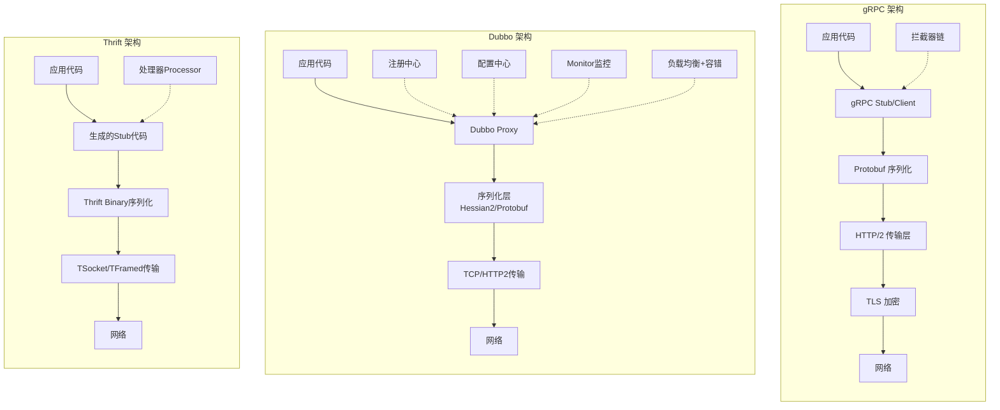
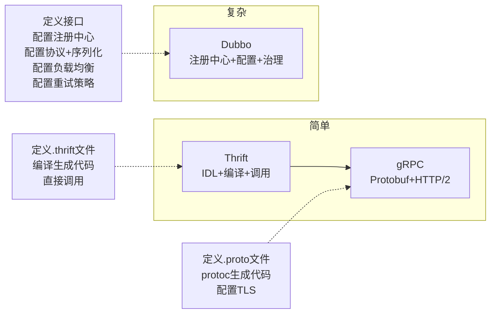
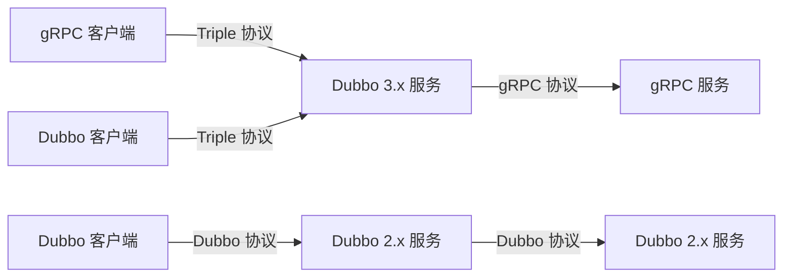

## 三、三大主流RPC框架对比：gRPC vs Dubbo vs Thrift

在 RPC 框架的生态中，**gRPC**、**Apache Dubbo** 和 **Apache Thrift** 是三款最具代表性的开源框架。它们各有鲜明的技术特色和适用场景：gRPC 以 HTTP/2 + Protobuf 构建现代云原生通信基石；Dubbo 以丰富的服务治理能力成为 Java 微服务的事实标准；Thrift 以极致的序列化性能和跨语言代码生成著称。理解它们的差异，是技术选型的关键前提。

> 本节将从框架起源、核心架构、序列化机制、服务治理、性能基准、跨语言支持、生态系统、开发体验、生产部署、选型决策等维度进行全面对比，帮助读者建立系统化的选型认知框架。

### 1. 框架起源与定位

#### 1.1 gRPC——云原生 RPC 的标杆

gRPC 由 Google 于 2015 年开源，脱胎于 Google 内部使用了十余年的 Stubby RPC 系统。它的核心设计理念是：**以 HTTP/2 为传输层、Protocol Buffers 为序列化层，构建高性能、跨语言的通用 RPC 框架**。

| 属性 | 详情 |
|------|------|
| 开源时间 | 2015 年 |
| 开发者 | Google（CNCF 毕业项目） |
| 主语言 | C++（核心库）；官方支持 Go、Java、Python、C#、Ruby、Node.js 等 10+ 语言 |
| 协议基础 | HTTP/2 + TLS |
| 序列化 | Protocol Buffers（默认）、可扩展支持 JSON 等 |
| 设计哲学 | 轻量、通用、云原生；框架只做传输和序列化，治理能力留给服务网格 |
| GitHub Stars | 45K+ |
| 许可证 | Apache 2.0 |

gRPC 在设计上有意保持"薄框架"的定位——它不内置服务注册中心、负载均衡器、配置中心等组件，而是将这些能力交给 Envoy/Istio 等服务网格生态，或者通过拦截器（Interceptor）机制让用户自行扩展。这种设计使 gRPC 天然适合 Kubernetes 和云原生环境。

**gRPC 的四种通信模式**是其区别于传统 RPC 的核心能力：

| 模式 | 说明 | 典型场景 |
|------|------|----------|
| Unary（一元） | 客户端发一个请求，服务端返回一个响应 | 普通 CRUD 接口 |
| Server Streaming | 客户端发一个请求，服务端返回一个流 | 实时行情推送、日志流 |
| Client Streaming | 客户端发送一个流，服务端返回一个响应 | 文件上传、批量数据采集 |
| Bidirectional Streaming | 双向流，客户端和服务端独立发送流 | 聊天应用、实时协作编辑 |

#### 1.2 Dubbo——服务治理的全能选手

Apache Dubbo 由阿里巴巴于 2011 年开源（最初名为 HSF，High Speed Framework），是国内微服务架构演进的核心推手。它的设计哲学与 gRPC 截然不同：**不是做一个薄传输层，而是提供一整套包含服务发现、负载均衡、容错、链路追踪、配置中心的"全家桶"方案**。

| 属性 | 详情 |
|------|------|
| 开源时间 | 2011 年（Dubbo 3.x 重构于 2022 年） |
| 开发者 | 阿里巴巴（Apache 顶级项目） |
| 主语言 | Java（核心）；3.x 新增 Go SDK |
| 协议 | Dubbo 协议（自定义 TCP 私有协议）/ Triple（基于 gRPC 的 HTTP/2 协议） |
| 序列化 | Hessian2（默认）、Protobuf、Kryo、Fury 等可扩展 |
| 注册中心 | Nacos、Zookeeper、Consul、etcd 等（可扩展） |
| 设计哲学 | "开箱即用"的服务治理全家桶 |
| GitHub Stars | 40K+ |
| 许可证 | Apache 2.0 |

Dubbo 的版本演进体现了国内微服务架构的发展脉络：

Dubbo 2.x (2011-2021)          Dubbo 3.x (2022-present)
┌─────────────────────┐        ┌─────────────────────────┐
│ Dubbo 协议 (TCP)     │   →   │ Triple 协议 (HTTP/2)    │
│ 接口级服务发现        │   →   │ 应用级服务发现           │
│ 单一注册中心          │   →   │ 多注册中心 + 元数据中心   │
│ Spring 集成          │   →   │ Spring Boot + GraalVM   │
│ Java Only           │   →   │ Java + Go + Polyglot    │
└─────────────────────┘        └─────────────────────────┘

Dubbo 3.x 是一个重大转折点：它引入了 Triple 协议（基于 gRPC 扩展），实现了与 gRPC 的完全互通，同时升级了应用级服务发现模型，从"接口级注册"演进为"应用级注册"，大幅降低了注册中心的压力。

#### 1.3 Thrift——跨语言通信的瑞士军刀

Apache Thrift 由 Facebook 于 2007 年开源（2008 年进入 Apache），是三者中历史最悠久的。它的核心价值是：**通过自定义 IDL 和代码生成器，为 28+ 种编程语言生成高效的序列化/反序列化代码和 RPC 桩代码**。

| 属性 | 详情 |
|------|------|
| 开源时间 | 2007 年（Apache 顶级项目） |
| 开发者 | Facebook → Apache 基金会 |
| 主语言 | C++（编译器和核心库） |
| 支持语言 | C++、Java、Python、Go、Rust、Node.js 等 28+ 种语言 |
| 协议 | 自定义二进制协议（TSocket/TFramed/TCompact） |
| 序列化 | Thrift Binary（默认）、Thrift Compact、Thrift JSON |
| 设计哲学 | 极致的序列化性能 + 广泛的跨语言支持 |
| GitHub Stars | 10K+ |
| 许可证 | Apache 2.0 |

Thrift 的定位更接近一个**跨语言序列化和通信工具集**，而非一个完整的微服务框架。它不内置服务发现、负载均衡、熔断等治理能力——这些需要借助 Zookeeper、Consul 等外部工具或自研来实现。在大数据领域，Thrift 的影响力极为深远：Hive 的 Thrift Server 是 HiveServer2 的核心通信层，Kafka 的内部协议编解码也大量使用 Thrift。

### 2. 核心架构对比



#### 2.1 gRPC 的分层架构

gRPC 的架构遵循严格的分层设计，每一层都可以独立替换或扩展：

┌──────────────────────────────────────────┐
│              应用层 (App)                 │
├──────────────────────────────────────────┤
│     gRPC API (Channel/Stub/Call)         │
├──────────────────────────────────────────┤
│  拦截器层 (Interceptor)                  │
│  ┌──────────┬──────────┬───────────┐     │
│  │Unary Int.│Stream Int│Deadline Tx│     │
│  └──────────┴──────────┴───────────┘     │
├──────────────────────────────────────────┤
│  序列化层 (Codec)                        │
│  ┌──────────┬──────────┬───────────┐     │
│  │Protobuf  │   JSON   │  Raw Bytes│     │
│  └──────────┴──────────┴───────────┘     │
├──────────────────────────────────────────┤
│  HTTP/2 传输层 (Transport)               │
│  ┌──────────┬──────────┬───────────┐     │
│  │多路复用   │头部压缩  │流式传输   │     │
│  └──────────┴──────────┴───────────┘     │
├──────────────────────────────────────────┤
│  安全层 (TLS/mTLS)                       │
└──────────────────────────────────────────┘

关键设计要点：

- **多路复用**：HTTP/2 在单一 TCP 连接上并行传输多个请求/响应流，避免了 HTTP/1.1 的队头阻塞问题。实测中，单连接可同时承载数百个并发流
- **头部压缩（HPACK）**：HTTP/2 使用 HPACK 算法压缩请求头，减少重复头部的传输开销。对于包含大量 Cookie/Authorization 头的请求，压缩率可达 80% 以上
- **四种通信模式**：Unary（一元）、Server Streaming、Client Streaming、Bidirectional Streaming（双向流），覆盖了从简单 RPC 到实时流处理的全部场景
- **Deadline 传播**：gRPC 的 Deadline 会自动在服务链路中传播，每一跳都会计算剩余超时时间，避免级联超时

**gRPC 拦截器（Interceptor）**是其核心扩展机制，分为客户端和服务端两类：

```go
// 服务端拦截器示例：统一日志记录
func loggingInterceptor(
    ctx context.Context,
    req interface{},
    info *grpc.UnaryServerInfo,
    handler grpc.UnaryHandler,
) (interface{}, error) {
    start := time.Now()
    resp, err := handler(ctx, req)
    log.Printf("Method: %s, Duration: %v, Error: %v",
        info.FullMethod, time.Since(start), err)
    return resp, err
}

srv := grpc.NewServer(
    grpc.UnaryInterceptor(loggingInterceptor),
)
```

#### 2.2 Dubbo 的分层架构

Dubbo 3.x 的架构更复杂，包含多个可插拔的组件层：

┌────────────────────────────────────────────────────┐
│                    应用层 (App)                      │
├────────────────────────────────────────────────────┤
│              服务接口层 (Service API)                │
├────────────────────────────────────────────────────┤
│              代理层 (Proxy)                          │
│  ┌──────────────────────────────────────────┐      │
│  │ 动态代理生成 (Javassist/Stub)            │      │
│  └──────────────────────────────────────────┘      │
├────────────────────────────────────────────────────┤
│  ┌──────────┬──────────┬──────────┬───────────┐    │
│  │ Cluster  │Protocol  │ Exchange │Transport  │    │
│  │ 集群容错 │ 协议层   │ 信息交换 │ 传输层    │    │
│  └──────────┴──────────┴──────────┴───────────┘    │
├────────────────────────────────────────────────────┤
│  注册中心 + 配置中心 + 元数据中心                     │
│  ┌───────┬───────┬───────┬─────────┬────────┐      │
│  │ Nacos │  ZK   │Consul │etcd     │Apollo  │      │
│  └───────┴───────┴───────┴─────────┴────────┘      │
└────────────────────────────────────────────────────┘

Dubbo 独有的**集群容错层（Cluster）** 提供了多种容错策略：

| 策略 | 行为 | 适用场景 |
|------|------|----------|
| **Failover** | 失败自动重试（默认 2 次） | 读操作、幂等写操作 |
| **Failfast** | 快速失败，仅发起一次调用 | 非幂等写操作（如订单创建） |
| **Failsafe** | 失败安全，忽略异常 | 日志记录、审计通知 |
| **Failback** | 失败后台异步重试，记录失败日志 | 通知类操作、事件推送 |
| **Forking** | 并行调用多个提供者，取最快响应 | 对延迟敏感的读操作 |
| **Broadcast** | 广播所有提供者，全部成功才算成功 | 全局状态同步 |

Dubbo 的 Filter 链机制类似于 gRPC 的拦截器，但更加体系化：

```java
// Dubbo Filter 示例：统一耗时监控
@Activate(group = CommonConstants.PROVIDER, order = -10000)
public class LatencyMonitorFilter implements Filter {
    @Override
    public Result invoke(Invoker<?> invoker, Invocation invocation)
            throws RpcException {
        long start = System.currentTimeMillis();
        try {
            return invoker.invoke(invocation);
        } finally {
            long elapsed = System.currentTimeMillis() - start;
            if (elapsed > 3000) {
                log.warn("Slow call detected: {} took {}ms",
                    invoker.getUrl().getServiceName(), elapsed);
            }
        }
    }
}
```

#### 2.3 Thrift 的分层架构

Thrift 的架构相对简洁，分为四个层次：

┌──────────────────────────────────────────┐
│          服务接口定义 (IDL)                │
├──────────────────────────────────────────┤
│    生成的客户端/服务端桩代码 (Stub)         │
├──────────────────────────────────────────┤
│    处理器 (Processor)                      │
│  ┌──────────────────────────────────┐    │
│  │ 协议层 + 传输层 + 序列化层       │    │
│  └──────────────────────────────────┘    │
│  协议：TSimpleBinary/TCompact/TJSON       │
│  传输：TSocket/TFramed/TBuffered          │
├──────────────────────────────────────────┤
│          底层 I/O 层                       │
└──────────────────────────────────────────┘

Thrift 的独特之处在于其**协议层和传输层的解耦**：你可以自由组合不同的序列化协议（Binary、Compact、JSON）和传输方式（Socket、Framed、Buffered），以适配不同场景。例如：

| 组合方案 | 协议 | 传输 | 适用场景 |
|---------|------|------|---------|
| 高性能内网 | TBinaryProtocol | TFramedTransport | 机房内服务间通信 |
| 跨公网通信 | TBinaryProtocol | TSocket | 跨机房/跨云调用 |
| 对外 API | TJSONProtocol | TBufferedTransport | 需要人类可读的调试接口 |
| 嵌入式/物联网 | TCompactProtocol | TSocket | 带宽受限的设备通信 |

### 3. 序列化机制对比

序列化是 RPC 框架性能的关键瓶颈之一。三个框架在序列化上的设计思路差异显著。

| 对比维度 | gRPC (Protobuf) | Dubbo (Hessian2) | Thrift (Binary) |
|---------|------------------|-------------------|------------------|
| 序列化格式 | 二进制（Protobuf） | 二进制（Hessian2） | 二进制（Thrift Binary） |
| IDL 支持 | .proto 文件 | Java 注解/IDL | .thrift 文件 |
| 编码效率 | ★★★★★ | ★★★★ | ★★★★★ |
| 反序列化速度 | ★★★★★ | ★★★ | ★★★★★ |
| 数据体积 | 最小 | 中等 | 很小 |
| 人类可读性 | ✗（二进制） | ✗（二进制） | ✗（二进制） |
| 向后兼容性 | ★★★★★（字段编号） | ★★★ | ★★★★ |
| 跨语言支持 | 10+ 语言 | 有限（主要 Java） | 28+ 语言 |
| 动态类型 | ✗（需要编译） | ✓（反射） | ✗（需要编译） |
| 默认值处理 | 不序列化默认值 | 序列化所有字段 | 不序列化默认值 |

#### 3.1 Protobuf 的编码原理

Protobuf 采用**变长编码（Varint）+ 字段编号**的二进制格式：

```protobuf
// .proto 定义
message UserProfile {
    int32 id = 1;              // 字段编号 1，类型 Varint
    string name = 2;           // 字段编号 2，Length-delimited
    bool active = 3;           // 字段编号 3，Varint (0/1)
    repeated string tags = 4;  // 字段编号 4，Length-delimited 数组
}
```

编码后的字节布局：

┌─────────┬───────────────────┬──────────────────────────┐
│ Field 1 │   Field 2         │      Field 3             │
│ [tag+id]│ [tag+name_len]   │  [tag+active]            │
│ Varint  │ [name_bytes]     │  Varint                  │
└─────────┴───────────────────┴──────────────────────────┘
每个字段的 tag = (field_number << 3) | wire_type

Protobuf 的 wire_type 定义了字段的编码方式：

| wire_type | 含义 | 对应类型 |
|-----------|------|---------|
| 0 | Varint | int32, int64, bool, enum |
| 1 | 64-bit | fixed64, double |
| 2 | Length-delimited | string, bytes, 嵌套 message, repeated |
| 5 | 32-bit | fixed32, float |

Protobuf 的核心优势在于：

- **字段编号**替代字段名，序列化体积极小
- **向后兼容**：新增字段只需使用新的字段编号，旧代码会自动忽略未知字段
- **默认值不序列化**：值等于默认值的字段不写入字节流，进一步压缩体积
- **proto3 简化**：proto3 移除了 required/optional 关键字，所有字段默认 optional，降低了使用门槛

**proto2 vs proto3 关键差异**：

| 特性 | proto2 | proto3 |
|------|--------|--------|
| required/optional | 显式声明 | 全部 optional（默认值不序列化） |
| default 值 | 支持自定义 | 不支持（使用语言默认值） |
| oneof | 不支持 | 支持 |
| map 类型 | 不支持 | 支持 |
| 向后兼容 | 严格 | 宽松（未知字段保留） |
| 向前兼容 | 需谨慎 | 更好（未知字段被忽略） |

#### 3.2 Hessian2 的设计特点

Hessian2 是 Dubbo 的默认序列化协议，它是一个**自描述的二进制协议**，与 Protobuf 最大的区别是**不需要 IDL 编译**：

Hessian2 编码示例：
┌─────┬─────┬──────────────────────┐
│ 0x4d│ len │ Java 类名 + 字段映射  │  → 对象类型
├─────┼─────┼──────────────────────┤
│ 0x52│ len │ UTF-8 字符串数据      │  → 字符串类型
├─────┼─────┼──────────────────────┤
│ 0x49│ 4字节│ 整数的二进制表示       │  → 整数类型
└─────┴─────┴──────────────────────┘

Hessian2 的优势是**零编译成本**——直接序列化 Java 对象，无需定义 IDL 文件。但这也导致了其**跨语言支持受限**，主要适用于 Java 生态。Dubbo 3.x 引入了 **Fury** 作为新一代序列化选项，基于 JDK 动态代码生成，在保持零编译成本的同时将性能提升了 3-5 倍。

#### 3.3 Thrift Binary 的编码方式

Thrift Binary 协议采用**定长编码**，每个字段包含类型标识 + 字段序号 + 值：

Thrift Binary 编码示例：
struct UserProfile {
    1: i32 id         → 08 00 00 00 2A      (类型08 + 序号01 + 4字节int32)
    2: string name    → 0B 00 02 00 00 00 05 "hello"  (类型0B + 序号02 + 4字节长度 + 字符串)
    3: bool active    → 02 00 03 01         (类型02 + 序号03 + 1字节bool)
}

Thrift 的 **Compact 协议** 使用 ZigZag 编码和 Varint 来压缩整数，空间效率接近 Protobuf：

| 对比 | Binary | Compact | Protobuf |
|------|--------|---------|----------|
| 整数编码 | 固定 4 字节 | Varint (ZigZag) | Varint |
| 小整数 (1-127) | 4 字节 | 1-2 字节 | 1-2 字节 |
| 字段标识 | 2 字节 (类型+序号) | 1-2 字节 | 1 字节 (tag) |
| 字符串长度 | 4 字节前缀 | 1-5 字节前缀 | 1-5 字节前缀 |

### 4. 服务治理能力对比

服务治理是区分"传输工具"和"微服务框架"的分水岭。

| 治理能力 | gRPC | Dubbo | Thrift |
|---------|------|-------|--------|
| **服务注册/发现** | 无内置（需 Istio/Consul） | ✅ 内置（Nacos/ZK/Consul/etcd） | 无内置（需外部方案） |
| **负载均衡** | 基础（pick_first/round_robin） | ✅ 丰富（Random/RoundRobin/LeastActive/ConsistentHash） | 无内置 |
| **熔断降级** | 无内置（需自定义拦截器） | ✅ 内置 Sentinel 集成 | 无内置 |
| **超时控制** | ✅ Deadline 传播 | ✅ 超时 + 重试 + ontimeout | 无内置 |
| **重试机制** | 客户端重试（需手动实现） | ✅ 多种重试策略（Failover/Failfast等） | 无内置 |
| **链路追踪** | OpenTelemetry 集成 | ✅ 内置 tracing（SkyWalking/Zipkin） | 无内置 |
| **流量治理** | 需 Istio | ✅ 丰富（条件路由、标签路由、限流） | 无内置 |
| **配置管理** | 无 | ✅ 内置（Nacos/Apollo/自定义） | 无 |
| **监控告警** | 需集成 | ✅ 内置（Metrics/告警） | 无 |
| **灰度发布** | 需 Istio | ✅ 内置（基于标签/元数据路由） | 无内置 |
| **健康检查** | ✅ 内置 Health Checking Protocol | ✅ 内置（心跳检测） | 无内置 |
| **优雅停机** | ✅ Graceful Shutdown | ✅ 优雅停机 + 预热 | 无内置 |

从表中可以清晰看出：**Dubbo 是唯一提供完整服务治理"全家桶"的框架**。gRPC 和 Thrift 在治理层面都需要借助外部工具或自研。

**gRPC 健康检查协议**是其为数不多的内置治理能力，采用标准化的 Health Check RPC：

```protobuf
syntax = "proto3";
package grpc.health.v1;

service Health {
    rpc Check(HealthCheckRequest) returns (HealthCheckResponse);
    rpc Watch(HealthCheckRequest) returns (stream HealthCheckResponse);
}

message HealthCheckRequest { string service = 1; }
message HealthCheckResponse {
    enum ServingStatus {
        UNKNOWN = 0; SERVING = 1; NOT_SERVING = 2; SERVICE_UNKNOWN = 3;
    }
    ServingStatus status = 1;
}
```

### 5. 性能基准对比

以下是基于公开 benchmark 数据的综合对比（测试环境：Java 17，4 核 8GB，同机房调用）：

| 性能指标 | gRPC | Dubbo 3.x (Triple) | Dubbo 3.x (Dubbo协议) | Thrift |
|---------|------|---------------------|----------------------|--------|
| **单连接 QPS** | ~42K | ~38K | ~48K | ~55K |
| **平均延迟** | 2.3ms | 2.5ms | 1.8ms | 1.5ms |
| **P99 延迟** | 8ms | 9ms | 5ms | 4ms |
| **序列化体积(1KB对象)** | ~380B | ~520B (Hessian2) / ~390B (Protobuf) | ~520B | ~410B |
| **序列化耗时** | 15μs | 22μs (Hessian2) | 22μs | 12μs |
| **反序列化耗时** | 18μs | 30μs (Hessian2) | 30μs | 10μs |
| **连接建立耗时** | 3ms (含TLS) | 1.5ms | 1ms | 0.8ms |
| **多连接 QPS** | ~120K (4连接) | ~100K (4连接) | ~140K (4连接) | ~160K (4连接) |

> 注：以上数据为典型场景下的参考值，实际性能因硬件、网络、对象复杂度等因素有所差异。数据来源综合自各框架官方 benchmark 及社区公开测试。

**关键结论**：

1. **Thrift 在纯 RPC 吞吐和延迟上表现最优**——得益于其极简的协议设计和高效的二进制编码
2. **Dubbo 的 Dubbo 协议在 Java 生态内性能优异**——Hessian2 序列化虽略慢于 Protobuf，但省去了 IDL 编译步骤，开发效率高
3. **gRPC 在跨语言场景下性能最佳**——Protobuf 的编码效率和 HTTP/2 的多路复用在跨语言调用中优势明显
4. **带 TLS 时 gRPC 延迟增加约 1-2ms**——这在内网环境中影响不大，但在对延迟敏感的场景下需注意

**不同对象复杂度下的性能变化**：

| 对象类型 | gRPC QPS | Dubbo QPS | Thrift QPS |
|---------|----------|-----------|------------|
| 简单对象 (5个字段) | ~55K | ~52K | ~68K |
| 中等对象 (20个字段) | ~42K | ~38K | ~55K |
| 复杂嵌套对象 (50+字段) | ~28K | ~25K | ~35K |
| 大数组对象 (1000元素) | ~8K | ~7K | ~12K |

### 6. 流式通信能力对比

流式通信是现代 RPC 框架的重要能力，三个框架的支持程度差异显著：

| 流式能力 | gRPC | Dubbo | Thrift |
|---------|------|-------|--------|
| Server Streaming | ✅ 原生支持 | ✅ Triple 协议支持 | ✅ 支持 (需自定义) |
| Client Streaming | ✅ 原生支持 | ✅ Triple 协议支持 | ✅ 支持 (需自定义) |
| Bidirectional Streaming | ✅ 原生支持 | ✅ Triple 协议支持 | ✅ 支持 (需自定义) |
| 流式背压控制 | ✅ 内置 | ✅ Triple 支持 | ✗ 需自研 |
| 流式超时控制 | ✅ Deadline 传播 | ✅ 超时控制 | ✗ 需自研 |
| 流式取消传播 | ✅ Context 取消 | ✅ 取消支持 | ✗ 需自研 |

**gRPC 流式通信示例**：

```go
// 服务端：实时推送股票行情
func (s *stockServer) StreamPrices(
    req *pb.PriceRequest,
    stream pb.StockService_StreamPricesServer,
) error {
    ticker := time.NewTicker(100 * time.Millisecond)
    defer ticker.Stop()

    for {
        select {
        case <-stream.Context().Done():
            return stream.Context().Err() // 客户端取消
        case t := <-ticker.C.C:
            price := getStockPrice(req.Symbol)
            if err := stream.Send(&amp;pb.PriceUpdate{
                Symbol: req.Symbol,
                Price:  price,
                Time:   t.Unix(),
            }); err != nil {
                return err
            }
        }
    }
}
```

Dubbo 3.x 通过 Triple 协议完全兼容上述 gRPC 流式 API，使得 Dubbo 服务可以作为 gRPC 流式服务的提供者或消费者。

### 7. 跨语言支持对比

| 编程语言 | gRPC | Dubbo | Thrift |
|---------|------|-------|--------|
| Java | ✅ 官方 | ✅ 原生 | ✅ 官方 |
| Go | ✅ 官方 | ✅ 官方 (3.x) | ✅ 官方 |
| Python | ✅ 官方 | △ 社区 | ✅ 官方 |
| C++ | ✅ 官方 | ✗ | ✅ 官方 |
| C# | ✅ 官方 | ✗ | ✅ 官方 |
| Rust | △ 社区 | ✗ | ✅ 官方 |
| Node.js | ✅ 官方 | ✗ | ✅ 官方 |
| Ruby | ✅ 官方 | ✗ | ✅ 官方 |
| PHP | ✅ 官方 | ✗ | ✅ 官方 |
| Swift | ✅ 官方 | ✗ | ✗ |
| Kotlin | ✅ 通过 Java | ✅ 通过 Java | ✅ 通过 Java |
| **总计** | **10+ 语言** | **2-3 语言** | **28+ 语言** |

gRPC 和 Thrift 在跨语言支持上远优于 Dubbo。Dubbo 的多语言支持是其短板，但如果你的技术栈以 Java 为主，这不是问题。

**gRPC vs Thrift 跨语言的关键差异**：

- **gRPC**：基于 HTTP/2 协议，天然支持浏览器（通过 gRPC-Web），在 Web 前端 + 后端的全栈场景中优势明显
- **Thrift**：纯 TCP 协议，无法直接用于浏览器，但在系统级语言（C++/Rust）中性能更优，适合基础设施层

### 8. 生态系统与社区活跃度

#### 8.1 gRPC 生态

gRPC 生态全景：
┌─────────────────────────────────────────────────────┐
│  服务网格     │ Istio/Envoy (一等公民)                │
│  浏览器       │ gRPC-Web / Connect 协议               │
│  API 网关     │ Kong / Envoy / grpc-gateway          │
│  工具链       │ grpcurl (CLI) / ghz (压测)           │
│              │ protoc (代码生成) / buf (Proto管理)    │
│  云平台       │ AWS App Mesh / GCP GKE / Azure AKS   │
│  可观测性     │ OpenTelemetry / Prometheus            │
│  安全         │ mTLS / JWT / OAuth2 / RBAC           │
└─────────────────────────────────────────────────────┘

- **服务网格集成**：与 Istio/Envoy 深度集成，gRPC 是服务网格中一等公民
- **浏览器支持**：通过 gRPC-Web 直接在浏览器中调用（无需 gRPC 代理时可用 Connect 协议）
- **工具链**：grpcurl（命令行测试）、ghz（压测）、protoc（代码生成）、buf（Proto lint/管理）
- **API 网关**：Kong、Envoy、grpc-gateway 均提供 gRPC 转 REST 能力
- **云平台**：AWS App Mesh、GCP GKE、Azure AKS 均原生支持 gRPC

**gRPC-Web 与 Connect 协议**是两个重要的浏览器集成方案：

| 方案 | 原理 | 优势 | 劣势 |
|------|------|------|------|
| gRPC-Web | 通过 Envoy 代理将 HTTP/1.1 转换为 HTTP/2 | 生态成熟 | 需要代理层 |
| Connect | 使用标准 HTTP/1.1 直接调用 gRPC 服务 | 无需代理，浏览器直连 | 需要服务端适配 |
| grpc-gateway | 生成 RESTful JSON API 包装 | 兼容现有 REST 客户端 | 需要维护两套接口 |

#### 8.2 Dubbo 生态

Dubbo 生态全景：
┌─────────────────────────────────────────────────────┐
│  注册中心     │ Nacos (推荐) / Zookeeper / Consul    │
│  配置中心     │ Nacos / Apollo / 自定义               │
│  网关         │ Dubbo Admin / Apisix / Spring Cloud  │
│  监控         │ Dubbo Admin / SkyWalking / Prometheus│
│  容错         │ Sentinel / Hystrix 集成               │
│  Java 生态    │ Spring Boot / Spring Cloud Alibaba   │
│  管理控制台   │ Dubbo Admin (元数据/路由/配置)         │
│  服务网格     │ Mosn (蚂蚁) / Istio                   │
└─────────────────────────────────────────────────────┘

- **注册中心**：Nacos（推荐）、Zookeeper、Consul、etcd、Apollo
- **网关**：Dubbo Admin、Apisix（Dubbo 插件）、Spring Cloud Gateway
- **监控**：Dubbo Admin、SkyWalking、Prometheus + Grafana
- **容错**：Sentinel（阿里巴巴的流量控制组件）、Hystrix 集成
- **Java 生态**：Spring Boot、Spring Cloud Alibaba、Dubbo + Nacos 构成完整的微服务解决方案
- **管理控制台**：Dubbo Admin 提供服务元数据管理、路由规则配置、动态配置下发

**Dubbo + Spring Cloud Alibaba** 的组合是国内 Java 微服务的事实标准：

┌──────────────────────────────────────┐
│        Spring Cloud Gateway          │
├──────────────────────────────────────┤
│     Dubbo 3.x (Triple 协议)          │
├──────────────────────────────────────┤
│  Nacos (注册+配置+元数据)             │
├──────────────────────────────────────┤
│  Sentinel (限流+熔断+降级)            │
├──────────────────────────────────────┤
│  SkyWalking (链路追踪)                │
├──────────────────────────────────────┤
│  Seata (分布式事务)                    │
└──────────────────────────────────────┘

#### 8.3 Thrift 生态

- **工具链**：thrift 编译器（命令行工具）、Facebook fb303（基础服务框架）
- **数据库集成**：Hive 底层使用 Thrift 作为通信协议
- **消息队列**：Apache Kafka 内部使用 Thrift 进行协议编解码
- **社交平台**：Twitter（前身）、LinkedIn、Pinterest 等公司早期大量使用 Thrift
- **局限**：生态相对封闭，缺乏服务治理层面的成熟解决方案

**社区活跃度对比**（2024-2025 年数据）：

| 指标 | gRPC | Dubbo | Thrift |
|------|------|-------|--------|
| GitHub 月均 Commit | 80+ | 150+ | 20+ |
| GitHub 月均 Issue | 50+ | 80+ | 10+ |
| Stack Overflow 问答 | 15K+ | 5K+ | 3K+ |
| 中文社区活跃度 | 中 | 极高 | 低 |
| 企业贡献者 | Google, Netflix | 阿里, 蚂蚁 | Facebook, Twitter |

### 9. 开发体验对比

#### 9.1 学习曲线



**学习路径建议**：

| 阶段 | gRPC | Dubbo | Thrift |
|------|------|-------|--------|
| 入门 (1-3天) | proto 定义 + protoc 生成 + 调用 | Spring Boot 注解 + Nacos | .thrift 定义 + 编译 + 调用 |
| 进阶 (1-2周) | 拦截器 + Deadline + 流式 | Cluster 容错 + Filter + 路由 | 协议/传输组合 + 线程模型 |
| 精通 (1-3月) | 自定义 Codec + xDS 集成 | 自定义扩展点 + Triple 协议 | 自定义 Processor + Transport |

#### 9.2 快速上手示例

**gRPC 最小示例**：

```protobuf
// greeting.proto
syntax = "proto3";
package greeting;
option go_package = "greeting/pb";

service Greeter {
    rpc SayHello (HelloRequest) returns (HelloReply);
}

message HelloRequest { string name = 1; }
message HelloReply   { string message = 1; }
```

```go
// server.go — 整个服务端不到 20 行
type server struct{ pb.UnimplementedGreeterServer }

func (s *server) SayHello(ctx context.Context, req *pb.HelloRequest) (*pb.HelloReply, error) {
    return &amp;pb.HelloReply{Message: "Hello " + req.Name}, nil
}

func main() {
    lis, _ := net.Listen("tcp", ":50051")
    srv := grpc.NewServer()
    pb.RegisterGreeterServer(srv, &amp;server{})
    srv.Serve(lis)
}
```

```go
// client.go — 调用同样简洁
func main() {
    conn, _ := grpc.Dial("localhost:50051", grpc.WithInsecure())
    defer conn.Close()
    client := pb.NewGreeterClient(conn)
    resp, _ := client.SayHello(context.Background(), &amp;pb.HelloRequest{Name: "World"})
    fmt.Println(resp.Message) // "Hello World"
}
```

**Thrift 最小示例**：

```thrift
// greeting.thrift
namespace go greeting

service Greeter {
    string sayHello(1: string name)
}
```

```java
// server.java — 最简 Thrift 服务端
public class HelloHandler implements Greeter.Iface {
    public String sayHello(String name) {
        return "Hello " + name;
    }
}

public class Server {
    public static void main(String[] args) throws Exception {
        HelloHandler handler = new HelloHandler();
        Greeter.Processor<HelloHandler> processor = new Greeter.Processor<>(handler);
        TServerTransport serverTransport = new TServerSocket(9090);
        TServer server = new TSimpleServer(
            new TServer.Args(serverTransport).processor(processor));
        server.serve();
    }
}
```

```java
// client.java — 调用示例
TTransport transport = new TSocket("localhost", 9090);
transport.open();
TProtocol protocol = new TBinaryProtocol(transport);
Greeter.Client client = new Greeter.Client(protocol);
String result = client.sayHello("World");
System.out.println(result); // "Hello World"
transport.close();
```

**Dubbo 最小示例（Spring Boot 集成）**：

```java
// 服务接口
public interface GreeterService {
    String sayHello(String name);
}

// 服务实现（Provider）
@DubboService
public class GreeterServiceImpl implements GreeterService {
    @Override
    public String sayHello(String name) {
        return "Hello " + name;
    }
}

// 客户端调用（Consumer）
@RestController
public class GreeterController {
    @DubboReference
    private GreeterService greeterService;

    @GetMapping("/hello")
    public String hello(@RequestParam String name) {
        return greeterService.sayHello(name);
    }
}
```

```yaml
# application.yml — Dubbo 配置
dubbo:
  application:
    name: greeter-provider
  registry:
    address: nacos://localhost:8848
  protocol:
    name: tri
    port: 20880
```

Dubbo 与 Spring Boot 的集成最为丝滑，开发者几乎无感知底层 RPC 通信——加两个注解即可完成服务发布和引用。

### 10. 错误处理与状态码对比

三个框架在错误处理上的设计理念不同：

| 特性 | gRPC | Dubbo | Thrift |
|------|------|-------|--------|
| 状态码体系 | 16 种标准状态码 | 自定义异常体系 | 自定义异常体系 |
| 传播方式 | 自动传播 | 需要配置 | 不传播 |
| 错误详情 | Status with Details | RpcException | TApplicationException |

**gRPC 标准状态码**：

| 状态码 | 名称 | 含义 |
|--------|------|------|
| 0 | OK | 成功 |
| 1 | CANCELLED | 调用被取消 |
| 2 | UNKNOWN | 未知错误 |
| 3 | INVALID_ARGUMENT | 参数无效 |
| 4 | DEADLINE_EXCEEDED | 超时 |
| 5 | NOT_FOUND | 资源不存在 |
| 6 | ALREADY_EXISTS | 资源已存在 |
| 7 | PERMISSION_DENIED | 权限不足 |
| 14 | UNAVAILABLE | 服务不可用（常用于负载均衡重试） |
| 16 | UNAUTHENTICATED | 未认证 |

gRPC 的状态码设计遵循 HTTP 语义但更加严格，使得跨语言的错误处理保持一致性。Dubbo 通过 `RpcException` 提供更丰富的上下文信息（如重试次数、负载均衡策略等），在 Java 生态内更灵活。

### 11. 生产部署配置对比

#### 11.1 gRPC 生产配置要点

```go
// 生产级 gRPC 服务端配置
srv := grpc.NewServer(
    // 超时控制
    grpc.KeepaliveParams(keepalive.ServerParameters{
        MaxConnectionAge:      30 * time.Minute,
        MaxConnectionAgeGrace: 5 * time.Second,
        Time:                  10 * time.Second,
        Timeout:               3 * time.Second,
    }),
    // 连接数限制
    grpc.MaxConcurrentStreams(1000),
    // 拦截器链
    grpc.ChainUnaryInterceptor(
        recoveryInterceptor,   // 异常恢复
        loggingInterceptor,    // 日志记录
        metricsInterceptor,    // 指标采集
    ),
)
```

#### 11.2 Dubbo 生产配置要点

```yaml
# Dubbo 3.x 生产级配置
dubbo:
  application:
    name: order-service
    qos-enable: false  # 生产环境关闭 QoS 端口
  registry:
    address: nacos://nacos-cluster:8848
    parameters:
      namespace: production
      group: DEFAULT_GROUP
  protocol:
    name: tri
    port: 20880
    threads: 200  # 服务端线程池大小
  provider:
    timeout: 3000  # 默认超时 3 秒
    retries: 2     # 默认重试 2 次
    loadbalance: roundrobin  # 负载均衡策略
  consumer:
    timeout: 5000
    check: false  # 启动时不检查服务可用性
    retries: 1
```

#### 11.3 Thrift 生产配置要点

```java
// 生产级 Thrift 服务端（TThreadedSelectorServer）
TNonblockingServerSocket socket = new TNonblockingServerSocket(9090);
THsHaServer.Args args = new THsHaServer.Args(socket)
    .processor(processor)
    .protocolFactory(new TBinaryProtocol.Factory())
    .transportFactory(new TFramedTransport.Factory())
    .minWorkerThreads(10)
    .maxWorkerThreads(100);

TServer server = new THsHaServer(args);
server.serve();
```

### 12. 选型决策矩阵

在实际项目中，选型不应仅看性能指标，更要结合团队技术栈、业务场景和运维能力综合判断。

| 评估维度 | 选 gRPC | 选 Dubbo | 选 Thrift |
|---------|---------|----------|-----------|
| **语言环境** | 多语言/云原生/跨团队 | Java 为主/阿里技术栈 | 多语言但预算有限 |
| **业务场景** | 微服务间通信/流式处理/实时数据 | 企业级微服务/电商/金融 | 数据管道/底层基础设施 |
| **服务治理** | 依赖 Istio/服务网格 | 需要开箱即用的治理能力 | 治理需求低或自研 |
| **部署环境** | Kubernetes / 云平台 | 物理机/虚拟机/K8s | 任意环境 |
| **团队能力** | 熟悉 HTTP/2、云原生 | 熟悉 Spring、Java 生态 | 熟悉 C++/系统编程 |
| **性能需求** | 均衡（性能+功能） | 功能优先（治理能力） | 极致性能 |
| **现有生态** | 已有 Envoy/Istio | 已有 Nacos/Sentinel | 已有 Hive/Kafka |
| **长期维护** | CNCF 社区驱动 | Apache + 阿里持续投入 | Apache 社区（活跃度下降） |

**快速决策流程图**：

你的技术栈是什么？
├── Java 为主
│   ├── 需要完整服务治理？ → Dubbo
│   └── 只需基础 RPC？ → gRPC (Triple 协议) 或 Dubbo
├── 多语言混合
│   ├── 有 Kubernetes 环境？ → gRPC + Istio
│   └── 无 Kubernetes？ → gRPC + Consul/Nacos
├── C++/Rust/系统级
│   └── Thrift 或 gRPC
└── 大数据生态
    └── Thrift (Hive/Kafka 兼容)

### 13. 融合趋势与未来演进

三个框架正在走向融合，而非简单的替代关系：

**1. Triple 协议的融合**

Dubbo 3.x 的 Triple 协议完全兼容 gRPC，这意味着：
- Dubbo 服务可以被标准 gRPC 客户端直接调用
- gRPC 服务也可以通过 Dubbo 治理能力进行管理
- 两者共享同一套 Protobuf IDL 定义



**2. 服务网格化**

gRPC + Istio 的组合正在成为云原生环境的主流选择。服务网格承担了原来 Dubbo 内置的服务治理职责，使得 gRPC 可以保持"薄框架"定位的同时拥有完整的治理能力。

**3. 多协议互通**

未来的趋势是**协议互通**而非单一协议统一。一个微服务架构中可能同时存在：
- 服务间通信：gRPC / Triple（高性能二进制）
- 对外 API：REST / gRPC-Web（浏览器兼容）
- 异步消息：Kafka / RabbitMQ（事件驱动）

**4. 序列化层的演进**

| 趋势 | 说明 |
|------|------|
| Protobuf 成为事实标准 | gRPC 和 Dubbo Triple 都基于 Protobuf，生态统一 |
| Fury 崛起 | 阿里开源的 Fury 序列化框架，比 Hessian2 快 3-5 倍 |
| FlatBuffers 游戏化 | Google 的 FlatBuffers 在游戏/嵌入式领域替代 Protobuf |
| JSON 回归 | 随着 CPU 算力提升，JSON 在低 QPS 场景中重新被接受 |

### 14. 常见误区与纠正

| 误区 | 事实 |
|------|------|
| "gRPC 一定比 Dubbo 快" | 不一定。Dubbo 协议在 Java-to-Java 场景下性能可能优于 gRPC（少了 HTTP/2 和 TLS 开销）。gRPC 的优势在跨语言场景 |
| "Thrift 已经过时了" | 不准确。Thrift 在大数据生态（Hive、Kafka）中仍在广泛使用，且其序列化性能在极致优化场景下仍有优势 |
| "Dubbo 只能用于 Java" | Dubbo 3.x 已支持 Go SDK，但生态成熟度远不如 Java |
| "用了 gRPC 就不需要服务治理了" | gRPC 本身只提供传输能力，治理需要依赖 Istio 或自研拦截器 |
| "Protobuf 是 gRPC 专属的" | Protobuf 可以独立于 gRPC 使用，Dubbo 3.x 也支持 Protobuf 序列化 |
| "Thrift 没有负载均衡能力" | Thrift 本身不提供，但可以结合 Zookeeper/Consul 实现客户端负载均衡 |
| "gRPC 总是比 REST 快" | 在简单 CRUD 场景下差异不大，gRPC 的优势主要体现在高频调用和流式通信场景 |
| "Dubbo 3.x 完全兼容 Dubbo 2.x" | Triple 协议是新增的，Dubbo 2.x 的老应用需要迁移，不能直接互通 |

### 15. 真实案例参考

| 公司/项目 | 使用框架 | 选型理由 |
|-----------|---------|---------|
| Google | gRPC (内部 Stubby) | 统一的跨语言通信标准，内部数百万 RPC 调用 |
| 阿里巴巴 | Dubbo | 万级服务实例的治理需求，Java 生态统一 |
| Netflix | gRPC | 云原生架构，Kubernetes 部署 |
| Twitter | Thrift → gRPC | 早期用 Thrift，后迁移至 gRPC |
| Facebook/Meta | Thrift | 跨语言需求，大数据管道通信 |
| LinkedIn | Thrift | 200+ 服务的跨语言通信 |
| 蚂蚁金服 | Dubbo (SOFA-RPC) | 金融级服务治理，高可用要求 |
| 字节跳动 | Thrift + gRPC | 内部 RPC 框架 ByteRPC 基于 Thrift 改进 |

### 16. 本节小结

三大 RPC 框架各有千秋，没有绝对的"最优解"：

- **gRPC**：现代云原生 RPC 的首选，HTTP/2 + Protobuf 提供高性能跨语言通信，适合 Kubernetes 环境和微服务架构，但治理能力需外部补充
- **Dubbo**：Java 微服务的"全家桶"，开箱即用的服务治理能力是核心竞争力，Triple 协议实现了与 gRPC 的互通，适合需要完整治理体系的企业级项目
- **Thrift**：跨语言通信的"瑞士军刀"，28+ 语言支持和极致的序列化性能是其独特价值，适合底层基础设施和数据管道场景

选型的本质是在**性能、功能、生态、团队能力**四个维度间找到最优平衡点。理解每个框架的设计哲学和取舍，才能做出经得起时间考验的技术决策。
