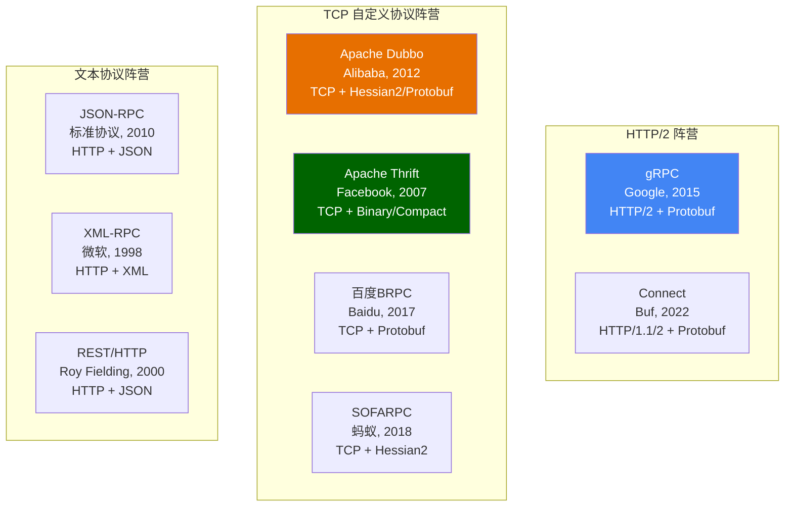
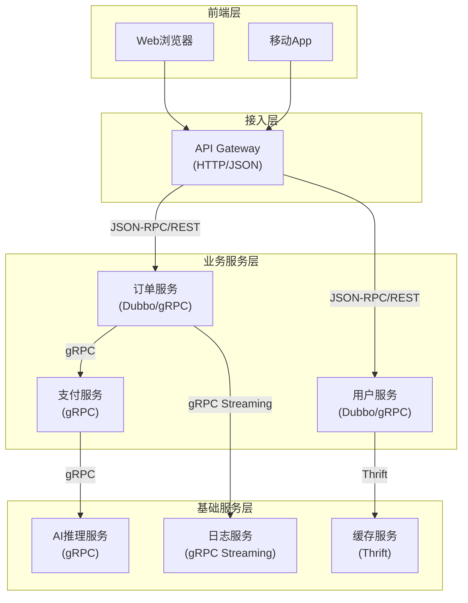

## 四、RPC协议选型

### 4.1 为什么协议选型如此重要

RPC协议选型不是"选个框架装上就完事"——它是一个会影响团队开发效率、系统性能天花板、运维复杂度的**架构级决策**。一旦选定，迁移成本极高，往往需要重写所有IDL定义、序列化层、服务发现集成和监控埋点。

选型失误的典型代价：

| 选型失误 | 后果 | 迁移成本 |
|---------|------|---------|
| 高并发场景选了JSON-RPC | 延迟高、吞吐低，服务间通信成为瓶颈 | 需重写所有IDL和序列化层 |
| Java单语言团队选了gRPC | Protobuf生态在Java生态不如Hessian/Dubbo成熟，踩坑多 | 重写服务发现和治理组件 |
| 需要流式通信选了Dubbo | Dubbo对流式支持有限，被迫在框架外自建 | 框架架构重构 |
| 微服务选了自研TCP协议 | 浏览器无法直接调用，前端对接困难 | 新增HTTP网关层 |
| 多语言团队选了BRPC | C++外其他语言接入困难，团队学习成本极高 | 重新选型+全量迁移 |

协议选型本质上是在**性能、生态、团队能力、业务需求**四个维度之间做权衡。选型的核心原则是"最适合"而非"最先进"——一个团队能高效驾驭的次优方案，往往优于一个团队hold不住的最优方案。

### 4.2 主流RPC协议全景图

当前工业界主流的RPC协议可以分为三大阵营：



三大阵营的核心差异在于**传输层选择**：

- **HTTP/2阵营**：以gRPC和Connect为代表，复用HTTP/2的多路复用、头部压缩等能力，天然兼容Service Mesh和API Gateway
- **TCP自定义协议阵营**：以Dubbo、Thrift、BRPC为代表，自定义二进制协议，性能极致但生态封闭
- **文本协议阵营**：以JSON-RPC、REST为代表，可读性好、调试方便，但性能天花板低

### 4.3 八大RPC协议深度剖析

#### 4.3.1 gRPC

**诞生背景**：Google于2015年开源，脱胎于内部使用的Stubby系统（2001年开始使用）。设计目标是为微服务间通信提供高效的RPC方案，统一Google内部数万种服务的通信标准。

**协议栈**：

┌─────────────────────────┐
│      应用层 (业务代码)     │
├─────────────────────────┤
│      gRPC 框架            │
├─────────────────────────┤
│  Protobuf 序列化 (二进制)  │
├─────────────────────────┤
│  HTTP/2 (多路复用+流式)    │
├─────────────────────────┤
│  TCP 传输                 │
└─────────────────────────┘

**核心优势**：

- **原生流式支持**：Unary、Server Streaming、Client Streaming、Bidirectional Streaming 四种模式开箱即用。Unary是一问一答，Server Streaming是客户端发一个请求、服务端返回流，Client Streaming是客户端发送流、服务端返回一个响应，Bidirectional Streaming是双向流。四种模式覆盖了从简单RPC到实时通信的全场景需求
- **HTTP/2多路复用**：一个TCP连接并发传输多个请求和响应，避免了HTTP/1.1的队头阻塞问题。在高并发场景下，不需要维护连接池，减少了连接建立和销毁的开销
- **跨语言生态最成熟**：官方支持Go、Java、C++、Python、C#、Ruby、Node.js等10+语言，每种语言都有官方维护的库和代码生成工具
- **浏览器友好**：通过gRPC-Web（基于HTTP/1.1或HTTP/2的子集）可从浏览器直接调用，无需额外的HTTP代理转换
- **原生mTLS支持**：通过Channel Credentials可直接配置TLS，配合Istio可实现零信任安全模型

**核心劣势**：

- **调试门槛高**：Protobuf二进制不可读，需要grpcurl（命令行）、grpcui（Web界面）或Postman（支持gRPC）等专门工具。初学者容易在"看不到请求内容"上卡壳
- **学习曲线陡峭**：IDL定义 → 代码生成 → 拦截器 → 错误码体系 → 流控机制，完整掌握需要2-4周
- **服务治理"半成品"**：gRPC本身不提供服务发现、负载均衡、熔断降级能力。必须配合Service Mesh（Istio/Linkerd）或自研SDK才能达到Dubbo的治理水平
- **错误处理不够优雅**：gRPC的Status Code只有16种，业务错误需要通过Status Detail传递，不如Dubbo的自定义异常直观

**适用场景**：跨语言微服务通信、云原生架构、需要流式通信的场景（实时推送、日志采集、文件传输）、Kubernetes原生部署。

**POC验证命令**：

```bash
# 安装grpcurl（命令行gRPC客户端）
go install github.com/fullstorydev/grpcurl/cmd/grpcurl@latest

# 列出服务的所有方法
grpcurl -plaintext localhost:50051 list

# 调用一个RPC方法
grpcurl -plaintext -d '{"user_id": 123}' localhost:50051 user.UserService/GetUser

# 流式调用
grpcurl -plaintext -d '{"query": "hello"}' localhost:50051 chat.Chat/StreamMessages
```

#### 4.3.2 Apache Dubbo

**诞生背景**：阿里巴巴2012年开源，脱胎于阿里内部的高性能RPC框架（HSF）。经受了双十一的考验，峰值QPS超过千万级。2019年进入Apache基金会后进行了架构升级，从单一的Dubbo协议扩展为支持多协议（dubbo://、triple://、rest://）。

**协议栈**：

┌─────────────────────────┐
│      应用层 (业务代码)     │
├─────────────────────────┤
│   Dubbo 框架              │
│  (服务发现+负载均衡+熔断)  │
├─────────────────────────┤
│  序列化：Hessian2/Protobuf/JSON │
├─────────────────────────┤
│  Dubbo协议 (TCP私有)      │
│  或 Triple (HTTP/2)      │
├─────────────────────────┤
│  TCP 传输                 │
└─────────────────────────┘

**核心优势**：

- **开箱即用的治理能力**：内置服务注册发现（Nacos/Zookeeper/Consul）、负载均衡（Random/RoundRobin/LeastActive）、熔断降级、限流（令牌桶/滑动窗口）、灰度发布（基于标签路由）。这是Dubbo相比gRPC最大的差异化优势——不需要引入Service Mesh就能获得完整的治理能力
- **Java生态深度集成**：与Spring Boot/Cloud无缝对接，通过注解驱动（`@DubboService`、`@DubboReference`）即可暴露和引用服务，与Spring的IoC、AOP机制完美融合
- **Hessian2序列化**：Java生态下序列化性能优异，支持复杂对象图（循环引用、多态、泛型），比Java原生序列化性能高5-10倍
- **Dubbo 3.0 Triple协议**：基于HTTP/2的Triple协议兼容gRPC，既保留了Dubbo的治理能力，又打破了Java生态壁垒，支持多语言接入
- **应用级服务发现**：Dubbo 3.0从接口级服务发现升级为应用级服务发现，解决了大规模微服务场景下注册中心性能瓶颈的问题

**核心劣势**：

- **主要面向Java生态**：虽然Dubbo 3.0支持Go、Rust、Node.js等语言，但非Java语言的SDK成熟度、社区案例、文档质量都远不如Java版。dubbo-go和dubbo-rust的GitHub Star数不到Java版的1/10
- **Dubbo协议（dubbo://）是私有TCP协议**：浏览器无法直接调用，需要额外暴露REST接口或通过网关转换
- **框架较重**：完整引入Dubbo的依赖较多，中小项目容易over-engineering。一个简单的RPC调用引入了注册中心、负载均衡、序列化等一整套组件
- **配置项繁多**：Dubbo的配置体系复杂（application/registry/protocol/provider/consumer五层），新人上手需要理解大量概念

**适用场景**：Java为主的微服务体系、需要开箱即用的完整治理能力、电商/金融等需要灰度发布的场景、已有Spring Cloud Alibaba技术栈的项目。

**典型配置示例**：

```yaml
# Dubbo 3.0 配置示例（Triple协议 + Nacos注册中心）
dubbo:
  application:
    name: order-service
    qos-enable: false  # 生产环境关闭QoS端口
  registry:
    address: nacos://127.0.0.1:8848
    parameters:
      namespace: dev
  protocol:
    name: tri  # Triple协议，兼容gRPC
    port: 20880
  provider:
    timeout: 3000
    retries: 2
    loadbalance: leastactive
  consumer:
    check: false  # 启动时不检查provider是否可用
    timeout: 5000
```

#### 4.3.3 Apache Thrift

**诞生背景**：Facebook于2007年内部开发并开源，是最早的大规模跨语言RPC框架之一。设计初衷是统一Facebook内部多种语言的服务通信方式。2008年捐赠给Apache基金会。

**协议栈**：

┌─────────────────────────┐
│      应用层 (业务代码)     │
├─────────────────────────┤
│   Thrift 代码生成层       │
├─────────────────────────┤
│  序列化：Binary/Compact/JSON │
├─────────────────────────┤
│  传输层：Framed/Buffered    │
├─────────────────────────┤
│  协议层：TSocket/THttp/...   │
├─────────────────────────┤
│  TCP / HTTP 传输           │
└─────────────────────────┘

**核心优势**：

- **多语言支持成熟**：支持20+语言，包括Go、Java、Python、C++、PHP、Ruby、Rust、Erlang、Haskell等，是语言覆盖最广的RPC框架
- **Binary协议高效**：Thrift Binary协议序列化体积小、速度快，性能接近Protobuf。在Facebook的生产环境中经受了大规模验证
- **灵活的传输层**：支持TCP（TSocket）、HTTP（THttpServer）、Unix Socket（TUnixSocket）等多种传输方式，可根据场景灵活选择
- **线程模型可选**：单线程（TThreadPoolServer）、多线程（TThreadPoolServer）、非阻塞（THsHaServer）等多种服务器模型，适应不同并发需求
- **编解码器可定制**：可以实现自定义的TProtocol和TTransport，替换默认的序列化和传输逻辑

**核心劣势**：

- **社区活跃度持续下降**：Apache Thrift的GitHub提交频率和Issue响应速度近年明显降低，新特性引入缓慢
- **不支持流式通信**：只支持Unary（一问一答）调用模式，无法实现推送、实时通信等场景
- **IDL语义不如Protobuf**：`required`/`optional`语义在字段兼容性上不如Protobuf的`repeated`和oneof灵活。Protobuf的向后兼容策略（字段编号、默认值）也更成熟
- **官方不提供服务治理能力**：没有内置的服务发现、负载均衡、熔断降级，需要自行集成Zookeeper/Consul等组件
- **缺乏官方的Go/Rust库**：Go和Rust社区虽然有第三方库（如tChannel、frugal），但质量和维护状态参差不齐

**适用场景**：对序列化性能有极致要求、已有Thrift技术栈的遗留系统、C++/Python主导的底层基础服务。

**IDL定义示例**：

```thrift
namespace java com.example.user
namespace go user

struct User {
    1: required i64 userId,
    2: required string name,
    3: optional string email,
    4: optional i32 age,
}

service UserService {
    User getUser(1: i64 userId),
    list<User> batchGetUsers(1: list<i64> userIds),
    void updateUser(1: User user),
}
```

#### 4.3.4 JSON-RPC

**诞生背景**：2001年提出JSON-RPC 1.0规范，2005年发布2.0版本。是一种基于JSON的轻量级RPC协议，设计哲学是"用最简单的协议做远程调用"。JSON-RPC 2.0规范原文仅约10页，是所有RPC协议中最小的。

**协议栈**：

┌─────────────────────────┐
│      应用层               │
├─────────────────────────┤
│  JSON-RPC 规范            │
│  (方法名+参数→JSON)       │
├─────────────────────────┤
│  HTTP 1.1/2 或 WebSocket │
├─────────────────────────┤
│  TCP 传输                 │
└─────────────────────────┘

**请求/响应格式示例**：

```json
// 单次调用
{
    "jsonrpc": "2.0",
    "method": "getUser",
    "params": { "userId": 123 },
    "id": 1
}

// 成功响应
{
    "jsonrpc": "2.0",
    "result": {
        "userId": 123,
        "name": "张三",
        "email": "zhangsan@example.com"
    },
    "id": 1
}

// 错误响应
{
    "jsonrpc": "2.0",
    "error": {
        "code": -32602,
        "message": "Invalid params",
        "data": "userId must be a positive integer"
    },
    "id": 1
}

// 批量请求（一次HTTP请求包含多个调用）
[
    {"jsonrpc": "2.0", "method": "getUser", "params": {"userId": 123}, "id": 1},
    {"jsonrpc": "2.0", "method": "getOrders", "params": {"userId": 123}, "id": 2}
]

// 通知（无需响应，服务端不返回任何结果）
{
    "jsonrpc": "2.0",
    "method": "logEvent",
    "params": {"event": "user_login"}
}
```

**核心优势**：

- **极简规范**：整个协议规范不到10页（RFC），学习成本极低，一个开发者半天就能完全掌握
- **浏览器原生支持**：JSON格式，浏览器直接调用，无需特殊客户端。配合WebSocket可以实现双向通信
- **调试友好**：JSON文本可读，直接用curl或Postman测试，不需要安装任何额外工具
- **批量调用和通知**：支持一次请求中打包多个调用，减少HTTP往返次数
- **传输层无关**：可以在HTTP、WebSocket、TCP甚至Unix Socket上运行

**核心劣势**：

- **JSON序列化性能差**：比Protobuf慢10-50倍，序列化/反序列化消耗大量CPU。200字节的消息，Protobuf需要约200ns，JSON需要约2000ns
- **无Schema约束**：没有IDL，接口定义靠文档（或OpenAPI/Swagger），容易出现前后端不一致的问题
- **不支持流式通信**：只能一问一答，虽然可以通过WebSocket模拟流式，但协议本身不定义流式语义
- **缺乏标准化的服务治理能力**：没有负载均衡、熔断降级等机制，完全依赖基础设施层

**适用场景**：浏览器直接调用的轻量RPC、前后端接口协议（比REST更结构化）、区块链节点通信（以太坊JSON-RPC API标准，所有以太坊客户端如Geth、Parity都实现此协议）、内部工具和管理后台。

**curl调用示例**：

```bash
# 单次调用
curl -X POST http://localhost:3000/rpc \
  -H "Content-Type: application/json" \
  -d '{"jsonrpc": "2.0", "method": "getUser", "params": {"userId": 123}, "id": 1}'

# 批量调用
curl -X POST http://localhost:3000/rpc \
  -H "Content-Type: application/json" \
  -d '[
    {"jsonrpc": "2.0", "method": "getUser", "params": {"userId": 123}, "id": 1},
    {"jsonrpc": "2.0", "method": "getOrders", "params": {"userId": 123}, "id": 2}
  ]'
```

#### 4.3.5 Connect（ConnectRPC）

**诞生背景**：由Buf团队于2022年开源。Connect的设计动机是解决gRPC在浏览器和某些语言环境下的痛点——gRPC-Web的限制（不支持双向流、需要代理）、gRPC的复杂性（需要HTTP/2、特殊的中间件生态）。Connect的目标是"像REST一样简单，像gRPC一样高效"。

**协议栈**：

┌─────────────────────────┐
│      应用层 (业务代码)     │
├─────────────────────────┤
│   Connect 框架            │
│  (Protobuf + gRPC兼容)   │
├─────────────────────────┤
│  序列化：Protobuf 或 JSON │
├─────────────────────────┤
│  HTTP/1.1 或 HTTP/2      │
├─────────────────────────┤
│  TCP 传输                 │
└─────────────────────────┘

**核心优势**：

- **HTTP/1.1兼容**：不像gRPC必须依赖HTTP/2，Connect可以在HTTP/1.1上运行。这意味着在不能启用HTTP/2的环境（如某些CDN、旧版负载均衡器）中也能使用
- **三种协议模式**：同一个服务可以同时暴露三种接口——Connect协议（Buf自定义的简洁协议）、gRPC协议（完全兼容）、gRPC-Web协议（浏览器直连），无需部署多个服务
- **浏览器原生支持**：不需要gRPC-Web的Envoy代理，浏览器通过标准的fetch API即可调用
- **JSON编码支持**：除了Protobuf，还支持JSON作为序列化格式，方便调试和与旧系统集成
- **与gRPC完全兼容**：Connect的客户端可以调用gRPC服务，gRPC客户端也可以调用Connect服务，迁移成本极低

**核心劣势**：

- **社区规模尚小**：2022年才开源，相比gRPC（2015）和Dubbo（2012）还很年轻
- **主要由Buf团队维护**：生态依赖Buf的工具链（buf CLI、Buf Schema Registry），有供应商锁定风险
- **服务治理能力有限**：与gRPC一样，Connect本身不提供服务发现、负载均衡等治理能力
- **国内案例较少**：主要在海外社区流行，国内工业界实践案例不多

**适用场景**：需要从浏览器直连后端RPC服务的场景、对gRPC复杂度有顾虑的团队、需要同时支持HTTP/1.1和HTTP/2的混合环境。

**代码示例（Go）**：

```go
package main

import (
    "context"
    "log"
    "net/http"

    "connectrpc.com/connect"
    "golang.org/x/net/http2/h2c"
    
    user "example/gen/user/v1" // protoc生成的代码
    "example/gen/user/v1/userv1connect"
)

type UserServer struct{}

func (s *UserServer) GetUser(
    ctx context.Context,
    req *connect.Request[user.GetUserRequest],
) (*connect.Response[user.GetUserResponse], error) {
    return connect.NewResponse(&amp;user.GetUserResponse{
        UserId: req.Msg.UserId,
        Name:   "张三",
    }), nil
}

func main() {
    mux := http.NewServeMux()
    path, handler := userv1connect.NewUserServiceHandler(&amp;UserServer{})
    mux.Handle(path, handler)
    
    // 同时支持gRPC、Connect、gRPC-Web三种协议
    http.ListenAndServe(
        "localhost:8080",
        h2c.NewHandler(mux, &amp;http2.Server{}),
    )
}
```

#### 4.3.6 tRPC

**诞生背景**：腾讯于2022年开源，定位为"跨语言高性能RPC框架"。设计上借鉴了gRPC的IDL模式（使用Protobuf作为默认IDL）和Dubbo的治理思想（内置服务治理能力），同时引入了插件化架构。

**协议栈**：

┌─────────────────────────┐
│      应用层               │
├─────────────────────────┤
│   tRPC 框架               │
│  (插件化架构)             │
├─────────────────────────┤
│  可插拔序列化             │
│  (Protobuf/JSON/...)     │
├─────────────────────────┤
│  可插拔传输层             │
│  (TCP/HTTP/QUIC/...)     │
├─────────────────────────┤
│  网络传输                 │
└─────────────────────────┘

**核心优势**：

- **插件化架构**：序列化（Protobuf/JSON/FlatBuffers）、传输协议（TCP/HTTP/QUIC）、服务发现（Nacos/Consul/Etcd）、负载均衡等全部可插拔替换。这是tRPC最大的设计亮点——通过插件机制统一了不同RPC协议的接入方式
- **高性能**：Go/C++底层实现，腾讯内部大规模验证（微信、QQ等核心业务），在延迟和吞吐上都有优秀表现
- **支持QUIC**：可基于QUIC协议传输，天然支持多路复用和0-RTT，在高延迟网络（如移动网络）中有显著优势
- **多语言支持**：Go、C++、Java、Node.js、Rust等语言都有官方SDK

**核心劣势**：

- **社区规模小**：GitHub Star数约6000+（截至2024年），远不及gRPC（40K+）和Dubbo（40K+）
- **文档质量参差不齐**：中文资料为主，英文文档和国际社区支持不足
- **外部案例较少**：主要在腾讯体系内使用，外部公司的生产案例和经验分享不多
- **生态成熟度不足**：第三方工具、中间件集成、最佳实践文档等生态建设还在早期

**适用场景**：腾讯技术栈项目、需要QUIC传输的高延迟网络场景、需要自定义传输协议的企业级项目。

#### 4.3.7 百度BRPC

**诞生背景**：百度基础架构部2017年开源，基于百度搜索、推荐等核心业务打磨。BRPC的设计目标是在C++场景下提供极致的RPC性能和丰富的服务治理能力。

**核心优势**：

- **极致性能**：C++实现，单机百万级QPS。在百度搜索场景下，单机可承载数十万次/秒的RPC调用，延迟P99在1ms以内
- **多种协议支持**：Protobuf、Baidu Std（百度自定义二进制协议）、HTTP、NSHEAD（百度内部协议）等
- **内置完善的功能**：负载均衡（WeightedRandom/LeastActive/ConsistentHash）、熔断降级、链路追踪、profiling（bvar性能计数器）
- **服务管理**：bvar（百度自定义变量）性能计数器，支持运行时诊断和热调试

**核心劣势**：

- **主要面向C++生态**：虽然有brpc-java和brpc-golang的社区尝试，但成熟度远不如C++版本
- **外部社区小**：主要在百度内部使用，外部公司的生产案例有限
- **文档以中文为主**：国际化不足，英文文档和国际社区支持有限
- **架构耦合度高**：与百度内部的一些组件（如bvar、MIMO等）有隐式依赖

**适用场景**：C++为主的底层基础服务、对性能有极致要求的搜索/推荐系统、百度技术栈项目。

#### 4.3.8 XML-RPC

**诞生背景**：1998年微软提出，是最早的RPC协议之一，后演进为SOAP（Simple Object Access Protocol）。XML-RPC的设计目标是用XML作为数据编码格式，通过HTTP作为传输协议，实现跨平台的远程过程调用。

**核心优势**：跨平台、跨语言、标准化（W3C规范）。

**核心劣势**：XML序列化性能极差（是JSON的5-10倍），协议冗余（SOAP Envelope/Header/Body嵌套导致大量无用字节），已被业界普遍淘汰。一个简单的请求在XML-RPC中的编码体积可能是JSON-RPC的5-8倍。

**适用场景**：仅在遗留系统中存在，新项目不应选择。如果你接手的系统还在用XML-RPC，建议制定迁移计划，逐步替换为gRPC或JSON-RPC。

### 4.4 Protobuf版本选型专题

由于Protobuf是大多数RPC协议（gRPC、Dubbo 3.0、tRPC、BRPC、Connect）的默认序列化格式，Protobuf的版本选型直接影响RPC协议的使用效果。

#### Protobuf v2 vs v3 核心差异

| 特性 | Protobuf v2 | Protobuf v3（proto3） |
|------|------------|----------------------|
| **必填/可选语义** | 支持required/optional | 只有optional（proto3.15+恢复了optional关键字） |
| **默认值** | 不序列化默认值 | 不序列化零值（0/""/false） |
| **oneof** | 支持 | 支持，且更推荐使用 |
| **map** | 不支持 | 支持 |
| **import public** | 不支持 | 支持 |
| **JSON映射** | 需要自定义选项 | 内置JSON映射规范 |
| **语义化版本** | 无 | 通过edition关键字支持 |

#### 选型建议

- **新项目一律使用proto3**：更简洁的语法、更好的JSON映射、与gRPC的兼容性更好
- **遗留系统渐进迁移**：先在v2的proto文件中移除`required`字段，再切换到proto3语法
- **注意零值陷阱**：proto3中，值为0的int字段不会被序列化。如果业务需要区分"未设置"和"值为0"，使用optional关键字（proto3.15+）或wrapper类型（google.protobuf.Int32Value）

```protobuf
// proto3 最佳实践示例
syntax = "proto3";

package user.v1;

// 使用optional区分"未设置"和"零值"
message GetUserRequest {
    optional int64 user_id = 1;
    string trace_id = 2;
}

// 使用oneof表示互斥字段
message CreateUserRequest {
    oneof identifier {
        string email = 1;
        string phone = 2;
    }
    string name = 3;
    int32 age = 4;
}

// 使用map支持动态键值对
message UserMetadata {
    map<string, string> labels = 1;
}
```

### 4.5 多维对比矩阵

#### 4.5.1 协议能力对比

| 特性 | gRPC | Dubbo | Thrift | JSON-RPC | Connect | tRPC | BRPC |
|------|------|-------|--------|----------|---------|------|------|
| **传输协议** | HTTP/2 | TCP/HTTP2 | TCP/HTTP | HTTP/WS | HTTP/1.1/2 | TCP/QUIC | TCP |
| **序列化** | Protobuf | Hessian2/Protobuf | Binary/Compact | JSON | Protobuf/JSON | Protobuf/JSON | Protobuf/Binary |
| **IDL支持** | .proto | .proto/.java | .thrift | 无 | .proto | .proto | .proto |
| **流式通信** | ✅ 四种模式 | ⚠️ 部分 | ❌ | ❌ | ✅ 四种模式 | ⚠️ 部分 | ❌ |
| **浏览器调用** | ✅ gRPC-Web | ❌ (需网关) | ❌ | ✅ 原生 | ✅ 原生 | ⚠️ 需适配 | ❌ |
| **HTTP/1.1兼容** | ❌ | ❌ | ⚠️ THttp | ✅ | ✅ | ❌ | ❌ |
| **负载均衡** | 需Mesh/SDK | ✅ 内置 | 需外部实现 | 需外部实现 | 需外部实现 | ✅ 内置 | ✅ 内置 |
| **服务发现** | 需外部(Nacos等) | ✅ 内置 | 需外部实现 | 需外部实现 | 需外部实现 | ✅ 内置 | ✅ 内置 |
| **熔断降级** | 需Mesh/SDK | ✅ 内置 | 需外部实现 | 需外部实现 | 需外部实现 | ✅ 内置 | ✅ 内置 |
| **链路追踪** | 需集成 | ✅ 内置 | 需外部实现 | 需外部实现 | 需集成 | ✅ 集成 | ✅ 内置 |
| **mTLS** | ✅ 原生支持 | ✅ 支持 | 需自行实现 | ⚠️ 需HTTPS | ✅ 原生支持 | ✅ 支持 | 需自行实现 |

#### 4.5.2 性能基准对比

基于典型的单次Unary调用（小消息体，约200字节）：

| 协议 | 序列化时间(ns) | 反序列化时间(ns) | 传输体积(bytes) | 单机QPS(Go, 8核) |
|------|---------------|-----------------|----------------|-----------------|
| gRPC (Protobuf) | ~200 | ~300 | ~120 | 50,000-80,000 |
| Dubbo (Hessian2) | ~400 | ~500 | ~180 | 30,000-50,000 |
| Thrift Binary | ~250 | ~350 | ~130 | 50,000-70,000 |
| JSON-RPC | ~2,000 | ~3,000 | ~350 | 8,000-15,000 |
| Connect (Protobuf) | ~200 | ~300 | ~125 | 45,000-75,000 |
| BRPC (Protobuf) | ~200 | ~300 | ~120 | 60,000-100,000 |

> 注意：以上数据为典型参考值，实际性能受硬件配置、消息复杂度、并发模型、网络延迟等因素影响。建议在目标硬件上用ghz（gRPC）、wrk（HTTP）等工具跑benchmark验证。

#### 4.5.3 语言生态对比

| 协议 | Go | Java | C++ | Python | Node.js | Rust |
|------|-----|------|-----|--------|---------|------|
| **gRPC** | ⭐⭐⭐⭐⭐ | ⭐⭐⭐⭐ | ⭐⭐⭐⭐⭐ | ⭐⭐⭐⭐ | ⭐⭐⭐⭐ | ⭐⭐⭐ |
| **Dubbo** | ⭐⭐⭐ | ⭐⭐⭐⭐⭐ | ⭐ | ⭐ | ⭐ | ⭐⭐ |
| **Thrift** | ⭐⭐⭐⭐ | ⭐⭐⭐⭐ | ⭐⭐⭐⭐ | ⭐⭐⭐ | ⭐⭐ | ⭐⭐⭐ |
| **JSON-RPC** | ⭐⭐⭐ | ⭐⭐⭐ | ⭐⭐ | ⭐⭐⭐ | ⭐⭐⭐⭐ | ⭐⭐ |
| **Connect** | ⭐⭐⭐⭐ | ⭐⭐⭐ | ⭐⭐⭐ | ⭐⭐ | ⭐⭐⭐⭐ | ⭐⭐⭐ |
| **tRPC** | ⭐⭐⭐⭐ | ⭐⭐ | ⭐⭐⭐ | ⭐⭐ | ⭐⭐ | ⭐ |
| **BRPC** | ⭐ | ⭐ | ⭐⭐⭐⭐⭐ | ⭐ | ⭐ | ⭐ |

### 4.6 调试工具对照表

选型时容易忽略的一个维度：**调试和排查问题的工具链是否成熟**。

| 协议 | 命令行工具 | Web调试工具 | IDE插件 | 抓包分析 |
|------|-----------|-----------|---------|---------|
| **gRPC** | grpcurl, grpc_cli | grpcui, BloomRPC(停维护), Postman gRPC | VS Code gRPC插件 | Wireshark(需protoc插件) |
| **Dubbo** | dubbo-admin CLI | Dubbo Admin控制台, Nacos控制台 | IntelliJ Dubbo插件 | tcpdump + 私有协议解析 |
| **Thrift** | thrift CLI自带调试 | 无官方Web工具 | Eclipse Thrift插件(停维护) | tcpdump + 自定义解析脚本 |
| **JSON-RPC** | curl, httpie | Postman, Swagger UI | 任意HTTP客户端 | 浏览器DevTools直接查看 |
| **Connect** | grpcurl(兼容) | buf studio | VS Code buf插件 | 浏览器DevTools/Postman |
| **BRPC** | brpc_builtin | bvar监控面板 | 无 | tcpdump |

**关键洞察**：如果你的团队没有专门的基础设施团队，调试工具的成熟度应该成为一个重要的选型权重。gRPC和JSON-RPC的调试工具链最成熟，自定义TCP协议的调试往往需要自己写解析脚本。

### 4.7 选型决策框架

选型不是一锤子买卖，而是一个系统化的决策过程。推荐使用"四步选型法"：

#### 步骤一：明确约束条件

在看框架能力之前，先确认硬性约束。这些约束是"一票否决"项——不符合的直接排除：

□ 团队技术栈 → 决定语言生态选择
□ 是否需要浏览器直连 → 决定是否选HTTP协议族
□ 是否需要流式通信 → 排除不支持流式的方案（Thrift、JSON-RPC）
□ 已有基础设施 → 如已有Nacos/Zookeeper，优先选择兼容的框架
□ 安全合规要求 → 是否需要mTLS、国密算法等
□ 部署环境 → Kubernetes原生？传统IDC？Serverless？
□ 预算约束 → 是否需要商业支持？

#### 步骤二：评估核心需求

根据业务场景确定优先级：

```mermaid
graph TD
    A[业务场景] --> B{内部服务间通信?}
    B -->|是, 高并发| C{团队主力语言?}
    B -->|是, 一般并发| D[gRPC 或 Thrift]
    B -->|否, 需浏览器调用| E{对性能要求?}
    
    E -->|高性能| F[gRPC-Web 或 Connect]
    E -->|轻量即可| G[JSON-RPC 2.0]
    
    C -->|Java| H[Dubbo 首选]
    C -->|Go/C++| I[gRPC 首选]
    C -->|多语言混合| J[gRPC 或 Connect 首选]
    
    H --> K{需要开箱即用的治理能力?}
    K -->|是| L[Dubbo 3.0 (Triple协议)]
    K -->|否, 需要灵活性| M[gRPC + Istio]
    
    I --> N{需要极致性能?}
    N -->|是, C++| O[BRPC]
    N -->|否| P[gRPC 或 Connect]
```

#### 步骤三：加权评分

将候选方案按照以下维度进行加权评分（满分100）：

| 维度 | 权重建议 | gRPC | Dubbo | Thrift | JSON-RPC | Connect |
|------|---------|------|-------|--------|----------|---------|
| **语言生态匹配度** | 25% | 8 | 9(Java) / 5(其他) | 7 | 6 | 7 |
| **性能满足度** | 20% | 8 | 7 | 8 | 4 | 8 |
| **服务治理能力** | 20% | 5(需Mesh) | 9 | 3 | 2 | 5(需外部) |
| **团队学习成本** | 15% | 5 | 7(Java团队) | 6 | 9 | 7 |
| **社区生态成熟度** | 10% | 9 | 8 | 5 | 7 | 5 |
| **长期演进潜力** | 10% | 9 | 7 | 4 | 6 | 8 |

> 权重根据团队实际情况调整。例如，如果团队已有Service Mesh基础设施，"服务治理能力"的权重可以降低，"性能"的权重可以提高。

#### 步骤四：验证可行性

选定候选方案后，必须做**概念验证（POC）**：

1. **搭建最小可运行Demo**：实现一个典型接口（CRUD + 批量查询），验证开发流程是否顺畅
2. **性能压测**：在目标硬件上用ghz（gRPC）、wrk（HTTP）、drpc（Thrift）等工具压测
3. **链路集成**：验证与现有注册中心（Nacos/Consul/Etcd）、监控系统（Prometheus/Jaeger）的集成
4. **容错验证**：模拟服务端异常、网络抖动、超时等场景，验证框架的容错行为是否符合预期
5. **团队试用**：让2-3名不同经验水平的开发者各用半天时间上手，收集反馈

**POC压测命令参考**：

```bash
# gRPC压测（ghz工具）
ghz --insecure \
    --proto user.proto \
    --call user.UserService.GetUser \
    -d '{"user_id": 123}' \
    -n 100000 -c 50 \
    localhost:50051

# HTTP压测（wrk，适用于JSON-RPC/REST）
wrk -t4 -c100 -d30s \
    --script=post.lua \
    http://localhost:3000/rpc

# 并发对比测试：同一接口分别用gRPC和JSON-RPC调用，对比P50/P99延迟
```

### 4.8 典型场景选型方案

#### 场景一：电商微服务（Java技术栈）

**特征**：高并发（双十一百万QPS）、复杂服务治理（灰度、限流、熔断）、Java为主。

**推荐方案**：**Dubbo 3.0（Triple协议）**

理由：
- 阿里巴巴双十一实战验证，Java生态最成熟
- 内置完整治理能力，无需额外引入Service Mesh
- Triple协议兼容gRPC，未来可平滑迁移或跨语言接入
- 与Spring Cloud Alibaba生态无缝对接

```yaml
# Dubbo 3.0 配置示例
dubbo:
  application:
    name: order-service
    qos-enable: false
  registry:
    address: nacos://127.0.0.1:8848
    parameters:
      namespace: production
  protocol:
    name: tri
    port: 20880
  provider:
    timeout: 3000
    retries: 2
    loadbalance: leastactive
  consumer:
    check: false
    timeout: 5000
```

#### 场景二：云原生微服务（多语言混合）

**特征**：Go/Java/Python混合、Kubernetes部署、需要跨团队协作。

**推荐方案**：**gRPC + Service Mesh（Istio）**

理由：
- 跨语言支持最成熟，IDL即合同
- HTTP/2协议与Kubernetes/Service Mesh天然兼容
- Istio提供完整治理能力（流量管理、安全、可观测性）
- gRPC-Web支持前端直接调用

```protobuf
// gRPC IDL定义示例
syntax = "proto3";
package order.v1;

service OrderService {
    rpc CreateOrder(CreateOrderRequest) returns (CreateOrderResponse);
    rpc ListOrders(ListOrdersRequest) returns (stream Order);  // 服务端流式
    rpc StreamUpdates(StreamUpdatesRequest) returns (stream OrderEvent); // 双向流式
}

message CreateOrderRequest {
    int64 user_id = 1;
    repeated OrderItem items = 2;
}
```

#### 场景三：实时通信系统

**特征**：需要双向流式通信（聊天、实时推送、协同编辑）。

**推荐方案**：**gRPC（Bidirectional Streaming）**

理由：
- 唯一原生支持双向流式的主流RPC协议（Connect也支持）
- HTTP/2多路复用确保流式连接高效
- 丰富的流控和错误处理机制
- 配合WebSocket可以实现浏览器端的实时通信

```go
// gRPC双向流式服务端实现
func (s *chatServer) StreamMessages(stream chat.ChatService_StreamMessagesServer) error {
    for {
        msg, err := stream.Recv()
        if err == io.EOF {
            return nil
        }
        if err != nil {
            return err
        }
        // 处理消息并广播给其他客户端
        broadcast(msg)
        // 发送确认
        stream.Send(&amp;chat.StreamResponse{Status: "ok"})
    }
}
```

#### 场景四：区块链/轻量级系统

**特征**：需要浏览器直连、协议简洁、跨平台。

**推荐方案**：**JSON-RPC 2.0**

理由：
- 浏览器原生支持，无需特殊客户端
- 协议极简，学习成本最低
- 行业标准（以太坊、比特币均采用JSON-RPC）

```json
// 以太坊JSON-RPC示例：查询账户余额
{
    "jsonrpc": "2.0",
    "method": "eth_getBalance",
    "params": ["0x742d35Cc6634C0532925a3b844Bc9e7595f2bD6E", "latest"],
    "id": 1
}
```

#### 场景五：高性能底层基础服务

**特征**：C++/Go为主的底层服务（存储引擎、索引服务、推理服务），对延迟和吞吐有极致要求。

**推荐方案**：**BRPC或gRPC**

理由：
- BRPC在C++场景下性能最优（单机百万QPS），适合搜索、推荐等对延迟敏感的场景
- gRPC的跨语言支持更好，适合需要被多语言上层服务调用的场景
- 两者都支持Protobuf序列化，性能差距在10%以内

### 4.9 混合协议架构

在大型系统中，往往不是只选一种协议，而是根据场景**混合使用**多种协议：



**混合协议架构的原则**：

1. **对外统一**：面向客户端（浏览器/App）使用JSON-RPC或REST，确保兼容性
2. **内部高效**：服务间使用gRPC或Dubbo，追求高性能和强类型
3. **底层极致**：基础组件（缓存、存储）可使用Thrift Binary追求极致性能
4. **流式专用**：需要流式通信的场景专用gRPC Streaming
5. **统一IDL**：即使使用不同协议，也尽量统一使用Protobuf作为IDL定义，减少跨协议的转换成本
6. **网关适配**：接入层负责协议转换，内部服务不需要关心外部协议

### 4.10 选型常见误区

#### 误区一："性能最高的就是最好的"

性能只是选型的一个维度。如果团队不熟悉C++，选了BRPC但开发效率低下，综合成本反而更高。实际项目中，**开发效率和维护成本往往比极限性能更重要**——因为性能问题可以通过扩容和缓存解决，但开发效率低会拖慢整个项目进度。

#### 误区二："gRPC能解决一切"

gRPC在跨语言和流式通信上表现优秀，但在服务治理上是"半成品"。不配合Service Mesh或自研SDK，gRPC缺少服务发现、熔断、限流等关键能力。很多团队引入gRPC后发现"框架只管调用，治理全靠自己"，最终要么引入Istio（运维复杂度翻倍），要么自研治理SDK（重复造轮子）。

#### 误区三："Dubbo只适合Java"

Dubbo 3.0引入Triple协议后已支持Go、Rust、Node.js等多语言。但客观地说，Dubbo在非Java语言上的生态成熟度仍远不如gRPC。如果团队需要真正的多语言支持，gRPC或Connect仍是更好的选择。

#### 误区四："选了框架就不用关注协议细节"

即使选了gRPC，序列化格式的选择（Protobuf v2 vs v3）、HTTP/2流控参数的调优（初始窗口大小、最大帧大小）、Keepalive策略的配置（时间间隔、超时时间、允许的最大失败次数），都会显著影响实际性能。框架只是起点，**调优才是关键**。

常见调优参数：

// gRPC Go 客户端调优示例
conn, err := grpc.Dial(target,
    grpc.WithKeepaliveParams(keepalive.ClientParameters{
        Time:                10 * time.Second, // 每10秒发送ping
        Timeout:             3 * time.Second,  // ping超时
        PermitWithoutStream: true,              // 即使没有活跃流也发送ping
    }),
    grpc.WithInitialWindowSize(1<<20),     // 初始窗口大小1MB
    grpc.WithInitialConnWindowSize(1<<20), // 连接级窗口1MB
)

#### 误区五："JSON-RPC不适合生产环境"

JSON-RPC在特定场景下完全可生产使用：区块链系统（以太坊标准协议）、轻量级内部工具、浏览器直连的BFF层。关键是**不要在高并发场景下滥用**——JSON-RPC的序列化性能和体积决定了它不适合做服务间的高频通信。

#### 误区六："混合协议太复杂，应该统一一种"

大型系统混合使用多种协议是**常态**而非例外。试图在所有场景统一使用一种协议，往往意味着在某些场景做出不合理的妥协（比如为了让浏览器能调用，把所有服务都暴露为HTTP/JSON）。关键是在每一层选择最适合该层特点的协议，用统一的接口定义（IDL）来降低管理复杂度。

#### 误区七："POC通过了就直接上线"

POC验证的是"能不能用"，不是"能不能在生产环境用"。POC到上线之间还需要考虑：高并发下的性能衰减、异常场景的容错表现、与监控/告警系统的集成、数据序列化的向后兼容性、灰度发布和回滚策略。至少做一轮模拟生产负载的压测，再做一轮故障注入测试，才可以上线。

### 4.11 选型 Checklist

在最终决策前，逐项检查：

| 检查项 | 通过标准 | 权重 |
|-------|---------|------|
| 语言生态 | 团队主力语言有成熟的官方SDK | 高 |
| 性能基线 | 满足业务QPS和延迟要求（建议预留30%余量） | 高 |
| 流式支持 | 如需流式通信，框架原生支持 | 中 |
| 服务治理 | 有内置或成熟的配套方案 | 高 |
| 社区活跃度 | GitHub近3个月有持续提交，Issue响应及时 | 中 |
| 文档质量 | 有完整的Quick Start、API参考、最佳实践 | 中 |
| 生产案例 | 有同行业、同规模的生产案例 | 高 |
| 版本兼容 | IDL的向后兼容能力（字段编号策略等） | 中 |
| 安全能力 | 支持mTLS或可集成安全框架 | 高 |
| 可观测性 | 支持metrics、logging、tracing集成 | 中 |
| 迁移成本 | 从当前方案迁移到目标方案的工作量可控 | 高 |
| 团队学习成本 | 有学习资源，培训周期在可接受范围内 | 中 |
| 调试工具链 | 有成熟的调试/抓包/测试工具 | 低 |
| 长期演进 | 框架有清晰的roadmap和活跃的贡献者 | 中 |

### 4.12 本节小结

RPC协议选型的核心思路：

1. **先定约束，再看能力**：语言栈、部署环境、安全合规是硬约束，不符合的直接排除
2. **先看治理，再看性能**：大多数业务场景，治理能力比极致性能更重要。没有治理能力的高性能框架，在生产环境中反而更危险
3. **先做POC，再下结论**：benchmark数据只看趋势，实际性能必须在自己的环境验证。POC至少覆盖：开发体验、性能基线、异常容错三个维度
4. **预留演进空间**：选择有活跃社区、架构灵活的方案，避免技术债。优先选择支持多协议切换的框架（如Dubbo 3.0的Triple协议）
5. **混合使用是常态**：不要试图用一种协议解决所有问题。对外用JSON/REST，内部用gRPC/Dubbo，底层用Thrift/BRPC

选型不是非此即彼——在大型系统中，**混合使用多种协议**才是常态。关键是在每一层选择最适合该层特点的协议，用统一的接口定义（IDL）和规范来降低管理复杂度。
