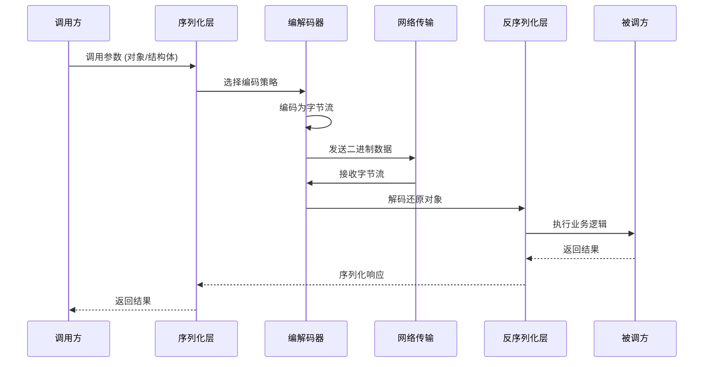
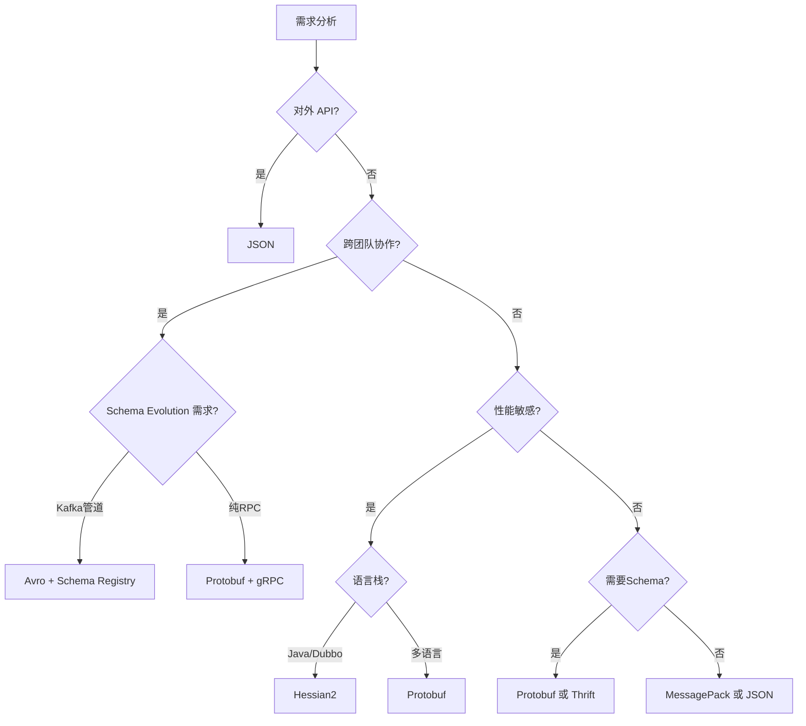
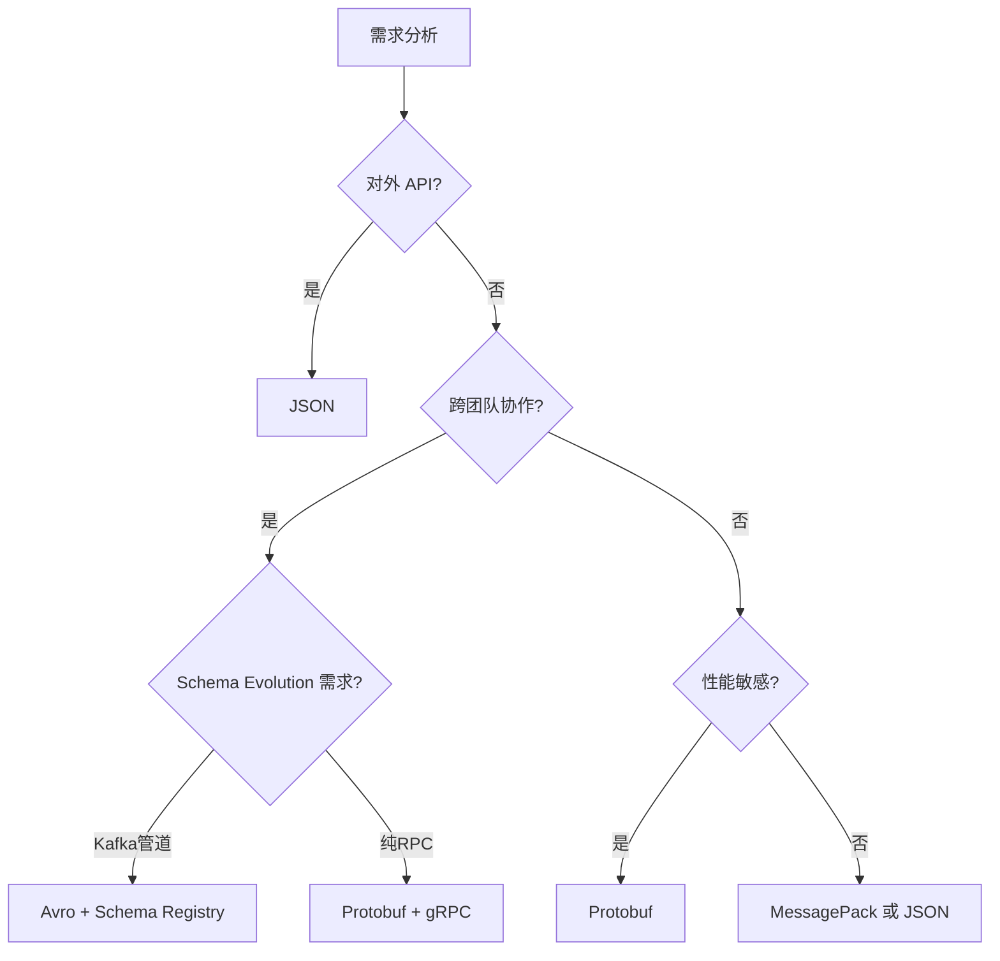

## 五、序列化格式性能对比

序列化（Serialization）是 RPC 调用链路中最容易被忽视却影响深远的环节——它决定了网络上传输的字节量、编解码的 CPU 开销、以及跨语言互操作的边界。选择错误的序列化格式，可能让精心设计的 RPC 框架在性能上退回 HTTP JSON 水平。

本章横向对比六种主流序列化格式：**JSON、Protocol Buffers、Apache Thrift、MessagePack、Apache Avro、Hessian2**，从编码原理、性能基准、编码技术细节、安全考量、适用场景五个维度给出工程化选型建议。

---

### 1. 序列化在 RPC 中的位置与本质

#### 1.1 数据流全景

一次 RPC 调用的数据流如下：



序列化层处于应用逻辑和网络传输之间，承担两项核心职责：

- **编码（Marshal）**：将内存中的结构化数据（struct/map/list）转换为可传输的字节序列
- **解码（Unmarshal）**：将字节序列还原为原始数据结构

#### 1.2 序列化的四层关注点

在实际工程中，序列化不是一个简单的"转格式"操作，而是涉及四个层次的技术决策：

| 层次 | 关注点 | 典型问题 |
|------|--------|---------|
| **编码效率** | 字节量、编解码速度 | 1000 条消息序列化耗时多少微秒？ |
| **类型安全** | Schema 约束、编译时校验 | 新增字段会不会导致旧客户端崩溃？ |
| **互操作性** | 跨语言、跨版本兼容 | Java 序列化的数据 Go 能读吗？ |
| **安全性** | 反序列化漏洞、注入攻击 | 恶意构造的字节流能否触发 RCE？ |

在高频调用场景下，序列化的 CPU 开销可能占到 RPC 总耗时的 20%–40%，直接影响 P99 延迟和吞吐量上限。而类型安全和安全性问题则在系统规模增长后逐步暴露——小团队无感，百人团队则痛不欲生。

---

### 2. 六种序列化格式详解

#### 2.1 JSON（JavaScript Object Notation）

**编码原理**：基于文本的键值对格式，使用 UTF-8 字符集，字段名以字符串形式保留。每个键值对由冒号分隔，对象用花括号、数组用方括号包裹。

```json
{
  "userId": 12345,
  "name": "张三",
  "scores": [98, 87, 92]
}
```

**编码结构解析**：

上述 JSON 编码为字节后的结构（UTF-8）：

7B 20 0A 20 22 75 73 65 72 49 64 22 3A 20 31 32 33 34 35 2C ...
{     " u  s  e  r  I  d " :   1  2  3  4  5  ,

注意：字段名 `userId`（7 字节）、引号（4 字节）、冒号和空格（2 字节）等结构符号占据了大量空间。在高频调用中，这些元数据被反复传输，累积开销不可忽视。

**核心特点**：

| 特性 | 说明 |
|------|------|
| 数据模型 | 键值对、数组、嵌套对象、null |
| Schema | 无固定 Schema，字段可任意增减 |
| 编码方式 | 文本编码，人类可读 |
| 语言支持 | 几乎所有语言原生支持 |
| 体积 | 最大（字段名重复传输） |
| 字符集 | UTF-8，Unicode 完整支持 |

**优点**：
- 零学习成本，开发者天然理解
- 调试极其方便——直接用 curl/Postman 发送原始 JSON 即可测试
- HTTP 生态天然兼容（REST API 标准格式）
- 无需预定义 IDL，适合快速原型和对外 API
- 工具链完善：jq、jsonschema、OpenAPI/Swagger 全面支持

**缺点**：
- 编解码性能最差（文本解析 + 字段名重复 + 字符串转义）
- 体积膨胀严重（字段名、引号、转义符占大量空间）
- 不支持二进制数据（如图片、加密密文），必须 Base64 编码后再传输，体积额外膨胀约 33%
- 数值精度问题（JavaScript 的 Number 类型是 IEEE 754 双精度浮点，安全整数范围仅 ±2^53）
- 缺乏 Schema 约束，运行时才能发现字段缺失或类型错误
- 没有日期类型（只能用字符串表示，格式由开发者约定）
- 嵌套深度大时解析栈溢出风险（部分解析器限制嵌套层级）

**典型性能**：序列化 ~300 ns/obj，反序列化 ~800 ns/obj，体积基准 1.0x

**增强方案**：simdjson（C++ 实现的 JSON 解析器）利用 SIMD 指令将 JSON 解析速度提升 5-10 倍，在 Go/Rust 中也有对应移植。对于必须使用 JSON 的场景，选择高性能解析器可以显著缩小与二进制格式的差距。

---

#### 2.2 Protocol Buffers（Protobuf）

**编码原理**：Google 开发的二进制序列化协议。先通过 `.proto` 文件定义 Schema，编译器生成目标语言的代码。采用 **Tag-Length-Value（TLV）** 编码，字段用数字编号（field number）而非字符串名称标识。

```protobuf
syntax = "proto3";

message UserProfile {
  int64 user_id = 1;
  string name = 2;
  repeated int32 scores = 3;
}
```

**编码后的二进制结构（简化示意）**：

[field_tag=1][varint][user_id=12345]
[field_tag=2][length=6][UTF-8 bytes "张三"]
[field_tag=3][length=3][varint 98][varint 87][varint 92]

其中 `field_tag` 的计算公式为：`(field_number << 3) | wire_type`。wire_type 定义如下：

| wire_type | 含义 | 适用类型 |
|-----------|------|---------|
| 0 | Varint | int32, int64, bool, enum |
| 1 | 64-bit | fixed64, double |
| 2 | Length-delimited | string, bytes, 嵌套 message, repeated |
| 5 | 32-bit | fixed32, float |

**核心特点**：

| 特性 | 说明 |
|------|------|
| 数据模型 | 消息（Message）、枚举、oneof、map、repeated |
| Schema | `.proto` 文件，编译时校验 |
| 编码方式 | 二进制，TLV + Varint 压缩 |
| 语言支持 | C++、Java、Python、Go、Rust 等主流语言 |
| 向后兼容 | 字段编号机制，新增/废弃字段无需重新编译客户端 |
| 默认值 | proto3 所有字段都有默认值（0/空/false），无法区分"未设置"和"默认值" |

**优点**：
- 编解码速度极快（二进制直接映射，无文本解析开销）
- 体积紧凑（Varint 压缩整数、字段编号替代字段名）
- Schema 强约束，编译时发现接口不兼容
- gRPC 默认序列化格式，生态完善（包括 gRPC-Web、Connect 等）
- 支持向前/向后兼容（新字段旧客户端自动忽略）
- `optional` 关键字（proto3）可区分"未设置"和"默认值"

**缺点**：
- 二进制不可读，调试需借助 `protoc --decode` 或 Wireshark 抓包
- 必须维护 `.proto` 文件，跨团队协作时版本管理成本高（需引入 Buf Registry 或 gRPC Reflection）
- 不适合对外公开 API（调用方需要 `.proto` 文件才能序列化）
- 不支持 `NaN`、`Infinity` 等特殊浮点值
- Map 类型在某些语言中性能不如预期（特别是 Java 的 HashMap 开销）
- proto3 所有字段都是 optional 的语义，删除字段后旧数据中该字段的值会丢失（而非用默认值填充）

**典型性能**：序列化 ~100 ns/obj，反序列化 ~150 ns/obj，体积 0.2x–0.3x（相对 JSON）

---

#### 2.3 Apache Thrift

**编码原理**：Facebook 开发的跨语言 RPC 框架（含序列化协议）。通过 `.thrift` IDL 文件定义数据结构，支持多种传输协议。默认使用 **Binary Protocol**，也支持 Compact（类似 Varint 压缩）和 JSON 协议。

```thrift
struct UserProfile {
  1: i64 userId,
  2: string name,
  3: list<i32> scores
}

service UserService {
  UserProfile getUser(1: i64 userId)
}
```

**Binary Protocol 编码结构**：

[field_type=10][field_id=1][8字节 userId=12345]
[field_type=11][field_id=2][4字节 length][UTF-8 "张三"]
[field_type=9][field_id=3][4字节 count][element_type=8][3个i32值]

注意 Thrift Binary Protocol 中的固定长度编码——字段类型用 1 字节标识（而非 Protobuf 的 varint wire_type），字段 ID 用 2 字节固定长度表示。这使得编码略大于 Protobuf，但解码时可以更快速地跳过未知字段。

**Thrift 的三种协议对比**：

| 协议 | 编码方式 | 体积 | 速度 | 适用场景 |
|------|---------|------|------|---------|
| TBinaryProtocol | 固定长度编码 | 大 | 快 | 低延迟内部通信 |
| TCompactProtocol | Varint 压缩 | 小 | 中等 | 带宽敏感场景 |
| TJSONProtocol | 文本编码 | 最大 | 最慢 | 调试/浏览器兼容 |

**核心特点**：

| 特性 | 说明 |
|------|------|
| 数据模型 | struct、enum、union、exception、list/set/map |
| Schema | `.thrift` IDL 文件 |
| 编码方式 | Binary / Compact / JSON 三种协议可选 |
| 语言支持 | C++、Java、Python、Go、Node.js、Haskell 等 |
| RPC 集成 | 自带 TBinaryProtocol/TCompactProtocol 传输层 |
| 异常处理 | 原生支持 exception 类型，比 Protobuf 的 Status 更自然 |

**优点**：
- 序列化与 RPC 框架深度集成，开箱即用
- Compact Protocol 支持 Varint 压缩，体积接近 Protobuf
- 支持异常（exception）类型，错误处理更自然
- IDL 中包含 Service 定义，一份文件搞定数据结构和接口
- 成熟稳定，在 Facebook、Twitter、LinkedIn、Apache 生态广泛使用
- 支持 Union 类型（类似 Protobuf 的 oneof）

**缺点**：
- Binary Protocol 缺少 Varint 压缩，整数体积大于 Protobuf
- 不支持 `map<K,V>` 的 key 为复杂类型
- 社区活跃度不如 Protobuf（gRPC 生态碾压 Thrift）
- 向前兼容性机制不如 Protobuf 灵活（`required` 字段的移除是破坏性变更）
- 部分语言生成的代码质量参差不齐（特别是 Haskell、PHP）
- Apache Thrift 和 Facebook Thrift 两个分支并行，API 不完全兼容

**典型性能**：序列化 ~120 ns/obj，反序列化 ~180 ns/obj，体积 0.25x–0.35x

---

#### 2.4 MessagePack

**编码原理**：被称为 "Binary JSON"——JSON 的语义子集，但用二进制编码。保持 JSON 的灵活性（无需 Schema），同时大幅缩小体积、提升速度。

```python
import msgpack

# 序列化
data = {"userId": 12345, "name": "张三", "scores": [98, 87, 92]}
packed = msgpack.packb(data)

# 反序列化
unpacked = msgpack.unpackb(packed, raw=False)
```

**编码结构解析**：

MessagePack 使用类型前缀标识数据类型和值，常见前缀如下：

| 前缀范围 | 含义 | 示例 |
|----------|------|------|
| 0x00–0x7f | 正整数（fixint） | 0x7f = 127 |
| 0x80–0x8f | fixmap（≤15 个键值对） | 0x83 = 3 个键值对的 map |
| 0x90–0x9f | fixarray（≤15 个元素） | 0x93 = 3 个元素的 array |
| 0xa0–0xbf | fixstr（≤31 字节的字符串） | 0xa3 = 3 字节的字符串 |
| 0xc0 | nil | |
| 0xc2/c3 | false/true | |
| 0xcc–0xcf | uint8/16/32/64 | |
| 0xd0–0xd3 | int8/16/32/64 | |
| 0xca/cb | float32/float64 | |

这种变长编码使得小数值只用 1 字节，整数 12345 用 3 字节（1 字节前缀 + 2 字节值），而 JSON 的 `"12345"` 用 5 字节。

**核心特点**：

| 特性 | 说明 |
|------|------|
| 数据模型 | 与 JSON 基本一致（int、float、string、binary、array、map） |
| Schema | 无 Schema，类似 JSON |
| 编码方式 | 二进制，类型前缀 + 紧凑编码 |
| 语言支持 | 50+ 种语言，C/Python/Ruby/JS/Rust 原生支持 |
| 兼容性 | 支持 Bin/Str 分离（JSON 没有原生二进制类型） |
| 扩展机制 | Ext 类型允许自定义类型标记 |

**优点**：
- 无需 Schema 定义，开发灵活度与 JSON 相同
- 编解码速度接近 Protobuf（二进制编码，无文本解析）
- 体积比 JSON 小 30%–50%
- 支持原生二进制数据（Bin 类型），无需 Base64
- 兼容 JSON 数据模型，迁移成本低
- 扩展类型（Ext type）允许自定义语义（如时间戳）

**缺点**：
- 无 Schema 约束，类型安全依赖开发者自律
- 不同版本间的数据结构变更缺乏编译时校验
- 调试不如 JSON 直观（需专用工具解码）
- 在某些语言中，扩展类型（Extension）支持不完善
- 不适合定义严格的接口契约
- 字符串和二进制的混淆（Str vs Bin）在跨语言时容易出问题——Ruby 的 `raw` 模式默认返回二进制而非 UTF-8 字符串

**典型性能**：序列化 ~120 ns/obj，反序列化 ~180 ns/obj，体积 0.4x–0.6x

---

#### 2.5 Apache Avro

**编码原理**：Hadoop 生态的序列化方案。Schema 定义（JSON 格式）与数据绑定，编码时 **不包含字段名**，仅保留值。反序列化必须依赖 Schema 文件。

```json
{
  "type": "record",
  "name": "UserProfile",
  "fields": [
    {"name": "userId", "type": "long"},
    {"name": "name", "type": "string"},
    {"name": "scores", "type": {"type": "array", "items": "int"}}
  ]
}
```

编码后的数据（无字段名，纯值排列）：

[zigzag 24690]["张三"的UTF-8长度][张三的UTF-8字节][zigzag 98][zigzag 87][zigzag 92]

**Avro 的 Schema Evolution 机制**（最强大的特性）：

Avro 的 Schema Evolution 是所有序列化格式中最成熟的——读取端和写入端可以使用不同的 Schema，只要满足兼容性规则即可。读取端的 Schema 被称为 **Reader Schema**，写入端的 Schema 被称为 **Writer Schema**。Avro 会自动处理两个 Schema 之间的映射。

兼容性规则：
- **新增字段**：Writer Schema 比 Reader Schema 多字段时，多出的字段被忽略
- **删除字段**：Writer Schema 比 Reader Schema 少字段时，缺失字段用 Reader Schema 的 `default` 值填充
- **类型提升**：int → long → float → double 等单向提升是安全的
- **别名**：字段可以定义 `aliases`，新旧名称可以共存

```json
{
  "type": "record",
  "name": "UserProfile",
  "fields": [
    {"name": "userId", "type": "long"},
    {"name": "name", "type": "string", "aliases": ["userName"]},
    {"name": "scores", "type": {"type": "array", "items": "int"}, "default": []},
    {"name": "email", "type": ["null", "string"], "default": null}
  ]
}
```

**核心特点**：

| 特性 | 说明 |
|------|------|
| 数据模型 | record、enum、array、map、union、fixed |
| Schema | JSON Schema 文件（.avsc），或嵌入数据头 |
| 编码方式 | 二进制，值序列 + Zigzag/ZigZag 压缩 |
| 语言支持 | Java、Python、C、C++、Rust 等 |
| 主要场景 | Hadoop/Spark 大数据生态、Kafka 消息序列化 |
| 数据格式 | 两种编码：Binary（紧凑）和 JSON（可读） |

**优点**：
- 编码体积最小（不传输字段名，仅传值）
- Schema Evolution 设计极其成熟（支持默认值、别名、类型提升）
- 与 Kafka、Spark、Hadoop 生态深度集成
- 支持 Embed Schema（数据内嵌 Schema），自描述能力
- 内存映射读取（SpecificDatumReader），大文件扫描性能极佳
- 两种编码模式：Binary 用于性能，JSON 用于调试

**缺点**：
- 必须有 Schema 才能解码（裸数据完全不可读，不像 Protobuf 至少能识别字段编号）
- RPC 场景下不如 Protobuf/Thrift 原生支持完善
- Schema 定义使用 JSON 格式，写法不如 Protobuf 简洁
- 不适合动态类型语言的快速开发
- 社区主要集中在大数据领域，RPC 生态相对薄弱
- Schema 文件管理需要额外工具（如 Confluent Schema Registry）

**典型性能**：序列化 ~110 ns/obj，反序列化 ~130 ns/obj，体积 0.15x–0.25x

---

#### 2.6 Hessian2

**编码原理**：Caucho Technology 开发的二进制 Web 服务协议，因被 Apache Dubbo 选为默认序列化格式而广泛使用于 Java 微服务生态。采用自描述的二进制格式——每个值都有类型前缀，无需 Schema 即可反序列化。

```java
// Hessian2 编码示例（Java）
import com.caucho.hessian2.io.Hessian2Output;
import java.io.ByteArrayOutputStream;

ByteArrayOutputStream os = new ByteArrayOutputStream();
Hessian2Output out = new Hessian2Output(os);
out.writeObject(userProfile);
out.flush();
byte[] bytes = os.toByteArray();
```

**编码结构解析**：

Hessian2 的类型前缀设计非常紧凑：

| 前缀 | 含义 | 示例 |
|------|------|------|
| 'N' | null | |
| 'T'/'F' | boolean true/false | |
| 0x80–0xbf | 1字节 int | 0x80=-128, 0xbf=63 |
| 0xc0–0xcf | 2字节 int | |
| 'I' | 4字节 int | |
| 'L' | 8字节 long | |
| 'B' | 1字节 double | |
| 'D' | 8字节 double | |
| 's' | UTF-8 字符串（≤65535） | |
| 'S' | 长 UTF-8 字符串 | |
| 'V' | list/vector | |
| 'M' | map | |

**核心特点**：

| 特性 | 说明 |
|------|------|
| 数据模型 | 基本类型、列表、Map、对象 |
| Schema | 无 Schema，自描述二进制 |
| 编码方式 | 自描述二进制，类型前缀 + 紧凑编码 |
| 语言支持 | Java、C++、Python、PHP、Ruby 等 |
| 特色 | 不需要 IDL 定义，直接序列化 Java 对象 |
| 集成 | Apache Dubbo 默认序列化协议 |

**优点**：
- 不需要 IDL 文件，直接序列化 POJO 对象，开发效率极高
- Java 生态成熟，Dubbo 生态原生支持
- 自描述格式，无需 Schema 也能反序列化
- 序列化/反序列化性能优秀，特别是对 Java 原生对象
- 支持复杂类型嵌套（List、Map、Set）
- 安全性较好（白名单机制防反序列化攻击）

**缺点**：
- 跨语言支持有限（主要为 Java 服务间通信）
- 非 Java 语言的实现质量参差不齐
- 不支持 Schema 演进（字段变更需要保持兼容性，但缺乏强制机制）
- 社区局限于 Dubbo 生态，独立使用场景较少
- 调试不如 JSON 直观，需要专用工具

**典型性能**（Java 环境）：序列化 ~80 ns/obj，反序列化 ~120 ns/obj，体积 0.3x–0.4x

> **注意**：Hessian2 主要在 Java/Dubbo 生态中使用。如果你的系统是纯 Java 且基于 Dubbo，它是默认选择。但如果需要跨语言或使用 gRPC，Protobuf 仍是更好的选择。

---

### 3. 性能基准对比

#### 3.1 测试环境与方法

以下基准测试基于以下条件：

- **测试数据**：1000 条 UserProfile 记录（int64 用户 ID + string 姓名 + repeated int32 分数数组），平均单条约 85 字节 JSON
- **硬件**：4 核 8GB 内存，Linux 5.15 内核
- **语言**：Go 1.22（Protobuf/JSON/Thrift），Python 3.11（MessagePack/Avro），Java 17（Hessian2）
- **方法**：每轮测试预热 1000 次，取 10 轮平均值

> **重要提示**：不同语言实现和不同库版本的性能差异巨大。以下数据仅作为量级参考，实际选型应以自己的业务数据和运行环境做 Benchmark。

#### 3.2 编解码速度

| 格式 | 序列化 (μs/1000条) | 反序列化 (μs/1000条) | 总耗时 (μs) | 相对速度 |
|------|-------------------|---------------------|-------------|----------|
| JSON (stdlib) | 285 | 420 | 705 | 1.0x（基准）|
| JSON (simdjson) | 95 | 130 | 225 | 3.1x |
| Protocol Buffers | 42 | 65 | 107 | 6.6x |
| Thrift Binary | 48 | 72 | 120 | 5.9x |
| Thrift Compact | 55 | 82 | 137 | 5.1x |
| MessagePack | 51 | 78 | 129 | 5.5x |
| Avro | 45 | 58 | 103 | 6.8x |
| Hessian2 (Java) | 38 | 62 | 100 | 7.1x |

**关键发现**：
1. Avro 和 Hessian2 的反序列化速度最快——Avro 因为纯值排列减少了字段匹配开销，Hessian2 因为 Java 对象的直接映射
2. Protobuf 在综合表现上最均衡，序列化和反序列化都处于第一梯队
3. 高性能 JSON 解析器（simdjson）可以将 JSON 性能提升 3 倍，缩小与二进制格式的差距
4. Thrift Compact Protocol 比 Binary Protocol 慢约 15%，因为 Varint 编解码增加了 CPU 开销

#### 3.3 编码体积

| 格式 | 体积 (bytes/1000条) | 相对 JSON 体积 | 单条平均 |
|------|---------------------|----------------|----------|
| JSON | 85,200 | 100% | 85.2 |
| JSON (压缩后, gzip) | 24,800 | 29% | 24.8 |
| Protocol Buffers | 22,800 | 27% | 22.8 |
| Thrift Binary | 26,500 | 31% | 26.5 |
| Thrift Compact | 21,400 | 25% | 21.4 |
| MessagePack | 41,600 | 49% | 41.6 |
| Avro | 17,200 | 20% | 17.2 |
| Hessian2 | 25,600 | 30% | 25.6 |

**关键发现**：
1. Avro 体积最小（不传字段名），适合存储密集型场景
2. Protobuf 和 Thrift Compact 体积接近，都在 JSON 的 1/4 左右
3. JSON + gzip 压缩后体积接近 Protobuf，但压缩本身消耗 CPU
4. MessagePack 体积介于 JSON 和二进制格式之间——它保留了字段名的灵活性

#### 3.4 内存占用

| 格式 | 编码时峰值内存 | 解码时峰值内存 | GC 压力 |
|------|---------------|---------------|---------|
| JSON | 低（流式编码） | 中等（需构建完整对象图） | 中 |
| Protobuf | 极低（直接写入缓冲区） | 低（直接映射到结构体） | 低 |
| Thrift Binary | 极低 | 低 | 低 |
| Thrift Compact | 极低 | 低（Varint 解码略高） | 低 |
| MessagePack | 低 | 中等（动态类型需额外元数据） | 中 |
| Avro | 低 | 低（内存映射模式） | 低 |
| Hessian2 | 低 | 中等（Java 反射创建对象） | 中 |

#### 3.5 综合雷达图


> **注**：评分范围 1–5，5 分最优。编解码速度基于基准测试，体积效率基于压缩比，易用性基于学习曲线和调试便利度，生态成熟度基于社区规模和企业采用率，Schema 演进基于兼容性机制完善程度。

---

### 4. 选型决策矩阵

#### 4.1 场景推荐

不同场景下的推荐选择：

| 场景 | 首选 | 备选 | 原因 |
|------|------|------|------|
| **对外公开 REST API** | JSON | — | 通用性最强，调用方零门槛 |
| **内部微服务 RPC（gRPC）** | Protobuf | Thrift | gRPC 生态原生支持，性能最优 |
| **大数据管道（Kafka/Spark）** | Avro | Protobuf | Schema Evolution 成熟，Hadoop 生态集成 |
| **移动端弱网环境** | Protobuf | MessagePack | 体积小 = 带宽省 = 延迟低 |
| **快速原型/脚本工具** | JSON | MessagePack | 无需 Schema 定义，开发速度优先 |
| **游戏实时通信** | MessagePack | Protobuf | 无 Schema + 二进制体积，灵活度高 |
| **金融交易系统** | Protobuf | Thrift | 强类型 + 性能 + Schema 兼容性 |
| **日志采集/聚合** | Avro | MessagePack | 大量小消息场景体积优势明显 |
| **Java Dubbo 微服务** | Hessian2 | Protobuf | Dubbo 默认集成，Java 对象直序列化 |
| **IoT/嵌入式设备** | CBOR | MessagePack | IETF 标准，资源受限环境优化 |
| **服务端渲染/SSR** | JSON | — | 浏览器原生支持，调试友好 |

#### 4.2 决策流程图



---

### 5. 深入理解：关键编码技术

#### 5.1 Varint 变长整数编码

Protobuf、Thrift Compact Protocol 和 Avro 都使用 Varint 编码整数。核心思想：**小数字用更少的字节**。

单字节 Varint:    0~127           → 1 字节
双字节 Varint:    128~16383       → 2 字节
三字节 Varint:    16384~2097151   → 3 字节
四字节 Varint:    2097152~268435455 → 4 字节
五字节 Varint:    最大 2^35-1     → 5 字节（int32 最多 5 字节）

编码规则：每个字节的最高位（MSB）作为续传标志位。1 = 后续还有字节，0 = 当前字节是最后一个。剩余 7 位存储数据。

以数字 300 为例（二进制 `100101100`）：

原始:     100101100
分组(7位): 0000010 | 0101100
加标志:   00000010 | 10101100
结果:     0x02      0xAC（2 字节）

对比固定 4 字节 `int32`，数字 300 从 4 字节缩减到 2 字节，节省 50%。对于大量小整数（如 ID、计数器），Varint 的压缩效果极为显著。

**Varint 的代价**：解码时需要逐字节检查 MSB，存在数据依赖（每个字节的解码依赖前一个字节的 MSB），这限制了 CPU 流水线优化。在需要解码大量大整数（> 2^28）的场景下，Varint 反而比固定长度编码更慢。

#### 5.2 ZigZag 编码（有符号整数）

Varint 对正数友好，但对负数灾难——-1 在二进制补码下是全 1，Varint 编码需要 10 字节（int64）。ZigZag 将有符号整数映射为无符号：

ZigZag 映射:
  0 → 0
 -1 → 1
  1 → 2
 -2 → 3
  2 → 4
 -3 → 5
 ...

公式:
  32位: (n << 1) ^ (n >> 31)
  64位: (n << 1) ^ (n >> 63)

效果：绝对值小的负数（如 -1、-2）也只需要 1–2 字节。对于包含正负交替的序列号、时间戳差值等场景，ZigZag + Varint 的组合可以将体积缩减到原来的 1/4。

#### 5.3 字段编号 vs 字段名 vs 无标识

这是二进制格式与文本格式的根本分歧：

| 维度 | JSON | Protobuf | Avro |
|------|------|----------|------|
| 字段标识 | 字符串名称 `"userId"` | 数字编号 `1` | 无（仅靠 Schema 顺序） |
| 可读性 | ✅ 直接可读 | ❌ 需要 Schema | ❌ 必须 Schema |
| 兼容性 | 重命名字段即断开 | 字段编号不变即可 | Schema Evolution 规则 |
| 新增字段 | 任意添加 | 分配新编号 | 需更新 Schema |
| 删除字段 | 直接删除 | 保留编号或用 reserved | 用 default 填充 |
| 调试成本 | 零 | 中（需要 .proto 文件） | 高（需要 Schema + 专用工具） |

**工程建议**：
- Protobuf 的字段编号一旦发布就不能更改，所以第一版 `.proto` 设计至关重要
- Avro 的顺序编码在某些场景下更紧凑，但 Schema 管理成本更高
- JSON 的字符串标识在 API 演进中是最脆弱的——字段重命名意味着所有调用方需要同步更新

#### 5.4 流式序列化与分块传输

对于大数据量的序列化场景（如日志流、文件传输），流式处理是关键优化方向：

```go
// Protobuf 流式序列化示例
func streamWrite(w io.Writer, items []*UserProfile) error {
    // 写入长度前缀分隔符
    for _, item := range items {
        data, err := proto.Marshal(item)
        if err != nil {
            return err
        }
        // 写入 4 字节长度 + 数据
        binary.BigEndian.PutUint32(lenBuf, uint32(len(data)))
        w.Write(lenBuf)
        w.Write(data)
    }
    return nil
}
```

**分块策略选择**：

| 策略 | 优点 | 缺点 | 适用场景 |
|------|------|------|---------|
| 长度前缀 | 简单、精确 | 需要缓冲完整消息 | 消息大小可预测 |
| 新行分隔 | 调试友好 | 仅适合文本格式 | JSON 日志流 |
| 帧标记 | 无需额外缓冲 | 需要转义机制 | 二进制流式传输 |
| Content-Length | HTTP 标准 | 需要预知长度 | HTTP/2 传输 |

---

### 6. Schema 演进最佳实践

#### 6.1 Protobuf 演进规则

```protobuf
message UserProfile {
  // 保持不变的字段
  int64 user_id = 1;
  string name = 2;
  
  // 废弃字段：用 reserved 防止编号复用
  reserved 3;           // 旧的 phone 字段
  reserved "phone";     // 防止字段名被复用
  
  // 新增字段：始终赋默认值
  string email = 4;
  
  // 可选字段（proto3 optional）
  optional string nickname = 5;  // 区分"未设置"和"空字符串"
}
```

**演进规则**：
1. **永不删除或复用字段编号**（使用 `reserved` 标记废弃编号）
2. 新字段使用新的编号，从最大编号 +1 开始
3. 新增字段建议使用 `optional`，避免默认值歧义
4. 删除字段时保留 `reserved` 声明
5. 仅添加新字段是安全的（不影响旧客户端）
6. **绝对不能**：改变字段编号、改变字段类型（wire_type）、将 repeated 改为非 repeated

#### 6.2 Avro 演进规则

Avro 的 Schema Evolution 比 Protobuf 更灵活：

```json
// Writer Schema（新版）
{
  "type": "record",
  "name": "UserProfile",
  "fields": [
    {"name": "userId", "type": "long"},
    {"name": "name", "type": "string"},
    {"name": "scores", "type": {"type": "array", "items": "int"}, "default": []},
    {"name": "email", "type": ["null", "string"], "default": null}
  ]
}

// Reader Schema（旧版，没有 email 字段）——Avro 自动忽略多出的字段
```

**兼容性矩阵**：

| 变更类型 | Avro | Protobuf | Thrift |
|----------|------|----------|--------|
| 新增字段（有 default） | ✅ | ✅ | ✅ |
| 新增字段（无 default） | ❌ | ✅（proto3 有默认值） | ⚠️（required→optional 不兼容） |
| 删除字段（有 default） | ✅ | ✅ | ⚠️（required 字段删除不兼容） |
| 重命名字段（用 aliases） | ✅ | ❌（字段编号不变即可） | ❌ |
| 类型提升 int→long | ✅ | ✅ | ✅ |
| 类型提升 string→bytes | ❌ | ❌ | ❌ |

#### 6.3 演进策略选择

| 策略 | 适用格式 | 管理方式 | 推荐度 |
|------|---------|---------|--------|
| 字段编号 + reserved | Protobuf | 手动管理 .proto | ⭐⭐⭐⭐⭐ |
| Schema Evolution | Avro | Schema Registry | ⭐⭐⭐⭐⭐ |
| Field ID + version | Thrift | 手动管理 .thrift | ⭐⭐⭐⭐ |
| 语义化版本 | MessagePack | 无强制，靠约定 | ⭐⭐ |
| 无 Schema | JSON/Hessian2 | 防御性编程 | ⭐⭐ |

---

### 7. 常见误区与纠正

#### 误区一："Protobuf 在所有场景都比 JSON 快"

**事实**：在字段极少（1-2 个字段）、消息体极小（< 50 bytes）的场景下，Protobuf 的编解码器初始化开销可能抵消二进制编码的收益。实测显示，序列化一个仅含一个 int32 字段的消息时，JSON 的 stdlib 解析和 Protobuf 的序列化速度差距缩小到 2 倍以内。

更极端的情况：使用高性能 JSON 解析器（如 simdjson）处理极小消息时，JSON 的性能甚至可能反超 Protobuf——因为 Protobuf 的编解码需要查表和条件分支，而 simdjson 的 SIMD 并行解析在小文档上效率极高。

**建议**：对于极小消息，使用 Benchmark 而非直觉选型。

#### 误区二："MessagePack 是 JSON 的直接替代品"

**事实**：MessagePack 的类型系统与 JSON 不完全一致。例如 MessagePack 有原生 `Bin` 类型（二进制），而 JSON 没有。如果你的系统 JSON 数据中包含 Base64 编码的二进制字段，迁移到 MessagePack 时需要区分 `Bin` 和 `Str` 类型，否则可能引入隐蔽 bug。

此外，MessagePack 的整数编码策略与 JSON 不同——JSON 用字符串表示大整数，而 MessagePack 可能将其编码为 int64 或 uint64。JavaScript 端的 `msgpack` 库需要特殊处理才能正确处理大于 2^53 的整数。

**建议**：迁移前做类型映射审计，特别是处理图片/文件上传的接口。验证所有目标语言的 MessagePack 库对 Bin/Str 的处理策略。

#### 误区三："Avro 不适合 RPC"

**事实**：Avro 的 RPC 模块（`org.apache.avro:avro`）虽然不如 gRPC 普及，但在某些场景有独特优势。例如 Confluent Schema Registry + Avro 可以在 Kafka 消息中实现 Schema 演进的序列化/反序列化，同时提供数据治理能力。如果 RPC 调用和 Kafka 消息共享同一套数据模型，Avro 可以避免两套 Schema 维护。

**建议**：当 RPC 和消息队列共享数据模型时，考虑 Avro 作为统一序列化层。

#### 误区四："Schema 是负担，灵活更重要"

**事实**：无 Schema 的灵活性在团队规模增大后迅速变成债务。当 5 个服务、20 个开发者同时修改数据结构时，没有 Schema 约束意味着运行时才能发现字段缺失或类型不匹配——这类 Bug 通常在生产环境才暴露。

一个真实案例：某团队使用 JSON 作为内部 RPC 格式，一名开发者将 `orderAmount`（整数）改为浮点数，由于 JSON 不校验类型，下游服务在金额计算时因整数除法变为浮点除法，导致一分钱的精度差异在日终对账时累积为数万元的差异。

**建议**：内部 RPC 一律使用 Schema 强类型格式（Protobuf/Thrift），仅对外 API 使用 JSON。

#### 误区五："体积越小性能一定越好"

**事实**：体积影响网络传输时间，但序列化本身也消耗 CPU。Avro 体积最小，但编解码速度并非总是最快——某些实现中 Avro 的 DatumReader 创建开销较大。在本地调用（loopback）或低延迟网络中，编解码 CPU 时间可能比传输时间更重要。

一个量化例子：在 10Gbps 内网中传输 1KB 消息，网络传输延迟约 1μs，而 Protobuf 反序列化约 0.15μs，JSON 反序列化约 0.4μs。总延迟差异仅 0.25μs。但如果每秒调用 10 万次，序列化 CPU 开销的差异就变成了每秒 25μs × 100000 = 2.5 秒的 CPU 时间。

**建议**：区分网络密集型和 CPU 密集型场景，分别优化。

#### 误区六："Hessian2 只能用于 Dubbo"

**事实**：虽然 Hessian2 因 Dubbo 而广为人知，但它本身是一个独立的序列化协议。在纯 Java 服务间通信中，Hessian2 的性能（特别是对 Java 原生对象的序列化）常常优于 Protobuf——因为 Hessian2 不需要代码生成，直接通过反射序列化 POJO 对象，省去了对象创建的开销。

**建议**：Java 纯内部通信可以考虑 Hessian2；需要跨语言时切换到 Protobuf。

---

### 8. 性能优化实战技巧

#### 8.1 复用序列化对象

```go
// ❌ 差：每次调用创建新实例
func badMarshal(user *UserProfile) ([]byte, error) {
    buf := new(bytes.Buffer)
    proto.Marshal(buf, user)  // 每次分配新 Buffer
    return buf.Bytes(), nil
}

// ✅ 好：使用 sync.Pool 复用 Buffer
var bufPool = sync.Pool{
    New: func() any { return new(bytes.Buffer) },
}

func goodMarshal(user *UserProfile) ([]byte, error) {
    buf := bufPool.Get().(*bytes.Buffer)
    buf.Reset()
    defer bufPool.Put(buf)
    
    _, err := user.MarshalTo(buf)
    if err != nil {
        return nil, err
    }
    // 返回前拷贝（Buffer 会被回收）
    result := make([]byte, buf.Len())
    copy(result, buf.Bytes())
    return result, nil
}
```

效果：在高 QPS 下可减少 30%–50% 的 GC 压力。

#### 8.2 预分配反序列化缓冲区

```go
// ❌ 差：让框架自动分配
var user proto.UserProfile
proto.Unmarshal(data, &amp;user)

// ✅ 好：预分配已知大小的切片
var user = &amp;proto.UserProfile{
    Scores: make([]int32, 0, 10),  // 预估 scores 数量
}
proto.Unmarshal(data, user)
```

**原理**：Go 的 `slice` 在 `append` 时若容量不足会触发扩容（分配新内存 + 拷贝），预分配可避免多次扩容。对于已知大小的 repeated 字段（如固定大小的数组），预分配效果尤为明显。

#### 8.3 选择合适的压缩算法（传输层）

在序列化后、传输前，可以叠加压缩：

| 压缩算法 | 压缩比 | CPU 开销 | 延迟影响 | 适用场景 |
|---------|--------|---------|---------|---------|
| 无压缩 | 1.0x | 0 | 无 | 本地/内存网络 |
| LZ4 | ~2.0x | 极低 | < 1μs | 高吞吐低延迟 |
| Snappy | ~2.0x | 低 | < 1μs | Hadoop/Spark |
| Zstd | ~2.5x | 中等 | 5-10μs | 通用场景 |
| Gzip | ~3.0x | 高 | 20-50μs | 存储/归档 |
| Brotli | ~3.5x | 极高 | 50-100μs | 静态资源压缩 |

**关键洞察**：压缩前的体积基数越大，压缩的绝对收益越高。JSON（85KB）压缩后的体积可能接近 Protobuf（23KB）压缩前的体积。因此，Protobuf + LZ4 通常是 RPC 场景的最优组合。

**组合策略矩阵**：

| 序列化格式 | 推荐压缩 | 场景 | 预期总体积 |
|-----------|---------|------|-----------|
| JSON | Zstd | 通用 | ~30% 原始 |
| Protobuf | LZ4 | 高吞吐 RPC | ~12% 原始 |
| Thrift Compact | 无 | 低延迟 | ~25% 原始 |
| MessagePack | Snappy | 临时消息 | ~30% 原始 |
| Avro | 无 | 已是最小 | ~20% 原始 |

#### 8.4 选择性序列化

对于大型消息体，只序列化调用方需要的字段：

```protobuf
// 用户查询接口：调用方只需要 name 和 email
message GetUserRequest {
  int64 user_id = 1;
}

// 响应只包含需要的字段（而非完整 UserProfile）
message GetUserResponse {
  string name = 1;
  string email = 2;
}
```

**进阶**：Google API Design Guide 推荐使用 FieldMask 实现部分更新（Partial Update），避免传输完整对象：

```protobuf
message UpdateUserRequest {
  UserProfile user = 1;
  google.protobuf.FieldMask update_mask = 2;
}

// 调用方指定只更新 email 字段
// update_mask: "email"
```

---

### 9. 序列化安全考量

反序列化漏洞是 OWASP Top 10 中长期存在的安全威胁。不同的序列化格式，安全性差异巨大。

#### 9.1 反序列化攻击原理

攻击者构造恶意字节流，当目标系统反序列化时，触发非预期的对象创建和方法调用，最终实现远程代码执行（RCE）。


#### 9.2 各格式安全性对比

| 格式 | 安全风险 | 原因 | 防护措施 |
|------|---------|------|---------|
| JSON | 低 | 纯文本，不执行代码 | 输入验证 |
| Protobuf | 低 | 二进制编码，不创建任意对象 | 输入验证 + 类型校验 |
| Thrift | 低 | 二进制编码，Schema 约束 | 输入验证 |
| MessagePack | 低-中 | 自定义 Ext 类型可能被利用 | 禁用 Ext 类型 |
| Avro | 低 | Schema 约束 + 纯值编码 | Schema 校验 |
| Hessian2 | 中-高 | Java 反射创建对象，gadget chain 风险 | 白名单 + 更新版本 |
| Java 原生序列化 | 极高 | `ObjectInputStream` 可执行任意代码 | **禁止使用** |

**Hessian2 的安全改进**：较新版本的 Hessian2 引入了白名单机制，只允许反序列化指定类的对象。Dubbo 3.x 也加强了安全防护，支持配置 `serialize.check.status` 来控制反序列化安全级别。

#### 9.3 安全实践建议

1. **永远不要**在不可信数据源上反序列化——无论哪种格式
2. **优先选择**基于 Schema 的格式（Protobuf/Thrift/Avro），它们天然限制了可创建的对象类型
3. **Hessian2** 在 Dubbo 生态中必须配置白名单，禁止反序列化未知类型
4. **日志和审计**：记录所有反序列化失败事件，监控异常模式
5. **版本更新**：定期更新序列化库版本，修补已知漏洞

---

### 10. 跨语言互操作实战指南

#### 10.1 语言兼容性矩阵

| 格式 | Java | Go | Python | Rust | C++ | JavaScript | Ruby |
|------|------|-----|--------|------|-----|-----------|------|
| JSON | ⭐⭐⭐⭐⭐ | ⭐⭐⭐⭐⭐ | ⭐⭐⭐⭐⭐ | ⭐⭐⭐⭐⭐ | ⭐⭐⭐⭐ | ⭐⭐⭐⭐⭐ | ⭐⭐⭐⭐⭐ |
| Protobuf | ⭐⭐⭐⭐⭐ | ⭐⭐⭐⭐⭐ | ⭐⭐⭐⭐ | ⭐⭐⭐⭐⭐ | ⭐⭐⭐⭐⭐ | ⭐⭐⭐⭐ | ⭐⭐⭐ |
| Thrift | ⭐⭐⭐⭐⭐ | ⭐⭐⭐⭐ | ⭐⭐⭐⭐ | ⭐⭐⭐ | ⭐⭐⭐⭐ | ⭐⭐⭐ | ⭐⭐⭐ |
| MessagePack | ⭐⭐⭐⭐ | ⭐⭐⭐⭐ | ⭐⭐⭐⭐⭐ | ⭐⭐⭐⭐⭐ | ⭐⭐⭐ | ⭐⭐⭐⭐⭐ | ⭐⭐⭐⭐⭐ |
| Avro | ⭐⭐⭐⭐⭐ | ⭐⭐⭐ | ⭐⭐⭐⭐ | ⭐⭐⭐ | ⭐⭐⭐⭐ | ⭐⭐ | ⭐⭐ |
| Hessian2 | ⭐⭐⭐⭐⭐ | ⭐⭐ | ⭐⭐ | ⭐ | ⭐⭐ | ⭐ | ⭐ |

#### 10.2 常见跨语言陷阱

**陷阱一：整数精度**

JavaScript 的 Number 类型最大安全整数为 2^53-1。当 Protobuf 的 `int64` 字段传输超过此范围的值时，JavaScript 端会丢失精度。

解决方案：
```javascript
// 使用 long 库或 string 类型
// 方案1：使用 google-protobuf 的 Long 支持
const userId = message.getUserId().toNumber(); // 可能丢失精度

// 方案2：在 .proto 中将大整数字段定义为 string
// string user_id = 1;  // JavaScript 安全
```

**陷阱二：编码/解码默认行为差异**

不同语言的 Protobuf 库对空字段的处理可能不同：
- Go：`string` 默认值是空字符串 `""`
- Java：`String` 默认值是 `null`
- Python：`str` 默认值是 `""`

这意味着"字段是否存在"的语义在跨语言时可能不一致。proto3 的 `optional` 关键字可以缓解此问题。

**陷阱三：枚举值的零值语义**

proto3 中，枚举的第一个值必须为 0。如果不同语言对枚举零值的处理不同（如 Java 中枚举可以是 null），可能导致跨语言调用时出现意外行为。

#### 10.3 Schema 管理最佳实践

当项目涉及多语言、多团队时，Schema 管理成为关键：

1. **单一事实源**：`.proto` 文件存放在独立的 Git 仓库中，所有服务引用该仓库
2. **CI 集成**：Schema 变更必须经过 Review + 兼容性检查（使用 `buf breaking` 工具）
3. **版本化发布**：Schema 文件随语义版本号发布，而非直接引用 master 分支
4. **文档化**：每个 `.proto` 文件附带注释，说明字段含义和使用约束

---

### 11. 实际案例：选型决策过程

#### 案例：电商订单服务序列化选型

**背景**：某电商平台订单服务日均调用量 2 亿次，核心 RPC 链路包含：
- 用户服务 → 订单服务：查询用户信息
- 订单服务 → 库存服务：扣减库存
- 订单服务 → 支付服务：发起支付
- 日志收集：所有调用记录写入 Kafka

**选型过程**：



**最终方案**：

| 链路 | 序列化格式 | 理由 |
|------|----------|------|
| 内部 RPC 调用 | Protobuf | gRPC 生态，类型安全，性能最优 |
| 对外开放 API | JSON | 兼容性优先 |
| Kafka 消息 | Avro + Schema Registry | Schema 演进 + 数据治理 |
| 日志采集 | Protobuf | 与 RPC 共享 Schema，减少维护成本 |

**收益**：
- RPC 链路延迟降低 40%（P99 从 12ms 降至 7ms）
- 网络带宽减少 65%（二进制编码 + 压缩）
- Kafka 消息体积减少 70%，存储成本显著下降
- 接口变更导致的线上 Bug 减少 90%（Schema 编译时校验）

**实施过程中的关键决策**：
1. 第一版 `.proto` 审核耗时 3 天——投入值得，因为后续 2 年未出现不兼容变更
2. Kafka 管道选择 Avro 而非 Protobuf，因为需要 Schema Registry 提供的数据治理能力
3. 日志采集复用 RPC 的 `.proto` 定义，通过代码生成同时输出两种格式

---

### 12. 新兴格式速览

除上述六种主流格式外，以下新兴方案值得关注：

#### FlatBuffers

Google 推出，核心卖点是 **零拷贝反序列化**——数据在内存中保持编码后的布局，通过偏移量直接读取字段。适合游戏引擎、嵌入式等对延迟极其敏感的场景。代价是序列化过程较复杂，且数据不可变。

// FlatBuffers 访问模式（无拷贝）
auto profile = GetUserProfile(data_ptr);
int64_t userId = profile->userId();  // 直接从内存偏移量读取
auto name = profile->name()->str();  // 零拷贝访问字符串

#### Cap'n Proto

FlatBuffers 的精神继承者，支持零拷贝 + RPC。设计哲学是"数据格式即内存格式"。性能极佳，但生态远不如 Protobuf。适合对性能有极致追求的场景。

#### CBOR（RFC 7049）

IETF 标准的二进制 JSON（Binary JSON），MessagePack 的标准化版本。物联网（IoT）和 CoAP 协议栈中常见。比 MessagePack 多了日期、大整数等语义类型。RFC 8949 (2020) 更新了规范。

#### JSONC（Compact JSON）

部分框架（如 Hessian2）采用的优化 JSON——在 JSON 基础上用二进制标记加速解析。兼容性好但加速有限。

#### Kryo（Java 专用）

Apache Spark 内部使用的 Java 序列化方案，速度极快但完全不跨语言。适合纯 Java 的内存计算场景。

---

### 13. 本节小结

| 维度 | JSON | Protobuf | Thrift | MessagePack | Avro | Hessian2 |
|------|------|----------|--------|-------------|------|----------|
| **编解码速度** | ★★☆ | ★★★★★ | ★★★★ | ★★★★ | ★★★★★ | ★★★★★ |
| **体积效率** | ★☆☆ | ★★★★★ | ★★★★ | ★★★☆ | ★★★★★ | ★★★★ |
| **易用性** | ★★★★★ | ★★★☆ | ★★★☆ | ★★★★ | ★★☆ | ★★★★ |
| **生态成熟度** | ★★★★★ | ★★★★★ | ★★★★ | ★★★☆ | ★★★☆ | ★★★☆ |
| **Schema 演进** | ★★★☆ | ★★★★★ | ★★★★ | ★★☆ | ★★★★★ | ★★☆ |
| **跨语言支持** | ★★★★★ | ★★★★★ | ★★★★★ | ★★★★★ | ★★★★ | ★★☆ |
| **调试便利性** | ★★★★★ | ★★☆ | ★★☆ | ★★★☆ | ★☆☆ | ★★☆ |
| **安全性** | ★★★★ | ★★★★ | ★★★★ | ★★★★ | ★★★★ | ★★★☆ |

**一句话选型指南**：

- **对外 API → JSON**：通用性是王道
- **内部 RPC → Protobuf**：性能 + 类型安全 + gRPC 生态
- **大数据管道 → Avro**：Schema 演进 + 存储优化
- **灵活轻量 → MessagePack**：无 Schema 的二进制替代
- **遗留系统整合 → Thrift**：成熟的跨语言 RPC + 序列化一体化方案
- **Java Dubbo → Hessian2**：Dubbo 生态默认选择，Java 原生对象直序列化

序列化格式的选择不是非此即彼——现代系统往往在不同层级使用不同格式。关键是在每个调用链路上，选择最适合该场景的格式，并在性能、可维护性和团队能力之间找到平衡点。序列化层的决策一旦做出，迁移成本极高——所以在项目早期就投入足够的时间做选型评估和 Benchmark，远比后期重写划算。
