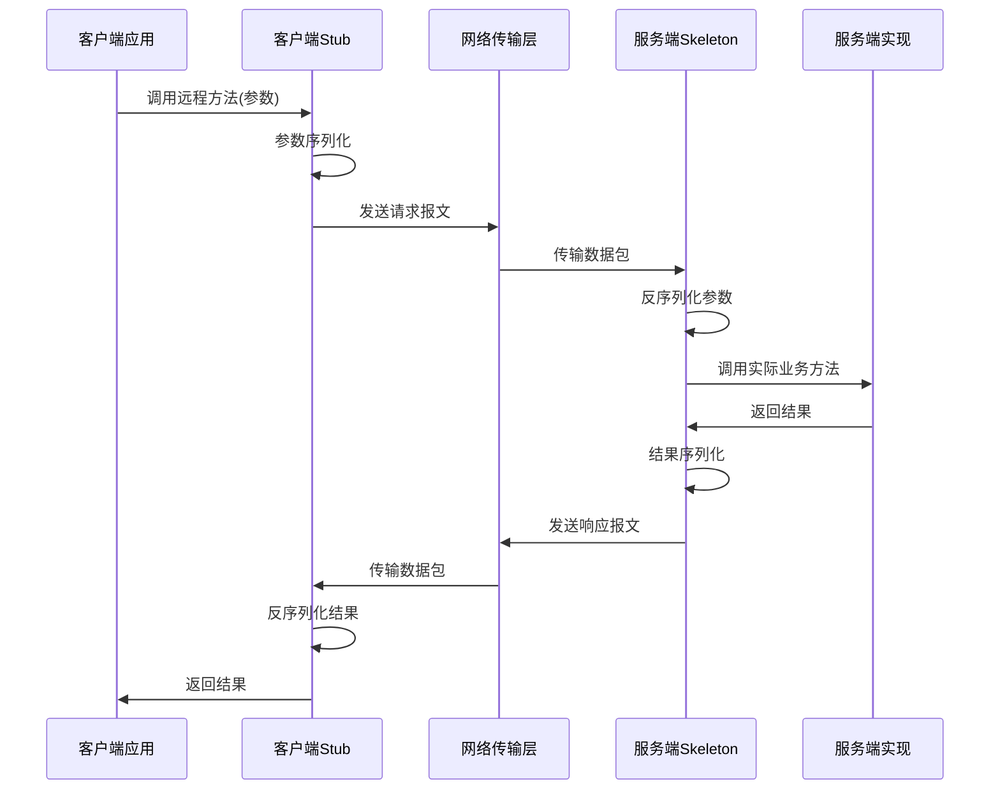
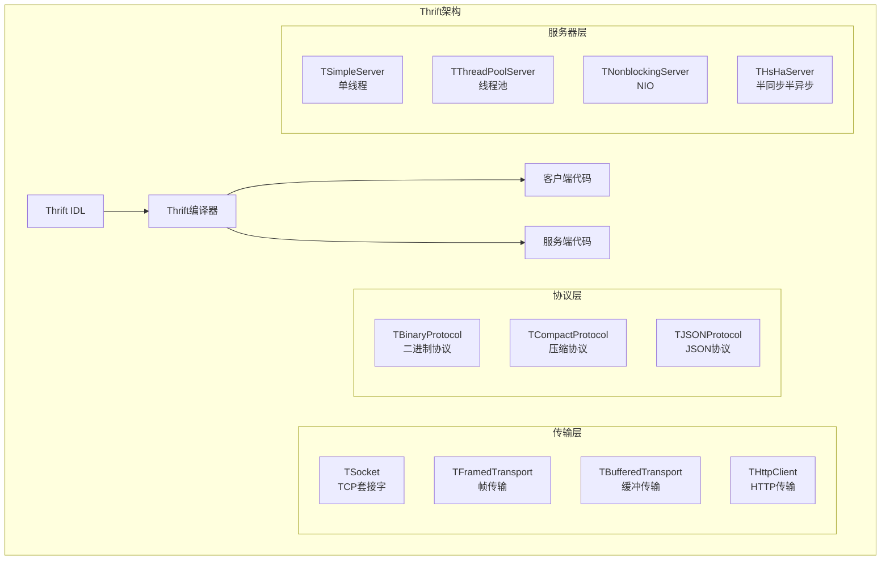
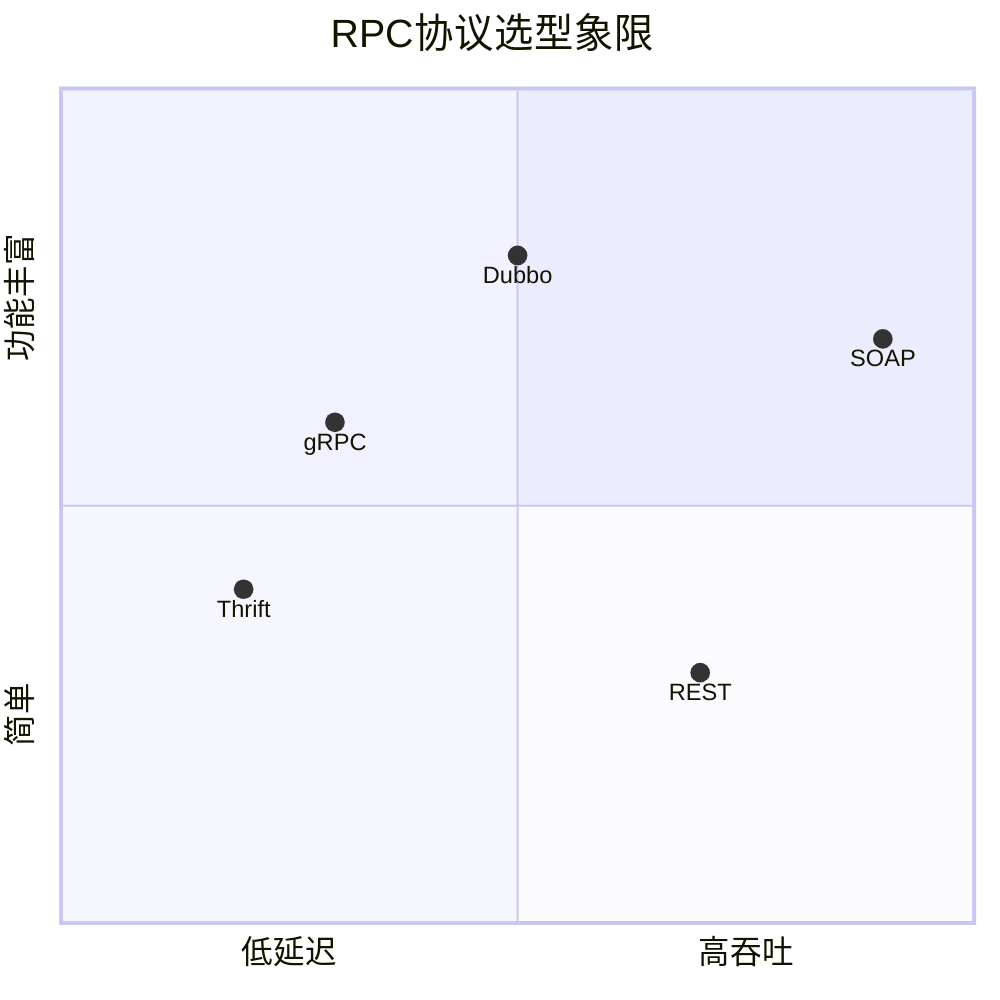
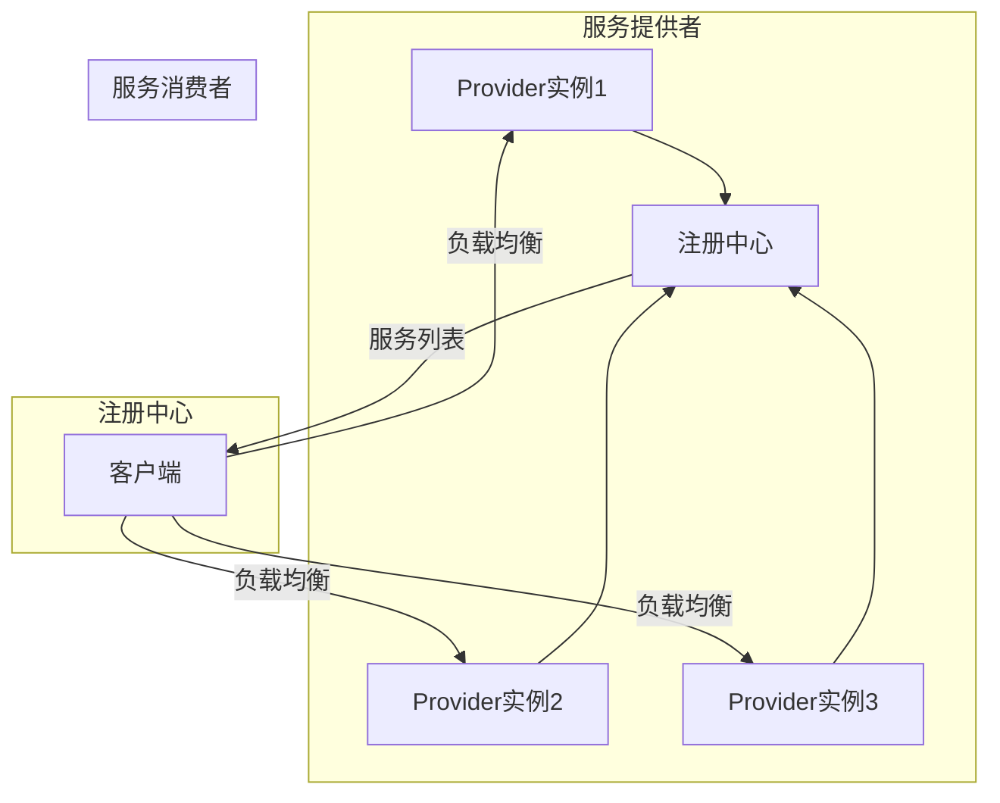
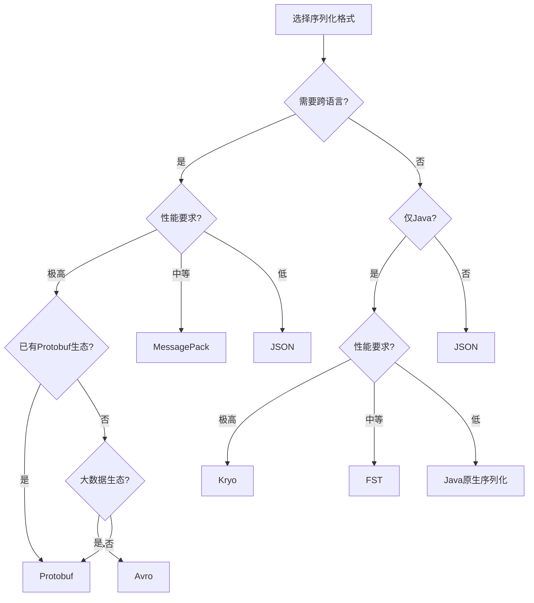
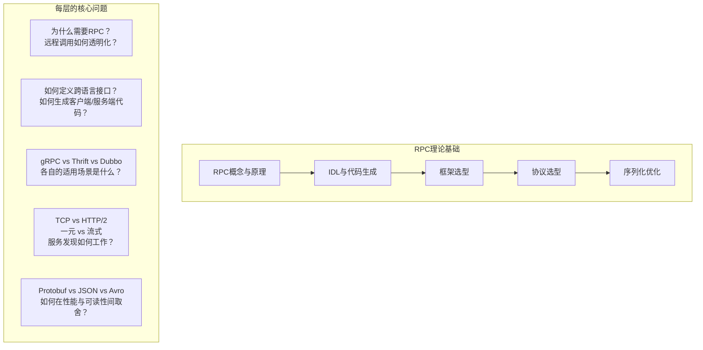

# 理论基础

## 一、什么是RPC

### 1.1 RPC的本质定义

RPC（Remote Procedure Call，远程过程调用）是一种计算机通信协议，其核心思想是让程序员像调用本地函数一样调用远程服务器上的函数。这个概念最早由 Andrew Birman 和 Robert Donald 在1984年的论文《Reliable Communication among Distributed Procedures》中提出，后由 Bruce Jay Nelson 在其博士论文《Remote Procedure Call》（1981年）中系统化阐述。

RPC解决的根本问题是：**在分布式系统中，如何隐藏网络通信的复杂性，让远程调用的体验与本地调用一致**。

用一个最直观的例子说明：

```python
# 本地调用 —— 程序员无需关心函数在哪里执行
result = calculate_tax(income=50000, deductions=8000)

# RPC调用 —— 程序员写的代码几乎相同，但函数实际在远程服务器执行
result = remote_calculate_tax(income=50000, deductions=8000)
```

从程序员的视角看，两段代码几乎没有区别。但后者背后经历了一个复杂的调用链路。

### 1.2 RPC的完整调用流程

一次完整的RPC调用涉及以下步骤：

客户端                        服务端
  |                             |
  |  1. 客户端调用本地Stub       |
  |  2. Stub将参数序列化         |
  |  3. 通过网络发送请求          |
  |  ------------------------>  |
  |  4. 服务端接收并反序列化参数  |
  |  5. 服务端执行实际业务逻辑    |
  |  6. 将结果序列化             |
  |  <------------------------  |
  |  7. 客户端接收并反序列化结果  |
  |  8. 将结果返回给调用者        |
  |                             |

更精确的时序如下：



### 1.3 RPC与REST的核心区别

理解RPC和REST的区别对于架构选型至关重要：

| 对比维度 | RPC | REST |
|---------|-----|------|
| 设计哲学 | "动词"导向，强调"做什么操作" | "名词"导向，强调"操作什么资源" |
| 接口风格 | `getUser(userId)` | `GET /users/{id}` |
| 通信协议 | 通常使用TCP/HTTP2/gRPC | 通常使用HTTP 1.1 |
| 数据格式 | Protobuf/Thrift等二进制格式 | JSON/XML等文本格式 |
| 性能 | 高效，二进制序列化体积小、速度快 | 相对较低，JSON解析开销大 |
| 耦合度 | 较高，客户端需要IDL文件 | 较低，通过URL和HTTP方法约定 |
| 适用场景 | 内部服务间高性能通信 | 对外API、浏览器访问 |
| 缓存支持 | 需要额外实现 | HTTP原生缓存机制 |
| 浏览器支持 | 有限（gRPC-Web需特殊适配） | 原生支持 |
| 学习曲线 | 需要理解IDL和框架 | 直观易懂 |

### 1.4 RPC的发展历程

**第一代（1980s-1990s）：Sun RPC 与 ONC RPC**

Sun Microsystems在1985年推出了Sun RPC（也称ONC RPC），这是最早广泛使用的RPC实现。它基于XDR（External Data Representation）进行数据序列化，主要用于NFS（网络文件系统）等Unix系统间的通信。

**第二代（1990s-2000s）：CORBA 与 DCOM**

CORBA（Common Object Request Broker Architecture）由OMG组织制定，提供了跨语言、跨平台的RPC能力。微软则推出了DCOM（Distributed Component Object Model）。这一时期的RPC框架试图解决异构系统间的互操作性问题，但因复杂度极高而逐渐式微。

**第三代（2000s-2010s）：SOAP/XML-RPC**

SOAP（Simple Object Access Protocol）基于XML进行数据交换，通过WSDL（Web Services Description Language）描述接口。虽然标准化程度高，但XML的冗余性和SOAP的复杂性使其在高并发场景下性能不足。

**第四代（2010s至今）：现代RPC框架**

以gRPC、Thrift、Dubbo为代表的现代RPC框架，采用Protocol Buffers等高效二进制序列化方案，支持HTTP/2多路复用，在性能和易用性之间取得了更好的平衡。

## 二、IDL与代码生成

### 2.1 IDL的定义与作用

IDL（Interface Definition Language，接口定义语言）是RPC框架的核心组成部分。它的作用是提供一种与具体编程语言无关的方式来描述服务接口，包括方法签名、参数类型、返回值类型等。

IDL的三大核心价值：

1. **跨语言互操作性**：同一份IDL文件可以生成Java、Go、Python、C++等多种语言的客户端和服务端代码
2. **接口契约**：IDL文件就是客户端和服务端之间的"合同"，任何一方变更接口都必须先修改IDL
3. **自动代码生成**：避免手动编写序列化/反序列化、网络传输等样板代码

### 2.2 Protocol Buffers（Protobuf）

Protobuf是Google开发的开源序列化机制，也是gRPC默认使用的IDL格式。其文件扩展名为`.proto`。

**基本语法示例：**

```protobuf
syntax = "proto3";

package user;

option java_package = "com.example.user";
option go_package = "example.com/user";

// 定义消息类型（相当于数据结构）
message GetUserRequest {
  int64 user_id = 1;
  string user_name = 2;
}

message User {
  int64 id = 1;
  string name = 2;
  string email = 3;
  int32 age = 4;
  UserRole role = 5;
  repeated string tags = 6;  // repeated表示数组
  map<string, string> metadata = 7;  // map类型
}

enum UserRole {
  USER_ROLE_UNSPECIFIED = 0;  // proto3要求第一个值为0
  USER_ROLE_ADMIN = 1;
  USER_ROLE_MEMBER = 2;
  USER_ROLE_GUEST = 3;
}

// 定义服务接口
service UserService {
  // 一元RPC（最基础的请求-响应模式）
  rpc GetUser(GetUserRequest) returns (User);

  // 服务端流式RPC
  rpc ListUsers(ListUsersRequest) returns (stream User);

  // 客户端流式RPC
  rpc BatchCreateUsers(stream CreateUserRequest) returns (BatchCreateResponse);

  // 双向流式RPC
  rpc Chat(stream ChatMessage) returns (stream ChatMessage);
}

message ListUsersRequest {
  int32 page_size = 1;
  string page_token = 2;
  string role_filter = 3;
}

message CreateUserRequest {
  string name = 1;
  string email = 2;
  int32 age = 3;
  UserRole role = 4;
}

message BatchCreateResponse {
  repeated int64 created_ids = 1;
  int32 failed_count = 2;
}

message ChatMessage {
  string sender = 1;
  string content = 2;
  int64 timestamp = 3;
}
```

**Protobuf的编号规则（Field Number）：**

- 编号1-15只占用1个字节，高频字段应使用这些编号
- 编号16-2047占用2个字节
- 编号一旦确定不可更改，否则会破坏向后兼容性
- 编号19000-19999是Protobuf保留的，不可使用

**Protobuf的兼容性规则：**

| 操作 | 是否向后兼容 | 说明 |
|------|------------|------|
| 新增字段 | ✅ 兼容 | 新字段使用新编号，旧客户端忽略未知字段 |
| 删除字段 | ✅ 兼容 | 旧编号保留，新客户端使用默认值 |
| 修改字段编号 | ❌ 不兼容 | 会导致数据解析错误 |
| 修改字段类型 | ⚠️ 部分兼容 | 仅在特定类型间兼容（如int32和sint32） |
| 将required改为optional | ✅ 兼容 | proto3默认所有字段都是optional |

### 2.3 Apache Thrift IDL

Thrift是Apache基金会的开源RPC框架，最初由Facebook开发。其IDL语法与Protobuf有明显差异。

```thrift
namespace java com.example.user
namespace go user

// 定义枚举
enum UserRole {
  ADMIN = 1,
  MEMBER = 2,
  GUEST = 3
}

// 定义结构体
struct User {
  1: i64 id,
  2: string name,
  3: string email,
  4: i32 age,
  5: UserRole role,
  6: list<string> tags,
  7: map<string, string> metadata
}

// 定义异常类型
exception UserNotFoundException {
  1: i64 user_id,
  2: string message
}

exception PermissionDeniedException {
  1: string required_permission,
  2: string current_role
}

// 定义服务接口
service UserService {
  User getUser(1: i64 userId)
    throws (
      1: UserNotFoundException notFound,
      2: PermissionDeniedException denied
    )

  list<User> listUsers(
    1: i32 pageSize,
    2: string pageToken
  )

  // oneway表示单向调用，客户端不等待响应
  oneway void sendNotification(
    1: i64 userId,
    2: string message
  )
}
```

**Thrift与Protobuf的IDL对比：**

| 特性 | Protobuf | Thrift |
|------|----------|--------|
| 异常定义 | 无原生支持，需自定义Status机制 | 原生支持throws关键字 |
| 修饰符 | proto3无required/optional（默认optional） | 无修饰符，所有字段可选 |
| 命名空间 | 使用package | 使用namespace（可按语言分别指定） |
| 注释风格 | `//` 和 `/* */` | `//` 和 `/* */` |
| 字段编号 | 必须指定，用于二进制编码 | 必须指定，用于二进制编码 |
| 代码生成 | protoc编译器 | thrift编译器 |

### 2.4 IDL代码生成的工作原理

IDL编译器（如`protoc`）的工作流程如下：

```mermaid
flowchart LR
    A[.proto IDL文件] --> B[IDL编译器<br/>protoc/thrift]
    B --> C{选择目标语言}
    C --> D[Java桩代码]
    C --> E[Go桩代码]
    C --> F[Python桩代码]
    C --> G[C++桩代码]
    D --> H[客户端Stub<br/>负责序列化+网络调用]
    D --> I[服务端Skeleton<br/>负责反序列化+调用实现]
```



以Protobuf为例，生成的Go代码大致包含：

```go
// 自动生成的代码 —— 不要手动编辑！

// GetUserRequest的消息结构
type GetUserRequest struct {
    state         protoimpl.MessageState
    sizeCache     protoimpl.SizeCache
    unknownFields protoimpl.UnknownFields
    UserId   int64  `protobuf:"varint,1,opt,name=user_id,json=userId,proto3" json:"user_id,omitempty"`
    UserName string `protobuf:"bytes,2,opt,name=user_name,json=userName,proto3" json:"user_name,omitempty"`
}

// 序列化方法
func (x *GetUserRequest) ProtoReflect() protoreflect.Message { ... }
func (x *GetUserRequest) Marshal() ([]byte, error) { ... }
func (x *GetUserRequest) Unmarshal(b []byte) error { ... }

// gRPC客户端桩
type UserServiceClient interface {
    GetUser(ctx context.Context, in *GetUserRequest, opts ...grpc.CallOption) (*User, error)
}

// gRPC服务端桩
type UserServiceServer interface {
    GetUser(context.Context, *GetUserRequest) (*User, error)
}
```

## 三、主流RPC框架对比

### 3.1 gRPC

gRPC由Google于2015年开源，基于HTTP/2协议和Protocol Buffers序列化。它是最广泛使用的现代RPC框架之一。

**核心特性：**

- **四种通信模式**：一元调用、服务端流、客户端流、双向流
- **跨语言支持**：官方支持C++、Java、Python、Go、Ruby、C#等11种语言
- **HTTP/2多路复用**：单个TCP连接上并发多个请求，减少连接开销
- **拦截器机制**：类似中间件，可实现日志、认证、限流等横切关注点
- **健康检查协议**：标准化的服务健康状态检查
- **负载均衡**：支持客户端负载均衡（pick_first、round_robin）和代理负载均衡
- **Deadline/Timeout**：内置的调用超时传播机制，超时信息随请求链路传递
- **取消传播**：客户端取消请求时，取消信号会沿调用链传播到服务端

**适用场景：**

- 微服务间高性能通信
- 需要流式传输的场景（实时推送、日志采集）
- 多语言异构系统
- 对延迟敏感的内部服务调用

### 3.2 Apache Thrift

Thrift由Facebook于2007年开源，后捐赠给Apache基金会。它是一个完整的RPC解决方案，包含IDL、序列化、传输层和服务器框架。

**核心特性：**

- **自带传输层**：支持Framed、Buffered、TLS等多种传输协议
- **内置服务器模型**：TSimpleServer、TThreadPoolServer、TNonblockingServer、THsHaServer
- **协议多样性**：TBinaryProtocol、TCompactProtocol、TJSONProtocol
- **组合式架构**：协议、传输、服务器可自由组合



**Thrift的Java服务端实现示例：**

```java
// 1. 实现IDL定义的服务接口
public class UserServiceImpl implements UserService.Iface {
    @Override
    public User getUser(long userId) throws UserNotFoundException {
        // 业务逻辑实现
        return userDAO.findById(userId)
            .orElseThrow(() -> new UserNotFoundException(userId, "User not found"));
    }

    @Override
    public List<User> listUsers(int pageSize, String pageToken) {
        return userDAO.findAll(pageSize, pageToken);
    }

    @Override
    public void sendNotification(long userId, String message) {
        // oneway方法，异步发送通知
        notificationService.send(userId, message);
    }
}

// 2. 启动Thrift服务器
public class ThriftServer {
    public static void main(String[] args) throws Exception {
        // 组合: 协议 + 传输 + 服务器
        TProcessor processor = new UserService.Processor<>(new UserServiceImpl());
        
        TNonblockingServerSocket serverSocket = new TNonblockingServerSocket(9090);
        THsHaServer.Args serverArgs = new THsHaServer.Args(serverSocket)
            .processor(processor)
            .protocolFactory(new TCompactProtocol.Factory())
            .transportFactory(new TFramedTransport.Factory())
            .minWorkerThreads(10)
            .maxWorkerThreads(100);

        THsHaServer server = new THsHaServer(serverArgs);
        System.out.println("Thrift server started on port 9090");
        server.serve();
    }
}
```

### 3.3 Apache Dubbo

Dubbo由阿里巴巴于2011年开源，是一个面向Java生态的高性能RPC框架。2017年成为Apache顶级项目后，架构进行了全面升级（Dubbo3），支持多协议和多语言。

**核心特性：**

- **丰富的服务治理能力**：负载均衡、熔断降级、服务鉴权、链路追踪
- **多种注册中心**：ZooKeeper、Nacos、Consul、etcd
- **多协议支持**：Dubbo协议、Triple（兼容gRPC）、REST、Hessian
- **应用级服务发现**：Dubbo3引入应用级注册，降低注册中心压力
- **流量管理**：支持标签路由、灰度发布、流量镜像

**Dubbo的Java Provider示例：**

```java
// 服务接口（与gRPC的IDL角色相同）
public interface UserService {
    User getUser(Long userId);
    List<User> listUsers(int pageSize, String pageToken);
}

// 服务实现
@DubboService(version = "1.0.0", group = "user-service")
public class UserServiceImpl implements UserService {
    @Autowired
    private UserDAO userDAO;

    @Override
    public User getUser(Long userId) {
        return userDAO.findById(userId);
    }

    @Override
    public List<User> listUsers(int pageSize, String pageToken) {
        return userDAO.findAll(pageSize, pageToken);
    }
}

// 消费者端调用
@DubboReference(version = "1.0.0", group = "user-service",
                timeout = 3000, retries = 2)
private UserService userService;

public void handleRequest(Long userId) {
    User user = userService.getUser(userId);  // 像调用本地方法一样
    // ...
}
```

### 3.4 框架选型对比总结

| 维度 | gRPC | Thrift | Dubbo | Spring Cloud |
|------|------|--------|-------|-------------|
| 开发语言 | 多语言 | 多语言 | 主要Java | 主要Java |
| 序列化 | Protobuf | Thrift二进制 | 多种可选 | JSON |
| 传输协议 | HTTP/2 | TCP（可自定义） | Dubbo/Triple | HTTP 1.1 |
| 服务治理 | 需集成其他组件 | 无内置 | 完整内置 | 完整内置 |
| 注册中心 | 需外部实现 | 需外部实现 | Nacos/ZK/... | Eureka/Nacos/... |
| 性能 | ★★★★★ | ★★★★☆ | ★★★★☆ | ★★★☆☆ |
| 学习曲线 | 中等 | 中等 | 较高（功能多） | 较低（Spring生态） |
| 生态成熟度 | 高 | 中 | 高（Java领域） | 高 |
| 社区活跃度 | 高 | 中 | 高 | 高 |
| 适用场景 | 跨语言微服务 | 高性能内部通信 | Java微服务治理 | Spring生态项目 |

## 四、RPC协议选型

### 4.1 协议选型的核心考量

RPC协议选型需要在以下维度间权衡：



### 4.2 传输层协议选择

**TCP vs HTTP/2 vs HTTP/1.1：**

| 协议 | 连接模型 | 多路复用 | 头部压缩 | 服务端推送 | 适用场景 |
|------|---------|---------|---------|-----------|---------|
| TCP | 长连接 | 需自行实现 | 无 | 无 | 极致性能要求 |
| HTTP/2 | 长连接 | 原生支持 | HPACK | 原生支持 | gRPC首选 |
| HTTP/1.1 | Keep-Alive | 不支持 | 无 | 不支持 | REST API |

**长连接 vs 短连接：**

RPC框架普遍采用长连接（TCP或HTTP/2），原因在于：

1. **减少握手开销**：每次TCP三次握手需要1.5个RTT（Round-Trip Time），HTTP/2还需额外TLS握手
2. **连接复用**：多个请求共享同一连接，避免频繁创建/销毁连接
3. **流量控制**：HTTP/2内置流控机制，防止单个连接被淹没

但在以下场景需要考虑短连接或连接池策略：
- 调用频率极低的外部API
- 需要按请求隔离资源的场景
- 防止连接泄露导致的资源耗尽

### 4.3 gRPC的四种通信模式详解

**一元RPC（Unary RPC）：**

最简单的模式，一个请求对应一个响应，类似HTTP的请求-响应模型。

```protobuf
// 定义
rpc GetUser(GetUserRequest) returns (User);

// 调用
User user = client.GetUser(request);
```

**服务端流式RPC（Server Streaming RPC）：**

客户端发送一个请求，服务端返回一个流，可以发送多个消息。适用于数据量大需要分批返回的场景。

```protobuf
rpc ListUsers(ListUsersRequest) returns (stream User);

// 客户端遍历流
Iterator<User> users = client.ListUsers(request);
while (users.hasNext()) {
    User user = users.next();
    // 处理每个用户
}
```

**客户端流式RPC（Client Streaming RPC）：**

客户端发送一个流，服务端返回一个响应。适用于批量上传场景。

```protobuf
rpc BatchCreateUsers(stream CreateUserRequest) returns (BatchCreateResponse);

// 客户端写入流
StreamObserver<CreateUserRequest> observer = client.BatchCreateUsers(responseObserver);
for (CreateUserRequest req : userList) {
    observer.onNext(req);
}
observer.onCompleted();
```

**双向流式RPC（Bidirectional Streaming RPC）：**

双方都可以独立地发送消息，适用于实时聊天、实时数据同步等场景。

```protobuf
rpc Chat(stream ChatMessage) returns (stream ChatMessage);

// 双向流，客户端和服务端可以同时读写
```

### 4.4 服务发现机制

RPC框架的服务发现是连接客户端和服务端的桥梁：



主流注册中心对比：

| 特性 | ZooKeeper | Nacos | Consul | etcd |
|------|-----------|-------|--------|------|
| 一致性协议 | ZAB | Raft | Raft | Raft |
| 健康检查 | 心跳 | 心跳+主动探测 | 心跳+HTTP+TCP | 租约 |
| 配置管理 | ✅ | ✅ | ✅（KV Store） | ✅（KV Store） |
| CAP模型 | CP | AP/CP可切换 | CP | CP |
| 易用性 | 中等 | 高 | 中等 | 中等 |
| 语言支持 | Java/C | 多语言 | 多语言 | 多语言 |

## 五、序列化格式性能对比

### 5.1 序列化的核心指标

序列化是RPC性能的关键瓶颈之一，主要考察以下指标：

1. **序列化速度**：将对象转换为字节流的耗时
2. **反序列化速度**：将字节流还原为对象的耗时
3. **序列化后体积**：字节流的大小，直接影响网络传输开销
4. **跨语言支持**：能否被多种语言的SDK正确解析
5. **可读性**：字节流是否可被人类阅读调试

### 5.2 主流序列化格式对比

以下是一个典型User对象序列化后的对比数据（约10个字段，包含整数、字符串、数组）：

| 格式 | 序列化速度 | 反序列化速度 | 体积 | 可读性 | 跨语言 |
|------|-----------|-------------|------|--------|--------|
| Protobuf | 100%（基准） | 100%（基准） | 100%（基准） | ❌ 二进制 | ✅ |
| Thrift Binary | 95% | 105% | 105% | ❌ 二进制 | ✅ |
| Thrift Compact | 85% | 90% | 80% | ❌ 二进制 | ✅ |
| MessagePack | 80% | 85% | 110% | ❌ 二进制 | ✅ |
| JSON | 30% | 25% | 200% | ✅ 文本 | ✅ |
| XML | 15% | 12% | 300% | ✅ 文本 | ✅ |
| Avro | 110% | 115% | 95% | ❌ 二进制 | ✅ |
| Kryo | 130% | 140% | 90% | ❌ 二进制 | ❌ Java |
| FST | 120% | 125% | 95% | ❌ 二进制 | ❌ Java |

> 注：以上百分比以Protobuf为基准（100%），数值越高表示越好。

### 5.3 各序列化格式详解

**Protocol Buffers**

Protobuf采用"字段编号+类型+值"的编码方式，没有字段名存储在二进制数据中，因此体积小。Varint编码对小整数特别友好：

字段编号1 + int32值150 的编码过程：
1. 字段信息：(field_number << 3) | wire_type = (1 << 3) | 0 = 8
2. Varint编码150：10010110 00000001 → 10010110 00000001
3. 最终结果：2字节（而JSON格式需要 {"id":150} 共8字节）

**MessagePack**

MessagePack被称为"二进制版JSON"，保持JSON的数据模型但用更紧凑的二进制编码。适合需要在已有JSON系统基础上提升性能的场景。

```python
# Python示例
import msgpack

data = {"name": "张三", "age": 30, "scores": [90, 85, 92]}

# 序列化
packed = msgpack.packb(data, use_bin_type=True)
print(f"MsgPack大小: {len(packed)} 字节")    # 约35字节

# 对比JSON
import json
json_str = json.dumps(data, ensure_ascii=False).encode('utf-8')
print(f"JSON大小: {len(json_str)} 字节")      # 约72字节

# 反序列化
unpacked = msgpack.unpackb(packed, raw=False)
print(unpacked)  # {'name': '张三', 'age': 30, 'scores': [90, 85, 92]}
```

**Apache Avro**

Avro采用"Schema驱动"的序列化方式，数据本身不包含字段名和类型信息，完全依赖Schema来解析。这使得它在大数据生态（Hadoop、Kafka）中被广泛使用。

Avro的数据编码：
- 无字段名存储（与Protobuf类似）
- 需要Schema才能解码
- 支持Schema演进（新旧Schema可兼容）
- 特别适合持久化存储和流式处理

**Kryo（Java专用）**

Kryo是Java生态中最快的序列化库之一，常用于Spark、Flink等大数据框架的内部序列化。由于强绑定Java类型系统，无法跨语言使用。

```java
// Kryo序列化示例
Kryo kryo = new Kryo();
kryo.register(User.class);

// 序列化
Output output = new Output(new FileOutputStream("user.dat"));
kryo.writeObject(output, new User(1, "张三"));
output.close();

// 反序列化
Input input = new Input(new FileInputStream("user.dat"));
User user = kryo.readObject(input, User.class);
input.close();
```

### 5.4 序列化选型决策树



### 5.5 序列化性能优化实践

**Protobuf性能调优要点：**

1. **合理使用字段编号**：高频字段使用1-15编号（单字节编码），低频字段使用更大编号
2. **避免过度嵌套**：深层嵌套增加序列化开销，尽量保持扁平结构
3. **使用repeated而非多次序列化**：批量数据用repeated字段，避免多次RPC调用
4. **启用压缩**：在高带宽场景下，对序列化后的字节流进行gzip/snappy压缩

```protobuf
// 不推荐 —— 深层嵌套
message BadDesign {
  Outer outer = 1;
}
message Outer {
  Middle middle = 1;
}
message Middle {
  Inner inner = 1;
}
message Inner {
  string value = 1;
}

// 推荐 —— 扁平结构
message GoodDesign {
  string outer_value = 1;
  string middle_value = 2;
  string inner_value = 3;
}
```

5. **预分配缓冲区**：在高吞吐场景下，使用`CodedOutputStream`预分配缓冲区减少内存分配

```java
// 预分配缓冲区优化
byte[] buffer = new byte[4096];
CodedOutputStream output = CodedOutputStream.newInstance(buffer);

// 高频序列化场景下复用缓冲区
for (User user : users) {
    user.writeTo(output);
}
output.flush();
```

### 5.6 总结

RPC理论基础的核心知识体系可以概括为以下层次：



掌握这五个维度的知识，就建立了RPC框架的完整理论基础，为后续的实战开发和架构设计提供了坚实的认知框架。
