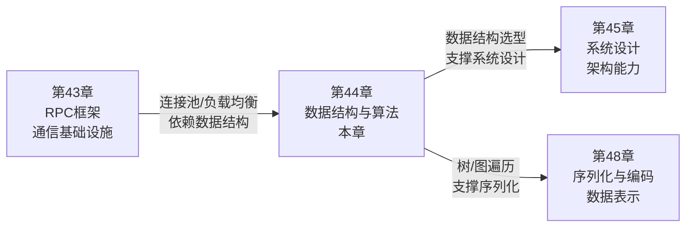

# 第44章 数据结构与算法：软件工程的性能基石与思维引擎 — 章节概览

## 本章定位

第43章探讨了RPC框架——分布式服务通信的核心基础设施。但RPC框架的高性能实现离不开底层数据结构与算法的支撑：连接池用到了链表和哈希表，负载均衡用到了一致性哈希，序列化用到了树和图的遍历，熔断器用到了滑动窗口。**数据结构与算法不是象牙塔里的理论游戏——它们是每一个高效系统背后看不见的骨架。**

很多开发者在实际工作中对数据结构与算法的态度是"面试前突击，工作中忘光"。但当你面对以下场景时，这种"用完即弃"的思维会成为真正的瓶颈：

- 电商商品搜索从5ms飙升到50ms——线性扫描替代了哈希查找
- 数据库慢查询拖垮整个系统——索引选型错误导致全表扫描
- 缓存穿透引发级联故障——不存在的key直接穿透到数据库
- 实时排行榜CPU打满——每次查询都重新排序而不是维护有序结构
- 社交网络推荐接口超时——暴力枚举二度好友导致O(V²)爆炸
- 分布式ID冲突导致数据丢失——随机数替代了有序生成算法

这些问题的答案全部藏在数据结构与算法的选择与设计里。本章的目标不是让你刷完LeetCode拿offer，而是让你**建立完整的"数据结构-算法-工程场景"映射能力**——看到一个性能问题，能直觉地判断是数据结构选错了还是算法复杂度选高了，并给出工程上可落地的优化方案。

## 本章将回答的核心问题

| 问题 | 对应章节 | 为什么重要 |
|------|----------|------------|
| 什么时候用哈希表，什么时候用平衡树？ | 理论基础 (哈希表) | 选错数据结构可能导致O(1)退化为O(n) |
| 哈希碰撞为什么会让性能雪崩？如何解决？ | 理论基础 (哈希表) | 链地址法和开放寻址法的工程取舍 |
| 红黑树的五条性质到底保证了什么？ | 理论基础 (平衡二叉搜索树) | 理解Java TreeMap、Linux CFS等系统组件的底层 |
| 堆操作为什么是O(log n)？Floyd建堆为什么是O(n)？ | 理论基础 (堆与优先队列) | 优先队列是Dijkstra、任务调度、中位数维护的核心 |
| 图该用邻接矩阵还是邻接表？ | 理论基础 (图的表示) | 空间与时间的权衡，决定图算法的性能上限 |
| 复杂度分析的"坑"在哪里？ | 理论基础 (复杂度速查表) | O(1)不一定快，O(n²)不一定慢——常数因子和缓存行为同样关键 |
| 二分搜索为什么总写错？ | 核心技巧 (二分搜索) | 边界条件的细微差异导致完全不同的结果 |
| 动态规划的状态压缩怎么用位运算实现？ | 核心技巧 (状态压缩DP) | TSP、任务分配等NP-hard问题的精确解法 |
| 单调栈为什么能O(n)解决"下一个更大元素"？ | 核心技巧 (单调栈) | 柱状图最大矩形、接雨水等经典问题的最优解 |
| 滑动窗口的本质是什么？ | 核心技巧 (滑动窗口) | 字符串匹配、子数组问题的通用框架 |
| 位运算有哪些工程上真正有用的技巧？ | 核心技巧 (位运算) | 标志位管理、权限控制、高性能计算 |
| LRU缓存在生产环境中怎么实现？ | 实战案例 (LRU缓存) | 缓存系统的淘汰策略直接影响命中率和QPS |
| 拓扑排序如何解决真实的任务依赖问题？ | 实战案例 (拓扑排序) | CI/CD流水线、数据库迁移、编译系统的依赖管理 |
| Bloom Filter如何从根源上防止缓存穿透？ | 实战案例 (Bloom Filter) | 海量数据场景下O(1)判断元素是否存在 |
| 最容易犯的算法错误有哪些？ | 常见误区 | 边界溢出、空数组、错误复杂度评估——真实项目中的隐形炸弹 |

## 知识体系全景图

下面的图展示了本章所有知识点之间的依赖关系和学习路径。箭头表示"学了A才能理解B"：

```mermaid
graph TD
    subgraph 第一阶段：基础理论
        HT["1.1 哈希表<br/>碰撞解决 · 一致性哈希"]
        BST["1.2 平衡二叉搜索树<br/>AVL · 红黑树 · B+树"]
        HPQ["1.3 堆与优先队列<br/>二叉堆 · Floyd建堆"]
        GR["1.4 图的表示<br/>邻接矩阵 · 邻接表"]
        CS["1.5 复杂度速查表<br/>O(1)到O(2ⁿ)全景"]
    end

    subgraph 第二阶段：核心技巧
        BS["2.1 二分搜索<br/>边界处理 · 左闭右开"]
        DP["2.2 动态规划状态压缩<br/>位掩码DP"]
        MS["2.3 单调栈<br/>下一个更大元素"]
        SW["2.4 滑动窗口<br/>定长 · 变长"]
        BT["2.5 位运算技巧<br/>Brian Kernighan"]
    end

    subgraph 第三阶段：实战案例
        LRU["3.1 LRU缓存<br/>哈希表+双向链表"]
        TS["3.2 拓扑排序<br/>任务依赖调度"]
        BF["3.3 Bloom Filter<br/>缓存穿透防护"]
    end

    subgraph 第四阶段：反思巩固
        CM["4. 常见误区<br/>边界 · 复杂度 · 选型"]
        PM["5. 练习方法<br/>刻意练习框架"]
        SM["6. 本章小结<br知识脉络梳理"]
    end

    CS --> HT
    CS --> BST
    CS --> HPQ
    CS --> GR
    HT --> BS
    HT --> LRU
    BST --> MS
    GR --> TS
    GR --> DP
    HPQ --> LRU
    BT --> DP
    BS --> CM
    MS --> SW
    SW --> BF
    LRU --> CM
    TS --> CM

    style 第一阶段 fill:#e8f4fd,stroke:#2196F3
    style 第二阶段 fill:#fff3e0,stroke:#FF9800
    style 第三阶段 fill:#e8f5e9,stroke:#4CAF50
    style 第四阶段 fill:#fce4ec,stroke:#E91E63
```

## 学习目标

完成本章后，你将具备以下能力：

### 理论层面（知道"为什么"）

1. **理解哈希表的完整工作原理**：从哈希函数的选择到碰撞解决策略（链地址法 vs 开放寻址法），从负载因子的工程阈值到Java HashMap链表转红黑树的条件（链表长度>8且桶数>64）
2. **掌握平衡树家族的设计哲学**：为什么AVL树查找最快但工程中更常用红黑树？B+树为什么是磁盘存储的首选？理解旋转操作的代价和收益
3. **理解堆的数学性质**：完全二叉树的数组表示、父节点与子节点的索引关系（parent=i/2, left=2i, right=2i+1）、Floyd建堆算法为何是O(n)而非O(n log n)
4. **区分图的不同表示方式的适用场景**：邻接矩阵适合稠密图（空间O(V²)），邻接表适合稀疏图（空间O(V+E)），理解空间与查询时间的权衡
5. **建立复杂度的直觉判断**：看到代码就能估算时间复杂度，理解O(n log n)和O(n²)在百万级数据下的天壤之别（2×10⁷ vs 10¹²次操作）

### 实践层面（知道"怎么做"）

1. **正确实现二分搜索**：掌握左闭右开区间 `[left, right)` 的写法，能区分查找第一个/最后一个目标值的变体，避免整数溢出（用 `left + (right - left) // 2` 替代 `(left + right) // 2`）
2. **实现LRU缓存**：用哈希表实现O(1)查找 + 双向链表维护访问顺序，这是面试和工程中的高频场景
3. **运用单调栈解决区间问题**：识别"下一个更大/更小元素"模式，在O(n)时间内解决柱状图最大矩形、接雨水等经典问题
4. **使用滑动窗口框架**：掌握变长窗口的通用模板（右指针扩展 → 左指针收缩），处理字符串匹配、子数组和等常见问题
5. **实现位掩码DP**：将集合状态编码为整数，用位运算枚举子集，解决TSP、任务分配等NP-hard问题的精确解

### 思维层面（形成"直觉"）

1. **看到性能问题就能判断是数据结构问题还是算法问题**：是选错了容器（该用哈希表用了数组），还是算法复杂度选高了（该用O(n log n)用了O(n²)）
2. **看到数据特征就能选对数据结构**：有序 → 平衡树/跳表，频繁查找 → 哈希表，需要优先级 → 堆，图结构 → 邻接表
3. **看到问题模式就能匹配算法范式**：最优子结构 → 动态规划，局部最优 → 贪心，穷举约束 → 回溯，区间最值 → 单调栈

## 前置知识

本章假设你具备以下基础。如果某些领域不熟悉，建议先补课再学习：

| 知识领域 | 要求程度 | 具体内容 | 补课建议 |
|----------|----------|----------|----------|
| Python编程 | 熟练 | 列表/字典/集合操作、类与对象、递归基础 | 任意Python教程前6章 |
| 基本数据结构 | 了解 | 数组、链表、栈、队列的基本概念和操作 | 《算法图解》前4章 |
| 递归与循环 | 熟练 | 递归三要素（基线条件、递推关系、状态传递），for/while循环 | 不需要精通，跟着案例操作即可 |
| 时间复杂度 | 了解 | 大O表示法的基本含义，能区分O(1)、O(n)、O(n²) | 本章理论基础的复杂度速查表会系统讲解 |
| 位运算基础 | 了解 | AND、OR、XOR、NOT、左移右移的基本含义 | 核心技巧章节有完整参考表 |

> **提示**：前置知识的"了解"级别意味着你只需要有印象即可，本章会在需要时做必要的补充说明。"熟练"级别则建议确实掌握，否则学习过程中会频繁卡壳。

## 内容导航

### 第一阶段：理论基础（建立心智模型）

| 文件 | 主题 | 核心内容 | 建议时长 |
|------|------|----------|----------|
| 01-一哈希表 | 哈希表的工程实现 | 哈希函数选择、链地址法vs开放寻址法、负载因子控制、Java HashMap红黑树化阈值、一致性哈希与虚拟节点 | 1.5小时 |
| 02-二平衡二叉搜索树 | 平衡树家族全景 | BST退化问题、AVL严格平衡vs红黑树近似平衡、五条颜色性质、B+树磁盘优化、旋转操作详解 | 2小时 |
| 03-三堆与优先队列 | 堆的数学与工程 | 完全二叉树数组表示、Floyd O(n)建堆、sift-up/sift-down操作、三堆中位数维护、优先队列应用场景 | 1.5小时 |
| 04-四图的表示 | 图的存储与建模 | 图的形式化定义、分类体系（有向/无向/加权）、邻接矩阵完整实现、邻接表实现、稠密vs稀疏的选择 | 2小时 |
| 05-五复杂度速查表 | 复杂度全景参考 | O(1)到O(2ⁿ)每级的实际含义、10⁶数据量下的操作数对比、常数因子和缓存行为的影响、常见算法复杂度汇总 | 1小时 |

### 第二阶段：核心技巧（掌握解题框架）

| 文件 | 主题 | 核心内容 | 建议时长 |
|------|------|----------|----------|
| 01-一二分搜索的边界处理 | 搜索边界的艺术 | 闭区间vs开区间两种范式、查找第一个/最后一个目标值、整数溢出规避、Python/Go双语实现 | 1小时 |
| 02-二动态规划状态压缩 | 位掩码DP | 集合的二进制编码、子集枚举技巧 `(sub-1) & state`、TSP精确解、任务分配问题、滚动数组优化 | 1.5小时 |
| 03-三单调栈技巧 | 单调栈三大模式 | 单调递减栈（下一个更大元素）、单调递增栈（下一个更小元素）、摊还O(n)分析、柱状图/接雨水/股票跨度 | 1.5小时 |
| 04-四滑动窗口 | 窗口滑动框架 | 四要素（边界/状态/扩展/收缩）、定长窗口vs变长窗口、窗口状态类型（求和/频率/最值/有效性）、通用模板 | 1.5小时 |
| 05-五位运算技巧 | 位运算工程应用 | 位运算参考表、奇偶判断、2的幂判断、Brian Kernighan算法、无临时变量交换、标志位管理 | 0.5小时 |

### 第三阶段：实战案例（从理论到生产）

| 文件 | 主题 | 核心内容 | 建议时长 |
|------|------|----------|----------|
| 01-案例一LRU缓存 | 缓存淘汰实战 | 电商场景10K QPS下的数据库查询优化、哈希表+双向链表实现、哨兵节点技巧、Go语言完整实现 | 1.5小时 |
| 02-案例二拓扑排序 | 任务依赖调度 | DAG建模、Kahn算法（入度法）、DFS后序反转法、循环依赖检测、CI/CD流水线编排 | 1小时 |
| 03-案例三Bloom Filter | 缓存穿透防护 | 位数组+多哈希函数原理、假阳性概率计算、Redis布隆过滤器配置、与布谷鸟过滤器的对比 | 1小时 |

### 第四阶段：反思与巩固

| 文件 | 主题 | 核心内容 | 建议时长 |
|------|------|----------|----------|
| 04-常见误区 | 八大认知陷阱 | 理论最优≠工程最优、边界条件的致命细节、二分搜索溢出、DP状态定义错误、贪心vs回溯的误判、自实现vs标准库 | 1.5小时 |
| 05-练习方法 | 刻意练习框架 | 概念理解（画图/费曼技巧）、动手实现（从暴力到优化）、复杂度验证（计时对比）、错题本建立 | 2小时 |
| 06-本章小结 | 知识脉络梳理 | 核心概念图谱、速查表、延伸阅读、下一步学习路径 | 0.5小时 |

## 预计学习时间

| 阶段 | 内容 | 预计时间 | 说明 |
|------|------|----------|------|
| 理论基础 | 5个小节 | 8-9小时 | 这是本章的地基，哈希表和平衡树建议精读并手写实现 |
| 核心技巧 | 5个小节 | 6小时 | 每个技巧都要在LeetCode或实际项目中验证 |
| 实战案例 | 3个案例 | 3.5小时 | 跟着案例操作，修改参数观察性能变化 |
| 反思巩固 | 3个小节 | 4小时 | 练习方法是投入时间最多的部分，但也是收获最大的 |
| **总计** | **16个小节** | **21-24小时** | **建议分5-7天完成，每天3-4小时** |

> **学习建议**：不要试图一次性从头读到尾。建议的节奏是：先读理论基础的哈希表和复杂度速查表，建立基本框架后，再按需深入后续内容。理论和技巧可以交替学习——学完"哈希表"理论后立刻看"LRU缓存"案例，趁热打铁效果最好。

## 本章在整个知识体系中的位置



第44章建立的数据结构与算法能力将直接服务于后续所有章节：

- **哈希表与一致性哈希** → 第45章系统设计中的分片策略、负载均衡算法
- **平衡树与B+树** → 数据库索引原理、存储引擎设计
- **图的表示与遍历** → 第48章序列化中的图编码、社交网络分析
- **堆与优先队列** → 任务调度系统、实时排行榜、分布式协调
- **动态规划与贪心** → 资源分配优化、路径规划、缓存策略设计
- **滑动窗口与单调栈** → 流量控制、限流器实现、日志分析

跳过本章直接学后面的章节，就像不学乐理直接弹爵士——可能能模仿，但遇到问题时无法从根本上理解为什么某个数据结构在你的场景下比另一个快100倍。

## 学习方法建议

### 有效的学习方式

1. **手写实现每个数据结构**：不要只看伪代码。亲手用Python或Go实现哈希表、红黑树、LRU缓存。调试bug的过程就是理解原理的过程
2. **画状态转换图**：红黑树的旋转、单调栈的入栈出栈、滑动窗口的扩展收缩——用图画出来比在脑子里转清楚10倍
3. **复杂度实测对比**：同一问题用O(n²)暴力解和O(n log n)优化解分别跑一次，用`time`命令对比真实耗时。亲眼看到数字变化比看结论有效10倍
4. **费曼技巧**：尝试向一个不了解算法的人解释"为什么红黑树比AVL树更适合工程"。如果解释不清楚，说明你还没真正理解
5. **建立错题本**：把写错的二分搜索边界、溢出的DP状态、搞混的单调栈方向记录下来，定期复习

### 避免的学习方式

1. **不要只背模板不理解原理**：滑动窗口的模板谁都能背，但不知道"为什么要收缩左指针"就无法处理变形问题
2. **不要跳过理论直接看案例**：没有哈希表原理基础的LRU实现只是抄代码，换个场景就不知道怎么优化
3. **不要追求一次性全懂**：红黑树的插入删除旋转需要反复琢磨，第一遍能理解60%就是正常的
4. **不要忽视工程细节**：理论上O(1)的哈希表，如果负载因子过高退化到O(n)；理论上O(n log n)的快速排序，如果每次都选到最差基准退化到O(n²)

## 本章核心公式速查

在后续学习中，以下公式和数据会反复出现，建议在学习过程中逐步记忆：

| 公式/数据 | 含义 | 应用场景 |
|-----------|------|----------|
| O(1) vs O(n) vs O(n log n) vs O(n²) | 10⁶数据量下的操作数：1 vs 10⁶ vs 2×10⁷ vs 10¹² | 选择算法时的第一道筛选门槛 |
| 哈希表负载因子 α = n/m | n个元素映射到m个桶 | α<0.75时性能良好，α>0.75时必须扩容 |
| 红黑树最长路径 ≤ 2 × 最短路径 | 近似平衡保证查找O(log n) | 理解为什么红黑树比AVL树旋转更少 |
| Floyd建堆：O(n) | 从最后一个非叶节点向前sift-down | 比逐个插入的O(n log n)更快 |
| 堆索引关系：parent=i//2, left=2i, right=2i+1 | 完全二叉树的数组表示 | 堆操作的基础 |
| Bloom Filter假阳性率 ≈ (1-e^(-kn/m))^k | k个哈希函数、m位数组、n个元素 | 设计布隆过滤器时计算所需的位数组大小 |
| 单调栈摊还O(n) | 每个元素最多入栈出栈各一次 | 证明单调栈的时间复杂度 |
| 滑动窗口O(n) | 双指针各遍历数组一次 | 证明滑动窗口的时间复杂度 |
| 位掩码DP：O(2ⁿ × n) | 枚举所有子集状态 | TSP、任务分配等NP-hard问题的精确解上限 |

## 延伸阅读

如果你想在本章基础上进一步深入数据结构与算法的世界：

- **入门**：《算法图解》（Aditya Bhargava）— 图文并茂，适合建立直觉
- **系统学习**：《算法导论》（Cormen et al.）— 理论最严谨，覆盖所有经典算法
- **工程实战**：《算法（第4版）》（Sedgewick）— Java实现，兼顾理论与代码
- **面试与思维**：《剑指Offer》/ LeetCode Hot 100 — 精选高频题目，建立题型模式识别
- **进阶**：《ertaerta》（Skiena）— 算法设计手册，侧重问题建模而非纯理论
- **在线**：[VisuAlgo](https://visualgo.net/) — 数据结构和算法的可视化动画
- **在线**：[CP-Algorithms](https://cp-algorithms.com/) — 竞赛编程视角的算法百科
