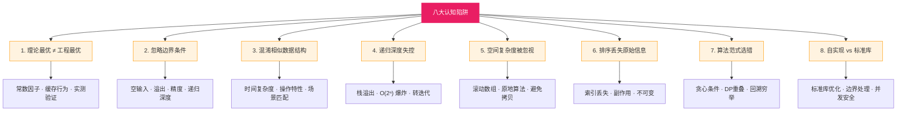
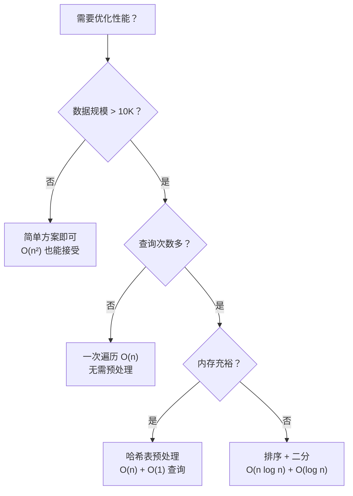
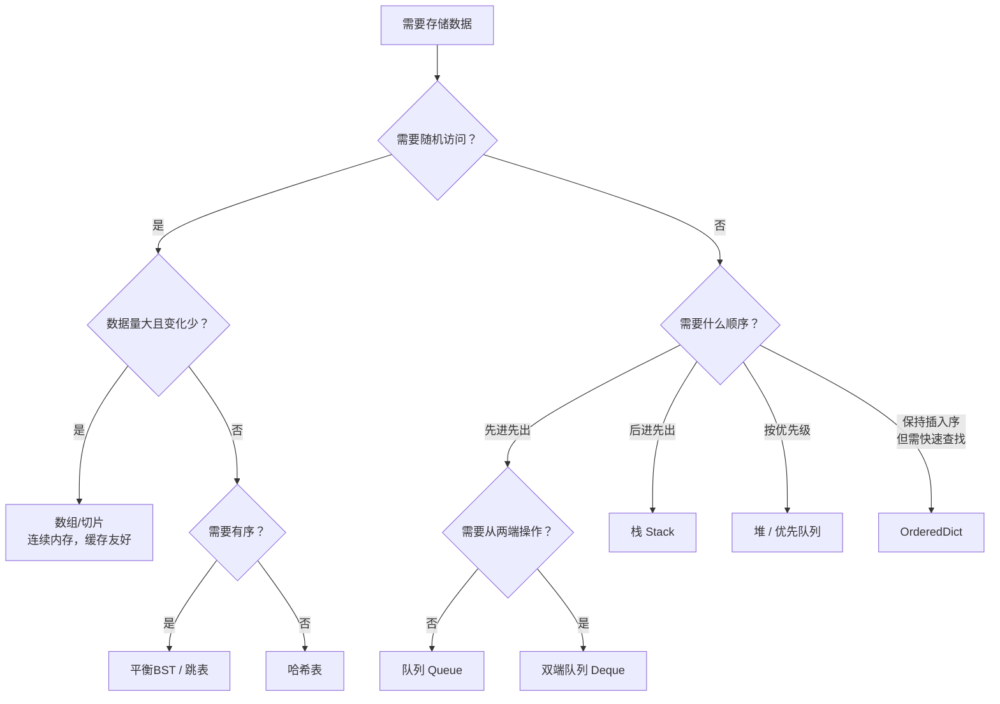
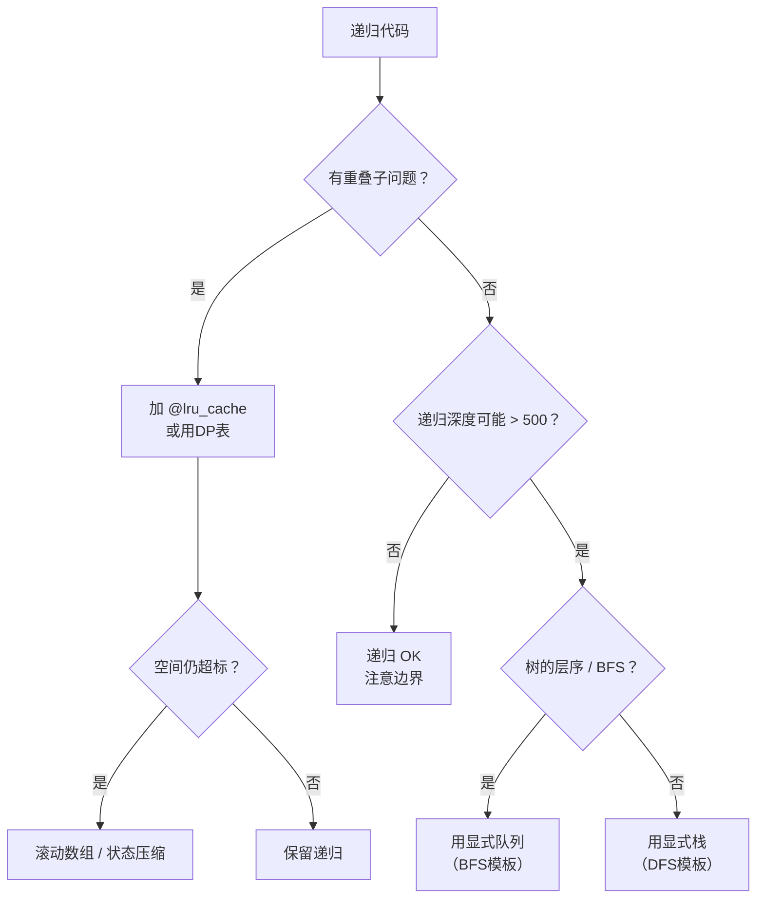
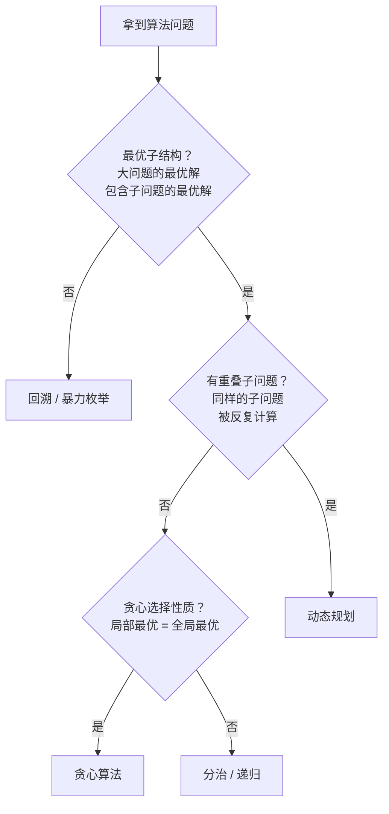

## 数据结构与算法常见误区

在学习和应用数据结构与算法时，很多开发者容易陷入认知陷阱。这些误区不仅出现在初学者身上——即使是有多年经验的工程师，也常常在项目压力下不知不觉地踩坑。本节系统梳理八大认知陷阱，从**理论最优≠工程最优**到**自实现vs标准库的选择**，每个误区都配有真实项目场景、问题代码、修复方案和工程最佳实践。

> **本节定位**：作为第44章"反思巩固"阶段的核心内容，本节的目标是帮你建立一套**防错机制**——在写代码之前就能识别风险，在Review时能快速发现问题，在系统上线后能从日志中反推数据结构选型错误。

### 误区全景图



---

### 误区一：理论最优 ≠ 工程最优

**错误想法**：总是追求理论上的最低时间复杂度，认为 O(n) 一定比 O(n²) 好。

**为什么这是陷阱**：大O表示法省略了常数因子和低阶项，但在工程实践中，这些"被省略的部分"可能比"被保留的部分"影响更大。一个 O(n) 的算法如果每次操作涉及大量内存分配和缓存未命中，实际耗时可能远超一个 O(n²) 但缓存友好的算法。

**真实场景**：

| 场景 | 理论更优方案 | 实际更优方案 | 原因 |
|------|-------------|-------------|------|
| 小数组排序（n < 32） | 归并排序 O(n log n) | 插入排序 O(n²) | 插入排序常数因子小，无递归开销 |
| 缓存行遍历 | 哈希表 O(1) 查找 | 数组 O(n) 顺序扫描 | 数组连续内存，CPU缓存命中率高 |
| 字符串拼接 | 每次 + 拼接 | StringBuilder / join | + 每次创建新字符串对象，O(n²) 内存 |
| 大量小对象 | 自定义内存池 O(1) | 标准容器 O(1) amortized | GC调优比手动管理更可靠 |
| 图遍历 BFS | 邻接矩阵 O(V²) | 邻接表 O(V+E) | 稀疏图中 E << V² |

**代码对比**：

```python
import time

# 场景：10万元素中查找100个目标
# 方案A：哈希表 —— 理论 O(n) 建表 + O(1) 查找
# 方案B：排序+二分 —— 理论 O(n log n) 排序 + O(log n) 查找
# 方案C：暴力线性扫描 —— 理论 O(n) 每次查找

import random
data = [random.randint(0, 10**7) for _ in range(100_000)]
targets = random.sample(data, 100)

# 方案A：哈希表
start = time.time()
hash_set = set(data)  # O(n) 建表
result_a = [x for x in targets if x in hash_set]  # O(1) 每次
time_a = time.time() - start

# 方案B：排序 + 二分
start = time.time()
sorted_data = sorted(data)  # O(n log n)
import bisect
result_b = []
for t in targets:
    idx = bisect.bisect_left(sorted_data, t)
    if idx < len(sorted_data) and sorted_data[idx] == t:
        result_b.append(t)
time_b = time.time() - start

# 方案C：暴力（100次线性扫描）
start = time.time()
result_c = [x for x in targets if x in data]  # O(n) 每次, ×100
time_c = time.time() - start

print(f"哈希表: {time_a:.4f}s")   # ~0.005s
print(f"排序+二分: {time_b:.4f}s")  # ~0.015s
print(f"暴力扫描: {time_c:.4f}s")   # ~0.5s
```

**工程决策框架**：



**纠正原则**：

1. **先写暴力解，再用 profiler 验证瓶颈**——不要凭直觉猜测哪里慢
2. **实测 > 理论分析**：用 `timeit`（Python）或 `Benchmark`（Go/Java）测量真实耗时
3. **考虑常数因子**：O(n) 的递归解可能比 O(n) 的迭代解慢 10 倍（函数调用开销）
4. **考虑缓存行为**：数组连续访问 vs 链表跳跃访问，在百万级数据下差距可达 5-10 倍
5. **小规模数据不要预处理**：如果 n < 1000，暴力 O(n²) 通常 < 1ms，无需优化

---

### 误区二：忽略边界条件

**错误想法**：只考虑正常输入（非空、合法、典型规模），忽略极端情况。

**为什么这是陷阱**：生产环境中，最致命的 bug 往往不在"正常路径"上——而在用户输入空字符串、数据库返回空结果、配置读取失败、并发竞争导致中间状态等异常分支。一次线上事故的根因分析中，80%的严重 bug 都与边界条件处理缺失有关。

**边界条件分类清单**：

| 类别 | 具体场景 | 未处理的后果 | 正确处理方式 |
|------|---------|-------------|-------------|
| 空输入 | 空数组、空字符串、空链表、None | IndexError / NullPointerException | 前置检查 + 合理默认值 |
| 单元素 | 数组只有一个元素 | 某些循环不执行，返回错误结果 | 特殊分支或循环条件兜底 |
| 全部相同 | 所有元素值一样 | 去重逻辑失效，排序不稳定 | 确保逻辑对重复值正确 |
| 目标不存在 | 搜索无结果 | 返回 None vs 抛异常 vs 返回哨兵值 | 明确约定返回值语义 |
| 整数边界 | INT_MAX、INT_MIN、0、负数 | 加法溢出、除零、负数取模 | 用大整数类型或溢出检查 |
| 浮点精度 | 0.1 + 0.2 ≠ 0.3 | 等号比较永远 false | 用 epsilon 比较或整数化 |
| 递归深度 | n > 1000（Python 默认限制） | RecursionError 崩溃 | 转迭代或增大递归限制 |
| 并发状态 | 读写竞争、中间状态可见 | 数据不一致、死锁 | 加锁或使用原子操作 |

**代码示例——二分搜索的边界陷阱**：

```python
def binary_search_v1(nums, target):
    """常见错误写法：三个隐蔽 bug"""
    left, right = 0, len(nums)  # Bug1: right 初始化为 len(nums)
    while left < right:
        mid = (left + right) // 2  # Bug2: 可能整数溢出（大数组）
        if nums[mid] == target:
            return mid
        elif nums[mid] < target:
            left = mid + 1
        else:
            right = mid - 1  # Bug3: 与 right = len(nums) 不一致！
    return -1


def binary_search_v2(nums, target):
    """正确写法：左闭右闭区间 [left, right]"""
    if not nums:
        return -1
    left, right = 0, len(nums) - 1
    while left <= right:  # 闭区间用 <=
        mid = left + (right - left) // 2  # 防溢出
        if nums[mid] == target:
            return mid
        elif nums[mid] < target:
            left = mid + 1
        else:
            right = mid - 1  # 闭区间：right = mid - 1
    return -1


def binary_search_v3(nums, target):
    """正确写法：左闭右开区间 [left, right)"""
    if not nums:
        return -1
    left, right = 0, len(nums)  # 右开区间
    while left < right:  # 开区间用 <
        mid = left + (right - left) // 2
        if nums[mid] == target:
            return mid
        elif nums[mid] < target:
            left = mid + 1
        else:
            right = mid  # 开区间：right = mid（不是 mid-1！）
    return -1


# 边界测试用例
test_cases = [
    ([], 1, -1),           # 空数组
    ([1], 1, 0),           # 单元素，命中
    ([1], 2, -1),          # 单元素，不命中
    ([1, 1, 1, 1], 1, -1 or 0),  # 全部相同
    ([1, 2, 3, 4, 5], 3, 2),     # 正常情况
    ([1, 2, 3, 4, 5], 6, -1),    # 目标不存在
    ([1, 2, 3, 4, 5], 1, 0),     # 目标在左边界
    ([1, 2, 3, 4, 5], 5, 4),     # 目标在右边界
]

for nums, target, expected in test_cases:
    result = binary_search_v2(nums, target)
    status = "✓" if result == expected else f"✗ (expected {expected})"
    print(f"  search({nums}, {target}) = {result} {status}")
```

**边界条件检查清单（Code Review 用）**：

- [ ] 函数参数为 None/空值时是否安全？
- [ ] 数组访问是否有越界风险？
- [ ] 循环边界是 `<` 还是 `<=`？与区间语义是否一致？
- [ ] 整数运算是否可能溢出？
- [ ] 递归深度是否可能超过限制？
- [ ] 浮点数比较是否使用了 epsilon？
- [ ] 返回值语义是否明确（None vs -1 vs 空列表）？
- [ ] 并发环境下共享状态是否安全？

---

### 误区三：混淆相似数据结构

**错误想法**：数组、链表、栈、队列可以随意替换，"反正都是存数据的"。

**为什么这是陷阱**：不同数据结构的性能特征差异巨大，选错数据结构会导致性能从 O(1) 退化到 O(n)，甚至从 O(1) 退化到 O(n²)。更隐蔽的是，某些退化只在特定操作模式下才会触发，测试时可能完全正常，线上高并发时才暴露。

**数据结构性能全景对比**：

| 数据结构 | 按索引访问 | 按值查找 | 头部插入 | 尾部插入 | 中间插入 | 有序遍历 | 适用场景 |
|---------|-----------|---------|---------|---------|---------|---------|---------|
| 数组（list） | O(1) | O(n) | O(n) | O(1)* | O(n) | O(n log n) 排序后 | 随机访问为主 |
| 链表 | O(n) | O(n) | O(1) | O(1)** | O(1)*** | O(n) | 频繁插入删除 |
| 栈（Stack） | — | O(n) | O(1) push | — | — | — | LIFO: 函数调用/撤销 |
| 队列（Queue） | — | O(n) | — | O(1) enqueue | — | — | FIFO: BFS/任务调度 |
| 双端队列 | — | O(n) | O(1) | O(1) | — | — | 滑动窗口最大值 |
| 哈希表 | O(1) | O(1) | O(1) | O(1) | O(1) | 不支持 | 快速查找/计数 |
| 平衡BST | O(log n) | O(log n) | O(log n) | O(log n) | O(log n) | O(n) 中序 | 有序数据 + 查找 |
| 跳表 | O(log n) | O(log n) | O(log n) | O(log n) | O(log n) | O(n) | 并发有序（Redis ZSET） |
| 堆 | — | O(n) | — | — | O(log n) 插入 | O(n log n) | 优先级/Top-K |

> \* Python list 尾部 append 摊还 O(1)，但触发扩容时为 O(n)
> \** 链表尾部插入：无尾指针时 O(n)，有尾指针时 O(1)
> \*** 已知插入位置的链表节点插入 O(1)

**最经典的陷阱：用 list 模拟队列**

```python
import time
from collections import deque

n = 100_000

# 错误：用 list 的 pop(0) 模拟队列出队
queue_list = list(range(n))
start = time.time()
while queue_list:
    queue_list.pop(0)  # O(n) —— 每次移动所有元素
time_list = time.time() - start

# 正确：用 deque
queue_deque = deque(range(n))
start = time.time()
while queue_deque:
    queue_deque.popleft()  # O(1) —— 直接修改头指针
time_deque = time.time() - start

print(f"list.pop(0): {time_list:.3f}s")   # ~0.15s
print(f"deque.popleft(): {time_deque:.3f}s")  # ~0.001s
# 差距约 150 倍！在数据量更大时差距更显著
```

**另一个隐蔽陷阱：dict vs OrderedDict vs Counter**

```python
from collections import OrderedDict, Counter

# Python 3.7+ dict 已经保证插入顺序，但缺少以下功能：
# 1. move_to_end() —— 调整元素位置（LRU缓存需要）
# 2. 重排序 —— 按值排序

d = {"apple": 3, "banana": 1, "cherry": 2}

# Counter 的隐藏陷阱：减到0后依然存在于字典中
c = Counter({"a": 3, "b": 0})
print("b" in c)  # True! 零计数的元素仍然"存在"
print(c["c"])     # 0 —— 不存在的key也返回0（不是 KeyError）

# OrderedDict 才支持 move_to_end
od = OrderedDict([("a", 1), ("b", 2), ("c", 3)])
od.move_to_end("a")  # 把 "a" 移到最后
print(list(od.keys()))  # ['b', 'c', 'a']
```

**选型决策树**：



---

### 误区四：递归深度失控

**错误想法**：递归代码简洁优雅，优先使用递归来解决问题。

**为什么这是陷阱**：递归的每一层调用都会消耗栈空间（保存返回地址、局部变量、参数），Python 默认递归深度限制为 1000 层。更严重的是，某些递归的时间复杂度是指数级的——看似优美的代码背后是 O(2ⁿ) 的性能灾难。

**三类递归风险**：

| 风险类型 | 触发条件 | 表现 | 解决方案 |
|---------|---------|------|---------|
| 栈溢出 | 递归深度 > 1000 | RecursionError 崩溃 | 转迭代 / 增大递归限制 |
| 指数爆炸 | 重叠子问题未记忆化 | 运行时间随 n 指数增长 | 动态规划 / 记忆化搜索 |
| 尾递归无法优化 | Python 不支持 TCO | 即使是尾递归也会栈溢出 | 手动转循环 |

**案例1：斐波那契——指数爆炸的教科书**

```python
import time
from functools import lru_cache

# 错误：朴素递归 —— 时间 O(2ⁿ)，空间 O(n)
def fib_naive(n):
    if n <= 1:
        return n
    return fib_naive(n - 1) + fib_naive(n - 2)

# 正确1：记忆化递归 —— 时间 O(n)，空间 O(n)
@lru_cache(maxsize=None)
def fib_memo(n):
    if n <= 1:
        return n
    return fib_memo(n - 1) + fib_memo(n - 2)

# 正确2：迭代 DP —— 时间 O(n)，空间 O(1)
def fib_iter(n):
    if n <= 1:
        return n
    a, b = 0, 1
    for _ in range(2, n + 1):
        a, b = b, a + b
    return b

# 性能对比
for n in [10, 30, 35, 40]:
    start = time.time()
    fib_naive(n)
    t_naive = time.time() - start

    start = time.time()
    fib_memo(n)
    t_memo = time.time() - start

    start = time.time()
    fib_iter(n)
    t_iter = time.time() - start

    print(f"n={n:2d}: naive={t_naive:.4f}s  memo={t_memo:.6f}s  iter={t_iter:.6f}s")

# n=30: naive=0.27s   memo=0.000005s  iter=0.000003s
# n=35: naive=3.05s   memo=0.000003s  iter=0.000002s
# n=40: naive=37.1s   memo=0.000004s  iter=0.000002s
```

**案例2：链表操作——长链表栈溢出**

```python
# 错误：递归反转链表 —— 10万元素就崩
def reverse_recursive(head):
    if not head or not head.next:
        return head
    new_head = reverse_recursive(head.next)  # 每层占用栈帧
    head.next.next = head
    head.next = None
    return new_head

# 正确：迭代反转 —— 任意长度安全
def reverse_iterative(head):
    prev = None
    curr = head
    while curr:
        next_node = curr.next
        curr.next = prev
        prev = curr
        curr = next_node
    return prev

# 正确：手动用栈模拟递归（深度可控）
def reverse_with_explicit_stack(head):
    if not head:
        return None
    stack = []
    curr = head
    while curr:
        stack.append(curr)
        curr = curr.next
    new_head = stack.pop()
    curr = new_head
    while stack:
        node = stack.pop()
        curr.next = node
        curr = curr.next
    curr.next = None
    return new_head
```

**递归转迭代的通用模式**：



**何时递归是合理的**：
- 树的遍历（前序/中序/后序），深度通常 O(log n)
- 分治算法（归并排序、快排），深度 O(log n)
- 回溯搜索，解空间需要深度优先探索
- 图的 DFS，配合 visited 集合防止重复访问

---

### 误区五：忽视空间复杂度

**错误想法**：只关注时间复杂度，"时间就是金钱，空间很便宜"。

**为什么这是陷阱**：空间复杂度不仅影响内存占用，还会通过以下机制间接影响时间性能：
- **GC 压力**：大量临时对象触发频繁垃圾回收，暂停整个程序
- **缓存失效**：数据散布在堆的不同位置，CPU 缓存行命中率降低
- **磁盘交换**：内存不足时操作系统将数据换入换出磁盘，速度下降 10⁵ 倍
- **O(n²) 空间本身可能比 O(n²) 时间更致命**：10⁸ 个 int 占 ~400MB，可能直接 OOM

**空间优化技术对比**：

| 技术 | 适用场景 | 优化效果 | 代价 |
|------|---------|---------|------|
| 滚动数组 | DP 只依赖前一行 | O(m×n) → O(n) | 只能求最终值，不能回溯路径 |
| 原地算法 | 不需要保留原数据 | O(n) → O(1) | 修改输入数据 |
| 位压缩 | 布尔状态集 | n 个布尔 → n/32 个 int | 代码可读性降低 |
| 流式处理 | 数据量超出内存 | O(n) → O(1) | 只能单遍扫描 |
| 就地交换 | 排列/置换问题 | O(n) → O(1) | 不保存副本 |
| 字符串 intern | 大量重复字符串 | 取决于重复度 | 需要全局池管理 |

**代码示例——DP 空间优化**：

```python
# 问题：不同路径（LeetCode 62）
# 从左上角到右下角有多少条路径（只能向右或向下）

# 方案1：二维 DP —— 空间 O(m×n)
def unique_paths_v1(m, n):
    dp = [[1] * n for _ in range(m)]
    for i in range(1, m):
        for j in range(1, n):
            dp[i][j] = dp[i-1][j] + dp[i][j-1]
    return dp[m-1][n-1]

# 方案2：滚动数组 —— 空间 O(n)
def unique_paths_v2(m, n):
    dp = [1] * n
    for i in range(1, m):
        for j in range(1, n):
            dp[j] += dp[j-1]  # 原地更新
    return dp[n-1]

# 方案3：数学公式 —— 空间 O(1)
# 路径数 = C(m+n-2, m-1) = (m+n-2)! / ((m-1)! * (n-1)!)
import math
def unique_paths_v3(m, n):
    return math.comb(m + n - 2, m - 1)

import sys
m, n = 100, 100

# 空间对比
# 方案1: 100×100 × 28 bytes (Python int) ≈ 280KB
# 方案2: 100 × 28 bytes ≈ 2.8KB
# 方案3: 几个 int ≈ 几十 bytes
```

**空间敏感场景的实战建议**：

1. **嵌入式/IoT 设备**：内存通常只有几十 KB，必须使用原地算法和位压缩
2. **大数据处理**：数据量超出单机内存时，流式处理（O(1) 空间）是唯一选择
3. **高频交易**：GC 暂停 = 丢单，必须使用对象池和零分配设计
4. **缓存服务器**：每个 key 多占 1 字节 = 服务器多占 GB 级内存，字符串编码要紧凑

---

### 误区六：排序丢失原始信息

**错误想法**：先排序再处理，很方便——忽略了排序会打乱原始索引和相对位置。

**为什么这是陷阱**：很多算法问题要求返回"原始位置"信息（如 Two Sum 返回索引、按频率排序保留原始顺序），排序后原始索引丢失会导致结果错误。更隐蔽的是，排序会改变数据的"稳定性"——如果排序算法不稳定，相同元素的相对顺序也会改变。

**真实案例——Two Sum 的排序陷阱**：

```python
# 题目：返回两个数的原始索引
# 输入: nums = [3, 2, 4], target = 6
# 正确输出: [1, 2]（因为 2+4=6，索引分别是 1 和 2）

# 误区：排序后返回排序后的索引
def two_sum_sorted_wrong(nums, target):
    indexed = sorted(nums)  # 排序后: [2, 3, 4]
    left, right = 0, len(indexed) - 1
    while left < right:
        s = indexed[left] + indexed[right]
        if s == target:
            return [left, right]  # 返回 [0, 2] ← 错误！
        elif s < target:
            left += 1
        else:
            right -= 1
    return []

# 正确：保存原始索引
def two_sum_sorted_correct(nums, target):
    indexed = sorted((num, i) for i, num in enumerate(nums))
    # indexed = [(2, 1), (3, 0), (4, 2)]
    left, right = 0, len(indexed) - 1
    while left < right:
        s = indexed[left][0] + indexed[right][0]
        if s == target:
            return [indexed[left][1], indexed[right][1]]  # [1, 2] ✓
        elif s < target:
            left += 1
        else:
            right -= 1
    return []

# 最优解：哈希表，不需要排序
def two_sum_optimal(nums, target):
    seen = {}
    for i, num in enumerate(nums):
        complement = target - num
        if complement in seen:
            return [seen[complement], i]
        seen[num] = i
    return []
```

**排序副作用的完整清单**：

| 副作用 | 影响 | 防范方法 |
|--------|------|---------|
| 原始索引丢失 | 返回排序后的索引而非原始索引 | 使用 (值, 索引) 元组 |
| 相对顺序改变 | 相同值元素的先后顺序变化 | 使用稳定排序（Python 的 sort 是稳定的） |
| 原数据被修改 | nums.sort() 是 in-place 操作 | 使用 sorted() 返回新列表 |
| 哈希映射失效 | 排序后 key-value 对应关系改变 | 排序前建立映射关系 |
| 不可变类型报错 | tuple、字符串不能 sort | 先转为可变类型 |

---

### 误区七：算法范式选错

**错误想法**：贪心算法总是最优的 / 动态规划总是必要的 / 回溯是最暴力的。

**为什么这是陷阱**：算法范式的选择不是个人偏好，而是由问题的数学性质决定的。选错范式会导致两种后果：(1) 得到错误答案（贪心在不适用时给出次优解）；(2) 不必要的复杂度爆炸（该贪心的用 DP，该 DP 的用回溯）。

**四种核心范式对比**：

| 算法范式 | 必要条件 | 典型时间 | 典型问题 | 判断标准 |
|---------|---------|---------|---------|---------|
| 贪心 | 最优子结构 + **贪心选择性质** | O(n log n) | 区间调度、哈夫曼编码、活动选择 | "每步选当前最优，全局就最优" |
| 动态规划 | 最优子结构 + **重叠子问题** | O(n²) ~ O(n·W) | 背包、LCS、编辑距离 | "同样子问题被反复计算" |
| 回溯 | 需要**所有解**或**约束满足** | O(n!) ~ O(2ⁿ) | N 皇后、全排列、数独 | "需要尝试所有可能性" |
| 分治 | 子问题**相互独立** | O(n log n) | 归并排序、最近点对 | "大问题可拆成不重叠的小问题" |

**贪心 vs DP 的经典案例——活动选择问题**：

```python
# 活动选择：每个活动有开始时间和结束时间，
# 选择最多的不重叠活动

# 正确：贪心算法 —— 按结束时间排序，每次选最早结束的
def activity_selection_greedy(activities):
    """
    activities: [(start, end), ...]
    贪心选择性质：最早结束的活动留下最多空间给后续活动
    证明：如果最优解不含最早结束的活动，可以用它替换而不减少总数
    """
    sorted_acts = sorted(activities, key=lambda x: x[1])
    count = 1
    last_end = sorted_acts[0][1]
    selected = [sorted_acts[0]]

    for start, end in sorted_acts[1:]:
        if start >= last_end:  # 不重叠
            count += 1
            last_end = end
            selected.append((start, end))

    return count, selected

activities = [(1, 4), (3, 5), (0, 6), (5, 7), (3, 9), (5, 9), (6, 10), (8, 11)]
count, selected = activity_selection_greedy(activities)
print(f"选中 {count} 个活动: {selected}")
# 选中 4 个活动: [(1, 4), (5, 7), (8, 11)]
```

```python
# 加权活动选择 —— 每个活动有权重，选最大权重不重叠子集
# 这里贪心就不再正确！必须用 DP

def weighted_activity_selection(activities, weights):
    """
    activities: [(start, end), ...]
    weights: [w1, w2, ...]
    DP: dp[i] = 考虑前 i 个活动的最大权重
    """
    n = len(activities)
    # 按结束时间排序
    indices = sorted(range(n), key=lambda i: activities[i][1])

    dp = [0] * (n + 1)
    for i in range(1, n + 1):
        act_idx = indices[i - 1]
        start, end = activities[act_idx]
        w = weights[act_idx]

        # 找最后一个不重叠的活动
        last_compatible = 0
        for j in range(i - 1, 0, -1):
            prev_idx = indices[j - 1]
            if activities[prev_idx][1] <= start:
                last_compatible = j
                break

        dp[i] = max(dp[i - 1], dp[last_compatible] + w)

    return dp[n]

activities = [(1, 4), (3, 5), (0, 6), (5, 7)]
weights = [5, 3, 6, 4]
print(f"最大权重: {weighted_activity_selection(activities, weights)}")  # 9
```

**DP 状态定义的常见错误**：

```python
# 问题：最长递增子序列（LIS）
# nums = [10, 9, 2, 5, 3, 7, 101, 18]
# 最长递增子序列长度 = 4 ([2, 3, 7, 101])

# 错误状态定义：dp[i] = 以 nums[i] 结尾的最长子序列
# 这个定义本身没问题，但转移方程写错了：
def lis_wrong(nums):
    n = len(nums)
    dp = [1] * n
    for i in range(n):
        for j in range(i):
            if nums[j] < nums[i]:
                dp[i] = max(dp[i], dp[j])  # 错！应该是 dp[j] + 1
    return max(dp)

# 正确状态定义 + 转移方程
def lis_correct(nums):
    n = len(nums)
    dp = [1] * n
    for i in range(1, n):
        for j in range(i):
            if nums[j] < nums[i]:
                dp[i] = max(dp[i], dp[j] + 1)  # +1 是关键
    return max(dp)

nums = [10, 9, 2, 5, 3, 7, 101, 18]
print(f"LIS (wrong): {lis_wrong(nums)}")   # 4（这里碰巧对了）
print(f"LIS (correct): {lis_correct(nums)}")  # 4
```

**范式选择决策流程**：



---

### 误区八：自实现 vs 标准库

**错误想法**：自己实现数据结构更灵活，标准库的不够用/不够快。

**为什么这是陷阱**：现代语言的标准库数据结构经过了数年的性能优化、边界处理、并发安全测试和社区验证。自实现版本几乎总是比标准库慢（除非有非常特定的场景），而且容易遗漏边界情况、并发安全和内存管理。

**自实现 vs 标准库的真实对比**：

| 操作 | Python list | 自实现数组类 | 标准库赢的原因 |
|------|------------|-------------|---------------|
| append | C 实现，摊还 O(1) | Python 循环，常数大 50× | C 字节码 vs Python 解释 |
| 排序 | Timsort，O(n log n) | 自写快排，O(n log n) | Timsort 对部分有序数据 O(n) |
| 哈希查找 | C 实现 dict，O(1) | Python dict 套 dict | 底层 C hash table |
| 双端操作 | deque.popleft O(1) | list.pop(0) O(n) | 底层链表 vs 数组移动 |
| 线程安全 | Queue 模块 | 手写锁 | 经过充分测试的锁机制 |

**什么时候标准库是更好的选择**：

```python
# 1. 优先队列：别自己实现堆
import heapq

# 错误：自己维护列表 + 手动排序
tasks = []
tasks.append((3, "low"))
tasks.append((1, "high"))
tasks.sort()  # 每次插入都排序 O(n log n)！

# 正确：用 heapq
import heapq
heap = []
heapq.heappush(heap, (3, "low"))   # O(log n)
heapq.heappush(heap, (1, "high"))  # O(log n)
priority, task = heapq.heappop(heap)  # O(log n)

# 2. 哈希计数：别自己写 dict 累加
from collections import Counter
words = ["apple", "banana", "apple", "cherry"]
count = Counter(words)  # Counter({'apple': 2, 'banana': 1, 'cherry': 1})

# 3. 有序映射：别自己写平衡树
from sortedcontainers import SortedDict  # 第三方，但广泛使用
sd = SortedDict()
sd[3] = "c"
sd[1] = "a"
sd[2] = "b"
print(list(sd.keys()))  # [1, 2, 3] 自动有序

# 4. 默认值字典：别每次都检查 key 存在
from collections import defaultdict
d = defaultdict(list)
for word in words:
    d[word[0]].append(word)  # 不需要 if key not in d

# 5. LRU 缓存：Python 内置
from functools import lru_cache
@lru_cache(maxsize=128)
def expensive_computation(n):
    # 自动缓存最近 128 个结果
    return sum(i * i for i in range(n))
```

**何时自实现是合理的**：

| 场景 | 理由 | 注意事项 |
|------|------|---------|
| 教学/面试 | 理解底层原理 | 生产环境仍用标准库 |
| 特殊内存布局 | 嵌入式/实时系统需要精确控制 | 需要完整的单元测试 |
| 非标准数据结构 | 如区间树、字典树 | 确认标准库确实没有 |
| 性能瓶颈已定位 | profiler 显示标准库是瓶颈 | 必须有 benchmark 证明 |
| 并发特殊需求 | 无锁数据结构 | 极容易出错，慎重 |

**一个真实的生产事故**：某团队自己实现了"高性能哈希表"，声称比 Python dict 快 3 倍。上线后发现：
- 哈希函数分布不均，某些 key 全部碰撞到同一个桶，退化为 O(n)
- 没有处理 resize 逻辑，插入过多元素后内存溢出
- 并发场景下没有加锁，数据竞争导致脏读
- 最终回退到 Python dict，性能反而更稳定

---

### 误区关联图：它们如何协同造成危害

下面的图展示八大误区之间的关联——踩中一个误区往往会连带触发其他误区：

```mermaid
graph LR
    M1["误区1: 追求理论最优"] -->|选择了复杂算法| M5["误区5: 忽视空间"]
    M2["误区2: 忽略边界"] -->|未处理空输入| M4["误区4: 递归失控"]
    M3["误区3: 混淆数据结构"] -->|list.pop(0)| M1
    M4 -->|递归 O(2ⁿ)| M5
    M5 -->|内存不足| M2
    M6["误区6: 排序丢信息"] -->|用 sort 省事| M7["误区7: 范式选错"]
    M8["误区8: 拒绝标准库"] -->|自己实现堆| M3
    M7 -->|贪心给错答案| M2

    style M1 fill:#ffcdd2,stroke:#f44336
    style M2 fill:#ffcdd2,stroke:#f44336
    style M3 fill:#ffcdd2,stroke:#f44336
    style M4 fill:#ffcdd2,stroke:#f44336
    style M5 fill:#ffcdd2,stroke:#f44336
    style M6 fill:#ffcdd2,stroke:#f44336
    style M7 fill:#ffcdd2,stroke:#f44336
    style M8 fill:#ffcdd2,stroke:#f44336
```

---

### 最佳实践总结

**编码阶段（写代码时）**：

1. **先写暴力解**：先确保正确性，再用 profiler 找到真正的瓶颈
2. **边界检查前置**：函数入口处先处理空输入、None、边界值
3. **区间语义一致**：选定左闭右闭或左闭右开后，循环条件和边界更新必须匹配
4. **优先使用标准库**：`heapq`、`deque`、`Counter`、`defaultdict`、`lru_cache`
5. **滚动数组优化**：DP 空间如果只依赖前一行，立刻降维

**Review 阶段（代码审查时）**：

6. **检查复杂度**：时间和空间都要标注，reviewer 要验证
7. **检查排序副作用**：排序后是否还需要原始索引？排序是否修改了原数组？
8. **检查递归深度**：最坏情况下递归深度是多少？是否超过限制？
9. **检查并发安全**：共享数据结构是否有竞态条件？

**上线阶段（生产环境）**：

10. **压力测试边界**：空数据、单条数据、百万级数据都要测
11. **监控复杂度退化**：哈希表负载因子、链表长度、递归深度
12. **准备降级方案**：算法超时兜底、内存超限告警

---

### 常见问题

**Q: 如何判断用贪心还是动态规划？**

A: 核心是验证**贪心选择性质**——"每一步做出局部最优选择，最终能否得到全局最优解"。验证方法：
1. 交换论证法：假设最优解和贪心解在第 k 步不同，交换后解是否不劣于原最优解？
2. 拟阵理论：如果问题可以建模为拟阵（matroid），贪心就是最优的
3. 实际经验：区间调度（按结束时间排序）和哈夫曼编码（合并最小频率）是少数已证明贪心最优的经典问题。背包问题（0/1背包必须用DP，完全背包贪心无效）是典型的不能用贪心的例子

**Q: 递归和迭代怎么选？**

A: 取决于三个因素：
1. **深度**：深度 ≤ 500 的树遍历/分治用递归没问题；深度 > 1000 或链表级别的操作必须用迭代
2. **可读性**：递归在树和回溯场景下可读性远超迭代（DFS vs 显式栈）
3. **性能**：迭代通常比递归快 2-10 倍（无函数调用开销），但差异在非热点代码中可以忽略

**Q: DP 状态怎么定义才不容易出错？**

A: 四步法：
1. 明确"状态"的含义：dp[i] 代表什么？（如：前 i 个元素的最优解）
2. 写出状态转移方程时，先用具体数字推导一个小例子（如 n=1,2,3）
3. 确认边界值（dp[0] 是什么？dp[1] 是什么？）
4. 验证：用暴力递归 + 记忆化对比 DP 迭代的结果

**Q: 面试中遇到不熟悉的题目怎么办？**

A: 按以下顺序尝试：
1. 暴力解——先写出来确保思路正确，标注复杂度
2. 优化——问自己"哪些计算被重复了？"（DP线索）"每步都能局部最优吗？"（贪心线索）
3. 数据结构——"需要快速查找吗？"（哈希表）"需要有序吗？"（BST/堆）
4. 边界——空输入、单元素、重复值、负数

**Q: 如何避免常见错误？**

A: 建立系统化的防错机制：
1. **错题本**：每次写错的代码和根因记录下来，定期复习
2. **模板库**：二分搜索、滑动窗口、单调栈等常用模板准备好，直接套用
3. **测试清单**：空输入、单元素、最大值、最小值、重复值、负数——每次提交前过一遍
4. **画图**：递归调用树、DP 表格、指针移动轨迹——画出来比在脑子里转清楚 10 倍
5. **Code Review**：让别人看你的代码，旁观者更容易发现盲区
