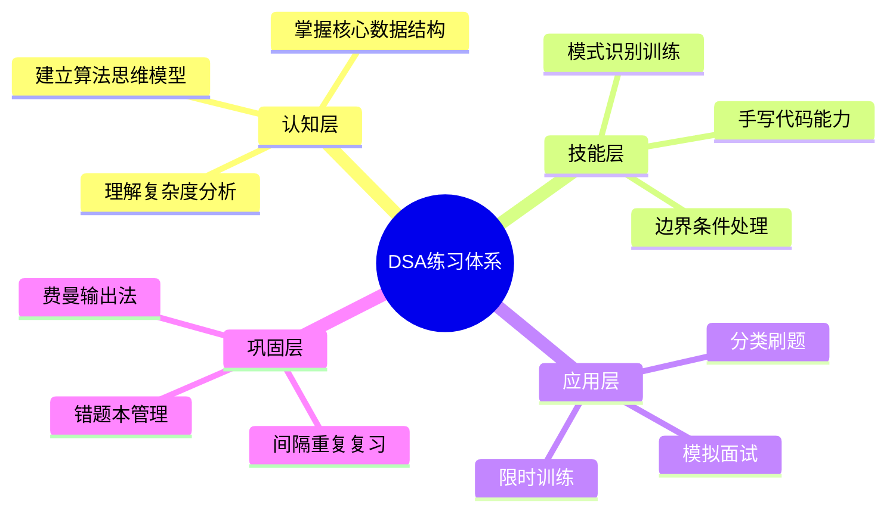
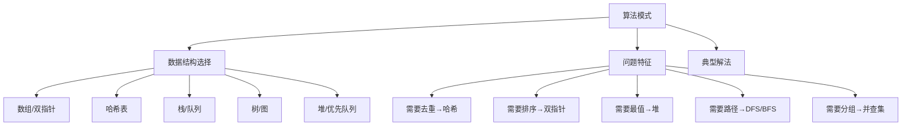
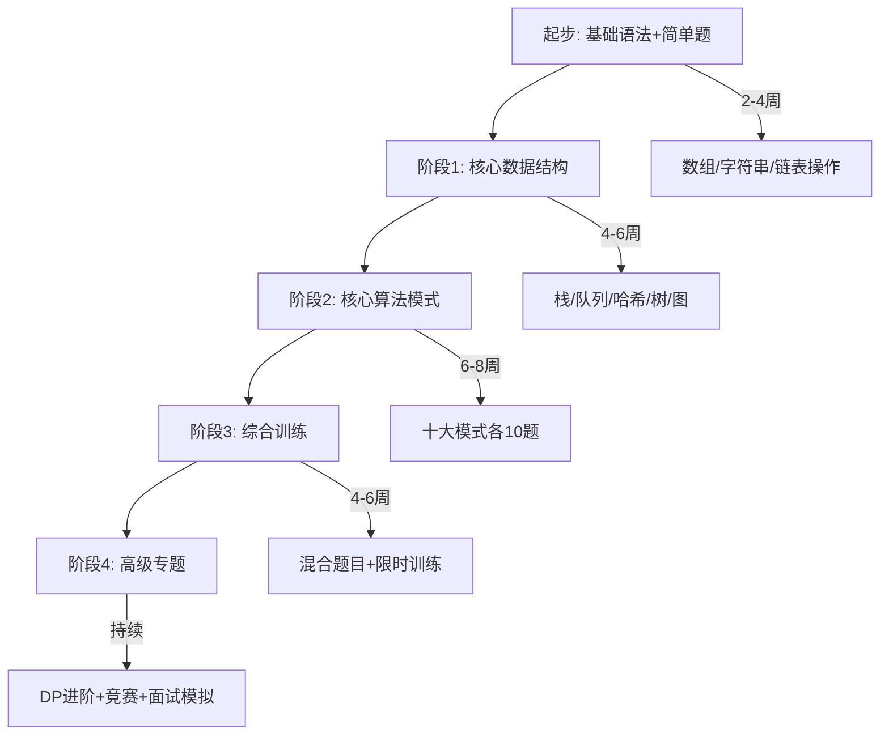
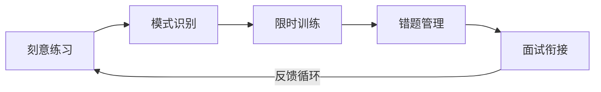

# 数据结构与算法的科学练习方法

学习数据结构与算法（DSA）的核心挑战不在于理解理论，而在于将知识转化为稳定、可调用的编码能力。本章系统梳理经过验证的练习方法论，帮助你建立可持续的训练体系，在有限时间内获得最大进步。

## 练习方法论总览



有效的 DSA 练习需要覆盖四个层次：认知层建立理论基础，技能层打磨编码手感，应用层训练解题策略，巩固层防止遗忘。许多学习者的误区是只在应用层反复刷题，忽略了认知层的深度理解和巩固层的系统复习。

## 一、刻意练习：从刷题到能力增长

### 1.1 刻意练习的核心原则

安德斯·艾利克森（Anders Ericsson）提出的"刻意练习"理论适用于 DSA 训练，核心包含四个要素：

| 要素 | 在 DSA 练习中的含义 | 常见误区 |
|------|---------------------|----------|
| 明确目标 | 针对特定模式/数据结构进行集中训练 | 今天随便做几道题 |
| 即时反馈 | 通过 OJ 判题结果、复杂度分析获得反馈 | 只看是否 AC，不分析解法优劣 |
| 超出舒适区 | 选择当前能力边界上的题目 | 只做已经会的简单题 |
| 专注投入 | 每次训练保持高度注意力 | 边刷题边看手机 |

### 1.2 训练节奏：费曼-主动回忆循环

高效的 DSA 练习不是线性推进，而是"学习→输出→测试→修正"的螺旋上升：

**第一步：主动回忆（Active Recall）**

在看任何题解之前，先强制自己思考 15-20 分钟。即使没有思路，这段时间的挣扎也会让后续学习更深刻。研究表明，主动回忆的记忆强度是被动阅读的 2-3 倍。

实战流程：
1. 读题 → 5分钟理解题意，画出示例
2. 关闭题目 → 用自己的话复述题意和约束
3. 思考解法 → 尝试至少2种不同的思路
4. 手写伪代码 → 不依赖 IDE，纸上或白板书写
5. 对照题解 → 分析差异，标记知识盲区

**第二步：费曼输出法**

想象你要把这道题讲解给一个初学者。用口头或书面方式完整叙述：

- 这道题考察的核心知识点是什么
- 为什么选择这个数据结构/算法
- 时间和空间复杂度分别是多少，为什么
- 这个解法在什么情况下会失效

如果你无法清晰地解释，说明理解还不够深入——回到理论部分重新学习。

**第三步：间隔重复**

根据艾宾浩斯遗忘曲线，新学的知识在 24 小时后遗忘约 70%。合理的复习间隔：

| 复习轮次 | 间隔时间 | 复习方式 |
|----------|----------|----------|
| 第1次 | 学习后 10 分钟 | 合上答案，重新手写代码 |
| 第2次 | 学习后 1 天 | 只看题名，凭记忆写出解法 |
| 第3次 | 学习后 3 天 | 只看题名，写出完整代码+复杂度分析 |
| 第4次 | 学习后 7 天 | 限时完成，模拟真实解题 |
| 第5次 | 学习后 30 天 | 写出解题笔记，考虑是否有更优解 |

### 1.3 避免无效刷题的信号

以下迹象说明你的练习方式有问题：

- 做过的题目隔一周就完全不会做了——缺少间隔复习
- 看到题目第一反应是回忆上次的解法而不是分析问题——在记忆答案而非学习方法
- 简单题做得快但中等题毫无头绪——缺乏模式识别训练
- 每道题都需要 30 分钟以上才能想到思路——缺少分类训练

## 二、模式识别：建立解题思维模型

### 2.1 核心算法模式分类

将常见算法归纳为可识别的模式，是提升解题速度的关键。以下是 LeetCode 高频题目归纳的核心模式：



### 2.2 十大高频模式及训练策略

**模式一：滑动窗口**

特征识别：数组/字符串 + 子数组/子串 + 最长/最短/满足条件
核心思路：维护左右指针，动态调整窗口大小
关键变量：窗口状态（和、计数、最大最小值）
时间复杂度：O(n)

典型题目训练路径（由易到难）：
1. LeetCode 209 - 长度最小的子数组（固定窗口→可变窗口入门）
2. LeetCode 3 - 无重复字符的最长子串（哈希+窗口）
3. LeetCode 76 - 最小覆盖子串（多条件窗口，难度跳跃）
4. LeetCode 239 - 滑动窗口最大值（单调队列+窗口）

**模式二：二分查找**

特征识别：有序数组 + 查找/边界 + 时间复杂度O(log n)
核心思路：每次排除一半搜索空间
两种变体：查找目标 vs 查找边界（第一个/最后一个满足条件的位置）
易错点：mid 计算溢出、循环终止条件、left/right 更新方式

**模式三：广度优先搜索（BFS）**

特征识别：最短路径 + 层级遍历 + 图/网格
核心思路：队列逐层扩展，天然保证最短路径
扩展用法：拓扑排序、状态机 BFS、双向 BFS
空间优化：只存当前层和下一层，而非整个队列

**模式四：深度优先搜索（DFS）+ 回溯**

特征识别：所有可能解 + 排列/组合/子集 + 棋盘/矩阵
核心思路：递归探索所有分支，到达终点后回退
剪枝优化：排序后跳过重复、可行性剪枝、最优性剪枝
记忆化：对重复子问题加缓存（DFS + memo）

**模式五：双指针**

特征识别：已排序数组 + 两数之和/三数之和 + 去重
核心思路：左右指针对向移动，或快慢指针检测环
变体：快慢指针（链表环检测）、对撞指针（容器盛水）、分区指针（快排分区）

**模式六：单调栈**

特征识别：下一个更大/更小元素 + 柱状图 + 每日温度类问题
核心思路：维护一个单调递增或递减的栈
经典应用：下一个更大元素、股票跨度、最大矩形面积

**模式七：并查集（Union-Find）**

特征识别：连通性问题 + 动态加边 + 等价类合并
核心路径压缩 + 按秩合并，近似O(1)操作
典型应用：岛屿数量、冗余连接、账户合并

**模式八：动态规划**

特征识别：最优子结构 + 重叠子问题 + 计数/最值
三步走：定义状态 → 写转移方程 → 确定初始化和遍历顺序
常见分类：背包问题、序列型、区间型、状态压缩
调试技巧：先写暴力递归，再加 memo，最后改迭代

**模式九：贪心算法**

特征识别：局部最优 → 全局最优 + 区间调度/跳跃游戏
验证方式：反证法证明贪心选择性质
与 DP 的区别：贪心不走回头路，DP 考虑所有子问题

**模式十：图算法**

类型识别：无向图/有向图 + 权重/无权重 + 单源/全源
算法选择：
  无权最短路径 → BFS
  加权正权最短路径 → Dijkstra
  含负权最短路径 → Bellman-Ford
  全源最短路径 → Floyd-Warshall
  最小生成树 → Prim / Kruskal
  拓扑排序 → Kahn算法 / DFS后序逆序

### 2.3 模式识别训练方法

**方法一：模板法**

每个模式整理一份解题模板，在反复使用中内化为直觉：

```python
# 滑动窗口模板
def sliding_window(s: str) -> int:
    left = 0
    window_state = {}  # 维护窗口内的状态
    result = 0
    
    for right in range(len(s)):
        # 1. 扩大窗口：加入 s[right]
        char = s[right]
        window_state[char] = window_state.get(char, 0) + 1
        
        # 2. 收缩窗口：当窗口不满足条件时
        while window_needs_shrink():
            remove_char = s[left]
            window_state[remove_char] -= 1
            left += 1
        
        # 3. 更新结果
        result = max(result, right - left + 1)
    
    return result
```

```python
# DFS 回溯模板
def backtrack(candidates, path, result):
    if 满足结束条件:
        result.append(path[:])  # 注意拷贝
        return
    
    for i in range(len(candidates)):
        if 需要剪枝(candidates[i]):
            continue
        
        path.append(candidates[i])  # 做选择
        backtrack(remaining, path, result)  # 递归
        path.pop()  # 撤销选择
```

**方法二：分类集中训练**

不要每天随机刷题，而是集中 3-5 天专攻一个模式：

| 周 | 专攻模式 | 练习数量 | 题目范围 |
|----|----------|----------|----------|
| 第1周 | 滑动窗口 + 双指针 | 各8-10题 | Easy→Medium |
| 第2周 | BFS/DFS + 回溯 | 各8-10题 | Easy→Medium |
| 第3周 | 二分查找 + 单调栈 | 各6-8题 | Medium |
| 第4周 | 动态规划 | 10-15题 | Easy→Medium |
| 第5周 | 图算法 + 并查集 | 各6-8题 | Medium |
| 第6周 | 综合训练 + Hard题 | 10-15题 | Mixed |

**方法三：难度递进法**

按照 LeetCode 题号范围或难度分布，从简单到困难逐步递进：

入门阶段（前200题）：
  - 先做 LeetCode 热门 100 中的 Easy 题
  - 每道题追求最优解，不满足于暴力解
  - 目标：每题 15 分钟内完成

进阶阶段（200-500题）：
  - 专攻 Medium 题，覆盖所有核心模式
  - 每道题至少用两种解法
  - 目标：每题 25 分钟内完成

高级阶段（500题以上）：
  - 挑战 Hard 题和周赛题目
  - 关注时间和空间的极致优化
  - 目标：稳定周赛 Rating 1800+

## 三、限时训练：模拟真实场景

### 3.1 时间压力下的解题能力

真实的面试和竞赛有严格的时间限制。限时训练能暴露你在无压力练习中不会发现的问题——比如看到题目就紧张、思路混乱、编码出错率飙升。

**限时训练三阶段：**

| 阶段 | 时长限制 | 适用场景 | 目标 |
|------|----------|----------|------|
| 宽松 | 45分钟/题 | 初学某模式 | 理解思路，不纠结速度 |
| 标准 | 25分钟/题 | 日常训练 | 接近面试节奏 |
| 紧张 | 15分钟/题 | 赛前冲刺 | 极端压力下的稳定输出 |

### 3.2 周赛训练法

每周参加至少一次在线竞赛，培养快速决策和时间分配能力：

**推荐竞赛：**
- LeetCode 周赛（每周日 10:30）：4 题 120 分钟
- LeetCode 双周赛（隔周六 22:30）：4 题 120 分钟
- Codeforces Div.2/Div.3：每周 2-3 场

**时间分配策略：**
LeetCode 周赛（120分钟分配）：
  T1 (Easy):   5-8 分钟，确保不丢分
  T2 (Medium): 15-20 分钟，稳定拿分
  T3 (Medium): 25-35 分钟，核心竞争力
  T4 (Hard):   剩余时间，能做多少做多少
  
  关键原则：先做T1T2拿稳基础分，再攻T3T4
  反模式：卡在T3上耗尽时间导致T4完全没看

### 3.3 模拟面试训练

面试与刷题的最大区别是需要"边想边说"。模拟面试训练包含：

**准备阶段：**
1. 选择一道 Medium 题目
2. 设置 35 分钟倒计时（模拟真实面试单题时间）
3. 开启录音或找同伴做面试官

**执行阶段（遵循 STAR-PS 框架）：**
0-2分钟：理解问题
  - 复述题目，确认理解正确
  - 询问边界情况和输入约束
  - 用自己的话举一个示例

2-5分钟：设计方案
  - 提出 2-3 种可能的解法
  - 分析每种解法的时间和空间复杂度
  - 选择最优方案并解释理由

5-25分钟：编码实现
  - 边写边解释思路
  - 使用有意义的变量名
  - 处理边界条件

25-35分钟：测试验证
  - 用示例测试代码
  - 考虑极端输入（空、单元素、最大值）
  - 分析最终复杂度

**复盘阶段：**
- 回看录音/录像，标记卡顿点
- 记录"知道但没想起来"的知识点
- 优化表达方式，减少口头禅

## 四、错题本与知识管理

### 4.1 建立系统化的错题本

错题本不是简单记录做错的题目，而是记录"为什么错"和"学到了什么"。

**每道错题记录以下信息：**

```markdown
## 题目：LeetCode 1234. 替换子串得到平衡字符串

**错误日期**：2024-03-15
**错误类型**：思路错误（选错了数据结构）
**题目分类**：滑动窗口 + 字符计数

**错误解法**：
尝试用排序+贪心，但忽略了窗口可以不连续

**正确思路**：
- 先统计每个字符的总数 count[ch]
- 目标是让每个字符在 [n/4, n/4] 之间
- 找到最短窗口使得窗口外的字符都不超过 n/4
- 使用滑动窗口，维护窗口内字符计数

**关键收获**：
1. "替换"操作意味着窗口内的字符可以自由调整
2. 当窗口外字符都不超过 n/4 时，窗口内一定能调整平衡
3. 这种思路可以推广到类似"自由替换"问题

**关联题目**：
- LeetCode 3 - 无重复最长子串
- LeetCode 76 - 最小覆盖子串
```

### 4.2 用 Obsidian/Notion 管理知识体系

将错题本与知识管理系统结合，建立题目的关联网络：

数据结构与算法/
├── 模式索引/
│   ├── 滑动窗口.md          ← 模板+经典题
│   ├── 二分查找.md
│   └── ...
├── 题目笔记/
│   ├── LC0003-无重复字符最长子串.md
│   ├── LC0076-最小覆盖子串.md
│   └── ...
├── 易错点汇总/
│   ├── 边界条件.md
│   ├── 复杂度分析陷阱.md
│   └── ...
└── 面试准备/
    ├── 高频题清单.md
    └── 面试时间管理.md

每个题目笔记中用双向链接关联到对应的模式索引和易错点，形成知识网络。定期回顾时，沿着链接遍历比线性复习效率高得多。

### 4.3 定期回顾与能力评估

每两周进行一次自我评估：

| 评估维度 | 评估方法 | 达标标准 |
|----------|----------|----------|
| 模式覆盖度 | 列出所有模式，自评熟练度 1-5 | 核心模式 ≥ 4 |
| 解题速度 | 随机抽 3 道 Medium 限时完成 | 平均 ≤ 20 分钟 |
| 代码质量 | 对比自己一周前和现在的代码 | 更简洁、边界更完善 |
| 复杂度分析 | 口头分析 5 道题的最优复杂度 | 全部正确 |
| 周赛成绩 | 记录最近 5 场周赛 Rating | 稳定上升趋势 |

## 五、高效学习资源与工具

### 5.1 在线练习平台对比

| 平台 | 特点 | 适合人群 | 推荐题目量 |
|------|------|----------|------------|
| LeetCode | 题库最大，面试导向，周赛机制 | 求职者、面试准备 | 300-500题 |
| Codeforces | 竞赛导向，题解质量高 | 算法竞赛选手 | 持续参与 |
| AtCoder | 题目精炼，思维性强 | 追求深度理解者 | 每周 3-5题 |
| 洛谷 | 中文友好，中文题解多 | 国内学生 | 200+题 |
| 牛客网 | 模拟大厂面试，讨论活跃 | 国内大厂求职 | 配合 LeetCode |
| LintCode | 企业题库，课程配套 | 培训班学员 | 100-200题 |

### 5.2 辅助工具推荐

**可视化工具：**
- VisuAlgo（visualgo.net）：算法动画演示，帮助理解执行过程
- Python Tutor（pythontutor.com）：逐行执行代码，查看变量变化
- algorithm-visualizer（algorithm-visualizer.org）：交互式算法可视化

**代码模板库：**
- 本地维护一套常用模板（二分、DFS、并查集等），面试时快速套用
- 使用 VS Code Snippet 或类似工具，一键生成模板代码

**效率工具：**
- LeetCode Timer 浏览器插件：自动计时，统计每题耗时
- Notion/Obsidian：建立个人题库和错题本系统
- GitHub 仓库：按模式分类存放解题代码，版本控制

### 5.3 推荐学习路径



## 六、常见误区与纠正

### 误区一：追求数量而非质量

**错误做法**：每天刷 10 道题，做完就标记完成，不回顾不总结。

**正确做法**：每天 2-3 道题，每道题做到以下几点再"放过"：
1. 能独立写出最优解（非抄答案）
2. 能解释为什么这样解（复杂度分析）
3. 能写出至少一种替代解法
4. 能说出这道题考察的核心模式
5. 能将题目归类到对应的知识节点

### 误区二：只看不写

**错误做法**：看了题解觉得"我懂了"，合上题解却写不出代码。

**正确做法**：看懂题解后，关闭题解，在全新的编辑器中从零开始写。如果写不出来，说明理解停留在表面。真正掌握的标志是能流畅地写出代码而不是"回忆起"代码。

### 误区三：跳过暴力解直接想最优解

**错误做法**：看到题目就试图直接设计 O(n log n) 的解法，想了 30 分钟毫无头绪。

**正确做法**：先写出暴力解（O(n²) 或更高），确保逻辑正确。然后思考暴力解中哪部分可以优化，逐步降低复杂度。面试中能写出暴力解并分析优化方向，比直接卡死要好得多。

推荐思路路径：
  1. 暴力解（确认正确性）→ 5分钟
  2. 分析暴力解的瓶颈 → 3分钟
  3. 尝试针对性优化 → 10分钟
  4. 如果想不出最优解，暴力解也是答案

### 误区四：忽视边界条件

**错误做法**：只用示例测试代码，提交后 TLE/WA。

**正确做法**：系统化测试边界条件：

```python
# 每道题提交前检查清单：
test_cases = {
    "空输入": [],           # 空数组/空字符串
    "单元素": [1],          # 最小有效输入
    "两个元素": [1, 2],     # 最小比较场景
    "全部相同": [1,1,1,1],  # 无变化场景
    "全部不同": [1,2,3,4],  # 最大变化场景
    "有序": [1,2,3,4,5],    # 已排序输入
    "逆序": [5,4,3,2,1],    # 最坏情况输入
    "极值": [2**31-1, -2**31],  # 整数边界
}
```

### 误区五：不做总结就换下一个

**错误做法**：AC 后立即跳到下一题，没有沉淀任何收获。

**正确做法**：每题花 2 分钟做微总结，写在固定位置。格式可以很简单：

题号 | 模式 | 关键思路 | 耗时 | 自评
0076 | 滑动窗口 | 窗口外字符不超过n/4即可 | 22min | ★★★★☆

积累 50 道题后回看这张表，你会清晰地发现自己在哪些模式上进步快、哪些模式还需要加强。

## 七、从练习到面试的衔接

### 7.1 面试前的冲刺计划

面试前 4 周的集中训练方案：

第1-2周：查漏补缺
  - 回顾错题本，重做所有标记的题目
  - 薄弱模式各补 5-10 题
  - 每天 3-4 道 Medium + 1 道 Easy（热身）

第3周：模拟面试
  - 每天 2 次模拟面试（找同伴或录屏自练）
  - 练习口头表达和代码讲解
  - 时间严格控制在 35 分钟/题

第4周：心态调整
  - 每天只做 1-2 道题，保持手感
  - 回顾高频题清单，确保核心题目烂熟于心
  - 整理面试常问的系统设计和行为面试答案

### 7.2 高频必备题清单

以下是各模式最核心的题目，面试前必须确保能流畅完成：

| 模式 | 必备题目 | 核心考点 |
|------|----------|----------|
| 数组 | 1, 15, 53, 189 | 基础操作、双指针、滑窗、旋转 |
| 字符串 | 3, 5, 20, 49, 76 | 滑窗、中心扩展、分组、覆盖 |
| 链表 | 2, 19, 21, 141, 206 | 合并、快慢指针、翻转 |
| 树 | 94, 102, 104, 124, 236 | 遍历、深度、路径、LCA |
| 图 | 200, 207, 210 | 岛屿、拓扑排序 |
| DP | 5, 70, 300, 322, 416 | 回文、爬楼、LIS、零钱、背包 |
| 栈/队列 | 20, 155, 394, 739 | 括号、最小栈、字符串解码、温度 |
| 二分 | 33, 34, 153, 287 | 旋转数组、边界、缺失数 |
| 哈希 | 1, 49, 128, 242 | 两数之和、分组、最长连续、字母异位 |
| 堆 | 215, 295, 347 | 第K大、数据流、前K高频 |

### 7.3 面试中的沟通技巧

面试不只是写代码，还包括清晰地表达思路。训练以下沟通习惯：

**说"我在想"而非沉默**：即使在思考，也要让面试官知道你在做什么。例如："我在考虑用动态规划，状态定义是……但我不确定转移方程是否正确。"

**主动写出测试用例**：在编码前提出 2-3 个测试用例，展示你考虑了边界情况。

**犯错时及时修正**：发现自己走错路时，果断说"这个方向有问题，让我换一个思路"，不要在错误方向上死磕。

**总结复杂度**：编码完成后主动分析时间和空间复杂度，展示对复杂度分析的熟练度。

## 本章小结

科学的 DSA 练习方法可以概括为以下核心原则：



**关键要点：**
1. 练习质量 > 练习数量，每道题要做到"真正掌握"而非"看过答案"
2. 识别和内化核心算法模式，是解题速度的决定性因素
3. 限时训练暴露真实能力水平，是面试准备的必要环节
4. 系统化的错题本和个人知识管理，让每次练习的收益可积累
5. 从练习到面试需要有计划地过渡，最后阶段重点是心态和表达

坚持这套方法论，6 个月即可建立扎实的 DSA 能力基础。记住：练习的目的不是记住答案，而是培养面对任何新问题都能冷静分析、系统解决的思维能力。
