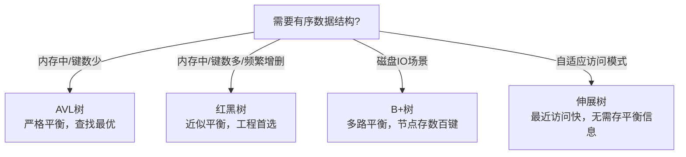
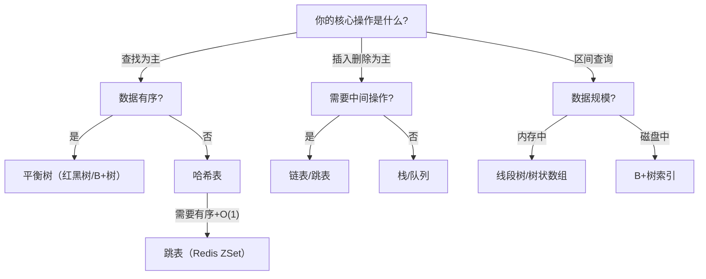
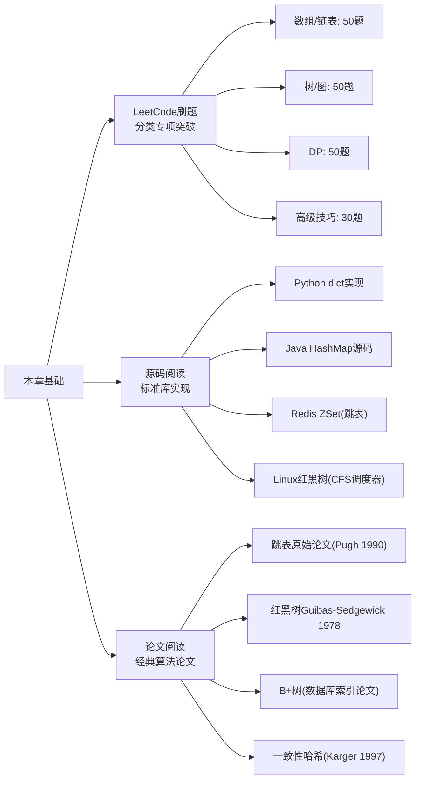

## 本章小结

本章从"时间复杂度与空间复杂度"出发，依次覆盖了线性数据结构、哈希表与碰撞解决、树形数据结构、排序算法体系、搜索与匹配、图算法、高级算法范式（动态规划/贪心/回溯/位运算）、工程优化技巧（单调栈/前缀和/滑动窗口/状态压缩DP），最后通过三个实战案例（LRU缓存优化、拓扑排序任务依赖、BloomFilter防穿透）将理论落地。以下是全章知识体系的系统回顾。

---

## 一、核心知识点回顾

### 1. 算法分析基础——一切选型的起点

| 复杂度 | 名称 | 10⁶数据量操作数 | 工程含义 |
|--------|------|-----------------|---------|
| O(1) | 常数 | 1 | 哈希查找、数组索引——性能的天花板 |
| O(log n) | 对数 | ~20 | 二分搜索、平衡树——百万数据仅20步 |
| O(n) | 线性 | 10⁶ | 遍历——可接受但需警惕热点 |
| O(n log n) | 线性对数 | ~2×10⁷ | 排序算法的"及格线" |
| O(n²) | 平方 | 10¹² | 超过万级数据即不可用 |
| O(2ⁿ) | 指数 | 不可计算 | 仅适用于n≤20的暴力枚举 |

**核心认知**：O(n log n) 与 O(n²) 的差距不是"快一点"——n=10⁶时差了5个数量级（毫秒 vs 小时）。选择正确的算法复杂度，是性能优化的第一步，也是成本最低的一步。

**三大分析维度**：
- **最好/最坏/平均情况**：工程中关注最坏（系统安全底线）和平均（日常性能基准），最好情况几乎无参考价值
- **摊还分析**：动态数组扩容单次O(n)但均摊O(1)；理解摊还才能正确评估"看似昂贵"操作的真实代价
- **空间复杂度**：内存受限场景（嵌入式、大规模批处理）下空间复杂度可能比时间更重要

### 2. 线性数据结构——最常用的基础积木

| 数据结构 | 随机访问 | 插入/删除 | 缓存友好性 | 工程首选场景 |
|---------|---------|----------|-----------|-------------|
| 数组 | O(1) | O(n) | ★★★★★ | 读多写少、随机访问频繁 |
| 链表 | O(n) | O(1)已知位置 | ★ | 频繁中间插入删除、LRU |
| 栈 | 不支持 | O(1) | ★★★★ | DFS/回溯、表达式解析 |
| 队列 | 不支持 | O(1) | ★★★★ | BFS、任务调度、消息缓冲 |
| 跳表 | O(log n)查找 | O(log n) | ★★★ | 有序集合、范围查询（Redis ZSet） |

**工程选择原则**：在现代CPU架构上，数组的缓存连续性使其在大多数场景下优于链表——遍历1000个元素的数组可能比遍历1000个节点的链表快5-10倍。只有在确实需要频繁中间插入删除的场景（如LRU缓存的双向链表），链表才是正确选择。

**跳表的独特价值**：与平衡树相比，跳表实现更简单且天然支持范围查询（底层有序链表顺序遍历）。Redis选择跳表而非红黑树实现Sorted Set，核心原因就是范围查询的工程简洁性。

### 3. 哈希表——O(1)的工程真相

哈希表的平均O(1)查找建立在两个前提上：**好的哈希函数**和**合理的负载因子**。

**三大碰撞解决策略对比**：

| 策略 | 原理 | 负载因子要求 | 缓存友好 | 删除复杂度 | 代表实现 |
|------|------|-------------|---------|-----------|---------|
| 链地址法 | 桶内链表/红黑树 | 可>1 | 差 | 简单 | Java HashMap、Go map |
| 开放寻址法 | 探测下一个空位 | 必须<1 | 好 | 复杂（需墓碑） | Python dict、Redis dict |
| 一致性哈希 | 哈希环+虚拟节点 | — | — | — | 分布式缓存、负载均衡 |

**关键工程细节**：
- **Java HashMap的链表→红黑树转换**：链表长度>8且桶数组>64时触发，阈值8基于泊松分布（负载因子0.75下链表长≥8概率约千万分之六）
- **负载因子**：链地址法通常0.75，开放寻址法不超过0.7
- **一致性哈希**：虚拟节点通常150-200个/物理节点解决负载不均；节点增减只影响环上相邻区域（~1/N的key需重映射）

### 4. 树形数据结构——从BST到B+树

**平衡树家族的选型逻辑**：

- **红黑树**：五条颜色性质保证近似平衡，插入删除最多3次旋转。Linux CFS调度器、Java TreeMap、C++ std::map的底层实现
- **B+树**：所有数据存在叶子节点（叶子链表支持范围查询），内部节点只存键和指针。一个16KB的B+树节点可存~1170个键，三层B+树即可索引20亿条记录——这是MySQL InnoDB的索引基石
- **字典树（Trie）**：前缀共享使空间高效，支持O(m)的前缀匹配（m为键长）。适合自动补全、IP路由、拼写检查

### 5. 排序算法体系——没有银弹

| 算法 | 平均 | 最坏 | 空间 | 稳定 | 适用场景 |
|------|------|------|------|------|---------|
| 快速排序 | O(n log n) | O(n²) | O(log n) | 否 | 通用首选，缓存友好 |
| 归并排序 | O(n log n) | O(n log n) | O(n) | 是 | 需要稳定排序、链表排序 |
| 堆排序 | O(n log n) | O(n log n) | O(1) | 否 | 内存受限、Top-K问题 |
| TimSort | O(n log n) | O(n log n) | O(n) | 是 | 已部分有序的数据（Python/Java默认） |
| 计数/基数/桶排序 | O(n+k) | O(n+k) | O(n+k) | 是 | 数据范围已知且有限 |

**工程选择**：
- **通用场景**：使用语言内置排序（Python的TimSort、C++的内省排序）——经过数十年优化，手写很难超越
- **需要稳定**：归并排序或TimSort
- **内存受限**：堆排序（原地O(1)额外空间）
- **数据范围小**：计数排序/桶排序可达O(n)

### 6. 图算法——关系建模的利器

| 算法 | 时间复杂度 | 适用图类型 | 典型应用 |
|------|-----------|-----------|---------|
| BFS | O(V+E) | 无权图 | 最短路径（无权）、层序遍历 |
| DFS | O(V+E) | 所有图 | 连通性检测、回溯、拓扑排序 |
| Dijkstra | O((V+E)log V) | 非负权图 | 导航系统、网络路由 |
| Bellman-Ford | O(VE) | 含负权图 | 检测负环、金融套利 |
| Floyd-Warshall | O(V³) | 所有图 | 全源最短路径、小规模图 |
| Kruskal/Prim | O(E log V) | 连通无向图 | 最小生成树、网络布线 |
| 拓扑排序 | O(V+E) | DAG | 任务依赖调度、课程安排 |
| 并查集 | O(α(n)) 近O(1) | 动态连通 | 连通分量、社交网络好友关系 |

**易错点**：Dijkstra不能处理负权边（因为一旦节点出队就认定最短路径已确定，负权边可能使这个假设失效）；BFS和DFS不能随意替换——BFS找无权图最短路径，DFS适合回溯和连通性检测。

### 7. 高级算法范式

**动态规划（DP）**：核心是"重叠子问题+最优子结构"。五步框架：①定义状态 ②状态转移方程 ③初始化 ④遍历顺序 ⑤返回结果。状态定义差一个维度就全盘皆错——这是DP最大的陷阱。

**贪心算法**：每步选择局部最优，期望全局最优。仅在满足"贪心选择性质"+"最优子结构"时正确。经典问题：活动选择、哈夫曼编码、最小费用贪心。代码简单不代表更好——需要数学证明。

**回溯算法**：系统的暴力搜索，通过"剪枝"大幅提升效率。框架：选择列表→路径→结束条件→撤销选择。关键在于剪枝条件的设计——好的剪枝可将指数级降为多项式级。

**位运算技巧**：状态压缩DP中用整数的二进制位表示集合状态，将子集枚举从O(2ⁿ)的存储优化为O(1)的整数操作。常见操作：位判断`(mask >> i) & 1`、位设置`mask | (1 << i)`、位清除`mask & ~(1 << i)`、lowbit`mask & (-mask)`。

### 8. 工程优化四大利器

| 技巧 | 核心思想 | 解决的问题 | 经典应用 |
|------|---------|-----------|---------|
| 单调栈/队列 | 维护单调性，弹出破坏单调的元素 | 下一个更大/更小元素、滑动窗口最值 | 柱状图最大矩形、接雨水 |
| 前缀和 | 预处理区间和为O(1)查询 | 子数组和、区间求和 | LeetCode 560（和为K的子数组） |
| 滑动窗口 | 维护满足条件的窗口区间 | 最长/最短子串/子数组 | 无重复字符最长子串 |
| 状态压缩DP | 用整数位表示集合状态 | 小规模集合的组合优化 | 旅行商问题（n≤20）、任务分配 |

---

## 二、关键公式与决策模型

### 核心公式速查

| 公式/模型 | 表达式 | 工程意义 |
|-----------|--------|---------|
| Little定律 | L = λW（系统中平均实体数 = 到达率 × 平均停留时间） | 从延迟和吞吐推算队列长度 |
| 均摊分析 | 单次高代价操作 / 触发频率 = 均摊代价 | 评估动态数组、伸展树的真实性能 |
| 哈希负载因子 | α = n/m（元素数 / 桶数） | α<0.75（链地址）/ α<0.7（开放寻址） |
| B+树高度 | h = ⌈logₘ(N)⌉（m为阶，N为键数） | 三层B+树索引20亿条记录 |
| 一致性哈希重映射率 | 1/N（N为节点数） | 100台服务器仅1%key受影响 |

### 数据结构选型决策树

### 复杂度-数据规模参考表

| 数据规模 n | O(n²) | O(n log n) | O(n) | O(log n) |
|-----------|-------|-----------|------|---------|
| 100 | 10⁴ ✓ | 664 ✓ | 100 ✓ | 7 ✓ |
| 1,000 | 10⁶ ✓ | 10,000 ✓ | 1,000 ✓ | 10 ✓ |
| 100,000 | 10¹⁰ ✗ | 1.7M ✓ | 100K ✓ | 17 ✓ |
| 1,000,000 | 10¹² ✗ | 20M ✓ | 1M ✓ | 20 ✓ |
| 100,000,000 | 10¹⁶ ✗ | 2.7B ✗ | 100M ✓ | 27 ✓ |

> 标记✓表示该复杂度在1秒内可完成（假设10⁸次操作/秒）

---

## 三、最佳实践清单

### 数据结构选型

- [ ] 明确核心操作（查找/插入/删除/排序/范围查询），据此选择数据结构
- [ ] 评估数据规模——n<100时简单方案即可，n>10⁵必须考虑复杂度
- [ ] 考虑访问模式——读多写少优先数组/哈希表，写多读少考虑链表/跳表
- [ ] 检查缓存友好性——现代CPU下缓存命中率对实际性能影响可达10倍
- [ ] 优先使用语言标准库——Python dict、Java HashMap、C++ std::unordered_map经过高度优化

### 算法实现

- [ ] 先写出暴力解法确认正确性，再优化
- [ ] 二分搜索：始终检查`left + right`是否溢出（改用`left + (right-left)//2`）
- [ ] 动态规划：先手推小规模用例验证状态转移方程
- [ ] 图算法：明确图是有向/无向、带权/无权、有环/无环，再选算法
- [ ] 回溯算法：设计有效的剪枝条件，避免纯暴力枚举
- [ ] 贪心算法：先尝试举反例，无法举出再假设贪心正确并尝试证明

### 性能优化

- [ ] 热点识别优先于盲目优化——用profiler找到真正的瓶颈
- [ ] 空间换时间：缓存中间结果（DP的记忆化、哈希表预处理）
- [ ] 批量处理：合并多次小操作为一次大操作（BFS层序、批量IO）
- [ ] 避免不必要的拷贝：使用引用/指针传递大数据结构
- [ ] 利用数据特征：部分有序用TimSort、整数范围小用计数排序

### 工程防御

- [ ] 边界条件检查：空输入、单元素、最大规模、负数/零
- [ ] 整数溢出：大数乘法/加法注意类型范围
- [ ] 递归深度：Python默认1000层，大规模数据改用迭代或手动增加栈
- [ ] 并发安全：哈希表在多线程下需要加锁或使用并发容器
- [ ] 内存泄漏：手动管理的链表/树结构确保释放所有节点

---

## 四、常见误区与纠正

| 误区 | 真相 | 纠正方法 |
|------|------|---------|
| "理论复杂度最优 = 实际性能最好" | 常数因子、缓存命中率、分支预测影响巨大 | 用真实数据基准测试，不要只看大O |
| "链表总是比数组快" | 链表的缓存不友好使其遍历比数组慢5-10倍 | 除非频繁中间操作，优先选数组 |
| "快速排序总是最快的" | 已部分有序数据上快排退化为O(n²)，TimSort更优 | 使用语言内置排序 |
| "二分搜索只需`while left < right`" | 搜索区间、边界更新、返回值选择各有陷阱 | 手推3个用例验证：空数组、单元素、目标在边界 |
| "DP状态越多越完整" | 多余状态增加时间空间且容易出错 | 最小化状态定义，只保留必要维度 |
| "BFS和DFS可以随意替换" | BFS找无权最短路径，DFS适合回溯；混用导致错误 | 根据问题本质选择 |
| "自己实现的比标准库好" | 标准库经过数十年优化和海量用户检验 | 优先用标准库，仅在特殊需求时自实现 |

---

## 五、实战案例核心收获

### 案例一：LRU缓存优化数据库查询
**核心设计**：哈希表（O(1)查找）+ 双向链表（O(1)移动/淘汰），哨兵节点简化边界处理。在热点数据集中、容量有限的场景下，LRU缓存可将数据库查询量降低90%以上。

### 案例二：拓扑排序解决任务依赖
**核心设计**：Kahn算法（BFS版）或DFS后序反转。关键在于检测环——如果拓扑排序结果数 < 节点总数，说明存在环依赖。在CI/CD任务编译、课程安排、构建系统中广泛应用。

### 案例三：BloomFilter优化缓存穿透
**核心设计**：多个哈希函数 + 位数组，空间效率极高（百万级数据仅需几MB）。代价是有假阳性（可能说"存在"但实际不存在），但绝无假阴性。用"可能存在→查缓存/DB"、"一定不存在→直接返回"的两层过滤，将缓存穿透的无效查询降低到几乎为零。

---

## 六、下一步学习建议

### 进阶路线图

### 推荐书籍（由浅入深）

| 阶段 | 书籍 | 侧重 |
|------|------|------|
| 入门 | 《算法图解》(Aditya Bhargava) | 直觉理解，大量插图 |
| 基础 | 《算法导论》(CLRS) 精选章节 | 理论完整，证明严谨 |
| 进阶 | 《编程珠玑》(Jon Bentley) | 工程思维，问题转化 |
| 实战 | 《剑指Offer》/LeetCode分类题解 | 面试高频，技巧总结 |
| 深入 | 《算法》(Sedgewick) | Java实现，可视化分析 |
| 工程 | 《数据密集型应用系统设计》(DDIA) | 数据结构在分布式系统中的应用 |

### 刷题策略

1. **分类突破**：按数据结构/算法类型刷，每类连续做10-15题建立模式识别
2. **重复训练**：同一题间隔1天、3天、7天各做一次，对抗遗忘曲线
3. **限时练习**：模拟面试环境，简单题5分钟、中等题15分钟、困难题30分钟
4. **总结模板**：每类题型总结出代码模板（如滑动窗口模板、DP模板、回溯模板）
5. **关注边界**：每次提交前检查：空输入、单元素、最大规模、负数、溢出

---

## 七、思考题

1. **复杂度分析**：给定一个算法，如何区分它的最好情况、最坏情况和平均情况？为什么工程中更关注最坏情况而非最好情况？

2. **数据结构选型**：如果需要实现一个支持以下操作的数据结构——插入元素、删除最小元素、查找任意元素——你会选择什么数据结构？为什么？（提示：考虑多数据结构组合）

3. **哈希表深度思考**：Java 8 HashMap为什么选择在链表长度为8时转换为红黑树，而不是更早或更晚？如果负载因子改为0.5，这个阈值应该如何调整？

4. **DP状态设计**：给定一个问题——"从n个物品中选择若干个，使总重量不超过W且总价值最大"——请定义状态、写出状态转移方程，并分析时间空间复杂度。如果W非常大（10⁹）但n很小（20），应该换用什么方法？

5. **图算法选择**：在一个社交网络中，需要回答"两个用户之间是否相连"以及"所有连通的用户群组"两个问题。应该分别使用什么算法？能否用同一个数据结构同时解决？

6. **工程权衡**：在高并发场景下，你选择了时间复杂度O(1)的哈希表，但实际性能却不理想。可能的原因有哪些？如何诊断和优化？

7. **算法演进**：从冒泡排序到快速排序到TimSort，排序算法的演进路径反映了什么样的工程思想？未来排序算法可能的发展方向是什么？

---

> **本章核心理念**：数据结构是算法的载体，算法是数据结构的灵魂。选对数据结构比优化算法本身更能带来性能提升。理论复杂度是基础，但工程中的常数因子、缓存友好性和内存布局同样决定成败。理解这些，你就掌握了软件工程中最硬核的"内功"。
