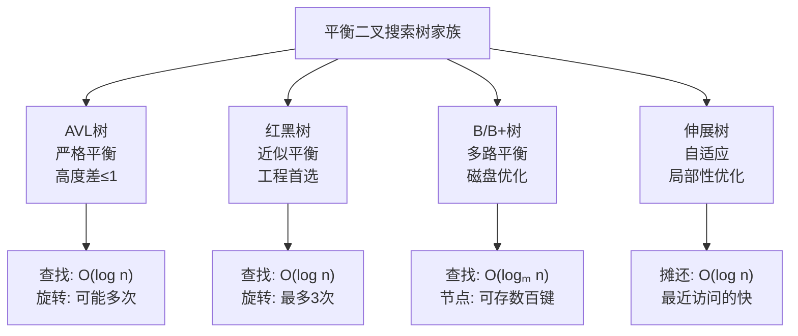
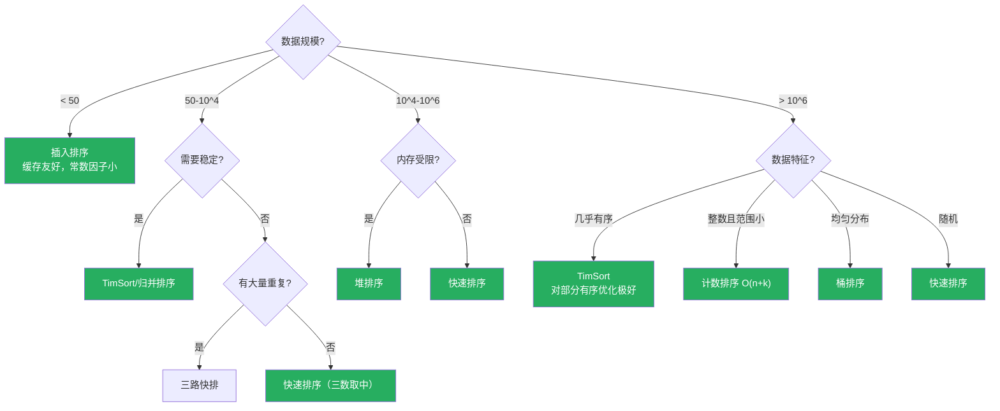

# 第44章 数据结构与算法：软件工程的性能基石与思维引擎

***

## 一、本章定位与核心问题

第43章探讨了RPC框架——分布式服务通信的核心基础设施。但RPC框架的高性能实现离不开底层数据结构与算法的支撑：连接池用到了链表和哈希表，负载均衡用到了一致性哈希，序列化用到了树和图的遍历，熔断器用到了滑动窗口。**数据结构与算法不是象牙塔里的理论游戏——它们是每一个高效系统背后看不见的骨架。**

**本章要回答的核心问题是：在软件工程实践中，如何根据数据特征和性能需求选择最合适的数据结构和算法，从而在时间、空间和工程复杂度之间找到最优平衡点？** 一个错误的数据结构选择可能让O(1)的操作退化到O(n)，让毫秒级的响应变成秒级；而一个精妙的算法设计则能让系统在面对海量数据时依然游刃有余。

核心理念是：**数据结构是算法的载体，算法是数据结构的灵魂——选对数据结构比优化算法本身更能带来性能提升。理解理论复杂度是基础，但工程中的常数因子、缓存友好性和内存布局同样决定成败。**

### 为什么数据结构与算法如此重要又如此容易出错

数据结构与算法是计算机科学的基石，也是每一位软件工程师必须深入掌握的核心能力。但这个领域的误区被严重低估：理论上最优的算法在工程中可能最慢，看似简单的二分搜索藏着最隐蔽的边界bug，动态规划的状态定义差一个维度就全盘皆错。以下是一些触目惊心的真实场景：

| 场景 | 数据结构/算法问题 | 影响 |
|------|------------------|------|
| 电商商品搜索 | 用线性扫描替代哈希查找，QPS从10万降到1万 | 搜索接口延迟从5ms飙升到50ms |
| 数据库慢查询 | 索引选型错误，全表扫描替代B+树索引 | 查询从10ms退化到10秒，拖垮整个数据库 |
| 缓存穿透 | 不存在的key直接穿透到数据库 | 大量无效查询打垮下游，引发级联故障 |
| 社交网络好友推荐 | 暴力枚举二度好友，O(V²)复杂度 | 推荐接口超时，用户看到空白页面 |
| 实时排行榜 | 每次查询都重新排序，O(n log n) | 高并发下CPU打满，排行榜更新延迟 |
| 分布式ID生成 | 用随机数而非有序算法，ID冲突概率高 | 数据覆盖丢失，业务逻辑错误 |

**数据结构与算法的经济学**：一个正确的哈希表选型——O(1)的查找替代O(n)的线性扫描——在每秒百万次查询的场景下，意味着节省数十万个CPU周期。一次错误的算法选择——在应该用动态规划的地方用了暴力递归——可能让原本可以毫秒完成的操作膨胀到数分钟。**数据结构与算法的架构决策，本质上是在为系统性能购买一份"保险"——但这份保险的条款需要你逐字逐句地阅读。**

***

## 二、理论与工程的鸿沟：认知陷阱全景

数据结构与算法是"看似简单、实则极其复杂"的典型领域。以下常见误区构成了最具杀伤力的认知陷阱：

```mermaid
graph TD
    A["数据结构与算法误区全景"] --> B["复杂度陷阱<br/>理论最优≠工程最优"]
    A --> C["数据结构选型<br/>理论分析≠实际性能"]
    A --> D["排序算法<br/>盲目追求理论复杂度"]
    A --> E["二分搜索<br/>边界条件的致命细节"]
    A --> F["动态规划<br/>状态定义的根本性错误"]
    A --> G["图算法<br/>前提条件的忽视"]
    A --> H["贪心与回溯<br/>适用条件的误判"]
    A --> I["工程实践<br/>理论与实现的鸿沟"]

    B --> B1["误区1: 理论复杂度最优=实际性能最好"]
    B --> B2["误区2: 小数据量也用复杂数据结构"]

    C --> C3["误区3: 链表总是比数组慢"]
    C --> C4["误区4: 哈希表O(1)可以忽略碰撞"]

    D --> D5["误区5: 快速排序总是最快的"]
    D --> D6["误区6: 排序稳定不重要"]

    E --> E7["误区7: 二分搜索只需要while left < right"]
    E --> E8["误区8: 中点用left+right不会溢出"]

    F --> F9["误区9: DP状态越多越完整越好"]
    F --> F10["误区10: 空间优化总是值得的"]

    G --> G11["误区11: Dijkstra能处理所有最短路径"]
    G --> G12["误区12: BFS和DFS可以随意替换"]

    H --> H13["误区13: 贪心算法代码简单所以更好"]
    H --> H14["误区14: 回溯就是暴力枚举"]

    I --> I15["误区15: 自己实现的一定比标准库好"]
    I --> I16["误区16: 算法只在面试时有用"]

    style A fill:#2c3e50,color:#fff
    style B fill:#3498db,color:#fff
    style C fill:#e67e22,color:#fff
    style D fill:#e74c3c,color:#fff
    style E fill:#9b59b6,color:#fff
    style F fill:#1abc9c,color:#fff
    style G fill:#f39c12,color:#fff
    style H fill:#8e44ad,color:#fff
    style I fill:#c0392b,color:#fff
```



这些误区的杀伤力在于：它们都涉及"理论与工程的鸿沟"——理论分析时一切正确，只有在真实数据规模、真实硬件环境、真实并发压力下，错误的选择才会暴露。**数据结构与算法的价值只有在性能压测和真实故障时才能验证——而那时候你没有试错的机会。**

***

## 三、本章知识图谱

```mermaid
graph TD
    A["数据结构与算法"] --> B["算法分析基础"]
    A --> C["核心数据结构"]
    A --> D["排序算法体系"]
    A --> E["搜索与匹配"]
    A --> F["图算法"]
    A --> G["高级算法范式"]
    A --> H["工程优化技巧"]
    A --> I["工程数据结构选型"]
    A --> J["实战案例与误区"]

    B --> B1["时间复杂度"]
    B --> B2["空间复杂度"]
    B --> B3["缓存复杂度"]
    B --> B4["摊还分析"]

    C --> C1["数组与链表"]
    C --> C2["栈与队列"]
    C --> C3["哈希表"]
    C --> C4["树形结构"]
    C --> C5["堆与优先队列"]
    C --> C6["图的表示"]

    C4 --> C4a["二叉搜索树"]
    C4 --> C4b["AVL树"]
    C4 --> C4c["红黑树"]
    C4 --> C4d["B+树"]
    C4 --> C4e["字典树"]

    D --> D1["快速排序"]
    D --> D2["归并排序"]
    D --> D3["堆排序"]
    D --> D4["计数/基数/桶排序"]
    D --> D5["内省排序与TimSort"]

    E --> E1["二分搜索"]
    E --> E2["KMP与Rabin-Karp"]
    E --> E3["跳表"]
    E --> E4["后缀数组"]

    F --> F1["BFS与DFS"]
    F --> F2["最短路径"]
    F --> F3["最小生成树"]
    F --> F4["拓扑排序"]
    F --> F5["并查集"]
    F --> F6["网络流"]

    G --> G1["动态规划"]
    G --> G2["贪心算法"]
    G --> G3["回溯算法"]
    G --> G4["位运算技巧"]

    H --> H1["单调栈与单调队列"]
    H --> H2["前缀和与差分"]
    H --> H3["滑动窗口"]
    H --> H4["状态压缩DP"]

    I --> I1["布隆过滤器"]
    I --> I2["并发数据结构"]
    I --> I3["概率数据结构"]
    I --> I4["缓存友好设计"]

    J --> J1["缓存系统优化"]
    J --> J2["搜索引擎索引"]
    J --> J3["社交网络图分析"]
    J --> J4["实时数据分析"]

    style A fill:#2c3e50,color:#fff
    style B fill:#3498db,color:#fff
    style C fill:#e67e22,color:#fff
    style D fill:#e74c3c,color:#fff
    style E fill:#9b59b6,color:#fff
    style F fill:#1abc9c,color:#fff
    style G fill:#f39c12,color:#fff
    style H fill:#34495e,color:#fff
    style I fill:#8e44ad,color:#fff
    style J fill:#c0392b,color:#fff
```



***

## 四、算法分析基础

理解算法效率的度量方式，是正确选择数据结构和算法的前提。本节从时间复杂度、空间复杂度、缓存复杂度和摊还分析四个维度建立完整的分析框架。

### 4.1 时间复杂度

时间复杂度描述算法执行时间随输入规模增长的趋势，使用大O表示法。常见的时间复杂度从低到高排列：

| 复杂度 | 名称 | 典型算法 | 10^6数据量的近似操作数 |
|--------|------|---------|----------------------|
| O(1) | 常数 | 哈希表查找、数组索引 | 1 |
| O(log n) | 对数 | 二分搜索、平衡树查找 | 20 |
| O(n) | 线性 | 遍历、线性搜索 | 1,000,000 |
| O(n log n) | 线性对数 | 快速排序、归并排序 | 20,000,000 |
| O(n²) | 平方 | 冒泡排序、暴力匹配 | 1,000,000,000,000 |
| O(2ⁿ) | 指数 | 子集枚举、暴力递归 | 不可计算 |

**关键理解**：O(n log n)和O(n²)之间的差距不是"快一点"——当n=10^6时，前者是2×10^7次操作（毫秒级），后者是10^12次操作（数小时）。**选择正确的算法复杂度，是性能优化的第一步，也是成本最低的一步。**

### 4.2 空间复杂度

空间复杂度描述算法额外使用的内存空间。需要注意的是，"额外空间"不包括输入数据本身占用的空间。例如，原地排序算法的空间复杂度为O(1)，归并排序为O(n)，快速排序的递归栈为O(log n)。

在内存受限的场景（嵌入式系统、大规模数据处理），空间复杂度可能比时间复杂度更重要。工程中需要关注的不仅是渐近空间复杂度，还有实际内存占用：Python的list每个元素是一个PyObject指针（8字节）加上对象本身的开销，而NumPy数组的int64类型每个元素仅占8字节且无额外对象开销，同样的数据在NumPy中可能只占Python list的1/5内存。

### 4.3 缓存复杂度：被忽视的性能维度

渐近复杂度之外，**缓存复杂度**（Cache Complexity）是理解实际性能的关键。现代CPU的缓存层级（L1 32KB → L2 256MB → L3 数MB → 主存）使得内存访问模式对性能有巨大影响：

| 访问模式 | 延迟 | 吞吐量 | 典型场景 |
|---------|------|--------|---------|
| L1缓存命中 | ~1ns | ~100GB/s | 遍历小数组 |
| L2缓存命中 | ~3ns | ~50GB/s | 遍历中等数组 |
| L3缓存命中 | ~10ns | ~20GB/s | 大数组顺序访问 |
| 主存访问 | ~100ns | ~10GB/s | 链表遍历、哈希表碰撞 |

**缓存行（Cache Line）** 通常为64字节。数组的连续内存布局使得预取器（Prefetcher）能高效工作——访问arr[i]时，arr[i+1]到arr[i+7]已经在缓存中了。而链表的节点散落在堆中，每次访问都可能触发缓存未命中（Cache Miss）。

```python
# 缓存友好的矩阵乘法：按行访问 vs 按列访问
import numpy as np
import time

n = 2000
A = np.random.rand(n, n)
B = np.random.rand(n, n)

# 缓存友好：C[i][j] += A[i][k] * B[k][j] 按行访问A、按行访问B的转置
C1 = np.zeros((n, n))
B_T = B.T  # 预转置B，使内层循环按行访问
start = time.time()
for i in range(n):
    for j in range(n):
        for k in range(n):
            C1[i][j] += A[i][k] * B_T[j][k]  # B_T[j][k]连续访问
print(f"缓存友好版: {time.time()-start:.2f}s")

# 缓存不友好：按列访问B
C2 = np.zeros((n, n))
start = time.time()
for i in range(n):
    for j in range(n):
        for k in range(n):
            C2[i][j] += A[i][k] * B[k][j]  # B[k][j]跳跃访问
print(f"缓存不友好版: {time.time()-start:.2f}s")
# 实测差距可达5-10倍
```

**工程启示**：
- 数据结构选型时优先选择内存连续的方案（数组优于链表）
- 处理矩阵时按行遍历，必要时预转置
- 哈希表的桶数组不宜过大（浪费缓存）也不宜过小（碰撞增加）
- BFS在图上可能比DFS更缓存友好（队列访问模式更连续）

### 4.4 摊还分析

某些操作单次代价很高，但均摊到多次操作后代价很低。典型例子是动态数组（如Python的list、Java的ArrayList）的扩容操作：单次扩容需要O(n)时间，但均摊到n次插入操作后，每次插入的摊还时间复杂度为O(1)。

**聚类分析法**：假设初始容量为1，每次扩容翻倍。第k次扩容复制2^k个元素，总复制次数为1+2+4+...+n = 2n-1。n次插入共O(n)次复制操作，均摊每次O(1)。

**记账法**：每次插入"预付"3个操作的费用——1个用于实际插入，1个用于未来该元素被复制，1个用于其他元素的复制。由于每次扩容后的新容量为插入次数的两倍，预付的费用恰好覆盖所有复制操作。

**物理势能法**：定义势能函数Φ = 2n（n为当前元素数）。每次普通插入的势能增加2，实际代价1，均摊代价3。每次扩容的实际代价n，势能减少n（因为扩容后n不变但容量翻倍），均摊代价为n+2-2n = 2-n（实际小于n）。两种分析都得出均摊O(1)的结论。

### 4.5 最好/最坏/平均情况

同一个算法在不同输入下的性能可能差异巨大。快速排序的平均时间复杂度为O(n log n)，但最坏情况（每次选到最大或最小元素作为基准）退化为O(n²)。

| 分析方法 | 关注点 | 典型应用 |
|---------|--------|---------|
| 最坏情况 | 保证极端场景不崩溃 | 实时系统、SLA承诺 |
| 平均情况 | 反映典型性能 | 通用算法评估 |
| 摊还分析 | 一系列操作的均摊代价 | 动态数组、哈希表扩容 |

工程中通常关注**最坏情况**（保证系统不会在极端场景下崩溃）和**平均情况**（反映实际使用中的典型性能），而最好情况很少有实际意义。

### 4.6 递推与递归

递归是算法设计的核心范式。理解递归的关键是识别**递归三要素**：递归终止条件、当前层逻辑、向下一层的调用。

| 模式 | 栈空间 | 典型应用 | 注意事项 |
|------|--------|---------|---------|
| 尾递归 | O(1)（部分语言优化） | 阶乘、斐波那契 | Python/Java不优化尾递归 |
| 分治递归 | O(log n) | 快排、归并、线段树 | 子问题不重叠 |
| 回溯递归 | O(n) | N皇后、全排列 | 需要剪枝优化 |
| 记忆化递归 | O(子问题数) | 动态规划 | 重叠子问题 |

**递归转迭代**：在栈空间受限或性能敏感的场景，将递归转为显式栈的迭代实现。核心思路是用栈保存递归栈帧中的状态变量，循环模拟系统调用栈的push/pop行为。

***

## 五、线性数据结构

线性数据结构是最基础也最常用的数据结构家族，包括数组、链表、栈和队列。

### 5.1 数组与动态数组

数组（Array）是最基础的数据结构，支持O(1)随机访问。静态数组在编译时确定大小，无法动态增长。动态数组（Dynamic Array）在容量不足时自动扩容——通常是将容量翻倍，然后将所有元素复制到新数组。扩容的摊还分析：每次扩容复制n个元素，但之前n/2次插入都不需要扩容，因此均摊每次插入的代价为O(1)。

```python
class DynamicArray:
    """动态数组实现，理解摊还时间复杂度"""
    def __init__(self, capacity=4):
        self._capacity = capacity
        self._size = 0
        self._data = [None] * self._capacity

    def append(self, value):
        if self._size == self._capacity:
            self._resize(2 * self._capacity)  # 容量翻倍
        self._data[self._size] = value
        self._size += 1

    def _resize(self, new_capacity):
        new_data = [None] * new_capacity
        for i in range(self._size):
            new_data[i] = self._data[i]
        self._data = new_data
        self._capacity = new_capacity

    def __getitem__(self, index):
        if index < 0 or index >= self._size:
            raise IndexError(f"Index {index} out of range [0, {self._size})")
        return self._data[index]
```

**数组 vs 链表的性能对比**：

| 操作 | 数组 | 链表 |
|------|------|------|
| 随机访问 | O(1) | O(n) |
| 尾部插入 | O(1)摊还 | O(1) |
| 中间插入 | O(n) | O(1)已知位置 |
| 中间删除 | O(n) | O(1)已知位置 |
| 缓存友好性 | ★★★★★ | ★ |
| 内存开销 | 低（连续） | 高（指针开销） |

**工程选择原则**：需要随机访问时用数组，需要频繁在中间插入删除时用链表。但在现代CPU架构上，数组的缓存友好性使其在大多数场景下优于链表——遍历1000个元素的数组可能比遍历1000个节点的链表快5-10倍。

### 5.2 链表

链表（Linked List）由一系列节点组成，每个节点包含数据和指向下一个节点的指针。单链表只能向后遍历，双链表支持前后双向遍历，循环链表的尾节点指向头节点形成环。

```python
class ListNode:
    """单链表节点"""
    def __init__(self, val=0, next=None):
        self.val = val
        self.next = next

class DoublyListNode:
    """双链表节点"""
    def __init__(self, val=0, prev=None, next=None):
        self.val = val
        self.prev = prev
        self.next = next
```

**链表的经典操作与技巧**：

- **反转链表**：迭代法用三个指针（prev、curr、next）依次翻转指针方向，时间O(n)空间O(1)。递归法利用函数调用栈隐式保存状态，代码更简洁但空间O(n)。
- **检测环**：快慢指针法（Floyd判圈）——快指针每次走两步，慢指针每次走一步。如果存在环，两者必然在环内相遇。时间O(n)空间O(1)。
- **合并有序链表**：双指针依次比较两个链表的节点，将较小的节点接入结果链表。这是归并排序中合并步骤的核心操作。
- **LRU缓存**：哈希表+双向链表的经典组合。哈希表实现O(1)查找，双向链表维护访问顺序。访问时将节点移到链表头部，淘汰时删除尾部节点。

```python
class LRUCache:
    """LRU缓存：哈希表 + 双向链表"""
    class Node:
        def __init__(self, key=0, val=0):
            self.key = key
            self.val = val
            self.prev = None
            self.next = None

    def __init__(self, capacity):
        self.capacity = capacity
        self.cache = {}  # key -> Node
        self.head = self.Node()  # 哨兵头
        self.tail = self.Node()  # 哨兵尾
        self.head.next = self.tail
        self.tail.prev = self.head

    def _remove(self, node):
        """从链表中移除节点"""
        node.prev.next = node.next
        node.next.prev = node.prev

    def _add_to_head(self, node):
        """在头部（最近使用端）插入节点"""
        node.prev = self.head
        node.next = self.head.next
        self.head.next.prev = node
        self.head.next = node

    def get(self, key):
        if key not in self.cache:
            return -1
        node = self.cache[key]
        self._remove(node)
        self._add_to_head(node)
        return node.val

    def put(self, key, value):
        if key in self.cache:
            self._remove(self.cache[key])
        node = self.Node(key, value)
        self.cache[key] = node
        self._add_to_head(node)
        if len(self.cache) > self.capacity:
            # 淘汰尾部节点
            lru = self.tail.prev
            self._remove(lru)
            del self.cache[lru.key]
```

### 5.3 栈与队列

**栈（Stack）** 是后进先出（LIFO）的数据结构，只允许在栈顶进行插入和删除。经典应用包括：函数调用栈、表达式求值、括号匹配、DFS遍历、浏览器前进后退。

**队列（Queue）** 是先进先出（FIFO）的数据结构，从队尾插入、从队首删除。经典应用包括：BFS遍历、任务调度、消息队列、缓冲区。双端队列（Deque）支持两端插入删除，更加灵活。

| 数据结构 | 操作 | 时间复杂度 | 典型应用 |
|---------|------|-----------|---------| 
| 数组栈 | push/pop | O(1)摊还 | 函数调用、表达式解析 |
| 链表栈 | push/pop | O(1) | DFS、回溯 |
| 循环队列 | enqueue/dequeue | O(1) | 任务调度、缓冲区 |
| 双端队列 | 两端操作 | O(1) | 滑动窗口、LRU |
| 优先队列 | push/pop-max | O(log n) | Dijkstra、任务调度 |

**单调栈**是栈的经典变体，用于解决"下一个更大/更小元素"类问题。维护栈内元素的单调性，当新元素入栈时弹出所有破坏单调性的元素，在弹出过程中计算答案。典型应用：柱状图最大矩形、接雨水问题。

```python
def next_greater_element(nums):
    """下一个更大元素：单调栈的经典应用"""
    n = len(nums)
    result = [-1] * n
    stack = []  # 存储下标，维护从栈底到栈顶的递减序列

    for i in range(n):
        # 当前元素比栈顶大，说明找到了栈顶元素的"下一个更大元素"
        while stack and nums[stack[-1]] < nums[i]:
            idx = stack.pop()
            result[idx] = nums[i]
        stack.append(i)

    return result

# 示例: nums=[2,1,2,4,3] → result=[4,2,4,-1,-1]
```

### 5.4 跳表

跳表（Skip List）是一种概率平衡的有序数据结构，通过在链表上建立多级索引来实现O(log n)的查找、插入和删除。Redis的有序集合（Sorted Set）底层就使用跳表实现。

跳表的核心思想是"空间换时间"：在底层有序链表之上建立多层索引，每层索引是下层的稀疏子集。查找时从最高层开始，逐层下降，每次跳过多个节点。与平衡树相比，跳表的实现更简单，且天然支持范围查询（通过底层有序链表顺序遍历）。

**为什么Redis选择跳表而非红黑树？** 三个原因：①跳表实现更简单，代码量约为红黑树的1/3；②跳表支持O(log n)的范围查询（直接遍历底层链表），红黑树需要中序遍历；③跳表的并发友好性更好（不同层级可以独立加锁，而红黑树的旋转操作需要全局锁）。跳表的平均空间开销约为每个节点额外1/4的指针（33%），这在内存充足的场景下完全可以接受。

***

## 六、哈希表与碰撞解决

哈希表（Hash Table）是工程中最常用的数据结构之一，通过哈希函数将键映射到数组的特定位置，实现平均O(1)的查找、插入和删除。然而，当两个不同的键映射到同一位置时发生碰撞（Collision），碰撞的处理方式直接影响性能。

### 6.1 碰撞解决策略对比

| 策略 | 原理 | 优点 | 缺点 | 代表实现 |
|------|------|------|------|---------| 
| **链地址法** | 每个桶维护一个链表/红黑树 | 实现简单，负载因子可>1 | 指针开销，缓存不友好 | Java HashMap、Go map |
| **开放寻址法** | 碰撞时探测下一个空位 | 缓存友好，无指针开销 | 负载因子必须<1，删除复杂 | Python dict、Redis dict |
| **一致性哈希** | 哈希环+虚拟节点 | 节点增减只影响局部 | 实现复杂，需要虚拟节点 | 分布式缓存、负载均衡 |

**链地址法的关键优化**：Java 8的HashMap在链表长度超过8且桶数组长度超过64时，将链表转换为红黑树，将最坏查找从O(n)降低到O(log n)。这个阈值8是基于泊松分布的统计分析——在一个负载因子0.75的HashMap中，链表长度达到8的概率约为千万分之六。

```python
class HashTableChaining:
    """链地址法哈希表"""
    def __init__(self, capacity=16, load_factor=0.75):
        self.capacity = capacity
        self.load_factor = load_factor
        self.size = 0
        self.buckets = [[] for _ in range(capacity)]

    def _hash(self, key):
        return hash(key) % self.capacity

    def put(self, key, value):
        if self.size / self.capacity >= self.load_factor:
            self._resize()
        idx = self._hash(key)
        bucket = self.buckets[idx]
        for i, (k, v) in enumerate(bucket):
            if k == key:
                bucket[i] = (key, value)
                return
        bucket.append((key, value))
        self.size += 1

    def get(self, key):
        idx = self._hash(key)
        for k, v in self.buckets[idx]:
            if k == key:
                return v
        raise KeyError(key)

    def _resize(self):
        old_buckets = self.buckets
        self.capacity *= 2
        self.buckets = [[] for _ in range(self.capacity)]
        self.size = 0
        for bucket in old_buckets:
            for key, value in bucket:
                self.put(key, value)
```

### 6.2 开放寻址法与聚集问题

开放寻址法在碰撞时按某种探测序列寻找下一个空桶。线性探测容易导致"一次聚集"——连续被占用的位置越来越长，搜索时间退化。二次探测和双重哈希可以缓解，但仍有"二次聚集"问题。

**工程建议**：
- 负载因子不超过0.7（开放寻址法），不超过0.75（链地址法）
- 使用FNV、MurmurHash等高质量哈希函数，避免使用简单取模
- Python的dict在3.6+使用紧凑哈希表实现，插入顺序可保证
- Redis的dict使用两张哈希表（ht[0]和ht[1]），在rehash时渐进式迁移

### 6.3 一致性哈希

一致性哈希是分布式系统中的核心算法。传统哈希`hash(key) % N`在节点增减时几乎所有key需要重新映射。一致性哈希将哈希值空间组织成环，节点和key都映射到环上，key顺时针找到第一个节点。引入虚拟节点（通常150-200个/物理节点）解决负载不均问题。

```python
import hashlib
import bisect

class ConsistentHash:
    def __init__(self, nodes=None, virtual_nodes=150):
        self.virtual_nodes = virtual_nodes
        self.ring = []
        self.node_map = {}
        if nodes:
            for node in nodes:
                self.add_node(node)

    def _hash(self, key):
        return int(hashlib.md5(key.encode()).hexdigest(), 16)

    def add_node(self, node):
        for i in range(self.virtual_nodes):
            virtual_key = f"{node}#v{i}"
            h = self._hash(virtual_key)
            bisect.insort(self.ring, h)
            self.node_map[h] = node

    def remove_node(self, node):
        for i in range(self.virtual_nodes):
            virtual_key = f"{node}#v{i}"
            h = self._hash(virtual_key)
            self.ring.remove(h)
            del self.node_map[h]

    def get_node(self, key):
        if not self.ring:
            return None
        h = self._hash(key)
        idx = bisect.bisect_right(self.ring, h) % len(self.ring)
        return self.node_map[self.ring[idx]]
```

**虚拟节点数量选择**：150-200个虚拟节点/物理节点可以将标准差控制在平均值的5%以内。虚拟节点太少导致负载不均，太多则增加内存开销和查找时间。工程中通常通过压测确定最优值。

### 6.4 布隆过滤器：空间换时间的极致

布隆过滤器（Bloom Filter）是一种空间效率极高的概率型数据结构，用于判断一个元素是否"可能存在"或"一定不存在"。核心思想是：用k个独立的哈希函数将元素映射到位数组中，查询时检查所有k个位置是否都被设置。

```python
import math
import mmh3  # MurmurHash3
from bitarray import bitarray

class BloomFilter:
    """布隆过滤器：O(k)查找，可能误判存在，不会误判不存在"""
    def __init__(self, expected_items=1000000, fp_rate=0.01):
        """
        expected_items: 预期元素数量
        fp_rate: 可接受的误判率（通常0.01即1%）
        """
        self.size = self._optimal_size(expected_items, fp_rate)
        self.hash_count = self._optimal_hash_count(self.size, expected_items)
        self.bit_array = bitarray(self.size)
        self.bit_array.setall(0)
        self.count = 0

    def _optimal_size(self, n, p):
        """计算最优位数组大小: m = -n*ln(p)/(ln2)²"""
        m = -n * math.log(p) / (math.log(2) ** 2)
        return int(m)

    def _optimal_hash_count(self, m, n):
        """计算最优哈希函数数量: k = (m/n)*ln2"""
        k = (m / n) * math.log(2)
        return int(k)

    def add(self, item):
        for i in range(self.hash_count):
            idx = mmh3.hash(item, i) % self.size
            self.bit_array[idx] = 1
        self.count += 1

    def contains(self, item):
        """返回True表示可能存在，返回False表示一定不存在"""
        for i in range(self.hash_count):
            idx = mmh3.hash(item, i) % self.size
            if not self.bit_array[idx]:
                return False
        return True
```

**工程应用与选型**：

| 场景 | 布隆过滤器的作用 | 误判率 | 内存占用 |
|------|----------------|--------|---------|
| 缓存穿透防护 | 拦截不存在的key | 1% | 1.2MB/百万key |
| 垃圾邮件过滤 | 快速判断邮件地址是否在黑名单 | 0.1% | 10MB/千万地址 |
| URL去重 | 爬虫已爬URL去重 | 1% | 1.2MB/百万URL |
| 集合交集估算 | 判断两个集合是否有交集 | 依赖设计 | 可控 |

**误判率公式推导**：当位数组大小为m、插入n个元素、使用k个哈希函数时，误判率p ≈ (1 - e^(-kn/m))^k。工程中先确定目标误判率（如1%），再反推m和k的最优值。

**布隆过滤器的局限**：①不支持删除操作（位翻转可能影响其他元素）——可通过Counting Bloom Filter扩展支持；②误判率随插入数量增加而上升；③不适合精确计数场景——可用Cuckoo Filter替代，支持删除且误判率更低。

***

## 七、树形数据结构

### 7.1 二叉搜索树与平衡树家族

二叉搜索树（BST）的查找、插入、删除在理想平衡状态下为O(log n)，但按有序序列插入会退化为链表（O(n)）。各种平衡树通过旋转操作维持平衡：



**AVL树**要求任意节点左右子树高度差不超过1，查找性能最优但插入删除可能需要多次旋转。**红黑树**通过五条颜色性质维持近似平衡，插入删除最多3次旋转，是工程中应用最广泛的平衡树——Linux内核CFS调度器、Java TreeMap、C++ std::map底层都是红黑树。

**红黑树的五条性质**：
1. 每个节点是红色或黑色
2. 根节点是黑色
3. 所有叶子节点（NIL）是黑色
4. 红色节点的子节点必须是黑色（不能有连续红节点）
5. 从任一节点到其所有叶子的路径上包含相同数量的黑色节点

```python
RED = True
BLACK = False

class RBNode:
    def __init__(self, key, color=RED):
        self.key = key
        self.color = color
        self.left = None
        self.right = None
        self.parent = None

class RedBlackTree:
    def __init__(self):
        self.NIL = RBNode(key=None, color=BLACK)
        self.root = self.NIL

    def _rotate_left(self, x):
        y = x.right
        x.right = y.left
        if y.left != self.NIL:
            y.left.parent = x
        y.parent = x.parent
        if x.parent is None:
            self.root = y
        elif x == x.parent.left:
            x.parent.left = y
        else:
            x.parent.right = y
        y.left = x
        x.parent = y

    def _rotate_right(self, x):
        y = x.left
        x.left = y.right
        if y.right != self.NIL:
            y.right.parent = x
        y.parent = x.parent
        if x.parent is None:
            self.root = y
        elif x == x.parent.right:
            x.parent.right = y
        else:
            x.parent.left = y
        y.right = x
        x.parent = y

    def insert(self, key):
        node = RBNode(key)
        node.left = self.NIL
        node.right = self.NIL
        parent = None
        current = self.root
        while current != self.NIL:
            parent = current
            if key < current.key:
                current = current.left
            else:
                current = current.right
        node.parent = parent
        if parent is None:
            self.root = node
        elif key < parent.key:
            parent.left = node
        else:
            parent.right = node
        self._fix_insert(node)

    def _fix_insert(self, k):
        while k != self.root and k.parent.color == RED:
            if k.parent == k.parent.parent.left:
                u = k.parent.parent.right
                if u.color == RED:
                    k.parent.color = BLACK
                    u.color = BLACK
                    k.parent.parent.color = RED
                    k = k.parent.parent
                else:
                    if k == k.parent.right:
                        k = k.parent
                        self._rotate_left(k)
                    k.parent.color = BLACK
                    k.parent.parent.color = RED
                    self._rotate_right(k.parent.parent)
            else:
                u = k.parent.parent.left
                if u.color == RED:
                    k.parent.color = BLACK
                    u.color = BLACK
                    k.parent.parent.color = RED
                    k = k.parent.parent
                else:
                    if k == k.parent.left:
                        k = k.parent
                        self._rotate_right(k)
                    k.parent.color = BLACK
                    k.parent.parent.color = RED
                    self._rotate_left(k.parent.parent)
        self.root.color = BLACK
```

**如何选择平衡树？**

| 特性 | AVL树 | 红黑树 |
|------|-------|--------|
| 平衡度 | 严格（高度差≤1） | 近似（最长路径≤2×最短） |
| 查找性能 | 更优（树更矮） | 稍差（但常数因子小） |
| 插入/删除旋转次数 | 最多O(log n) | 最多3次 |
| 适用场景 | 读多写少 | 读写均衡 |
| 内存开销 | 每节点1个平衡因子 | 每节点1位颜色（可编码到空闲位） |

### 7.2 B+树——数据库索引的基石

B+树是数据库索引的核心数据结构，与红黑树的关键区别在于：B+树的每个节点可以存储数百个键值（适配磁盘页大小），内部节点只存键不存数据，所有数据存储在叶子节点并通过链表连接。

**为什么数据库不用红黑树？** 红黑树是二叉树，存储1亿条记录需要约27层深度（log₂(10^8) ≈ 27），每层一次磁盘IO就是27次。B+树的阶通常为几百（如InnoDB的阶约为1170），存储1亿条记录只需要3层深度，磁盘IO减少到3次。这就是B+树在磁盘密集型场景下碾压二叉树的根本原因。

**InnoDB B+树的工程参数**：
- 页大小：16KB（与操作系统页对齐）
- 每个内部节点约存储1170个键（16KB / 14字节/键）
- 三层B+树可索引约1170³ ≈ 16亿条记录
- 叶子节点通过双向链表连接，支持高效的范围查询

**B+树 vs B树的关键区别**：
- B树的每个节点都存储数据，B+树只有叶子节点存储数据
- B+树叶子节点通过指针串联，范围查询只需遍历叶子链表
- B+树内部节点不存储数据，因此每页能存更多键，树更矮
- B+树的查找路径长度固定（总是到叶子），性能更可预测

### 7.3 堆与优先队列

堆是完全二叉树，分为最大堆和最小堆。核心操作是上浮（Sift Up）和下沉（Sift Down），插入和删除最值的时间复杂度为O(log n)。Python的heapq模块实现最小堆，最大堆需要将元素取负。

```python
import heapq

class MaxHeap:
    def __init__(self):
        self._heap = []

    def push(self, val):
        heapq.heappush(self._heap, -val)

    def pop(self):
        return -heapq.heappop(self._heap)

    def peek(self):
        return -self._heap[0]

    def __len__(self):
        return len(self._heap)
```

**高级堆结构**：二项堆支持高效的合并操作；斐波那契堆的decrease-key摊还O(1)，使Dijkstra算法达到O(V log V + E)。但斐波那契堆常数因子大，工程中除非数据规模极大，否则二叉堆更实用。

**堆的工程应用**：
- **Top-K问题**：维护大小为K的最小堆，遍历时只在堆顶比当前元素大时替换——O(n log k)而非O(n log n)完全排序
- **合并K个有序链表/数组**：维护K个元素的最小堆，每次弹出最小元素并将对应链表的下一个元素入堆——O(N log K)
- **任务调度**：优先级队列按权重调度，操作系统的进程调度器和消息队列的优先级处理都依赖堆

### 7.4 字典树（Trie）

字典树利用字符串的公共前缀减少存储和查询时间，适用于自动补全、拼写检查、IP路由表。每个节点存储一个字符，从根到节点的路径构成一个前缀。

```python
class TrieNode:
    def __init__(self):
        self.children = {}
        self.is_end = False
        self.count = 0

class Trie:
    def __init__(self):
        self.root = TrieNode()

    def insert(self, word):
        node = self.root
        for char in word:
            if char not in node.children:
                node.children[char] = TrieNode()
            node = node.children[char]
            node.count += 1
        node.is_end = True

    def search(self, word):
        node = self.root
        for char in word:
            if char not in node.children:
                return False
            node = node.children[char]
        return node.is_end

    def starts_with(self, prefix):
        node = self.root
        for char in prefix:
            if char not in node.children:
                return 0
            node = node.children[char]
        return node.count

    def autocomplete(self, prefix, limit=10):
        node = self.root
        for char in prefix:
            if char not in node.children:
                return []
            node = node.children[char]
        results = []
        self._dfs(node, prefix, results, limit)
        return results

    def _dfs(self, node, current, results, limit):
        if len(results) >= limit:
            return
        if node.is_end:
            results.append(current)
        for char in sorted(node.children):
            self._dfs(node.children[char], current + char, results, limit)
```

**字典树的空间优化**：
- **压缩字典树（Patricia Trie / Radix Tree）**：将只有单子节点的路径压缩为一个节点，内存减少40-60%。Linux内核的页缓存和Redis的Rax索引都使用Radix Tree。
- **三路字典树（Ternary Trie）**：每个节点只存一个字符和三个指针（小于、等于、大于），内存效率优于标准字典树，适合内存受限场景。
- **数组化字典树**：对于ASCII字符集，用固定大小26/128的数组替代哈希表，查找速度更快但内存浪费。

### 7.5 并查集（Union-Find）

并查集用于高效处理动态连通性问题——判断两个元素是否属于同一集合，以及合并两个集合。通过路径压缩（find时直接连到根）和按秩合并（小树挂到大树下），单次操作的摊还时间接近O(1)（准确说是O(α(n))，α是反阿克曼函数，实际中不超过5）。

```python
class UnionFind:
    def __init__(self, n):
        self.parent = list(range(n))
        self.rank = [0] * n
        self.count = n  # 连通分量数量

    def find(self, x):
        if self.parent[x] != x:
            self.parent[x] = self.find(self.parent[x])  # 路径压缩
        return self.parent[x]

    def union(self, x, y):
        px, py = self.find(x), self.find(y)
        if px == py:
            return False
        if self.rank[px] < self.rank[py]:
            px, py = py, px
        self.parent[py] = px
        if self.rank[px] == self.rank[py]:
            self.rank[px] += 1
        self.count -= 1
        return True

    def connected(self, x, y):
        return self.find(x) == self.find(y)
```

**并查集的工程应用**：
- **动态连通性**：社交网络中判断两个用户是否通过好友链相连
- **Kruskal最小生成树**：判断加入的边是否形成环
- **图像处理**：连通区域标记（Connected Component Labeling）
- **编译依赖分析**：判断模块间是否存在循环依赖

***

## 八、图的表示与基础算法

图是描述实体间关系的通用数据结构。在计算机中，图有两种主要表示方式：

| 表示方式 | 空间复杂度 | 边查询 | 适用场景 |
|---------|-----------|--------|---------|
| 邻接矩阵 | O(V²) | O(1) | 稠密图、需要快速判断边是否存在 |
| 邻接表 | O(V+E) | O(degree) | 稀疏图（大多数实际场景） |

```python
from collections import defaultdict
import heapq

class Graph:
    def __init__(self, directed=False):
        self.adj = defaultdict(list)
        self.directed = directed

    def add_edge(self, u, v, weight=1):
        self.adj[u].append((v, weight))
        if not self.directed:
            self.adj[v].append((u, weight))

    def vertices(self):
        return set(self.adj.keys())

    def edges(self):
        result = []
        for u in self.adj:
            for v, w in self.adj[u]:
                result.append((u, v, w))
        return result
```

### 8.1 BFS与DFS

BFS使用队列，按距离由近到远遍历，适合无权图最短路径和层序遍历。DFS使用栈/递归，适合连通性检测、环检测和拓扑排序。

```python
from collections import deque

def bfs(graph, start):
    visited = set([start])
    queue = deque([start])
    result = []
    while queue:
        vertex = queue.popleft()
        result.append(vertex)
        for neighbor, _ in graph.adj[vertex]:
            if neighbor not in visited:
                visited.add(neighbor)
                queue.append(neighbor)
    return result

def dfs_iterative(graph, start):
    visited = set()
    stack = [start]
    result = []
    while stack:
        vertex = stack.pop()
        if vertex not in visited:
            visited.add(vertex)
            result.append(vertex)
            for neighbor, _ in graph.adj[vertex]:
                if neighbor not in visited:
                    stack.append(neighbor)
    return result
```

**BFS vs DFS的选择指南**：

| 维度 | BFS | DFS |
|------|-----|-----|
| 数据结构 | 队列 | 栈/递归 |
| 空间复杂度 | O(宽度) | O(深度) |
| 最短路径 | 保证（无权图） | 不保证 |
| 适用场景 | 层序遍历、最短路径 | 连通性、环检测、拓扑排序 |
| 内存模式 | 队列节点可能很多 | 栈深度受图结构影响 |
| 缓存友好性 | ★★★★（队列连续） | ★★★（递归栈连续） |

### 8.2 最短路径算法

| 算法 | 时间复杂度 | 负权边 | 适用场景 |
|------|-----------|--------|---------|
| Dijkstra（优先队列） | O((V+E)log V) | 不支持 | 单源最短路径（非负权） |
| Bellman-Ford | O(VE) | 支持 | 单源最短路径（可检测负权环） |
| Floyd-Warshall | O(V³) | 支持 | 全源最短路径（节点数<500） |

**Dijkstra算法**基于贪心策略：每次选距离源点最近的未访问节点，更新其邻居。使用最小堆优化后达到O((V+E)log V)。

```python
def dijkstra(graph, source):
    dist = {v: float('inf') for v in graph.vertices()}
    dist[source] = 0
    pq = [(0, source)]
    prev = {source: None}

    while pq:
        d, u = heapq.heappop(pq)
        if d > dist[u]:
            continue
        for v, w in graph.adj[u]:
            if dist[u] + w < dist[v]:
                dist[v] = dist[u] + w
                prev[v] = u
                heapq.heappush(pq, (dist[v], v))

    return dist, prev
```

**Bellman-Ford算法**可处理负权边并检测负权环——对所有边进行V-1轮松弛，若第V轮仍有更新则存在负权环。**Floyd-Warshall算法**用动态规划求全源最短路径，状态方程为`dist[i][j][k] = min(dist[i][j][k-1], dist[i][k][k-1] + dist[k][j][k-1])`。

### 8.3 拓扑排序与最小生成树

**拓扑排序**对有向无环图（DAG）进行线性排序，使所有边从前往后。Kahn算法通过维护入度数组，反复移除入度为0的节点。应用于任务调度、课程安排、编译依赖分析。

```python
from collections import deque

def topological_sort_kahn(graph):
    """Kahn拓扑排序：入度为0的节点优先"""
    in_degree = {v: 0 for v in graph.vertices()}
    for u in graph.adj:
        for v, _ in graph.adj[u]:
            in_degree[v] = in_degree.get(v, 0) + 1

    queue = deque([v for v, d in in_degree.items() if d == 0])
    result = []

    while queue:
        vertex = queue.popleft()
        result.append(vertex)
        for neighbor, _ in graph.adj.get(vertex, []):
            in_degree[neighbor] -= 1
            if in_degree[neighbor] == 0:
                queue.append(neighbor)

    if len(result) != len(graph.vertices()):
        raise ValueError("图中存在环，无法进行拓扑排序")
    return result
```

**最小生成树（MST）** 在加权无向图中找到包含所有顶点的树，使边权总和最小。Kruskal算法按边权排序依次加入不形成环的边（配合并查集），Prim算法从任意节点开始贪心扩展。

```python
def kruskal_mst(graph):
    edges = graph.edges()
    edges.sort(key=lambda e: e[2])
    vertices = list(graph.vertices())
    idx = {v: i for i, v in enumerate(vertices)}
    uf = UnionFind(len(vertices))
    mst = []
    total_weight = 0

    for u, v, w in edges:
        if uf.union(idx[u], idx[v]):
            mst.append((u, v, w))
            total_weight += w

    return mst, total_weight
```

### 8.4 网络流与最大流

网络流（Network Flow）是图论中最重要的优化模型之一，用于求解资源分配、物流调度、匹配问题等。核心问题是：在容量限制下，从源点到汇点的最大流量是多少？

**Ford-Fulkerson方法**的核心思想是不断寻找增广路径——从源点到汇点的路径，路径上每条边都有剩余容量。每次找到增广路径后，沿路径增加流量并更新剩余图。当不存在增广路径时，当前流量即为最大流。

**Edmonds-Karp算法**是Ford-Fulkerson的BFS实现，每次选择最短增广路径。时间复杂度O(VE²)，空间复杂度O(V²)。

```python
from collections import deque

def edmonds_karp(n, edges, source, sink):
    """Edmonds-Karp最大流算法 O(VE²)
    n: 节点数
    edges: [(u, v, capacity), ...]
    source: 源点
    sink: 汇点
    """
    capacity = [[0] * n for _ in range(n)]
    for u, v, cap in edges:
        capacity[u][v] += cap

    flow = [[0] * n for _ in range(n)]
    max_flow = 0

    while True:
        # BFS寻找增广路径
        parent = [-1] * n
        parent[source] = source
        queue = deque([source])

        while queue:
            u = queue.popleft()
            for v in range(n):
                if parent[v] == -1 and capacity[u][v] - flow[u][v] > 0:
                    parent[v] = u
                    queue.append(v)

        if parent[sink] == -1:
            break  # 不存在增广路径

        # 找到增广路径上的最小剩余容量
        path_flow = float('inf')
        v = sink
        while v != source:
            u = parent[v]
            path_flow = min(path_flow, capacity[u][v] - flow[u][v])
            v = u

        # 沿增广路径更新流量
        v = sink
        while v != source:
            u = parent[v]
            flow[u][v] += path_flow
            flow[v][u] -= path_flow  # 反向边
            v = u

        max_flow += path_flow

    return max_flow
```

**最大流-最小割定理**：网络中的最大流等于最小割的容量。割是将节点分为源点侧和汇点侧的划分，割的容量是从源点侧到汇点侧的所有边的容量之和。这个定理将优化问题转化为对偶问题，在理论证明和算法设计中都有重要应用。

**网络流的经典应用**：

| 问题 | 建模方式 | 说明 |
|------|---------|------|
| 二部图最大匹配 | 源点连左部，左部连右部，右部连汇点，容量均为1 | 匈牙利算法是网络流的特例 |
| 最小割 | 最大流的对偶问题 | 求割边集合，用于图像分割、网络安全 |
| 多源多汇 | 添加超级源和超级汇 | 统一建模为单源单汇 |
| 项目选择 | 选/不选建模为割的两侧 | 最小割=最大收益 |
| 竞争分析 | 分配问题转化为流 | 广告竞价、资源分配 |

**Dinic算法**是工程中更常用的最大流算法，通过分层图和阻塞流优化，时间复杂度O(V²E)。在二部图匹配等特殊图上可以达到O(E√V)。Dinic算法的分层思想也广泛应用于其他图算法。

***

## 九、排序算法体系

排序算法是理解算法设计思想的重要入口。不同的排序算法在时间复杂度、空间复杂度、稳定性和适用场景上各有特点：

| 算法 | 平均时间 | 最坏时间 | 空间 | 稳定性 | 缓存友好 | 工程应用 |
|------|---------|---------|------|--------|---------|---------|
| 快速排序 | O(n log n) | O(n²) | O(log n) | 不稳定 | ★★★★★ | C++ std::sort（内省排序） |
| 归并排序 | O(n log n) | O(n log n) | O(n) | 稳定 | ★★★ | Python TimSort、外部排序 |
| 堆排序 | O(n log n) | O(n log n) | O(1) | 不稳定 | ★★ | 内存受限场景 |
| 插入排序 | O(n²) | O(n²) | O(1) | 稳定 | ★★★★ | 小规模数据、部分有序 |
| 计数排序 | O(n+k) | O(n+k) | O(k) | 稳定 | ★★★ | 整数且范围有限 |
| 基数排序 | O(d×n) | O(d×n) | O(n+k) | 稳定 | ★★★ | 大规模整数排序 |

### 9.1 快速排序

快速排序采用分治策略，选择基准元素将数组分为两部分递归排序。"三数取中"策略（取首、中、尾三个元素的中位数作为基准）可有效避免最坏情况。快速排序的缓存友好性（顺序访问数组）使其在现代CPU上实际速度通常比堆排序快2-3倍。

```python
import random

def quicksort(arr, low=0, high=None):
    if high is None:
        high = len(arr) - 1
    if low < high:
        pivot_index = partition(arr, low, high)
        quicksort(arr, low, pivot_index - 1)
        quicksort(arr, pivot_index + 1, high)
    return arr

def partition(arr, low, high):
    # 三数取中选择基准
    mid = (low + high) // 2
    candidates = [(arr[low], low), (arr[mid], mid), (arr[high], high)]
    candidates.sort(key=lambda x: x[0])
    pivot_idx = candidates[1][1]
    arr[pivot_idx], arr[high] = arr[high], arr[pivot_idx]
    pivot = arr[high]
    i = low - 1
    for j in range(low, high):
        if arr[j] <= pivot:
            i += 1
            arr[i], arr[j] = arr[j], arr[i]
    arr[i + 1], arr[high] = arr[high], arr[i + 1]
    return i + 1
```

**快速排序的工程优化**：
- **三路快排**：将数组分为"小于/等于/大于基准"三部分，对大量重复元素的场景效果极好
- **小数组切换插入排序**：子数组小于16-32时切换到插入排序，减少递归开销
- **随机化基准**：避免最坏情况的概率性保证

### 9.2 归并排序

归并排序时间复杂度始终O(n log n)且稳定，缺点是需要O(n)额外空间。重要应用是外部排序——数据量超过内存时，分块排序后多路归并。Python的TimSort结合了归并和插入排序的优点，对部分有序数据有非常好的优化。

```python
def mergesort(arr):
    if len(arr) <= 1:
        return arr
    mid = len(arr) // 2
    left = mergesort(arr[:mid])
    right = mergesort(arr[mid:])
    return merge(left, right)

def merge(left, right):
    result = []
    i = j = 0
    while i < len(left) and j < len(right):
        if left[i] <= right[j]:
            result.append(left[i])
            i += 1
        else:
            result.append(right[j])
            j += 1
    result.extend(left[i:])
    result.extend(right[j:])
    return result
```

### 9.3 内省排序与TimSort

**内省排序（Introsort）** 是C++ std::sort的实际实现：快速排序为主，递归深度超过2log n时切换到堆排序（避免最坏情况），子数组小于阈值时切换到插入排序（缓存友好）。

**TimSort** 是Python/Java的内置排序：先将数据分成天然有序的"run"（升序或降序），然后多路归并。对现实中的部分有序数据（如日志按时间戳、数据库查询结果），TimSort性能通常优于纯快速排序。TimSort的关键参数：
- 最小run长度：32-64（通过插入排序保证）
- 合并策略：维护一个栈，按特定规则合并相邻run，保证平衡性

### 9.4 非比较排序

计数排序、基数排序、桶排序突破了比较排序O(n log n)的下界（基于信息论证明：比较排序至少需要log₂(n!) ≈ n log n次比较）。

```python
def counting_sort(arr):
    if not arr:
        return arr
    min_val, max_val = min(arr), max(arr)
    count = [0] * (max_val - min_val + 1)
    for num in arr:
        count[num - min_val] += 1
    result = []
    for i, c in enumerate(count):
        result.extend([i + min_val] * c)
    return result

def radix_sort(arr):
    """基数排序：按位从低到高用计数排序"""
    if not arr:
        return arr
    max_val = max(arr)
    exp = 1
    while max_val // exp > 0:
        arr = _counting_sort_by_digit(arr, exp)
        exp *= 10
    return arr

def _counting_sort_by_digit(arr, exp):
    count = [0] * 10
    output = [0] * len(arr)
    for num in arr:
        digit = (num // exp) % 10
        count[digit] += 1
    for i in range(1, 10):
        count[i] += count[i - 1]
    for num in reversed(arr):
        digit = (num // exp) % 10
        output[count[digit] - 1] = num
        count[digit] -= 1
    return output
```

### 9.5 排序算法选择策略

工程中选择排序算法需要综合考虑数据规模、特征、内存和稳定性需求：



**关键实践原则**：大多数情况下直接使用语言内置排序（Python的sorted、Java的Arrays.sort、C++的std::sort），它们已经过充分优化。只有在明确知道数据特征且排序成为性能瓶颈时，才考虑自定义排序。使用key函数而非cmp函数——key对每个元素只调用一次，效率更高。

```python
# 高效排序技巧
# 1. 多字段排序
users.sort(key=lambda u: (u.age, u.name))

# 2. 只需要前K个最小元素——比完全排序快得多
import heapq
top_k = heapq.nsmallest(100, data)  # O(n log k) vs O(n log n)

# 3. 部分排序：只排序前半部分
first_half = sorted(data[:len(data)//2])

# 4. 自定义比较的高效写法：利用tuple的字典序
# 降序排列：取负
sorted_items = sorted(items, key=lambda x: -x.priority)
```

***

## 十、搜索与匹配算法

### 10.1 二分搜索及其变体

二分搜索在有序数组中查找目标元素，时间O(log n)。但边界条件的处理是最高频的bug来源——选择"左闭右开区间[left, right)"还是"闭区间[left, right]"，决定了循环条件和更新方式。

**统一模板（左闭右开）**：

```python
def lower_bound(arr, target):
    """找到第一个 >= target 的位置"""
    left, right = 0, len(arr)
    while left < right:
        mid = left + (right - left) // 2
        if arr[mid] < target:
            left = mid + 1
        else:
            right = mid
    return left

def upper_bound(arr, target):
    """找到第一个 > target 的位置"""
    left, right = 0, len(arr)
    while left < right:
        mid = left + (right - left) // 2
        if arr[mid] <= target:
            left = mid + 1
        else:
            right = mid
    return left
```

**旋转排序数组搜索**：数组在某点旋转后仍可二分，关键是判断mid将数组分成的两半中哪一半是有序的，然后在有序半边判断target是否在范围内。

**二分答案模板**：当问题可以转化为"找到满足条件的最小/最大值"时，二分搜索是强大的工具。

```python
def binary_search_answer(low, high):
    """二分答案模板"""
    while low < high:
        mid = low + (high - low) // 2
        if is_valid(mid):
            high = mid  # 尝试更小的值
        else:
            low = mid + 1
    return low
```

### 10.2 字符串匹配算法

**KMP算法**：朴素字符串匹配在最坏情况下需要O(m×n)时间（如在"aaaaaaab"中搜索"aaab"）。KMP（Knuth-Morris-Pratt）算法通过预处理模式串构建"部分匹配表"（failure function），在匹配失败时利用已匹配的信息跳过不必要的比较，将时间复杂度降低到O(m+n)。

```python
def kmp_search(text, pattern):
    """KMP字符串匹配"""
    def build_failure(pattern):
        m = len(pattern)
        failure = [0] * m
        j = 0
        for i in range(1, m):
            while j > 0 and pattern[i] != pattern[j]:
                j = failure[j - 1]
            if pattern[i] == pattern[j]:
                j += 1
            failure[i] = j
        return failure

    n, m = len(text), len(pattern)
    if m == 0:
        return 0
    failure = build_failure(pattern)
    j = 0
    results = []
    for i in range(n):
        while j > 0 and text[i] != pattern[j]:
            j = failure[j - 1]
        if text[i] == pattern[j]:
            j += 1
        if j == m:
            results.append(i - m + 1)
            j = failure[j - 1]
    return results
```

**Rabin-Karp算法**：基于滚动哈希的多模式匹配算法。将模式串和文本子串的哈希值进行比较，匹配时再逐一验证字符。预处理O(m)，匹配O(n)平均，最坏O(nm)。

```python
def rabin_karp(text, pattern, base=256, mod=10**9+7):
    """Rabin-Karp字符串匹配（滚动哈希）"""
    n, m = len(text), len(pattern)
    if m > n:
        return []

    # 预计算 base^(m-1) % mod
    h = pow(base, m - 1, mod)

    # 计算模式串和文本第一个窗口的哈希值
    pattern_hash = 0
    text_hash = 0
    for i in range(m):
        pattern_hash = (base * pattern_hash + ord(pattern[i])) % mod
        text_hash = (base * text_hash + ord(text[i])) % mod

    results = []
    for i in range(n - m + 1):
        if pattern_hash == text_hash:
            # 哈希匹配，逐一验证（防伪阳性）
            if text[i:i+m] == pattern:
                results.append(i)
        if i < n - m:
            # 滚动哈希：移除最左字符，添加最右字符
            text_hash = (base * (text_hash - ord(text[i]) * h) + ord(text[i+m])) % mod

    return results
```

**字符串匹配算法对比**：

| 算法 | 预处理时间 | 匹配时间 | 空间 | 特点 |
|------|-----------|---------|------|------|
| 朴素匹配 | O(1) | O(mn) | O(1) | 简单直观 |
| KMP | O(m) | O(n) | O(m) | 最坏情况保证 |
| Rabin-Karp | O(m) | O(n)平均 | O(1) | 多模式匹配 |
| Boyer-Moore | O(m+σ) | O(n/m)最好 | O(m+σ) | 实际最快（逆向比较） |

其中σ是字符集大小。Boyer-Moore在实际文本搜索中通常是最快的（如grep），因为它的坏字符跳转可以在不匹配时跳过多个字符。

### 10.3 跳表在搜索中的应用

跳表（Skip List）为有序数据提供O(log n)的查找，同时支持高效的范围查询。Redis的Sorted Set底层使用跳表，ZADD、ZRANGE等操作的时间复杂度均为O(log n)。跳表的多级索引结构使得范围查询只需在底层链表上顺序遍历，时间复杂度为O(log n + k)（k为结果数量），而红黑树的范围查询需要中序遍历，常数因子更大。

### 10.4 后缀数组与高级字符串算法

后缀数组（Suffix Array）是对字符串所有后缀排序后得到的数组，是处理字符串问题的强大工具。配合LCP（最长公共前缀）数组，可以高效解决多种字符串问题，且实现比后缀树简单得多。

```python
def build_suffix_array(text):
    """构建后缀数组 O(n log²n)"""
    n = len(text)
    rank = [ord(c) for c in text]
    sa = list(range(n))
    k = 1

    while k < n:
        def key(i):
            return (rank[i], rank[i + k] if i + k < n else -1)

        sa.sort(key=key)

        new_rank = [0] * n
        new_rank[sa[0]] = 0
        for i in range(1, n):
            new_rank[sa[i]] = new_rank[sa[i-1]] + (
                1 if key(sa[i]) != key(sa[i-1]) else 0
            )
        rank = new_rank

        if rank[sa[-1]] == n - 1:
            break
        k *= 2

    return sa

def build_lcp_array(text, sa):
    """构建LCP数组（Kasai算法）O(n)"""
    n = len(text)
    rank = [0] * n
    for i in range(n):
        rank[sa[i]] = i

    lcp = [0] * n
    k = 0
    for i in range(n):
        if rank[i] == 0:
            k = 0
            continue
        j = sa[rank[i] - 1]
        while i + k < n and j + k < n and text[i + k] == text[j + k]:
            k += 1
        lcp[rank[i]] = k
        if k > 0:
            k -= 1

    return lcp
```

**后缀数组的经典应用**：

| 问题 | 算法 | 时间复杂度 | 说明 |
|------|------|-----------|------|
| 最长重复子串 | LCP数组最大值 | O(n) | 生物信息学中DNA重复序列检测 |
| 不同子串计数 | n(n+1)/2 - sum(LCP) | O(n) | 字符串复杂度度量 |
| 最长公共子串 | 两字符串拼接后构建SA | O(n) | diff工具、版本比对 |
| 字符串匹配 | 二分搜索SA | O(m log n) | 大规模模式匹配 |
| 回文检测 | 构建原串+反转串的SA | O(n) | 最长回文子串 |

**后缀数组 vs 后缀树**：后缀树支持更丰富的在线操作（如在线插入、子串查询），但实现复杂且空间开销大（每个节点需要多个指针）。工程中后缀数组+LCP数组的组合更实用——空间紧凑、实现简单，且能解决绝大多数字符串问题。后缀数组的构建也有线性时间算法（SA-IS），但O(n log²n)的实现对大多数场景已经足够。

**Aho-Corasick自动机**是多模式字符串匹配的经典算法，将KMP扩展到同时匹配多个模式串。构建Trie后添加失败指针（类似KMP的failure function），匹配时间为O(n + m + z)，其中n是文本长度，m是所有模式串总长度，z是匹配次数。广泛用于敏感词过滤、病毒特征码检测、关键词提取。

***

## 十一、高级算法范式

### 11.1 动态规划

动态规划（DP）解决具有最优子结构和重叠子问题的问题。关键在于：正确识别状态、推导状态转移方程、选择计算顺序。

**DP的思考框架**：
1. **定义状态**：dp[i]或dp[i][j]代表什么？状态必须包含所有影响决策的信息
2. **推导转移方程**：当前状态如何由已知状态推出？
3. **确定计算顺序**：确保计算dp[i][j]时，它依赖的状态都已计算完毕
4. **确定初始值**：base case是什么？
5. **空间优化**：状态转移是否只依赖前一行/前几行？

**经典DP模型**：

| 问题 | 状态定义 | 状态转移方程 | 时间复杂度 |
|------|---------|-------------|-----------| 
| 0-1背包 | dp[i][w] 前i个物品容量w | dp[i][w] = max(dp[i-1][w], dp[i-1][w-wi]+vi) | O(nW) |
| LCS | dp[i][j] s1前i个s2前j个 | dp[i][j] = dp[i-1][j-1]+1 if匹配 else max | O(mn) |
| LIS | dp[i] 以nums[i]结尾的LIS长度 | dp[i] = max(dp[j]+1) for j<i if nums[j]<nums[i] | O(n²) |
| 编辑距离 | dp[i][j] s1前i个s2前j个 | dp[i][j] = dp[i-1][j-1] if匹配 else min(插入,删除,替换)+1 | O(mn) |

```python
def knapsack_01_optimized(weights, values, capacity):
    """0-1背包空间优化版本"""
    dp = [0] * (capacity + 1)
    for i in range(len(weights)):
        # 必须逆序遍历，确保dp[w-wi]是上一行的值
        for w in range(capacity, weights[i] - 1, -1):
            dp[w] = max(dp[w], dp[w - weights[i]] + values[i])
    return dp[capacity]

def lcs(s1, s2):
    """最长公共子序列"""
    m, n = len(s1), len(s2)
    dp = [[0] * (n + 1) for _ in range(m + 1)]

    for i in range(1, m + 1):
        for j in range(1, n + 1):
            if s1[i-1] == s2[j-1]:
                dp[i][j] = dp[i-1][j-1] + 1
            else:
                dp[i][j] = max(dp[i-1][j], dp[i][j-1])

    # 回溯找到实际的LCS
    result = []
    i, j = m, n
    while i > 0 and j > 0:
        if s1[i-1] == s2[j-1]:
            result.append(s1[i-1])
            i -= 1
            j -= 1
        elif dp[i-1][j] > dp[i][j-1]:
            i -= 1
        else:
            j -= 1

    return dp[m][n], ''.join(reversed(result))

def lis_binary_search(nums):
    """LIS的O(n log n)二分搜索解法"""
    import bisect
    if not nums:
        return 0
    tails = []
    for num in nums:
        pos = bisect.bisect_left(tails, num)
        if pos == len(tails):
            tails.append(num)
        else:
            tails[pos] = num
    return len(tails)
```

**DP空间优化：滚动数组与状态压缩**：

当状态转移只依赖前一行时，可将O(n×m)空间压缩到O(m)。关键注意遍历方向——0-1背包必须逆序（确保dp[w-wi]是上一行的值），完全背包可以正序。

```python
def lcs_optimized(s1, s2):
    """LCS空间优化：两行滚动"""
    if len(s1) < len(s2):
        s1, s2 = s2, s1
    m, n = len(s1), len(s2)
    prev = [0] * (n + 1)
    curr = [0] * (n + 1)

    for i in range(1, m + 1):
        for j in range(1, n + 1):
            if s1[i-1] == s2[j-1]:
                curr[j] = prev[j-1] + 1
            else:
                curr[j] = max(prev[j], curr[j-1])
        prev, curr = curr, [0] * (n + 1)

    return prev[n]
```

**状态压缩DP**：用整数的二进制位表示集合状态（如旅行商问题中哪些城市已访问），将状态从子集枚举的O(2^n)压缩到O(n×2^n)。

```python
def tsp_bitmask_dp(dist):
    """旅行商问题：状态压缩DP O(n² × 2ⁿ)"""
    n = len(dist)
    INF = float('inf')
    # dp[mask][i]: 访问了mask表示的城市集合，当前在城市i的最短距离
    dp = [[INF] * n for _ in range(1 << n)]
    dp[1][0] = 0  # 从城市0出发

    for mask in range(1 << n):
        for u in range(n):
            if dp[mask][u] == INF:
                continue
            if not (mask &amp; (1 << u)):
                continue
            for v in range(n):
                if mask &amp; (1 << v):
                    continue  # v已访问
                new_mask = mask | (1 << v)
                dp[new_mask][v] = min(dp[new_mask][v], dp[mask][u] + dist[u][v])

    # 回到起点
    full_mask = (1 << n) - 1
    return min(dp[full_mask][i] + dist[i][0] for i in range(n))
```

### 11.2 贪心算法

贪心算法在每一步做出当前最优选择。正确性需要证明**贪心选择性质**（局部最优→全局最优）和**最优子结构**。

**贪心 vs 动态规划的判断标准**：

| 维度 | 贪心 | 动态规划 |
|------|------|---------|
| 决策方式 | 每步选当前最优 | 考虑所有可能 |
| 适用条件 | 贪心选择性质成立 | 最优子结构+重叠子问题 |
| 时间复杂度 | 通常O(n log n) | 通常O(n²)或更高 |
| 正确性保证 | 需要严格证明 | 只要状态正确即保证 |

**经典贪心算法**：

| 问题 | 贪心策略 | 证明思路 |
|------|---------|---------|
| 活动选择 | 按结束时间排序，选最早结束的 | 反证法：替换最早结束的不会变差 |
| 分数背包 | 按单位价值降序排列 | 贪心选择+局部交换论证 |
| Huffman编码 | 每次合并频率最低的两个 | 归纳法证明前缀编码最优 |
| 区间调度 | 按结束时间排序贪心选择 | 交换论证 |
| 最小硬币找零 | 每次选面值最大的硬币 | 贪心选择性质仅对特定币制成立（如美国硬币） |

```python
def activity_selection(activities):
    """活动选择问题：按结束时间贪心"""
    # activities: [(start, end), ...]
    sorted_activities = sorted(activities, key=lambda x: x[1])
    result = [sorted_activities[0]]
    last_end = sorted_activities[0][1]

    for start, end in sorted_activities[1:]:
        if start >= last_end:
            result.append((start, end))
            last_end = end

    return result

def huffman_codes(freq):
    """Huffman编码：贪心合并频率最低的两个"""
    import heapq
    # 每个节点: (frequency, node_id, left, right, char)
    heap = [(f, i, None, None, c) for i, (c, f) in enumerate(freq.items())]
    heapq.heapify(heap)
    node_id = len(heap)

    while len(heap) > 1:
        left = heapq.heappop(heap)
        right = heapq.heappop(heap)
        merged = (left[0] + right[0], node_id, left, right, None)
        heapq.heappush(heap, merged)
        node_id += 1

    # 生成编码表
    codes = {}
    def _build_codes(node, prefix=""):
        if node[4] is not None:  # 叶子节点
            codes[node[4]] = prefix or "0"
            return
        if node[2]: _build_codes(node[2], prefix + "0")
        if node[3]: _build_codes(node[3], prefix + "1")

    if heap:
        _build_codes(heap[0])
    return codes
```

**贪心的危险陷阱**：0-1背包按单位价值贪心选择得不到最优解（因为物品不可分割）。验证贪心正确性需要严格证明：局部最优→全局最优。如果无法证明，应该用DP或回溯。

### 11.3 回溯算法

回溯算法通过DFS系统性枚举所有候选解，发现当前路径无效时回退。经典应用：N皇后、数独求解、全排列、子集生成。**关键优化是剪枝——提前排除不可能产生最优解的分支**。

```python
def n_queens(n):
    """N皇后问题：回溯+剪枝"""
    solutions = []

    def backtrack(row, cols, diag1, diag2, board):
        if row == n:
            solutions.append([''.join(r) for r in board])
            return

        for col in range(n):
            if col in cols or (row - col) in diag1 or (row + col) in diag2:
                continue  # 剪枝：该位置被攻击

            board[row][col] = 'Q'
            cols.add(col)
            diag1.add(row - col)
            diag2.add(row + col)

            backtrack(row + 1, cols, diag1, diag2, board)

            board[row][col] = '.'  # 回溯
            cols.remove(col)
            diag1.remove(row - col)
            diag2.remove(row + col)

    board = [['.' for _ in range(n)] for _ in range(n)]
    backtrack(0, set(), set(), set(), board)
    return solutions

def subsets(nums):
    """子集生成：回溯"""
    result = []

    def backtrack(start, path):
        result.append(path[:])  # 收集当前子集
        for i in range(start, len(nums)):
            path.append(nums[i])
            backtrack(i + 1, path)
            path.pop()  # 回溯

    backtrack(0, [])
    return result

def permutations(nums):
    """全排列：回溯"""
    result = []

    def backtrack(path, used):
        if len(path) == len(nums):
            result.append(path[:])
            return
        for i in range(len(nums)):
            if used[i]:
                continue
            path.append(nums[i])
            used[i] = True
            backtrack(path, used)
            path.pop()
            used[i] = False

    backtrack([], [False] * len(nums))
    return result
```

**回溯的剪枝策略**：
- **可行性剪枝**：当前路径已经不可能产生合法解时提前终止（如N皇后中位置被攻击）
- **最优性剪枝**：当前路径的上界已经不如已知最优解时提前终止（如分支限界）
- **对称性剪枝**：利用问题的对称性减少搜索空间（如N皇后只需搜索一半）

### 11.4 位运算技巧

位运算是底层编程的利器，掌握常用技巧可以在特定场景下显著提升性能：

| 技巧 | 表达式 | 用途 |
|------|--------|------|
| 消除最低位的1 | `n & (n-1)` | 统计二进制中1的个数、判断2的幂 |
| 获取最低位的1 | `n & (-n)` | 快速定位最低位 |
| 异或交换 | `a ^= b; b ^= a; a ^= b` | 无临时变量交换（实际中编译器会优化） |
| 位掩码表示集合 | `mask |= (1 << i)` | 小规模集合的并/交/差操作 |
| 状态压缩 | `dp[mask]` | 将集合状态编码为整数 |
| 位计数 | `bin(n).count('1')` | 布隆过滤器、位图统计 |

```python
def count_bits(n):
    """统计n的二进制表示中1的个数"""
    count = 0
    while n:
        n &amp;= n - 1  # 消除最低位的1
        count += 1
    return count

def is_power_of_two(n):
    """判断是否为2的幂"""
    return n > 0 and (n &amp; (n - 1)) == 0

def bit_set_operations():
    """位掩码集合操作"""
    universe = 5  # 元素范围: 0-4
    A = (1 << 0) | (1 << 2) | (1 << 4)  # {0, 2, 4}
    B = (1 << 1) | (1 << 2) | (1 << 3)  # {1, 2, 3}

    union = A | B          # {0, 1, 2, 3, 4}
    intersection = A &amp; B   # {2}
    diff = A &amp; ~B          # {0, 4}
    sym_diff = A ^ B       # {0, 1, 3, 4}

    return union, intersection, diff, sym_diff
```

***

## 十二、工程优化技巧

### 12.1 单调栈与单调队列

**单调栈**维护栈内元素单调性，用于"下一个更大/更小元素"和"柱状图最大矩形"问题。核心操作：新元素入栈时弹出所有破坏单调性的元素，在弹出过程中计算答案。

```python
def max_rectangle_area(heights):
    """柱状图中最大矩形面积"""
    stack = [-1]
    max_area = 0
    for i, h in enumerate(heights):
        while stack[-1] != -1 and heights[stack[-1]] >= h:
            height = heights[stack.pop()]
            width = i - stack[-1] - 1
            max_area = max(max_area, height * width)
        stack.append(i)
    while stack[-1] != -1:
        height = heights[stack.pop()]
        width = len(heights) - stack[-1] - 1
        max_area = max(max_area, height * width)
    return max_area
```

**单调队列**用于滑动窗口最值问题，维护窗口内元素的单调性，每个元素最多入队出队各一次，总时间O(n)。

```python
from collections import deque

def max_sliding_window(nums, k):
    """滑动窗口最大值：单调队列 O(n)"""
    dq = deque()  # 存下标，维护从队头到队尾的递减序列
    result = []

    for i in range(len(nums)):
        # 移除超出窗口的元素
        while dq and dq[0] < i - k + 1:
            dq.popleft()
        # 维护单调性：移除比当前元素小的
        while dq and nums[dq[-1]] < nums[i]:
            dq.pop()
        dq.append(i)
        if i >= k - 1:
            result.append(nums[dq[0]])

    return result
```

### 12.2 前缀和与差分数组

**前缀和**将区间求和从O(n)降到O(1)。预处理prefix[i] = nums[0] + ... + nums[i-1]，则区间和sum(nums[l:r+1]) = prefix[r+1] - prefix[l]。

**差分数组**将区间加法操作从O(n)降到O(1)。差分数组diff[i] = nums[i] - nums[i-1]，对区间[l, r]加val只需diff[l] += val, diff[r+1] -= val。

```python
def prefix_sum_example():
    """前缀和：区间求和 O(1)"""
    nums = [1, 3, 5, 7, 9, 11]
    prefix = [0] * (len(nums) + 1)
    for i in range(len(nums)):
        prefix[i + 1] = prefix[i] + nums[i]

    # 计算 nums[1:4] 的和（即 3+5+7 = 15）
    result = prefix[4] - prefix[1]  # O(1)
    return result

def difference_array_example():
    """差分数组：区间更新 O(1)"""
    n = 10
    nums = [0] * n
    diff = [0] * (n + 1)

    # 对 [2, 6] 区间每个元素加5
    diff[2] += 5
    diff[7] -= 5

    # 对 [4, 8] 区间每个元素加3
    diff[4] += 3
    diff[9] -= 3

    # 还原实际数组
    result = [0] * n
    result[0] = diff[0]
    for i in range(1, n):
        result[i] = result[i - 1] + diff[i]
    return result  # [0, 0, 5, 5, 8, 8, 8, 3, 3, 0]
```

**二维前缀和**可将矩阵区域求和降到O(1)，广泛用于图像处理中的积分图（Integral Image）和Haar特征计算。

### 12.3 滑动窗口

**滑动窗口**通过维护窗口的左右边界，将O(n²)的子数组问题优化到O(n)。关键是确定窗口的收缩条件——当窗口不满足约束时左边界右移。

```python
def min_subarray_len(target, nums):
    """最短子数组和≥target：滑动窗口模板"""
    left = 0
    curr_sum = 0
    min_len = float('inf')

    for right in range(len(nums)):
        curr_sum += nums[right]
        while curr_sum >= target:
            min_len = min(min_len, right - left + 1)
            curr_sum -= nums[left]
            left += 1

    return min_len if min_len != float('inf') else 0
```

***

## 十三、工程中的数据结构选型

### 13.1 并发数据结构

在多线程环境下，普通数据结构的非原子操作会导致数据竞争。工程中有三种并发控制策略：

| 策略 | 原理 | 优点 | 缺点 | 适用场景 |
|------|------|------|------|---------| 
| 互斥锁 | 排他访问 | 实现简单，正确性保证 | 阻塞，锁竞争时性能退化 | 写多读少 |
| 读写锁 | 读共享，写排他 | 读并发提升 | 写饥饿风险 | 读多写少 |
| 无锁(CAS) | 原子操作+重试 | 非阻塞，高并发性能好 | 实现复杂，ABA问题 | 极高并发 |

**Java并发包（java.util.concurrent）的核心数据结构**：

| 数据结构 | 并发策略 | 典型应用 |
|---------|---------|---------|
| ConcurrentHashMap | 分段锁（Java 7）/ CAS+锁（Java 8） | 并发HashMap |
| ConcurrentLinkedQueue | 无锁（CAS） | 非阻塞队列 |
| LinkedBlockingQueue | ReentrantLock | 生产者-消费者 |
| CopyOnWriteArrayList | 写时复制 | 读多写少的列表 |

```python
# Python中的线程安全策略
import threading
from collections import deque

class ThreadSafeQueue:
    """线程安全队列：锁保护"""
    def __init__(self):
        self._queue = deque()
        self._lock = threading.Lock()

    def push(self, item):
        with self._lock:
            self._queue.append(item)

    def pop(self):
        with self._lock:
            if self._queue:
                return self._queue.popleft()
            return None

    def size(self):
        with self._lock:
            return len(self._queue)
```

### 13.2 缓存友好设计

在性能敏感的场景，数据结构的内存布局直接影响性能：

**数组 vs 链表的性能差异**：
- 遍历1000个int的数组：约1μs（L1缓存命中）
- 遍历1000个节点的链表：约5-10μs（频繁缓存未命中）
- 差异来源：数组的连续内存使CPU预取器高效工作，链表的节点散落在堆中

**工程中的缓存友好设计**：
- **结构体数组（SoA）vs 数组结构体（AoS）**：SoA将同一属性存储在连续数组中，适合批量处理；AoS将同一对象的所有属性存储在一起，适合随机访问。数据库列存储（如Parquet）就是SoA的典型应用。
- **行式 vs 列式存储**：OLTP场景（频繁单行读写）用行式存储（如InnoDB），OLAP场景（批量聚合分析）用列式存储（如ClickHouse）。
- **内存池**：预先分配大块内存，避免频繁的malloc/free导致的内存碎片和缓存污染。

### 13.3 概率数据结构

当精确结果的内存或时间成本过高时，概率数据结构以可控的误差换取巨大的性能提升：

| 数据结构 | 功能 | 空间 | 时间 | 误差 |
|---------|------|------|------|------|
| 布隆过滤器 | 集合成员查询 | O(m) | O(k) | 误判存在 |
| Count-Min Sketch | 频率估计 | O(w×d) | O(d) | 仅高估 |
| HyperLogLog | 基数估计（去重计数） | O(m) | O(1) | ~1.04/√m |
| Quotient Filter | 布隆过滤器替代 | O(m) | O(1) | 误判存在 |

**Count-Min Sketch**：用d个哈希函数和w个计数器的矩阵，对每个元素的d个位置加1。查询时取d个位置的最小值。w和d的选择决定精度——w = e/ε，d = ln(1/δ)，空间O((1/ε)×ln(1/δ))。

**工程应用场景**：
- **Twitter的实时计数**：HyperLogLog统计每条推文的唯一转发数，12KB内存即可统计数十亿去重计数，误差<1%
- **Redis的BigKey检测**：Count-Min Sketch实时估算每个key的访问频率
- **CDN缓存**：布隆过滤器判断URL是否已被缓存过，避免缓存穿透

***

## 十四、实战案例

### 案例一：分布式缓存系统中的一致性哈希

电商商品详情服务引入Redis集群缓存热点数据，将响应从5-10ms降低到亚毫秒级。但Redis扩容时传统取模哈希导致几乎所有缓存失效，数据库压力激增。

**方案**：采用一致性哈希+150个虚拟节点/物理节点。扩容从3→6节点时，只有约50%缓存需重新分配（理论值1/3），配合渐进式迁移，数据库峰值压力仅增加15%。进一步实现"有界负载一致性哈希"，限制每节点最大负载不超过平均值的(1+ε)倍。

```python
# 渐进式迁移：扩容期间新旧节点同时服务
class MigrationConsistentHash:
    def __init__(self, old_nodes, new_nodes, virtual_nodes=150):
        self.old_ring = ConsistentHash(old_nodes, virtual_nodes)
        self.new_ring = ConsistentHash(new_nodes, virtual_nodes)
        self.migration_progress = {}  # key -> True表示已迁移

    def get_node(self, key):
        if key in self.migration_progress:
            return self.new_ring.get_node(key)
        # 未迁移的key路由到旧节点
        return self.old_ring.get_node(key)

    def migrate_batch(self, keys, batch_size=1000):
        """批量迁移key"""
        for key in keys[:batch_size]:
            self.migration_progress[key] = True
```

### 案例二：搜索引擎的倒排索引与字典树

百万级文章库的全文搜索，要求50ms内返回结果。核心数据结构：倒排索引（词项→文档列表）+ 字典树（自动补全）。

**优化策略**：
1. 倒排索引持久化到磁盘，mmap内存映射读取
2. Posting List用PForDelta压缩到原始大小的20-30%
3. 自动补全使用压缩字典树（Patricia Trie），内存减少40%
4. Posting List用跳表（Skip List）支持高效交集运算

**倒排索引的内存优化**：
- 前缀编码（Prefix Coding）：Posting List中相邻文档ID差距通常很小，用差值编码（Delta Encoding）+ 变长整数压缩，空间减少60-80%
- 频率过滤：索引时过滤掉出现频率过高（如停用词）和过低（如拼写错误）的词项
- 分层索引：高频词项单独存储，低频词项合并存储，查询时优先查高频索引

### 案例三：社交网络的好友推荐

"你可能认识的人"功能基于共同好友原理——找出二度好友中共同好友最多的用户。图规模：数亿节点、数十亿边。

**方案**：BFS两层扩展+并查集维护连通性+优先队列维护Top N。引入Jaccard相似度（共同好友/几何平均好友数）避免大V过度推荐，Louvain社区检测优先推荐同社区用户。增量更新策略（只重算受影响用户），好友添加转化率提升35%。

**社交图分析的工程挑战**：
- **超大图的存储**：邻接矩阵O(V²)不可行，使用CSR（Compressed Sparse Row）格式压缩邻接表
- **实时更新**：好友关系变化时增量更新推荐结果，而非全量重算
- **冷启动**：新用户无好友数据时，基于地理位置和共同兴趣推荐
- **隐私保护**：二度好友推荐可能泄露敏感关系，需要差分隐私保护

### 案例四：实时异常交易检测

每秒数万笔交易中实时检测异常模式（连续K笔递增=疑似洗钱）。

**方案**：单调队列维护滑动窗口最值（O(1)每笔），DP计数器检测连续递增（O(1)每笔），环形缓冲区保存上下文用于人工审核。通用"模式检测引擎"+策略模式支持多种规则，5万TPS下亚毫秒延迟，误报率<0.1%。

**模式检测引擎的数据结构设计**：
- **环形缓冲区**：固定大小的数组+头尾指针，O(1)写入，无需GC，适合高频写入场景
- **滑动窗口计数器**：精确到秒的窗口，支持多种聚合（sum/avg/max/min/count）
- **状态机**：每个检测规则用有限状态机实现，状态转移O(1)，支持复杂的多步模式匹配

### 案例五：游戏排行榜系统

实时排行榜要求：支持分数更新O(log n)、排名查询O(log n)、Top-K查询O(K)。用户量千万级。

**方案对比**：

| 方案 | 更新 | 排名查询 | Top-K | 内存 |
|------|------|---------|-------|------|
| 有序数组 | O(n) | O(log n)二分 | O(K) | O(n) |
| 红黑树(TreeMap) | O(log n) | O(log n) | O(K) | O(n) |
| 跳表(Redis ZSet) | O(log n) | O(log n) | O(K) | O(n) |
| 分段桶排序 | O(1)平均 | O(1)平均 | O(K+B) | O(范围) |

**最终选择**：Redis Sorted Set（跳表实现）+ 定期持久化。分数相同时用时间戳作为次排序键，保证先达到高分的排名更靠前。

***

## 十五、常见误区

### 误区1：理论复杂度最优=实际性能最好

**错误认知**："O(n log n)的算法一定比O(n²)快。"

**为什么是错的**：理论上O(n log n)的堆排序在实际中通常比O(n²)的插入排序慢——当n<50时，插入排序的缓存友好性和低常数因子使其更快。工程中的性能=理论复杂度×常数因子×缓存命中率。快速排序比堆排序快2-3倍，正是因为数组的连续内存布局对CPU缓存更友好。

**正确做法**：先用最简单的实现，通过Profiling确定真正的瓶颈后再优化。对于大多数业务应用，语言内置排序已经足够高效。

### 误区2：哈希表O(1)可以忽略碰撞

**错误认知**："哈希表查找是O(1)，不用担心性能。"

**为什么是错的**：哈希表的O(1)是"平均情况"，最坏情况（所有key碰撞到同一桶）退化为O(n)。当负载因子过高（>0.75）或哈希函数质量差时，碰撞概率显著增加。Java 8的HashMap在链表长度>8时转红黑树，正是为了应对这一最坏情况。

**正确做法**：选择高质量哈希函数，控制负载因子不超过0.75，对关键场景进行压力测试验证。

### 误区3：链表总是比数组慢/快

**错误认知**："链表插入删除是O(1)，所以比数组好。"或"数组缓存好，所以总是比链表好。"

**为什么是错的**：两者各有适用场景。数组适合随机访问和遍历（缓存友好），链表适合频繁在已知位置插入删除（如LRU缓存的双向链表）。在需要频繁中间插入删除且不需要随机访问的场景，链表是正确选择。

### 误区4：快速排序总是最快的

**错误认知**："快速排序平均O(n log n)，应该是最快的排序算法。"

**为什么是错的**：快速排序在近乎有序数据上会退化为O(n²)（即使三数取中也有概率）。TimSort对部分有序数据有非常好的优化（先识别天然有序的run再归并），在现实数据上通常比快速排序更快。对于需要稳定排序的场景，归并排序是更合适的选择。

### 误区5：动态规划状态越多越完整越好

**错误认知**："DP状态定义得越多越全面，就不会遗漏。"

**为什么是错的**：多余的状态会导致不必要的计算和空间浪费。例如股票买卖问题，如果状态定义为dp[i][j][k][l][m]（五维），虽然"完整"但计算量爆炸。正确的做法是识别问题的本质依赖——如"是否持有股票"是关键维度，其他维度（如已交易次数、冷却期）根据约束条件选择性加入。

**正确做法**：从最简单的状态开始，逐步添加必要的维度。每添加一个维度，问自己"这个维度真的影响决策吗？"

### 误区6：BFS和DFS可以随意替换

**错误认知**："BFS和DFS都是遍历图，用哪个都一样。"

**为什么是错的**：BFS保证按距离由近到远遍历，天然适合无权图最短路径。DFS适合检测环、连通分量和拓扑排序。在迷宫最短路径问题中，BFS找到的一定是 shortest path，DFS找到的路径可能很长。在内存方面，BFS的空间是O(宽度)，DFS是O(深度)——宽而浅的图用DFS更省内存，窄而深的图用BFS更省内存。

### 误区7：贪心算法代码简单所以更好

**错误认知**："贪心算法代码比DP简单，如果能得到最优解就用贪心。"

**为什么是错的**：贪心算法只在满足贪心选择性质的问题上正确。0-1背包按单位价值贪心选择得不到最优解（因为物品不可分割）。验证贪心正确性需要严格证明：局部最优→全局最优。如果无法证明，应该用DP或回溯。

### 误区8：忽视数据结构的工程特性

**错误认知**："理论上复杂度一样，性能就一样。"

**为什么是错的**：B+树和红黑树理论查找都是O(log n)，但B+树每个节点存数百个键（适配磁盘页），3层就能索引1亿条记录；红黑树是二叉树，需要27层。数组和链表理论遍历都是O(n)，但数组的连续内存使CPU缓存命中率远高于链表，实际速度可能差5-10倍。

**正确做法**：做数据结构选型时，除了理论复杂度，还要考虑内存布局、缓存友好性、并发访问特性、磁盘IO模式等工程因素。

### 误区9：自己实现的一定比标准库好

**错误认知**："标准库的数据结构不够优化，自己实现会更好。"

**为什么是错的**：语言标准库的数据结构（如Python的dict、Java的HashMap、C++的std::unordered_map）经过数十年的优化，考虑了边界情况、内存对齐、缓存友好性等工程细节。除非有明确的性能需求和Profiling数据支持，否则标准库几乎总是更好的选择。

**正确做法**：先用标准库，通过Profiling确认瓶颈，再考虑自定义实现。如果需要自定义，先研究标准库的源码了解优化技巧。

***

## 十六、练习方法与资源

### 第一阶段：基础数据结构实现（第1-2周）

1. **动态数组**：实现自动扩容/缩容，理解摊还O(1)。测试：100万次append的总时间应<100ms
2. **单链表/双链表**：插入、删除、反转、环检测（快慢指针）。测试：100万节点反转<50ms
3. **栈与队列**：数组实现、链表实现、循环队列、最小栈（支持O(1)获取最小值）
4. **哈希表**：链地址法+开放寻址法，动态扩容，对比性能。测试：100万次get/put的QPS
5. **LRU缓存**：哈希表+双向链表综合练习。LeetCode 146

### 第二阶段：树与高级数据结构（第3-4周）

6. **二叉搜索树**：插入、删除、查找、中序遍历。测试：10万次操作的耗时
7. **AVL树或红黑树**：理解旋转操作。不必死记硬背，理解核心思想即可
8. **堆与优先队列**：最大堆/最小堆、堆排序。LeetCode 215（第K大元素）
9. **字典树**：插入、查找、前缀匹配、自动补全。LeetCode 208、211、212
10. **并查集**：路径压缩+按秩合并。LeetCode 547、684、721

### 第三阶段：经典算法（第5-8周）

11. **排序**：快排、归并、堆排、插入排序，对比不同数据特征的性能。LeetCode 912
12. **二分搜索**：标准搜索、lower_bound、upper_bound、旋转数组。LeetCode 33、34、153
13. **图算法**：BFS、DFS、Dijkstra、拓扑排序、Kruskal、最大流。LeetCode 200、207、743、1368
14. **动态规划**：背包、LCS、LIS、编辑距离。LeetCode 300、1143、72
15. **回溯**：N皇后、全排列、子集生成。LeetCode 46、78、51
16. **字符串算法**：KMP、后缀数组、滑动窗口。LeetCode 28、438、5

### 第四阶段：LeetCode系统练习（第9-20周，12周计划）

| 周次 | 主题 | 每日题量 | 重点技巧 |
|------|------|---------|---------|
| 1-2 | 数组与哈希表 | 2-3题 | 双指针、滑动窗口、前缀和 |
| 3-4 | 链表与栈/队列 | 2题 | 反转、合并、环检测、LRU |
| 5-6 | 树与递归 | 2-3题 | 递归遍历、分治、BST性质 |
| 7-8 | 图与搜索 | 2题 | BFS/DFS、回溯剪枝 |
| 9-10 | 动态规划 | 1-2题 | 状态设计、转移方程推导 |
| 11-12 | 字符串与综合 | 1-2题 | KMP、后缀数组、综合复习 |

### 工程实践练习

- **性能优化**：在项目中找到性能瓶颈，分析数据访问模式，选择更合适的数据结构。用`cProfile`（Python）、`perf`（Linux）、`async-profiler`（Java）进行Profiling
- **开源学习**：阅读Redis跳表（`t_zset.c`）、Linux红黑树（`lib/rbtree.c`）、Go map（`runtime/map.go`）的实现，理解工程优化技巧
- **可视化**：使用Algorithm Visualizer（algorithm-visualizer.org）或VisuAlgo（visualgo.net）观察算法执行过程，建立直觉理解
- **基准测试**：对自己实现的数据结构进行微基准测试，与标准库对比。注意JIT预热、GC干扰等因素

### 推荐资源

| 资源 | 适用阶段 | 特点 |
|------|---------|------|
| 《算法导论》 | 深入理论 | 最权威的算法教材，证明严谨 |
| 《算法（第4版）》 | 入门到进阶 | Java实现，可视化好 |
| 《编程珠玑》 | 工程实践 | 以实际问题驱动算法设计 |
| LeetCode | 刷题练习 | 分类清晰，社区题解丰富 |
| VisuAlgo | 建立直觉 | 算法执行过程可视化 |
| big-Ocheatsheet.com | 快速参考 | 复杂度速查表 |

***

## 十七、本章小结

### 核心要点回顾

**数据结构**：哈希表（O(1)查找，碰撞解决是关键）、平衡树家族（AVL严格平衡、红黑树工程首选、B+树磁盘优化）、堆（O(1)最值+O(log n)插入删除）、字典树（前缀匹配）、并查集（动态连通性O(α(n))）、布隆过滤器（空间高效的集合成员查询）。

**排序算法**：小规模用插入排序，大规模随机数据用快速排序（三数取中），需要稳定用归并/TimSort，内存受限用堆排序，整数范围有限用计数/基数排序。

**图算法**：BFS无权最短路径，DFS连通性检测，Dijkstra单源最短路径（非负权），Floyd-Warshall全源最短路径，Kruskal/Prim最小生成树，Kahn拓扑排序，Edmonds-Karp/Dinic最大流（资源分配与匹配问题）。

**高级范式**：动态规划（状态+转移方程+计算顺序），贪心（需证明贪心选择性质），回溯（DFS+剪枝），位运算（状态压缩、位掩码集合）。

**字符串算法**：KMP（O(n+m)单模式匹配），Rabin-Karp（滚动哈希多模式匹配），Boyer-Moore（实际最快的文本搜索），后缀数组+LCP（最长重复子串、不同子串计数），Aho-Corasick（多模式自动机匹配）。

### 复杂度速查表

| 数据结构 | 查找 | 插入 | 删除 | 空间 |
|---------|------|------|------|------|
| 动态数组 | O(1)随机/O(n)顺序 | O(1)摊还 | O(n) | O(n) |
| 链表 | O(n) | O(1) | O(1)已知节点 | O(n) |
| 哈希表 | O(1)平均/O(n)最坏 | O(1)平均 | O(1)平均 | O(n) |
| 平衡BST | O(log n) | O(log n) | O(log n) | O(n) |
| 堆 | O(n)查找/O(1)最值 | O(log n) | O(log n) | O(n) |
| 字典树 | O(m) | O(m) | O(m) | O(字符集×总长) |
| 并查集 | O(α(n)) | O(α(n)) | - | O(n) |
| 跳表 | O(log n)平均 | O(log n)平均 | O(log n)平均 | O(n) |
| 布隆过滤器 | O(k) | O(k) | 不支持 | O(m) |

### 前后章节关联

- **前置**：第10章（索引结构——B+树的工程应用）、第14章（索引实现）
- **后续**：第31章（性能分析——发现数据结构瓶颈）、第32章（性能优化——算法级优化策略）、第49章（连接池与资源管理——数据结构在资源管理中的应用）

***

**核心理念**：数据结构与算法不是象牙塔里的理论游戏——它们是每一个高效系统背后看不见的骨架。选对数据结构比优化算法本身更能带来性能提升。理解理论复杂度是基础，但工程中的常数因子、缓存友好性和内存布局同样决定成败。先用最简单的实现，通过Profiling确定真正的瓶颈后再优化——这是工程中最务实的算法思维。
