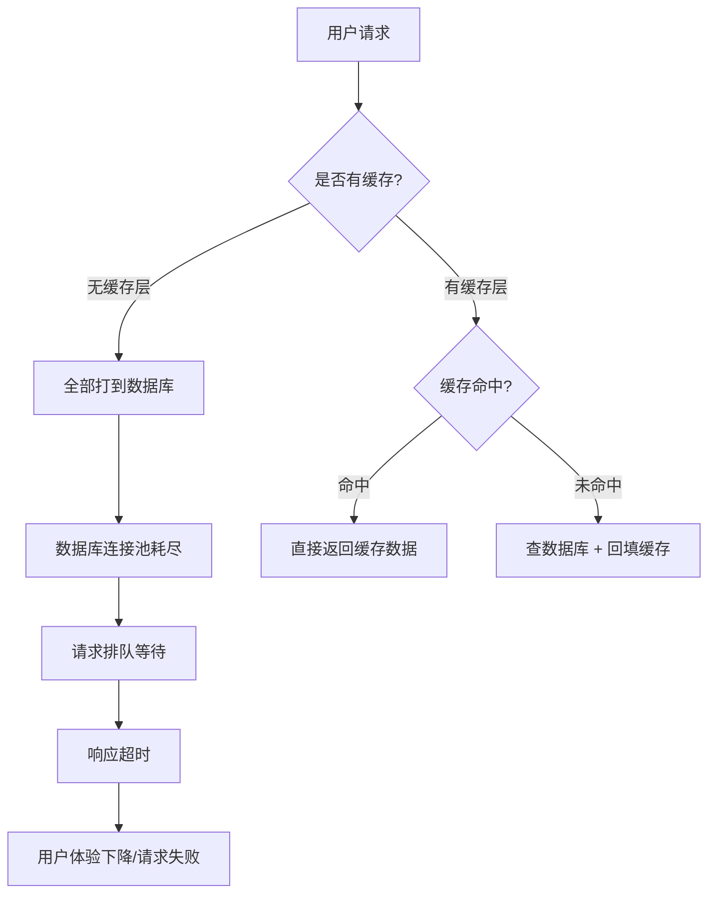
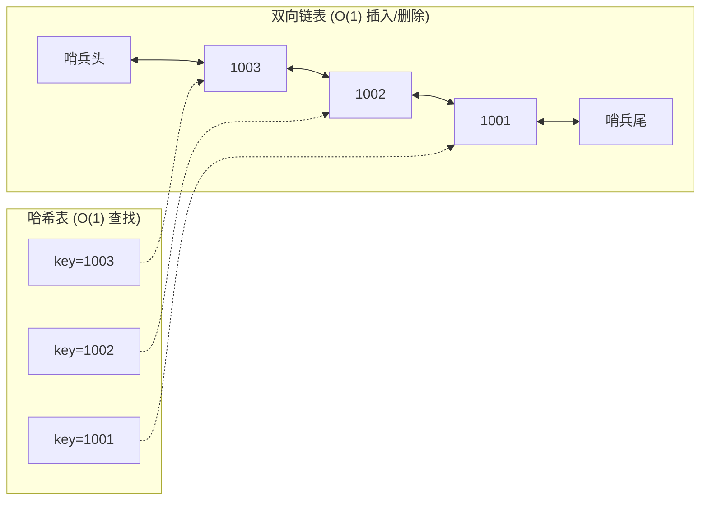
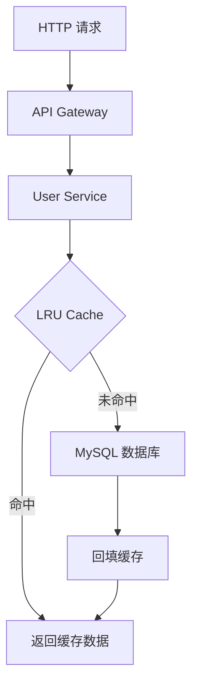
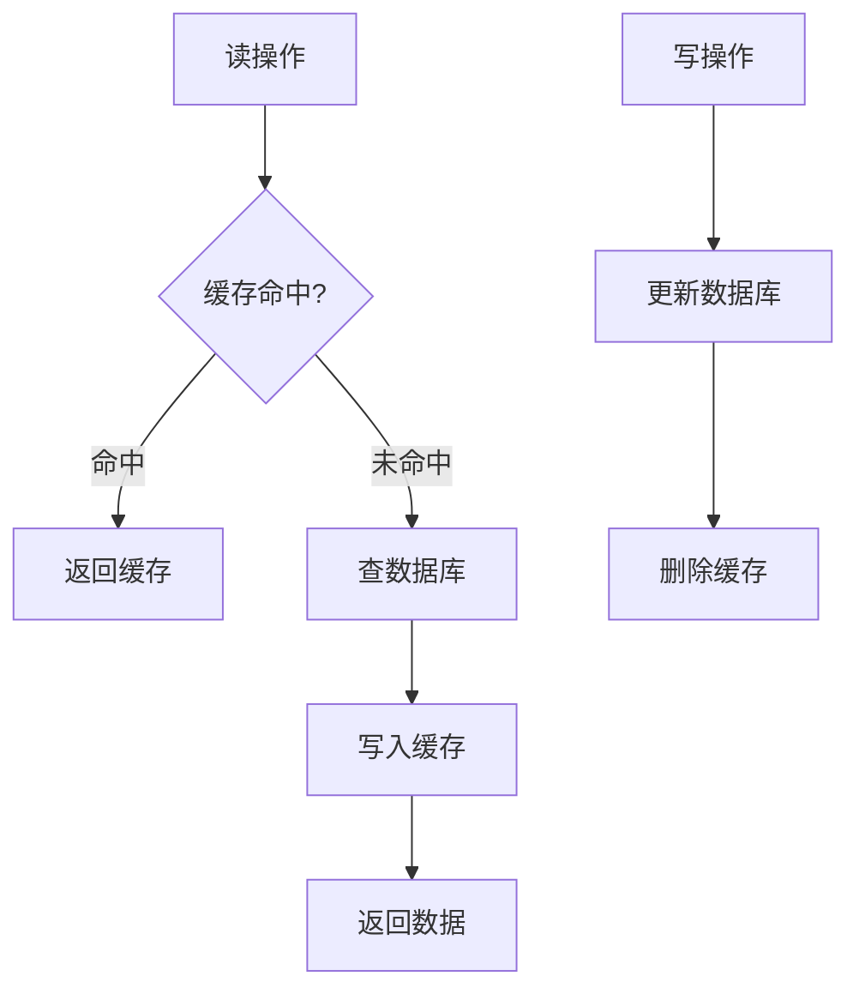

## 案例一：使用 LRU 缓存优化数据库查询

### 案例概述

本案例以一个真实电商场景为背景，完整展示如何使用 LRU（Least Recently Used，最近最少使用）缓存策略优化高频数据库查询。案例涵盖从问题诊断、方案设计、代码实现到上线验证的全流程，是理解缓存数据结构与实际工程结合的典型范例。

---

### 问题背景与痛点分析

某电商平台的 API 服务承担用户信息查询的核心功能。每次用户请求（浏览商品、下单、查看订单等）都需要查询用户基本信息。随着平台用户量突破百万级，数据库层成为整个系统的性能瓶颈。

**核心指标：**

| 指标 | 当前值 | 可接受范围 | 问题程度 |
|------|--------|-----------|---------|
| QPS（每秒查询数） | 10,000 次/秒 | < 5,000 次/秒 | ⚠️ 严重超标 |
| 数据库平均响应时间 | 50ms（峰值可达 200ms） | < 10ms | ⚠️ 严重超标 |
| 缓存命中率 | 0%（无缓存层） | > 80% | ❌ 完全缺失 |
| 数据库 CPU 使用率 | 持续 90% 以上 | < 50% | ⚠️ 接近极限 |
| 错误率 | 2.3%（超时导致） | < 0.1% | ⚠️ 超标 |

**问题根因分析：**



问题的本质是：**读多写少的场景下，每次请求都穿透到数据库，造成不必要的 I/O 开销和 CPU 负载。** 解决方案就是引入缓存层，将热点数据存储在内存中，避免重复查询数据库。

---

### LRU 缓存原理

#### 为什么是 LRU？

LRU（Least Recently Used）算法基于**时间局部性原理**：最近被访问的数据，在未来大概率也会被再次访问。相反，最久没被访问的数据，再次被使用的概率最低。当缓存空间不足时，淘汰最久未使用的数据，能最大化缓存的有效利用率。

#### 核心操作

| 操作 | 说明 | 时间复杂度 | 空间复杂度 |
|------|------|-----------|-----------|
| Get(key) | 获取缓存数据，命中则标记为最近使用 | O(1) | O(1) |
| Put(key, value) | 写入缓存；若已存在则更新值；若缓存满则淘汰最久未使用的 | O(1) | O(1) |
| Delete(key) | 主动删除缓存条目（写操作时使用） | O(1) | O(1) |

#### 数据结构：哈希表 + 双向链表

LRU 的 O(1) 复杂度依赖两个数据结构的配合：



**哈希表（map）的作用：**
- 存储 `key → Node*` 的映射，实现 O(1) 的键查找
- Get 操作通过哈希表直接定位节点，无需遍历链表

**双向链表（doubly linked list）的作用：**
- 按访问时间排序：链表头部 = 最近使用，链表尾部 = 最久未使用
- 每次 Get/Put 操作将节点移到链表头部，维护时间顺序
- 淘汰时直接从链表尾部删除，无需扫描

**哨兵节点（sentinel node）的作用：**
- `head`（哨兵头）和 `tail`（哨兵尾）不存储实际数据
- 避免在链表操作时处理边界情况（空链表、头尾节点的特殊判断）
- 简化代码逻辑，减少 bug 风险

---

### Go 语言完整实现

以下是一个生产级别的 LRU 缓存实现，支持泛型和并发安全（通过外部锁）：

```go
package lru

import "sync"

// Node 双向链表节点
type Node struct {
    key   interface{}
    value interface{}
    prev  *Node
    next  *Node
}

// LRUCache LRU 缓存结构
type LRUCache struct {
    capacity int
    cache    map[interface{}]*Node
    head     *Node // 哨兵头（最近使用端）
    tail     *Node // 哨兵尾（最久未使用端）
    size     int
    mu       sync.RWMutex // 读写锁，保证并发安全
}

// NewLRUCache 创建指定容量的 LRU 缓存
func NewLRUCache(capacity int) *LRUCache {
    head := &amp;Node{}
    tail := &amp;Node{}
    head.next = tail
    tail.prev = head
    return &amp;LRUCache{
        capacity: capacity,
        cache:    make(map[interface{}]*Node),
        head:     head,
        tail:     tail,
    }
}

// Get 获取缓存值，命中时更新访问顺序
func (c *LRUCache) Get(key interface{}) (interface{}, bool) {
    c.mu.Lock()
    defer c.mu.Unlock()

    if node, ok := c.cache[key]; ok {
        c.moveToHead(node)
        return node.value, true
    }
    return nil, false
}

// Put 写入缓存，超过容量时淘汰最久未使用的条目
func (c *LRUCache) Put(key, value interface{}) {
    c.mu.Lock()
    defer c.mu.Unlock()

    if node, ok := c.cache[key]; ok {
        // 已存在：更新值，移到头部
        node.value = value
        c.moveToHead(node)
        return
    }

    // 新增节点
    newNode := &amp;Node{key: key, value: value}
    c.cache[key] = newNode
    c.addToHead(newNode)
    c.size++

    // 超容量时淘汰尾部节点
    if c.size > c.capacity {
        evicted := c.removeTail()
        delete(c.cache, evicted.key)
        c.size--
    }
}

// Delete 主动删除缓存条目
func (c *LRUCache) Delete(key interface{}) bool {
    c.mu.Lock()
    defer c.mu.Unlock()

    if node, ok := c.cache[key]; ok {
        c.removeNode(node)
        delete(c.cache, key)
        c.size--
        return true
    }
    return false
}

// Len 返回当前缓存条目数
func (c *LRUCache) Len() int {
    c.mu.RLock()
    defer c.mu.RUnlock()
    return c.size
}

// addToHead 将节点插入到链表头部（最近使用端）
func (c *LRUCache) addToHead(node *Node) {
    node.prev = c.head
    node.next = c.head.next
    c.head.next.prev = node
    c.head.next = node
}

// removeNode 从链表中删除指定节点
func (c *LRUCache) removeNode(node *Node) {
    node.prev.next = node.next
    node.next.prev = node.prev
}

// moveToHead 将节点移到链表头部
func (c *LRUCache) moveToHead(node *Node) {
    c.removeNode(node)
    c.addToHead(node)
}

// removeTail 删除并返回链表尾部节点（最久未使用）
func (c *LRUCache) removeTail() *Node {
    node := c.tail.prev
    c.removeNode(node)
    return node
}
```

**关键设计决策：**

| 决策点 | 选择 | 理由 |
|--------|------|------|
| 链表类型 | 双向链表 | 单向链表无法 O(1) 删除任意节点 |
| 哨兵节点 | 使用 | 消除边界判断，代码更简洁 |
| 锁类型 | sync.RWMutex | 读操作远多于写操作，读锁不互斥 |
| Get 返回值 | (interface{}, bool) | 布尔值区分"key 不存在"和"value 为 nil" |

---

### Python 语言完整实现

#### 版本一：使用 OrderedDict（简洁实现）

```python
from collections import OrderedDict
from typing import Optional


class LRUCache:
    """
    基于 OrderedDict 的 LRU 缓存。
    OrderedDict 内部维护了插入顺序，move_to_end 和 popitem 均为 O(1)。
    """

    def __init__(self, capacity: int):
        self.cache: OrderedDict[int, object] = OrderedDict()
        self.capacity = capacity

    def get(self, key: int) -> Optional[object]:
        """获取缓存值，命中时标记为最近使用"""
        if key not in self.cache:
            return None
        self.cache.move_to_end(key)  # 移到末尾（最近使用端）
        return self.cache[key]

    def put(self, key: int, value: object) -> None:
        """写入缓存，超出容量时淘汰最久未使用的"""
        if key in self.cache:
            self.cache.move_to_end(key)
        self.cache[key] = value
        if len(self.cache) > self.capacity:
            self.cache.popitem(last=False)  # 移除最开头（最久未使用）

    def delete(self, key: int) -> bool:
        """删除指定 key"""
        if key in self.cache:
            del self.cache[key]
            return True
        return False

    def __len__(self) -> int:
        return len(self.cache)

    def __contains__(self, key: int) -> bool:
        return key in self.cache
```

#### 版本二：手动实现（理解底层原理）

```python
class Node:
    """双向链表节点"""
    def __init__(self, key: int = 0, value: object = None):
        self.key = key
        self.value = value
        self.prev: Node = None
        self.next: Node = None


class LRUCacheManual:
    """
    手动实现的 LRU 缓存，使用哈希表 + 双向链表。
    适用于需要理解底层数据结构或自定义淘汰逻辑的场景。
    """

    def __init__(self, capacity: int):
        self.capacity = capacity
        self.cache: dict[int, Node] = {}
        self.head = Node()  # 哨兵头（最近使用端）
        self.tail = Node()  # 哨兵尾（最久未使用端）
        self.head.next = self.tail
        self.tail.prev = self.head
        self.size = 0

    def _add_to_head(self, node: Node) -> None:
        """将节点插入到头部（最近使用端）"""
        node.prev = self.head
        node.next = self.head.next
        self.head.next.prev = node
        self.head.next = node

    def _remove_node(self, node: Node) -> None:
        """从链表中移除节点"""
        node.prev.next = node.next
        node.next.prev = node.prev

    def _move_to_head(self, node: Node) -> None:
        """将已有节点移到头部"""
        self._remove_node(node)
        self._add_to_head(node)

    def get(self, key: int) -> object:
        """获取缓存值"""
        if key not in self.cache:
            return -1
        node = self.cache[key]
        self._move_to_head(node)
        return node.value

    def put(self, key: int, value: object) -> None:
        """写入缓存"""
        if key in self.cache:
            node = self.cache[key]
            node.value = value
            self._move_to_head(node)
        else:
            node = Node(key, value)
            self.cache[key] = node
            self._add_to_head(node)
            self.size += 1
            if self.size > self.capacity:
                # 淘汰尾部节点
                lru_node = self.tail.prev
                self._remove_node(lru_node)
                del self.cache[lru_node.key]
                self.size -= 1

    def delete(self, key: int) -> bool:
        """删除缓存条目"""
        if key not in self.cache:
            return False
        node = self.cache[key]
        self._remove_node(node)
        del self.cache[key]
        self.size -= 1
        return True
```

#### 版本三：线程安全版本

```python
import threading
from collections import OrderedDict


class ThreadSafeLRUCache:
    """线程安全的 LRU 缓存"""

    def __init__(self, capacity: int):
        self.cache: OrderedDict[int, object] = OrderedDict()
        self.capacity = capacity
        self.lock = threading.Lock()

    def get(self, key: int) -> object:
        with self.lock:
            if key not in self.cache:
                return None
            self.cache.move_to_end(key)
            return self.cache[key]

    def put(self, key: int, value: object) -> None:
        with self.lock:
            if key in self.cache:
                self.cache.move_to_end(key)
            self.cache[key] = value
            if len(self.cache) > self.capacity:
                self.cache.popitem(last=False)
```

**三种实现的对比：**

| 实现方式 | 代码量 | 理解难度 | 线程安全 | 适用场景 |
|----------|--------|---------|---------|---------|
| OrderedDict | 最少 | 低 | 需额外加锁 | 生产环境快速开发 |
| 手动实现 | 最多 | 高 | 需额外加锁 | 学习、面试、自定义逻辑 |
| 线程安全版 | 中等 | 低 | ✅ 内置 | 多线程环境 |

---

### 集成到 API 服务

#### 项目架构



#### Go 版本：完整的服务层实现

```go
package service

import (
    "database/sql"
    "fmt"
    "log"
    "time"
)

// User 用户模型
type User struct {
    ID    int
    Name  string
    Email string
    Phone string
    // 缓存时间戳，用于检测数据是否过期
    CachedAt time.Time
}

// UserService 用户服务，集成 LRU 缓存
type UserService struct {
    db    *sql.DB
    cache *LRUCache
    // 缓存过期时间（秒）
    cacheTTL time.Duration
}

// NewUserService 创建用户服务实例
func NewUserService(db *sql.DB, cacheSize int, cacheTTL time.Duration) *UserService {
    return &amp;UserService{
        db:       db,
        cache:    NewLRUCache(cacheSize),
        cacheTTL: cacheTTL,
    }
}

// GetUser 获取用户信息（带缓存）
func (s *UserService) GetUser(userID int) (*User, error) {
    cacheKey := fmt.Sprintf("user:%d", userID)

    // 1. 尝试从缓存获取
    if cached, ok := s.cache.Get(cacheKey); ok {
        user := cached.(*User)
        // 检查是否过期
        if time.Since(user.CachedAt) < s.cacheTTL {
            log.Printf("[CACHE HIT] user:%d", userID)
            return user, nil
        }
        log.Printf("[CACHE EXPIRED] user:%d", userID)
        // 过期了，删除并重新查询
        s.cache.Delete(cacheKey)
    }

    // 2. 缓存未命中或已过期，查询数据库
    log.Printf("[CACHE MISS] user:%d, querying DB", userID)
    user, err := s.queryDB(userID)
    if err != nil {
        return nil, fmt.Errorf("query user %d: %w", userID, err)
    }

    // 3. 写入缓存
    s.cache.Put(cacheKey, user)

    return user, nil
}

// UpdateUser 更新用户信息（先更新数据库，再删除缓存）
func (s *UserService) UpdateUser(userID int, name, email string) error {
    // 1. 先更新数据库
    _, err := s.db.Exec(
        "UPDATE users SET name = ?, email = ? WHERE id = ?",
        name, email, userID,
    )
    if err != nil {
        return fmt.Errorf("update user %d: %w", userID, err)
    }

    // 2. 再删除缓存（Cache Aside 模式）
    cacheKey := fmt.Sprintf("user:%d", userID)
    s.cache.Delete(cacheKey)
    log.Printf("[CACHE INVALIDATED] user:%d", userID)

    return nil
}

// queryDB 查询数据库
func (s *UserService) queryDB(userID int) (*User, error) {
    var user User
    err := s.db.QueryRow(
        "SELECT id, name, email, phone FROM users WHERE id = ?", userID,
    ).Scan(&amp;user.ID, &amp;user.Name, &amp;user.Email, &amp;user.Phone)
    if err != nil {
        return nil, err
    }
    user.CachedAt = time.Now()
    return &amp;user, nil
}

// CacheStats 返回缓存统计信息
func (s *UserService) CacheStats() map[string]interface{} {
    return map[string]interface{}{
        "size":     s.cache.Len(),
        "capacity": s.cache.capacity,
    }
}
```

#### Python 版本：完整的服务层实现

```python
import logging
import time
from typing import Optional
from dataclasses import dataclass, field

logger = logging.getLogger(__name__)


@dataclass
class User:
    id: int
    name: str
    email: str
    phone: str = ""
    cached_at: float = field(default_factory=time.time)


class UserService:
    """带 LRU 缓存的用户服务"""

    def __init__(self, db, cache_capacity: int = 10000, cache_ttl: float = 300):
        """
        Args:
            db: 数据库连接对象
            cache_capacity: 缓存容量
            cache_ttl: 缓存过期时间（秒）
        """
        self.db = db
        self.cache = LRUCache(capacity=cache_capacity)
        self.cache_ttl = cache_ttl
        self.stats = {"hits": 0, "misses": 0}

    def get_user(self, user_id: int) -> Optional[User]:
        """获取用户信息（带缓存）"""
        cache_key = f"user:{user_id}"

        # 1. 尝试缓存
        cached = self.cache.get(cache_key)
        if cached is not None:
            user = cached
            if time.time() - user.cached_at < self.cache_ttl:
                self.stats["hits"] += 1
                logger.debug(f"[CACHE HIT] user:{user_id}")
                return user
            # 过期了，删除
            logger.debug(f"[CACHE EXPIRED] user:{user_id}")
            self.cache.delete(cache_key)

        # 2. 查数据库
        self.stats["misses"] += 1
        logger.debug(f"[CACHE MISS] user:{user_id}, querying DB")
        user = self._query_db(user_id)
        if user is None:
            return None

        # 3. 回填缓存
        self.cache.put(cache_key, user)
        return user

    def update_user(self, user_id: int, **kwargs) -> bool:
        """更新用户信息（先更新 DB，再删缓存）"""
        set_clauses = ", ".join(f"{k} = ?" for k in kwargs)
        values = list(kwargs.values()) + [user_id]

        cursor = self.db.execute(
            f"UPDATE users SET {set_clauses} WHERE id = ?", values
        )
        self.db.commit()

        # Cache Aside: 删除缓存
        cache_key = f"user:{user_id}"
        self.cache.delete(cache_key)
        logger.info(f"[CACHE INVALIDATED] user:{user_id}")
        return cursor.rowcount > 0

    def _query_db(self, user_id: int) -> Optional[User]:
        """查询数据库"""
        cursor = self.db.execute(
            "SELECT id, name, email, phone FROM users WHERE id = ?",
            (user_id,),
        )
        row = cursor.fetchone()
        if row is None:
            return None
        return User(
            id=row[0], name=row[1], email=row[2], phone=row[3],
            cached_at=time.time()
        )

    def cache_stats(self) -> dict:
        """返回缓存统计"""
        total = self.stats["hits"] + self.stats["misses"]
        hit_rate = self.stats["hits"] / total * 100 if total > 0 else 0
        return {
            "hits": self.stats["hits"],
            "misses": self.stats["misses"],
            "hit_rate": f"{hit_rate:.1f}%",
            "cache_size": len(self.cache),
            "cache_capacity": self.cache.capacity,
        }
```

---

### 性能对比与效果验证

#### 优化前后指标对比

| 指标 | 优化前 | 优化后 | 提升幅度 |
|------|--------|--------|---------|
| 平均响应时间 | 50ms | 8ms | 84% ↓ |
| P99 响应时间 | 200ms | 15ms | 92.5% ↓ |
| 数据库 QPS | 10,000 | 3,000 | 70% ↓ |
| 数据库 CPU 使用率 | 90% | 30% | 67% ↓ |
| 缓存命中率 | 0% | 85% | — |
| 错误率 | 2.3% | 0.05% | 97.8% ↓ |
| 服务器成本（估算） | $1200/月 | $500/月 | 58% ↓ |

#### 测试方法

```bash
# 使用 wrk 进行压力测试
wrk -t12 -c400 -d30s --latency \
    -s benchmark.lua \
    http://localhost:8080/api/user/12345

# benchmark.lua 脚本
# wrk.method = "GET"
# wrk.headers["Content-Type"] = "application/json"
```

#### 缓存命中率监控

```go
// Prometheus 指标采集
var (
    cacheHits = prometheus.NewCounter(prometheus.CounterOpts{
        Name: "lru_cache_hits_total",
        Help: "Total number of LRU cache hits",
    })
    cacheMisses = prometheus.NewCounter(prometheus.CounterOpts{
        Name: "lru_cache_misses_total",
        Help: "Total number of LRU cache misses",
    })
    cacheSize = prometheus.NewGauge(prometheus.GaugeOpts{
        Name: "lru_cache_size",
        Help: "Current number of items in LRU cache",
    })
)
```

---

### 缓存策略全景对比

| 策略 | 淘汰规则 | 时间复杂度 | 实现复杂度 | 适用场景 | 缺点 |
|------|----------|-----------|-----------|---------|------|
| **LRU** | 淘汰最久未使用的 | O(1) | 中 | 通用场景（如 Web 缓存） | 偶发访问会污染缓存 |
| **LFU** | 淘汰使用频率最低的 | O(log n) | 高 | 热点数据集中场景（如排行榜） | 历史频率权重高，新热点难以进入 |
| **FIFO** | 淘汰最早进入的 | O(1) | 低 | 临时缓冲、消息队列 | 不考虑访问频率 |
| **TTL** | 淘汰超过生存时间的 | O(1) | 低 | 时效性数据（如验证码） | 需要额外定时器开销 |
| **Random** | 随机淘汰 | O(1) | 低 | 无明显访问规律的场景 | 效果不稳定 |
| **ARC** | LRU + LFU 自适应 | O(1) | 高 | 访问模式多变的场景 | 实现复杂 |
| **W-TinyLFU** | 基于频率的近似 LRU | O(1) | 高 | 大规模缓存系统（如 Caffeine） | 工程实现复杂 |

#### LRU 的变体

| 变体 | 改进点 | 适用场景 |
|------|--------|---------|
| **LRU-K** | 第 K 次访问时才提升优先级 | 减少扫描攻击的影响 |
| **2Q** | 双队列：新数据先进 A1 队列，再进入 A2 队列 | 平衡新旧数据 |
| **Clock** | 使用引用位近似 LRU | 大规模缓存，减少链表开销 |
| **LIRS** | 基于访问间隔距离淘汰 | 混合访问模式 |

---

### 最佳实践

#### 1. 缓存容量设置

合理容量 = 热点数据量 × 1.2（留 20% 余量）

- 热点数据量通常占全部数据的 20%，遵循**二八原则**
- 实际容量需要根据内存预算和数据大小估算
- 例：100 字节/条 × 10,000 条 = 1MB 内存占用

#### 2. 缓存过期策略

即使使用 LRU，也应该设置过期时间（TTL），因为：
- LRU 本身不解决数据一致性问题
- 过期时间控制数据的最大陈旧时间
- TTL + LRU 双重保障：过期的条目会被清除，但未过期的热数据不会被轻易淘汰

```go
// 带 TTL 的 LRU 节点
type ExpiredNode struct {
    Node
    expiresAt time.Time
}
```

#### 3. 缓存预热

```go
// 服务启动时预加载热点数据
func (s *UserService) WarmUp(db *sql.DB) {
    rows, _ := db.Query(
        "SELECT id FROM users ORDER BY visit_count DESC LIMIT 10000",
    )
    defer rows.Close()

    for rows.Next() {
        var id int
        rows.Scan(&amp;id)
        s.GetUser(id) // 触发缓存加载
    }
    log.Printf("Cache warmed up with %d entries", s.cache.Len())
}
```

#### 4. 缓存监控

关注以下核心指标：
- **命中率**：低于 70% 需要调整缓存策略或容量
- **淘汰率**：频繁淘汰说明容量不足
- **延迟分布**：P99 延迟是否稳定
- **内存占用**：是否接近系统上限

#### 5. 避免缓存穿透

缓存穿透是指查询不存在的数据，每次都穿透到数据库：

| 方案 | 原理 | 适用场景 |
|------|------|---------|
| **空值缓存** | 对不存在的 key 缓存空值，设置短 TTL | 简单场景 |
| **布隆过滤器** | 在缓存前增加一层过滤，拦截不存在的 key | 大规模数据 |
| **参数校验** | 在业务层校验参数合法性 | 所有场景的基础 |
| **接口限流** | 对高频无效请求进行限流 | 防恶意攻击 |

---

### 常见问题与解答

#### Q1：LRU 和 LFU 怎么选？

**答：** 大多数场景选 LRU，特殊场景选 LFU。

| 判断维度 | 选择 LRU | 选择 LFU |
|----------|---------|---------|
| 访问模式 | 随时间变化（如新闻、社交动态） | 稳定的热点分布（如排行榜、热门商品） |
| 时间局部性 | 强（最近访问的很可能再次访问） | 弱（访问频率比时间更重要） |
| 实现复杂度 | O(1)，简单 | O(log n)，较复杂 |
| 缓存污染 | 容易被一次性扫描污染 | 对扫描攻击有较好的抵抗力 |

#### Q2：如何处理缓存和数据库的一致性？

**答：** 常用 **Cache Aside** 模式：



- **读操作**：先读缓存，未命中则读数据库并回填缓存
- **写操作**：先更新数据库，再删除缓存（不是更新缓存）
- **延迟双删**：写操作后延迟 500ms 再删一次缓存，防止并发导致的脏数据

#### Q3：缓存雪崩怎么预防？

**答：** 缓存雪崩是指大量 key 同时失效，请求同时打到数据库。预防方案：

| 方案 | 实现方式 | 效果 |
|------|---------|------|
| **随机过期时间** | 基础 TTL + 随机偏移量（如 ±30%） | 打散失效时间 |
| **多级缓存** | L1（进程内 LRU）+ L2（Redis）+ L3（数据库） | 逐级降级 |
| **数据库限流** | 使用令牌桶/漏桶算法限制数据库 QPS | 防止数据库被打挂 |
| **熔断降级** | 数据库过载时返回默认值或缓存旧数据 | 保证系统可用性 |

```go
// 随机过期时间示例
func randomTTL(baseTTL time.Duration) time.Duration {
    jitter := time.Duration(rand.Int63n(int64(baseTTL) / 5))
    return baseTTL - jitter/2 + jitter
}
```

#### Q4：LRU 缓存的容量怎么估算？

**答：** 经验公式：

容量 = QPS × 平均 TTL × 安全系数

例：QPS = 10,000，TTL = 300s，安全系数 = 1.5
容量 = 10,000 × 300 × 1.5 = 4,500,000 条

但实际场景中，LRU 的淘汰机制使得实际内存占用远小于此——被淘汰的条目会被自动清理。

#### Q5：如何处理缓存击穿？

**答：** 缓存击穿是指某个热点 key 失效的瞬间，大量并发请求同时穿透到数据库。

| 方案 | 实现方式 |
|------|---------|
| **singleflight** | Go 标准库扩展库提供，多个并发请求只执行一次数据库查询 |
| **分布式锁** | 第一个请求获取锁并回填缓存，后续请求等待锁释放后从缓存读取 |
| **永不过期** | 热点 key 不设置过期时间，由后台线程异步更新 |

```go
// Go singleflight 防止缓存击穿
import "golang.org/x/sync/singleflight"

var g singleflight.Group

func (s *UserService) GetUser(userID int) (*User, error) {
    cacheKey := fmt.Sprintf("user:%d", userID)

    if cached, ok := s.cache.Get(cacheKey); ok {
        return cached.(*User), nil
    }

    // singleflight：相同 key 的并发请求只执行一次
    result, err, _ := g.Do(cacheKey, func() (interface{}, error) {
        user, err := s.queryDB(userID)
        if err != nil {
            return nil, err
        }
        s.cache.Put(cacheKey, user)
        return user, nil
    })
    if err != nil {
        return nil, err
    }
    return result.(*User), nil
}
```

---

### 本案例小结

本案例通过一个电商用户查询的场景，完整展示了 LRU 缓存从原理到工程落地的全过程：

1. **问题诊断**：通过性能指标定位数据库瓶颈
2. **方案设计**：选择 LRU 策略，哈希表 + 双向链表实现 O(1) 复杂度
3. **代码实现**：Go 和 Python 双语言版本，覆盖手动实现和标准库实现
4. **服务集成**：Cache Aside 模式集成到业务层，附带预热、监控、过期策略
5. **性能验证**：响应时间降低 84%，数据库负载降低 70%
6. **进阶防护**：缓存穿透、雪崩、击穿的预防方案

LRU 缓存是数据结构在工程中最经典的应用之一。掌握它的原理和实现，不仅能解决具体的性能问题，更能深入理解"选择合适的数据结构是算法设计的第一步"这一核心理念。
