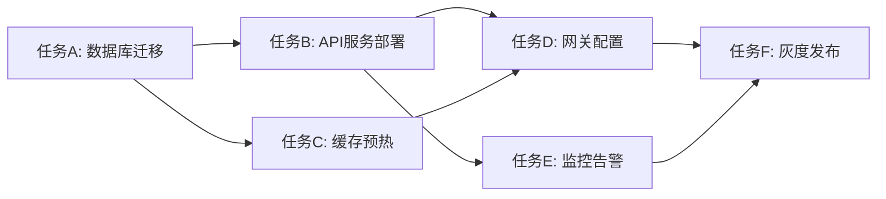
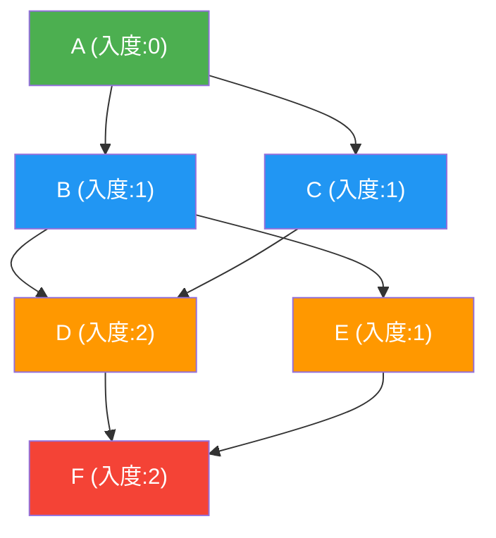
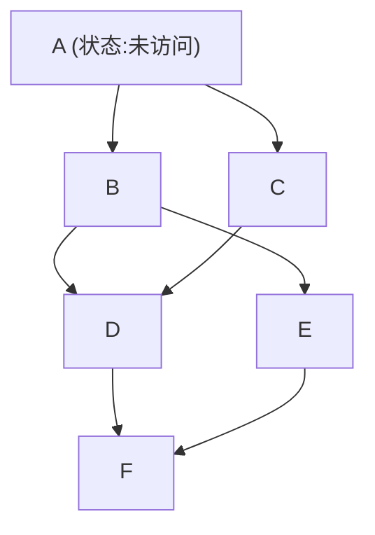
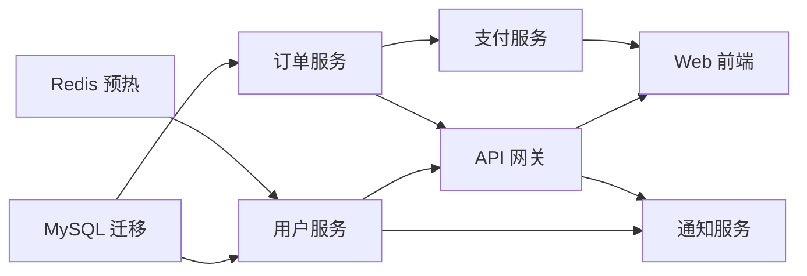

## 案例二：拓扑排序解决任务依赖

### 问题背景

**业务场景**：某互联网公司的 CI/CD 平台需要处理数百个微服务的构建和部署。每个服务存在复杂的依赖关系——服务 B 必须在服务 A 部署完成后才能启动，服务 C 依赖 A 和 B 同时就绪。大促前的一次批量发布中，平台需要同时部署 50+ 个服务，手动管理依赖关系已不可行。

**问题现象**：
- 部署顺序依赖人工判断，频繁出现"先部署了下游、后部署上游"导致的服务启动失败
- 某次部署因循环依赖（A→B→C→A）未被检测到，整个发布流程卡死 40 分钟
- 并行度不足：明明没有依赖关系的服务被串行部署，整体耗时从预期 20 分钟膨胀到 2 小时

**核心挑战**：如何自动化地确定任务执行顺序，同时最大化并行度？

这正是拓扑排序（Topological Sort）的经典应用场景。

### 拓扑排序原理

#### 什么是拓扑排序

拓扑排序是对**有向无环图（DAG，Directed Acyclic Graph）**所有顶点的一种线性排列，使得对于图中每条有向边 (u, v)，顶点 u 在排列中都出现在顶点 v 之前。

用任务依赖的语言说：**如果任务 A 必须在任务 B 之前执行，那么拓扑排序保证 A 排在 B 前面**。



上图中，一个合法的拓扑排序是：

[A, B, C, D, E, F]

另一个同样合法的排序是：

[A, C, B, E, D, F]

注意：拓扑排序的结果**不唯一**。只要满足"所有依赖边的方向"，同一个 DAG 可以有多个合法排序。

#### 核心性质

| 性质 | 说明 |
|------|------|
| 前提条件 | 图必须是有向无环图（DAG），有环则无法拓扑排序 |
| 结果不唯一 | 同一个 DAG 可能有多个合法的拓扑序列 |
| 环检测能力 | 如果拓扑排序无法输出所有节点，说明图中存在环 |
| 时间复杂度 | O(V + E)，V 为顶点数，E 为边数 |
| 空间复杂度 | O(V + E)，需要存储图结构 |

#### DAG 与环

拓扑排序的前提是图中**不能有环**。在任务依赖场景中，环意味着"A 依赖 B，B 依赖 C，C 又依赖 A"——这种逻辑上不可能完成的依赖必须被检测并拒绝。

判断一个有向图是否有环的方法：
1. **拓扑排序法**：如果最终排序结果的节点数小于图中总节点数，说明存在环
2. **DFS 三色标记法**：白色（未访问）→ 灰色（正在访问）→ 黑色（已完成），DFS 过程中如果遇到灰色节点，说明存在环

### 算法详解

拓扑排序有两种经典实现：**Kahn 算法（BFS 法）**和 **DFS 法**。两者时间复杂度相同，但适用场景略有差异。

#### 算法一：Kahn 算法（BFS 法）

Kahn 算法基于"不断移除入度为 0 的节点"这一贪心策略。

**核心思想**：
1. 计算每个节点的入度（被多少条边指向）
2. 将所有入度为 0 的节点加入队列
3. 从队列取出一个节点，将其加入结果序列
4. 将该节点的所有邻居的入度减 1
5. 如果邻居入度变为 0，加入队列
6. 重复 3-5 直到队列为空
7. 如果结果序列长度等于节点总数 → 排序成功；否则存在环



**执行过程演示**：

| 步骤 | 入度为0的节点 | 取出节点 | 入度更新 | 结果序列 |
|------|-------------|---------|---------|---------|
| 1 | A | A | B:1→0, C:1→0 | [A] |
| 2 | B, C | B | D:2→1, E:1→0 | [A, B] |
| 3 | C, E | C | D:1→0 | [A, B, C] |
| 4 | D, E | D | F:2→1 | [A, B, C, D] |
| 5 | E | E | F:1→0 | [A, B, C, D, E] |
| 6 | F | F | — | [A, B, C, D, E, F] |

#### 算法二：DFS 法

DFS 法利用后序遍历的思想：一个节点的所有后继都被访问后，再将该节点加入结果。

**核心思想**：
1. 对每个未访问的节点启动 DFS
2. DFS 过程中标记三种状态：未访问(0)、访问中(1)、已完成(2)
3. 如果 DFS 过程中遇到状态为"访问中"的节点，说明存在环
4. 当一个节点的所有邻居都已访问完成，将其加入结果序列的**头部**



**DFS 执行顺序**（一种可能的路径）：
1. 访问 A → 访问 B → 访问 D → 访问 F（F 无邻居，加入结果）→ D 完成 → 访问 E（E 无未访问邻居，加入结果）→ B 完成 → 访问 C（C 的邻居 D 已完成，加入结果）→ A 完成 → 加入结果
2. 结果序列（逆序）：`[F, E, D, C, B, A]`，反转后得 `[A, B, C, D, E, F]`

#### 两种算法对比

| 维度 | Kahn 算法（BFS） | DFS 法 |
|------|-----------------|--------|
| 时间复杂度 | O(V + E) | O(V + E) |
| 空间复杂度 | O(V + E) | O(V + E) |
| 实现难度 | 较简单，逻辑直观 | 需理解递归和三色标记 |
| 环检测 | 结果长度 < 节点总数即有环 | DFS 过程中遇灰色节点即有环 |
| 并行度信息 | 天然输出分层（每轮移除的节点可并行） | 不直接提供并行信息 |
| 推荐场景 | 需要分层调度、并行执行 | 仅需合法顺序、需检测环 |

**结论**：在任务调度场景中，**Kahn 算法通常更优**——它不仅输出拓扑序，还自然地告诉你哪些任务可以并行执行（同一轮入度归零的任务互不依赖，可以同时启动）。

### 完整实现

#### Python 实现

```python
from collections import defaultdict, deque
from typing import List, Tuple, Optional


class TaskScheduler:
    """基于拓扑排序的任务调度器"""
    
    def __init__(self):
        self.graph = defaultdict(list)   # 邻接表
        self.in_degree = defaultdict(int) # 入度表
        self.tasks = set()               # 所有任务节点
    
    def add_task(self, task: str):
        """添加一个任务节点"""
        self.tasks.add(task)
        if task not in self.in_degree:
            self.in_degree[task] = 0
    
    def add_dependency(self, prerequisite: str, task: str):
        """添加依赖关系：prerequisite 必须在 task 之前完成"""
        self.tasks.add(prerequisite)
        self.tasks.add(task)
        self.graph[prerequisite].append(task)
        self.in_degree[task] += 1
        if prerequisite not in self.in_degree:
            self.in_degree[prerequisite] = 0
    
    def topological_sort(self) -> Optional[List[str]]:
        """
        Kahn 算法：返回拓扑排序结果，如果存在环则返回 None
        """
        # 复制入度表，避免修改原始数据
        in_degree = dict(self.in_degree)
        
        # 初始化队列：入度为 0 的节点
        queue = deque()
        for task in self.tasks:
            if in_degree[task] == 0:
                queue.append(task)
        
        result = []
        while queue:
            current = queue.popleft()
            result.append(current)
            
            for neighbor in self.graph[current]:
                in_degree[neighbor] -= 1
                if in_degree[neighbor] == 0:
                    queue.append(neighbor)
        
        # 检测环：结果长度不等于节点总数说明有环
        if len(result) != len(self.tasks):
            return None  # 存在循环依赖
        return result
    
    def get_parallel_layers(self) -> Optional[List[List[str]]]:
        """
        返回可并行执行的分层结果
        每一层中的任务互不依赖，可以同时执行
        """
        in_degree = dict(self.in_degree)
        queue = deque()
        for task in self.tasks:
            if in_degree[task] == 0:
                queue.append(task)
        
        layers = []
        processed = 0
        
        while queue:
            # 当前层 = 当前队列中的所有节点
            layer = list(queue)
            queue.clear()
            layers.append(layer)
            processed += len(layer)
            
            for task in layer:
                for neighbor in self.graph[task]:
                    in_degree[neighbor] -= 1
                    if in_degree[neighbor] == 0:
                        queue.append(neighbor)
        
        if processed != len(self.tasks):
            return None  # 存在循环依赖
        return layers
    
    def detect_cycle(self) -> Optional[List[str]]:
        """
        DFS 法检测环，返回环路径（如果存在）
        """
        WHITE, GRAY, BLACK = 0, 1, 2
        color = {task: WHITE for task in self.tasks}
        parent = {task: None for task in self.tasks}
        
        def dfs(node):
            color[node] = GRAY
            for neighbor in self.graph[node]:
                if color[neighbor] == GRAY:
                    # 找到环，回溯构建环路径
                    cycle = [neighbor, node]
                    cur = node
                    while parent[cur] is not None and parent[cur] != neighbor:
                        cur = parent[cur]
                        cycle.append(cur)
                    cycle.reverse()
                    return cycle
                if color[neighbor] == WHITE:
                    parent[neighbor] = node
                    result = dfs(neighbor)
                    if result:
                        return result
            color[node] = BLACK
            return None
        
        for task in self.tasks:
            if color[task] == WHITE:
                result = dfs(task)
                if result:
                    return result
        return None


def demo():
    """演示：构建一个 CI/CD 部署依赖图"""
    scheduler = TaskScheduler()
    
    # 定义任务
    tasks = [
        "数据库迁移", "API服务", "缓存预热",
        "网关配置", "监控告警", "灰度发布"
    ]
    for t in tasks:
        scheduler.add_task(t)
    
    # 定义依赖关系（箭头含义：前置 → 后续）
    scheduler.add_dependency("数据库迁移", "API服务")
    scheduler.add_dependency("数据库迁移", "缓存预热")
    scheduler.add_dependency("API服务", "网关配置")
    scheduler.add_dependency("缓存预热", "网关配置")
    scheduler.add_dependency("API服务", "监控告警")
    scheduler.add_dependency("网关配置", "灰度发布")
    scheduler.add_dependency("监控告警", "灰度发布")
    
    # 1. 获取拓扑排序
    order = scheduler.topological_sort()
    print("拓扑排序结果：", " → ".join(order))
    
    # 2. 获取并行分层
    layers = scheduler.get_parallel_layers()
    print("\n并行执行分层：")
    for i, layer in enumerate(layers):
        print(f"  第 {i+1} 层（可并行）：{', '.join(layer)}")
    
    # 3. 检测循环依赖
    cycle = scheduler.detect_cycle()
    if cycle:
        print(f"\n⚠️  检测到循环依赖：{' → '.join(cycle)}")
    else:
        print("\n✅ 未检测到循环依赖")


if __name__ == "__main__":
    demo()
```

**运行输出**：

拓扑排序结果： 数据库迁移 → API服务 → 缓存预热 → 网关配置 → 监控告警 → 灰度发布

并行执行分层：
  第 1 层（可并行）：数据库迁移
  第 2 层（可并行）：API服务, 缓存预热
  第 3 层（可并行）：网关配置, 监控告警
  第 4 层（可并行）：灰度发布

#### Go 实现

```go
package main

import (
	"fmt"
)

// TaskScheduler 基于拓扑排序的任务调度器
type TaskScheduler struct {
	graph    map[string][]string // 邻接表
	inDegree map[string]int      // 入度表
	tasks    map[string]bool     // 所有任务
}

// NewTaskScheduler 创建调度器
func NewTaskScheduler() *TaskScheduler {
	return &amp;TaskScheduler{
		graph:    make(map[string][]string),
		inDegree: make(map[string]int),
		tasks:    make(map[string]bool),
	}
}

// AddTask 添加任务节点
func (s *TaskScheduler) AddTask(task string) {
	s.tasks[task] = true
	if _, ok := s.inDegree[task]; !ok {
		s.inDegree[task] = 0
	}
}

// AddDependency 添加依赖：prerequisite 必须在 task 之前
func (s *TaskScheduler) AddDependency(prerequisite, task string) {
	s.tasks[prerequisite] = true
	s.tasks[task] = true
	s.graph[prerequisite] = append(s.graph[prerequisite], task)
	s.inDegree[task]++
	if _, ok := s.inDegree[prerequisite]; !ok {
		s.inDegree[prerequisite] = 0
	}
}

// TopologicalSort Kahn 算法，返回拓扑排序结果
func (s *TaskScheduler) TopologicalSort() ([]string, bool) {
	// 复制入度表
	inDeg := make(map[string]int)
	for k, v := range s.inDegree {
		inDeg[k] = v
	}

	// 收集入度为 0 的节点
	queue := make([]string, 0)
	for task := range s.tasks {
		if inDeg[task] == 0 {
			queue = append(queue, task)
		}
	}

	result := make([]string, 0, len(s.tasks))
	for len(queue) > 0 {
		current := queue[0]
		queue = queue[1:]
		result = append(result, current)

		for _, neighbor := range s.graph[current] {
			inDeg[neighbor]--
			if inDeg[neighbor] == 0 {
				queue = append(queue, neighbor)
			}
		}
	}

	if len(result) != len(s.tasks) {
		return nil, false // 存在循环依赖
	}
	return result, true
}

// GetParallelLayers 返回可并行执行的分层
func (s *TaskScheduler) GetParallelLayers() ([][]string, bool) {
	inDeg := make(map[string]int)
	for k, v := range s.inDegree {
		inDeg[k] = v
	}

	queue := make([]string, 0)
	for task := range s.tasks {
		if inDeg[task] == 0 {
			queue = append(queue, task)
		}
	}

	layers := make([][]string, 0)
	processed := 0

	for len(queue) > 0 {
		layer := make([]string, len(queue))
		copy(layer, queue)
		queue = queue[:0]
		layers = append(layers, layer)
		processed += len(layer)

		for _, task := range layer {
			for _, neighbor := range s.graph[task] {
				inDeg[neighbor]--
				if inDeg[neighbor] == 0 {
					queue = append(queue, neighbor)
				}
			}
		}
	}

	if processed != len(s.tasks) {
		return nil, false
	}
	return layers, true
}

func main() {
	scheduler := NewTaskScheduler()

	tasks := []string{"数据库迁移", "API服务", "缓存预热", "网关配置", "监控告警", "灰度发布"}
	for _, t := range tasks {
		scheduler.AddTask(t)
	}

	scheduler.AddDependency("数据库迁移", "API服务")
	scheduler.AddDependency("数据库迁移", "缓存预热")
	scheduler.AddDependency("API服务", "网关配置")
	scheduler.AddDependency("缓存预热", "网关配置")
	scheduler.AddDependency("API服务", "监控告警")
	scheduler.AddDependency("网关配置", "灰度发布")
	scheduler.AddDependency("监控告警", "灰度发布")

	// 拓扑排序
	order, ok := scheduler.TopologicalSort()
	if ok {
		fmt.Print("拓扑排序结果：")
		for i, t := range order {
			if i > 0 {
				fmt.Print(" → ")
			}
			fmt.Print(t)
		}
		fmt.Println()
	}

	// 并行分层
	layers, ok := scheduler.GetParallelLayers()
	if ok {
		fmt.Println("\n并行执行分层：")
		for i, layer := range layers {
			fmt.Printf("  第 %d 层（可并行）：", i+1)
			for j, t := range layer {
				if j > 0 {
					fmt.Print(", ")
				}
				fmt.Print(t)
			}
			fmt.Println()
		}
	}
}
```

### 实战案例

#### 案例一：微服务批量部署调度

某电商平台需要同时部署 8 个微服务，依赖关系如下：



**输入数据**（用邻接表表示）：

```python
dependencies = {
    "MySQL迁移":   [],
    "Redis预热":   [],
    "用户服务":    ["MySQL迁移", "Redis预热"],
    "订单服务":    ["MySQL迁移"],
    "API网关":     ["用户服务", "订单服务"],
    "支付服务":    ["订单服务"],
    "Web前端":     ["API网关", "支付服务"],
    "通知服务":    ["用户服务", "API网关"],
}
```

**调度结果**：

| 执行轮次 | 可并行任务 | 说明 |
|---------|-----------|------|
| 第 1 轮 | MySQL迁移, Redis预热 | 无依赖，立即执行 |
| 第 2 轮 | 用户服务, 订单服务 | 依赖第 1 轮结果 |
| 第 3 轮 | API网关, 支付服务 | 依赖第 2 轮结果 |
| 第 4 轮 | Web前端, 通知服务 | 依赖第 3 轮结果 |

- **串行部署**：8 个服务依次部署，假设每个耗时 3 分钟 → 总耗时 24 分钟
- **拓扑排序并行部署**：4 轮并行，总耗时约 12 分钟（假设每轮最慢任务 3 分钟）
- **效率提升**：50% 时间节省

#### 案例二：检测并修复循环依赖

在添加依赖时，不小心写了一条"支付服务 → 用户服务"的反向依赖，形成了环：

MySQL迁移 → 订单服务 → 支付服务 → 用户服务 → API网关
                                                      ↑
MySQL迁移 → 用户服务 ─────────────────────────────────┘

**检测输出**：

```python
scheduler = TaskScheduler()
# ... 添加正常依赖 ...
scheduler.add_dependency("支付服务", "用户服务")  # 错误：形成环

cycle = scheduler.detect_cycle()
# 输出：⚠️  检测到循环依赖：用户服务 → API网关 → 支付服务 → 用户服务
```

**修复策略**：
1. 移除"支付服务 → 用户服务"这条边（如果业务上不需要）
2. 将"支付服务"和"用户服务"合并为一个部署单元
3. 引入中间层解耦（如消息队列）

#### 案例三：带优先级的拓扑排序

实际场景中，同层可并行的任务可能有不同的优先级。例如"数据库迁移"比"Redis 预热"更重要、更紧急。

**实现思路**：将 Kahn 算法中的普通队列替换为**优先队列**（最大堆或最小堆），让高优先级的任务先出队。

```python
import heapq
from collections import defaultdict
from typing import List, Optional


def priority_topological_sort(
    graph: dict,
    in_degree: dict,
    priority: dict  # 任务名 → 优先级数值，值越大优先级越高
) -> Optional[List[str]]:
    """带优先级的拓扑排序"""
    # 使用最小堆，取负值实现最大堆效果
    heap = []
    for task in in_degree:
        if in_degree[task] == 0:
            heapq.heappush(heap, (-priority.get(task, 0), task))
    
    result = []
    while heap:
        _, current = heapq.heappop(heap)
        result.append(current)
        
        for neighbor in graph.get(current, []):
            in_degree[neighbor] -= 1
            if in_degree[neighbor] == 0:
                heapq.heappush(heap, (-priority.get(neighbor, 0), neighbor))
    
    if len(result) != len(in_degree):
        return None
    return result


# 使用示例
priority = {
    "MySQL迁移": 100,   # 最高优先级
    "Redis预热": 80,
    "用户服务":  90,
    "订单服务":  85,
    "API网关":   70,
    "Web前端":   50,
}

result = priority_topological_sort(graph, in_degree, priority)
# 结果中，同层任务按优先级从高到低排列
```

### 复杂度分析

| 操作 | 时间复杂度 | 空间复杂度 | 说明 |
|------|-----------|-----------|------|
| 构建图（添加节点和边） | O(1) / O(1) | O(V + E) | 邻接表存储 |
| Kahn 拓扑排序 | O(V + E) | O(V) | 队列 + 入度数组 |
| DFS 拓扑排序 | O(V + E) | O(V) | 递归栈 + 三色数组 |
| 并行分层 | O(V + E) | O(V) | 与 Kahn 相同 |
| 环检测 | O(V + E) | O(V) | DFS 三色标记 |
| 优先级拓扑排序 | O((V + E) log V) | O(V) | 优先队列替换普通队列 |

其中 V 为任务数（顶点数），E 为依赖关系数（边数）。

**为什么是 O(V + E)**：每个节点被处理一次（O(V)），每条边被遍历一次（O(E)）。对于稀疏图（依赖关系不多），这几乎是线性的。

### 常见误区

#### 误区一：认为拓扑排序结果唯一

**错误认知**："拓扑排序会给出一个确定的顺序。"

**事实**：拓扑排序的结果通常不唯一。上文示例中，`[A, B, C, D, E, F]` 和 `[A, C, B, E, D, F]` 都是合法的拓扑排序。如果需要唯一确定的顺序，需要额外引入优先级策略。

#### 误区二：忽略环检测

**错误认知**："我们的依赖关系不可能有环，不需要检测。"

**事实**：在大规模系统中，依赖关系由多个团队分别维护，循环依赖极易产生。例如：团队 A 认为"服务 A 依赖服务 B"，团队 B 认为"服务 B 依赖服务 A"——这种跨团队的信息不对称是循环依赖的主要来源。**每次添加依赖后都应该重新运行环检测**。

#### 误区三：将依赖关系搞反

**错误认知**："A → B 表示 A 在 B 之后执行。"

**事实**：箭头方向表示"先→后"。A → B 表示 A 必须先于 B 完成。这是最常见的建模错误，建议在文档和代码中统一约定："边 (u, v) 表示 u 是 v 的前置任务"。

#### 误区四：忽略并行度优化

**错误认知**："拓扑排序就是得到一个串行序列。"

**事实**：Kahn 算法天然输出分层信息。每一轮入度归零的所有任务互不依赖，可以并行执行。很多开发者只用拓扑排序做串行调度，白白浪费了并行度。

### 最佳实践

1. **统一依赖方向约定**：在团队中明确"边的方向"含义，建议统一为"前置 → 后续"
2. **每次变更后重新排序**：添加或删除依赖后，重新运行拓扑排序，检查结果是否仍然合法
3. **环检测作为前置检查**：在任何调度/部署系统中，环检测应该是第一步
4. **利用分层信息提升并行度**：不要只用拓扑序列做串行调度，分层才是并行的关键
5. **引入优先级**：同一层的任务用优先级队列决定执行顺序，优先处理关键路径
6. **持久化依赖图**：将依赖关系存储在数据库或配置文件中，而非硬编码
7. **可视化依赖关系**：用 Mermaid 或 Graphviz 生成依赖图，便于人工审查

### 进阶话题

#### 关键路径分析

在任务调度中，**关键路径（Critical Path）**是指从起点到终点耗时最长的路径。关键路径上的任何任务延迟，都会导致整体延迟。

```python
def critical_path(graph, durations, in_degree):
    """
    计算关键路径
    graph: 邻接表
    durations: 每个任务的耗时
    in_degree: 入度表
    返回: (最短总耗时, 关键路径上的任务列表)
    """
    # 正向拓扑排序，计算最早开始时间
    earliest = {}
    topo_order = []  # 记录拓扑序
    
    queue = deque()
    for task in in_degree:
        if in_degree[task] == 0:
            queue.append(task)
            earliest[task] = 0
    
    while queue:
        current = queue.popleft()
        topo_order.append(current)
        for neighbor in graph.get(current, []):
            earliest[neighbor] = max(
                earliest[neighbor],
                earliest[current] + durations[current]
            )
            in_degree[neighbor] -= 1
            if in_degree[neighbor] == 0:
                queue.append(neighbor)
    
    # 最短总耗时 = 所有终点中 earliest + duration 的最大值
    max_finish = 0
    last_task = None
    for task in topo_order:
        finish = earliest[task] + durations[task]
        if finish > max_finish:
            max_finish = finish
            last_task = task
    
    return max_finish, topo_order


# 使用示例
durations = {
    "MySQL迁移": 5,    # 5分钟
    "Redis预热": 3,    # 3分钟
    "用户服务": 4,     # 4分钟
    "订单服务": 6,     # 6分钟
    "API网关": 3,      # 3分钟
    "支付服务": 4,     # 4分钟
    "Web前端": 2,      # 2分钟
    "通知服务": 2,     # 2分钟
}

total_time, path = critical_path(graph, durations, dict(in_degree_copy))
print(f"最短部署时间：{total_time} 分钟")
print(f"关键路径：{' → '.join(path)}")
```

#### 并行度度量

可以用**并行效率**来衡量拓扑排序带来的加速效果：

并行效率 = 串行总耗时 / (并行层数 × 每层最大耗时)

并行效率越接近 1，说明并行化做得越好。如果大量任务被串行排列（层数接近任务总数），说明依赖关系过于紧密，需要考虑架构优化。

#### 实际工程中的拓扑排序

在真实工程中，拓扑排序有广泛的应用：

| 应用领域 | 典型场景 | 使用的算法 |
|---------|---------|-----------|
| 包管理器 | npm、pip、Maven 解析依赖并安装 | Kahn + 优先级 |
| 构建系统 | Make、Bazel、Gradle 决定编译顺序 | Kahn |
| 编译器 | 指令调度、寄存器分配 | DFS |
| 数据管道 | Airflow、Luigi 定义 DAG 任务流 | Kahn + 分层 |
| 课程规划 | 按先修课程安排学习顺序 | Kahn |
| 表格计算 | Excel 公式依赖重算顺序 | Kahn |
| 数据库迁移 | Alembic、Flyway 管理 schema 版本 | Kahn |

### 常见问题

**Q: 如果任务有时间限制（deadline），如何在拓扑排序基础上优化？**

A: 在拓扑排序的分层结果上，用**关键路径法**计算每个任务的最早/最晚开始时间。对于关键路径上的任务，优先分配资源；对于非关键路径上的任务，可以适当延迟（利用浮动时间）。

**Q: 依赖关系动态变化时（边增删），需要重新全量排序吗？**

A: 不需要。如果只增删少量边，可以用**增量拓扑排序**：只对受影响的节点及其后继重新计算入度和排序，避免全量重算。在大规模系统中，增量算法能显著降低计算开销。

**Q: 如何处理部分依赖已满足、部分未满足的情况？**

A: 使用 Kahn 算法时，将已满足的依赖对应的边视为已删除（入度直接减去已满足数）。这样可以尽早启动更多任务，而不必等待所有前置条件同时就绪。

**Q: 有没有现成的库可以用？**

A: 有。Python 中可以使用 `graphlib` 标准库（Python 3.9+）：

```python
from graphlib import TopologicalSorter

deps = {
    "MySQL迁移":   set(),
    "Redis预热":   set(),
    "用户服务":    {"MySQL迁移", "Redis预热"},
    "订单服务":    {"MySQL迁移"},
    "API网关":     {"用户服务", "订单服务"},
    "支付服务":    {"订单服务"},
    "Web前端":     {"API网关", "支付服务"},
    "通知服务":    {"用户服务", "API网关"},
}

ts = TopologicalSorter(deps)
order = list(ts.static_order())
print("拓扑排序：", order)

# 分层执行
ts.prepare()
layer = 1
while ts.is_active():
    tasks = ts.get_ready()
    print(f"第 {layer} 层：{tasks}")
    ts.done(*tasks)
    layer += 1
```

**Q: 拓扑排序能处理带权图吗？**

A: 拓扑排序本身不涉及边权，但可以在排序基础上做额外计算。例如用**最长路径算法**（在 DAG 上用动态规划）计算关键路径的总耗时，或用 **DAG 最短路径**计算最早完成时间。
