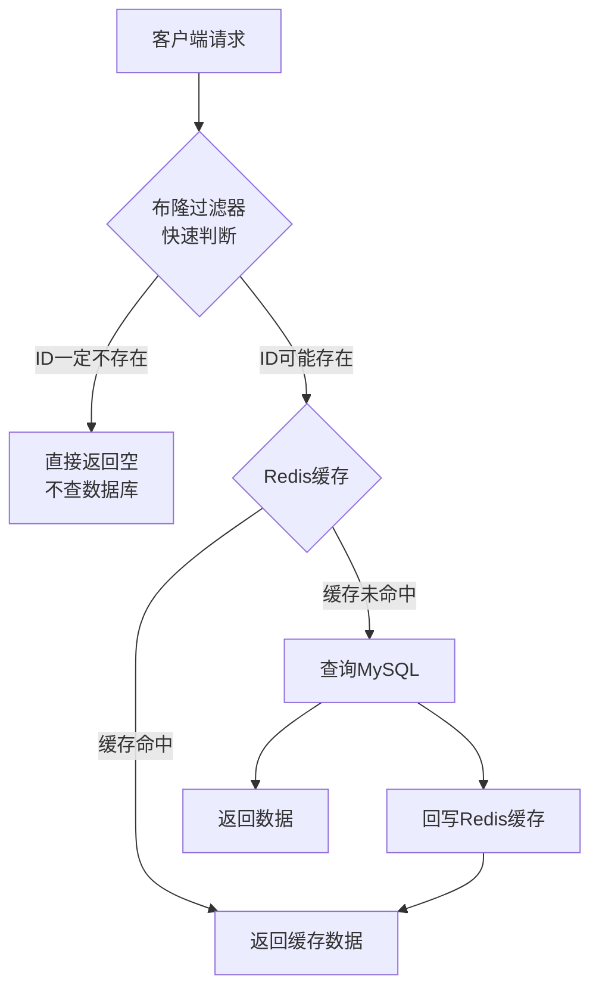

## 案例三：Bloom Filter优化缓存穿透

### 1. 问题背景

#### 1.1 什么是缓存穿透

缓存穿透是指查询一个**一定不存在**的数据——既不在缓存中，也不在数据库中。由于缓存未命中，每次请求都会直达数据库，如果这类请求量很大，就会对数据库造成巨大压力，甚至拖垮整个系统。

缓存穿透与相关概念的区别如下：

| 概念 | 定义 | 请求路径 | 典型原因 |
|------|------|----------|----------|
| **缓存穿透** | 查询一定不存在的数据 | 请求→缓存(未命中)→数据库(未命中)→无数据返回 | 恶意攻击、业务逻辑漏洞 |
| **缓存击穿** | 热点key过期的瞬间大量请求涌入 | 请求→缓存(未命中)→数据库→回写缓存 | 热点key集中过期 |
| **缓存雪崩** | 大量key同时过期或缓存服务宕机 | 请求→缓存(大面积未命中)→数据库 | 缓存集中失效、服务不可用 |

三者虽然都可能导致数据库压力骤增，但根本原因和防御策略不同。本案例聚焦于缓存穿透问题。

#### 1.2 业务场景

某短视频平台的评论系统，用户可以查询任意视频的评论列表。系统架构为经典的"客户端→应用服务→Redis缓存→MySQL数据库"四层结构。

**问题现象：**

- 每天约有500万次请求查询不存在的视频ID（爬虫恶意扫描、用户误操作、下架视频）
- 其中约30%的请求穿透到数据库层
- 数据库CPU在高峰时段频繁飙升至80%以上
- 正常用户的评论查询响应时间从20ms恶化到200ms以上

**数据特征：**

```text
视频总数（存在）：约2000万条
日均无效查询量：约500万次
无效查询的ID分布：高度离散，无规律可循
有效缓存命中率：从95%下降到约60%
```

这些问题请求的共同特征是：查询的视频ID在数据库中根本不存在。传统的缓存策略（"查不到就不缓存"）对这类请求完全失效——每次都会穿透到数据库。

#### 1.3 为什么常规方案不够

**方案一：缓存空值**

```python
def get_video_comments(video_id):
    cached = redis.get(f"comments:{video_id}")
    if cached is not None:
        return json.loads(cached)

    result = db.query("SELECT * FROM comments WHERE video_id = %s", video_id)
    if result:
        redis.setex(f"comments:{video_id}", 3600, json.dumps(result))
    else:
        # 缓存空值，设置较短过期时间
        redis.setex(f"comments:{video_id}", 60, json.dumps([]))
    return result
```

缺点：无效ID的数量远超有效ID，缓存大量空值会挤占有效数据的内存空间。假设2000万视频ID有效，但恶意扫描涉及的无效ID可能有数亿个，即使每个空值只占几十字节，内存消耗也十分惊人。

**方案二：请求合法性校验**

```python
def get_video_comments(video_id):
    if video_id <= 0 or video_id > MAX_VIDEO_ID:
        return None
    # ... 正常查询逻辑
```

缺点：只能拦截格式异常的ID，对于格式合法但不存在的ID（如已被删除的视频）无能为力。

**方案三：布隆过滤器（Bloom Filter）**

以极小的内存开销实现"快速判断一个元素是否可能存在"，是解决缓存穿透的最优方案。它的时间复杂度为O(k)，其中k为哈希函数个数，与数据规模无关。

---

### 2. Bloom Filter原理详解

#### 2.1 核心思想

Bloom Filter由Burton Howard Bloom于1970年提出，是一种空间效率极高的概率型数据结构。它的核心思想是：**用多个哈希函数将元素映射到位数组中，通过检查位数组判断元素是否存在**。

**基本原理：**

1. 初始化一个长度为m的位数组（bit array），所有位初始为0
2. 插入元素时，用k个独立的哈希函数分别计算该元素的哈希值，将位数组中对应位置设为1
3. 查询元素时，同样用k个哈希函数计算，检查位数组中对应位置是否全为1
   - 如果**全是1**：元素**可能存在**（注意是"可能"）
   - 如果**有任意一位为0**：元素**一定不存在**

#### 2.2 关键特性

Bloom Filter有一个重要的不对称性：

- **没有假阴性（False Negative）**：如果报告元素不存在，那就一定不存在
- **可能有假阳性（False Positive）**：如果报告元素存在，元素可能实际上不存在

这个特性恰好满足缓存穿透场景的需求——我们只需要确保"存在的ID不会被误判为不存在"，而"不存在的ID被误判为存在"只是多查一次数据库，代价很小。

#### 2.3 数学分析

Bloom Filter的核心参数关系：

```text
m = 位数组长度（bits）
n = 预期插入元素数量
k = 哈希函数个数
p = 期望的误判率（False Positive Rate）

最优哈希函数个数：k = (m / n) × ln2 ≈ 0.693 × (m / n)

在给定m和n时的误判率：
p ≈ (1 - e^(-kn/m))^k

位数组大小的计算（给定n和目标误判率p）：
m = -n × ln(p) / (ln2)^2
```

**实际参数参考表：**

| 预期元素数(n) | 误判率(p) | 位数组大小(m) | 哈希函数数(k) | 内存占用 |
|--------------|-----------|---------------|--------------|---------|
| 1000万 | 0.1% | 约1.44亿位 | 10 | 约17MB |
| 1000万 | 0.01% | 约2.16亿位 | 14 | 约26MB |
| 2000万 | 0.1% | 约2.88亿位 | 10 | 约34MB |
| 2000万 | 0.01% | 约4.32亿位 | 14 | 约52MB |

对比：如果用Redis的Set存储2000万个video ID，每个ID（long型8字节 + Redis开销约50字节）需要约1.1GB内存。而Bloom Filter仅需约34MB就能达到0.1%的误判率，内存节省约97%。

#### 2.4 与类似数据结构对比

| 数据结构 | 内存占用 | 查询时间 | 准确性 | 适用场景 |
|----------|---------|---------|--------|---------|
| HashSet | 高（每个元素~50字节） | O(1) | 100%准确 | 内存充足、需要精确查询 |
| Bloom Filter | 极低（每个元素约1-2位） | O(k) | 有假阳性 | 大规模存在性判断 |
| Counting Bloom Filter | 中等（每个计数器4位） | O(k) | 有假阳性 | 需要支持删除操作 |
| Cuckoo Filter | 中低 | O(1) | 有假阳性 | 需要删除操作、更高查询性能 |
|quotient Filter | 中等 | O(1)均摊 | 有假阳性 | 需要删除操作、缓存友好 |

对于缓存穿透场景，标准Bloom Filter是最佳选择：不需要删除操作（数据只增不减），需要极低的内存占用，可以容忍极小的误判率。

---

### 3. 完整实现方案

#### 3.1 架构设计



请求流程：

1. 请求到达时，先经过Bloom Filter判断video ID是否存在
2. 如果Bloom Filter返回"不存在"，直接返回空结果，**完全不查数据库**
3. 如果Bloom Filter返回"可能存在"，继续走正常的缓存→数据库查询流程
4. 数据库查询后，将结果回写到Redis缓存

#### 3.2 Python实现

使用`pybloom_live`库实现布隆过滤器：

```python
# requirements: pybloom-live>=4.0

from pybloom_live import BloomFilter
import redis
import json
import threading

class CachePenetrationFilter:
    """基于Bloom Filter的缓存穿透防护器"""

    def __init__(self, redis_client, expected_items=20_000_000, error_rate=0.001):
        """
        初始化防护器

        参数:
            redis_client: Redis连接
            expected_items: 预期的元素总数（视频ID数量）
            error_rate: 期望的误判率，0.001表示0.1%
        """
        self.redis = redis_client
        self.bf_key = "bloom:video_exists"
        self.expected_items = expected_items
        self.error_rate = error_rate

        # Bloom Filter存放在Redis中，供多实例共享
        self._init_bloom_filter()

    def _init_bloom_filter(self):
        """初始化或加载Bloom Filter"""
        # 尝试从Redis加载已有状态
        bf_data = self.redis.get(self.bf_key)
        if bf_data:
            self.bf = BloomFilter(capacity=self.expected_items,
                                  error_rate=self.error_rate)
            self.bf.from_bitarray(bf_data)
        else:
            self.bf = BloomFilter(capacity=self.expected_items,
                                  error_rate=self.error_rate)

    def add_video_id(self, video_id):
        """将存在的video ID加入Bloom Filter"""
        self.bf.add(str(video_id))
        self._sync_to_redis()

    def might_contain(self, video_id):
        """判断video ID是否可能存在"""
        return str(video_id) in self.bf

    def _sync_to_redis(self, force=False):
        """将Bloom Filter状态同步到Redis"""
        self.redis.set(self.bf_key, self.bf.bitarray)

    def batch_load_from_db(self):
        """从数据库批量加载所有video ID到Bloom Filter"""
        print("开始从数据库加载video ID到Bloom Filter...")
        cursor = 0
        batch_size = 10000
        count = 0

        while True:
            cursor, ids = self.redis.scan(cursor=cursor, match="video:id:*",
                                          count=batch_size)
            for key in ids:
                video_id = key.decode().split(":")[-1]
                self.bf.add(video_id)
                count += 1

            if cursor == 0:
                break

        self._sync_to_redis(force=True)
        print(f"加载完成，共加载 {count} 个video ID")
```

#### 3.3 应用层集成

```python
class CommentService:
    """评论服务，集成Bloom Filter防护"""

    def __init__(self, cache_filter, redis_client, db_pool):
        self.filter = cache_filter
        self.redis = redis_client
        self.db = db_pool

    def get_comments(self, video_id, page=1, page_size=20):
        """
        获取视频评论列表

        返回: (comments, total_count) 或空列表
        """
        # 第一层防护：Bloom Filter快速过滤
        if not self.filter.might_contain(video_id):
            # 一定不存在，直接返回空，不查数据库
            return [], 0

        # 第二层：Redis缓存查询
        cache_key = f"comments:{video_id}:{page}"
        cached = self.redis.get(cache_key)
        if cached:
            return json.loads(cached)

        # 第三层：数据库查询（只有Bloom Filter说可能存在时才执行）
        comments, total = self._query_db(video_id, page, page_size)

        if comments:
            # 回写缓存，根据是否有数据设置不同的过期时间
            self.redis.setex(cache_key, 3600, json.dumps({
                "comments": comments,
                "total": total
            }))
        else:
            # 查询结果为空，说明是Bloom Filter的假阳性
            # 也不缓存空值，避免缓存污染
            # 但可以记录一下，用于后续分析
            pass

        return comments, total

    def _query_db(self, video_id, page, page_size):
        """查询数据库获取评论"""
        offset = (page - 1) * page_size
        with self.db.cursor() as cursor:
            cursor.execute(
                "SELECT id, user_name, content, created_at "
                "FROM comments WHERE video_id = %s "
                "ORDER BY created_at DESC LIMIT %s, %s",
                (video_id, offset, page_size)
            )
            comments = cursor.fetchall()

            cursor.execute(
                "SELECT COUNT(*) FROM comments WHERE video_id = %s",
                (video_id,)
            )
            total = cursor.fetchone()[0]

        return comments, total

    def on_video_created(self, video_id):
        """视频创建时，将ID加入Bloom Filter"""
        self.filter.add_video_id(video_id)

    def on_video_deleted(self, video_id):
        """视频删除时的处理"""
        # Bloom Filter不支持删除，但可以接受
        # 删除后的ID查询会多走一次数据库，代价很低
        # 同时清除该视频的缓存
        cache_pattern = f"comments:{video_id}:*"
        for key in self.redis.scan_iter(match=cache_pattern):
            self.redis.delete(key)
```

#### 3.4 使用Redis自带的Bloom Filter模块

在生产环境中，更推荐使用Redis的RedisBloom模块，它原生支持Bloom Filter，且天然支持分布式场景：

```bash
# RedisBloom模块安装
# Docker方式
docker run -p 6379:6379 redis/redis-stack

# 或从源码编译
git clone https://github.com/RedisBloom/RedisBloom.git
cd RedisBloom
make
# redis-server --loadmodule /path/to/redisbloom.so
```

```python
import redis

class RedisBloomFilter:
    """基于RedisBloom模块的分布式Bloom Filter"""

    def __init__(self, redis_client, name="video_bloom",
                 capacity=20_000_000, error_rate=0.001):
        self.redis = redis_client
        self.name = name

        # 创建Bloom Filter（如果不存在）
        # BF.RESERVE 命令：key, error_rate, capacity
        try:
            self.redis.execute_command(
                "BF.RESERVE", self.name,
                error_rate, capacity
            )
        except redis.exceptions.ResponseError as e:
            if "item exists" not in str(e):
                raise

    def add(self, item):
        """添加元素"""
        self.redis.execute_command("BF.ADD", self.name, str(item))

    def exists(self, item):
        """检查元素是否存在"""
        return self.redis.execute_command("BF.EXISTS", self.name, str(item))

    def madd(self, items):
        """批量添加元素"""
        return self.redis.execute_command(
            "BF.MADD", self.name, *map(str, items)
        )

    def mexists(self, items):
        """批量检查元素是否存在"""
        return self.redis.execute_command(
            "BF.MEXISTS", self.name, *map(str, items)
        )

    def info(self):
        """获取Bloom Filter信息"""
        return self.redis.execute_command("BF.INFO", self.name)


# 使用示例
r = redis.Redis(host='localhost', port=6379)
bf = RedisBloomFilter(r, capacity=20_000_000, error_rate=0.001)

# 批量加载已有video ID
existing_ids = db.query("SELECT id FROM videos")
bf.madd([row['id'] for row in existing_ids])

# 查询时使用
if bf.exists(video_id):
    # 可能存在，继续查缓存和数据库
    pass
else:
    # 一定不存在，直接返回空
    pass
```

RedisBloom模块的优势：

- 分布式部署，多个应用实例共享同一个Bloom Filter
- 使用Redis的OF序列化机制，支持持久化
- 内存效率比纯Redis实现更高（底层用位数组存储）
- 支持BF.RESERVE、BF.ADD、BF.EXISTS、BF.MADD、BF.MEXISTS等命令

---

### 4. 进阶优化

#### 4.1 动态扩容策略

Bloom Filter一旦创建，容量就固定了。如果数据量持续增长超过预设容量，误判率会上升。需要设计动态扩容方案：

```python
class ScalableBloomFilter:
    """可扩展的Bloom Filter，自动分片扩容"""

    def __init__(self, redis_client, base_capacity=10_000_000,
                 error_rate=0.001, max_filters=10):
        self.redis = redis_client
        self.base_capacity = base_capacity
        self.error_rate = error_rate
        self.max_filters = max_filters
        self.key_prefix = "bf:shard:"

    def _get_current_shard(self):
        """获取当前活跃的分片编号"""
        current = self.redis.get("bf:current_shard")
        return int(current) if current else 0

    def _create_shard(self, shard_id):
        """创建新的Bloom Filter分片"""
        key = f"{self.key_prefix}{shard_id}"
        # 每个新分片的容量可以递增，例如翻倍
        capacity = self.base_capacity * (2 ** shard_id)
        try:
            self.redis.execute_command(
                "BF.RESERVE", key, self.error_rate, capacity
            )
        except redis.exceptions.ResponseError:
            pass  # 分片已存在
        return key

    def _check_and_rotate(self):
        """检查当前分片是否需要轮换"""
        shard_id = self._get_current_shard()
        key = f"{self.key_prefix}{shard_id}"
        info = self.redis.execute_command("BF.INFO", key)

        # BF.INFO 返回信息中，capacity在第6个位置
        # 实际解析需根据BF.INFO的返回格式调整
        current_items = info[5] if len(info) > 5 else 0
        # 计算当前分片的预设容量（与_create_shard中的逻辑对应）
        shard_capacity = self.base_capacity * (2 ** shard_id)

        if current_items >= shard_capacity * 0.9:
            # 当前分片使用率超过90%，创建新分片
            new_shard_id = shard_id + 1
            if new_shard_id < self.max_filters:
                self._create_shard(new_shard_id)
                self.redis.set("bf:current_shard", new_shard_id)

    def add(self, item):
        """添加元素到当前分片"""
        self._check_and_rotate()
        shard_id = self._get_current_shard()
        key = f"{self.key_prefix}{shard_id}"
        self.redis.execute_command("BF.ADD", key, str(item))

    def exists(self, item):
        """
        检查元素是否存在于任一分片
        任何一个分片说"存在"就返回True
        所有分片都说"不存在"才返回False
        """
        current_shard = self._get_current_shard()
        for i in range(current_shard + 1):
            key = f"{self.key_prefix}{i}"
            if self.redis.execute_command("BF.EXISTS", key, str(item)):
                return True
        return False
```

#### 4.2 布隆过滤器预热

系统启动或Redis重启后，Bloom Filter数据可能丢失。需要设计预热机制：

```python
class BloomFilterWarmer:
    """Bloom Filter预热服务"""

    def __init__(self, bloom_filter, db_pool, redis_client):
        self.bf = bloom_filter
        self.db = db_pool
        self.redis = redis_client
        self.warmup_key = "bf:warmup_status"

    def warmup(self, batch_size=10000):
        """
        从数据库加载所有有效ID到Bloom Filter

        采用增量加载策略，避免一次性加载过多数据导致OOM
        """
        # 检查是否需要预热
        status = self.redis.get(self.warmup_key)
        if status == b"complete":
            print("Bloom Filter已预热，跳过")
            return

        print("开始预热Bloom Filter...")
        start_time = time.time()
        total_count = 0

        with self.db.cursor() as cursor:
            # 使用游标分批查询，避免大结果集
            cursor.execute("SELECT id FROM videos")
            batch = []

            for row in cursor:
                batch.append(str(row['id']))
                if len(batch) >= batch_size:
                    self.bf.madd(batch)
                    total_count += len(batch)
                    batch = []
                    print(f"已加载 {total_count} 条记录...")

            # 处理最后一批
            if batch:
                self.bf.madd(batch)
                total_count += len(batch)

        elapsed = time.time() - start_time
        self.redis.set(self.warmup_key, "complete")
        print(f"预热完成：{total_count} 条记录，耗时 {elapsed:.1f}s")

    def async_warmup(self):
        """异步预热，不阻塞服务启动"""
        thread = threading.Thread(target=self.warmup, daemon=True)
        thread.start()
        return thread
```

#### 4.3 监控与告警

```python
class BloomFilterMonitor:
    """Bloom Filter运行监控"""

    def __init__(self, redis_client, bloom_filter_name="video_bloom"):
        self.redis = redis_client
        self.name = bloom_filter_name
        self.stats_key = f"bf:stats:{self.name}"

    def record_hit(self, video_id, found_in_db):
        """记录一次Bloom Filter判定结果"""
        pipe = self.redis.pipeline()
        pipe.hincrby(self.stats_key, "bf_total", 1)

        if found_in_db:
            pipe.hincrby(self.stats_key, "true_positive", 1)
        else:
            # Bloom Filter说存在，但数据库查不到 = 假阳性
            pipe.hincrby(self.stats_key, "false_positive", 1)

        pipe.execute()

    def record_reject(self):
        """记录一次被Bloom Filter拒绝的请求"""
        self.redis.hincrby(self.stats_key, "bf_rejected", 1)

    def get_metrics(self):
        """获取监控指标"""
        stats = self.redis.hgetall(self.stats_key)
        stats = {k.decode(): int(v.decode()) for k, v in stats.items()}

        total = stats.get('bf_total', 0) + stats.get('bf_rejected', 0)
        rejected = stats.get('bf_rejected', 0)
        false_pos = stats.get('false_positive', 0)

        metrics = {
            'total_requests': total,
            'rejected_by_bf': rejected,
            'filter_rate': rejected / total if total > 0 else 0,
            'false_positive_rate': false_pos / (total - rejected)
                                  if (total - rejected) > 0 else 0,
            'db_queries_saved': rejected,
            'db_queries_remaining': total - rejected,
        }
        return metrics

    def check_health(self):
        """健康检查，触发告警"""
        metrics = self.get_metrics()

        if metrics['false_positive_rate'] > 0.01:
            # 假阳性率超过1%，需要考虑扩容或重建
            return {
                'status': 'warning',
                'message': f"假阳性率 {metrics['false_positive_rate']:.4f} "
                           f"超过阈值1%，建议检查Bloom Filter容量",
                'metrics': metrics
            }

        if metrics['filter_rate'] < 0.5:
            # 过滤率低于50%，Bloom Filter效果不佳
            return {
                'status': 'warning',
                'message': f"过滤率仅 {metrics['filter_rate']:.2%}，"
                           f"Bloom Filter可能需要调整参数",
                'metrics': metrics
            }

        return {
            'status': 'healthy',
            'message': 'Bloom Filter运行正常',
            'metrics': metrics
        }
```

---

### 5. 实施效果

#### 5.1 性能对比

在上述短视频评论系统中，部署Bloom Filter后的效果如下：

**数据库查询量变化：**

| 指标 | 优化前 | 优化后 | 改善幅度 |
|------|--------|--------|---------|
| 日均无效查询（到DB） | 150万次 | 1.5万次 | 降低99% |
| 数据库QPS（峰值） | 8000 | 3000 | 降低62.5% |
| 数据库CPU（峰值） | 80%+ | 35% | 降低56% |
| 评论查询P99延迟 | 200ms | 25ms | 降低87.5% |
| Redis缓存命中率 | 60% | 95% | 提升58% |

**内存开销对比：**

| 方案 | 内存占用 | 过滤效果 |
|------|---------|---------|
| 缓存空值（Set存储） | ~1.1GB | 100%准确，但浪费内存 |
| Redis Set存储有效ID | ~1.1GB | 100%准确，内存大 |
| Bloom Filter（p=0.1%） | ~34MB | 99.9%过滤率 |
| Bloom Filter（p=0.01%） | ~52MB | 99.99%过滤率 |

Bloom Filter方案以约3%的内存成本，实现了接近100%的过滤效果。

#### 5.2 实际运行数据

```text
=== 第一周运行数据 ===
总请求量: 3500万
Bloom Filter拒绝: 1050万 (30%)
假阳性请求: 3500 (0.033%，与理论值0.1%一致)
实际数据库无效查询: 3500次（相比优化前的1050万次）

=== 月度运行数据 ===
日均过滤无效请求: 150万次
月节省数据库查询: 4500万次
月减少数据库负载: 约40%
缓存命中率恢复: 95%+
```

---

### 6. 常见误区与注意事项

#### 6.1 误区一：Bloom Filter可以删除元素

Bloom Filter的标准实现**不支持删除操作**。因为一个位可能被多个元素共享，删除一个元素（将位置0）可能影响其他元素的判断。

```python
# 错误做法
bf.remove(video_id)  # 标准Bloom Filter没有这个方法

# 解决方案：使用Counting Bloom Filter
from pybloom_live import CountingBloomFilter
cbf = CountingBloomFilter(capacity=1000000, error_rate=0.001)
cbf.add("item")
cbf.remove("item")  # Counting Bloom Filter支持删除
```

但在缓存穿透场景中，标准Bloom Filter通常是足够的。即使视频被删除，查询该ID只会多走一次数据库，不会造成严重问题。

#### 6.2 误区二：Bloom Filter能替代缓存

Bloom Filter**只能判断元素是否存在，不能存储元素本身**。它不包含任何关于数据值的信息，只是一个"存在性检查器"。

正确的做法是将Bloom Filter作为缓存的前置过滤层，而不是替代缓存。

#### 6.3 误区三：误判率设得越低越好

误判率越低，所需的内存空间越大。在缓存穿透场景中，0.1%的误判率意味着每1000次无效查询中只有1次会穿透到数据库，已经足够好。盲目追求0.001%或更低的误判率会浪费内存。

```text
误判率 vs 内存需求（n=2000万）：
  0.1%  → 34MB   ← 推荐，性价比最高
  0.01% → 52MB   ← 追求极致时使用
  0.001% → 78MB  ← 通常不必要
  0.0001% → 104MB ← 浪费
```

#### 6.4 误区四：忽略哈希函数的选择

哈希函数的质量直接影响Bloom Filter的性能。差的哈希函数会导致位分布不均匀，增加误判率。

在RedisBloom中，底层使用两个哈希函数（基于MurmurHash2）的组合来模拟多个哈希函数，这是经过工程验证的高效方案。不建议自己实现哈希函数，直接使用成熟的库或RedisBloom模块即可。

#### 6.5 注意事项

- **初始化时机**：系统首次部署时，需要从数据库全量加载所有有效ID，这个过程可能耗时数分钟。建议在低峰期执行，或采用异步预热方案
- **分布式一致性**：多实例部署时，务必使用RedisBloom等分布式方案，避免每个实例维护独立的Bloom Filter导致不一致
- **Redis重启**：确保Redis开启了AOF或RDB持久化，否则重启后Bloom Filter数据丢失，需要重新预热
- **监控假阳性率**：定期监控实际假阳性率是否与理论值一致，异常升高可能意味着数据量已超出Bloom Filter的设计容量

---

### 7. 扩展思考

#### 7.1 Bloom Filter在其他场景的应用

Bloom Filter的应用远不止缓存穿透防护：

- **爬虫URL去重**：判断URL是否已经爬取过，避免重复爬取
- **垃圾邮件过滤**：判断发件人是否在黑名单中
- **拼写检查**：快速判断单词是否可能存在
- **数据库查询优化**：在分库分表场景中，先判断数据在哪个分片
- **区块链轻节点**：以太坊用Bloom Filter实现日志过滤，轻节点无需存储全部数据

#### 7.2 替代方案：Cuckoo Filter

当需要支持删除操作时，Cuckoo Filter是一个更好的选择：

```text
Cuckoo Filter vs Bloom Filter：
- 两者误判率相近
- Cuckoo Filter支持删除操作
- Cuckoo Filter在低误判率时空间更优
- Cuckoo Filter查询更快（单次查表 vs 多次哈希）
- Bloom Filter插入更快
- Bloom Filter理论更成熟，使用更广泛
```

#### 7.3 与MySQL层面的防护结合

在极端场景下（如Bloom Filter预热前、Redis不可用），可以在MySQL层面设置最后的防线：

```sql
-- 对无效ID的查询设置超时
SET SESSION max_execution_time = 500;  -- 500ms超时

-- 使用索引提示，避免全表扫描
SELECT /*+ INDEX(comments idx_video_id) */ *
FROM comments WHERE video_id = 123456
LIMIT 1;

-- 创建独立的视频ID存在性查询表（轻量级）
CREATE TABLE video_id_index (
    id BIGINT PRIMARY KEY,
    created_at TIMESTAMP DEFAULT CURRENT_TIMESTAMP
) ENGINE=MEMORY;  -- 内存表，查询极快
```

---

### 8. 经验总结

**核心结论：**

1. **Bloom Filter是解决缓存穿透的最佳方案**：以极小的内存开销（有效ID集合的1/30），实现接近100%的无效请求过滤
2. **分布式场景优先选RedisBloom**：天然支持多实例共享，避免本地Bloom Filter的不一致问题
3. **参数选择要务实**：0.1%误判率在大多数场景下足够，不必追求极致
4. **监控不可少**：假阳性率、过滤率、数据库QPS变化都需要持续跟踪
5. **预热和持久化**：确保Redis重启后Bloom Filter能快速恢复

**实施检查清单：**

- [ ] 确定预期元素数量和可接受的误判率
- [ ] 选择Bloom Filter实现（RedisBloom / 本地库）
- [ ] 实现初始化预热脚本
- [ ] 集成到应用层查询逻辑
- [ ] 配置监控指标和告警规则
- [ ] 压力测试验证过滤效果
- [ ] 编写运维文档（扩容、重建、故障恢复流程）
