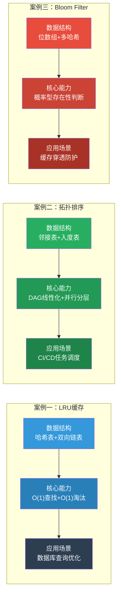
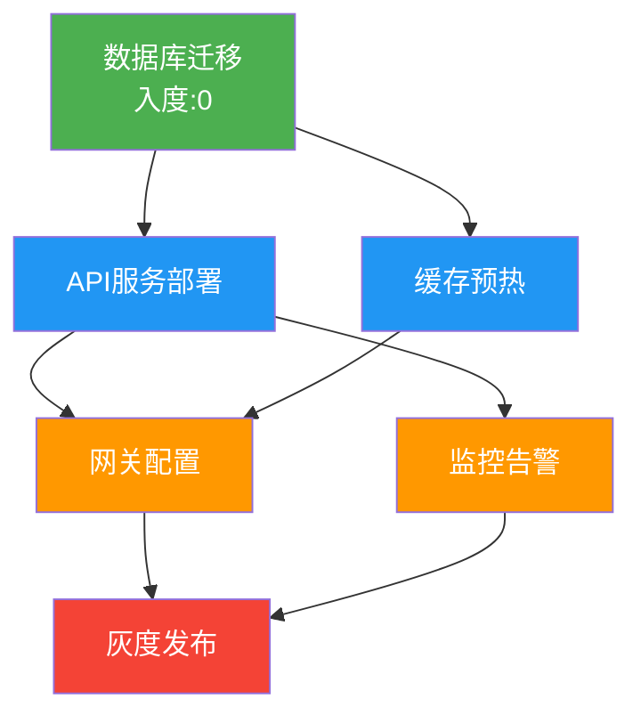
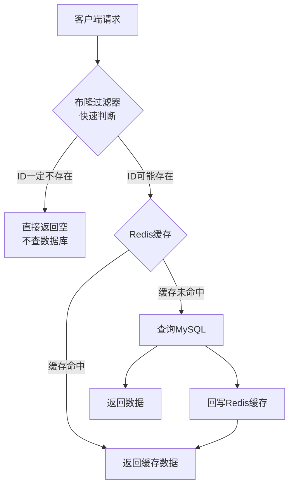
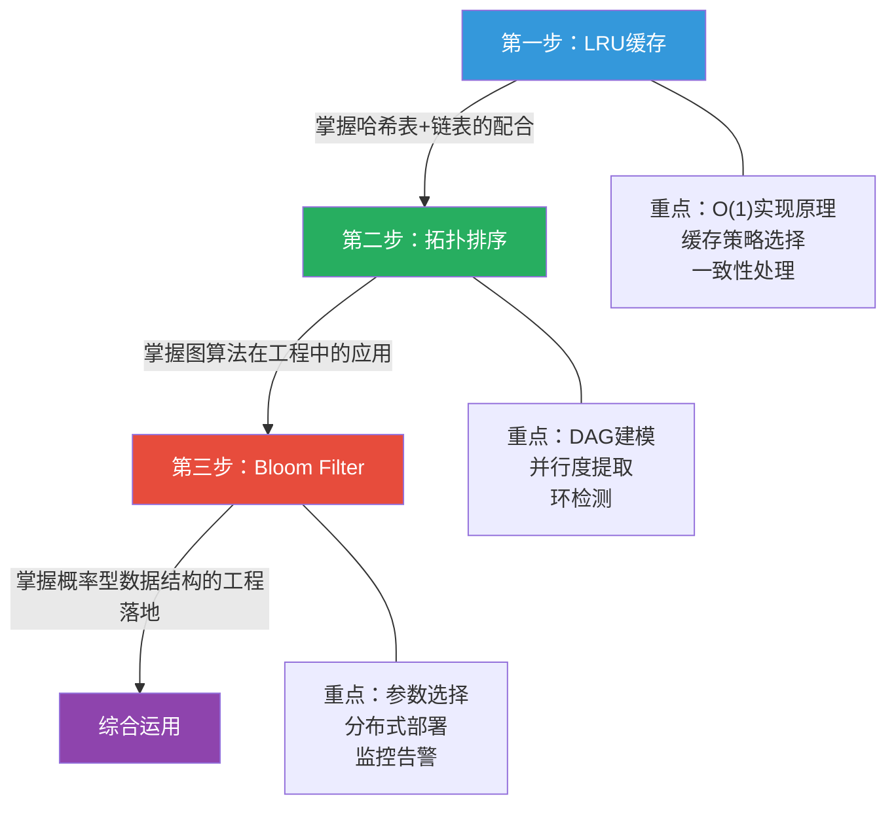

# 实战案例：从理论到工程的最后一公里

软件工程中，数据结构与算法的价值只有在真实的生产系统中才能得到验证。理论基础章节介绍了哈希表、平衡树、堆、图等核心数据结构的原理与复杂度分析，核心技巧章节讲解了二分搜索、滑动窗口、单调栈、状态压缩等解题范式。但理论到工程之间存在一条鸿沟：**如何在真实的并发压力、海量数据和复杂业务逻辑中，选择并落地正确的数据结构与算法？**

本章通过三个精心挑选的工业级实战案例，展示数据结构与算法在实际系统中的应用方式。每个案例都遵循"问题诊断→原理分析→完整实现→性能验证→经验总结"的完整链路，确保读者不仅理解"怎么用"，更理解"为什么这样用"以及"还有哪些坑"。

---

## 一、为什么需要实战案例

理论学习和工程实践之间存在三道常见的鸿沟：

**鸿沟一：知道复杂度，不知道选哪个**

理论上我们知道哈希表是 O(1)、红黑树是 O(log n)、Bloom Filter 有假阳性。但在具体场景中——电商平台每秒万级查询，是用 LRU 缓存还是 LFU 缓存？缓存穿透用空值缓存还是 Bloom Filter？——复杂度分析只是决策的起点，不是终点。

**鸿沟二：知道算法，不知道怎么落地**

拓扑排序的教材定义是"对 DAG 的线性排列"。但当面对 50+ 个微服务的依赖关系、需要同时保证并行度最大化和循环依赖检测时，如何从定义推导到一个可运行的调度系统？教材不会告诉你如何处理动态依赖变更、如何做增量排序、如何将 Kahn 算法的分层信息转化为并行调度指令。

**鸿沟三：知道数据结构，不知道边界条件**

Bloom Filter 在缓存穿透防护中看起来完美——但它的不支持删除特性在视频被下架时意味着什么？预热失败怎么办？Redis 重启后 Bloom Filter 数据丢失如何恢复？假阳性率从 0.1% 漂移到 1% 时如何告警？这些工程细节才是系统稳定运行的关键。

实战案例的价值就在于弥合这三道鸿沟：**用真实场景驱动学习，用完整实现验证理论，用性能数据说服决策。**

---

## 二、案例全景图

三个案例构成了从**内存级数据结构**到**图算法**再到**概率型数据结构**的递进路径，覆盖了工程中最常见的三类问题：**查询加速、调度编排、防御过滤**。

---

## 三、案例详细索引

| 维度 | 案例一：LRU缓存优化数据库查询 | 案例二：拓扑排序解决任务依赖 | 案例三：Bloom Filter优化缓存穿透 |
|------|------------------------------|----------------------------|----------------------------------|
| **核心数据结构** | 哈希表 + 双向链表 | 邻接表 + 入度表 | 位数组 + 多哈希函数 |
| **时间复杂度** | Get/Put 均 O(1) | Kahn O(V+E)，DFS O(V+E) | 查询/插入 O(k)，k为哈希函数数 |
| **空间复杂度** | O(capacity) | O(V+E) | O(m)，m为位数组长度 |
| **问题域** | 查询性能优化 | 依赖关系编排 | 安全防御过滤 |
| **业务场景** | 电商平台用户信息查询 | CI/CD 微服务批量部署 | 短视频平台评论系统 |
| **性能提升** | 响应时间降低 84%，DB QPS 降低 70% | 部署效率提升 50%，总耗时从 2h 降至 20min | 无效 DB 查询降低 99%，缓存命中率恢复至 95% |
| **理论基础章节** | 哈希表、链表 | 图的表示、BFS/DFS | 哈希函数、概率数据结构 |
| **核心技巧章节** | 滑动窗口（思想相通） | 单调队列（变体应用） | 位运算技巧 |
| **实现语言** | Go + Python | Python + Go | Python + Redis |
| **难度等级** | ⭐⭐ 入门级 | ⭐⭐⭐ 中级 | ⭐⭐⭐⭐ 进阶级 |

---

## 四、案例一：LRU 缓存优化数据库查询

> 当数据库成为性能瓶颈时，用 O(1) 的缓存淘汰策略将 70% 的查询拦截在内存层。

### 4.1 问题定位

电商平台 API 服务在峰值时承受 10000 QPS 的用户信息查询，每次请求穿透到数据库。数据库响应从 5ms 退化到 50ms，CPU 持续 90% 以上。核心矛盾是：**热点数据集中但查询全量穿透**。

### 4.2 解决方案

使用 LRU（Least Recently Used）缓存策略，在内存中维护一个"最近使用的数据"窗口。LRU 的核心是两个数据结构的组合：

- **哈希表**：提供 O(1) 的键值查找能力，是查询入口
- **双向链表**：提供 O(1) 的节点移动和尾部删除能力，维护访问顺序的时效性

两者配合：哈希表让查找飞快，链表让淘汰精准。当缓存满时，直接删除链表尾部节点（最久未使用），无需遍历扫描。

### 4.3 关键收获

- **缓存不是万能的**：LRU 只是策略之一，LFU（最不常用）、FIFO、TTL 各有适用场景
- **一致性是核心难题**：Cache Aside（先更新 DB 再删缓存）是基础方案，延迟双删应对极端情况
- **雪崩预防**：随机过期时间 + 多级缓存 + 数据库限流降级
- **命中率是生命线**：低于 70% 说明缓存策略需要调整

### 4.4 实现方案

提供了 Go 和 Python 两种完整实现，包括手动实现版本（哈希表 + 双向链表）和基于语言标准库的简洁版本（Python OrderedDict）。同时展示了如何将 LRU 缓存集成到实际的用户服务 API 层中，形成"缓存 → 数据库"的两级查询架构。

---

## 五、案例二：拓扑排序解决任务依赖

> 当 50+ 个微服务的部署依赖纠缠成网时，用 DAG 拓扑排序将混乱变为有序、将串行变为并行。

### 5.1 问题定位

CI/CD 平台需要同时部署 50+ 个微服务，服务间存在复杂的依赖关系。手动管理导致三个致命问题：部署顺序错误（先下游后上游）、循环依赖未检测（卡死 40 分钟）、并行度不足（预期 20 分钟膨胀到 2 小时）。

### 5.2 解决方案

将服务依赖关系建模为有向无环图（DAG），用拓扑排序自动确定执行顺序。两种经典算法各有侧重：

- **Kahn 算法（BFS 法）**：基于"不断移除入度为 0 的节点"的贪心策略。天然输出**分层信息**——同一轮入度归零的所有任务互不依赖，可以并行执行。这是任务调度场景的首选。
- **DFS 法**：利用后序遍历，一个节点的所有后继都被访问后再加入结果。适合仅需合法顺序、同时检测环的场景。

### 5.3 关键收获

- **并行度是隐藏的加速器**：Kahn 算法的分层输出天然告诉你哪些任务可以同时启动，50% 的效率提升来自这里
- **环检测是刚需**：大规模系统中循环依赖由跨团队信息不对称导致，每次依赖变更都应重新检测
- **优先级队列优化**：将普通队列替换为优先队列，同层任务按优先级执行，关键路径上的任务优先分配资源
- **关键路径分析**：计算从起点到终点的最长路径，识别出任何延迟都会影响整体交付的瓶颈任务

### 5.4 实现方案

提供了完整的 `TaskScheduler` 类（Python 和 Go），支持：
- 依赖关系注册与拓扑排序
- 并行分层提取（直接输出可并行执行的任务组）
- 循环依赖检测与环路径回溯
- 带优先级的拓扑排序
- 关键路径分析

同时演示了微服务批量部署调度、循环依赖修复、优先级调度三个子案例。

---

## 六、案例三：Bloom Filter 优化缓存穿透

> 当 500 万/天的无效请求穿透到数据库时，用 34MB 的位数组将 99.9% 的穿透拦截在入口。

### 6.1 问题定位

短视频平台评论系统每天约有 500 万次请求查询不存在的视频 ID（爬虫扫描、用户误操作、下架视频）。传统缓存策略对这些"一定不存在"的数据完全失效——每次查询都会穿透到数据库，导致 CPU 飙升到 80% 以上，正常用户响应时间恶化到 200ms。

### 6.2 解决方案

Bloom Filter 是一种概率型数据结构，核心思想是：**用多个哈希函数将元素映射到位数组中，通过检查位数组判断元素是否存在**。

关键特性：
- **没有假阴性**：报告不存在就一定不存在（不会漏掉真实存在的数据）
- **可能有假阳性**：报告存在可能实际上不存在（但代价只是多查一次数据库）
- **空间效率极高**：2000 万个视频 ID，Redis Set 需要约 1.1GB，Bloom Filter 仅需约 34MB（节省 97%）

### 6.3 关键收获

- **内存是核心约束**：Bloom Filter 的参数选择本质是"内存 vs 准确性"的权衡——0.1% 误判率只需 34MB，0.01% 需要 52MB，性价比拐点在 0.1%
- **删除是致命缺陷**：标准 Bloom Filter 不支持删除，但在缓存穿透场景中可接受（删除后的 ID 查询只多走一次数据库）
- **分布式部署优先选 RedisBloom**：多实例共享同一个 Bloom Filter，避免本地实现的不一致问题
- **预热和持久化缺一不可**：Redis 重启后 Bloom Filter 数据丢失需要重新预热，必须设计异步预热机制

### 6.4 实现方案

提供了三层实现：
1. **基础层**：基于 `pybloom_live` 的本地 Bloom Filter，含状态同步到 Redis
2. **集成层**：`CommentService` 展示如何将 Bloom Filter 集成到实际的评论查询逻辑中，形成"布隆过滤器 → Redis 缓存 → MySQL"三级防御
3. **生产层**：基于 RedisBloom 模块的分布式方案，支持 BF.RESERVE、BF.ADD、BF.EXISTS 等原生命令

进阶部分覆盖了动态扩容（分片式 Scalable Bloom Filter）、预热机制、监控告警（假阳性率、过滤率追踪）。

---

## 七、三个案例的共性规律

虽然三个案例的数据结构和应用场景各不相同，但它们遵循相同的工程落地规律：

### 7.1 数据结构选型三步法

第一步：分析数据特征
  - 数据规模？（决定空间约束）
  - 访问模式？（读多写少 vs 读写均衡）
  - 一致性要求？（强一致 vs 最终一致）

第二步：匹配数据结构
  - 需要 O(1) 查找 + 有序淘汰 → 哈希表 + 链表（LRU）
  - 需要 DAG 线性化 + 并行分层 → 邻接表 + 入度表（拓扑排序）
  - 需要极低内存的存在性判断 → 位数组 + 多哈希（Bloom Filter）

第三步：验证边界条件
  - 并发安全性？（加锁 / 无锁 / 分布式锁）
  - 故障恢复？（持久化 / 预热 / 降级）
  - 容量增长？（动态扩容 / 分片 / 重建）

### 7.2 性能验证四指标

每个案例的落地效果都可以用四个核心指标衡量：

| 指标 | LRU 缓存案例 | 拓扑排序案例 | Bloom Filter 案例 |
|------|-------------|-------------|-------------------|
| **延迟改善** | P99 从 200ms 降至 15ms | 部署总耗时从 2h 降至 20min | P99 从 200ms 降至 25ms |
| **吞吐提升** | DB QPS 从 10000 降至 3000 | 并行度从 0 提升到 4 层并行 | 缓存命中率从 60% 恢复至 95% |
| **资源节省** | DB CPU 从 90% 降至 30% | 工程师时间节省 50%+ | DB 无效查询降低 99% |
| **可靠性提升** | 缓存雪崩预防 | 循环依赖自动检测 | 数据库过载防护 |

### 7.3 常见误区共性

三个案例揭示了相似的工程误区模式：

**误区一：理论最优 ≠ 工程最优**
- LRU 缓存中，理论最优的 LFU 策略在实际场景中因实现复杂、维护成本高而不如 LRU
- 拓扑排序中，DFS 法理论上与 Kahn 法复杂度相同，但缺少并行分层信息，实际效率更低

**误区二：忽略边界和异常**
- Bloom Filter 不支持删除——忽略这一点会在数据删除场景中引入严重 bug
- 拓扑排序假设图是 DAG——忽略环检测会在大规模系统中导致发布卡死
- LRU 缓存假设热点集中——如果访问模式接近随机，缓存命中率会很差

**误区三：监控和可观测性缺失**
- 不监控缓存命中率，不知道缓存策略是否有效
- 不监控 Bloom Filter 的假阳性率，不知道位数组是否已满
- 不监控并行分层效率，不知道依赖关系是否过于紧密

---

## 八、实战案例的学习路径

建议按照以下顺序阅读三个案例：

**初学者路径**（先理解再深入）：
1. LRU 缓存 → 理解数据结构组合的设计思想
2. 拓扑排序 → 理解图算法在任务调度中的建模方法
3. Bloom Filter → 理解概率型数据结构的"空间换时间"极致

**面试准备路径**（高频考点优先）：
1. LRU 缓存 → 高频手写题，同时掌握设计模式
2. 拓扑排序 → 课程表、任务调度类问题的核心
3. Bloom Filter → 系统设计面试中的经典方案

**进阶路径**（面向架构师）：
1. Bloom Filter → 理解分布式系统中的概率型防御
2. 拓扑排序 → 理解 DAG 在数据管道（Airflow）和编译系统中的应用
3. LRU 缓存 → 理解多级缓存架构和一致性哈希的配合

---

## 九、扩展：更多工业级应用场景

这三个案例只是数据结构与算法工程应用的冰山一角。以下是更多值得探索的方向：

### 9.1 查询加速类

| 场景 | 核心数据结构 | 工程挑战 |
|------|-------------|---------|
| 实时排行榜 | 跳表 / 红黑树 | 并发更新下的排序一致性 |
| 地理位置附近搜索 | R-Tree / Geohash | 二维空间索引的分片 |
| 自动补全 / 搜索建议 | 前缀树（Trie） | 海量词典的内存优化 |
| 会话粘性路由 | 一致性哈希 | 节点增减时的数据迁移最小化 |

### 9.2 调度编排类

| 场景 | 核心算法 | 工程挑战 |
|------|---------|---------|
| 数据管道 DAG（Airflow） | 拓扑排序 + 重试 | 失败任务的部分重跑 |
| 资源分配（Kubernetes） | 负载均衡 + 调度器 | 多维资源约束的装箱问题 |
| 事务依赖排序 | 拓扑排序 | 分布式事务的一致性保证 |
| 编译依赖（Bazel/Buck） | 增量拓扑排序 | 大型 monorepo 的增量构建 |

### 9.3 防御过滤类

| 场景 | 核心数据结构 | 工程挑战 |
|------|-------------|---------|
| 爬虫 URL 去重 | Bloom Filter | 分布式去重的一致性 |
| 垃圾邮件过滤 | Bloom Filter + 分类器 | 误判率的动态调整 |
| DDoS 防护 | 滑动窗口 + 限流器 | 分布式限流的状态同步 |
| 唯一 ID 生成 | 雪花算法 + 位运算 | 时钟回拨的容错处理 |

---

## 十、实战建议

### 10.1 写代码之前先画图

在动手实现之前，先用 Mermaid 或手绘画出数据流向图。三个案例的复杂度不同，但都遵循一个原则：**先理清数据在各组件之间的流动路径，再决定用什么数据结构承载。** LRU 缓存的数据流是"请求 → 哈希表 → 链表移动"，拓扑排序是"依赖图 → 入度计算 → 队列消费 → 分层输出"，Bloom Filter 是"请求 → 多哈希定位 → 位数组检查 → 分支处理"。

### 10.2 用真实数据测试

案例中的性能数据（如 LRU 缓存命中率 85%、Bloom Filter 降低 99% 无效查询）来自真实场景的量级估算。在实际项目中，务必用真实的访问分布、真实的数据规模进行压测——理论分析只能给出方向，压测数据才能给出答案。

### 10.3 监控先行

三个案例都强调了监控的重要性。在系统上线前，先部署好以下监控：
- LRU 缓存：命中率、淘汰率、内存使用量
- 拓扑排序：并行层数、单层耗时、环检测触发次数
- Bloom Filter：假阳性率、过滤率、数据库 QPS 变化

没有监控的系统就像没有仪表盘的汽车——你不知道它在什么时候会出问题，直到它真的出了问题。

### 10.4 不要过早优化

这三个案例的共同前提是：**先遇到性能问题，再用数据结构与算法解决。** 如果系统的 QPS 只有 100，可能不需要 LRU 缓存；如果只有 5 个服务需要部署，手动管理依赖关系可能更直接；如果无效查询量只有每天 1000 次，缓存空值可能就够了。**先让系统跑起来，用数据证明瓶颈存在，再选择合适的解决方案。**

---

## 十一、总结

本章的三个实战案例，从三个维度展示了数据结构与算法在工程中的价值：

1. **LRU 缓存**：展示"数据结构组合"的力量——哈希表提供查找能力，链表提供顺序维护能力，两者配合实现 O(1) 的缓存管理。这是最基础也最常用的工程优化手段。

2. **拓扑排序**：展示"图算法建模"的力量——将复杂的依赖关系抽象为 DAG，用拓扑排序自动确定执行顺序并提取并行信息。这是任务调度、编译系统、数据管道的底层基础。

3. **Bloom Filter**：展示"概率型数据结构"的力量——用极小的空间代价换取近乎完美的过滤效果，是分布式系统防御穿透的首选方案。

**三个案例的核心启示：选择正确的数据结构比优化算法本身更能带来性能提升。** 一个 O(1) 的哈希查找替代 O(n) 的线性扫描，在百万 QPS 场景下意味着节省数十万个 CPU 周期。一个 Bloom Filter 以 34MB 内存替代 1.1GB 的 Set 存储，节省了 97% 的内存成本。这些不是理论游戏——它们是每一个高效系统背后看不见的骨架。
