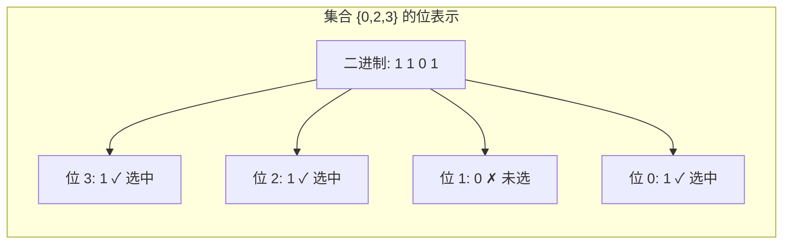
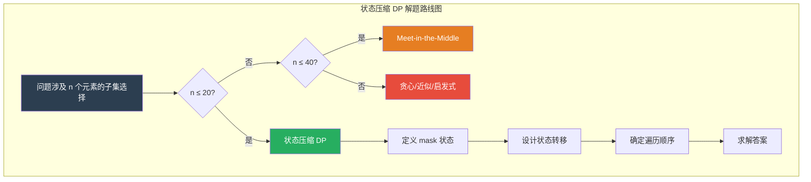
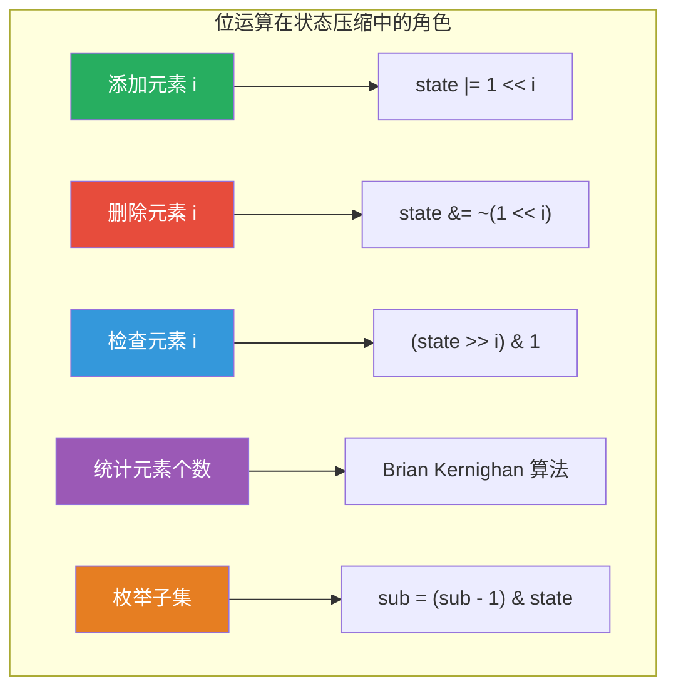
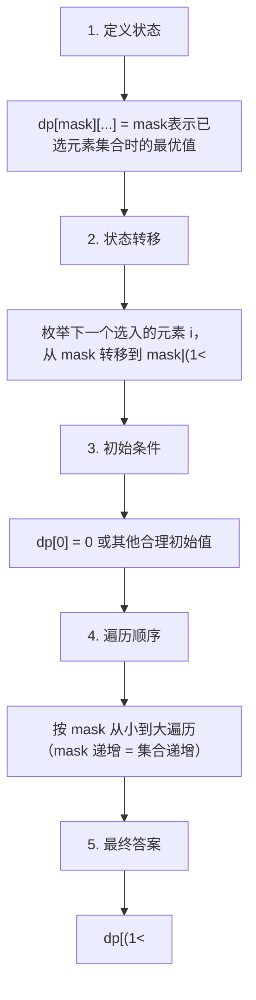
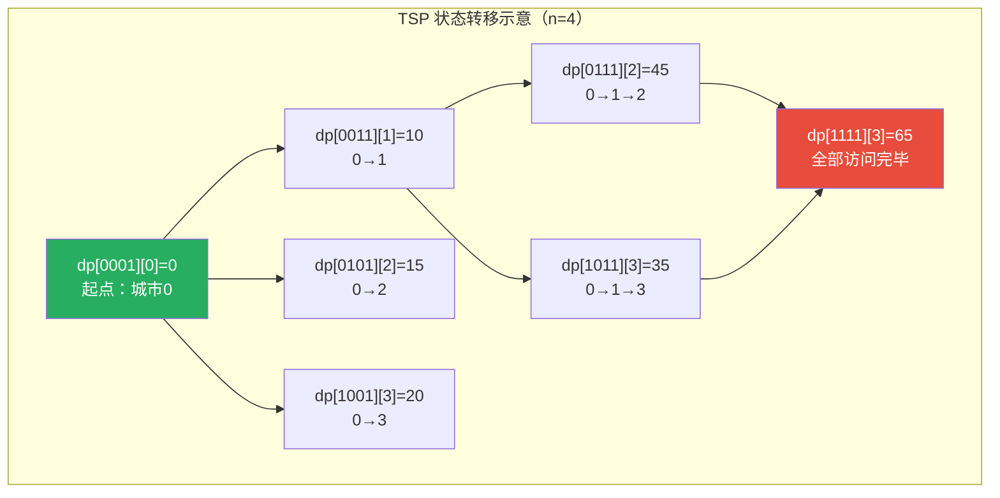
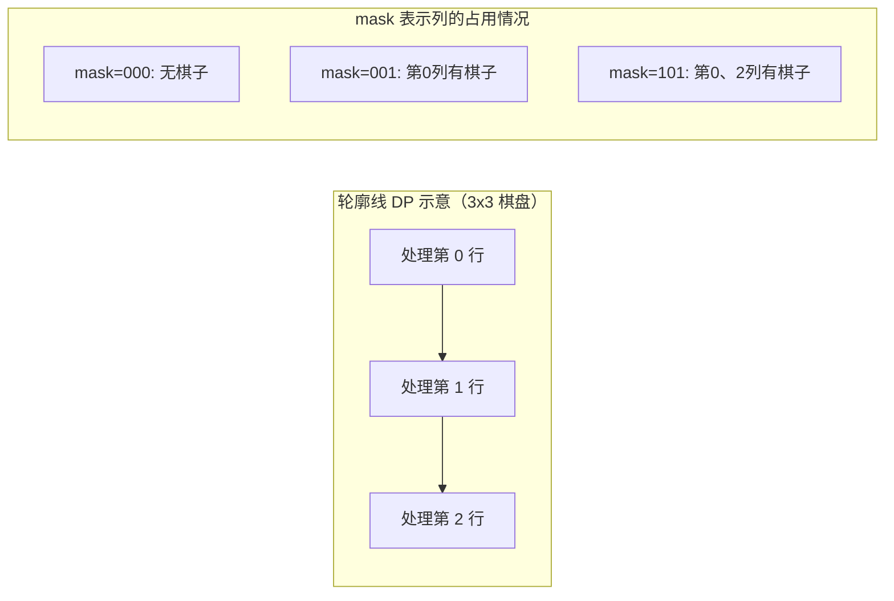

## 动态规划状态压缩

动态规划（DP）是算法设计的核心范式之一，但许多问题的状态空间不是简单的整数或字符串——而是**集合**。如何用 DP 高效地处理集合状态？答案就是**状态压缩**：将集合编码为整数的二进制位，利用位运算在 O(1) 时间内完成状态的增删查改，从而将指数级的暴力搜索转化为结构化的动态规划。

状态压缩 DP 广泛应用于组合优化、图论、博弈论等领域，是算法竞赛和高级面试中的高频考点。它的核心思想简洁而强大：**用一个整数的二进制位表示集合中每个元素是否被选中**。例如集合 {0, 2, 3} 可以表示为二进制 `1101`，即十进制的 13——第 0、2、3 位为 1 表示对应元素被选中，第 1 位为 0 表示未被选中。





### 为什么需要状态压缩

在经典动态规划中，我们用一维或二维数组存储状态。但当问题涉及"从 n 个元素中选择若干个组成的子集"时，朴素 DP 无法直接表达"哪些元素已被选中"这一关键信息。具体来说，存在以下典型场景：

| 应用场景 | 核心问题 | 需要记录的信息 | 示例 |
|---------|---------|--------------|------|
| 旅行商问题（TSP） | 经过所有城市的最短回路 | 已访问的城市集合 | n 位二进制，第 i 位为 1 表示城市 i 已访问 |
| 任务分配问题 | n 个任务分配给 n 个人 | 已分配的任务集合 | n 位二进制，第 j 位为 1 表示任务 j 已分配 |
| 集合覆盖问题 | 用最少的集合覆盖全集 | 已被覆盖的元素 | n 位二进制，第 i 位为 1 表示元素 i 已覆盖 |
| 最大权独立集 | 无向图中最大的独立顶点集 | 已选入独立集的节点 | n 位二进制，第 i 位为 1 表示节点 i 已选入 |
| 棋盘放置问题 | 棋盘上放置棋子的最优方案 | 每行的放置状态 | n 位二进制表示一行中哪些列放了棋子 |

暴力枚举所有子集的复杂度是 O(2^n)，而状态压缩 DP 将这个过程转化为结构化的状态转移，使得每个状态只被计算一次。当 n ≤ 20 时（2^20 ≈ 100 万），状态压缩 DP 在时间和空间上都是可接受的；当 n > 20 时，则需要考虑其他方法。

| 方法 | 时间复杂度 | 空间复杂度 | 适用规模 | 特点 |
|------|-----------|-----------|---------|------|
| 暴力搜索 | O(n × n!) | O(n) | n ≤ 10 | 简单直观，但极慢 |
| 状态压缩 DP | O(2^n × n) | O(2^n × n) | n ≤ 20 | 精确解，结构清晰 |
| 状态压缩 DP（滚动数组） | O(2^n × n) | O(2^n) | n ≤ 20 | 空间减半 |
| Meet-in-the-Middle | O(2^(n/2) × n) | O(2^(n/2)) | n ≤ 40 | 空间换时间的折中 |
| 贪心算法 | O(n log n) | O(1) | 任意规模 | 不保证最优解 |
| 近似算法 | O(n^2) | O(n) | 任意规模 | 有近似比保证 |
| 启发式算法（遗传/模拟退火） | 可变 | 可变 | 任意规模 | 不保证最优，但实际效果好 |

### 位运算基础速查

状态压缩的核心工具是位运算。以下是每个位运算操作的含义与常见用法，务必熟记于心：

| 运算 | 符号 | 含义 | 示例（a=13=1101, b=9=1001） | 常见用途 |
|------|------|------|---------------------------|---------|
| 与 AND | `a & b` | 同位均为 1 才为 1 | `1101 & 1001 = 1001 (9)` | 检查某位、取子集 |
| 或 OR | `a \| b` | 同位任一为 1 即为 1 | `1101 \| 1001 = 1101 (13)` | 添加元素 |
| 非 NOT | `~a` | 逐位取反（注意补码） | `~1101 = ...0010` | 清除某位 |
| 异或 XOR | `a ^ b` | 同位不同为 1 | `1101 ^ 1001 = 0100 (4)` | 翻转某位、去重 |
| 左移 | `1 << i` | 1 左移 i 位 | `1 << 3 = 1000 (8)` | 创建掩码 |
| 右移 | `state >> i` | 右移 i 位 | `1101 >> 2 = 11 (3)` | 提取第 i 位 |



**位运算操作工具类**：将常用操作封装为工具类，是状态压缩 DP 编程的标准起手式：

```python
class BitMask:
    """位掩码工具类：封装状态压缩的常用操作"""

    @staticmethod
    def add(state: int, i: int) -> int:
        """将元素 i 加入集合"""
        return state | (1 << i)

    @staticmethod
    def remove(state: int, i: int) -> int:
        """将元素 i 移出集合"""
        return state &amp; ~(1 << i)

    @staticmethod
    def contains(state: int, i: int) -> bool:
        """检查元素 i 是否在集合中"""
        return (state >> i) &amp; 1 == 1

    @staticmethod
    def toggle(state: int, i: int) -> int:
        """翻转元素 i 的选中状态"""
        return state ^ (1 << i)

    @staticmethod
    def popcount(state: int) -> int:
        """计算集合中元素个数（Brian Kernighan 算法）"""
        count = 0
        while state:
            state &amp;= state - 1  # 每次消除最低位的 1
            count += 1
        return count

    @staticmethod
    def subsets(state: int) -> list[int]:
        """枚举 state 的所有非空子集"""
        result = []
        sub = state
        while sub:
            result.append(sub)
            sub = (sub - 1) &amp; state  # 核心技巧：递减枚举子集
        return result

    @staticmethod
    def supersets(state: int, n: int) -> list[int]:
        """枚举包含 state 的所有超集（在全集 [0,n) 内）"""
        full = (1 << n) - 1
        complement = full ^ state  # 不在 state 中的元素
        result = []
        sub = complement
        while True:
            result.append(state | sub)
            if sub == 0:
                break
            sub = (sub - 1) &amp; complement
        return result

    @staticmethod
    def lowbit(state: int) -> int:
        """获取最低位的 1"""
        return state &amp; (-state)

    @staticmethod
    def next_power_of_two(state: int) -> int:
        """获取大于等于 state 的最小 2 的幂"""
        state -= 1
        state |= state >> 1
        state |= state >> 2
        state |= state >> 4
        state |= state >> 8
        state |= state >> 16
        return state + 1
```

**关键技巧：子集枚举**。`(sub - 1) & state` 是状态压缩中最核心的操作之一。它的原理是：对 sub 减 1 会将最低位的 1 变为 0、低位全部变为 1，再与 state 做与运算保证结果仍是 state 的子集。这样可以按递减顺序枚举 state 的所有子集：

```python
# 举例：枚举 state = 13 (1101) 的所有子集
# sub = 1101 → 1100 → 1001 → 1000 → 0101 → 0100 → 0001 → 0（结束）
# 对应集合: {0,2,3}, {2,3}, {0,3}, {3}, {0,2}, {2}, {0}
```

子集枚举的时间复杂度分析：对一个包含 k 个元素的集合，`(sub - 1) & state` 循环恰好执行 2^k - 1 次（枚举所有非空子集）。这意味着对全集（k=n）枚举所有子集需要 O(2^n) 时间，这是状态压缩 DP 中最常见的操作模式。

### 状态压缩 DP 的设计范式

设计状态压缩 DP 通常遵循以下范式：



**遍历顺序的关键原则**：状态压缩 DP 中，mask 从小到大遍历意味着从空集到全集逐步添加元素。这是因为在转移时，新状态 `mask | (1 << i)` 的 mask 值一定大于旧状态 mask，所以按 mask 递增顺序遍历可以保证每个状态只被计算一次，无需记忆化搜索。

**设计要点详解**：

| 步骤 | 关键问题 | 常见做法 | 典型错误 |
|------|---------|---------|---------|
| 状态定义 | mask 的每一位代表什么？ | 明确约定：第 i 位=1 表示元素 i 被选中 | 位的含义前后不一致 |
| 状态转移 | 从哪个状态转移到哪个状态？ | 枚举下一个元素，`mask → mask \| (1<<i)` | 忘记检查元素 i 是否已被选中 |
| 初始条件 | 空状态的值是多少？ | 通常 `dp[0] = 0`（最小化）或 `dp[0] = -INF`（最大化） | 初始值设错导致答案偏移 |
| 遍历顺序 | 按什么顺序计算状态？ | mask 从小到大（递推）或记忆化搜索（DFS） | 递推时逆序导致依赖未计算 |
| 最终答案 | 从哪个状态取结果？ | 通常是全集 `(1<<n)-1` 或遍历所有 mask | 忘记处理"不一定选满所有元素"的情况 |

### 经典问题一：旅行商问题（TSP）

旅行商问题是最经典的状态压缩 DP 问题：给定 n 个城市和城市间的距离矩阵，找到一条经过所有城市恰好一次并回到起点的最短路径。

**状态定义**：`dp[mask][i]` 表示已访问的城市集合为 mask、当前位于城市 i 时的最短路径长度。

**状态转移**：对于当前状态 `(mask, i)`，枚举下一个未访问的城市 j，转移到新状态 `(mask | (1 << j), j)`：

dp[mask | (1 << j)][j] = min(dp[mask | (1 << j)][j], dp[mask][i] + dist[i][j])

**初始条件**：`dp[1][0] = 0`（从城市 0 出发，已访问集合 {0}）。

**最终答案**：遍历所有城市 i，取 `dp[(1<<n)-1][i] + dist[i][0]` 的最小值（从最后一个城市回到起点）。



```python
def tsp(dist: list[list[int]]) -> int:
    """旅行商问题：状态压缩 DP
    时间复杂度 O(2^n * n^2)，空间复杂度 O(2^n * n)
    """
    n = len(dist)
    INF = float('inf')

    # dp[mask][i]：已访问 mask 表示的城市，当前在城市 i 的最短路径
    dp = [[INF] * n for _ in range(1 << n)]
    dp[1][0] = 0  # 从城市 0 出发

    for mask in range(1 << n):
        for i in range(n):
            # 城市 i 必须在已访问集合中，且状态有效
            if not (mask &amp; (1 << i)):
                continue
            if dp[mask][i] == INF:
                continue

            # 尝试访问下一个城市 j
            for j in range(n):
                if mask &amp; (1 << j):  # j 已访问，跳过
                    continue
                new_mask = mask | (1 << j)
                dp[new_mask][j] = min(dp[new_mask][j],
                                      dp[mask][i] + dist[i][j])

    # 回到起点
    full_mask = (1 << n) - 1
    return min(dp[full_mask][i] + dist[i][0] for i in range(n))


# 示例
dist = [
    [0, 10, 15, 20],
    [10, 0, 35, 25],
    [15, 35, 0, 30],
    [20, 25, 30, 0]
]
print(tsp(dist))  # 输出: 80
```

**手动推演（n=4）**：

dp[0001][0] = 0                    （起点，城市 0）
dp[0011][1] = dp[0001][0] + dist[0][1] = 10     （0→1）
dp[0101][2] = dp[0001][0] + dist[0][2] = 15     （0→2）
dp[1001][3] = dp[0001][0] + dist[0][3] = 20     （0→3）
dp[0111][2] = min(dp[0011][1] + dist[1][2],      （0→1→2 = 45）
                   dp[1001][3] + ...)              ...
dp[1011][3] = dp[0011][1] + dist[1][3] = 35     （0→1→3）
dp[1111][3] = min(dp[0111][2] + dist[2][3],      （最终）
                   dp[1011][3] + dist[3][3])
            = min(45+30, 35+30) = 65

答案 = min(dp[1111][i] + dist[i][0]) = 80
最优路径：0→1→3→2→0，总距离 10+25+30+15=80

### 经典问题二：任务分配问题

将 n 个任务分配给 n 个人，每个人完成第 j 个任务的代价为 `cost[i][j]`，求最小总代价。

**状态定义**：`dp[mask]` 表示已分配的任务集合为 mask 时的最小代价。当前应分配的人的编号为 `popcount(mask)`（第 0 人对应空集，第 1 人对应 1 个任务已分配，以此类推）。

**状态转移**：枚举下一个待分配的任务 j，从 mask 转移到 `mask | (1 << j)`。

```python
def assignment(cost: list[list[int]]) -> int:
    """任务分配问题：状态压缩 DP
    时间复杂度 O(2^n * n)，空间复杂度 O(2^n)
    """
    n = len(cost)
    INF = float('inf')

    dp = [INF] * (1 << n)
    dp[0] = 0

    for mask in range(1 << n):
        if dp[mask] == INF:
            continue
        # 当前要分配的是第 popcount(mask) 个人
        person = bin(mask).count('1')
        if person >= n:
            continue

        for task in range(n):
            if mask &amp; (1 << task):  # 任务已分配
                continue
            new_mask = mask | (1 << task)
            dp[new_mask] = min(dp[new_mask],
                               dp[mask] + cost[person][task])

    return dp[(1 << n) - 1]


# 示例
cost = [
    [9, 2, 7, 8],
    [6, 4, 3, 7],
    [5, 8, 1, 8],
    [7, 6, 9, 4]
]
print(assignment(cost))  # 输出: 13
```

**为什么这个算法是正确的？** 关键洞察：当我们已经分配了 k 个任务（`popcount(mask) = k`），下一步必然是第 k 个人来选任务。这意味着任务的分配顺序是固定的（第 0 人、第 1 人、……、第 n-1 人），我们只需要决定每个人选哪个任务。因此状态中不需要记录"当前轮到谁"——它由 `popcount(mask)` 唯一确定。

### 经典问题三：最大独立集

在一个无向图中，独立集是一组两两之间没有边相连的顶点集合。最大独立集是顶点数最多的独立集。

**状态定义**：`dp[mask]` 表示 mask 表示的顶点集合中，最大独立集的大小。

**状态转移**：对于 mask，可以选择包含顶点 i 或不包含顶点 i：
- **不包含 i**：`dp[mask] = dp[mask ^ (1 << i)]`
- **包含 i**：`dp[mask] = dp[mask & ~neighbors[i]] + 1`（排除 i 及其邻居）

取两种情况的最大值。为了避免重复计算，每次选择 mask 中最低位的顶点 i：

```python
def max_independent_set(n: int, edges: list[tuple[int, int]]) -> int:
    """无向图最大独立集：状态压缩 DP
    时间复杂度 O(2^n)，空间复杂度 O(2^n)
    适用规模：n <= 20
    """
    # 预处理每个节点的邻居掩码
    neighbors = [0] * n
    for u, v in edges:
        neighbors[u] |= 1 << v
        neighbors[v] |= 1 << u

    full = (1 << n) - 1
    dp = [0] * (1 << 1)  # 初始只有一个状态

    for mask in range(1, 1 << n):
        # 取 mask 中最低位的顶点
        i = (mask &amp; -mask).bit_length() - 1
        # 不选 i：从 mask 中去掉 i
        without_i = mask ^ (1 << i)
        # 选 i：从 mask 中去掉 i 及其邻居
        with_i = mask &amp; ~(1 << i) &amp; ~neighbors[i]
        dp.append(max(dp[without_i], dp[with_i] + 1))

    return dp[(1 << n) - 1]


# 示例：4 个节点的路径图 0-1-2-3
print(max_independent_set(4, [(0,1), (1,2), (2,3)]))  # 输出: 2
```

**为什么选最低位的顶点？** 这是避免重复计算的关键技巧。假设 mask 包含顶点 {1, 3, 5}，如果我们选顶点 3 做决策，那么 `dp[mask]` 可能等于 `dp[mask & ~neighbors[3]] + 1`。但 `mask & ~neighbors[3]` 可能等于另一个 mask'，而 mask' 也会被枚举到，导致同一个子问题被重复求解。选最低位的顶点保证了每个 mask 的转移路径唯一——要么不选最低位的顶点，要么选它并排除其邻居。

### 经典问题四：集合划分（枚举子集和）

将 n 个元素分成若干组，使各组代价之和最小。典型应用：工作分配、团队组建。

**状态定义**：`dp[mask]` 表示 mask 表示的元素集合的最小分组代价。

**状态转移**：枚举 mask 的每个非空子集 sub 作为一个分组，其余元素为 `mask ^ sub`：

dp[mask] = min(dp[mask], dp[mask ^ sub] + cost[sub])

其中 `cost[sub]` 是子集 sub 作为一组的代价（如组内元素之和、组内最大值等），需要预计算。

```python
def min_partition_cost(n: int, cost_func) -> int:
    """集合划分问题：状态压缩 DP
    cost_func(subset_mask) -> int：计算子集 sub 作为一组的代价
    时间复杂度 O(3^n)，空间复杂度 O(2^n)
    """
    INF = float('inf')
    full = (1 << n) - 1
    dp = [INF] * (1 << n)
    dp[0] = 0

    # 预计算每个子集的代价
    subset_cost = [0] * (1 << n)
    for mask in range(1, 1 << n):
        subset_cost[mask] = cost_func(mask)

    for mask in range(1, 1 << n):
        # 枚举 mask 的所有非空子集
        sub = mask
        while sub:
            other = mask ^ sub
            dp[mask] = min(dp[mask], dp[other] + subset_cost[sub])
            sub = (sub - 1) &amp; mask

    return dp[full]
```

**复杂度分析**：这个算法的时间复杂度是 O(3^n)，而非 O(2^n × n)。原因是对每个 mask，我们需要枚举它的所有子集。对所有 mask 求和，`Σ C(n,k) × 2^k = 3^n`（由二项式定理）。虽然看起来比 O(2^n × n) 慢，但在 n ≤ 16 时仍然可行，且代码非常简洁。

### 经典问题五：棋盘覆盖（轮廓线 DP / Profile DP）

在 n×n 的棋盘上放置棋子，要求每行每列最多放一个棋子，求最大权重和。这是**轮廓线 DP（Profile DP）**的典型应用——用位掩码表示棋盘当前行的处理状态。

**状态定义**：`dp[mask]` 表示当前行处理完毕后，各列的占用状态为 mask 时的最大权重。mask 的第 j 位为 1 表示第 j 列已有棋子。

**状态转移**：逐行处理，对每一行逐格决定是否放棋子。关键是利用**轮廓线**——已经处理完的格子用 1 表示，未处理的用 0 表示。每处理一个格子，轮廓线向右移动一位。



```python
def chessboard_max(n: int, board: list[list[int]]) -> int:
    """棋盘最大权放置：每行每列最多一个棋子
    时间复杂度 O(n * 2^n)，空间复杂度 O(2^n)
    """
    INF = float('inf')

    # 生成合法的放置方案：每行只有一个棋子（或不放）
    valid_masks = [m for m in range(1 << n) if bin(m).count('1') <= 1]

    # 预计算每个 mask 在各行的权重
    def weight(row: int, mask: int) -> int:
        if mask == 0:
            return 0
        col = mask.bit_length() - 1
        return board[row][col]

    prev = [-INF] * (1 << n)
    prev[0] = 0

    for i in range(n):
        curr = [-INF] * (1 << n)
        for cmask in valid_masks:  # 当前行的放置
            for pmask in range(1 << n):  # 上一行的放置
                if prev[pmask] == -INF:
                    continue
                # 检查列冲突：cmask 和 pmask 不能在同一列
                if cmask &amp; pmask:
                    continue
                new_mask = cmask | pmask
                curr[new_mask] = max(curr[new_mask],
                                     prev[pmask] + weight(i, cmask))
        prev = curr

    return max(prev)
```

**轮廓线 DP 的通用模式**：当问题需要在网格上逐格放置，且只需要知道相邻行/列的约束时，轮廓线 DP 是最高效的选择。它将二维状态压缩为一维，用一个 mask 表示"边界线"上的占用情况。典型应用包括：

| 问题类型 | mask 含义 | 典型复杂度 |
|---------|----------|-----------|
| 棋盘放置（每行一个） | 哪些列已占用 | O(n × 2^n) |
| 骨牌覆盖（多米诺） | 当前列的占用轮廓 | O(n × 2^n) |
| 棋盘染色（相邻不同色） | 当前列的颜色状态 | O(n × k^n)，k 为颜色数 |
| 最大独立集（网格图） | 上一行的选中状态 | O(m × n × 2^n) |

### 经典问题六：Meet-in-the-Middle

当 n > 20 时，2^n 的状态空间超出内存和时间限制。**Meet-in-the-Middle** 是一种"空间换时间"的经典技巧：将元素分为两半，分别枚举子集后合并，将 O(2^n) 降到 O(2^(n/2) × n)。

**核心思想**：将 n 个元素分成 A 组（前 n/2 个）和 B 组（后 n/2 个）。对于任意子集 S，可以写成 S = S_A ∪ S_B，其中 S_A ⊆ A，S_B ⊆ B。分别枚举 A 和 B 的所有子集（各 2^(n/2) 个），然后通过某种方式合并。

```python
def meet_in_the_middle(arr: list[int], target: int) -> bool:
    """两数之和的集合版本：检查是否有子集之和等于 target
    时间复杂度 O(2^(n/2) * n)，空间复杂度 O(2^(n/2))
    """
    n = len(arr)
    mid = n // 2

    # 分别枚举两半的子集和
    left_sums = set()
    for mask in range(1 << mid):
        s = 0
        for i in range(mid):
            if mask &amp; (1 << i):
                s += arr[i]
        left_sums.add(s)

    right_sums = []
    for mask in range(1 << (n - mid)):
        s = 0
        for i in range(n - mid):
            if mask &amp; (1 << i):
                s += arr[i]
        right_sums.append(s)

    # 合并：对每个右半子集和，在左半中查找互补值
    for rs in right_sums:
        if (target - rs) in left_sums:
            return True
    return False


# 示例：检查 {3, 7, 1, 8, -2, 4} 是否有子集和为 10
print(meet_in_the_middle([3, 7, 1, 8, -2, 4], 10))  # True
```

**实际应用场景**：
- **子集和问题**：n ≤ 40 时，用 Meet-in-the-Middle 在 O(2^20 × 40) ≈ 4000 万次操作内解决
- **TSP 变体**：n = 25-40 时，将城市分为两组，分别枚举后合并
- **密码破解**：穷举小规模密钥空间的两半

### Go 实现：最短哈密顿路径

```go
// 最短哈密顿路径：状态压缩 DP
// 与 TSP 类似，但不需要回到起点
func shortestHamiltonPath(dist [][]int) int {
    n := len(dist)
    INF := 1 << 30

    // dp[mask][i]：已访问 mask 表示的节点，当前在节点 i
    dp := make([][]int, 1<<n)
    for i := range dp {
        dp[i] = make([]int, n)
        for j := range dp[i] {
            dp[i][j] = INF
        }
    }

    // 从节点 0 开始
    dp[1][0] = 0

    for mask := 0; mask < (1 << n); mask++ {
        for i := 0; i < n; i++ {
            if (mask&amp;(1<<i)) == 0 || dp[mask][i] == INF {
                continue
            }
            for j := 0; j < n; j++ {
                if (mask &amp; (1 << j)) != 0 {
                    continue
                }
                newMask := mask | (1 << j)
                dp[newMask][j] = min(dp[newMask][j],
                    dp[mask][i]+dist[i][j])
            }
        }
    }

    // 找最短路径（不需要回到起点）
    fullMask := (1 << n) - 1
    result := INF
    for i := 0; i < n; i++ {
        result = min(result, dp[fullMask][i])
    }
    return result
}

func min(a, b int) int {
    if a < b {
        return a
    }
    return b
}
```

### C++ 实现：竞赛常用模板

在算法竞赛中，C++ 是状态压缩 DP 的主流语言。以下是几个竞赛常用的模板：

```cpp
#include <bits/stdc++.h>
using namespace std;

// 旅行商问题（TSP）：状态压缩 DP
int tsp(vector<vector<int>>&amp; dist) {
    int n = dist.size();
    int full = (1 << n) - 1;
    const int INF = 1e9;

    // dp[mask][i]：已访问 mask 表示的城市，当前在城市 i
    vector<vector<int>> dp(1 << n, vector<int>(n, INF));
    dp[1][0] = 0;

    for (int mask = 0; mask <= full; mask++) {
        for (int i = 0; i < n; i++) {
            if (!(mask &amp; (1 << i)) || dp[mask][i] == INF)
                continue;
            for (int j = 0; j < n; j++) {
                if (mask &amp; (1 << j)) continue;
                int nmask = mask | (1 << j);
                dp[nmask][j] = min(dp[nmask][j],
                                   dp[mask][i] + dist[i][j]);
            }
        }
    }

    int ans = INF;
    for (int i = 0; i < n; i++)
        ans = min(ans, dp[full][i] + dist[i][0]);
    return ans;
}

// 快速 popcount（C++20 也可用 std::popcount）
int popcount(int x) {
    return __builtin_popcount(x);
}

// 枚举 mask 的所有非空子集
void enumerate_subsets(int mask) {
    for (int sub = mask; sub; sub = (sub - 1) &amp; mask) {
        // 处理子集 sub
    }
}

// SOS DP：计算 g[mask] = Σ f[sub] for sub ⊆ mask
vector<int> sos_dp(vector<int>&amp; f, int n) {
    vector<int> g = f;
    for (int i = 0; i < n; i++) {
        for (int mask = 0; mask < (1 << n); mask++) {
            if (mask &amp; (1 << i))
                g[mask] += g[mask ^ (1 << i)];
        }
    }
    return g;
}
```

### 高级优化技巧

#### 1. 滚动数组：空间减半

在 TSP 中，dp 数组大小为 2^n × n。如果状态转移只依赖前一个 mask 层级（某些问题满足），可以用滚动数组将空间从 O(2^n × n) 减到 O(2^n)。但需要注意：在 TSP 中，由于 mask 的遍历顺序不保证严格的层级依赖，滚动数组的使用需要仔细验证。

**适用场景**：当状态转移只依赖当前行和上一行时（如棋盘放置、轮廓线 DP），可以用两行交替的滚动数组，将空间减半。

#### 2. SOS DP（Sum over Subsets）

SOS DP 用于高效计算每个状态的所有子集（或超集）的函数值之和。传统方法对每个 mask 枚举所有子集，总复杂度 O(3^n)；SOS DP 将其优化到 O(n × 2^n)。

**直觉理解**：SOS DP 的核心思想是"逐位累积"。对于 n=3 的情况，考虑 mask=5（101）：

g[101] = f[101] + f[100] + f[001] + f[000]

传统方法需要枚举 101 的所有 4 个子集。SOS DP 的做法是逐位处理：
- 处理第 0 位：g[101] = f[101] + f[100]（加上第 0 位为 0 的版本）
- 处理第 1 位：g[101] 不变（第 1 位已经是 0）
- 处理第 2 位：g[101] += g[001]（加上第 2 位为 0 的版本）

最终 g[101] 包含了所有子集的贡献。这个过程的本质是**动态规划的维度分解**——将 n 维子集枚举分解为 n 个一维操作。

```python
def sos_dp(f: list[int], n: int) -> list[int]:
    """SOS DP：计算 g[mask] = sum(f[sub] for sub ⊆ mask)
    时间复杂度 O(n * 2^n)，空间复杂度 O(2^n)
    """
    g = f.copy()
    for i in range(n):
        for mask in range(1 << n):
            if mask &amp; (1 << i):
                g[mask] += g[mask ^ (1 << i)]
    return g

# 示例：计算每个掩码的所有子集的 f 值之和
f = [1, 2, 3, 4]  # f[00]=1, f[01]=2, f[10]=3, f[11]=4
result = sos_dp(f, 2)
# g[00]=1, g[01]=3, g[10]=4, g[11]=10
```

**SOS DP 的变体**：

| 变体 | 定义 | 转移方程 | 应用场景 |
|------|------|---------|---------|
| 子集和 | g[mask] = Σ f[sub], sub ⊆ mask | `g[mask] += g[mask ^ (1<<i)]` | 统计子集属性 |
| 超集和 | g[mask] = Σ f[sup], sup ⊇ mask | `g[mask] += g[mask \| (1<<i)]` | 统计超集属性 |
| 子集异或和 | g[mask] = Σ f[sub] XOR sub ⊆ mask | 类似结构 | XOR 相关问题 |

#### 3. 预处理优化

- **预计算 popcount**：用查表法避免每次调用 `bin(mask).count('1')`，将 O(n) 降到 O(1)。
- **预计算子集枚举**：对于需要反复枚举子集的场景，预计算所有 mask 的子集列表。
- **预计算邻居掩码**：在图论问题中，预先将每个节点的邻居编码为位掩码，避免转移时反复遍历邻接表。

```python
# 预计算 popcount 查表
POPCOUNT = [0] * (1 << 20)
for i in range(1, 1 << 20):
    POPCOUNT[i] = POPCOUNT[i >> 1] + (i &amp; 1)

# 使用示例
mask = 0b11010110
print(POPCOUNT[mask])  # 输出: 5
```

#### 4. 剪枝与加速

- **无效状态剪枝**：如果某个 mask 对应的状态值为 INF 或不可能，直接跳过，不枚举其子状态。
- **对称性剪枝**：在 TSP 中，固定起点为城市 0，可以将搜索空间减半。
- **位运算加速**：使用 `__builtin_popcount`（C++）、`bit_count()`（Python 3.10+）等内置函数替代手动计算。

```python
# Python 3.10+ 内置 bit_count
mask = 0b11010110
print(mask.bit_count())  # 输出: 5

# 内置函数比 bin(mask).count('1') 快 10 倍以上
```

### 适用规模与性能分析

| 元素数 n | 状态数 2^n | 时间 O(2^n × n) | 空间 O(2^n × n) | 可行性 |
|----------|-----------|-----------------|-----------------|--------|
| 10 | 1,024 | ~10K 次 | ~8 KB | ✅ 极快 |
| 15 | 32,768 | ~500K 次 | ~4 MB | ✅ 很快 |
| 18 | 262,144 | ~5M 次 | ~36 MB | ✅ 可行 |
| 20 | 1,048,576 | ~20M 次 | ~160 MB | ⚠️ 可行但需注意内存 |
| 22 | 4,194,304 | ~90M 次 | ~700 MB | ❌ 内存可能不足 |
| 25 | 33,554,432 | ~800M 次 | ~5 GB | ❌ 超出常规限制 |
| 40 | ~1 万亿 | 不可行 | 不可用 | ❌ 必须用 Meet-in-the-Middle |

**工程经验**：在竞赛和面试中，n ≤ 20 是状态压缩 DP 的舒适区；n = 20-22 需要谨慎处理内存和运行时间；n > 22 通常需要考虑其他方法（如 meet-in-the-middle、分支限界、近似算法）。n > 40 时只能使用近似算法或启发式方法。

### 常见陷阱与调试技巧

1. **位运算优先级错误**：`mask & 1 << i` 实际上是 `mask & (1 << i)`，因为 `<<` 优先级高于 `&`。但 `mask | (1 << i) - 1` 会被解析为 `mask | ((1 << i) - 1)`，需要加括号确保正确。**最佳实践：始终对位运算加括号**。

2. **遍历顺序错误**：状态压缩 DP 要求按 mask 从小到大遍历。如果使用记忆化搜索（DFS + memo），则顺序无关紧要，但必须正确处理重叠子问题。

3. **内存超限**：`dp = [[INF] * n for _ in range(1 << n)]` 在 n=20 时需要约 160 MB。如果内存受限，考虑使用 `array` 模块或 NumPy 数组替代 Python 列表，内存占用可减少 5-10 倍。

4. **popcount 实现差异**：Python 中 `bin(mask).count('1')` 速度较慢，Python 3.10+ 应使用 `mask.bit_count()`。C++ 中使用 `__builtin_popcount(mask)` 或 `std::popcount(mask)`（C++20）。

5. **全集掩码计算错误**：全集应为 `(1 << n) - 1`，而不是 `1 << n`。例如 n=3 时，全集是 `0b111 = 7`，而不是 `0b1000 = 8`。

6. **子集枚举的终止条件**：`sub = (sub - 1) & mask` 循环会在 `sub = 0` 时终止。如果需要包含空集，循环结束后手动添加 `sub = 0` 的情况。

7. **SOS DP 的遍历顺序**：外层循环必须按位遍历（0 到 n-1），内层循环按 mask 遍历（0 到 2^n - 1）。如果交换内外层，结果会出错，因为逐位累积的正确性依赖于"处理第 i 位时，第 0 到 i-1 位已经稳定"这一不变量。

### 练习题与进阶路径

从简单到困难，建议按以下顺序练习：

| 难度 | 题目 | 核心考点 | 推荐语言 |
|------|------|---------|---------|
| ⭐ | LeetCode 698: 划分为 k 个相等的子集 | 集合划分 + 剪枝 | Python |
| ⭐ | LeetCode 464: 我能赢吗 | 博弈论 + 状态压缩 | Python |
| ⭐⭐ | LeetCode 473: 火柴拼正方形 | 集合划分 + 回溯 | Python |
| ⭐⭐ | LeetCode 691: 贴纸拼词 | 最小集合覆盖 | Python |
| ⭐⭐⭐ | LeetCode 1595: 连通两组点的最小成本 | 任务分配 + 状态压缩 | C++ |
| ⭐⭐⭐ | SPOJ QTREE5 | 树上最大独立集 | C++ |
| ⭐⭐⭐⭐ | CF 11D: 无向图中的简单环 | TSP 变体 + 计数 | C++ |
| ⭐⭐⭐⭐ | USACO: 骑士旅行 | 棋盘覆盖 + 轮廓线 DP | C++ |

### 与其他技巧对比

| 特性 | 状态压缩 DP | 记忆化搜索 | BFS/DFS 暴力 | 贪心算法 |
|------|-----------|-----------|-------------|---------|
| 核心思想 | 位运算编码集合 | 递归 + 缓存 | 全枚举 | 局部最优 → 全局最优 |
| 时间复杂度 | O(2^n × n) | O(2^n × n) | O(n!) | O(n log n) |
| 空间复杂度 | O(2^n × n) | O(2^n × n) | O(n) | O(1) |
| 适用规模 | n ≤ 20 | n ≤ 20 | n ≤ 10 | 任意 |
| 代码复杂度 | 中等 | 较低 | 低 | 低 |
| 正确性保证 | 最优解 | 最优解 | 最优解 | 不保证 |

**选择建议**：
- **需要最优解 + n ≤ 20** → 状态压缩 DP 或记忆化搜索
- **需要最优解 + 20 < n ≤ 40** → Meet-in-the-Middle
- **需要最优解 + n > 40** → 贪心、近似算法或启发式算法
- **代码简洁优先** → 记忆化搜索（无需手动管理状态转移顺序）
- **空间敏感** → 状态压缩 DP + 滚动数组
- **状态转移有规律** → 迭代式状态压缩 DP（通常比记忆化搜索快）
- **网格/棋盘问题** → 轮廓线 DP（Profile DP）

### 实战中的应用领域

1. **芯片设计与电路优化**：在 VLSI 设计中，用状态压缩 DP 求解最优布线、最小割等问题，n 通常不超过 20。

2. **资源调度**：在云计算和任务调度中，用状态压缩 DP 将 n 个任务分配到 n 台机器上，使总延迟最小。当机器数 ≤ 20 时，这是精确解的最优选择。

3. **生物信息学**：在蛋白质折叠、基因序列比对等问题中，状态压缩 DP 用于处理小规模但结构复杂的组合优化。

4. **博弈论与搜索**：在棋类 AI（如国际象棋残局库）中，用状态压缩表示棋盘状态，结合 DP 或 Alpha-Beta 剪枝求解最优策略。

5. **密码学与编码理论**：在某些编码方案和密码分析中，状态压缩用于穷举小规模密钥空间或验证编码约束。

6. **网络流优化**：在小规模网络中，用状态压缩 DP 求解最小割、最大流等问题的精确解，作为验证其他算法的基准。

### 最佳实践清单

1. **规模评估**：先判断 n ≤ 20，这是状态压缩 DP 的核心适用区间
2. **状态定义**：明确 mask 的每一位代表什么，确保状态转移逻辑正确
3. **预处理**：预计算 popcount、邻居掩码、子集代价等，减少运行时计算
4. **位运算加括号**：`mask & (1 << i)` 而非 `mask & 1 << i`，避免优先级错误
5. **遍历顺序**：迭代式 DP 按 mask 从小到大；记忆化搜索无需关心顺序
6. **空间优化**：使用滚动数组、NumPy 数组或 C++ 的 `std::vector` 优化内存
7. **剪枝**：跳过无效状态（dp 值为 INF 或不可能的状态）
8. **测试验证**：从小规模数据开始测试（n=3,4），手动计算验证，逐步增大 n
9. **对称性利用**：固定起点、利用对称性减少搜索空间
10. **工具函数封装**：将位运算操作封装为工具类，提高代码可读性和可维护性

### 常见问题

**Q: 状态压缩 DP 和记忆化搜索有什么区别？**

A: 两者在时间复杂度上相同，核心区别在于实现方式。迭代式状态压缩 DP 按 mask 从小到大遍历，不需要递归栈，空间更可控；记忆化搜索用递归 + 字典/数组缓存结果，代码更直观但可能有递归栈开销。在 n ≤ 20 的范围内，两者性能差异不大。选择建议：状态转移有明确规律时用迭代式；状态转移复杂、需要剪枝时用记忆化搜索。

**Q: 如何处理对称性以减少搜索空间？**

A: 在 TSP 中，如果图是完全图且边权满足三角不等式，可以固定起点为城市 0，将搜索空间从 n! 减到 (n-1)!。更进一步，如果路径有对称性（如正向和反向路径代价相同），可以进一步减半搜索空间。在状态压缩 DP 中，可以通过只考虑包含城市 0 的 mask 来实现。

**Q: n > 20 时有哪些替代方案？**

A: 主要有三类替代方案：
1. **Meet-in-the-middle**：将元素分为两组，分别枚举子集后合并，将 O(2^n) 降到 O(2^(n/2) × n)。适用于 n ≤ 40。
2. **近似算法**：如 Christofides 算法（TSP 的 1.5-近似）、遗传算法、模拟退火等。
3. **问题特化**：如果问题有特殊结构（如稀疏图、层次结构），可以利用这些结构设计更高效的算法。

**Q: 如何调试状态压缩 DP 代码？**

A: 建议以下调试策略：
1. 从 n=3 或 n=4 的小规模数据开始，手动计算所有状态值，与代码输出对比
2. 打印关键状态转移：在内层循环中输出 mask、i、j、dp 值，检查转移是否正确
3. 检查遍历顺序：确保按 mask 从小到大遍历，且每个状态只被计算一次
4. 验证边界条件：检查初始状态（通常 mask=1 或 mask=0）和最终状态（通常 mask=(1<<n)-1）

**Q: 状态压缩 DP 在实际工程中有用吗？**

A: 在实际工程中，状态压缩 DP 的直接应用场景相对有限（因为 n > 20 时性能不可接受），但它背后的思想——用紧凑编码表示复杂状态、利用位运算加速状态操作——在很多领域都有应用。例如：
- 布尔索引（Bitset）在数据库和搜索引擎中广泛使用
- 位掩码在权限控制（如 Unix 文件权限 rwx）中是标准做法
- 状态机编码在编译器设计和协议解析中很常见

理解状态压缩 DP 有助于在工程中设计更高效的状态表示方案。
