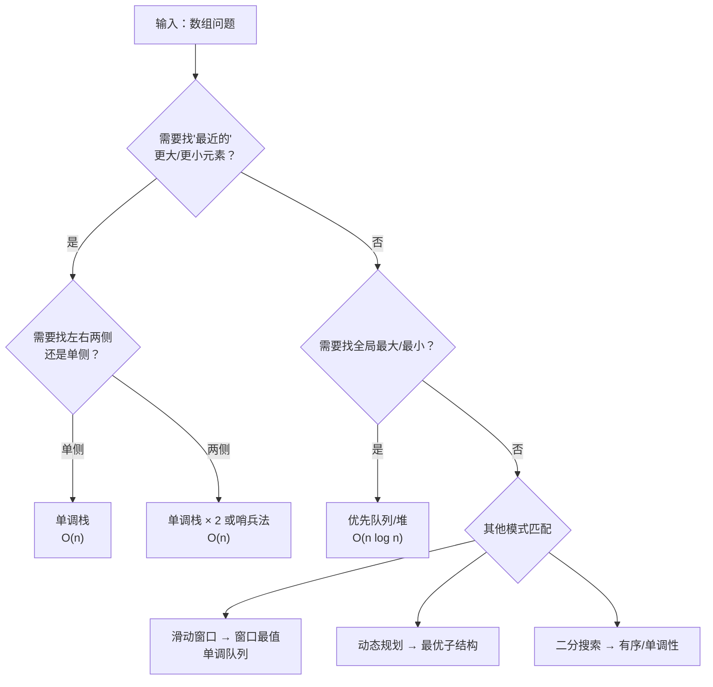

# 单调栈技巧

> **一句话理解**：单调栈是解决"在数组中快速找到每个元素左侧或右侧第一个比它大（或小）的元素"问题的专用数据结构，时间复杂度 O(n)。

单调栈在 LeetCode 高频题中出现率极高，是面试中性价比最高的算法之一。掌握它，能同时拿下「每日温度」「柱状图最大矩形」「接雨水」「股票跨度」等一系列经典题目。

但单调栈的价值远不止面试。在实时监控系统中检测异常峰值、在金融数据分析中寻找价格突破点、在游戏开发中计算光照遮挡——凡是涉及"最近邻居"和"单调性"的问题，单调栈都能以线性时间优雅解决。

---

## 什么是单调栈

单调栈是一种特殊的栈结构，栈内元素始终保持**单调递增**或**单调递减**的顺序。它的核心能力是：在一次线性遍历中，为每个元素找到"最近的"更大或更小邻居。

**与普通栈的区别：**

| 特性 | 普通栈 | 单调栈 |
|------|--------|--------|
| 栈内顺序 | 无约束 | 严格单调递增或递减 |
| 入栈操作 | 直接入栈 | 先弹出所有破坏单调性的元素，再入栈 |
| 核心能力 | LIFO 顺序访问 | 快速定位"最近更大/更小"元素 |
| 时间复杂度 | 入栈出栈 O(1) | 整体摊还 O(n) |

**关键洞察**：单调栈之所以高效，是因为它利用了一个事实——如果元素 A 在元素 B 的左边且 A > B，那么对于 B 右侧的任何元素来说，A 永远不可能是"最近的更小元素"，因为 B 更近且更小。因此 A 可以被安全地弹出。

---

## 单调性思维：道法术器中的"道"

很多教程把单调栈当作一个"技巧"来教，但理解单调栈真正需要的是一种**思维方式**——单调性思维。

### 什么是单调性思维

单调性思维的核心问题是：**当你遍历一组数据时，如果某些历史信息已经不可能影响未来的决策，能否安全地丢弃它？**

具体到栈的场景：假设我们正在找"每个元素右边第一个比它大的元素"，遍历到位置 i 时：

- 栈中存着一组"还没找到更大元素"的索引
- 新元素 nums[i] 比栈顶大 → 栈顶元素终于找到了答案
- 新元素 nums[i] 比栈顶小 → 栈顶元素继续等待，新元素入栈排队

**被弹出的元素不是被"浪费"了，而是被"解决"了**——它们已经获得了自己的答案，不再需要留在栈中。这就是为什么每个元素最多入栈出栈各一次。

### 单调性思维的三个层次

| 层次 | 问题 | 单调栈的角色 |
|------|------|-------------|
| **识别** | 问题中是否存在"最近更大/更小"的模式？ | 决定是否使用单调栈 |
| **构造** | 应该维护递增栈还是递减栈？ | 选择栈的单调性方向 |
| **推理** | 弹出和入栈的时机如何确定？ | 设计算法的具体逻辑 |

### 为什么叫"单调栈"而不叫"最近邻栈"

因为栈的单调性是手段，不是目的。我们维护单调性的目的恰恰是为了**打破单调性**——当新元素破坏了栈的单调性时，被破坏的那些元素就找到了它们的答案。这个"维护-打破"的循环就是单调栈的全部运作机理。

---

## 为什么单调栈能达到 O(n)：摊还分析

初学者最常见的疑问：`while` 循环嵌套在 `for` 循环里，为什么不是 O(n²)？

答案在于**摊还分析**（Amortized Analysis）：

- 每个元素**最多入栈一次**，**最多出栈一次**
- `for` 循环执行 n 次，`while` 循环的总弹出次数累计不超过 n 次
- 因此总操作次数 ≤ 2n，时间复杂度为 **O(n)**

操作计数（以 n=5 的数组为例）：

元素    入栈    出栈    栈状态变化
nums[0]  1次    0次    [] → [0]
nums[1]  1次    1次    [0] → [] → [1]        (弹出 0)
nums[2]  1次    0次    [1] → [1,2]
nums[3]  1次    2次    [1,2] → [1] → [] → [3] (弹出 2, 1)
nums[4]  1次    0次    [3] → [3,4]

总入栈: 5次  总出栈: 3次  总操作: 8次 < 2×5

> **直觉理解**：想象你在整理一排书——每本书最多被拿起一次、放下一次。无论中间怎么调整顺序，总动作数不会超过 2n。

**严格证明（反证法）**：假设总弹出次数超过 n，那么至少有一个元素被弹出两次。但单调栈的逻辑保证了：一旦一个元素被弹出（找到答案），它就不会再被放入栈中。矛盾。因此总弹出次数 ≤ n。

---

## 三大核心模式

单调栈的所有应用都可以归纳为三种模式。理解这三种模式，就能解决 90% 的单调栈问题。

### 模式一：向右找下一个更大元素（单调递减栈）

**适用场景**：遍历数组时，维护一个**单调递减栈**。当新元素比栈顶大时，说明"找到了栈顶元素的下一个更大元素"。

**算法步骤**：

1. 从左到右遍历数组
2. 对于每个元素 `nums[i]`：
   - 当栈非空且 `nums[i] > nums[stack[-1]]` 时，弹出栈顶 `idx`，记录 `result[idx] = nums[i]`
   - 重复直到栈为空或栈顶 ≥ `nums[i]`
3. 将 `i` 入栈

**Python 实现**：

```python
def next_greater_element(nums: list[int]) -> list[int]:
    """找每个元素右边第一个比它大的元素"""
    n = len(nums)
    result = [-1] * n          # 默认值 -1 表示不存在
    stack = []                  # 存索引，维护单调递减

    for i in range(n):
        # 当前元素比栈顶大 → 栈顶找到了"下一个更大元素"
        while stack and nums[i] > nums[stack[-1]]:
            idx = stack.pop()
            result[idx] = nums[i]
        stack.append(i)

    return result

# 示例
nums = [2, 1, 2, 4, 3]
print(next_greater_element(nums))  # 输出: [4, 2, 4, -1, -1]
```

**Go 实现**：

```go
func nextGreaterElement(nums []int) []int {
    n := len(nums)
    result := make([]int, n)
    for i := range result {
        result[i] = -1
    }
    stack := []int{} // 存索引

    for i := 0; i < n; i++ {
        for len(stack) > 0 &amp;&amp; nums[i] > nums[stack[len(stack)-1]] {
            idx := stack[len(stack)-1]
            stack = stack[:len(stack)-1]
            result[idx] = nums[i]
        }
        stack = append(stack, i)
    }
    return result
}
```

**逐步推演**（`nums = [2, 1, 2, 4, 3]`）：

步骤  i  nums[i]  栈(索引→值)       操作                    result
─────────────────────────────────────────────────────────────────────
 1    0    2      []              入栈 [0]                [-1,-1,-1,-1,-1]
 2    1    1      [0→2]           1 < 2，入栈 [0,1]       [-1,-1,-1,-1,-1]
 3    2    2      [0→2, 1→1]      2 > 1，弹出1，result[1]=2  [-1,2,-1,-1,-1]
                                  2 = 2，入栈 [0,2]       [-1,2,-1,-1,-1]
 4    3    4      [0→2, 2→2]      4 > 2，弹出2，result[2]=4  [-1,2,4,-1,-1]
                                  4 > 2，弹出0，result[0]=4  [4,2,4,-1,-1]
                                  入栈 [3]                [4,2,4,-1,-1]
 5    4    3      [3→4]           3 < 4，入栈 [3,4]       [4,2,4,-1,-1]

最终 result = [4, 2, 4, -1, -1]

---

### 模式二：向右找下一个更小元素（单调递增栈）

**适用场景**：维护一个**单调递增栈**。当新元素比栈顶小时，说明"找到了栈顶元素的下一个更小元素"。

**Python 实现**：

```python
def next_smaller_element(nums: list[int]) -> list[int]:
    """找每个元素右边第一个比它小的元素"""
    n = len(nums)
    result = [-1] * n          # 默认值 -1 表示不存在
    stack = []                  # 存索引，维护单调递增

    for i in range(n):
        # 当前元素比栈顶小 → 栈顶找到了"下一个更小元素"
        while stack and nums[i] < nums[stack[-1]]:
            idx = stack.pop()
            result[idx] = nums[i]
        stack.append(i)

    return result

# 示例
nums = [2, 1, 2, 4, 3]
print(next_smaller_element(nums))  # 输出: [1, -1, -1, 3, -1]
```

**逐步推演**（`nums = [2, 1, 2, 4, 3]`）：

步骤  i  nums[i]  栈(索引→值)       操作                    result
─────────────────────────────────────────────────────────────────────
 1    0    2      []              入栈 [0]                [-1,-1,-1,-1,-1]
 2    1    1      [0→2]           1 < 2，弹出0，result[0]=1  [1,-1,-1,-1,-1]
                                  入栈 [1]                [1,-1,-1,-1,-1]
 3    2    2      [1→1]           2 > 1，入栈 [1,2]       [1,-1,-1,-1,-1]
 4    3    4      [1→1, 2→2]      4 > 2，入栈 [1,2,3]     [1,-1,-1,-1,-1]
 5    4    3      [1→1, 2→2, 3→4] 3 < 4，弹出3，result[3]=3  [1,-1,-1,3,-1]
                                  3 > 2，入栈 [1,2,4]     [1,-1,-1,3,-1]

最终 result = [1, -1, -1, 3, -1]

---

### 模式三：向左找上一个更大/更小元素

**适用场景**：从右到左遍历数组，栈内元素代表"尚未被分配答案的右侧元素"。

**Python 实现（向左找上一个更大元素）**：

```python
def previous_greater_element(nums: list[int]) -> list[int]:
    """找每个元素左边第一个比它大的元素"""
    n = len(nums)
    result = [-1] * n
    stack = []                  # 存索引，维护单调递减

    for i in range(n - 1, -1, -1):  # 从右到左遍历
        while stack and nums[i] > nums[stack[-1]]:
            idx = stack.pop()
            result[idx] = nums[i]
        stack.append(i)

    return result

# 示例
nums = [2, 1, 2, 4, 3]
print(previous_greater_element(nums))  # 输出: [-1, 2, -1, -1, 4]
```

**模式选择速查表**：

| 目标 | 遍历方向 | 栈的单调性 | 说明 |
|------|----------|-----------|------|
| 右边第一个更大 | 从左到右 | 单调递减 | 弹出时，当前元素就是答案 |
| 右边第一个更小 | 从左到右 | 单调递增 | 弹出时，当前元素就是答案 |
| 左边第一个更大 | 从右到左 | 单调递减 | 镜像处理 |
| 左边第一个更小 | 从右到左 | 单调递增 | 镜像处理 |

> **记忆口诀**：找更大 → 递减栈；找更小 → 递增栈。找右边 → 从左遍历；找左边 → 从右遍历。

**为什么方向和单调性是这样对应的？** 以"右边第一个更大"为例：我们从左往右遍历，维护一个递减栈。栈里的元素从栈底到栈顶依次变小——这意味着栈底的元素"更大、更早出现"。当新元素入栈时，如果它比栈顶大，就"解决"了栈顶元素的等待。如果新元素比较小，它就安静地入栈等待——因为后面的元素可能更大，能解决它。**递减栈确保了栈中等待的元素从小到大排列，任何一个比它们大的新元素都能按序解决。**

---

## 经典应用一：每日温度

**题目**（LeetCode 739）：给定每天的温度数组，返回一个数组，表示"需要等几天才能遇到更高温度"。如果以后都不会更高，则为 0。

**分析**：这本质上是"找下一个更大元素的索引差值"，是模式一的直接应用。

```python
def daily_temperatures(temperatures: list[int]) -> list[int]:
    n = len(temperatures)
    result = [0] * n
    stack = []  # 存索引，维护单调递减（从栈底到栈顶温度递减）

    for i in range(n):
        while stack and temperatures[i] > temperatures[stack[-1]]:
            idx = stack.pop()
            result[idx] = i - idx  # 等待天数 = 索引差
        stack.append(i)

    return result
```

**Go 实现**：

```go
func dailyTemperatures(temperatures []int) []int {
    n := len(temperatures)
    result := make([]int, n)
    stack := []int{} // 存索引

    for i := 0; i < n; i++ {
        for len(stack) > 0 &amp;&amp; temperatures[i] > temperatures[stack[len(stack)-1]] {
            idx := stack[len(stack)-1]
            stack = stack[:len(stack)-1]
            result[idx] = i - idx
        }
        stack = append(stack, i)
    }
    return result
}

// temperatures = [73, 74, 75, 71, 69, 72, 76, 73]
// 输出: [1, 1, 4, 2, 1, 1, 0, 0]
```

**逐步推演**（`temperatures = [73, 74, 75, 71, 69, 72, 76, 73]`）：

i=0: temp=73, 栈=[],          入栈 [0]
i=1: temp=74, 74>73, 弹出0    result[0] = 1-0 = 1
     栈=[],                   入栈 [1]
i=2: temp=75, 75>74, 弹出1    result[1] = 2-1 = 1
     栈=[],                   入栈 [2]
i=3: temp=71, 71<75, 入栈     [2, 3]
i=4: temp=69, 69<71, 入栈     [2, 3, 4]
i=5: temp=72, 72>69, 弹出4    result[4] = 5-4 = 1
     72>71, 弹出3             result[3] = 5-3 = 2
     72<75, 入栈              [2, 5]
i=6: temp=76, 76>72, 弹出5    result[5] = 6-5 = 1
     76>75, 弹出2             result[2] = 6-2 = 4
     入栈 [6]
i=7: temp=73, 73<76, 入栈     [6, 7]

结果: [1, 1, 4, 2, 1, 1, 0, 0]

---

## 经典应用二：股票跨度问题

**题目**（LeetCode 901）：股票每日价格，求连续多少天价格 ≤ 当天价格（含当天）。例如 `[100, 80, 60, 70, 60, 75, 85]` 的跨度为 `[1, 1, 1, 2, 1, 4, 6]`。

**分析**：找"左边第一个更大元素的索引差值"，是模式三的变体。

```python
class StockSpanner:
    def __init__(self):
        self.stack = []    # (价格, 跨度)
        self.index = 0

    def next(self, price: int) -> int:
        span = 1
        # 弹出所有 ≤ 当前价格的元素，累加跨度
        while self.stack and self.stack[-1][0] <= price:
            span += self.stack.pop()[1]
        self.stack.append((price, span))
        return span

# 演示
ss = StockSpanner()
prices = [100, 80, 60, 70, 60, 75, 85]
for p in prices:
    print(f"价格 {p} → 跨度 {ss.next(p)}")
# 价格 100 → 跨度 1
# 价格 80  → 跨度 1
# 价格 60  → 跨度 1
# 价格 70  → 跨度 2  (70, 60)
# 价格 60  → 跨度 1
# 价格 75  → 跨度 4  (75, 60, 70, 60)
# 价格 85  → 跨度 6  (85, 75, 60, 70, 60, 80)
```

**关键区别**：这里栈中存的是 `(值, 跨度)` 对而非索引，因为需要累加连续天数。这是单调栈的常见变体——栈中存储的不仅是位置信息，还可以是聚合信息。

**为什么累加跨度是正确的？** 当弹出一个 `(60, 1)` 时，意味着 60 被 70 覆盖了。但 60 原本也覆盖了更早的天数。这些天数的贡献已经"打包"在 `(60, 1)` 中了吗？不——实际上每次弹出时，被弹出元素的跨度已经包含了它自己和所有被它覆盖的更早元素。所以累加是正确的：新元素的总跨度 = 自己的 1 天 + 所有被它"压过"的元素的跨度之和。

---

## 经典应用三：柱状图中最大矩形

**题目**（LeetCode 84）：给定柱状图各柱的高度，求能画出的最大矩形面积。

**分析**：对于每根柱子 `heights[i]`，以它为高度的最大矩形宽度 = `右边第一个更小的索引 - 左边第一个更小的索引 - 1`。因此需要同时找左右两侧的"第一个更小元素"。

**方法一：两次遍历（左右各一次单调栈）**

```python
def largest_rectangle_area(heights: list[int]) -> int:
    """柱状图中最大的矩形"""
    n = len(heights)
    left = [-1] * n    # 左边第一个更小的索引
    right = [n] * n    # 右边第一个更小的索引
    stack = []

    # 从左到右：找每个元素左边第一个更小的
    for i in range(n):
        while stack and heights[stack[-1]] >= heights[i]:
            stack.pop()
        left[i] = stack[-1] if stack else -1
        stack.append(i)

    # 从右到左：找每个元素右边第一个更小的
    stack.clear()
    for i in range(n - 1, -1, -1):
        while stack and heights[stack[-1]] >= heights[i]:
            stack.pop()
        right[i] = stack[-1] if stack else n
        stack.append(i)

    # 计算最大面积
    max_area = 0
    for i in range(n):
        width = right[i] - left[i] - 1
        area = heights[i] * width
        max_area = max(max_area, area)

    return max_area

heights = [2, 1, 5, 6, 2, 3]
print(largest_rectangle_area(heights))  # 输出: 10 (高度5, 宽度2, 即 [5,6])
```

**方法二：哨兵 + 单次遍历（更精巧）**

```python
def largest_rectangle_area_v2(heights: list[int]) -> int:
    """柱状图中最大的矩形——哨兵法"""
    stack = [-1]  # 哨兵：简化边界处理，避免空栈判断
    max_area = 0

    for i, h in enumerate(heights):
        # 当前高度 < 栈顶高度 → 栈顶柱子的右边界确定了
        while stack[-1] != -1 and heights[stack[-1]] >= h:
            height = heights[stack.pop()]
            width = i - stack[-1] - 1   # 宽度 = 右边界 - 左边界 - 1
            max_area = max(max_area, height * width)
        stack.append(i)

    # 处理栈中剩余元素（它们的右边界是数组末尾）
    while stack[-1] != -1:
        height = heights[stack.pop()]
        width = len(heights) - stack[-1] - 1
        max_area = max(max_area, height * width)

    return max_area
```

**逐步推演**（`heights = [2, 1, 5, 6, 2, 3]`，哨兵法）：

初始: stack = [-1], max_area = 0

i=0, h=2: stack[-1]=-1, 2<不弹, 入栈      stack=[-1,0]
i=1, h=1: stack[-1]=0,  2>=1, 弹出0
           height=2, width=1-(-1)-1=1, area=2×1=2
           stack[-1]=-1, 入栈              stack=[-1,1]
i=2, h=5: 1<5, 不弹, 入栈                 stack=[-1,1,2]
i=3, h=6: 5<6, 不弹, 入栈                 stack=[-1,1,2,3]
i=4, h=2: 6>=2, 弹出3 → height=6, w=4-2-1=1, area=6
           5>=2, 弹出2 → height=5, w=4-1-1=2, area=10 ✓
           1<2, 入栈                       stack=[-1,1,4]
i=5, h=3: 2<3, 不弹, 入栈                 stack=[-1,1,4,5]

剩余处理:
  弹出5 → height=3, w=6-4-1=1, area=3
  弹出4 → height=2, w=6-1-1=4, area=8
  弹出1 → height=1, w=6-(-1)-1=6, area=6

最大面积 = 10

**哨兵法的核心技巧**：栈底放 `-1` 作为哨兵，这样弹出元素时 `stack[-1]` 永远有值——要么是左边第一个更小的索引，要么是哨兵 -1（表示左边没有更小的）。这省去了大量的边界检查代码。

---

## 经典应用四：接雨水

**题目**（LeetCode 42）：给定柱子高度数组，计算能接多少单位的雨水。

**分析**：对于每个位置 `i`，能接的雨水量 = `min(左边最高, 右边最高) - heights[i]`。单调栈解法的思路是：每当遇到一个比栈顶高的柱子，就能计算栈顶柱子上方的雨水。

```python
def trap_rain_water(height: list[int]) -> int:
    """接雨水：单调栈解法"""
    stack = []   # 维护单调递减栈（存索引）
    water = 0

    for i, h in enumerate(height):
        # 当前高度 > 栈顶 → 可以形成"凹槽"积水
        while stack and h > height[stack[-1]]:
            bottom = stack.pop()      # 凹槽底部
            if not stack:
                break                 # 左侧无墙，无法积水
            width = i - stack[-1] - 1               # 凹槽宽度
            bounded_height = min(h, height[stack[-1]])  # 取较矮的墙
            depth = bounded_height - height[bottom]      # 积水深度
            water += width * depth
        stack.append(i)

    return water

# 示例
height = [0, 1, 0, 2, 1, 0, 1, 3, 2, 1, 2, 1]
print(trap_rain_water(height))  # 输出: 6
```

**几何直觉**：想象你站在一个山谷里，左右各有一堵墙。雨水会在你头顶上方积聚，积水量取决于较矮的那堵墙的高度。

        3
        |   2   2
    2   |   |   |   2   1
    | 1 | 1 | 1 | | |   |
  1 | | | | | | | | | 1 |
| | | | | | | | | | | | |
0 1 0 2 1 0 1 3 2 1 2 1
        ↑ 积水区域 ↑

**为什么单调栈能正确计算接雨水？** 单调递减栈维护了一个"递减的墙序列"。每当遇到一个更高的柱子，就意味着"一个凹槽被封闭了"——左边有更高的墙（栈中下一个元素），右边是当前柱子，底部是被弹出的柱子。三个高度确定了一个矩形积水区域。栈保证了我们按序处理每个凹槽，不会遗漏。

---

## 经典应用五：二维最大矩形

**题目**（LeetCode 85）：在 0-1 矩阵中，找到全是 '1' 的最大矩形面积。

**分析**：逐行扫描，将每行视为一个"柱状图的底边"，向上累积连续 '1' 的高度。对每一行使用柱状图最大矩形算法。

```python
def maximal_rectangle(matrix: list[list[str]]) -> int:
    """在 0-1 矩阵中找最大全 1 矩形"""
    if not matrix or not matrix[0]:
        return 0

    n = len(matrix[0])
    heights = [0] * n    # 每列的累积高度
    max_area = 0

    for row in matrix:
        # 逐行更新高度
        for j in range(n):
            if row[j] == '1':
                heights[j] += 1    # 连续 1，高度 +1
            else:
                heights[j] = 0     # 断了，重置

        # 对当前行的"柱状图"求最大矩形
        max_area = max(max_area, largest_rectangle_area(heights))

    return max_area

# 示例
matrix = [
    ["1", "0", "1", "0", "0"],
    ["1", "0", "1", "1", "1"],
    ["1", "1", "1", "1", "1"],
    ["1", "0", "0", "1", "0"]
]
print(maximal_rectangle(matrix))  # 输出: 6
```

**高度累积可视化**：

原始矩阵:         累积高度(第0行):   累积高度(第1行):   累积高度(第2行):
1 0 1 0 0         1 0 1 0 0         1 0 1 1 1         1 0 2 2 2
1 0 1 1 1   →     矩形面积=1        矩形面积=3        矩形面积=6 ✓
1 1 1 1 1
1 0 0 1 0

**为什么降维有效？** 一个二维矩形可以由三个参数完全确定：底边行、底边列范围、高度。当我们逐行处理时，底边行是固定的，高度由"向上连续 1 的个数"决定。这就把二维问题转化成了对每一行的"柱状图最大矩形"一维问题。这种"逐行扫描 + 一维求解"的降维技巧在矩阵类问题中非常常见。

---

## 经典应用六：移掉 K 位数字使最小（单调栈 + 贪心）

**题目**（LeetCode 402）：给定一个数字字符串和整数 k，移除 k 位数字，使剩下的数字最小。

**分析**：从左到右遍历，维护一个单调递增栈。每当当前数字比栈顶小时，弹出栈顶（相当于移除一个"不该在这"的大数字）。总共移除 k 个。

```python
def remove_k_digits(num: str, k: int) -> str:
    """移掉K位数字使剩余数字最小"""
    stack = []

    for digit in num:
        # 当前数字比栈顶小 → 栈顶是"不该在这"的大数字
        while stack and stack[-1] > digit and k > 0:
            stack.pop()
            k -= 1
        stack.append(digit)

    # 如果还有剩余移除次数，从尾部截断（剩余的栈是递增的）
    stack = stack[:len(stack) - k]

    # 转为字符串，去掉前导零
    result = ''.join(stack).lstrip('0')
    return result if result else '0'

# 示例
print(remove_k_digits("1432219", 3))  # 输出: "1219"
print(remove_k_digits("10200", 1))    # 输出: "200"
print(remove_k_digits("10", 2))       # 输出: "0"
```

**为什么贪心正确？** 每次弹出栈顶（移除一个大数字），得到的数字一定更小。因为高位越小，整体数字越小。单调栈保证了：我们总是移除那些"让当前数字变大"的峰值。剩余的栈是递增的，意味着数字从左到右不再有"下降的坑"——这就是字典序最小的排列。

---

## 决策流程图：何时使用单调栈

遇到一道数组题，按以下流程判断是否适用单调栈：



**快速判断口诀**：

- 看到"下一个更大/更小" → 单调栈
- 看到"左右边界围成的区域" → 单调栈（柱状图/接雨水类）
- 看到"窗口内最大/最小" → 单调队列（单调栈的变体）
- 看到"全局最大/最小" → 堆/优先队列

---

## 环形数组的单调栈处理

**题目**（LeetCode 503）：环形数组中，找每个元素的下一个更大元素。如果到末尾还没找到，从头继续。

**技巧**：将数组逻辑上视为 `nums + nums`（长度翻倍），但通过**取模运算**避免实际复制：

```python
def next_greater_elements_circular(nums: list[int]) -> list[int]:
    """环形数组：下一个更大元素"""
    n = len(nums)
    result = [-1] * n
    stack = []  # 存索引

    # 遍历 2n 次，模拟环形
    for i in range(2 * n):
        while stack and nums[i % n] > nums[stack[-1]]:
            idx = stack.pop()
            result[idx] = nums[i % n]
        if i < n:  # 只在第一轮入栈
            stack.append(i)

    return result

# 示例
nums = [1, 2, 1]
print(next_greater_elements_circular(nums))  # 输出: [2, -1, 2]
```

**为什么只需入栈前 n 个**：后 n 次遍历的目的仅是为前 n 个元素"兜底"——如果第一轮没找到更大元素，第二轮可能找到。栈中只需保留原始 n 个元素的索引。

---

## 去重处理：当数组有重复元素时

当数组包含重复元素时，单调栈的行为取决于比较操作符的选择：

| 比较符 | 行为 | 适用场景 |
|--------|------|----------|
| `>` | 遇到相同值不弹出，相同值共存于栈中 | 找"严格更大"元素 |
| `>=` | 遇到相同值先弹出旧的，相同值只保留最新的 | 找"大于等于"元素，或需要最新位置 |

```python
# 场景：nums = [2, 2, 2]，找"下一个严格更大元素"
# 用 >: result = [-1, -1, -1]（三个2都不弹出）
# 用 >=: result = [-1, -1, -1]（弹出后也没更大的）

# 场景：nums = [1, 2, 2, 3]，找"下一个更大元素"
# 用 >: result = [2, 3, 3, -1]（2不弹2，直到遇到3才弹）
# 用 >=: result = [3, 3, 3, -1]（先弹出旧2，再被3弹出）
```

**实战建议**：大多数单调栈题目要求"严格更大/更小"，用 `>` 即可。只有当题目明确说"大于等于"或需要处理最新位置时才用 `>=`。

---

## 单调栈与单调队列：兄弟数据结构

| 特性 | 单调栈 | 单调队列 |
|------|--------|----------|
| 数据结构 | 栈（LIFO） | 双端队列（两端操作） |
| 核心能力 | 找"最近"更大/更小 | 找"窗口内"最大/最小 |
| 典型应用 | 下一个更大元素、柱状图 | 滑动窗口最大值 |
| 时间复杂度 | O(n) | O(n) |
| 关联题目 | 每日温度、接雨水 | 滑动窗口最大值（LC 239） |

> **何时升级到单调队列**：当问题不仅需要"最近的"邻居，还需要在**滑动窗口**中快速获取最值时，单调队列更合适。单调队列是单调栈的"双端增强版"。

**单调队列的额外能力**：单调队列可以 O(1) 获取任意大小窗口的最大/最小值。它通过在队尾维护单调性（和栈一样），同时允许在队首弹出过期元素（栈做不到）。这是栈→队列的本质升级：从只能操作一端，到可以操作两端。

---

## 从暴力到单调栈：复杂度演进

以"每日温度"为例，展示三种解法的复杂度对比：

| 方法 | 思路 | 时间复杂度 | 空间复杂度 | n=10⁵ 耗时 |
|------|------|-----------|-----------|------------|
| 暴力法 | 对每个元素向右扫描 | O(n²) | O(1) | ~10秒 |
| 分治法 | 线段树查询区间最大值 | O(n log n) | O(n) | ~1.7秒 |
| 单调栈 | 一次遍历 | O(n) | O(n) | ~0.01秒 |

```python
# 暴力法：O(n²)
def daily_temperatures_brute(temperatures):
    n = len(temperatures)
    result = [0] * n
    for i in range(n):
        for j in range(i + 1, n):     # 向右扫描
            if temperatures[j] > temperatures[i]:
                result[i] = j - i
                break
    return result

# 单调栈法：O(n)
def daily_temperatures_stack(temperatures):
    n = len(temperatures)
    result = [0] * n
    stack = []
    for i in range(n):
        while stack and temperatures[i] > temperatures[stack[-1]]:
            idx = stack.pop()
            result[idx] = i - idx
        stack.append(i)
    return result
```

> **性能差距**：当 n = 10⁵ 时，暴力法需要约 50 亿次操作（超时），单调栈只需约 20 万次操作。这就是为什么单调栈是高频面试考点——它不是"更快的暴力"，而是**质的飞跃**。

---

## 真实工程场景

单调栈不仅是面试算法工具，在实际工程中也有广泛应用：

**1. 服务器监控：CPU 峰值检测**

当 CPU 使用率超过阈值时，需要找到"从什么时候开始异常"和"异常持续了多久"。这等价于"找下一个更大/更小元素"：

```python
def find_anomaly_intervals(cpu_usage: list[int], threshold: int) -> list[tuple]:
    """找到所有超过阈值的连续区间"""
    n = len(cpu_usage)
    # 用单调递增栈找每个位置"左边第一个 < threshold"和"右边第一个 < threshold"
    # 高于阈值的区间就是异常区间
    intervals = []
    # ... (核心逻辑等价于柱状图问题)
    return intervals
```

**2. 股票交易系统：支撑位和阻力位**

股票价格的"支撑位"（价格不容易跌破的水平）就是"左边第一个更小的元素"。"阻力位"（价格不容易突破的水平）就是"左边第一个更大的元素"。交易算法使用这些指标来制定买卖策略。

**3. 游戏开发：光照遮挡计算**

在 2D 游戏中，计算光线是否被某个物体遮挡，本质上是"对于位置 i，找到左边/右边第一个高于光源的物体"——这是经典的单调栈场景。

**4. 编译器：括号匹配和表达式求值**

虽然编译器通常用普通栈处理括号，但当需要在嵌套结构中快速找到"最近的匹配对"时，单调栈的思想可以优化查找过程。

---

## 常见误区与陷阱

### 误区一：栈中存值还是存索引？

**正确做法：存索引**。

```python
# ❌ 错误：存值，无法计算距离
stack = []
while stack and nums[i] > stack[-1]:
    val = stack.pop()     # 只拿到值，不知道位置
    # result[idx] = ?     # idx 是什么？不知道！

# ✅ 正确：存索引
stack = []
while stack and nums[i] > nums[stack[-1]]:
    idx = stack.pop()     # 拿到索引
    result[idx] = nums[i] # 能定位、能算距离
```

### 误区二：`>` 还是 `>=`？

取决于题目是否要求处理**相等元素**：

- `>`：遇到相等元素时，新元素入栈，保留之前的元素（如"严格更大"）
- `>=`：遇到相等元素时，先弹出旧的（如"大于等于"也算）

```python
# 找"严格下一个更大元素" → 用 >
while stack and nums[i] > nums[stack[-1]]:

# 找"下一个不小于的元素" → 用 >=
while stack and nums[i] >= nums[stack[-1]]:
```

### 误区三：忘记处理栈中剩余元素

遍历结束后，栈中可能还有元素，它们的"下一个更大/更小元素"不存在（默认 -1）。但在柱状图问题中，它们的右边界是数组末尾：

```python
# 柱状图：必须处理剩余元素
while stack[-1] != -1:
    height = heights[stack.pop()]
    width = len(heights) - stack[-1] - 1
    max_area = max(max_area, height * width)
```

### 误区四：哨兵使用不当

哨兵 `-1` 或 `n` 简化了边界处理，但要注意：

```python
stack = [-1]  # 哨兵
# ...
while stack[-1] != -1 and ...:  # 必须检查哨兵
    ...
# 最后处理剩余时也要检查哨兵
while stack[-1] != -1:
    ...
```

### 误区五：混淆"弹出时设置答案"和"入栈时设置答案"

这是新手最容易搞混的地方。正确逻辑是：**弹出元素时设置该元素的答案**，而不是入栈时。因为一个元素的答案要等到"破坏者"（比它大/小的元素）出现时才能确定。

```python
# ❌ 错误：入栈时就设置答案
for i in range(n):
    if stack:
        result[stack[-1]] = i  # 这个 i 不一定是栈顶的"最近更大"
    stack.append(i)

# ✅ 正确：弹出时设置答案
for i in range(n):
    while stack and nums[i] > nums[stack[-1]]:
        idx = stack.pop()
        result[idx] = i  # 此时 i 就是 stack[-1] 的"最近更大"
    stack.append(i)
```

### 误区六：栈的单调性方向搞反

这是选择递增栈还是递减栈时的常见错误。记住一个原则：**栈维护的是"等待被解决的元素"，被弹出时就是被解决时**。

- 找"下一个更大"→ 需要"更小的"在栈中等待 → 栈内递减
- 找"下一个更小"→ 需要"更大的"在栈中等待 → 栈内递增

---

## 调试技巧

单调栈代码出错时，按以下步骤排查：

**1. 打印栈状态**

在每次循环中打印栈的内容和当前元素：

```python
for i in range(n):
    print(f"i={i}, nums[i]={nums[i]}, stack={stack}")
    while stack and nums[i] > nums[stack[-1]]:
        idx = stack.pop()
        result[idx] = nums[i]
        print(f"  弹出 idx={idx}, result={result}")
    stack.append(i)
```

**2. 对比暴力解法**

写一个 O(n²) 的暴力解法，用随机数据对拍：

```python
# 对拍测试
import random
for _ in range(1000):
    nums = [random.randint(0, 100) for _ in range(20)]
    assert next_greater_element(nums) == brute_force(nums)
```

**3. 检查边界情况**

- 空数组 → 应返回空
- 所有元素相同 → 应全部为 -1（或 0）
- 严格递增 → 每个元素只有最后一个为 -1
- 严格递减 → 除最后一个外全部有答案

**4. 检查比较符**

如果结果差一个位置，很可能是 `>` 写成了 `>=`，或反过来。

---

## 模板代码（即用即改）

```python
def monotonic_stack_template(nums: list[int]) -> list[int]:
    """
    单调栈模板：找每个元素右边第一个更大元素
    修改点：
    1. 比较符 > 改为 < → 找更小
    2. 遍历方向改为 range(n-1, -1, -1) → 找左边
    3. result[idx] 的赋值逻辑 → 改为索引差/距离等
    """
    n = len(nums)
    result = [-1] * n
    stack = []

    for i in range(n):
        while stack and nums[i] > nums[stack[-1]]:  # ← 改比较符
            idx = stack.pop()
            result[idx] = nums[i]                    # ← 改赋值逻辑
        stack.append(i)

    return result
```

---

## 最佳实践清单

1. **栈中存索引**：存储索引而非值，方便计算距离、定位元素
2. **使用哨兵**：在栈底放 `-1` 或 `n`，简化空栈边界处理
3. **明确单调性**：找更大 → 递减栈；找更小 → 递增栈
4. **考虑遍历方向**：找右边 → 从左遍历；找左边 → 从右遍历
5. **注意 `>` vs `>=`**：根据题意选择严格还是非严格比较
6. **处理剩余元素**：遍历结束后检查栈中未处理的元素
7. **环形数组用取模**：`i % n` 模拟环形，避免实际复制数组
8. **二维问题降维**：逐行累积高度，转化为一维柱状图问题
9. **复杂度保证**：每个元素最多入栈出栈各一次，O(n) 时间、O(n) 空间
10. **对拍验证**：用暴力解法 + 随机数据验证单调栈实现的正确性

---

## 经典题型与练习推荐

### 入门级（建议先刷）

| 题目 | LeetCode | 核心考点 | 难度 |
|------|----------|----------|------|
| 下一个更大元素 I | 496 | 模式一直接应用 | Easy |
| 每日温度 | 739 | 模式一 + 索引差 | Medium |
| 股票跨度问题 | 901 | 模式三变体 + 聚合 | Medium |

### 进阶级（掌握后必刷）

| 题目 | LeetCode | 核心考点 | 难度 |
|------|----------|----------|------|
| 柱状图中最大矩形 | 84 | 哨兵 + 左右边界 | Hard |
| 接雨水 | 42 | 凹槽积水 + 几何直觉 | Hard |
| 下一个更大元素 II | 503 | 环形数组处理 | Medium |
| 移掉 K 位数字使最小 | 402 | 单调栈 + 贪心 | Medium |

### 高阶级（加分项）

| 题目 | LeetCode | 核心考点 | 难度 |
|------|----------|----------|------|
| 最大矩形 | 85 | 二维降维 + 柱状图 | Hard |
| 滑动窗口最大值 | 239 | 单调队列（栈的升级） | Hard |
| 每日温度 II | 1856 | 线段树 + 单调栈思想 | Hard |

---

## FAQ

**Q1: 单调栈和优先队列（堆）有什么区别？**

| 对比项 | 单调栈 | 优先队列 |
|--------|--------|----------|
| 查找目标 | "最近的"更大/更小 | "全局的"最大/最小 |
| 适用场景 | 数组中找邻居 | 动态数据中取最值 |
| 时间复杂度 | O(n) | O(n log n) |
| 数据访问模式 | 顺序遍历 | 随机插入删除 |
| 空间复杂度 | O(n) | O(n) |

**Q2: 如何确定用单调递增还是递减栈？**

- 找**下一个更大**元素 → 维护**单调递减栈**（栈顶是待定的"较小元素"，遇到更大的就弹出）
- 找**下一个更小**元素 → 维护**单调递增栈**（栈顶是待定的"较大元素"，遇到更小的就弹出）

**Q3: 单调栈能处理环形数组吗？**

可以。两种方法：
- **取模法**（推荐）：遍历 2n 次，索引用 `i % n`，只在前 n 次入栈
- **复制法**：将数组拼接一份 `nums + nums`，实际遍历 2n 长度

取模法的空间复杂度更优（O(n) vs O(2n)），实际效果相同。

**Q4: 为什么柱状图问题中用 `>=` 而非 `>`？**

当相邻柱子高度相等时，如果用 `>`，两个等高柱子会互相"挡住"，导致计算的宽度不正确。用 `>=` 可以先弹出左侧的等高柱子，确保宽度计算准确。

具体来说：如果 `heights = [2, 2]`，用 `>` 时两根柱子都在栈中，弹不出去。用 `>=` 时第一根柱子会被弹出，宽度正确计算为 2。

**Q5: 单调栈和滑动窗口有什么关系？**

单调栈和滑动窗口是两种不同的模式，但它们可以组合：
- 滑动窗口 + 单调栈 = 单调队列（解决"滑动窗口最大值"类问题）
- 单调栈更适合**静态数组**中找固定位置的邻居
- 滑动窗口更适合**动态区间**中维护最值

**Q6: 面试中遇到单调栈问题，如何快速识别？**

三个信号：
1. 题目提到"下一个"、"最近的"、"第一个比它大/小"等关键词
2. 要求 O(n) 时间复杂度
3. 涉及数组中元素之间的"左右邻居"关系

看到这三个信号中的任意两个，优先考虑单调栈。

**Q7: 单调栈的代码怎么背？**

不需要死记硬背。核心模板只有 5 行：

```python
stack = []
for i in range(n):
    while stack and nums[i] > nums[stack[-1]]:  # 改比较符
        idx = stack.pop()
        result[idx] = ...                          # 改赋值
    stack.append(i)
```

记住这 5 行，然后根据题目修改比较符和赋值逻辑即可。
