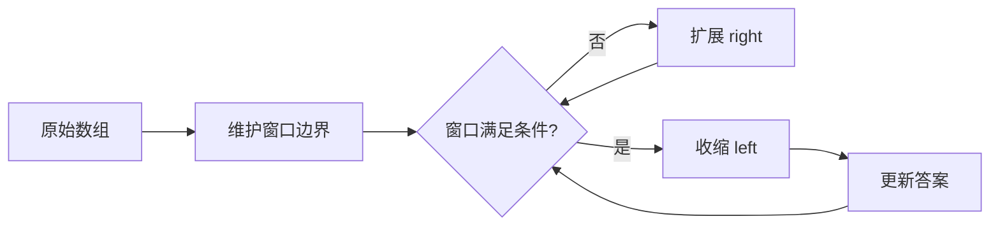
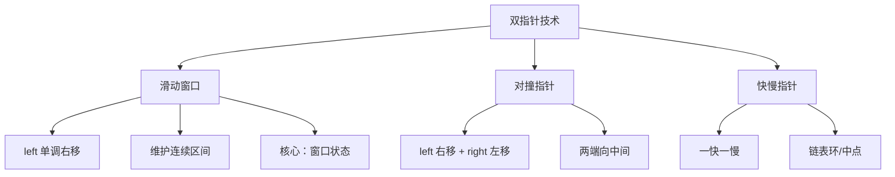
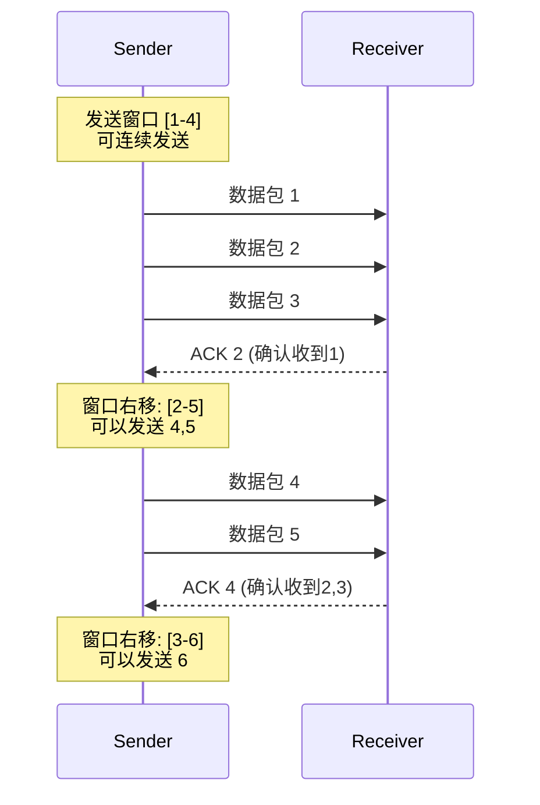

## 滑动窗口

滑动窗口是算法面试与工程实践中最常用的技术之一，广泛应用于字符串处理、数组问题、网络协议、流量控制等场景。LeetCode 上有超过 100 道题目可以使用滑动窗口解决，其核心优势在于将暴力枚举的 O(n²) 或 O(n³) 复杂度压缩到 O(n)——这一压缩的关键前提是：**每个元素最多被右边界访问一次、被左边界移除一次，不存在重复计算**。

掌握滑动窗口的本质，等于掌握了一类问题的统一解法——从 LeetCode 面试到生产环境的高性能网络编程，处处可见其身影。本节从原理机制出发，系统讲解固定窗口、可变窗口、单调队列窗口三大变体，配合经典问题的逐步推演，帮助读者建立完整的滑动窗口知识体系。

---

### 核心原理

#### 本质定义

滑动窗口的本质是在数组/字符串上维护一个**满足特定条件的连续区间**，通过左右边界指针的协调移动，在 O(n) 时间内遍历所有可能的子区间。



#### 四个关键要素

| 要素 | 说明 | 设计要点 |
|------|------|---------|
| 窗口边界 | left（左边界）和 right（右边界） | 左闭右开 [left, right) 或左闭右闭 [left, right]，选定后保持一致 |
| 窗口状态 | 窗口内的聚合信息（和、频率、最值等） | 选择合适的辅助数据结构：哈希表、变量、单调队列 |
| 扩展条件 | right 指针何时向右移动 | 通常是 for 循环自动驱动，每轮扩展一个元素 |
| 收缩条件 | left 指针何时向右移动 | 这是算法的核心逻辑——定义"不满足条件"的判定 |

#### 窗口边界约定

本文统一采用**左闭右闭 [left, right]** 约定，窗口大小 = `right - left + 1`。这种约定与大多数代码实现对齐，阅读时无需额外心算偏移。

> **边界约定的选择原则：** 左闭右闭的直观性更好（窗口大小公式简洁），但左闭右开在某些场景下更方便（如 Python 切片 `s[left:right]`）。无论选择哪种，核心原则是**全文统一，绝不混用**——混用边界约定是滑动窗口代码中 off-by-one 错误的最大来源。

#### 复杂度分析

| 指标 | 值 | 推导 |
|------|----|------|
| 时间复杂度 | O(n) | left 和 right 各自最多遍历数组一次，合计 2n 次操作 |
| 空间复杂度 | O(k) | k 为窗口状态所需空间（频率表大小、单调队列长度等） |
| 相比暴力的优势 | O(n) vs O(n²) | 暴力枚举所有子区间需 O(n²)，滑动窗口利用相邻区间重叠性质避免重复计算 |

---

### 窗口状态维护：从简单到复杂

不同问题需要维护的窗口状态复杂度不同，理解这一点是选择正确方案的关键：

| 窗口状态类型 | 维护方式 | 适用问题 | 典型示例 |
|-------------|---------|---------|---------|
| 窗口和 | 一个变量，进+出- | 固定/可变窗口的和相关问题 | 子数组最大和、最短子数组 |
| 窗口频率 | 哈希表 `{元素: 次数}` | 子串匹配、排列、异位词 | 无重复最长子串、字母异位词 |
| 窗口最值 | 单调队列/单调栈 | 滑动窗口最大/最小值 | LeetCode 239 |
| 窗口合法性 | 计数器/满足条件的元素个数 | 需要窗口内满足特定约束 | 最小覆盖子串、最大连续1的个数 |
| 窗口字符集 | 布尔数组/位掩码 | 涉及固定字符集的判定 | 无重复最长子串（小写字母） |

**状态维护的核心原则：增量更新。** 每次窗口移动只涉及"加入一个元素"和"移除一个元素"两个操作，窗口状态通过这两个增量操作更新，而非每次重新扫描整个窗口。这是 O(n) 复杂度的根本保证。

---

### 固定大小窗口

固定大小窗口是最简单的变体：窗口大小恒为 k，只需关注每次滑动后窗口状态的变化。

#### 核心思路

先计算第一个窗口的状态，然后每次滑动时"减去离开的元素，加上新进入的元素"，避免重复计算。

```python
def max_sum_subarray(nums: list[int], k: int) -> int:
    """固定大小窗口：求长度为 k 的子数组最大和"""
    if len(nums) < k:
        return -1

    # 初始化第一个窗口
    window_sum = sum(nums[:k])
    max_sum = window_sum

    # 滑动窗口：每次移动一位
    for i in range(k, len(nums)):
        # 滑动公式：新和 = 旧和 - 离开元素 + 进入元素
        window_sum = window_sum - nums[i - k] + nums[i]
        max_sum = max(max_sum, window_sum)

    return max_sum

# 示例
nums = [2, 1, 5, 1, 3, 2]
k = 3
print(max_sum_subarray(nums, k))  # 输出: 9 (子数组 [5, 1, 3])
```

#### 逐步推演

以 `nums = [2, 1, 5, 1, 3, 2], k = 3` 为例：

初始窗口: [2, 1, 5]        sum = 9,  max = 9
滑动到 i=3: 减 2 加 1      [1, 5, 1] sum = 7,  max = 9
滑动到 i=4: 减 1 加 3      [5, 1, 3] sum = 9,  max = 9
滑动到 i=5: 减 5 加 2      [1, 3, 2] sum = 6,  max = 9
结果: 9 (子数组 [5, 1, 3] 或 [2, 1, 5])

**复杂度分析：** 时间 O(n)，空间 O(1)。相比暴力枚举所有 k 长子数组的 O(nk)，滑动窗口利用了相邻窗口的重叠性质，将计算量从 O(nk) 压缩到 O(n)。

**滑动增量的思想：** 这里最关键的技巧是"增量更新"——新窗口的和 = 旧窗口的和 - 离开窗口的元素 + 新进入窗口的元素。这个思想可以推广到任何可以增量维护的窗口状态（如频率、乘积等）。

---

### 可变大小窗口

可变大小窗口（又称"伸缩窗口"）是面试中最常见的变体：窗口大小不固定，通过扩展 right 和收缩 left 来寻找满足条件的最优子区间。

#### 通用模板

```python
def variable_window_template(nums: list[int]) -> int:
    """可变大小窗口通用模板"""
    left = 0
    window_state = {}  # 窗口状态（根据问题选择数据结构）
    result = 初始化值

    for right in range(len(nums)):
        # 第一步：扩展窗口——将 nums[right] 加入窗口
        update_window_add(nums[right])

        # 第二步：收缩窗口——当窗口不满足条件时，移动 left
        while 窗口需要收缩:
            update_window_remove(nums[left])
            left += 1

        # 第三步：更新答案（注意：此时窗口满足条件）
        result = update_result(result)

    return result
```

**模板三步走：** (1) for 循环驱动 right 扩展，(2) while 循环驱动 left 收缩，(3) 更新答案。90% 的可变窗口问题都可以套用这个框架。

#### 经典问题：最短子数组（和 ≥ target）

LeetCode 209：给定正整数数组和目标值 target，找到和 ≥ target 的最短连续子数组长度。

```python
def min_subarray_len(target: int, nums: list[int]) -> int:
    """可变大小窗口：找最短子数组使得和 >= target"""
    left = 0
    current_sum = 0
    min_length = float('inf')

    for right in range(len(nums)):
        # 扩展窗口：加入右侧元素
        current_sum += nums[right]

        # 收缩窗口：和已经满足条件时，尝试缩小窗口
        while current_sum >= target:
            min_length = min(min_length, right - left + 1)
            current_sum -= nums[left]
            left += 1

    return min_length if min_length != float('inf') else 0

# 示例
nums = [2, 3, 1, 2, 4, 3]
target = 7
print(min_subarray_len(target, nums))  # 输出: 2 (子数组 [4, 3])
```

#### 逐步推演

right=0: 窗口 [2]       sum=2 < 7, 继续扩展
right=1: 窗口 [2,3]     sum=5 < 7, 继续扩展
right=2: 窗口 [2,3,1]   sum=6 < 7, 继续扩展
right=3: 窗口 [2,3,1,2] sum=8 ≥ 7 → 记录 len=4, 收缩
         收缩 left: [3,1,2] sum=6 < 7, 停止收缩
right=4: 窗口 [3,1,2,4] sum=10 ≥ 7 → 记录 len=4, 收缩
         收缩 left: [1,2,4] sum=7 ≥ 7 → 记录 len=3, 收缩
         收缩 left: [2,4]   sum=6 < 7, 停止收缩
right=5: 窗口 [2,4,3]   sum=9 ≥ 7 → 记录 len=3, 收缩
         收缩 left: [4,3]   sum=7 ≥ 7 → 记录 len=2, 收缩
         收缩 left: [3]     sum=3 < 7, 停止收缩
结果: 2 (子数组 [4, 3])

**关键区分：** 固定窗口中 left 每次移动固定步长（通常为 1）；可变窗口中 left 的移动取决于窗口状态——满足条件时收缩，不满足时扩展。这就是"while"而非"if"的原因：可能需要连续收缩多次才能找到最优解。

**为什么此题要求正整数？** 因为正整数保证了"加入元素使和增大，移除元素使和减小"的单调性，这使得 while 收缩条件可靠。如果数组包含负数，和的增减不单调，滑动窗口的收缩逻辑会失效——此时需要结合前缀和 + 有序集合（如 TreeMap / 有序字典）来解决。

---

### 经典问题一：无重复字符的最长子串

LeetCode 3，滑动窗口最经典的面试题之一，考察频率表维护和窗口收缩条件设计。

```python
def length_of_longest_substring(s: str) -> int:
    """经典问题：无重复字符的最长子串"""
    char_index = {}  # 字符 -> 最近出现的索引
    left = 0
    max_length = 0

    for right, char in enumerate(s):
        # 如果字符重复，直接跳到上次出现位置的下一位
        # 注意：只需跳到 char_index[char] + 1，不需要逐个收缩
        if char in char_index and char_index[char] >= left:
            left = char_index[char] + 1

        char_index[char] = right
        max_length = max(max_length, right - left + 1)

    return max_length

# 示例
s = "abcabcbb"
print(length_of_longest_substring(s))  # 输出: 3 ("abc")
```

#### 逐步推演

right=0, char='a': 窗口 [a]       left=0, max=1
right=1, char='b': 窗口 [a,b]     left=0, max=2
right=2, char='c': 窗口 [a,b,c]   left=0, max=3
right=3, char='a': 'a' 在窗口内(索引0≥left=0)
                   left 跳到 0+1=1, 窗口 [b,c,a], max=3
right=4, char='b': 'b' 在窗口内(索引1≥left=1)
                   left 跳到 1+1=2, 窗口 [c,a,b], max=3
right=5, char='c': 'c' 在窗口内(索引2≥left=2)
                   left 跳到 2+1=3, 窗口 [a,b,c], max=3
right=6, char='b': 'b' 在窗口内(索引4≥left=3)
                   left 跳到 4+1=5, 窗口 [c,b],   max=3
right=7, char='b': 'b' 在窗口内(索引6≥left=5)
                   left 跳到 6+1=7, 窗口 [b],     max=3
结果: 3 ("abc")

**为什么用 `char_index[char] >= left` 而不是 `char in char_index`？**

因为 `char_index` 记录的是所有历史索引。如果一个字符上次出现在 left 之前（即已经在窗口外），它不算重复。只有当重复字符出现在当前窗口内（索引 ≥ left）时，才需要收缩。这个细节是此题的陷阱所在。

**优化变体——使用布尔数组：** 当字符集为固定小写字母时，可以用 `bool[26]` 替代哈希表，常数更小：

```python
def length_of_longest_substring_v2(s: str) -> int:
    """优化版：布尔数组替代哈希表（适用于固定字符集）"""
    seen = [False] * 128  # ASCII 字符集
    left = 0
    max_length = 0

    for right in range(len(s)):
        while seen[ord(s[right])]:
            seen[ord(s[left])] = False
            left += 1
        seen[ord(s[right])] = True
        max_length = max(max_length, right - left + 1)

    return max_length
```

---

### 经典问题二：最小覆盖子串

LeetCode 76，滑动窗口的高级应用，需要同时维护频率表和合法字符计数。给定字符串 s 和 t，找到 s 中包含 t 所有字符的最短子串。

```python
from collections import Counter

def min_window(s: str, t: str) -> str:
    """最小覆盖子串：在 s 中找到包含 t 所有字符的最短子串"""
    if not t or not s:
        return ""

    # 统计 t 中每个字符需要的频率
    need = Counter(t)
    missing = len(t)  # 还需要匹配的字符总数

    left = 0
    start, end = 0, float('inf')  # 记录最短子串的起止位置

    for right in range(len(s)):
        # 扩展窗口：加入右边字符
        if need[s[right]] > 0:
            missing -= 1
        need[s[right]] -= 1

        # 当所有字符都匹配时，尝试收缩窗口
        while missing == 0:
            # 更新最短子串
            if right - left < end - start:
                start, end = left, right

            # 收缩窗口：移出左边字符
            need[s[left]] += 1
            if need[s[left]] > 0:
                missing += 1
            left += 1

    return s[start:end + 1] if end != float('inf') else ""

# 示例
print(min_window("ADOBECODEBANC", "ABC"))  # 输出: "BANC"
```

#### 逐步推演

need = {'A':1, 'B':1, 'C':1}

right=0 'A': need['A']=-1, missing=0 → 窗口 [A]         missing=0, 开始收缩
right=1 'D': need['D']=-1             → 窗口 [A,D]      missing=0, 继续收缩
right=2 'O': need['O']=-1             → 窗口 [A,D,O]    missing=0, 继续收缩
right=3 'B': need['B']=-1             → 窗口 [A,D,O,B]  missing=0, 继续收缩
right=4 'E': need['E']=-1             → 窗口 [A,D,O,B,E] missing=0, 继续收缩
right=5 'C': need['C']=-1             → 窗口 [A,D,O,B,E,C] missing=0
  收缩: left=0 移出 A, need['A']=0<0→missing=1, 停止收缩
  窗口 [D,O,B,E,C], len=5
... (继续推演略，最终找到 "BANC" len=4)

**设计技巧：** `need` 哈希表既存储"需要的数量"，又通过负值记录"窗口中多出的数量"。`missing` 计数器跟踪"还需要匹配多少字符"，当 `missing == 0` 时窗口合法。这种设计避免了逐字符比较频率表，将合法性判断从 O(字符集大小) 降到 O(1)。

---

### 经典问题三：字符频率不超过 k 的最长子串

此题考察窗口收缩条件的设计——不是"和满足条件就收缩"，而是"某个字符频率超过 k 就必须收缩"。

```python
def longest_substring_with_k(s: str, k: int) -> int:
    """找最长子串，其中每个字符出现次数不超过 k"""
    max_length = 0
    char_count = {}
    left = 0

    for right in range(len(s)):
        char_count[s[right]] = char_count.get(s[right], 0) + 1

        # 收缩条件：当前字符频率超过 k
        # 注意：只看 s[right] 的频率，不需要遍历所有字符
        while char_count[s[right]] > k:
            char_count[s[left]] -= 1
            left += 1

        max_length = max(max_length, right - left + 1)

    return max_length

# 示例
print(longest_substring_with_k("eceba", 2))  # 输出: 3 ("ece")
```

**为什么只检查 `s[right]`？** 因为在收缩过程中，只有刚刚加入的 `s[right]` 可能导致频率超标。窗口内其他字符的频率只会随着 left 的移动而减少（或不变），不会增加。因此只需监控当前字符即可，无需遍历整个频率表。

**此题的变体：** 如果要求"恰好包含 k 个不同字符的最长子串"（LeetCode 340 的变体），收缩条件变为"窗口内不同字符数 > k"，需要用一个 `distinct` 计数器跟踪不同字符的数量。

---

### Go 实现：滑动窗口最大值

LeetCode 239，需要结合**单调队列**与滑动窗口，是滑动窗口的高级变体。单调队列保证队首始终是窗口最大值的索引。

```go
// maxSlidingWindow 滑动窗口最大值（单调队列 + 滑动窗口）
// 时间复杂度 O(n)，每个元素最多入队出队各一次
func maxSlidingWindow(nums []int, k int) []int {
    if len(nums) == 0 || k == 0 {
        return []int{}
    }

    result := make([]int, 0, len(nums)-k+1)
    deque := make([]int, 0) // 存储索引，维护单调递减

    for i := 0; i < len(nums); i++ {
        // 步骤1：移除超出窗口的元素（队首）
        for len(deque) > 0 &amp;&amp; deque[0] <= i-k {
            deque = deque[1:]
        }

        // 步骤2：维护单调递减（队尾移除比当前元素小的）
        // 原理：如果队尾元素比当前元素小，那它永远不会成为后续窗口的最大值
        for len(deque) > 0 &amp;&amp; nums[deque[len(deque)-1]] <= nums[i] {
            deque = deque[:len(deque)-1]
        }

        // 步骤3：将当前索引加入队尾
        deque = append(deque, i)

        // 步骤4：窗口形成后（i >= k-1），队首即为当前窗口最大值
        if i >= k-1 {
            result = append(result, nums[deque[0]])
        }
    }

    return result
}

// nums = [1,3,-1,-3,5,3,6,7], k = 3
// 输出: [3,3,5,5,6,7]
```

#### 单调队列核心思想

队列中存储索引，值单调递减。当新元素入队时，所有比它小的队尾元素都被"淘汰"——因为新元素更大且更晚出窗口，那些小元素永远不可能成为最大值。这保证了每次取队首就是当前窗口最大值，无需遍历整个窗口。

#### 逐步推演

nums = [1,3,-1,-3,5,3,6,7], k = 3

i=0, val=1: deque=[0]                          (无输出，窗口未形成)
i=1, val=3: 弹出0(1<3), deque=[1]              (无输出)
i=2, val=-1: deque=[1,2]                        → 输出 3
i=3, val=-3: deque=[1,2,3]                      → 输出 3
i=4, val=5:  弹出1,2,3(都<5), deque=[4]        → 输出 5
i=5, val=3:  deque=[4,5]                        → 输出 5
i=6, val=6:  弹出4,5(都<6), deque=[6]          → 输出 6
i=7, val=7:  弹出6(6<7), deque=[7]              → 输出 7
结果: [3,3,5,5,6,7]

---

### 滑动窗口变体对比

| 变体 | 窗口大小 | 核心逻辑 | 窗口状态维护 | 典型问题 | 时间复杂度 |
|------|---------|---------|-------------|---------|-----------|
| 固定窗口 | 恒定 k | 每次滑动一格，增量更新 | 变量/前缀和 | 子数组最大和 | O(n) |
| 可变窗口-扩展 | 动态 | right 扩展，left 条件收缩 | 哈希表/变量 | 最短子数组（≥target） | O(n) |
| 可变窗口-收缩 | 动态 | right 扩展到合法，left 收缩到不合法 | 哈希表/计数器 | 最长有效子串 | O(n) |
| 双指针窗口 | 动态 | left 和 right 同时向中间收缩 | 变量 | 接雨水 | O(n) |
| 多窗口覆盖 | 多个固定 | 多个窗口位置同时维护 | 哈希表组 | 最小覆盖子串 | O(n) |
| 单调队列窗口 | 固定 k | 队列维护窗口最值 | 单调队列 | 滑动窗口最大值 | O(n) |

---

### 滑动窗口 vs 双指针：辨析

很多人混淆滑动窗口和双指针，两者确实相关但有本质区别：



| 特征 | 滑动窗口 | 对撞指针 | 快慢指针 |
|------|---------|---------|---------|
| 指针移动方向 | 同向（均右移） | 相向（向中间） | 同向但速度不同 |
| 维护的数据 | 窗口内状态 | 两端信息 | 遍历位置关系 |
| 适用场景 | 连续子数组/子串 | 排序数组二元查找 | 链表环检测、中点 |
| 时间复杂度 | O(n) | O(n) | O(n) |

滑动窗口是双指针的一种特例，其独特之处在于：两个指针同向移动，且维护一个连续区间的状态信息。

---

### 网络协议中的滑动窗口

滑动窗口不仅是算法技巧，更是 TCP 协议的核心机制。理解 TCP 滑动窗口，能让你从工程角度重新审视算法。

#### TCP 滑动窗口原理

TCP 使用滑动窗口实现**流量控制**和**可靠传输**。发送方维护一个发送窗口，窗口内的数据可以连续发送而无需等待确认（ACK），窗口大小由接收方的接收缓冲区决定。



#### TCP 滑动窗口模拟

```python
class TCPSlidingWindow:
    """TCP 滑动窗口协议模拟——展示流量控制的核心逻辑"""

    def __init__(self, window_size: int):
        self.window_size = window_size       # 接收方通告的窗口大小
        self.send_base = 0                   # 窗口左边界（最早未确认的序号）
        self.next_seq = 0                    # 下一个待发送的序号
        self.buffer = {}                     # 发送缓冲区 {序号: 数据}
        self.acked = set()                   # 已确认的序号集合

    def send(self, data: bytes) -> bool:
        """发送数据，返回是否成功（窗口满时返回 False）"""
        if self.next_seq >= self.send_base + self.window_size:
            print(f"  窗口已满! send_base={self.send_base}, "
                  f"next_seq={self.next_seq}, window={self.window_size}")
            return False

        self.buffer[self.next_seq] = data
        print(f"  发送序号 {self.next_seq}: {data}")
        self.next_seq += 1
        return True

    def receive_ack(self, ack_num: int):
        """接收累积确认，移动发送窗口"""
        self.acked.add(ack_num)
        print(f"  收到 ACK {ack_num}")

        # 累积确认：所有序号 < ack_num 的数据都已确认
        while self.send_base in self.acked:
            del self.buffer[self.send_base]
            self.send_base += 1
        print(f"  窗口滑动: send_base={self.send_base}")

    def get_window_status(self) -> dict:
        """获取当前窗口状态"""
        return {
            "send_base": self.send_base,
            "next_seq": self.next_seq,
            "window_size": self.window_size,
            "available_slots": self.send_base + self.window_size - self.next_seq,
            "in_flight": list(self.buffer.keys()),
        }


# 使用示例
tcp = TCPSlidingWindow(window_size=4)
print("=== TCP 滑动窗口模拟 ===")
for i in range(7):
    success = tcp.send(f"Segment-{i}".encode())
    if not success:
        break

print("\n--- 模拟 ACK ---")
tcp.receive_ack(2)  # 确认 0, 1
tcp.receive_ack(4)  # 确认 2, 3
print(f"\n窗口状态: {tcp.get_window_status()}")
```

#### TCP vs 算法中的滑动窗口对比

| 维度 | TCP 滑动窗口 | 算法滑动窗口 |
|------|-------------|-------------|
| 数据结构 | 字节流/数据包序列 | 数组/字符串 |
| 窗口含义 | 可发送但未确认的数据范围 | 满足条件的子区间 |
| 窗口大小 | 动态调整（慢启动/拥塞避免） | 固定或由条件决定 |
| 移动触发 | 收到 ACK / 超时重传 | right 扩展 / left 收缩 |
| 目的 | 流量控制 + 可靠传输 | 求最优子区间 |
| 复杂度 | O(1) per packet | O(n) 总体 |

**工程启示：** TCP 的滑动窗口设计给了算法滑动窗口一个重要启发——**窗口大小可以动态调整**。在算法中，我们可以借鉴这一思想：先用小窗口快速定位大致范围，再逐步扩大窗口精度，类似二分搜索与滑动窗口的结合。

---

### 滑动窗口失效场景

理解滑动窗口**何时不能用**，与理解它何时能用同样重要。以下是典型的失效场景：

#### 1. 数组包含负数（非单调和）

当数组包含负数时，"加入元素使和增大"这一单调性假设不成立，导致 while 收缩条件不可靠。

```python
# 错误示例：对含负数数组用滑动窗口求最大和子数组
def wrong_max_subarray(nums, k):
    """这个方法对含负数的数组是错误的"""
    left = 0
    current_sum = sum(nums[:k])
    max_sum = current_sum
    for i in range(k, len(nums)):
        current_sum = current_sum - nums[i - k] + nums[i]
        max_sum = max(max_sum, current_sum)
    return max_sum

# 正确做法：Kadane 算法（动态规划）
def correct_max_subarray(nums):
    """Kadane 算法：处理含负数的最大子数组和"""
    max_sum = current_sum = nums[0]
    for num in nums[1:]:
        current_sum = max(num, current_sum + num)
        max_sum = max(max_sum, current_sum)
    return max_sum
```

#### 2. 子区间不连续

滑动窗口要求子区间是连续的。如果问题允许跳过元素（如"选择 k 个元素使和最大"），需要用排序 + 贪心或动态规划。

#### 3. 需要全局信息

如果每次决策需要整个数组的信息（如"最长递增子序列"），滑动窗口无法维护所需的全局状态，应使用动态规划。

---

### 解题框架：四步法

面对任何滑动窗口问题，按以下四步即可系统化求解：

**第一步：确定窗口类型**
- 问题是否要求"连续子数组/子串"？→ 滑动窗口候选
- 窗口大小是否固定？→ 固定窗口 or 可变窗口
- 窗口需要满足什么条件？→ 定义"合法"的判定

**第二步：设计窗口状态**
- 窗口需要维护什么信息？→ 和、频率、最值、合法性计数器
- 状态能否增量更新？→ 进一个元素 + 出一个元素
- 需要什么辅助数据结构？→ 变量、哈希表、单调队列

**第三步：编写滑动逻辑**
- right 指针：for 循环驱动，每轮扩展一个元素
- left 指针：while 循环条件收缩，直到窗口重新合法或达到目标
- 答案更新：在收缩后（固定窗口）或收缩时（可变窗口）更新

**第四步：验证边界**
- 空数组/单元素数组是否正确？
- 窗口从未满足条件时是否返回默认值？
- 所有元素都满足条件时是否正确？
- 字符串包含特殊字符/Unicode 时是否正常？

---

### 常见陷阱与误区

| 陷阱 | 错误写法 | 正确做法 | 原因 |
|------|---------|---------|------|
| 窗口边界不一致 | 混用左闭右开和左闭右闭 | 全文统一一种约定 | 边界 off-by-one 是最常见的 bug |
| while vs if | 用 if 控制 left 移动 | 用 while 循环收缩 | 可能需要连续收缩多次 |
| 频率表未回退 | 收缩时忘记 `need[char] += 1` | 每次 left 右移都更新状态 | 窗口状态不一致导致结果错误 |
| 答案更新时机 | 在收缩前更新可变窗口答案 | 固定窗口在扩展后更新，可变窗口在收缩时更新 | 不同类型的"最优"对应不同位置 |
| 初始状态遗漏 | 忘记处理第一个窗口 | 手动初始化或在循环中处理 | 首个窗口可能就是答案 |
| 返回值默认值 | 直接返回 min_length | 检查 `float('inf')` 再返回 | 窗口从未满足条件时应返回 0/-1 |

#### 陷阱详解——频率表回退

```python
# 错误写法：收缩时未更新频率表
def wrong_min_window(s, t):
    need = {}
    for c in t:
        need[c] = need.get(c, 0) + 1
    missing = len(t)
    left = 0

    for right in range(len(s)):
        if need.get(s[right], 0) > 0:
            missing -= 1
        need[s[right]] = need.get(s[right], 0) - 1

        while missing == 0:
            # BUG: 这里应该先更新 need[s[left]]，再 left += 1
            # 否则频率表与实际窗口不一致
            left += 1  # ← 忘记了 need[s[left-1]] += 1
    return

# 正确写法
def correct_min_window(s, t):
    from collections import Counter
    need = Counter(t)
    missing = len(t)
    left = 0

    for right in range(len(s)):
        if need[s[right]] > 0:
            missing -= 1
        need[s[right]] -= 1

        while missing == 0:
            need[s[left]] += 1      # 正确：先回退频率
            if need[s[left]] > 0:
                missing += 1
            left += 1
    return
```

#### 陷阱详解——答案更新时机

可变窗口中，答案应该在 **收缩时** 更新（而非收缩后），因为收缩过程中的窗口才是当前最优的：

```python
# 正确：在 while 收缩循环内部更新答案
while current_sum >= target:
    min_length = min(min_length, right - left + 1)  # ← 更新在收缩内部
    current_sum -= nums[left]
    left += 1

# 错误：在 while 循环外部更新答案
while current_sum >= target:
    current_sum -= nums[left]
    left += 1
min_length = min(min_length, right - left + 1)  # ← 此时窗口已经过度收缩
```

---

### 最佳实践

**1. 明确窗口含义**
定义清楚窗口内存储什么数据，窗口代表什么语义。模糊的定义会导致实现混乱。例如在最小覆盖子串中，窗口语义是"包含 t 所有字符的候选子串"，而非"s 的某个随机子串"。

**2. 统一边界约定**
全文统一采用左闭右闭 [left, right] 或左闭右开 [left, right)，不要混用。左闭右闭的窗口大小 = `right - left + 1`。

**3. 增量更新窗口状态**
不要每次重新计算窗口信息，而是利用"加入一个元素 / 移除一个元素"的增量操作，这是 O(n) 复杂度的保证。

**4. 优先使用哈希表维护频率**
对于涉及字符/元素频率的问题，哈希表的增删操作是 O(1) 的，比排序或其他方式高效得多。当字符集固定且较小时（如全小写字母），布尔数组或位掩码更优。

**5. 边界情况三连查**
空输入、单元素、全部元素满足条件——这三个边界覆盖后，大部分边界问题不会出现。

**6. 时间复杂度论证**
每个元素最多被 right 访问一次、被 left 移除一次，因此总时间复杂度为 O(n)。在面试中要能清晰说明这一点，这是区分"背模板"和"真正理解"的关键。

**7. 代码模板化**
将可变窗口模板背熟——for 循环扩展 right，while 循环收缩 left，中间更新答案。90% 的滑动窗口问题都可以套用这个模板。

**8. 失效场景预判**
在开始编码前，先确认：数组是否可能包含负数？子区间是否必须连续？是否需要全局信息？提前识别失效场景，避免在错误的方向上浪费时间。

---

### 常见问题

**Q: 滑动窗口和双指针有什么区别？**

A: 滑动窗口是双指针的一种特例。双指针是一个更大的技术族，包括滑动窗口（同向移动）、对撞指针（相向移动）、快慢指针（不同速度）。滑动窗口的独特之处在于两个指针同向右移，且维护一个连续区间的聚合状态。

**Q: 什么时候用固定窗口，什么时候用可变窗口？**

A: 判断标准很简单——问题是否明确指定了窗口大小。要求"长度为 k 的子数组"→ 固定窗口；要求"最短/最长的子数组"→ 可变窗口。实际面试中，可变窗口出现频率远高于固定窗口。

**Q: 窗口内的聚合操作复杂吗？**

A: 取决于聚合类型。求和/求差：一个变量即可，O(1) 更新。求频率：哈希表，O(1) 增删。求最值：需要单调队列，O(1) 查询。大多数面试题的窗口状态都不复杂，关键是正确维护状态一致性。

**Q: 如果数组包含负数怎么办？**

A: 滑动窗口与正负无关，但收缩条件可能需要调整。求"最长子数组和 ≤ k"这类问题，由于负数会使前缀和不单调，不能简单用滑动窗口，需要结合前缀和 + 有序集合（如 TreeMap）。对于求最大子数组和，应使用 Kadane 算法（动态规划）。

**Q: 如何判断一道题是否适合滑动窗口？**

A: 满足以下特征的题目通常可以用滑动窗口：(1) 输入是数组或字符串；(2) 要求连续子区间；(3) 子区间需要满足某种条件；(4) 目标是求最值或计数。如果输入是链表或树，或者子区间可以不连续，则不适合。

**Q: 滑动窗口在工程中有哪些实际应用？**

A: (1) TCP/IP 流量控制和拥塞控制；(2) 限流器（令牌桶/滑动窗口计数器）；(3) 实时数据分析中的移动平均值；(4) 日志系统中的时间窗口聚合；(5) 搜索引擎中的 n-gram 文本分析；(6) 视频流的自适应比特率切换（滑动窗口统计网络带宽）。掌握滑动窗口不仅有助于面试，更是理解网络协议和分布式系统的基础。
