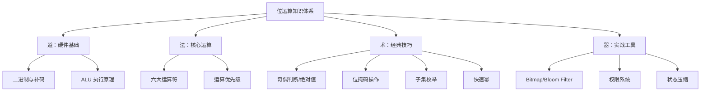
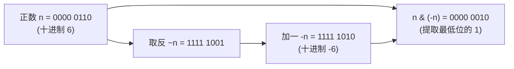

## 位运算技巧

位运算是直接对整数的二进制位进行操作的底层运算方式。它不经过十进制转换，直接在 CPU 的算术逻辑单元（ALU）上执行，因此在算法竞赛、底层系统编程、高性能计算、嵌入式开发中有着不可替代的地位。掌握位运算技巧，不仅能写出更高效的代码，更能深刻理解计算机"如何思考数字"——这是从"会用计算机"到"理解计算机"的关键一步。

本节从硬件原理出发，系统讲解位运算的六大操作、十二种经典技巧、三大应用场景，最后给出解题框架和常见陷阱，帮助读者建立完整的位运算知识体系。



---

### 道：硬件基础——为什么位运算快

#### 二进制与补码

计算机中所有整数都以二进制存储。对于有符号整数，现代系统普遍采用**补码（Two's Complement）**表示法：

| 概念 | 规则 | 示例（8 位） |
|------|------|-------------|
| 正数 | 原码即补码 | +5 → `0000 0101` |
| 负数 | 取反加一 | -5 → `1111 1011` |
| 零 | 唯一表示 | 0 → `0000 0000` |
| 最小值 | 最高位为 1，其余为 0 | -128 → `1000 0000` |

补码的关键性质：`-n = ~n + 1`，即 `~n = -(n+1)`。这解释了为什么 `n & (-n)` 能提取最低位的 1——负数是正数取反加一的结果，两者按位与时，只有最低位的 1 能"存活"。



#### 为什么位运算比算术运算快

在 CPU 层面，位运算是**单周期指令**——一个时钟周期即可完成。而乘法/除法需要多个周期（现代 CPU 乘法约 3-5 个周期，除法约 10-40 个周期）。更重要的是：

- **无分支执行**：位运算不需要条件判断，避免了分支预测失败的惩罚
- **SIMD 友好**：位运算可以被向量化指令（如 SSE/AVX）一次处理 128/256/512 位
- **缓存友好**：位掩码操作的数据量极小，几乎全部命中 L1 缓存

| 运算类型 | 典型延迟（周期） | 吞吐量 | 适用场景 |
|----------|-----------------|--------|---------|
| 按位与/或/异或 | 1 | 每周期多次 | 标志位操作、掩码 |
| 左移/右移 | 1 | 每周期多次 | 乘除 2 的幂 |
| 整数乘法 | 3-5 | 每周期 1-2 次 | 一般计算 |
| 整数除法 | 10-40 | 每周期 1 次 | 一般计算 |
| 浮点加法 | 3-5 | 每周期 1-2 次 | 科学计算 |

> **注意**：现代编译器非常聪明，`n * 2` 会被自动优化为 `n << 1`，`n / 2` 会被优化为 `n >> 1`（无符号数）。位运算的优势不在于"比乘法快"，而在于能实现**算术运算无法表达的逻辑操作**（如提取最低位的 1、判断子集关系）。

---

### 法：六大核心运算详解

| 运算符 | 名称 | 示例（a=12, b=10） | 二进制演示 | 说明 |
|--------|------|-------------------|-----------|------|
| `&` | 按位与 | `12 & 10 = 8` | `1100 & 1010 = 1000` | 两位都为 1 结果才为 1 |
| `\|` | 按位或 | `12 \| 10 = 14` | `1100 \| 1010 = 1110` | 有一位为 1 结果就为 1 |
| `^` | 按位异或 | `12 ^ 10 = 6` | `1100 ^ 1010 = 0110` | 两位不同结果为 1 |
| `~` | 按位取反 | `~12 = -13` | `~0000 1100 = 1111 0011` | 0 变 1，1 变 0（补码） |
| `<<` | 左移 | `12 << 2 = 48` | `0000 1100 → 0011 0000` | 高位丢弃，低位补 0 |
| `>>` | 右移 | `12 >> 2 = 3` | `0000 1100 → 0000 0011` | 逻辑右移补 0，算术右移补符号位 |

**异或的三条黄金性质**（面试高频）：

| 性质 | 表达式 | 直觉理解 |
|------|--------|---------|
| 自反性 | `a ^ a = 0` | 相同的位抵消 |
| 恒等性 | `a ^ 0 = a` | 0 不改变任何位 |
| 交换结合律 | `a ^ b ^ c = a ^ c ^ b` | 顺序无关，可任意组合 |

这三条性质使得异或成为"消除成对出现元素"的利器——`single_number` 系列问题的本质就是利用异或的自反性。

---

### 术：十二种经典技巧

#### 1. 判断奇偶

```python
def is_odd(n: int) -> bool:
    """n &amp; 1 提取最低位：奇数最低位为 1，偶数为 0"""
    return (n &amp; 1) == 1
```

**原理**：所有偶数的二进制末位都是 0，奇数的末位都是 1。`n & 1` 等价于 `n % 2`，但位运算不涉及除法器，在极端场景下更快。

#### 2. 乘除 2 的幂

```python
def multiply_by_pow2(n: int, k: int) -> int:
    """左移 k 位 = 乘以 2^k"""
    return n << k

def divide_by_pow2(n: int, k: int) -> int:
    """右移 k 位 = 除以 2^k（向下取整）"""
    return n >> k
```

**注意**：Python 中 `>>` 对负数是**算术右移**（补符号位），所以 `-7 >> 1 = -4`（向下取整），而非 `-3`。如果需要向零取整，应使用 `n // (1 << k)`。

#### 3. 取绝对值（位运算版）

```python
def abs_bitwise(n: int) -> int:
    """位运算取绝对值（仅适用于固定位宽整数）"""
    # 注意：Python 整数是任意精度的，>> 31 不适用
    # 此处展示 32 位整数的原理
    if n >= 0:
        return n
    return (~n) + 1  # 等价于 -n，补码原理

# 更通用的写法
def abs_general(n: int) -> int:
    """不使用条件判断取绝对值（32 位）"""
    mask = n >> 31  # 仅在 32 位系统有效
    return (n + mask) ^ mask
```

**警告**：`abs_general` 中的 `n >> 31` 假设整数为 32 位。在 Python 中整数是任意精度的，`>> 31` 不会得到 `-1`。此技巧仅适用于 C/Java 等固定位宽语言。在实际工程中，直接使用 `abs(n)` 即可——编译器会生成最优代码。

#### 4. 不使用临时变量交换两数

```python
def swap_xor(a: int, b: int) -> tuple[int, int]:
    """异或交换三步法"""
    a ^= b  # a = a ^ b
    b ^= a  # b = b ^ (a ^ b) = a
    a ^= b  # a = (a ^ b) ^ a = b
    return a, b
```

**逐步推导**：

初始: a=A, b=B
第1步: a = A ^ B
第2步: b = (A ^ B) ^ B = A     (异或自反性)
第3步: a = (A ^ B) ^ A = B     (异或自反性)

**工程建议**：虽然异或交换在面试中常考，但在实际代码中应使用**临时变量交换**——现代 CPU 有寄存器重命名，临时变量版本更快，且可读性更高。异或交换在极端内存受限的嵌入式场景（如无额外寄存器）中才有实际价值。

#### 5. 判断是否是 2 的幂

```python
def is_power_of_two(n: int) -> bool:
    """2 的幂的二进制恰好只有一个 1"""
    return n > 0 and (n &amp; (n - 1)) == 0
```

**原理**：2 的幂的二进制形式是 `100...0`（只有一个 1），减一后变成 `011...1`，两者按位与恰好为 0。例如：

n = 8 = 1000
n-1 = 7 = 0111
n & (n-1) = 0000 ✓

n = 6 = 0110  (不是 2 的幂)
n-1 = 5 = 0101
n & (n-1) = 0100 ≠ 0 ✗

#### 6. 获取最低位的 1（lowbit）

```python
def lowbit(n: int) -> int:
    """提取 n 的最低位 1 及其后面的 0"""
    return n &amp; (-n)
```

**原理**：`-n = ~n + 1`。`~n` 将所有位取反，`+1` 使最低位的 1 进位，最终 `n` 和 `-n` 只在最低位的 1 及其后面的位上不同。这个技巧在**树状数组（Binary Indexed Tree）**中是核心操作。

n = 12 = 1100
-n = -12 = 0100  (补码)
n & (-n) = 0100 = 4  (最低位的 1 代表的值)

#### 7. 统计二进制中 1 的个数

```python
def count_ones(n: int) -> int:
    """Brian Kernighan 算法：每次消除最低位的 1"""
    count = 0
    while n:
        n &amp;= n - 1  # 消除最低位的 1
        count += 1
    return count

# Python 内置（推荐实际使用）
def count_ones_builtin(n: int) -> int:
    return bin(n).count('1')

# 测试
print(count_ones(7))    # 输出: 3 (111)
print(count_ones(15))   # 输出: 4 (1111)
print(count_ones(1024)) # 输出: 1 (10000000000)
```

**Brian Kernighan 算法详解**：

n = 12 = 1100
n & (n-1) = 1100 & 1011 = 1000  (消除了最低位的 1)
n & (n-1) = 1000 & 0111 = 0000  (消除了最后一个 1)
循环次数 = 1 的个数 = 2

该算法的时间复杂度为 O(k)，其中 k 是 1 的个数，而非 O(log n)。对于稀疏的二进制表示（1 很少），效率远高于逐位检查。

#### 8. 获取/设置/清除/翻转指定位

```python
class BitManipulation:
    """位操作工具集"""

    @staticmethod
    def get_bit(n: int, pos: int) -> int:
        """获取第 pos 位的值（0-indexed，从低位开始）"""
        return (n >> pos) &amp; 1

    @staticmethod
    def set_bit(n: int, pos: int) -> int:
        """将第 pos 位设为 1"""
        return n | (1 << pos)

    @staticmethod
    def clear_bit(n: int, pos: int) -> int:
        """将第 pos 位设为 0"""
        return n &amp; ~(1 << pos)

    @staticmethod
    def toggle_bit(n: int, pos: int) -> int:
        """翻转第 pos 位"""
        return n ^ (1 << pos)

    @staticmethod
    def update_bit(n: int, pos: int, value: int) -> int:
        """将第 pos 位更新为指定值（0 或 1）"""
        mask = ~(1 << pos)
        return (n &amp; mask) | ((value &amp; 1) << pos)

    @staticmethod
    def clear_high_bits(n: int, pos: int) -> int:
        """清除第 pos 位及以上所有高位，保留低位 [0, pos)"""
        return n &amp; ((1 << pos) - 1)

    @staticmethod
    def clear_low_bits(n: int, pos: int) -> int:
        """清除第 pos 位及以下所有低位，保留高位 [pos+1, ∞)"""
        return n &amp; (-1 << (pos + 1))


# 使用示例
n = 0b1010_1100  # 172
print(f"原始值: {bin(n)}")                    # 0b10101100
print(f"第3位: {BitManipulation.get_bit(n, 3)}")       # 1
print(f"设第0位: {bin(BitManipulation.set_bit(n, 0))}")   # 0b10101101
print(f"清第3位: {bin(BitManipulation.clear_bit(n, 3))}") # 0b10100100
print(f"翻转第7位: {bin(BitManipulation.toggle_bit(n, 7))}") # 0b00101100
print(f"保留低4位: {bin(BitManipulation.clear_high_bits(n, 4))}") # 0b1100
```

#### 9. 快速幂（二进制幂运算）

```python
def fast_power(base: int, exp: int, mod: int = None) -> int:
    """快速幂：O(log exp) 计算 base^exp"""
    result = 1
    base = base % mod if mod else base

    while exp > 0:
        if exp &amp; 1:  # exp 的当前位为 1
            result = (result * base) % mod if mod else result * base
        base = (base * base) % mod if mod else base * base
        exp >>= 1

    return result


# 测试
print(fast_power(2, 10))           # 1024
print(fast_power(2, 10, 1000000007))  # 1024 (取模)
print(fast_power(3, 13, 1000000007))  # 1594323
```

**原理**：将指数 `exp` 二进制分解。例如 `2^13`，`13 = 1101₂`：

2^13 = 2^(8+4+1) = 2^8 × 2^4 × 2^1

步骤:
exp=13 (1101): 奇数 → result *= 2, base *= 2, exp >>= 1
exp=6  (0110): 偶数 → base *= 2, exp >>= 1
exp=3  (0011): 奇数 → result *= 2, base *= 2, exp >>= 1
exp=1  (0001): 奇数 → result *= 2, base *= 2, exp >>= 1
exp=0: 结束

**应用**：大数取模运算、RSA 加密、矩阵快速幂（加速动态规划）。

#### 10. 最高位与最低位的位置

```python
def highest_bit_pos(n: int) -> int:
    """获取最高位 1 的位置（从 0 开始）"""
    if n <= 0:
        return -1
    pos = 0
    while n:
        n >>= 1
        pos += 1
    return pos - 1

def lowest_bit_pos(n: int) -> int:
    """获取最低位 1 的位置（从 0 开始）"""
    if n == 0:
        return -1
    pos = 0
    while (n &amp; 1) == 0:
        n >>= 1
        pos += 1
    return pos

# 测试
print(highest_bit_pos(12))  # 3 (12 = 1100, 最高位在第 3 位)
print(lowest_bit_pos(12))   # 2 (12 = 1100, 最低位的 1 在第 2 位)
```

#### 11. 子集枚举

位运算天然适合表示集合：第 i 位为 1 表示元素 i 在集合中，为 0 表示不在。这使得所有子集的枚举变得极其简洁。

```python
def enumerate_subsets(items: list) -> list[list]:
    """枚举集合的所有子集"""
    n = len(items)
    subsets = []

    # 从 0 到 2^n - 1，每个数对应一个子集
    for mask in range(1 << n):
        subset = []
        for i in range(n):
            if mask &amp; (1 << i):
                subset.append(items[i])
        subsets.append(subset)

    return subsets

def enumerate_subsets_of_size(items: list, k: int) -> list[list]:
    """枚举恰好包含 k 个元素的子集（Gosper's hack）"""
    n = len(items)
    subsets = []

    # 生成第一个包含 k 个 1 的掩码
    mask = (1 << k) - 1

    while mask < (1 << n):
        subset = [items[i] for i in range(n) if mask &amp; (1 << i)]
        subsets.append(subset)

        # Gosper's hack: 找到下一个包含相同数量 1 的数
        c = mask &amp; (-mask)
        r = mask + c
        mask = (((r ^ mask) >> 2) // c) | r

    return subsets

# 测试
items = ['A', 'B', 'C']
print(f"所有子集: {enumerate_subsets(items)}")
# [[], ['A'], ['B'], ['A','B'], ['C'], ['A','C'], ['B','C'], ['A','B','C']]

print(f"2 元素子集: {enumerate_subsets_of_size(items, 2)}")
# [['A','B'], ['A','C'], ['B','C']]
```

**复杂度**：所有子集枚举为 O(2^n × n)，仅适用于 n ≤ 20。这也是状态压缩 DP 的理论基础——详见[技巧二：动态规划状态压缩](../02-二动态规划状态压缩.md)。

#### 12. 异或的高阶应用：缺失数字

```python
def missing_number(nums: list[int]) -> int:
    """0 到 n 中缺失的一个数字（LeetCode 268）"""
    result = len(nums)
    for i, num in enumerate(nums):
        result ^= i ^ num
    return result

# 原理：[0,1,2,4] 缺 3
# result = 4 ^ (0^0) ^ (1^1) ^ (2^2) ^ (3^4) = 4 ^ 3 ^ 4 = 3

print(missing_number([0, 1, 3]))  # 输出: 2
print(missing_number([0, 1, 2, 4]))  # 输出: 3
```

---

### 器：位掩码实战工具

#### 位集合（BitSet）

```python
class BitSet:
    """基于位运算的集合，适用于小范围元素（< 64）"""

    def __init__(self):
        self.bits = 0

    def add(self, x: int) -> None:
        """添加元素 x"""
        self.bits |= (1 << x)

    def remove(self, x: int) -> None:
        """移除元素 x"""
        self.bits &amp;= ~(1 << x)

    def contains(self, x: int) -> bool:
        """判断是否包含元素 x"""
        return (self.bits &amp; (1 << x)) != 0

    def toggle(self, x: int) -> None:
        """翻转元素 x"""
        self.bits ^= (1 << x)

    def size(self) -> int:
        """集合大小（popcount）"""
        count = 0
        v = self.bits
        while v:
            v &amp;= v - 1
            count += 1
        return count

    def union(self, other: 'BitSet') -> 'BitSet':
        """并集"""
        result = BitSet()
        result.bits = self.bits | other.bits
        return result

    def intersection(self, other: 'BitSet') -> 'BitSet':
        """交集"""
        result = BitSet()
        result.bits = self.bits &amp; other.bits
        return result

    def difference(self, other: 'BitSet') -> 'BitSet':
        """差集（self - other）"""
        result = BitSet()
        result.bits = self.bits &amp; ~other.bits
        return result

    def is_subset(self, other: 'BitSet') -> bool:
        """判断是否是 other 的子集"""
        return (self.bits &amp; other.bits) == self.bits

    def __repr__(self) -> str:
        elements = []
        v = self.bits
        pos = 0
        while v:
            if v &amp; 1:
                elements.append(str(pos))
            v >>= 1
            pos += 1
        return "{" + ", ".join(elements) + "}"


# 使用示例
a = BitSet()
a.add(1); a.add(3); a.add(5)
b = BitSet()
b.add(3); b.add(5); b.add(7)

print(f"A = {a}")              # {1, 3, 5}
print(f"B = {b}")              # {3, 5, 7}
print(f"A ∪ B = {a.union(b)}")          # {1, 3, 5, 7}
print(f"A ∩ B = {a.intersection(b)}")   # {3, 5}
print(f"A - B = {a.difference(b)}")     # {1}
print(f"A ⊆ B? {a.is_subset(b)}")       # False
print(f"|A| = {a.size()}")              # 3
```

**Go 实现：BitSet**

```go
// BitSet 使用位运算实现的集合，适用于 0-63 范围的元素
type BitSet uint64

func (s *BitSet) Add(x int)      { *s |= 1 << x }
func (s *BitSet) Remove(x int)   { *s &amp;^= 1 << x }  // AND NOT
func (s *BitSet) Contains(x int) bool { return *s&amp;(1<<x) != 0 }
func (s *BitSet) Toggle(x int)   { *s ^= 1 << x }

func (s *BitSet) Size() int {
    count := 0
    v := *s
    for v != 0 {
        v &amp;= v - 1  // Brian Kernighan
        count++
    }
    return count
}

func (s *BitSet) Union(other BitSet) BitSet     { return *s | other }
func (s *BitSet) Intersect(other BitSet) BitSet { return *s &amp; other }
func (s *BitSet) Diff(other BitSet) BitSet      { return *s &amp;^ other }
```

**位集合 vs 哈希集合性能对比**：

| 维度 | 位集合（BitSet） | 哈希集合（set） |
|------|-----------------|----------------|
| 空间 | 极低（64 位 = 8 字节即可存 64 个元素） | 高（哈希表 + 链表开销） |
| 添加/删除 | O(1)，位运算 | O(1) 平均，O(n) 最差 |
| 查询 | O(1)，位运算 | O(1) 平均 |
| 并集/交集 | O(1)，单条位运算 | O(min(m,n))，需遍历 |
| 适用元素范围 | 0-63（单 uint64），可扩展到任意范围 | 任意类型 |
| 适用场景 | 小范围整数、状态集合、掩码操作 | 通用集合操作 |

#### 权限系统设计

位掩码最经典的工程应用是权限系统。每个权限用一个 bit 表示，通过位运算实现权限的授予、撤销、检查和组合。

```python
from enum import IntFlag

class Permission(IntFlag):
    """文件权限（类 Unix 设计）"""
    READ    = 0b001  # 1
    WRITE   = 0b010  # 2
    EXECUTE = 0b100  # 4

    @staticmethod
    def describe(perms: int) -> str:
        """可读化描述权限"""
        names = []
        if perms &amp; Permission.READ:
            names.append("读取")
        if perms &amp; Permission.WRITE:
            names.append("写入")
        if perms &amp; Permission.EXECUTE:
            names.append("执行")
        return " | ".join(names) if names else "无权限"


# 使用示例
user_perms = Permission.READ | Permission.WRITE  # 授予读写权限
print(f"用户权限: {Permission.describe(user_perms)}")  # 读取 | 写入

# 检查权限
print(f"有读权限? {bool(user_perms &amp; Permission.READ)}")     # True
print(f"有执行权限? {bool(user_perms &amp; Permission.EXECUTE)}") # False

# 撤销权限
user_perms &amp;= ~Permission.WRITE  # 撤销写权限
print(f"撤销后: {Permission.describe(user_perms)}")  # 读取

# 切换权限
user_perms ^= Permission.EXECUTE  # 切换执行权限
print(f"切换后: {Permission.describe(user_perms)}")  # 读取 | 执行
```

**多权限位掩码示例（实际项目常用）**：

```python
# 复杂权限系统
PERM_USER_READ    = 1 << 0   # 00000001
PERM_USER_WRITE   = 1 << 1   # 00000010
PERM_USER_ADMIN   = 1 << 2   # 00000100
PERM_GROUP_READ   = 1 << 3   # 00001000
PERM_GROUP_WRITE  = 1 << 4   # 00010000
PERM_OTHER_READ   = 1 << 5   # 00100000
PERM_OTHER_WRITE  = 1 << 6   # 01000000
PERM_OTHER_EXEC   = 1 << 7   # 10000000

# 预定义角色
PERM_READONLY = PERM_USER_READ | PERM_GROUP_READ | PERM_OTHER_READ
PERM_DEVELOPER = PERM_USER_READ | PERM_USER_WRITE | PERM_GROUP_READ | PERM_GROUP_WRITE
PERM_ADMIN = 0xFF  # 所有权限

def check_permission(user_perm: int, required: int) -> bool:
    """检查用户是否拥有所需权限（按位与非零即为有）"""
    return (user_perm &amp; required) == required

def list_permissions(perm: int) -> list[str]:
    """列出所有已授予的权限"""
    all_perms = [
        (PERM_USER_READ, "用户读取"), (PERM_USER_WRITE, "用户写入"),
        (PERM_USER_ADMIN, "用户管理"), (PERM_GROUP_READ, "组读取"),
        (PERM_GROUP_WRITE, "组写入"), (PERM_OTHER_READ, "其他读取"),
        (PERM_OTHER_WRITE, "其他写入"), (PERM_OTHER_EXEC, "其他执行"),
    ]
    return [name for flag, name in all_perms if perm &amp; flag]

print(list_permissions(PERM_DEVELOPER))
# ['用户读取', '用户写入', '组读取', '组写入']
```

---

### 位运算经典算法问题

#### 问题一：只出现一次的数字（其余出现两次）

```python
def single_number(nums: list[int]) -> int:
    """所有元素出现两次，只有一个出现一次——异或消去"""
    result = 0
    for num in nums:
        result ^= num
    return result

# 示例
print(single_number([2, 2, 1]))        # 输出: 1
print(single_number([4, 1, 2, 1, 2]))  # 输出: 4
```

**为什么有效**：异或满足交换律和结合律，`a ^ a = 0`，`a ^ 0 = a`。所有成对出现的元素互相抵消，最终结果就是那个单身元素。

#### 问题二：只出现一次的数字 II（其余出现三次）

```python
def single_number_ii(nums: list[int]) -> int:
    """所有元素出现三次，只有一个出现一次"""
    ones, twos = 0, 0
    for num in nums:
        # ones 记录出现 1 次的位
        ones = (ones ^ num) &amp; ~twos
        # twos 记录出现 2 次的位
        twos = (twos ^ num) &amp; ~ones
    return ones

# 示例
print(single_number_ii([2, 2, 3, 2]))          # 输出: 3
print(single_number_ii([0, 1, 0, 1, 0, 1, 99])) # 输出: 99
```

**原理详解**：统计每一位上 1 出现的次数。如果某位出现了 3 次，模 3 后归零。用 `ones` 和 `twos` 两个变量实现三进制计数器：

| 状态 | ones | twos | 含义 |
|------|------|------|------|
| 出现 0 次 | 0 | 0 | 该位无贡献 |
| 出现 1 次 | 1 | 0 | 该位出现在 ones |
| 出现 2 次 | 0 | 1 | 该位出现在 twos |
| 出现 3 次 | 0 | 0 | 回到初始状态 |

#### 问题三：两个只出现一次的数字

```python
def single_number_iii(nums: list[int]) -> list[int]:
    """两个数字出现一次，其余出现两次"""
    # 1. 全员异或，得到 a ^ b
    xor = 0
    for num in nums:
        xor ^= num

    # 2. 找到 a 和 b 不同的最低位（a 和 b 必然不同，所以 xor ≠ 0）
    diff = xor &amp; (-xor)  # 提取最低位的 1

    # 3. 按该位分组，分别异或
    a, b = 0, 0
    for num in nums:
        if num &amp; diff:
            a ^= num  # 该位为 1 的组
        else:
            b ^= num  # 该位为 0 的组

    return [a, b]

# 示例
print(single_number_iii([1, 2, 1, 3, 2, 5]))  # 输出: [3, 5]
```

**核心思路**：`a ^ b` 中为 1 的位说明 a 和 b 在该位不同。取最低位的 1（`lowbit`），以此为标准将所有数字分成两组——a 在一组，b 在另一组，每组内其余数字成对出现，异或后只剩下 a 或 b。

#### 问题四：位计数（Hamming Weight）

```python
def count_bits(n: int) -> list[int]:
    """返回 0 到 n 每个数的二进制中 1 的个数（LeetCode 338）"""
    dp = [0] * (n + 1)
    for i in range(1, n + 1):
        dp[i] = dp[i >> 1] + (i &amp; 1)
    return dp

# 测试
print(count_bits(5))  # [0, 1, 1, 2, 1, 2]
```

**DP 递推关系**：`dp[i] = dp[i >> 1] + (i & 1)`。i 的 1 的个数 = i/2 的 1 的个数 + i 的最低位是否为 1。这种递推避免了逐个数计算 popcount，总时间 O(n)。

---

### 位运算速查表

| 技巧 | 表达式 | 说明 | 应用场景 |
|------|--------|------|---------|
| 清除最低位的 1 | `n & (n - 1)` | 消去最低位的 1 | 统计 1 的个数、判断 2 的幂 |
| 获取最低位的 1 | `n & (-n)` | lowbit 操作 | 树状数组、分组 |
| 判断是否是 2 的幂 | `n > 0 and (n & (n-1)) == 0` | 只有一个 1 | 位图索引 |
| 获取第 i 位 | `(n >> i) & 1` | 取指定位 | 位掩码解析 |
| 设置第 i 位 | `n \| (1 << i)` | 置 1 | 权限授予 |
| 清除第 i 位 | `n & ~(1 << i)` | 置 0 | 权限撤销 |
| 翻转第 i 位 | `n ^ (1 << i)` | 取反 | 状态切换 |
| 保留低 i 位 | `n & ((1 << i) - 1)` | 清除高位 | 子掩码提取 |
| 保留高位 | `n & (-1 << (i + 1))` | 清除低位 | 高位提取 |
| 交换两数 | `a^=b; b^=a; a^=b` | 异或三步法 | 内存受限场景 |
| 判断奇偶 | `n & 1` | 末位判断 | 快速分类 |
| 乘以 2 的幂 | `n << k` | 左移 k 位 | 位移加速 |

---

### Go 实现：位运算工具集

```go
package bitutil

import "math/bits"

// CountOnes 统计二进制中 1 的个数（使用硬件指令）
func CountOnes(n uint64) int {
    return bits.OnesCount64(n)
}

// Lowbit 获取最低位的 1
func Lowbit(n int) int {
    return n &amp; (-n)
}

// IsPowerOfTwo 判断是否是 2 的幂
func IsPowerOfTwo(n int) bool {
    return n > 0 &amp;&amp; (n&amp;(n-1)) == 0
}

// HighestBit 获取最高位 1 的位置
func HighestBit(n uint64) int {
    if n == 0 {
        return -1
    }
    return 63 - bits.LeadingZeros64(n)
}

// LowestBit 获取最低位 1 的位置
func LowestBit(n uint64) int {
    if n == 0 {
        return -1
    }
    return bits.TrailingZeros64(n)
}

// ReverseBits 反转所有位
func ReverseBits(n uint32) uint32 {
    result := uint32(0)
    for i := 0; i < 32; i++ {
        result = (result << 1) | (n &amp; 1)
        n >>= 1
    }
    return result
}
```

> **Go 特有优势**：Go 的 `math/bits` 包提供了编译器内置的位操作函数（`OnesCount64`、`LeadingZeros64`、`TrailingZeros64`），在支持 POPCNT/LZCNT/TZCNT 指令的 CPU 上直接映射到单条硬件指令，性能极致。Python 没有等价的底层优化。

---

### 实战场景：位运算在工程中的应用

#### 场景一：Bitmap 索引

数据库中的 Bitmap 索引使用位数组存储每列值的存在状态，极大加速等值查询和 AND/OR 操作。

```python
class BitmapIndex:
    """简易 Bitmap 索引——演示数据库位图索引原理"""

    def __init__(self):
        self.bitmaps = {}  # {value: int (位图)}

    def add(self, row_id: int, value: str) -> None:
        if value not in self.bitmaps:
            self.bitmaps[value] = 0
        self.bitmaps[value] |= (1 << row_id)

    def query_eq(self, value: str) -> list[int]:
        """等值查询：value = X"""
        if value not in self.bitmaps:
            return []
        return self._to_row_ids(self.bitmaps[value])

    def query_and(self, v1: str, v2: str) -> list[int]:
        """AND 查询：value = X AND value = Y"""
        if v1 not in self.bitmaps or v2 not in self.bitmaps:
            return []
        result = self.bitmaps[v1] &amp; self.bitmaps[v2]
        return self._to_row_ids(result)

    def query_or(self, v1: str, v2: str) -> list[int]:
        """OR 查询：value = X OR value = Y"""
        b1 = self.bitmaps.get(v1, 0)
        b2 = self.bitmaps.get(v2, 0)
        return self._to_row_ids(b1 | b2)

    def _to_row_ids(self, bits: int) -> list[int]:
        ids = []
        pos = 0
        while bits:
            if bits &amp; 1:
                ids.append(pos)
            bits >>= 1
            pos += 1
        return ids


# 模拟数据库：行数据 = [id, name, city]
rows = [
    (0, "Alice", "Beijing"),
    (1, "Bob", "Shanghai"),
    (2, "Carol", "Beijing"),
    (3, "David", "Shenzhen"),
    (4, "Eve", "Shanghai"),
]

index = BitmapIndex()
for row_id, name, city in rows:
    index.add(row_id, city)

print(f"北京: {index.query_eq('Beijing')}")     # [0, 2]
print(f"上海: {index.query_eq('Shanghai')}")     # [1, 4]
print(f"北京 AND 上海: {index.query_and('Beijing', 'Shanghai')}")  # [] (互斥)
print(f"北京 OR 深圳: {index.query_or('Beijing', 'Shenzhen')}")    # [0, 2, 3]
```

**为什么 Bitmap 索引快**：将 `WHERE city = 'Beijing'` 的行扫描（O(n) 遍历所有行）转化为单条位运算（O(1)），结果直接是行号集合。对于低基数列（如性别、省份），Bitmap 索引的空间效率和查询效率远超 B+Tree。

#### 场景二：Bloom Filter 基础

布隆过滤器使用多个位数组和哈希函数判断元素是否存在，是位运算在分布式系统中的经典应用。

```python
import hashlib

class BloomFilter:
    """简易布隆过滤器——位运算 + 多哈希"""

    def __init__(self, size: int = 1024, hash_count: int = 3):
        self.size = size
        self.hash_count = hash_count
        self.bit_array = 0  # 使用 Python 整数作为位数组

    def _hashes(self, item: str) -> list[int]:
        """生成多个哈希值"""
        results = []
        for i in range(self.hash_count):
            h = hashlib.md5(f"{item}_{i}".encode()).hexdigest()
            results.append(int(h, 16) % self.size)
        return results

    def add(self, item: str) -> None:
        """添加元素"""
        for pos in self._hashes(item):
            self.bit_array |= (1 << pos)

    def might_contain(self, item: str) -> bool:
        """判断元素是否可能存在（可能误报，不会漏报）"""
        for pos in self._hashes(item):
            if not (self.bit_array &amp; (1 << pos)):
                return False  # 某个哈希位为 0，一定不存在
        return True  # 所有哈希位都为 1，可能存在


# 测试
bf = BloomFilter(size=256, hash_count=3)
bf.add("apple"); bf.add("banana"); bf.add("cherry")

print(bf.might_contain("apple"))    # True（一定正确）
print(bf.might_contain("banana"))   # True（一定正确）
print(bf.might_contain("grape"))    # 可能 True（误报）或 False（正确）
print(bf.might_contain("watermelon"))  # 大概率 False
```

#### 场景三：状态压缩在实际项目中的应用

位掩码常用于表示有限状态机的转移、配置选项的组合、测试用例的参数化等。

```python
# HTTP 方法的位掩码表示
GET     = 1 << 0  # 1
POST    = 1 << 1  # 2
PUT     = 1 << 2  # 4
DELETE  = 1 << 3  # 8
PATCH   = 1 << 4  # 16

# 路由器配置
class Router:
    def __init__(self):
        self.routes = {}  # {path: allowed_methods}

    def add_route(self, path: str, methods: int) -> None:
        if path not in self.routes:
            self.routes[path] = 0
        self.routes[path] |= methods

    def is_allowed(self, path: str, method: int) -> bool:
        if path not in self.routes:
            return False
        return (self.routes[path] &amp; method) != 0

router = Router()
router.add_route("/api/users", GET | POST | PUT | DELETE)
router.add_route("/api/health", GET)

print(router.is_allowed("/api/users", GET))       # True
print(router.is_allowed("/api/users", DELETE))     # True
print(router.is_allowed("/api/health", POST))     # False
```

---

### 常见陷阱与误区

| 陷阱 | 错误写法 | 正确做法 | 原因 |
|------|---------|---------|------|
| Python 无符号问题 | `n >> 31` 当作符号位提取 | 固定宽度场景用 `& 0xFFFFFFFF` 后再移位 | Python 整数任意精度，无符号概念 |
| 异或交换边界 | `a ^= b; b ^= a; a ^= b` 用于同一变量 | 确保 a ≠ b 的引用 | 若 a 和 b 是同一变量，结果为 0 |
| 左移溢出 | `1 << 64` 在 C 语言中 | 检查位宽：`1ULL << 64` 在 C 中是 UB | Python 无此问题，但 C/Go 有 |
| 右移语义 | 有符号数右移 | 使用无符号类型 | 有符号右移补符号位（算术右移） |
| 优先级混淆 | `a & 1 == 0` | `(a & 1) == 0` | `==` 优先级高于 `&` |
| 负数位运算 | `~x == -x-1` 忘记补码 | 始终记住 `~x = -(x+1)` | 补码取反不等于取负 |
| 位宽不匹配 | `int` 和 `long` 混用位运算 | 统一类型再运算 | 不同位宽的结果可能截断 |

**优先级陷阱详解**：

```python
# 常见错误
n = 6  # 二进制 110
result = n &amp; 1 == 0
print(result)  # False — 为什么？

# 原因：== 优先级高于 &amp;
# 实际执行：n &amp; (1 == 0) = 6 &amp; False = 6 &amp; 0 = 0
# 正确写法：
result = (n &amp; 1) == 0
print(result)  # True — 6 是偶数
```

---

### 解题框架：位运算问题四步法

面对位运算问题，按以下步骤系统化求解：

**第一步：明确位的含义**
- 每一位代表什么？（元素存在性、状态、权限、计数位）
- 位的范围是多少？（决定了用什么类型存储）
- 0 和 1 分别代表什么状态？

**第二步：选择运算策略**
- 消除成对元素 → 异或
- 提取特定位 → 与/移位
- 集合操作 → 位掩码
- 状态计数 → 有限状态机 + 位运算

**第三步：处理边界情况**
- 0 的特殊性（`n & (n-1)` 对 0 不适用）
- 负数的补码行为
- 最高位/最低位的特殊处理

**第四步：验证正确性**
- 测试 0、-1、最小值、最大值
- 测试只有一个 1 的情况（2 的幂）
- 测试全 1 的情况
- 测试单元素数组/空数组

---

### 最佳实践

1. **优先使用内置函数**：Python 的 `bin().count('1')`、Go 的 `bits.OnesCount64()` 直接调用硬件指令，性能最优
2. **注意 Python 整数精度**：Python 整数无位宽限制，`~0 != -1` 的直觉在 Python 中成立但 `>> 31` 取符号位不适用
3. **位运算注释先行**：复杂位运算务必添加注释说明每一步的含义——`n & (n-1)` 初看是"天书"，加了注释就是"常识"
4. **性能瓶颈才用位运算**：现代编译器会自动优化 `n * 2 → n << 1`，不要为了"炫技"在不敏感的场景使用位运算
5. **用 IntFlag 代替裸数字**：Python 的 `enum.IntFlag` 提供了类型安全的位掩码操作，比直接用整数更清晰
6. **位掩码集合的上限**：单个 `uint64` 只能表示 64 个元素，超过时需要用位数组（`array('Q')` 或 `bitarray` 库）
7. **测试边界值**：0、-1、`INT_MAX`、`INT_MIN`、单个 1、全 1 等边界情况必须覆盖

---

### 进阶：位运算与算法的交叉

| 算法/数据结构 | 位运算的作用 | 详细说明 |
|-------------|-------------|---------|
| 状态压缩 DP | 子集表示与枚举 | 用掩码表示"已访问的城市集合"，详见[技巧二](../02-二动态规划状态压缩.md) |
| 树状数组 | `lowbit` 操作 | `n & (-n)` 是树状数组的核心，用于高效前缀和查询 |
| 布隆过滤器 | 多哈希 + 位数组 | 用位数组存储哈希结果，O(1) 概率性查询 |
| 快速幂/矩阵快速幂 | 二进制分解指数 | O(log n) 计算大数幂，应用于 RSA、动态规划加速 |
| 前缀异或 | 区间异或查询 | `prefix[i] ^ prefix[j]` = 区间 [i, j) 的异或和 |
| 位图索引 | 数据库查询优化 | 低基数列的等值/范围查询加速 |
| 哈夫曼编码 | 编码位操作 | 变长编码的位级拼接和解析 |
| 网络子网掩码 | CIDR 表示 | `IP & mask` 判断是否同一子网 |

---

### 常见问题

**Q: 位运算比算术运算快多少？**

A: 在现代 CPU 上，位运算（1 周期）比乘法（3-5 周期）快 3-5 倍，比除法（10-40 周期）快 10-40 倍。但编译器会自动将 `n * 2` 优化为 `n << 1`，所以位运算的优势不在于替代算术运算，而在于实现**算术运算无法表达的逻辑操作**（如提取最低位的 1、子集判断）。

**Q: 负数的位运算怎么处理？**

A: 负数以补码存储。关键公式：`-n = ~n + 1`。右移时，Python 和 Java 对有符号数执行**算术右移**（补符号位），C 语言对无符号数执行**逻辑右移**（补 0）。建议在位运算密集的代码中使用无符号类型避免歧义。

**Q: 什么时候应该用位运算？**

A: 三个核心场景：（1）**状态压缩**——用整数的位表示集合或状态组合；（2）**底层优化**——权限标志、协议解析、硬件寄存器操作；（3）**算法技巧**——异或消除、lowbit、快速幂等。如果位运算不能让代码更快或更清晰，就不要用。

**Q: Python 中如何高效使用位运算？**

A: Python 的整数是任意精度的，位运算不受 32/64 位限制。对于大量位操作，推荐使用 `bitarray` 库（C 实现的位数组）或 `int` 位运算（利用大整数）。标准库 `int.bit_count()`（Python 3.10+）直接计算 popcount，性能最优。

**Q: 子集枚举的时间复杂度是 O(2^n × n)，n 能取多大？**

A: 实测可接受的上限约为 n=20（约 2000 万次操作，1 秒内）。超过这个规模需要剪枝（ Gosper's hack 枚举固定大小子集）或改用其他算法（如 meet-in-the-middle 拆分为两半）。
