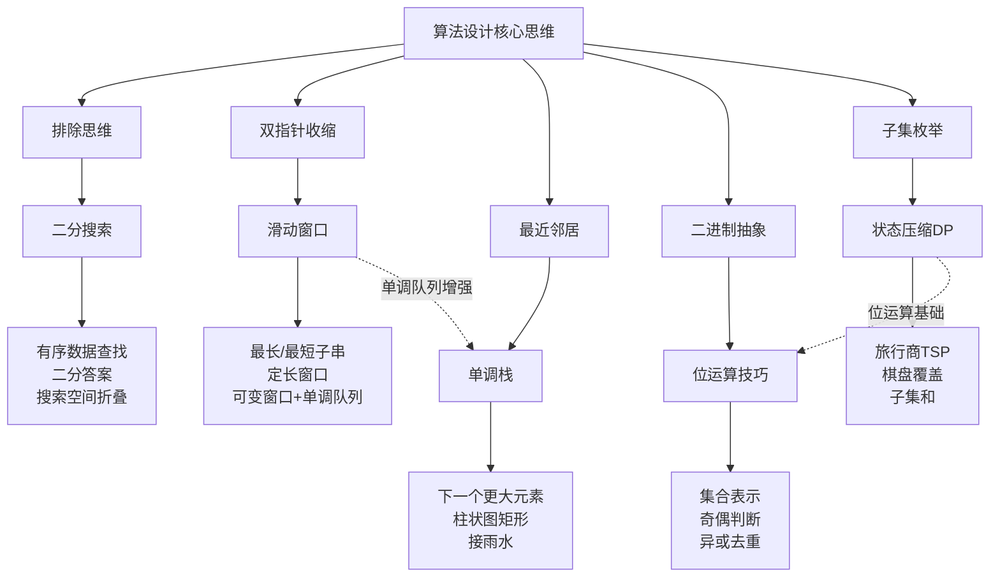

# 核心技巧：五把利刃，劈开算法难题

> **一句话定位**：本节提炼了面试与工程实践中最高频、最通用的五大算法技巧——二分搜索、滑动窗口、单调栈、位运算与动态规划状态压缩。掌握这五把利刃，足以应对 80% 的中等难度以上算法问题。

数据结构是骨架，算法是灵魂，而**技巧**是将两者高效结合的桥梁。在前面的理论基础章节中，我们学习了哈希表、平衡二叉搜索树、堆、图等核心数据结构的原理与实现。但面对实际问题时，很多人的困境不是"不知道数据结构"，而是"不知道该用什么技巧把数据结构用对"——二分搜索的边界到底写左闭右闭还是左闭右开？滑动窗口什么时候收缩左边界？单调栈为什么要弹出元素？这些"临门一脚"的决策，正是本节要解决的核心问题。

本节的五大技巧并非彼此孤立，它们之间存在深层的递进关系和互补关系。理解这些关系，比孤立地记忆每个技巧更重要。

---

## 为什么是这五个技巧

在 LeetCode 的 3000+ 道题目中，有一条清晰的规律：**中等难度题目中，超过 60% 可以用以下五种技巧中的一种直接破解**。这并非巧合——它们分别对应了算法设计中的五种核心思维模式：

| 技巧 | 对应的思维模式 | 一句话本质 | 面试频率 |
|------|--------------|-----------|---------|
| 二分搜索 | 排除思维 | 每次排除一半搜索空间，化 O(n) 为 O(log n) | ⭐⭐⭐⭐⭐ |
| 滑动窗口 | 双指针收缩思维 | 维护一个满足条件的区间，通过移动左右边界高效求解子数组/子串问题 | ⭐⭐⭐⭐⭐ |
| 单调栈 | "最近邻居"思维 | 在 O(n) 时间内找到每个元素左侧/右侧第一个比它大或小的元素 | ⭐⭐⭐⭐ |
| 位运算 | 二进制抽象思维 | 用位表示集合状态，用位操作替代循环实现高效枚举与比较 | ⭐⭐⭐ |
| 状态压缩 | 子集枚举思维 | 将集合压缩为整数，用 DP 在指数级状态空间中搜索最优解 | ⭐⭐⭐ |



---

## 技巧一：二分搜索的边界处理

> 📖 详细内容：[二分搜索的边界处理](01-一二分搜索的边界处理.md)

### 核心原理

二分搜索的本质是**利用有序性进行排除**。每次比较将搜索范围缩小一半，时间复杂度 O(log n)。对一个 n = 10⁹ 的有序数组，最多只需 30 次比较即可定位目标。

但二分搜索的真正难点不在"怎么写"，而在**边界条件的精确处理**。两种区间定义（左闭右闭 vs 左闭右开）各有优劣，选错一种会导致死循环或漏解。

### 两种区间定义对比

| 特性 | 左闭右闭 [left, right] | 左闭右开 [left, right) |
|------|----------------------|----------------------|
| 终止条件 | `left > right` | `left == right` |
| 搜索范围 | 包含 right | 不包含 right |
| mid 更新 | `left = mid + 1` | `left = mid + 1` |
| 搜索范围 | `right = mid - 1` | `right = mid` |
| 数组长度 | `right - left + 1` | `right - left` |
| 适用场景 | 直觉更强，适合初学者 | Python range 风格，边界更自然 |

### 代码示例：左闭右闭标准模板

```python
def binary_search(nums, target):
    """左闭右闭区间二分搜索"""
    left, right = 0, len(nums) - 1
    
    while left <= right:          # 终止条件：区间为空
        mid = left + (right - left) // 2  # 防止整数溢出
        if nums[mid] == target:
            return mid
        elif nums[mid] < target:
            left = mid + 1         # target 在右半区，排除 mid
        else:
            right = mid - 1        # target 在左半区，排除 mid
    
    return -1  # 未找到
```

### 六大经典变体

二分搜索不只用于"查找目标值"，其变体覆盖了多种问题模式：

1. **查找第一个等于 target 的位置**（lower_bound）：找到 target 后不返回，继续向左收缩
2. **查找最后一个等于 target 的位置**（upper_bound）：找到 target 后不返回，继续向右收缩
3. **查找第一个大于等于 target 的位置**：`nums[mid] < target` 时 `left = mid + 1`，否则 `right = mid`
4. **查找最后一个小于等于 target 的位置**：对称地处理
5. **查找峰值元素**：比较 `nums[mid]` 与 `nums[mid+1]`，峰值一定在较高的一侧
6. **旋转排序数组搜索**：先判断 mid 落在哪个有序段，再决定搜索方向

### 二分答案模式

当问题本身没有显式的"有序数组"，但**答案具有单调性**时，可以对答案空间进行二分搜索。典型问题：
- 在 D 天内运送包裹的最小运力
- 分割数组的最大值最小化
- 切割绳子的最大化最小段

### 常见陷阱

| 陷阱 | 原因 | 修正 |
|------|------|------|
| 死循环 | `left = mid` 或 `right = mid` 未排除 mid | 确保 `left = mid + 1` 或 `right = mid - 1` |
| 溢出 | `mid = (left + right) // 2` | 改用 `mid = left + (right - left) // 2` |
| 漏解 | 找到 target 后立即返回 | 收缩边界继续搜索 |
| 边界越界 | left/right 初始值不含整个数组 | 左闭右闭时 `right = len(nums) - 1` |

---

## 技巧二：滑动窗口

> 📖 详细内容：[滑动窗口](04-四滑动窗口.md)

### 核心原理

滑动窗口是双指针技巧的特化形式。它的核心思想是：**维护一个满足特定条件的窗口 [left, right]，通过右指针扩展窗口、左指针收缩窗口，在 O(n) 时间内求解子数组/子串问题**。

暴力解法需要对每个子数组/子串逐一检查，时间复杂度 O(n²) 或 O(n³)。滑动窗口将这个过程优化到 O(n)，秘诀在于**利用窗口的单调性**——当右指针右移使窗口不满足条件时，左指针只需要向右移动（不需要回退），因为之前不满足条件的子窗口也不可能满足条件。

### 两种窗口类型

| 类型 | 窗口大小 | 典型问题 | 核心操作 |
|------|---------|---------|---------|
| 固定大小窗口 | 固定 k | 滑动窗口最大值、平均值 | 右扩一步 → 左缩一步 |
| 可变大小窗口 | 动态伸缩 | 无重复字符最长子串、最小覆盖子串 | 右扩到满足条件 → 左缩到不满足 |

### 代码示例：可变窗口

```python
def longest_substring_without_repeating(s):
    """无重复字符的最长子串长度"""
    char_index = {}     # 字符 → 最近出现的下标
    left = 0
    max_len = 0
    
    for right in range(len(s)):
        # 如果字符重复，左边界跳过重复位置
        if s[right] in char_index and char_index[s[right]] >= left:
            left = char_index[s[right]] + 1
        
        char_index[s[right]] = right
        max_len = max(max_len, right - left + 1)
    
    return max_len
```

### 代码示例：固定窗口 + 单调队列

```python
from collections import deque

def max_sliding_window(nums, k):
    """滑动窗口最大值（单调递减队列）"""
    dq = deque()        # 存储下标，对应值单调递减
    result = []
    
    for i in range(len(nums)):
        # 移除超出窗口的元素
        while dq and dq[0] < i - k + 1:
            dq.popleft()
        
        # 维护单调递减：移除所有小于当前值的元素
        while dq and nums[dq[-1]] < nums[i]:
            dq.pop()
        
        dq.append(i)
        
        # 窗口形成后记录最大值
        if i >= k - 1:
            result.append(nums[dq[0]])
    
    return result
```

### 窗口模板

所有滑动窗口问题都可以套用以下框架：

```python
def sliding_window(s):
    left = 0
    # 窗口内的状态变量（如字符计数、窗口和等）
    window_state = {}
    
    for right in range(len(s)):
        # 1. 扩展：将 s[right] 加入窗口
        add_to_window(s[right])
        
        # 2. 收缩：当窗口不满足条件时，移动 left
        while window_is_invalid():
            remove_from_window(s[left])
            left += 1
        
        # 3. 更新答案
        update_result()
```

### 适用条件判断

滑动窗口**并非万能**。使用前需确认两个前提：

1. **子数组/子串连续**：滑动窗口只能处理连续区间，不适用于"子序列"
2. **窗口具有单调性**：当右指针右移使窗口不满足条件时，左指针可以单向移动。如果左指针可能需要回退，则滑动窗口不适用

---

## 技巧三：单调栈

> 📖 详细内容：[单调栈技巧](03-三单调栈技巧.md)

### 核心原理

单调栈是解决**"在数组中快速找到每个元素左侧或右侧第一个比它大（或小）的元素"**这一类问题的专用数据结构。

它的核心能力是：在一次 O(n) 遍历中，为每个元素找到"最近的"更大或更小邻居。这个"最近"是关键——一旦某个元素找到了比自己大/小的邻居，中间那些更小/更大的元素就再也不可能被其他元素选为"最近"邻居了，可以安全地弹出。

### 摊还分析：为什么是 O(n)

初学者常见的疑问：`while` 循环嵌套在 `for` 循环里，为什么不是 O(n²)？

答案在于**摊还分析**：每个元素**最多入栈一次**，**最多出栈一次**。`for` 循环执行 n 次，`while` 循环的总弹出次数累计不超过 n 次。因此总操作次数 ≤ 2n，时间复杂度为 **O(n)**。

### 单调栈 vs 普通栈

| 特性 | 普通栈 | 单调栈 |
|------|--------|--------|
| 栈内顺序 | 无约束 | 严格单调递增或递减 |
| 入栈操作 | 直接入栈 | 先弹出所有破坏单调性的元素，再入栈 |
| 核心能力 | LIFO 顺序访问 | 快速定位"最近更大/更小"元素 |
| 时间复杂度 | 入栈出栈 O(1) | 整体摊还 O(n) |

### 经典应用

| 问题 | 单调栈类型 | 解题要点 |
|------|-----------|---------|
| 每日温度 | 单调递减栈 | 找右侧第一个更大值 |
| 柱状图最大矩形 | 单调递增栈 | 每个柱子向左右扩展的最大宽度 |
| 接雨水 | 单调递减栈 | 两个高柱子之间可以接水 |
| 股票跨度 | 单调递减栈 | 连续 <= 当前价格的天数 |
| 最小栈 | 辅助栈 | O(1) 获取最小值 |

### 代码示例：每日温度

```python
def daily_temperatures(temperatures):
    """单调递减栈：找右侧第一个更大值"""
    n = len(temperatures)
    result = [0] * n
    stack = []  # 存储下标
    
    for i in range(n):
        # 当前温度 > 栈顶温度，说明找到了栈顶的"下一个更暖天"
        while stack and temperatures[i] > temperatures[stack[-1]]:
            prev = stack.pop()
            result[prev] = i - prev  # 等待的天数
        
        stack.append(i)
    
    return result
```

### 关键洞察

单调栈之所以高效，利用了一个核心事实：**如果元素 A 在元素 B 的左边且 A > B，那么对于 B 右侧的任何元素来说，A 永远不可能是"最近的更小元素"，因为 B 更近且更小。因此 A 可以被安全地弹出。** 理解这一点，就能理解为什么单调栈能达到 O(n)。

---

## 技巧四：位运算技巧

> 📖 详细内容：[位运算技巧](05-五位运算技巧.md)

### 核心原理

位运算直接在二进制层面操作数据，是计算机最原生的运算方式。合理使用位运算可以：

1. **消除重复**：异或运算 `a ^ a = 0`，可以高效消去成对出现的元素
2. **状态表示**：用整数的每一位表示一个布尔状态，一个整数就能表示一个集合
3. **高效枚举**：利用位运算枚举子集，比递归回溯更紧凑
4. **性能优化**：位运算比算术运算快 2-10 倍，在热路径上有显著收益

### 常用位运算操作速查

| 操作 | 代码 | 用途 |
|------|------|------|
| 判断奇偶 | `n & 1` | 比 `n % 2` 快 |
| 乘以 2 | `n << 1` | 位移代替乘法 |
| 除以 2 | `n >> 1` | 位移代替除法 |
| 检查第 k 位 | `(n >> k) & 1` | 判断集合是否包含元素 k |
| 设置第 k 位 | `n \| (1 << k)` | 将元素 k 加入集合 |
| 清除第 k 位 | `n & ~(1 << k)` | 从集合移除元素 k |
| 翻转第 k 位 | `n ^ (1 << k)` | 切换元素 k 的存在状态 |
| 取最低位的 1 | `n & (-n)` | 快速找到最低位 |
| 去掉最低位的 1 | `n & (n - 1)` | 计算二进制中 1 的个数 |
| 判断是否为 2 的幂 | `n > 0 and (n & (n - 1)) == 0` | 快速判断 |
| 异或去重 | `a ^ a = 0, a ^ 0 = a` | 找只出现一次的元素 |

### 经典应用：只出现一次的数字

```python
def single_number(nums):
    """所有元素出现两次，只有一个出现一次，找出它"""
    result = 0
    for num in nums:
        result ^= num  # 相同数异或为0，最终result就是那个唯一的数
    return result
```

### 集合操作：用位掩码表示子集

```python
def subsets_bitmask(nums):
    """用位运算枚举所有子集"""
    n = len(nums)
    result = []
    
    for mask in range(1 << n):  # 从 0 到 2^n - 1
        subset = []
        for i in range(n):
            if mask &amp; (1 << i):  # 第 i 位为 1，说明 nums[i] 在子集中
                subset.append(nums[i])
        result.append(subset)
    
    return result
```

---

## 技巧五：动态规划状态压缩

> 📖 详细内容：[动态规划状态压缩](02-二动态规划状态压缩.md)

### 核心原理

状态压缩是动态规划的一种**空间优化技巧**，它将集合状态编码为整数的二进制表示，从而将"集合"作为 DP 状态维度。典型应用场景是**需要在状态中记录"哪些元素已被使用"**的组合优化问题。

### 核心思想

传统 DP 的状态可能包含一个集合 S，如果用布尔数组表示需要 O(n) 空间。状态压缩将这个集合压缩为一个整数：第 i 位为 1 表示第 i 个元素已使用，为 0 表示未使用。这样：

- 一个整数就能表示任意子集
- 集合的交、并、差操作变成位运算
- DP 状态从 `dp[S][i]` 变为 `dp[mask][i]`，其中 mask 是整数

### 适用条件

状态压缩 DP 的适用条件非常严格：

| 条件 | 说明 | 典型规模限制 |
|------|------|------------|
| 元素数量少 | 状态数 = O(2^n)，n 太大内存爆炸 | n ≤ 20（约 100 万状态） |
| 需要记录集合状态 | 问题需要知道"哪些元素已使用" | 旅行商、棋盘覆盖 |
| 子问题有重叠 | 不同路径可能到达相同的状态 | 最优 Hamilton 回路 |

### 旅行商问题（TSP）

TSP 是状态压缩 DP 的经典应用：给定 n 个城市，找到一条经过所有城市恰好一次的最短回路。

```python
def tsp(dist):
    """状态压缩DP求解旅行商问题"""
    n = len(dist)
    INF = float('inf')
    
    # dp[mask][i]：已访问城市集合为 mask，当前在城市 i 的最短路径
    dp = [[INF] * n for _ in range(1 << n)]
    dp[1][0] = 0  # 从城市 0 出发，已访问集合只有 0
    
    for mask in range(1 << n):
        for u in range(n):
            if dp[mask][u] == INF:
                continue
            if not (mask &amp; (1 << u)):
                continue  # u 不在已访问集合中
            
            # 尝试访问下一个未访问的城市 v
            for v in range(n):
                if mask &amp; (1 << v):
                    continue  # v 已访问过
                new_mask = mask | (1 << v)
                dp[new_mask][v] = min(
                    dp[new_mask][v],
                    dp[mask][u] + dist[u][v]
                )
    
    # 回到起点
    full_mask = (1 << n) - 1
    return min(dp[full_mask][i] + dist[i][0] for i in range(n))
```

### 复杂度分析

| 指标 | 值 | 说明 |
|------|----|------|
| 状态数 | O(2^n × n) | 2^n 个集合 × n 个当前位置 |
| 每个状态转移 | O(n) | 遍历所有可能的下一个城市 |
| 总时间复杂度 | O(2^n × n²) | |
| 空间复杂度 | O(2^n × n) | 可优化到 O(2^n)（滚动数组） |
| 适用规模 | n ≤ 20 | n=20 时约 2^20 × 400 ≈ 4 × 10^8，勉强可接受 |

---

## 五种技巧的协同与选择

在实际解题中，这五种技巧并非互相排斥，而是经常组合使用。选择哪种技巧，取决于问题的结构特征。

### 决策流程

遇到一道算法题时，按以下流程判断：

问题特征分析
│
├── 数据有序？ ──是──→ 二分搜索（或二分答案）
│
├── 连续子数组/子串？ ──是──→ 滑动窗口
│   ├── 窗口大小固定？ → 固定窗口
│   └── 窗口大小可变？ → 可变窗口 + 单调队列
│
├── 需要找"最近更大/更小"？ ──是──→ 单调栈
│
├── 需要处理位操作/集合？ ──是──→ 位运算
│
├── 需要枚举子集/组合？ ──是──→ 状态压缩DP（n ≤ 20）
│
└── 以上都不匹配？ → 回归基础：递归、回溯、贪心、基础DP

### 技巧组合示例

| 问题类型 | 组合技巧 | 说明 |
|---------|---------|------|
| 滑动窗口最大值 | 滑动窗口 + 单调队列 | 窗口移动时维护单调递减队列 |
| 二分答案 + 贪心 | 二分搜索 + 贪心 | 对答案二分，用贪心验证可行性 |
| 状态压缩 + BFS | 位运算 + 状态压缩 | 在集合状态图上做最短路搜索 |
| 滑动窗口 + 前缀和 | 滑动窗口 + 前缀和 | 用前缀和加速窗口内的求和 |

### 复杂度速查表

| 技巧 | 典型时间复杂度 | 典型空间复杂度 | 适用规模 | 关键限制 |
|------|--------------|--------------|---------|---------|
| 二分搜索 | O(log n) | O(1) | n ≤ 10¹⁸ | 数据必须有序或答案有单调性 |
| 滑动窗口 | O(n) | O(k) | n ≤ 10⁶ | 子数组必须连续，窗口需有单调性 |
| 单调栈 | O(n) | O(n) | n ≤ 10⁶ | 只能找"最近"的更大/更小元素 |
| 位运算 | O(1)~O(log n) | O(1) | 通用 | 位宽限制（64位整数最多64个元素） |
| 状态压缩 | O(2ⁿ × n²) | O(2ⁿ) | n ≤ 20 | 指数级状态空间，n 不能太大 |

---

## 面试高频题型与技巧映射

掌握技巧后，更重要的是**在面试中快速识别题型并匹配技巧**。以下是高频题型到技巧的映射关系：

| 题型 | 推荐技巧 | LeetCode 经典题 | 解题关键 |
|------|---------|----------------|---------|
| 有序数组查找 | 二分搜索 | #33 搜索旋转排序数组 | 判断 mid 落在哪个有序段 |
| 查找第一个/最后一个位置 | 二分搜索 | #34 排序数组中查找元素的第一个和最后一个位置 | 找到后不返回，继续收缩 |
| 二分答案 | 二分搜索 | #410 分割数组的最大值 | 对答案空间二分，贪心验证 |
| 最长无重复子串 | 滑动窗口 | #3 无重复字符的最长子串 | 哈希表记录字符位置，跳跃左边界 |
| 最小覆盖子串 | 滑动窗口 | #76 最小覆盖子串 | 可变窗口 + 计数器判断覆盖 |
| 定长窗口最值 | 滑动窗口+单调队列 | #239 滑动窗口最大值 | 单调递减队列维护窗口最大值 |
| 下一个更大元素 | 单调栈 | #496 下一个更大元素 I | 从右向左遍历，单调递减栈 |
| 柱状图最大矩形 | 单调栈 | #84 柱状图中最大的矩形 | 单调递增栈，每个柱子计算最大宽度 |
| 接雨水 | 单调栈 | #42 接雨水 | 单调递减栈，高柱子之间形成凹槽 |
| 只出现一次的数字 | 位运算 | #136 只出现一次的数字 | 异或去重 |
| 二进制中1的个数 | 位运算 | #191 位1的个数 | `n & (n-1)` 去掉最低位1 |
| 汉明距离 | 位运算 | #461 汉明距离 | `x ^ y` 后统计1的个数 |
| 旅行商问题 | 状态压缩 | #943 最短超级串 | DP[mask][i] 表示已访问集合+当前位置 |
| N皇后 | 状态压缩 | #52 N皇后 II | 用位掩码表示列、主对角线、副对角线的占用 |

---

## 从入门到精通的学习路径

### 阶段一：基础掌握（1-2 周）

按以下顺序学习，每个技巧花 2-3 天：

1. **二分搜索**：先掌握左闭右闭标准模板，再练查找边界变体
2. **滑动窗口**：先练固定窗口，再练可变窗口
3. **位运算**：熟记常用操作速查表，练 5 道基础题

**每天练习量**：每个技巧至少手写 3 道 LeetCode 中等题

### 阶段二：进阶提升（2-3 周）

4. **单调栈**：理解摊还分析，掌握递增/递减两种变体
5. **状态压缩 DP**：从 TSP 入手，理解 mask 的含义
6. **技巧组合**：滑动窗口 + 单调队列、二分答案 + 贪心

**每天练习量**：每个技巧至少 2 道中等 + 1 道困难

### 阶段三：融会贯通（持续）

- 每周做 1-2 套模拟面试，限时 45 分钟完成 2 道题
- 整理错题本，按技巧分类
- 尝试用多种技巧解决同一道题，比较复杂度

### 推荐刷题顺序

二分搜索：#704 → #34 → #33 → #4 → #410 → #287
滑动窗口：#643 → #3 → #438 → #76 → #239 → #713
单调栈：#496 → #739 → #84 → #42 → #402
位运算：#136 → #191 → #338 → #461 → #260 → #477
状态压缩：#78 → #461 → #943 → #52 → #1595

---

## 常见误区与避坑指南

### 误区一：二分搜索只用于查找

二分搜索远不只是"在有序数组中找目标值"。**只要答案具有单调性**，就可以对答案空间进行二分搜索。很多看似与二分无关的问题（如"最小化最大值"、"最大化最小值"），本质上都是二分答案。

### 误区二：滑动窗口万能

滑动窗口只适用于**连续子数组/子串**问题。对于子序列问题（如"最长递增子序列"），滑动窗口不适用。判断标准是：当右指针右移使窗口不满足条件时，左指针是否可以单向移动。如果左指针可能需要回退，则滑动窗口不适用。

### 误区三：单调栈只能从左到右遍历

单调栈既可以**从左到右**遍历（找右侧第一个更大/更小），也可以**从右到左**遍历（找左侧第一个更大/更小）。选择遍历方向取决于题目要求的是"左边的邻居"还是"右边的邻居"。

### 误区四：位运算可读性差就不该用

在算法面试和高性能场景中，位运算的简洁性和性能优势远超可读性损失。关键是**掌握常用操作模式**（如异或去重、`n & (n-1)` 去最低位1），而不是每次都从头推导。

### 误区五：状态压缩只能用于 TSP

状态压缩的典型应用是 TSP，但远不止于此。N 皇后、棋盘覆盖、集合划分、任务分配等需要"记录哪些元素已使用"的问题，都可以用状态压缩 DP 求解。

### 误区六：面试时直接写模板不思考

模板是**最后写**的，不是**最先写**的。面试中应先分析问题特征 → 选择技巧 → 描述思路 → 再写代码。直接套模板而跳过分析，面试官会怀疑你是否真正理解。

---

## 本节小结

五大核心技巧是算法工程师的必备武器：

- **二分搜索**教会我们用排除思维将 O(n) 优化到 O(log n)，关键在于边界的精确控制
- **滑动窗口**教会我们用双指针收缩思维高效处理子数组问题，关键在于窗口的单调性判断
- **单调栈**教会我们在 O(n) 时间内找到"最近邻居"，关键在于理解弹出操作的正确性
- **位运算**教会我们用二进制抽象实现高效的状态表示与操作，关键在于熟练掌握常用位操作
- **状态压缩**教会我们用整数表示集合状态在指数级空间中搜索，关键在于理解 mask 的物理含义

掌握这些技巧不是终点，而是起点。真正的功力在于**在面对新问题时，能快速识别问题特征，选择最合适的技巧，写出正确的代码**。这需要大量的练习和思考，没有捷径可走。

> 📖 下一节：[实战案例](../实战案例/_index.md) — 通过真实工程场景，感受这些技巧在生产环境中的威力。
