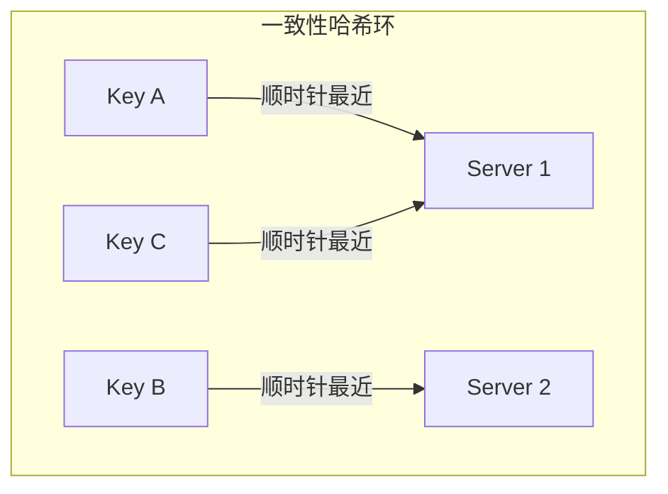

## 哈希表（Hash Table）

哈希表是计算机科学中最基础、最高效的数据结构之一。它通过**哈希函数**将键（Key）映射到数组下标，实现 O(1) 平均时间复杂度的插入、查找和删除操作。从编程语言的标准库（Python 的 `dict`、Java 的 `HashMap`、Go 的 `map`）到数据库索引、缓存系统、编译器符号表，哈希表无处不在。

---

## 1. 核心概念与术语

| 术语 | 含义 |
|------|------|
| **键（Key）** | 用于标识数据元素的唯一标识符 |
| **值（Value）** | 与键关联的实际数据 |
| **键值对（Key-Value Pair）** | 一个键和一个值的组合，是哈希表的基本存储单元 |
| **哈希函数（Hash Function）** | 将任意长度的输入映射为固定长度输出的函数 |
| **哈希值（Hash Code）** | 哈希函数对键计算出的整数值 |
| **桶（Bucket）** | 哈希表中存储键值对的槽位 |
| **负载因子（Load Factor）** | 已存储元素数 / 桶总数，衡量哈希表的拥挤程度 |

---

## 2. 哈希函数

哈希函数是哈希表的灵魂。一个优秀的哈希函数应满足：

1. **确定性**：相同键始终产生相同的哈希值
2. **均匀性**：输出值在桶空间内均匀分布
3. **高效性**：计算时间应为 O(1) 级别
4. **雪崩效应**：输入的微小变化应导致输出的剧烈变化

### 2.1 常见哈希函数

**除留余数法（Division Method）**

h(key) = key % table_size

最简单的方式。`table_size` 取素数时分布效果最佳。当 `table_size` 为 2 的幂时退化为位截断，分布不均。

**乘法哈希（Multiplication Method）**

h(key) = floor(table_size × (key × A % 1))

其中 A 是黄金比例常数 0.6180339887... Knuth 建议的方案，对 `table_size` 的要求较宽松。

**FNV-1a 哈希**

```python
def fnv1a(data: bytes) -> int:
    FNV_OFFSET = 2166136261
    FNV_PRIME = 16777619
    h = FNV_OFFSET
    for byte in data:
        h ^= byte
        h = (h * FNV_PRIME) &amp; 0xFFFFFFFF
    return h
```

FNV-1a 是非加密哈希中性能和分布质量的优秀折中，广泛用于布隆过滤器、哈希表等场景。

**MurmurHash**

MurmurHash（由 Austin Appleby 开发）是工业界使用最广泛的非加密哈希之一。核心操作是**混合（mix）**和**最终处理（finalize）**，利用乘法、异位、位移实现雪崩效应。Redis、Elasticsearch、Memcached 等都采用 MurmurHash 或其变种。

**CityHash / SipHash**

- **CityHash**（Google）：针对 64 位平台优化的高性能哈希，用于 Google 的内部系统
- **SipHash**：密码学级别的伪随机哈希，防止 HashDoS 攻击，Python 3.4+ 默认使用

### 2.2 哈希函数的选择原则

| 场景 | 推荐哈希函数 | 理由 |
|------|-------------|------|
| 通用哈希表 | MurmurHash / SipHash | 分布均匀、性能好 |
| 需防 HashDoS | SipHash | 密码学安全，防碰撞攻击 |
| 布隆过滤器 | FNV-1a / xxHash | 多次哈希需高效 |
| 字符串密集型 | DJB2 / FNV-1a | 对短字符串优化 |
| 整数密集型 | 位运算混合 / Wang Hash | 简单高效 |

---

## 3. 冲突处理

两个不同的键经过哈希函数可能映射到同一个桶，这就是**哈希冲突（Hash Collision）**。冲突处理是哈希表设计的核心问题。

### 3.1 链地址法（Separate Chaining）

每个桶存储一个链表（或其他容器），冲突的元素追加到链表末尾。

```python
class ChainingHashMap:
    def __init__(self, capacity=16):
        self.capacity = capacity
        self.size = 0
        self.buckets = [[] for _ in range(capacity)]
    
    def _hash(self, key):
        return hash(key) % self.capacity
    
    def put(self, key, value):
        idx = self._hash(key)
        bucket = self.buckets[idx]
        for i, (k, v) in enumerate(bucket):
            if k == key:
                bucket[i] = (key, value)  # 更新
                return
        bucket.append((key, value))  # 新增
        self.size += 1
        if self.size / self.capacity > 0.75:
            self._resize(self.capacity * 2)
    
    def get(self, key):
        idx = self._hash(key)
        for k, v in self.buckets[idx]:
            if k == key:
                return v
        raise KeyError(key)
    
    def delete(self, key):
        idx = self._hash(key)
        bucket = self.buckets[idx]
        for i, (k, v) in enumerate(bucket):
            if k == key:
                bucket.pop(i)
                self.size -= 1
                return v
        raise KeyError(key)
    
    def _resize(self, new_capacity):
        old_buckets = self.buckets
        self.capacity = new_capacity
        self.buckets = [[] for _ in range(new_capacity)]
        self.size = 0
        for bucket in old_buckets:
            for k, v in bucket:
                self.put(k, v)
```

**优缺点**：

- 实现简单，删除操作容易
- 负载因子可以超过 1
- 指针开销大，缓存不友好
- 链表过长时退化为 O(n)

### 3.2 开放寻址法（Open Addressing）

所有元素都存储在桶数组内。冲突时按特定探测序列寻找下一个空桶。

**线性探测（Linear Probing）**

h(key, i) = (h(key) + i) % table_size,  i = 0, 1, 2, ...

```python
class LinearProbingHashMap:
    def __init__(self, capacity=16):
        self.capacity = capacity
        self.size = 0
        self.keys = [None] * capacity
        self.values = [None] * capacity
    
    def _hash(self, key):
        return hash(key) % self.capacity
    
    def put(self, key, value):
        if self.size / self.capacity > 0.7:
            self._resize(self.capacity * 2)
        idx = self._hash(key)
        while self.keys[idx] is not None:
            if self.keys[idx] == key:
                self.values[idx] = value
                return
            idx = (idx + 1) % self.capacity
        self.keys[idx] = key
        self.values[idx] = value
        self.size += 1
    
    def get(self, key):
        idx = self._hash(key)
        while self.keys[idx] is not None:
            if self.keys[idx] == key:
                return self.values[idx]
            idx = (idx + 1) % self.capacity
        raise KeyError(key)
```

**二次探测（Quadratic Probing）**

h(key, i) = (h(key) + c1*i + c2*i²) % table_size

探测间隔逐渐增大，缓解线性探测的**主聚集（Primary Clustering）**问题。

**双重哈希（Double Hashing）**

h(key, i) = (h1(key) + i * h2(key)) % table_size

使用两个独立哈希函数计算步长，最接近理想的均匀探测。Java 8+ 的 `HashMap` 在链表长度超过 8 时，会将链表转为红黑树，其本质也是改进的探测策略。

### 3.3 三种开放寻址策略的对比

| 策略 | 探测方式 | 主聚集 | 次聚集 | 缓存性能 | 适用场景 |
|------|---------|--------|--------|---------|---------|
| 线性探测 | +1, +1, +1... | 严重 | 无 | 优秀 | 小表、缓存敏感 |
| 二次探测 | +1, +4, +9... | 无 | 严重 | 良好 | 中等规模 |
| 双重哈希 | +h2(k), +2h2(k)... | 无 | 无 | 一般 | 大规模、高负载 |

---

## 4. 动态扩容（Rehashing）

### 4.1 为什么需要扩容

当负载因子超过阈值（通常 0.75），冲突概率急剧上升，查找退化。扩容通常将桶数翻倍，重新映射所有元素。

### 4.2 线性扩容的问题

一次性扩容会在扩容瞬间造成 O(n) 延迟抖动，对在线服务不可接受。

### 4.3 渐进式哈希（Incremental Rehashing）

Redis 的字典实现采用了渐进式哈希：

1. 分配新桶数组（大小为原数组的两倍）
2. 保留旧数组，不立即迁移
3. 每次 `put`/`get` 操作时，迁移旧数组中的一个桶到新数组
4. 查找时同时查新旧两个数组
5. 全部迁移完成后释放旧数组

```python
# Redis 风格的渐进式哈希伪代码
class IncrementalHashMap:
    def __init__(self):
        self.ht[0] = BucketArray(4)
        self.ht[1] = None
        self.rehashidx = -1  # -1 表示不在扩容中
    
    def put(self, key, value):
        if self.rehashing:
            self._rehash_step()  # 每次操作迁移一个桶
        # ... 正常插入逻辑
    
    def _rehash_step(self):
        # 迁移 rehashidx 桶
        for entry in self.ht[0].buckets[self.rehashidx]:
            self._insert_to_ht1(entry)
        self.ht[0].buckets[self.rehashidx] = None
        self.rehashidx += 1
        if self.rehashidx == self.ht[0].capacity:
            self.ht[0] = self.ht[1]
            self.ht[1] = None
            self.rehashidx = -1
```

---

## 5. 工业级实现分析

### 5.1 Python dict

Python 3.6+ 的字典采用**紧凑数组 + 稀疏索引**的混合方案：

```mermaid
graph LR
    A[键的哈希值] --> B[稀疏索引数组]
    B --> C[紧凑数组<br>hash | key | value]
```

- 稀疏索引数组存哈希值的低 8 位，用于快速定位
- 紧凑数组按插入顺序连续存储，节省内存
- 插入序保持（3.7+ 规范化行为）

### 5.2 Java HashMap

Java 8+ 的 `HashMap` 采用**数组 + 链表 + 红黑树**：

| 条件 | 结构 |
|------|------|
| 桶内元素 ≤ 8 | 链表（O(n)） |
| 桶内元素 > 8 且数组长度 ≥ 64 | 红黑树（O(log n)） |
| 数组长度 < 64 | 优先扩容而非树化 |

默认负载因子 0.75，扩容时元素的最高位哈希位决定其留在原位置还是移动到 `原位置 + 旧容量`。

### 5.3 Go map

Go 的 map 底层使用**哈希桶 + 溢出桶**的设计：

- 每个桶固定存 8 个键值对
- 溢出时链入溢出桶
- 负载因子 > 6.5 时触发扩容
- 等量扩容：溢出桶过多但元素不多时，做整理而非翻倍

### 5.4 C++ std::unordered_map

基于链地址法，桶内使用单链表。C++11 引入 `reserve()` 预分配桶数，`max_load_factor()` 控制触发扩容的阈值（默认 1.0）。

---

## 6. 时间复杂度分析

| 操作 | 平均情况 | 最坏情况 | 说明 |
|------|---------|---------|------|
| 插入 | O(1) | O(n) | 最坏：所有键冲突到同一桶 |
| 查找 | O(1) | O(n) | 最坏：退化为链表遍历 |
| 删除 | O(1) | O(n) | 开放寻址法删除需特殊处理 |
| 遍历 | O(n) | O(n) | 遍历所有桶 |

> **摊还分析**：扩容的 O(n) 代价分摊到 n 次插入中，单次插入的摊还代价为 O(1)。

---

## 7. 常见误区与陷阱

### 误区一：哈希表永远 O(1)

哈希表的 O(1) 是**平均情况**。以下情况会导致退化：

- **HashDoS 攻击**：攻击者构造大量冲突的键，使查找退化为 O(n)。防御手段：使用随机化哈希（SipHash）
- **负载因子过高**：不及时扩容导致冲突链过长
- **哈希函数质量差**：分布不均导致某些桶过载

### 误区二：开放寻址法删除很简单

开放寻址法中直接置空槽会导致探测链断裂。正确做法是使用**墓碑标记（Tombstone）**：

```python
DELETED = object()  # 哨兵值

def delete(self, key):
    idx = self._hash(key)
    while self.keys[idx] is not None:
        if self.keys[idx] == key:
            self.keys[idx] = DELETED
            self.size -= 1
            return self.values[idx]
        idx = (idx + 1) % self.capacity
    raise KeyError(key)
```

墓碑过多时需要做一次全量整理（rehash）。

### 误区三：可变对象可以当键

字典的键必须是**可哈希的（Hashable）**，即实现了 `__hash__` 和 `__eq__` 且 `__hash__` 在生命周期内不变。列表、字典等可变类型不可哈希：

```python
d = {}
d[[1, 2]] = "value"  # TypeError: unhashable type: 'list'

# 正确做法：用元组
d[(1, 2)] = "value"  # OK
```

---

## 8. 高级应用

### 8.1 一致性哈希（Consistent Hashing）

传统哈希 `server = hash(key) % N` 在节点数 N 变化时，几乎所有键都要重新映射。一致性哈希将节点和键都映射到一个环上，节点增删只影响相邻区间。



**虚拟节点**解决节点少时的负载不均问题：每个物理节点映射多个虚拟节点分布在环上。

应用场景：Redis Cluster、分布式缓存（Memcached）、CDN 负载均衡。

### 8.2 布隆过滤器（Bloom Filter）

基于位数组 + 多个哈希函数的概率型数据结构：

- **可能有**：某元素可能存在
- **一定没有**：某元素一定不存在
- 空间效率极高，适用于黑名单、缓存穿透防护

### 8.3 跳表（Skip List）vs 哈希表

| 特性 | 哈希表 | 跳表 |
|------|--------|------|
| 查找 | O(1) | O(log n) |
| 范围查询 | 不支持 | O(log n + k) |
| 有序遍历 | 需排序 O(n log n) | 天然有序 |
| 实现复杂度 | 中等（需处理冲突） | 简单 |

Redis 的有序集合（Sorted Set）选择跳表而非哈希表，正是因为需要支持范围查询。

### 8.4 Cuckoo Hashing（布谷鸟哈希）

使用两个哈希函数和两张表。冲突时踢走现有元素到其备选位置，最坏 O(1) 查找。适合读多写少的场景。

### 8.5 Robin Hood Hashing

开放寻址法的优化变种。插入时如果当前位置的元素"更穷"（探测距离更远），就交换位置，缩小最大探测距离，使所有元素的查找时间趋于一致。

---

## 9. 工程实践要点

### 9.1 容量预估

预分配合适的桶数避免频繁扩容：

```python
# Python：已知元素数量时预分配
d = dict.fromkeys(range(100000))  # 或
import sys
sys.getsizeof({})  # 空 dict 占 64 字节，每个条目约 80-200 字节
```

### 9.2 并发安全

| 语言 | 并发哈希表方案 |
|------|---------------|
| Java | `ConcurrentHashMap`（分段锁 / CAS） |
| Go | sync.Map（读写分离的优化方案） |
| Rust | `DashMap`（分片锁） |
| Python | `threading.Lock` + 普通 dict / `concurrent.futures` |

### 9.3 内存布局优化

- **开放寻址法**比链地址法更缓存友好（数组连续存储）
- **紧凑存储**减少指针开销（如 Python 的紧凑字典）
- **内存池**预分配键值对对象，减少 malloc 调用

### 9.4 自定义哈希的陷阱

```python
class Point:
    def __init__(self, x, y):
        self.x = x
        self.y = y
    def __hash__(self):
        return hash((self.x, self.y))  # 用不可变元组
    def __eq__(self, other):
        return self.x == other.x and self.y == other.y

# 确保 __hash__ 和 __eq__ 一致：
# a == b 时必须有 hash(a) == hash(b)
# 反之不要求（不同对象可碰撞）
```

---

## 10. 本章小结

| 维度 | 要点 |
|------|------|
| 核心思想 | 通过哈希函数将键直接映射到桶位置，实现 O(1) 访问 |
| 冲突解决 | 链地址法（实现简单）vs 开放寻址法（缓存友好） |
| 扩容策略 | 负载因子超阈值时翻倍扩容，渐进式哈希避免延迟抖动 |
| 工业实现 | Python 紧凑字典、Java 数组+链表+红黑树、Go 桶+溢出桶 |
| 高级应用 | 一致性哈希、布隆过滤器、布谷鸟哈希、Robin Hood 哈希 |
| 工程要点 | 防 HashDoS、容量预估、并发安全、内存布局优化 |

哈希表看似简单，实则在哈希函数设计、冲突处理策略、扩容时机、并发控制、安全防护等每个环节都有深度。理解这些细节，才能在实际系统设计中做出正确的取舍。
