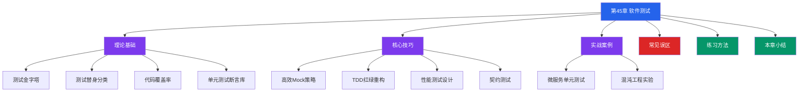

# 第45章 软件测试 - 章节概览

## 为什么软件测试如此重要

软件测试不是开发完成后的"扫尾工作"，而是贯穿软件全生命周期的质量保障体系。据 IBM Systems Sciences Institute 的研究，Bug 在生产阶段的修复成本是需求阶段的 100 倍。Google 的工程实践表明，测试投入占研发总投入的 15%-25% 时，能显著降低线上事故率和维护成本。

在现代软件工程中，测试早已超越了"找 Bug"的范畴：

- **设计驱动**：测试先行的 TDD 方法论迫使开发者从使用者角度设计接口，产出更简洁、更易用的 API
- **变更安全网**：完善的测试套件让团队敢于重构和快速迭代，而不是因为害怕"改坏什么"而止步不前
- **文档替代**：测试用例本身就是最精确的行为文档——它描述了代码"应该做什么"，且永远不会过时（不像注释和文档）
- **质量度量**：覆盖率、变异分数、缺陷密度等测试指标为团队提供了客观的质量评估依据

一个成熟的测试体系能让团队做到：发布频率从"每月一次"提升到"每天多次"，线上事故率降低 60% 以上，新成员上手时间缩短 50%。

## 本章知识地图

本章围绕软件测试的理论、方法、工具和实践四个维度展开，形成从认知到落地的完整知识链路：

## 学习目标

完成本章学习后，你应该能够：

| 目标层级 | 具体能力 | 对应章节 |
|----------|----------|----------|
| 理解 | 说清单元/集成/E2E 测试的定位与职责划分，画出测试金字塔并解释每一层的取舍逻辑 | 理论基础 |
| 掌握 | 区分 Dummy/Stub/Spy/Mock/Fake 五种测试替身，根据场景选择合适的替身类型 | 理论基础、核心技巧 |
| 应用 | 用 pytest 编写高质量单元测试，用 Mock 隔离外部依赖，CI 中集成覆盖率报告 | 核心技巧、实战案例 |
| 分析 | 解读行覆盖率/分支覆盖率/MC/DC 的含义与局限，识别"覆盖式测试"陷阱 | 理论基础 |
| 评估 | 设计负载测试/压力测试/浸泡测试方案，选择 JMeter/Gatling/k6 等工具 | 核心技巧 |
| 实践 | 使用 Pact 框架编写契约测试，用 LitmusChaos 设计混沌工程实验 | 核心技巧、实战案例 |

## 各节内容导航

### 理论基础（01-04节）

**01-测试金字塔**：从 Mike Cohn 的经典模型出发，讲解单元测试、集成测试、端到端测试三个层次的定位、成本和信心收益曲线。对比"测试钻石"模型——为什么一些团队（如 Spotify、Netflix）选择减少单元测试、增加集成测试，以及这种取舍背后的工程逻辑。

**02-测试替身分类**：详解 Gerard Meszaros 在《xUnit Test Patterns》中定义的五种测试替身——Dummy（哑对象）、Stub（桩对象）、Spy（间谍对象）、Mock（模拟对象）、Fake（伪对象）。每种替身都有完整的代码示例和适用场景分析。重点区分 Mock（前置断言）和 Spy（后置验证）的设计哲学差异。

**03-代码覆盖率**：从行覆盖率到分支覆盖率、条件覆盖率、路径覆盖率，再到航空领域的 MC/DC 标准，逐层递进。给出覆盖率指导原则：核心业务逻辑行覆盖率 ≥80%，分支覆盖率 ≥70%，但更要警惕"覆盖式测试"——覆盖了代码却没验证行为的测试毫无价值。

**04-单元测试断言库**：横向对比 Python（pytest）、Java（JUnit 5 + AssertJ）、Go（testify）三大语言生态的断言库。包含真实的断言模式示例、fixture 机制、表驱动测试等实用技巧。

### 核心技巧（01-04节）

**01-高效Mock策略**：Mock 是单元测试中最常用也最容易被滥用的工具。本节讲解 Mock 的正确使用时机（隔离外部 IO、模拟异常场景）、常见陷阱（过度 Mock 导致测试脆弱、Mock 实现细节而非行为）、以及 Mock 与 Fake 的选择策略。

**02-TDD红绿重构**：通过一个完整的购物车实现案例，手把手演示 TDD 的"红-绿-重构"循环。每一步都有完整的代码和解释，让读者看到代码是如何从零开始、在测试引导下逐步生长出来的。讨论 TDD 的适用场景和局限性。

**03-性能测试设计**：系统讲解负载测试、压力测试、浸泡测试的区别与实施方法。提供 k6 和 Locust 两种工具的完整脚本示例。给出性能测试的指标体系：响应时间（P50/P95/P99）、吞吐量（RPS/QPS）、错误率、资源利用率。讨论性能测试的常见陷阱：测试环境与生产环境的差异、数据准备、预热策略。

**04-契约测试**：讲解消费者驱动的契约测试（Consumer-Driven Contract Testing）原理，重点介绍 Pact 框架的使用。包含完整的消费者端契约编写和提供者端契约验证代码。分析契约测试的优势（无需完整集成环境、契约可版本控制）和局限（只能验证请求/响应格式，无法覆盖端到端业务流程）。

### 实战案例（01-02节）

**01-为微服务编写单元测试**：在一个真实的微服务项目中，演示如何为包含数据库访问、消息队列发送、外部 API 调用的业务逻辑编写单元测试。展示测试替身的选择、测试数据的组织、边界条件的覆盖。

**02-混沌工程实验**：基于 LitmusChaos 在 Kubernetes 环境中设计和执行混沌实验。从定义稳态行为、提出假设、设计实验、观察结果四步走，完整展示混沌工程的科学实验方法论。

### 常见误区（04节）

梳理测试实践中的典型陷阱：

| 误区 | 本质问题 | 正确做法 |
|------|----------|----------|
| 追求100%覆盖率 | 覆盖了代码却没验证行为 | 关注核心路径，结合变异测试评估质量 |
| 过度Mock | 测试与实现高度耦合，重构即破 | Mock 外部边界，内部逻辑用 Fake 或真实对象 |
| 忽略测试维护成本 | 测试套件腐化，CI 越来越慢 | 定期清理无用测试，优化慢测试 |
| 只写E2E测试 | 信心高但成本极高，反馈循环长 | 金字塔分层，单元测试为主体 |
| 测试不隔离 | 测试间有顺序依赖，结果不可重复 | 每个测试独立 setup/teardown |

### 练习方法（05节）

提供系统化的测试能力建设路径：

- **入门阶段**（1-2周）：理解测试金字塔，用 pytest 为已有项目补充单元测试，目标覆盖核心业务逻辑
- **进阶阶段**（2-4周）：实践 TDD 完成一个小型功能开发，学习 Mock 策略和测试替身的选择
- **高级阶段**（1-2月）：设计性能测试方案，引入契约测试，尝试混沌工程实验

每个阶段都有具体的练习任务、预期产出和自检标准。

### 本章小结（06节）

回顾本章核心知识点，提炼软件测试的关键原则：

1. **测试是投资，不是成本**——早期测试投入的 ROI 远高于后期修复
2. **分层测试，各司其职**——单元测试提供速度，集成测试提供信心，E2E 测试提供完整性
3. **测试替身各有用途**——Dummy 填坑、Stub 控制输入、Spy 验证交互、Mock 强制契约、Fake 替代重量依赖
4. **覆盖率是手段，不是目的**——高覆盖率不等于高质量，变异测试才是衡量测试有效性的金标准
5. **持续演进**——测试策略随项目演进不断调整，没有一成不变的"最佳实践"

## 学习建议

- **边学边练**：每个知识点后都有代码示例，务必亲手运行一遍。测试代码的"手感"只有通过实践才能建立
- **从已有项目开始**：找一个你熟悉的项目，用本章的方法论为其补充测试。在真实代码上练习比从零写 Demo 更有收获
- **渐进式改进**：不要试图一步到位建成完美的测试体系。从最痛的点开始——是线上 Bug 频发？还是重构时胆战心惊？针对痛点优先投入测试资源
- **团队共识**：测试不是一个人的事。推动团队建立统一的测试规范（命名约定、目录结构、CI 门禁）比个人写出完美的测试更重要
