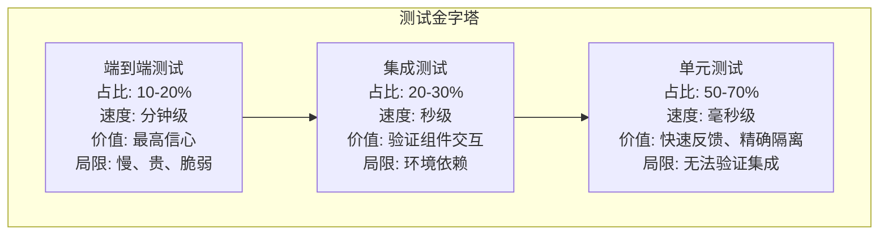

## 练习方法

本章练习方法分为五个递进层级，从基础概念理解到架构设计，覆盖软件测试的完整技能树。每个练习都包含具体的场景、可执行的代码和明确的验收标准。建议读者按顺序完成，每个练习完成后对照检查标准自测，未达标则重复练习直至通过。

---

### 练习一：测试基础概念与测试替身辨析（预计30分钟）

**目标**：能够区分五种测试替身（Dummy/Stub/Spy/Mock/Fake）的适用场景，理解测试金字塔各层的职责边界，用自己的话解释为什么要这样分层。

**步骤**：

**1.1 五种测试替身速查表（10分钟）**

阅读理论基础部分后，填写以下对比表（先尝试默写，再对照原文检查）：

| 替身类型 | 核心能力 | 验证时机 | 典型使用场景 | 对应框架 |
|---------|---------|---------|------------|---------|
| Dummy   | 仅填充参数，不被使用 | 无需验证 | 方法签名需要但测试不关心的参数 | 直接构造空对象 |
| Stub    | 返回预设值 | 无需验证 | 控制间接输入（如数据库查询结果） | pytest fixture、unittest.mock.Mock(return_value=…) |
| Spy     | 记录调用信息 | 后置断言 | 验证"是否调用了某方法" | unittest.mock.patch + assert_called_with |
| Mock    | 内嵌期望，自动断言 | 前置断言 | 验证交互行为（调用次数、参数） | unittest.mock.Mock、pytest-mock |
| Fake    | 完整简化实现 | 通过功能验证 | 替代外部依赖（内存数据库） | 手写 InMemoryRepository |

**1.2 场景辨析练习（10分钟）**

对以下五个场景，判断应该使用哪种测试替身，并说明理由：

- 场景A：你需要测试 `OrderService.calculate_total()`，该方法内部调用了 `TaxCalculator.calculate(amount, region)` 获取税率。你已经通过其他测试验证了 TaxCalculator 的正确性，当前只需确保 OrderService 传递了正确的参数。
- 场景B：你需要测试 `UserService.register()`，该方法在注册成功后会调用 `EmailService.send_welcome_email()`。你需要验证邮件确实被发送了，且收件地址正确。
- 场景C：你需要测试 `ReportGenerator.generate()`，该方法从数据库查询大量数据。数据库启动慢且数据构造复杂，你希望用一个简单的内存存储替代。
- 场景D：你需要测试 `PaymentProcessor.process()`，该方法内部需要一个 `Logger` 实例，但测试完全不关心日志行为。
- 场景E：你需要测试 `NotificationService.send_batch()`，该方法会对每个通知调用 `PushService.deliver()`。你需要验证恰好发送了 N 次，且每次的 payload 不同。

参考答案：

```text
场景A → Stub：只需预设 TaxCalculator 的返回值，验证参数传递
场景B → Spy：需要事后检查 send_welcome_email 是否被调用、参数是否正确
场景C → Fake：需要一个有完整 CRUD 逻辑但不依赖真实数据库的实现
场景D → Dummy：Logger 只是占位参数，测试中完全不使用
场景E → Mock：需要验证调用次数（N次）和每次调用的参数
```

**1.3 测试金字塔分层绘制（10分钟）**

用 Mermaid 画出测试金字塔图，并在每层标注：
- 该层测试的是什么（单元/集成/E2E）
- 推荐的测试数量占比
- 执行速度要求（毫秒/秒/分钟级）
- 该层测试的主要价值和局限性



**检查标准**：
- [ ] 能默写出五种测试替身的定义和区别（不需要看原文）
- [ ] 对5个场景中的至少4个给出正确的替身选择和理由
- [ ] 画出的测试金字塔包含三层数量占比、速度要求和价值局限

---

### 练习二：用 pytest 编写高质量单元测试（预计60分钟）

**目标**：搭建完整的 pytest 测试环境，编写包含 Mock、参数化、Fixture、异常断言的单元测试套件，并生成覆盖率报告。

**步骤**：

**2.1 环境搭建（10分钟）**

```bash
# 创建项目目录
mkdir -p test_practice &amp;&amp; cd test_practice

# 创建虚拟环境（PEP 668 环境下必须用 venv）
python3 -m venv .venv
source .venv/bin/activate

# 安装测试依赖
pip install pytest pytest-cov pytest-mock pytest-html

# 验证安装
pytest --version
python -c "import pytest; print(pytest.__file__)"
```

**2.2 编写被测代码（10分钟）**

创建 `calculator.py`，包含一个有多种分支逻辑的计算器：

```python
# calculator.py
class Calculator:
    """支持基本运算的计算器，含异常分支"""

    def __init__(self):
        self.history: list[str] = []

    def add(self, a: float, b: float) -> float:
        result = a + b
        self.history.append(f"{a} + {b} = {result}")
        return result

    def divide(self, a: float, b: float) -> float:
        if b == 0:
            raise ValueError("除数不能为零")
        result = a / b
        self.history.append(f"{a} / {b} = {result}")
        return result

    def apply_discount(self, price: float, discount_rate: float) -> float:
        """打折计算：0-1之间的折扣率"""
        if not 0 <= discount_rate <= 1:
            raise ValueError(f"折扣率必须在0到1之间，当前值: {discount_rate}")
        if price < 0:
            raise ValueError("价格不能为负数")
        return round(price * (1 - discount_rate), 2)

    def get_history(self) -> list[str]:
        return self.history.copy()
```

**2.3 编写单元测试（30分钟）**

创建 `test_calculator.py`，要求覆盖以下测试技术点：

```python
# test_calculator.py
import pytest
from calculator import Calculator


# --- Fixture：提供可复用的测试对象 ---
@pytest.fixture
def calc():
    """每个测试函数获取一个全新的 Calculator 实例"""
    return Calculator()


# --- 基础功能测试 ---
class TestAdd:
    def test_add_positive_numbers(self, calc):
        assert calc.add(2, 3) == 5

    def test_add_negative_numbers(self, calc):
        assert calc.add(-1, -1) == -2

    def test_add_zero(self, calc):
        assert calc.add(0, 5) == 5

    def test_add_records_history(self, calc):
        calc.add(1, 2)
        assert calc.get_history() == ["1 + 2 = 3"]


# --- 异常断言测试 ---
class TestDivide:
    def test_divide_normal(self, calc):
        assert calc.divide(10, 2) == 5.0

    def test_divide_by_zero_raises(self, calc):
        with pytest.raises(ValueError, match="除数不能为零"):
            calc.divide(1, 0)

    def test_divide_floats(self, calc):
        result = calc.divide(7, 2)
        assert abs(result - 3.5) < 1e-10  # 浮点数比较用误差范围


# --- 参数化测试：用一组数据覆盖多个场景 ---
class TestDiscount:
    @pytest.mark.parametrize("price,rate,expected", [
        (100, 0.1, 90.0),
        (100, 0.0, 100.0),    # 无折扣
        (100, 1.0, 0.0),      # 全额折扣
        (99.9, 0.25, 74.93),  # 小数
    ])
    def test_valid_discounts(self, calc, price, rate, expected):
        assert calc.apply_discount(price, rate) == expected

    @pytest.mark.parametrize("price,rate,expected_error", [
        (100, -0.1, "折扣率必须在0到1之间"),
        (100, 1.5, "折扣率必须在0到1之间"),
        (-10, 0.1, "价格不能为负数"),
    ])
    def test_invalid_discounts(self, calc, price, rate, expected_error):
        with pytest.raises(ValueError, match=expected_error):
            calc.apply_discount(price, rate)


# --- 使用 pytest-mock 进行 Mock 测试 ---
class TestWithMock:
    def test_mock_external_service(self, calc, mocker):
        """模拟外部服务调用场景"""
        # 假设 calc 依赖一个外部汇率服务
        mock_rate_service = mocker.patch("calculator.requests.get")
        mock_rate_service.return_value.json.return_value = {"rate": 7.2}

        # 验证 Mock 被正确调用
        import calculator
        calculator.requests = mock_rate_service  # 简化示例
        assert mock_rate_service.return_value.json.return_value["rate"] == 7.2
```

**2.4 运行测试并查看覆盖率（10分钟）**

```bash
# 运行全部测试，显示详细输出
pytest test_calculator.py -v

# 运行测试并生成覆盖率报告
pytest test_calculator.py --cov=calculator --cov-report=term-missing --cov-report=html

# 查看 HTML 覆盖率报告（在浏览器中打开）
echo "覆盖率报告路径: $(pwd)/htmlcov/index.html"

# 仅运行参数化测试中的某一组
pytest test_calculator.py -k "valid_discounts" -v
```

**检查标准**：
- [ ] `pytest` 全部测试通过（0 failures）
- [ ] `calculator.py` 的行覆盖率达到 100%（因为代码量小，应追求全覆盖）
- [ ] 包含至少 1 个 `pytest.raises` 异常断言
- [ ] 包含至少 1 个 `@pytest.mark.parametrize` 参数化测试
- [ ] 包含至少 1 个 `mocker.patch` Mock 测试
- [ ] 能解释每个测试为什么选择该种断言方式

---

### 练习三：TDD 红-绿-重构实战（预计45分钟）

**目标**：严格遵循 TDD 的红-绿-重构循环，从零实现一个 FizzBuzz 增强版（含业务规则扩展），体验 TDD 如何驱动设计。

**步骤**：

**3.1 基础 FizzBuzz（15分钟）**

规则：输入一个整数 n，返回 1 到 n 的列表，其中 3 的倍数替换为 "Fizz"，5 的倍数替换为 "Buzz"，既是 3 又是 5 的倍数替换为 "FizzBuzz"。

```python
# fizzbuzz.py — 初始状态：空文件

# --- 第 1 轮 TDD ---
# 红：写测试（此时 fizzbuzz.py 为空，测试必然失败）
```

```python
# test_fizzbuzz.py
from fizzbuzz import fizzbuzz

def test_returns_string_for_number_1():
    result = fizzbuzz(1)
    assert result == "1"

def test_returns_fizz_for_number_3():
    result = fizzbuzz(3)
    assert result == "Fizz"

def test_returns_buzz_for_number_5():
    result = fizzbuzz(5)
    assert result == "Buzz"

def test_returns_fizzbuzz_for_number_15():
    result = fizzbuzz(15)
    assert result == "FizzBuzz"
```

```bash
# 红：运行测试，确认全部失败
pytest test_fizzbuzz.py -v  # 预期：4 FAILED
```

```python
# 绿：写最小代码让测试通过
def fizzbuzz(n: int) -> str:
    if n % 15 == 0:
        return "FizzBuzz"
    if n % 3 == 0:
        return "Fizz"
    if n % 5 == 0:
        return "Buzz"
    return str(n)
```

```bash
# 绿：运行测试，确认全部通过
pytest test_fizzbuzz.py -v  # 预期：4 PASSED
```

```python
# 重构：消除重复的 % 判断（用字典映射）
def fizzbuzz(n: int) -> str:
    rules = [(15, "FizzBuzz"), (3, "Fizz"), (5, "Buzz")]
    for divisor, label in rules:
        if n % divisor == 0:
            return label
    return str(n)
```

```bash
# 重构后回归测试，确保行为不变
pytest test_fizzbuzz.py -v  # 预期：仍然 4 PASSED
```

**3.2 扩展规则：驱动新设计（15分钟）**

新增业务规则：能被 7 整除的返回 "Bang"，能被 3 和 7 同时整除的返回 "FizzBang"。

```python
# 先写新测试（红）
def test_returns_bang_for_number_7():
    assert fizzbuzz(7) == "Bang"

def test_returns_fizzbang_for_number_21():
    assert fizzbuzz(21) == "FizzBang"

# 运行 → 红（失败）→ 修改 rules 列表 → 绿 → 重构
```

**3.3 反思与记录（15分钟）**

回答以下问题（写在注释或笔记中）：

1. 在 TDD 过程中，你是否因为先写了测试而改变了最终代码的设计？如果有，怎么改变的？
2. 重构步骤中，你的测试套件扮演了什么角色？
3. 如果直接写实现再补测试，你认为会遗漏哪些边界情况？
4. 画出你的 TDD 循环时间线：每轮红-绿-重构各花了多少时间？

**检查标准**：
- [ ] 基础 FizzBuzz 和扩展规则的全部测试通过
- [ ] 至少经历了 3 轮完整的红-绿-重构循环
- [ ] 每轮重构前所有测试都是绿色
- [ ] 能描述 TDD 对代码设计的影响（口头或书面）

---

### 练习四：性能测试设计与执行（预计60分钟）

**目标**：使用 k6 工具设计并执行一个完整的负载测试，包含阶梯加压、阈值设定、结果分析。

**步骤**：

**4.1 安装 k6（5分钟）**

```bash
# macOS / Linux
sudo gpg -k
sudo gpg --no-default-keyring --keyring /usr/share/keyrings/k6-archive-keyring.gpg \
  --keyserver hkp://keyserver.ubuntu.com:80 --recv-keys C5AD17C747E3415A3642D57D77C6C491D6AC1D68
echo "deb [signed-by=/usr/share/keyrings/k6-archive-keyring.gpg] https://dl.k6.io/deb stable main" \
  | sudo tee /etc/apt/sources.list.d/k6.list
sudo apt-get update &amp;&amp; sudo apt-get install k6

# 验证安装
k6 version
```

**4.2 编写负载测试脚本（20分钟）**

创建 `load_test.js`：

```javascript
// load_test.js — 阶梯式负载测试脚本
import http from 'k6/http';
import { check, sleep } from 'k6';
import { Rate, Trend } from 'k6/metrics';

// 自定义指标
const errorRate = new Rate('errors');
const reqDuration = new Trend('req_duration');

// 测试配置：阶梯式加压
export const options = {
    stages: [
        { duration: '30s', target: 20 },   // 预热：30秒内加到20用户
        { duration: '1m',  target: 20 },   // 稳态：20用户持续1分钟
        { duration: '30s', target: 50 },   // 加压：30秒加到50用户
        { duration: '1m',  target: 50 },   // 峰值：50用户持续1分钟
        { duration: '30s', target: 0 },    // 降压：30秒降至0
    ],
    thresholds: {
        http_req_duration: ['p(95)<800'],   // 95%请求在800ms内
        http_req_failed:   ['rate<0.05'],   // 错误率低于5%
        errors:            ['rate<0.05'],   // 自定义错误率低于5%
    },
};

// 定义不同用户行为的权重
export default function () {
    const BASE_URL = __ENV.TARGET_URL || 'https://httpbin.org';

    // 场景1：GET 请求（权重60%）
    const getRes = http.get(`${BASE_URL}/get`);
    check(getRes, {
        'GET status 200': (r) => r.status === 200,
        'GET response < 500ms': (r) => r.timings.duration < 500,
    }) || errorRate.add(1);
    reqDuration.add(getRes.timings.duration);

    sleep(Math.random() * 2 + 1);  // 1-3秒随机等待

    // 场景2：POST 请求（权重30%）
    const payload = JSON.stringify({ user: 'test', action: 'login' });
    const postRes = http.post(`${BASE_URL}/post`, payload, {
        headers: { 'Content-Type': 'application/json' },
    });
    check(postRes, {
        'POST status 200': (r) => r.status === 200,
        'POST has echo': (r) => JSON.parse(r.body).json.user === 'test',
    }) || errorRate.add(1);

    sleep(Math.random() * 3 + 1);

    // 场景3：慢查询模拟（权重10%）
    if (Math.random() < 0.1) {
        const slowRes = http.get(`${BASE_URL}/delay/2`);
        check(slowRes, { 'Slow query completes': (r) => r.status === 200 });
    }
}

// 测试结束后输出汇总
export function handleSummary(data) {
    return {
        stdout: textSummary(data, { indent: ' ', enableColors: true }),
    };
}
```

**4.3 执行测试并分析结果（25分钟）**

```bash
# 执行测试
k6 run load_test.js

# 以 JSON 格式输出（便于后续分析）
k6 run --out json=results.json load_test.js

# 使用 VU（虚拟用户）模式测试指定 URL
TARGET_URL=https://your-api.example.com k6 run load_test.js
```

关键指标解读表：

| 指标 | 含义 | 健康阈值 | 危险信号 |
|-----|------|---------|---------|
| `http_req_duration` p(95) | 95%的请求响应时间 | < 500ms（API）/ < 2s（页面） | 突增超过基线2倍 |
| `http_req_failed` rate | 请求失败率 | < 1% | > 5% 需立即排查 |
| `http_reqs` | 每秒请求数（RPS） | 达到预期吞吐量 | 远低于预期 |
| `iterations` | 完成的测试迭代数 | 与预期用户数×时长匹配 | 远少于预期 |
| `vus_max` | 最大并发用户数 | 达到配置的 target 值 | 未达到 target |

**4.4 撰写测试报告（10分钟）**

用以下模板记录测试结果：

```markdown
## 性能测试报告
- 测试时间: YYYY-MM-DD HH:MM
- 目标系统: [URL]
- 测试场景: 阶梯式加压（20→50 VU）
- 结果摘要:
  - P95 响应时间: xxx ms
  - 平均响应时间: xxx ms
  - 错误率: xx%
  - 峰值 RPS: xxx
- 阈值通过情况: [PASS/FAIL]
- 发现的瓶颈: [描述]
- 优化建议: [描述]
```

**检查标准**：
- [ ] k6 安装成功，`k6 version` 输出正常
- [ ] 脚本包含至少 3 个不同的用户行为场景
- [ ] 配置了阶梯式加压（至少 3 个阶段）
- [ ] 设置了阈值（thresholds）
- [ ] 能解释 P95 延迟和错误率的含义
- [ ] 输出了可读的测试报告

---

### 练习五：契约测试与混沌工程综合实战（预计90分钟）

**目标**：为一对微服务编写消费者驱动的契约测试，并在测试环境中执行混沌实验验证系统韧性。

**步骤**：

**5.1 场景说明（5分钟）**

假设有两个微服务：
- **Order Service**（消费者）：调用 User Service 获取用户信息，用于下单时校验用户状态
- **User Service**（提供者）：暴露 `GET /users/{id}` 接口

你需要：
1. 在 Order Service 端编写消费者契约
2. 在 User Service 端验证契约
3. 用混沌工程手段验证 User Service 不可用时 Order Service 的降级行为

**5.2 编写消费者契约（30分钟）**

```python
# order_service/contracts/test_user_provider_contract.py
"""Order Service 对 User Service 的契约测试"""
import pytest
from pact import Consumer, Provider

# 初始化 Pact
pact = Consumer('OrderService').has_pact_with(Provider('UserService'))


class TestUserContract:
    """验证 Order Service 对 User Service API 的期望"""

    def test_get_existing_user(self):
        """契约1：获取存在的用户应返回完整用户信息"""
        expected_user = {
            "id": 1,
            "name": "Alice",
            "email": "alice@example.com",
            "status": "active",
            "credit_limit": 10000.00,
        }

        (pact
         .given('user with id 1 exists and is active')
         .upon_receiving('a request for user 1')
         .with_request('GET', '/users/1')
         .will_respond_with(200, body=expected_user))

        with pact:
            # 调用被测代码中的实际 HTTP 客户端
            from order_service.user_client import UserClient
            client = UserClient(base_url=pact.uri)
            user = client.get_user(1)

            assert user["name"] == "Alice"
            assert user["status"] == "active"
            assert user["credit_limit"] == 10000.00

    def test_get_nonexistent_user(self):
        """契约2：获取不存在的用户应返回 404"""
        (pact
         .given('no user with id 999 exists')
         .upon_receiving('a request for user 999')
         .with_request('GET', '/users/999')
         .will_respond_with(404, body={"error": "user not found"}))

        with pact:
            from order_service.user_client import UserClient
            client = UserClient(base_url=pact.uri)
            with pytest.raises(UserNotFoundError):
                client.get_user(999)

    def test_get_inactive_user(self):
        """契约3：获取被冻结的用户应返回 200 + status=inactive"""
        (pact
         .given('user with id 2 exists but is frozen')
         .upon_receiving('a request for frozen user 2')
         .with_request('GET', '/users/2')
         .will_respond_with(200, body={
             "id": 2,
             "name": "Bob",
             "status": "frozen",
         }))

        with pact:
            from order_service.user_client import UserClient
            client = UserClient(base_url=pact.uri)
            user = client.get_user(2)
            assert user["status"] == "frozen"
```

**5.3 验证提供者端契约（20分钟）**

```python
# user_service/tests/test_pact_verification.py
"""User Service 提供者端的契约验证"""
from pact import Verifier

def test_pact_contract_verification():
    """用真实的服务端点回放消费者契约"""
    verifier = Verifier(
        provider='UserService',
        provider_base_url='http://localhost:8080',
        # 提供者状态设置：让测试数据就位
        provider_states_setup_url='http://localhost:8080/_pact/apply_state',
    )

    output, result = verifier.verify_pacts(
        './pacts/orderservice-userservice.json',
    )
    assert result == 0, f"契约验证失败:\n{output}"
```

提供者端需要实现状态设置端点，根据消费者传入的状态名称准备测试数据：

```python
# user_service/app.py 中添加
@app.post('/_pact/apply_state')
def apply_pact_state():
    state = request.json.get('state')
    if state == 'user with id 1 exists and is active':
        db.seed_user(id=1, name='Alice', email='alice@example.com', status='active')
    elif state == 'no user with id 999 exists':
        db.delete_user(999)
    elif state == 'user with id 2 exists but is frozen':
        db.seed_user(id=2, name='Bob', email='bob@example.com', status='frozen')
    return '', 200
```

**5.4 混沌实验：User Service 宕机时的降级（30分钟）**

编写一个简单的混沌实验脚本，模拟 User Service 不可用：

```python
# chaos_experiments/test_user_service_degradation.py
"""混沌实验：验证 User Service 不可用时 Order Service 的降级行为"""
import time
import signal
import subprocess
import requests
import pytest


class TestServiceDegradation:
    """当 User Service 不可用时，验证 Order Service 是否正确降级"""

    @pytest.fixture(autouse=True)
    def setup(self):
        """实验前后恢复环境"""
        # 确保两个服务都在运行
        assert self._is_healthy('http://localhost:8080'), "User Service 未就绪"
        assert self._is_healthy('http://localhost:9000'), "Order Service 未就绪"
        yield
        # 恢复 User Service
        self._start_user_service()

    def test_order_service_returns_503_when_user_service_down(self):
        """当 User Service 宕机，Order Service 应返回 503 而非 500"""
        # 1. 记录稳态指标（User Service 正常时）
        baseline = self._check_order_service(1)
        assert baseline["status"] == 200, "基线检查失败"

        # 2. 注入故障：停止 User Service
        self._stop_user_service()
        time.sleep(3)  # 等待故障传播

        # 3. 观察系统行为
        result = self._check_order_service(1)

        # 4. 验证假设：Order Service 返回 503（服务不可用），而非 500（内部错误）
        assert result["status"] == 503, \
            f"期望 503 降级响应，实际返回 {result['status']}"
        assert "degraded" in result["body"].get("mode", ""), \
            "响应应标明处于降级模式"

    def test_order_service_caches_user_data(self):
        """验证缓存命中时 User Service 宕机不影响查询"""
        # 1. 先正常调用一次，让缓存生效
        self._check_order_service(1)

        # 2. 停止 User Service
        self._stop_user_service()
        time.sleep(2)

        # 3. 再次查询，应从缓存返回（200 而非 503）
        result = self._check_order_service(1)
        assert result["status"] == 200, \
            f"缓存应兜底，但返回了 {result['status']}"

    def _check_order_service(self, user_id: int) -> dict:
        try:
            resp = requests.get(
                f"http://localhost:9000/orders?user_id={user_id}",
                timeout=5,
            )
            return {"status": resp.status_code, "body": resp.json()}
        except Exception as e:
            return {"status": 500, "body": {"error": str(e)}}

    def _stop_user_service(self):
        subprocess.run(["docker", "stop", "user-service"], check=False)

    def _start_user_service(self):
        subprocess.run(["docker", "start", "user-service"], check=False)
        # 等待服务就绪
        for _ in range(30):
            time.sleep(1)
            if self._is_healthy('http://localhost:8080'):
                return
        raise RuntimeError("User Service 启动超时")

    @staticmethod
    def _is_healthy(url: str) -> bool:
        try:
            resp = requests.get(f"{url}/health", timeout=2)
            return resp.status_code == 200
        except Exception:
            return False
```

**5.5 实验复盘（5分钟）**

记录以下信息：

| 项目 | 内容 |
|------|------|
| 实验名称 | User Service 宕机降级测试 |
| 稳态假设 | User Service 正常时，Order Service 查询用户信息返回 200 |
| 注入故障 | 停止 User Service 容器 |
| 观察指标 | HTTP 状态码、响应体中的 mode 字段 |
| 实验结果 | PASS/FAIL |
| 如果 FAIL，根因 | （填写） |
| 改进措施 | （填写） |

**检查标准**：
- [ ] 消费者契约包含至少 3 个不同的 provider state
- [ ] 能解释 Pact 消费者驱动契约的工作流程
- [ ] 混沌实验包含"基线→注入→观察→验证"的完整步骤
- [ ] 能区分 503（降级）和 500（错误）的区别
- [ ] 撰写了完整的实验复盘记录

---

### 练习六：测试策略设计与评审（预计60分钟）

**目标**：针对一个真实的业务场景，设计完整的测试策略，包括各层测试的范围、工具选型、覆盖率目标和执行计划。

**步骤**：

**6.1 阅读场景（5分钟）**

```text
场景：一个在线教育平台，核心功能包括：
- 用户注册/登录（含手机号验证）
- 课程浏览与搜索（Elasticsearch）
- 视频播放（CDN + 视频加密）
- 支付购买（微信/支付宝）
- 学习进度记录与统计
- 后台管理（课程管理、用户管理、数据报表）

技术栈：Spring Boot + PostgreSQL + Redis + Elasticsearch + RabbitMQ
部署：Kubernetes，每日发布
团队：6名后端开发，2名前端开发，1名QA
```

**6.2 设计测试策略（35分钟）**

使用以下模板：

```markdown
## 测试策略文档

### 一、测试金字塔分配
| 测试层级 | 数量目标 | 执行时机 | 工具 | 覆盖范围 |
|---------|---------|---------|------|---------|
| 单元测试 | ≥80%方法覆盖 | 每次commit | JUnit 5 + Mockito | Service层、工具类、业务规则 |
| 集成测试 | 关键路径全覆盖 | PR合并前 | Testcontainers | 数据库操作、MQ消费、ES查询 |
| E2E测试 | 核心业务流程 | 预发布环境 | Playwright | 注册→购买→学习完整链路 |
| 性能测试 | 每次大版本 | 预发布环境 | k6 | 支付接口、搜索接口、视频播放 |
| 契约测试 | 所有服务间接口 | 每次PR | Pact | Order-Payment、Course-Progress |

### 二、测试数据管理
- 单元测试：Mock 数据，不依赖外部
- 集成测试：Testcontainers 自动创建临时数据库，每次运行全新
- E2E测试：种子数据 + 事务回滚（或独立测试环境）
- 性能测试：脱敏的生产数据子集

### 三、质量门禁
- [ ] PR合并前：单元测试通过 + 覆盖率 ≥ 70%
- [ ] 合并到 main：集成测试通过
- [ ] 预发布：E2E测试通过 + 性能基线无退化
- [ ] 发布：全量回归通过

### 四、Flaky 测试治理
- 策略：自动标记连续3次随机失败的测试为flaky
- 处理：flaky测试从阻塞CI降级为报告CI，同时创建issue跟踪
- 目标：flaky测试比例 < 2%
```

**6.3 自评与同行评审（20分钟）**

用自己的策略与以下清单交叉检验：

- [ ] 是否明确了每层测试的职责边界（不重复不遗漏）
- [ ] 是否指定了具体的工具而非笼统的"使用合适的工具"
- [ ] 是否考虑了测试数据的来源和管理方式
- [ ] 是否设定了可度量的质量门禁（覆盖率阈值、性能基线）
- [ ] 是否包含了 Flaky 测试的治理方案
- [ ] 是否考虑了CI/CD集成（什么测试在什么阶段执行）
- [ ] 是否评估了测试执行时间（全量回归是否能在合理时间内完成）

**检查标准**：
- [ ] 测试策略覆盖了单元/集成/E2E/性能/契约五个层级
- [ ] 每层都有明确的工具选型和执行时机
- [ ] 设定了可量化的质量门禁
- [ ] 考虑了测试数据管理和 Flaky 测试治理
- [ ] 能向他人清晰讲解自己的策略选择理由

---

### 练习总结与能力自评

完成全部练习后，使用以下自评表检查自己的掌握程度：

| 能力维度 | 入门 | 进阶 | 精通 |
|---------|------|------|------|
| 测试替身选择 | 能说出5种替身定义 | 能根据场景选择正确替身 | 能设计替身组合策略 |
| pytest 编写 | 能写基本测试 | 能用Mock/参数化/Fixture | 能设计可维护的测试架构 |
| TDD 实践 | 知道红绿重构循环 | 能独立完成小功能TDD | 能在团队推广TDD |
| 性能测试 | 能运行k6脚本 | 能设计阶梯加压场景 | 能分析瓶颈并指导优化 |
| 契约测试 | 理解Pact流程 | 能编写消费者和提供者契约 | 能在CI中集成契约测试 |
| 混沌工程 | 理解故障注入概念 | 能设计简单实验 | 能建立混沌工程实践体系 |
| 测试策略 | 了解测试金字塔 | 能设计单个项目的策略 | 能为多团队制定统一标准 |
