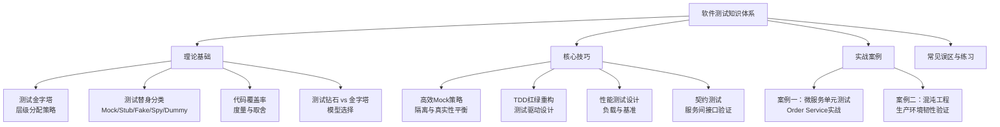
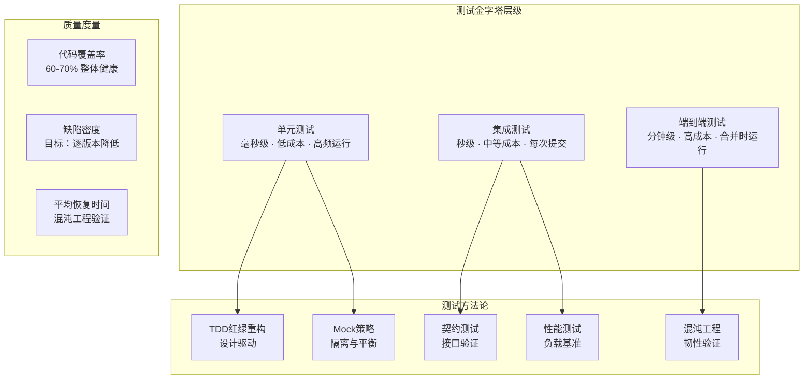

## 本章小结

### 一、全章知识脉络

本章从理论基础、核心技巧、实战案例三个维度，构建了软件测试的完整知识体系。全章的知识结构如下图所示：



---

### 二、核心知识点回顾

#### 2.1 理论基础：构建测试思维模型

**测试金字塔（Test Pyramid）** 是 Mike Cohn 在 2012 年提出的测试分配模型，核心思想是测试数量从底层到顶层递减：

| 层级 | 测试类型 | 数量建议 | 运行速度 | 单个成本 |
|------|---------|---------|---------|---------|
| 底层（最宽） | 单元测试 | 数千个 | 毫秒级 | 极低 |
| 中间层 | 集成测试 | 数百个 | 秒级 | 中等 |
| 顶层（最窄） | 端到端测试 | 数十个 | 分钟级 | 很高 |

金字塔的核心原则：**越底层的测试越多，越快速的测试越便宜**。经典反模式"冰淇淋反模式"则是金字塔的倒置——大量 E2E 测试配合极少单元测试，导致测试套件慢且脆弱。

**测试钻石（Test Diamond）** 由 Alistair Cockburn 提出，是对金字塔的重要补充。其核心信念：在微服务架构中，bug 最常发生在服务间的集成点，而非单个服务内部。因此集成测试应占最大比重（50-60%），而非单元测试。

两者的关键区别：

| 维度 | 测试金字塔 | 测试钻石 |
|------|-----------|----------|
| 核心信念 | bug 在模块内部 | bug 在模块之间 |
| 最有价值测试 | 单元测试 | 集成测试 |
| 适用架构 | 单体应用 | 微服务/分布式系统 |
| 重构态度 | 通过测试保证内部质量 | 通过测试保证外部行为 |

此外还介绍了测试奖杯（Testing Trophy）、测试蜂巢（Testing Honeycomb）等变体模型，帮助团队根据自身架构选择合适的测试策略。

**测试替身（Test Double）** 是单元测试隔离性的核心手段，源自 Gerard Meszaros 的《xUnit Test Patterns》。五种替身类型各有明确分工：

| 替身类型 | 核心特征 | 典型用途 | 会不会让测试失败 |
|---------|---------|---------|----------------|
| Dummy | 空实现占位，不参与逻辑 | 满足方法签名参数要求 | 否 |
| Stub | 返回预设值，控制执行路径 | 模拟依赖的返回数据 | 否 |
| Spy | 包装真实对象，记录调用信息 | 事后断言验证交互 | 否（手动断言） |
| Mock | 预设期望，自动验证交互 | 验证方法被正确调用 | 是（期望不满足则失败） |
| Fake | 可工作的简化实现 | 内存版数据库、轻量替代 | 否 |

选型原则：单元测试以 Stub + Mock 为主；集成测试用 Fake（内存实现）；E2E 测试极少使用替身，尽量用真实依赖。

**代码覆盖率** 是度量测试完整性的重要指标，但需要辩证看待：
- 行覆盖率（Line Coverage）：最基础的度量，检查每行代码是否被执行
- 分支覆盖率（Branch Coverage）：检查每个 if/else 分支是否都被覆盖
- 覆盖率高 ≠ 质量高：100% 覆盖率但没有断言的测试毫无价值
- 合理目标：核心业务逻辑 80%+，整体 60-70% 是健康区间
- 覆盖率是发现"未测试区域"的工具，不是追求的终点

---

#### 2.2 核心技巧：掌握测试实战方法

**高效Mock策略** 解决了"隔离性"与"真实性"的平衡问题。核心原则：

- **Mock 什么**：外部网络服务（支付网关、邮件服务）、数据库、时钟、随机数生成器
- **不 Mock 什么**：被测对象自身的逻辑、简单值对象、纯函数
- **Mock 的层次**：构造器注入（首选）、属性注入、方法拦截（最后手段）
- **过度 Mock 的危害**："测试全绿、生产全红"——Mock 的行为与真实依赖不一致时，测试变成自欺欺人

高效Mock的经济账：一个典型微服务项目，纯真实依赖的单元测试需要 15-30 秒/个，Mock 后降至 1-5 毫秒/个，提速 1000 倍以上。

**TDD 红-绿-重构** 是 Kent Beck 系统化的编程方法论，核心循环：

1. **Red（红）**：写一个失败的测试，明确"目标是什么"
2. **Green（绿）**：写最少的代码让测试通过，降低认知负载
3. **Refactor（重构）**：在测试安全网保护下优化代码结构

IBM 和 Microsoft 的研究数据表明，TDD 开发模式下初始编码时间增加 15-35%，但调试时间减少 50-80%，生产缺陷密度降低 40-80%，总体生命周期成本降低 20-40%。TDD 的本质是**将缺陷发现时间从月级缩短到秒级**，修复成本呈指数级下降。

TDD 的认知科学基础：George Miller 的工作记忆模型（7±2 个信息单元）表明，人类无法同时处理复杂问题的所有方面。TDD 的增量循环将复杂问题拆解为每次只处理一个小步骤，恰好符合认知约束。

**性能测试设计** 关注系统在负载下的行为，核心概念包括：
- 负载测试（Load Testing）：验证系统在预期负载下的表现
- 压力测试（Stress Testing）：找到系统的崩溃点和退化模式
- 浸泡测试（Soak Testing）：长时间运行检测内存泄漏等问题
- 基准测试（Benchmark Testing）：建立性能基线，量化优化效果

关键指标：吞吐量（QPS/TPS）、响应时间（P50/P95/P99）、错误率、资源利用率（CPU/内存/IO）。

**契约测试** 解决了微服务之间接口兼容性问题。核心机制：
- 由消费者（Consumer）定义期望的接口契约
- 提供者（Provider）验证自己是否满足契约
- 契约变更时，相关方立即收到通知，而非等到上线后才发现不兼容
- 典型工具：Pact、Spring Cloud Contract

---

#### 2.3 实战案例：从理论到工程实践

**案例一：微服务单元测试** 以电商订单服务（Order Service）为例，演示了完整的单元测试编写流程：

- **依赖分析**：OrderService 依赖 UserService（验证身份）、InventoryService（预留库存）、PaymentService（扣款）
- **接口抽象**：通过 Go 接口 + 构造函数注入实现依赖可替换
- **测试替身选择**：为每个下游服务创建 Stub，预设各种场景的返回值
- **测试用例设计**：正常路径（创建成功）、异常路径（用户不存在/库存不足/支付失败）、边界条件
- **测试隔离**：每个测试用例独立的替身实例，互不影响

关键代码模式：

```go
// 接口定义——被测代码的一部分，不是测试代码
type UserService interface {
    GetUser(ctx context.Context, userID string) (*User, error)
}

type InventoryService interface {
    ReserveStock(ctx context.Context, productID string, quantity int) error
}

// 测试中使用 Stub 替代真实依赖
type StubUserService struct {
    user *User
    err  error
}
func (s *StubUserService) GetUser(_ context.Context, _ string) (*User, error) {
    return s.user, s.err
}
```

**案例二：混沌工程实验** 将测试思维延伸到生产环境。混沌工程不是"破坏系统"，而是通过有计划的实验发现隐藏脆弱点：

- **四个核心步骤**：定义稳态假设 → 设计实验 → 执行实验 → 分析结果
- **与传统测试的区别**：混沌工程的核心是"探索未知"而非"验证已知"
- **典型实验类型**：网络延迟注入、服务实例终止、资源耗尽模拟
- **工具生态**：Netflix Chaos Monkey、Gremlin、Litmus、ChaosMesh

混沌工程的适用场景：已有一定成熟度的分布式系统、需要验证容错机制的有效性、高可用性要求的核心业务。

---

### 三、测试策略全景图

综合全章内容，一个完整的软件测试策略应覆盖以下维度：



---

### 四、测试类型速查表

| 测试类型 | 测试目标 | 运行环境 | 速度 | 替身使用 | 典型工具 |
|---------|---------|---------|------|---------|---------|
| 单元测试 | 函数/方法逻辑 | 本地进程 | 毫秒 | 大量使用 | pytest, JUnit, Jest |
| 集成测试 | 模块间协作 | 测试容器 | 秒级 | Fake为主 | Testcontainers, WireMock |
| 契约测试 | 服务间接口兼容 | 本地/CI | 秒级 | 无 | Pact, Spring Cloud Contract |
| 端到端测试 | 完整业务流程 | 预发布环境 | 分钟 | 极少 | Cypress, Playwright, Selenium |
| 性能测试 | 吞吐量与延迟 | 压测环境 | 分钟-小时 | 无 | JMeter, Locust, k6 |
| 混沌实验 | 系统韧性 | 生产环境 | 可控 | 无 | Gremlin, Litmus, ChaosMesh |

---

### 五、核心公式与度量

| 度量指标 | 计算方式 | 合理范围 | 说明 |
|---------|---------|---------|------|
| 行覆盖率 | 被执行行数 / 总行数 × 100% | 60-80% | 核心逻辑追求 80%+ |
| 分支覆盖率 | 被覆盖分支数 / 总分支数 × 100% | 50-70% | 比行覆盖率更有意义 |
| 缺陷密度 | 缺陷数 / 千行代码（KLOC） | <1.0（成熟项目） | 衡量代码质量趋势 |
| 测试通过率 | 通过用例数 / 总用例数 × 100% | >99% | 持续关注下降趋势 |
| 平均修复时间(MTTR) | 总修复时间 / 修复次数 | <1小时 | 混沌工程验证的核心指标 |
| 测试执行时间 | CI 中测试套件总耗时 | <10分钟 | 超过则需优化或分层 |

---

### 六、最佳实践清单

**设计阶段：**
- [ ] 根据架构选择测试模型（单体→金字塔，微服务→钻石）
- [ ] 定义各层级测试的占比目标
- [ ] 确定核心业务逻辑的覆盖率基线
- [ ] 识别需要契约测试的服务间接口

**编码阶段：**
- [ ] 对核心逻辑采用 TDD 方式开发
- [ ] 为每个外部依赖设计合理的测试替身策略
- [ ] Mock 只隔离不可控依赖，不 Mock 被测对象自身逻辑
- [ ] 测试命名清晰表达被测行为（如 `test_vip_user_gets_20_percent_discount`）

**集成阶段：**
- [ ] 使用 Testcontainers 等工具运行真实依赖的集成测试
- [ ] 为核心服务间接口建立契约测试
- [ ] 确保 CI 中测试套件执行时间 < 10 分钟
- [ ] 覆盖率报告纳入 CI 流水线，跌破阈值时阻断合并

**运维阶段：**
- [ ] 定期执行性能基准测试，监控退化趋势
- [ ] 对生产环境定期执行混沌实验，验证容错机制
- [ ] 收集生产缺陷数据，反馈到测试策略优化中
- [ ] 持续审视测试金字塔/钻石比例，避免结构漂移

---

### 七、常见误区与纠正

| 误区 | 正确做法 |
|------|---------|
| 追求 100% 覆盖率 | 追求核心逻辑的高质量覆盖，60-80% 是健康区间 |
| 过度 Mock 导致测试脱离现实 | Mock 不可控依赖，保持行为与真实一致 |
| E2E 测试覆盖所有场景 | E2E 只覆盖关键业务路径，细粒度验证交给底层测试 |
| 测试全绿 = 质量高 | 检查断言是否真正验证了行为，而非仅验证执行不报错 |
| 忽视测试维护成本 | 测试代码与产品代码同等对待，需要重构和优化 |
| 混沌工程 = 线上搞破坏 | 混沌工程有严格的实验设计、稳态假设和回滚机制 |

---

### 八、下一步学习建议

**进阶方向：**

1. **测试右移（Testing in Production）**：学习可观测性（Observability）驱动的测试方法，包括生产环境的影子流量、特性开关、金丝雀发布等技术
2. **AI 辅助测试**：探索 AI 在测试用例生成、测试数据构造、缺陷预测等领域的应用
3. **混沌工程深入**：学习 ChaosMesh、Litmus 等开源混沌平台的高级用法，构建自动化混沌实验流水线
4. **契约测试体系化**：在微服务团队中建立 Pact Broker 驱动的契约测试基础设施
5. **测试平台建设**：学习如何构建企业级测试平台，集成测试管理、执行、报告、度量于一体

**推荐资源：**

| 类别 | 推荐内容 | 适用阶段 |
|------|---------|---------|
| 经典著作 | Gerard Meszaros《xUnit Test Patterns》 | 理论基础 |
| 经典著作 | Kent Beck《Test Driven Development: By Example》 | TDD入门 |
| 经典著作 | Martin Fowler《Refactoring》 | 重构技巧 |
| 方法论 | Netflix《混沌工程原则》白皮书 | 混沌工程 |
| 实践指南 | Google《Software Engineering at Google》测试章节 | 测试策略 |
| 开源工具 | Testcontainers（Java/Python/Go） | 集成测试 |
| 开源工具 | Pact（契约测试框架） | 微服务测试 |
| 开源工具 | Gremlin / ChaosMesh（混沌工程平台） | 韧性验证 |

---

### 九、思考题

**基础理解：**
1. 测试金字塔和测试钻石的核心分歧是什么？在你的项目中应该选择哪个模型？为什么？
2. Dummy、Stub、Spy、Mock、Fake 五种测试替身的本质区别是什么？请各举一个你工作中的使用场景。
3. 代码覆盖率 80% 是否意味着代码质量高？请解释覆盖率的局限性。

**实践应用：**
4. 如果要为一个依赖数据库、消息队列和外部支付 API 的订单服务编写单元测试，你会如何设计 Mock 策略？哪些依赖应该 Mock，哪些不应该？
5. TDD 的红-绿-重构循环中，如果跳过重构阶段会带来什么后果？请结合实际项目经验说明。
6. 契约测试解决了微服务架构中的什么问题？如果两个服务团队独立开发，契约测试如何保证接口兼容？

**深度思考：**
7. 混沌工程与传统故障注入测试的核心区别是"探索未知"还是"验证已知"？在什么条件下混沌工程的投入产出比最高？
8. 随着微服务数量增长，测试策略应该如何演进？测试金字塔/钻石的比例是否应该动态调整？
9. 如果团队资源有限，只能在单元测试、集成测试和 E2E 测试中选择两个层级重点投入，你会如何选择？请给出理由和权衡分析。
