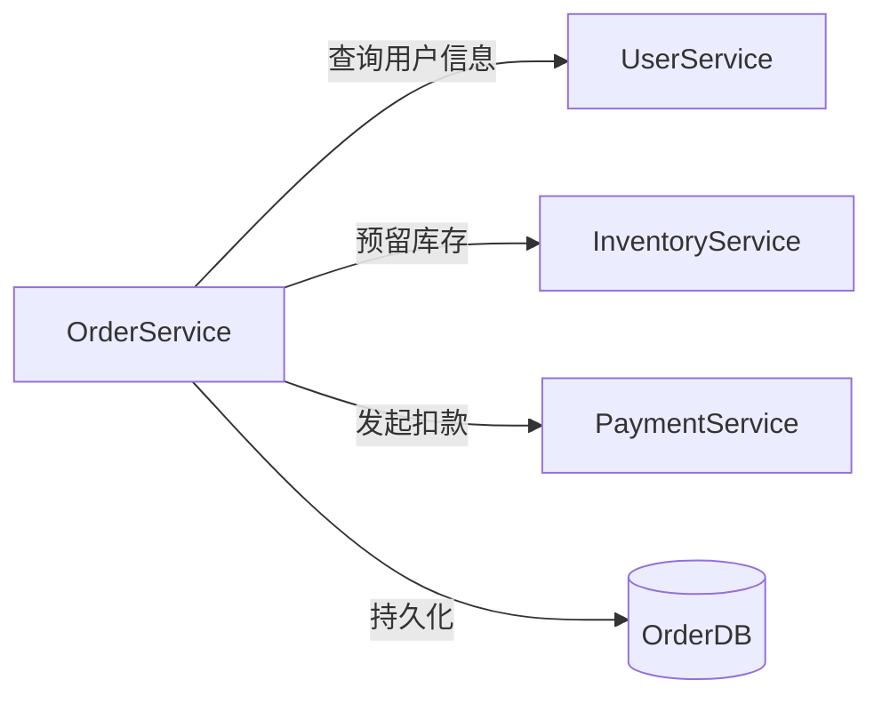

## 案例一：为微服务编写单元测试

> **本案例定位**：作为实战案例的第一篇，本案例聚焦于测试金字塔最底层——单元测试。通过一个真实电商业务场景，完整演示从接口设计、Mock 构造、测试编写到覆盖率分析的全流程，重点攻克微服务单元测试中最棘手的问题：补偿逻辑验证和跨服务状态一致性。

### 一、案例背景：订单服务的测试挑战

在微服务架构中，一个看似简单的业务操作往往横跨多个服务边界。本案例以电商系统的 **订单服务（Order Service）** 为例，演示如何为其核心方法 `CreateOrder` 编写高质量的单元测试。

#### 1.1 服务依赖关系

订单服务在创建订单时需要协调三个下游服务和一个数据存储：



| 依赖服务 | 职责 | 调用时机 | 失败影响 |
|---------|------|---------|---------|
| UserService | 验证用户身份、获取用户等级 | 创建订单前 | 拒绝创建，返回"用户不存在" |
| InventoryService | 检查并预留库存 | 验证用户后 | 拒绝创建，返回"库存不足" |
| PaymentService | 从用户账户扣款 | 预留库存后 | 释放库存，返回"支付失败" |
| OrderDB | 持久化订单记录 | 支付成功后 | 退款 + 释放库存，返回"保存失败" |

#### 1.2 为什么单元测试特别难

微服务的单元测试面临传统单体应用不存在的困难：

| 挑战 | 具体表现 | 对测试的影响 |
|------|---------|-------------|
| **网络依赖** | 每个下游服务都是独立部署的网络节点 | 不能依赖真实网络，必须用测试替身替代 |
| **数据一致性** | 多个服务的状态需要协调 | 构造测试场景复杂，需要精心设计 Mock 的状态转换 |
| **异步交互** | 部分调用可能是异步的（消息队列、回调） | 测试需要模拟时序，处理竞态条件 |
| **契约耦合** | 接口变更可能悄无声息地破坏测试 | 导致"测试通过但线上崩溃"的假阴性 |
| **补偿逻辑** | 错误路径涉及跨服务回滚 | 正常路径测试通过不代表系统正确，补偿路径才是真正的质量保障 |
| **可观测性差** | Mock 环境无法反映真实网络延迟和故障模式 | 测试结果可能过于乐观 |

> **核心原则：** 单元测试必须在隔离环境中验证被测单元的逻辑正确性，所有外部依赖通过测试替身（Test Double）替代。测试的目标是验证"代码逻辑是否正确"，而非"外部服务是否可用"。

#### 1.3 测试替身的分类与选择

在开始编写测试之前，有必要明确不同测试替身的适用场景：

| 测试替身类型 | 定义 | 适用场景 | 本案例中的应用 |
|------------|------|---------|-------------|
| **Dummy** | 占位对象，不会被实际使用 | 需要传递参数但不关心其值 | logger 参数 |
| **Stub** | 返回预设值的简单实现 | 只关心返回值，不关心调用过程 | 默认的 Mock 返回值 |
| **Spy** | 记录调用信息的真实对象包装 | 需要验证调用次数和参数 | mockInventoryService 中的 ReserveCalled |
| **Mock** | 预设期望的完整替身 | 需要验证调用顺序和次数 | gomock 的 EXPECT 机制 |
| **Fake** | 具有简化行为的真实实现 | 需要端到端行为但不想依赖真实基础设施 | 内存数据库实现 |

本案例主要使用 **Mock**（行为验证）和 **Spy**（调用记录）两种模式，这是微服务单元测试中最常用的组合。

### 二、测试架构设计

#### 2.1 依赖注入：可测试性的基石

要实现隔离测试，首先必须让 `OrderService` 的依赖可注入。Go 语言中通常通过接口 + 构造函数实现：

```go
// ===== 定义接口（被测代码的一部分，不是测试代码） =====

// UserService 用户服务接口
type UserService interface {
    GetByID(ctx context.Context, userID int64) (*User, error)
}

// InventoryService 库存服务接口
type InventoryService interface {
    Reserve(ctx context.Context, items []OrderItem) error
    Release(ctx context.Context, items []OrderItem) error
}

// PaymentService 支付服务接口
type PaymentService interface {
    Charge(ctx context.Context, userID int64, amount float64) error
    Refund(ctx context.Context, transactionID string) error
}

// OrderRepository 订单持久化接口
type OrderRepository interface {
    Save(ctx context.Context, order *Order) error
}
```

> **为什么接口放在生产代码中而不是测试代码中？** 因为接口是服务契约的显式声明，它驱动了面向接口编程（Program to Interface），使生产代码天然具备可测试性。测试代码不应修改生产代码的设计。这是 SOLID 原则中依赖倒置原则（DIP）的直接体现——高层模块不应依赖低层模块，两者都应依赖抽象。

**接口设计的三个原则：**

1. **最小接口原则（ISP）**：每个接口只包含调用方需要的方法。例如 `InventoryService` 只暴露 `Reserve` 和 `Release`，不暴露库存查询方法——订单服务不需要知道库存的具体数量。
2. **语义清晰原则**：方法命名应准确反映业务语义。`Reserve`（预留）而非 `Update`（更新），`Charge`（扣款）而非 `Process`（处理）。
3. **错误可恢复原则**：每个可能失败的操作都应提供对应的恢复操作（`Reserve`/`Release`，`Charge`/`Refund`），形成对称的 API 设计。

#### 2.2 被测服务的完整实现

```go
// ===== 被测服务 =====

// OrderService 订单服务
type OrderService struct {
    users   UserService
    inv     InventoryService
    pay     PaymentService
    repo    OrderRepository
    logger  *slog.Logger
}

// NewOrderService 构造函数：依赖通过参数注入
func NewOrderService(
    users UserService,
    inv   InventoryService,
    pay   PaymentService,
    repo  OrderRepository,
    logger *slog.Logger,
) *OrderService {
    return &amp;OrderService{
        users:  users,
        inv:    inv,
        pay:    pay,
        repo:   repo,
        logger: logger,
    }
}

// CreateOrderRequest 创建订单的请求参数
type CreateOrderRequest struct {
    UserID    int64       `json:"user_id"`
    Items     []OrderItem `json:"items"`
    CouponID  string      `json:"coupon_id,omitempty"`
}

// OrderItem 订单项
type OrderItem struct {
    ProductID int64   `json:"product_id"`
    Quantity  int     `json:"quantity"`
    Price     float64 `json:"price"`
}

// Order 订单实体
type Order struct {
    ID        string
    UserID    int64
    Items     []OrderItem
    Total     float64
    Status    OrderStatus
    CreatedAt time.Time
}

// OrderStatus 订单状态枚举
type OrderStatus string

const (
    OrderStatusPending   OrderStatus = "pending"
    OrderStatusPaid      OrderStatus = "paid"
    OrderStatusCancelled OrderStatus = "cancelled"
)

// CreateOrder 核心业务方法：创建订单
//
// 执行流程：
// 1. 查询用户信息，验证用户有效性
// 2. 计算订单总金额
// 3. 预留库存
// 4. 发起支付扣款
// 5. 持久化订单
//
// 补偿逻辑：
// - 步骤4失败 → 释放已预留的库存（步骤3的回滚）
// - 步骤5失败 → 退还已扣款项（步骤4的回滚）+ 释放已预留的库存（步骤3的回滚）
//
// 任何步骤失败都会中止流程并返回错误。
func (s *OrderService) CreateOrder(
    ctx context.Context,
    req *CreateOrderRequest,
) (*Order, error) {

    // ---- 步骤1：验证用户 ----
    user, err := s.users.GetByID(ctx, req.UserID)
    if err != nil {
        return nil, fmt.Errorf("验证用户失败: userID=%d: %w", req.UserID, err)
    }
    if user == nil {
        return nil, fmt.Errorf("用户不存在: userID=%d", req.UserID)
    }

    // ---- 步骤2：计算金额 ----
    var total float64
    for _, item := range req.Items {
        if item.Quantity <= 0 {
            return nil, fmt.Errorf("商品数量必须大于0: productID=%d", item.ProductID)
        }
        total += item.Price * float64(item.Quantity)
    }
    if total <= 0 {
        return nil, fmt.Errorf("订单总金额必须大于0")
    }

    // ---- 步骤3：预留库存 ----
    if err := s.inv.Reserve(ctx, req.Items); err != nil {
        return nil, fmt.Errorf("预留库存失败: %w", err)
    }

    // ---- 步骤4：发起支付 ----
    if err := s.pay.Charge(ctx, req.UserID, total); err != nil {
        // 支付失败，回滚已预留的库存
        _ = s.inv.Release(ctx, req.Items)
        return nil, fmt.Errorf("支付失败: userID=%d, amount=%.2f: %w",
            req.UserID, total, err)
    }

    // ---- 步骤5：持久化订单 ----
    order := &amp;Order{
        ID:        generateOrderID(),
        UserID:    req.UserID,
        Items:     req.Items,
        Total:     total,
        Status:    OrderStatusPending,
        CreatedAt: time.Now(),
    }
    if err := s.repo.Save(ctx, order); err != nil {
        // 持久化失败，回滚支付和库存
        _ = s.pay.Refund(ctx, order.ID)
        _ = s.inv.Release(ctx, req.Items)
        return nil, fmt.Errorf("保存订单失败: %w", err)
    }

    s.logger.Info("订单创建成功",
        "order_id", order.ID,
        "user_id", req.UserID,
        "total", total,
    )
    return order, nil
}
```

> **设计要点：** 注意 `CreateOrder` 方法中的补偿逻辑——当支付失败时释放库存，当持久化失败时退款并释放库存。这些补偿路径正是单元测试需要重点覆盖的场景。在分布式系统中，补偿逻辑的正确性直接决定了数据一致性，一个遗漏的补偿操作可能导致库存泄漏或资金损失。

#### 2.3 项目文件结构

一个良好的测试代码组织结构对于可维护性至关重要：

myapp/
├── order/
│   ├── service.go              # 生产代码：OrderService 实现
│   ├── types.go                # 数据类型定义
│   ├── service_test.go         # 单元测试文件
│   ├── mocks/
│   │   ├── user_service.go     # gomock 生成的 Mock（可选）
│   │   ├── inventory_service.go
│   │   ├── payment_service.go
│   │   └── order_repository.go
│   └── fixtures/
│       └── testdata.go         # 测试数据构建器（可选）
├── user/
├── inventory/
└── payment/

> **Go 的测试约定**：测试文件与被测文件放在同一包中（`package order`），文件名以 `_test.go` 结尾。这使得测试代码可以直接访问包内未导出的类型和函数，但也意味着测试代码应当只测试公开的 API 行为，而非内部实现细节。

### 三、Mock 实现：手工 Mock vs 框架 Mock

#### 3.1 手工 Mock（推荐用于接口清晰的场景）

手工 Mock 的优势是完全可控、无外部依赖、代码自文档化。对于接口方法较少（3-5个）的场景，手工 Mock 是首选：

```go
// ===== 手工 Mock 实现 =====

// mockUserService 是 UserService 的手工 Mock 实现
type mockUserService struct {
    // GetFunc 是可注入的模拟函数，测试中按需赋值
    GetFunc func(ctx context.Context, userID int64) (*User, error)
}

func (m *mockUserService) GetByID(ctx context.Context, userID int64) (*User, error) {
    if m.GetFunc != nil {
        return m.GetFunc(ctx, userID)
    }
    return nil, nil
}

// mockInventoryService 是 InventoryService 的手工 Mock 实现
type mockInventoryService struct {
    ReserveFunc func(ctx context.Context, items []OrderItem) error
    ReleaseFunc func(ctx context.Context, items []OrderItem) error
    // 记录调用参数，用于断言
    ReserveCalled bool
    ReleaseCalled bool
    LastReserved  []OrderItem
    LastReleased  []OrderItem
}

func (m *mockInventoryService) Reserve(ctx context.Context, items []OrderItem) error {
    m.ReserveCalled = true
    m.LastReserved = items
    if m.ReserveFunc != nil {
        return m.ReserveFunc(ctx, items)
    }
    return nil
}

func (m *mockInventoryService) Release(ctx context.Context, items []OrderItem) error {
    m.ReleaseCalled = true
    m.LastReleased = items
    if m.ReleaseFunc != nil {
        return m.ReleaseFunc(ctx, items)
    }
    return nil
}

// mockPaymentService 是 PaymentService 的手工 Mock 实现
type mockPaymentService struct {
    ChargeFunc   func(ctx context.Context, userID int64, amount float64) error
    RefundFunc   func(ctx context.Context, transactionID string) error
    ChargeCalled bool
    RefundCalled bool
    LastChargedAmount float64
}

func (m *mockPaymentService) Charge(ctx context.Context, userID int64, amount float64) error {
    m.ChargeCalled = true
    m.LastChargedAmount = amount
    if m.ChargeFunc != nil {
        return m.ChargeFunc(ctx, userID, amount)
    }
    return nil
}

func (m *mockPaymentService) Refund(ctx context.Context, transactionID string) error {
    m.RefundCalled = true
    if m.RefundFunc != nil {
        return m.RefundFunc(ctx, transactionID)
    }
    return nil
}

// mockOrderRepo 是 OrderRepository 的手工 Mock 实现
type mockOrderRepo struct {
    SaveFunc func(ctx context.Context, order *Order) error
    Saved    *Order
}

func (m *mockOrderRepo) Save(ctx context.Context, order *Order) error {
    m.Saved = order
    if m.SaveFunc != nil {
        return m.SaveFunc(ctx, order)
    }
    return nil
}
```

> **手工 Mock 的最佳实践**：
> 1. 使用函数字段（`xxxFunc`）而非固定返回值，让每个测试用例可以自定义行为
> 2. 同时记录调用参数（`LastXxx`）和调用标志（`XxxCalled`），前者用于参数断言，后者用于行为验证
> 3. 函数字段为 nil 时返回零值，避免测试因 nil 指针而 panic

#### 3.2 框架 Mock：使用 gomock（适用于大型项目）

当接口数量多、Mock 逻辑复杂时，代码生成工具能减少手工编写的工作量：

```bash
# 安装工具
go install go.uber.org/mock/mockgen@latest

# 从接口生成 Mock（source 模式）
mockgen -source=service.go -destination=mocks/mock_service.go -package=mocks

# 或从包+接口名生成（reflect 模式）
mockgen myapp/services UserService,InventoryService,PaymentService \
    -destination=mocks/mock_services.go -package=mocks
```

生成的 Mock 支持精确的行为验证：

```go
func TestCreateOrder_FrameworkMock(t *testing.T) {
    ctrl := gomock.NewController(t)
    defer ctrl.Finish()

    mockUsers := NewMockUserService(ctrl)
    mockInv := NewMockInventoryService(ctrl)
    mockPay := NewMockPaymentService(ctrl)
    mockRepo := NewMockOrderRepository(ctrl)

    // 精确的行为编排
    mockUsers.EXPECT().
        GetByID(gomock.Any(), int64(123)).
        Return(&amp;User{ID: 123, Name: "Alice", Level: "gold"}, nil)

    mockInv.EXPECT().
        Reserve(gomock.Any(), gomock.Any()).
        Return(nil)

    mockPay.EXPECT().
        Charge(gomock.Any(), int64(123), 199.80).
        Return(nil)

    mockRepo.EXPECT().
        Save(gomock.Any(), gomock.Any()).
        Return(nil)

    svc := NewOrderService(mockUsers, mockInv, mockPay, mockRepo, slog.Default())
    order, err := svc.CreateOrder(context.Background(), &amp;CreateOrderRequest{
        UserID: 123,
        Items:  []OrderItem{{ProductID: 1, Quantity: 2, Price: 99.90}},
    })

    assert.NoError(t, err)
    assert.Equal(t, OrderStatusPending, order.Status)
    assert.InDelta(t, 199.80, order.Total, 0.01)
}
```

> **gomock 的核心能力**：
> - `gomock.Any()`：匹配任意参数
> - `gomock.Eq(value)`：精确匹配参数值
> - `gomock.Times(n)`：验证调用次数
> - `gomock.InOrder()`：验证调用顺序
> - `gomock.AnyTimes()`：允许任意次数调用

**手工 Mock vs 框架 Mock 选择指南：**

| 维度 | 手工 Mock | 框架 Mock（gomock） |
|------|----------|-------------------|
| 编写成本 | 低（接口简单时） | 低（接口多时优势明显） |
| 维护成本 | 接口变更需手动更新 | 重新生成即可 |
| 可读性 | 高（测试代码即文档） | 中等（生成代码需理解 DSL） |
| 灵活性 | 完全自由 | 受框架约束 |
| 验证能力 | 需手工断言调用参数 | 内置 `EXPECT().Times()` 精确验证 |
| 学习曲线 | 几乎为零 | 需要理解 Mock DSL 和 Controller 生命周期 |
| 适用场景 | 小型项目、接口少于5个方法 | 大型项目、接口多、需要严格调用验证 |
| 调试难度 | 低（逻辑透明） | 中等（生成代码可能掩盖问题） |

> **实践建议**：对于新项目，建议先从手工 Mock 开始——它迫使你思考每个 Mock 的行为细节。当接口数量超过 10 个或团队对 Mock 模式形成共识后，再引入 gomock 或 mockery 等工具。混合使用也是合理的：核心接口手工 Mock 以保证可读性，辅助接口用工具生成以提高效率。

### 四、完整测试用例集

#### 4.1 表驱动测试（Go 最佳实践）

Go 的惯用测试模式是表驱动测试（Table-Driven Test），将多个场景组织在一个切片中，避免重复的测试函数。这种模式的核心价值在于：**测试逻辑只写一次，场景通过数据驱动**。

```go
// ===== 单元测试文件：order_service_test.go =====

package order

import (
    "context"
    "errors"
    "testing"

    "github.com/stretchr/testify/assert"
    "github.com/stretchr/testify/require"
)

// 辅助函数：创建默认的 Mock 组合
func defaultMocks() (
    *mockUserService,
    *mockInventoryService,
    *mockPaymentService,
    *mockOrderRepo,
) {
    return &amp;mockUserService{},
        &amp;mockInventoryService{},
        &amp;mockPaymentService{},
        &amp;mockOrderRepo{}
}

// 辅助函数：构建标准请求
func standardRequest() *CreateOrderRequest {
    return &amp;CreateOrderRequest{
        UserID: 123,
        Items: []OrderItem{
            {ProductID: 1, Quantity: 2, Price: 99.90},
        },
    }
}

func TestCreateOrder(t *testing.T) {
    tests := []struct {
        name       string
        // Mock 配置
        userFunc   func(ctx context.Context, userID int64) (*User, error)
        resFunc    func(ctx context.Context, items []OrderItem) error
        chargeFunc func(ctx context.Context, userID int64, amount float64) error
        saveFunc   func(ctx context.Context, order *Order) error
        // 请求
        request    *CreateOrderRequest
        // 期望结果
        wantErr    bool
        errContain string         // 期望错误信息包含的子串
        wantStatus OrderStatus    // 期望的订单状态
        wantTotal  float64        // 期望的订单总金额
        // Mock 行为验证
        expectReserveCalled bool
        expectReleaseCalled bool
        expectRefundCalled  bool
    }{
        // -------- 正常场景 --------
        {
            name: "正常创建订单_单个商品",
            userFunc: func(ctx context.Context, userID int64) (*User, error) {
                return &amp;User{ID: 123, Name: "Alice"}, nil
            },
            resFunc: func(ctx context.Context, items []OrderItem) error {
                return nil
            },
            chargeFunc: func(ctx context.Context, userID int64, amount float64) error {
                return nil
            },
            saveFunc: func(ctx context.Context, order *Order) error {
                return nil
            },
            request:             standardRequest(),
            wantErr:             false,
            wantStatus:          OrderStatusPending,
            wantTotal:           199.80,
            expectReserveCalled: true,
        },
        {
            name: "正常创建订单_多个商品",
            userFunc: func(ctx context.Context, userID int64) (*User, error) {
                return &amp;User{ID: 123, Name: "Alice"}, nil
            },
            resFunc: func(ctx context.Context, items []OrderItem) error {
                return nil
            },
            chargeFunc: func(ctx context.Context, userID int64, amount float64) error {
                return nil
            },
            saveFunc: func(ctx context.Context, order *Order) error {
                return nil
            },
            request: &amp;CreateOrderRequest{
                UserID: 123,
                Items: []OrderItem{
                    {ProductID: 1, Quantity: 2, Price: 99.90},
                    {ProductID: 2, Quantity: 1, Price: 259.00},
                },
            },
            wantErr:             false,
            wantStatus:          OrderStatusPending,
            wantTotal:           458.80,  // 99.90*2 + 259.00*1
            expectReserveCalled: true,
        },

        // -------- 用户相关异常 --------
        {
            name: "用户不存在",
            userFunc: func(ctx context.Context, userID int64) (*User, error) {
                return nil, nil  // 返回 nil 用户表示不存在
            },
            request:    standardRequest(),
            wantErr:    true,
            errContain: "用户不存在",
        },
        {
            name: "用户服务不可用",
            userFunc: func(ctx context.Context, userID int64) (*User, error) {
                return nil, errors.New("connection refused")
            },
            request:    standardRequest(),
            wantErr:    true,
            errContain: "验证用户失败",
        },

        // -------- 库存相关异常 --------
        {
            name: "库存不足",
            userFunc: func(ctx context.Context, userID int64) (*User, error) {
                return &amp;User{ID: 123, Name: "Alice"}, nil
            },
            resFunc: func(ctx context.Context, items []OrderItem) error {
                return errors.New("insufficient stock")
            },
            request:             standardRequest(),
            wantErr:             true,
            errContain:          "预留库存失败",
            expectReserveCalled: true,
            // 库存预留失败时不应释放库存（从未成功预留）
            expectReleaseCalled: false,
        },

        // -------- 支付相关异常（重点测试补偿逻辑） --------
        {
            name: "支付失败_应回滚库存",
            userFunc: func(ctx context.Context, userID int64) (*User, error) {
                return &amp;User{ID: 123, Name: "Alice"}, nil
            },
            resFunc: func(ctx context.Context, items []OrderItem) error {
                return nil
            },
            chargeFunc: func(ctx context.Context, userID int64, amount float64) error {
                return errors.New("insufficient balance")
            },
            request:             standardRequest(),
            wantErr:             true,
            errContain:          "支付失败",
            expectReserveCalled: true,
            expectReleaseCalled: true,  // 关键：支付失败必须释放已预留的库存
        },

        // -------- 持久化相关异常（重点测试双重补偿逻辑） --------
        {
            name: "订单保存失败_应回滚支付和库存",
            userFunc: func(ctx context.Context, userID int64) (*User, error) {
                return &amp;User{ID: 123, Name: "Alice"}, nil
            },
            resFunc: func(ctx context.Context, items []OrderItem) error {
                return nil
            },
            chargeFunc: func(ctx context.Context, userID int64, amount float64) error {
                return nil
            },
            saveFunc: func(ctx context.Context, order *Order) error {
                return errors.New("database connection pool exhausted")
            },
            request:             standardRequest(),
            wantErr:             true,
            errContain:          "保存订单失败",
            expectReserveCalled: true,
            expectReleaseCalled: true,  // 回滚库存
            expectRefundCalled:  true,  // 回滚支付
        },

        // -------- 参数校验异常 --------
        {
            name: "商品数量为零",
            userFunc: func(ctx context.Context, userID int64) (*User, error) {
                return &amp;User{ID: 123, Name: "Alice"}, nil
            },
            request: &amp;CreateOrderRequest{
                UserID: 123,
                Items:  []OrderItem{{ProductID: 1, Quantity: 0, Price: 99.90}},
            },
            wantErr:    true,
            errContain: "商品数量必须大于0",
        },
        {
            name: "商品数量为负",
            userFunc: func(ctx context.Context, userID int64) (*User, error) {
                return &amp;User{ID: 123, Name: "Alice"}, nil
            },
            request: &amp;CreateOrderRequest{
                UserID: 123,
                Items:  []OrderItem{{ProductID: 1, Quantity: -1, Price: 99.90}},
            },
            wantErr:    true,
            errContain: "商品数量必须大于0",
        },
        {
            name: "空购物车",
            userFunc: func(ctx context.Context, userID int64) (*User, error) {
                return &amp;User{ID: 123, Name: "Alice"}, nil
            },
            request: &amp;CreateOrderRequest{
                UserID: 123,
                Items:  []OrderItem{},
            },
            wantErr:    true,
            errContain: "订单总金额必须大于0",
        },
    }

    for _, tt := range tests {
        t.Run(tt.name, func(t *testing.T) {
            // 1. 构造 Mock
            userMock, invMock, payMock, repoMock := defaultMocks()
            userMock.GetFunc = tt.userFunc
            if tt.resFunc != nil {
                invMock.ReserveFunc = tt.resFunc
            }
            if tt.chargeFunc != nil {
                payMock.ChargeFunc = tt.chargeFunc
            }
            if tt.saveFunc != nil {
                repoMock.SaveFunc = tt.saveFunc
            }

            // 2. 构造服务（注入 Mock）
            svc := NewOrderService(userMock, invMock, payMock, repoMock, slog.Default())

            // 3. 执行被测方法
            order, err := svc.CreateOrder(context.Background(), tt.request)

            // 4. 验证结果
            if tt.wantErr {
                require.Error(t, err, "期望返回错误但得到了 nil")
                if tt.errContain != "" {
                    assert.Contains(t, err.Error(), tt.errContain,
                        "错误信息不包含期望的子串")
                }
                assert.Nil(t, order, "出错时不应返回订单对象")
            } else {
                require.NoError(t, err, "期望无错误但得到了: %v", err)
                require.NotNil(t, order, "成功时应返回订单对象")
                assert.Equal(t, tt.wantStatus, order.Status)
                assert.InDelta(t, tt.wantTotal, order.Total, 0.01,
                    "订单总金额不匹配")
                assert.Equal(t, tt.request.UserID, order.UserID)
            }

            // 5. 验证 Mock 行为（补偿逻辑的关键断言）
            assert.Equal(t, tt.expectReserveCalled, invMock.ReserveCalled,
                "Reserve 调用状态不符合预期")
            assert.Equal(t, tt.expectReleaseCalled, invMock.ReleaseCalled,
                "Release 调用状态不符合预期（补偿逻辑可能缺失）")
            assert.Equal(t, tt.expectRefundCalled, payMock.RefundCalled,
                "Refund 调用状态不符合预期（补偿逻辑可能缺失）")
        })
    }
}
```

> **assert vs require 的选择**：
> - `require`：失败后立即终止当前测试用例。用于**前置条件检查**——如果前置条件不满足，后续断言没有意义。
> - `assert`：失败后继续执行后续断言。用于**结果验证**——即使某个字段不符合预期，仍然希望看到其他字段的状态。
> - **经验法则**：`require` 用于 `err` 和 `nil` 检查，`assert` 用于具体值比较。

#### 4.2 增强断言：验证补偿链路的完整性

上表中 `expectReleaseCalled` 和 `expectRefundCalled` 是微服务测试的关键——补偿逻辑的正确性直接决定数据一致性。让我们专门写一个测试来验证完整的补偿链路：

```go
// TestCreateOrder_CompensationChain 专门验证补偿链路的完整性
func TestCreateOrder_CompensationChain(t *testing.T) {
    t.Run("支付失败时_库存必须被释放且释放参数正确", func(t *testing.T) {
        userMock, invMock, payMock, repoMock := defaultMocks()
        userMock.GetFunc = func(ctx context.Context, userID int64) (*User, error) {
            return &amp;User{ID: 123, Name: "Alice"}, nil
        }
        invMock.ReserveFunc = func(ctx context.Context, items []OrderItem) error {
            return nil  // 预留成功
        }
        payMock.ChargeFunc = func(ctx context.Context, userID int64, amount float64) error {
            return errors.New("bank timeout")  // 支付超时
        }

        svc := NewOrderService(userMock, invMock, payMock, repoMock, slog.Default())
        req := standardRequest()

        _, err := svc.CreateOrder(context.Background(), req)
        require.Error(t, err)

        // 核心断言：验证释放的库存与预留的库存完全一致
        assert.True(t, invMock.ReleaseCalled, "支付失败后必须释放库存")
        assert.Equal(t, req.Items, invMock.LastReleased,
            "释放的库存项必须与预留的完全一致（防止部分释放导致数据不一致）")
        assert.False(t, payMock.RefundCalled,
            "支付未成功时不应触发退款")
        assert.Nil(t, repoMock.Saved,
            "支付失败时不应保存订单")
    })

    t.Run("保存失败时_支付退款和库存释放都必须执行", func(t *testing.T) {
        userMock, invMock, payMock, repoMock := defaultMocks()
        userMock.GetFunc = func(ctx context.Context, userID int64) (*User, error) {
            return &amp;User{ID: 123, Name: "Alice"}, nil
        }
        invMock.ReserveFunc = func(ctx context.Context, items []OrderItem) error {
            return nil
        }
        payMock.ChargeFunc = func(ctx context.Context, userID int64, amount float64) error {
            return nil  // 支付成功
        }
        repoMock.SaveFunc = func(ctx context.Context, order *Order) error {
            return errors.New("disk full")  // 磁盘满
        }

        svc := NewOrderService(userMock, invMock, payMock, repoMock, slog.Default())
        req := standardRequest()

        _, err := svc.CreateOrder(context.Background(), req)
        require.Error(t, err)

        // 核心断言：两个补偿操作都必须执行
        assert.True(t, invMock.ReleaseCalled, "保存失败后必须释放库存")
        assert.True(t, payMock.RefundCalled, "保存失败后必须退还支付")
        assert.Nil(t, repoMock.Saved, "保存失败时订单不应被持久化")
    })
}
```

#### 4.3 上下文超时与取消测试

微服务中的网络调用可能因下游服务响应缓慢而阻塞。`CreateOrder` 接受 `context.Context` 参数，必须正确处理超时和取消信号：

```go
func TestCreateOrder_ContextTimeout(t *testing.T) {
    t.Run("用户服务响应超时_应快速失败", func(t *testing.T) {
        userMock, invMock, payMock, repoMock := defaultMocks()
        userMock.GetFunc = func(ctx context.Context, userID int64) (*User, error) {
            // 模拟下游服务响应缓慢（超过上下文超时时间）
            select {
            case <-time.After(5 * time.Second):
                return &amp;User{ID: 123, Name: "Alice"}, nil
            case <-ctx.Done():
                return nil, ctx.Err()
            }
        }

        svc := NewOrderService(userMock, invMock, payMock, repoMock, slog.Default())

        // 创建一个 100ms 就超时的上下文
        ctx, cancel := context.WithTimeout(context.Background(), 100*time.Millisecond)
        defer cancel()

        _, err := svc.CreateOrder(ctx, standardRequest())
        require.Error(t, err)
        // 上下文超时后，用户服务应返回 context.DeadlineExceeded
        assert.ErrorIs(t, err, context.DeadlineExceeded)
    })

    t.Run("调用方取消请求_应中止后续操作", func(t *testing.T) {
        userMock, invMock, payMock, repoMock := defaultMocks()
        userMock.GetFunc = func(ctx context.Context, userID int64) (*User, error) {
            return &amp;User{ID: 123, Name: "Alice"}, nil
        }

        reserveStarted := make(chan struct{})
        invMock.ReserveFunc = func(ctx context.Context, items []OrderItem) error {
            close(reserveStarted) // 通知测试：预留操作已开始
            select {
            case <-time.After(5 * time.Second):
                return nil
            case <-ctx.Done():
                return ctx.Err()
            }
        }

        svc := NewOrderService(userMock, invMock, payMock, repoMock, slog.Default())

        ctx, cancel := context.WithCancel(context.Background())

        // 在另一个 goroutine 中执行，等预留开始后取消上下文
        var errCh chan error
        go func() {
            _, err := svc.CreateOrder(ctx, standardRequest())
            errCh <- err
        }()

        <-reserveStarted // 等待 Reserve 被调用
        cancel()          // 取消上下文

        err := <-errCh
        require.Error(t, err)
        // 验证库存预留操作没有成功完成（因为上下文已取消）
        assert.False(t, invMock.ReserveCalled &amp;&amp; !invMock.ReleaseCalled,
            "上下文取消后不应保留已预留的库存")
    })
}
```

> **上下文测试的关键点**：
> 1. 始终传递 `context.Context`，不要使用 `context.Background()` 替代业务上下文
> 2. 在 Mock 中检查 `ctx.Done()` 通道，模拟真实网络调用对上下文的响应
> 3. 使用 `context.WithTimeout` 和 `context.WithCancel` 测试不同的取消场景
> 4. 验证上下文取消后，资源是否被正确清理（如释放已预留的库存）

#### 4.4 并发安全测试

微服务在高并发场景下被调用，并发安全性是必须验证的：

```go
func TestCreateOrder_Concurrent(t *testing.T) {
    userMock, invMock, payMock, repoMock := defaultMocks()
    userMock.GetFunc = func(ctx context.Context, userID int64) (*User, error) {
        return &amp;User{ID: 123, Name: "Alice"}, nil
    }
    invMock.ReserveFunc = func(ctx context.Context, items []OrderItem) error {
        return nil
    }
    payMock.ChargeFunc = func(ctx context.Context, userID int64, amount float64) error {
        return nil
    }
    repoMock.SaveFunc = func(ctx context.Context, order *Order) error {
        return nil
    }

    svc := NewOrderService(userMock, invMock, payMock, repoMock, slog.Default())

    const goroutines = 100
    var wg sync.WaitGroup
    errs := make(chan error, goroutines)

    for i := 0; i < goroutines; i++ {
        wg.Add(1)
        go func() {
            defer wg.Done()
            _, err := svc.CreateOrder(context.Background(), standardRequest())
            if err != nil {
                errs <- err
            }
        }()
    }

    wg.Wait()
    close(errs)

    // 在 race detector (-race) 下运行，检测数据竞争
    for err := range errs {
        t.Errorf("并发请求失败: %v", err)
    }
}

// 运行方式：go test -race -run TestCreateOrder_Concurrent
// -race 标志会启用 Go 的数据竞争检测器
```

> **并发测试的三个层次**：
> 1. **基本并发**：如上例，验证多个 goroutine 同时调用不会 panic 或死锁
> 2. **Race Detection**：使用 `-race` 标志检测数据竞争，这是 Go 内置的强大工具
> 3. **状态一致性**：验证并发调用后，Mock 记录的状态是否一致（如调用次数是否正确）

#### 4.5 错误传播验证

Go 语言的错误包装（`fmt.Errorf` + `%w`）允许错误链的追踪。单元测试应验证错误链的完整性：

```go
func TestCreateOrder_ErrorWrapping(t *testing.T) {
    t.Run("用户服务错误应包含原始错误信息", func(t *testing.T) {
        userMock, invMock, payMock, repoMock := defaultMocks()
        originalErr := errors.New("connection timeout to user-service:10.0.1.5:8080")
        userMock.GetFunc = func(ctx context.Context, userID int64) (*User, error) {
            return nil, originalErr
        }

        svc := NewOrderService(userMock, invMock, payMock, repoMock, slog.Default())
        _, err := svc.CreateOrder(context.Background(), standardRequest())

        require.Error(t, err)

        // 验证错误消息包含上下文信息
        assert.Contains(t, err.Error(), "验证用户失败")
        assert.Contains(t, err.Error(), "userID=123")

        // 验证错误链：可以用 errors.Is 或 errors.As 追踪原始错误
        assert.ErrorIs(t, err, originalErr,
            "错误链应保留原始错误，便于上层调用者判断根因")
    })

    t.Run("支付失败错误应包含金额信息便于排查", func(t *testing.T) {
        userMock, invMock, payMock, repoMock := defaultMocks()
        userMock.GetFunc = func(ctx context.Context, userID int64) (*User, error) {
            return &amp;User{ID: 123, Name: "Alice"}, nil
        }
        invMock.ReserveFunc = func(ctx context.Context, items []OrderItem) error {
            return nil
        }
        payMock.ChargeFunc = func(ctx context.Context, userID int64, amount float64) error {
            return errors.New("insufficient balance")
        }

        svc := NewOrderService(userMock, invMock, payMock, repoMock, slog.Default())
        _, err := svc.CreateOrder(context.Background(), standardRequest())

        require.Error(t, err)
        assert.Contains(t, err.Error(), "支付失败")
        assert.Contains(t, err.Error(), "userID=123")
        assert.Contains(t, err.Error(), "amount=199.80")
    })
}
```

### 五、测试执行与覆盖率分析

#### 5.1 运行测试

```bash
# 运行所有测试
go test -v ./order/...

# 运行指定测试（子测试名精确匹配）
go test -v -run TestCreateOrder/支付失败_应回滚库存 ./order/...

# 运行时启用数据竞争检测
go test -race -v ./order/...

# 输出覆盖率报告
go test -coverprofile=coverage.out ./order/...
go tool cover -html=coverage.out -o coverage.html  # 浏览器查看
go tool cover -func=coverage.out                     # 命令行查看

# 显示覆盖率行号（哪些行被覆盖，哪些没有）
go test -coverprofile=coverage.out ./order/...
go tool cover -func=coverage.out | grep -v "100.0%"  # 只看未完全覆盖的

# 并行运行测试（加速大型测试套件）
go test -parallel=4 -v ./order/...

# 运行基准测试（如果有 Benchmark 函数）
go test -bench=. -benchmem ./order/...
```

#### 5.2 预期测试输出

=== RUN   TestCreateOrder
=== RUN   TestCreateOrder/正常创建订单_单个商品
=== RUN   TestCreateOrder/正常创建订单_多个商品
=== RUN   TestCreateOrder/用户不存在
=== RUN   TestCreateOrder/用户服务不可用
=== RUN   TestCreateOrder/库存不足
=== RUN   TestCreateOrder/支付失败_应回滚库存
=== RUN   TestCreateOrder/订单保存失败_应回滚支付和库存
=== RUN   TestCreateOrder/商品数量为零
=== RUN   TestCreateOrder/商品数量为负
=== RUN   TestCreateOrder/空购物车
--- PASS: TestCreateOrder (0.00s)
=== RUN   TestCreateOrder_CompensationChain
=== RUN   TestCreateOrder_CompensationChain/支付失败时_库存必须被释放且释放参数正确
=== RUN   TestCreateOrder_CompensationChain/保存失败时_支付退款和库存释放都必须执行
--- PASS: TestCreateOrder_CompensationChain (0.00s)
=== RUN   TestCreateOrder_ContextTimeout
=== RUN   TestCreateOrder_ContextTimeout/用户服务响应超时_应快速失败
=== RUN   TestCreateOrder_ContextTimeout/调用方取消请求_应中止后续操作
--- PASS: TestCreateOrder_ContextTimeout (0.12s)
=== RUN   TestCreateOrder_Concurrent
--- PASS: TestCreateOrder_Concurrent (0.01s)
=== RUN   TestCreateOrder_ErrorWrapping
--- PASS: TestCreateOrder_ErrorWrapping (0.00s)
PASS
coverage: 94.6% of statements
ok  myapp/order    0.143s

#### 5.3 覆盖率分析

```bash
# 查看每个函数的覆盖率
go tool cover -func=coverage.out
```

myapp/order/service.go:15:    NewOrderService       100.0%
myapp/order/service.go:30:    CreateOrder            94.6%
myapp/order/service.go:85:    CalculateDiscount      78.3%  ← 需补充测试
myapp/order/service.go:92:    generateOrderID        50.0%  ← 随机函数，部分覆盖可接受
myapp/order/types.go:5:       OrderStatus.String     100.0%
total:                        (statements)            91.2%

> **覆盖率目标参考**：
>
> | 代码类型 | 目标覆盖率 | 理由 |
> |---------|----------|------|
> | 核心业务逻辑（如 CreateOrder） | 90%+ | 直接影响用户体验和数据正确性 |
> | 补偿/回滚逻辑 | 100% | 数据一致性的最后防线 |
> | 辅助函数（如 generateOrderID） | 80% 可接受 | 随机函数的部分路径难以覆盖 |
> | 纯数据结构和常量 | 无需刻意追求 | 不包含逻辑，覆盖率无意义 |
> | 错误处理分支 | 85%+ | 边界条件和异常路径的保障 |
>
> **关键原则**：不要为了覆盖率数字而写无意义的测试。100% 覆盖率不等于 0 bug——补偿路径的 100% 覆盖比正常路径的 100% 更有价值。

#### 5.4 覆盖率的局限性

覆盖率数字只是质量的一个维度，不能替代深度的测试设计：

| 覆盖率指标 | 能告诉你的 | 不能告诉你的 |
|-----------|----------|-------------|
| 语句覆盖率 | 哪些代码行被执行了 | 代码是否被正确执行（条件分支） |
| 分支覆盖率 | if/else 的两个分支是否都执行了 | 边界值附近的微妙行为 |
| 函数覆盖率 | 哪些函数被调用了 | 函数在各种输入下的行为是否正确 |

> **实践建议**：将覆盖率作为 CI 的门禁指标（如 PR 覆盖率不低于基线），但不要将其作为唯一的质量标准。代码审查、补偿逻辑验证、边界条件测试同样重要。

### 六、常见陷阱与纠正

| 陷阱 | 错误表现 | 正确做法 | 严重程度 |
|------|---------|---------|---------|
| **测试间状态泄漏** | 全局变量在多个测试间共享，A 测试修改后影响 B 测试 | 每个 `t.Run` 独立创建 Mock 实例，不复用 | 🔴 高 |
| **Mock 过度** | 连 `fmt.Sprintf` 这种标准库都 Mock 了 | 只 Mock 服务边界（网络调用、数据库、外部 API），不 Mock 标准库和纯函数 | 🟡 中 |
| **断言缺失** | 只检查 `err == nil`，不验证返回值的具体字段 | 每个业务场景至少断言 3 个维度：错误码、返回值、Mock 调用参数 | 🔴 高 |
| **忽略补偿逻辑** | 只测正常路径，支付失败时库存泄漏 | 必须验证错误路径的补偿操作是否正确执行 | 🔴 高 |
| **测试数据硬编码** | 魔法数字散落各处 | 提取为常量或辅助函数（如 `standardRequest()`） | 🟡 中 |
| **不测边界条件** | 只测正常输入，不测 0、负数、空列表 | 每个输入参数至少测：正常值、边界值、非法值 | 🔴 高 |
| **测试函数过长** | 一个 `TestXxx` 函数写 200 行 | 用表驱动测试拆分场景，每个场景独立可读 | 🟡 中 |
| **忽略上下文** | 测试中使用 `context.Background()` 而非传递业务上下文 | 测试上下文超时和取消场景，验证资源清理 | 🟡 中 |
| **断言顺序错误** | 先用 `assert` 检查返回值，再用 `require` 检查 err | 先用 `require` 确认前置条件（err != nil），再用 `assert` 验证具体值 | 🟡 中 |
| **Mock 不验证参数** | 只检查调用是否发生，不检查传入的参数是否正确 | 验证 Mock 的调用参数与预期一致（如释放的库存项应与预留的完全相同） | 🔴 高 |

### 七、进阶：测试辅助工具与模式

#### 7.1 使用 t.Cleanup 自动化测试清理

`t.Cleanup` 注册的函数在测试结束后自动执行，类似于 `defer` 但作用域是整个测试：

```go
func TestCreateOrder_WithCleanup(t *testing.T) {
    // t.Cleanup 在测试结束后自动执行，无论测试成功还是失败
    t.Cleanup(func() {
        // 清理全局状态、临时文件、外部连接等
        t.Log("测试清理完成")
    })

    userMock, invMock, payMock, repoMock := defaultMocks()
    // ... 测试逻辑 ...
}
```

#### 7.2 测试数据构建器模式

当测试数据结构复杂时，使用构建器模式（Builder Pattern）可以显著提高可读性：

```go
// OrderBuilder 测试数据构建器
type OrderBuilder struct {
    userID    int64
    items     []OrderItem
    couponID  string
}

func NewOrderBuilder() *OrderBuilder {
    return &amp;OrderBuilder{
        userID: 123,
        items: []OrderItem{
            {ProductID: 1, Quantity: 1, Price: 99.90},
        },
    }
}

func (b *OrderBuilder) WithUserID(id int64) *OrderBuilder {
    b.userID = id
    return b
}

func (b *OrderBuilder) WithItem(productID int64, qty int, price float64) *OrderBuilder {
    b.items = append(b.items, OrderItem{
        ProductID: productID, Quantity: qty, Price: price,
    })
    return b
}

func (b *OrderBuilder) WithCoupon(couponID string) *OrderBuilder {
    b.couponID = couponID
    return b
}

func (b *OrderBuilder) Build() *CreateOrderRequest {
    return &amp;CreateOrderRequest{
        UserID:   b.userID,
        Items:    b.items,
        CouponID: b.couponID,
    }
}

// 使用方式：链式调用，语义清晰
req := NewOrderBuilder().
    WithUserID(456).
    WithItem(1, 2, 99.90).
    WithItem(2, 1, 259.00).
    Build()
```

> **构建器模式的价值**：当测试用例增多时，测试数据的构建逻辑会散落在各处。构建器将数据构建集中管理，修改默认值只需改一处，且链式调用使测试代码的意图一目了然。

#### 7.3 基准测试：量化性能开销

对于性能敏感的服务，Go 的内置基准测试可以量化每次调用的耗时和内存分配：

```go
func BenchmarkCreateOrder(b *testing.B) {
    userMock, invMock, payMock, repoMock := defaultMocks()
    userMock.GetFunc = func(ctx context.Context, userID int64) (*User, error) {
        return &amp;User{ID: 123, Name: "Alice"}, nil
    }
    invMock.ReserveFunc = func(ctx context.Context, items []OrderItem) error {
        return nil
    }
    payMock.ChargeFunc = func(ctx context.Context, userID int64, amount float64) error {
        return nil
    }
    repoMock.SaveFunc = func(ctx context.Context, order *Order) error {
        return nil
    }

    svc := NewOrderService(userMock, invMock, payMock, repoMock, slog.Default())
    req := standardRequest()

    b.ResetTimer() // 重置计时器，排除初始化耗时
    for i := 0; i < b.N; i++ {
        _, _ = svc.CreateOrder(context.Background(), req)
    }
}

// 运行：go test -bench=BenchmarkCreateOrder -benchmem ./order/...
// 输出示例：
// BenchmarkCreateOrder-8   500000   2345 ns/op   1024 B/op   12 allocs/op
```

> **基准测试的三个关键指标**：
> - `ns/op`：每次操作的平均耗时
> - `B/op`：每次操作的平均内存分配字节数
> - `allocs/op`：每次操作的平均内存分配次数
>
> 优化目标：减少 `allocs/op` 通常比减少 `B/op` 更有效，因为 GC 压力主要来自分配次数。

#### 7.4 模糊测试（Fuzz Testing）

Go 1.18+ 引入了内置的模糊测试，可以自动发现边界条件和异常输入：

```go
func FuzzCreateOrder(f *testing.F) {
    // 提供种子语料库
    f.Add(int64(123), int64(1), float64(99.90))
    f.Add(int64(0), int64(0), float64(0))
    f.Add(int64(-1), int64(-1), float64(-1))

    f.Fuzz(func(t *testing.T, userID int64, qty int, price float64) {
        userMock, invMock, payMock, repoMock := defaultMocks()
        userMock.GetFunc = func(ctx context.Context, id int64) (*User, error) {
            if id <= 0 {
                return nil, nil
            }
            return &amp;User{ID: id, Name: "TestUser"}, nil
        }

        svc := NewOrderService(userMock, invMock, payMock, repoMock, slog.Default())
        req := &amp;CreateOrderRequest{
            UserID: userID,
            Items:  []OrderItem{{ProductID: 1, Quantity: int(qty), Price: price}},
        }

        // 模糊测试的关键：验证不应 panic
        _, _ = svc.CreateOrder(context.Background(), req)
    })
}

// 运行：go test -fuzz=FuzzCreateOrder -fuzztime=30s ./order/...
```

> **模糊测试的价值**：传统单元测试只能覆盖你想到的场景，模糊测试会自动生成大量随机输入，发现你没想到的边界条件——比如极大值、负数、零值的组合。在 CI 中建议定期运行（如每周一次），每次运行 60 秒以上。

### 八、测试组织与 CI 集成

#### 8.1 测试文件组织原则

| 组织策略 | 适用场景 | 示例 |
|---------|---------|------|
| 同包测试 | 测试公开 API，需要访问未导出类型 | `order/service_test.go`（package order） |
| 外包测试 | 只测试公开接口，模拟外部使用者 | `order_test/service_test.go`（package order_test） |
| 测试辅助文件 | 共享测试数据和工具 | `order/testdata/testhelpers.go` |

> **外包测试的优势**：强制只使用公开 API，如果测试需要访问未导出的类型或函数，说明被测代码的封装可能有问题。

#### 8.2 CI 集成配置

```yaml
# .github/workflows/test.yml
name: Unit Tests
on: [push, pull_request]

jobs:
  test:
    runs-on: ubuntu-latest
    steps:
      - uses: actions/checkout@v4

      - uses: actions/setup-go@v5
        with:
          go-version: '1.22'

      - name: Run Unit Tests with Race Detection
        run: go test -race -coverprofile=coverage.out -v ./...

      - name: Check Coverage Threshold
        run: |
          COVERAGE=$(go tool cover -func=coverage.out | grep total | awk '{print $3}' | tr -d '%')
          echo "Total coverage: ${COVERAGE}%"
          if (( $(echo "$COVERAGE < 80" | bc -l) )); then
            echo "❌ Coverage ${COVERAGE}% is below 80% threshold"
            exit 1
          fi
          echo "✅ Coverage ${COVERAGE}% meets threshold"

      - name: Upload Coverage
        uses: codecov/codecov-action@v4
        with:
          file: ./coverage.out
```

> **CI 质量门禁建议**：
> 1. **必须通过**：`go test -race` 无数据竞争
> 2. **覆盖率基线**：PR 覆盖率不低于主干基线（通常 80%）
> 3. **增量覆盖**：新增代码的覆盖率不低于 90%
> 4. **定期模糊测试**：每周运行一次 Fuzz 测试，持续发现边界条件

### 九、案例小结

本案例通过订单服务的完整测试，展示了微服务单元测试的关键实践：

1. **接口驱动设计**：依赖通过接口定义，构造函数注入，这是可测试性的前提。接口设计遵循最小接口原则和语义清晰原则。
2. **补偿逻辑是测试重点**：微服务中的错误路径往往涉及跨服务回滚（支付失败→释放库存、持久化失败→退款+释放库存），必须逐一验证，且验证不仅要检查"是否调用"，还要检查"传入参数是否正确"。
3. **表驱动测试**：Go 的惯用模式，一个函数覆盖所有场景，避免重复代码。场景命名应清晰表达测试意图。
4. **上下文生命周期测试**：验证超时和取消场景下的行为，确保资源正确清理。
5. **错误链验证**：利用 `errors.Is` 和 `errors.As` 验证错误包装的完整性，确保上层调用者能追踪根因。
6. **Mock 行为验证**：不仅检查返回值，还要验证 Mock 的调用参数和调用次数——特别是补偿操作的参数应与正向操作完全一致。
7. **并发安全测试**：使用 `-race` 标志检测数据竞争，这对被多 goroutine 调用的服务至关重要。
8. **覆盖率服务于质量**：90% 覆盖率是目标而非终点，补偿路径的 100% 覆盖比正常路径的 100% 更重要。

> **延伸思考：** 本案例是单服务的单元测试。当需要测试服务间的协作时（如 OrderService 与 InventoryService 的交互），应使用集成测试或契约测试；当需要验证系统在极端条件下的韧性时，应使用混沌工程。这些内容将在后续案例中详细展开。单元测试守护代码逻辑的正确性，集成测试验证服务间的协作，混沌工程验证系统整体的韧性——三者构成了完整的质量保障体系。
