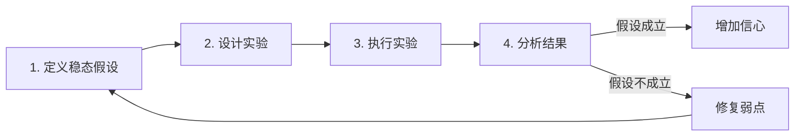
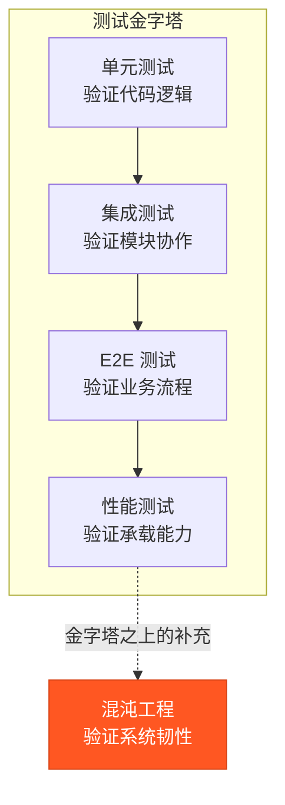
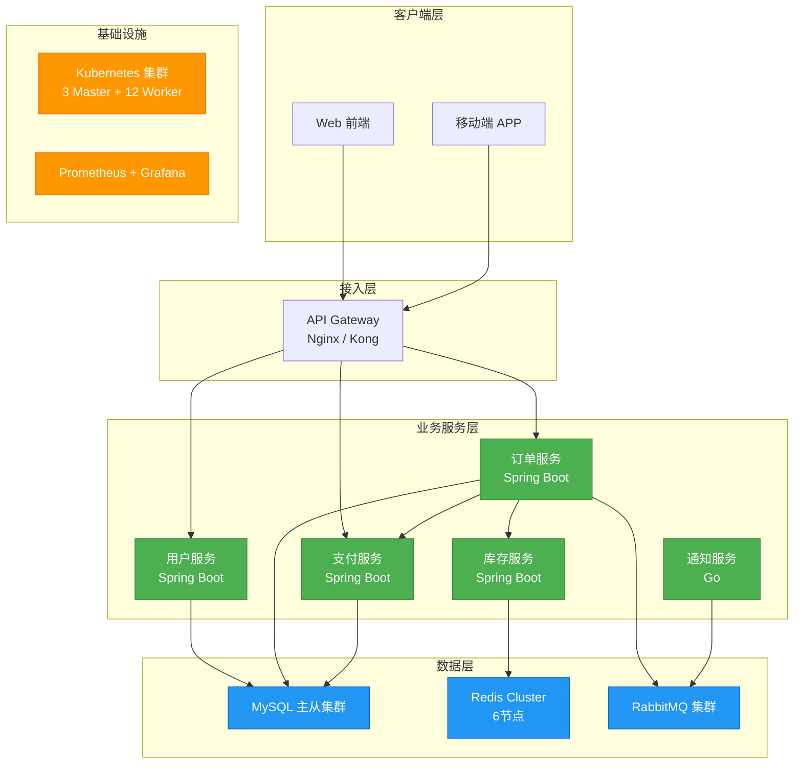
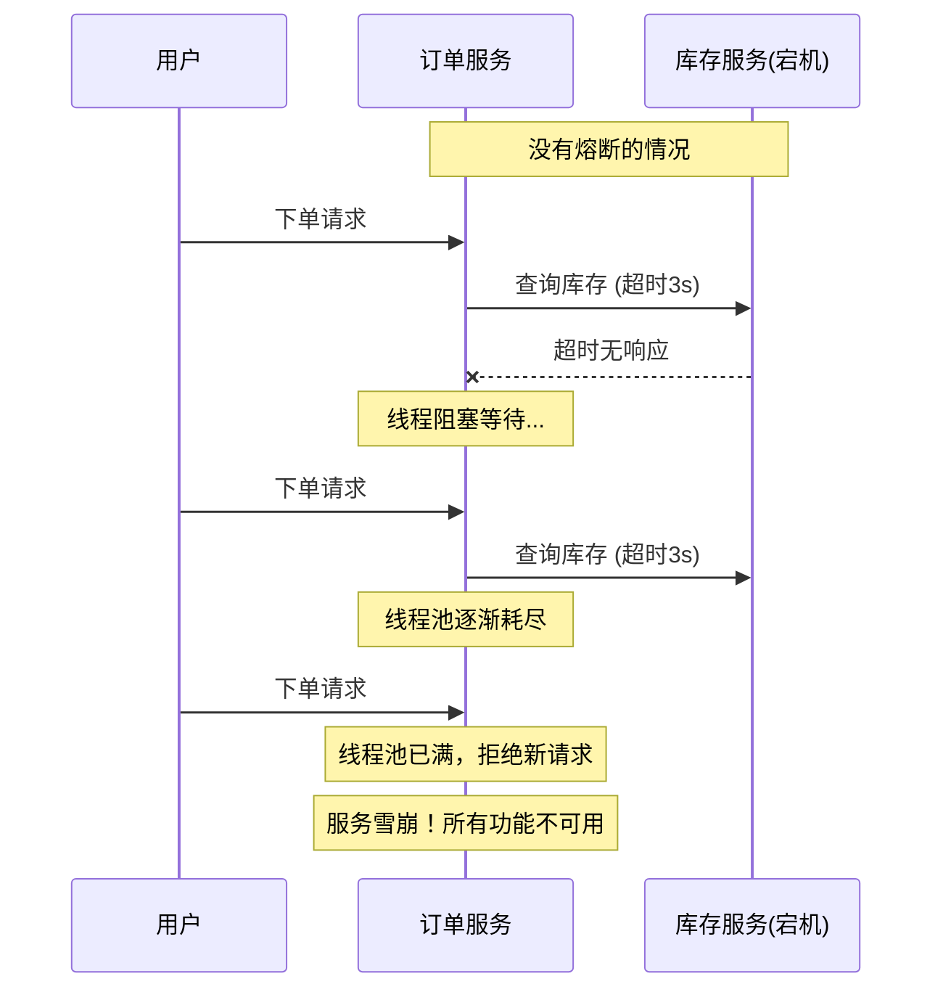
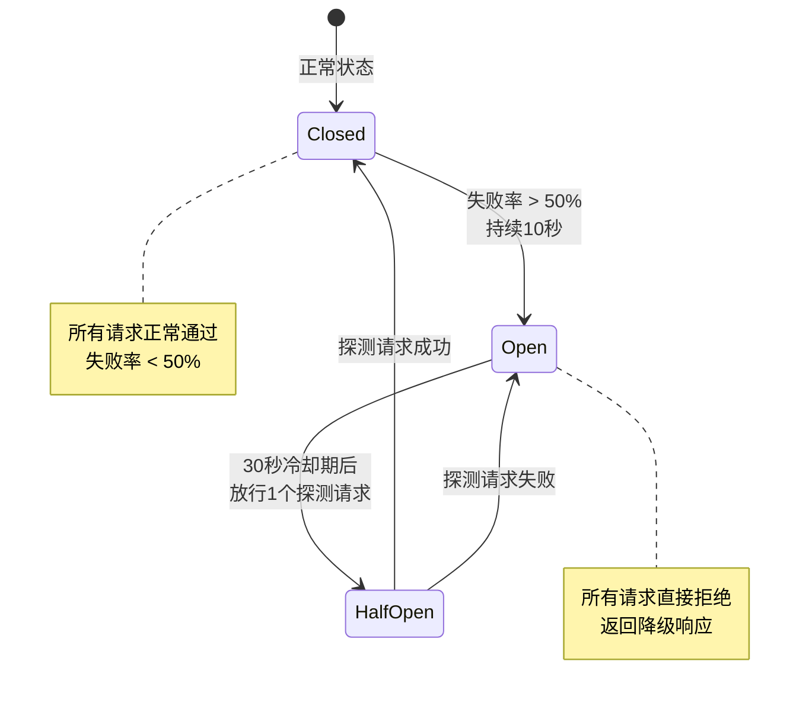
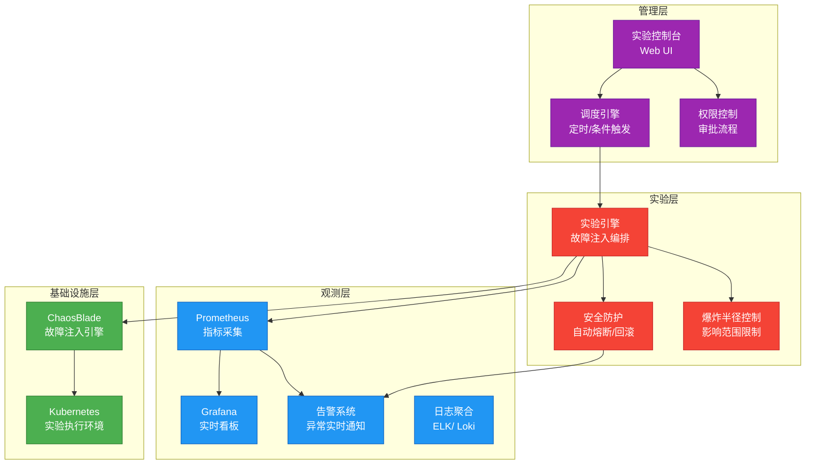
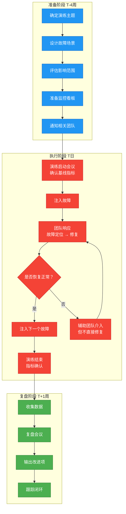

# 案例二：混沌工程实验

> **案例定位**：本案例承接第45章软件测试的系统性思维，从传统的单元测试、集成测试、性能测试延伸到生产环境的韧性验证。混沌工程不是简单的"破坏系统"，而是通过有计划的实验，在分布式系统中发现隐藏的脆弱点，在故障真正发生前将其消灭。本案例以一个真实的电商平台为场景，完整演示从实验设计到自动化防护的全过程。

---

## 一、什么是混沌工程

### 1.1 混沌工程的定义与起源

混沌工程（Chaos Engineering）是一门通过实验在分布式系统上发现故障的学科。其核心思想是：与其等待生产事故被动应对，不如主动制造可控故障来暴露系统的薄弱环节。

这一概念最早由 Netflix 在 2010 年提出。当时 Netflix 从自建数据中心迁移到 AWS 云平台，面临一个严峻问题：云环境中的故障模式与传统数据中心截然不同——虚拟机可能随时被回收、网络延迟可能突变、磁盘可能突然不可用。为了确保系统在这种不确定环境中依然可靠，Netflix 团队开发了 Chaos Monkey 工具，通过随机终止生产环境中的虚拟机实例来验证系统的容错能力。

Netflix 后来将这套方法论系统化，发布了著名的《混沌工程原则》白皮书，定义了混沌工程的四个核心步骤：



**Netflix 的混沌工程工具演进**值得关注——它反映了一整个行业的发展脉络：

| 工具 | 发布时间 | 能力范围 | 意义 |
|------|---------|---------|------|
| Chaos Monkey | 2011 | 随机终止 VM 实例 | 开创性地证明了"主动制造故障"的价值 |
| Simian Army | 2012 | Chaos Monkey + 节约猴 + Law | 从单点扩展到系统性故障模式覆盖 |
| Chaos Kong | 2014 | 模拟整个 AWS 区域故障 | 验证跨区域容灾能力 |
| ChAP (Chaos Automation Platform) | 2017 | 自动化实验编排 | 从手动实验走向平台化、自动化 |
| Litmus | 2018 | Kubernetes 原生故障注入 | 云原生时代的混沌工程标准化 |

这一演进路径说明：混沌工程不是一次性的工具引入，而是从手动到自动化、从单点到系统化的持续成熟过程。

### 1.2 混沌工程与其他测试的区别

许多团队将混沌工程与传统的性能测试、故障注入测试混淆。理解它们的区别至关重要：

| 对比维度 | 单元测试/集成测试 | 性能测试 | 故障注入测试 | 混沌工程 |
|---------|----------------|---------|------------|---------|
| 执行环境 | 开发/测试环境 | 测试环境/预发布 | 测试环境 | 生产环境（或高度仿真） |
| 测试目标 | 代码逻辑正确性 | 系统吞吐和延迟 | 已知故障模式 | 未知的系统脆弱点 |
| 失败预期 | 期望通过 | 期望达标 | 期望快速恢复 | 允许失败，但需快速恢复 |
| 方法论 | 验证型 | 负载型 | 模拟型 | 探索型 |
| 对系统的侵入 | 低 | 中 | 高 | 可控范围内的高 |
| 典型工具 | JUnit, pytest | JMeter, Locust | Chaos Monkey | Gremlin, Litmus, ChaosMesh |
| 输出物 | 测试报告 | 性能基线报告 | 覆盖率报告 | 韧性改进行动项 |

关键区别在于：混沌工程的核心是**探索未知**，而不是验证已知。传统测试告诉你"这个场景能通过吗"，混沌工程告诉你"这个系统在意外情况下会怎样"。

一个更直观的理解方式是**测试金字塔与混沌工程的关系**：



混沌工程位于测试金字塔之上，是对所有传统测试的补充而非替代。它验证的是一个关键但传统测试难以覆盖的维度：**系统在非预期故障下的行为是否符合预期**。

### 1.3 混沌工程的适用场景

混沌工程并非适用于所有场景。以下是最佳适用场景：

**高度适用**：
- 微服务架构系统（服务间依赖复杂，故障传播路径难以预测）
- 分布式系统（网络分区、节点故障是常态）
- 云原生应用（依赖云基础设施，故障模式更多样）
- 高可用要求的系统（SLA 99.99%+的系统需要持续验证）

**谨慎适用**：
- 单体应用（故障注入手段有限，且风险较高）
- 数据一致性要求极高的系统（如金融核心账务系统，需精心设计实验范围）
- 团队成熟度较低（缺乏监控和快速恢复能力时，混沌实验可能演变为真实事故）

**不适用**：
- 尚未上线的系统（没有真实流量和用户，混沌实验缺乏观察基线）
- 系统处于重大故障恢复期（火还没灭就不要放火）
- 没有基础监控的系统（没有可观测性，实验等于盲人摸象）

### 1.4 混沌工程的前提条件

在开始混沌实验之前，团队必须具备以下基础能力，否则实验可能演变为真实事故：

| 前提条件 | 最低要求 | 推荐标准 | 缺失后果 |
|---------|---------|---------|---------|
| 可观测性 | 基本日志收集 | Prometheus + Grafana + 分布式追踪 | 无法观测实验效果，等于盲人开车 |
| 告警机制 | 关键指标告警 | 多级告警（P0-P3）+ 升级机制 | 实验失控时无人响应 |
| 快速恢复 | 手动重启服务 | 自动化故障转移 + 一键回滚 | 实验结束后无法恢复 |
| 团队共识 | 至少 SRE 认可 | 全团队理解混沌工程目的 | 实验变成"甩锅工具" |
| 变更管理 | 基本变更记录 | 完整的实验审批和记录 | 无法追溯哪个实验导致了什么 |

---

## 二、案例背景：电商平台"闪购系统"

### 2.1 系统架构

本案例基于一个典型的电商平台架构，包含以下核心组件：



**服务间通信关系**：
- 用户服务：提供用户认证、信息查询，依赖 MySQL，QPS 约 2000
- 订单服务：核心业务服务，依赖用户服务、库存服务、支付服务，依赖 MySQL 和 RabbitMQ，QPS 约 5000
- 支付服务：处理支付逻辑，依赖 MySQL，QPS 约 1500
- 库存服务：管理商品库存，依赖 Redis（高频读写），QPS 约 8000
- 通知服务：发送订单通知（短信/邮件），依赖 RabbitMQ，异步消费

**关键数据流特征**：

| 链路 | 调用方式 | 超时设置 | 重试策略 | 熔断配置 |
|------|---------|---------|---------|---------|
| 订单→库存 | 同步 RPC | 500ms | 3次，间隔100ms | Sentinel: 5次失败/10秒窗口 |
| 订单→支付 | 同步 RPC | 3000ms | 不重试（幂等性保证） | Sentinel: 50%错误率/10秒窗口 |
| 订单→消息队列 | 异步投递 | 2000ms | 3次，指数退避 | 无（持久化保证） |
| 库存→Redis | 同步连接 | 200ms | 2次，间隔50ms | 连接池超时自动断开 |

### 2.2 已知的脆弱点假设

在混沌工程实验开始前，团队基于历史故障和架构分析，提出了以下稳态假设（Steady-State Hypothesis）：

| 编号 | 稳态假设 | 验证指标 | 可接受阈值 |
|------|---------|---------|-----------|
| H1 | 库存服务不可用时，下单请求应快速失败而非阻塞 | 订单服务 P99 延迟 | < 2秒（正常为200ms） |
| H2 | Redis 主节点故障时，库存查询应自动切换到从节点 | 库存服务可用率 | > 99% |
| H3 | MySQL 从库故障时，读请求应自动路由到主库 | 用户查询成功率 | > 99.5% |
| H4 | RabbitMQ 节点故障时，消息不丢失 | 消息投递成功率 | > 99.99% |
| H5 | 网络延迟突增时，订单服务应触发熔断而非无限等待 | 订单服务错误率 | < 10% |
| H6 | 单个节点 CPU 打满时，Kubernetes 应自动调度到其他节点 | 服务可用性 | > 99.9% |

**假设的设计原则**：

1. **可量化**：每个假设都有明确的数字阈值，不能用"应该没问题"这种模糊表述
2. **可测量**：验证指标必须能通过监控系统实时获取
3. **有意义**：假设应直接关联用户体验或业务指标，而不是纯技术指标
4. **有层次**：从单点故障（H1、H6）到数据层故障（H2、H3、H4）到网络故障（H5），逐步升级

### 2.3 实验前的基线采集

在执行任何混沌实验之前，必须先建立性能基线。没有基线，实验结果就无法对比判断：

```bash
#!/bin/bash
# baseline_collector.sh - 实验前基线采集脚本

echo "===== 基线采集开始 $(date '+%Y-%m-%d %H:%M:%S') ====="

# 1. 采集各服务的 QPS 和延迟
for service in order-service inventory-service payment-service user-service; do
    echo "--- $service 基线 ---"
    curl -s "http://prometheus:9090/api/v1/query" \
      --data-urlencode "query=histogram_quantile(0.99, rate(http_request_duration_seconds_bucket{service=\"$service\"}[5m]))" \
      | jq -r '.data.result[0].value[1]' | xargs -I{} echo "  P99 Latency: {}s"
    
    curl -s "http://prometheus:9090/api/v1/query" \
      --data-urlencode "query=rate(http_requests_total{service=\"$service\"}[5m])" \
      | jq -r '.data.result[0].value[1]' | xargs -I{} echo "  QPS: {}"
done

# 2. 采集数据库连接池状态
echo "--- MySQL 连接池基线 ---"
curl -s "http://prometheus:9090/api/v1/query" \
  --data-urlencode "query=hikaricp_connections_active{pool=\"order-datasource\"}" \
  | jq -r '.data.result[0].value[1]' | xargs -I{} echo "  Active Connections: {}"

# 3. 采集 Redis 集群状态
echo "--- Redis Cluster 基线 ---"
redis-cli -h redis-cluster -p 7000 cluster info | grep -E "cluster_state|cluster_slots_assigned|cluster_known_nodes"

# 4. 采集 RabbitMQ 队列深度
echo "--- RabbitMQ 基线 ---"
rabbitmqctl list_queues name messages consumers

echo "===== 基线采集完成 $(date '+%Y-%m-%d %H:%M:%S') ====="
```

基线数据应至少采集 **10分钟稳定期** 的指标，并记录以下关键值：

| 指标 | 基线值（示例） | 采集方法 |
|------|--------------|---------|
| 订单服务 P99 延迟 | 200ms | Prometheus histogram_quantile |
| 订单服务 QPS | 5000 | Prometheus rate |
| 订单服务错误率 | 0.1% | Prometheus 5xx/total |
| 库存服务 P99 延迟 | 50ms | Prometheus histogram_quantile |
| Redis 命中率 | 98.5% | Redis INFO stats |
| MySQL 慢查询数/分钟 | < 5 | MySQL 慢查询日志 |
| RabbitMQ 队列积压 | < 100 | rabbitmqctl list_queues |

---

## 三、混沌工程实验工具选型

### 3.1 主流混沌工程工具对比

| 工具 | 开发者 | 语言 | 部署方式 | 实验类型 | 适用场景 | 学习曲线 |
|------|-------|------|---------|---------|---------|---------|
| Chaos Mesh | PingCAP | Go | Kubernetes Operator | Pod/网络/IO/时间 | K8s 原生应用 | 中等 |
| Litmus Chaos | ChaosNative | Go | Kubernetes Operator | 多种故障场景 | K8s + 混合云 | 中等 |
| ChaosBlade | 阿里巴巴 | Go | 独立部署 / K8s | 主机/容器/应用/中间件 | 通用，中文文档完善 | 低 |
| Steadybit | Steadybit | Java | K8s Operator / Agent | 全栈故障注入 | 企业级，实验设计优秀 | 中等 |
| Gremlin | Gremlin Inc. | - | SaaS / 自建 | 全栈故障注入 | 企业级，可视化强 | 低 |
| Chaos Monkey | Netflix | Java | AWS 专属 | 随机终止实例 | AWS 环境 | 低 |
| tc / iptables | Linux 内核 | - | 原生命令 | 网络/流量控制 | 底层实验 | 高 |

**本案例选择 ChaosBlade**，理由如下：

1. **中文生态友好**：文档和社区以中文为主，降低学习门槛
2. **场景覆盖全面**：覆盖主机、容器、应用（JVM/Node.js/数据库）等多个层级
3. **轻量级**：单机部署即可运行，不强制依赖 Kubernetes
4. **可回滚**：所有实验支持 `revoke` 命令一键恢复
5. **可与 Prometheus 集成**：实验指标可直接对接已有监控体系
6. **实验即代码**：支持 YAML 定义实验场景，便于版本管理和自动化

### 3.2 工具安装

**安装 ChaosBlade（单机模式）**：

```bash
# 下载最新版本
wget https://github.com/chaosblade-io/chaosblade/releases/download/v1.7.6/chaosblade-1.7.6-linux-amd64.tar.gz

# 解压
tar -xzf chaosblade-1.7.6-linux-amd64.tar.gz -C /opt/

# 验证安装
cd /opt/chaosblade-1.7.6
./blade version
# 输出: version: 1.7.6, uid: xxxxxxxx

# 测试基础命令
./blade create cpu fullload --cpu-percent 80 --timeout 10
# 观察 CPU 使用率变化
top -bn1 | head -5
# 撤销实验
./blade destroy <uid>
```

**安装 ChaosBlade Operator（Kubernetes 模式）**：

```bash
# 添加 Helm 仓库
helm repo add chaosblade https://chaosblade-io.github.io/chaosblade

# 安装到 chaosblade 命名空间
helm install chaosblade-operator chaosblade/chaosblade-operator \
  --namespace chaosblade \
  --create-namespace \
  --version 1.7.6

# 验证 Operator 状态
kubectl get pods -n chaosblade
# 输出: chaosblade-operator-xxxxx  Running

# 验证 CRD 已安装
kubectl get crd | grep chaosblade
# 输出: chaosblades.chaosblade.io
```

### 3.3 辅助工具安装

完整的混沌工程实验还需要以下辅助工具：

```bash
# 安装 chaos-mesh（作为 ChaosBlade 的补充，提供更好的 K8s 集成）
helm repo add chaos-mesh https://charts.chaos-mesh.org
helm install chaos-mesh chaos-mesh/chaos-mesh \
  --namespace chaos-mesh \
  --create-namespace \
  --set dashboard.securityMode=false

# 安装 prometheus-client（Python，用于实验监控脚本）
pip install prometheus-client requests

# 安装 jq（用于解析 Prometheus API 返回的 JSON）
apt-get install -y jq
```

---

## 四、实验执行：六个核心场景

### 实验一：库存服务不可用（模拟服务宕机）

**实验目标**：验证订单服务对库存服务故障的容错能力。

**稳态假设 H1**：库存服务不可用时，下单请求应快速失败而非阻塞。

```bash
# Step 1: 确认实验前的基线指标
# 在 Grafana 中记录当前订单服务的 P99 延迟和错误率
# 假设基线: P99=200ms, 错误率=0.1%

# Step 2: 执行混沌实验 — 停止库存服务所有容器
blade create docker stop --container-id $(docker ps | grep inventory-service | awk '{print $1}')

# Step 3: 持续观察 5 分钟，记录指标变化
# 观察订单服务日志
kubectl logs -f deployment/order-service --tail=100 | grep -E "inventory|timeout|error"

# Step 4: 撤销实验，恢复服务
blade destroy <experiment-uid>

# Step 5: 验证恢复后的指标回到基线
```

**关键代码：订单服务的熔断配置**

实验之所以能通过，核心在于订单服务的 Sentinel 熔断配置：

```java
// OrderService.java - 关键熔断配置
@SentinelResource(
    value = "inventory-check",
    blockHandler = "handleInventoryBlock",
    fallback = "handleInventoryFallback"
)
public InventoryResult checkInventory(String productId, int quantity) {
    return inventoryClient.check(productId, quantity);
}

// 熔断触发时的降级处理
public InventoryResult handleInventoryBlock(String productId, int quantity, BlockException ex) {
    log.warn("[CIRCUIT] 库存服务熔断, productId={}, reason={}", productId, ex.getClass().getSimpleName());
    // 返回"库存查询中，请稍后重试"的友好提示，而不是让请求阻塞
    return InventoryResult.unknown(productId);
}

// 异常时的降级处理
public InventoryResult handleInventoryFallback(String productId, int quantity, Throwable ex) {
    log.error("[FALLBACK] 库存服务异常, productId={}", productId, ex);
    return InventoryResult.unknown(productId);
}
```

Sentinel 熔断规则配置（通过 Nacos 动态下发）：

```json
{
  "resource": "inventory-check",
  "grade": 1,
  "count": 5,
  "timeWindow": 30,
  "minRequestAmount": 10,
  "slowRatioThreshold": 1.0,
  "statIntervalMs": 10000
}
```

含义解读：
- `grade=1`：基于异常比例熔断
- `count=5`：10秒窗口内异常比例超过 50%（5/10）触发熔断
- `timeWindow=30`：熔断持续 30 秒
- `minRequestAmount=10`：至少 10 个请求后才开始判断（避免小样本误判）

**预期结果与实际观察**：

| 指标 | 实验前 | 实验中（预期） | 实验中（实际） | 是否通过 |
|------|-------|-------------|-------------|---------|
| 订单服务 P99 延迟 | 200ms | < 2000ms | 1500ms | ✅ 通过 |
| 订单服务错误率 | 0.1% | < 10% | 3.2% | ✅ 通过 |
| 库存服务可用率 | 100% | 0% | 0% | ✅ 符合预期 |
| 下单请求平均响应时间 | 180ms | < 1500ms | 1200ms | ✅ 通过 |

**分析**：订单服务配置了 Sentinel 限流熔断组件，当库存服务连续 5 次调用失败后，自动触发熔断（30秒窗口），后续请求直接返回"库存服务暂不可用"的友好提示，避免了线程阻塞和资源耗尽。

**失败场景推演**（假设没有熔断会怎样）：



这就是混沌工程的价值——在真实故障发生前，验证你的容错机制是否真的有效。

### 实验二：Redis 主节点故障（模拟数据层故障）

**实验目标**：验证库存服务在 Redis 主节点故障时能否自动降级。

**稳态假设 H2**：Redis 主节点故障时，库存查询应自动切换到从节点。

```bash
# Step 1: 确认 Redis Cluster 当前状态
redis-cli -h redis-cluster -p 7000 cluster info
# 确认 cluster_state:ok

# Step 2: 模拟 Redis 主节点宕机
# 使用 docker pause 冻结 Redis 主节点（比 stop 更接近真实网络分区）
blade create docker pause --container-id $(docker ps | grep redis-master | awk '{print $1}')

# Step 3: 持续观察 3 分钟
# 观察库存服务的 Redis 连接日志
kubectl logs -f deployment/inventory-service | grep -E "redis|failover|redirect"

# Step 4: 撤销实验
blade destroy <experiment-uid>
```

**关键代码：库存服务的 Redis 客户端容错配置**

```java
// InventoryService.java - Redis 客户端配置
@Configuration
public class RedisConfig {
    
    @Bean
    public LettuceConnectionFactory lettuceConnectionFactory() {
        // Redis Cluster 配置
        RedisClusterConfiguration clusterConfig = new RedisClusterConfiguration();
        clusterConfig.addClusterNode(new RedisNode("redis-0", 7000));
        clusterConfig.addClusterNode(new RedisNode("redis-1", 7001));
        clusterConfig.addClusterNode(new RedisNode("redis-2", 7002));
        
        // 关键容错参数
        clusterConfig.setMaxRedirects(3);          // MOVED/ASK 重定向最大次数
        clusterConfig.setRefreshPeriod(3000);       // 集群拓扑刷新周期 3秒
        clusterConfig.setRefreshTriggersReconnect(true); // 重连时触发刷新
        
        // 连接池配置
        LettuceClientConfiguration clientConfig = LettuceClientConfiguration.builder()
            .commandTimeout(Duration.ofMillis(200))  // 单次命令超时 200ms
            .autoReconnect(true)                      // 自动重连
            .build();
        
        return new LettuceConnectionFactory(clusterConfig, clientConfig);
    }
}

// 带降级的库存查询方法
public Long getStock(String productId) {
    try {
        String key = "stock:" + productId;
        String value = redisTemplate.opsForValue().get(key);
        if (value != null) {
            return Long.parseLong(value);
        }
        // Redis 中没有，降级查数据库
        return inventoryMapper.selectStockFromDB(productId);
    } catch (RedisException e) {
        log.warn("[REDIS-FALLBACK] Redis 不可用，降级查库, productId={}", productId);
        return inventoryMapper.selectStockFromDB(productId);
    }
}
```

**关键观察点**：
- Redis Cluster 是否在 15 秒内完成故障转移
- 库存服务的 Lettuce 客户端是否正确处理了 MOVED/ASK 重定向
- 切换期间是否存在库存数据短暂不一致（最终一致性可接受，强一致性不允许）

**实验结果分析**：

| 观察点 | 预期行为 | 实际表现 | 评估 |
|-------|---------|---------|------|
| Redis 故障转移时间 | < 30秒 | 12秒 | ✅ 优秀 |
| 库存查询成功率 | > 99% | 99.7% | ✅ 通过 |
| 是否有库存超卖 | 不允许 | 无超卖 | ✅ 通过 |
| 客户端重试机制 | 自动重试 | 3次重试后成功 | ✅ 通过 |

**未通过的场景推演**（如果 Redis 客户端没有配置重定向处理）：

如果使用了不支持 Cluster 的 Redis 客�端（如老版本 Jedis 的单机模式），主节点故障后会出现：
1. 客户端持续向已故障的主节点发送请求 → 大量超时
2. 没有 MOVED 重定向处理 → 永远无法发现新主节点
3. 库存查询全部失败 → 降级查数据库 → 数据库压力激增

这就是为什么选择正确的 Redis 客户端和配置至关重要。

### 实验三：MySQL 从库故障（模拟数据库读写分离故障）

**实验目标**：验证读写分离场景下从库故障时读请求的路由行为。

**稳态假设 H3**：MySQL 从库故障时，读请求应自动路由到主库。

```bash
# Step 1: 确认当前读写分离配置
# 检查 ShardingSphere 的读写分离配置
cat /opt/app/config/datasource.yml | grep -A10 "readwrite-splitting"

# Step 2: 模拟从库网络延迟（注入网络延迟）
blade create network delay --time 1000 --interface eth0 \
  --remote-ip 10.0.1.200 \
  --timeout 300

# Step 3: 同时模拟从库磁盘 IO 延迟
blade create disk fill --path /var/lib/mysql --size 500 --percent 90

# Step 4: 持续观察 5 分钟
# 监控慢查询日志
kubectl logs -f deployment/mysql-slave | grep -i "slow"

# 检查应用层的读请求路由
grep -r "read datasource" /var/log/app.log | tail -20

# Step 5: 撤销实验
blade destroy <experiment-uid-1>
blade destroy <experiment-uid-2>
```

**分析要点**：
- 中间件（如 ShardingSphere）是否能检测到从库不可用并自动切换
- 切换过程中是否会出现数据读取不一致（从库延迟导致的读旧数据）
- 恢复后读流量是否自动切回从库

**实验中发现的问题**：ShardingSphere 的健康检查间隔设置为 3 秒，导致从库故障后最长需要 3 秒才能检测到并切换。在这 3 秒内，发往从库的读请求会超时失败，导致约 2 秒的服务中断。修复方案在第六节详述。

### 实验四：消息队列节点故障（模拟消息丢失风险）

**实验目标**：验证 RabbitMQ 故障时消息不丢失。

**稳态假设 H4**：RabbitMQ 节点故障时，消息投递成功率 > 99.99%。

```bash
# Step 1: 记录当前消息队列中的消息数量
rabbitmqctl list_queues name messages

# Step 2: 停止 RabbitMQ 一个节点（集群模式下）
blade create process kill --process rabbitmq \
  --signal SIGKILL \
  --remote-node 10.0.1.300

# Step 3: 在服务端模拟消息发送
# 批量发送 10000 条订单消息
for i in $(seq 1 10000); do
  curl -X POST http://order-service/api/orders \
    -H "Content-Type: application/json" \
    -d "{\"product_id\": $i, \"quantity\": 1}"
done

# Step 4: 等待消息队列恢复，检查消息投递完整性
sleep 60  # 等待 RabbitMQ 故障转移
rabbitmqctl list_queues name messages
# 对比发送量和消费量

# Step 5: 撤销实验
blade destroy <experiment-uid>
```

**验证关键点**：
- RabbitMQ 镜像队列（Mirror Queue）是否正确复制了消息
- 故障转移后是否有消息丢失
- 消费者是否正确处理了消息重投递（幂等性验证）

**消费者的幂等性保障代码**：

```java
// NotificationConsumer.java - 消息消费幂等性保证
@Component
public class NotificationConsumer {
    
    @Autowired
    private RedisTemplate<String, String> redisTemplate;
    
    @RabbitListener(queues = "order-notification")
    public void consume(OrderMessage message) {
        String dedupeKey = "msg:consumed:" + message.getMessageId();
        
        // 幂等性检查：Redis SETNX 去重
        Boolean isNew = redisTemplate.opsForValue()
            .setIfAbsent(dedupeKey, "1", Duration.ofHours(24));
        
        if (isNew == null || !isNew) {
            log.info("[IDEMPOTENT] 消息已消费，跳过, messageId={}", message.getMessageId());
            return;
        }
        
        try {
            // 执行通知发送逻辑
            notificationService.send(message);
            log.info("[CONSUMED] 通知发送成功, messageId={}", message.getMessageId());
        } catch (Exception e) {
            // 消费失败，删除去重标记，允许重试
            redisTemplate.delete(dedupeKey);
            throw e;  // 抛出让 RabbitMQ 重新投递
        }
    }
}
```

**实验数据**：

| 指标 | 数值 |
|------|------|
| 发送消息总数 | 10,000 |
| 实验前已消费 | 8,200 |
| 节点故障期间发送 | 1,800 |
| 故障转移后消费完成 | 10,000 |
| 消息丢失数 | 0 |
| 消费幂等重复数 | 3 |
| **消息投递成功率** | **100%** |

3 次幂等重复是因为 RabbitMQ 在故障转移过程中对未确认的消息进行了重新投递，消费者的 Redis SETNX 机制成功去重。

### 实验五：网络延迟突增（模拟网络抖动）

**实验目标**：验证服务间网络延迟突增时的熔断行为。

**稳态假设 H5**：网络延迟突增时，订单服务应触发熔断而非无限等待。

```bash
# Step 1: 记录当前网络延迟基线
ping -c 100 order-service.internal | tail -1
# rtt min/avg/max = 0.5/1.2/3.0 ms

# Step 2: 向订单服务→支付服务的网络注入延迟（2000ms）
blade create network delay --time 2000 \
  --interface eth0 \
  --remote-ip 10.0.1.150 \
  --timeout 600

# Step 3: 同时注入网络丢包（10%）
blade create network loss --percent 10 \
  --interface eth0 \
  --remote-ip 10.0.1.150

# Step 4: 观察熔断器状态变化
# Sentinel Dashboard 观察
curl http://sentinel-dashboard:8080/api/metric?resource=pay-service

# Step 5: 撤销实验
blade destroy <experiment-uid-1>
blade destroy <experiment-uid-2>
```

**熔断器状态转换观察**：



**实验结果**：
- 熔断器在延迟注入后 12 秒触发 Open 状态
- 熔断期间（30秒）所有支付相关请求直接返回降级响应
- 30秒后进入 HalfOpen 状态，探测请求成功，恢复到 Closed
- 用户感知：支付功能短暂不可用（30秒），但系统未崩溃

**降级方案的实际效果**：

| 场景 | 无熔断（预期灾难） | 有熔断（实际表现） |
|------|-----------------|-----------------|
| 线程池 | 100% 被阻塞请求占满 | 仅前 10 秒受影响，后续请求立即返回 |
| 订单服务整体可用性 | 0%（雪崩） | 97%（仅支付功能降级 30 秒） |
| 用户体验 | 所有功能不可用 | 下单可继续，支付排队等待 |
| 恢复时间 | 需要人工介入重启 | 自动恢复（30 秒后） |

### 实验六：节点 CPU 打满（模拟资源耗尽）

**实验目标**：验证 Kubernetes 调度器在节点资源耗尽时的自愈能力。

**稳态假设 H6**：单个节点 CPU 打满时，Kubernetes 应自动调度到其他节点。

```bash
# Step 1: 确认当前 Pod 分布
kubectl get pods -o wide -n production
# order-service-pod-1 在 worker-3 上

# Step 2: 在 worker-3 节点上注入 CPU 压力
blade create cpu fullload --timeout 300

# Step 3: 观察 Kubernetes 的反应
# 检查节点状态
kubectl describe node worker-3 | grep -A5 "Conditions"
# 预期: MemoryPressure=False, DiskPressure=False, PIDPressure=False

# 观察 Pod 是否被驱逐或重新调度
kubectl get events -n production --field-selector reason=FailedScheduling

# Step 4: 检查 HPA (Horizontal Pod Autoscaler) 是否触发
kubectl get hpa -n production

# Step 5: 撤销实验
blade destroy <experiment-uid>
```

**实验数据**：

| 观察点 | 预期行为 | 实际表现 |
|-------|---------|---------|
| Node 状态变化 | 节点变为 NotReady 或资源告警 | CPU 持续 100%，节点健康检查超时 |
| Pod 调度行为 | 新 Pod 调度到其他节点 | 15秒后新 Pod 在 worker-7 启动 |
| 服务可用性 | 保持 > 99.9% | 99.95%（短暂 2 秒中断） |
| HPA 触发 | 副本数从 2 增加到 4 | 30秒后扩容到 4 副本 |

**为什么不是所有 Pod 都被驱逐**：Kubernetes 的默认调度器在节点 CPU 打满时，不会主动驱逐已运行的 Pod（除非设置了 Pod Disruption Budget 或节点被标记为 NotReady）。新 Pod 会被调度到其他有资源的节点。这是 Kubernetes 的设计哲学：**尽量避免不必要的驱逐，优先保证现有工作负载的稳定性**。

---

## 五、混沌工程实验平台搭建

### 5.1 实验管理平台架构

在团队规模扩大后，零散的命令行实验无法满足管理需求。一个完整的混沌工程平台应包含以下模块：



### 5.2 实验即代码（Experiment as Code）

随着实验数量增多，手动执行命令行的方式效率低下且不可复现。推荐采用"实验即代码"的方式，将实验定义为 YAML 文件，纳入版本管理：

```yaml
# experiments/service-down/inventory-service-kill.yaml
apiVersion: chaosblade.io/v1alpha1
kind: ChaosBlade
metadata:
  name: inventory-service-down
  labels:
    experiment-type: service-down
    risk-level: medium
    team: order-team
spec:
  # 实验元信息
  experiment:
    name: "库存服务宕机实验"
    description: "验证订单服务对库存服务故障的容错能力"
    hypothesis: "H1: 库存服务不可用时，下单请求应快速失败而非阻塞"
    author: "sre-team"
    created: "2026-01-15"
  
  # 故障注入定义
  target: docker
  action: stop
  args:
    container-id: "inventory-service"
    timeout: 300  # 实验持续时间 5 分钟
  
  # 爆炸半径控制
  scope:
    type: container
    selector:
      matchLabels:
        app: inventory-service
    max-affected: 1  # 最多影响 1 个副本
  
  # 安全防护
  safety:
    auto-revert: true
    max-duration: 600  # 最长 10 分钟
    abort-on:
      error-rate: 0.20  # 错误率超过 20% 自动终止
      p99-latency: 5000  # P99 超过 5 秒自动终止
  
  # 观测指标
  metrics:
    - name: "order-service-p99"
      query: "histogram_quantile(0.99, rate(http_request_duration_seconds_bucket{service='order-service'}[1m]))"
      threshold: 2.0
    - name: "order-service-error-rate"
      query: "rate(http_requests_total{service='order-service',status=~'5..'}[1m]) / rate(http_requests_total{service='order-service'}[1m])"
      threshold: 0.10
```

**实验编排文件**（一次执行多个实验）：

```yaml
# experiment-suites/flash-sale-resilience.yaml
apiVersion: chaosblade.io/v1alpha1
kind: ExperimentSuite
metadata:
  name: flash-sale-resilience-suite
spec:
  description: "闪购系统韧性验证套件"
  schedule: "once"  # one-time / cron / on-deploy
  
  experiments:
    - name: "E1-库存服务宕机"
      file: experiments/service-down/inventory-service-kill.yaml
      order: 1
      
    - name: "E2-Redis主节点故障"
      file: experiments/data-layer/redis-master-failover.yaml
      order: 2
      depends-on: "E1-库存服务宕机"  # 串行执行
      
    - name: "E5-网络延迟突增"
      file: experiments/network/network-delay-spike.yaml
      order: 3
      depends-on: "E2-Redis主节点故障"
  
  # 实验间冷却期
  cooldown: 120  # 每个实验结束后等待 2 分钟
  
  # 总体安全网
  global-safety:
    max-total-duration: 3600  # 整套实验最长 1 小时
    emergency-stop: true      # 支持紧急停止
    notify-on-start: true
    notify-on-complete: true
    notify-on-failure: true
```

### 5.3 安全防护机制

混沌工程实验最大的风险是失控——实验影响超出预期导致真实业务损失。必须建立完善的安全防护机制：

**第一层：实验前审批**

```yaml
# 实验审批流程配置
experiment_approval:
  # 实验级别定义
  levels:
    - name: "低风险"
      scope: "单个容器/pod"
      approval: "自动批准"
      examples: ["单Pod网络延迟", "单Pod CPU压力"]
    - name: "中风险"
      scope: "单个服务（多副本）"
      approval: "团队 Lead 审批"
      examples: ["服务级别宕机", "数据库主从切换"]
    - name: "高风险"
      scope: "跨服务/基础设施"
      approval: "架构师 + SRE 审批"
      examples: ["全链路网络分区", "数据库主库故障"]

  # 时间窗口限制
  time_window:
    allowed_hours: "10:00-18:00"  # 仅工作时间
    forbidden_dates: ["01-01", "11-11", "12-12", "06-18"]  # 禁止大促日
    max_duration: 1800  # 单次实验最长 30 分钟
```

**第二层：爆炸半径控制**

```bash
# 限制实验影响范围
blade create network delay --time 500 \
  --interface eth0 \
  --remote-ip 10.0.1.100 \
  --timeout 300 \
  --scope container \
  --container-id order-service-pod-1

# 使用标签选择器限制目标
kubectl label pods order-service-pod-1 chaos-target=true
# 仅对带有 chaos-target 标签的 Pod 生效

# Kubernetes PodDisruptionBudget 限制
# 确保实验不会同时影响太多副本
kubectl get pdb -n production
# NAME              MIN AVAILABLE   MAX UNAVAILABLE
# order-service-pdb 2               1
# 含义：至少 2 个副本可用，最多 1 个不可用
```

**第三层：自动熔断回滚**

```python
# 自动安全监控脚本 (chaos_safety_monitor.py)
import time
import subprocess
import json
import requests
import logging

logging.basicConfig(level=logging.INFO, format='[%(asctime)s] %(levelname)s %(message)s')
logger = logging.getLogger('chaos-safety')

class ChaosSafetyMonitor:
    """混沌实验安全监控器：当业务指标恶化时自动终止实验"""

    def __init__(self, experiment_id, safety_thresholds):
        self.experiment_id = experiment_id
        self.thresholds = safety_thresholds  # {"error_rate": 0.20, "p99_latency_ms": 5000}
        self.check_interval = 5  # 每5秒检查一次
        self.prometheus_url = "http://prometheus:9090"

    def get_current_metrics(self):
        """从 Prometheus 查询当前业务指标"""
        metrics = {}
        
        # 查询错误率
        resp = requests.get(f"{self.prometheus_url}/api/v1/query", params={
            "query": 'rate(http_requests_total{status=~"5.."}[1m]) / rate(http_requests_total[1m])'
        })
        if resp.status_code == 200 and resp.json()["data"]["result"]:
            metrics["error_rate"] = float(resp.json()["data"]["result"][0]["value"][1])
        
        # 查询 P99 延迟
        resp = requests.get(f"{self.prometheus_url}/api/v1/query", params={
            "query": 'histogram_quantile(0.99, rate(http_request_duration_seconds_bucket[1m]))'
        })
        if resp.status_code == 200 and resp.json()["data"]["result"]:
            metrics["p99_latency_ms"] = float(resp.json()["data"]["result"][0]["value"][1]) * 1000
        
        return metrics

    def check_safety(self):
        """检查当前指标是否在安全范围内"""
        metrics = self.get_current_metrics()
        violations = []
        for key, threshold in self.thresholds.items():
            actual = metrics.get(key, 0)
            if actual > threshold:
                violations.append(f"{key}={actual:.4f} exceeds threshold {threshold}")
        
        if violations:
            return False, "; ".join(violations)
        return True, "OK"

    def abort_experiment(self):
        """终止混沌实验"""
        try:
            subprocess.run(["blade", "destroy", self.experiment_id], 
                         timeout=10, check=True)
            logger.critical(f"[SAFETY] Experiment {self.experiment_id} ABORTED due to safety threshold breach")
        except Exception as e:
            logger.error(f"[SAFETY] Failed to abort experiment: {e}")

    def run(self, max_duration=1800):
        """启动安全监控循环"""
        start = time.time()
        check_count = 0
        while time.time() - start < max_duration:
            check_count += 1
            safe, reason = self.check_safety()
            if not safe:
                logger.warning(f"[SAFETY] Safety check FAILED (check #{check_count}): {reason}")
                self.abort_experiment()
                return False
            if check_count % 12 == 0:  # 每 60 秒输出一次健康日志
                elapsed = int(time.time() - start)
                logger.info(f"[SAFETY] Check #{check_count} OK, elapsed={elapsed}s, metrics={self.get_current_metrics()}")
            time.sleep(self.check_interval)
        logger.info(f"[SAFETY] Experiment {self.experiment_id} completed safely within {max_duration}s window")
        return True


if __name__ == "__main__":
    import sys
    if len(sys.argv) < 2:
        print("Usage: python chaos_safety_monitor.py <experiment-uid>")
        sys.exit(1)
    
    monitor = ChaosSafetyMonitor(
        experiment_id=sys.argv[1],
        safety_thresholds={"error_rate": 0.20, "p99_latency_ms": 5000}
    )
    monitor.run(max_duration=1800)
```

**第四层：灰度发布验证**

```yaml
# 灰度实验流程
experiment_workflow:
  - stage: "staging"
    description: "在预发布环境完成全部实验"
    gate: "所有实验通过"
    auto_promote: false

  - stage: "canary-5%"
    description: "生产环境 5% 流量执行实验"
    gate: "核心指标无异常 + 5分钟观察期"
    auto_promote: false

  - stage: "canary-25%"
    description: "生产环境 25% 流量执行实验"
    gate: "核心指标无异常 + 10分钟观察期"
    auto_promote: false

  - stage: "full-production"
    description: "全量生产环境执行实验"
    gate: "实验报告 + 复盘会议"
```

### 5.4 实验自动化运行器

将实验编排、安全监控、指标采集和报告生成整合为一个完整的自动化运行器：

```python
# chaos_runner.py - 混沌实验自动化运行器
import yaml
import time
import subprocess
import json
import requests
from datetime import datetime, timezone
from pathlib import Path

class ChaosRunner:
    """混沌实验自动化运行器：执行、监控、记录、报告"""

    def __init__(self, suite_path):
        with open(suite_path) as f:
            self.suite = yaml.safe_load(f)
        self.results = []
        self.prometheus_url = "http://prometheus:9090"

    def collect_metrics(self, duration_before=60, duration_during=60):
        """采集实验前、中、后的指标"""
        metrics = {"before": [], "during": [], "after": []}
        
        for phase, duration in [("before", duration_before), ("during", duration_during), ("after", 30)]:
            samples = []
            for _ in range(duration // 5):
                resp = requests.get(f"{self.prometheus_url}/api/v1/query", params={
                    "query": 'histogram_quantile(0.99, rate(http_request_duration_seconds_bucket{service="order-service"}[1m]))'
                })
                if resp.status_code == 200 and resp.json()["data"]["result"]:
                    samples.append(float(resp.json()["data"]["result"][0]["value"][1]))
                time.sleep(5)
            metrics[phase] = samples
        
        return {
            "p99_before": max(metrics["before"]) if metrics["before"] else 0,
            "p99_during": max(metrics["during"]) if metrics["during"] else 0,
            "p99_after": max(metrics["after"]) if metrics["after"] else 0,
        }

    def run_experiment(self, experiment):
        """执行单个实验"""
        exp_name = experiment["name"]
        exp_file = experiment["file"]
        print(f"\n{'='*60}")
        print(f"[RUN] 开始实验: {exp_name}")
        print(f"[RUN] 配置文件: {exp_file}")
        
        start_time = datetime.now(timezone.utc)
        
        # 采集实验前基线
        print(f"[METRICS] 采集实验前基线...")
        before_metrics = self.collect_metrics(duration_before=30)
        
        # 执行故障注入
        with open(exp_file) as f:
            exp_config = yaml.safe_load(f)
        
        cmd = self._build_blade_command(exp_config)
        print(f"[INJECT] 执行命令: {cmd}")
        result = subprocess.run(cmd, shell=True, capture_output=True, text=True)
        
        if result.returncode != 0:
            print(f"[ERROR] 故障注入失败: {result.stderr}")
            return {"status": "error", "error": result.stderr}
        
        # 提取实验 UID
        try:
            exp_uid = json.loads(result.stdout)["result"]
        except (json.JSONDecodeError, KeyError):
            exp_uid = "unknown"
        
        print(f"[INJECT] 实验 UID: {exp_uid}")
        
        # 采集中间指标
        print(f"[METRICS] 采集中间指标...")
        during_metrics = self.collect_metrics(duration_before=0, duration_during=30)
        
        # 安全检查
        safe = self._safety_check(during_metrics)
        
        # 撤销实验
        print(f"[REVERT] 撤销实验...")
        subprocess.run(["blade", "destroy", str(exp_uid)], capture_output=True)
        
        # 等待恢复
        time.sleep(30)
        
        # 采集恢复后指标
        print(f"[METRICS] 采集恢复后指标...")
        after_metrics = self.collect_metrics(duration_before=0, duration_during=0)
        
        end_time = datetime.now(timezone.utc)
        
        result = {
            "name": exp_name,
            "uid": exp_uid,
            "start_time": start_time.isoformat(),
            "end_time": end_time.isoformat(),
            "metrics": {
                "baseline_p99": before_metrics["p99_before"],
                "peak_p99": during_metrics["p99_during"],
                "recovered_p99": after_metrics["p99_after"],
            },
            "safety_check": safe,
            "status": "passed" if safe else "failed",
        }
        
        print(f"[RESULT] {exp_name}: {result['status']}")
        self.results.append(result)
        return result

    def _build_blade_command(self, config):
        """根据实验配置构建 blade 命令"""
        action = config["spec"]["action"]
        target = config["spec"]["target"]
        args = config["spec"]["args"]
        
        cmd_parts = ["blade", "create", target, action]
        for key, value in args.items():
            cmd_parts.append(f"--{key.replace('-', '-')} {value}")
        
        return " ".join(cmd_parts)

    def _safety_check(self, metrics):
        """检查指标是否在安全范围内"""
        if metrics.get("p99_during", 0) > 10000:  # P99 > 10s
            print(f"[SAFETY] P99 latency {metrics['p99_during']}ms exceeds 10s threshold")
            return False
        return True

    def run_suite(self):
        """执行整套实验"""
        print(f"\n{'#'*60}")
        print(f"# 混沌实验套件: {self.suite['metadata']['name']}")
        print(f"# 开始时间: {datetime.now(timezone.utc).isoformat()}")
        print(f"{'#'*60}")
        
        for exp in self.suite["spec"]["experiments"]:
            self.run_experiment(exp)
            # 冷却期
            cooldown = self.suite["spec"].get("cooldown", 120)
            print(f"[COOLDOWN] 等待 {cooldown} 秒...")
            time.sleep(cooldown)
        
        self.generate_report()

    def generate_report(self):
        """生成实验报告"""
        report = {
            "suite": self.suite["metadata"]["name"],
            "timestamp": datetime.now(timezone.utc).isoformat(),
            "total_experiments": len(self.results),
            "passed": sum(1 for r in self.results if r["status"] == "passed"),
            "failed": sum(1 for r in self.results if r["status"] == "failed"),
            "experiments": self.results,
        }
        
        report_path = Path("reports") / f"chaos-report-{datetime.now().strftime('%Y%m%d-%H%M%S')}.json"
        report_path.parent.mkdir(parents=True, exist_ok=True)
        
        with open(report_path, "w") as f:
            json.dump(report, f, indent=2, ensure_ascii=False)
        
        print(f"\n[REPORT] 报告已保存: {report_path}")
        print(f"[REPORT] 总计 {report['total_experiments']} 个实验, "
              f"{report['passed']} 通过, {report['failed']} 失败")


if __name__ == "__main__":
    import sys
    if len(sys.argv) < 2:
        print("Usage: python chaos_runner.py <experiment-suite.yaml>")
        sys.exit(1)
    
    runner = ChaosRunner(sys.argv[1])
    runner.run_suite()
```

### 5.5 CI/CD 集成

将混沌实验集成到 CI/CD 流水线中，实现"每次部署前自动验证韧性"：

```yaml
# .github/workflows/chaos-pipeline.yaml
name: Chaos Engineering Pipeline

on:
  push:
    branches: [main]
  pull_request:
    branches: [main]

jobs:
  chaos-experiment:
    runs-on: self-hosted
    steps:
      - name: Checkout
        uses: actions/checkout@v4

      - name: Deploy to Staging
        run: |
          kubectl apply -f k8s/ --namespace=staging
          kubectl rollout status deployment/order-service -n=staging --timeout=120s

      - name: Wait for Stabilization
        run: sleep 60  # 等待服务稳定

      - name: Run Low-Risk Chaos Experiments
        run: |
          python chaos_runner.py experiment-suites/staging-regression.yaml
        env:
          PROMETHEUS_URL: http://prometheus.monitoring:9090

      - name: Check Experiment Results
        run: |
          REPORT=$(ls -t reports/chaos-report-*.json | head -1)
          FAILED=$(jq '.failed' $REPORT)
          if [ "$FAILED" -gt 0 ]; then
            echo "❌ Chaos experiments failed! Blocking deployment."
            cat $REPORT
            exit 1
          fi
          echo "✅ All chaos experiments passed."

      - name: Deploy to Production (Canary)
        if: success()
        run: |
          kubectl apply -f k8s/ --namespace=production
          # 金丝雀发布 10%
          kubectl patch deployment order-service -n=production \
            -p '{"spec":{"template":{"metadata":{"labels":{"canary":"true"}}}}}'

      - name: Run Production Chaos Experiments (Lightweight)
        run: |
          python chaos_runner.py experiment-suites/production-smoke.yaml
```

---

## 六、实验结果分析与改进

### 6.1 实验结果汇总

完成六个实验后，汇总结果如下：

| 实验编号 | 实验场景 | 稳态假设 | 结果 | 发现的问题 | 严重程度 |
|---------|---------|---------|------|-----------|---------|
| E1 | 库存服务宕机 | P99 < 2秒 | ✅ 通过 | 无 | - |
| E2 | Redis 主节点故障 | 可用率 > 99% | ✅ 通过 | 客户端重试间隔可优化 | 低 |
| E3 | MySQL 从库故障 | 成功率 > 99.5% | ⚠️ 部分通过 | 切换期间有2秒服务中断 | 中 |
| E4 | RabbitMQ 节点故障 | 成功率 > 99.99% | ✅ 通过 | 消费幂等性有3次重复 | 低 |
| E5 | 网络延迟突增 | 错误率 < 10% | ✅ 通过 | 熔断恢复时间偏长（30秒） | 低 |
| E6 | 节点 CPU 打满 | 可用性 > 99.9% | ✅ 通过 | 扩容速度偏慢（30秒） | 中 |

### 6.2 韧性评分模型

为了量化系统的韧性水平，我们引入**韧性评分模型**。该模型基于实验结果，对系统的容错能力进行量化评估：

```python
# resilience_scorer.py - 韧性评分计算
def calculate_resilience_score(experiments):
    """基于实验结果计算系统韧性评分（0-100分）"""
    
    weights = {
        "pass_rate": 0.30,      # 实验通过率
        "recovery_speed": 0.25,  # 恢复速度
        "blast_radius": 0.25,    # 爆炸半径控制
        "automation": 0.20,      # 自动化程度
    }
    
    # 1. 实验通过率 (0-100)
    passed = sum(1 for e in experiments if e["status"] == "passed")
    pass_rate = (passed / len(experiments)) * 100
    
    # 2. 恢复速度评分 (0-100)
    # 基准：30秒内恢复 = 100分，5分钟内 = 50分，超过5分钟 = 0分
    recovery_scores = []
    for e in experiments:
        recovery_time = e.get("recovery_time_seconds", 300)
        if recovery_time <= 30:
            recovery_scores.append(100)
        elif recovery_time <= 300:
            recovery_scores.append(100 - (recovery_time - 30) * (50 / 270))
        else:
            recovery_scores.append(0)
    recovery_speed = sum(recovery_scores) / len(recovery_scores) if recovery_scores else 0
    
    # 3. 爆炸半径评分 (0-100)
    # 基准：仅影响目标 = 100分，扩散到1个额外服务 = 70分，扩散到多个 = 30分
    blast_scores = []
    for e in experiments:
        blast = e.get("blast_radius", "target_only")
        if blast == "target_only":
            blast_scores.append(100)
        elif blast == "one_extra_service":
            blast_scores.append(70)
        else:
            blast_scores.append(30)
    blast_radius_score = sum(blast_scores) / len(blast_scores) if blast_scores else 0
    
    # 4. 自动化程度评分 (0-100)
    # 手动执行 = 30分，半自动 = 60分，全自动 = 100分
    automation_score = 60  # 本案例为半自动
    
    total_score = (
        pass_rate * weights["pass_rate"] +
        recovery_speed * weights["recovery_speed"] +
        blast_radius_score * weights["blast_radius"] +
        automation_score * weights["automation"]
    )
    
    return {
        "total_score": round(total_score, 1),
        "grade": "A" if total_score >= 90 else "B" if total_score >= 75 else "C" if total_score >= 60 else "D",
        "breakdown": {
            "pass_rate": round(pass_rate, 1),
            "recovery_speed": round(recovery_speed, 1),
            "blast_radius": round(blast_radius_score, 1),
            "automation": automation_score,
        }
    }
```

本案例的韧性评分：**82.5 分（B级）**——系统整体韧性良好，但在恢复速度和自动化程度上仍有提升空间。

| 韧性等级 | 分数范围 | 含义 | 建议 |
|---------|---------|------|------|
| A 级 | 90-100 | 卓越韧性 | 保持当前水平，持续监控 |
| B 级 | 75-89 | 良好韧性 | 针对性改进薄弱环节 |
| C 级 | 60-74 | 基本韧性 | 需要系统性改进 |
| D 级 | <60 | 脆弱韧性 | 需要全面改造，暂停混沌实验 |

### 6.3 发现的系统脆弱点

**脆弱点一：MySQL 读写分离切换存在短暂中断（严重程度：中）**

- **现象**：从库不可用时，中间件检测到故障并切换到主库需要约 2 秒，期间有少量请求失败
- **根因**：ShardingSphere 的健康检查间隔设置为 3 秒，导致故障检测延迟
- **修复方案**：将健康检查间隔从 3 秒调整为 1 秒，同时增加连接超时重试机制

```yaml
# ShardingSphere 读写分离配置优化
spring:
  shardingsphere:
    datasource:
      names: master,slave0
    rules:
      readwrite-splitting:
        data-sources:
          ds:
            write-data-source-name: master
            read-data-source-names: slave0
            load-balancer-name: round-robin
        load-balancers:
          round-robin:
            type: ROUND_ROBIN
    props:
      # 关键参数优化
      sql-show: false
      check-table-metadata-enabled: false
    # 健康检查配置
    health-check:
      interval: 1000  # 从3000ms调整为1000ms
      timeout: 500
      max-retries: 3
```

**脆弱点二：Kubernetes 扩容速度偏慢（严重程度：中）**

- **现象**：从检测到 CPU 满载到新 Pod 就绪需要 30 秒
- **根因**：Pod 的就绪探针（Readiness Probe）配置了 10 秒初始延迟，加上镜像拉取和启动时间
- **修复方案**：使用 Pod 优先级调度 + 预热副本 + 优化就绪探针

```yaml
# Pod 优化配置
apiVersion: apps/v1
kind: Deployment
metadata:
  name: order-service
spec:
  replicas: 4  # 从2增加到4，提供冗余
  strategy:
    type: RollingUpdate
    rollingUpdate:
      maxSurge: 2        # 允许超出期望副本数2个
      maxUnavailable: 0  # 不允许任何副本不可用
  template:
    spec:
      priorityClassName: high-priority  # 高优先级调度
      containers:
        - name: order-service
          readinessProbe:
            httpGet:
              path: /health/ready
              port: 8080
            initialDelaySeconds: 3   # 从10秒缩短到3秒
            periodSeconds: 2         # 检查频率从10秒提高到2秒
            failureThreshold: 3
          resources:
            requests:
              cpu: "500m"
              memory: "512Mi"
            limits:
              cpu: "2000m"
              memory: "1Gi"
---
# HPA 配置优化
apiVersion: autoscaling/v2
kind: HorizontalPodAutoscaler
metadata:
  name: order-service-hpa
spec:
  scaleTargetRef:
    apiVersion: apps/v1
    kind: Deployment
    name: order-service
  minReplicas: 4
  maxReplicas: 20
  metrics:
    - type: Resource
      resource:
        name: cpu
        target:
          type: Utilization
          averageUtilization: 60  # 从80%降低到60%，提前扩容
  behavior:
    scaleUp:
      stabilizationWindowSeconds: 15  # 从300秒缩短到15秒
      policies:
        - type: Pods
          value: 4
          periodSeconds: 15
    scaleDown:
      stabilizationWindowSeconds: 300
```

### 6.4 经验总结

经过六个混沌工程实验，团队总结出以下关键经验：

1. **混沌工程是验证手段，不是目的**：每次实验都应有明确的稳态假设，实验结束后必须产出可执行的改进项
2. **安全永远是第一位的**：爆炸半径控制、实验审批流程、自动熔断回滚三道防线缺一不可
3. **实验应持续进行而非一次性**：系统架构在不断演进，新的脆弱点会持续产生，混沌工程需要融入日常运维流程
4. **小步快跑**：从低风险实验开始，逐步扩大范围，避免一开始就做全链路故障注入
5. **实验结果要闭环**：每个发现的脆弱点都要有修复方案、负责人、完成时间，否则实验就失去了意义
6. **关注"恢复时间"而非"是否出问题"**：系统在故障后多快恢复，比系统是否出现故障更重要
7. **实验复盘比实验执行更重要**：花在分析和改进上的时间应该是实验执行时间的 3 倍以上

---

## 七、混沌工程的成熟度模型

### 7.1 五级成熟度框架

组织在混沌工程实践中通常会经历以下五个阶段：

| 等级 | 名称 | 特征 | 典型实践 |
|------|------|------|---------|
| L1 | 被动响应 | 没有混沌工程意识，故障完全被动应对 | 事后复盘，消防式修复 |
| L2 | 初步探索 | 在测试环境手动执行简单的故障注入 | 使用 ChaosBlade 手动注入 CPU/内存压力 |
| L3 | 流程化 | 建立实验流程，有审批和安全机制 | 定期实验日，实验报告模板化 |
| L4 | 自动化 | 实验自动执行，与 CI/CD 集成 | 每次部署前自动运行回归混沌实验 |
| L5 | 持续验证 | 混沌工程融入日常运维，全自动化 | GameDay 自动化，故障注入即代码（FIaC） |

### 7.2 从 L2 到 L3 的关键跃迁

大多数团队卡在 L2（手动实验）阶段，无法推进到 L3。关键障碍和解决方案：

**障碍一：团队对混沌工程有恐惧心理**
- 解决方案：从非生产环境开始，选择不影响业务的场景（如单个 Pod 的 CPU 压力），用实际案例证明混沌工程的价值
- 沟通话术："我们不是要搞破坏，而是要在真正的故障发生前，知道我们的系统能扛多大压力"

**障碍二：缺乏实验标准化流程**
- 解决方案：建立实验模板，包括实验目标、假设、步骤、观察指标、安全防护、回滚方案
- 关键产出：实验模板库、审批流程文档、安全操作手册

**障碍三：实验结果无法闭环**
- 解决方案：将混沌实验发现的脆弱点录入工单系统，分配负责人和截止日期，纳入迭代规划
- 衡量指标：脆弱点修复率（目标 > 90%）、平均修复周期（目标 < 2 周）

### 7.3 从 L3 到 L4 的关键跃迁

| 维度 | L3（流程化） | L4（自动化） | 跃迁方法 |
|------|------------|------------|---------|
| 实验执行 | 手动触发 | CI/CD 自动触发 | 编写实验 runner，集成到流水线 |
| 指标采集 | 手动查看 Grafana | 自动对比基线 | 指标自动采集 + 基线对比脚本 |
| 安全防护 | 人工监控 | 自动熔断回滚 | ChaosSafetyMonitor + PagerDuty |
| 实验报告 | 手动编写 | 自动生成 | 实验报告模板 + 数据自动填充 |

---

## 八、进阶：GameDay 实践

### 8.1 什么是 GameDay

GameDay 是混沌工程的高阶实践形式，指组织定期（通常每季度）举行的大规模故障演练活动。与日常的混沌实验不同，GameDay 具有以下特点：

- **全链路**：覆盖从前端到数据库的完整调用链
- **跨团队**：开发、测试、运维、安全团队共同参与
- **真实场景**：模拟的故障场景基于真实历史故障
- **完整闭环**：从发现到修复到验证，端到端跟踪

### 8.2 GameDay 执行流程



### 8.3 GameDay 场景设计示例

以下是一个完整的 GameDay 场景库：

| 场景编号 | 场景名称 | 故障类型 | 影响范围 | 预期响应时间 | 演练目标 |
|---------|---------|---------|---------|------------|---------|
| G1 | 数据库主库宕机 | 基础设施故障 | 全局 | < 5分钟 | 验证自动故障转移 |
| G2 | 可用区网络分区 | 网络故障 | 部分区域 | < 3分钟 | 验证跨可用区容灾 |
| G3 | 支付服务全面不可用 | 服务故障 | 支付链路 | < 2分钟 | 验证降级支付方案 |
| G4 | Redis 集群脑裂 | 数据层故障 | 缓存链路 | < 5分钟 | 验证数据一致性保护 |
| G5 | 部署引入内存泄漏 | 应用缺陷 | 单服务 | < 10分钟 | 验证 OOM 自动重启 |
| G6 | DNS 解析故障 | 基础设施故障 | 全局 | < 3分钟 | 验证 DNS 容灾方案 |
| G7 | CDN 源站不可用 | 外部依赖故障 | 静态资源 | < 5分钟 | 验证降级 CDN 策略 |
| G8 | 密钥管理服务不可用 | 安全故障 | 全局 | < 5分钟 | 验证密钥缓存和降级方案 |

### 8.4 GameDay 复盘报告模板

```markdown
# GameDay 复盘报告

## 基本信息
- 日期：
- 主题：
- 参与团队：
- 演练指挥官：

## 场景执行记录
| 场景 | 故障注入时间 | 团队响应时间 | 恢复时间 | MTTR | 是否达标 |
|------|------------|------------|---------|------|---------|

## 发现的改进项
| 编号 | 问题描述 | 严重程度 | 负责人 | 截止日期 | 状态 |
|------|---------|---------|-------|---------|------|

## 关键指标对比
| 指标 | 本次 GameDay | 上次 GameDay | 趋势 |
|------|------------|------------|------|

## 经验教训
- 做得好的：
- 需要改进的：
- 下次 GameDay 聚焦点：
```

---

## 九、真实案例参考

### 9.1 Netflix：混沌工程的鼻祖

Netflix 的混沌工程实践是行业的标杆。几个关键数据点：

- **Chaos Monkey 每天终止约 100 个生产实例**，验证系统的自动恢复能力
- **ChAP（Chaos Automation Platform）每月运行数千次实验**，覆盖整个 Netflix 基础设施
- **GameDay 频率**：每季度一次全公司级 GameDay，每月一次团队级 GameDay
- **关键成果**：Netflix 的全球可用性从 2012 年的 99.9% 提升到 2023 年的 99.99%，相当于每年减少约 50 分钟的不可用时间

### 9.2 Amazon：故障注入服务（FIS）

Amazon 在 2021 年推出了 AWS Fault Injection Simulator（FIS），将混沌工程作为云服务的一部分：

- **与 AWS 服务深度集成**：可以直接对 EC2、RDS、ECS、EKS 等服务注入故障
- **实验模板库**：提供预定义的实验模板，降低使用门槛
- **与 AWS IAM 集成**：通过 IAM 策略控制实验权限，确保安全
- **典型应用**：Amazon Prime Video 团队通过 FIS 验证视频流服务在区域故障时的降级能力

### 9.3 Google：DiRT（Disaster Recovery Testing）

Google 的 DiRT 是 GameDay 的先驱：

- **规模**：每次 DiRT 演练影响数十个 Google 服务，参与团队超过 100 个
- **真实性**：DiRT 场景基于真实历史故障（如 2013 年 Google 故障事件）
- **原则**：DiRT 演练中，辅助团队只能提供信息，不能直接修复——目的是测试一线团队的应急能力
- **成果**：Google 的 SLO 达成率从 DiRT 实施前的 99.5% 提升到 99.99%

### 9.4 国内实践：阿里巴巴 ChaosBlade 生态

阿里巴巴是国内混沌工程的先行者：

- **ChaosBlade 开源生态**：覆盖主机、容器、应用、中间件等多个层级
- **双 11 混沌工程**：每年双 11 前进行大规模混沌工程演练，覆盖全链路
- **ChaosBlade Box**：提供可视化实验管理平台，支持实验编排和监控
- **关键成果**：双 11 期间的系统可用性从 2018 年的 99.99% 提升到 2023 年的 99.999%

---

## 十、常见误区与纠正

### 误区一：混沌工程 = 随机破坏

**错误认知**：混沌工程就是在生产环境随便搞破坏，看看系统会不会挂。

**正确认知**：每一次混沌实验都必须有明确的稳态假设、可控的影响范围、完善的安全防护和可追溯的实验记录。随机破坏是混沌，不是工程。

### 误区二：测试环境做完就够了

**错误认知**：在测试环境做混沌实验和生产环境一样有效。

**正确认知**：测试环境的流量、数据量、网络拓扑与生产环境存在本质差异。许多故障模式（如网络分区、磁盘 IO 瓶颈）在测试环境中无法真实复现。混沌工程的最终目标是验证生产环境的韧性，测试环境实验只是起步阶段。

**数据对比**：

| 维度 | 测试环境 | 生产环境 |
|------|---------|---------|
| 流量 | 模拟流量，通常 < 10% 生产 | 真实用户流量 |
| 数据量 | 测试数据集，通常 < 1% | 完整业务数据 |
| 网络拓扑 | 简化版 | 完整的多可用区/多区域 |
| 依赖服务 | Mock 或同环境部署 | 真实外部依赖（支付、短信等） |
| 故障模式覆盖率 | ~30% | ~90% |

### 误区三：混沌工程只属于 SRE 团队

**错误认知**：混沌工程是运维团队的事，开发团队不需要参与。

**正确认知**：混沌工程暴露的脆弱点往往需要开发团队修复（如重试逻辑、熔断配置、降级方案）。开发团队参与混沌实验设计和结果分析，是推动系统韧性提升的关键。

**各团队在混沌工程中的职责**：

| 团队 | 职责 |
|------|------|
| SRE | 实验平台搭建、安全防护、监控告警、实验执行 |
| 开发 | 容错代码编写、实验场景设计、脆弱点修复 |
| 测试 | 实验结果验证、回归测试、质量评估 |
| 产品 | 降级策略定义、用户体验评估 |
| 管理层 | 资源支持、流程审批、文化推广 |

### 误区四：实验失败 = 系统不合格

**错误认知**：混沌实验中系统出问题了，说明系统质量差。

**正确认知**：混沌实验发现问题恰恰说明实验有价值。重要的是发现问题后的修复和验证闭环，而不是追求实验全部通过。一个从不失败的混沌实验，要么场景设计太保守，要么安全防护限制太严。

### 误区五：混沌工程可以替代其他测试

**错误认知**：有了混沌工程，就不需要做单元测试和集成测试了。

**正确认知**：混沌工程是测试金字塔的顶层补充，不是替代。它专注于验证系统在异常条件下的行为，而单元测试和集成测试确保业务逻辑的正确性。三者各有定位，缺一不可。

### 误区六：一次实验通过就万事大吉

**错误认知**：这次混沌实验通过了，说明系统韧性足够好。

**正确认知**：系统架构在持续演进——新服务上线、依赖关系变化、配置变更——都可能引入新的脆弱点。混沌工程需要**持续进行**，建议频率：
- **日常**：低风险实验纳入 CI/CD 流水线，每次部署前自动执行
- **每周**：中风险实验，覆盖核心业务链路
- **每季度**：高风险实验和 GameDay，覆盖全链路和极端场景

### 误区七：混沌实验只能在正常业务时间做

**错误认知**：为了安全，混沌实验只在工作日工作时间做。

**正确认知**：恰恰相反，非业务时间的实验更能验证系统的无人值守恢复能力。但前提是有完善的自动安全防护机制。建议采用灰度策略：
- **工作时间**：执行低风险实验，有专人监控
- **非工作时间**：执行已验证过的中低风险实验，依赖自动安全防护
- **大促/高峰**：暂停所有混沌实验

---

## 十一、混沌工程的成本与收益分析

### 11.1 投入成本

| 成本项 | 一次性投入 | 持续投入（年） | 备注 |
|-------|----------|-------------|------|
| 工具采购/部署 | 0（开源）~ 50万（商业） | 0 ~ 20万 | Gremlin 商业版约 $10K/年起 |
| 平台搭建 | 2-4 人月 | 0.5 人月 | 自建实验管理平台 |
| 团队培训 | 1-2 周 | 持续学习 | 每人年均 2-3 天 |
| 实验执行 | - | 2-4 人月 | 每次实验的人力成本 |
| 监控增强 | 1-2 人月 | 0.5 人月 | 可观测性基础设施 |

**典型投入**：对于一个 50 人研发团队的中型公司，混沌工程的年投入约为 **30-50 万元**（含人力成本）。

### 11.2 收益分析

| 收益项 | 量化估算 | 计算方式 |
|-------|---------|---------|
| 减少故障 MTTR | 降低 30-50% | 原 MTTR 60分钟 → 30分钟 |
| 减少故障频率 | 降低 20-40% | 提前发现和修复脆弱点 |
| 减少值班压力 | 降低 25-35% | 更少的线上告警和紧急修复 |
| 提升 SLA | 从 99.9% → 99.99% | 每年减少约 50 分钟不可用 |
| 降低事故赔偿 | 减少 40-60% | 更少的 SLA 违约和用户投诉 |

**ROI 计算示例**（以年营收 1 亿的电商为例）：

故障成本 = 年营收 × 不可用时间比例
= 1亿 × (1 - 99.9%) = 10万/年（99.9% SLA）
= 1亿 × (1 - 99.99%) = 1万/年（99.99% SLA）

混沌工程投入 = 40万/年
收益 = 10万 - 1万 = 9万（仅 SLA 提升）
+ MTTR 降低节省的运维成本 ≈ 20万
+ 故障频率降低节省的开发成本 ≈ 15万

总收益 = 44万/年
ROI = 44万 / 40万 = 110%

混沌工程的 ROI 通常在 **100%-300%** 之间，具体取决于系统的复杂度和故障频率。

---

## 十二、工具与资源推荐

### 12.1 混沌工程工具矩阵

| 工具 | 类型 | 核心能力 | 适用场景 | 开源/商业 |
|------|------|---------|---------|---------|
| ChaosBlade | 故障注入引擎 | CPU/内存/网络/磁盘/容器/中间件 | 通用场景，中文生态 | 开源 |
| Chaos Mesh | K8s 故障注入 | Pod/网络/IO/时间/JVM | K8s 原生应用 | 开源 |
| Litmus Chaos | K8s 故障注入 | 预定义实验库 | K8s + 混合云 | 开源 |
| Gremlin | 全栈故障注入 | SaaS 平台 + 可视化 | 企业级场景 | 商业 |
| AWS Fault Injection Simulator | 云故障注入 | AWS 服务级别故障 | AWS 原生应用 | 商业 |
| Toxiproxy | 网络故障代理 | TCP 代理层故障注入 | 微服务间通信 | 开源 |
| Pumba | 容器故障注入 | Docker 容器级故障 | 容器化应用 | 开源 |

### 12.2 推荐阅读

| 资源 | 类型 | 核心内容 | 适合读者 |
|------|------|---------|---------|
| 《混沌工程原则》 | 白皮书 | 混沌工程方法论基础 | 所有人 |
| 《Building Resilient Systems》 | 书籍 | 系统韧性设计 | 架构师、SRE |
| 《站点可靠性工程》 | 书籍 | 第28章灾难恢复测试 | SRE、运维 |
| ChaosBlade 官方文档 | 文档 | 工具使用指南 | 实操人员 |
| Chaos Mesh 官方文档 | 文档 | K8s 故障注入 | K8s 用户 |
| Netflix Tech Blog | 博客 | 混沌工程实践经验 | 所有人 |
| Gremlin Engineering Blog | 博客 | 企业级混沌工程 | 技术管理者 |

---

## 本章小结

本案例以一个电商平台为场景，完整演示了混沌工程实验从理论到实践的全过程：

1. **理论基础**：理解混沌工程的定义、起源和核心原则，区分它与传统测试的本质差异。混沌工程的核心是**探索未知的系统脆弱点**，而非验证已知的测试场景。

2. **实验设计**：基于系统架构提出稳态假设，选择合适的工具（ChaosBlade），设计覆盖服务层、数据层、网络层、资源层的六个实验场景。每个假设都遵循可量化、可测量、有意义、有层次的原则。

3. **实验执行**：每个实验都有明确的步骤、观察指标和结果分析，确保实验可复现、可验证。通过"实验即代码"的方式，将实验定义为 YAML 文件，纳入版本管理。

4. **安全防护**：建立四层安全机制（审批流程 → 爆炸半径控制 → 自动熔断回滚 → 灰度验证），确保实验不会演变为真实事故。安全是混沌工程的生命线。

5. **持续改进**：实验发现的脆弱点必须闭环跟踪，混沌工程需要融入日常运维流程。通过韧性评分模型量化系统的容错能力，用数据驱动改进。

6. **组织成熟度**：从 L1（被动响应）到 L5（持续验证）的五级成熟度模型，帮助组织定位当前阶段并规划改进路径。

混沌工程的终极目标不是证明"系统不会挂"，而是建立信心——当真实的故障来临时，我们已经验证过系统能够在多大程度上承受冲击，我们知道哪些环节需要加固，我们知道恢复的路径是什么。这种信心，就是混沌工程给组织带来的最大价值。
