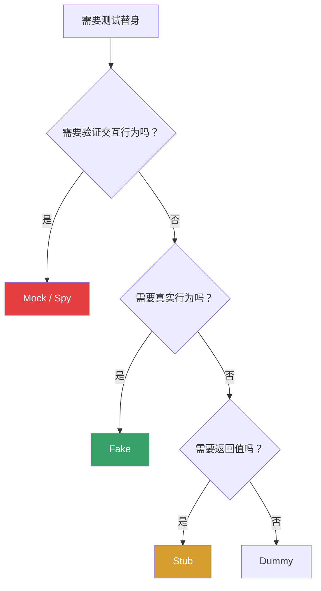
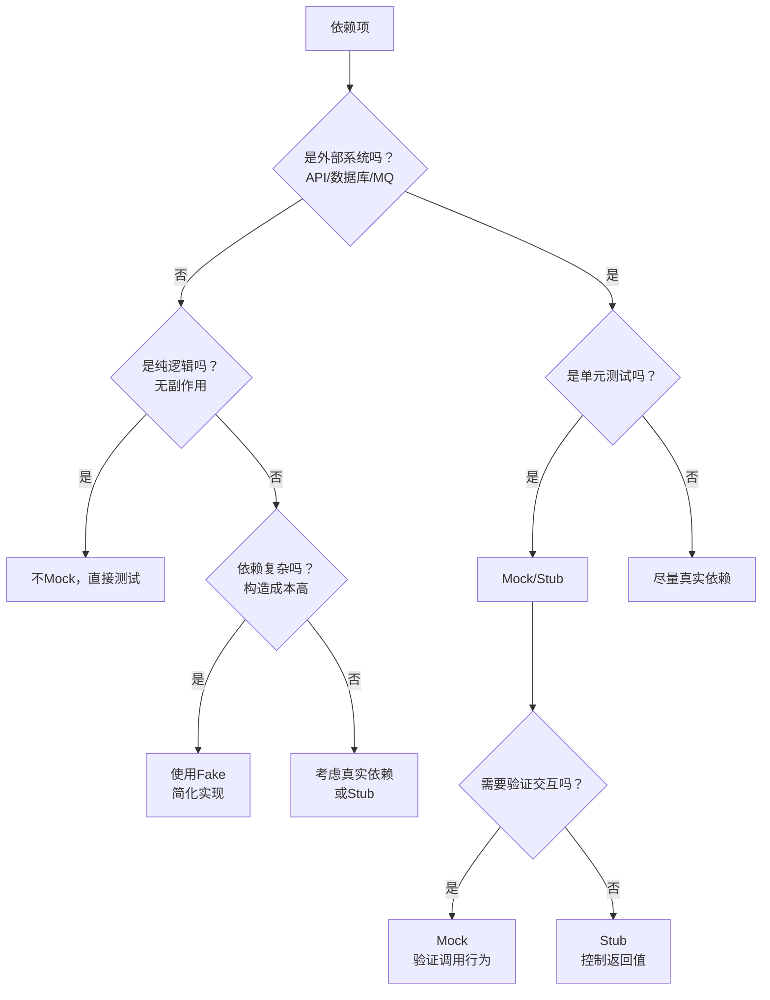
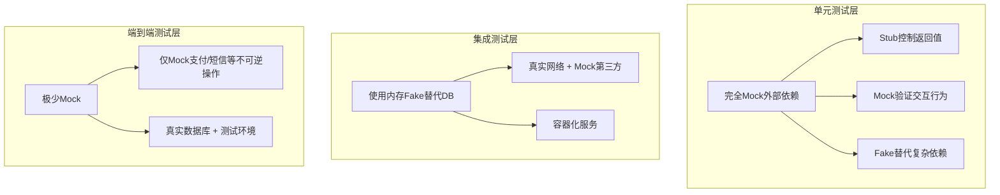
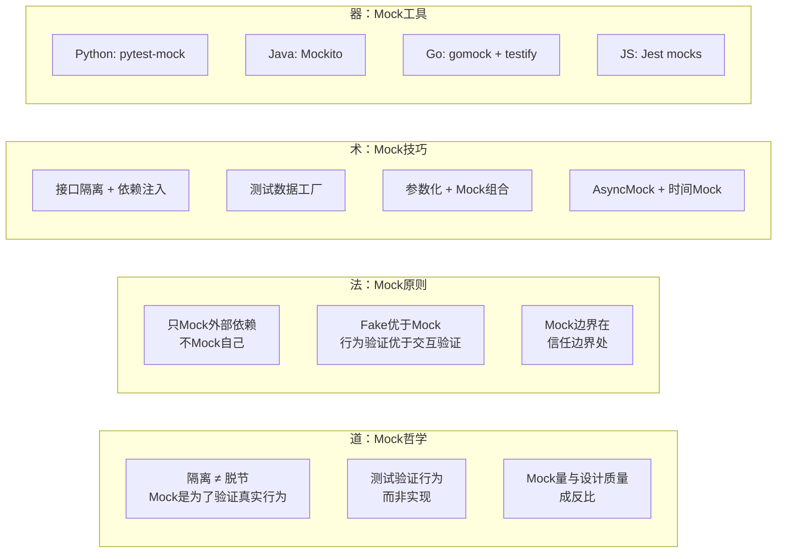

## 高效的Mock策略：隔离、验证与真实性的平衡艺术

单元测试的核心挑战之一是：被测代码几乎总是依赖其他组件——数据库查询用户信息、支付网关处理扣款、邮件服务发送通知、时钟获取当前时间。直接调用这些真实依赖会让测试变慢、变脆弱、变得不可控。Mock策略就是解决这个问题的系统化方法——**用可控的替身替代不可控的依赖，让测试在隔离环境中快速、可靠地执行**。

但Mock不是万能药。过度Mock会让测试与真实行为脱节，导致"测试全绿、生产全红"的灾难。本节将从**为什么Mock**、**Mock什么**、**怎么Mock**、**什么时候不Mock**四个维度，构建一套完整的Mock实战策略。


---

### 一、测试替身全景：理解Mock的家族谱系

在深入Mock策略之前，必须先理清一个被广泛混淆的概念——**测试替身（Test Doubles）**。Gerard Meszaros 在《xUnit Test Patterns》中定义了五种测试替身，它们各有用途，而Mock只是其中之一。理解它们的区别，是选择正确策略的基础。

| 替身类型 | 英文 | 核心职责 | 关注点 | 类比 |
|---------|------|---------|--------|------|
| **哑元** | Dummy | 占位，不参与逻辑 | 无 | 空白支票 |
| **桩件** | Stub | 提供预设的返回值 | 状态（返回什么） | 自动售货机 |
| **间谍** | Spy | 记录调用信息供事后验证 | 交互（被调用几次） | 录音笔 |
| **模拟件** | Mock | 预设期望，自动验证交互 | 交互（是否按约定调用） | 考试标准答案 |
| **伪件** | Fake | 简化的真实实现 | 行为（功能等价但更轻量） | 飞行模拟器 |

```python
# ============ Dummy ============
# 占位用，不会被真正调用
class DummyEmailSender:
    def send(self, to, subject, body):
        pass  # 永远不会被调用

# ============ Stub ============
# 返回预设值，不关心被调用几次
class StubUserRepository:
    def get_user(self, user_id):
        return User(id=1, name="Alice", email="alice@test.com")

# ============ Spy ============
# 记录调用信息，测试后手动检查
class SpyUserRepository:
    def __init__(self):
        self.calls = []
    
    def get_user(self, user_id):
        self.calls.append(("get_user", user_id))
        return User(id=user_id, name="Alice")
    
    def save_user(self, user):
        self.calls.append(("save_user", user.id))

# 测试后检查
def test_user_lookup(spy_repo):
    service = UserService(spy_repo)
    service.find_user(42)
    assert spy_repo.calls == [("get_user", 42)]

# ============ Mock ============
# 预设期望，自动验证
from unittest.mock import Mock

def test_user_lookup_mock():
    mock_repo = Mock()
    mock_repo.get_user.return_value = User(id=1, name="Alice")
    
    service = UserService(mock_repo)
    result = service.find_user(42)
    
    mock_repo.get_user.assert_called_once_with(42)  # 自动验证

# ============ Fake ============
# 简化的真实实现，有实际逻辑
class FakeUserRepository:
    def __init__(self):
        self._store = {}  # 内存存储
    
    def get_user(self, user_id):
        return self._store.get(user_id)
    
    def save_user(self, user):
        self._store[user.id] = user

# Fake有真实的行为逻辑，测试验证的是业务结果而非交互
def test_user_lookup_fake():
    fake_repo = FakeUserRepository()
    fake_repo.save_user(User(id=1, name="Alice"))
    
    service = UserService(fake_repo)
    result = service.find_user(1)
    assert result.name == "Alice"  # 验证业务结果
```

**选择决策树**：



**核心原则**：Fake > Mock。Fake验证行为结果，Mock验证交互细节。Fake更接近真实行为，对重构更友好。只有当Fake的构造成本过高时，才降级使用Mock。

---

### 二、为什么需要Mock策略

#### 2.1 单元测试的隔离性要求

单元测试（Unit Testing）的定义要求被测单元与外部依赖完全隔离。Gerard Meszaros 在《xUnit Test Patterns》中指出，单元测试必须满足 **F.I.R.S.T** 原则：

| 原则 | 含义 | 无Mock时的问题 |
|------|------|---------------|
| **F**ast（快速） | 毫秒级执行 | 数据库查询、网络请求耗时数秒 |
| **I**ndependent（独立） | 测试之间互不影响 | 共享数据库状态导致测试顺序依赖 |
| **R**epeatable（可重复） | 任何环境结果一致 | 第三方服务不可用则测试失败 |
| **S**elf-validating（自验证） | 结果明确通过/失败 | 外部副作用难以断言 |
| **T**imely（及时） | 随代码同步编写 | 需要搭建真实环境才能写测试 |

Mock是实现隔离性的核心手段。通过Mock，你可以让支付网关总是返回成功、让数据库总是返回特定数据、让时钟总是返回固定时间——**测试从依赖不可控的外部世界，变为完全可控的确定性环境**。

#### 2.2 依赖的不可控性

真实系统的依赖往往具有以下特征：

外部依赖的不可控性
├── 网络延迟：第三方API响应从50ms到5s不等
├── 服务可用性：支付网关可能宕机、邮件服务可能限流
├── 数据状态：数据库中的数据随时间变化，测试结果不可预测
├── 并发行为：消息队列的消费顺序、数据库锁竞争
├── 时间依赖：基于时间的逻辑（过期判断、定时任务）依赖系统时钟
├── 非确定性：随机数、GUID、哈希碰撞等产生不同结果
└── 环境差异：开发/测试/生产环境的配置差异

Mock将这些不可控因素替换为可控的确定性行为，让测试变成**纯逻辑验证**。

#### 2.3 测试速度的经济账

一个典型的微服务项目单元测试执行时间对比：

| 测试方式 | 单次执行时间 | 每日执行次数（CI） | 每日总耗时 | 开发者体验 |
|----------|-------------|-------------------|-----------|-----------|
| 全部真实依赖 | 30-60秒 | 50次 | 25-50分钟 | 频繁打断心流 |
| 合理Mock | 2-5秒 | 50次 | 2-4分钟 | 即时反馈 |
| 合理Mock + 并行 | 1-2秒 | 50次 | 1-2分钟 | 无感知 |

时间差异直接影响开发效率。当测试在10秒内给出反馈，开发者会频繁运行；当测试需要1一分钟，开发者会攒一堆代码再跑——而攒得越多，修复bug的成本就越高。根据Google的工程实践报告，**从提交到测试反馈超过10分钟，修复成本呈指数增长**。

---

### 三、Mock的决策框架：什么时候Mock，什么时候不Mock

Mock不是越多越好。过度Mock是最常见的测试反模式之一——它让测试通过了，但验证的不是真实行为。一个实用的决策框架：



#### 3.1 必须Mock的场景

**外部网络服务**：HTTP调用、RPC调用、第三方API（支付、短信、推送）。

```python
# 必须Mock：支付网关是外部服务，不可在测试中真实调用
def test_order_payment_success():
    payment_gateway = Mock(spec=PaymentGateway)
    payment_gateway.charge.return_value = {"status": "success", "txn_id": "txn_001"}
    
    order_service = OrderService(payment_gateway)
    result = order_service.pay_order(order_id=123, amount=99.99)
    
    assert result.success is True
    assert result.transaction_id == "txn_001"
    payment_gateway.charge.assert_called_once_with(
        amount=99.99, currency="CNY", order_id=123
    )
```

**数据库操作**（单元测试层面）：真实数据库需要启动、建表、造数据，远超单元测试的速度要求。

**时间依赖**：任何依赖 `datetime.now()` 的逻辑都应该Mock时钟。

```python
from unittest.mock import patch
from datetime import datetime

def test_token_not_expired():
    """验证Token在有效期内不会过期"""
    fixed_time = datetime(2026, 6, 26, 12, 0, 0)
    
    with patch('myapp.utils.datetime') as mock_dt:
        mock_dt.now.return_value = fixed_time
        
        token_service = TokenService()
        token = token_service.create(user_id=1, ttl_hours=24)
        
        # 在固定时间检查，token应该有效
        assert token_service.is_valid(token) is True
        
        # 模拟时间推进25小时后
        mock_dt.now.return_value = datetime(2026, 6, 27, 13, 0, 0)
        assert token_service.is_valid(token) is False
```

**文件系统**：读写文件应该用临时目录或Mock文件操作。

**消息队列的发布/消费**：单元测试中不应真实发送消息到Kafka/RabbitMQ。

#### 3.2 不应该Mock的场景

**纯逻辑函数**：没有依赖、没有副作用的函数不需要Mock。

```python
# 不需要Mock：纯函数，直接测试输入输出
def calculate_discount(total: float, user_level: str) -> float:
    """根据用户等级计算折扣"""
    discount_rates = {"bronze": 0, "silver": 0.05, "gold": 0.1, "diamond": 0.2}
    return total * discount_rates.get(user_level, 0)

# 直接测试即可
def test_gold_user_gets_10_percent_discount():
    assert calculate_discount(100.0, "gold") == 90.0
```

**值对象和DTO**：简单数据结构的创建和转换逻辑。

**自身依赖的业务逻辑**（"不要Mock你自己"）：

```python
# 反模式：Mock了自己的方法
class OrderService:
    def calculate_total(self, items):
        return sum(item.price * item.quantity for item in items)
    
    def place_order(self, items):
        total = self.calculate_total(items)
        # ...

# 错误的测试
def test_place_order():
    service = OrderService()
    with patch.object(service, 'calculate_total', return_value=100):
        # 这个测试验证的是mock的行为，不是真实的calculate_total
        service.place_order([...])
```

**在集成测试层**：集成测试的目的就是验证组件间的真实交互，Mock应该尽量少。

#### 3.3 Mock量的黄金法则

一条经验法则：**单元测试中Mock的依赖数量不应超过3-5个**。如果一个被测类需要Mock 7-8个依赖才能测试，这不是Mock的问题——这是**设计的问题**。该类承担了太多职责，需要重构。

```python
# 反模式：过多依赖 = 过多Mock = 设计问题
class OrderProcessor:
    def __init__(self, db, cache, payment, email, sms, push, 
                 inventory, shipping, audit, analytics):
        # 10个依赖！测试需要Mock 10个对象
        pass

# 正确的做法：职责拆分
class OrderProcessor:
    def __init__(self, payment_service, order_repository):
        # 核心职责只有2个依赖
        pass
```

#### 3.4 依赖注入：可测试性的设计基础

Mock的效率很大程度上取决于代码的可测试性。**依赖注入（Dependency Injection）**是实现可测试性的核心设计模式。

```python
# 反模式：硬编码依赖，无法Mock
class OrderService:
    def __init__(self):
        self.db = MySQLDatabase()        # 硬编码！无法替换
        self.payment = StripeGateway()   # 硬编码！无法替换
        self.email = SMTPEmail()         # 硬编码！无法替换

# 正确：依赖注入，方便Mock
class OrderService:
    def __init__(self, db, payment, email):
        self.db = db
        self.payment = payment
        self.email = email

# 生产环境
service = OrderService(MySQLDatabase(), StripeGateway(), SMTPEmail())

# 测试环境
service = OrderService(FakeDB(), FakePayment(), FakeEmail())
```

**依赖注入的三种形式**：

| 形式 | 实现方式 | 优点 | 缺点 |
|------|---------|------|------|
| 构造器注入 | 通过构造函数传入 | 依赖明确，初始化时强制 | 参数过多时冗长 |
| Setter注入 | 通过setter方法传入 | 灵活，可选依赖 | 依赖可能遗漏 |
| 接口注入 | 通过接口方法注入 | 强制实现接口 | 增加接口数量 |

**推荐构造器注入**——它让依赖关系在构造时就明确可见，测试时可以轻松替换为Mock或Fake。

---

### 四、六大Mock策略详解

#### 策略一：接口隔离 Mock（Ports & Adapters）

这是最推荐的Mock策略——**通过定义接口（或抽象类）来隔离外部依赖，测试时Mock接口而非具体实现**。

```python
from abc import ABC, abstractmethod

# 定义抽象接口
class NotificationPort(ABC):
    @abstractmethod
    def send(self, user_id: int, message: str) -> bool:
        ...

class EmailNotification(NotificationPort):
    """真实实现：通过SMTP发送邮件"""
    def __init__(self, smtp_client):
        self._smtp = smtp_client
    
    def send(self, user_id: int, message: str) -> bool:
        user = self._smtp.get_user_email(user_id)
        return self._smtp.send_email(user, message)

class FakeNotification(NotificationPort):
    """Fake实现：内存中记录所有发送记录，不真实发送"""
    def __init__(self):
        self.sent_messages = []
    
    def send(self, user_id: int, message: str) -> bool:
        self.sent_messages.append({"user_id": user_id, "message": message})
        return True

# 被测代码依赖接口，不依赖具体实现
class OrderService:
    def __init__(self, notification: NotificationPort, order_repo):
        self._notification = notification
        self._order_repo = order_repo
    
    def complete_order(self, order_id: int):
        order = self._order_repo.get(order_id)
        order.status = "completed"
        self._order_repo.save(order)
        self._notification.send(order.user_id, f"订单{order_id}已完成")
        return order

# 测试代码：注入Fake，不Mock任何东西
def test_complete_order_sends_notification():
    fake_notification = FakeNotification()
    order_repo = InMemoryOrderRepository()
    order_repo.save(Order(id=1, user_id=100, status="pending"))
    
    service = OrderService(fake_notification, order_repo)
    service.complete_order(order_id=1)
    
    assert len(fake_notification.sent_messages) == 1
    assert fake_notification.sent_messages[0]["user_id"] == 100
    assert "已完成" in fake_notification.sent_messages[0]["message"]
```

**优势**：测试验证的是**行为结果**（消息是否被正确发送）而非**实现细节**（是否调用了某个方法）。当重构内部实现时，测试不会因为Mock绑定而断裂。

**适用场景**：外部依赖较多、需要长期维护的项目。

#### 策略二：Mock框架的精确控制

当接口隔离不够（遗留代码、第三方库）时，Mock框架提供精确的交互控制。以Python `unittest.mock` 为核心示例：

**基础用法：Mock + 返回值设置**

```python
from unittest.mock import Mock, MagicMock, patch, call

# 创建Mock对象并设置返回值
def test_user_authentication():
    # 创建Mock，指定spec防止拼写错误
    auth_provider = Mock(spec=OAuthProvider)
    
    # 设置不同输入的返回值（side_effect支持多值返回）
    auth_provider.validate_token.side_effect = [
        {"user_id": 1, "role": "admin"},   # 第一次调用
        None,                                 # 第二次调用（token无效）
    ]
    
    auth_service = AuthService(auth_provider)
    
    # 第一次验证：有效token
    result = auth_service.authenticate("valid_token_abc")
    assert result.user_id == 1
    assert result.role == "admin"
    
    # 第二次验证：无效token
    result = auth_service.authenticate("expired_token_xyz")
    assert result is None
```

**参数匹配器（Argument Matchers）**

```python
from unittest.mock import ANY, call

def test_logging_records_correct_format():
    logger = Mock()
    service = AuditService(logger)
    
    service.record_action(user_id=42, action="login", ip="192.168.1.1")
    
    # 使用ANY匹配器——只验证关键参数
    logger.info.assert_called_once_with(
        "user_action",  # 固定值
        extra={
            "user_id": 42,
            "action": "login",
            "ip": ANY,           # 不关心IP的具体值
            "timestamp": ANY,    # 不关心时间戳的具体值
        }
    )
```

**异常模拟**

```python
import requests

def test_retry_on_network_error():
    """验证网络异常时的重试逻辑"""
    api_client = Mock(spec=APIClient)
    
    # 模拟：前两次调用失败，第三次成功
    api_client.get.side_effect = [
        requests.ConnectionError("Connection refused"),
        requests.Timeout("Request timed out"),
        {"status": "ok", "data": "result"},
    ]
    
    resilience = ResilientClient(api_client, max_retries=3)
    result = resilience.fetch_with_retry("/api/data")
    
    assert result["status"] == "ok"
    assert api_client.get.call_count == 3  # 确认重试了3次
```

**side_effect 的高级用法：动态返回值**

```python
def test_dynamic_pricing():
    """模拟依赖外部数据的动态行为"""
    price_service = Mock()
    
    # 使用函数作为side_effect，实现动态返回逻辑
    def dynamic_price(product_id):
        prices = {"P001": 29.99, "P002": 49.99, "P003": 99.99}
        return prices.get(product_id, 0.0)
    
    price_service.get_price.side_effect = dynamic_price
    
    checkout = CheckoutService(price_service)
    total = checkout.calculate_total(["P001", "P002", "P001"])
    
    assert total == 29.99 + 49.99 + 29.99  # 109.97
```

#### 策略三：上下文管理器 Mock（Context Manager Mock）

适用于需要 `with` 语句管理生命周期的依赖，如数据库连接、文件操作、事务管理。

```python
from unittest.mock import Mock, patch, MagicMock

class DatabaseTransaction:
    """数据库事务上下文管理器"""
    def __enter__(self):
        self.conn = self._connect()
        self.cursor = self.conn.cursor()
        return self.cursor
    
    def __exit__(self, exc_type, exc_val, exc_tb):
        if exc_type is None:
            self.conn.commit()
        else:
            self.conn.rollback()
        self.cursor.close()
        self.conn.close()

# Mock上下文管理器的两种方式

def test_commit_on_success():
    """验证正常完成时事务提交"""
    mock_cursor = MagicMock()
    mock_conn = MagicMock()
    mock_conn.cursor.return_value = mock_cursor
    
    with patch.object(DatabaseTransaction, '_connect', return_value=mock_conn):
        with DatabaseTransaction() as cursor:
            cursor.execute("INSERT INTO orders ...")
        
        mock_conn.commit.assert_called_once()
        mock_conn.rollback.assert_not_called()

def test_rollback_on_error():
    """验证异常时事务回滚"""
    mock_cursor = MagicMock()
    mock_conn = MagicMock()
    mock_conn.cursor.return_value = mock_cursor
    
    with patch.object(DatabaseTransaction, '_connect', return_value=mock_conn):
        try:
            with DatabaseTransaction() as cursor:
                cursor.execute("INSERT INTO orders ...")
                raise ValueError("数据校验失败")
        except ValueError:
            pass
        
        mock_conn.rollback.assert_called_once()
        mock_conn.commit.assert_not_called()
```

#### 策略四：Mock外部API的HTTP交互

测试中Mock HTTP调用是最常见的需求之一。推荐分层策略：

```python
# 层级1：Mock HTTP层（适合简单场景）
from unittest.mock import patch
import requests

def test_fetch_user_from_api():
    with patch('requests.get') as mock_get:
        mock_get.return_value.status_code = 200
        mock_get.return_value.json.return_value = {
            "id": 1, "name": "Alice", "email": "alice@example.com"
        }
        
        user = UserAPIClient().get_user(user_id=1)
        
        assert user.name == "Alice"
        mock_get.assert_called_once_with(
            "https://api.example.com/users/1",
            headers={"Authorization": "Bearer test_token"}
        )

# 层级2：使用responses库（推荐，更简洁）
import responses

@responses.activate
def test_create_user_via_api():
    """使用responses库mock HTTP请求"""
    responses.post(
        "https://api.example.com/users",
        json={"id": 1, "name": "Bob"},
        status=201
    )
    
    client = UserAPIClient()
    user = client.create_user(name="Bob", email="bob@example.com")
    
    assert user.id == 1
    assert len(responses.calls) == 1
    assert responses.calls[0].request.body == b'{"name": "Bob", "email": "bob@example.com"}'

# 层级3：使用responses模拟错误和超时
@responses.activate
def test_api_timeout_handling():
    """验证超时重试逻辑"""
    # 第一次超时，第二次成功
    responses.add(
        responses.GET,
        "https://api.example.com/users/1",
        body=requests.Timeout("Connection timed out"),
    )
    responses.add(
        responses.GET,
        "https://api.example.com/users/1",
        json={"id": 1, "name": "Alice"},
        status=200,
    )
    
    client = UserAPIClient(max_retries=2)
    user = client.get_user_with_retry(user_id=1)
    
    assert user.name == "Alice"
    assert len(responses.calls) == 2
```

对于Java生态，**WireMock** 和 **MockServer** 提供完整的HTTP Mock服务，支持录制/回放模式——先调用真实API录制请求/响应，后续测试中回放录制的数据。

#### 策略五：Mock时间与时钟

时间依赖是测试中最隐蔽的陷阱。很多bug（token过期判断、定时任务触发、日志时间戳）都和时间有关。Mock时钟是确保这些测试确定性的关键。

```python
import time
from unittest.mock import patch
from datetime import datetime, timedelta
from freezegun import freeze_time  # pip install freezegun

# 方式一：使用freezegun（推荐，API最友好）
@freeze_time("2026-06-26 12:00:00")
def test_token_expires_after_24_hours():
    token_service = TokenService()
    token = token_service.create(user_id=1, ttl_hours=24)
    
    # 在冻结的时间点，token有效
    assert token_service.is_valid(token) is True
    
    # 推进时间到24小时后
    with freeze_time("2026-06-27 12:00:01"):
        assert token_service.is_valid(token) is False

# 方式二：使用datetime的Mock
def test_order_timeout_cancellation():
    """验证30分钟未支付的订单自动取消"""
    base_time = datetime(2026, 6, 26, 12, 0, 0)
    
    with patch('myapp.utils.datetime') as mock_dt:
        mock_dt.now.return_value = base_time
        mock_dt.side_effect = lambda *args, **kwargs: datetime(*args, **kwargs)
        
        order_service = OrderService()
        order = order_service.create_order(user_id=1, items=[...])
        
        # 刚创建的订单未超时
        assert order.status == "pending"
        
        # 推进31分钟
        mock_dt.now.return_value = base_time + timedelta(minutes=31)
        
        order_service.check_expired_orders()
        order = order_service.get_order(order.id)
        assert order.status == "cancelled"

# 方式三：Mock time.time()
def test_rate_limiter():
    """验证限流器在窗口过期后重置计数"""
    with patch('time.time') as mock_time:
        mock_time.return_value = 1000.0
        
        limiter = RateLimiter(max_requests=3, window_seconds=60)
        
        # 前3次请求应该通过
        assert limiter.allow("user_1") is True
        assert limiter.allow("user_1") is True
        assert limiter.allow("user_1") is True
        
        # 第4次应该被限流
        assert limiter.allow("user_1") is False
        
        # 窗口过期后应该重置
        mock_time.return_value = 1061.0  # 61秒后
        assert limiter.allow("user_1") is True
```

#### 策略六：Mock随机数与非确定性

```python
import random
import uuid
from unittest.mock import patch

def test_deterministic_randomness():
    """让随机数生成变得确定"""
    with patch('random.randint', return_value=42):
        # 验证基于随机数的逻辑
        lottery = LotteryService()
        result = lottery.generate_ticket(numbers_count=6)
        
        # 所有随机数都被固定为42
        assert all(n == 42 for n in result.numbers)

def test_unique_id_generation():
    """Mock UUID生成，确保测试中的ID可预测"""
    fixed_uuid = uuid.UUID("12345678-1234-5678-1234-567812345678")
    
    with patch('uuid.uuid4', return_value=fixed_uuid):
        order = OrderService().create_order(user_id=1, items=[...])
        assert order.id == "12345678-1234-5678-1234-567812345678"
```

---

### 五、跨语言Mock工具选型

不同语言生态有不同的Mock哲学和工具链，了解它们的差异有助于选择最适合的方案。

| 语言 | Mock框架 | Mock哲学 | 特色能力 | 适用场景 |
|------|---------|---------|---------|---------|
| Python | `unittest.mock` + `pytest-mock` | 内置，Monkey Patch | `patch`上下文管理器，`spec`类型安全 | 快速Mock，动态语言优势 |
| Java | Mockito / JMockit | 接口代理，声明式 | `@Mock`注解，`verify()`链式调用 | 企业级Java项目 |
| JavaScript/TS | Jest `jest.fn()` / Sinon | 函数式Mock | `mockResolvedValue`异步Mock | 前端/Node.js项目 |
| Go | gomock / testify/mock | 接口驱动 | 编译时类型检查，`EXPECT()`语法 | Go的隐式接口优势 |
| C# | Moq / NSubstitute | Lambda表达式 | 流畅API，自动属性匹配 | .NET生态 |
| Ruby | RSpec Mocks / Mocha | 行为验证 | `receive(:method).and_return()` | Rails项目 |

#### Python生态：pytest-mock 最佳实践

`pytest-mock` 是 `unittest.mock` 的增强包装，提供了更简洁的API和fixture集成：

```python
import pytest

# 使用mocker fixture（pytest-mock提供）
def test_send_notification(mocker):
    """pytest-mock的mocker fixture简化了Mock的使用"""
    # 自动在测试结束后清理Mock
    mock_email = mocker.patch('myapp.services.EmailService')
    mock_email.send.return_value = True
    
    # mock_spec防止属性拼写错误
    mock_user_repo = mocker.patch('myapp.repositories.UserRepository')
    mock_user_repo.get.return_value = User(id=1, email="test@example.com")
    
    notification_service = NotificationService(mock_email, mock_user_repo)
    result = notification_service.send_welcome(1)
    
    assert result is True
    mock_email.send.assert_called_once_with(
        to="test@example.com",
        subject="欢迎加入",
        body=ANY
    )

# 捕获Mock的调用参数用于复杂断言
def test_bulk_email_sending(mocker):
    mock_email = mocker.patch('myapp.services.EmailService')
    
    service = NotificationService(mock_email, fake_user_repo)
    service.send_bulk(user_ids=[1, 2, 3], message="系统通知")
    
    # 获取所有调用的参数
    calls = mock_email.send.call_args_list
    assert len(calls) == 3
    
    recipients = [c.kwargs['to'] for c in calls]
    assert "alice@example.com" in recipients
    assert "bob@example.com" in recipients
    assert "charlie@example.com" in recipients
```

#### Java生态：Mockito核心模式

```java
import org.junit.jupiter.api.Test;
import org.junit.jupiter.api.extension.ExtendWith;
import org.mockito.Mock;
import org.mockito.junit.jupiter.MockitoExtension;

import static org.assertj.core.api.Assertions.assertThat;
import static org.mockito.Mockito.*;

@ExtendWith(MockitoExtension.class)
class OrderServiceTest {

    @Mock
    PaymentGateway paymentGateway;

    @Mock
    OrderRepository orderRepository;

    @Test
    void should_process_payment_and_save_order() {
        // Given：设置Mock行为
        when(paymentGateway.charge(any(Order.class)))
            .thenReturn(PaymentResult.success("txn_123"));
        
        Order order = new Order(1L, BigDecimal.valueOf(99.99));
        
        // When：执行被测方法
        OrderService service = new OrderService(paymentGateway, orderRepository);
        OrderResult result = service.processOrder(order);
        
        // Then：验证结果和交互
        assertThat(result.isSuccess()).isTrue();
        assertThat(result.getTransactionId()).isEqualTo("txn_123");
        
        // 验证交互行为
        verify(paymentGateway, times(1))
            .charge(argThat(o -> o.getAmount().equals(BigDecimal.valueOf(99.99))));
        verify(orderRepository).save(argThat(o -> o.getStatus() == OrderStatus.PAID));
    }

    @Test
    void should_handle_payment_failure() {
        when(paymentGateway.charge(any()))
            .thenThrow(new PaymentException("余额不足"));
        
        Order order = new Order(1L, BigDecimal.valueOf(99.99));
        OrderService service = new OrderService(paymentGateway, orderRepository);
        
        OrderResult result = service.processOrder(order);
        
        assertThat(result.isSuccess()).isFalse();
        assertThat(result.getErrorMessage()).contains("余额不足");
        // 支付失败，不应保存订单
        verify(orderRepository, never()).save(any());
    }
}
```

#### Go生态：接口驱动的Mock

Go没有内置Mock框架，但Go的隐式接口让Mock非常自然：

```go
// 定义接口
type PaymentGateway interface {
    Charge(amount float64, currency string) (*PaymentResult, error)
}

// 创建Mock实现
type MockPaymentGateway struct {
    ChargeFunc  func(amount float64, currency string) (*PaymentResult, error)
    ChargeCalls []ChargeCall
}

type ChargeCall struct {
    Amount   float64
    Currency string
}

func (m *MockPaymentGateway) Charge(amount float64, currency string) (*PaymentResult, error) {
    m.ChargeCalls = append(m.ChargeCalls, ChargeCall{amount, currency})
    if m.ChargeFunc != nil {
        return m.ChargeFunc(amount, currency)
    }
    return &amp;PaymentResult{Success: true, TxnID: "mock_txn"}, nil
}

// 测试代码
func TestOrderService_ProcessOrder(t *testing.T) {
    mockPayment := &amp;MockPaymentGateway{
        ChargeFunc: func(amount float64, currency string) (*PaymentResult, error) {
            return &amp;PaymentResult{Success: true, TxnID: "txn_123"}, nil
        },
    }
    mockRepo := NewInMemoryOrderRepository()
    
    service := NewOrderService(mockPayment, mockRepo)
    result := service.ProcessOrder(100.0, "CNY")
    
    if !result.Success {
        t.Errorf("expected success, got failure: %s", result.Error)
    }
    if len(mockPayment.ChargeCalls) != 1 {
        t.Errorf("expected 1 charge call, got %d", len(mockPayment.ChargeCalls))
    }
}
```

---

### 六、Mock测试的组织模式

#### 6.1 Given-When-Then 结构

所有Mock测试都应遵循清晰的三段式结构：

```python
def test_cancel_order_refunds_payment():
    # ===== GIVEN：设置测试前置条件 =====
    mock_payment = Mock(spec=PaymentGateway)
    mock_payment.refund.return_value = RefundResult(success=True)
    
    order_repo = InMemoryOrderRepository()
    order_repo.save(Order(id=1, status="paid", payment_txn="txn_001"))
    
    service = OrderService(mock_payment, order_repo)
    
    # ===== WHEN：执行被测行为 =====
    result = service.cancel_order(order_id=1, reason="用户主动取消")
    
    # ===== THEN：验证期望结果 =====
    # 结果验证
    assert result.success is True
    order = order_repo.get(1)
    assert order.status == "cancelled"
    
    # 交互验证
    mock_payment.refund.assert_called_once_with(
        transaction_id="txn_001",
        reason="用户主动取消"
    )
```

#### 6.2 测试数据工厂（Test Data Factory）

当Mock对象的构造比较复杂时，使用工厂函数简化测试代码：

```python
def make_user(**overrides):
    """用户测试数据工厂：默认值 + 按需覆盖"""
    defaults = {
        "id": 1,
        "name": "Test User",
        "email": "test@example.com",
        "role": "user",
        "is_active": True,
    }
    defaults.update(overrides)
    return User(**defaults)

def make_order(**overrides):
    """订单测试数据工厂"""
    defaults = {
        "id": 1,
        "user_id": 1,
        "items": [OrderItem("Product A", 99.99, 1)],
        "status": "pending",
        "total": 99.99,
    }
    defaults.update(overrides)
    return Order(**defaults)

# 使用工厂：测试代码简洁且意图清晰
def test_admin_can_cancel_any_order():
    admin = make_user(role="admin")
    order = make_order(status="paid")
    mock_repo = Mock(spec=OrderRepository)
    mock_repo.get.return_value = order
    
    service = OrderService(mock_repo)
    result = service.cancel_order(order.id, cancelled_by=admin)
    
    assert result.success is True
```

#### 6.3 参数化测试 + Mock

减少重复的Mock测试代码：

```python
import pytest

@pytest.mark.parametrize("user_role, expected_can_cancel", [
    ("admin", True),
    ("moderator", True),
    ("user", False),
    ("guest", False),
])
def test_role_based_order_cancellation(user_role, expected_can_cancel):
    user = make_user(role=user_role)
    order = make_order(status="pending")
    mock_repo = Mock(spec=OrderRepository)
    mock_repo.get.return_value = order
    
    service = OrderService(mock_repo)
    result = service.cancel_order(order.id, cancelled_by=user)
    
    assert result.success is expected_can_cancel
    if expected_can_cancel:
        mock_repo.save.assert_called_once()
    else:
        mock_repo.save.assert_not_called()
```

---

### 七、常见的Mock反模式

#### 反模式一：过度Mock（Over-Mocking）

```python
# 反模式：Mock了一切，测试验证的是Mock行为而非真实逻辑
def test_over_mocked():
    mock_calc = Mock()
    mock_calc.add.return_value = 5
    mock_calc.subtract.return_value = 3
    mock_calc.multiply.return_value = 15
    
    service = CalculatorService(mock_calc)
    result = service.complex_calculation(1, 2)
    # 这个测试通过只能证明你正确设置了Mock返回值
    assert result == 15

# 正确：只Mock外部依赖，保留内部逻辑
def test_properly_mocked():
    external_api = Mock(spec=PriceAPI)
    external_api.get_price.return_value = 99.99
    
    calculator = PriceCalculator(external_api)
    result = calculator.calculate_total_with_tax(quantity=3)
    
    assert result == pytest.approx(99.99 * 3 * 1.13)  # 含税总价
    external_api.get_price.assert_called_once()
```

#### 反模式二：Mock验证实现细节

```python
# 反模式：验证了内部实现步骤
def test_impl_detail():
    service = OrderService(mock_repo, mock_email)
    service.process_order(order)
    
    # 这些测试绑定了实现——重构内部调用顺序就会失败
    mock_repo.get.assert_called_once()
    mock_repo.save.assert_called_once()  # save的调用时机不应该被验证
    mock_email.send.assert_called_once()

# 正确：验证最终状态
def test_behavior_outcome():
    service = OrderService(mock_repo, mock_email)
    service.process_order(order)
    
    # 只验证关键的业务行为
    saved_order = mock_repo.save.call_args[0][0]
    assert saved_order.status == "paid"
    assert saved_order.paid_at is not None
```

#### 反模式三：Mock链式调用

```python
# 反模式：Mock了调用链，测试极其脆弱
def test_chained_mock():
    mock_db = Mock()
    mock_db.get_user().get_orders().filter().first().get_items()
    # 这种链式Mock一旦任何环节重构就会全部失败

# 正确：将链式调用封装为一个方法，Mock该方法
def test_single_method_mock():
    mock_repo = Mock(spec=OrderRepository)
    mock_repo.get_user_cart.return_value = Cart(items=[...])
    
    checkout = CheckoutService(mock_repo)
    result = checkout.process_cart(user_id=1)
    
    assert result.total == 99.99
```

#### 反模式四：Mock测试的顺序依赖

```python
# 反模式：测试之间共享Mock状态
class OrderTest:
    mock_repo = Mock()  # 类级别的Mock会在测试间共享状态
    
    def test_create_order(self):
        self.mock_repo.save.return_value = Order(id=1)
        service = OrderService(self.mock_repo)
        order = service.create(...)
    
    def test_cancel_order(self):
        # 这里mock_repo可能保留了test_create_order的调用记录
        self.mock_repo.get.return_value = Order(id=1, status="paid")
        service = OrderService(self.mock_repo)
        service.cancel(1)

# 正确：每个测试独立创建Mock
class OrderTest:
    def test_create_order(self):
        mock_repo = Mock(spec=OrderRepository)  # 每次新建
        mock_repo.save.return_value = Order(id=1)
        service = OrderService(mock_repo)
        order = service.create(...)
        mock_repo.save.assert_called_once()
    
    def test_cancel_order(self):
        mock_repo = Mock(spec=OrderRepository)  # 全新的Mock
        mock_repo.get.return_value = Order(id=1, status="paid")
        service = OrderService(mock_repo)
        service.cancel(1)
```

#### 反模式五：Mock返回值与真实行为脱节

```python
# 反模式：Mock返回值过于理想化，与真实行为脱节
def test_unrealistic_mock():
    mock_db = Mock()
    # 真实数据库查询会返回None、空列表、异常等
    # 但Mock总是返回完美数据
    mock_db.query.return_value = [{"id": 1, "name": "完美用户"}]
    
    # 这个测试通过了，但生产环境中可能因为数据库返回空结果而崩溃

# 正确：模拟真实的边界情况
def test_realistic_mock():
    mock_db = Mock()
    
    # 模拟真实的数据库行为
    mock_db.query.side_effect = [
        [{"id": 1, "name": "正常用户"}],  # 正常情况
        [],  # 空结果
        None,  # 查询失败
    ]
    
    service = UserService(mock_db)
    
    # 测试正常情况
    users = service.find_active_users()
    assert len(users) == 1
    
    # 测试空结果（应该优雅处理）
    users = service.find_active_users()
    assert users == []
```

---

### 八、高级Mock技巧

#### 8.1 Mock的调用验证进阶

```python
def test_call_order_verification():
    """验证方法调用的顺序"""
    mock_db = Mock()
    mock_cache = Mock()
    
    service = DataService(mock_db, mock_cache)
    service.get_data("key_1")
    
    # 验证调用顺序：先查缓存，再查数据库
    expected_order = [
        call.get("key_1"),      # 1. 查缓存
        call.set("key_1", ANY), # 2. 写缓存
    ]
    mock_db.method_calls == expected_order

def test_call_count_assertions():
    """多种调用次数断言"""
    mock_repo = Mock()
    service = BatchProcessor(mock_repo)
    service.process_batch(items=[1, 2, 3, 4, 5])
    
    mock_repo.process.assert_called()          # 至少调用1次
    mock_repo.process.assert_called_once()     # 恰好调用1次
    mock_repo.process.assert_called_with(3)    # 最后一次的参数
    mock_repo.process.assert_any_call(1)       # 有一次调用参数是1
    assert mock_repo.process.call_count == 5   # 总共5次
    
    # 检查所有调用的参数列表
    expected_calls = [call(1), call(2), call(3), call(4), call(5)]
    mock_repo.process.assert_has_calls(expected_calls, any_order=False)
```

#### 8.2 Mock的 `spec` 类型安全

```python
# 没有spec：可以调用任何属性，拼写错误不会报错
mock_user = Mock()
mock_user.naem = "Alice"  # 拼写错误！但不会报错
mock_user.get_naem()      # 同样不会报错

# 有spec：只能访问真实对象的属性
mock_user = Mock(spec=User)
mock_user.name = "Alice"   # OK
mock_user.naem = "Alice"   # AttributeError! 编译期即可发现

# spec_instance：使用真实实例作为spec（保留属性值）
real_user = User(id=1, name="Alice", email="alice@example.com")
mock_user = Mock(spec=real_user)
# mock_user.name 返回的是spec值 "Alice"，不是Mock默认值
assert mock_user.name == "Alice"
```

#### 8.3 自定义Mock类

当Mock框架的默认行为不够用时，可以创建领域特定的Mock：

```python
class FakePaymentGateway:
    """领域特定的Fake：行为完整的简化支付网关"""
    
    def __init__(self):
        self.transactions = []
        self.balance = Decimal("10000.00")
        self.fail_next = False  # 可控的故障注入
    
    def charge(self, amount: Decimal, currency: str = "CNY") -> PaymentResult:
        if self.fail_next:
            self.fail_next = False
            return PaymentResult(success=False, error="模拟支付失败")
        
        if amount > self.balance:
            return PaymentResult(success=False, error="余额不足")
        
        self.balance -= amount
        txn_id = f"txn_{len(self.transactions) + 1:04d}"
        self.transactions.append({
            "id": txn_id, "amount": amount, 
            "currency": currency, "status": "success"
        })
        return PaymentResult(success=True, txn_id=txn_id)
    
    def refund(self, txn_id: str) -> RefundResult:
        txn = next((t for t in self.transactions if t["id"] == txn_id), None)
        if not txn:
            return RefundResult(success=False, error="交易不存在")
        self.balance += txn["amount"]
        txn["status"] = "refunded"
        return RefundResult(success=True)
    
    def get_balance(self) -> Decimal:
        return self.balance

# 使用FakePaymentGateway的测试
def test_payment_deduction():
    gateway = FakePaymentGateway()
    service = OrderService(gateway)
    
    result = service.pay_order(amount=Decimal("99.99"))
    
    assert result.success is True
    assert gateway.get_balance() == Decimal("9900.01")
    assert len(gateway.transactions) == 1

def test_payment_failure_injection():
    gateway = FakePaymentGateway()
    gateway.fail_next = True  # 下次支付会失败
    
    service = OrderService(gateway)
    result = service.pay_order(amount=Decimal("99.99"))
    
    assert result.success is False
    assert "模拟支付失败" in result.error
    assert gateway.get_balance() == Decimal("10000.00")  # 余额不变
```

#### 8.4 Async Mock

异步代码的Mock需要特殊的处理方式：

```python
import asyncio
import pytest
from unittest.mock import AsyncMock, Mock, patch

# Python 3.8+ 使用 AsyncMock
@pytest.mark.asyncio
async def test_async_api_call():
    mock_client = AsyncMock()
    mock_client.fetch_user.return_value = {"id": 1, "name": "Alice"}
    
    service = AsyncUserService(mock_client)
    user = await service.get_user(1)
    
    assert user.name == "Alice"
    mock_client.fetch_user.assert_awaited_once_with(1)

# 异步上下文管理器的Mock
@pytest.mark.asyncio
async def test_async_database_transaction():
    mock_cursor = AsyncMock()
    mock_cursor.execute = AsyncMock()
    mock_cursor.fetchall.return_value = [{"id": 1}]
    
    mock_conn = AsyncMock()
    mock_conn.cursor.return_value.__aenter__.return_value = mock_cursor
    
    with patch('myapp.db.get_connection', return_value=mock_conn):
        db = AsyncDatabase()
        result = await db.query("SELECT * FROM users")
        
        assert len(result) == 1
        mock_cursor.execute.assert_awaited_once_with("SELECT * FROM users")
```

---

### 九、Mock策略在不同测试层级的应用



| 测试层级 | Mock策略 | 使用的替身类型 | 目标 |
|----------|---------|---------------|------|
| 单元测试 | 完全隔离，全部Mock | Mock + Stub + Dummy + Fake | 验证单个类/方法的逻辑正确性 |
| 集成测试 | 部分Mock | Fake（内存DB） + 真实服务 | 验证组件间的协作 |
| 组件测试 | 最小化Mock | 仅Mock外部第三方服务 | 验证模块对外的接口 |
| 端到端测试 | 极少Mock | 仅Mock不可逆操作 | 验证完整用户流程 |

#### 契约测试：Mock的边界延伸

当微服务之间需要协作时，Mock的边界变得模糊。**契约测试（Contract Testing）** 解决了这个问题——定义服务间的交互契约，确保Mock与真实行为一致。

```python
# 契约定义（Provider端）
from pact import Provider

# 定义消费者对提供者的期望
def test_provider_contract():
    """验证支付服务的API契约"""
    expected_response = {
        "status": "success",
        "txn_id": "txn_123",
        "amount": 99.99
    }
    
    # 这个契约既是Mock的配置，也是真实API的验证
    mock_payment = Mock(spec=PaymentGateway)
    mock_payment.charge.return_value = expected_response
    
    # 测试消费者的逻辑
    service = OrderService(mock_payment)
    result = service.process_payment(99.99)
    
    assert result.txn_id == "txn_123"
    
    # 验证消费者调用提供者的格式是否符合契约
    mock_payment.charge.assert_called_once_with(
        amount=99.99,
        currency="CNY"
    )
```

**契约测试的价值**：Mock的返回值不再是随意编造的，而是由契约文档化的真实API行为。当API变更时，契约测试会自动失败，提醒你更新Mock。

---

### 十、Mock测试的质量保障

#### 10.1 变异测试验证Mock质量

变异测试（Mutation Testing）通过修改源代码来验证测试是否真正有效。如果Mock测试在源代码被故意破坏后仍然通过，说明测试质量有问题。

```bash
# Python使用mutmut进行变异测试
# pip install mutmut
mutmut run --paths-to-mutate=myapp/services/

# 查看结果
mutmut results
# 输出：
# Survivor: myapp/services/order_service.py:42
# Survived: 修改了 payment.charge() 的返回值检查，测试仍然通过 → 说明Mock测试没有验证这个逻辑
```

#### 10.2 Mock测试的审查清单

编写Mock测试后，检查以下问题：

□ Mock的对象是否是真正的外部依赖（而非自身代码）？
□ 是否只Mock了必要的层级（不要Mock调用链的每一层）？
□ Mock的返回值是否接近真实行为（而非随意的返回值）？
□ 断言是否验证了业务行为而非实现细节？
□ Mock的验证是否只检查关键交互（不要过度验证）？
□ 测试是否可以独立运行（没有Mock状态的泄漏）？
□ 当被测代码被破坏时，测试是否一定会失败？
□ 测试名称是否描述了业务场景（而非技术实现）？

#### 10.3 Mock测试的维护成本

Mock测试不是写完就结束了。以下情况需要更新Mock测试：

| 触发条件 | 需要更新的内容 | 优先级 |
|---------|---------------|--------|
| API接口变更 | Mock的返回值格式 | 高 |
| 新增依赖 | Mock对象的数量 | 中 |
| 重构内部逻辑 | Mock的验证断言 | 低 |
| 第三方服务升级 | Mock的行为模式 | 中 |

**维护原则**：Mock测试应该与被测代码同步演进。如果Mock测试长期不更新，它们会逐渐失去验证价值。

---

### 十一、总结：Mock策略的道法术器



**核心要点回顾**：

1. **Mock的本质是隔离，不是替代**。Mock的目标是让测试在可控环境中验证真实行为，而非让测试变成验证Mock设置的"自我满足"。

2. **决策优先级**：接口隔离Fake > Mock框架Mock > Stub > 真实依赖。优先使用能验证行为结果的方案，只在必要时使用验证交互行为的Mock。

3. **六大策略按场景选用**：接口隔离Mock用于长期维护的项目，Mock框架精确控制用于遗留代码和第三方库，上下文管理器Mock用于事务/连接管理，HTTP Mock用于API测试，时间Mock用于时间依赖逻辑，随机数Mock用于非确定性逻辑。

4. **过度Mock是设计问题的信号**。如果一个类需要Mock 5+个依赖才能测试，说明这个类承担了太多职责——应该拆分，而非堆更多Mock。

5. **测试应该验证行为结果，而非实现细节**。Mock的断言应该回答"系统做了正确的事吗？"而非"系统调用了正确的方法吗？"。

6. **Mock测试需要持续维护**。与被测代码同步演进，定期用变异测试验证Mock质量，确保测试真正有效。

---

**实战建议**：

- **从小处开始**：先为核心业务逻辑编写Mock测试，逐步扩展到边缘场景
- **关注边界条件**：Mock的返回值应该包含正常值、边界值、异常值
- **定期重构**：随着业务变化，Mock测试也需要重构，保持其验证价值
- **团队共识**：建立团队的Mock编写规范，确保所有人遵循一致的标准
- **工具选型**：根据项目规模和团队技术栈选择合适的Mock框架
