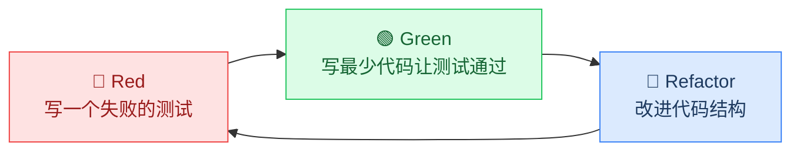

## TDD红-绿-重构：测试驱动开发的核心循环

TDD（Test-Driven Development，测试驱动开发）是 Kent Beck 在 2002 年《Test Driven Development: By Example》中系统化的编程方法论。其核心是一个极其简洁的三步循环：**先写一个失败的测试（Red）→ 写最少的代码让它通过（Green）→ 在不改变行为的前提下改进代码（Refactor）**。这个循环看起来简单，却是现代软件工程中保障代码质量最有效的实践之一。

TDD 不是"先写测试再写代码"这么简单——它是一种**设计方法**，通过测试来驱动代码的结构和接口设计，使代码天然具有可测试性、高内聚和低耦合的特征。



---

### 一、理论基础：为什么红-绿-重构有效

#### 1.1 认知科学视角

TDD 的三步循环暗合人类认知的**工作记忆模型**：

- **Red 阶段**：通过写测试明确"目标是什么"，把模糊的需求转化为精确的规格说明
- **Green 阶段**：限制注意力到"怎么让这一个测试通过"，降低认知负载
- **Refactor 阶段**：在安全网保护下优化结构，消除技术债务

认知心理学家 George Miller 的研究表明，人类工作记忆容量约为 7±2 个信息单元。TDD 的增量循环将复杂问题拆解为每次只处理一个小步骤，恰好符合这一认知约束。另一个关键认知概念是**蔡格尼克效应**（Zeigarnik Effect）——人们对未完成的任务记忆更深刻。TDD 的 Red 状态制造了一个"未完成"的心理张力，驱使你尽快进入 Green 状态，这种心理机制让开发者保持高度专注。

#### 1.2 软件工程视角

Martin Fowler 在《Refactoring》中指出：**没有自动化测试保护的重构就是在裸奔**。TDD 的 Red-Green-Refactor 循环保证了：

- **每行代码都有测试覆盖**：因为代码是被测试"逼出来"的
- **每次变更都有即时反馈**：测试运行只需秒级，问题立刻暴露
- **代码始终保持可工作状态**：Green 阶段结束后，所有测试必须通过

Ward Cunningham（Wiki 发明者、极限编程创始人之一）提出了一个精辟的比喻：**TDD 的测试不是"安全网"，而是"设计指南"**。安全网是在你摔倒之后接住你，而设计指南是在你走路之前告诉你往哪走。

#### 1.3 经济学视角

多项工业级研究验证了 TDD 的经济回报：

| 研究来源 | 指标 | 传统开发 | TDD 开发 | 差异 |
|---------|------|---------|---------|------|
| IBM（Maximilien & Williams, 2003） | 初始编码时间 | 基准 | +15%~35% | 慢 |
| IBM（Maximilien & Williams, 2003） | 调试时间 | 基准 | -50%~80% | 快 |
| Microsoft（Nagappan et al., 2008） | 生产缺陷密度 | 基准 | -40%~80% | 少 |
| Microsoft（Nagappan et al., 2008） | 维护成本（年） | 基准 | -30%~50% | 省 |
| 综合数据 | 总体生命周期成本 | 基准 | -20%~40% | 低 |

初始投入更高，但越往后期收益越大。TDD 的核心经济逻辑是**将缺陷发现的时间从月/周级缩短到秒/分钟级**，修复成本呈指数级下降。Barry Boehm 的"1-10-100 法则"指出：在设计阶段发现一个缺陷花 1 元，编码阶段花 10 元，测试阶段花 100 元，生产环境花 1000 元。TDD 将发现时间从测试/生产阶段前移到编码阶段，直接跳过了最昂贵的两个阶段。

#### 1.4 信息论视角

从信息论角度看，TDD 是一种**信息逐步释放**的策略。需求本身就是不完整的——产品经理说"做一个用户注册功能"，这句话包含大量未明确的信息（密码规则？邮箱验证？重复注册？）。TDD 强迫你把每一个未明确的信息点转化为一个具体的测试用例，从而**将隐性需求显性化**。每写一个 Red 测试，就是在回答一个具体的设计决策问题。

---

### 二、三步循环详解

#### 2.1 Red：写一个失败的测试

**目标**：用测试精确描述你要实现的行为。

**原则**：
- 测试必须编译通过但运行失败（"Red"就是测试报告中红色的失败标记）
- 失败原因应该是"功能尚未实现"，而不是语法错误或环境问题
- 一个测试只验证一个行为
- 测试名要能描述业务含义，而非技术实现

**测试命名规范**：好的测试名应该让人不看代码就知道它在验证什么。以下是几种被广泛采用的命名风格：

| 风格 | 格式 | 示例 | 适用场景 |
|------|------|------|---------|
| Given-When-Then | `should_<行为>_when_<条件>` | `should_return_zero_when_input_is_empty` | 行为驱动的场景测试 |
| 测试领域语言 | `<方法>_<输入>_<期望>` | `add_empty_string_returns_zero` | 纯函数/值转换 |
| 描述式 | `<主语> <行为> <条件>` | `Calculator adds two positive numbers correctly` | BDD 框架 |

**典型错误**：一开始就写一大堆测试，或者测试写得太模糊（如 `test_works()`），导致测试通过时你也不知道是正确还是碰巧。

**示例**：假设我们要实现一个字符串计算器（String Calculator），支持 `add("1,2")` 返回 `3`。这个示例来自 Roy Osherove 的《The TDD Katas》，是学习 TDD 的经典练习。

```python
# test_string_calculator.py
import pytest
from string_calculator import StringCalculator

class TestStringCalculator:
    def test_add_empty_string_returns_zero(self):
        """空字符串应返回 0"""
        calc = StringCalculator()
        assert calc.add("") == 0

    def test_add_single_number_returns_itself(self):
        """单个数字应返回自身"""
        calc = StringCalculator()
        assert calc.add("5") == 5

    def test_add_two_numbers_returns_sum(self):
        """两个逗号分隔的数字应返回它们的和"""
        calc = StringCalculator()
        assert calc.add("1,2") == 3
```

此时运行测试，会得到 **ImportError**——因为 `StringCalculator` 类还不存在。这就是正确的 Red 状态。

**如何判断 Red 是否"正确"？** 一个合格的 Red 应该满足三个条件：
1. 测试代码能编译/解析通过（不是语法错误）
2. 失败原因是"功能未实现"（不是环境配置问题）
3. 错误信息足够清晰，能指向具体的缺失功能

如果测试因为 import 错误、数据库连接超时等原因失败，那不是 Red——那是环境问题，需要先解决。

#### 2.2 Green：写最少的代码让测试通过

**目标**：让所有测试变绿（通过），**不允许跳过任何 Red 的测试**。

**原则**：
- 写**刚好能让测试通过**的代码，不要多
- 不要想未来的需求，只解决当前这个测试
- 允许硬编码——如果只有一个测试说 `add("1,2")` 返回 `3`，你可以直接 `return 3`
- 快速迭代，不要在一个 Green 步骤中写太多代码

**为什么"写最少"很重要？**

Kent Beck 将此称为"YAGNI"（You Aren't Gonna Need It）的实践形式。过度实现会导致：
- 你不确定哪些代码是为了满足测试，哪些是"想当然"加的
- 测试覆盖率虚高，但实际未验证的逻辑隐藏在实现中
- 重构时发现有些代码从未被测试过，不敢改动

**接上例**：

```python
# string_calculator.py（Green 阶段 1）
class StringCalculator:
    def add(self, numbers: str) -> int:
        if not numbers:
            return 0
        nums = [int(n) for n in numbers.split(',')]
        return sum(nums)
```

运行测试——三个全部通过。这就够了。

**Green 阶段的心态**：不要追求"优雅"或"通用"，你的唯一目标是让测试变绿。代码有多丑都没关系，因为下一步就是重构。

**"丑代码"的价值**：很多开发者在 Green 阶段会忍不住写"漂亮"的代码，这反而违背了 TDD 的初衷。Green 阶段的"丑"有两个重要功能：一是让你明确知道哪些代码是"刚好够用"的，二是为 Refactor 阶段提供清晰的改进目标。如果你在 Green 阶段就写出了完美代码，你反而无法通过 Refactor 过程发现设计问题。

#### 2.3 Refactor：改进代码结构

**目标**：在不改变外部行为的前提下，改进代码的内部结构。

**原则**：
- 重构的定义：**行为不变，结构改善**。如果重构后测试失败，说明你改变行为了——这是 bug
- 重构期间保持测试运行在 Green 状态
- 每次重构幅度要小，频繁运行测试验证
- 重构可以在 Red-Green 之后立即进行，也可以攒几轮后统一做

**重构不是可选项**。很多人跳过重构直接写下一个 Red 测试，导致代码像洋葱一样层层堆叠、难以维护。

**重构的安全保障机制**：TDD 的重构之所以安全，是因为你有完整的测试套件作为回归保障。重构过程中，你应该遵循"小步快跑"原则——每做一个小改动就运行一次测试。如果你一次做了五个改动才发现测试失败，你需要回滚并逐步排查。Martin Fowler 在《Refactoring: Improving the Design of Existing Code》（第二版，2018）中整理了 72 种重构手法，以下是 TDD 中最常用的几种：

| 重构手法 | 触发信号 | 效果 |
|---------|---------|------|
| Extract Method | 一个方法超过 20 行，或包含可独立理解的代码段 | 降低认知复杂度 |
| Rename | 变量/方法名不能表达意图 | 提升可读性 |
| Move Method | 方法在错误的类中被调用 | 改善高内聚 |
| Replace Temp with Query | 临时变量可被计算替代 | 减少状态 |
| Introduce Parameter Object | 多个参数总是一起传递 | 简化接口 |

**接上例**——考虑可扩展性，但我们不实现新功能，只是改进现有代码结构：

```python
# string_calculator.py（Refactor 阶段）
class StringCalculator:
    def add(self, numbers: str) -> int:
        if not numbers:
            return 0
        return sum(self._parse(numbers))

    def _parse(self, numbers: str) -> list[int]:
        """将逗号分隔的字符串解析为整数列表"""
        return [int(n) for n in numbers.split(',')]
```

测试仍然全部通过，但代码结构更清晰了——`_parse` 方法封装了解析逻辑，`add` 方法专注于"求和"这个核心行为。

---

### 三、完整迭代演示

以 String Calculator 为例，展示从第一个 Red 到功能完善的完整过程。这个演示的关键不是代码本身，而是**每一步你应该如何思考**。

#### 迭代 1：空字符串

RED:    test_add_empty_string_returns_zero → 失败（类不存在）
        思考：我需要一个 StringCalculator 类和 add 方法
GREEN:  实现 StringCalculator.add("") 返回 0 → 全部通过
        思考：最小实现——只处理空字符串
REFACTOR: 无（代码已经足够简单）

#### 迭代 2：单个数字

RED:    test_add_single_number_returns_itself → 失败（"5" 解析出错）
        思考：add 方法需要解析数字字符串
GREEN:  补充分隔逻辑 → 全部通过
        实现：return int(numbers)
REFACTOR: 无

#### 迭代 3：两个数字

RED:    test_add_two_numbers_returns_sum → 失败
        思考：需要处理逗号分隔的多个数字
GREEN:  已能处理（迭代2的实现恰好覆盖 split 逻辑）→ 全部通过
REFACTOR: 提取 _parse 方法

**注意这里的关键洞察**：迭代 3 的 Green 阶段测试直接通过了，因为你迭代 2 写的 split 逻辑已经恰好能处理两个数字的情况。这是 TDD 的常见模式——**测试有时会"免费通过"**，这说明你的实现已经具有一定的通用性。不需要修改代码，直接进入下一个 Red。

#### 迭代 4：支持任意多个数字

```python
# RED: 新测试
def test_add_any_amount_of_numbers(self):
    """应支持任意多个数字相加"""
    calc = StringCalculator()
    assert calc.add("1,2,3,4,5") == 15

# GREEN: 现有实现已能处理 → 测试直接通过
# REFACTOR: 无需修改
```

#### 迭代 5：支持换行符作为分隔符

```python
# RED: 新测试
def test_add_supports_newline_delimiter(self):
    """换行符也应作为分隔符"""
    calc = StringCalculator()
    assert calc.add("1\n2,3") == 6

# GREEN: _parse 方法需处理换行符
def _parse(self, numbers: str) -> list[int]:
    return [int(n) for n in numbers.replace('\n', ',').split(',')]

# REFACTOR: 无（已经很简单）
```

#### 迭代 6：自定义分隔符

```python
# RED: 新测试
def test_add_supports_custom_delimiter(self):
    """支持以 // 开头的自定义分隔符，如 //;\n1;2;3 应返回 6"""
    calc = StringCalculator()
    assert calc.add("//;\n1;2;3") == 6

# GREEN: 扩展解析逻辑
def _parse(self, numbers: str) -> list[int]:
    if numbers.startswith("//"):
        delimiter = numbers[2]
        numbers = numbers[4:]  # 跳过 "//;\n"
    return [int(n) for n in numbers.replace('\n', delimiter).split(delimiter)]
```

#### 迭代 7：拒绝负数

```python
# RED: 新测试
def test_add_negative_numbers_raises_error(self):
    """遇到负数应抛出异常，异常消息包含负数值"""
    calc = StringCalculator()
    with pytest.raises(ValueError, match="-1"):
        calc.add("1,-1,2")

# GREEN: 在 add 中加入校验
def add(self, numbers: str) -> int:
    if not numbers:
        return 0
    parsed = self._parse(numbers)
    negatives = [n for n in parsed if n < 0]
    if negatives:
        raise ValueError(f"Negative not allowed: {','.join(map(str, negatives))}")
    return sum(parsed)
```

**注意每一步的特征**：
- 每次只增加一个新行为
- 每次 Red 都有明确的失败原因
- 每次 Green 都是最小改动
- 重构在需要时才做，不强行进行
- 测试名始终描述业务行为，不暴露实现细节

---

### 四、TDD 的核心规则与纪律

#### 4.1 三条军规

Kent Beck 为 TDD 设定了三条不可违反的规则：

1. **除非是为了让一个失败的 unit test 通过，否则不允许写任何生产代码**
2. **只写恰好导致失败或刚好通过的 unit test**——不允许写超出当前需求的测试
3. **只写恰好足以让一个失败测试通过的生产代码**——不允许多写

这三条规则构成了一个相互约束的系统，缺一不可。它们的目的是**防止提前设计和过度实现**。

**为什么需要如此严格的纪律？** 因为人类的本能是"一次把事情做对"。我们习惯于在动手之前先在脑中设计完整方案，然后一次性实现。这种习惯在传统开发中看似高效，但它有两个致命问题：一是你对需求的理解可能是错的，二是你对技术方案的判断可能是错的。TDD 的纪律强迫你放弃"一次做对"的幻觉，转而拥抱"逐步逼近"的务实策略。

#### 4.2 测试质量检查清单

每个 Green 通过后，问自己：

- [ ] 测试名称是否描述了业务行为（而非技术实现）？
- [ ] 测试是否只验证了一个断言行为？
- [ ] 测试失败时，错误消息是否足够清晰？
- [ ] 测试是否独立于其他测试（无顺序依赖）？
- [ ] 测试是否快速（< 100ms）？
- [ ] 测试是否使用真实值而非任意值？
- [ ] 测试是否具有"确定性"——相同输入永远产生相同结果？

#### 4.3 Red-Green 的节奏感

TDD 高手和新手的最大区别在于**节奏感**。新手倾向于：

- 写一个很复杂的测试（Red 状态停留太久）
- 一次实现所有功能（Green 阶段代码量太大）
- 完全跳过重构

正确的节奏应该是：

Red (30秒-2分钟) → Green (30秒-2分钟) → Refactor (30秒-2分钟) → 重复

每个循环的时间越短越好。如果一个 Red-Green 循环超过 5 分钟，说明测试写得太大或实现目标不明确。**节奏感的本质是控制粒度**——每个循环处理的变更量越小，出错的概率越低，调试的成本越低。

**高手的标志**：当你发现自己能在 30 秒内完成一个 Red-Green-Refactor 循环时，说明你已经掌握了 TDD 的节奏。此时的测试粒度非常细，每次只验证一个极小的行为变化，但整体推进速度反而更快——因为你几乎不需要调试。

---

### 五、TDD 在遗留代码中的应用

Michael Feathers 在《Working Effectively with Legacy Code》（2004）中定义了遗留代码：**没有测试的代码就是遗留代码**。TDD 在遗留代码中的应用不是从零开始，而是在现有代码上逐步建立测试安全网。

#### 5.1 孪生技术（Sprout Technique）

当你需要在遗留代码中添加新功能时：

1. **先在测试中编写新功能的测试**（Red）
2. **在一个全新的类/方法中实现新功能**（Green）
3. **在遗留代码中调用这个新类/方法**（但不修改遗留代码的内部逻辑）

这样做的好处是：新功能有完整的测试覆盖，而遗留代码的行为没有被改变。

```python
# 遗留代码：一个巨大的、没有测试的 OrderProcessor 类
class OrderProcessor:
    def process(self, order):
        # 500 行没有测试的代码...
        pass

# 孪生技术：新功能写在独立的类中
class TaxCalculator:
    """新功能：计算税费（完全独立，有完整测试）"""
    def calculate(self, order):
        return sum(item.price * item.quantity * 0.1 for item in order.items)

# 遗留代码只增加一行调用，不改动原有逻辑
class OrderProcessor:
    def process(self, order):
        # 原有代码...
        tax = TaxCalculator().calculate(order)  # 新增一行
        # 原有代码...
```

#### 5.2 提取并覆盖（Extract and Override）

当遗留方法太复杂无法直接测试时：

1. 从遗留方法中提取一小段逻辑到新方法
2. 对新方法编写测试
3. 如果新方法的逻辑正确，保留；如果需要修改，在测试保护下修改

#### 5.3 特征测试（Characterization Test）

在修改遗留代码之前，先编写**特征测试**——它不验证代码是否"正确"，而是验证代码的**当前行为**。即使当前行为是 bug，特征测试也会通过。它的作用是记录现状，确保你不会无意中改变已有行为。

```python
# 特征测试：记录遗留代码的现有行为（包括潜在的 bug）
def test_legacy_order_total_includes_tax():
    """记录遗留行为：总价包含税"""
    processor = OrderProcessor()
    order = create_order_with_tax()
    # 即使这个行为可能是 bug，我们也先记录下来
    assert processor.calculate_total(order) == 110.0  # 含 10% 税
```

---

### 六、TDD 的变体与扩展

#### 6.1 测试优先 vs 测试驱动

很多人误以为"先写测试"就是 TDD。区别在于：

| 特征 | 测试优先（Test-First） | 测试驱动（Test-Driven） |
|------|----------------------|----------------------|
| 核心目的 | 先写测试保证覆盖 | 用测试驱动设计 |
| 设计影响 | 无 | 测试引导接口和结构 |
| 重构 | 可选 | 必选 |
| 增量性 | 一次写完整测试 | 每个循环只加一个测试 |
| 是否使用 Red-Green 循环 | 否 | 是 |

TDD 的精髓不在于"先写测试"，而在于**让测试决定你写什么代码**。

#### 6.2 ATDD（验收测试驱动开发）

ATDD 在 TDD 之前增加了一个"讨论"阶段：

讨论 → 编写验收测试（RED）→ 编写单元测试（RED）→ 实现（GREEN）→ 重构

- **讨论**：开发、测试、产品三方对需求达成一致
- **验收测试**：从用户视角描述功能，通常用 Gherkin 语法
- **单元测试**：将验收测试拆解为代码级别的测试

```gherkin
# features/string_calculator.feature
Feature: String Calculator

  Scenario: Add two numbers
    Given I have a string calculator
    When I add "1,2"
    Then the result should be 3

  Scenario: Negative numbers not allowed
    Given I have a string calculator
    When I add "1,-1,2"
    Then I should see an error containing "-1"
```

#### 6.3 BDD（行为驱动开发）

BDD 由 Dan North 在 2003 年提出，是对 TDD 的改进。核心变化：

- 将"测试"改名为"规格"（Specification），强调意图而非验证
- 使用 Given-When-Then 三段式结构
- 关注"系统应该做什么"而非"测试什么"

```python
# 使用 pytest-bdd
from pytest_bdd import scenarios, given, when, then, parsers

scenarios('string_calculator.feature')

@given('I have a string calculator')
def calculator():
    return StringCalculator()

@when(parsers.parse('I add "{numbers}"'))
def add_numbers(calculator, numbers):
    calculator.result = calculator.add(numbers)

@then(parsers.parse('the result should be {expected:d}'))
def check_result(calculator, expected):
    assert calculator.result == expected
```

#### 6.4 纯函数 TDD

对于纯函数（无副作用、无状态），TDD 流程可以简化：

```python
# 纯函数非常适合 TDD
# RED: 测试
def test_fibonacci():
    assert fibonacci(0) == 0
    assert fibonacci(1) == 1
    assert fibonacci(6) == 8

# GREEN: 实现（用最笨的方式）
def fibonacci(n):
    if n <= 1:
        return n
    return fibonacci(n-1) + fibonacci(n-2)

# REFACTOR: 添加记忆化提升性能
from functools import lru_cache

@lru_cache(maxsize=None)
def fibonacci(n):
    if n <= 1:
        return n
    return fibonacci(n-1) + fibonacci(n-2)
```

纯函数的 TDD 优势在于：没有副作用隔离问题，测试天然幂等。

---

### 七、TDD 实战中的常见陷阱

#### 7.1 "大红"陷阱：测试范围过大

**症状**：一个测试断言了多个行为，或者测试覆盖了一整个功能模块。

**错误示例**：

```python
def test_everything(self):
    """这个测试在验证所有功能——它不应该存在"""
    calc = StringCalculator()
    assert calc.add("") == 0
    assert calc.add("5") == 5
    assert calc.add("1,2") == 3
    with pytest.raises(ValueError):
        calc.add("-1")
```

**修正**：每个行为一个测试。上面应拆成 4 个独立测试。

**诊断标准**：如果一个测试需要注释来解释它在测试什么，它就太大了。

#### 7.2 "永远绿色"陷阱：测试不是真正的 Red

**症状**：你写了一个测试，运行后直接通过了——你从来没有看到过 Red。

**原因**：你已经在头脑中实现了功能，导致测试写出来就是 Green 的。测试变成了"事后验证"而非"事前驱动"。

**修正**：如果测试不是 Red 的，问自己"这个测试在约束我做什么？"如果没有约束力，测试质量不够。

#### 7.3 "跳过重构"陷阱

**症状**：连续多个 Green 循环后，代码变成一团意大利面条。

**危险**：初期影响不大，但 10-20 个循环后，你会发现自己害怕改动任何代码——因为没有重构的代码缺乏结构，改一处可能影响多处。

**修正**：重构不需要大动作。常见的微重构包括：

- 提取方法（Extract Method）
- 重命名变量使其更有意义
- 消除重复（DRY）
- 移动代码到正确的类/模块

#### 7.4 "实现细节测试"陷阱

**症状**：测试验证的是"函数内部调用了几次某方法"，而非"函数返回了正确结果"。

**错误示例**：

```python
def test_parse_called_once(self):
    """这个测试绑定了实现细节"""
    calc = StringCalculator()
    with patch.object(calc, '_parse') as mock_parse:
        mock_parse.return_value = [1, 2, 3]
        calc.add("1,2,3")
        mock_parse.assert_called_once()  # 实现变了这个测试就挂
```

**修正**：测试行为（输出），不测试实现（内部调用）。除非 Mock 是为了隔离外部依赖（数据库、网络），否则不要 Mock 自己的代码。

#### 7.5 "测试即文档"的滥用

**症状**：为了覆盖所有边界条件，写了 200 个测试，每个只差一个参数值。

**修正**：使用参数化测试减少重复：

```python
@pytest.mark.parametrize("input_str, expected", [
    ("", 0),
    ("0", 0),
    ("1", 1),
    ("1,2", 3),
    ("1,2,3", 6),
    ("10,20,30", 60),
])
def test_add_calculates_sum(input_str, expected):
    calc = StringCalculator()
    assert calc.add(input_str) == expected
```

---

### 八、TDD 在不同语言中的实践

#### 8.1 Python：pytest + TDD

Python 生态的 pytest 框架天然适合 TDD：

```python
# 测试文件：test_temperature.py
import pytest
from temperature import celsius_to_fahrenheit, fahrenheit_to_celsius

# ---- Red: 第一批测试 ----
def test_freezing_point():
    assert celsius_to_fahrenheit(0) == 32

def test_boiling_point():
    assert celsius_to_fahrenheit(100) == 212

def test_body_temperature():
    assert celsius_to_fahrenheit(37) == 98.6

# ---- Red: 反向转换 ----
def test_fahrenheit_to_celsius_freezing():
    assert fahrenheit_to_celsius(32) == 0

def test_fahrenheit_to_celsius_boiling():
    assert fahrenheit_to_celsius(212) == 100

# ---- Green: 实现 ----
def celsius_to_fahrenheit(celsius: float) -> float:
    return celsius * 9 / 5 + 32

def fahrenheit_to_celsius(fahrenheit: float) -> float:
    return (fahrenheit - 32) * 5 / 9

# ---- Refactor: 提取常量 ----
FREEZING_POINT_C = 0
BOILING_POINT_C = 100
FREEZING_POINT_F = 32
BOILING_POINT_F = 212

def celsius_to_fahrenheit(celsius: float) -> float:
    """摄氏度转华氏度"""
    return celsius * (BOILING_POINT_F - FREEZING_POINT_F) / (BOILING_POINT_C - FREEZING_POINT_C) + FREEZING_POINT_F
```

运行 `pytest -v`，可以看到每个测试从 Red 变 Green 的过程。

#### 8.2 TypeScript/Jest：前端 TDD

```typescript
// validator.test.ts
import { validateEmail } from './validator';

describe('validateEmail', () => {
  // Red: 第一批测试
  it('should reject empty string', () => {
    expect(validateEmail('')).toBe(false);
  });

  it('should reject string without @', () => {
    expect(validateEmail('invalid')).toBe(false);
  });

  it('should accept valid email', () => {
    expect(validateEmail('user@example.com')).toBe(true);
  });

  // Red: 边界情况
  it('should reject email without domain', () => {
    expect(validateEmail('user@')).toBe(false);
  });

  it('should accept email with subdomain', () => {
    expect(validateEmail('user@mail.example.com')).toBe(true);
  });
});

// Green: 实现
function validateEmail(email: string): boolean {
  if (!email || !email.includes('@')) return false;
  const [local, domain] = email.split('@');
  if (!local || !domain || !domain.includes('.')) return false;
  return true;
}

// Refactor: 使用正则提升可读性
const EMAIL_REGEX = /^[^\s@]+@[^\s@]+\.[^\s@]+$/;

function validateEmail(email: string): boolean {
  return EMAIL_REGEX.test(email);
}
```

#### 8.3 Go：表驱动测试 + TDD

Go 的表驱动测试（Table-Driven Tests）天然契合 TDD 的参数化模式：

```go
// calculator_test.go
package calc

import "testing"

func TestAdd(t *testing.T) {
    tests := []struct {
        name     string
        input    string
        expected int
    }{
        {"empty string", "", 0},
        {"single number", "5", 5},
        {"two numbers", "1,2", 3},
        {"three numbers", "1,2,3", 6},
    }

    for _, tt := range tests {
        t.Run(tt.name, func(t *testing.T) {
            got := Add(tt.input)
            if got != tt.expected {
                t.Errorf("Add(%q) = %d, want %d", tt.input, got, tt.expected)
            }
        })
    }
}
```

#### 8.4 Java/JUnit 5：企业级 TDD

```java
// StringCalculatorTest.java
import org.junit.jupiter.api.Test;
import static org.junit.jupiter.api.Assertions.*;

class StringCalculatorTest {

    @Test
    void emptyStringReturnsZero() {
        assertEquals(0, new StringCalculator().add(""));
    }

    @Test
    void singleNumberReturnsItself() {
        assertEquals(5, new StringCalculator().add("5"));
    }

    @Test
    void twoNumbersReturnsSum() {
        assertEquals(3, new StringCalculator().add("1,2"));
    }

    @Test
    void negativeNumberThrowsException() {
        StringCalculator calc = new StringCalculator();
        IllegalArgumentException ex = assertThrows(
            IllegalArgumentException.class,
            () -> calc.add("1,-1,2")
        );
        assertTrue(ex.getMessage().contains("-1"));
    }
}
```

Java 的强类型和 JUnit 5 的 `@ParameterizedTest` 使得 TDD 的测试更具表达力。

---

### 九、TDD 与设计模式的交互

TDD 天然引导出好的设计。以下是 TDD 中常见的设计决策：

#### 9.1 依赖注入

当你发现测试中需要 Mock 一个外部依赖时，TDD 会自然地驱动你使用依赖注入：

```python
# Red: 测试发现直接依赖数据库，难以测试
class UserRepository:
    def __init__(self):
        self.db = MySQLConnection()  # 问题：测试时无法替换

# Refactor: 引入依赖注入
class UserRepository:
    def __init__(self, db: Database):
        self.db = db  # 测试时可以注入 MockDatabase
```

#### 9.2 接口隔离

TDD 驱动你只依赖"需要的行为"，而非"整个对象"：

```go
// Red: 测试发现需要一个发送邮件的能力
// Refactor: 定义最小接口
type Notifier interface {
    Send(message string) error
}

// 只依赖接口，不依赖具体实现
func ProcessOrder(order Order, n Notifier) error {
    // ... 处理订单
    return n.Send("Order processed")
}
```

#### 9.3 策略模式

当你发现 if-else 分支越来越多，TDD 的多次重构会自然引入策略模式：

```python
# 经过多轮 Red-Green-Refactor 后
class DiscountStrategy:
    def calculate(self, amount: float) -> float:
        raise NotImplementedError

class NoDiscount(DiscountStrategy):
    def calculate(self, amount: float) -> float:
        return 0

class PercentageDiscount(DiscountStrategy):
    def __init__(self, rate: float):
        self.rate = rate

    def calculate(self, amount: float) -> float:
        return amount * self.rate

class FixedDiscount(DiscountStrategy):
    def __init__(self, amount: float):
        self.amount = amount

    def calculate(self, total: float) -> float:
        return min(self.amount, total)
```

#### 9.4 观察者模式

当 TDD 迭代中发现多个组件需要响应同一事件时，会自然驱动你引入观察者模式：

```python
# TDD 驱动：测试发现订单完成时需要通知多个系统
class OrderEventEmitter:
    def __init__(self):
        self._listeners = []

    def on(self, event: str, callback):
        self._listeners.append((event, callback))

    def emit(self, event: str, data):
        for evt, cb in self._listeners:
            if evt == event:
                cb(data)

# 测试验证事件触发
def test_order_completion_emits_event():
    emitter = OrderEventEmitter()
    received = []
    emitter.on("order_completed", lambda d: received.append(d))
    emitter.emit("order_completed", {"order_id": 1})
    assert len(received) == 1
    assert received[0]["order_id"] == 1
```

---

### 十、TDD 的质量验证：变异测试

写完测试后，如何知道测试是否真的有效？**变异测试**（Mutation Testing）是 TDD 的质量验证手段。它的原理是：在生产代码中引入微小变异（"变异体"），然后运行测试——如果测试仍然全部通过，说明测试没有捕捉到这个变异，测试质量不够。

```bash
# Python：使用 mutmut 进行变异测试
pip install mutmut

# 运行变异测试
mutmut run --paths-to-mutate=string_calculator.py

# 查看结果
mutmut results

# 常见变异操作：
# 1. 将 == 改为 !=
# 2. 将 > 改为 >=
# 3. 删除一行代码
# 4. 将 + 改为 -
# 5. 将 return True 改为 return False
```

| 变异体存活率 | 测试质量评估 | 行动 |
|-------------|------------|------|
| < 5% | 优秀 | 当前测试套件可靠 |
| 5%-15% | 良好 | 补充针对性测试 |
| 15%-30% | 一般 | 存在明显测试盲区 |
| > 30% | 较差 | 需要大幅增强测试 |

**变异测试与代码覆盖率的区别**：代码覆盖率衡量"代码是否被执行"，变异测试衡量"测试是否真正验证了行为"。一个覆盖率 100% 但变异体存活率 30% 的代码，说明测试虽然执行了所有代码路径，但没有正确验证结果。

---

### 十一、何时不该用 TDD

TDD 不是银弹。以下场景不建议使用 TDD：

| 场景 | 原因 | 替代方案 |
|------|------|---------|
| 探索性编程/原型 | 需求不明确，写测试会拖慢探索速度 | 先探索，确认方向后再 TDD |
| UI 层代码 | 像素级验证困难，DOM 结构不稳定 | 集成测试 + 视觉回归测试 |
| 一次性脚本 | 不会维护，测试 ROI 为负 | 直接写，加基本检查 |
| 数据库迁移脚本 | 数据库状态难以在测试中重现 | 数据库快照测试 |
| 高度并行的并发代码 | 竞态条件难以确定性复现 | 压力测试 + 形式化验证 |
| 第三方 API 集成 | 无法控制外部行为 | Mock + 集成测试 |
| 配置/胶水代码 | 逻辑简单，依赖多，Mock 成本高 | 集成测试验证端到端 |

**TDD 的适用性判断公式**：`适用度 = (代码复杂度 × 变更频率 × 维护周期) / (外部依赖数量 × Mock 成本)`。分子越大、分母越小，TDD 的 ROI 越高。

---

### 十二、工具链推荐

| 语言 | 测试框架 | 断言库 | Mock 库 | 推荐 |
|------|---------|--------|---------|------|
| Python | pytest | pytest 内置 | unittest.mock, pytest-mock | 最佳生态，简洁强大 |
| TypeScript | Jest / Vitest | Jest 内置 | jest.mock / vi.mock | 前端首选 |
| Go | testing | testing + testify | gomock, mockery | 表驱动，编译期安全 |
| Java | JUnit 5 | AssertJ | Mockito | 企业级标准 |
| Rust | #[test] | assert_eq! 宏 | mockall | 零成本抽象 |
| C# | xUnit/NUnit | FluentAssertions | NSubstitute | .NET 生态 |
| Ruby | RSpec/Minitest | RSpec matchers | Mocha | BDD 友好 |

**IDE 集成**：VS Code 的 Test Explorer、JetBrains 的内置测试运行器都支持一键运行/调试单个测试。TDD 的效率高度依赖于 IDE 的快速反馈循环——确保你的"保存→运行→看结果"流程不超过 3 秒。JetBrains IDE 的 "Run Tests on Changes" 功能可以在每次保存时自动运行受影响的测试，是 TDD 的理想工作流。

**CI/CD 集成**：将测试运行嵌入 CI 流水线（GitHub Actions、GitLab CI），每次 push 自动运行全部测试。TDD 保证本地质量，CI 保证团队质量。

---

### 十三、常见误区与纠正

| 误区 | 事实 |
|------|------|
| TDD 会让开发变慢 | 初期慢 15-35%，但调试时间减少 50-80%，总体更快 |
| 100% 覆盖率等于好代码 | 覆盖率衡量"代码是否被执行"，不衡量"测试是否验证了正确行为" |
| TDD 只适合新项目 | 遗留代码增量 TDD 是最有效的改进方式——"男孩 scouts 规则" |
| 所有代码都适合 TDD | 算法探索、UI 布局等场景 TDD ROI 较低 |
| TDD 替代了代码审查 | TDD 保证正确性，代码审查发现可读性、架构、业务逻辑问题 |
| 写了测试就不需要其他测试 | TDD 主要覆盖单元测试，集成测试和端到端测试仍然需要 |
| Mock 越多越好 | 过度 Mock 会让测试与实现耦合，应尽量使用真实对象 |
| 测试必须独立运行 | 集成测试可以有执行顺序，但单元测试必须独立 |
| TDD 需要 100% 遵守 | 灵活运用：关键业务逻辑严格 TDD，辅助代码可适当放松 |

---

### 十四、实操练习

**练习 1：FizzBuzz**

用 TDD 实现 FizzBuzz：
- 输入整数 n，返回 1 到 n 的字符串列表
- 3 的倍数替换为 "Fizz"，5 的倍数替换为 "Buzz"，既是 3 又是 5 的倍数替换为 "FizzBuzz"

**建议迭代顺序**：
1. 返回数字本身
2. 3 的倍数返回 "Fizz"
3. 5 的倍数返回 "Buzz"
4. 15 的倍数返回 "FizzBuzz"

**解题思路提示**：
- 迭代 1 的实现：`[str(i) for i in range(1, n+1)]`
- 迭代 2 的改动：在列表推导中加 `if i % 3 != 0 else "Fizz"`
- 关键：15 的倍数必须在 3 和 5 之前检查（`i % 15 == 0`），否则会被 3 或 5 的判断"吃掉"

**练习 2：罗马数字转换器**

用 TDD 实现阿拉伯数字转罗马数字：
- 1 → I, 5 → V, 10 → X, 50 → L, 100 → C, 500 → D, 1000 → M
- 特殊规则：4 → IV, 9 → IX, 40 → XL, 90 → XC, 400 → CD, 900 → CM

**建议迭代顺序**：先处理基本符号，再处理组合，最后处理减法规则。

**解题思路提示**：
- 从大到小处理：先处理 1000、500、100...
- 减法规则可以作为特殊的"符号对"加入映射表：`{(1000, 'M'), (900, 'CM'), (500, 'D'), ...}`
- 关键测试用例：1994 → MCMXCIV（验证减法规则的组合）

**练习 3：购物车**

用 TDD 实现购物车核心功能：
- 添加商品、移除商品、计算总价
- 折扣规则：满 100 减 10、VIP 用户打 8 折、折扣可叠加
- 库存校验：商品数量不能超过库存

**解题思路提示**：
- 迭代 1：基本的添加/移除/总价
- 迭代 2：折扣规则（先做满减，再做 VIP 折扣）
- 迭代 3：折扣叠加策略（先减后折 vs 先折后减——这会影响测试用例的期望值）
- 迭代 4：库存校验（在添加时校验，超出时抛异常）

---

### 本节要点

- TDD 的 Red-Green-Refactor 循环是一种**设计方法**，不仅是测试方法
- **Red**：写一个精确的、失败的测试——它描述了你要实现的行为
- **Green**：写最少的代码让测试通过——不管多丑，先让它绿
- **Refactor**：在测试保护下改进代码结构——这是保持代码健康的关键步骤
- 三条军规不可违反：不写失败测试就不写实现代码，不写多余测试，不写多余实现
- TDD 天然引导出依赖注入、接口隔离、策略模式等好设计
- 遗留代码也能用 TDD：孪生技术、提取并覆盖、特征测试
- 变异测试是验证 TDD 质量的终极手段——覆盖率只能告诉你"代码被执行了"，变异测试告诉你"测试真正验证了行为"
- TDD 不是银弹，探索性编程、UI 层、一次性脚本等场景不适用
- 节奏感是关键：每个 Red-Green-Refactor 循环越短越好，理想状态 30 秒到 2 分钟
