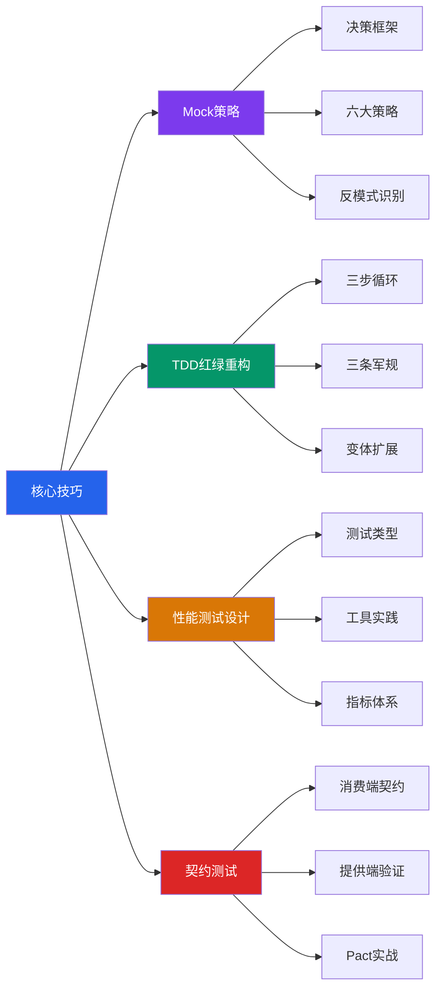
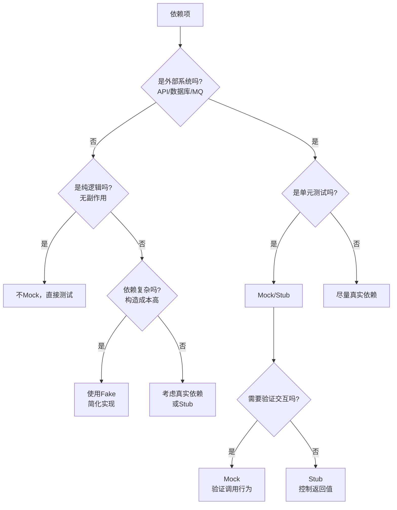
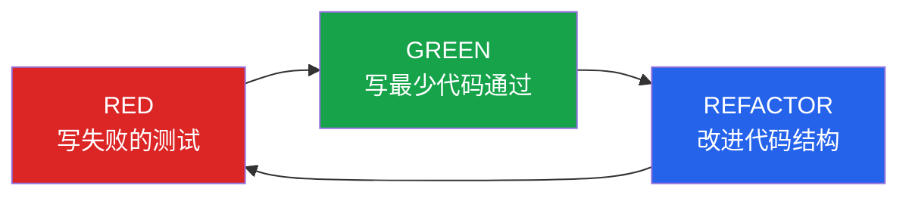
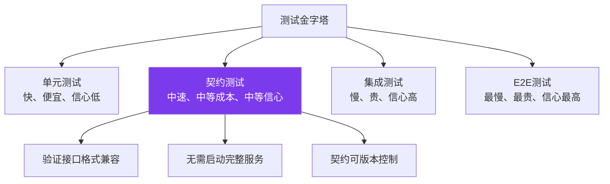
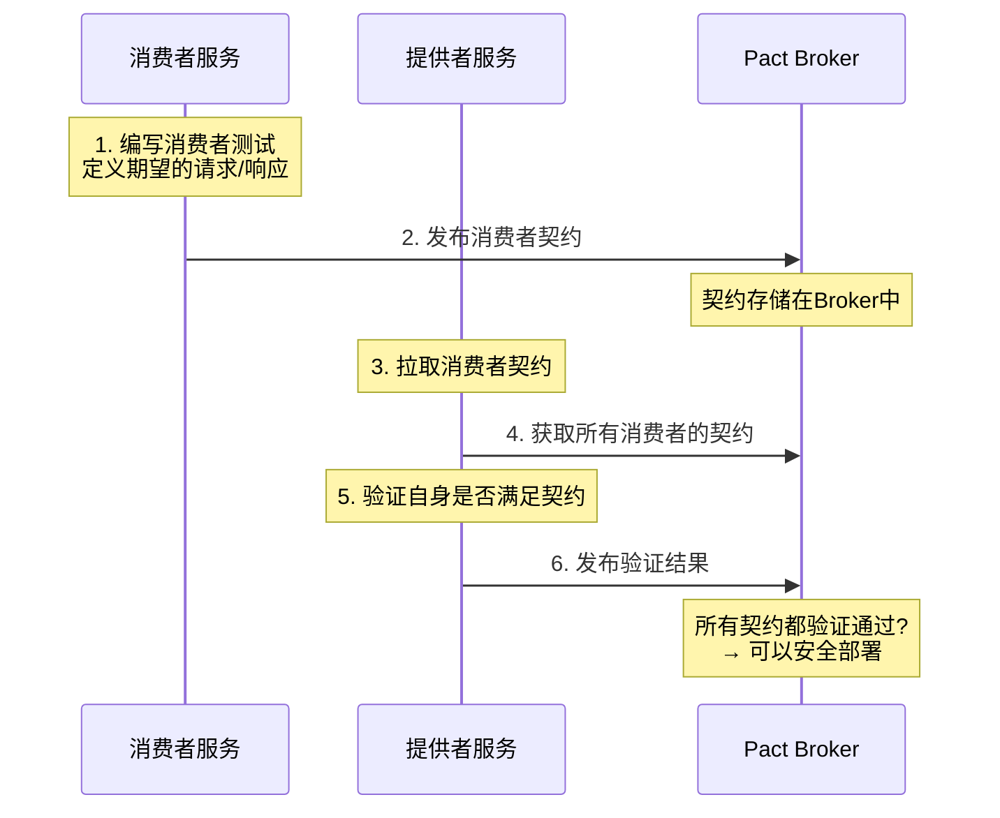
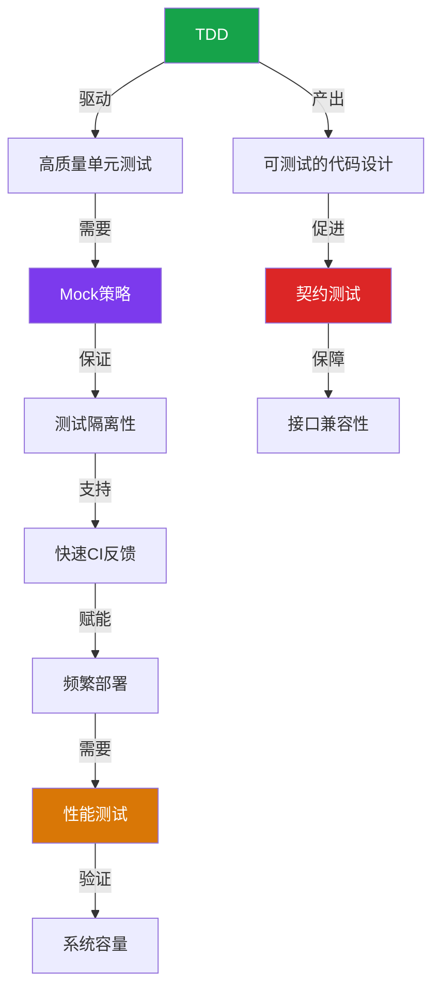

# 核心技巧：软件测试的四把利器

理论是地图，技巧是脚步。上一节我们理解了测试金字塔、测试替身和覆盖率的"为什么"，本节进入"怎么做"——四个最能直接影响测试质量和团队效率的实战技巧：Mock策略、TDD、性能测试和契约测试。每个技巧都从问题出发，给出方法论、代码示例、工具推荐和常见陷阱，确保读者不仅能"看懂"，更能在真实项目中"用起来"。

---

## 本节知识架构



---

## 一、高效的Mock策略

**核心命题：用可控的替身替代不可控的依赖，让测试在隔离环境中快速、可靠地执行。**

Mock是单元测试中最常用也最容易被滥用的工具。它解决了单元测试的隔离性要求——通过Mock，你可以让支付网关总是返回成功、让数据库总是返回特定数据、让时钟总是返回固定时间——测试从依赖不可控的外部世界，变为完全可控的确定性环境。

### 1.1 为什么需要Mock

直接调用真实依赖会导致四个核心问题：

| 问题 | 表现 | Mock如何解决 |
|------|------|-------------|
| **速度慢** | 数据库查询、网络请求耗时数秒 | Mock返回固定值，毫秒级响应 |
| **不可重复** | 第三方服务宕机则测试失败 | Mock保证每次返回一致 |
| **状态污染** | 共享数据库导致测试顺序依赖 | Mock每次返回独立数据 |
| **副作用不可控** | 真实发送邮件/扣款 | Mock拦截副作用，只验证行为 |

Gerard Meszaros 在《xUnit Test Patterns》中指出，单元测试必须满足 **F.I.R.S.T** 原则：Fast（快速）、Independent（独立）、Repeatable（可重复）、Self-validating（自验证）、Timely（及时）。Mock是实现这些原则的核心手段。

### 1.2 什么时候Mock，什么时候不Mock

Mock不是越多越好。过度Mock是最常见的测试反模式——测试全绿，但验证的不是真实行为。一个实用的决策框架：



**必须Mock的场景**：外部网络服务（HTTP/RPC调用、第三方API）、数据库操作（单元测试层面）、时间依赖（任何依赖`datetime.now()`的逻辑）、文件系统、消息队列的发布/消费。

**不应该Mock的场景**：纯逻辑函数（无依赖、无副作用）、值对象和DTO、自身依赖的业务逻辑（"不要Mock你自己"——Mock了自己的方法等于测试Mock而非真实行为）、集成测试层（目的就是验证真实交互）。

**Mock量的黄金法则**：单元测试中Mock的依赖数量不应超过3-5个。如果一个被测类需要Mock 7-8个依赖，这是**设计的问题**——该类承担了太多职责，需要重构。

### 1.3 六大Mock策略概览

本节详细介绍了六种Mock策略，从架构层面到具体工具层面逐层递进：

| 策略 | 核心思想 | 适用场景 | 优势 |
|------|---------|---------|------|
| **接口隔离Mock** | 通过接口/抽象类隔离依赖，测试Mock接口 | 外部依赖多、长期维护项目 | 测试验证行为而非实现，重构友好 |
| **Mock框架精确控制** | 使用Mock/Stub/Spy精确控制交互 | 遗留代码、第三方库 | 灵活控制返回值和异常 |
| **上下文管理器Mock** | Mock需要with语句管理生命周期的依赖 | 数据库连接、事务管理 | 精确验证commit/rollback行为 |
| **HTTP交互Mock** | Mock HTTP层或使用录制/回放 | API调用测试 | 模拟网络异常、超时、慢响应 |
| **时间Mock** | Mock系统时钟确保确定性 | Token过期、定时任务 | 消除时间相关的非确定性 |
| **数据库Mock** | Mock数据库层或使用内存数据库 | 数据访问层测试 | 毫秒级响应，无外部依赖 |

### 1.4 关键代码示例

**接口隔离——最推荐的Mock策略**：

```python
from abc import ABC, abstractmethod

class NotificationPort(ABC):
    @abstractmethod
    def send(self, user_id: int, message: str) -> bool:
        ...

class FakeNotification(NotificationPort):
    """Fake实现：内存中记录所有发送记录，不真实发送"""
    def __init__(self):
        self.sent_messages = []
    
    def send(self, user_id: int, message: str) -> bool:
        self.sent_messages.append({"user_id": user_id, "message": message})
        return True

class OrderService:
    def __init__(self, notification: NotificationPort, order_repo):
        self._notification = notification
        self._order_repo = order_repo
    
    def complete_order(self, order_id: int):
        order = self._order_repo.get(order_id)
        order.status = "completed"
        self._order_repo.save(order)
        self._notification.send(order.user_id, f"订单{order_id}已完成")
        return order
```

测试代码注入Fake而非Mock，验证的是**行为结果**（消息是否被正确发送）而非**实现细节**（是否调用了某个方法）。

**Mock时钟——消除时间非确定性**：

```python
from freezegun import freeze_time

@freeze_time("2026-06-26 12:00:00")
def test_token_expires_after_24_hours():
    token_service = TokenService()
    token = token_service.create(user_id=1, ttl_hours=24)
    
    # 在冻结的时间点，token有效
    assert token_service.is_valid(token) is True
    
    # 推进时间到24小时后
    with freeze_time("2026-06-27 12:00:01"):
        assert token_service.is_valid(token) is False
```

### 1.5 常见反模式

| 反模式 | 症状 | 后果 | 修正 |
|--------|------|------|------|
| **过度Mock** | 测试中Mock了8+个依赖 | 测试脆弱，重构即破 | 职责拆分，减少依赖 |
| **Mock实现细节** | 测试验证内部方法调用次数 | 重构破坏测试 | 测试行为，不测实现 |
| **Mock自己** | Mock了被测类自身的方法 | 测试通过≠功能正确 | 直接测试真实行为 |
| **忘记Verify** | 设置了Mock但没验证交互 | Mock形同虚设 | 每个Mock都应有对应的assert_called |
| **Mock数据库返回值硬编码** | 每个测试硬编码相同的返回数据 | 测试数据与业务脱节 | 使用工厂函数生成测试数据 |

> **深入学习**：Mock策略的完整内容（含六大策略详解、Java/Go/JavaScript跨语言示例、Mock框架对比）请参见 [01-高效的Mock策略](01-一高效的Mock策略.md)。

---

## 二、TDD红-绿-重构

**核心命题：通过"写测试→写代码→改代码"的三步循环，让测试驱动代码设计，使代码天然具有可测试性、高内聚和低耦合的特征。**

TDD（Test-Driven Development，测试驱动开发）由 Kent Beck 在 2002 年《Test Driven Development: By Example》中系统化。它不是"先写测试再写代码"这么简单——它是一种**设计方法**，通过测试来驱动代码的结构和接口设计。

### 2.1 三步循环



**Red**：用测试精确描述你要实现的行为。测试必须编译通过但运行失败，失败原因应该是"功能尚未实现"而非语法错误。一个测试只验证一个行为，测试名要能描述业务含义。

**Green**：写刚好能让测试通过的代码，不要多。允许硬编码——如果只有一个测试说`add("1,2")`返回3，你可以直接`return 3`。不想未来的需求，只解决当前这个测试。Kent Beck将此称为YAGNI（You Aren't Gonna Need It）的实践形式。

**Refactor**：在不改变外部行为的前提下，改进代码内部结构。重构的定义是"行为不变，结构改善"——如果重构后测试失败，说明你改变了行为，这是bug。重构不是可选项，很多人跳过重构直接写下一个Red测试，导致代码像洋葱一样层层堆叠。

### 2.2 三条军规

Kent Beck 为 TDD 设定了三条不可违反的规则：

1. **除非是为了让一个失败的 unit test 通过，否则不允许写任何生产代码**
2. **只写恰好导致失败或刚好通过的 unit test**——不允许写超出当前需求的测试
3. **只写恰好足以让一个失败测试通过的生产代码**——不允许多写

这三条规则构成了一个相互约束的系统，目的是**防止提前设计和过度实现**。

### 2.3 经济账

IBM 和 Microsoft 的多项研究表明：

| 指标 | 传统开发 | TDD开发 | 差异 |
|------|---------|---------|------|
| 初始编码时间 | 基准 | +15%~35% | 慢 |
| 调试时间 | 基准 | -50%~80% | 快 |
| 生产缺陷密度 | 基准 | -40%~80% | 少 |
| 维护成本（年） | 基准 | -30%~50% | 省 |
| 总体生命周期成本 | 基准 | -20%~40% | 低 |

初始投入更高，但越往后期收益越大。TDD的核心经济逻辑是**将缺陷发现的时间从月/周级缩短到秒/分钟级**，修复成本呈指数级下降。

### 2.4 完整迭代演示

以String Calculator为例，展示从零到功能完善的完整过程：

迭代1: RED: test_add_empty_string_returns_zero → 失败（类不存在）
       GREEN: 实现 add("") 返回 0 → 全部通过

迭代2: RED: test_add_single_number → 失败
       GREEN: 补充分隔逻辑 → 全部通过

迭代3: RED: test_add_two_numbers → 失败
       GREEN: 现有实现已覆盖 → 全部通过
       REFACTOR: 提取 _parse 方法

迭代4: RED: test_add_any_amount_of_numbers → 失败（或直接通过）

迭代5: RED: test_add_supports_newline_delimiter → 失败
       GREEN: _parse 方法处理换行符

迭代6: RED: test_add_supports_custom_delimiter → 失败
       GREEN: 扩展解析逻辑支持 //;

迭代7: RED: test_add_negative_numbers_raises_error → 失败
       GREEN: 加入负数校验，异常消息包含负数值

每一步的特征：每次只增加一个新行为；每次Red都有明确的失败原因；每次Green都是最小改动；重构在需要时才做。

### 2.5 TDD的变体与扩展

| 变体 | 与TDD的关系 | 适用场景 |
|------|-----------|---------|
| **测试优先（Test-First）** | 只借鉴"先写测试"，不做增量循环 | 已有代码补充测试 |
| **ATDD（验收测试驱动开发）** | 在TDD前增加"讨论"和"验收测试"阶段 | 需求明确、团队协作 |
| **BDD（行为驱动开发）** | 将"测试"改名为"规格"，使用Given-When-Then | 跨职能团队沟通 |
| **纯函数TDD** | 简化流程，无副作用隔离问题 | 算法、数据处理 |

### 2.6 常见陷阱

| 陷阱 | 症状 | 修正 |
|------|------|------|
| **"大红"陷阱** | 一个测试断言多个行为 | 每个行为一个测试 |
| **"永远绿色"陷阱** | 测试写出来就是通过的 | 确保每个测试先Red |
| **"跳过重构"陷阱** | 连续多个Green后代码成意大利面条 | 每3-5个循环做一次微重构 |
| **"实现细节测试"陷阱** | 测试验证内部方法调用次数 | 测试行为（输出），不测实现 |
| **"测试即文档"滥用** | 200个只差一个参数值的测试 | 使用参数化测试 |

> **深入学习**：TDD的完整内容（含完整7轮迭代代码、Python/Java/Go多语言实践、BDD框架集成）请参见 [02-TDD红绿重构](02-二TDD红绿重构.md)。

---

## 三、性能测试设计

**核心命题：通过负载测试、压力测试、浸泡测试的系统化设计，量化系统的性能边界，发现容量瓶颈，为容量规划提供数据支撑。**

性能测试是软件测试中与功能测试并行的重要分支。功能测试回答"系统是否正确"，性能测试回答"系统在多大负载下仍然正确"。没有性能测试的系统就像没有经过压力测试的桥梁——平时看起来没问题，一旦流量高峰就可能崩溃。

### 3.1 四种性能测试类型

| 测试类型 | 目的 | 方法 | 关键指标 | 持续时间 |
|---------|------|------|---------|---------|
| **基准测试（Benchmark）** | 建立性能基线 | 单用户/低并发 | 响应时间、吞吐量 | 几分钟 |
| **负载测试（Load）** | 验证预期负载下的表现 | 逐步增加并发至预期峰值 | P95/P99响应时间、错误率 | 10-30分钟 |
| **压力测试（Stress）** | 找到系统崩溃点 | 超过预期负载，直到系统降级 | 崩溃阈值、恢复时间 | 直到失败 |
| **浸泡测试（Soak）** | 发现内存泄漏等长期问题 | 正常负载持续运行8-24小时 | 内存趋势、GC频率、连接池 | 8-24小时 |

### 3.2 核心指标体系

性能测试需要关注的四大维度：

| 维度 | 指标 | 健康范围 | 说明 |
|------|------|---------|------|
| **响应时间** | P50（中位数） | < 200ms | 一半用户的感受 |
| | P95 | < 500ms | 95%用户的体验上限 |
| | P99 | < 1000ms | 长尾延迟，影响少量用户但不可忽视 |
| **吞吐量** | RPS/QPS | 依系统而定 | 每秒处理的请求数 |
| **错误率** | HTTP 5xx比例 | < 0.1% | 服务端错误 |
| | 超时比例 | < 0.5% | 请求超时 |
| **资源利用率** | CPU | < 70% | 留余量应对突发 |
| | 内存 | < 80% | 防止OOM |
| | 磁盘I/O | < 80% | 避免I/O瓶颈 |
| | 网络带宽 | < 60% | 预留突发空间 |

### 3.3 工具选型

| 工具 | 语言 | 特点 | 适用场景 |
|------|------|------|---------|
| **k6** | JavaScript | 脚本即代码、CI友好、云服务支持 | 现代Web API测试 |
| **Locust** | Python | Python脚本、分布式支持、Web UI | Python团队、复杂场景建模 |
| **JMeter** | Java | GUI录制、插件丰富、企业级 | 传统企业、复杂协议 |
| **Gatling** | Scala | 高性能、详细报告、CI集成 | 高并发场景 |

**k6 示例——负载测试API**：

```javascript
import http from 'k6/http';
import { check, sleep } from 'k6';

export let options = {
  stages: [
    { duration: '30s', target: 20 },   // 30秒内爬升到20并发
    { duration: '1m', target: 20 },    // 保持20并发1分钟
    { duration: '30s', target: 50 },   // 30秒内爬升到50并发
    { duration: '1m', target: 50 },    // 保持50并发1分钟（压力测试）
    { duration: '30s', target: 0 },    // 30秒内降到0
  ],
  thresholds: {
    http_req_duration: ['p(95)<500'],  // 95%请求<500ms
    http_req_failed: ['rate<0.01'],    // 错误率<1%
  },
};

export default function () {
  let res = http.get('https://api.example.com/users');
  check(res, {
    'status is 200': (r) => r.status === 200,
    'response time < 500ms': (r) => r.timings.duration < 500,
  });
  sleep(1);
}
```

**Locust 示例——分布式压测**：

```python
from locust import HttpUser, task, between

class WebsiteUser(HttpUser):
    wait_time = between(1, 3)
    
    def on_start(self):
        """登录获取token"""
        response = self.client.post("/api/login", json={
            "username": "test_user",
            "password": "test_pass"
        })
        self.token = response.json()["token"]
        self.client.headers.update({"Authorization": f"Bearer {self.token}"})
    
    @task(3)
    def view_products(self):
        """浏览商品列表（权重3）"""
        self.client.get("/api/products")
    
    @task(1)
    def place_order(self):
        """下单（权重1）"""
        self.client.post("/api/orders", json={
            "product_id": 1,
            "quantity": 2
        })
```

### 3.4 性能测试的关键陷阱

| 陷阱 | 表现 | 修正 |
|------|------|------|
| **测试环境与生产不一致** | 测试通过但生产崩溃 | 使用相似配置，或在生产做影子测试 |
| **数据准备不足** | 测试数据量远小于生产 | 构造真实规模数据集（百万级） |
| **缺少预热** | 前几次请求特别慢拉低整体指标 | 预热阶段不计入统计 |
| **忽略连接池** | 测试显示正常，实际连接耗尽 | 监控连接池使用率 |
| **只看平均值** | 平均200ms但P99是5秒 | 关注P95/P99，用百分位数评估 |
| **不设置阈值** | 跑完测试不知道是否合格 | 定义明确的通过/失败标准 |

> **深入学习**：性能测试的完整内容（含k6/Locust完整脚本、Docker Compose压测环境搭建、性能调优方法论、真实案例分析）请参见 [03-性能测试设计](03-三性能测试设计.md)。

---

## 四、契约测试

**核心命题：通过消费者驱动的契约（Consumer-Driven Contract），在微服务架构中验证服务间的接口兼容性，而无需启动完整的集成环境。**

在微服务架构中，服务A（消费者）调用服务B（提供者）的API。传统做法是启动两个服务做集成测试，但随着服务数量增长，集成环境的维护成本呈指数级上升。契约测试提供了一种轻量级替代方案：**消费者定义自己期望的接口契约，提供者验证自己是否满足这些契约**。

### 4.1 契约测试的定位



契约测试位于单元测试和集成测试之间，填补了一个关键空白：**单元测试只验证单个服务内部逻辑，集成测试验证服务间的真实交互，契约测试验证服务间的接口契约是否一致**。

### 4.2 工作原理

消费者驱动的契约测试流程：



核心流程：
1. **消费者端**：编写测试定义"我期望调用提供者的哪个API、传什么参数、返回什么格式"
2. **契约生成**：测试通过后自动生成契约文件（JSON格式）
3. **提供者端**：拉取契约，启动真实服务验证是否满足所有消费者的期望
4. **验证结果**：所有契约验证通过，说明接口兼容，可以安全部署

### 4.3 为什么需要契约测试

| 问题 | 无契约测试 | 有契约测试 |
|------|-----------|-----------|
| **服务A改了API格式** | 服务B在线上报错 | 提供者验证时即发现不兼容 |
| **新增字段导致解析异常** | 生产环境才发现 | 契约验证覆盖新旧版本 |
| **微服务数量多** | 集成测试环境维护成本爆炸 | 每个契约独立验证，无环境依赖 |
| **团队协作** | "我不知道你改了接口" | 契约即文档，变更可见 |
| **部署信心** | "应该没问题吧？" | "契约验证全绿，可以部署" |

### 4.4 Pact框架实战

Pact是最主流的契约测试框架，支持Java、JavaScript、Python、Ruby等语言。

**消费者端——编写契约**：

```python
# consumer tests (pytest-pact)
import pact

# 创建Pact消费者
pact_consumer = pact.Consumer('OrderService')
pact_provider = pact_consumer.has_pact_with('ProductService')

def test_get_product():
    """消费者定义期望的接口契约"""
    expected_product = {
        "id": 1,
        "name": "测试商品",
        "price": 99.99,
        "in_stock": True
    }
    
    pact_provider \
        .given('product 1 exists') \
        .upon_receiving('a request for product 1') \
        .with_request('get', '/api/products/1') \
        .will_respond_with(200, body=expected_product)
    
    with pact_provider:
        client = ProductAPIClient(pact_provider.uri)
        product = client.get_product(product_id=1)
        
        assert product["name"] == "测试商品"
        assert product["price"] == 99.99
```

**提供者端——验证契约**：

```python
# provider verification
import pact

verifier = pact.Verifier(provider='ProductService', provider_base_url='http://localhost:5001')

# 从Pact Broker拉取契约并验证
output, _ = verifier.verify_pacts(
    './pacts/consumer-product_service.json',
    enable_pending=True,
    verbose=True
)
```

### 4.5 契约测试的边界

契约测试不能替代所有测试，它有明确的适用边界：

| 能验证 | 不能验证 |
|--------|---------|
| 请求/响应格式（字段名、类型、必填项） | 业务逻辑正确性（如价格计算规则） |
| HTTP状态码 | 端到端业务流程 |
| 数据结构兼容性 | 性能指标（响应时间、吞吐量） |
| 接口版本兼容性 | 认证授权的完整流程 |
| 新旧消费者共存 | 数据库状态一致性 |

契约测试的定位是**接口兼容性的守门员**，而非万能测试方案。它与单元测试、集成测试、E2E测试形成互补。

### 4.6 最佳实践

1. **消费者先行**：由消费者驱动契约，而非提供者定义接口再让消费者适应
2. **契约版本管理**：将契约文件纳入版本控制，与API变更同步
3. **使用Pact Broker**：集中管理契约，可视化验证状态，支持Can-I-Deploy决策
4. **设置Pending状态**：新契约在验证通过前不阻塞提供者部署，避免死锁
5. **定期清理过期契约**：删除不再使用的消费者契约，避免维护负担

> **深入学习**：契约测试的完整内容（含Pact Broker搭建、多消费者场景、CI/CD集成、与Spring Cloud Contract对比）请参见 [04-契约测试](04-四契约测试.md)。

---

## 技巧选择指南

面对不同场景，如何选择合适的测试技巧？以下是一个决策矩阵：

| 你遇到的问题 | 推荐技巧 | 预期效果 |
|-------------|---------|---------|
| 单元测试太慢，CI反馈延迟 | Mock策略优化 | 执行时间从30-60秒降至2-5秒 |
| 代码质量低，Bug频繁 | TDD红绿重构 | 生产缺陷密度降低40%-80% |
| 不确定系统能扛多少并发 | 性能测试设计 | 量化性能边界，提前发现瓶颈 |
| 微服务间接口频繁不兼容 | 契约测试 | 部署前发现接口变更导致的破坏 |
| 重构时胆战心惊 | TDD + Mock | 每次变更都有测试保护网 |
| 线上事故频发 | 性能测试 + 混沌工程 | 提前发现脆弱点，提升系统韧性 |

---

## 四大技巧的协同效应

这四个技巧不是孤立的，它们在实际项目中形成协同：



- **TDD + Mock**：TDD的增量循环需要Mock来隔离外部依赖，Mock策略让TDD的测试快速执行
- **Mock + 性能测试**：Mock保证单元测试的速度，性能测试则验证真实环境下的表现
- **TDD + 契约测试**：TDD产出的可测试代码天然适合契约测试，契约测试补充了TDD无法覆盖的跨服务验证
- **性能测试 + 契约测试**：两者都是集成测试层的补充，一个验证性能，一个验证兼容性

---

## 本节小结

| 技巧 | 一句话总结 | 核心原则 |
|------|-----------|---------|
| **Mock策略** | 用可控替身替代不可控依赖 | Mock外部边界，不Mock自己；Mock不超过3-5个依赖 |
| **TDD红绿重构** | 测试驱动设计，增量交付 | 先Red再Green，重构不是可选项；每次循环不超过5分钟 |
| **性能测试设计** | 量化系统性能边界 | 关注P95/P99而非平均值；测试环境要接近生产 |
| **契约测试** | 消费者驱动的接口兼容性验证 | 契约即文档；不能替代集成测试，而是补充 |

掌握这四个技巧，你就拥有了软件测试的核心武器库。下一节将通过实战案例，展示这些技巧在真实项目中的应用。
