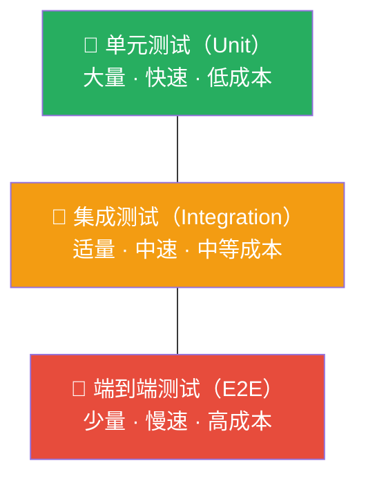
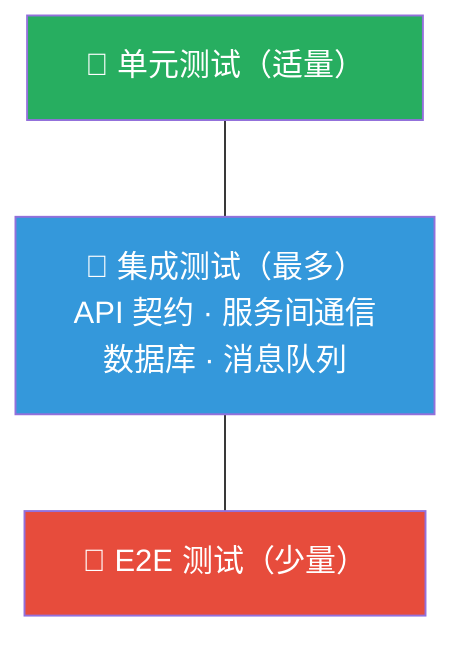
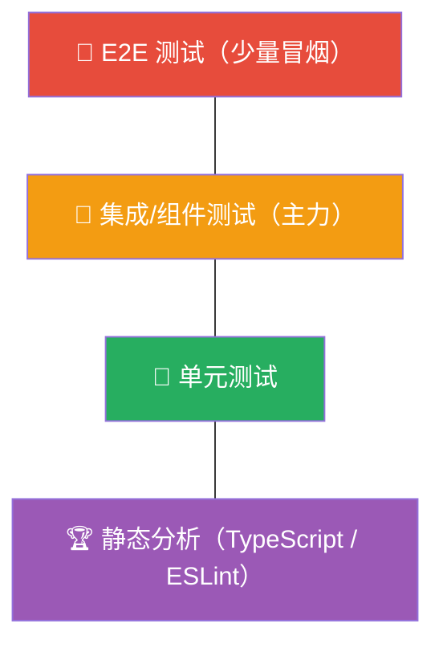

## 测试金字塔：软件测试的分层架构与策略

### 1. 什么是测试金字塔

测试金字塔（Test Pyramid）是由 Mike Cohn 在其 2009 年著作《Succeeding with Agile》中提出的经典模型。它用一个三角形的比喻来描述软件测试的理想分层结构：底层是数量最多、运行最快的单元测试，中间是集成测试，顶层是数量最少、运行最慢的端到端测试。



这个模型的核心思想很简单：**越靠近底层的测试，应该写得越多、跑得越快、成本越低**。它不是一个严格的数学比例，而是一种设计指导原则，帮助团队在测试投入的效率和回报之间找到平衡。

### 1.1 为什么测试金字塔如此重要

没有分层策略的测试体系通常会陷入两个极端：

**冰淇淋反模式（Ice Cream Cone Anti-Pattern）**：顶层的端到端测试占据了绝大多数，单元测试寥寥无几。结果是测试套件运行缓慢（一次构建 30 分钟以上）、失败定位困难（一个 E2E 测试失败可能涉及 10 个模块）、维护成本居高不下（UI 改动导致大量测试重写）。

**沙漏反模式（Hourglass Anti-Pattern）**：单元测试很多，集成测试缺失，端到端测试也有一些。中间层的缺失意味着模块之间的交互完全没有被验证，系统在集成时频繁爆雷。

测试金字塔通过明确的分层比例指导，让团队避免这两种极端，建立高效、可维护的测试体系。

### 1.2 三层结构详解

#### 第一层：单元测试（Unit Tests）

单元测试是金字塔的基座，占整个测试体系的 60%—70%。

**定义**：验证软件中最小可测试单元（通常是一个函数、一个方法、一个类）的行为是否符合预期。单元测试的关键特征是**隔离性**——被测单元之外的一切依赖（数据库、网络、文件系统、其他模块）都应该被模拟（Mock）或桩（Stub）替代。

**特征与优势**：

| 维度 | 说明 |
|------|------|
| 执行速度 | 毫秒级，一个测试函数通常 < 10ms |
| 反馈速度 | 完整测试套件通常 < 30 秒 |
| 定位精度 | 失败直接指向具体函数/方法 |
| 维护成本 | 低，只依赖内部接口 |
| 运行环境 | 无需外部依赖，本地即可运行 |
| 编写成本 | 低，开发者即可编写 |

**什么应该写成单元测试**：

- 纯函数的输入输出映射（如价格计算、日期转换、字符串处理）
- 业务规则的边界条件（如库存扣减的并发安全、折扣叠加逻辑）
- 算法的正确性验证（如排序、搜索、数据压缩）
- 错误处理路径（如参数校验、异常分支）
- 状态机的状态转换逻辑

```python
# 一个典型的单元测试示例：价格计算逻辑
import pytest

class PriceCalculator:
    def calculate(self, base_price: float, quantity: int, 
                  discount_percent: float = 0, 
                  tax_rate: float = 0.13) -> float:
        """计算最终价格：基础价 × 数量 × 折扣 × 税率"""
        if quantity <= 0:
            raise ValueError("数量必须大于0")
        if not 0 <= discount_percent <= 100:
            raise ValueError("折扣百分比必须在0-100之间")
        
        subtotal = base_price * quantity
        discount_amount = subtotal * (discount_percent / 100)
        after_discount = subtotal - discount_amount
        tax = after_discount * tax_rate
        return round(after_discount + tax, 2)

class TestPriceCalculator:
    def setup_method(self):
        self.calc = PriceCalculator()

    # 正常路径测试
    def test_single_item_no_discount(self):
        result = self.calc.calculate(100.0, 1)
        assert result == 113.0  # 100 + 13%税

    def test_bulk_order_with_discount(self):
        result = self.calc.calculate(100.0, 10, discount_percent=20)
        # 100 * 10 * 0.8 = 800, 800 * 1.13 = 904.0
        assert result == 904.0

    def test_zero_tax_region(self):
        result = self.calc.calculate(100.0, 1, tax_rate=0)
        assert result == 100.0

    # 边界条件测试
    def test_minimum_quantity(self):
        result = self.calc.calculate(10.0, 1)
        assert result > 0

    def test_maximum_discount(self):
        result = self.calc.calculate(100.0, 1, discount_percent=100)
        assert result == 0.0  # 100%折扣后仅剩税（0 × 0.13 = 0）

    # 异常路径测试
    def test_zero_quantity_raises_error(self):
        with pytest.raises(ValueError, match="数量必须大于0"):
            self.calc.calculate(100.0, 0)

    def test_negative_quantity_raises_error(self):
        with pytest.raises(ValueError, match="数量必须大于0"):
            self.calc.calculate(100.0, -1)

    def test_discount_over_100_raises_error(self):
        with pytest.raises(ValueError, match="折扣百分比必须在0-100之间"):
            self.calc.calculate(100.0, 1, discount_percent=150)

    # 浮点精度测试
    def test_floating_point_precision(self):
        result = self.calc.calculate(33.33, 3)
        assert result == pytest.approx(112.22, abs=0.01)
```

**单元测试的常见陷阱**：

1. **过度 Mock**：把所有依赖都 Mock 掉，测试变成了对 Mock 配置的验证而非对真实逻辑的验证。规则是：只 Mock 你**不拥有**的外部边界（网络、文件系统、第三方 API）。
2. **测试实现细节而非行为**：测试内部方法调用了几次、变量值是什么，而不是测试"给定输入 X，应该返回输出 Y"。实现重构时测试就会挂。
3. **一个测试覆盖太多场景**：把 10 个断言塞进一个测试函数，失败后不知道是哪个条件出了问题。
4. **缺乏负面测试**：只测正常路径，不测异常、边界和错误输入。

#### 第二层：集成测试（Integration Tests）

集成测试位于金字塔中间，占测试总量的 20%—25%。

**定义**：验证多个模块、服务或系统组件组合在一起时能否正确协作。与单元测试的关键区别在于：集成测试**不 Mock 被测组件之间的交互**，而是让它们真实地连接在一起运行。

**集成测试的几种类型**：

| 类型 | 被测范围 | 典型工具 | 示例 |
|------|---------|---------|------|
| 模块间集成 | 2-3 个内部模块的协作 | pytest + 真实数据库 | 服务层 → 数据访问层 → SQLite |
| API 集成 | HTTP 接口的请求/响应契约 | TestContainers, httpx | REST API 端点的完整请求链路 |
| 数据库集成 | ORM 映射与 SQL 查询的正确性 | TestContainers, Embedded DB | 复杂 JOIN 查询、事务隔离级别 |
| 消息队列集成 | 生产者/消费者的端到端流转 | TestContainers (RabbitMQ) | 订单事件发布 → 库存扣减消费 |
| 第三方服务集成 | 外部 API 的对接逻辑 | WireMock, VCR | 支付网关回调、短信发送 |

**什么应该写成集成测试**：

- 数据库 CRUD 操作的正确性（ORM 映射、复杂查询、事务边界）
- API 接口的契约验证（请求格式、响应结构、状态码、错误信息）
- 缓存与数据库的一致性（缓存失效策略、回源逻辑）
- 消息队列的生产-消费链路（消息格式、重试逻辑、死信处理）
- 认证与授权的端到端流程（JWT 签发 → 验证 → 权限检查）

```python
# 集成测试示例：使用 TestContainers 测试数据库交互
import pytest
from testcontainers.postgres import PostgresContainer
from sqlalchemy import create_engine, text
from sqlalchemy.orm import Session

@pytest.fixture(scope="module")
def postgres():
    """启动一个真实的 PostgreSQL 容器用于测试"""
    with PostgresContainer("postgres:16") as pg:
        yield pg

@pytest.fixture(scope="module")  
def db_session(postgres):
    """创建数据库会话"""
    engine = create_engine(postgres.get_connection_url())
    
    # 执行表结构迁移
    with engine.connect() as conn:
        conn.execute(text("""
            CREATE TABLE orders (
                id SERIAL PRIMARY KEY,
                user_id INTEGER NOT NULL,
                amount DECIMAL(10,2) NOT NULL,
                status VARCHAR(20) DEFAULT 'pending',
                created_at TIMESTAMP DEFAULT NOW()
            )
        """))
        conn.commit()
    
    with Session(engine) as session:
        yield session

class TestOrderRepository:
    """测试订单仓库的数据库交互"""
    
    def test_create_and_retrieve_order(self, db_session):
        # 创建订单
        order = OrderRepository(db_session)
        created = order.create(user_id=1001, amount=299.99)
        
        # 验证写入
        retrieved = order.get_by_id(created.id)
        assert retrieved is not None
        assert retrieved.user_id == 1001
        assert float(retrieved.amount) == 299.99
        assert retrieved.status == "pending"

    def test_query_orders_by_user(self, db_session):
        repo = OrderRepository(db_session)
        # 为同一用户创建多个订单
        for amount in [100.00, 200.00, 300.00]:
            repo.create(user_id=2001, amount=amount)
        
        results = repo.get_by_user(2001)
        assert len(results) == 3
        # 验证按创建时间降序排列
        assert results[0].amount >= results[1].amount

    def test_update_order_status(self, db_session):
        repo = OrderRepository(db_session)
        order = repo.create(user_id=3001, amount=50.00)
        
        repo.update_status(order.id, "paid")
        updated = repo.get_by_id(order.id)
        assert updated.status == "paid"

    def test_concurrent_stock_deduction(self, db_session):
        """测试并发库存扣减的原子性"""
        repo = InventoryRepository(db_session)
        repo.init_stock(product_id=5001, quantity=10)
        
        import concurrent.futures
        
        def deduct_one():
            return repo.deduct(product_id=5001, amount=1)
        
        # 10 个并发线程各扣减 1 个
        with concurrent.futures.ThreadPoolExecutor(max_workers=10) as e:
            futures = [e.submit(deduct_one) for _ in range(10)]
            results = [f.result() for f in futures]
        
        # 验证最终库存为 0，且没有超卖
        stock = repo.get_stock(product_id=5001)
        assert stock.quantity == 0
        assert sum(1 for r in results if r is True) == 10
```

**TestContainers** 是集成测试领域最重要的工具之一。它能在测试运行时自动启动真实的 Docker 容器（PostgreSQL、MySQL、Redis、Kafka 等），测试结束后自动销毁。相比内存数据库或嵌入式数据库，TestContainers 运行的是完整的数据库引擎，能发现更多因数据库方言差异导致的问题。

#### 第三层：端到端测试（End-to-End Tests）

端到端测试位于金字塔顶层，占测试总量的 5%—10%。

**定义**：从用户视角出发，模拟完整的用户操作路径，验证整个系统（包括前端 UI、后端服务、数据库、第三方集成）是否按预期工作。E2E 测试不关心内部实现细节，只关心"用户点击按钮后，是否看到了正确的结果"。

**什么应该写成端到端测试**：

- 核心业务流程的 Happy Path（注册 → 登录 → 下单 → 支付 → 完成）
- 跨服务的关键事务流（订单 → 库存 → 物流 → 通知）
- 用户可见的关键 UI 交互（表单提交、分页、搜索、筛选）
- 部署后的冒烟测试（Smoke Test）：最核心的功能是否可用

```javascript
// E2E 测试示例：使用 Playwright 测试电商下单流程
const { test, expect } = require('@playwright/test');

test.describe('电商下单完整流程', () => {
  test('用户从浏览商品到完成下单', async ({ page }) => {
    // 1. 访问首页
    await page.goto('https://shop.example.com');
    await expect(page).toHaveTitle(/示例商城/);
    
    // 2. 搜索商品
    await page.fill('[data-testid="search-input"]', '机械键盘');
    await page.click('[data-testid="search-button"]');
    await expect(page.locator('.product-card')).toHaveCount.greaterThan(0);
    
    // 3. 进入商品详情页
    await page.click('.product-card:first-child');
    await expect(page.locator('.product-title')).toContainText('机械键盘');
    
    // 4. 选择规格并加入购物车
    await page.click('[data-testid="spec-87key"]');
    await page.click('[data-testid="add-to-cart"]');
    await expect(page.locator('.cart-badge')).toHaveText('1');
    
    // 5. 进入购物车结算
    await page.click('[data-testid="go-to-cart"]');
    await page.click('[data-testid="checkout-button"]');
    
    // 6. 填写收货信息
    await page.fill('[data-testid="address-name"]', '张三');
    await page.fill('[data-testid="address-phone"]', '13800138000');
    await page.fill('[data-testid="address-detail"]', '北京市海淀区中关村大街1号');
    
    // 7. 确认支付
    await page.click('[data-testid="submit-order"]');
    await expect(page.locator('.order-success')).toBeVisible();
    await expect(page.locator('.order-number')).not.toBeEmpty();
  });
});
```

**E2E 测试的代价与取舍**：

- **执行慢**：一个完整的 E2E 测试通常需要 30 秒到几分钟，整套 E2E 测试可能需要 30 分钟以上
- **维护成本高**：UI 改版、接口变更、数据结构变化都可能导致大量 E2E 测试失败
- **环境依赖重**：需要完整的运行环境（前端构建、后端服务、数据库、第三方服务模拟）
- **定位困难**：失败时只知道"用户无法下单"，但不知道是前端、后端还是数据库的问题

因此，E2E 测试应该**严格控制数量**，只覆盖最关键的业务路径。

### 2. 比例指南与反模式

#### 2.1 理想比例参考

不同的项目类型和团队规模，金字塔的比例会有所调整。以下是几种典型场景的参考比例：

| 项目类型 | 单元测试 | 集成测试 | E2E 测试 | 说明 |
|---------|---------|---------|---------|------|
| 纯后端服务（微服务） | 70% | 25% | 5% | 业务逻辑复杂，需要大量单元测试 |
| 全栈 Web 应用 | 55% | 30% | 15% | UI 交互场景多，E2E 比例适当提高 |
| 数据管道/ETL | 60% | 35% | 5% | 数据转换逻辑用单元测试，管道集成用集成测试 |
| 移动端 App | 50% | 30% | 20% | UI 交互占比高，需要更多 E2E 覆盖 |
| SDK/库 | 80% | 15% | 5% | API 契约测试 + 大量边界条件测试 |

#### 2.2 经典反模式

**1. 冰淇淋反模式（Ice Cream Cone）**

        🔺 E2E（大量）
       🔺🔺🔺
      🔸 集成（少量）
     🔸🔸
    🔽 单元（几乎没有）

表现：端到端测试占主导，几乎没有单元测试。通常出现在"测试驱动开发"被忽视、团队以手工测试为主、自动化测试补课阶段。修复方法：逐步将 E2E 测试中可拆解的逻辑提取为单元测试。

**2. 沙漏反模式（Hourglass）**

    🔺 E2E（有一些）
   🔸🔸
    （集成测试缺失）
   🔽🔽🔽
  🔽 单元（大量）

表现：单元测试覆盖良好，E2E 测试也有一些，但模块间的集成完全没有验证。系统在开发环境运行正常，部署到生产后各种集成问题爆发。修复方法：引入 TestContainers 或 API 契约测试，补充集成层。

**3. 埋坑反模式（Muffin/Anti-Pattern）**

    🔺 E2E
    🔸 集成（和单元测试混在一起）
    🔽 单元
    🔽 （很多测试其实不是单元测试，Mock 过多）

表现：名义上单元测试很多，但实际上很多"单元测试"调用了真实的数据库或网络，本质上是伪装的集成测试。它们运行慢、容易因外部依赖失败、定位困难。修复方法：区分测试类型，确保单元测试真正隔离。

### 3. 超越金字塔：现代测试分层

经典三层金字塔并不适用于所有场景。随着微服务、Serverless、事件驱动架构的流行，测试策略也需要演进。

#### 3.1 测试钻石（Testing Diamond）

在微服务架构中，集成测试的重要性大幅提升。测试钻石模型将集成测试放在最宽的中间层：



为什么微服务更适合钻石模型？因为微服务架构中，**跨服务的接口契约才是最大的风险来源**。每个微服务内部逻辑可能很简单（适合少量单元测试），但服务间的通信、数据格式、错误处理才是 bug 的高发区。

#### 3.2 测试奖杯（Testing Trophy）

由 Kent C. Dodds 提出，特别适合前端和全栈项目。它强调集成测试（在前端语境下通常是"组件测试"）是测试的主力：



核心观点：在 React/Vue 等组件化框架中，**渲染一个组件并与其交互**（组件测试）比纯粹的逻辑单元测试更能发现真实 bug，比完整页面的 E2E 测试更快速和稳定。

#### 3.3 契约测试（Contract Testing）

契约测试不属于金字塔的某一层，而是横切关注点。它专门验证服务间的接口契约是否一致：

```python
# 使用 Pact 进行消费者驱动的契约测试
# consumer/test_order_service_contract.py
from pact import Consumer, Provider

pact = Consumer('OrderService').has_pact_with(
    Provider('PaymentService'),
    pact_dir='./pacts'
)

def test_request_payment():
    """订单服务期望支付服务提供这样的接口"""
    expected_body = {
        "amount": 299.99,
        "currency": "CNY",
        "order_id": "ORD-20260626-001"
    }
    
    (pact
        .given('订单需要支付')
        .upon_receiving('请求创建支付单')
        .with_request('post', '/api/payments', body=expected_body)
        .will_respond_with(201, body={
            "payment_id": "PAY-xxx",
            "status": "pending"
        }))
    
    with pact:
        result = PaymentClient.create_payment(
            order_id="ORD-20260626-001",
            amount=299.99,
            currency="CNY"
        )
        assert result["status"] == "pending"
```

契约测试的核心价值在于：**消费者（调用方）定义期望，提供者（被调用方）验证自己是否满足契约**。当接口变更时，契约测试能立即发现上下游的不兼容，避免"部署到生产才发现接口对不上"的问题。

### 4. 测试策略的制定原则

#### 4.1 测试金字塔不是教条

比例数字只是参考，不是硬性规定。制定测试策略时应该考虑以下因素：

| 因素 | 偏向更多单元测试 | 偏向更多集成测试 |
|------|----------------|----------------|
| 系统架构 | 单体应用，模块边界清晰 | 微服务，跨服务交互多 |
| 业务逻辑 | 复杂的计算、规则引擎 | 流程编排、数据管道 |
| 团队能力 | 开发团队编写测试经验丰富 | 测试团队独立于开发团队 |
| 变更频率 | UI 频繁变动 | 核心 API 稳定 |
| 失败成本 | 内部工具，失败影响小 | 支付/交易系统，失败成本高 |

#### 4.2 测试的 F.I.R.S.T. 原则

无论哪一层的测试，都应该遵循以下原则：

- **Fast（快速）**：单元测试 < 10ms，集成测试 < 1s，E2E 测试 < 60s。如果一个测试运行了 5 分钟，开发者会跳过它。
- **Independent（独立）**：每个测试可以独立运行，不依赖其他测试的执行顺序或共享状态。测试 A 失败不应导致测试 B 也失败（除非它们测试的是同一个故障点）。
- **Repeatable（可重复）**：在任何环境下（本地、CI、生产）运行结果一致。不依赖特定时间、特定数据、特定外部状态。
- **Self-validating（自验证）**：测试结果只有"通过"或"失败"两种状态，不需要人工判断。不要写"运行后请肉眼检查输出是否正确"的测试。
- **Timely（及时）**：测试与代码同步编写，最好是先写测试再写代码（TDD）。事后补测试往往发现代码已经难以测试了。

#### 4.3 测试命名规范

好的测试名称就是一份活的文档，它告诉阅读者"在什么条件下，期望什么行为"。推荐的命名模式：

test_<被测行为>_<条件>_<预期结果>

| 测试场景 | 不好的命名 | 好的命名 |
|---------|-----------|---------|
| 库存扣减 | test_deduct | test_deduct_reduces_stock_by_specified_amount |
| 库存为零 | test_deduct_fail | test_deduct_fails_when_stock_is_zero |
| 并发扣减 | test_concurrent | test_concurrent_deductions_prevent_overselling |
| 折扣计算 | test_discount | test_20_percent_discount_calculated_on_subtotal_before_tax |

### 5. 测试覆盖率：有用但危险的指标

#### 5.1 覆盖率的正确认知

测试覆盖率（Code Coverage）衡量的是测试执行时有多少比例的代码被"触达"了。常用的度量包括：

| 覆盖率类型 | 衡量什么 | 合理目标 |
|-----------|---------|---------|
| 行覆盖率（Line Coverage） | 每行代码是否被执行 | 70%-80% |
| 分支覆盖率（Branch Coverage） | 每个 if/else 分支是否都走到 | 60%-75% |
| 函数覆盖率（Function Coverage） | 每个函数是否被调用 | 80%+ |
| 路径覆盖率（Path Coverage） | 每条执行路径是否被覆盖 | 理论目标，实际很难达到 100% |

#### 5.2 覆盖率的陷阱

- **100% 覆盖率不等于 100% 正确**：你可以覆盖每一行代码，但如果断言写错了（`assert True`），测试通过不代表代码正确。
- **追求 100% 覆盖率是浪费**：最后 5% 的覆盖率可能需要投入 50% 的测试工作量，而这些代码（如 getter/setter、配置类）出 bug 的概率极低。
- **覆盖率下降是预警信号**：不要设定覆盖率硬指标来卡 PR，但覆盖率大幅下降应该触发 review——是不是有新代码没写测试？

#### 5.3 覆盖率工具配置示例

```python
# pytest-cov 配置（pyproject.toml）
[tool.coverage.run]
source = ["myapp"]
branch = true                    # 开启分支覆盖率
omit = [
    "*/tests/*",
    "*/migrations/*",
    "*/config/*",                 # 配置文件通常不需要覆盖
]

[tool.coverage.report]
show_missing = true              # 显示未覆盖的行
fail_under = 75                  # 覆盖率低于 75% 则失败
exclude_lines = [
    "pragma: no cover",          # 标记不需要覆盖的代码
    "if __name__ == .__main__.",
    "raise NotImplementedError",
]

[tool.coverage.html]
directory = "htmlcov"            # HTML 报告输出目录
```

### 6. 实战：从零搭建测试体系

以下是一个完整的测试体系搭建路线图，适用于中小型项目：

**阶段一：基础建设（第 1-2 周）**

1. 选择测试框架（Python 选 pytest，JavaScript 选 Vitest/Jest，Java 选 JUnit 5）
2. 配置 CI 流水线中的测试步骤（每次 Push 自动运行）
3. 设定最低覆盖率门槛（建议先设 50%，逐步提升）
4. 为核心业务模块编写首批单元测试（覆盖率目标：关键路径 > 80%）

**阶段二：集成测试（第 3-4 周）**

1. 引入 TestContainers，为数据库操作编写集成测试
2. 使用 httpx/requests 编写 API 接口测试
3. 配置测试数据库（独立于开发/生产环境）
4. 为消息队列/缓存编写集成测试

**阶段三：端到端测试（第 5-6 周）**

1. 选择 E2E 测试工具（Playwright / Cypress）
2. 为核心业务流程编写 3-5 条 E2E 测试
3. 配置 E2E 测试的 CI 流水线（可设为每日定时运行而非每次 Push）
4. 建立 E2E 测试失败的告警和响应机制

**阶段四：持续优化（长期）**

1. 每次线上 bug 修复后，补充对应的回归测试
2. 定期审查测试套件，移除过时、脆弱的测试
3. 关注测试运行时间，优化慢测试
4. 逐步引入性能测试、安全测试等非功能测试

### 7. 常见误区与纠正

| 误区 | 纠正 |
|------|------|
| "测试是 QA 的事" | 测试是开发者的责任。写代码的人最了解代码的边界条件和风险点 |
| "我们没时间写测试" | 不写测试节省的时间，会在调试和修 bug 时加倍偿还。有测试的代码重构速度是无测试代码的 3-5 倍 |
| "覆盖率 80% 就够了" | 覆盖率是下限而非目标。重要的是覆盖了什么，而非覆盖了多少 |
| "Mock 可以替代真实依赖" | Mock 只能验证你对依赖行为的**假设**，如果假设本身就错了，Mock 测试会通过但生产会爆炸 |
| "E2E 测试越多越安全" | 过多的 E2E 测试会导致 CI 慢到无人愿意运行，最终被废弃。保持 E2E 测试的精简和稳定 |
| "写测试会降低开发速度" | 短期内确实会降低 10%-20% 的开发速度，但长期来看，有测试的代码修改速度更快、bug 更少、新人上手更容易 |

### 8. 总结

测试金字塔不是一个需要精确执行的数学模型，而是一种**关于测试投入的思维方式**。它的核心启示是：

1. **测试的成本和收益随层级变化**：底层测试便宜但覆盖范围窄，顶层测试昂贵但覆盖范围广。把更多投入放在性价比高的层级。
2. **快速反馈是王道**：开发者最需要的是在写完代码后几秒内就知道有没有破坏什么。单元测试提供了这种即时反馈。
3. **测试不是越多越好，而是越准越好**：每一条测试都应该服务于一个明确的风险点。"我们有很多测试"不是成就，"我们有信心修改任何代码"才是。
4. **测试策略应该随项目演进**：初创期以单元测试为主快速迭代，成熟期逐步补充集成和 E2E 测试保障稳定性。不要在项目第一天就追求完美的测试覆盖率。

最终，测试金字塔的目标不是写尽可能多的测试，而是**用最少的测试覆盖最大的风险面**，让团队有勇气快速迭代、安全重构、自信发布。
