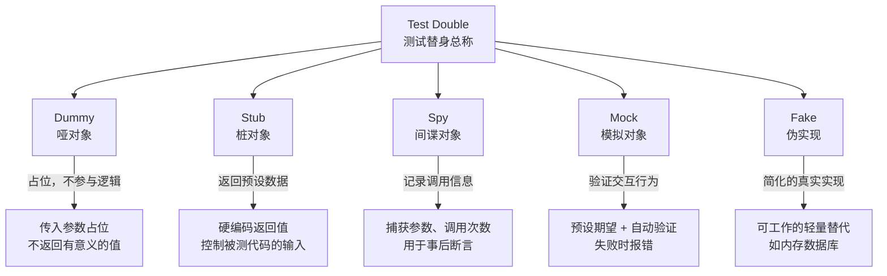
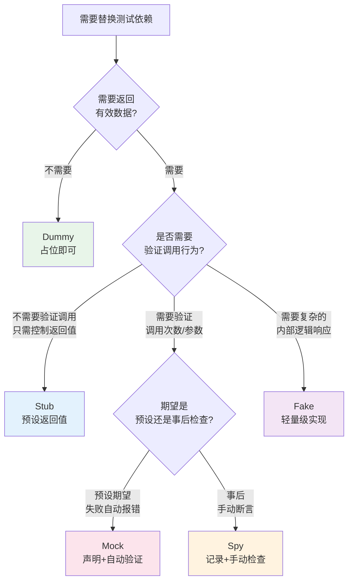
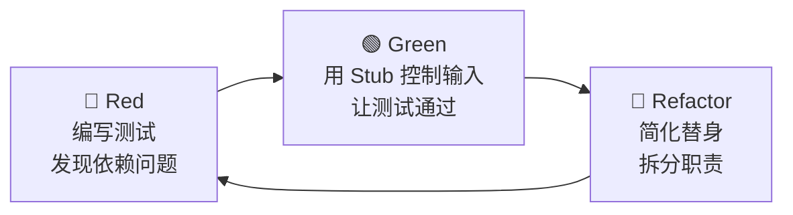

## 测试替身分类：Mock、Stub、Fake、Spy、Dummy 的本质区别与实战选型

### 1. 为什么需要测试替身

#### 1.1 问题的起源

当你要测试一个订单处理服务时，它依赖数据库存储订单、依赖支付网关处理扣款、依赖邮件服务发送通知。直接调用这些真实依赖会带来三个致命问题：

- **速度问题**：数据库查询、网络请求需要数秒甚至数分钟，而单元测试要求毫秒级反馈。一次典型的本地数据库写入耗时 5-50ms，而在 CI 环境中跨网络访问可能达到 200ms 以上。如果你有 500 个测试用例每个都访问真实数据库，仅数据库操作就可能耗时 10-100 秒——这完全违背了单元测试"毫秒级反馈"的设计初衷。
- **稳定性问题**：支付网关可能宕机、邮件服务可能限流、CDN 可能超时，测试结果变得不可预测。更隐蔽的是"时间依赖"——依赖当前时间的代码在不同时间点执行会产生不同结果，导致测试时而通过时而失败的"间歇性失败"（Flaky Test）。
- **环境问题**：在本地开发机上没有生产环境的数据库和消息队列，测试根本跑不起来。即使搭建了本地环境，不同开发者的环境配置差异也会导致"在我机器上能跑"的困境。

测试替身（Test Double）就是用来替代这些真实依赖的"演员"——它模拟外部系统的行为，让被测代码在隔离环境中执行。

#### 1.2 术语的起源

"Test Double"一词源自 Gerard Meszaros 在 2007 年出版的《xUnit Test Patterns: Refactoring Test Code》。他用电影替身演员作类比——就像电影中危险场景用替身代替主演一样，测试中用替身代替真实依赖。该书定义了五种基本类型：



这五种替身不是孤立的概念，而是一个从简单到复杂的连续谱系。Dummy 最简单——只是占位符；Fake 最复杂——拥有完整的业务逻辑。理解这个谱系的关键在于：**不同替身解决的是测试中不同维度的问题**——Dummy 解决"参数填坑"，Stub 解决"输入控制"，Spy 解决"行为审计"，Mock 解决"行为契约"，Fake 解决"真实感与速度的平衡"。

#### 1.3 测试替身与测试类型的关系

测试替身不是某种特定测试类型的专利。不同测试层级对替身的依赖程度不同：

| 测试层级 | 替身使用策略 | 典型替身类型 | 是否可使用真实依赖 |
|----------|-------------|-------------|-------------------|
| 单元测试 | 完全隔离，全部使用替身 | Stub、Mock、Dummy | 否 |
| 集成测试 | 部分使用替身 | Fake（内存实现） | 部分是 |
| 组件测试 | 尽量使用真实依赖 | Fake（容器化的DB） | 部分是 |
| 端到端测试 | 极少使用替身 | 仅外部第三方服务 | 是 |

这个表格揭示了一个重要规律：**随着测试层级升高，替身的使用逐渐减少，真实依赖的使用逐渐增多**。这是因为在更高层级的测试中，组件间的真实交互本身就是验证目标——用替身替代它们会失去测试的意义。

#### 1.4 芝加哥学派与伦敦学派

在测试替身的使用哲学上，存在两大流派之争，理解它们有助于做出更明智的替身选型决策：

**芝加哥学派（Chicago School / Classicist）**——又称经典学派。主张只 Mock 外部系统边界（数据库、网络、文件系统），对内部组件使用 Fake 或直接调用真实实现。这种风格的测试更接近真实行为，信心更高，但测试速度可能较慢。

```python
# 芝加哥学派风格：只 Mock 外部边界
def test_order_processing():
    # 真实的内存仓储（Fake）——不 Mock 内部组件
    repo = InMemoryOrderRepository()
    pricing = RealPricingService()  # 真实的定价服务
    
    # 只 Mock 外部支付网关
    with patch('payment_gateway.charge') as mock_charge:
        mock_charge.return_value = ChargeResult(reference="CHG-001")
        processor = OrderProcessor(repo, pricing, payment_gateway)
        result = processor.process(Order(items=[...]))
    
    assert result.is_success
    assert repo.find_by_id(result.order_id) is not None  # 验证持久化
```

**伦敦学派（London School / Mockist）**——又称 Mockist 学派。主张对所有协作对象都使用 Mock，只关注被测单元本身的行为，不信任任何外部交互。这种风格的测试隔离性最强、运行最快，但可能产生过度 Mock 和脆弱测试。

```python
# 伦敦学派风格：所有协作对象都 Mock
def test_order_processing():
    mock_repo = MagicMock(spec=OrderRepository)
    mock_pricing = MagicMock(spec=PricingService)
    mock_gateway = MagicMock(spec=PaymentGateway)
    
    mock_pricing.calculate.return_value = Decimal("199.99")
    mock_gateway.charge.return_value = ChargeResult(reference="CHG-001")
    
    processor = OrderProcessor(mock_repo, mock_pricing, mock_gateway)
    result = processor.process(Order(items=[...]))
    
    # 验证所有交互——但不验证真实行为
    mock_pricing.calculate.assert_called_once()
    mock_gateway.charge.assert_called_once()
    mock_repo.save.assert_called_once()
```

| 对比维度 | 芝加哥学派 | 伦敦学派 |
|----------|-----------|---------|
| Mock 范围 | 仅外部边界 | 所有协作对象 |
| 测试信心 | 较高（接近真实行为） | 较低（大量替身行为） |
| 运行速度 | 较慢 | 较快 |
| 维护成本 | 中等（Fake 需维护） | 较高（Mock 脆弱） |
| 适合场景 | 集成测试、组件测试 | 单元测试、快速反馈 |
| 代表工具 | Testcontainers, H2 | Mockito, unittest.mock |

现代工程实践通常**混合使用两种风格**：纯函数和核心逻辑用芝加哥学派（减少替身），涉及外部交互的薄层用伦敦学派（快速隔离）。

---

### 2. 五种测试替身详解

#### 2.1 Dummy（哑对象）

**定义**：Dummy 对象是测试中的占位符，它被传递给被测代码，但不会在测试执行中被实际使用。它的存在仅仅是为了满足方法签名的参数要求。

**核心特征**：
- 不包含任何业务逻辑
- 不返回有意义的数据
- 不参与测试的断言验证
- 通常为 `null`、空字符串、空列表或最简单的实例

**适用场景**：

```python
# 场景：测试 UserService.register()，第三个参数 emailSender 不在本测试中使用
class EmailSender:
    """真实的邮件发送服务"""
    def send(self, to: str, subject: str, body: str) -> bool:
        # 复杂的SMTP连接、重试逻辑...
        pass

class DummyEmailSender(EmailSender):
    """哑对象：什么都不做，仅满足类型要求"""
    def send(self, to, subject, body):
        pass  # 空实现，调用即返回

# 测试代码
def test_register_validates_username():
    user_service = UserService(
        repository=InMemoryUserRepo(),  # 这个会用到
        email_sender=DummyEmailSender()  # 这个只是占位
    )
    with pytest.raises(ValidationError):
        user_service.register("", "password123", "dummy@example.com")
    # 断言不关心 email_sender 是否被调用
```

**何时选择 Dummy**：
- 方法签名要求传入依赖，但当前测试用例不涉及该依赖的交互
- 参数只被转发到更深层的调用中，当前测试层级不关心它的行为
- 需要满足构造函数参数，但只想测试类的其他部分

**常见的 Dummy 创建方式**：

```python
# Python 中常见的几种 Dummy
dummy_none = None
dummy_empty_str = ""
dummy_empty_list = []
dummy_empty_dict = {}
dummy_zero = 0

# Lambda 也是 Dummy
dummy_callback = lambda *args, **kwargs: None
```

```java
// Java 中常见的几种 Dummy
Object dummyNull = null;
String dummyEmpty = "";
List<Object> dummyList = Collections.emptyList();
Map<String, Object> dummyMap = Collections.emptyMap();
Runnable dummyRunnable = () -> {};  // 空的 Lambda 也是 Dummy
```

**Dummy 的陷阱**：Dummy 虽然简单，但使用不当也会带来问题。最常见的错误是**用 Dummy 替代了应该用 Stub 的场景**——当被测代码确实需要从某个依赖获取数据来执行分支逻辑时，传入 Dummy 会导致 `None` 引用错误或空指针异常，测试失败的原因与被测逻辑无关，增加了调试成本。

#### 2.2 Stub（桩对象）

**定义**：Stub 为被测代码提供间接输入。它被调用时返回预设的硬编码值，控制被测代码的执行路径。Stub 不关心自己被调用了多少次、以什么参数调用——它只是一个"数据供给站"。

**核心特征**：
- 包含预设的返回值或行为
- 不验证交互行为（不关心是否被调用、被调用几次）
- 不会主动让测试失败
- 通常在 `setup` 或 `Arrange` 阶段配置

**适用场景**：

```python
from unittest.mock import MagicMock

class UserRepository:
    def find_by_id(self, user_id: str) -> User:
        """从数据库查询用户"""
        pass

class PriceService:
    def get_product_price(self, product_id: str) -> float:
        """从价格服务获取价格"""
        pass

class OrderService:
    def __init__(self, user_repo: UserRepository, price_service: PriceService):
        self.user_repo = user_repo
        self.price_service = price_service

    def calculate_discount(self, user_id: str, product_id: str) -> float:
        """VIP 用户享受 8 折优惠"""
        user = self.user_repo.find_by_id(user_id)
        price = self.price_service.get_product_price(product_id)
        if user.is_vip:
            return price * 0.8
        return price

# Stub 的典型用法
def test_vip_discount():
    # Arrange: 创建 Stub，预设返回值
    stub_repo = MagicMock(spec=UserRepository)
    stub_repo.find_by_id.return_value = User(id="u1", is_vip=True, name="VIP用户")

    stub_price = MagicMock(spec=PriceService)
    stub_price.get_product_price.return_value = 100.0

    service = OrderService(stub_repo, stub_price)

    # Act
    result = service.calculate_discount("u1", "p1")

    # Assert: 只验证最终结果，不验证 Stub 的调用细节
    assert result == 80.0  # 100 * 0.8 = 80
```

**Stub 的层次与粒度**：

| 粒度 | 实现方式 | 适用场景 |
|------|---------|---------|
| 硬编码返回 | `mock.return_value = 固定值` | 简单的分支测试 |
| 参数化返回 | `mock.side_effect = lambda x: x * 2` | 需要根据输入产生不同输出 |
| 状态机 Stub | 用字典记录多次调用返回不同值 | 测试重试逻辑、状态流转 |
| 带条件的 Stub | `side_effect = 条件函数` | 模拟不同参数触发不同路径 |

```python
# 状态机 Stub：模拟重试场景
def create_flaky_stub():
    stub = MagicMock()
    stub.call.side_effect = [
        ConnectionError("第一次失败"),
        TimeoutError("第二次超时"),
        "第三次成功"  # 第三次返回正常结果
    ]
    return stub

# 使用
stub = create_flaky_stub()
assert stub.call() == "第三次成功"  # 内部自动处理失败并重试
```

**Stub 的陷阱**：

> **陷阱一：Stub 过于复杂**
> 当 Stub 的实现逻辑开始变复杂（超过 5 行），它就不再是 Stub，而是在重复真实依赖的逻辑。此时应该考虑使用 Fake 替代。
>
> **陷阱二：过度配置 Stub**
> 为一个测试配置 10 个 Stub 的返回值，通常意味着被测方法的职责过多，需要考虑拆分。这是"代码异味"（Code Smell）的信号——不是测试难写，而是被测代码需要重构。
>
> **陷阱三：Stub 之间的隐式耦合**
> 当两个 Stub 的返回值之间存在逻辑关系（例如用户 Stub 的 VIP 状态决定了价格 Stub 的折扣率），这种隐式耦合使得测试用例之间难以独立修改。更好的做法是让 Stub 的返回值在每个测试中完全独立地配置。

#### 2.3 Spy（间谍对象）

**定义**：Spy 是真实对象的包装器（Wrapper），它调用真实对象的同时记录交互信息——调用了几次、传入了什么参数、返回了什么值。测试在 `Assert` 阶段检查这些记录。

**核心特征**：
- 包装真实对象或部分实现
- 记录方法调用的元数据（次数、参数、返回值）
- 不预设期望，事后检查
- 不会让测试自动失败（与 Mock 的区别）

**适用场景**：

```python
from unittest.mock import MagicMock

class NotificationService:
    def __init__(self, sms_gateway):
        self.sms_gateway = sms_gateway

    def send_order_confirmation(self, phone: str, order_id: str):
        """发送订单确认短信"""
        self.sms_gateway.send(phone, f"您的订单 {order_id} 已确认")

# 用 Spy 验证交互
def test_order_confirmation_sms():
    # Spy: 包装真实网关，记录调用
    spy_gateway = MagicMock()
    notification = NotificationService(spy_gateway)

    notification.send_order_confirmation("13800138000", "ORD-001")

    # 事后断言：检查 Spy 记录的信息
    spy_gateway.send.assert_called_once_with(
        "13800138000",
        "您的订单 ORD-001 已确认"
    )

# 带断言的 Spy：检查调用序列
def test_sending_multiple_notifications():
    spy = MagicMock()
    notification = NotificationService(spy)

    notification.send_order_confirmation("13800138000", "ORD-001")
    notification.send_order_confirmation("13900139000", "ORD-002")

    # 验证调用顺序
    expected_calls = [
        call("13800138000", "您的订单 ORD-001 已确认"),
        call("13900139000", "您的订单 ORD-002 已确认"),
    ]
    assert spy.send.call_args_list == expected_calls
```

**Python 中的 Spy 实现模式**：

```python
# 模式一：使用 unittest.mock 记录（最简单）
spy = MagicMock()
target.method()
spy.method.assert_called_with(args)

# 模式二：手动实现 Spy 类（更精细的控制）
class SpyEmailSender:
    """手动实现的 Spy：包装真实 Sender，记录所有调用"""
    def __init__(self, real_sender):
        self.real_sender = real_sender
        self.sent_emails = []  # 记录所有发送的邮件

    def send(self, to, subject, body):
        result = self.real_sender.send(to, subject, body)
        self.sent_emails.append({
            "to": to,
            "subject": subject,
            "body": body,
            "success": result
        })
        return result

# 使用 Spy 验证
sender = SpyEmailSender(RealSmtpSender())
order_service = OrderService(email_sender=sender)
order_service.place_order(order)

assert len(sender.sent_emails) == 1
assert sender.sent_emails[0]["to"] == "customer@example.com"
assert "确认" in sender.sent_emails[0]["subject"]
```

**Spy 与 Mock 的关键区别**：

> **Spy 是"事后断言"**：先执行，再检查记录的调用信息，测试不因 Spy 而失败。Spy 的核心价值在于"我看到了什么"——它忠实记录，但不做强制约束。这使得测试在重构时更加健壮——即使调用顺序改变，只要最终行为正确，测试仍然通过。
>
> **Mock 是"预设期望"**：先声明期望行为，执行时自动验证，期望不满足则测试自动失败。Mock 的核心价值在于"你应该做什么"——它明确契约，违反契约即失败。这使得测试在行为回归检测上更加严格——任何偏离预期的行为都会立即被捕获。
>
> 这个区别决定了代码风格的差异。Spy 的测试更像"记录+检查"，Mock 的测试更像"声明+验证"。

#### 2.4 Mock（模拟对象）

**定义**：Mock 是测试替身中最"强势"的一种。它在创建时就声明了期望的行为——应该被调用几次、传入什么参数、在什么时机触发回调。如果实际行为不符合期望，Mock 会自动让测试失败。

**核心特征**：
- 预设行为期望（Expectations）
- 执行后自动验证期望是否满足
- 期望不满足时测试自动失败
- 集成了 Stub 和 Spy 的功能

**适用场景**：

```python
from unittest.mock import MagicMock, patch, call

class PaymentProcessor:
    def __init__(self, gateway, fraud_detector, receipt_service):
        self.gateway = gateway
        self.fraud_detector = fraud_detector
        self.receipt_service = receipt_service

    def process_payment(self, order) -> PaymentResult:
        """处理支付的完整流程"""
        # 1. 风控检查
        risk_score = self.fraud_detector.analyze(order)
        if risk_score > 0.8:
            return PaymentResult.rejected("高风险交易")

        # 2. 调用支付网关
        charge_result = self.gateway.charge(
            amount=order.total,
            token=order.payment_token
        )

        # 3. 发送收据
        self.receipt_service.send(
            to=order.customer_email,
            amount=order.total,
            reference=charge_result.reference
        )

        return PaymentResult.success(charge_result.reference)

# Mock 测试：预设期望并自动验证
def test_payment_flow():
    # Arrange: 创建 Mock 并设置期望
    mock_gateway = MagicMock(spec=PaymentGateway)
    mock_gateway.charge.return_value = ChargeResult(reference="CHG-001", status="ok")

    mock_fraud = MagicMock(spec=FraudDetector)
    mock_fraud.analyze.return_value = 0.3  # 低风险

    mock_receipt = MagicMock(spec=ReceiptService)

    processor = PaymentProcessor(mock_gateway, mock_fraud, mock_receipt)

    # Act
    order = Order(total=199.99, payment_token="tok_xxx", customer_email="a@b.com")
    result = processor.process_payment(order)

    # Assert: Mock 自动验证期望
    # 期望1：风控检查被调用
    mock_fraud.analyze.assert_called_once_with(order)

    # 期望2：支付网关被正确调用
    mock_gateway.charge.assert_called_once_with(amount=199.99, token="tok_xxx")

    # 期望3：收据服务被调用
    mock_receipt.send.assert_called_once_with(
        to="a@b.com",
        amount=199.99,
        reference="CHG-001"
    )

    # 期望4：最终结果
    assert result.is_success
    assert result.reference == "CHG-001"

# Mock 测试：验证异常路径
def test_payment_rejected_high_risk():
    mock_gateway = MagicMock(spec=PaymentGateway)
    mock_fraud = MagicMock(spec=FraudDetector)
    mock_fraud.analyze.return_value = 0.95  # 高风险
    mock_receipt = MagicMock(spec=ReceiptService)

    processor = PaymentProcessor(mock_gateway, mock_fraud, mock_receipt)
    order = Order(total=199.99, payment_token="tok_xxx", customer_email="a@b.com")

    result = processor.process_payment(order)

    assert result.is_rejected
    assert result.reason == "高风险交易"
    # 关键验证：高风险时不应调用支付网关和收据服务
    mock_gateway.charge.assert_not_called()
    mock_receipt.send.assert_not_called()
```

**Mock 的预设模式**：

```python
# 基础模式：固定返回值
mock.method.return_value = "result"

# 异常模式：抛出异常
mock.method.side_effect = ValueError("invalid input")

# 序列模式：多次调用返回不同值
mock.method.side_effect = ["first", "second", "third"]

# 回调模式：根据参数动态返回
def dynamic_return(x):
    return x * 2
mock.method.side_effect = dynamic_return

# 约束模式：限制调用次数
mock.method.call_count  # 读取调用次数
mock.method.assert_called()  # 至少调用一次
mock.method.assert_called_once()  # 恰好调用一次
mock.method.assert_called_with(arg1, arg2)  # 最后一次调用的参数
mock.method.assert_any_call(arg1, arg2)  # 任意一次调用的参数
mock.method.assert_not_called()  # 从未被调用
```

#### 2.5 Fake（伪实现）

**定义**：Fake 是被测依赖的一个简化但可工作的实现。它拥有与真实依赖相同的接口，但内部逻辑做了轻量化处理，用简单算法或内存数据替代复杂的外部交互。

**核心特征**：
- 完整的业务逻辑实现（不是空方法）
- 比真实依赖更简单、更快
- 可能有自己的 Bug，但对测试场景足够
- 通常是被测代码自身之外的"产品级简化版"

**适用场景**：

```python
from typing import Dict, Optional
import uuid

class UserRecord:
    def __init__(self, id: str, name: str, email: str):
        self.id = id
        self.name = name
        self.email = email

# 真实的数据库仓储
class PostgresUserRepository:
    def __init__(self, connection_string: str):
        self.conn = psycopg2.connect(connection_string)

    def save(self, user: UserRecord) -> str:
        cursor = self.conn.cursor()
        cursor.execute(
            "INSERT INTO users (id, name, email) VALUES (%s, %s, %s)",
            (user.id, user.name, user.email)
        )
        self.conn.commit()
        return user.id

    def find_by_id(self, user_id: str) -> Optional[UserRecord]:
        cursor = self.conn.cursor()
        cursor.execute("SELECT id, name, email FROM users WHERE id = %s", (user_id,))
        row = cursor.fetchone()
        if row:
            return UserRecord(id=row[0], name=row[1], email=row[2])
        return None

    def find_by_email(self, email: str) -> Optional[UserRecord]:
        # 复杂的 SQL 查询...
        pass

    def delete(self, user_id: str) -> bool:
        # 删除逻辑...
        pass

# Fake 实现：内存版仓储（可工作的简化版）
class InMemoryUserRepository:
    """
    Fake: 内存版用户仓储
    - 接口与 PostgresUserRepository 完全一致
    - 数据存储在 Python 字典中，无需数据库连接
    - 实现了完整的 CRUD 逻辑，不仅仅是空方法
    """
    def __init__(self):
        self._store: Dict[str, UserRecord] = {}
        self._email_index: Dict[str, str] = {}  # email -> id 索引

    def save(self, user: UserRecord) -> str:
        self._store[user.id] = user
        self._email_index[user.email] = user.id
        return user.id

    def find_by_id(self, user_id: str) -> Optional[UserRecord]:
        return self._store.get(user_id)

    def find_by_email(self, email: str) -> Optional[UserRecord]:
        user_id = self._email_index.get(email)
        if user_id:
            return self._store.get(user_id)
        return None

    def delete(self, user_id: str) -> bool:
        user = self._store.pop(user_id, None)
        if user:
            self._email_index.pop(user.email, None)
            return True
        return False

    def count(self) -> int:
        """Fake 特有的辅助方法，便于测试验证"""
        return len(self._store)

# 使用 Fake 进行集成级别的测试
def test_user_registration_flow():
    # Fake 比 Mock 更真实，测试更有信心
    repo = InMemoryUserRepository()
    service = UserService(repo)

    user_id = service.register("张三", "zhangsan@example.com")
    assert user_id is not None

    user = repo.find_by_id(user_id)
    assert user.name == "张三"
    assert user.email == "zhangsan@example.com"

    # 验证索引也能正常工作
    user_by_email = repo.find_by_email("zhangsan@example.com")
    assert user_by_email.id == user_id
```

**常见的 Fake 实现**：

| 真实依赖 | Fake 实现 | 适用测试类型 |
|---------|----------|------------|
| MySQL / PostgreSQL | SQLite / 内存字典 | 集成测试 |
| Redis 缓存 | Python dict / fakeredis | 集成测试 |
| AWS S3 | LocalStack / 内存文件系统 | 组件测试 |
| SMTP 邮件服务 | 文件写入 / FakeMailServer | 集成测试 |
| HTTP API 客户端 | Flask/FastAPI 内存服务器 | 组件测试 |
| 消息队列 (Kafka/RabbitMQ) | 内存队列 / asyncio.Queue | 集成测试 |
| 时间/日期 | freezegun / 自定义 ClockFake | 单元测试 |

**Fake 与 Stub 的本质区别**：

> Stub 的行为是硬编码的——无论传入什么参数，它都返回预设值。Fake 有完整的内部逻辑——传入不同参数会产生不同结果，就像真实依赖一样。
>
> 例如：Stub 的 `find_by_id()` 永远返回同一个用户；Fake 的 `find_by_id()` 会真正从内存中查找，查到返回、查不到返回 `None`。

**Fake 的维护成本考量**：Fake 不是免费的午餐。它本身就是一个需要维护的代码模块——当真实依赖的接口变更时，Fake 也必须同步更新。这就是为什么 Fake 更适合用在集成测试层级，而非所有测试都用 Fake。一些成熟的 Fake 实现（如 fakeredis、H2 Database）由社区维护，可以显著降低这个成本。

---

### 3. 五种替身的对比总结

#### 3.1 一览对比表

| 特性 | Dummy | Stub | Spy | Mock | Fake |
|------|-------|------|-----|------|------|
| **目的** | 占位 | 提供间接输入 | 记录调用信息 | 验证交互行为 | 简化的真实实现 |
| **有返回值** | 无 | 有（预设） | 有（真实值） | 有（预设） | 有（计算得出） |
| **验证行为** | 不验证 | 不验证 | 事后检查 | 预设+自动验证 | 不验证（通过结果间接验证） |
| **实现复杂度** | 极低 | 低 | 中 | 中 | 高 |
| **可独立运行** | 否 | 否 | 否 | 否 | 是 |
| **测试失败由谁触发** | 被测代码 | 被测代码 | 被测代码 | Mock 自身 | 被测代码 |
| **类比** | 路人甲 | 自动售货机 | 监控摄像头 | 严格导演 | 简易道具 |
| **维护成本** | 几乎为零 | 低 | 中 | 中 | 高（需同步更新） |

#### 3.2 选择决策树



#### 3.3 购物车系统的选型实战

为了帮助读者真正掌握选型决策，以下用一个购物车系统的完整测试来展示五种替身如何在同一场景中各司其职：

```python
class ShoppingCart:
    def __init__(self, user_repo, inventory_service, pricing_engine, 
                 coupon_validator, notification_service):
        self.user_repo = user_repo
        self.inventory = inventory_service
        self.pricing = pricing_engine
        self.coupon_validator = coupon_validator
        self.notifier = notification_service

    def checkout(self, user_id: str, coupon_code: str = None) -> CheckoutResult:
        """完整的结账流程"""
        # 1. 获取用户信息
        user = self.user_repo.find_by_id(user_id)
        if user is None:
            return CheckoutResult.failed("用户不存在")

        # 2. 检查库存
        for item in self.cart_items:
            if not self.inventory.check_stock(item.sku, item.quantity):
                return CheckoutResult.failed(f"商品 {item.sku} 库存不足")

        # 3. 计算价格
        total = self.pricing.calculate_total(self.cart_items)

        # 4. 验证优惠券
        if coupon_code:
            discount = self.coupon_validator.validate(coupon_code, total)
            total = total - discount

        # 5. 扣减库存
        for item in self.cart_items:
            self.inventory.reserve(item.sku, item.quantity)

        # 6. 发送通知
        self.notifier.send(user.email, "订单已创建", f"总金额: {total}")

        return CheckoutResult.success(total=total)
```

**场景一：测试用户不存在时的错误处理**——用 Dummy 和 Stub

```python
def test_checkout_user_not_found():
    # Stub: 预设用户不存在
    stub_repo = MagicMock(spec=UserRepository)
    stub_repo.find_by_id.return_value = None

    # Dummy: 其他依赖不需要测试
    cart = ShoppingCart(
        user_repo=stub_repo,
        inventory_service=MagicMock(),      # Dummy — 不参与此测试
        pricing_engine=MagicMock(),          # Dummy — 不参与此测试
        coupon_validator=MagicMock(),        # Dummy — 不参与此测试
        notification_service=MagicMock(),    # Dummy — 不参与此测试
    )
    cart.cart_items = [CartItem(sku="SKU-001", quantity=1)]

    result = cart.checkout("nonexistent_user")
    assert result.is_failed
    assert "用户不存在" in result.message
```

**场景二：测试正常结账的交互行为**——用 Mock

```python
def test_checkout_success():
    stub_repo = MagicMock(spec=UserRepository)
    stub_repo.find_by_id.return_value = User(id="u1", email="test@example.com")

    mock_inventory = MagicMock(spec=InventoryService)
    mock_inventory.check_stock.return_value = True

    mock_pricing = MagicMock(spec=PricingEngine)
    mock_pricing.calculate_total.return_value = Decimal("299.00")

    mock_notifier = MagicMock(spec=NotificationService)

    cart = ShoppingCart(stub_repo, mock_inventory, mock_pricing,
                       MagicMock(), mock_notifier)
    cart.cart_items = [CartItem(sku="SKU-001", quantity=2)]

    result = cart.checkout("u1")

    # Mock 验证关键交互
    mock_inventory.check_stock.assert_called_with("SKU-001", 2)
    mock_inventory.reserve.assert_called_with("SKU-001", 2)
    mock_notifier.send.assert_called_once_with(
        "test@example.com", "订单已创建", "总金额: 299.00"
    )
    assert result.total == Decimal("299.00")
```

**场景三：验证调用顺序**——用 Spy

```python
def test_checkout_call_order():
    """验证结账流程的调用顺序：先检查库存 → 再扣减 → 最后通知"""
    spy_inventory = MagicMock()
    spy_notifier = MagicMock()

    cart = ShoppingCart(build_stub_repo(), spy_inventory,
                       build_pricing_stub(), MagicMock(), spy_notifier)
    cart.cart_items = [CartItem(sku="SKU-001", quantity=1)]

    cart.checkout("u1")

    # 验证调用顺序
    call_order = [call[0] for call in spy_inventory.method_calls]
    reserve_call = next(c for c in call_order if c[0] == 'reserve')
    check_call = next(c for c in call_order if c[0] == 'check_stock')

    # reserve 必须在 check_stock 之后
    assert call_order.index(check_call) < call_order.index(reserve_call)
```

---

### 4. Mock 框架实战

#### 4.1 Python — unittest.mock

```python
from unittest.mock import MagicMock, Mock, patch, PropertyMock, call

# MagicMock vs Mock 的区别
# MagicMock 预定义了魔术方法（__len__、__iter__、__enter__ 等）
mock_with_magic = MagicMock()
len(mock_with_magic)  # 返回 0，不会报错
mock_without_magic = Mock()
try:
    len(mock_without_magic)  # 抛出 TypeError
except TypeError:
    pass

# patch：在模块级别替换依赖
# 装饰器方式
@patch('my_module.external_api')
def test_with_patch(mock_api):
    mock_api.get.return_value = {"status": "ok"}
    result = my_module.do_something()
    assert result["status"] == "ok"

# 上下文管理器方式
def test_with_patch_context():
    with patch('my_module.external_api') as mock_api:
        mock_api.get.return_value = {"status": "ok"}
        result = my_module.do_something()
        assert result["status"] == "ok"

# spec 参数：限制 Mock 只能访问真实类的属性
# 防止拼写错误导致的"假绿灯"测试
mock_repo = MagicMock(spec=UserRepository)
mock_repo.find_by_id.return_value = None
mock_repo.nonexistent_method()  # 抛出 AttributeError
```

#### 4.2 Java — Mockito

```java
import static org.mockito.Mockito.*;
import static org.mockito.ArgumentMatchers.*;

// 创建 Mock
UserRepository mockRepo = mock(UserRepository.class);
PaymentGateway mockGateway = mock(PaymentGateway.class);

// Stub 预设返回值
when(mockRepo.findById("u1")).thenReturn(new User("u1", "张三"));
when(mockGateway.charge(anyDouble(), anyString()))
    .thenReturn(new ChargeResult("CHG-001"))
    .thenThrow(new TimeoutException());  // 第二次调用超时

// Mock 验证
PaymentProcessor processor = new PaymentProcessor(mockRepo, mockGateway);
processor.processPayment("u1", 199.99);

// 验证调用
verify(mockRepo, times(1)).findById("u1");
verify(mockGateway).charge(eq(199.99), eq("tok_xxx"));
verify(mockGateway, never()).refund(anyString());

// Spy 包装真实对象
RealUserService realService = new RealUserService();
RealUserService spyService = spy(realService);
doReturn("cached").when(spyService).fetchFromCache(anyString());
// fetchFromCache 走 Stub，其余方法走真实实现
```

#### 4.3 JavaScript/TypeScript — Jest

```typescript
// Jest 内置 Mock 功能
const mockRepository = {
  findById: jest.fn(),
  save: jest.fn(),
};

// Stub
mockRepository.findById.mockResolvedValue({ id: 'u1', name: '张三' });
mockRepository.save.mockResolvedValue('u1');

// Mock 验证
await orderService.createOrder('u1', 'p1');

expect(mockRepository.findById).toHaveBeenCalledWith('u1');
expect(mockRepository.save).toHaveBeenCalledWith(
  expect.objectContaining({ userId: 'u1' })
);

// jest.fn() 可以追踪调用历史
expect(mockRepository.findById).toHaveBeenCalledTimes(1);
expect(mockRepository.save.mock.calls[0][0]).toHaveProperty('total');

// jest.spyOn：Spy 模式
const spy = jest.spyOn(userService, 'validateEmail');
await userService.register('test@example.com');
expect(spy).toHaveBeenCalledWith('test@example.com');
spy.mockRestore();  // 恢复原始实现
```

#### 4.4 Go — 接口驱动的替身

Go 语言没有内置的 Mock 框架，但其隐式接口实现使得替身的创建非常自然：

```go
// 定义接口
type UserRepository interface {
    FindByID(id string) (*User, error)
    Save(user *User) error
}

// 真实实现
type PostgresUserRepo struct {
    db *sql.DB
}
func (r *PostgresUserRepo) FindByID(id string) (*User, error) { /* ... */ }
func (r *PostgresUserRepo) Save(user *User) error { /* ... */ }

// Fake 实现（内存版）——自动满足 UserRepository 接口
type InMemoryUserRepo struct {
    users map[string]*User
}
func (r *InMemoryUserRepo) FindByID(id string) (*User, error) {
    user, ok := r.users[id]
    if !ok {
        return nil, fmt.Errorf("user %s not found", id)
    }
    return user, nil
}
func (r *InMemoryUserRepo) Save(user *User) error {
    r.users[user.ID] = user
    return nil
}

// 测试代码
func TestUserService(t *testing.T) {
    repo := &amp;InMemoryUserRepo{users: make(map[string]*User)}
    service := NewUserService(repo)
    // 直接使用 Fake，无需 Mock 框架
}
```

Go 的设计哲学使得 Fake 成为最自然的选择——接口定义了契约，Fake 是契约的简化实现。这与 Go 社区推崇的"Accept interfaces, return structs"理念高度一致。

---

### 5. 高级话题

#### 5.1 测试替身的反模式

**反模式一：过度 Mock（Mock Hell）**

```python
# 错误示范：Mock 链式调用（Mock Hell）
def test_order_creation():
    mock_user = MagicMock()
    mock_user.get.return_value = MagicMock()
    mock_user.get.return_value.profile.return_value = MagicMock()
    mock_user.get.return_value.profile.return_value.address.return_value = MagicMock()
    mock_user.get.return_value.profile.return_value.address.return_value.city = "北京"

    # 这种测试极其脆弱，重构任何一层都会导致测试失败
```

Mock Hell 的本质问题是**测试与实现细节高度耦合**。当你需要 Mock 链式调用才能测试一个功能时，说明被测代码正在违反迪米特法则（Law of Demeter）——一个对象不应该知道其依赖对象的内部结构。

**正确的做法是使用 Fake 或测试更粗粒度的边界**：

```python
# 正确做法：使用 Fake 替代 Mock 链
class FakeUserProfileService:
    def __init__(self):
        self.profiles = {}

    def get_user_city(self, user_id: str) -> str:
        return self.profiles.get(user_id, {}).get("city", "未知")

    def set_profile(self, user_id: str, profile: dict):
        self.profiles[user_id] = profile

def test_order_creation():
    fake_profile = FakeUserProfileService()
    fake_profile.set_profile("u1", {"city": "北京"})
    service = OrderService(fake_profile)
    # 测试逻辑更清晰，且 Fake 的行为更接近真实依赖
```

**反模式二：测试实现细节而非行为**

```python
# 错误：验证了内部实现细节（私有方法调用顺序）
def test_bad_mock_usage():
    mock = MagicMock()
    service = MyService(mock)
    service.do_work()
    mock._internal_step_1.assert_called()  # 不应该关心内部步骤
    mock._internal_step_2.assert_called()  # 重构时这里必然失败

# 正确：验证外部可观测的行为
def test_good_mock_usage():
    mock = MagicMock()
    service = MyService(mock)
    result = service.do_work()
    assert result.status == "completed"  # 验证结果
    assert result.data is not None       # 验证产出
```

**反模式三：把 Mock 当成 Stub 用**

```python
# 错误：用 Mock 但完全不验证行为，只是用来返回数据
mock_repo = MagicMock(spec=UserRepository)
mock_repo.find_by_id.return_value = mock_user
# 测试结束，从未调用 assert_* 系列方法
# 这种情况用 Stub 或 Fake 更合适
```

**反模式四：Mock 中 Mock（嵌套 Mock）**

```python
# 错误：Mock 返回另一个 Mock，形成不可控的嵌套结构
mock_service = MagicMock()
mock_service.get_user().get_orders().get_first().get_amount()  # 灾难性的 Mock 嵌套
```

#### 5.2 测试替身与依赖注入

测试替身的前提是**依赖注入**（Dependency Injection）。如果代码通过 `new`、`import` 直接创建依赖，就无法替换为替身。

```python
# 无法测试的代码：依赖被硬编码在内部
class OrderServiceBad:
    def process(self, order):
        repo = PostgresOrderRepository("postgresql://localhost/orders")  # 硬编码
        gateway = StripePaymentGateway("sk_live_xxx")                   # 硬编码
        # 测试时无法替换这些依赖

# 可测试的代码：依赖通过构造函数注入
class OrderServiceGood:
    def __init__(self, repo: OrderRepository, gateway: PaymentGateway):
        self.repo = repo
        self.gateway = gateway

    def process(self, order):
        self.repo.save(order)
        self.gateway.charge(order.total)
        # 测试时可以注入 Stub、Mock 或 Fake
```

**依赖注入的三种方式**：

| 方式 | 实现 | 测试便利性 |
|------|------|-----------|
| 构造函数注入 | `__init__(dep)` | 最佳：明确依赖，易替换 |
| Setter 注入 | `set_dep(dep)` | 良好：可选依赖，运行时替换 |
| 接口注入 | 通过接口定义 | 良好：强类型约束 |

**无法使用依赖注入时的应急方案**：当遗留代码无法修改构造函数时，可以使用 `patch` 替换模块级别的依赖。但这种方式是临时手段，不应该成为长期策略——它使测试与模块路径耦合，模块重构会导致测试失败。

#### 5.3 不同语言生态的替身工具

| 语言 | Mock 框架 | Fake/内存替代库 | 特点 |
|------|----------|----------------|------|
| Python | unittest.mock, pytest-mock | fakeredis, in-memory DB | 内置 Mock 功能强大 |
| Java | Mockito, WireMock, PowerMock | H2 Database, EmbeddedRedis | Mockito 生态最成熟 |
| JavaScript | Jest, Sinon.js, Vitest | msw (API mocking) | Jest 内置完整 Mock |
| Go | gomock, testify/mock | gopkg.in/redis.v5 | Go 的 Mock 需要接口驱动 |
| Rust | mockall, mockito | -- | 编译期检查 Mock 安全性 |
| C# | Moq, NSubstitute | InMemoryDatabase (EF Core) | Moq 语法简洁优雅 |

#### 5.4 测试替身与 TDD 的关系

在测试驱动开发（TDD）中，测试替身的选型直接影响设计质量：

1. **Red 阶段**：编写测试，发现需要替身来隔离外部依赖
2. **Green 阶段**：使用 Stub 提供输入数据，让测试通过
3. **Refactor 阶段**：如果替身过于复杂，考虑用 Fake 替代；如果 Mock 太多，考虑拆分职责



> **经验法则**：如果你发现自己在为一个测试创建大量 Stub 和 Mock，这通常意味着被测单元的职责过多——这是设计问题的信号，而非测试工具的问题。

---

### 6. 常见误区与最佳实践

#### 6.1 五大误区

| 误区 | 真相 | 建议 |
|------|------|------|
| Mock 能替代所有替身 | 不同替身解决不同问题 | 根据目的选择：输入控制用 Stub，行为验证用 Mock，逻辑模拟用 Fake |
| Mock 越多测试越安全 | 过度 Mock 导致脆弱测试 | 只 Mock 真正的外部边界（网络、文件系统、第三方 API） |
| Fake 可以在所有测试中使用 | Fake 本身可能有 Bug | 单元测试用 Mock/Stub，集成测试用 Fake |
| 测试替身让测试变"假" | 替身让测试变"可控" | 好的替身测试验证的是正确的行为模式 |
| Spy 比 Mock 更好 | 各有适用场景 | Spy 适合事后审查，Mock 适合行为约束 |

#### 6.2 最佳实践清单

- **优先使用 Fake**：Fake 提供最真实的测试体验，同时保持速度和隔离性。当团队有精力维护 Fake 时，它是单元测试和集成测试之间的最佳平衡点。
- **Mock 边界而非内部**：只 Mock 真正的外部系统边界（数据库、网络、文件系统），不要 Mock 内部服务。内部服务之间的交互应该通过集成测试来验证。
- **一个测试一个焦点**：每个测试只验证一个行为路径，避免一个测试验证 10 个 Mock 的交互。测试越聚焦，失败时越容易定位问题。
- **保持替身简单**：如果替身的实现超过 20 行，考虑用 Fake 替代。复杂替身的维护成本可能超过它带来的测试价值。
- **使用 spec 参数**：Mock 对象应该用 `spec` 约束，防止拼写错误导致"假绿灯"测试。`MagicMock(spec=UserService)` 比 `MagicMock()` 安全得多。
- **定期清理**：随着重构推进，检查是否有过时的 Mock 仍在使用。过时的替身不仅浪费维护成本，还可能掩盖设计问题。
- **避免跨测试共享 Mock 状态**：每个测试方法应该创建自己的 Mock 实例。共享 Mock 可能导致测试之间的隐式依赖。

#### 6.3 何时使用真实依赖的决策框架

是否需要测试替身？按以下顺序判断：

1. 这个依赖在测试环境可用吗？
   - 不可用 → 必须使用替身（Fake 或 Mock）
   - 可用 → 继续判断

2. 调用这个依赖是否影响测试速度（>100ms）？
   - 是 → 使用 Fake 或 Stub
   - 否 → 继续判断

3. 调用这个依赖是否会产生副作用（发邮件、扣款）？
   - 是 → 必须使用 Mock（验证交互但不执行）
   - 否 → 继续判断

4. 这个依赖的行为是否确定且可重复？
   - 否（随机数、时间戳） → 使用 Stub 控制返回值
   - 是 → 可以使用真实依赖

#### 6.4 替身选型速查表

当面对一个具体的测试场景时，可以按以下速查表快速决策：

| 场景 | 推荐替身 | 原因 |
|------|---------|------|
| 验证"无此用户"的错误分支 | Stub | 只需预设 `find_by_id` 返回 None |
| 验证支付后发送了邮件 | Mock | 需要确认邮件被调用，但不能真正发送 |
| 验证数据库读写正确性 | Fake (内存DB) | 需要真实的 CRUD 行为但不能连真实 DB |
| 构造函数必须传但不使用的参数 | Dummy | 只是填坑，不参与测试逻辑 |
| 验证异步任务被正确调度 | Mock | 需要确认调度被调用，但不能真正执行 |
| 测试缓存命中/未命中的行为 | Fake (内存缓存) | 需要真实的 get/set/expire 逻辑 |
| 验证 HTTP 请求的 URL 和 Header | Spy 或 Mock | Mock 更严格，Spy 更灵活 |
| 测试 CSV 导入解析逻辑 | Stub | 只需预设文件内容返回值 |

---

### 7. 本节回顾

本节从测试替身的起源讲起，系统阐述了五种测试替身——Dummy、Stub、Spy、Mock、Fake——的定义、特征、适用场景和陷阱。核心要点：

1. **五种替身解决不同维度的问题**：Dummy 占位、Stub 控制输入、Spy 审计行为、Mock 约束契约、Fake 平衡真实感与速度。
2. **选型的关键在于问对问题**：是否需要返回值？是否需要验证行为？期望是预设还是事后检查？
3. **Mock 不是万能的**：过度 Mock 是最常见的反模式，Fake 往往是更好的选择。
4. **依赖注入是前提**：没有 DI，替身就无从谈起。
5. **替身服务于设计**：替身的复杂度是代码设计质量的晴雨表——替身越复杂，被测代码越需要重构。

下一节将讲解代码覆盖率——如何量化测试的"触达程度"，以及覆盖率数字背后的陷阱。
