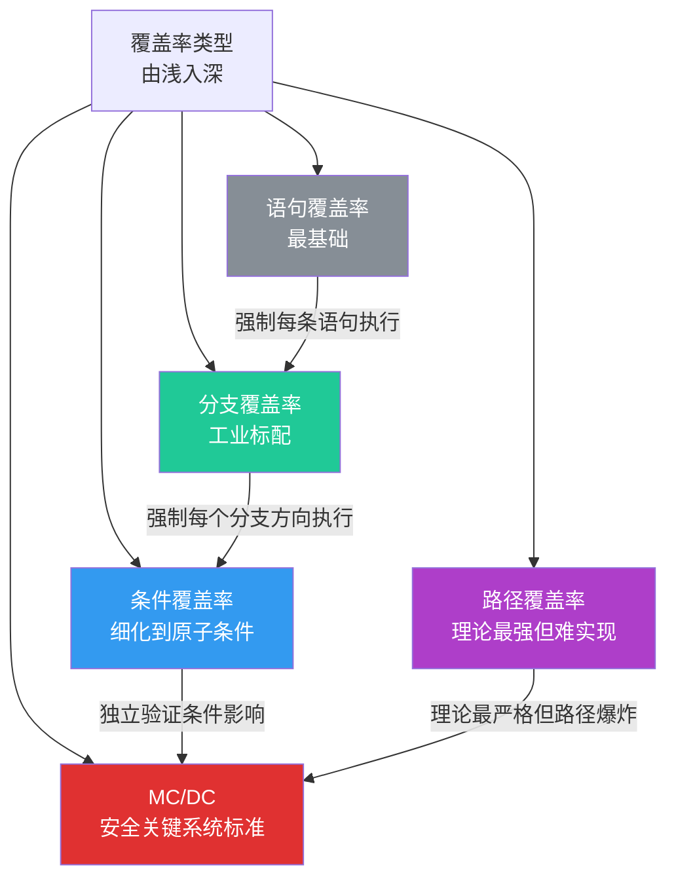
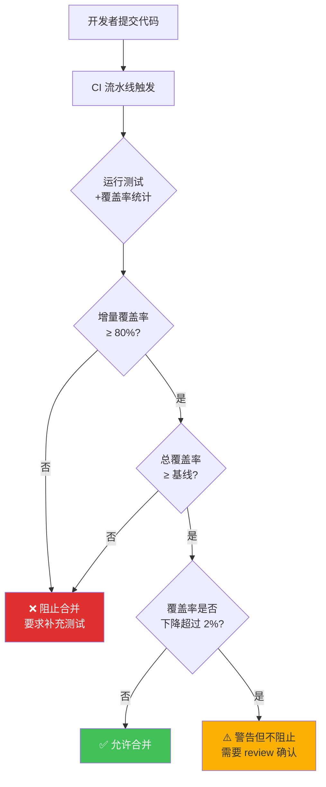
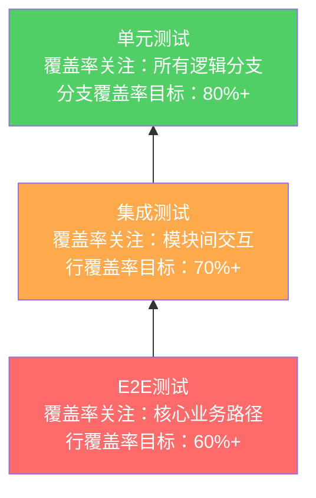

## 代码覆盖率：从行覆盖到 MC/DC，衡量测试质量的科学标尺

### 1. 概述与背景

#### 1.1 什么是代码覆盖率

代码覆盖率（Code Coverage）是衡量测试套件对源代码"触及程度"的量化指标——它回答的问题是：**在所有测试执行过程中，源代码中有多少行、多少分支、多少条件被实际执行到了？**

覆盖率不告诉你"测试写得好不好"，但能告诉你"测试有没有漏掉哪些代码"。一个覆盖率 0% 的模块意味着没有任何测试执行过它里面的任何代码；一个覆盖率 100% 的模块意味着每一条可执行语句都在至少一次测试中被走过。

#### 1.2 为什么需要覆盖率

没有覆盖率指标的测试体系存在三个盲区：

- **盲区一：不知道遗漏了什么**。团队写了 200 个测试，感觉"够多了"，但可能某个核心模块一个测试都没有。覆盖率是发现盲区的最直接手段。
- **盲区二：无法量化改进方向**。代码新增了 500 行，测试要不要补？补到什么程度？覆盖率差值（diff）可以精确指出哪些新代码没有被测试覆盖。
- **盲区三：CI/CD 缺乏质量门禁**。没有覆盖率基线，CI 流水线无法自动拦截"新增代码没有测试"的提交。

#### 1.3 历史演进

代码覆盖率技术最早可以追溯到 1960 年代 IBM 的编译器测试项目。当时工程师们需要回答一个朴素的问题："我们的测试用例到底跑到了程序的哪些部分？" 于是他们开发了最早的覆盖率分析工具，在目标程序中插桩（instrumentation），统计运行时的代码执行路径。

从 1960 年代到今天，覆盖率经历了三个重要阶段：

| 阶段 | 时间 | 代表性工作 | 核心突破 |
|------|------|-----------|---------|
| 萌芽期 | 1960s-1970s | IBM 编译器测试、OS/360 项目 | 首次提出"覆盖率"作为测试度量的概念 |
| 标准化 | 1978-2011 | 覆盖率类型理论（Rappaport, Wood, McCabe）、DO-178C 航空标准 | 行/分支/条件/MC/DC 等类型被严格定义并标准化 |
| 普及期 | 2000s-至今 | JaCoCo、coverage.py、Istanbul 等开源工具 | 覆盖率集成到 CI/CD 流水线，成为工程实践标配 |

关键里程碑：1978 年，Rappaport 首次严格定义了语句覆盖率和分支覆盖率的形式化模型；1993 年，Wood 和 McCabe 提出了修改条件/判定覆盖率（MC/DC），后被航空安全标准 DO-178B 采纳为最高安全等级软件的强制要求。

---

### 2. 覆盖率类型详解

覆盖率并非单一概念，而是一个由浅入深的类型家族。每种类型捕捉不同的"覆盖"含义，检测缺陷的能力也逐层递增。

#### 2.1 语句覆盖率（Statement Coverage）

**定义**：统计被测试执行到的可执行语句占总可执行语句的比例。

**公式**：

语句覆盖率 = (被执行的语句数 / 总可执行语句数) × 100%

**最简单的例子**：

```python
def classify(age):
    """根据年龄分类"""
    if age < 0:                    # 语句1
        return "无效"
    elif age < 13:                 # 语句2
        return "儿童"
    elif age < 18:                 # 语句3
        return "青少年"
    else:                          # 语句4
        return "成人"

# 测试1：classify(10) → "儿童"
# 覆盖了语句1、语句2 → 语句覆盖率 50%

# 测试2：classify(25) → "成人"
# 新增覆盖语句4 → 累计语句覆盖率 75%

# 测试3：classify(-1) → "无效"
# 新增覆盖语句1 → 累计语句覆盖率 100%（但语句3从未执行）
```

**优点**：
- 概念最直观，所有团队成员都能理解
- 工具实现最简单，执行开销最低
- 作为基线指标，任何项目都应先关注语句覆盖率

**局限**：
- 无法检测未执行的分支。上面的例子中 `classify(16)` 的测试没有被任何测试执行，但语句覆盖率照样达到 100%
- 对 `if-elif-else` 链，只要走过每个分支即可，不关心组合情况

```python
# 反例：语句覆盖率 100% 但有严重 bug 未检测
def transfer(from_account, to_account, amount):
    if from_account.balance >= amount:       # 分支A
        from_account.debit(amount)
        to_account.credit(amount)
        return True
    else:                                    # 分支B
        return False

# 测试1：transfer(有足够余额) → 语句覆盖率 100%
# 但测试没检查：debit 和 credit 之间的异常处理
# 如果 debit 成功但 credit 失败，资金会"消失"
```

#### 2.2 分支覆盖率（Branch Coverage）

**定义**：统计每个判定节点（if/else、switch、三元表达式等）的所有可能分支被测试执行到的比例。

**公式**：

分支覆盖率 = (被执行的分支数 / 总分支数) × 100%

**改进后的例子**：

```python
def classify(age):
    if age < 0:         # 分支: True, False
        return "无效"
    elif age < 13:      # 分支: True, False
        return "儿童"
    elif age < 18:      # 分支: True, False
        return "青少年"
    else:
        return "成人"

# 总分支数：8 个（每个 if 有 True/False 两个方向）
# 测试 classify(-1), classify(10), classify(25)
# 覆盖：age<0 True/False, age<13 True/False, else
# 分支覆盖率 = 6/8 = 75%（age<18 的 True 和 False 都没覆盖）
# 需要 classify(16) 来补全 → 8/8 = 100%
```

**分支覆盖率优于语句覆盖率的关键点**：

```python
def process_discount(price, is_vip):
    discount = 0
    if is_vip:                    # 只有 True 路径被测试
        discount = price * 0.2
    # False 路径（非 VIP）从未被测试
    return price - discount

# 测试：process_discount(100, True) → 返回 80
# 语句覆盖率：100%（所有可执行语句都走了）
# 分支覆盖率：50%（is_vip 的 False 分支从未执行）
# 如果 is_vip 为 False 时有 bug（比如忘了初始化 discount），此测试抓不到
```

**分支覆盖率为什么更可靠**：它强制每个条件判断的两个方向都被测试执行过。这直接解决了"只走 happy path"的问题——语句覆盖率可能在 happy path 上达到 100%，但分支覆盖率会暴露出异常路径、边界条件没有被测试到。

#### 2.3 条件覆盖率（Condition Coverage）

**定义**：对于包含多个布尔子表达式的复合条件（如 `if a and b or c`），条件覆盖率统计每个原子条件的 True/False 取值被测试覆盖的比例。

**与分支覆盖率的区别**：

```python
def check_access(age, is_admin, has_ticket):
    if age >= 18 and is_admin:     # 复合条件：2个原子条件
        return "管理员通道"
    elif has_ticket and age >= 18:  # 复合条件：2个原子条件
        return "普通通道"
    else:
        return "拒绝"

# 分支覆盖率关注的是：每个 if 的 True/False 两个方向
# 条件覆盖率关注的是：每个原子布尔表达式的 True/False

# 测试1：check_access(20, True, True)
#   条件1: age>=18=True, is_admin=True → if整体=True
#   条件2: has_ticket=True, age>=18=True → elif整体=True
#   覆盖了 4/6 个原子条件的 True 分支

# 条件覆盖率无法由分支覆盖率替代的情况：
# if (A and B) 的分支覆盖率只需要执行 A=True,B=True 和 A=False 两次
# 但条件覆盖率要求 A=True,B=False 和 A=False,B=True 也被执行
```

**条件覆盖率的特殊价值**：

```python
def validate(input_str):
    # 危险：短路求值导致的隐蔽 bug
    if input_str is not None and len(input_str) > 0:
        return input_str.strip()
    return ""

# 只用分支覆盖率：测试 validate("hello") 和 validate(None)
#   → 分支覆盖率 100%
# 但条件覆盖率：len(input_str)>0 的 False 从未被测试
# 如果去掉 None 检查，len(None) 会抛异常
# 条件覆盖率强制你测试 input_str=None, len=0 等原子组合
```

#### 2.4 路径覆盖率（Path Coverage）

**定义**：统计被测试执行到的完整执行路径（从函数入口到出口的所有可能组合）占总路径数的比例。

**路径爆炸问题**：

```python
def complex_function(a, b, c, d):
    if a:                          # 路径分叉 1
        if b:                      # 路径分叉 2
            if c:                  # 路径分叉 3
                x = 1
            else:
                x = 2
        else:
            if d:                  # 路径分叉 4
                x = 3
            else:
                x = 4
    else:
        x = 5

# 理论路径数：2^4 = 16 条（每个 if 有两个出口）
# 实际可达路径数取决于逻辑关系，但通常远少于理论值
# 即使是这个简单函数，也很难达到 100% 路径覆盖率
```

**路径覆盖率的实际困境**：对于包含循环的代码，路径数可能趋于无穷。一个简单的 `for i in range(10)` 配合循环体内的条件判断，理论路径数就可能是天文数字。因此，**路径覆盖率在实践中几乎不可能达到 100%**，通常只用于关键安全系统的核心模块。

#### 2.5 MC/DC 覆盖率（Modified Condition/Decision Coverage）

**定义**：MC/DC 是航空安全标准 DO-178B/C 规定的最高级别覆盖率要求（DAL A 级，即软件失效可能导致灾难性后果的场景）。它的核心要求是：

1. 每个判定的所有可能结果（True/False）至少出现一次
2. 每个原子条件的所有可能结果（True/False）至少出现一次
3. 每个原子条件对判定结果的影响被独立验证——即存在两组测试用例，仅改变该原子条件的取值，判定结果随之改变

**直观理解**：

```python
# 电梯超载检测系统（航空级安全要求）
def is_overloaded(weight, sensors_ok, maintenance_mode):
    if weight > MAX_WEIGHT and sensors_ok and not maintenance_mode:
        return True   # 触发紧急制动
    return False

# MC/DC 要求：对每个原子条件，证明它独立影响判定结果

# 总判定：weight>MAX AND sensors_ok AND NOT maintenance_mode
# 需要的测试用例：

# TC1: weight>MAX=True,  sensors_ok=True,  maintenance=False → True
# TC2: weight>MAX=False, sensors_ok=True,  maintenance=False → False
#   → 证明 weight>MAX 独立影响结果（其他条件不变，仅此条件翻转，结果翻转）

# TC3: weight>MAX=True, sensors_ok=False, maintenance=False → False
#   → 与 TC1 配对，证明 sensors_ok 独立影响结果

# TC4: weight>MAX=True, sensors_ok=True,  maintenance=True  → False
#   → 与 TC1 配对，证明 maintenance_mode 独立影响结果

# 4 个测试用例，3 个原子条件，每个条件都被独立验证
# MC/DC = 100%
```

**MC/DC 与条件覆盖率的关键区别**：

| 维度 | 条件覆盖率 | MC/DC |
|------|-----------|-------|
| 核心目标 | 每个原子条件的 True/False 都被执行 | 每个原子条件的独立影响被验证 |
| 测试用例数量 | 较少（~2n，n为条件数） | 中等（~n+1，n为条件数） |
| 检测能力 | 能发现单个条件取值遗漏 | 能发现条件间的隐蔽耦合 |
| 适用场景 | 一般软件开发 | 航空、医疗、汽车等安全关键系统 |
| 标准依据 | 无强制标准 | DO-178C（航空）、ISO 26262（汽车） |

**短路求值带来的 MC/DC 挑战**：

```python
# Python 短路求值
if a and b:
    do_something()

# 分支覆盖率只需要：
# TC1: a=True, b=True → do_something()
# TC2: a=False         → 不执行（b 不需要评估）

# 条件覆盖率需要：
# TC1: a=True, b=True
# TC2: a=False (b 任意)
# TC3: a=True, b=False

# MC/DC 需要（证明 b 独立影响）：
# TC1: a=True, b=True  → 整体 True
# TC2: a=True, b=False → 整体 False
# 仅变化 b，结果翻转 → b 的独立影响得到验证
# 注意：TC2 中 a 必须为 True，否则 b 根本不会被评估（短路）
```

#### 2.6 覆盖率类型对比总结



| 覆盖率类型 | 检测能力 | 实现难度 | 工具支持 | 适用场景 |
|-----------|---------|---------|---------|---------|
| 语句覆盖率 | 发现未执行代码 | 极低 | 所有主流工具 | 所有项目的基础指标 |
| 分支覆盖率 | 发现未测试的分支路径 | 低 | 所有主流工具 | 工业界默认推荐 |
| 条件覆盖率 | 发现复合条件中的遗漏 | 中 | 多数工具支持 | 条件逻辑复杂的模块 |
| 路径覆盖率 | 理论上检测所有执行路径 | 高（路径爆炸） | 少数工具支持 | 关键安全模块的理论分析 |
| MC/DC | 独立验证条件影响 | 中高 | 专业工具（如LDRA） | 航空/医疗/汽车等安全关键系统 |

---

### 3. 各语言的覆盖率工具实战

#### 3.1 Python：coverage.py 与 pytest-cov

Python 生态中最成熟的覆盖率方案是 `coverage.py`（底层引擎）+ `pytest-cov`（pytest 集成）。

**基础使用**：

```bash
# 安装
pip install pytest-cov

# 运行测试并生成覆盖率报告
pytest --cov=myproject --cov-report=term-missing

# 输出示例：
# Name                          Stmts   Miss  Cover   Missing
# myproject/__init__.py            12      0   100%
# myproject/calculator.py          45      3    93%   32-34
# myproject/validator.py           28     10    64%   15-18, 22, 27-30
# myproject/database.py            67     22    67%   45-56, 78-89
# TOTAL                           152     35    77%
```

**高级配置**：

```python
# pyproject.toml（推荐的项目级配置）
[tool.pytest.ini_options]
addopts = "--cov=myproject --cov-branch --cov-report=term-missing --cov-fail-under=80"

[tool.coverage.run]
source = ["myproject"]
branch = true                    # 开启分支覆盖率
omit = [
    "*/tests/*",
    "*/migrations/*",
    "*/manage.py",
]

[tool.coverage.report]
show_missing = true              # 显示未覆盖的行号
fail_under = 80                  # 覆盖率低于 80% 时 CI 失败
exclude_lines = [
    "pragma: no cover",          # 标记不需覆盖的代码
    "def __repr__",
    "if __name__ == .__main__.",
    "raise NotImplementedError",
    "@abstractmethod",
]
precision = 2                    # 小数点精度
```

**分支覆盖率的可视化报告**：

```bash
# 生成 HTML 报告（最直观）
pytest --cov=myproject --cov-report=html
# 打开 htmlcov/index.html

# 生成带分支标注的终端报告
pytest --cov=myproject --cov-branch --cov-report=term
# 输出会多一列 Branch 列：
# Name                     Stmts   Miss  Branch   BrPart  Cover
# myproject/calculator.py     45      3      12        2    93%
# BrPart=2 表示 12 个分支中 2 个未覆盖
```

**在代码中标记排除**：

```python
# 场景1：纯防御性代码，不值得测试
def divide(a, b):
    if b == 0:
        raise ValueError("除数不能为零")  # pragma: no cover
    return a / b

# 场景2：入口脚本
if __name__ == "__main__":  # pragma: no cover
    main()

# 场景3：抽象方法（没有实际实现）
from abc import ABC, abstractmethod

class Repository(ABC):
    @abstractmethod
    def save(self, entity):  # pragma: no cover
        pass
```

#### 3.2 Java：JaCoCo

JaCoCo（Java Code Coverage）是 Java 生态的覆盖率标准工具，深度集成在 Maven 和 Gradle 中。

**Maven 集成**：

```xml
<!-- pom.xml -->
<plugin>
    <groupId>org.jacoco</groupId>
    <artifactId>jacoco-maven-plugin</artifactId>
    <version>0.8.12</version>
    <executions>
        <execution>
            <goals>
                <goal>prepare-agent</goal>  <!-- 在测试前准备覆盖率探针 -->
            </goals>
        </execution>
        <execution>
            <id>report</id>
            <phase>test</phase>
            <goals>
                <goal>report</goal>  <!-- 生成覆盖率报告 -->
            </goals>
        </execution>
        <execution>
            <id>check</id>
            <phase>verify</phase>
            <goals>
                <goal>check</goal>  <!-- 覆盖率门禁检查 -->
            </goals>
            <configuration>
                <rules>
                    <rule>
                        <element>BUNDLE</element>
                        <limits>
                            <limit>
                                <counter>LINE</counter>
                                <value>COVEREDRATIO</value>
                                <minimum>0.80</minimum>  <!-- 行覆盖率 ≥ 80% -->
                            </limit>
                            <limit>
                                <counter>BRANCH</counter>
                                <value>COVEREDRATIO</value>
                                <minimum>0.70</minimum>  <!-- 分支覆盖率 ≥ 70% -->
                            </limit>
                        </limits>
                    </rule>
                </rules>
            </configuration>
        </execution>
    </executions>
</plugin>
```

**Gradle 集成**：

```kotlin
// build.gradle.kts
plugins {
    jacoco
}

jacoco {
    toolVersion = "0.8.12"  // 支持 Java 21+
}

tasks.test {
    finalizedBy(tasks.jacocoTestReport)
}

tasks.jacocoTestReport {
    dependsOn(tasks.test)
    reports {
        xml.required.set(true)     // 用于 CI 工具解析
        html.required.set(true)    // 用于人工查看
    }
}

tasks.jacocoTestCoverageVerification {
    dependsOn(tasks.jacocoTestReport)
    violationRules {
        rule {
            limit {
                counter = "LINE"
                minimum = "0.80".toBigDecimal()
            }
            limit {
                counter = "BRANCH"
                minimum = "0.70".toBigDecimal()
            }
        }
    }
}
```

**JaCoCo 的指令级覆盖率**：JaCoCo 不仅报告行覆盖率，还报告指令覆盖率（Instruction Coverage）——精确到字节码指令级别。一行 Java 代码可能对应多条字节码指令，指令覆盖率比行覆盖率更精细。

#### 3.3 JavaScript/TypeScript：Istanbul/nyc 与 c8

JavaScript 生态有两套覆盖率方案：基于插桩的 Istanbul/nyc（经典方案）和基于 V8 原生覆盖率的 c8（现代方案）。

```bash
# 方案一：nyc（基于 Istanbul 插桩）
npm install --save-dev nyc

# 运行测试
nyc mocha tests/

# 输出覆盖率摘要
# ---------------------|---------|----------|---------|---------|
# File                  | % Stmts | % Branch | % Funcs | % Lines |
# ---------------------|---------|----------|---------|---------|
# src/                  |   85.71 |    72.00 |   90.00 |   85.71 |
#   calculator.ts       |   92.31 |    80.00 |  100.00 |   92.31 |
#   validator.ts        |   78.57 |    66.67 |   75.00 |   78.57 |
# ---------------------|---------|----------|---------|---------|

# 方案二：c8（基于 V8 原生覆盖率，零插桩开销）
npm install --save-dev c8

# 运行测试
c8 mocha tests/

# 优势：不需要修改源码，运行速度快 20-30%
# 支持 Node.js 12.10+ 和 Chrome/Edge 浏览器
```

**CI/CD 中的覆盖率门禁**：

```json
// .nycrc.json —— 配置覆盖率门禁
{
  "check-coverage": true,
  "lines": 80,
  "functions": 75,
  "branches": 70,
  "statements": 80,
  "reporter": ["text", "lcov", "json-summary"],
  "all": true,
  "src": ["src/**/*.ts"],
  "exclude": [
    "src/**/*.test.ts",
    "src/**/*.spec.ts",
    "src/types/**"
  ]
}
```

---

### 4. 覆盖率指导原则：什么时候"够了"

#### 4.1 覆盖率目标的行业共识

经过数十年的工程实践，业界对覆盖率目标形成了以下共识：

| 项目类型 | 语句覆盖率目标 | 分支覆盖率目标 | 说明 |
|---------|--------------|--------------|------|
| 核心业务逻辑（支付、交易、权限） | ≥ 90% | ≥ 85% | 任何遗漏都可能造成直接损失 |
| 一般业务服务（CRUD、报表） | ≥ 80% | ≥ 70% | 平衡测试成本与收益 |
| 工具库/SDK | ≥ 85% | ≥ 75% | 作为公共依赖，影响面广 |
| 安全关键系统（航空/医疗/汽车） | ≥ 100%（MC/DC） | ≥ 100%（MC/DC） | DO-178C/ISO 26262 强制要求 |
| 脚本/原型代码 | ≥ 60% | ≥ 50% | 快速迭代阶段可适当放宽 |

#### 4.2 核心原则：覆盖率不是越高越好

**80/20 法则在覆盖率中的体现**：从 0% 提升到 80% 覆盖率通常相对容易（覆盖 happy path + 主要异常路径）；从 80% 提升到 95% 需要付出数倍的精力（覆盖所有边界条件、罕见分支）；从 95% 提升到 100% 可能需要编写大量价值极低的测试（如纯防御性代码的异常分支）。

**覆盖率收益递减曲线**：

测试价值
  ↑
  │           ╭─────────────── 80% 覆盖率：性价比最优区域
  │         ╱
  │       ╱
  │     ╱
  │   ╱
  │  ╱
  │╱
  └──────────────────────────→ 覆盖率
  0%    50%    80%    95%  100%

  0-50%: 快速收益区（覆盖核心路径）
  50-80%: 稳健增长区（补充异常路径和边界条件）
  80-95%: 收益递减区（覆盖边缘场景，需要更多测试设计）
  95-100%: 投入产出比极低区（可能需要测试无实际价值的代码路径）

#### 4.3 分层覆盖率策略

不同测试层级对覆盖率的贡献不同，合理的策略是分层设定目标：

```python
# 分层覆盖率策略示例

# 第一层：单元测试覆盖率（最高优先级）
# 目标：核心业务逻辑 90%+，一般代码 80%+
# 运行时间：毫秒级，每次提交都运行
pytest tests/unit/ --cov=src --cov-branch --cov-fail-under=80

# 第二层：集成测试覆盖率（增量关注）
# 目标：新模块的集成覆盖率 ≥ 60%
# 运行时间：秒级，PR 合并前运行
pytest tests/integration/ --cov=src --cov-fail-under=60

# 第三层：端到端覆盖率（趋势关注）
# 目标：关注覆盖率趋势而非绝对值
# 运行时间：分钟级，主分支每日运行
# 重点不是覆盖率数字，而是"核心路径是否都被 E2E 测试覆盖"
```

---

### 5. 覆盖率陷阱：覆盖式测试的六大误区

#### 5.1 误区一：100% 覆盖率 = 100% 质量

这是最常见的误解。覆盖率只告诉你"代码被执行了"，不告诉你"代码被正确验证了"。

```python
def calculate_tax(income):
    if income <= 0:
        return 0
    elif income <= 5000:
        return income * 0.03
    elif income <= 20000:
        return 5000 * 0.03 + (income - 5000) * 0.10
    else:
        return 5000 * 0.03 + 15000 * 0.10 + (income - 20000) * 0.20

# "覆盖式测试"的典型写法（覆盖率 100%，但没有一个断言是有效的）
def test_calculate_tax():
    calculate_tax(-100)     # 执行了，没断言
    calculate_tax(0)        # 执行了，没断言
    calculate_tax(3000)     # 执行了，没断言
    calculate_tax(10000)    # 执行了，没断言
    calculate_tax(30000)    # 执行了，没断言
    # 语句覆盖率 100%，分支覆盖率 100%
    # 但没有任何断言验证返回值是否正确！
    # 如果 calculate_tax 返回随机数，这些测试照样"通过"

# 正确的测试写法
def test_calculate_tax_correctly():
    assert calculate_tax(-100) == 0          # 边界：负数
    assert calculate_tax(0) == 0             # 边界：零
    assert calculate_tax(3000) == 90.0       # 3000 * 0.03
    assert calculate_tax(5000) == 150.0      # 5000 * 0.03
    assert calculate_tax(10000) == 650.0     # 150 + 500
    assert calculate_tax(30000) == 5150.0    # 150 + 1500 + 2000
```

**判断一个测试是否有价值的三重检验**：
1. 测试是否至少包含一个断言（Assert）？
2. 断言是否验证了被测函数的核心行为（而非无关属性）？
3. 如果被测函数返回了错误的结果，断言是否会失败？

如果任一答案为"否"，这个测试就是"覆盖式测试"——它贡献了覆盖率数字，但没有贡献质量。

#### 5.2 误区二：只看行覆盖率，忽略分支覆盖率

行覆盖率是最"友好"的指标，但也最容易产生误导。一个包含复杂条件判断的模块可能行覆盖率 100% 但分支覆盖率只有 50%——所有 happy path 都走了，但异常路径和边界条件一个都没测。

```python
# 实际项目中的真实案例
def validate_order(order):
    errors = []
    if not order.items:                          # 分支1
        errors.append("订单无商品")
    if order.total < 0:                          # 分支2
        errors.append("金额为负")
    if order.shipping_address is None:           # 分支3
        errors.append("无收货地址")
    if order.payment_method not in ["alipay", "wechat", "card"]:  # 分支4
        errors.append("不支持的支付方式")
    return errors

# 错误做法：只看行覆盖率
# 测试：validate_order(合法订单) → 返回 []
# 行覆盖率：100%（所有语句都执行了）
# 分支覆盖率：只有 else 路径（False 方向），每个 if 的 True 方向都没走

# 正确做法：同时关注分支覆盖率
# 测试1：合法订单 → 所有分支 False → 验证返回空列表
# 测试2：空商品订单 → 分支1 True → 验证返回错误信息
# 测试3：负数金额 → 分支2 True → 验证返回错误信息
# ... 以此类推，覆盖每个分支的两个方向
```

#### 5.3 误区三：覆盖率是唯一的质量标准

覆盖率是必要条件，但不是充分条件。一个健康的测试体系还需要关注：

- **变异测试分数（Mutation Score）**：通过注入代码变异（mutant），检测测试能否发现这些变异。变异测试分数才是衡量测试"有效性的金标准"（详见第7节）
- **缺陷检测率**：覆盖率不等于 bug 发现率。历史上著名的案例：NASA 航天飞机软件的代码覆盖率高达 100%（MC/DC 级别），但 bug 发现率不是 100%——因为覆盖率无法检测"需求遗漏"和"设计错误"
- **测试执行时间**：1000 个测试跑 5 分钟 vs 100 个测试跑 30 秒，后者可能更有价值

#### 5.4 误区四：用覆盖率数字作为绩效考核指标

当覆盖率与个人绩效挂钩时，团队会本能地追求"数字好看"而非"质量提升"。常见的博弈行为：

```python
# 反模式1：写大量无断言的"水测试"填充覆盖率
def test_everything():
    """这个测试贡献了 50 个函数的覆盖率，但没有任何断言"""
    for func in all_functions:
        func()

# 反模式2：用 pragma: no cover 排除难以测试的代码
def complex_legacy_function():  # pragma: no cover
    """太复杂了写不了测试，直接排除"""
    pass

# 反模式3：把简单代码的覆盖率拉满，复杂代码的覆盖率忽略
# 简单的 getter/setter：覆盖率 100%
# 复杂的业务逻辑：覆盖率 30%
# 整体覆盖率：80%（看起来不错）
```

**正确做法**：将覆盖率作为"诊断工具"而非"考核指标"。用覆盖率发现盲区（哪个模块没被测试），然后关注"高风险低覆盖"区域的测试质量。

#### 5.5 误区五：忽略增量覆盖率

总覆盖率容易被大量稳定代码拉高。真正需要关注的是增量覆盖率——新增代码和修改代码的覆盖率。

```python
# 场景：项目总覆盖率 85%，但新增的 500 行代码覆盖率为 0%
# 总覆盖率数字看起来很漂亮，但新增代码完全没有测试保护

# 正确做法：在 CI 中检查增量覆盖率
# Git diff 出本次变更涉及的代码行
# 要求变更行的覆盖率 ≥ 80%

# 示例 GitHub Actions 配置
# - name: Check coverage diff
#   run: |
#     git diff origin/main --name-only | grep "\.py$" | \
#     xargs coverage report --include
#     # 只检查本次变更文件的覆盖率
```

#### 5.6 误区六：不区分"可测试"与"不可测试"的代码

不是所有代码都值得追求高覆盖率。以下代码可以适当降低覆盖率要求：

```python
# 类型1：纯配置/初始化代码
import logging
logging.basicConfig(level=logging.INFO)
logger = logging.getLogger(__name__)

# 类型2：框架胶水代码
@app.route("/api/health")
def health_check():
    return {"status": "ok"}

# 类型3：序列化/反序列化代码（通常由框架保证）
class OrderSchema(Schema):
    id = fields.Str(required=True)
    total = fields.Float(required=True)

# 类型4：防御性编程（极端异常情况）
try:
    result = dangerous_operation()
except Exception:
    logger.exception("Unexpected error")
    result = fallback_value()  # pragma: no cover
```

---

### 6. 覆盖率在 CI/CD 中的集成实践

#### 6.1 覆盖率门禁的配置策略



#### 6.2 GitHub Actions 中的覆盖率集成

```yaml
# .github/workflows/coverage.yml
name: Coverage Check

on: [pull_request]

jobs:
  coverage:
    runs-on: ubuntu-latest
    steps:
      - uses: actions/checkout@v4
      - uses: actions/setup-python@v5
        with:
          python-version: "3.12"

      - name: Install dependencies
        run: pip install -e ".[test]" pytest-cov

      - name: Run tests with coverage
        run: |
          pytest --cov=src \
                 --cov-branch \
                 --cov-report=xml:coverage.xml \
                 --cov-report=html:htmlcov \
                 --cov-report=term-missing

      - name: Upload coverage to Codecov
        uses: codecov/codecov-action@v4
        with:
          file: coverage.xml
          fail_ci_if_error: true

      - name: Coverage comment on PR
        uses: orgoro/coverage@v3.2
        with:
          coverageFile: coverage.xml
          token: ${{ secrets.GITHUB_TOKEN }}
          thresholdAll: 0.80   # 总覆盖率门禁
          thresholdNew: 0.80   # 新增代码覆盖率门禁
```

#### 6.3 覆盖率报告的自动化解读

```python
# 生成可读的覆盖率报告（供团队 Review）
import json

def generate_coverage_summary(report_path):
    """读取 coverage.json 并生成团队友好的摘要"""
    with open(report_path) as f:
        data = json.load(f)

    summary = data["totals"]
    files = data["files"]

    # 识别"高风险低覆盖"模块
    at_risk = []
    for filepath, info in files.items():
        stmts_covered = info["summary"]["covered_lines"]
        stmts_total = info["summary"]["num_statements"]
        if stmts_total > 0:
            coverage = stmts_covered / stmts_total
            if coverage < 0.70 and stmts_total > 20:
                at_risk.append({
                    "file": filepath,
                    "coverage": f"{coverage:.1%}",
                    "uncovered_lines": stmts_total - stmts_covered,
                    "risk": "HIGH" if stmts_total > 100 else "MEDIUM"
                })

    # 按风险排序
    at_risk.sort(key=lambda x: x["uncovered_lines"], reverse=True)

    report = f"""
覆盖率摘要报告
{'='*50}
总覆盖率：{summary['covered_lines']}/{summary['num_statements']} ({summary['percent']:.1f}%)
分支覆盖率：{summary.get('covered_branches', 'N/A')}/{summary.get('num_branches', 'N/A')}
缺失行数：{summary['missing_lines']}

高风险低覆盖模块（需优先处理）：
{'-'*50}"""
    for item in at_risk:
        report += f"\n  [{item['risk']}] {item['file']}: {item['coverage']} ({item['uncovered_lines']}行未覆盖)"

    if not at_risk:
        report += "\n  ✅ 无高风险低覆盖模块"

    return report
```

---

### 7. 进阶：变异测试——衡量测试质量的金标准

#### 7.1 为什么需要变异测试

覆盖率告诉你"代码被执行了"，但无法告诉你"测试能否发现 bug"。变异测试通过一个巧妙的方式来衡量这一点：**故意在代码中注入微小的变异（mutant），然后运行测试套件，看测试能否"杀死"这些变异。**

如果一个变异体被测试套件检测到（测试失败），说明测试足够有效，变异体被"杀死"（killed）了。如果测试仍然通过，说明测试没有覆盖到变异体引入的差异，变异体"存活"（survived）了。

**变异测试分数（Mutation Score）**：

变异分数 = 被杀死的变异体数 / 总变异体数 × 100%

#### 7.2 变异测试实战

```bash
# Python：mutmut（最流行的变异测试工具）
pip install mutmut

# 运行变异测试
mutmut run --paths-to-mutate=src/

# 查看结果
mutmut results

# 输出示例：
# Survival:  12  # 12个变异体存活（测试没发现这些变化）
# Killed:     45  # 45个变异体被杀死
# Suspensed:   3  # 3个变异体运行超时
# 变异分数：45/(45+12) = 78.9%

# 查看存活的变异体
mutmut show 1  # 显示第1个存活变异体的详细信息
```

**变异体的常见类型**：

| 变异操作 | 原代码 | 变异后 | 说明 |
|---------|-------|--------|------|
| 条件运算符替换 | `if a > b` | `if a >= b` | > 变成 >= |
| 条件运算符替换 | `if a == b` | `if a != b` | == 变成 != |
| 常量替换 | `return 0` | `return 1` | 常量值改变 |
| 正负号反转 | `return -x` | `return x` | 符号翻转 |
| 空语句删除 | `x = calculate()` | `` | 删除整行赋值 |
| 返回值替换 | `return True` | `return False` | 布尔值翻转 |
| 数组边界偏移 | `arr[i]` | `arr[i+1]` | 数组索引微调 |

**变异测试与覆盖率的互补关系**：

                    覆盖率高    覆盖率低
变异分数高    │ 优秀测试  │ 部分有效  │
变异分数低    │ 伪覆盖    │ 弱测试    │

四种象限：
- 优秀测试（高覆盖 + 高变异分数）：代码被执行了，且测试能发现变异
- 伪覆盖（高覆盖 + 低变异分数）：代码被执行了，但测试没有有效断言
- 部分有效（低覆盖 + 高变异分数）：覆盖的部分测试很有效，但有遗漏
- 弱测试（低覆盖 + 低变异分数）：全面需要改进

#### 7.3 Java 生态的变异测试：PIT（PITest）

```xml
<!-- Maven 配置 -->
<plugin>
    <groupId>org.pitest</groupId>
    <artifactId>pitest-maven</artifactId>
    <version>1.15.4</version>
    <configuration>
        <targetClasses>com.myapp.*</targetClasses>
        <targetTests>com.myapp.*</targetTests>
        <mutators>
            <mutator>DEFAULTS</mutator>
            <mutator>CONDITIONALS_BOUNDARY</mutator>
            <mutator>INVERT_NEGS</mutator>
            <mutator>MATH</mutator>
            <mutator>RETURN_VALS</mutator>
        </mutators>
        <minimumCoverage>85</minimumCoverage>  <!-- 变异分数门禁 -->
    </configuration>
</plugin>
```

```bash
# 运行
mvn org.pitest:pitest-maven:mutationCoverage

# 输出报告（HTML 格式）包含：
# - 每个变异体的存活/被杀状态
# - 存活变异体对应的源代码位置
# - 变异分数汇总
```

---

### 8. 覆盖率与测试策略的关系

#### 8.1 覆盖率在测试金字塔中的角色



不同测试层级对覆盖率的贡献不同：

- **单元测试**是覆盖率的主力军。它速度快、成本低、容易编写，应该贡献大部分覆盖率数字
- **集成测试**覆盖模块间交互的路径，贡献中等比例的覆盖率
- **E2E 测试**验证端到端流程，覆盖率数字通常不高，但覆盖的是最关键的业务路径

#### 8.2 覆盖率与 TDD 的关系

TDD（测试驱动开发）天然产生良好的覆盖率——因为"先写测试，后写代码"确保了每一行代码在写出来之前就有测试在等着它。

TDD 的覆盖率特征：
- 写代码之前，该代码区域的覆盖率 = 0%（因为还没有代码）
- 实现代码后，新代码的覆盖率通常接近 100%（因为测试先写好了）
- 重构时，覆盖率保持稳定（测试验证了行为不变）

对比非 TDD 的覆盖率特征：
- 代码先写，后补测试
- 新增代码可能长期处于 0% 覆盖状态
- 补测试时可能遗漏某些边界条件
- 总覆盖率通常需要刻意维护才能保持

#### 8.3 覆盖率与代码审查的协同

在 Code Review 中引入覆盖率检查，可以有效拦截"写了代码但没写测试"的提交：

Code Review 检查清单中的覆盖率项：

✅ 新增函数是否有对应测试？
✅ 新增函数的分支覆盖率是否 ≥ 70%？
✅ 新增的条件判断（if/switch）是否每个方向都被测试？
✅ 是否存在 pragma: no cover 排除了关键代码？
✅ 修改的函数是否更新了对应测试？
✅ 覆盖率报告显示的未覆盖行是否都有合理解释？

---

### 9. 总结与最佳实践

#### 9.1 覆盖率的五个核心原则

1. **覆盖率是诊断工具，不是绩效指标**。用它发现盲区，而非衡量个人产出
2. **分支覆盖率优先于行覆盖率**。行覆盖率 100% 不代表分支覆盖率 100%，分支覆盖率更能反映测试的全面性
3. **80% 是性价比拐点**。核心业务逻辑追求 90%+，一般代码 80% 即可，不必追求 100%
4. **增量覆盖率比总量覆盖率更重要**。关注"新增代码是否被测试保护"比"总覆盖率数字"更有实际意义
5. **变异测试才是金标准**。当覆盖率和变异测试分数矛盾时，信任变异测试分数

#### 9.2 覆盖率实践检查清单

项目启动阶段：
□ 选择覆盖率工具并集成到项目（pytest-cov / JaCoCo / Istanbul）
□ 配置 CI 流水线自动生成覆盖率报告
□ 设定基线覆盖率目标（建议行覆盖率 80%，分支覆盖率 70%）
□ 配置覆盖率门禁（CI 失败条件）

日常开发阶段：
□ 新增代码必须有对应测试，增量覆盖率 ≥ 80%
□ Code Review 检查覆盖率差异
□ 定期审查高风险低覆盖模块
□ 每月回顾覆盖率趋势（上升/下降/稳定）

高级优化阶段：
□ 引入变异测试（mutmut / PITest）评估测试有效性
□ 将变异测试分数纳入质量评估体系
□ 对安全关键模块使用 MC/DC 覆盖率标准
□ 建立覆盖率报告的自动化解读和告警机制

#### 9.3 常见场景速查

| 场景 | 建议 |
|------|------|
| 新项目，从零建立测试 | 先用行覆盖率建立基线，目标 60%，逐步提升到 80% |
| 老项目，覆盖率很低 | 先聚焦核心模块（支付/权限/数据处理），增量提升 |
| CI 太慢，覆盖率检查拖慢流水线 | 只在增量文件上检查覆盖率，总量每日检查一次 |
| 团队抵触覆盖率要求 | 用覆盖率发现的具体盲区（而非数字）来说服 |
| 安全关键系统 | 采用 MC/DC 覆盖率标准，使用专业工具（LDRA, VectorCAST） |
| 覆盖率很高但线上仍有 bug | 引入变异测试评估测试有效性，可能需要提升断言质量 |