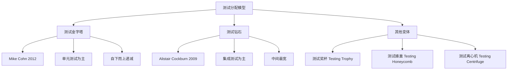
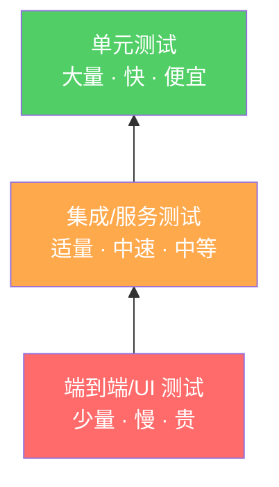
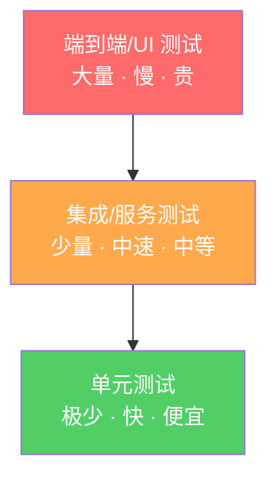
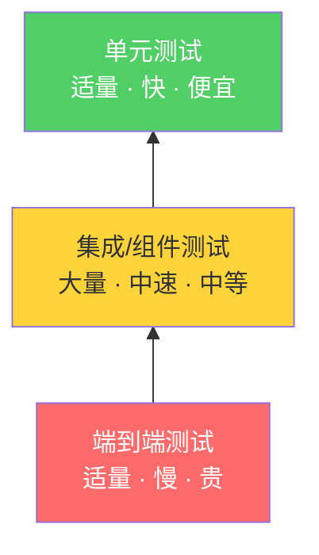
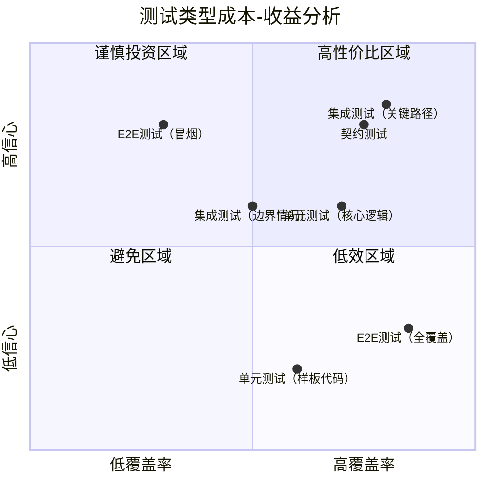
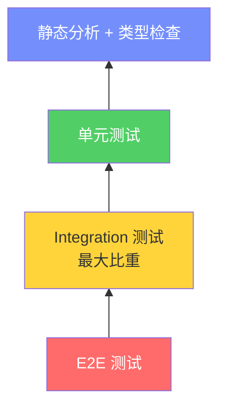
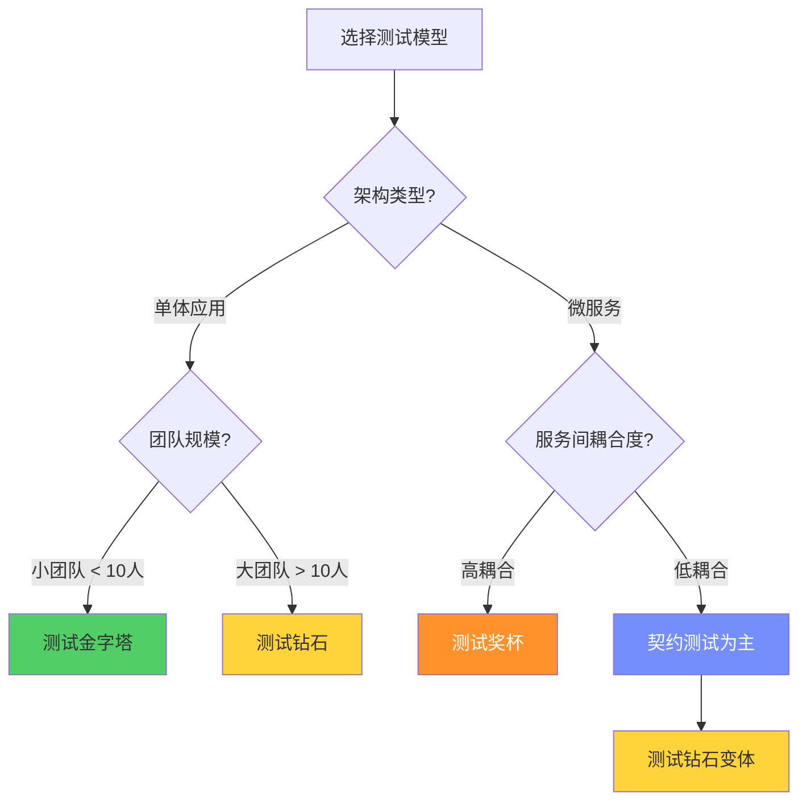
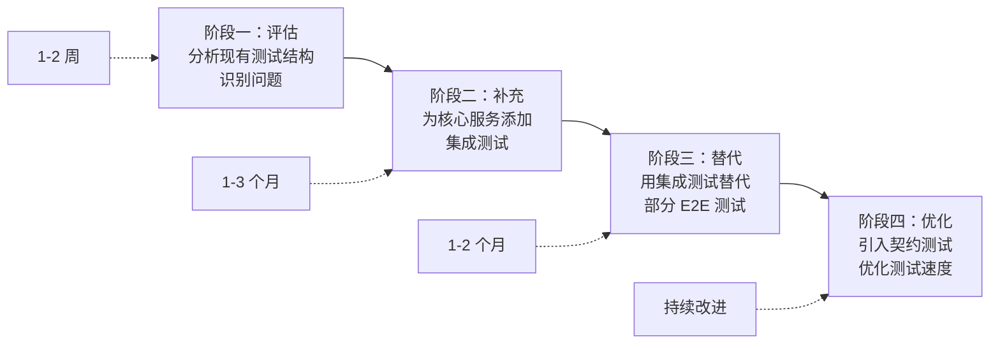
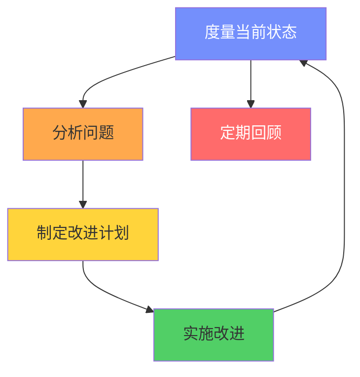

# 测试钻石 vs 测试金字塔

## 1. 概述与背景

### 1.1 为什么需要测试模型

软件测试并非简单地"写尽可能多的测试"。一个项目中可以写测试的地方有成百上千个——单元测试、集成测试、端到端测试、UI 测试、性能测试、安全测试……如果团队不加思考地分配测试精力，最常见的后果是：

- **写了大量单元测试，但上线后依然频繁出 bug**——因为 bug 多数发生在模块集成点
- **写了大量 UI 自动化测试，但测试套件又慢又脆**——每次提交等 40 分钟，还频繁误报
- **测试覆盖率很高，但业务信心很低**——数字好看但质量不达标
- **开发者抗拒写测试**——因为运行一次测试要等半天，开发节奏被打断

测试模型（Test Model）就是帮助团队回答这个核心问题的：**在有限的时间和预算下，测试精力应该怎样在不同层级之间分配？**

### 1.2 两大主流模型

目前业界最常讨论的两个测试分配模型是：

- **测试金字塔（Test Pyramid）**——由 Mike Cohn 在 2012 年著作《Succeeding with Agile》中提出，至今仍是大多数团队的默认心智模型
- **测试钻石（Test Diamond）**——由 Alistair Cockburn 在 2009 年首次描述，近年在微服务和云原生社区获得广泛关注

这两个模型代表了关于"bug 最常发生在哪里"以及"哪种测试最划算"的不同信念。理解它们的差异，是每个测试策略制定者的基本功。



---

## 2. 测试金字塔（Test Pyramid）

### 2.1 模型定义

测试金字塔是一个三角形模型，从底到顶分为三层：

| 层级 | 测试类型 | 数量建议 | 速度 | 成本 | 典型工具 |
|------|----------|----------|------|------|----------|
| 底层（最宽） | 单元测试 | 大量（数千个） | 极快（毫秒级） | 极低 | JUnit、Jest、pytest、Go testing |
| 中间层 | 集成/服务测试 | 适量（数百个） | 中等（秒级） | 中等 | Testcontainers、WireMock、Supertest |
| 顶层（最窄） | 端到端/UI 测试 | 少量（数十个） | 缓慢（分钟级） | 很高 | Cypress、Playwright、Selenium |



### 2.2 核心原则

**原则一：越底层的测试越多**

金字塔的核心直觉是：单元测试写得最多，集成测试次之，端到端测试最少。原因在于每上一层，测试的运行速度变慢、维护成本变高、失败时定位问题的难度也变大。

具体来说：
- 单个单元测试运行时间约 1-10 毫秒，1000 个单元测试约 10 秒即可跑完
- 单个集成测试运行时间约 0.5-5 秒（需要启动数据库/消息队列），200 个约 5-15 分钟
- 单个端到端测试运行时间约 10-60 秒（需要启动完整应用），30 个约 10-30 分钟

这意味着，如果你的端到端测试占了总量的 70%，CI/CD 管道的反馈时间将变得不可接受。

**原则二：依赖倒置的测试结构**

上层测试不替代下层测试。端到端测试无法覆盖所有边界条件（因为太慢太贵），需要底层的单元测试来补充细粒度的验证。每层测试各有分工：

- 单元测试：验证"每个零件是否正常工作"
- 集成测试：验证"零件之间的连接是否牢固"
- 端到端测试：验证"整台机器能否完成用户任务"

**原则三：如果一层测试过多，考虑下移**

Mike Cohn 特别强调"冰淇淋反模式（Ice Cream Anti-pattern）"——如果你发现自己写了大量端到端测试但几乎没有单元测试，这是一个需要纠正的信号。

**原则四：关注测试的速度与反馈循环**

金字塔不仅关乎数量分配，更关乎反馈速度。理想的测试策略应该是：开发者在写代码后的 30 秒内获得单元测试反馈，5 分钟内获得集成测试反馈，仅在合并到主分支时才运行完整的端到端测试。

### 2.3 具体的测试分配示例

以一个典型的电商订单服务为例：

单元测试（~2000 个）：
  - PriceCalculator.calculate_total() 的各种折扣组合
  - OrderValidator.validate() 的所有校验规则
  - InventoryChecker.check_stock() 的库存逻辑
  - 纯函数、数据转换、业务规则的逐一验证
  - 税率计算的各种边界条件（免税、跨州、国际）
  - 优惠券叠加规则的排列组合

集成测试（~200 个）：
  - OrderService + OrderRepository 的数据库读写
  - PaymentGateway + StripeAPI 的支付流程
  - InventoryService + RedisCache 的缓存一致性
  - 各服务间 API 调用的契约验证
  - 消息队列发布/订阅的端到端数据流

端到端测试（~30 个）：
  - 用户下单完整流程（浏览 → 加购 → 支付 → 确认）
  - 异常流程（支付失败 → 重试 → 退款）
  - 关键业务路径的回归保护

### 2.4 优势与局限

**优势：**

- **结构清晰**，易于理解和沟通——新人看到金字塔就知道测试策略
- **鼓励快速反馈**——单元测试跑得快，开发者可以频繁运行，保持编码心流
- **鼓励关注内部设计**——好的设计更容易写单元测试，形成正向循环
- **总体测试成本低**——大部分测试执行快、维护成本低
- **故障定位精确**——单元测试失败时，几乎能立刻定位到具体函数

**局限：**

- **假设大部分 bug 发生在单个模块内部**，这在现代分布式系统中不总是成立
- **单元测试可能测试的是实现细节而非行为**，导致重构困难——改了内部实现但功能不变，单元测试却挂了
- **对微服务架构来说，"集成"才是最高风险区域**，但模型分配给集成的测试预算较少
- **开发者可能过度追求覆盖率数字**，写了大量价值不高的 mock-heavy 单元测试
- **mock 过多导致"绿条综合症"**——单元测试全部通过，但真实运行时接口对不上、数据格式不匹配

### 2.5 经典反模式：冰淇淋反模式

与金字塔相对的反模式是"冰淇淋反模式"——测试倒金字塔：



这种反模式的特征：

- 大量 Selenium/Cypress UI 测试覆盖所有场景
- 很少或没有单元测试
- 测试套件运行需要 30 分钟以上
- 测试经常失败，团队开始忽略测试结果
- 修复一个 bug 的成本极高（因为没有快速反馈循环）
- 新功能上线前的"大冲刺"——花 2 天写 E2E 测试，上线后发现测试又挂了

**另一种反模式：测试沙漏（Test Hourglass）**

除了冰淇淋反模式，还有一种容易被忽视的问题——测试沙漏：单元测试很多，端到端测试也很多，但几乎没有集成测试。这种结构意味着单元测试各自通过、端到端测试偶尔通过，但模块间的交互完全没人验证。在单体应用中可能凑合运行，但在微服务架构下会频繁出现"测试通过但线上爆炸"的尴尬局面。

---

## 3. 测试钻石（Test Diamond）

### 3.1 模型定义

测试钻石由 Alistair Cockburn 提出，其核心观点是：**在现代分布式系统中，bug 最常发生在服务与服务之间的集成点，而不是单个服务内部。因此，集成测试应该占最大比重。**

| 层级 | 测试类型 | 数量建议 | 速度 | 成本 | 典型工具 |
|------|----------|----------|------|------|----------|
| 底层（窄） | 单元测试 | 适量 | 快 | 低 | JUnit、Jest、pytest |
| 中间层（最宽） | 集成/组件测试 | 大量 | 中等 | 中等 | Testcontainers、Pact、Docker Compose |
| 顶层（窄） | 端到端测试 | 适量 | 慢 | 高 | Cypress、Playwright |



与金字塔的关键区别：**中间层（集成测试）变成了最宽的那一层**，而非金字塔中的单元测试。

### 3.2 核心信念

测试钻石的理论基础建立在以下几个观察之上：

**信念一：集成点是 bug 的高发地带**

在微服务架构中，每个服务内部的逻辑通常是简单清晰的——一个服务做好一件事。但服务之间通过 API、消息队列、数据库共享等方式交互时，数据格式不匹配、超时处理不当、版本不兼容等问题频频出现。单元测试根本无法检测这些 bug。

根据 Google 的《软件工程实践》一书中的研究，约 24% 的生产 bug 与集成相关，而在微服务架构中这一比例更高，可达 40-60%。

**信念二：单元测试可能给你虚假的信心**

一个单元测试通过了，只能说明这段代码在被 mock 的依赖下工作正常。但真实环境中的依赖行为可能与 mock 完全不同。这种"green bar syndrome"（绿条综合症）会误导团队：

- Mock 返回的数据结构是正确的，但真实 API 返回的字段名不同
- Mock 假设依赖不会超时，但真实网络经常超时
- Mock 假设依赖返回 200，但真实服务在某些边界条件下返回 500

**信念三：集成测试更能反映真实用户路径**

集成测试（特别是组件测试和契约测试）使用真实的依赖（或接近真实的替身），验证的是服务在实际运行环境中的行为。当集成测试通过时，你对系统能正常工作的信心远高于单元测试通过时的信心。

**信念四：单元测试仍有必要，但不需要那么多**

单元测试的价值在于快速反馈和精确的错误定位，但不应该成为测试策略的主体。把单元测试控制在合理数量，专注于核心业务逻辑和复杂算法即可。

### 3.3 具体的测试分配示例

同样以电商订单服务为例：

单元测试（~300 个）：
  - 复杂的折扣计算算法
  - 价格公式和税率计算
  - 数据格式转换和验证
  - 只测试纯函数和核心业务规则
  - 不 mock 外部依赖的单元测试（只 mock 超出边界的 I/O）

集成/组件测试（~500 个）：
  - OrderService → PostgreSQL 的完整 CRUD
  - PaymentService → Stripe → OrderService 的支付回调
  - InventoryService → Redis → Database 的缓存一致性
  - 契约测试：OrderService 调用 UserService 的 API 契约
  - 使用 Testcontainers 启动真实数据库/消息队列
  - 消息队列发布/消费的集成验证
  - API 网关路由到正确服务的集成验证

端到端测试（~30 个）：
  - 完整业务流程的冒烟测试
  - 关键用户旅程的回归保护
  - 不追求覆盖率，追求业务信心

### 3.4 优势与局限

**优势：**

- **更贴近微服务/分布式系统的实际故障模式**——直接验证最容易出问题的地方
- **测试通过时的信心更高**——因为更接近真实环境，"测试通过"意味着"大概率线上也没问题"
- **对重构友好**——测试的是行为而非实现细节，重构内部实现不影响测试
- **能够检测出单元测试无法发现的集成 bug**——数据格式不匹配、API 版本不兼容、超时处理不当等
- **测试与真实运行环境一致**——数据库方言、网络延迟、并发竞争等问题都能被捕获

**局限：**

- **集成测试比单元测试慢**——需要启动数据库、消息队列等外部依赖
- **测试环境搭建更复杂**——需要 Testcontainers、Docker Compose 等基础设施
- **单个测试失败时定位问题更困难**——涉及多个组件，需要链路追踪能力
- **对团队的基础设施能力有要求**——Docker、容器编排、CI/CD 管道都需要熟练
- **测试数据管理更复杂**——需要准备和清理真实的测试数据

---

## 4. 深度对比分析

### 4.1 哲学差异

| 维度 | 测试金字塔 | 测试钻石 |
|------|-----------|----------|
| 核心信念 | bug 在模块内部 | bug 在模块之间 |
| 最有价值测试 | 单元测试 | 集成测试 |
| 开发者角色 | 设计驱动测试（TDD） | 行为驱动测试 |
| 重构态度 | 通过测试保证内部质量 | 通过测试保证外部行为 |
| 适用架构 | 单体应用 | 微服务/分布式系统 |
| 反馈速度 | 极快（全速运行） | 中等（需要基础设施） |
| 维护成本 | 低（测试稳定） | 中等（外部依赖可能变化） |
| Mock 策略 | 大量 mock，隔离被测单元 | 尽量少 mock，使用真实依赖 |
| 信心来源 | "代码逻辑正确" | "系统行为正确" |
| 团队要求 | 低（测试容易编写） | 中高（需要容器化技能） |

### 4.2 成本-收益矩阵



从矩阵中可以清晰看到：**集成测试（关键路径）和契约测试**落在高性价比区域——它们以中等成本提供了最高的业务信心。而 E2E 测试的全覆盖则落在低效区域：高成本但信心提升有限。

### 4.3 缺陷发现效率对比

来自行业研究和实践经验的数据：

| 测试类型 | 缺陷发现能力 | 单个缺陷成本 | 反馈速度 | 自动化难度 | 维护成本 |
|----------|-------------|-------------|----------|-----------|----------|
| 单元测试 | 发现逻辑错误、边界条件 | $1（越早越便宜） | 毫秒级 | 简单 | 低 |
| 集成测试 | 发现接口不匹配、数据流问题 | $5-15 | 秒-分钟 | 中等 | 中等 |
| 契约测试 | 发现服务间契约违规 | $5-10 | 秒级 | 中等 | 中等 |
| 端到端测试 | 发现业务流程断裂 | $50-100 | 分钟级 | 复杂 | 高 |
| 手工测试 | 发现体验和业务问题 | $100+ | 小时-天 | N/A | 极高 |

一个重要的经验法则是：**如果单元测试只能发现 40% 的缺陷，集成测试能发现 30%，那么剩余的 30% 需要更上层的测试来覆盖。** 测试金字塔倾向于用大量单元测试来覆盖那 40%，而测试钻石认为应该把精力集中在能发现更多集成缺陷的层级上。

### 4.4 两种模型的典型时间线对比

一个典型的微服务项目从开发到上线的测试时间线对比：

**测试金字塔的时间线：**
代码提交 → 单元测试(5s) → 单元测试(5s) → ... → 集成测试(3min) → E2E测试(15min)
总反馈时间: ~20分钟
缺陷发现: 单元测试发现40%问题，集成测试发现25%，E2E发现15%，生产环境发现20%

**测试钻石的时间线：**
代码提交 → 单元测试(3s) → 单元测试(3s) → ... → 集成测试(5min) → E2E测试(10min)
总反馈时间: ~15分钟
缺陷发现: 单元测试发现25%问题，集成测试发现45%，E2E发现15%，生产环境发现15%

关键区别：钻石模型在集成测试阶段发现了更多问题，减少了缺陷逃逸到生产环境的比例。

---

## 5. 其他测试分配模型

除了金字塔和钻石，业界还发展出了其他变体，各有侧重：

### 5.1 测试奖杯（Testing Trophy）

由 Kent C. Dodds 提出，是测试钻石的一个变体，专门为 JavaScript/TypeScript 生态设计：



与钻石的区别：增加了"静态分析"层（TypeScript 类型检查、ESLint 等），强调类型系统本身就能捕获大量 bug。在 TypeScript 项目中，类型检查可以消除约 15-20% 的潜在 bug，这部分测试预算可以"免费"获得。

测试奖杯的具体分配建议：
- 静态分析 + 类型检查：覆盖约 30% 的潜在 bug（免费获得）
- 单元测试：约 200 个，只测纯函数和核心逻辑
- 集成测试：约 400 个，使用真实 DOM、真实 API 调用
- 端到端测试：约 50 个，覆盖关键用户旅程

Kent C. Dodds 特别强调：在 JavaScript 生态中，"集成测试"通常指使用真实浏览器或真实 HTTP 调用的测试，而非使用内存数据库的"假集成测试"。

### 5.2 测试蜂巢（Testing Honeycomb）

由 Spotify 工程团队推广，核心思想类似钻石，但更强调**契约测试（Contract Testing）**作为集成测试的主要形式。蜂巢模型的形状是六边形，意味着各个测试层级之间的边界不像金字塔或钻石那样分明，而是相互渗透的。

蜂巢模型的独特之处在于：
- **契约测试是核心**——消费者和提供者各自验证对彼此接口的预期
- **组件测试使用真实的外部依赖**——通过 Docker Compose 启动完整的服务依赖树
- **端到端测试只做冒烟验证**——确认关键路径能跑通即可
- **单元测试专注于纯逻辑**——不 mock 业务逻辑，只 mock I/O 边界

Spotify 的实践表明，在大型组织中，契约测试可以显著减少跨团队的集成问题。当一个团队修改了 API 接口时，契约测试能在 CI 阶段就发现对下游消费者的影响，而非等到集成环境或生产环境才暴露。

蜂巢模型在以下场景特别有效：
- 大型组织中有多个团队维护不同的服务
- 服务之间的接口契约频繁变更
- 需要快速验证 API 兼容性

### 5.3 测试离心机（Testing Centrifuge）

由 James O Coplien 提出，强调测试应该从"用户价值"向外辐射，而不是从代码向内构建。最外层是验收测试，核心是单元测试，但推动力来自业务需求。

离心机模型的独特视角：
- **测试的驱动力是业务需求**，而非代码结构
- **验收测试（Acceptance Test）**放在最外层，由业务分析师和产品经理参与编写
- **单元测试**在核心，但它们的存在是被业务需求"拉"出来的，而非开发者自发写的
- **中间层的集成测试**验证业务流程的正确性

这个模型特别适合行为驱动开发（BDD）团队，强调测试的业务含义而非技术实现。

### 5.4 模型选择决策树



**更细化的决策指南：**

| 项目特征 | 推荐模型 | 核心测试工具 | 预期覆盖率 |
|----------|----------|-------------|-----------|
| 单体 + TDD | 金字塔 | JUnit + Mockito | 单元 70%, 集成 20%, E2E 10% |
| 微服务 + DevOps | 钻石 | Testcontainers + Pact | 单元 25%, 集成 55%, E2E 20% |
| 前端 SPA | 奖杯 | Testing Library + Cypress | 类型 30%, 单元 15%, 集成 40%, E2E 15% |
| 大型组织多团队 | 蜂巢 | Pact + Docker Compose | 契约 40%, 组件 35%, E2E 25% |
| BDD 驱动 | 离心机 | Cucumber + JUnit | 验收 30%, 集成 40%, 单元 30% |

---

## 6. 微服务架构下的最佳实践

### 6.1 为什么微服务倾向于测试钻石

在微服务架构中，一个用户请求通常需要多个服务协作完成。典型的调用链：

用户请求 → API Gateway → OrderService → PaymentService → InventoryService
                                ↓                ↓                ↓
                            PostgreSQL         Redis           MySQL
                                ↓                ↓
                            OrderQueue       PaymentLog

在这个架构中：

1. **单个服务内部的逻辑通常不复杂**——一个服务做好一件事，内部逻辑简单清晰
2. **服务间的交互才是 bug 的高发地带**——数据格式不一致、超时处理不当、幂等性问题、分布式事务
3. **单元测试无法发现这些问题**——因为单元测试 mock 掉了所有外部依赖
4. **端到端测试虽然能发现问题，但太慢太脆**——启动整个系统需要几分钟，且任一服务的变更都可能导致 E2E 测试失败

因此，**集成测试（包括契约测试、组件测试）** 成了微服务测试的中流砥柱。

### 6.2 服务测试分层策略

微服务场景下的推荐测试分层：

| 测试层级 | 占比 | 工具推荐 | 运行频率 | 反馈时间 |
|----------|------|----------|----------|----------|
| 单元测试 | 20-30% | JUnit, Jest, pytest | 每次提交 | < 1 分钟 |
| 集成测试 | 50-60% | Testcontainers, WireMock | 每次提交 | 3-10 分钟 |
| 契约测试 | 10-15% | Pact, Spring Cloud Contract | 每次 PR | 2-5 分钟 |
| 端到端测试 | 5-10% | Cypress, Playwright | 每次合并到主分支 | 10-20 分钟 |

### 6.3 契约测试的关键角色

契约测试是测试钻石在微服务中的核心实践。它解决了微服务之间接口兼容性的问题。

**契约测试的工作原理：**

1. **消费者驱动**：消费者（调用方）定义它对提供者（被调用方）接口的预期，生成契约文件
2. **提供者验证**：提供者运行自己的测试，验证是否满足所有消费者的契约
3. **CI 集成**：契约文件版本化管理，每次提交自动验证

OrderService 调用 UserService 的契约（Pact 格式）:

{
  "consumer": "OrderService",
  "provider": "UserService",
  "interactions": [
    {
      "description": "获取用户信息",
      "request": {
        "method": "GET",
        "path": "/api/users/123",
        "headers": { "Accept": "application/json" }
      },
      "response": {
        "status": 200,
        "headers": { "Content-Type": "application/json" },
        "body": {
          "id": "123",
          "name": "张三",
          "email": "zhangsan@example.com",
          "tier": "premium"    // <-- 这个字段被 UserService 删除了
        }
      }
    }
  ]
}

当 UserService 修改了响应格式（删除了 `tier` 字段），契约测试会立即失败，而不是等到 E2E 测试或生产环境才发现。这就是契约测试的价值——**在开发阶段就发现接口不兼容问题**。

**Pact 契约测试的完整工作流：**

1. 消费者编写测试（验证调用提供者的接口时的行为）
2. 运行消费者测试 → 自动生成 pact.json 契约文件
3. 将 pact.json 发布到 Pact Broker（契约管理中心）
4. 提供者从 Pact Broker 拉取所有消费者的契约
5. 提供者运行验证测试（确保自己的实现满足契约）
6. CI 管道中，任一环节失败都会阻止合并

### 6.4 Testcontainers：让集成测试更可靠

Testcontainers 是实现测试钻石的关键基础设施。它允许在测试中启动真实的 Docker 容器：

```java
// Java/JUnit 5 示例
@Testcontainers
class OrderRepositoryIntegrationTest {

    @Container
    static PostgreSQLContainer<?> postgres = new PostgreSQLContainer<>("postgres:15")
            .withDatabaseName("order_test")
            .withInitScript("schema.sql");

    @Container
    static GenericContainer<?> redis = new GenericContainer<>("redis:7")
            .withExposedPorts(6379);

    @Test
    void shouldSaveAndRetrieveOrder() {
        // 使用真实的 PostgreSQL 数据库，而非内存数据库
        OrderRepository repo = new OrderRepository(postgres.getJdbcUrl());
        Order order = new Order("ORD-001", BigDecimal.valueOf(99.99));
        repo.save(order);
        
        Order retrieved = repo.findById("ORD-001");
        assertThat(retrieved).isNotNull();
        assertThat(retrieved.total()).isEqualByComparingTo(BigDecimal.valueOf(99.99));
    }

    @Test
    void shouldCacheOrderInRedis() {
        // 验证 Redis 缓存与数据库的一致性
        OrderService service = new OrderService(
            new OrderRepository(postgres.getJdbcUrl()),
            new RedisCache(redis.getHost(), redis.getFirstMappedPort())
        );
        // ... 测试缓存逻辑
    }
}
```

```python
# Python/pytest 示例
import pytest
from testcontainers.postgres import PostgresContainer
from testcontainers.redis import RedisContainer

@pytest.fixture(scope="module")
def postgres():
    with PostgresContainer("postgres:15") as pg:
        yield pg

@pytest.fixture(scope="module")
def redis():
    with RedisContainer("redis:7") as r:
        yield r

def test_order_repository(postgres):
    """使用真实 PostgreSQL 测试订单仓储层"""
    engine = create_engine(postgres.get_connection_url())
    repo = OrderRepository(engine)
    
    order = Order(id="ORD-001", total=Decimal("99.99"))
    repo.save(order)
    
    retrieved = repo.find_by_id("ORD-001")
    assert retrieved is not None
    assert retrieved.total == Decimal("99.99")

def test_order_cache_consistency(postgres, redis):
    """验证 Redis 缓存与 PostgreSQL 的一致性"""
    cache = RedisCache(redis.get_connection_url())
    repo = OrderRepository(postgres.get_connection_url())
    service = OrderService(repo, cache)
    
    # 写入订单，验证缓存被更新
    service.create_order(Order(id="ORD-002", total=Decimal("199.99")))
    cached = cache.get("order:ORD-002")
    assert cached is not None
    
    # 从缓存获取，验证数据一致
    order = service.get_order("ORD-002")
    assert order.total == Decimal("199.99")
```

**Testcontainers 的关键优势：**

- **测试环境与生产环境一致**——使用真实的数据库版本、配置，而非简化版内存数据库
- **自动清理**——容器在测试结束后自动销毁，不会污染环境
- **并行测试支持**——每个测试类可以启动独立的容器实例，避免测试间干扰
- **版本锁定**——容器镜像版本固定，确保测试结果可重现

---

## 7. 从金字塔到钻石的迁移策略

### 7.1 诊断当前状态

在决定是否迁移之前，先评估你当前的测试结构：

```python
def diagnose_test_structure(test_results):
    """分析当前测试结构是否合理"""
    unit_count = sum(1 for t in test_results if t['type'] == 'unit')
    integration_count = sum(1 for t in test_results if t['type'] == 'integration')
    e2e_count = sum(1 for t in test_results if t['type'] == 'e2e')
    total = unit_count + integration_count + e2e_count

    ratios = {
        'unit': unit_count / total,
        'integration': integration_count / total,
        'e2e': e2e_count / total
    }

    # 诊断结果
    if ratios['e2e'] > 0.3:
        return "冰淇淋反模式：E2E 测试过多，需要下移"
    elif ratios['unit'] > 0.7 and ratios['integration'] < 0.15:
        return "经典金字塔：如果微服务架构，考虑增加集成测试"
    elif ratios['integration'] > ratios['unit']:
        return "已经接近钻石模式：保持并优化集成测试质量"
    else:
        return "混合结构：需要明确方向"

    # 额外指标
    avg_unit_speed = test_stats['unit_avg_ms']
    avg_e2e_speed = test_stats['e2e_avg_ms']
    if avg_e2e_speed > 60000:  # > 60秒
        return "E2E 测试太慢，严重影响开发效率"
```

**更完整的诊断维度：**

除了测试数量比例，还应该评估以下维度：

| 诊断维度 | 健康指标 | 警告信号 | 改进方向 |
|----------|----------|----------|----------|
| 测试数量比例 | 单元:集成:E2E ≈ 7:2:1 或 3:5:2 | E2E > 30% | 减少 E2E，增加集成 |
| 测试运行时间 | 全量 < 10 分钟 | 全量 > 30 分钟 | 优化并行化 |
| 缺陷逃逸率 | < 5% | > 15% | 增加高风险区域测试 |
| 测试维护成本 | < 10% 开发时间 | > 25% 开发时间 | 减少脆弱测试 |
| 测试信心指数 | > 80% | < 50% | 重新评估测试策略 |

### 7.2 渐进式迁移路线

不要试图一步到位。推荐的迁移路径：



**阶段一（1-2 周）：评估现状**

- 统计各层级测试数量和比例
- 测量各层级测试的运行时间
- 分析过去 6 个月的生产 bug，按类型分类（逻辑错误 vs 集成错误 vs 环境问题）
- 确定 bug 是更多来自模块内部还是模块之间
- 识别当前最大的测试痛点（慢？脆？覆盖不足？）

**阶段二（1-3 个月）：补充集成测试**

- 为关键业务路径添加集成测试
- 引入 Testcontainers 等基础设施
- 培训团队使用集成测试框架
- 保持现有单元测试不动（不要删除！）
- 从最核心的 3-5 个服务开始，建立集成测试模板

**阶段三（1-2 个月）：用集成测试替代部分 E2E 测试**

- 分析哪些 E2E 测试可以拆分为更精确的集成测试
- 保留关键路径的 E2E 测试，移除冗余的
- 引入契约测试替代部分 E2E 的服务间验证
- 建立测试分层的 CI 管道（单元测试 → 集成测试 → E2E 测试分阶段运行）

**阶段四（持续优化）：完善体系**

- 优化集成测试运行速度（并行化、缓存容器、测试数据快照）
- 引入测试数据分析，量化测试投资回报
- 建立测试质量度量体系
- 定期回顾测试策略，根据架构变化调整

### 7.3 常见迁移陷阱

**陷阱一：一刀切删除单元测试**

迁移不等于抛弃单元测试。单元测试在以下场景仍然不可替代：
- 复杂算法和业务规则的精确验证
- 快速反馈循环（CI/CD 中的快速失败）
- 边界条件和异常路径的覆盖
- 纯函数的逻辑正确性

**陷阱二：集成测试用内存数据库**

用 H2 内存数据库替代 PostgreSQL 跑"集成测试"，看似快了，但可能遗漏数据库方言差异导致的 bug。例如：
- PostgreSQL 的 `ON CONFLICT DO UPDATE` 在 H2 中语法不同
- JSONB 类型在 H2 中不支持
- 存储过程的行为可能不一致

推荐用 Testcontainers 启动真实的数据库。

**陷阱三：忽略测试速度**

即使转向钻石模式，如果集成测试慢到需要 20 分钟，开发者就不会频繁运行它们。需要：
- 本地开发时运行受影响的测试子集（`affected module detection`）
- CI 中合理分组和并行化
- 缓存测试容器（Testcontainers Ryuk 或 Docker layer caching）
- 使用 `testcontainers ryuk` 自动清理遗留容器

**陷阱四：过度追求"真实环境"**

集成测试使用真实依赖是好的，但不要走极端。例如：
- 不需要在集成测试中启动真实的支付网关（用 WireMock 模拟）
- 不需要在集成测试中启动真实的邮件服务器（用 MailHog 或 GreenMail）
- 不需要在集成测试中启动真实的第三方 API（用契约测试验证接口约定）

**陷阱五：忽视测试数据管理**

集成测试需要真实的测试数据，但数据管理往往被忽视。常见问题：
- 测试间数据污染——测试 A 的数据影响测试 B 的结果
- 数据准备成本高——每个测试都需要手动构造数据
- 数据清理不彻底——容器销毁后残留数据影响下次测试

建议：使用 Flyway/Liquibase 管理测试数据库 schema，使用 Factory 模式生成测试数据，每个测试使用独立的数据库 schema。

---

## 8. 实战决策框架

### 8.1 场景决策矩阵

| 场景特征 | 推荐模型 | 理由 | 预期效果 |
|----------|----------|------|----------|
| 单体应用、小团队 | 测试金字塔 | 简单直接，维护成本低 | 快速反馈，低维护负担 |
| 微服务、DevOps 成熟 | 测试钻石 | 集成是主要风险点 | 减少生产环境集成 bug |
| 前端应用（SPA） | 测试奖杯 | 组件测试价值最高 | 类型安全 + 快速 UI 反馈 |
| 金融/支付系统 | 偏金字塔 + 严格单元测试 | 精确计算不可出错 | 算法正确性 100% 保证 |
| 创业公司、快速迭代 | 轻量钻石 | 不追求覆盖率，追求信心 | 快速验证核心业务流程 |
| 已有大量 E2E 测试 | 先修反模式，再定方向 | 治标先于治本 | 降低测试维护成本 |
| 大型组织多团队 | 蜂巢（契约测试） | 跨团队接口兼容性 | 减少跨团队集成问题 |
| BDD 驱动项目 | 离心机 | 业务需求驱动测试 | 测试与业务目标对齐 |

### 8.2 团队能力评估

选择模型前，评估团队的基础设施能力：

| 能力维度 | 金字塔友好度 | 钻石友好度 | 培养周期 |
|----------|-------------|-----------|----------|
| Docker/K8s 熟练度 | 低要求 | 高要求 | 2-4 周 |
| CI/CD 管道复杂度 | 低 | 高 | 1-2 个月 |
| 测试数据管理 | 简单 | 需要专门方案 | 1-2 个月 |
| 并行化能力 | 单机即可 | 需要分布式执行 | 1-3 个月 |
| 调试能力 | 单元级定位 | 需要链路追踪 | 2-4 周 |

如果你的团队还不熟悉 Docker，贸然转向测试钻石可能导致"测试基础设施比业务代码还复杂"的尴尬局面。**务实的做法是先补齐基础设施能力，再逐步增加集成测试比重。**

### 8.3 一个实际的决策流程

Step 1: 你的架构是单体还是微服务？
  → 单体：从金字塔开始
  → 微服务：继续 Step 2

Step 2: 团队是否熟练使用 Docker/Testcontainers？
  → 是：钻石模式是好选择
  → 否：先用金字塔，同时培训基础设施能力

Step 3: 过去 6 个月的生产 bug 主要来自哪里？
  → 模块内部逻辑：保持金字塔
  → 模块间集成：转向钻石
  → 两者都有：混合模式（金字塔偏钻石）

Step 4: 测试运行时间是否超过 10 分钟？
  → 是：优化现有模型的速度，而非换模型
  → 否：模型切换的阻力较小

### 8.4 混合模式：务实的选择

实际上，很多成功的团队并不严格遵循某一个模型，而是采用混合策略：

混合模式示例（某中型 SaaS 公司）：
  - 核心支付模块：严格金字塔（单元测试 80%，精确计算不容出错）
  - 业务服务层：钻石模式（集成测试 60%，验证服务间交互）
  - 前端应用：奖杯模式（集成测试 50%，组件测试为主）
  - 基础设施层：契约测试为主（验证服务间接口兼容性）

这种混合策略的关键是：**每个模块根据其特性和风险选择最适合的测试策略**，而非一刀切地统一所有模块的测试比例。

---

## 9. 现代测试趋势

### 9.1 测试左移（Shift-Left Testing）

测试左移是将测试活动从开发后期移到开发早期的趋势。这与测试钻石的理念高度契合：

- **静态分析**：在编写代码时就通过 IDE 插件发现潜在问题
- **类型系统**：TypeScript、Rust 等强类型语言在编译期就捕获大量 bug
- **TDD/BDD**：在写代码之前就定义测试，确保代码满足需求
- **代码审查**：人工审查本身就是一种"测试"

### 9.2 测试右移（Shift-Right Testing）

测试右移是将测试延伸到生产环境的趋势：

- **金丝雀发布**：小比例流量导入新版本，监控错误率
- **特性开关**：通过开关控制新功能的可见性，降低发布风险
- **混沌工程**：主动注入故障，验证系统的容错能力
- **生产环境监控**：APM、日志分析、异常告警——生产环境本身就是"测试环境"

### 9.3 可观测性与测试的关系

现代系统的可观测性（Observability）正在改变测试的定义：

- **分布式追踪**（Jaeger、Zipkin）可以发现测试环境无法复现的集成问题
- **结构化日志**可以快速定位测试失败的根因
- **指标监控**可以量化测试策略的效果（缺陷逃逸率、MTTR 等）

### 9.4 AI 辅助测试

AI 正在改变测试的方式：

- **AI 生成测试用例**：基于代码变更自动生成相关的测试场景
- **智能测试选择**：根据代码变更影响范围，只运行受影响的测试
- **缺陷预测**：基于历史数据预测哪些模块最可能出 bug
- **视觉回归测试**：AI 比较 UI 截图差异，比像素级比较更智能

---

## 10. 常见误区与纠正

### 误区一："测试钻石不需要单元测试"

**错误理解**：钻石模式意味着完全抛弃单元测试。

**实际情况**：钻石模式仍然需要单元测试，只是数量不需要那么多。核心算法、复杂的业务规则、纯函数的逻辑——这些仍然适合单元测试。钻石只是说"不要把大部分测试预算花在单元测试上"。

### 误区二："测试金字塔在微服务时代已经过时"

**错误理解**：金字塔是 2012 年的模型，已经不适用于现代架构。

**实际情况**：金字塔的"分层"思想依然有效，只是比例需要调整。对于非微服务架构（单体、模块化单体），金字塔仍然是最实用的模型。模型是工具，不是教条。

### 误区三："集成测试 = 端到端测试"

**错误理解**：钻石模式的"大量集成测试"意味着写大量 E2E 测试。

**实际情况**：钻石中的集成测试主要指**组件测试（Component Test）**——验证单个服务与其直接依赖的交互，而非整个系统。例如：`OrderService + PostgreSQL`，而不是"从浏览器点击到数据库"。

### 误区四："覆盖率越高越好"

**错误理解**：追求 100% 覆盖率。

**实际情况**：覆盖率是工具而非目标。80% 覆盖率的项目可能比 95% 覆盖率的项目质量更高——因为前者的测试设计更合理、覆盖了更高风险的区域。关键不是数字，而是"测试是否覆盖了最重要的路径"。

### 误区五："模型选了就不能变"

**错误理解**：团队必须坚定地选择一个模型并永久执行。

**实际情况**：测试策略应该随架构演进而调整。微服务化的早期可能用钻石，等到系统稳定、接口变更频率降低后，可以适当增加端到端测试来保证整体一致性。

### 误区六："mock 越多越好"

**错误理解**：单元测试应该 mock 所有外部依赖，以实现完全隔离。

**实际情况**：过度 mock 会导致测试与真实行为脱节。一个被 mock 了 10 个依赖的"单元测试"，可能什么问题都发现不了。正确的做法是：只 mock 超出被测边界的 I/O（网络、文件系统、时钟），保留业务逻辑的真实行为。

---

## 11. 度量与持续改进

### 11.1 关键度量指标

无论选择哪种模型，都应该跟踪以下指标：

| 指标 | 计算方式 | 目标值 | 含义 | 数据来源 |
|------|----------|--------|------|----------|
| 测试运行时间 | CI 管道中测试总耗时 | < 10 分钟 | 开发效率 | CI/CD 平台 |
| 缺陷逃逸率 | 生产 bug 数 / (测试 bug + 生产 bug) | < 5% | 测试有效性 | Bug 追踪系统 |
| 测试维护成本 | 修复失败测试所需时间 / 开发总时间 | < 10% | 测试稳定性 | 工时统计 |
| MTTR（平均修复时间） | 从 bug 发现到修复的时间 | < 1 小时 | 问题定位效率 | Bug 追踪系统 |
| 测试信心指数 | 团队对"测试通过即可发布"的信心 | > 80% | 实际价值 | 团队调研 |
| Flaky Test 比例 | 不稳定测试数 / 总测试数 | < 2% | 测试可靠性 | CI/CD 平台 |

### 11.2 持续优化循环



每季度进行一次测试策略回顾：

1. 分析过去一个季度的生产 bug，分类统计（逻辑错误 vs 集成错误 vs 环境问题）
2. 评估各层级测试的投入产出比
3. 根据架构变化和业务需求调整测试策略
4. 回顾团队的测试技能短板，安排培训
5. 评估新工具和技术的适用性

### 11.3 测试策略文档化

将测试策略文档化，确保团队成员理解并遵循：

```markdown
## 我们的测试策略

### 测试分层
- 单元测试：覆盖核心业务逻辑，目标覆盖率 70%
- 集成测试：覆盖服务间交互，使用 Testcontainers
- 契约测试：覆盖跨团队 API，使用 Pact
- 端到端测试：覆盖关键用户旅程，最多 50 个

### 运行规则
- 提交前：必须通过单元测试和集成测试
- PR 审查：必须通过契约测试
- 合并到主分支：必须通过端到端测试

### 质量标准
- 测试运行时间 < 10 分钟
- Flaky Test 比例 < 2%
- 缺陷逃逸率 < 5%
```

---

## 12. 本节要点回顾

| 要点 | 内容 |
|------|------|
| 测试金字塔 | 单元测试最多，端到端测试最少，适用于单体应用和小团队 |
| 测试钻石 | 集成测试最多，单元和端到端测试适中，适用于微服务架构 |
| 核心分歧 | 对"bug 最常发生在哪里"的不同假设 |
| 不是二选一 | 可以根据项目特点混合使用 |
| 契约测试 | 微服务间接口兼容性的关键实践 |
| Testcontainers | 实现可靠集成测试的关键基础设施 |
| 迁移路径 | 评估 → 补充 → 替代 → 优化，渐进式推进 |
| 度量驱动 | 用数据而非直觉来指导测试策略调整 |
| 现代趋势 | 测试左移 + 测试右移 + AI 辅助，测试正在重新定义 |
| 务实选择 | 没有"最好"的模型，只有"最适合"的模型 |

测试模型不是宗教信仰，而是帮助团队做出合理决策的思维工具。最重要的不是"你选了金字塔还是钻石"，而是"你的测试策略是否与你的架构、团队和业务目标相匹配"。在实践中，最有效的策略往往是混合使用多种模型，根据每个模块的特性和风险选择最适合的测试方式。
