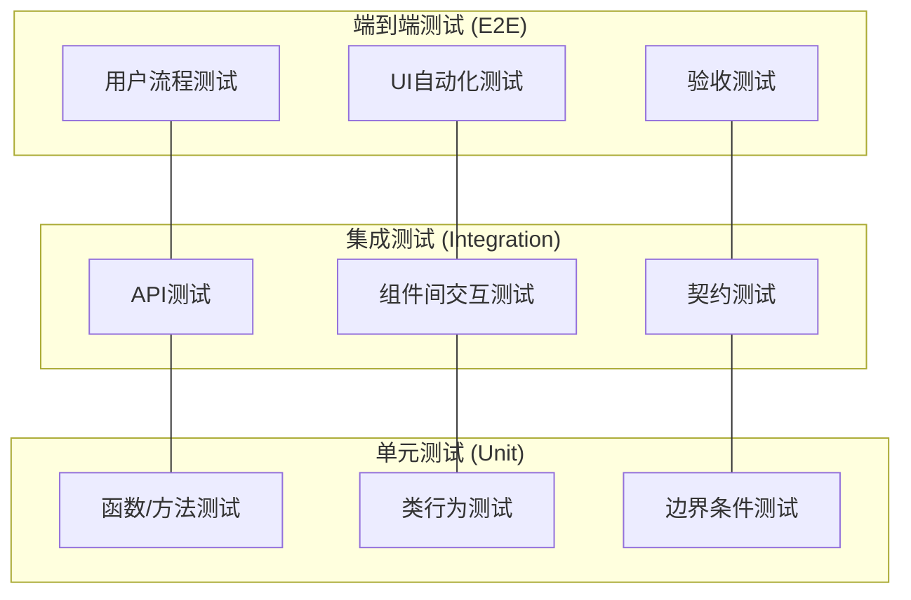
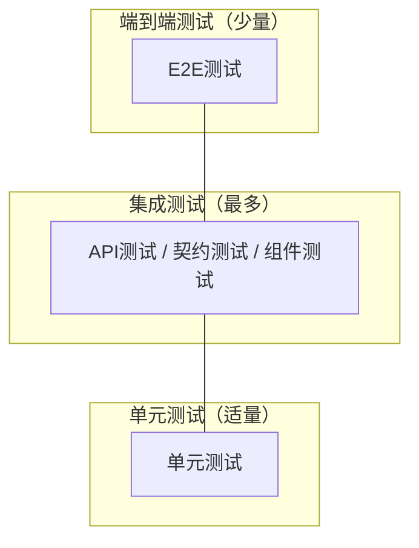
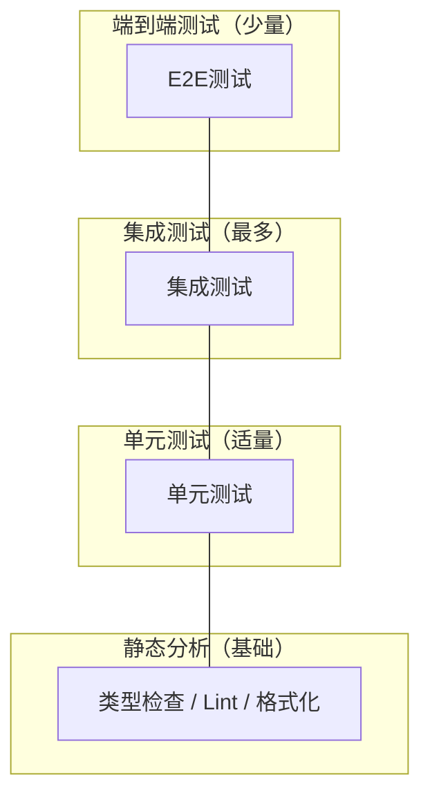
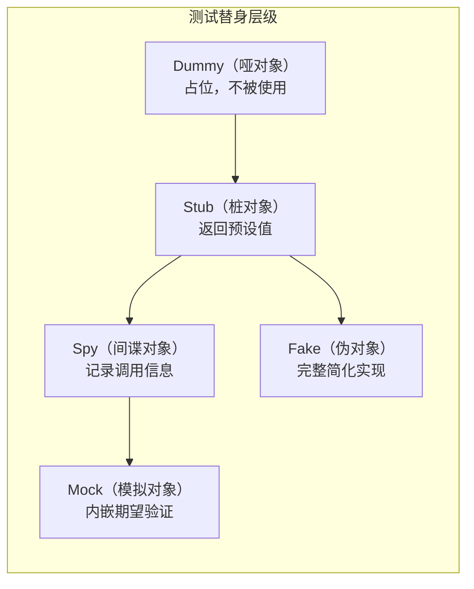
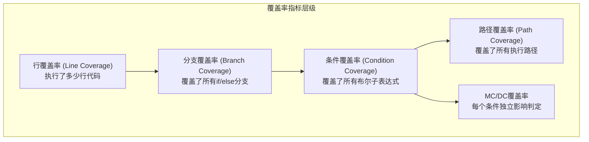
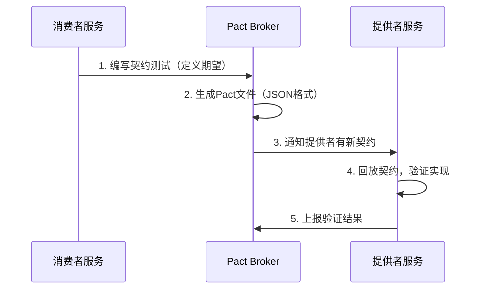
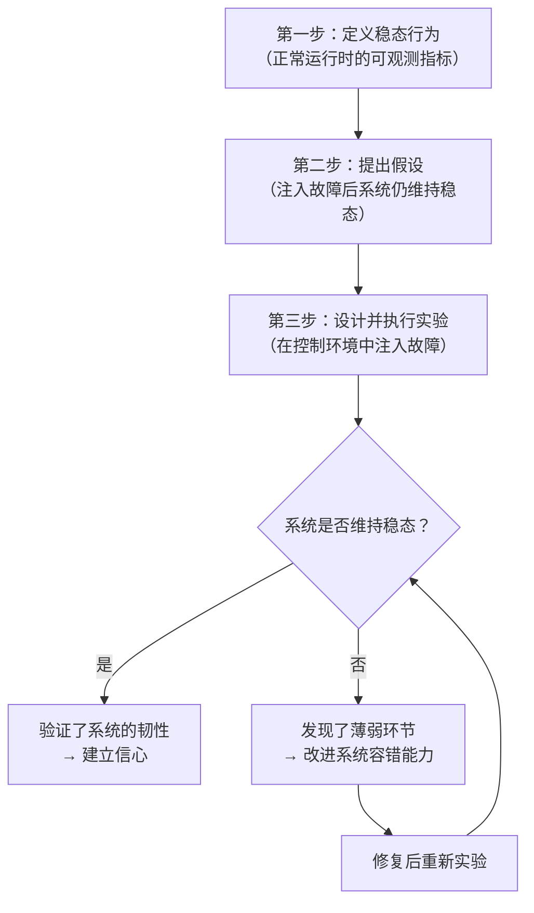
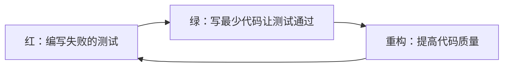

# 软件测试理论基础

软件测试的理论基础是构建一切测试实践的根基。理解测试的本质、分类体系、度量方法和核心原则，才能在实际工程中做出正确的测试决策。本节将从测试的本质定义出发，系统讲解测试层次模型、测试替身分类、覆盖率理论、变异测试、契约测试、性能测试、混沌工程，以及TDD/BDD等方法论的理论基础。

---

## 一、软件测试的本质与原则

### 1.1 测试的本质定义

软件测试（Software Testing）是通过执行程序或系统来评估其是否满足预期需求的过程。IEEE 829标准将测试定义为："在规定的条件下对系统或组件进行操作，以发现错误，评估其是否满足设计要求的过程。"

Glenford Myers在《The Art of Software Testing》中提出了一个更精练的定义："测试是发现错误的意图。"这个定义强调了测试的主动性——测试不是被动地等待Bug出现，而是主动地寻找缺陷。然而，随着现代软件工程的发展，测试的含义已经超越了"找Bug"——它同时承担着质量验证（Verification）、质量确认（Validation）和质量度量（Measurement）三重职能。

- **验证（Verification）**：确认产品是否正确地构建了——即是否符合设计规格。"Are we building the product right?"
- **确认（Validation）**：确认是否构建了正确的产品——即是否满足用户真实需求。"Are we building the right product?"
- **度量（Measurement）**：量化软件的质量属性，为发布决策提供数据支撑。

### 1.2 软件测试七大原则

Dorothy Graham和Erik van Venderen在《Foundations of Software Testing》中总结了软件测试的基本原则，这些原则经过数十年的工程实践验证，至今仍然是指导测试工作的核心准则。

**原则一：测试只能证明缺陷存在，不能证明缺陷不存在。** 即使所有测试用例都通过了，也不能断言软件没有Bug。这是因为穷举测试（Exhaustive Testing）在绝大多数情况下是不可能的——一个简单的10位二进制数输入就有2^10=1024种可能的输入值。这个原则提醒我们：测试的目标是降低风险，而非消除风险。

**原则二：穷举测试是不可能的。** 对于任何非平凡的程序，所有可能的输入、状态和执行路径的组合都是天文数字。以一个接受10个参数、每个参数有5种取值的函数为例，仅输入组合就有5^10≈9,765,625种。测试必须基于风险和优先级进行策略性选择。

**原则三：尽早测试。** 缺陷发现得越晚，修复成本越高。IBM的系统科学研究所（Systems Sciences Institute）的研究表明：需求阶段发现的Bug修复成本是编码阶段的1/6到1/10。测试左移（Shift Left）的核心思想就是在开发的最早期就引入测试活动。

**原则四：缺陷集群效应。** 大约80%的缺陷集中在20%的模块中。这与帕累托法则（80/20法则）一致。识别这些高缺陷密度的模块并集中测试资源，是高效测试策略的关键。

**原则五：测试是上下文相关的。** 不同类型的系统需要不同的测试策略。金融系统的测试重点是计算精度和数据完整性，而游戏系统的测试重点是用户体验和性能。没有放之四海而皆准的测试方法。

**原则六：杀虫剂悖论（Pesticide Paradox）。** 如果反复运行相同的测试用例，它们最终将不再能发现新的缺陷。测试用例需要定期审查和更新，引入新的测试场景和边界条件，才能保持有效性。

**原则七：测试是基于上下文的判断活动。** 测试不是一个机械的执行过程，而是需要持续的判断：哪些功能需要测试、用什么方法测试、测试到什么程度才算充分。这些判断需要结合项目背景、风险分析和领域知识。

---

## 二、测试层次模型

测试按照粒度和范围可以划分为多个层次，每个层次有不同的目标、方法和成本。理解测试层次模型是设计合理测试策略的基础。

### 2.1 经典测试金字塔

测试金字塔（Testing Pyramid）由Mike Cohn在《Succeeding with Agile》一书中提出，是指导测试策略分配的经典模型。



金字塔的核心理念：越底层的测试越多（快速且廉价），越顶层的测试越少（慢且昂贵）。推荐的分配比例为：单元测试60-70%，集成测试20-30%，端到端测试5-10%。

#### 单元测试（Unit Testing）

单元测试是对软件中最小可测试单元（通常是函数、方法或类）进行验证的过程。单元测试的核心特征是**隔离性**——被测单元应该与其依赖项完全隔离，通过测试替身（Test Doubles）替代真实的依赖。

高质量单元测试应满足以下属性（被称为F.I.R.S.T原则）：

| 属性 | 含义 | 典型指标 |
|------|------|----------|
| Fast（快速） | 执行速度极快 | 单个测试 < 100ms，全量 < 1分钟 |
| Independent（独立） | 测试之间互不影响 | 可以单独运行，不依赖执行顺序 |
| Repeatable（可重复） | 任何环境下结果一致 | 本地/CI/生产环境都能通过 |
| Self-validating（自验证） | 结果明确通过或失败 | 不需要人工检查日志判断结果 |
| Timely（及时） | 随代码同步编写 | 实现代码的同时编写对应测试 |

单元测试的投入产出比最高——执行速度快（毫秒级）、定位问题精确（问题在被测函数中）、维护成本低（不依赖外部环境）。

#### 集成测试（Integration Testing）

集成测试验证多个组件协同工作时的行为。与单元测试不同，集成测试关注组件之间的交互和接口契约。在微服务架构中，集成测试尤为重要，因为服务间的通信、数据格式转换、异步消息传递等都可能引入缺陷。

集成测试的难点在于**环境依赖**——通常需要真实的数据库、消息队列或其他外部服务。这使得测试环境的搭建和维护成为一大挑战。Testcontainers等工具通过在测试中动态启动Docker容器来解决这个问题。

#### 端到端测试（End-to-End Testing，E2E）

端到端测试从用户的角度验证整个系统的功能。E2E测试模拟真实的用户操作流程，通过浏览器自动化工具（如Selenium、Playwright、Cypress）驱动UI界面，验证系统在真实场景下的行为。

E2E测试能提供最高的信心，但成本也最高——执行速度慢（分钟级）、维护成本高（UI变更频繁导致测试失败）、容易受到外部环境影响。

### 2.2 测试钻石模型

随着微服务架构的普及和测试工具的进步，一些团队开始采用**测试钻石（Testing Diamond）** 模型。与金字塔模型相比，钻石模型减少了单元测试的比重，增加了集成测试的比重。



钻石模型的理论基础是：集成测试往往能提供更好的**信心/成本比**。在微服务架构中，单个服务的单元测试无法发现服务间的接口不兼容问题，而这些恰好是分布式系统中最常见的缺陷来源。契约测试（如Pact）作为集成测试的一种形式，能够在不启动完整系统的情况下验证服务间的接口兼容性，提供了极高的性价比。

### 2.3 测试奖杯模型

Kent C. Dodds提出的**测试奖杯（Testing Trophy）** 模型是钻石模型的进一步演化，强调集成测试应占最大比重，同时重视静态分析（如TypeScript类型检查、ESLint）在质量保障中的作用。



### 2.4 选择正确的模型

选择哪种测试模型取决于多个因素：

| 因素 | 适合金字塔 | 适合钻石/奖杯 |
|------|-----------|--------------|
| 架构 | 单体应用 | 微服务架构 |
| 技术栈 | 纯逻辑密集型 | UI密集型、分布式系统 |
| 团队规模 | 小团队 | 大团队，多服务协作 |
| 变更频率 | 低频变更 | 高频变更 |
| 信心需求 | 关注单元正确性 | 关注系统集成正确性 |

---

## 三、测试替身分类

测试替身（Test Doubles）是单元测试中替代真实依赖的对象。Gerard Meszaros在《xUnit Test Patterns》一书中定义了五种测试替身类型，理解它们的区别对于编写高质量的单元测试至关重要。

### 3.1 五种测试替身的对比



| 替身类型 | 核心功能 | 是否有状态 | 典型使用场景 |
|----------|----------|------------|-------------|
| Dummy | 填充参数列表 | 无 | 方法签名需要但测试中不使用的参数 |
| Stub | 返回预设值 | 无 | 控制被测代码的间接输入 |
| Spy | 记录调用信息 | 有 | 验证被测代码是否正确调用了依赖 |
| Mock | 设置行为期望 | 有 | 验证交互行为（前置断言） |
| Fake | 完整简化实现 | 有 | 替代复杂的外部依赖（如内存数据库） |

### 3.2 Dummy（哑对象）

Dummy是最简单的测试替身，被创建出来只是为了满足方法签名的要求，但在测试中不会被实际使用。例如，当一个方法需要一个日志记录器参数但测试中不关心日志时，可以传入一个Dummy对象。

### 3.3 Stub（桩对象）

Stub提供预设的返回值，用于控制被测代码的间接输入。Stub不关心被调用的次数和顺序，只负责返回预定义的数据。

```python
class UserRepositoryStub:
    """Stub实现：总是返回预设的用户数据"""
    def __init__(self, user):
        self._user = user

    def find_by_id(self, user_id):
        return self._user

    def find_all(self):
        return [self._user]

# 使用示例
stub = UserRepositoryStub(User(id=1, name="Alice", email="alice@example.com"))
service = UserService(stub)
result = service.get_user_profile(1)
```

### 3.4 Spy（间谍对象）

Spy在Stub的基础上增加了记录功能，能够记录方法的调用情况（调用次数、调用参数等），供测试断言使用。Spy适合验证被测代码是否以正确的方式调用了其依赖。

```python
class EmailServiceSpy:
    """Spy实现：记录所有发送行为"""
    def __init__(self):
        self.send_count = 0
        self.calls = []

    def send(self, to, subject, body):
        self.send_count += 1
        self.calls.append({"to": to, "subject": subject, "body": body})

    def was_called_with(self, to, subject):
        return any(c["to"] == to and c["subject"] == subject for c in self.calls)
```

### 3.5 Mock（模拟对象）

Mock是最复杂的测试替身，它不仅提供预设的返回值，还内嵌了对调用行为的期望（Expectations）。如果实际调用不符合期望，Mock会自动导致测试失败。

**Mock与Spy的关键区别：** Mock在测试前设置期望（前置断言），而Spy在测试后验证调用记录（后置断言）。前置断言让失败信息更明确，后置断言让测试更灵活。

```python
from unittest.mock import Mock

def test_order_placement():
    # 创建Mock并设置期望
    payment_gateway = Mock()
    payment_gateway.charge.return_value = {"status": "success"}

    order_service = OrderService(payment_gateway)
    order_service.place_order(user_id=1, amount=99.99)

    # 前置断言：验证交互行为
    payment_gateway.charge.assert_called_once_with(user_id=1, amount=99.99)
```

### 3.6 Fake（伪对象）

Fake是具有完整功能的简化实现，通常用于替代难以在测试中使用的外部依赖。Fake与Stub的关键区别在于：**Fake有真实的业务逻辑实现，而Stub只是返回预设值**。

```python
class InMemoryUserRepository:
    """Fake实现：替代真实的数据库Repository"""
    def __init__(self):
        self._users = {}
        self._next_id = 1

    def save(self, user):
        if user.id is None:
            user.id = self._next_id
            self._next_id += 1
        self._users[user.id] = user
        return user

    def find_by_id(self, user_id):
        return self._users.get(user_id)

    def delete(self, user_id):
        self._users.pop(user_id, None)
```

### 3.7 替身选择决策树

选择正确的测试替身是编写高质量单元测试的关键。以下决策流程帮助判断应该使用哪种替身：

1. **依赖是否需要返回值？** 不需要 → Dummy
2. **需要返回值但不关心调用行为？** → Stub
3. **需要验证调用行为（参数、次数）？** → Spy 或 Mock
4. **需要完整但简化的实现？** → Fake
5. **需要前置行为期望？** → Mock
6. **需要后置调用验证？** → Spy

---

## 四、代码覆盖率理论

代码覆盖率是衡量测试完整性的重要指标，但它不是唯一的质量指标，更不应该成为唯一的测试目标。

### 4.1 覆盖率指标体系



#### 行覆盖率（Line Coverage）

最基本的覆盖率指标，衡量测试执行了源代码中的多少行。行覆盖率直观易懂，但存在盲点：一行代码可能包含多个条件分支，即使行覆盖率达到100%，也可能遗漏某些分支的情况。

#### 分支覆盖率（Branch Coverage）

比行覆盖率更严格，要求测试覆盖每个条件判断的true和false两个分支。例如，对于语句`if a and b`，行覆盖率只需执行一次即可达到100%，但分支覆盖率需要覆盖a为true/false和b为true/false的所有组合。

#### 条件覆盖率（Condition Coverage）

进一步细化，要求覆盖每个布尔子表达式的所有可能取值。对于复合条件`if (a > 0) and (b < 10)`，条件覆盖率要求a>0为true和false、b<10为true和false都被覆盖到。

#### 路径覆盖率（Path Coverage）

最严格的覆盖率指标，要求测试覆盖所有可能的执行路径。由于循环和递归的存在，路径数量可能呈指数增长，使得100%路径覆盖在实际中几乎不可能实现。

#### 修改条件/判定覆盖率（MC/DC）

航空航天领域（DO-178B/DO-178C标准）要求的覆盖率指标。它要求每个条件都能独立影响判定的结果，即每次只改变一个条件的值，其他条件保持不变，观察判定结果是否改变。MC/DC在保证测试充分性的同时，比路径覆盖率更加可行。

### 4.2 覆盖率指导原则

| 代码类型 | 行覆盖率目标 | 分支覆盖率目标 | 说明 |
|----------|-------------|---------------|------|
| 核心业务逻辑 | ≥ 80% | ≥ 70% | 订单计算、支付处理、权限校验 |
| 数据访问层 | ≥ 70% | ≥ 60% | CRUD操作、查询逻辑 |
| 辅助性代码 | ≥ 50% | ≥ 40% | 配置解析、日志格式化 |
| 第三方封装 | 按需 | 按需 | 薄封装层，重点测试适配逻辑 |

**核心警告：** 不要盲目追求高覆盖率。测试覆盖了代码但没有验证行为（即"覆盖式测试"）是毫无价值的。一个执行了代码但不包含任何断言的测试，虽然贡献了覆盖率数字，但对质量保障毫无帮助。

### 4.3 覆盖率工具实践

```python
# pytest + coverage 工具使用
# 运行测试并收集覆盖率数据
# pytest --cov=myapp --cov-report=html --cov-report=term-missing

# 排除不需要覆盖的代码
def process_data(data):
    if data is None:
        return None  # pragma: no cover
    # ... 正常处理逻辑

# coverage配置文件 .coveragerc
# [run]
# source = myapp
# omit = */tests/*, */migrations/*
#
# [report]
# fail_under = 75
# show_missing = true
```

---

## 五、变异测试原理

变异测试（Mutation Testing）是一种评估测试套件质量的方法，比代码覆盖率更能反映测试的真实有效性。

### 5.1 核心原理

变异测试的核心思想是：对源代码进行小的修改（称为"变异"，Mutation），然后运行测试套件。如果测试套件能够发现这些修改（即测试失败），说明测试套件是有效的——该变异体被"杀死"了；如果测试套件没有发现修改（即测试仍然通过），说明测试套件存在盲点——该变异体"存活"了。

```python
# 被测代码
def calculate_discount(price, quantity):
    if quantity >= 10:        # ← 变异点：>= 改为 >
        return price * 0.9
    elif quantity >= 5:       # ← 变异点：>= 改为 >
        return price * 0.95
    return price

# 如果测试只覆盖了 quantity=10（≥10分支）和 quantity=1（默认分支），
# 那么将 quantity >= 5 改为 quantity > 5 的变异体不会被杀死，
# 说明测试对边界值5的覆盖不够充分。
```

### 5.2 变异操作类型

常见的变异操作包括：

| 变异操作 | 示例 | 测试目标 |
|----------|------|----------|
| 条件边界变异 | `>=` → `>` | 边界值测试 |
| 算术运算符变异 | `+` → `-` | 计算逻辑测试 |
| 布尔值变异 | `True` → `False` | 条件分支测试 |
| 返回值变异 | `return A` → `return B` | 返回值验证 |
| 语句删除变异 | 删除一行代码 | 该行代码是否被有效断言 |
| 等号变异 | `==` → `!=` | 等值判断测试 |

### 5.3 变异分数

**变异分数（Mutation Score）** = 被杀死的变异体数量 / 总变异体数量 × 100%

| 变异分数 | 质量评价 | 建议 |
|----------|----------|------|
| ≥ 80% | 优秀 | 测试套件能有效发现缺陷 |
| 60-80% | 良好 | 存在改进空间，检查存活变异体 |
| 40-60% | 一般 | 需要补充更多测试用例 |
| < 40% | 较差 | 测试套件存在严重盲点 |

### 5.4 变异测试工具

- **Python**：mutmut（增量变异测试，支持并行执行）
- **Java**：PIT（Pitest，最成熟的Java变异测试工具）
- **JavaScript/TypeScript**：Stryker（支持多种变异操作）
- **Go**：go-mutesting

变异测试的挑战在于计算成本——每个变异体都需要运行一次完整的测试套件。增量变异测试（只对变更的代码进行变异测试）和并行执行可以缓解这个问题。

---

## 六、契约测试理论

契约测试（Contract Testing）是微服务架构中解决集成测试难题的方法论基础。

### 6.1 核心思想

传统集成测试需要启动所有相关服务及其依赖，搭建和维护成本很高。契约测试的核心思想是：服务提供者（Provider）和消费者（Consumer）之间存在一个隐含的**契约（Contract）**，即消费者期望提供者的API返回特定格式的数据。契约测试将这个隐含契约显式化，通过验证双方是否遵守契约来替代昂贵的端到端集成测试。

### 6.2 消费者驱动的契约测试（CDCT）

Pact框架采用的消费者驱动模式遵循以下流程：



**契约的关键要素：**
- **交互描述**：请求格式（URL、Method、Headers、Body）和期望的响应格式
- **Provider States**：提供者在处理请求前需要满足的前置条件（如"用户存在"、"库存充足"）
- **版本管理**：契约文件支持版本控制，可以追踪接口变更历史

### 6.3 契约测试的优势与局限

**优势：**
- 不需要完整的集成测试环境，只需提供者能响应HTTP请求
- 契约文件可以版本控制，作为服务间接口的活文档
- 当契约变更时，消费者和提供者可以独立发现不兼容的变更
- 执行速度快，可以在CI流水线中频繁运行

**局限：**
- 只能验证请求/响应格式，无法验证端到端的业务流程和数据流
- 对异步消息的契约测试支持相对有限
- 需要建立契约的管理和分发机制（如Pact Broker）

---

## 七、性能测试理论基础

性能测试是验证系统在特定负载下的响应时间、吞吐量、资源利用率等性能指标是否满足要求的过程。

### 7.1 性能测试分类

| 测试类型 | 目标 | 负载特征 | 持续时间 | 发现的问题 |
|----------|------|----------|----------|-----------|
| 负载测试 | 验证正常负载下的性能 | 预期正常负载和峰值负载 | 分钟级 | 容量不足、响应时间不达标 |
| 压力测试 | 发现系统瓶颈 | 超过设计容量 | 分钟级 | 瓶颈、崩溃点、恢复能力 |
| 浸泡测试 | 发现长期运行问题 | 中等负载 | 24-72小时 | 内存泄漏、连接池耗尽 |
| 尖峰测试 | 验证突发流量处理 | 瞬间大量请求 | 秒级 | 弹性伸缩能力 |

### 7.2 关键性能指标

**响应时间指标：**

| 指标 | 含义 | 参考阈值 |
|------|------|----------|
| P50（中位数） | 50%请求的响应时间 | < 100ms |
| P95 | 95%请求的响应时间 | < 500ms |
| P99 | 99%请求的响应时间 | < 1000ms |
| 最大响应时间 | 最慢请求的响应时间 | < 5000ms |

**为什么P95/P99比平均值更重要？** 因为它们反映了**尾部延迟（Tail Latency）**。假设平均响应时间是50ms，看起来很好，但如果P99是5000ms，意味着每100个用户中就有1个体验极差。在高并发系统中，尾部延迟会因扇出效应（Fan-out）而被放大——如果一个请求需要调用100个下游服务，每个服务的P99延迟都会影响最终响应时间。

### 7.3 性能测试工具选型

| 工具 | 语言 | 特点 | 适用场景 |
|------|------|------|----------|
| k6 | JavaScript | 现代化、CI/CD友好 | API/微服务性能测试 |
| JMeter | Java | GUI友好、插件丰富 | 传统企业应用 |
| Gatling | Scala | 异步IO、高并发 | 大规模负载测试 |
| wrk | C | 轻量级、高吞吐 | 快速HTTP基准测试 |
| Locust | Python | Python编写脚本 | 需要复杂用户行为模拟 |

### 7.4 性能测试环境要求

一个关键原则：**不要在本地开发环境进行性能测试**。本地环境的硬件配置、网络条件和数据规模与生产环境差异巨大，测试结果几乎没有参考价值。正确的做法是在与生产环境尽可能相似的环境中进行性能测试，或者至少使用生产环境的数据量级。

---

## 八、混沌工程理论基础

混沌工程（Chaos Engineering）是一种通过在系统中主动注入故障来发现系统薄弱环节的实践方法。

### 8.1 核心理念

混沌工程起源于Netflix的Chaos Monkey项目，其核心理念是：**与其等待生产环境中的故障发生，不如主动制造故障来验证系统的韧性（Resilience）**。这个理念看似矛盾，但背后的逻辑是：如果系统在受控实验中能够承受某种故障，那么在真实的生产故障中也很可能安然无恙。

### 8.2 科学实验方法论

混沌工程的实验遵循科学实验的方法论：



### 8.3 故障注入类型

| 故障类型 | 模拟场景 | 工具支持 |
|----------|----------|----------|
| 实例终止 | 服务实例崩溃 | Chaos Monkey, LitmusChaos |
| 网络延迟注入 | 网络抖动、跨机房延迟 | Chaos Mesh, ToxiProxy |
| 网络分区 | 网络隔离、DNS故障 | Chaos Mesh, Pumba |
| CPU/内存压力 | 资源耗尽 | Stress-ng, LitmusChaos |
| 磁盘IO延迟 | 存储性能下降 | Chaos Mesh |
| 依赖服务故障 | 下游服务不可用 | WireMock, ToxiProxy |

### 8.4 实施原则

**爆炸半径控制（Blast Radius Control）：** 每次实验只影响一小部分流量或少量实例，确保即使实验失败也不会造成大范围影响。

**建立中止条件（Abort Conditions）：** 在实验开始前定义明确的中止条件——一旦观测到异常指标超过阈值，能够立即停止故障注入并恢复系统。

**渐进式推进：** 从非生产环境开始 → 非核心服务 → 核心服务的低峰期 → 核心服务的正常流量。每一步都需要充分验证前一步的结果。

---

## 九、测试方法论：TDD与BDD

### 9.1 测试驱动开发（TDD）

TDD的核心循环是**"红-绿-重构"**：



**TDD不仅是测试方法，更是设计方法。** 通过先写测试，迫使开发者从使用者的角度思考接口设计，从而得到更简洁、更易用的API。TDD的实践遵循三个关键规则：

1. **除非是为了让一个失败的单元测试通过，否则不允许编写任何产品代码**
2. **只编写刚好导致测试失败或编译错误的代码，不多不少**
3. **只在当前测试编译失败或运行失败时才编写新代码**

**TDD的节奏把控：** 每轮红-绿-重构循环应该控制在5-15分钟内。如果一轮循环超过15分钟，说明测试粒度太粗，需要将测试拆分为更小的步骤。

```python
# TDD示例：购物车实现的增量演化

# 第一轮：空购物车
def test_empty_cart_has_zero_total():
    cart = ShoppingCart()
    assert cart.total() == 0

# 绿：最简实现
class ShoppingCart:
    def total(self):
        return 0

# 第二轮：添加商品
def test_cart_with_one_item():
    cart = ShoppingCart()
    cart.add_item("Apple", 1.50, 2)
    assert cart.total() == 3.00

# 绿：扩展实现
class ShoppingCart:
    def __init__(self):
        self._items = []
    def add_item(self, name, price, quantity):
        self._items.append({"name": name, "price": price, "quantity": quantity})
    def total(self):
        return sum(i["price"] * i["quantity"] for i in self._items)

# 第三轮：折扣功能
def test_cart_applies_discount():
    cart = ShoppingCart()
    cart.add_item("Apple", 1.00, 10)
    cart.apply_discount(0.1)
    assert cart.total() == 9.00

# 绿 + 重构：引入CartItem数据类
@dataclass
class CartItem:
    name: str
    price: float
    quantity: int
    @property
    def subtotal(self):
        return self.price * self.quantity

class ShoppingCart:
    def __init__(self):
        self._items: list[CartItem] = []
        self._discount_rate: float = 0
    def total(self):
        subtotal = sum(item.subtotal for item in self._items)
        return round(subtotal * (1 - self._discount_rate), 2)
```

### 9.2 行为驱动开发（BDD）

BDD是TDD的扩展，使用自然语言（Gherkin语法）描述测试场景，使非技术人员也能理解和参与测试编写。核心格式是**Given-When-Then**：

- **Given**：前置条件
- **When**：触发的动作
- **Then**：期望的结果

```gherkin
# features/shopping_cart.feature
Feature: Shopping Cart
  As a customer
  I want to manage items in my shopping cart
  So that I can purchase multiple items at once

  Scenario: Add item to cart
    Given I have an empty shopping cart
    When I add 2 "Apple" priced at $1.50 each
    Then the cart should contain 2 items
    And the total should be $3.00

  Scenario Outline: Quantity discount
    Given I add <quantity> items priced at $10 each
    When I checkout
    Then I should receive a <discount>% discount
    And the total should be <total>

    Examples:
      | quantity | discount | total   |
      | 5        | 0        | $50.00  |
      | 10       | 5        | $95.00  |
      | 20       | 10       | $180.00 |
```

**BDD的核心价值：** 促进技术与业务人员沟通；测试用例同时也是活文档（Living Documentation）；从用户价值角度描述测试。

**BDD的风险：** 如果团队中没有业务人员参与编写，BDD可能退化为"给测试换了个语法"，增加维护成本却没有带来沟通价值。

### 9.3 基于属性的测试（Property-Based Testing）

与传统示例驱动测试不同，基于属性的测试只需要描述被测代码应该满足的"属性"，测试框架自动生成大量随机输入来验证这些属性是否始终成立。

```python
from hypothesis import given, strategies as st

@given(st.lists(st.integers()))
def test_sort_properties(lst):
    """排序函数的属性验证"""
    result = sorted(lst)
    # 属性1：结果长度与输入相同
    assert len(result) == len(lst)
    # 属性2：结果是有序的
    assert all(result[i] <= result[i+1] for i in range(len(result)-1))
    # 属性3：结果是输入的排列
    assert sorted(result) == sorted(lst)
```

Hypothesis框架的**Shrinking**功能：当发现反例时，自动找到最小的能触发失败的输入，大大提高了调试效率。

适用场景：编解码器的往返测试、数据结构不变量验证、序列化/反序列化正确性、并发代码的线程安全性。

---

## 十、测试数据管理与Flaky测试治理

### 10.1 测试数据管理原则

糟糕的测试数据管理会导致测试不可重复、环境数据混乱、执行时间过长。

**核心原则：**
1. **测试应该创建自己的数据**，不依赖预设的共享数据（避免测试间耦合）
2. **测试结束后清理自己创建的数据**，确保隔离性（数据库事务回滚是常用策略）
3. **使用工厂模式创建测试数据**，避免重复编写数据创建代码

```python
# 使用factory_boy创建测试数据
import factory
from myapp.models import User, Order

class UserFactory(factory.Factory):
    class Meta:
        model = User
    name = factory.Faker('name')
    email = factory.Faker('email')
    age = factory.Faker('random_int', min=18, max=80)

class OrderFactory(factory.Factory):
    class Meta:
        model = Order
    user = factory.SubFactory(UserFactory)
    amount = factory.Faker('pydecimal', left_digits=4, right_digits=2, positive=True)
    status = 'pending'

# 使用示例
def test_order_processing():
    user = UserFactory(name="Alice")
    order = OrderFactory(user=user, amount=99.99)
    # 测试逻辑...
```

### 10.2 Flaky测试治理

Flaky测试（不稳定测试）是指在相同代码和环境下有时通过有时失败的测试。它是测试套件中最危险的"噪音"——当团队习惯了测试偶尔失败，就可能错过真正的缺陷。

**常见原因：**

| 原因类别 | 具体表现 | 解决方案 |
|----------|----------|----------|
| 时间依赖 | 测试依赖当前时间或执行时间 | 注入时钟对象，Mock时间 |
| 顺序依赖 | 测试执行顺序影响结果 | 确保测试独立，自行准备数据 |
| 外部依赖 | 依赖外部API的可用性 | Mock外部服务 |
| 并发问题 | 竞态条件导致偶发失败 | 使用确定性同步机制 |
| 资源泄漏 | 测试未清理资源 | 确保teardown完整 |

**治理策略：**
1. **零容忍**：发现Flaky测试立即标记并优先修复
2. **根因分析**：对每个Flaky测试进行根因分析，找到不稳定的根本原因
3. **重试机制**（临时措施）：在CI中对失败测试进行自动重试（2-3次），但不应成为长期方案
4. **追踪仪表盘**：建立Flaky测试的监控和报告机制，跟踪修复进度
5. **定期清理**：长期未修复的Flaky测试从CI中移除，避免持续产生噪音

---

## 本节小结

软件测试的理论基础涵盖多个维度：

- **测试原则**：测试只能证明缺陷存在、穷举测试不可能、尽早测试、缺陷集群效应
- **测试层次**：金字塔、钻石、奖杯三种模型各有适用场景，没有放之四海而皆准的方案
- **测试替身**：Dummy、Stub、Spy、Mock、Fake五种类型各有定位，选择的关键是"只Mock边界"
- **覆盖率理论**：行/分支/条件/路径/MC/DC层层递进，但覆盖率不等于质量，需要结合变异测试
- **方法论**：TDD通过红-绿-重构循环驱动设计，BDD通过自然语言描述行为促进沟通，基于属性的测试通过随机输入发现边界缺陷
- **工程实践**：契约测试解决微服务集成难题，性能测试验证系统承载能力，混沌工程验证系统韧性

理论是实践的基础，但理论本身不产出价值——只有将理论转化为具体的测试策略、工具选型和工程实践，才能真正提升软件质量。
