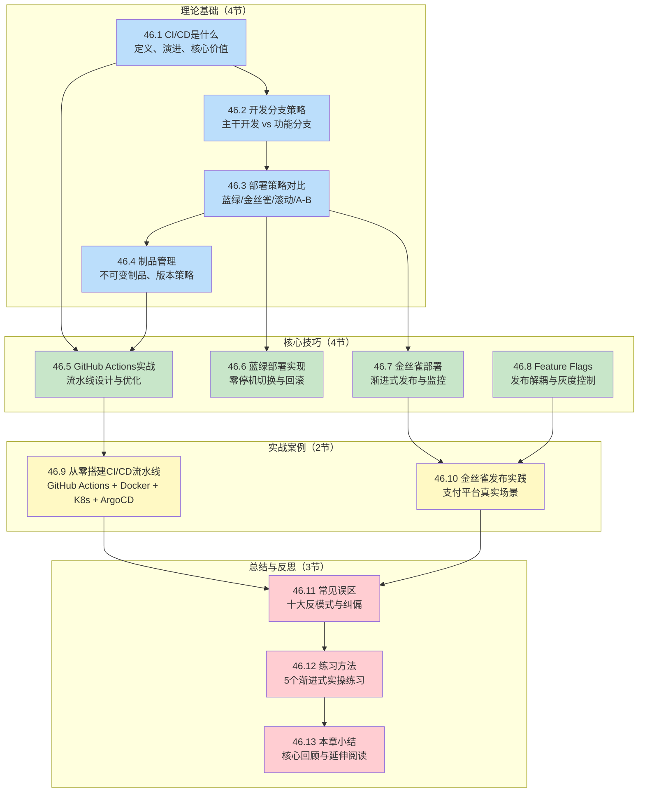
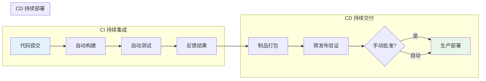
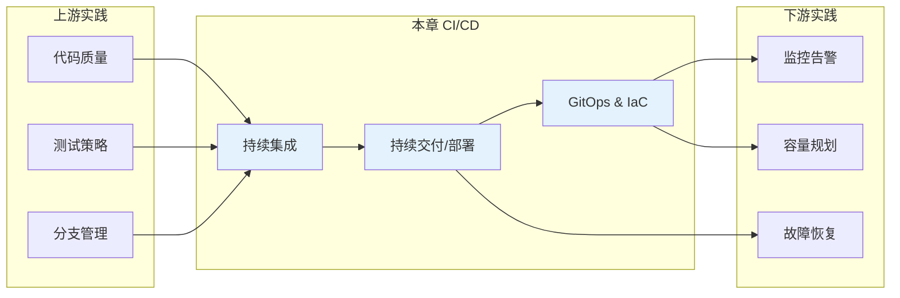

# 第46章 CI/CD：持续集成与持续部署——章节概览

## 为什么需要这一章

软件交付是软件工程中最脆弱的环节。代码从开发者的工作站到最终用户手里，要经过构建、测试、打包、部署、监控等多个环节，任何一个步骤的疏忽都可能导致线上事故。传统的手工部署方式不仅效率低下，而且极易出错——据 DORA（DevOps Research and Assessment）报告，采用先进 DevOps 实践的组织，其部署频率是低效组织的 46 倍，变更失败率仅为低效组织的五分之一。

CI/CD（Continuous Integration / Continuous Deployment）正是解决这一问题的核心工程实践。它通过自动化构建、测试和部署流程，将代码变更安全、快速、可重复地交付到生产环境。这不是一个可选的"锦上添花"，而是现代软件团队的生存基础设施。

本章将从理论根基出发，经过工程技巧的打磨，最终落到真实案例的实战中，帮助你构建完整的 CI/CD 知识体系和实操能力。

---

## 本章知识全景图

---

## 四大模块导读

### 模块一：理论基础——构建认知框架

理论基础模块共 4 节，目标是建立对 CI/CD 的完整认知框架。

| 小节 | 主题 | 核心问题 | 关键概念 |
|------|------|----------|----------|
| 46.1 | CI/CD是什么 | CI、CD、CD三者有何区别？ | 持续集成、持续交付、持续部署的定义边界与演进历史 |
| 46.2 | 开发分支策略 | 如何平衡开发速度与集成风险？ | 主干开发、GitHub Flow、GitLab Flow、合并策略（Merge/Rebase/Squash） |
| 46.3 | 部署策略对比 | 不同场景应该选哪种部署方式？ | 蓝绿部署、金丝雀部署、滚动更新、A/B测试的权衡矩阵 |
| 46.4 | 制品管理 | 如何保证从构建到部署的全链路可追溯？ | 不可变制品、语义化版本、制品仓库（Harbor/Nexus）、SBOM |

**学习建议**：这一模块是后续所有内容的基础。如果你对 CI/CD 概念已有清晰理解，可以快速浏览 46.1，将重点放在 46.2-46.4 的工程决策上。

### 模块二：核心技巧——掌握工程实践

核心技巧模块共 4 节，每节聚焦一个关键工程能力，提供可直接复用的配置和代码。

| 小节 | 主题 | 你将学到 | 实操产出 |
|------|------|----------|----------|
| 46.5 | GitHub Actions实战 | 流水线设计、缓存优化、矩阵构建、Secret管理 | 完整的 GitHub Actions CI/CD 配置文件 |
| 46.6 | 蓝绿部署实现 | 环境管理、流量切换、即时回滚机制 | Nginx/K8s 蓝绿部署配置 |
| 46.7 | 金丝雀部署 | 渐进式流量分割、Prometheus指标监控、自动回滚 | Istio VirtualService 金丝雀路由 |
| 46.8 | Feature Flags | 标志类型选择、生命周期管理、安全清理 | FeatureFlagService 代码抽象 |

**学习建议**：46.5 是所有 CI/CD 实践的起点，建议优先完成。46.6 和 46.7 可根据你的部署环境选择性深入。46.8 是提升发布灵活性的高级技巧。

### 模块三：实战案例——还原真实场景

实战案例模块共 2 节，还原企业级 CI/CD 落地的真实场景，所有配置和代码均可直接复用。

| 案例 | 场景 | 技术栈 | 规模 |
|------|------|--------|------|
| 案例一：从零搭建CI/CD流水线 | 中小团队后端项目 | GitHub Actions + Docker + K8s + ArgoCD | 从零到完整流水线 |
| 案例二：金丝雀发布实践 | 在线支付平台 | Istio + Prometheus + Kubernetes | 日均 2000 万笔交易，峰值 QPS 8000 |

**学习建议**：案例一适合 CI/CD 初学者，完整走一遍从代码提交到生产部署的全流程。案例二面向有 Kubernetes 经验的读者，深入金丝雀发布的工程细节。

### 模块四：总结与反思——避免踩坑

| 小节 | 内容 |
|------|------|
| 46.11 常见误区 | 10 个 CI/CD 实施中最常见的反模式，每个误区配有真实场景、根因分析和纠偏方案 |
| 46.12 练习方法 | 5 个渐进式实操练习，从基础概念理解到高级策略设计 |
| 46.13 本章小结 | 核心知识点回顾、DORA 指标解读、延伸阅读推荐 |

---

## CI/CD 核心概念速查

在正式学习之前，先建立核心概念的清晰认知。以下速查表帮助你快速区分容易混淆的概念：

| 概念 | 全称 | 含义 | 与前后环节的关系 |
|------|------|------|------------------|
| **CI** | Continuous Integration | 开发者频繁将代码合入主干，每次合入自动触发构建和测试 | 是 CD 的前提——没有可靠的 CI，CD 就是定时炸弹 |
| **CD** | Continuous Delivery | 在 CI 基础上，将制品自动打包并部署到预发布环境，生产部署需人工审批 | 是持续部署的"安全阀"——保留最终的人工决策权 |
| **CD** | Continuous Deployment | 在持续交付基础上，跳过人工审批，自动部署到生产环境 | 是持续交付的"加速版"——要求极高的测试覆盖率和监控能力 |
| **GitOps** | — | 以 Git 仓库为唯一真相源，通过声明式配置驱动基础设施状态 | 是 CD 在 Kubernetes 生态中的最佳实践形式 |
| **IaC** | Infrastructure as Code | 用代码（而非手工操作）定义和管理基础设施 | 是 CI/CD 在基础设施层面的延伸 |
| **Feature Flag** | 功能标志 | 通过条件开关控制功能的可见性，将代码部署与功能发布解耦 | 是 CD 的"安全气囊"——即使部署了有问题的代码，也能通过开关即时止损 |

---

## 本章的技术定位

本章在整本软件工程指南中的定位是**工程效能与交付**。CI/CD 连接了上游的编码实践（代码质量、测试策略、分支管理）和下游的运维实践（监控、告警、故障恢复），是软件工程从"写好代码"到"交付价值"的关键桥梁。

---

## 学习路径建议

根据你的当前水平，推荐不同的学习路径：

### 路径一：CI/CD 入门（预计 8-10 小时）

适合没有 CI/CD 经验或仅使用过简单 CI 工具的读者。

46.1 CI/CD是什么（理解概念）
  → 46.2 开发分支策略（选择分支模式）
    → 46.5 GitHub Actions实战（动手搭建流水线）
      → 案例一：从零搭建CI/CD流水线（完整实践）
        → 46.11 常见误区（避免踩坑）
          → 46.12 练习方法（巩固所学）

### 路径二：部署策略进阶（预计 6-8 小时）

适合已有基础 CI/CD 流水线，想提升部署安全性和灵活性的读者。

46.3 部署策略对比（理解不同策略）
  → 46.6 蓝绿部署实现
    → 46.7 金丝雀部署
      → 案例二：金丝雀发布实践
        → 46.8 Feature Flags（发布解耦）

### 路径三：全流程精通（预计 12-15 小时）

适合想系统掌握 CI/CD 全部知识的读者。按顺序学习全部 13 节内容。

---

## 关键度量：DORA 四大指标

DORA 团队通过多年研究，定义了衡量软件交付效能的四个关键指标。学习 CI/CD 的过程中，你应该始终以这四个指标为目标来衡量自己的实践水平：

| 指标 | 含义 | 低效组织 | 高效组织 | 差距倍数 |
|------|------|----------|----------|----------|
| **部署频率** | 多久向生产环境部署一次 | 每月一次或更少 | 按需部署，一天多次 | 46 倍 |
| **变更前置时间** | 从代码提交到成功部署的时间 | 一周到一个月 | 少于一小时 | 数百倍 |
| **变更失败率** | 导致服务降级或需要回滚的部署比例 | 16-30% | 0-15% | 2 倍 |
| **服务恢复时间** | 从服务故障到完全恢复的时间 | 一天到一周 | 少于一小时 | 数百倍 |

这四个指标不是遥不可及的理想，而是 CI/CD 实践成熟度的直接体现。本章的所有内容——从流水线设计到部署策略，从功能标志到 GitOps——都是为了帮助你在这四个维度上持续改进。

---

## 准备好了吗

翻开下一页，我们从 CI/CD 的定义和演进开始，正式踏上持续交付的工程实践之路。
