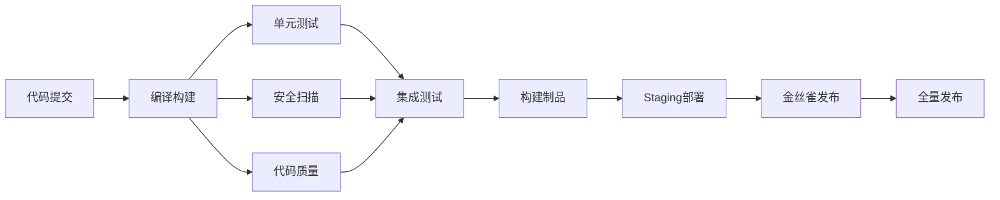
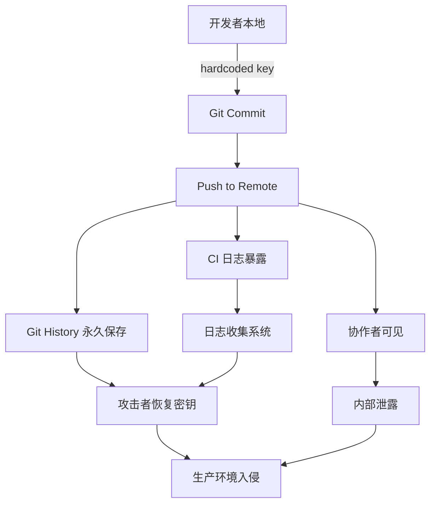
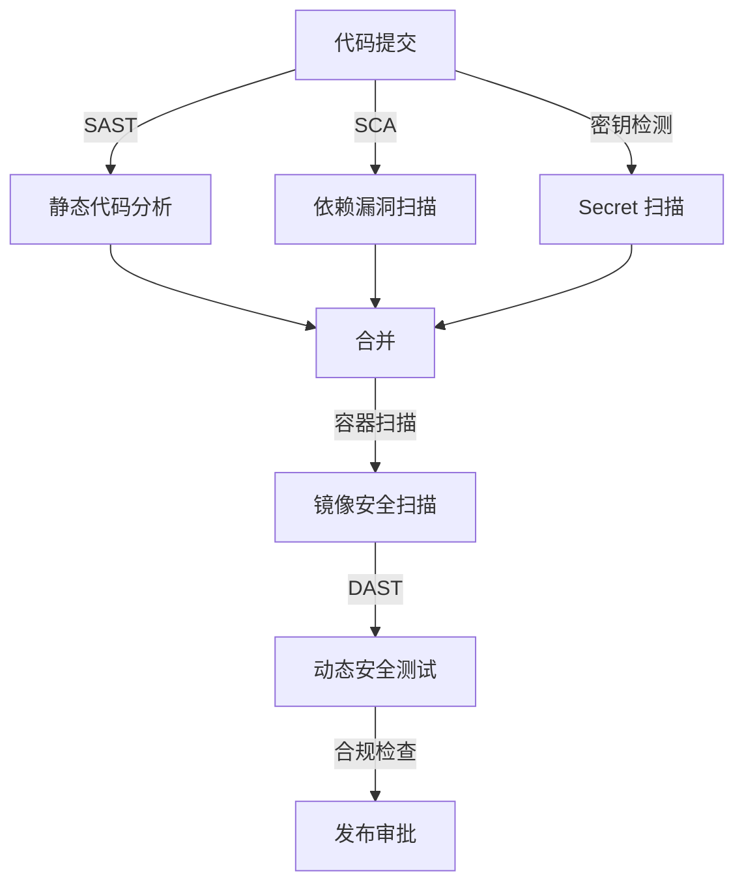
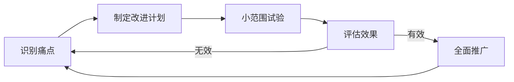

## 常见误区

CI/CD 是一项技术门槛不高但"做对"极难的工程实践。Gartner 2024 年报告指出，约 75% 的 DevOps 转型项目未达到预期目标，其中超过半数的问题出在 CI/CD 落地环节。很多团队的典型路径是：装好 Jenkins/GitHub Actions → 写几条流水线 → 折腾几周 → 觉得"也就这样" → 放弃或退回手工部署。

问题的根源不在于工具选型，而在于对 CI/CD 本质的理解偏差。CI/CD 的核心价值不是"自动执行脚本"，而是**通过快速反馈循环缩短交付周期、保障交付质量、降低变更风险**。本节系统梳理 CI/CD 实施中最常见的十大误区，每个误区都给出真实场景、根因分析和可执行的纠偏方案，帮助读者少走弯路。

在开始之前，先给出一个成熟度参考框架，帮助读者定位自己团队当前所处的阶段：

Level 0 - 手动部署：代码手动打包，手动上传服务器，手动执行部署脚本
Level 1 - 基础自动化：有 CI 流水线，能自动构建和跑单元测试
Level 2 - 标准化交付：多阶段流水线，测试分层，制品版本化，环境容器化
Level 3 - 可控发布：金丝雀/蓝绿部署，自动回滚，Feature Flag，密钥集中管理
Level 4 - 持续优化：DORA 指标追踪，流水线性能预算，安全左移全链路，团队文化驱动

以下十大误区覆盖了从 Level 0 到 Level 4 各阶段最常见的绊脚石。

---

### 误区一：流水线只是"自动跑脚本"

**典型表现**

很多团队的 CI 流水线本质上是一串 shell 脚本的顺序调用：

```yaml
# ❌ 典型反面教材
steps:
  - run: ./build.sh
  - run: ./test.sh
  - run: ./deploy.sh
```

没有阶段划分、没有并行、没有制品管理、没有环境隔离——把"自动化脚本"等同于"CI/CD 流水线"。更极端的情况是：所有步骤写在一个 500 行的 shell 脚本里，流水线只有一步"执行 deploy.sh"。

**根因分析**

CI/CD 的核心价值不是"自动执行"，而是**通过反馈循环缩短交付周期并保障质量**。一条合格的流水线应该具备以下要素：

| 要素 | 说明 | 缺失后果 |
|------|------|----------|
| 阶段化 | 编译→测试→扫描→构建→部署，职责清晰 | 一个环节失败影响全链路 |
| 并行化 | 独立任务同时执行 | 耗时翻倍，反馈延迟 |
| 可观测 | 每步有日志、耗时、结果统计 | 排障靠猜，效率低下 |
| 可追溯 | 制品与代码 commit 绑定 | 出问题无法定位版本 |
| 可回滚 | 一键回滚机制 | 生产事故无法快速恢复 |

**真实案例：** 某金融科技团队将所有逻辑写在一个 Jenkinsfile 中（约 600 行 Groovy 脚本），流水线平均耗时 45 分钟。一次生产事故后发现：某个中间步骤静默失败（exit code 被忽略），导致未经测试的代码直接部署到了生产环境。重构为阶段化流水线后，耗时降至 12 分钟，且每个阶段独立失败、独立告警。

**纠偏方案**

一条成熟的 CI/CD 流水线应该像这样分阶段组织：



```yaml
# ✅ 阶段化流水线示例（GitHub Actions）
name: Production Pipeline
on:
  push:
    branches: [main]

stages:
  - name: build
    jobs:
      - compile
      - lint

  - name: test
    jobs:
      - unit-test
      - integration-test    # 与 unit-test 并行
      - security-scan       # 与 unit-test 并行

  - name: package
    jobs:
      - build-image         # 依赖 build 阶段全部通过

  - name: deploy
    jobs:
      - deploy-staging
      - canary              # 依赖 staging 部署成功
      - production          # 依赖金丝雀验证通过
```

**落地步骤（按优先级排序）：**

1. 将现有脚本拆分为独立阶段，每阶段有明确的输入/输出/退出码
2. 识别可并行的阶段（如测试与安全扫描），使用矩阵策略并行执行
3. 每个阶段产出制品（镜像、包、报告），并与 commit SHA 绑定
4. 部署阶段增加健康检查和自动回滚逻辑（详见误区四）
5. 为每个阶段设置超时控制，避免单点卡死拖垮整条流水线

---

### 误区二：测试只写单元测试，或只跑一次就完

**典型表现**

- 代码合并后才跑一次完整测试，PR 阶段只做 lint
- 测试全靠单元测试，没有集成测试和端到端测试
- 单元测试只测 happy path，不测异常和边界情况
- 测试覆盖率报告显示 90%，但生产环境 Bug 不断

**根因分析**

CI/CD 中的测试金字塔要求**分层测试**，每层覆盖不同风险。很多团队过度依赖单元测试，因为写起来快、跑起来也快，但单元测试只能验证孤立函数的逻辑正确性，无法发现模块间交互、外部依赖集成、真实用户路径等方面的问题。

         /  E2E  \          ← 少量、慢、高置信
        / 集成测试 \         ← 适量、中速
       /   单元测试   \       ← 大量、快、低层

| 测试层 | 覆盖目标 | 执行时间 | 典型占比 | 常见问题 |
|--------|----------|----------|----------|----------|
| 单元测试 | 函数/类逻辑 | 毫秒级 | 70% | 不测边界、mock 过度、断言太弱 |
| 集成测试 | 模块间交互 | 秒级 | 20% | 依赖外部服务、数据不隔离 |
| E2E 测试 | 用户完整路径 | 分钟级 | 10% | 脆弱、维护成本高、环境依赖强 |

**常见反模式：**

- **覆盖率陷阱**：追求 95%+ 覆盖率，但很多测试只是 `assert response is not None` 这种无效断言。覆盖率数字好看，但实际检测能力为零。
- **E2E 膨胀**：把所有场景都写成 E2E 测试，流水线跑一次要 40 分钟，开发者怨声载道，最终选择跳过。
- **Flaky 放任**：偶尔失败的测试被标记为"已知问题"但不修复，CI 红灯被忽略，团队逐渐对测试结果脱敏。

**纠偏方案**

1. **分层策略**：PR 阶段只跑单元测试（快速反馈），合并到主分支后跑完整测试套件。

2. **测试并行化**：在 CI 中用 test splitting 将测试拆分到多个 runner 并行执行：

```yaml
# ✅ GitHub Actions 并行测试示例
test:
  strategy:
    matrix:
      shard: [1, 2, 3, 4]
  steps:
    - run: |
        # 按文件分片，每 shard 执行 1/4 的测试
        TEST_FILES=$(ls test/unit/*.py | awk "NR%4==${{ matrix.shard - 1 }}")
        pytest $TEST_FILES -v --tb=short
```

3. **Flaky Test 治理**：对反复失败的"抖动测试"，先隔离到 retry 池，同时排期修复。持续 flaky 的测试比没有测试更危险——它会侵蚀团队对自动化测试的信任。

```python
# 标记 flaky test 并自动重试
import pytest

@pytest.mark.flaky(reruns=3, reruns_delay=2)
def test_unstable_api_call():
    result = call_flaky_api()
    assert result.status == 200
```

4. **测试覆盖率门禁**：设置增量覆盖率底线（如新代码 ≥ 80%），避免覆盖率持续下滑：

```yaml
# 覆盖率门禁检查
- name: Check coverage threshold
  run: |
    COVERAGE=$(coverage report --fail-under=80 2>&amp;1 | tail -1)
    echo "Current coverage: $COVERAGE"
```

5. **测试质量审计**：定期审查测试有效性——删除无意义断言的测试，补充缺失的边界测试和异常路径测试。建议每月做一次测试质量回顾：

```python
# ❌ 无效断言（只检查不为空）
def test_get_user():
    user = get_user(1)
    assert user is not None  # 几乎不提供保障

# ✅ 有效断言（验证具体行为）
def test_get_user():
    user = get_user(1)
    assert user.id == 1
    assert user.name == "Alice"
    assert user.email is not None
    assert user.created_at <= datetime.now()
```

---

### 误区三：Secrets 硬编码或随意管理

**典型表现**

- API Key 直接写在代码里或配置文件中
- 把 `.env` 文件提交到 Git
- 所有环境（dev/staging/prod）共用同一套密钥
- 密钥轮换靠手动，没有过期机制
- CI 日志中直接打印环境变量，密钥被日志收集系统永久保存

**根因分析**

密钥泄露是 CI/CD 中最高频的安全事故之一。根据 GitHub 的年度安全报告，每年有数百万个含暴露密钥的代码提交被发现。密钥一旦进入 Git 历史，即使后续删除，攻击者仍可通过 `git log` 恢复。GitGuardian 2024 年报告显示，**每 10 个代码仓库中就有 1 个包含硬编码的密钥或凭证**。

**泄密路径分析：**



**真实案例：** 2024 年某知名 SaaS 公司因开发者将 AWS Access Key 硬编码在配置文件中并推送到 public repo，攻击者在 15 分钟内利用该密钥启动了 200 台 EC2 实例进行加密货币挖矿，造成超过 $50,000 的云资源损失。事后审计发现：该密钥拥有 AdministratorAccess 权限，且从未配置过轮换。

**纠偏方案**

1. **使用平台原生 Secrets 管理**：

```yaml
# ✅ GitHub Actions Secrets 使用
jobs:
  deploy:
    steps:
      - name: Deploy
        env:
          AWS_ACCESS_KEY_ID: ${{ secrets.AWS_ACCESS_KEY_ID }}
          AWS_SECRET_ACCESS_KEY: ${{ secrets.AWS_SECRET_ACCESS_KEY }}
          DATABASE_URL: ${{ secrets.DATABASE_URL }}
        run: deploy.sh
```

2. **分环境分级管理**：

| 环境 | Secrets 存储方式 | 访问权限 | 轮换周期 | 审批流程 |
|------|-----------------|----------|----------|----------|
| 开发 | 开发专用 vault | 全员可读 | 90 天 | 无 |
| 预发 | 预发专用 vault | 核心成员 | 60 天 | 团队 Lead 审批 |
| 生产 | 生产 vault + 审批流 | 仅运维+负责人 | 30 天 | 双人审批 |

3. **预提交钩子防泄露**：

```bash
# 安装 gitleaks 预提交钩子
brew install gitleaks  # macOS
# 或
go install github.com/gitleaks/gitleaks/v8@latest

# .pre-commit-config.yaml
repos:
  - repo: https://github.com/gitleaks/gitleaks
    rev: v8.18.0
    hooks:
      - id: gitleaks
```

4. **密钥轮换自动化**：用 Vault、AWS Secrets Manager 或 GCP Secret Manager 实现自动轮换：

```python
# AWS Secrets Manager 自动轮换 Lambda
import boto3
import json

def lambda_handler(event, context):
    client = boto3.client('secretsmanager')
    secret_id = event['SecretId']

    # 生成新密钥
    new_secret = generate_new_credentials()

    # 更新 Secret
    client.update_secret(
        SecretId=secret_id,
        SecretString=json.dumps(new_secret)
    )

    # 通知下游服务刷新缓存
    notify_services_to_refresh(secret_id)
```

5. **CI 日志脱敏**：在流水线中加入日志过滤步骤，防止敏感信息泄露到日志系统：

```yaml
# 日志脱敏处理
- name: Sanitize logs
  if: always()
  run: |
    # 用 sed 过滤常见敏感模式
    sed -E 's/(password|token|key|secret)[=:]\s*["\x27]?[^\s&amp;"]+/[REDACTED]/gi' \
      build.log > build_clean.log
```

---

### 误区四：部署"大爆炸"——要么全量上线，要么不上

**典型表现**

- 每次发布都是全量替换所有实例
- 没有灰度发布能力，新旧版本之间非此即彼
- 发布窗口固定，不管变更大小都攒一批上
- 回滚就是"再发一次旧版本"，没有一键回滚机制
- 发布需要停服维护窗口，用户感知明显

**根因分析**

大爆炸部署的风险在于**爆炸半径过大**——一旦新版本有缺陷，所有用户同时受影响。这与 CI/CD "小步快跑、快速反馈"的核心理念完全相悖。

大爆炸部署的隐性成本远超想象：每次发布需要完整的回归测试、需要停服维护窗口、需要协调多人同时在线值班、需要准备详细的回滚方案。这些成本使得团队本能地减少发布频率，形成"发布越少→每次变更越大→风险越高→更不敢发布"的恶性循环。

**风险对比：**

| 部署方式 | 爆炸半径 | 回滚速度 | 发布频率 | 典型故障恢复时间 | 实施复杂度 |
|----------|----------|----------|----------|-----------------|-----------|
| 大爆炸部署 | 100% | 分钟~小时 | 月/周 | 30-120 分钟 | ★ |
| 蓝绿部署 | 0%（切换瞬时） | 秒级 | 周/日 | < 1 分钟 | ★★★ |
| 金丝雀发布 | 5%→逐步扩大 | 秒级 | 日/次 | < 5 分钟 | ★★★★ |
| 滚动更新 | 25%步进 | 秒级 | 日/次 | < 5 分钟 | ★★ |

**纠偏方案**

1. **金丝雀发布**：先切 5% 流量到新版本，观察核心指标 10-15 分钟，无异常再逐步扩大：

```yaml
# Istio 金丝雀发布配置
apiVersion: networking.istio.io/v1beta1
kind: VirtualService
metadata:
  name: my-service
spec:
  hosts:
    - my-service
  http:
    - route:
        - destination:
            host: my-service
            subset: stable
          weight: 95
        - destination:
            host: my-service
            subset: canary
          weight: 5
```

2. **自动化回滚**：在部署脚本中集成健康检查和自动回滚逻辑：

```bash
#!/bin/bash
# deploy-with-rollback.sh

DEPLOY_VERSION=$1
HEALTH_CHECK_URL="http://localhost:8080/health"
MAX_RETRIES=10
RETRY_INTERVAL=6

deploy_version "$DEPLOY_VERSION"

for i in $(seq 1 $MAX_RETRIES); do
    HTTP_CODE=$(curl -s -o /dev/null -w "%{http_code}" "$HEALTH_CHECK_URL")
    if [ "$HTTP_CODE" = "200" ]; then
        echo "✅ Deployment $DEPLOY_VERSION verified"
        exit 0
    fi
    echo "⏳ Waiting... ($i/$MAX_RETRIES) - HTTP $HTTP_CODE"
    sleep $RETRY_INTERVAL
done

echo "❌ Health check failed, rolling back"
rollback
exit 1
```

3. **Feature Flag 配合**：代码部署和功能发布解耦——先把代码部署到生产，通过 Feature Flag 控制功能对用户的可见性：

```python
# Feature Flag 使用示例
from featureflags import FeatureFlags

ff = FeatureFlags(provider="launchdarkly")

def get_checkout_flow(user):
    if ff.is_enabled("new-checkout-flow", user):
        return NewCheckoutFlow()
    return LegacyCheckoutFlow()
```

4. **发布策略选择指南**：

团队规模 < 5 人，单体应用 → 滚动更新 + 自动回滚
团队规模 5-20 人，微服务 → 金丝雀发布 + Feature Flag
团队规模 > 20 人，核心服务 → 蓝绿部署 + 金丝雀 + 自动化验证

---

### 误区五：忽略流水线自身的性能优化

**典型表现**

- 一次 CI 运行要 30-60 分钟，开发者提交后干等
- 每次构建都从零开始，不利用缓存
- 测试串行执行，N 个测试文件就跑 N 遍
- 依赖每次都重新下载，没有本地缓存
- 开发者养成"攒一波再提交"的习惯，与 CI/CD 理念背道而驰

**根因分析**

流水线速度直接影响开发者体验和交付效率。Google 的研究数据表明：**构建时间超过 10 分钟，开发者切换到其他任务的概率上升 50%**；超过 30 分钟，日均提交量下降 40%。流水线变慢还有一个隐性后果：开发者会倾向于减少提交频率、增大每次变更规模，这反过来又让流水线更慢、问题更难定位，形成负循环。

**常见瓶颈与耗时分布：**

| 阶段 | 典型耗时 | 优化空间 | 优化手段 |
|------|----------|----------|----------|
| 依赖安装 | 3-15 分钟 | ★★★★★ | 缓存、镜像预装 |
| 编译构建 | 2-20 分钟 | ★★★★ | 增量构建、并行 |
| 单元测试 | 1-10 分钟 | ★★★★ | 并行分片、选择性测试 |
| 集成测试 | 5-30 分钟 | ★★★ | 容器化环境、mock |
| 镜像构建 | 2-10 分钟 | ★★★★ | 多阶段构建、BuildKit 缓存 |
| 部署 | 1-5 分钟 | ★★ | 增量发布 |

**纠偏方案**

1. **依赖缓存**：

```yaml
# ✅ Node.js 依赖缓存
- uses: actions/setup-node@v4
  with:
    node-version: '20'
    cache: 'npm'            # 自动缓存 ~/.npm

# ✅ Docker 层缓存
- uses: docker/build-push-action@v5
  with:
    cache-from: type=gha    # GitHub Actions 缓存后端
    cache-to: type=gha,mode=max
```

2. **增量构建与选择性测试**：只构建和测试被变更影响的部分：

```bash
# 只运行受变更影响的测试
CHANGED_FILES=$(git diff --name-only HEAD~1)
AFFECTED_PACKAGES=$(echo "$CHANGED_FILES" | grep "^src/" | cut -d'/' -f2 | sort -u)

for pkg in $AFFECTED_PACKAGES; do
    if [ -d "test/$pkg" ]; then
        echo "Testing $pkg"
        pytest "test/$pkg" -v
    fi
done
```

3. **并行分片**：

```yaml
# 测试矩阵并行
test:
  strategy:
    matrix:
      shard: [1, 2, 3, 4, 5, 6, 7, 8]
  steps:
    - run: |
        # 使用 Jest --shard 或 pytest-xdist
        npx jest --shard=${{ matrix.shard }}/8
```

4. **构建时间预算**：为流水线各阶段设置时间预算，超时即报警：

```yaml
# 超时控制
jobs:
  build:
    timeout-minutes: 10
    steps:
      - name: Compile
        timeout-minutes: 5
        run: make build
      - name: Test
        timeout-minutes: 8
        run: make test
```

5. **流水线性能基线**：建立流水线耗时基线，当耗时劣化超过阈值时自动告警。建议将"构建时间 < 10 分钟"作为团队级 SLA 来维护。

---

### 误区六：基础设施手动管理，环境不一致

**典型表现**

- "在我机器上能跑"是日常现象
- 测试环境和生产环境配置不同
- 手动在服务器上安装软件、修改配置
- 没有环境版本控制，环境配置不可复现
- 数据库 schema 在不同环境不一致

**根因分析**

手动管理的环境本质上是**不可复现的**。当测试环境与生产环境存在差异时，CI/CD 流水线中通过的测试结果就失去了参考价值——你在测试环境验证的一切可能在生产环境全部失效。更危险的是，这种差异往往是隐性的：没人知道测试环境的 MySQL 版本比生产低一个小版本，直到某个 SQL 语法在生产报错。

**环境差异导致的典型问题：**

| 差异类型 | 测试环境 | 生产环境 | 后果 |
|----------|----------|----------|------|
| 操作系统版本 | Ubuntu 20.04 | Ubuntu 22.04 | 系统调用不兼容 |
| 运行时版本 | Java 11 | Java 17 | API 行为差异 |
| 数据库版本 | MySQL 5.7 | MySQL 8.0 | SQL 语法不兼容 |
| 配置参数 | 连接池=10 | 连接池=100 | 并发下才暴露的 Bug |
| 网络环境 | 内网直连 | 跨 AZ 延迟 | 超时配置未覆盖 |
| 时区设置 | UTC | Asia/Shanghai | 时间计算错误 |
| 字符编码 | UTF-8 | GBK | 中文乱码 |

**真实案例：** 某电商平台在测试环境中一切正常，上线后发现订单列表在高并发下偶发 502 错误。根因是测试环境的 Nginx worker_connections=1024，而生产环境是 512（因为某次手动调整后忘了同步到 IaC 配置文件）。这个差异在低并发的测试环境永远不会暴露。

**纠偏方案**

1. **Infrastructure as Code (IaC)**：用 Terraform/Pulumi 定义所有基础设施：

```hcl
# ✅ Terraform 环境定义
resource "aws_instance" "app" {
  count         = var.environment == "production" ? 6 : 2
  ami           = data.aws_ami.ubuntu.id
  instance_type = var.environment == "production" ? "m5.xlarge" : "t3.medium"

  tags = {
    Environment = var.environment
    ManagedBy   = "terraform"
  }
}
```

2. **环境即代码**：用 Docker Compose 或 Kubernetes 确保环境一致性：

```yaml
# docker-compose.yml - 本地开发环境 = 生产环境子集
version: '3.8'
services:
  app:
    image: myapp:${VERSION:-latest}      # 与生产用同一镜像
    environment:
      - DB_HOST=postgres
      - REDIS_HOST=redis
    depends_on:
      postgres:
        condition: service_healthy
      redis:
        condition: service_started

  postgres:
    image: postgres:16-alpine            # 与生产同版本
    environment:
      POSTGRES_DB: testdb
    healthcheck:
      test: ["CMD-SHELL", "pg_isready -U postgres"]
      interval: 5s
      timeout: 3s
      retries: 5
```

3. **定期环境漂移检测**：用工具定期扫描环境配置是否偏离 IaC 定义：

```bash
# Terraform 环境漂移检测
terraform plan -detailed-exitcode
# 退出码 0 = 无变化，1 = 错误，2 = 有漂移
```

4. **环境一致性检查清单**（建议在每次部署前自动执行）：

```bash
# 环境一致性验证脚本
echo "=== Environment Consistency Check ==="

# 检查运行时版本一致性
for env in test staging production; do
  RUNTIME_VERSION=$(kubectl exec -n $env deploy/app -- node --version)
  echo "$env: Node.js $RUNTIME_VERSION"
done

# 检查数据库版本一致性
for env in test staging production; do
  DB_VERSION=$(kubectl exec -n $env deploy/postgres -- psql -c "SELECT version()" | head -1)
  echo "$env: $DB_VERSION"
done

# 检查关键配置参数
diff <(kubectl get configmap -n test app-config -o yaml) \
     <(kubectl get configmap -n production app-config -o yaml)
```

---

### 误区七：忽略流水线的可观测性

**典型表现**

- 流水线失败了只知道"失败了"，不知道哪里慢了、为什么失败
- 没有构建时间趋势图，不知道流水线是越来越快还是越来越慢
- 没有部署频率、变更前置时间等 DORA 指标的追踪
- 出了问题靠翻日志，没有结构化的监控面板
- 无法回答"上周我们的构建成功率是多少"这类基本问题

**根因分析**

CI/CD 流水线是软件交付的"中枢神经"，如果这条链路本身不可观测，就无法持续改进。DORA（DevOps Research and Assessment）团队的研究表明，**高效能团队的部署频率是低效能团队的 973 倍**，而可观测性是区分两者的关键因素。没有数据支撑的改进都是盲人摸象——你不知道瓶颈在哪，就无法针对性优化。

**CI/CD 可观测性四支柱：**

| 支柱 | 关注点 | 数据来源 | 典型工具 |
|------|--------|----------|----------|
| 构建指标 | 构建成功率、耗时、频率 | CI 平台 API | Grafana, Buildkite Analytics |
| 测试指标 | 通过率、覆盖率、flaky率 | 测试报告 | Allure, ReportPortal |
| 部署指标 | 部署频率、回滚率、MTTR | CD 平台 + APM | Datadog, Prometheus |
| 交付指标 | DORA 四指标、前置时间 | 跨系统聚合 | Harness, Sleuth |

**纠偏方案**

1. **流水线指标采集**：

```yaml
# 在流水线结束时上报指标
- name: Report pipeline metrics
  if: always()
  run: |
    # 构建耗时
    DURATION=$(($(date +%s) - START_TIME))
    curl -X POST "$METRICS_ENDPOINT" \
      -d "pipeline_duration=$DURATION" \
      -d "pipeline_status=${{ job.status }}" \
      -d "commit=${{ github.sha }}" \
      -d "branch=${{ github.ref_name }}"
```

2. **Grafana 仪表盘监控 CI/CD**：

```yaml
# Prometheus 采集流水线指标
- job_name: 'cicd-metrics'
  static_configs:
    - targets: ['ci-exporter:9090']
  metrics_path: '/metrics'
  scrape_interval: 30s
```

关键面板应包含：
- 构建成功率趋势（7天/30天）
- 各阶段平均耗时瀑布图
- 部署频率与变更前置时间
- Flaky Test 数量趋势
- 平均修复时间 (MTTR)

3. **自动化告警**：

```yaml
# 构建时间劣化告警
- alert: CIPipelineSlowdown
  expr: |
    avg_over_time(ci_pipeline_duration_seconds[7d])
    / avg_over_time(ci_pipeline_duration_seconds[30d] offset 7d) > 1.5
  for: 3d
  annotations:
    summary: "CI 流水线平均耗时增长超过 50%"
```

---

### 误区八：安全左移只是口号

**典型表现**

- 安全扫描放在发布前最后一步，发现问题又要重走全流程
- 只做 SAST（静态扫描），不做 SCA（软件成分分析）和 DAST（动态扫描）
- 依赖包从不更新，已知漏洞越来越多
- 容器镜像从 public registry 直接拉取，不做签名验证
- 安全团队和开发团队各自为政，安全评审变成上线前的"最后一公里"阻碍

**根因分析**

安全左移的核心是**越早发现安全问题，修复成本越低**。IBM 的研究数据显示：在设计阶段发现的安全缺陷修复成本仅为生产环境的 1/100。更关键的是，安全左移不是把安全团队的工作左移，而是让开发团队具备安全能力——安全成为每个人的职责，而不是安全团队的专属领域。

**安全扫描分层：**



**纠偏方案**

1. **分层安全扫描嵌入流水线**：

```yaml
# 完整安全扫描流水线
security-scan:
  steps:
    # 1. SAST - 静态代码分析
    - name: CodeQL Analysis
      uses: github/codeql-action/analyze@v3

    # 2. SCA - 依赖漏洞扫描
    - name: Dependency Review
      uses: actions/dependency-review-action@v3

    # 3. Secret 扫描
    - name: Gitleaks
      uses: gitleaks/gitleaks-action@v2
      env:
        GITHUB_TOKEN: ${{ secrets.GITHUB_TOKEN }}

    # 4. 镜像扫描
    - name: Trivy Container Scan
      uses: aquasecurity/trivy-action@master
      with:
        image-ref: myapp:${{ github.sha }}
        format: 'sarif'
        severity: 'CRITICAL,HIGH'
        exit-code: '1'            # 发现高危漏洞则阻断
```

2. **依赖自动更新**：用 Dependabot 或 Renovate 自动创建依赖更新 PR：

```yaml
# .github/dependabot.yml
version: 2
updates:
  - package-ecosystem: "npm"
    directory: "/"
    schedule:
      interval: "weekly"
    open-pull-requests-limit: 10
    labels:
      - "dependencies"
      - "security"

  - package-ecosystem: "docker"
    directory: "/"
    schedule:
      interval: "weekly"
```

3. **镜像签名与验证**：

```bash
# 用 Cosign 签名镜像
cosign sign --key cosign.key myregistry/myapp:${TAG}

# 在部署时验证签名
cosign verify --key cosign.pub myregistry/myapp:${TAG}
```

4. **安全扫描策略矩阵**：不同阶段应侧重不同类型的扫描，避免重复扫描浪费时间：

| 代码阶段 | 扫描类型 | 工具 | 阻断级别 | 执行频率 |
|----------|----------|------|----------|----------|
| PR 提交 | SAST + Secret | CodeQL + Gitleaks | CRITICAL 阻断 | 每次 PR |
| 合并到主分支 | SCA + License | Dependabot + FOSSA | HIGH 阻断 | 每次合并 |
| 镜像构建后 | 容器扫描 + SBOM | Trivy + Syft | CRITICAL 阻断 | 每次构建 |
| 部署前 | DAST | OWASP ZAP | HIGH 阻断 | 每次部署 |
| 定期 | 合规审计 | OPA + Kyverno | 合规报告 | 每周 |

---

### 误区九：Git 分支策略混乱或过度

**典型表现**

- 所有人直接在 main 分支开发，冲突频繁
- 分支模型过于复杂（develop、release、hotfix、feature、support...），维护成本高于收益
- PR 长期不合并，变成"大森林"式分支
- 代码合并频率低，每周甚至每月才合并一次
- 分支命名混乱，无法从名称判断用途和状态

**根因分析**

分支策略的选择应匹配团队规模和发布节奏。过于简单会导致质量失控，过于复杂会导致合并地狱。核心原则是：**缩短分支生命周期，频繁集成**。Google 的工程实践表明，代码分支存活超过 2 天，合并冲突概率指数级增长。

**分支策略对比：**

| 策略 | 适用场景 | 优点 | 缺点 | 推荐团队规模 |
|------|----------|------|------|------------|
| Trunk-Based | 持续部署 | 集成快、冲突少 | 需要强大的 Feature Flag 能力 | 5-50 人 |
| GitHub Flow | 持续交付 | 简单、清晰 | 长期功能受限 | 3-20 人 |
| GitFlow | 定期发布 | 版本管理清晰 | 分支多、合并频繁 | 10-100 人 |
| GitLab Flow | 多环境部署 | 环境隔离 | 环境同步复杂 | 5-50 人 |

**纠偏方案**

1. **推荐：Trunk-Based Development**（配合 Feature Flag）：

main ─────●────●────●────●────●────●────●────→
            \   \       \  /       \   \
             f1  f2      fix        f3  f4
             (1d) (2d)   (即时)     (3d) (1d)

核心规则：
- 所有分支从 main 拉出，**存活不超过 2 天**
- 合并前必须通过 CI（测试 + 安全扫描 + 代码审查）
- 未完成的功能通过 Feature Flag 关闭，不在分支上长期存在
- 热修复直接在 main 上修，回滚靠 Feature Flag 或快速 revert

2. **分支保护规则**：

# GitHub Branch Protection Rules
Main 分支保护:
  ✅ Require pull request reviews (至少 1 人)
  ✅ Require status checks (CI 全部通过)
  ✅ Require branches to be up to date
  ✅ Require conversation resolution
  ❌ Allow force pushes（关闭）
  ❌ Allow deletions（关闭）

3. **自动化清理过期分支**：

```bash
# 定期清理已合并分支
git fetch --prune
git branch -r --merged main | grep -v main | \
  sed 's/origin\///' | xargs -I {} git push origin --delete {}

# 删除本地过期分支（超过 7 天未更新）
git branch --merged main | grep -v main | \
  xargs git branch -d
```

4. **分支策略选择决策树**：

你的团队是否需要同时维护多个发布版本？
├── 是 → GitFlow 或 GitLab Flow
└── 否 → 你的团队是否具备 Feature Flag 基础设施？
    ├── 是 → Trunk-Based Development
    └── 否 → GitHub Flow（配合逐步引入 Feature Flag）

---

### 误区十：CI/CD 只是工具问题，忽略团队文化

**典型表现**

- 把 CI/CD 等同于 Jenkins/GitHub Actions 的安装配置
- 流水线出了问题只找运维，开发不关心
- 代码合并后才做代码审查，发现问题已经晚了
- "CI/CD 是额外工作"的心态普遍存在
- 没有人对流水线的健康状态负责
- 失败的 CI 状态被长期忽略，红灯变成常态

**根因分析**

CI/CD 的本质是一种**工程文化**，而不仅仅是一套工具链。Google 的 DORA 研究持续 8 年的数据表明：影响软件交付效能的最大因素不是工具选择，而是团队实践和文化。一个用着最先进的工具链但文化落后的团队，效能可能还不如一个用着简单工具但文化先进的团队。

**DORA 四大关键指标：**

| 指标 | 含义 | 高效能标准 | 低效能标准 |
|------|------|-----------|-----------|
| 部署频率 | 多久部署一次 | 按需（一天多次） | 每月~每半年 |
| 变更前置时间 | 从代码提交到上线 | < 1 天 | 1-6 个月 |
| 变更失败率 | 部署导致故障的比例 | 0-15% | 16-30% |
| 服务恢复时间 | 故障后恢复时间 | < 1 小时 | 1 天~1 周 |

**真实案例：** 某互联网公司在引入 GitHub Actions 后，构建速度提升了 60%，但部署频率反而下降了。原因是：开发者不信任自动化测试（因为 flaky test 长期未修复），仍然习惯在合并后手动验证；运维团队担心"开发者乱改流水线"，锁定了流水线配置权限。工具升级了，但文化没跟上，结果适得其反。

**纠偏方案**

1. **建立明确的工程公约**：

# 团队 CI/CD 公约示例
1. 所有代码变更必须通过 PR，禁止直接 push main
2. PR 必须在 24 小时内完成 review
3. CI 失败的 PR 禁止合并
4. 每次 PR 不超过 400 行变更（便于 review）
5. 部署由开发者自助完成，运维提供平台支持
6. 生产事故 post-mortem 在 48 小时内完成
7. 流水线红灯必须在 30 分钟内响应
8. Flaky test 必须在 7 天内修复或禁用

2. **代码审查前置**：在开发阶段就进行 review，不要等到 PR 提交时才看：

```yaml
# Draft PR 机制 - 开发中就开启 review
pull_request:
  types: [opened, synchronize, ready_for_review]
jobs:
  notify-review:
    if: github.event.pull_request.draft == false
    steps:
      - name: Request review
        uses: actions/github-script@v7
        with:
          script: |
            await github.rest.pulls.requestReviewers({
              owner: context.repo.owner,
              repo: context.repo.repo,
              pull_number: context.issue.number,
              reviewers: ['team-lead']
            })
```

3. **渐进式改进**：不要一步到位，用 PDCA 循环持续优化：



4. **CI/CD 成熟度自评**：每季度进行一次团队自评，识别当前阶段和下一步改进方向：

| 维度 | Level 1（初始） | Level 2（规范） | Level 3（优化） | Level 4（卓越） |
|------|-----------------|-----------------|-----------------|-----------------|
| 构建 | 手动构建 | 自动构建 | 增量构建+缓存 | 构建时间预算制 |
| 测试 | 单元测试 | 分层测试 | 并行化+选择性 | 智能测试调度 |
| 部署 | 手动部署 | 自动化部署 | 金丝雀+回滚 | 自愈+自治 |
| 安全 | 无扫描 | SAST | 分层扫描 | 安全左移全链路 |
| 可观测 | 无 | 基础日志 | 指标+仪表盘 | DORA 追踪+告警 |
| 文化 | 无共识 | 基础公约 | 数据驱动改进 | 持续学习+创新 |

---

### 总结：CI/CD 误区速查表

| # | 误区 | 核心纠偏 | 优先级 |
|---|------|----------|--------|
| 1 | 流水线=脚本串行 | 阶段化、并行化、可观测 | ★★★★★ |
| 2 | 测试层次单一 | 分层测试金字塔、并行执行 | ★★★★★ |
| 3 | Secrets 管理混乱 | 平台原生管理、自动轮换、防泄露扫描 | ★★★★★ |
| 4 | 大爆炸部署 | 金丝雀/蓝绿、自动回滚、Feature Flag | ★★★★ |
| 5 | 流水线太慢 | 缓存、增量构建、并行分片 | ★★★★ |
| 6 | 环境不一致 | IaC、容器化、漂移检测 | ★★★★ |
| 7 | 缺乏可观测性 | 指标采集、仪表盘、自动告警 | ★★★ |
| 8 | 安全只做 SAST | 分层扫描、依赖更新、镜像签名 | ★★★★ |
| 9 | 分支策略混乱 | Trunk-Based + Feature Flag | ★★★ |
| 10 | 忽视团队文化 | 工程公约、DORA 指标、渐进改进 | ★★★★★ |

**分阶段改进建议：**

- **第 1 周**：修复最危险的三个问题——流水线阶段化（误区一）、Secrets 安全（误区三）、基础测试分层（误区二）
- **第 2-4 周**：优化效率和安全——流水线缓存（误区五）、安全扫描嵌入（误区八）、环境容器化（误区六）
- **第 2-3 个月**：提升发布能力——金丝雀部署（误区四）、可观测性（误区七）、分支策略优化（误区九）
- **持续**：文化建设（误区十）——这不是一次性工作，而是需要持续投入的长期工程

> **关键认知**：CI/CD 的成熟度提升是一个持续迭代的过程，不存在"一步到位"的方案。建议团队从当前最大的痛点入手，每次只改进一个点，积累成功经验后再推进下一个。用数据驱动决策——如果不知道当前的 DORA 指标是多少，就无法衡量改进是否有效。工具只是手段，文化才是目的；流水线只是管道，反馈循环才是灵魂。
