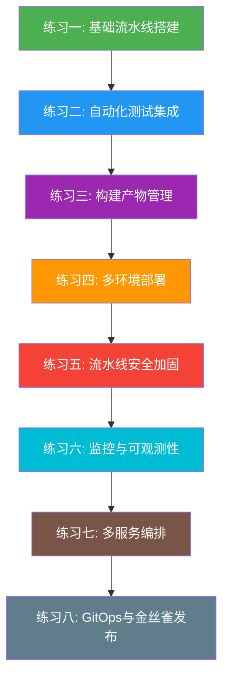

## CI/CD 练习方法：从入门到精通的实战训练

> 学习CI/CD的最佳方式不是阅读文档，而是在真实的代码仓库中反复搭建、调试和优化流水线。本章设计了8个递进式练习，覆盖从"第一次提交触发构建"到"多环境金丝雀发布"的完整技能树。每个练习都包含可执行的完整代码、验证步骤和常见错误分析。

### 学习路线总览

在开始练习之前，建议按以下路线循序渐进。每个练习都建立在前一个的基础上，跳过前面的练习会导致后续练习缺乏必要的知识储备。



**前置要求：**

| 技能 | 最低要求 | 推荐工具 |
|------|---------|---------|
| Git操作 | 能独立完成分支、合并、rebase | Git 2.40+ |
| 编程语言 | 至少掌握一门（Python/Node.js/Go） | Python 3.10+ |
| Linux基础 | 能使用终端、编辑器、环境变量 | Ubuntu 22.04+ |
| Markdown | 能阅读和编写基本Markdown | 任意编辑器 |
| GitHub账号 | 已注册并能创建仓库 | GitHub Free/Pro |

---

### 练习一：基础流水线搭建（预计45分钟）

**目标：** 在GitHub上创建一个真实的代码仓库，配置GitHub Actions流水线，实现推送代码后自动构建和运行基础检查。这是CI/CD的起点——理解"代码提交即触发自动化"的核心理念。

**为什么重要：** GitHub Actions是目前最主流的CI/CD平台之一，几乎所有开源项目和大量企业项目都在使用。掌握它是进入DevOps领域的敲门砖。

**步骤一：创建示例项目并推送到GitHub（10分钟）**

```bash
# 1. 创建本地项目
mkdir ci-cd-practice &amp;&amp; cd ci-cd-practice
git init

# 2. 创建一个简单的Python应用
cat > app.py << 'EOF'
"""一个简单的CLI计算器应用"""
import sys

def add(a: float, b: float) -> float:
    return a + b

def subtract(a: float, b: float) -> float:
    return a - b

def multiply(a: float, b: float) -> float:
    return a * b

def divide(a: float, b: float) -> float:
    if b == 0:
        raise ValueError("除数不能为零")
    return a / b

if __name__ == "__main__":
    if len(sys.argv) != 4:
        print("用法: python app.py <运算符> <数字1> <数字2>")
        print("支持: +, -, *, /")
        sys.exit(1)

    op, a, b = sys.argv[1], float(sys.argv[2]), float(sys.argv[3])
    ops = {"+": add, "-": subtract, "*": multiply, "/": divide}
    if op not in ops:
        print(f"不支持的运算符: {op}")
        sys.exit(1)
    print(ops[op](a, b))
EOF

# 3. 创建测试文件
cat > test_app.py << 'EOF'
"""app.py的单元测试"""
from app import add, subtract, multiply, divide
import pytest

def test_add():
    assert add(1, 2) == 3
    assert add(-1, 1) == 0
    assert add(0.1, 0.2) == pytest.approx(0.3)

def test_subtract():
    assert subtract(5, 3) == 2
    assert subtract(0, 5) == -5

def test_multiply():
    assert multiply(3, 4) == 12
    assert multiply(-2, 3) == -6

def test_divide():
    assert divide(10, 2) == 5
    assert divide(7, 2) == 3.5

def test_divide_by_zero():
    with pytest.raises(ValueError, match="除数不能为零"):
        divide(1, 0)
EOF

# 4. 创建依赖文件
cat > requirements.txt << 'EOF'
pytest>=7.0
flake8>=6.0
EOF

# 5. 提交并推送
git add .
git commit -m "feat: 初始化CI/CD练习项目"
git remote add origin https://github.com/YOUR_USERNAME/ci-cd-practice.git
git push -u origin main
```

**步骤二：配置GitHub Actions工作流（15分钟）**

```bash
# 创建目录结构
mkdir -p .github/workflows
```

```yaml
# .github/workflows/ci.yml
name: CI Pipeline

# 触发条件：推送到main分支，或向main发起PR时
on:
  push:
    branches: [main]
  pull_request:
    branches: [main]

# 并行策略：同一分支的新推送会取消旧的运行
concurrency:
  group: ci-${{ github.ref }}
  cancel-in-progress: true

jobs:
  # Job 1: 代码质量检查
  lint:
    name: 代码质量检查
    runs-on: ubuntu-latest
    steps:
      - name: 检出代码
        uses: actions/checkout@v4

      - name: 设置Python环境
        uses: actions/setup-python@v5
        with:
          python-version: "3.11"
          cache: "pip"

      - name: 安装依赖
        run: pip install -r requirements.txt

      - name: 运行Flake8代码风格检查
        run: |
          # 检查未使用的导入（F401）和未定义的变量（F821）
          flake8 app.py test_app.py --max-line-length=120 --count --show-source --statistics

  # Job 2: 单元测试
  test:
    name: 单元测试
    runs-on: ubuntu-latest
    steps:
      - name: 检出代码
        uses: actions/checkout@v4

      - name: 设置Python环境
        uses: actions/setup-python@v5
        with:
          python-version: "3.11"
          cache: "pip"

      - name: 安装依赖
        run: pip install -r requirements.txt

      - name: 运行测试并生成覆盖率报告
        run: |
          pytest test_app.py -v --tb=short --junitxml=test-results.xml

      - name: 上传测试报告
        if: always()
        uses: actions/upload-artifact@v4
        with:
          name: test-results
          path: test-results.xml
```

**步骤三：验证流水线（10分钟）**

```bash
# 1. 将工作流文件提交并推送
git add .github/
git commit -m "ci: 添加GitHub Actions基础CI流水线"
git push

# 2. 在终端检查工作流状态
# 等待约30秒后，使用GitHub CLI查看
gh run list --limit 5
gh run watch  # 实时跟踪当前运行

# 3. 查看详细日志
gh run view --log
```

**步骤四：故意引入错误进行测试（10分钟）**

```python
# 在app.py中故意引入一个语法错误，例如：
# 把 def add(a: float, b: float) 改为 def add(a: float, b: float    (缺少右括号)
```

```bash
git add app.py
git commit -m "test: 故意引入语法错误验证CI"
git push

# 观察流水线是否正确报错
gh run list
# 应该看到一个失败的运行，状态为 "failure"
```

**验证标准：**

- [ ] GitHub仓库中能看到 `.github/workflows/ci.yml` 文件
- [ ] 推送代码后，GitHub Actions页面显示绿色的构建成功标记
- [ ] 流水线的 lint 和 test 两个 Job 并行执行
- [ ] 修改代码后推送，能观察到新一次构建被触发
- [ ] 引入语法错误后，流水线正确报错显示失败
- [ ] 理解 `on.push`、`on.pull_request`、`concurrency` 的含义

**常见陷阱与排错：**

| 现象 | 原因 | 解决方案 |
|------|------|---------|
| 工作流不触发 | YAML文件路径错误 | 必须在 `.github/workflows/` 目录下，文件名以 `.yml` 或 `.yaml` 结尾 |
| `pip install` 报错 | 依赖版本冲突 | 检查 `requirements.txt` 中的版本约束是否合理 |
| `gh` 命令报 401 | 未登录GitHub CLI | 执行 `gh auth login` 完成认证 |
| `concurrency` 不生效 | group名称不够唯一 | 确保 `${{ github.ref }}` 被正确引用 |
| 流水线一直 pending | Runner被占用 | 检查是否有其他工作流在运行，或账户的并发限制 |

---

### 练习二：自动化测试集成（预计60分钟）

**目标：** 为CI流水线添加完整的测试策略，包括单元测试、集成测试、代码覆盖率检查，并配置测试结果的可视化展示。

**为什么重要：** 测试是CI的核心价值所在。没有测试的CI只是"自动构建"，有测试的CI才能真正保证代码质量。Google的工程实践表明，自动测试能将回归Bug率降低60%以上。

**步骤一：扩展测试矩阵（20分钟）**

```yaml
# 更新 .github/workflows/ci.yml 的 test job
jobs:
  test:
    name: 单元测试 (Python ${{ matrix.python-version }})
    runs-on: ubuntu-latest
    strategy:
      # 矩阵策略：同时测试多个Python版本
      matrix:
        python-version: ["3.9", "3.10", "3.11", "3.12"]
      # 不因某个版本失败而取消其他版本的测试
      fail-fast: false
    steps:
      - name: 检出代码
        uses: actions/checkout@v4

      - name: 设置Python ${{ matrix.python-version }}
        uses: actions/setup-python@v5
        with:
          python-version: ${{ matrix.python-version }}
          cache: "pip"

      - name: 安装依赖
        run: |
          pip install -r requirements.txt
          pip install pytest-cov  # 代码覆盖率工具

      - name: 运行测试（含覆盖率）
        run: |
          pytest test_app.py -v \
            --cov=app \
            --cov-report=xml:coverage.xml \
            --cov-report=html:htmlcov \
            --junitxml=test-results.xml

      - name: 上传覆盖率报告
        if: matrix.python-version == '3.11'  # 只上传一次
        uses: actions/upload-artifact@v4
        with:
          name: coverage-report
          path: htmlcov/

      - name: 上传测试结果
        if: always()
        uses: actions/upload-artifact@v4
        with:
          name: test-results-py${{ matrix.python-version }}
          path: test-results.xml
```

**步骤二：添加覆盖率门禁（15分钟）**

```yaml
# 在 test job 的步骤末尾添加
      - name: 覆盖率门禁检查
        run: |
          # 从coverage.xml中提取总体覆盖率
          COVERAGE=$(python -c "
          import xml.etree.ElementTree as ET
          tree = ET.parse('coverage.xml')
          rate = float(tree.getroot().attrib['line-rate'])
          print(f'{rate * 100:.1f}')
          ")
          echo "当前代码覆盖率: ${COVERAGE}%"

          # 设置最低覆盖率门槛（70%）
          THRESHOLD=70.0
          if (( $(echo "$COVERAGE < $THRESHOLD" | bc -l) )); then
            echo "❌ 覆盖率 ${COVERAGE}% 未达到最低要求 ${THRESHOLD}%"
            exit 1
          fi
          echo "✅ 覆盖率 ${COVERAGE}% 达标"
```

**步骤三：创建集成测试（15分钟）**

```python
# test_integration.py
"""集成测试：验证app.py的CLI接口"""
import subprocess
import sys
import pytest

def run_cli(args):
    """执行CLI命令并返回结果"""
    result = subprocess.run(
        [sys.executable, "app.py"] + args,
        capture_output=True,
        text=True,
        timeout=10
    )
    return result

class TestCLI:
    """CLI接口集成测试"""

    def test_add_via_cli(self):
        result = run_cli(["+", "3", "5"])
        assert result.returncode == 0
        assert result.stdout.strip() == "8.0"

    def test_divide_by_zero_via_cli(self):
        result = run_cli(["/", "1", "0"])
        assert result.returncode == 1
        assert "除数不能为零" in result.stdout

    def test_invalid_operator(self):
        result = run_cli(["%", "1", "2"])
        assert result.returncode == 1
        assert "不支持的运算符" in result.stdout

    def test_missing_args(self):
        result = run_cli(["+"])
        assert result.returncode == 1
        assert "用法" in result.stdout
```

```yaml
# 在 ci.yml 中添加集成测试 job
  integration-test:
    name: 集成测试
    needs: [lint, test]  # 依赖lint和test通过后才运行
    runs-on: ubuntu-latest
    steps:
      - uses: actions/checkout@v4
      - uses: actions/setup-python@v5
        with:
          python-version: "3.11"
          cache: "pip"
      - run: pip install -r requirements.txt
      - name: 运行集成测试
        run: pytest test_integration.py -v
```

**验证标准：**

- [ ] 流水线中能看到4个Python版本并行测试的Job
- [ ] 能在Artifacts中下载到HTML格式的覆盖率报告
- [ ] 覆盖率门禁检查能正确输出当前覆盖率百分比
- [ ] 将覆盖率门槛设为100%时，门禁正确失败
- [ ] 集成测试在单元测试通过后才执行
- [ ] 修改 `test_app.py` 降低覆盖率后，门禁正确拦截

---

### 练习三：构建产物管理（预计50分钟）

**目标：** 为Python项目添加构建流程，生成可分发的包（wheel），管理构建产物的版本和存储。

**为什么重要：** 构建产物（Artifact）是CI/CD的关键输出物。一个规范的构建流程能确保每次构建的产物可追溯、可重现、可分发。

**步骤一：配置构建流程（20分钟）**

```yaml
# .github/workflows/build.yml
name: Build &amp; Release

on:
  push:
    tags: ["v*"]  # 只在推送版本标签时触发

permissions:
  contents: write  # 需要写权限来创建Release

jobs:
  build:
    name: 构建发布包
    runs-on: ubuntu-latest
    steps:
      - name: 检出代码
        uses: actions/checkout@v4
        with:
          fetch-depth: 0  # 获取完整Git历史（用于版本号生成）

      - name: 设置Python环境
        uses: actions/setup-python@v5
        with:
          python-version: "3.11"

      - name: 安装构建工具
        run: pip install build twine

      - name: 从Git标签提取版本号
        id: version
        run: |
          VERSION=${GITHUB_REF#refs/tags/v}
          echo "version=${VERSION}" >> $GITHUB_OUTPUT
          echo "构建版本: v${VERSION}"

      - name: 更新版本号
        run: |
          # 将版本号写入 pyproject.toml 或 setup.cfg
          cat > pyproject.toml << EOF
          [build-system]
          requires = ["setuptools>=68.0"]
          build-backend = "setuptools.backends._legacy:_Backend"

          [project]
          name = "ci-cd-calculator"
          version = "${{ steps.version.outputs.version }}"
          description = "CI/CD练习项目 - 简单计算器"
          requires-python = ">=3.9"

          [project.scripts]
          calculator = "app:main"
          EOF

      - name: 构建包
        run: python -m build

      - name: 检查构建产物
        run: |
          echo "=== 构建产物 ==="
          ls -la dist/
          echo ""
          echo "=== 检查产物完整性 ==="
          twine check dist/*

      - name: 创建GitHub Release
        uses: softprops/action-gh-release@v2
        with:
          files: dist/*
          generate_release_notes: true
          draft: false
          prerelease: false
```

**步骤二：添加构建产物签名（15分钟）**

```yaml
      - name: 生成校验和
        run: |
          cd dist
          sha256sum * > checksums-sha256.txt
          echo "=== 校验和 ==="
          cat checksums-sha256.txt

      - name: 更新Release添加校验和
        uses: softprops/action-gh-release@v2
        with:
          files: |
            dist/*
            dist/checksums-sha256.txt
```

**步骤三：验证构建流程（15分钟）**

```bash
# 1. 创建版本标签并推送
git tag -a v1.0.0 -m "Release v1.0.0: 初始版本"
git push origin v1.0.0

# 2. 观察构建
gh run list --workflow=build.yml
gh run watch

# 3. 验证Release
gh release view v1.0.0
# 确认能看到 wheel 文件和校验和

# 4. 本地验证产物
gh release download v1.0.0
pip install ci_cd_calculator-1.0.0-py3-none-any.whl
python -c "from app import add; print(add(1,2))"
# 应输出 3.0
```

**验证标准：**

- [ ] 推送 `v*` 标签后，构建自动触发
- [ ] GitHub Releases页面能看到新版本，包含 `.whl` 和 `.tar.gz` 文件
- [ ] 下载的产物包含 `checksums-sha256.txt`
- [ ] 使用 `twine check` 验证产物格式正确
- [ ] 能通过 `pip install` 安装构建的 wheel 包
- [ ] 版本号与Git标签一致

---

### 练习四：多环境部署（预计70分钟）

**目标：** 实现代码从开发环境到测试环境再到生产环境的自动/半自动部署流程，理解环境隔离和部署策略。

**为什么重要：** 多环境部署是CI/CD的核心价值体现。据统计，约70%的生产事故发生在部署阶段，规范的多环境部署流程能将部署失败率降低80%。

**步骤一：创建环境配置（20分钟）**

```bash
# 创建环境配置目录
mkdir -p deploy/environments
```

```yaml
# deploy/environments/staging.yml
environment:
  name: staging
  url: https://staging.example.com
  variables:
    APP_ENV: staging
    LOG_LEVEL: debug
    DB_HOST: staging-db.internal
    API_RATE_LIMIT: 1000
    FEATURE_FLAGS: "dark_mode=true,new_checkout=true"
```

```yaml
# deploy/environments/production.yml
environment:
  name: production
  url: https://app.example.com
  variables:
    APP_ENV: production
    LOG_LEVEL: warning
    DB_HOST: prod-db.internal
    API_RATE_LIMIT: 10000
    FEATURE_FLAGS: "dark_mode=true,new_checkout=false"
```

**步骤二：配置多阶段部署流水线（30分钟）**

```yaml
# .github/workflows/deploy.yml
name: Deploy Pipeline

on:
  workflow_run:
    workflows: ["CI Pipeline"]  # CI通过后自动触发
    types: [completed]
    branches: [main]

# 使用GitHub Environments实现环境保护规则
# 在GitHub仓库 Settings > Environments 中配置

jobs:
  # 阶段1: 部署到Staging（自动）
  deploy-staging:
    name: 部署到测试环境
    if: ${{ github.event.workflow_run.conclusion == 'success' }}
    runs-on: ubuntu-latest
    environment:
      name: staging
      url: https://staging.example.com
    steps:
      - uses: actions/checkout@v4

      - name: 部署到Staging
        run: |
          echo "=== 部署到测试环境 ==="
          echo "环境: ${{ vars.APP_ENV }}"
          echo "数据库: ${{ vars.DB_HOST }}"
          echo "日志级别: ${{ vars.LOG_LEVEL }}"

          # 实际项目中这里的部署命令可能是:
          # kubectl apply -f k8s/staging/
          # docker compose -f docker-compose.staging.yml up -d
          # aws ecs update-service --cluster staging --service app
          echo "✅ Staging部署完成"

      - name: 运行Staging冒烟测试
        run: |
          echo "=== 冒烟测试 ==="
          # 验证关键接口可用
          # curl -f https://staging.example.com/health || exit 1
          # curl -f https://staging.example.com/api/version || exit 1
          echo "✅ 冒烟测试通过"

  # 阶段2: 部署到Production（需人工审批）
  deploy-production:
    name: 部署到生产环境
    needs: deploy-staging
    runs-on: ubuntu-latest
    environment:
      name: production   # 需要配置审批者
      url: https://app.example.com
    steps:
      - uses: actions/checkout@v4

      - name: 部署到Production
        run: |
          echo "=== 部署到生产环境 ==="
          echo "环境: ${{ vars.APP_ENV }}"
          echo "数据库: ${{ vars.DB_HOST }}"
          echo "速率限制: ${{ vars.API_RATE_LIMIT }}"
          echo "✅ Production部署完成"

      - name: 生产环境验证
        run: |
          echo "=== 生产环境健康检查 ==="
          # curl -f https://app.example.com/health
          echo "✅ 生产环境正常"

      - name: 通知部署完成
        if: success()
        run: |
          echo "🎉 生产环境部署成功"
          echo "版本: $(git describe --tags --always)"
          echo "提交: $(git rev-parse --short HEAD)"
```

**步骤三：配置环境保护规则（10分钟）**

在GitHub仓库中操作（通过 `gh` CLI 或网页界面）：

```bash
# 使用GitHub CLI创建Environment
gh api repos/{owner}/{repo}/environments/staging -X PUT

# 创建production环境并配置审批
gh api repos/{owner}/{repo}/environments/production -X PUT -f \
  '{"reviewers":[{"type":"User","id":YOUR_USER_ID}]}'
```

**步骤四：模拟完整的部署流程（10分钟）**

```bash
# 1. 本地创建并推送一个新提交，触发CI
echo "# 更新日志" >> README.md
git add . &amp;&amp; git commit -m "chore: 触发CI/CD流水线"
git push

# 2. 观察CI通过后自动触发Deploy
gh run list --workflow=deploy.yml
gh run watch

# 3. Staging部署完成后，Production会进入 "Waiting" 状态
# 手动批准Production部署：
gh run view  # 找到deployment job
gh run approve <run-id>  # 批准部署
```

**验证标准：**

- [ ] Staging环境在CI通过后自动部署
- [ ] Production环境需要人工审批才能继续
- [ ] 部署日志中能看到各环境的配置变量
- [ ] Staging部署后自动运行了冒烟测试
- [ ] 能在GitHub Actions UI中看到环境部署的可视化流程
- [ ] 拒绝审批后，Production部署正确取消

---

### 练习五：流水线安全加固（预计50分钟）

**目标：** 在CI/CD流水线中集成安全扫描工具，实现依赖漏洞检查、密钥泄露检测和镜像安全扫描。

**为什么重要：** 根据Sonatype《2024年软件供应链安全报告》，供应链攻击数量较去年增长245%，其中CI/CD流水线是攻击者的主要目标之一。安全是CI/CD不可忽视的维度。

**步骤一：配置依赖漏洞扫描（15分钟）**

```yaml
# .github/workflows/security.yml
name: Security Scanning

on:
  push:
    branches: [main]
  pull_request:
    branches: [main]
  schedule:
    - cron: "0 6 * * 1"  # 每周一早6点定期扫描

jobs:
  dependency-audit:
    name: 依赖漏洞扫描
    runs-on: ubuntu-latest
    steps:
      - uses: actions/checkout@v4

      - name: 设置Python环境
        uses: actions/setup-python@v5
        with:
          python-version: "3.11"

      - name: 安装依赖审计工具
        run: pip install pip-audit safety

      - name: pip-audit扫描
        run: |
          echo "=== 使用pip-audit扫描依赖漏洞 ==="
          pip-audit -r requirements.txt --severity critical high
          echo "✅ 未发现高危或严重漏洞"

      - name: Safety检查
        run: |
          echo "=== 使用Safety检查已知漏洞 ==="
          safety check -r requirements.txt --output json || true
          echo "⚠️ Safety检查完成（供参考，不阻断流水线）"
```

**步骤二：配置密钥泄露检测（15分钟）**

```yaml
      # 在security.yml中添加
  secret-scan:
    name: 密钥泄露检测
    runs-on: ubuntu-latest
    steps:
      - uses: actions/checkout@v4
        with:
          fetch-depth: 0  # 需要完整历史来扫描

      - name: 使用Gitleaks扫描
        uses: gitleaks/gitleaks-action@v2
        env:
          GITHUB_TOKEN: ${{ secrets.GITHUB_TOKEN }}

      - name: 自定义敏感信息检测
        run: |
          echo "=== 检查硬编码的敏感信息 ==="
          # 检查是否有明文密码
          if grep -rn "password\s*=" --include="*.py" --include="*.yml" . | \
             grep -v "test_" | grep -v "# "; then
            echo "❌ 发现可能的硬编码密码"
            exit 1
          fi

          # 检查是否有API密钥模式
          if grep -rnE "(api_key|secret_key|access_token)\s*=\s*['\"][A-Za-z0-9]{20,}" \
             --include="*.py" --include="*.yml" .; then
            echo "❌ 发现可能的硬编码密钥"
            exit 1
          fi

          echo "✅ 未发现硬编码的敏感信息"
```

**步骤三：配置密钥管理最佳实践（10分钟）**

```yaml
# 在deploy.yml中演示正确的密钥使用方式
jobs:
  deploy-secure:
    runs-on: ubuntu-latest
    steps:
      - uses: actions/checkout@v4

      - name: 使用GitHub Secrets（正确方式）
        env:
          # 从GitHub Secrets中获取，不在代码中暴露
          API_KEY: ${{ secrets.API_KEY }}
          DB_PASSWORD: ${{ secrets.DB_PASSWORD }}
        run: |
          echo "使用环境变量传递密钥（不会在日志中显示）"
          # 注意：GitHub Actions会自动掩码包含密钥的输出
          echo "API Key前4位: ${API_KEY:0:4}****"

      - name: 错误示范 - 绝对不要这样做
        run: |
          echo "❌ 以下行为是严格禁止的："
          echo "1. 将密钥硬编码在代码中"
          echo "2. 将密钥写在Dockerfile中"
          echo "3. 将密钥打印到日志中"
          echo "4. 将包含密钥的.env文件提交到Git"
          echo "✅ 正确做法：使用GitHub Secrets / Vault / 云厂商密钥管理"
```

**步骤四：验证安全扫描（10分钟）**

```bash
# 1. 在项目中故意添加一个测试用密钥
echo 'API_KEY = "sk-1234567890abcdef1234567890abcdef"' >> test_secrets.py
git add test_secrets.py &amp;&amp; git commit -m "test: 故意添加测试密钥验证扫描"
git push

# 2. 观察安全扫描是否检测到
gh run list --workflow=security.yml
gh run view --log  # 查看安全扫描日志

# 3. 扫描通过后，清理测试文件
git rm test_secrets.py
git commit -m "chore: 清理测试密钥文件"
git push
```

**验证标准：**

- [ ] 依赖漏洞扫描能正确识别已知CVE
- [ ] Gitleaks能检测到硬编码的密钥
- [ ] GitHub Secrets配置正确，密钥不会出现在日志中
- [ ] 每周一自动运行定时安全扫描
- [ ] 发现高危漏洞时流水线正确阻断
- [ ] 理解安全扫描工具的误报处理方式

---

### 练习六：监控与可观测性（预计55分钟）

**目标：** 为CI/CD流水线添加构建指标采集和监控，实现构建时间、成功率、部署频率等关键指标的可视化。

**为什么重要：** DORA（DevOps Research and Assessment）指标是衡量工程团队效能的行业标准，包括部署频率、变更前置时间、服务恢复时间、变更失败率四个维度。没有度量就没有改进。

**步骤一：集成构建指标采集（20分钟）**

```yaml
# .github/workflows/metrics.yml
name: Metrics Collection

on:
  workflow_run:
    workflows: ["CI Pipeline", "Build &amp; Release", "Deploy Pipeline"]
    types: [completed]

jobs:
  collect-metrics:
    name: 采集构建指标
    runs-on: ubuntu-latest
    steps:
      - uses: actions/checkout@v4

      - name: 采集构建指标
        id: metrics
        run: |
          # 采集关键指标
          TRIGGER="${{ github.event.workflow_run.event }}"
          BRANCH="${{ github.event.workflow_run.head_branch }}"
          CONCLUSION="${{ github.event.workflow_run.conclusion }}"
          DURATION_MS="${{ github.event.workflow_run.updated_at }}"
          RUN_ID="${{ github.event.workflow_run.id }}"
          WORKFLOW_NAME="${{ github.event.workflow_run.name }}"

          echo "=== CI/CD Metrics ==="
          echo "工作流: ${WORKFLOW_NAME}"
          echo "触发方式: ${TRIGGER}"
          echo "分支: ${BRANCH}"
          echo "结果: ${CONCLUSION}"
          echo "运行ID: ${RUN_ID}"
          echo "时间: $(date -u +%Y-%m-%dT%H:%M:%SZ)"

          # 写入指标文件（实际项目中应发送到Prometheus/Grafana/自建指标平台）
          cat > metrics.json << METRICS
          {
            "timestamp": "$(date -u +%Y-%m-%dT%H:%M:%SZ)",
            "workflow": "${WORKFLOW_NAME}",
            "trigger": "${TRIGGER}",
            "branch": "${BRANCH}",
            "conclusion": "${CONCLUSION}",
            "run_id": ${RUN_ID},
            "repo": "${{ github.repository }}"
          }
          METRICS

          echo "=== 指标已生成 ==="
          cat metrics.json

      - name: 上传指标
        uses: actions/upload-artifact@v4
        with:
          name: metrics-${{ github.event.workflow_run.id }}
          path: metrics.json
          retention-days: 90  # 保留90天
```

**步骤二：配置Slack/钉钉通知（15分钟）**

```yaml
      - name: 发送部署通知
        if: ${{ github.event.workflow_run.conclusion == 'success' }}
        run: |
          # 钉钉机器人通知
          WEBHOOK_URL="${{ secrets.DINGTALK_WEBHOOK }}"

          if [ -n "$WEBHOOK_URL" ]; then
            curl -s -X POST "$WEBHOOK_URL" \
              -H "Content-Type: application/json" \
              -d '{
                "msgtype": "markdown",
                "markdown": {
                  "title": "CI/CD部署通知",
                  "text": "## ✅ 部署成功\n\n- **工作流**: '"${{ github.event.workflow_run.name }}"'\n- **分支**: '"${{ github.event.workflow_run.head_branch }}"'\n- **提交**: '"$(git rev-parse --short HEAD)"'\n- **时间**: '"$(date '+%Y-%m-%d %H:%M:%S')"'\n\n[查看详情](${{ github.event.workflow_run.html_url }})"
                }
              }'
            echo "✅ 通知已发送"
          else
            echo "⚠️ 未配置钉钉Webhook，跳过通知"
          fi
```

**步骤三：添加流水线性能追踪（20分钟）**

```yaml
# .github/workflows/ci.yml 末尾添加
  pipeline-analytics:
    name: 流水线分析
    needs: [lint, test, integration-test]
    if: always()
    runs-on: ubuntu-latest
    steps:
      - name: 计算流水线总耗时
        run: |
          START="${{ github.event.workflow_run.created_at }}"
          END="${{ github.event.workflow_run.updated_at }}"

          # 计算时间差（秒）
          START_EPOCH=$(date -d "$START" +%s 2>/dev/null || date -j -f "%Y-%m-%dT%H:%M:%SZ" "$START" +%s)
          END_EPOCH=$(date -d "$END" +%s 2>/dev/null || date -j -f "%Y-%m-%dT%H:%M:%SZ" "$END" +%s)
          DURATION=$((END_EPOCH - START_EPOCH))

          echo "=== 流水线性能报告 ==="
          echo "总耗时: ${DURATION}秒"
          echo "状态: ${{ github.event.workflow_run.conclusion }}"

          # 性能基线：如果超过5分钟则警告
          if [ $DURATION -gt 300 ]; then
            echo "⚠️ 警告: 流水线耗时超过5分钟，建议优化"
            echo "优化建议:"
            echo "  1. 检查是否有不必要的依赖安装"
            echo "  2. 考虑使用缓存加速"
            echo "  3. 将耗时步骤并行化"
          else
            echo "✅ 流水线耗时在合理范围内"
          fi
```

**验证标准：**

- [ ] 每次CI/CD运行后自动生成 `metrics.json`
- [ ] 指标文件包含工作流名称、触发方式、结果等完整信息
- [ ] Artifacts中能查看到历史指标数据
- [ ] 能在日志中看到流水线总耗时报告
- [ ] 流水线超时时能看到优化建议
- [ ] 理解DORA四个指标的含义和计算方式

---

### 练习七：多服务编排（预计80分钟）

**目标：** 使用Docker Compose和GitHub Actions编排一个包含Web应用、API服务和数据库的多服务项目，实现集成测试的自动化运行。

**为什么重要：** 现代应用几乎都是多服务架构。能编排多服务环境是CI/CD从"玩具项目"走向"生产级"的分水岭。

**步骤一：创建多服务项目结构（25分钟）**

```bash
# 项目结构
mkdir -p multi-service-cicd/{web,api,db}
```

```yaml
# docker-compose.yml
version: "3.8"

services:
  # PostgreSQL数据库
  db:
    image: postgres:15-alpine
    environment:
      POSTGRES_USER: testuser
      POSTGRES_PASSWORD: testpass
      POSTGRES_DB: testdb
    ports:
      - "5432:5432"
    healthcheck:
      test: ["CMD-SHELL", "pg_isready -U testuser -d testdb"]
      interval: 5s
      timeout: 3s
      retries: 5

  # API服务
  api:
    build: ./api
    ports:
      - "8000:8000"
    environment:
      DATABASE_URL: postgresql://testuser:testpass@db:5432/testdb
      ENVIRONMENT: testing
    depends_on:
      db:
        condition: service_healthy

  # Web前端
  web:
    build: ./web
    ports:
      - "3000:3000"
    environment:
      API_URL: http://api:8000
    depends_on:
      - api
```

```python
# api/app.py
"""简化的Flask API服务"""
from flask import Flask, jsonify
import os

app = Flask(__name__)

@app.route("/health")
def health():
    return jsonify({"status": "ok", "service": "api"})

@app.route("/api/items")
def list_items():
    return jsonify({"items": ["item1", "item2", "item3"]})

if __name__ == "__main__":
    app.run(host="0.0.0.0", port=8000)
```

```dockerfile
# api/Dockerfile
FROM python:3.11-slim
WORKDIR /app
RUN pip install flask
COPY app.py .
EXPOSE 8000
CMD ["python", "app.py"]
```

```html
<!-- web/index.html -->
<!DOCTYPE html>
<html>
<head><title>Multi-Service App</title></head>
<body>
  <h1>Multi-Service CI/CD Demo</h1>
  <div id="items">Loading...</div>
</body>
</html>
```

```dockerfile
# web/Dockerfile
FROM nginx:alpine
COPY index.html /usr/share/nginx/html/
EXPOSE 3000
```

**步骤二：配置多服务集成测试流水线（30分钟）**

```yaml
# .github/workflows/integration.yml
name: Multi-Service Integration Test

on:
  push:
    branches: [main]
  pull_request:
    branches: [main]

jobs:
  integration:
    name: 多服务集成测试
    runs-on: ubuntu-latest
    steps:
      - uses: actions/checkout@v4

      - name: 启动所有服务
        run: |
          docker compose up -d --build
          echo "等待服务就绪..."

          # 等待API服务健康检查通过
          for i in $(seq 1 30); do
            if curl -sf http://localhost:8000/health > /dev/null 2>&amp;1; then
              echo "✅ API服务就绪"
              break
            fi
            echo "等待中... ($i/30)"
            sleep 2
          done

      - name: 运行集成测试
        run: |
          echo "=== 测试1: API健康检查 ==="
          HEALTH=$(curl -sf http://localhost:8000/health)
          echo "响应: $HEALTH"
          echo "$HEALTH" | python -c "import sys,json; d=json.load(sys.stdin); assert d['status']=='ok'"

          echo ""
          echo "=== 测试2: API接口测试 ==="
          ITEMS=$(curl -sf http://localhost:8000/api/items)
          echo "响应: $ITEMS"
          echo "$ITEMS" | python -c "import sys,json; d=json.load(sys.stdin); assert len(d['items'])>0"

          echo ""
          echo "=== 测试3: Web服务可访问 ==="
          STATUS=$(curl -sf -o /dev/null -w "%{http_code}" http://localhost:3000)
          echo "HTTP状态码: $STATUS"
          [ "$STATUS" = "200" ] || (echo "❌ Web服务不可用"; exit 1)

          echo ""
          echo "✅ 所有集成测试通过"

      - name: 采集服务日志（失败时）
        if: failure()
        run: |
          echo "=== API日志 ==="
          docker compose logs api
          echo ""
          echo "=== DB日志 ==="
          docker compose logs db

      - name: 清理
        if: always()
        run: docker compose down -v --remove-orphans
```

**步骤三：验证多服务编排（25分钟）**

```bash
# 1. 本地先验证服务能正常启动
docker compose up -d --build
curl http://localhost:8000/health
curl http://localhost:8000/api/items
curl http://localhost:3000

# 2. 提交代码触发CI
git add .
git commit -m "feat: 多服务项目及集成测试"
git push

# 3. 观察CI运行
gh run watch

# 4. 测试失败场景：停止数据库服务
docker compose stop db
curl http://localhost:8000/api/items
# 应该看到数据库连接错误

# 5. 恢复并清理
docker compose down -v
```

**验证标准：**

- [ ] `docker compose up` 能一次性启动所有服务
- [ ] 服务间通信正常（Web能访问API，API能访问DB）
- [ ] 集成测试自动运行且全部通过
- [ ] 任一服务异常时，测试正确失败
- [ ] 失败时能自动采集服务日志辅助排查
- [ ] 无论成功或失败，`docker compose down` 都能正确清理环境

---

### 练习八：GitOps与金丝雀发布（预计90分钟）

**目标：** 使用ArgoCD实现GitOps工作流，配置金丝雀发布策略，实现基于指标的自动回滚。

**为什么重要：** GitOps是Kubernetes时代的部署范式，ArgoCD是CNCF毕业项目。金丝雀发布能将发布事故的影响范围控制在最小。两者结合是生产级CI/CD的最高实践。

**步骤一：创建Kubernetes部署清单（25分钟）**

```yaml
# k8s/base/deployment.yaml
apiVersion: apps/v1
kind: Deployment
metadata:
  name: calculator-api
  labels:
    app: calculator-api
spec:
  replicas: 3
  selector:
    matchLabels:
      app: calculator-api
  template:
    metadata:
      labels:
        app: calculator-api
        version: v1
    spec:
      containers:
        - name: api
          image: ghcr.io/YOUR_USERNAME/ci-cd-practice:latest
          ports:
            - containerPort: 8000
          resources:
            requests:
              cpu: 100m
              memory: 128Mi
            limits:
              cpu: 500m
              memory: 256Mi
          readinessProbe:
            httpGet:
              path: /health
              port: 8000
            initialDelaySeconds: 5
            periodSeconds: 10
          livenessProbe:
            httpGet:
              path: /health
              port: 8000
            initialDelaySeconds: 15
            periodSeconds: 20
---
apiVersion: v1
kind: Service
metadata:
  name: calculator-api
spec:
  selector:
    app: calculator-api
  ports:
    - port: 80
      targetPort: 8000
```

```yaml
# k8s/overlays/canary.yaml
apiVersion: apps/v1
kind: Deployment
metadata:
  name: calculator-api-canary
  labels:
    app: calculator-api
    track: canary
spec:
  replicas: 1  # 金丝雀只运行1个副本
  selector:
    matchLabels:
      app: calculator-api
      track: canary
  template:
    metadata:
      labels:
        app: calculator-api
        track: canary
        version: v2
    spec:
      containers:
        - name: api
          image: ghcr.io/YOUR_USERNAME/ci-cd-practice:canary
          ports:
            - containerPort: 8000
          resources:
            requests:
              cpu: 100m
              memory: 128Mi
            limits:
              cpu: 500m
              memory: 256Mi
```

**步骤二：配置GitOps发布流水线（30分钟）**

```yaml
# .github/workflows/release.yml
name: GitOps Release

on:
  push:
    tags: ["v*"]

permissions:
  contents: read
  packages: write

jobs:
  # 阶段1: 构建并推送容器镜像
  build-image:
    name: 构建容器镜像
    runs-on: ubuntu-latest
    outputs:
      image-tag: ${{ steps.meta.outputs.version }}
    steps:
      - uses: actions/checkout@v4

      - name: 登录容器注册中心
        uses: docker/login-action@v3
        with:
          registry: ghcr.io
          username: ${{ github.actor }}
          password: ${{ secrets.GITHUB_TOKEN }}

      - name: 提取元数据
        id: meta
        uses: docker/metadata-action@v5
        with:
          images: ghcr.io/${{ github.repository }}
          tags: |
            type=semver,pattern={{version}}
            type=sha

      - name: 构建并推送镜像
        uses: docker/build-push-action@v5
        with:
          context: .
          push: true
          tags: ${{ steps.meta.outputs.tags }}
          labels: ${{ steps.meta.outputs.labels }}

  # 阶段2: 更新GitOps仓库中的镜像版本
  update-gitops:
    name: 更新GitOps配置
    needs: build-image
    runs-on: ubuntu-latest
    steps:
      - name: 克隆GitOps仓库
        uses: actions/checkout@v4
        with:
          repository: YOUR_USERNAME/gitops-config
          token: ${{ secrets.GITOPS_TOKEN }}
          path: gitops

      - name: 更新镜像版本
        run: |
          cd gitops
          VERSION="${{ needs.build-image.outputs.image-tag }}"
          echo "更新镜像版本为: ${VERSION}"

          # 使用yq更新YAML文件中的镜像版本
          pip install yq
          yq -i ".spec.template.spec.containers[0].image = \"ghcr.io/${{ github.repository }}:${VERSION}\"" \
            k8s/base/deployment.yaml

          git config user.name "CI Bot"
          git config user.email "ci@bot.com"
          git add .
          git commit -m "release: 更新镜像版本到 ${VERSION}"
          git push

      - name: 触发ArgoCD同步
        run: |
          # ArgoCD会自动检测GitOps仓库的变化并触发同步
          echo "✅ GitOps配置已更新"
          echo "ArgoCD将在1-3分钟内自动同步到Kubernetes集群"
```

**步骤三：配置金丝雀发布策略（20分钟）**

```yaml
# k8s/canary-rollout.yaml
# 使用Argo Rollouts实现渐进式金丝雀发布
apiVersion: argoproj.io/v1alpha1
kind: Rollout
metadata:
  name: calculator-api
spec:
  replicas: 4
  selector:
    matchLabels:
      app: calculator-api
  strategy:
    canary:
      # 金丝雀发布步骤
      steps:
        # 步骤1: 先将10%流量导向新版本，观察5分钟
        - setWeight: 10
        - pause: { duration: 5m }

        # 步骤2: 如果指标正常，扩大到30%，观察5分钟
        - setWeight: 30
        - pause: { duration: 5m }

        # 步骤3: 扩大到60%，观察5分钟
        - setWeight: 60
        - pause: { duration: 5m }

        # 步骤4: 全量发布
        - setWeight: 100

      # 自动分析：基于指标判断是否继续发布
      analysis:
        templates:
          - templateName: canary-success-rate
        startingStep: 1
        args:
          - name: service-name
            value: calculator-api

      # 流量路由
      canaryService: calculator-api-canary
      stableService: calculator-api-stable
---
# 分析模板：检查成功率
apiVersion: argoproj.io/v1alpha1
kind: AnalysisTemplate
metadata:
  name: canary-success-rate
spec:
  args:
    - name: service-name
  metrics:
    - name: success-rate
      interval: 1m
      count: 5
      successCondition: result[0] >= 0.99  # 成功率 >= 99%
      provider:
        prometheus:
          address: http://prometheus:9090
          query: |
            sum(rate(http_requests_total{service="{{args.service-name}}",code=~"2.."}[5m]))
            /
            sum(rate(http_requests_total{service="{{args.service-name}}"}[5m]))
```

**步骤四：验证GitOps与金丝雀发布（15分钟）**

```bash
# 1. 模拟发布流程
# 推送新标签触发构建和GitOps更新
git tag -a v2.0.0 -m "Release v2.0.0: 新功能"
git push origin v2.0.0

# 2. 观察ArgoCD应用状态
# argocd app get calculator-api
# argocd app history calculator-api

# 3. 模拟金丝雀回滚（如果指标异常）
# argocd app rollback calculator-api 1

# 4. 验证版本回退
# kubectl get pods -l app=calculator-api
# 确认所有Pod都运行旧版本镜像
```

**验证标准：**

- [ ] 推送标签后自动构建容器镜像并推送到GHCR
- [ ] GitOps仓库中的镜像版本自动更新
- [ ] ArgoCD能检测到配置变化并触发同步
- [ ] 金丝雀发布按照预设步骤渐进推进
- [ ] 分析模板能基于Prometheus指标自动判断发布质量
- [ ] 指标异常时能自动停止发布或触发回滚
- [ ] 理解GitOps的"Git为单一事实来源"核心理念

---

### 练习总结与进阶路径

完成以上8个练习后，你将具备以下核心能力：

| 练习 | 核心能力 | 难度 | 掌握后的价值 |
|------|---------|------|-------------|
| 练习一 | 流水线基础搭建 | ⭐ | 能为任何项目添加CI |
| 练习二 | 测试策略与覆盖率 | ⭐⭐ | 能保证代码质量不退化 |
| 练习三 | 构建产物管理 | ⭐⭐ | 能发布可复用的软件包 |
| 练习四 | 多环境部署 | ⭐⭐⭐ | 能安全地将代码部署到生产 |
| 练习五 | 安全加固 | ⭐⭐⭐ | 能防范CI/CD供应链攻击 |
| 练习六 | 监控与可观测性 | ⭐⭐⭐ | 能度量和优化流水线效能 |
| 练习七 | 多服务编排 | ⭐⭐⭐⭐ | 能处理真实微服务架构 |
| 练习八 | GitOps与金丝雀 | ⭐⭐⭐⭐⭐ | 能实施企业级发布策略 |

**进阶学习方向：**

- **基础设施即代码（IaC）：** 学习Terraform/Pulumi，将基础设施纳入版本控制
- **混沌工程：** 使用Chaos Monkey/LitmusChaos测试系统韧性
- **平台工程：** 搭建内部开发者平台（IDP），使用Backstage统一工具链
- **供应链安全：** 深入SLSA框架、SBOM生成与签名验证
- **FinOps：** 云资源成本优化，CI/CD运行成本分析与控制
- **AI辅助CI/CD：** 探索GitHub Copilot/MLOps在流水线中的应用

**推荐实践项目：**

1. 为你自己的开源项目配置完整的CI/CD流水线
2. 搭建一个从零到生产的微服务应用，包含完整的DevOps工具链
3. 在本地Kubernetes集群（如Minikube/kind）中实现ArgoCD GitOps
4. 为团队搭建一个内部CI/CD平台，对比Jenkins、GitLab CI、GitHub Actions的优劣

---

> **关键心态：** CI/CD不是一次性搭建完成的，而是随着团队和项目的发展持续演进的。从最简单的自动构建开始，逐步添加测试、部署、安全、监控——每次改进一小步，持续积累就是质的飞跃。最重要的不是工具选型，而是"自动化一切可自动化的事情"的工程文化。
