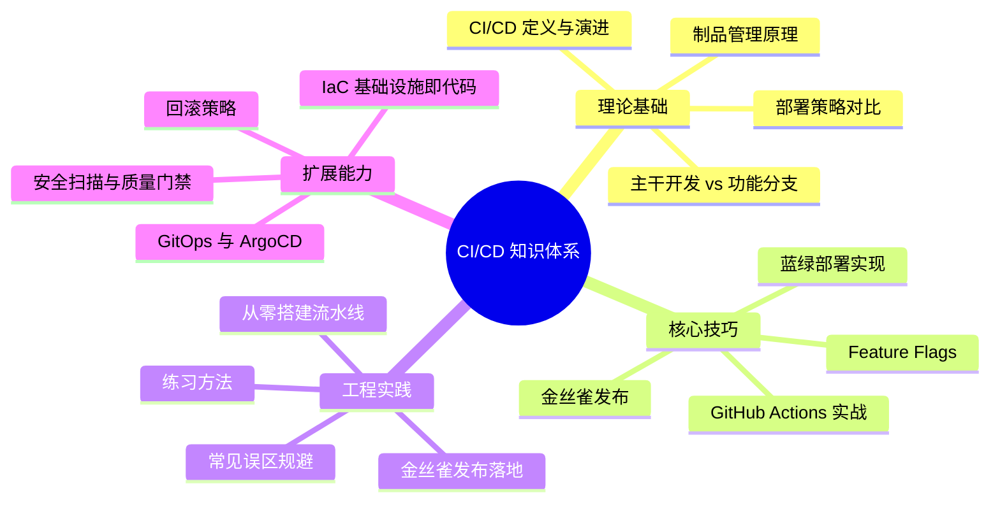
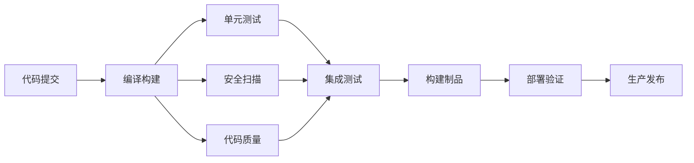

## 本章小结

本章系统性地构建了 CI/CD（持续集成与持续部署）的完整知识体系，从基础概念到企业级落地，覆盖了现代软件交付的全生命周期。以下是本章核心内容的结构化回顾。

---

### 一、核心知识体系全景

---

### 二、关键概念回顾

#### 2.1 CI/CD 的本质

CI/CD 不是简单的"自动跑脚本"，而是一套以**反馈循环**为核心的工程文化：

| 概念 | 定义 | 核心价值 |
|------|------|----------|
| **持续集成（CI）** | 开发者频繁地将代码合入主干，每次合入自动触发构建和测试 | 尽早发现集成问题，避免"合并地狱" |
| **持续交付（CD）** | 在 CI 基础上，确保代码随时可以安全地发布到生产环境 | 缩短交付周期，降低发布风险 |
| **持续部署** | 通过自动化的部署流水线，将通过验证的变更直接推送到生产 | 实现真正的"一键上线" |

三者的关系是层层递进的：CI 是地基，持续交付是上层建筑，持续部署是最终目标。多数团队应先实现 CI，再逐步演进到持续交付，最后根据业务需要决定是否迈向持续部署。

#### 2.2 分支策略与集成模式

不同的分支策略直接影响 CI/CD 的复杂度和团队协作效率：

| 策略 | 核心机制 | 适用场景 | CI/CD 复杂度 |
|------|----------|----------|-------------|
| **主干开发（Trunk-Based）** | 所有开发者直接在主干分支上工作，通过 Feature Flags 控制功能可见性 | 高成熟度团队、持续部署场景 | 低 |
| **功能分支（Feature Branch）** | 每个功能在独立分支开发，通过 PR/MR 合入主干 | 大多数团队的默认选择 | 中 |
| **Git Flow** | 严格的分支模型：main、develop、feature、release、hotfix | 发布节奏固定的项目 | 高 |
| **GitHub Flow** | 只有 main 分支 + 功能分支，通过 PR 合入后自动部署 | Web 应用、持续部署场景 | 低-中 |

主干开发是业界推荐的最佳实践，但对团队的测试能力和 Feature Flags 管理有较高要求。功能分支适合大多数团队，关键是要保持分支生命周期短（建议不超过 2 天），避免长时间分支导致的合并冲突。

#### 2.3 部署策略对比

部署策略是保证服务可用性的核心手段，每种策略在停机时间、回滚速度、资源开销之间做了不同的权衡：

| 策略 | 停机时间 | 回滚速度 | 资源开销 | 风险控制 | 适用场景 |
|------|---------|---------|---------|---------|---------|
| **蓝绿部署** | 零 | 秒级 | 2 倍环境 | 切换是原子操作，新旧版本无混合态 | 核心业务、大版本更新 |
| **金丝雀部署** | 零 | 分钟级 | 1.1-1.5 倍 | 渐进验证，可提前发现问题 | 风险敏感场景、性能灰度 |
| **滚动更新** | 可能有 | 分钟级 | 1 倍 | 新旧版本混合运行 | 常规更新、资源受限 |
| **Feature Flags** | 零 | 瞬时 | 无额外 | 代码已部署但功能未启用 | 功能级别的精细控制 |

蓝绿部署的核心优势是**切换的原子性**——不存在"部分新版本、部分旧版本"的混合状态，大幅简化了兼容性处理。金丝雀部署的优势是**渐进式验证**——通过逐步扩大流量比例，可以在有限风险下验证新版本的稳定性。

#### 2.4 制品管理

制品（Artifact）是 CI 的终点、CD 的起点，是连接"构建"与"部署"的桥梁。制品管理解决四个核心问题：

- **可追溯性（Traceability）**：从制品能反查到源代码 commit、构建日志、测试结果
- **可复现性（Reproducibility）**：相同输入 + 相同构建过程 = 相同制品
- **不可变性（Immutability）**：已发布的制品不应被修改，只能新增版本
- **分发控制（Access Control）**：按项目/环境区分推送和拉取权限

常见制品仓库及适用场景：

| 制品仓库 | 主要用途 | 特点 |
|---------|---------|------|
| Docker Hub / Harbor | 容器镜像 | Harbor 适合私有化部署，支持镜像扫描 |
| Nexus Repository | 多语言制品（Maven、NPM、PyPI） | 企业级，支持多种仓库协议 |
| GitHub Packages | 与 GitHub 深度集成 | 适合 GitHub 生态项目 |
| JFrog Artifactory | 全类型制品管理 | 功能最全，企业级首选 |

制品版本策略推荐采用**语义化版本（SemVer）**：`MAJOR.MINOR.PATCH`（如 v2.1.3），其中 MAJOR 表示不兼容的 API 变更，MINOR 表示向后兼容的功能新增，PATCH 表示向后兼容的缺陷修复。

---

### 三、核心技巧精要

#### 3.1 GitHub Actions 实战

GitHub Actions 是目前最流行的 CI/CD 平台之一，其核心概念包括：

- **Workflow**：自动化流程的定义，存放在 `.github/workflows/` 目录
- **Job**：Workflow 中的独立执行单元，可在不同 Runner 上并行运行
- **Step**：Job 中的单个任务，可以是 Action 调用或 shell 命令
- **Action**：可复用的组件，社区有大量官方和第三方 Action

一条标准的 CI/CD 流水线应该包含以下阶段：

**关键实践**：使用 `actions/cache` 缓存依赖以加速构建；通过 `matrix` 策略在多平台/多版本上并行测试；利用 `secrets` 管理敏感信息（API Key、证书等）。

#### 3.2 蓝绿部署实现

蓝绿部署通过维护两套完全相同的生产环境实现零停机切换：

1. **蓝色环境**：当前服务生产流量的稳定版本
2. **绿色环境**：部署新版本代码的预发布环境
3. **切换操作**：修改负载均衡器/入口网关的路由规则，将流量一次性切到绿色环境
4. **回滚操作**：如果新版本有问题，将路由规则切回蓝色环境（秒级完成）

**注意事项**：
- 数据库 schema 变更需要特别小心，确保新旧版本的数据库兼容性
- 有状态服务（如 WebSocket 连接）的切换需要额外处理会话迁移
- 两套环境的配置应尽量一致，通过环境变量或配置中心管理差异

#### 3.3 金丝雀发布

金丝雀发布通过逐步扩大新版本的流量比例来降低发布风险：

- **阶段一**：将 1%-5% 的流量导向新版本，监控关键指标（错误率、延迟、CPU/内存）
- **阶段二**：如果指标正常，逐步扩大到 10% → 25% → 50% → 100%
- **阶段三**：如果任何阶段指标异常，立即停止扩大并回滚

关键监控指标：

| 指标 | 正常阈值 | 异常信号 | 回滚触发条件 |
|------|---------|---------|-------------|
| 错误率 | < 0.1% | 突增 2 倍以上 | 错误率 > 1% |
| P99 延迟 | 基线 ±20% | 延迟翻倍 | 延迟 > 基线 3 倍 |
| CPU 使用率 | < 70% | 持续上升 | > 90% 持续 5 分钟 |
| 内存使用率 | < 80% | 持续上升 | > 95% 持续 3 分钟 |

#### 3.4 Feature Flags（功能标志）

Feature Flags 将**代码部署**与**功能发布**完全解耦。代码可以安全地部署到生产环境，但功能通过标志控制是否对用户可见：

- **发布标志（Release Toggle）**：控制新功能的渐进式发布
- **实验标志（Experiment Toggle）**：支持 A/B 测试，对比不同方案的效果
- **运维标志（Ops Toggle）**：运行时开关，用于降级和熔断
- **权限标志（Permission Toggle）**：控制用户对特定功能的访问权限

**技术实现要点**：
- 客户端应缓存标志值，避免每次请求都查询服务端
- 设置合理的默认值，确保 Flag 服务不可用时系统仍能正常运行
- 定期清理过期的 Flag，避免"Flag 债务"——长期未清理的 Flag 会导致代码逻辑混乱
- 推荐使用 LaunchDarkly、Unleash、Flagsmith 等专业平台管理 Flag 的生命周期

---

### 四、常见误区与纠正

本章识别了 CI/CD 落地过程中的关键误区，这里提炼最核心的几条：

| 误区 | 根因 | 纠正方向 |
|------|------|---------|
| 流水线只是"自动跑脚本" | 混淆了自动化脚本与 CI/CD 的本质区别 | 流水线应具备阶段化、并行化、可观测、可追溯、可回滚五要素 |
| 测试金字塔被忽视 | 缺乏对测试策略的系统思考 | 单元测试（70%）→ 集成测试（20%）→ E2E 测试（10%）的比例分配 |
| 回滚方案缺失 | "先上线再说"的心态 | 每次发布前必须确认回滚路径：蓝绿切换 / 镜像回退 / Flag 关闭 |
| 制品不可追溯 | 缺乏版本管理意识 | 制品必须与 commit SHA 绑定，支持从制品反查到源代码和构建日志 |
| 忽视安全扫描 | 安全测试被推迟到发布前 | 将 SAST/DAST/依赖扫描集成到 CI 流水线中，作为质量门禁的一部分 |

---

### 五、关键公式与决策模型

| 概念 | 公式/模型 | 说明 |
|------|-----------|------|
| 部署频率 | DORA 指标：精英团队每日多次部署 | 衡量 CI/CD 成熟度的核心指标 |
| 变更前置时间 | 从代码提交到生产部署的平均时间 | 理想目标：< 1 小时 |
| 变更失败率 | 导致服务降级或需要回滚的变更比例 | 健康水平：< 5% |
| 故障恢复时间（MTTR） | 从故障发生到恢复正常的平均时间 | 理想目标：< 1 小时 |
| 制品版本语义 | `MAJOR.MINOR.PATCH`（SemVer） | 语义化版本控制 |
| 测试金字塔 | 单元 70% / 集成 20% / E2E 10% | 测试策略分配参考 |
| 金丝雀流量递增 | 1% → 5% → 10% → 25% → 50% → 100% | 渐进式发布的流量控制路径 |

---

### 六、最佳实践清单

**CI 流水线设计：**

- [ ] 每次代码提交自动触发构建和测试
- [ ] 测试阶段按金字塔比例分配（单元 > 集成 > E2E）
- [ ] 独立任务并行执行（单元测试、安全扫描、代码质量检查同时运行）
- [ ] 编译依赖和构建结果使用缓存加速
- [ ] 测试失败即时反馈，阻断后续阶段
- [ ] 代码覆盖率不低于 80%，作为质量门禁之一

**制品管理：**

- [ ] 制品与 commit SHA 绑定，确保可追溯
- [ ] 采用语义化版本或时间戳版本策略
- [ ] 已发布的制品不可修改（不可变性）
- [ ] 镜像在推送前自动进行安全扫描（Trivy / Snyk）
- [ ] 生产环境仅允许从制品仓库拉取，禁止直接构建

**部署策略：**

- [ ] 核心服务采用蓝绿部署或金丝雀部署
- [ ] 每次部署前确认回滚路径
- [ ] 金丝雀发布设置自动化的指标监控和回滚触发条件
- [ ] 数据库变更与应用部署解耦（独立迁移脚本）
- [ ] 使用 Feature Flags 控制新功能的发布节奏

**运维与监控：**

- [ ] 部署后自动运行冒烟测试（Smoke Test）
- [ ] 监控关键指标：错误率、延迟、CPU/内存
- [ ] 建立发布后的观察窗口（通常 15-30 分钟）
- [ ] 保留至少 3 个历史版本的快速回滚能力
- [ ] 定期清理过期的 Feature Flags 和旧版本制品

---

### 七、工具选型速查

| 工具类别 | 推荐工具 | 适用场景 |
|---------|---------|---------|
| CI/CD 平台 | GitHub Actions, GitLab CI, Jenkins | GitHub Actions 适合 GitHub 生态；Jenkins 适合复杂定制 |
| 容器化 | Docker, Podman | Docker 是事实标准；Podman 适合 rootless 场景 |
| 容器编排 | Kubernetes, Docker Swarm | K8s 适合大规模；Swarm 适合小团队简单场景 |
| GitOps | ArgoCD, Flux | ArgoCD 有 Web UI，适合可视化管理；Flux 更轻量 |
| 制品仓库 | Harbor, Nexus, JFrog Artifactory | Harbor 适合镜像；Nexus 适合多语言；Artifactory 功能最全 |
| Feature Flags | LaunchDarkly, Unleash, Flagsmith | LaunchDarkly 商业级；Unleash/Flagsmith 开源可控 |
| IaC | Terraform, Pulumi | Terraform 生态最大；Pulumi 支持编程语言定义 |
| 安全扫描 | Trivy, Snyk, SonarQube | Trivy 扫容器镜像；Snyk 扫依赖；SonarQube 扫代码质量 |
| 监控告警 | Prometheus + Grafana, Datadog | 自建选 Prometheus；SaaS 选 Datadog |

---

### 八、DORA 指标自评

DORA（DevOps Research and Assessment）指标是衡量 CI/CD 成熟度的业界标准。你可以用以下表格评估自己团队的水平：

| 指标 | 精英 | 高效 | 中等 | 低效 |
|------|------|------|------|------|
| **部署频率** | 按需（一天多次） | 每天到每周 | 每周到每月 | 每月到半年 |
| **变更前置时间** | < 1 小时 | 1 天到 1 周 | 1 周到 1 月 | > 6 个月 |
| **变更失败率** | 0-15% | 16-30% | 16-30% | > 30% |
| **故障恢复时间** | < 1 小时 | < 1 天 | 1 天到 1 周 | > 6 个月 |

---

### 九、进阶学习路径

**初级阶段（0-3 个月）：**
1. 在个人项目中搭建一条完整的 GitHub Actions CI 流水线
2. 掌握 Docker 基础，能编写多阶段构建的 Dockerfile
3. 理解主干开发与功能分支的区别，选择适合团队的策略

**中级阶段（3-6 个月）：**
1. 在团队项目中落地 CI/CD 流水线，包含测试、扫描、构建、部署全流程
2. 实现蓝绿部署或滚动更新，掌握回滚操作
3. 引入制品仓库管理 Docker 镜像，建立版本追溯机制
4. 开始使用 Feature Flags 控制功能发布

**高级阶段（6-12 个月）：**
1. 实现金丝雀发布，配置自动化的指标监控和回滚触发
2. 搭建 GitOps 工作流（ArgoCD + Kubernetes）
3. 引入基础设施即代码（Terraform/Pulumi），实现环境的声明式管理
4. 建立完整的安全扫描流水线（SAST + DAST + 依赖扫描）

**专家阶段（12 个月以上）：**
1. 设计多环境、多集群的 CI/CD 架构
2. 实现自愈式部署流水线（自动回滚 + 自动扩缩容）
3. 构建内部开发者平台（Internal Developer Platform），提供自助式 CI/CD 能力
4. 持续优化 DORA 指标，向精英团队看齐

**推荐资源：**
- 书籍：《持续交付》（Jez Humble）、《Accelerate》（Nicole Forsgren）、《DevOps 实践指南》
- 官方文档：GitHub Actions Docs、ArgoCD Docs、Terraform Docs
- 社区：DORA Research Program、CNCF 云原生计算基金会
- 开源项目：参考 ArgoCD、Tekton、Drone 等成熟项目的流水线配置

---

### 十、思考题

1. **概念辨析**：持续交付（Continuous Delivery）和持续部署（Continuous Deployment）的区别是什么？一个团队应该先追求哪个目标？为什么？

2. **策略选择**：你的团队有 5 名开发者，项目是一个面向消费者的 SaaS 应用，应该选择主干开发还是功能分支策略？如果团队扩大到 20 人，策略需要调整吗？

3. **部署决策**：一个核心支付服务需要更新，可选蓝绿部署、金丝雀部署、滚动更新。你会选哪个？请从停机时间、回滚速度、资源开销、风险控制四个维度分析。

4. **回滚设计**：你的应用使用了数据库 schema 变更（新增字段 + 修改索引），此时新版本部署后发现性能问题。蓝绿部署的回滚方案能否直接适用？需要做什么额外处理？

5. **Flag 管理**：一个大型项目可能同时存在 20+ 个 Feature Flags，如何避免 Flag 管理失控？请设计一套 Flag 的生命周期管理策略。

6. **度量改进**：你团队当前的部署频率是每月 2 次，变更失败率 25%。请制定一份 6 个月的改进路线图，目标是达到 DORA "高效"级别。

7. **架构思考**：在一个包含 30 个微服务的系统中，是否每个服务都需要相同的 CI/CD 策略？如何根据服务的重要性和变更频率差异化处理？

---

**本章小结到此结束。** CI/CD 的核心价值不在于工具本身，而在于通过自动化反馈循环建立的工程文化。技术可以学习，但文化需要在实践中逐步培养。建议读者从搭建第一条流水线开始，在实际项目中持续迭代优化，逐步建立起适合自己团队的 CI/CD 体系。
