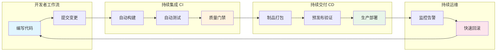
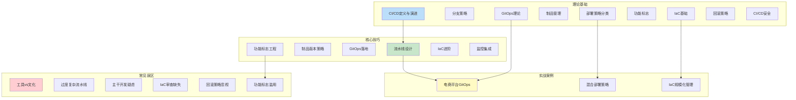
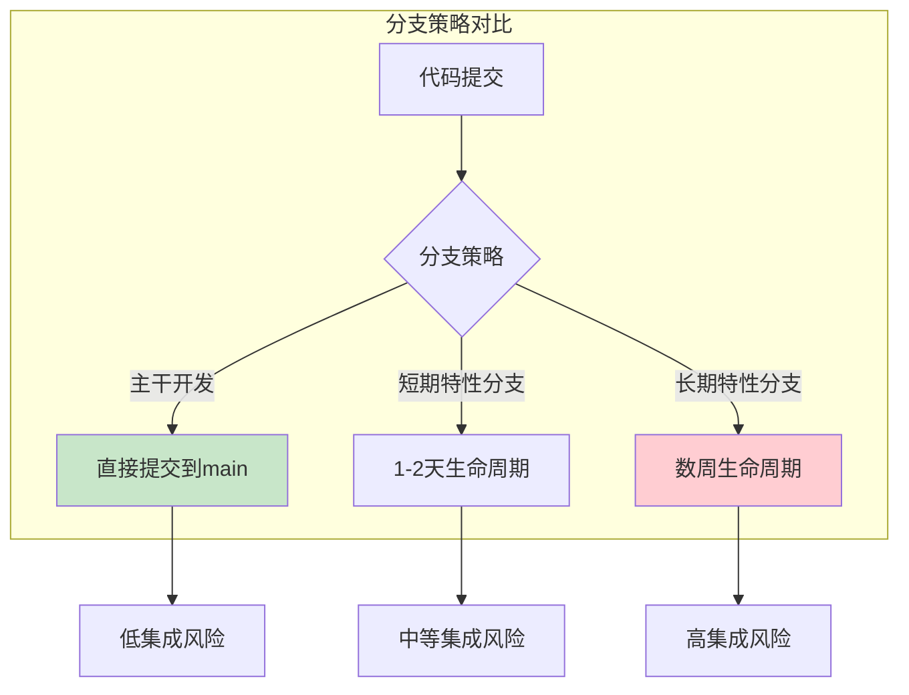
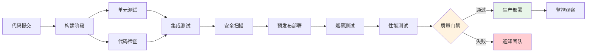
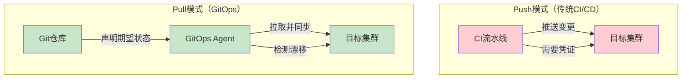
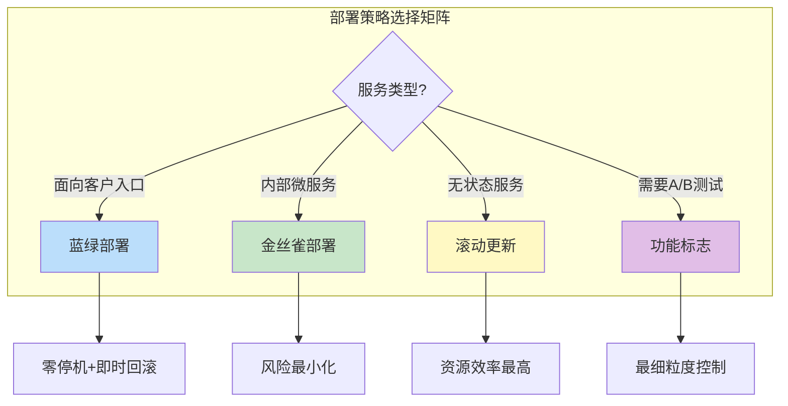
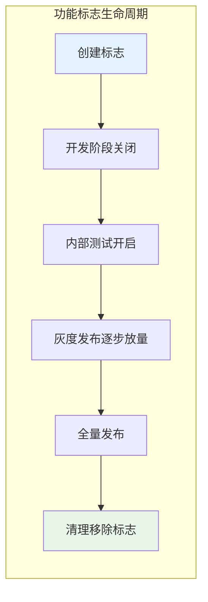
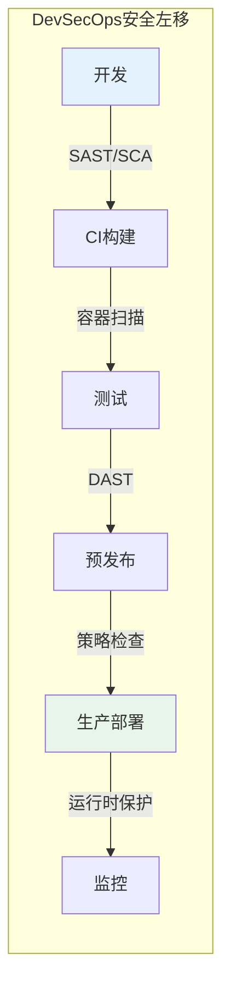
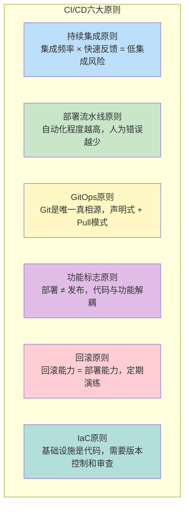

# 第46章 CI/CD：持续集成与持续部署

***

## 章节定位

CI/CD（持续集成与持续部署）是现代软件工程的核心实践，它将代码变更从开发者的工作站安全、快速地交付到生产环境。本章系统性地探讨CI/CD的理论基础、工程实践与高级策略，帮助读者构建企业级的持续交付能力。



***

## 核心内容概览

**持续集成（CI）** 是本章的起点。我们将深入探讨主干开发（Trunk-Based Development）与功能分支策略的权衡，分析不同的代码合并策略（merge、rebase、squash）对代码历史和团队协作的影响。持续集成不仅仅是自动化构建，更是一种开发文化——频繁集成、快速反馈、保持主干始终可发布。

**持续部署（CD）** 将构建产物从开发环境推向生产环境。我们将详细剖析部署流水线的各个阶段：构建、测试、打包、预发布验证、生产部署。制品管理（Artifact Management）确保每一次构建都是可追溯、可复现的，我们将介绍Docker镜像仓库、Nexus、Harbor等工具的最佳实践。

**GitOps** 代表了基础设施管理的范式转变。通过声明式基础设施和Git作为唯一真相源，ArgoCD和Flux等工具实现了Kubernetes集群的自动化管理。我们将深入分析GitOps的工作原理、Pull模式与Push模式的区别，以及如何在企业中落地GitOps。

**部署策略** 是保证服务可用性的关键。蓝绿部署通过维护两套完整环境实现零停机切换；金丝雀部署通过逐步扩大流量比例来降低发布风险；滚动更新则在资源效率与安全性之间取得平衡。每种策略都有其适用场景和实施要点。

**功能标志（Feature Flags）** 将代码部署与功能发布解耦。通过LaunchDarkly、Unleash等平台，团队可以在不重新部署的情况下控制功能的可见性，实现暗发布（Dark Launch）、A/B测试和渐进式发布。

**基础设施即代码（IaC）** 将基础设施纳入版本控制。Terraform以其声明式语法和多云支持成为行业标准，Pulumi则允许开发者使用熟悉的编程语言定义基础设施。我们将对比两者的设计理念和适用场景。

**回滚策略** 是发布安全的最后防线。我们将探讨数据库变更的回滚挑战、蓝绿切换的快速回滚、以及基于功能标志的即时回滚等实践。

***

## 学习目标

完成本章学习后，读者应能：

1. 理解CI/CD的核心理念和工程文化，区分持续集成、持续交付与持续部署的边界
2. 设计和实施完整的CI/CD流水线，包括构建、测试、安全扫描、制品管理和部署阶段
3. 选择适合团队规模和业务特点的开发分支策略，掌握主干开发与功能分支的权衡
4. 运用GitOps管理云原生基础设施，实现声明式配置管理和漂移自动修复
5. 掌握蓝绿部署、金丝雀部署、滚动更新等多种部署策略的实施要点
6. 通过功能标志实现代码部署与功能发布的解耦，支持渐进式发布和快速回滚
7. 使用Terraform/Pulumi等IaC工具管理基础设施，实现基础设施的版本控制和代码审查
8. 建立CI/CD安全实践，包括秘密管理、供应链安全和策略即代码

***

## 本章结构



| 小节 | 主题 | 核心内容 |
|------|------|----------|
| 46.1 | 持续集成理论根基 | 主干开发vs功能分支、合并策略、信息论视角 |
| 46.2 | 持续部署流水线模型 | DAG模型、构建/测试/安全/预发布阶段设计 |
| 46.3 | GitOps声明式管理 | Pull模式、ArgoCD/Flux、漂移检测 |
| 46.4 | 部署策略分类与对比 | 蓝绿/金丝雀/滚动更新/A/B测试 |
| 46.5 | 功能标志与发布解耦 | 标志类型、生命周期管理、工具选型 |
| 46.6 | 基础设施即代码 | Terraform/Pulumi、声明式vs命令式 |
| 46.7 | 回滚策略与发布安全 | 基础设施回滚、数据库回滚、功能标志回滚 |
| 46.8 | CI/CD安全实践 | DevSecOps、秘密管理、供应链安全、OPA |
| 46.9 | CI/CD成熟度模型 | 五级成熟度、DORA四大指标、自我评估 |
| 46.10 | 流水线设计最佳实践 | 分层反馈、构建缓存、环境一致性 |
| 46.11 | 制品管理与版本策略 | 不可变制品、Promotion流程、SBOM |
| 46.12 | GitOps落地实践 | 环境分层、渐进式采用、多集群管理 |
| 46.13 | 功能标志工程实践 | 命名规范、安全清理、组合测试 |
| 46.14 | IaC进阶技巧 | 模块化设计、漂移检测、状态安全 |
| 46.15 | 监控与告警集成 | 部署标记、自动回滚信号、告警疲劳防护 |
| 46.16-46.18 | 实战案例 | 电商平台GitOps、混合部署、IaC规模化 |
| 46.19-46.24 | 常见误区 | 六大反模式与纠正方法 |
| 46.25-46.29 | 练习方法 | 五个渐进式实操练习 |
| 46.30 | 本章小结 | 核心回顾、DORA指标、延伸阅读 |

***

# 第46章 CI/CD 理论基础

***

## 46.1 持续集成的理论根基

持续集成（Continuous Integration，简称CI）的核心思想可以追溯到极限编程（Extreme Programming）运动。其基本假设是：代码集成的频率越高，每次集成的风险就越小，发现和修复问题的成本就越低。这一假设在实践中被反复验证，成为了现代软件工程的基本共识。

从信息论的角度来看，持续集成减少了系统在分叉状态下的时间窗口。当多个开发者在各自的分支上独立工作时，每一条分支都代表着系统状态的一个可能分叉。分支存在的时间越长，各分叉之间的差异就越大，集成时的不确定性也就越高。持续集成通过缩短分支的生命周期，将这种不确定性控制在可管理的范围内。



### 主干开发（Trunk-Based Development）

主干开发是持续集成最纯粹的实践形式。在主干开发模式下，所有开发者直接向主干（main/master）分支提交代码，或者使用生命周期极短的特性分支（通常不超过一两天）。这种模式的优势在于它从根本上消除了长期分支带来的集成风险。

然而，主干开发对团队的工程实践提出了很高的要求：

- **完善的自动化测试套件** 是必须的，因为任何一次提交都可能直接影响主干的稳定性
- **代码审查需要快速完成**，通常在提交后数小时内
- **特性标志（Feature Flags）机制** 使得未完成的功能可以安全地合入主干
- **增量编译和测试选择性执行** 将构建时间控制在合理范围内

Google、Facebook、Microsoft等拥有数万名工程师的公司都在使用主干开发模式。大型团队从主干开发中获得的收益更大——更多的人在更多分支上工作时，长期分支带来的集成风险呈指数增长。

### 功能分支工作流（Feature Branch Workflow）

与主干开发相对的是功能分支工作流。在这种模式下，每个新功能在独立的分支上开发，直到功能完成并通过审查后才合入主干。功能分支的优势在于隔离性好——每个功能的开发不会影响主干的稳定性；但它也带来了显著的集成风险：分支存在的时间越长，与主干的差异越大，合并冲突越复杂，集成测试的结果越不可预测。

GitHub Flow和GitLab Flow是功能分支工作流的两种流行变体。GitHub Flow更接近主干开发——它只使用main分支和短期特性分支，所有变更通过Pull Request合入main。GitLab Flow增加了环境分支（如staging、production），适合需要多环境管理的团队。

### 代码合并策略

代码合并策略对代码历史的可读性和可追溯性有深远影响。三种主要策略的对比如下：

| 策略 | 历史形态 | 优点 | 缺点 | 适用场景 |
|------|----------|------|------|----------|
| **Merge Commit** | 保留完整分支历史 | 完整的开发轨迹，便于追溯 | 历史可能较混乱 | 需要完整审计追踪的团队 |
| **Rebase** | 线性提交历史 | 历史清晰，便于bisect | 改写哈希值，多人协作易冲突 | 小团队、短生命周期分支 |
| **Squash Merge** | 每个PR一个提交 | 主干历史极简，易于阅读 | 丢失开发过程细节 | 开放源码、PR为单位的审查 |

每种策略都有其适用场景，团队需要根据项目的规模、团队的协作模式和代码审查的需求做出选择。

***

## 46.2 持续部署的流水线模型

持续部署（Continuous Deployment，简称CD）的流水线模型可以用一个有向无环图（DAG）来表示：节点代表流水线的各个阶段（stage），边代表阶段之间的依赖关系。



### 构建阶段（Build Stage）

构建阶段负责将源代码编译为可执行的制品。对于编译型语言（如Go、Rust、Java），这个阶段生成二进制文件或JAR包；对于解释型语言（如Python、JavaScript），这个阶段主要进行依赖安装和代码打包；对于容器化应用，这个阶段生成Docker镜像。

构建阶段的关键原则是**确定性**——相同的源代码输入必须产生相同的制品输出。这要求依赖版本被精确锁定（lockfile），构建环境被容器化或虚拟化。

### 测试阶段（Test Stage）

测试阶段是质量保证的核心。它通常包含多个子阶段：

- **单元测试** 验证单个组件的正确性，运行速度最快，覆盖面最广
- **集成测试** 验证组件之间的交互是否符合预期
- **端到端测试** 从用户的角度验证系统的整体行为

测试金字塔理论建议大量快速的单元测试、适量的集成测试和少量的关键端到端测试。在CI/CD流水线中，测试阶段应该尽可能快地提供反馈，因此测试的并行化和选择性执行（只运行受代码变更影响的测试）是常见的优化手段。

### 安全扫描阶段（Security Stage）

在DevSecOps理念下，安全扫描成为流水线的标准组成部分：

- **静态应用安全测试（SAST）** 在不运行代码的情况下分析源代码中的安全漏洞
- **软件成分分析（SCA）** 检查项目依赖中已知的安全漏洞
- **容器镜像扫描** 检查基础镜像和系统库中的CVE（Common Vulnerabilities and Exposures）
- **动态应用安全测试（DAST）** 在运行时对应用进行安全探测

### 预发布阶段（Staging Stage）

预发布阶段在尽可能接近生产环境的环境中验证制品的行为。这个阶段通常包括部署到预发布集群、运行烟雾测试（Smoke Tests）、执行性能基准测试和混沌工程实验。预发布环境的配置应该与生产环境保持一致，包括基础设施规模、网络拓扑和外部依赖的mock。

### 制品管理（Artifact Management）

制品仓库（如Nexus、JFrog Artifactory、Harbor）存储构建过程产生的所有制品，并提供版本管理、元数据标注、依赖解析和访问控制功能。制品的**不可变性**是关键原则——一旦制品被发布到仓库，它就不应该被修改。任何变更都应该通过新的构建产生新的制品版本。这确保了从开发到生产的全链路可追溯性：生产环境运行的每一个二进制文件都可以追溯到特定的代码提交和构建过程。

### 语义化版本（Semantic Versioning）

语义化版本为制品版本号提供了语义基础。MAJOR.MINOR.PATCH格式中：

- **MAJOR版本变更** 表示不兼容的API变更
- **MINOR版本变更** 表示向后兼容的功能新增
- **PATCH版本变更** 表示向后兼容的问题修复

在CI/CD流水线中，版本号的自动生成是常见的需求：基于Git标签自动生成版本号（如`v1.2.3`），或者使用基于提交哈希的唯一标识符（如`abc1234`）。

***

## 46.3 GitOps：声明式基础设施管理

GitOps是由Weaveworks在2017年提出的一种操作模型，其核心理念是：Git仓库是系统的唯一真相源（Single Source of Truth），所有对系统的变更都通过Git提交来驱动。这一理念将版本控制、代码审查、审计追踪等软件工程最佳实践引入了基础设施管理领域。



### 声明式与Pull模式

GitOps的架构可以用声明式（Declarative）和Pull模式（Pull-based）两个维度来理解。

**声明式** 意味着我们描述系统的期望状态（desired state），而不是描述达到该状态的操作步骤。例如，在Kubernetes中，一个Deployment的YAML文件声明了"运行3个Nginx副本"，而不是"创建第一个副本、创建第二个副本、创建第三个副本"。声明式描述使得系统状态的管理变得幂等——无论当前状态如何，应用声明式描述后的结果都是相同的。

**Pull模式** 是GitOps与传统CI/CD的关键区别。在传统的Push模式中，CI/CD流水线在构建完成后主动将变更推送到目标环境。这要求CI系统拥有目标环境的凭证，增加了安全风险。在Pull模式中，部署在目标环境内部的代理（Agent）持续监控Git仓库的状态，当检测到期望状态与实际状态不一致时，自动拉取变更并应用。这种模式不仅消除了外部系统对目标环境的直接访问需求，还天然支持**漂移检测（Drift Detection）**——当有人在集群中手动修改了资源时，代理会检测到漂移并自动恢复到Git中声明的状态。

### ArgoCD

ArgoCD是目前最流行的GitOps工具之一。它运行在Kubernetes集群内部，支持多种配置管理工具（Helm、Kustomize、Jsonnet、plain YAML），并提供了直观的Web UI来可视化应用的同步状态。

ArgoCD的核心概念包括：

- **Application** 定义了Git仓库路径与Kubernetes集群目标之间的映射关系
- **Sync Policy** 定义了自动同步还是手动同步
- **Health Assessment** 持续监控应用的健康状态
- **Project** 实现多租户隔离，控制可以部署的应用和目标集群

```yaml
# ArgoCD Application 示例
apiVersion: argoproj.io/v1alpha1
kind: Application
metadata:
  name: my-app
  namespace: argocd
spec:
  project: default
  source:
    repoURL: https://github.com/org/k8s-manifests.git
    targetRevision: HEAD
    path: apps/my-app/overlays/production
  destination:
    server: https://kubernetes.default.svc
    namespace: my-app
  syncPolicy:
    automated:
      prune: true
      selfHeal: true
    syncOptions:
      - CreateNamespace=true
```

### Flux

Flux是另一个重要的GitOps工具，它采用了组件化的设计。Flux由Source Controller、Kustomize Controller、Helm Controller、Notification Controller和Image Automation Controller等组件组成，每个组件负责GitOps工作流的一个特定方面。Flux的优势在于其高度的可组合性和与CNCF生态系统的深度集成。

### GitOps工具对比

| 特性 | ArgoCD | Flux |
|------|--------|------|
| 架构 | 单体应用，Web UI内置 | 组件化，CLI优先 |
| 多集群管理 | ApplicationSet控制器 | Kustomization引用 |
| Helm支持 | 原生支持 | HelmRelease CRD |
| RBAC | 内置项目级RBAC | 依赖Kubernetes RBAC |
| 通知集成 | Notification Controller | Notification Controller |
| 适用场景 | 需要可视化管理的团队 | 偏好CLI和GitOps纯度的团队 |

***

## 46.4 部署策略分类与对比

部署策略的选择直接影响系统的可用性、发布风险和资源成本。不同的部署策略在这些维度之间做出了不同的权衡。



### 蓝绿部署（Blue-Green Deployment）

蓝绿部署维护两套完全相同的生产环境——蓝色环境和绿色环境。在任何时刻，只有一套环境接收生产流量。当新版本准备好时，它被部署到非活跃环境，经过充分验证后，通过负载均衡器或DNS切换将流量导向新环境。

```nginx
# Nginx 蓝绿切换配置示例
upstream backend {
    # 当前活跃环境（蓝色）
    server blue-app-1:8080;
    server blue-app-2:8080;
    
    # 绿色环境（待切换）
    # server green-app-1:8080;
    # server green-app-2:8080;
}
```

蓝绿部署的核心优势是零停机部署和即时回滚——如果新版本出现问题，只需将流量切回旧环境即可。但它的缺点也很明显：需要双倍的基础设施资源，且数据库迁移等有状态操作的切换比较复杂。

### 金丝雀部署（Canary Deployment）

金丝雀部署采用渐进式策略：新版本首先只接收一小部分流量（如1%或5%），在确认新版本稳定后逐步增加流量比例，直到完全替换旧版本。金丝雀部署的核心优势在于它将发布风险控制在最小范围内——即使新版本有严重问题，也只有少量用户受到影响。

Istio服务网格提供了强大的流量管理能力，可以轻松实现金丝雀部署：

```yaml
# Istio VirtualService 金丝雀路由
apiVersion: networking.istio.io/v1beta1
kind: VirtualService
metadata:
  name: my-app
spec:
  hosts:
    - my-app.example.com
  http:
    - route:
        - destination:
            host: my-app
            subset: stable
          weight: 90
        - destination:
            host: my-app
            subset: canary
          weight: 10
```

### 滚动更新（Rolling Update）

滚动更新是Kubernetes的默认部署策略。它逐个（或逐批）替换旧版本的Pod，直到所有Pod都运行新版本。滚动更新的资源效率最高——不需要额外的基础设施资源——但它的缺点是部署过程中新旧版本会同时运行，需要确保两个版本之间的兼容性。Kubernetes通过`maxSurge`和`maxUnavailable`参数控制滚动更新的行为。

### A/B测试（A/B Testing）

A/B测试虽然严格来说不是一种部署策略，但它与金丝雀部署共享相似的流量分割机制。A/B测试的目标不是验证新版本的稳定性，而是比较不同版本的业务指标（如转化率、用户参与度等），从而做出数据驱动的产品决策。

### 部署策略综合对比

| 维度 | 蓝绿部署 | 金丝雀部署 | 滚动更新 | 功能标志 |
|------|----------|------------|----------|----------|
| **资源开销** | 2x基础设施 | 1x+少量额外 | 1x | 1x |
| **停机时间** | 零 | 零 | 零 | 零 |
| **回滚速度** | 秒级（DNS切换） | 秒级（权重调整） | 分钟级（rollout undo） | 秒级（关闭标志） |
| **风险控制** | 中（全量切换） | 高（渐进式） | 中（逐批替换） | 极高（按用户粒度） |
| **实施复杂度** | 中 | 高 | 低 | 中 |
| **适用场景** | API网关、核心入口 | 内部微服务 | 无状态通用服务 | 需要A/B测试的场景 |
| **数据库兼容** | 需扩展-收缩模式 | 需向后兼容 | 需向后兼容 | 无影响 |

***

## 46.5 功能标志与发布解耦

功能标志（Feature Flags，也称为Feature Toggles）是一种将代码部署与功能发布解耦的技术模式。通过在代码中引入条件判断，开发者可以在不重新部署的情况下控制功能的可见性。

Martin Fowler将功能标志分为几种类型：

- **发布标志（Release Flags）** 控制未完成功能的可见性，生命周期短（随功能发布而移除）
- **实验标志（Experiment Flags）** 用于A/B测试，比较不同版本的业务指标
- **运维标志（Ops Flags）** 用于控制运行时行为（如降级开关、限流阈值）
- **权限标志（Permission Flags）** 用于控制特定用户群体的功能访问（如Beta用户、企业客户）



### 功能标志的生命周期管理

功能标志的生命周期管理是一个容易被忽视但至关重要的问题。每个功能标志都有其创建、活跃和清理三个阶段。如果不及时清理已经完全发布的标志，代码库中会积累大量的条件分支，增加代码的复杂性和测试的难度。

```python
# 功能标志服务抽象
class FeatureFlagService:
    def __init__(self, provider):
        self.provider = provider  # LaunchDarkly, Unleash, etc.
    
    def is_enabled(self, flag_key: str, user_context: dict = None) -> bool:
        """检查功能标志是否对指定用户启用"""
        return self.provider.evaluate(flag_key, user_context)
    
    def get_variant(self, flag_key: str, user_context: dict = None) -> str:
        """获取多变量功能标志的变体"""
        return self.provider.evaluate_variant(flag_key, user_context)


# 使用示例
class OrderService:
    def __init__(self, flags: FeatureFlagService):
        self.flags = flags
    
    def create_order(self, user, items):
        order = Order(user, items)
        
        # 检查是否启用新的订单处理流程
        if self.flags.is_enabled("new-order-flow", {"user_id": user.id}):
            order = self._process_with_new_flow(order)
        else:
            order = self._process_with_legacy_flow(order)
        
        return order
```

### 功能标志平台对比

**LaunchDarkly** 是商业功能标志平台的代表，它提供了丰富的SDK支持、细粒度的用户分群、实时的标志更新和完善的审计日志。

**Unleash** 是开源替代方案，它提供了核心的功能标志功能，并支持通过插件扩展。

两者的架构设计都遵循了一个共同原则：功能标志的评估应该尽可能快（微秒级别），不应该成为请求处理的关键路径。

| 特性 | LaunchDarkly | Unleash | Flagsmith | Flipt |
|------|-------------|---------|-----------|-------|
| 开源 | 否 | 是（Apache 2.0） | 是（BSD 3） | 是（MIT） |
| 部署方式 | SaaS | 自托管/SaaS | 自托管/SaaS | 自托管 |
| 用户分群 | 极其丰富 | 基础+插件扩展 | 中等 | 基础 |
| A/B测试 | 内置 | 需集成 | 基础 | 基础 |
| 审计日志 | 完善 | 企业版 | 完善 | 基础 |
| 适用规模 | 大型企业 | 中小到大型 | 中小型 | 小型 |

***

## 46.6 基础设施即代码

基础设施即代码（Infrastructure as Code，IaC）是一种将基础设施的配置和管理完全通过代码来实现的实践。IaC的核心价值在于：

- **可重复性** ——相同的代码产生相同的基础设施
- **可追溯性** ——基础设施的变更通过Git历史记录
- **可测试性** ——基础设施代码可以像应用代码一样进行测试
- **自文档化** ——代码本身就是最好的文档

### Terraform

Terraform是目前最流行的IaC工具，由HashiCorp开发。它使用HCL（HashiCorp Configuration Language）作为配置语言，支持包括AWS、Azure、GCP在内的几乎所有主流云平台。

```hcl
# Terraform 模块示例：可复用的Web应用基础设施
module "web_app" {
  source = "./modules/web-app"
  
  app_name    = "order-service"
  environment = "production"
  
  instance_type = "t3.medium"
  min_capacity  = 3
  max_capacity  = 10
  
  vpc_id     = module.networking.vpc_id
  subnet_ids = module.networking.private_subnet_ids
  
  tags = {
    Team        = "platform"
    CostCenter  = "engineering"
    ManagedBy   = "terraform"
  }
}
```

Terraform的核心工作流程包括：

- `terraform init` 初始化工作目录，下载Provider和模块
- `terraform plan` 生成执行计划，展示将要进行的变更
- `terraform apply` 执行变更
- `terraform destroy` 销毁管理的资源

Terraform的状态管理是一个需要注意的问题。状态文件（terraform.tfstate）记录了Terraform管理的资源与实际云资源之间的映射关系。在团队协作环境中，状态文件必须存储在远程后端（如S3、Consul、Terraform Cloud），并启用状态锁以防止单并发操作导致的状态冲突。

### Pulumi

Pulumi代表了IaC的另一种设计理念。与Terraform的DSL方式不同，Pulumi允许开发者使用通用编程语言（如TypeScript、Python、Go、C#）来定义基础设施。这意味着开发者可以利用编程语言的所有特性——循环、条件、函数抽象、类型系统、IDE自动补全、单元测试框架——来管理基础设施。

```python
# Pulumi 示例：使用Python定义AWS基础设施
import pulumi
import pulumi_aws as aws

# 创建VPC
vpc = aws.ec2.Vpc("main-vpc",
    cidr_block="10.0.0.0/16",
    tags={"Name": "production-vpc"}
)

# 创建ECS集群
cluster = aws.ecs.Cluster("app-cluster",
    settings=[aws.ecs.ClusterSettingArgs(
        name="containerInsights",
        value="enabled"
    )]
)

# 使用循环创建多个服务
services = ["order-service", "payment-service", "inventory-service"]
for svc_name in services:
    aws.ecs.Service(svc_name,
        cluster=cluster.arn,
        desired_count=3,
        launch_type="FARGATE",
    )
```

### 声明式 vs 命令式

声明式 vs 命令式是理解IaC工具设计哲学的关键维度：

- **Terraform** 采用声明式方法——你描述期望的最终状态，Terraform负责计算从当前状态到期望状态的变更步骤
- **Pulumi** 虽然使用编程语言，但其核心也是声明式的——你仍然在描述期望状态，只是用了更灵活的语法
- **命令式方法**（如使用AWS SDK编写脚本）则要求你显式地描述每一个操作步骤，这使得代码更难维护和推理

### IaC工具对比

| 特性 | Terraform | Pulumi | CloudFormation | Ansible |
|------|-----------|--------|----------------|---------|
| 语言 | HCL | TS/Python/Go/C# | JSON/YAML | YAML |
| 部署模型 | Pull | Pull | Push | Push |
| 状态管理 | 远程后端 | Pulumi Cloud | CloudFormation栈 | 无状态 |
| 多云支持 | 优秀 | 优秀 | 仅AWS | 通用 |
| 学习曲线 | 中等 | 低（已有编程语言经验） | 中等 | 低 |
| 漂移检测 | `plan` | `preview` | Stack Drift | 无内置 |

***

## 46.7 回滚策略与发布安全

回滚是发布安全的最后防线。一个成熟的CI/CD体系必须包含完善的回滚机制，以应对新版本引入的缺陷。回滚能力的高低直接决定了团队发布新功能的信心——没有可靠的回滚，团队会变得保守，发布频率下降，最终影响产品竞争力。

### 基础设施级别的回滚

基础设施级别的回滚最为简单直接，是所有回滚策略的基础：

- **蓝绿部署回滚**：将负载均衡器或DNS切回旧环境即可，响应时间在秒级。这是最可靠的回滚方式，因为旧环境在切换后仍然保持运行状态，不需要重新启动或预热
- **Kubernetes滚动更新回滚**：`kubectl rollout undo deployment/<name>`命令可以快速回滚到上一个版本。通过`kubectl rollout history deployment/<name>`查看历史版本，使用`--to-revision=N`回滚到指定版本
- **金丝雀部署回滚**：将新版本的流量权重设为0即可完成回滚，同时保留旧版本的运行实例，避免重新部署的时间开销

```bash
# Kubernetes 滚动更新回滚示例
kubectl rollout undo deployment/order-service
# 查看回滚状态
kubectl rollout status deployment/order-service
# 回滚到指定版本
kubectl rollout undo deployment/order-service --to-revision=3
# 查看历史版本
kubectl rollout history deployment/order-service
```

### 回滚策略选择决策树

不同的部署场景需要不同的回滚策略。以下决策框架可以帮助团队选择最合适的回滚方案：

| 场景特征 | 推荐回滚策略 | 响应时间 | 适用工具 |
|----------|-------------|---------|---------|
| 有状态服务（数据库Schema变更） | 扩展-收缩模式 | 分钟~小时 | Flyway/Liquibase |
| 无状态服务+蓝绿部署 | 环境切换 | 秒级 | ALB/DNS切换 |
| 无状态服务+滚动更新 | rollout undo | 分钟级 | kubectl/Helm |
| 微服务+金丝雀部署 | 权重归零 | 秒级 | Istio/Nginx |
| 新功能引入bug | 功能标志关闭 | 秒级 | LaunchDarkly/Unleash |
| 配置变更导致异常 | Git回滚commit | 分钟级 | ArgoCD/Flux |
| 依赖服务故障 | 降级开关 | 秒级 | 功能标志 |

### 数据库变更的回滚

数据库变更的回滚是CI/CD领域最复杂的挑战之一。与应用代码不同，数据库变更具有不可逆性——删除的数据无法恢复，修改的Schema需要特殊处理。

#### 扩展-收缩（Expand-Contract）模式

扩展-收缩模式是处理破坏性数据库变更的标准方法，其核心思想是将一个破坏性变更分解为多个向后兼容的步骤：

**第一步：扩展阶段（Expand）**——添加新的列或表，而不删除旧的。例如，将`full_name`列拆分为`first_name`和`last_name`时，首先添加两个新列：

```sql
-- 第一步：扩展 - 添加新列
ALTER TABLE users ADD COLUMN first_name VARCHAR(100);
ALTER TABLE users ADD COLUMN last_name VARCHAR(100);

-- 将现有数据复制到新列
UPDATE users SET first_name = SPLIT_PART(full_name, ' ', 1),
                  last_name = SPLIT_PART(full_name, ' ', 2);
```

**第二步：过渡阶段（Transition）**——部署一个能同时读写新旧两列的应用版本。旧代码继续使用`full_name`，新代码使用`first_name`和`last_name`。两个版本可以共存运行：

```python
# 过渡版本：同时支持新旧两种字段
class UserService:
    def get_user_name(self, user):
        # 优先使用新字段
        if user.first_name and user.last_name:
            return f"{user.first_name} {user.last_name}"
        # 回退到旧字段
        return user.full_name
    
    def update_user_name(self, user, first_name, last_name):
        # 同时更新新旧两列
        user.first_name = first_name
        user.last_name = last_name
        user.full_name = f"{first_name} {last_name}"
```

**第三步：收缩阶段（Contract）**——确认所有应用代码都已使用新字段后，删除旧列：

```sql
-- 第三步：收缩 - 删除旧列
ALTER TABLE users DROP COLUMN full_name;
```

#### 数据库回滚的常见陷阱

- **自增ID的不连续性**：回滚后重新插入数据可能导致ID冲突，使用UUID或分布式ID生成器可以避免
- **数据类型的不兼容**：从`VARCHAR(255)`改为`TEXT`容易回滚，但从`TEXT`改回`VARCHAR(255)`可能截断数据
- **索引的重建时间**：大规模表的索引重建可能需要数小时，回滚时需要评估时间成本
- **外键约束的连锁反应**：修改被引用的表可能影响所有引用它的表，回滚需要考虑全局影响

### 功能标志回滚

功能标志回滚是最快速的回滚方式，也是推荐的首选回滚策略。当新版本的功能出现问题时，只需关闭对应的功能标志，而无需触发完整的部署回滚流程。这种方式的响应时间可以从分钟级缩短到秒级。

```python
# 功能标志驱动的快速回滚示例
class OrderService:
    def __init__(self, flag_service, metrics):
        self.flags = flag_service
        self.metrics = metrics
    
    def create_order(self, user, items):
        # 通过功能标志控制新流程
        if self.flags.is_enabled("new-order-flow", {"user_id": user.id}):
            try:
                return self._new_flow(user, items)
            except Exception as e:
                # 新流程失败时自动降级到旧流程
                self.metrics.increment("new_flow_error")
                return self._legacy_flow(user, items)
        return self._legacy_flow(user, items)

# 紧急回滚：只需在功能标志平台关闭 new-order-flow
# 所有用户自动回退到旧流程，无需重新部署
```

功能标志回滚的最佳实践：
- 每个功能标志都应该有对应的降级路径——标志关闭时系统应该回到已知的稳定状态
- 功能标志的回滚应该是原子的——一个标志的关闭不应该导致其他功能异常
- 回滚后应该立即触发告警通知相关团队，以便调查根因

### 发布节奏与风险控制

发布节奏与风险控制密切相关：

- **高频发布**（每天多次）的优势在于每次变更的范围小，问题的定位和回滚都更容易。但高频发布对自动化程度和团队能力有很高的要求
- **低频发布**（每周或每月）的每次变更范围大，集成风险高，但在某些受监管的行业（如金融、医疗）可能是必要的合规要求

#### 回滚演练制度

一个成熟的团队应该建立定期的回滚演练制度，而不是等到真正需要回滚时才发现流程有问题。建议的实践：

- **月度回滚演练**：每月选择一个非核心服务，模拟故障场景并执行回滚流程，记录整个过程的时间和遇到的问题
- **混沌工程集成**：使用Chaos Monkey或LitmusChaos等工具在生产环境的非核心服务上主动注入故障，验证回滚机制的有效性
- **回滚Runbook**：为每个服务编写详细的回滚操作手册（Runbook），包含回滚步骤、注意事项和联系人信息

```python
# 功能标志驱动的渐进式发布与快速回滚
class ProgressiveRollout:
    def __init__(self, flag_service, monitoring):
        self.flag_service = flag_service
        self.monitoring = monitoring
    
    async def rollout(self, flag_key: str, stages: list[float]):
        """渐进式发布：逐步增加功能标志的覆盖比例"""
        for percentage in stages:
            await self.flag_service.set_percentage(flag_key, percentage)
            
            # 观察当前阶段的关键指标
            await asyncio.sleep(self.observation_window)
            
            metrics = await self.monitoring.get_metrics(flag_key)
            
            if metrics.error_rate > self.error_threshold:
                await self.flag_service.disable(flag_key)
                await self.notify_rollback(flag_key, percentage, metrics)
                return False
            
            if metrics.latency_p99 > self.latency_threshold:
                await self.flag_service.disable(flag_key)
                await self.notify_rollback(flag_key, percentage, metrics)
                return False
        
        return True
```

### 发布节奏与风险控制

发布节奏与风险控制密切相关：

- **高频发布**（每天多次）的优势在于每次变更的范围小，问题的定位和回滚都更容易。但高频发布对自动化程度和团队能力有很高的要求
- **低频发布**（每周或每月）的每次变更范围大，集成风险高，但在某些受监管的行业（如金融、医疗）可能是必要的合规要求

***

## 46.8 CI/CD中的安全实践

DevSecOps将安全左移到开发和CI/CD阶段，而不是在发布后才进行安全审查。



### 秘密管理（Secret Management）

秘密管理确保敏感信息（API密钥、数据库密码、TLS证书）不会以明文形式出现在代码仓库或CI配置中。HashiCorp Vault、AWS Secrets Manager、Azure Key Vault等工具提供了安全的秘密存储和动态秘密生成功能。

最佳实践包括：

- 使用CI系统的秘密变量存储敏感信息，不要硬编码在workflow文件中
- 定期轮换秘密，使用Vault等工具的动态秘密功能
- 限制秘密的访问权限，遵循最小权限原则
- 使用sealed-secrets或external-secrets-operator将Kubernetes秘密纳入GitOps管理

### 供应链安全（Supply Chain Security）

供应链安全关注的是CI/CD流水线本身的安全性：

- **SBOM（Software Bill of Materials）** 记录了软件产品的所有组件及其来源，使得在发现漏洞时能够快速评估影响范围
- **SLSA（Supply-chain Levels for Software Artifacts）** 框架定义了从源代码到制品的完整信任链级别（SLSA 1-4）
- **Sigstore** 提供了制品签名和验证的基础设施，确保制品在传输过程中未被篡改

### 策略即代码（Policy as Code）

策略即代码将安全和合规策略编码为可自动执行的规则。Open Policy Agent（OPA）使用Rego语言定义策略，可以在CI/CD流水线的各个阶段自动检查：容器镜像是否来自可信的注册表？Kubernetes资源是否设置了安全上下文？Terraform配置是否符合成本预算？

```rego
# OPA策略示例：检查容器安全上下文
package kubernetes.admission

deny[msg] {
    input.request.kind.kind == "Pod"
    container := input.request.object.spec.containers[_]
    not container.securityContext.readOnlyRootFilesystem
    msg := sprintf("容器 '%s' 必须设置 readOnlyRootFilesystem", [container.name])
}

deny[msg] {
    input.request.kind.kind == "Pod"
    container := input.request.object.spec.containers[_]
    not container.resources.limits
    msg := sprintf("容器 '%s' 必须设置资源限制", [container.name])
}
```

***

## 46.9 CI/CD成熟度模型

在深入具体实践之前，理解CI/CD的成熟度层次有助于团队评估当前状态并制定改进路线。以下是基于DORA（DevOps Research and Assessment）研究和行业实践总结的五级成熟度模型：

| 级别 | 名称 | 特征 | 关键指标 |
|------|------|------|----------|
| L1 | 初始级 | 手动构建和部署，偶尔使用CI工具 | 部署频率：月级 |
| L2 | 基础级 | 基本CI流水线，自动化测试覆盖<50% | 部署频率：周级 |
| L3 | 进阶级 | 完整CI/CD流水线，自动化测试覆盖>70% | 部署频率：日级 |
| L4 | 高级级 | GitOps、金丝雀部署、功能标志 | 部署频率：多次/天 |
| L5 | 卓越级 | 全自动化、AI辅助决策、混沌工程 | 部署频率：按需 |

### DORA四大关键指标

DORA（DevOps Research and Assessment）通过多年的大规模调研，识别出四个关键指标来衡量软件交付效能：

1. **部署频率（Deployment Frequency）** ——团队多久向生产环境部署一次代码。精英团队可以做到按需部署（每天多次）
2. **变更前置时间（Lead Time for Changes）** ——从代码提交到生产部署的平均时间。精英团队小于一小时
3. **变更失败率（Change Failure Rate）** ——导致服务降级或需要回滚的部署比例。精英团队低于5%
4. **恢复时间（Time to Restore Service）** ——从服务中断到恢复正常运行的时间。精英团队小于一小时

这四个指标之间存在强相关性：高部署频率通常伴随着低变更失败率和短恢复时间，因为频繁的小变更更容易测试、更容易定位问题、更容易回滚。

***

## 本节小结

本节从理论层面系统性地探讨了CI/CD的各个核心概念。持续集成通过频繁的代码集成降低了集成风险；持续部署通过自动化流水线实现了从代码到生产的全链路自动化；GitOps将Git作为唯一真相源，实现了声明式的基础设施管理；多种部署策略为不同的发布场景提供了灵活的选择；功能标志将部署与发布解耦，提供了更细粒度的发布控制；基础设施即代码将基础设施纳入了软件工程的最佳实践；CI/CD安全实践确保整个交付过程的安全性和合规性。理解这些理论基础，是设计和实施高质量CI/CD体系的前提。

***

# 第46章 CI/CD 核心技巧

***

## 46.10 流水线设计最佳实践

设计一条高效的CI/CD流水线需要在速度、可靠性和安全性之间取得平衡。以下技巧基于大量企业级实践总结而成，能够帮助团队构建高质量的持续交付能力。

### 快速反馈是第一优先级

流水线的每个阶段都应该在尽可能短的时间内提供反馈。开发者提交代码后，最关心的是"我的改动是否破坏了什么"。如果这个问题的答案需要等待30分钟甚至更长时间，开发者的工作流会被严重打断，持续集成的文化就难以建立。

```yaml
# GitHub Actions 流水线设计示例：分层反馈
name: CI Pipeline
on: [push, pull_request]

jobs:
  # 第一层：快速反馈（< 2分钟）
  lint-and-format:
    runs-on: ubuntu-latest
    steps:
      - uses: actions/checkout@v4
      - name: Lint
        run: make lint
      - name: Format Check
        run: make format-check

  # 第一层：单元测试（< 5分钟）
  unit-tests:
    runs-on: ubuntu-latest
    strategy:
      matrix:
        shard: [1, 2, 3, 4]  # 测试分片并行
    steps:
      - uses: actions/checkout@v4
      - uses: actions/setup-python@v5
        with:
          python-version: '3.12'
          cache: 'pip'
      - run: pip install -r requirements.txt
      - run: pytest tests/unit --shard=${{ matrix.shard }}/4

  # 第二层：集成测试（< 15分钟）
  integration-tests:
    needs: [lint-and-format, unit-tests]
    runs-on: ubuntu-latest
    services:
      postgres:
        image: postgres:16
        env:
          POSTGRES_PASSWORD: test
        ports: ['5432:5432']
      redis:
        image: redis:7
        ports: ['6379:6379']
    steps:
      - uses: actions/checkout@v4
      - run: pytest tests/integration

  # 第三层：构建与镜像推送
  build:
    needs: [integration-tests]
    runs-on: ubuntu-latest
    steps:
      - uses: actions/checkout@v4
      - uses: docker/build-push-action@v5
        with:
          push: ${{ github.ref == 'refs/heads/main' }}
          tags: registry.example.com/app:${{ github.sha }}
          cache-from: type=gha
          cache-to: type=gha,mode=max
```

快速反馈的核心策略包括：

- 将测试按执行速度分层，快速的单元测试和静态检查放在流水线的最前端
- 利用构建缓存避免重复编译未变更的代码
- 并行执行独立的测试套件和检查任务
- 只运行受代码变更影响的测试（增量测试）

### 构建缓存是性能优化的关键

在大型项目中，从零开始构建可能需要数十分钟。构建缓存可以将重复构建的时间缩短到秒级。Docker的多阶段构建结合BuildKit的缓存挂载（cache mount）可以高效地缓存依赖安装和编译结果。语言级别的缓存工具（如Go的模块缓存、Node.js的node_modules缓存、Python的pip缓存）也应该被充分利用。

### 环境一致性是可靠性的基础

"在我机器上可以运行"是CI/CD领域最常见的问题之一。Docker容器化是解决这个问题的标准方案——将构建环境打包为Docker镜像，确保所有构建步骤在完全相同的环境中执行。对于不需要容器化的场景，Nix和Devbox提供了声明式的环境管理方案。

***

## 46.11 制品管理与版本策略

### 不可变制品原则

不可变制品原则是制品管理的基石。一旦一个制品被构建完成并推送到制品仓库，它就不应该被修改。在Promotion流程中，同一个制品从开发环境到预发布环境再到生产环境，经历的不是重新构建，而是环境配置的切换。这确保了在生产环境中运行的代码与经过测试的代码完全一致。

```yaml
# GitHub Actions：不可变制品的Promotion流程
name: Promote to Production
on:
  workflow_dispatch:
    inputs:
      image_tag:
        description: 'Docker image tag to promote'
        required: true

jobs:
  promote:
    runs-on: ubuntu-latest
    steps:
      - name: Pull and re-tag image
        run: |
          # 从staging仓库拉取，推送到production仓库
          docker pull registry.example.com/app:${{ inputs.image_tag }}
          docker tag registry.example.com/app:${{ inputs.image_tag }} \
                     registry.prod.example.com/app:${{ inputs.image_tag }}
          docker tag registry.example.com/app:${{ inputs.image_tag }} \
                     registry.prod.example.com/app:latest
          docker push registry.prod.example.com/app:${{ inputs.image_tag }}
          docker push registry.prod.example.com/app:latest
```

### Docker镜像的多标签策略

Docker镜像的多标签策略提供了不同的引用粒度：

- 使用Git commit SHA作为标签可以确保精确的可追溯性
- 使用语义化版本号（如v1.2.3）提供人类可读的版本标识
- 使用latest标签指向最新的稳定版本

推荐同时使用多种标签，以满足不同的引用需求。

### SBOM（软件物料清单）

SBOM记录了制品的所有组件及其版本。在CI/CD流水线中自动生成SBOM，可以快速评估供应链漏洞的影响范围。Syft和Docker SBOM是常用的SBOM生成工具，它们支持SPDX和CycloneDX两种标准格式。

***

## 46.12 GitOps落地实践技巧

### 环境分层管理

环境分层管理是GitOps仓库组织的关键决策。推荐的做法是使用Kustomize的overlay机制，将基础配置（base）和环境特定的覆盖配置（overlay）分离：

k8s-manifests/
├── base/
│   ├── kustomization.yaml
│   ├── deployment.yaml
│   ├── service.yaml
│   └── configmap.yaml
└── overlays/
    ├── dev/
    │   ├── kustomization.yaml
    │   └── replica-patch.yaml
    ├── staging/
    │   ├── kustomization.yaml
    │   └── replica-patch.yaml
    └── production/
        ├── kustomization.yaml
        ├── replica-patch.yaml
        └── resource-limits.yaml

### 渐进式GitOps采用

渐进式GitOps采用不需要一开始就覆盖所有基础设施。建议从无状态的应用部署开始，逐步扩展到有状态服务、数据库管理、网络配置等领域。对于已有的手动管理的基础设施，可以使用Terraform Import和kubectl convert等工具逐步迁移到GitOps管理。

### 多集群GitOps

多集群GitOps需要解决配置差异化和集群选择的问题。ArgoCD的ApplicationSet控制器可以基于集群列表自动生成Application定义，实现一对多的部署管理。

***

## 46.13 功能标志的工程实践

### 功能标志的命名规范

功能标志的命名规范对于长期维护至关重要。推荐使用描述性的名称，包含功能领域和具体功能：

- `checkout-new-payment-gateway` 优于 `feature-123`
- `orders-v2-rollout` 优于 `new-orders`

同时建议在代码库中维护一份功能标志的注册表，记录每个标志的用途、负责人和预期清理日期。

### 功能标志的安全清理

功能标志的安全清理是一个容易被忽视但至关重要的运维任务。遗留的功能标志会显著增加代码的复杂度。建议的实践包括：

- 在功能标志的定义处添加注释，说明预期的清理时间和负责人
- 定期审查所有活跃的功能标志
- 使用工具自动检测已完全发布的标志（即所有用户群体都已启用的标志）

### 测试功能标志的组合

测试功能标志的组合是质量保证的挑战。如果系统中有N个功能标志，理论上就有2^N种组合。实际中不可能测试所有组合，但应该测试：

- 所有标志都关闭的基线配置
- 每个标志单独开启的配置
- 所有标志都开启的配置

使用参数化测试可以系统地覆盖这些场景。

***

## 46.14 基础设施即代码进阶技巧

### Terraform模块化设计

Terraform模块化设计是管理大规模基础设施的关键。一个好的模块应该遵循单一职责原则——每个模块管理一类相关的资源。模块之间通过输入变量和输出值进行通信，避免隐式的依赖关系。

```hcl
# Terraform 远程状态引用
data "terraform_remote_state" "networking" {
  backend = "s3"
  config = {
    bucket = "terraform-state-prod"
    key    = "networking/terraform.tfstate"
    region = "us-east-1"
  }
}

module "web_app" {
  source = "./modules/web-app"
  
  vpc_id     = data.terraform_remote_state.networking.outputs.vpc_id
  subnet_ids = data.terraform_remote_state.networking.outputs.private_subnets
}
```

### Terraform工作空间

Terraform工作空间（Workspace）可以管理同一套配置的不同环境实例。但对于环境差异较大的场景，使用目录结构分离（每个环境一个目录）通常比工作空间更清晰、更安全。

### 漂移检测

漂移检测（Drift Detection）是IaC运维的重要组成部分。定期运行`terraform plan`检查实际基础设施与代码声明的状态是否一致。如果检测到漂移，需要判断是代码过时还是有人手动修改了基础设施。GitHub Actions或Jenkins可以设置定时任务自动执行漂移检测。

### 状态文件的安全管理

状态文件的安全管理不容忽视。状态文件包含了基础设施的所有信息，包括可能的敏感数据（如数据库密码、API密钥）。状态文件应该存储在加密的远程后端，访问权限应该严格限制。Terraform的`sensitive`标记可以防止敏感变量在plan输出中泄露，但不能完全替代状态文件本身的加密保护。

***

## 46.15 监控与告警集成

CI/CD流水线不是一个孤立的系统——它需要与监控和告警系统深度集成，形成闭环的反馈机制。

### 部署标记（Deployment Marker）

部署标记在监控系统中标记每次部署的时间点，使得在排查问题时可以快速关联代码变更与系统指标的变化。大多数监控工具（如Datadog、Grafana、New Relic）都支持通过API创建部署标记。

### 自动回滚信号

自动回滚信号基于部署后监控指标的自动判断。设置部署后观察窗口（如5分钟），在此期间持续检查错误率、延迟、CPU使用率等关键指标。如果指标超过预设阈值，自动触发回滚。

```python
# 部署后自动健康检查与回滚
class PostDeployHealthChecker:
    def __init__(self, monitoring_client, deployment_client, config):
        self.monitoring = monitoring_client
        self.deployment = deployment_client
        self.config = config
    
    async def watch_after_deploy(self, service: str, version: str):
        """部署后观察窗口"""
        start_time = datetime.utcnow()
        observation_window = timedelta(minutes=self.config.observation_minutes)
        
        while datetime.utcnow() - start_time < observation_window:
            metrics = await self.monitoring.query(
                service=service,
                time_range=timedelta(minutes=1)
            )
            
            checks = [
                metrics.error_rate < self.config.max_error_rate,
                metrics.latency_p99 < self.config.max_latency_p99,
                metrics.success_rate > self.config.min_success_rate,
            ]
            
            if not all(checks):
                log.warning(f"健康检查失败，触发自动回滚: {service} {version}")
                await self.deployment.rollback(service)
                return False
            
            await asyncio.sleep(30)
        
        log.info(f"部署健康检查通过: {service} {version}")
        return True
```

***

## 本节小结

本节介绍了CI/CD领域的核心工程技巧，涵盖了流水线设计、制品管理、GitOps实践、功能标志工程、基础设施即代码以及监控集成等方面。这些技巧的共同目标是：让代码变更更快、更安全地到达生产环境，同时保持对系统状态的完全掌控。

***

# 第46章 CI/CD 实战案例

***

## 46.16 案例一：电商平台的GitOps落地实践

某中型电商平台拥有约50个微服务，分布在3个Kubernetes集群（开发、预发布、生产）上。在引入GitOps之前，团队使用Jenkins脚本直接向集群推送变更，频繁出现"配置漂移"——生产环境的实际状态与团队预期的状态不一致，且难以追溯变更历史。

**问题诊断** 团队对现有部署流程进行了审计，发现以下核心问题：第一，不同环境之间的配置差异没有统一管理，很多配置是以环境变量的形式硬编码在Jenkins脚本中的。第二，没有统一的配置模板，相似的服务使用不同的配置格式，维护成本高。第三，缺乏漂移检测机制——如果有人通过kubectl手动修改了生产配置，没有任何告警或自动恢复机制。

**方案设计** 团队决定采用ArgoCD + Kustomize的GitOps方案。仓库结构设计如下：一个专门的Git仓库`k8s-manifests`管理所有服务的Kubernetes配置；每个服务在仓库中有自己的目录；使用Kustomize的base/overlay机制管理环境差异。CI流程（GitHub Actions）负责代码构建、测试和镜像推送，CD流程（ArgoCD）负责将配置同步到集群。

**实施过程** 团队采取了渐进式的迁移策略。第一阶段（两周）：选择3个无状态服务作为试点，将它们的Kubernetes配置迁移到Git仓库，配置ArgoCD Application进行自动同步。第二阶段（四周）：将剩余的无状态服务全部迁移到GitOps管理，建立标准化的服务模板。第三阶段（四周）：将有状态服务（Redis、PostgreSQL）的运维配置纳入GitOps管理，但数据库的Schema迁移仍通过CI流水线中的Flyway/Liquibase任务执行。

**关键配置** ArgoCD Application的同步策略经过了仔细设计：

```yaml
# 生产环境的ArgoCD配置
apiVersion: argoproj.io/v1alpha1
kind: Application
metadata:
  name: order-service-prod
  namespace: argocd
  annotations:
    notifications.argoproj.io/subscribe.on-sync-failed.slack: prod-alerts
spec:
  project: production
  source:
    repoURL: https://github.com/company/k8s-manifests.git
    targetRevision: main
    path: services/order-service/overlays/production
  destination:
    server: https://prod-cluster.example.com
    namespace: order-service
  syncPolicy:
    automated:
      prune: true        # 删除Git中已移除的资源
      selfHeal: true     # 检测到漂移时自动恢复
    syncOptions:
      - CreateNamespace=true
      - PrunePropagationPolicy=foreground
      - PruneLast=true   # 先部署新资源，再清理旧资源
  ignoreDifferences:     # 忽略某些字段的自动管理差异
    - group: apps
      kind: Deployment
      jsonPointers:
        - /spec/replicas  # 由HPA管理的副本数
```

**成果** 经过三个月的实施，团队取得了显著的成果：配置漂移事件从每月约15次降至零——所有漂移都被ArgoCD的selfHeal机制自动恢复；部署频率从每周2次提升到每天5-8次——因为GitOps的Pull模式消除了CI系统直接访问集群的安全顾虑；变更的可追溯性大幅提升——每一次生产环境的配置变更都有对应的Git commit和PR记录；新人上手时间从一周缩短到一天——标准化的仓库结构和模板使得新服务的配置变得简单直接。

***

## 46.17 案例二：蓝绿部署与金丝雀部署的混合策略

某金融科技公司的核心支付服务需要在保证99.99%可用性的前提下频繁发布新功能。团队设计了一套混合部署策略：对外部API网关使用蓝绿部署，对内部微服务使用金丝雀部署。

**蓝绿部署的实施** API网关是面向客户的入口，任何变更都直接影响所有用户。团队使用AWS ALB（Application Load Balancer）的Target Group实现蓝绿切换。蓝色和绿色环境分别对应两个Target Group，DNS记录指向当前活跃的Target Group。部署新版本时，先将新版本部署到非活跃环境，运行完整的烟雾测试套件，然后通过修改ALB的Listener Rule将流量切换到新环境。整个切换过程可以在秒级完成，回滚同样是秒级操作。

**金丝雀部署的实施** 内部微服务使用Istio服务网格实现金丝雀部署。每个服务维护两个版本：stable版本和canary版本。部署时，首先将canary版本的流量权重设为5%，然后通过Prometheus监控系统观察关键指标（错误率、延迟、成功率）。如果指标正常，逐步将权重提升到25%、50%，最终到100%。如果在任何阶段检测到异常，立即将canary权重设为0，完成回滚。

**自动化晋级与回滚** 团队开发了一个自动化的金丝雀分析工具，集成Prometheus和Istio：

```python
class CanaryAnalyzer:
    def __init__(self, prometheus_client, istio_client, config):
        self.prom = prometheus_client
        self.istio = istio_client
        self.config = config
    
    async def analyze_canary(self, service: str, namespace: str) -> dict:
        """分析金丝雀版本的健康状态"""
        stable_metrics = await self._query_metrics(
            service, namespace, version="stable", window="5m"
        )
        canary_metrics = await self._query_metrics(
            service, namespace, version="canary", window="5m"
        )
        
        analysis = {
            "error_rate": {
                "stable": stable_metrics.error_rate,
                "canary": canary_metrics.error_rate,
                "delta": canary_metrics.error_rate - stable_metrics.error_rate,
                "pass": canary_metrics.error_rate <= stable_metrics.error_rate * 1.1
            },
            "latency_p99": {
                "stable": stable_metrics.latency_p99,
                "canary": canary_metrics.latency_p99,
                "delta": canary_metrics.latency_p99 - stable_metrics.latency_p99,
                "pass": canary_metrics.latency_p99 <= stable_metrics.latency_p99 * 1.2
            },
            "success_rate": {
                "stable": stable_metrics.success_rate,
                "canary": canary_metrics.success_rate,
                "pass": canary_metrics.success_rate >= stable_metrics.success_rate * 0.99
            }
        }
        
        # 综合判断
        analysis["overall_pass"] = all(
            check["pass"] for check in analysis.values() 
            if isinstance(check, dict) and "pass" in check
        )
        
        return analysis
    
    async def progressive_rollout(self, service: str, namespace: str):
        """渐进式发布"""
        stages = [5, 10, 25, 50, 75, 100]
        
        for weight in stages:
            await self.istio.set_canary_weight(service, namespace, weight)
            log.info(f"金丝雀流量权重调整到: {weight}%")
            
            # 等待观察窗口
            await asyncio.sleep(self.config.observation_seconds)
            
            # 分析健康状态
            analysis = await self.analyze_canary(service, namespace)
            
            if not analysis["overall_pass"]:
                log.warning(f"金丝雀分析失败，回滚: {analysis}")
                await self.istio.set_canary_weight(service, namespace, 0)
                return False
        
        log.info(f"金丝雀发布完成: {service}")
        return True
```

**成果** 混合部署策略使得该团队在保持99.99%可用性的同时，将发布频率从每月1次提升到每周3-4次。蓝绿部署保证了API网关的零停机切换，金丝雀部署使得内部服务的变更风险被控制在最小范围内。自动化分析工具减少了人工判断的延迟，将金丝雀观察窗口从原来的2小时缩短到30分钟。

***

## 46.18 案例三：基础设施即代码的规模化管理

某云原生创业公司从成立之初就采用了"一切皆代码"的原则。所有基础设施——从VPC网络到Kubernetes集群，从数据库实例到DNS记录——全部通过Terraform管理。随着公司规模从10人增长到100人，基础设施代码库从500行增长到20000行，团队在IaC管理方面积累了丰富的经验。

**模块化架构** 团队将Terraform代码分为三层：共享基础层（网络、DNS、IAM）、平台层（Kubernetes集群、数据库、缓存）和应用层（每个服务的基础设施需求）。每一层都封装为Terraform模块，通过输入输出变量与上下层通信。

**工作流管理** 团队使用Atlantis——一个Terraform Pull Request自动化工具。当开发者提交包含Terraform变更的PR时，Atlantis自动运行`terraform plan`，将执行计划作为评论添加到PR中。审查者可以直观地看到变更的具体内容。PR合并后，Atlantis自动执行`terraform apply`。这种工作流确保了所有基础设施变更都经过了代码审查。

**安全与合规** 团队使用OPA（Open Policy Agent）的Conftest工具在CI中检查Terraform配置是否符合安全策略：

```rego
# policy/terraform.rego - 安全策略检查
package main

deny[msg] {
    resource := input.resource_changes[_]
    resource.type == "aws_s3_bucket"
    not resource.change.after.server_side_encryption_configuration
    msg := sprintf("S3 bucket '%s' 必须启用服务端加密", [resource.name])
}

deny[msg] {
    resource := input.resource_changes[_]
    resource.type == "aws_db_instance"
    resource.change.after.publicly_accessible == true
    msg := sprintf("数据库实例 '%s' 不允许公网访问", [resource.name])
}

warn[msg] {
    resource := input.resource_changes[_]
    resource.type == "aws_instance"
    not resource.change.after.tags.CostCenter
    msg := sprintf("EC2实例 '%s' 缺少CostCenter标签", [resource.name])
}
```

**成果** 基础设施的管理效率大幅提升：新环境的搭建从手动操作需要2天缩短到Terraform apply只需15分钟；基础设施的变更可追溯性达到100%——每一次变更都有对应的Git commit；安全合规检查自动化率达到90%以上——大部分策略违规在PR阶段就被拦截。

***

## 本节小结

本节通过三个实战案例展示了CI/CD核心概念在真实企业环境中的应用。GitOps的落地实践展示了如何通过声明式管理消除配置漂移；混合部署策略展示了如何根据不同服务的特点选择合适的部署方式；基础设施即代码的规模化管理展示了如何在团队增长过程中保持基础设施管理的效率和质量。这些案例的共同经验是：CI/CD的成功不仅依赖于技术工具的选择，更依赖于团队文化的建设和工程流程的规范化。

***

# 第46章 CI/CD 常见误区

***

## 46.19 误区一：CI/CD只是工具问题

许多团队在推行CI/CD时，首先想到的是选择什么工具——Jenkins还是GitHub Actions？ArgoCD还是Flux？Terraform还是Pulumi？工具选择固然重要，但CI/CD本质上是一种工程文化和实践方式，工具只是实现这种文化的手段。

一个典型的反模式是：团队购买了Jenkins企业版，配置了复杂的流水线，但在实际工作中，开发者仍然在本地完成所有测试后才提交代码，主干分支长期处于不可构建状态，发布仍然需要运维人员手动操作。这种情况下，CI/CD工具形同虚设，因为它没有改变团队的工作方式。

真正的持续集成要求开发者每天至少向主干提交一次代码，每次提交都触发自动化的构建和测试，构建失败时整个团队停下来修复。这种纪律需要团队文化的支撑，不是任何工具能够自动带来的。持续部署要求自动化测试覆盖率达到足够高的水平，团队对测试结果有充分的信心，才敢将代码自动推向生产环境。这种信心来自于长期的质量建设，不是一朝一夕能够建立的。

**建议** 在引入CI/CD工具之前，先建立正确的工程实践。从最简单的方式开始——哪怕是一个shell脚本自动运行测试——也要确保这个过程被团队严格执行。随着实践的成熟，再逐步引入更强大的工具。

***

## 46.20 误区二：过度复杂的流水线设计

一些团队追求"完美"的流水线设计，在流水线中加入了过多的阶段和检查：代码风格检查、单元测试、集成测试、端到端测试、安全扫描、性能测试、兼容性测试、许可证检查……虽然每个阶段都有其价值，但当这些阶段串行执行时，整个流水线的运行时间可能长达数小时。

长时间的流水线带来两个严重问题。第一，反馈延迟过长——开发者提交代码后需要等待数小时才能知道结果，这严重打断了开发节奏。第二，由于等待时间过长，开发者会倾向于批量提交大量变更，这反而增加了集成风险，违背了持续集成的初衷。

更糟糕的是，当流水线频繁失败且修复成本很高时，开发者会开始"绕过"流水线——直接在主干上强制推送，或者暂时禁用某些检查阶段。这使得流水线变成了一个摆设。

**建议** 采用分层流水线策略：

- **第一层（快速反馈，2分钟内）** 执行最关键的检查：编译、代码风格、核心单元测试。这一层必须在每次提交时触发，且必须通过才能合并代码
- **第二层（中等速度，15分钟内）** 执行更全面的测试：集成测试、安全扫描。可以在PR合并后异步执行
- **第三层（慢速，30分钟以上）** 执行全面的质量检查：性能测试、端到端测试。可以在发布前执行

***

## 46.21 误区三：主干开发不适合大型团队

一个常见的误解是：主干开发只适合小团队，大型团队必须使用功能分支。实际上，Google、Facebook、Microsoft等拥有数万名工程师的公司都在使用主干开发模式——他们没有选择是因为主干开发确实需要更高的工程标准，但大型团队从中获得的收益也更大。

大型团队使用功能分支面临的问题比小型团队更严重：更多的人在更多的分支上工作，分支存在的时间更长，合并冲突更复杂，集成风险更高。主干开发通过消除长期分支，从根本上解决了这些问题。

当然，大型团队实施主干开发需要配套的工程实践：完善的自动化测试套件确保主干的稳定性；特性标志使得未完成的功能可以安全地合入主干；代码审查需要快速完成（通常在数小时内）；增量编译和测试选择性执行将构建和测试时间控制在合理范围内。

**建议** 不要因为团队规模大而放弃主干开发。相反，大型团队应该更加重视主干开发，因为它的收益与团队规模正相关。关键是要逐步建立支撑主干开发的工程基础设施。

***

## 46.22 误区四：IaC代码不需要代码审查

一个危险的做法是将基础设施代码视为"配置文件"而非"代码"，因此不对其进行严格的代码审查。但基础设施代码的变更可能影响整个系统的可用性、安全性和成本。一个错误的安全组规则可能暴露内部服务给公网；一个错误的实例类型选择可能导致数倍的成本增加；一个错误的数据库参数可能影响所有服务的性能。

另一个常见的问题是：在Terraform的`terraform apply`之前不仔细检查`terraform plan`的输出。plan输出可能包含意想不到的变更——如重建数据库实例、删除安全组规则等。这些变更如果不经审查就执行，可能造成严重的服务中断。

**建议** 将IaC代码纳入与应用代码相同的代码审查流程。使用Atlantis等工具自动在PR中展示plan输出，确保审查者能够直观地看到变更内容。使用OPA/Conftest等策略检查工具自动化安全和合规检查。对生产环境的基础设施变更设置额外的审批流程。

***

## 46.23 误区五：忽视回滚策略的设计

许多团队在设计CI/CD流水线时，将大部分精力放在"如何部署新版本"上，而对"如何回滚问题版本"缺乏足够的设计。结果是：当新版本引入严重问题时，团队手忙脚乱，需要数小时甚至数天才能恢复服务。

最常见的回滚挑战是数据库变更。如果新版本引入了数据库迁移（如删除一列），回滚应用代码后数据库仍然是新版本的Schema，这可能导致旧版本代码无法正常工作。解决方案是遵循"扩展-收缩"（Expand-Contract）模式：先部署一个能同时处理新旧Schema的过渡版本，然后进行数据库变更，最后部署一个只使用新Schema的最终版本。

另一个被忽视的回滚场景是配置变更。如果通过GitOps管理配置，回滚配置变更通常就是回滚Git commit。但如果配置变更与应用版本有耦合关系（如新的配置项只被新版本的应用支持），就需要确保配置和应用的回滚是一致的。

**建议** 在设计CI/CD流水线时，回滚策略应该与部署策略同等重要。每个部署步骤都应该有对应的回滚步骤。数据库迁移应该设计为可逆的。回滚流程应该定期演练——不要等到真正需要回滚时才发现回滚流程有问题。

***

## 46.24 误区六：功能标志的滥用

功能标志是强大的发布控制工具，但如果不加节制地使用，会导致代码库充满难以理解的条件分支。一个常见的反模式是：团队为每一个小功能都创建一个功能标志，但从未清理已经完全发布的标志。几个月后，代码中充满了`if (flags.isEnabled("old-feature-v2"))`这样的判断，没有人知道这些标志是否还在使用。

另一个问题是功能标志的测试覆盖不足。如果有N个功能标志，理论上就有2^N种组合。如果不对关键组合进行测试，某些标志之间的交互可能在生产环境中引发意外的行为。

**建议** 建立功能标志的生命周期管理机制。每个功能标志在创建时就应该定义预期的清理日期。定期审查所有活跃的功能标志，清理已经不需要的标志。将功能标志的测试纳入自动化测试套件，至少覆盖所有标志关闭和所有标志开启两种配置。

***

## 本节小结

本节列举了CI/CD实践中常见的六个误区。这些误区的共同特点是：过度关注技术工具而忽视了工程实践，过度追求完美而忽视了实用主义，过度关注"怎么做"而忽视了"为什么做"。避免这些误区的关键在于：从实际需求出发，遵循渐进式改进的原则，持续反思和优化实践方式。

***

# 第46章 CI/CD 练习方法

***

## 46.25 练习一：从零搭建完整的CI/CD流水线

**目标** 使用GitHub Actions为一个简单的Web应用搭建完整的CI/CD流水线，涵盖代码检查、测试、构建、镜像推送和部署。

**步骤** 第一步，创建一个简单的Python Flask应用，包含几个API端点和对应的单元测试。应用代码应该包含至少一个数据库交互（使用SQLite简化），以便后续练习数据库迁移。

第二步，配置GitHub Actions工作流。从最基本的配置开始——只在push时运行pytest。然后逐步添加：代码风格检查（ruff或flake8）、类型检查（mypy）、安全扫描（bandit）、Docker镜像构建和推送到GitHub Container Registry。

第三步，添加多环境部署支持。创建dev和prod两个环境的配置，使用GitHub Environments功能管理环境变量和部署保护规则。配置工作流在main分支的push事件触发时自动部署到dev环境，在创建tag时触发部署到prod环境。

第四步，添加通知集成。在流水线的关键节点（构建失败、部署成功、部署失败）发送通知到Slack或邮件。

**验证标准** 流水线能够在5分钟内完成构建和测试。部署到dev环境是全自动的。部署到prod环境需要手动审批。构建失败时能收到通知。每次部署都能追溯到具体的代码提交。

***

## 46.26 练习二：GitOps实验环境搭建

**目标** 使用ArgoCD搭建一个完整的GitOps实验环境，体验声明式基础设施管理的工作流程。

**步骤** 第一步，使用kind（Kubernetes in Docker）在本地创建一个Kubernetes集群。安装ArgoCD到集群中，配置ArgoCD的Web UI访问。

第二步，创建一个Git仓库作为Kubernetes配置的唯一真相源。仓库中包含一个简单的Nginx Deployment、Service和ConfigMap。使用Kustomize管理base和overlay配置。

第三步，在ArgoCD中创建Application，将Git仓库与集群中的命名空间关联起来。配置自动同步策略，使得Git仓库中的变更自动应用到集群。

第四步，练习漂移检测与恢复。通过kubectl手动修改集群中的Deployment副本数，观察ArgoCD是否检测到漂移并自动恢复。通过Git提交修改副本数，观察变更是否自动同步到集群。

第五步，练习多环境管理。在Git仓库中创建dev和prod两个overlay目录，配置不同的资源限制和副本数。创建两个ArgoCD Application分别管理两个环境。

**验证标准** 能够通过Git提交驱动集群配置的变更。手动修改集群配置后能在3分钟内自动恢复。两个环境的配置通过Kustomize overlay管理，共享同一份base配置。

***

## 46.27 练习三：部署策略对比实验

**目标** 在本地环境中体验蓝绿部署、金丝雀部署和滚动更新三种策略的区别。

**步骤** 第一步，使用kind创建Kubernetes集群，安装Istio服务网格。部署一个简单的Web应用（两个版本：v1和v2）。

第二步，练习滚动更新。修改Deployment的更新策略为RollingUpdate，配置maxSurge和maxUnavailable参数。更新镜像版本，通过`kubectl rollout status`观察滚动更新的过程。

第三步，练习蓝绿部署。创建两个Deployment（blue和green）和两个Service。使用Istio VirtualService控制流量路由。先将流量指向blue，部署green版本并验证，然后切换流量到green。验证回滚（切回blue）可以在秒级完成。

第四步，练习金丝雀部署。使用Istio VirtualService配置权重路由。先将10%流量导向v2，使用Fortio或hey生成流量，通过Prometheus和Grafana观察v1和v2的性能差异。逐步调整权重到25%、50%、100%。

**验证标准** 能够清晰描述三种策略的工作原理和适用场景。能够在Istio中手动配置金丝雀路由。能够在出现问题时快速回滚（< 30秒）。

***

## 46.28 练习四：功能标志系统实现

**目标** 从零实现一个简单的功能标志系统，理解功能标志的核心概念。

**步骤** 第一步，设计功能标志的数据模型。支持布尔类型标志（开/关）和多变量标志（A/B/C变体）。标志可以针对所有用户启用，也可以针对特定用户群体（基于用户ID、用户属性等）。

第二步，实现一个简单的功能标志服务。提供REST API用于创建、更新和查询标志。支持按百分比灰度发布——例如，对10%的用户启用某功能。

第三步，在一个示例应用中集成功能标志服务。实现两个功能：基于标志控制新功能的可见性；基于多变量标志进行A/B测试。

第四步，实现标志的生命周期管理。添加标志的创建日期、预期清理日期和负责人字段。实现一个脚本扫描所有标志，找出已超过预期清理日期的标志并发出告警。

**验证标准** 能够通过API创建和管理功能标志。能够在应用中根据标志状态切换行为。能够检测和告警过期的功能标志。

***

## 46.29 练习五：Terraform基础设施管理

**目标** 使用Terraform在AWS（或LocalStack）上创建一套完整的Web应用基础设施。

**步骤** 第一步，安装Terraform和LocalStack（用于本地模拟AWS）。创建一个基本的Terraform配置，管理一个VPC、子网和安全组。

第二步，扩展配置以包含应用层基础设施：ECS集群、任务定义、ALB负载均衡器。使用Terraform模块将网络层和应用层分离。

第三步，实现环境管理。使用Terraform Workspace或目录分离方式管理dev和prod两套环境。

第四步，配置远程状态后端（S3 + DynamoDB锁）。练习并发修改场景，验证状态锁的有效性。

第五步，集成安全检查。使用tflint和checkov在CI中检查Terraform配置的安全性。

**验证标准** 能够使用`terraform plan`预览变更。能够使用`terraform apply`创建和更新基础设施。理解状态管理的重要性和最佳实践。

***

## 本节小结

本节提供了五个渐进式的练习，从基础的CI/CD流水线搭建到高级的部署策略和基础设施管理。每个练习都包含明确的目标、步骤和验证标准。建议按顺序完成这些练习，因为后续练习会用到前面练习的成果。通过这些动手练习，读者可以将理论知识转化为实际操作能力，为在真实项目中应用CI/CD打下坚实基础。

***

# 第46章 CI/CD 本章小结

***

## 46.30 核心概念回顾

本章系统性地探讨了CI/CD（持续集成与持续部署）的理论基础、工程实践和高级策略。以下是本章的核心概念和关键要点。

**持续集成** 的核心理念是频繁集成、快速反馈、保持主干始终可发布。主干开发（Trunk-Based Development）是持续集成最纯粹的实践形式，它通过消除长期分支从根本上降低了集成风险。功能分支工作流提供了更好的隔离性，但引入了集成延迟和合并冲突的风险。代码合并策略（merge、rebase、squash）的选择应该基于团队的协作模式和代码审查需求。持续集成的成功不仅依赖于工具，更依赖于团队文化——每次提交都应该触发自动化的构建和测试，构建失败应该被快速修复。

**持续部署** 通过自动化的流水线将代码变更安全地推向生产环境。流水线的各个阶段——构建、测试、安全扫描、预发布验证、生产部署——形成了一个有向无环图，每个阶段都有明确的输入、输出和质量门禁。制品管理遵循不可变原则——一旦制品被构建完成，它就不应该被修改，从开发到生产的全链路应该使用同一个制品。语义化版本和SBOM为制品提供了语义标识和供应链追溯能力。

**GitOps** 将Git仓库作为系统的唯一真相源，通过声明式描述和Pull模式实现了基础设施的自动化管理。ArgoCD和Flux是两个主流的GitOps工具，它们都遵循了"声明式 + Pull模式"的核心理念。GitOps的优势在于配置漂移自动检测与恢复、完整的变更审计追踪、以及与CI流水线的安全解耦。渐进式采用GitOps——从无状态应用开始，逐步扩展到有状态服务——是推荐的落地策略。

**部署策略** 为不同的发布场景提供了灵活的选择。蓝绿部署通过双环境切换实现零停机部署和即时回滚，适合面向客户的入口服务。金丝雀部署通过渐进式流量切换控制发布风险，适合有完善监控体系的团队。滚动更新是资源效率最高的策略，是Kubernetes的默认部署方式。功能标志将代码部署与功能发布解耦，提供了最细粒度的发布控制能力。

**基础设施即代码** 将基础设施纳入版本控制和软件工程的最佳实践。Terraform以其声明式语法和多云支持成为行业标准，Pulumi允许使用通用编程语言定义基础设施。模块化设计、状态安全管理、漂移检测和策略即代码是IaC实践的关键要素。

**回滚策略** 是发布安全的最后防线。基础设施级别的回滚（蓝绿切换、Kubernetes回滚）最为简单直接。数据库变更的回滚需要遵循"扩展-收缩"模式。功能标志回滚是最快速的回滚方式——只需关闭标志即可，无需触发完整的部署回滚流程。

***

## 实践建议

**渐进式实施** 是CI/CD落地的最佳策略。不要试图一次性建立完美的流水线——从最简单的自动构建和测试开始，随着团队能力的提升逐步添加更多阶段和优化。每次改进都应该解决一个具体的痛点，而不是追求理论上的完美。

**度量驱动改进** 是持续优化CI/CD的关键。建议跟踪DORA四大核心指标：

| 指标 | 含义 | 低效团队 | 中等团队 | 精英团队 |
|------|------|----------|----------|----------|
| 部署频率 | 多久部署一次 | 每月一次 | 每周一次 | 按需（每天多次） |
| 变更前置时间 | 提交到部署的时间 | 1-6个月 | 1周-1月 | 小于1小时 |
| 变更失败率 | 导致问题的部署比例 | 16-30% | 0-15% | 0-5% |
| 恢复时间 | 从故障到恢复的时间 | 1周-1月 | 小于1天 | 小于1小时 |

**安全左移** 应该贯穿CI/CD的全过程。秘密管理确保敏感信息不泄露；供应链安全确保构建产物的可信性；策略即代码确保所有变更都符合安全和合规要求。安全不应该是发布前的最后一步检查，而应该融入到开发和CI/CD的每一个环节。

**团队协作模式** 的转变与技术工具同等重要。CI/CD的成功需要开发、测试、运维和安全团队的紧密协作。打破团队之间的壁垒，建立共同的质量目标和责任分担，是CI/CD文化落地的基础。

***

## CI/CD核心公式与原则



1. **持续集成原则**：集成频率 × 快速反馈 = 低集成风险
2. **部署流水线原则**：自动化程度越高，人为错误越少，交付速度越快
3. **GitOps原则**：Git是唯一真相源，声明式描述期望状态，Pull模式同步
4. **功能标志原则**：部署 ≠ 发布，代码部署和功能发布应该解耦
5. **回滚原则**：回滚能力应该与部署能力同等重要，定期演练回滚流程
6. **IaC原则**：基础设施是代码，代码需要版本控制、代码审查和自动化测试

***

## 延伸阅读

**经典著作**：《Continuous Delivery》（Jez Humble, David Farley）是CI/CD领域的奠基之作，系统性地阐述了持续交付的原则和实践。《Accelerate》（Nicole Forsgren, Jez Humble, Gene Kim）基于大规模调研数据，量化了CI/CD实践对组织绩效的影响。《Team Topologies》（Matthew Skelton, Manuel Pais）探讨了如何通过团队结构设计来优化软件交付流程。

**工具文档**：GitHub Actions官方文档提供了丰富的workflow模板和最佳实践。ArgoCD官方文档详细介绍了GitOps的配置和管理。Terraform官方教程是学习IaC的最佳起点。Istio流量管理文档是理解金丝雀部署实现原理的重要参考。

**社区资源**：DORA（DevOps Research and Assessment）的年度State of DevOps报告是了解行业CI/CD成熟度趋势的权威来源。CNCF（Cloud Native Computing Foundation）的技术雷达提供了云原生工具选型的参考。Martin Fowler的技术博客持续发布关于CI/CD和DevOps的深度文章。

**进阶主题**：

- **平台工程（Platform Engineering）** 是CI/CD的自然演进——通过构建内部开发者平台（Internal Developer Platform）来抽象和简化CI/CD的复杂性
- **供应链安全（Supply Chain Security）** 随着SolarWinds等事件的影响日益受到关注，SLSA框架和Sigstore提供了从源代码到制品的信任链保障
- **混沌工程（Chaos Engineering）** 通过主动注入故障来验证CI/CD流水线和部署策略的韧性，是卓越级CI/CD体系的重要组成部分

***

CI/CD不是一个终点，而是一段持续改进的旅程。从最简单的自动化构建开始，逐步建立完善的持续交付能力，最终实现"按需部署、随时回滚"的理想状态。这个过程需要技术、流程和文化的协同演进，但其回报——更快的交付速度、更高的发布质量、更强的市场竞争力——是值得投入的。
