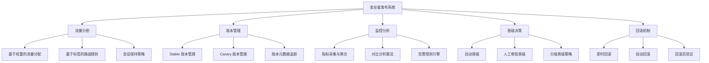
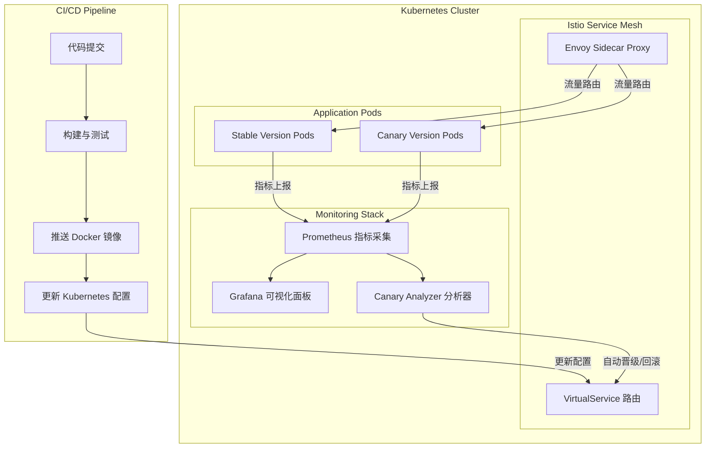
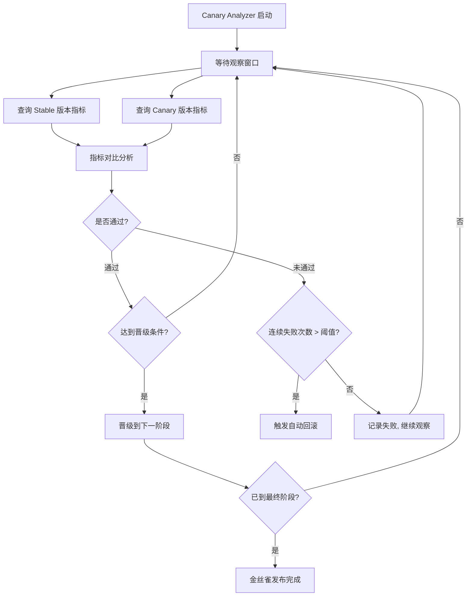

## 案例二：金丝雀发布实践

> **本案例定位**：面向已有微服务和 Kubernetes 基础的团队，完整还原从"滚动更新"迁移到"金丝雀发布"的全过程。读者将获得一套可直接复用的 Istio + Prometheus + Python 分析器技术栈，以及配套的监控告警、回滚脚本和 CI/CD 流水线模板。


### 1. 案例背景与问题定义

#### 1.1 业务场景

某在线支付平台承载日均 2000 万笔交易，峰值 QPS 达到 8000，系统由 30 余个微服务组成，部署在 Kubernetes 集群上。团队此前采用滚动更新（Rolling Update）策略发布新版本，但每次发布都面临以下困境：

- **发布风险不可控**：新版本一旦有问题，滚动更新会逐步将问题版本扩散到所有节点，回滚需要重新滚动，耗时 3-5 分钟
- **缺乏灰度能力**：无法将新版本先暴露给一小部分用户验证，只能"全量发布"或"不发布"
- **故障定位困难**：滚动更新过程中新旧版本混合运行，日志和指标混杂，难以区分问题来自新版本还是旧版本
- **发布窗口受限**：由于回滚成本高，团队只能在低峰期发布，严重限制了交付效率

#### 1.2 问题量化

团队对过去 6 个月的发布数据进行了回顾分析：

| 指标 | 数据 |
|------|------|
| 月均发布次数 | 12 次 |
| 发布导致的故障次数 | 3 次/月 |
| 故障平均恢复时间（MTTR） | 45 分钟 |
| 每次故障影响用户数 | 5-50 万 |
| 发布窗口限制 | 仅限凌晨 2:00-6:00 |

#### 1.3 目标定义

团队决定引入金丝雀发布策略，目标如下：

- 将发布导致的故障影响范围控制在总流量的 5% 以内
- 故障检测时间从人工发现的 15 分钟缩短到自动检测的 2 分钟
- 回滚时间从分钟级缩短到秒级
- 释放发布窗口，支持白天发布

*** 

### 2. 金丝雀发布原理深度解析

#### 2.1 什么是金丝雀发布

金丝雀发布（Canary Deployment）的名字来源于煤矿工人使用金丝雀检测有毒气体的做法。在软件工程中，金丝雀发布是指将新版本部署到一小部分实例上，通过监控这部分实例的运行状态来判断新版本是否健康，然后逐步扩大新版本的覆盖范围，直到完全替换旧版本。

与全量部署相比，金丝雀发布的核心思想是"先试后推"——用最小的风险验证新版本的正确性。

#### 2.2 金丝雀发布的核心要素



**流量分割**是金丝雀发布的基础能力。负载均衡器或服务网格需要支持按权重将流量分配到不同版本的实例上。常见的分割粒度包括：按百分比（10% 流量到金丝雀）、按用户 ID 哈希（保证同一用户始终访问同一版本）、按请求特征（特定地域或设备类型的用户访问新版本）。

**监控分析**是金丝雀发布的安全保障。系统需要实时采集金丝雀版本和稳定版本的关键指标（错误率、延迟、吞吐量等），并通过统计分析判断金丝雀版本是否显著劣于稳定版本。

**晋级决策**决定了金丝雀发布的推进节奏。晋级可以是全自动的（基于预设阈值自动推进）、半自动的（系统建议 + 人工审批）或纯手动的（运维人员根据监控面板决策）。

#### 2.3 金丝雀发布 vs 其他部署策略

| 维度 | 金丝雀发布 | 蓝绿部署 | 滚动更新 | Feature Flag |
|------|-----------|---------|---------|-------------|
| 风险控制 | 优秀（流量级隔离） | 良好（环境级隔离） | 一般（逐批替换） | 优秀（代码级隔离） |
| 资源开销 | 低（仅需额外版本实例） | 高（双倍环境） | 低（原地替换） | 低（仅条件分支） |
| 回滚速度 | 秒级 | 秒级 | 分钟级 | 秒级 |
| 实施复杂度 | 高 | 中 | 低 | 中 |
| 监控要求 | 高（需自动分析） | 中 | 低 | 中 |
| 适用场景 | 微服务、API | 关键入口服务 | 无状态服务 | 功能级别灰度 |
| 数据库兼容性 | 需向后兼容 | 需切换策略 | 需向后兼容 | 无特殊要求 |

*** 

### 3. 技术选型与架构设计

#### 3.1 工具链选择

团队对比了三种主流的金丝雀发布实现方案：

| 方案 | 流量管理 | 自动分析 | 学习曲线 | 社区活跃度 | 选型结论 |
|------|---------|---------|---------|-----------|---------|
| **Istio + 自研分析器** | VirtualService 权重路由 | 需自研 Prometheus 分析逻辑 | 高 | 高 | ✅ 最终选择 |
| **Argo Rollouts** | 内置 CanaryStep | 内置 AnalysisTemplate | 中 | 高 | 备选方案 |
| **Linkerd** | TrafficSplit CRD | 需外部集成 | 中 | 中 | 不选 |

最终选择 **Istio + 自研分析器** 的方案，原因如下：

1. 团队已有 Istio 服务网格的运维经验，不需要额外学习成本
2. 自研分析器可以深度定制分析逻辑，满足业务特有的指标需求（如交易成功率、支付延迟等）
3. Istio 的流量管理能力不仅服务于金丝雀发布，还支持故障注入、流量镜像等高级场景

#### 3.2 整体架构



#### 3.3 Kubernetes 命名空间与标签规划

合理的标签设计是金丝雀发布可管理性的基础：

```yaml
# 标签规范
# 应用级别
app: payment-service          # 应用名称
app.kubernetes.io/version: v2.3.1  # 应用版本

# 部署角色
app.kubernetes.io/component: stable   # 稳定版本
app.kubernetes.io/component: canary   # 金丝雀版本

# 流量管理
istio.io/revision: stable     # Istio 修订版本（用于流量分割）

# 监控维度
monitoring.team: payments     # 监控团队
monitoring.tier: critical     # 监控级别
```

*** 

### 4. 完整实现：Istio 金丝雀发布

#### 4.1 基础设施准备

首先确保集群已安装 Istio 并启用了必要的组件：

```bash
# 安装 Istio（启用流量管理组件）
istioctl install --set profile=default \
  --set values.pilot.resources.requests.cpu=500m \
  --set values.pilot.resources.requests.memory=2048Mi

# 验证安装
istioctl verify-install

# 为目标命名空间启用 Sidecar 自动注入
kubectl label namespace payment-system istio-injection=enabled
```

部署 Prometheus 和 Grafana 用于监控：

```bash
# 使用 Istio 示例配置部署 Prometheus
kubectl apply -f https://raw.githubusercontent.com/istio/istio/release-1.20/samples/addons/prometheus.yaml

# 部署 Grafana
kubectl apply -f https://raw.githubusercontent.com/istio/istio/release-1.20/samples/addons/grafana.yaml

# 部署 Kiali（服务拓扑可视化）
kubectl apply -f https://raw.githubusercontent.com/istio/istio/release-1.20/samples/addons/kiali.yaml
```

#### 4.2 稳定版本部署（v1）

```yaml
# payment-service-stable.yaml
apiVersion: apps/v1
kind: Deployment
metadata:
  name: payment-service-stable
  namespace: payment-system
  labels:
    app: payment-service
    app.kubernetes.io/component: stable
    app.kubernetes.io/version: v1.0.0
spec:
  replicas: 10
  selector:
    matchLabels:
      app: payment-service
      app.kubernetes.io/component: stable
  template:
    metadata:
      labels:
        app: payment-service
        app.kubernetes.io/component: stable
        app.kubernetes.io/version: v1.0.0
      annotations:
        prometheus.io/scrape: "true"
        prometheus.io/port: "8080"
        prometheus.io/path: "/metrics"
    spec:
      containers:
        - name: payment-service
          image: registry.example.com/payment-service:v1.0.0
          ports:
            - containerPort: 8080
              name: http
            - containerPort: 9090
              name: metrics
          resources:
            requests:
              cpu: 200m
              memory: 256Mi
            limits:
              cpu: 500m
              memory: 512Mi
          livenessProbe:
            httpGet:
              path: /healthz
              port: 8080
            initialDelaySeconds: 10
            periodSeconds: 5
          readinessProbe:
            httpGet:
              path: /ready
              port: 8080
            initialDelaySeconds: 5
            periodSeconds: 3
          env:
            - name: VERSION
              value: "v1.0.0"
            - name: LOG_LEVEL
              value: "info"
---
# 稳定版本的 Service
apiVersion: v1
kind: Service
metadata:
  name: payment-service
  namespace: payment-system
  labels:
    app: payment-service
spec:
  ports:
    - port: 8080
      targetPort: 8080
      name: http
    - port: 9090
      targetPort: 9090
      name: metrics
  selector:
    app: payment-service
```

#### 4.3 Istio 流量管理配置

```yaml
# payment-service-virtualservice.yaml
apiVersion: networking.istio.io/v1beta1
kind: VirtualService
metadata:
  name: payment-service
  namespace: payment-system
spec:
  hosts:
    - payment-service
    - payment.example.com
  http:
    - route:
        - destination:
            host: payment-service
            subset: stable
          weight: 100        # 初始状态：100% 流量到稳定版本
        - destination:
            host: payment-service
            subset: canary
          weight: 0           # 初始状态：0% 流量到金丝雀版本
      retries:
        attempts: 3
        perTryTimeout: 2s
        retryOn: 5xx,reset,connect-failure
      timeout: 10s
---
# DestinationRule 定义版本子集
apiVersion: networking.istio.io/v1beta1
kind: DestinationRule
metadata:
  name: payment-service
  namespace: payment-system
spec:
  host: payment-service
  subsets:
    - name: stable
      labels:
        app.kubernetes.io/component: stable
    - name: canary
      labels:
        app.kubernetes.io/component: canary
  trafficPolicy:
    connectionPool:
      tcp:
        maxConnections: 100
      http:
        h2UpgradePolicy: DEFAULT
        http1MaxPendingRequests: 100
        http2MaxRequests: 1000
        maxRequestsPerConnection: 10
        maxRetries: 3
    outlierDetection:
      consecutive5xxErrors: 5
      interval: 30s
      baseEjectionTime: 30s
      maxEjectionPercent: 50
```

#### 4.4 金丝雀版本部署

```yaml
# payment-service-canary.yaml
apiVersion: apps/v1
kind: Deployment
metadata:
  name: payment-service-canary
  namespace: payment-system
  labels:
    app: payment-service
    app.kubernetes.io/component: canary
    app.kubernetes.io/version: v2.0.0
spec:
  replicas: 2                  # 金丝雀实例数量（少量）
  selector:
    matchLabels:
      app: payment-service
      app.kubernetes.io/component: canary
  template:
    metadata:
      labels:
        app: payment-service
        app.kubernetes.io/component: canary
        app.kubernetes.io/version: v2.0.0
      annotations:
        prometheus.io/scrape: "true"
        prometheus.io/port: "8080"
        prometheus.io/path: "/metrics"
    spec:
      containers:
        - name: payment-service
          image: registry.example.com/payment-service:v2.0.0
          ports:
            - containerPort: 8080
              name: http
            - containerPort: 9090
              name: metrics
          resources:
            requests:
              cpu: 200m
              memory: 256Mi
            limits:
              cpu: 500m
              memory: 512Mi
          livenessProbe:
            httpGet:
              path: /healthz
              port: 8080
            initialDelaySeconds: 10
            periodSeconds: 5
          readinessProbe:
            httpGet:
              path: /ready
              port: 8080
            initialDelaySeconds: 5
            periodSeconds: 3
          env:
            - name: VERSION
              value: "v2.0.0"
            - name: LOG_LEVEL
              value: "info"
```

#### 4.5 会话亲和性与流量粘滞

在金丝雀发布中，流量分割是基于请求级别的。如果用户在同一次会话中被交替路由到 stable 和 canary 版本，可能导致数据不一致（例如购物车状态、表单中间态丢失）。Istio 提供了会话亲和性（Session Affinity）能力来解决此问题。

**基于 Cookie 的会话亲和**：

```yaml
# payment-service-virtualservice-sticky.yaml
apiVersion: networking.istio.io/v1beta1
kind: VirtualService
metadata:
  name: payment-service
  namespace: payment-system
spec:
  hosts:
    - payment-service
    - payment.example.com
  http:
    - route:
        - destination:
            host: payment-service
            subset: stable
          weight: 95
        - destination:
            host: payment-service
            subset: canary
          weight: 5
      # 启用基于 Cookie 的会话亲和
      # 同一用户首次请求被路由后，后续请求保持一致
      sticky:
        httpClient:
          sessionId:
            name: x-canary-session
            ttl: 1800s        # 30 分钟过期
```

**基于 User-ID Header 的路由**（更推荐）：

```yaml
apiVersion: networking.istio.io/v1beta1
kind: VirtualService
metadata:
  name: payment-service
  namespace: payment-system
spec:
  hosts:
    - payment-service
    - payment.example.com
  http:
    # 第一条规则：有 userId 的请求按哈希分配
    - match:
        - headers:
            x-user-id:
              exact: ""
      route:
        - destination:
            host: payment-service
            subset: stable
          weight: 95
        - destination:
            host: payment-service
            subset: canary
          weight: 5
      # 使用 consistentHash 确保同一 userId 始终命中同一版本
      # 注意：需配合 DestinationRule 中的 loadBalancer 配置

    # 第二条规则：无 userId 的请求（如匿名访问）直接按权重分配
    - route:
        - destination:
            host: payment-service
            subset: stable
          weight: 95
        - destination:
            host: payment-service
            subset: canary
          weight: 5
```

对应的 DestinationRule 需要启用一致性哈希负载均衡：

```yaml
apiVersion: networking.istio.io/v1beta1
kind: DestinationRule
metadata:
  name: payment-service
  namespace: payment-system
spec:
  host: payment-service
  trafficPolicy:
    loadBalancer:
      consistentHash:
        httpHeaderName: x-user-id    # 基于请求头的一致性哈希
    connectionPool:
      tcp:
        maxConnections: 100
      http:
        h2UpgradePolicy: DEFAULT
        http1MaxPendingRequests: 100
        http2MaxRequests: 1000
        maxRequestsPerConnection: 10
        maxRetries: 3
    outlierDetection:
      consecutive5xxErrors: 5
      interval: 30s
      baseEjectionTime: 30s
      maxEjectionPercent: 50
  subsets:
    - name: stable
      labels:
        app.kubernetes.io/component: stable
    - name: canary
      labels:
        app.kubernetes.io/component: canary
```

> **选型建议**：对于支付等强一致性场景，优先使用 `consistentHash` 方案（基于 user-id header），避免同一用户的请求在新旧版本间跳跃。对于无状态的只读 API，简单的权重分配即可满足需求。

#### 4.6 PodDisruptionBudget 与网络隔离

金丝雀版本的 Pod 数量较少，容易受到节点维护、自动扩缩容等操作的影响。同时，从安全角度出发，金丝雀 Pod 应有独立的网络策略，限制其访问范围。

```yaml
# payment-service-pdb.yaml
apiVersion: policy/v1
kind: PodDisruptionBudget
metadata:
  name: payment-service-canary-pdb
  namespace: payment-system
spec:
  minAvailable: 1          # 金丝雀至少保留 1 个 Pod 可用
  selector:
    matchLabels:
      app: payment-service
      app.kubernetes.io/component: canary
---
# payment-service-networkpolicy.yaml
apiVersion: networking.k8s.io/v1
kind: NetworkPolicy
metadata:
  name: payment-service-canary-netpol
  namespace: payment-system
spec:
  podSelector:
    matchLabels:
      app: payment-service
      app.kubernetes.io/component: canary
  policyTypes:
    - Ingress
    - Egress
  ingress:
    # 只允许 Istio IngressGateway 和监控组件访问金丝雀
    - from:
        - namespaceSelector:
            matchLabels:
              name: istio-system
        - namespaceSelector:
            matchLabels:
              name: monitoring
      ports:
        - protocol: TCP
          port: 8080
        - protocol: TCP
          port: 9090          # metrics 端口
  egress:
    # 允许金丝雀访问必要的后端服务
    - to:
        - namespaceSelector:
            matchLabels:
              kubernetes.io/metadata.name: payment-system
      ports:
        - protocol: TCP
          port: 3306          # 数据库
        - protocol: TCP
          port: 6379          # Redis 缓存
```

> **为什么需要 NetworkPolicy？** 金丝雀版本是未经验证的代码，限制其网络访问范围可以：
> 1. 防止有 bug 的金丝雀版本对下游服务造成雪崩
> 2. 避免金丝雀版本误写入生产数据库
> 3. 在分析失败时快速隔离，而非完全删除

*** 

### 5. 自动化金丝雀分析系统

#### 5.1 分析器架构设计

金丝雀分析器是整个系统的核心智能组件。它通过 Prometheus 查询金丝雀版本和稳定版本的关键指标，进行统计对比分析，并根据预设策略自动做出晋级或回滚决策。



#### 5.2 核心分析器代码实现

```python
"""
金丝雀发布自动化分析器（含统计显著性检验）
=============================================
通过 Prometheus 指标对比分析金丝雀版本与稳定版本的健康状态，
结合统计学方法避免噪声数据导致误判，自动做出晋级或回滚决策。
"""

import asyncio
import math
import logging
from dataclasses import dataclass, field
from datetime import datetime, timedelta
from enum import Enum
from typing import Optional

import aiohttp

logger = logging.getLogger(__name__)


class CanaryVerdict(Enum):
    """金丝雀分析结论"""
    PASS = "pass"           # 通过：金丝雀版本表现正常
    FAIL = "fail"           # 失败：金丝雀版本存在异常
    INCONCLUSIVE = "inconclusive"  # 不确定：数据不足或指标波动


class RolloutAction(Enum):
    """发布动作"""
    HOLD = "hold"           # 保持当前状态，继续观察
    PROMOTE = "promote"     # 晋级到下一个流量阶段
    ROLLBACK = "rollback"   # 回滚到稳定版本
    ABORT = "abort"         # 终止发布


@dataclass
class MetricThreshold:
    """指标阈值配置"""
    # 错误率相关
    max_error_rate: float = 0.01              # 金丝雀版本最大错误率（1%）
    max_error_rate_ratio: float = 1.5         # 金丝雀错误率相对于稳定版本的最大倍数
    
    # 延迟相关
    max_latency_p99_ratio: float = 1.3        # P99 延迟相对倍数
    max_latency_p95_ratio: float = 1.25       # P95 延迟相对倍数
    max_latency_p50_ratio: float = 1.2        # P50 延迟相对倍数
    
    # 成功率相关
    min_success_rate: float = 0.99            # 最低成功率（99%）
    min_success_rate_ratio: float = 0.98      # 相对于稳定版本的最低比例
    
    # 吞吐量相关
    min_request_ratio: float = 0.1            # 金丝雀最低请求量比例（确保样本充足）


@dataclass
class CanaryAnalysisResult:
    """单次分析结果"""
    timestamp: datetime
    verdict: CanaryVerdict
    stable_metrics: dict = field(default_factory=dict)
    canary_metrics: dict = field(default_factory=dict)
    checks: dict = field(default_factory=dict)
    message: str = ""


@dataclass
class RolloutStage:
    """发布阶段配置"""
    weight: int                        # 金丝雀流量权重百分比
    observation_seconds: int           # 观察窗口（秒）
    min_requests: int = 100            # 最少请求数（确保统计显著性）
    required_passes: int = 3           # 该阶段所需的连续通过次数


class CanaryAnalyzer:
    """
    金丝雀发布自动化分析器
    
    工作流程：
    1. 按照预设的渐进式阶段调整流量权重
    2. 在每个阶段的观察窗口内持续分析金丝雀版本的健康状态
    3. 根据分析结果自动做出晋级或回滚决策
    """

    def __init__(
        self,
        prometheus_url: str,
        istio_control_url: str,
        thresholds: Optional[MetricThreshold] = None,
        stages: Optional[list[RolloutStage]] = None,
    ):
        self.prometheus_url = prometheus_url
        self.istio_control_url = istio_control_url
        self.thresholds = thresholds or MetricThreshold()
        self.stages = stages or [
            RolloutStage(weight=5,   observation_seconds=120, min_requests=50,  required_passes=2),
            RolloutStage(weight=10,  observation_seconds=180, min_requests=100, required_passes=2),
            RolloutStage(weight=25,  observation_seconds=300, min_requests=200, required_passes=3),
            RolloutStage(weight=50,  observation_seconds=300, min_requests=300, required_passes=3),
            RolloutStage(weight=75,  observation_seconds=180, min_requests=200, required_passes=2),
            RolloutStage(weight=100, observation_seconds=120, min_requests=100, required_passes=1),
        ]

    async def _query_prometheus(self, query: str) -> dict:
        """执行 Prometheus 查询"""
        async with aiohttp.ClientSession() as session:
            url = f"{self.prometheus_url}/api/v1/query"
            async with session.get(url, params={"query": query}) as resp:
                data = await resp.json()
                if data["status"] != "success":
                    raise RuntimeError(f"Prometheus query failed: {data}")
                return data["data"]["result"]

    @staticmethod
    def _norm_cdf(x: float) -> float:
        """标准正态分布的累积分布函数（Abramowitz &amp; Stegun 近似）"""
        a1, a2, a3, a4, a5 = 0.254829592, -0.284496736, 1.421413741, -1.453152027, 1.061405429
        p = 0.3275911
        sign = 1 if x >= 0 else -1
        x = abs(x) / math.sqrt(2)
        t = 1.0 / (1.0 + p * x)
        y = 1.0 - (((((a5 * t + a4) * t) + a3) * t + a2) * t + a1) * t * math.exp(-x * x)
        return 0.5 * (1.0 + sign * y)

    def _z_test_two_proportions(
        self, p1: float, n1: int, p2: float, n2: int, alpha: float = 0.05
    ) -> tuple[bool, float]:
        """
        双比例 Z 检验：判断两个版本的指标差异是否具有统计显著性。

        - p1: 金丝雀版本的指标值（如错误率）
        - n1: 金丝雀版本的样本量
        - p2: 稳定版本的指标值
        - n2: 稳定版本的样本量
        - alpha: 显著性水平（默认 0.05，即 95% 置信度）

        返回 (is_significant, p_value)
        """
        if n1 == 0 or n2 == 0:
            return False, 1.0

        # 合并比例
        p_pool = (p1 * n1 + p2 * n2) / (n1 + n2)
        if p_pool == 0 or p_pool == 1:
            return False, 1.0

        # 标准误
        se = math.sqrt(p_pool * (1 - p_pool) * (1/n1 + 1/n2))
        if se == 0:
            return False, 1.0

        # Z 统计量
        z = (p1 - p2) / se

        # 双尾 p 值
        p_value = 2 * (1 - self._norm_cdf(abs(z)))

        return p_value < alpha, p_value

    async def _get_version_metrics(
        self, service: str, namespace: str, subset: str, window: str = "5m"
    ) -> dict:
        """获取指定版本的关键指标"""
        base_filter = (
            f'{{destination_workload_namespace="{namespace}",'
            f'destination_workload="{service}",'
            f'destination_app="{service}",'
            f'destination_version="{subset}"}}'
        )

        # 查询错误率（5xx 响应占总响应的比例）
        error_rate_query = (
            f'sum(rate(istio_requests_total{base_filter}'
            f'{{response_code=~"5.."}}[{window}])) '
            f'/ '
            f'sum(rate(istio_requests_total{base_filter}[window]))'
        )
        error_rate_result = await self._query_prometheus(
            error_rate_query.replace("[window]", f"[{window}]")
        )
        error_rate = float(error_rate_result[0]["value"][1]) if error_rate_result else 0.0

        # 查询 P99 延迟
        p99_query = (
            f'histogram_quantile(0.99, '
            f'sum(rate(istio_request_duration_milliseconds_bucket{base_filter}[window])) '
            f'by (le))'
        )
        p99_result = await self._query_prometheus(
            p99_query.replace("[window]", f"[{window}]")
        )
        latency_p99 = float(p99_result[0]["value"][1]) if p99_result else 0.0

        # 查询 P95 延迟
        p95_query = (
            f'histogram_quantile(0.95, '
            f'sum(rate(istio_request_duration_milliseconds_bucket{base_filter}[window])) '
            f'by (le))'
        )
        p95_result = await self._query_prometheus(
            p95_query.replace("[window]", f"[{window}]")
        )
        latency_p95 = float(p95_result[0]["value"][1]) if p95_result else 0.0

        # 查询成功率
        total_query = f'sum(rate(istio_requests_total{base_filter}[window]))'
        success_query = (
            f'sum(rate(istio_requests_total{base_filter}'
            f'{{response_code=~"2.."}}[window]))'
        )
        total_result = await self._query_prometheus(
            total_query.replace("[window]", f"[{window}]")
        )
        success_result = await self._query_prometheus(
            success_query.replace("[window]", f"[{window}]")
        )
        total = float(total_result[0]["value"][1]) if total_result else 0.0
        success = float(success_result[0]["value"][1]) if success_result else 0.0
        success_rate = success / total if total > 0 else 1.0

        # 查询请求总量（用于判断样本充足性）
        request_count_query = (
            f'sum(increase(istio_requests_total{base_filter}[window]))'
        )
        count_result = await self._query_prometheus(
            request_count_query.replace("[window]", f"[{window}]")
        )
        request_count = float(count_result[0]["value"][1]) if count_result else 0.0

        return {
            "error_rate": error_rate,
            "latency_p99": latency_p99,
            "latency_p95": latency_p95,
            "success_rate": success_rate,
            "request_count": request_count,
        }

    async def analyze(
        self, service: str, namespace: str, window: str = "5m"
    ) -> CanaryAnalysisResult:
        """
        执行一次金丝雀分析（含统计显著性检验）

        对比稳定版本和金丝雀版本的关键指标，通过绝对阈值和统计检验
        双重验证，给出通过/失败结论。避免因样本不足或自然波动导致的误判。
        """
        # 并行查询两个版本的指标
        stable_metrics, canary_metrics = await asyncio.gather(
            self._get_version_metrics(service, namespace, "stable", window),
            self._get_version_metrics(service, namespace, "canary", window),
        )

        thresholds = self.thresholds
        checks = {}

        # 检查 1：样本充足性
        min_sample_size = 100
        checks["sample_sufficient"] = canary_metrics["request_count"] >= min_sample_size
        if not checks["sample_sufficient"]:
            return CanaryAnalysisResult(
                timestamp=datetime.utcnow(),
                verdict=CanaryVerdict.INCONCLUSIVE,
                stable_metrics=stable_metrics,
                canary_metrics=canary_metrics,
                checks=checks,
                message=f"金丝雀样本不足: {canary_metrics['request_count']:.0f} < {min_sample_size}",
            )

        # 检查 2：金丝雀版本错误率绝对值
        checks["error_rate_abs"] = canary_metrics["error_rate"] <= thresholds.max_error_rate

        # 检查 3：金丝雀版本错误率相对值（与稳定版本对比）
        if stable_metrics["error_rate"] > 0:
            error_ratio = canary_metrics["error_rate"] / stable_metrics["error_rate"]
            checks["error_rate_ratio"] = error_ratio <= thresholds.max_error_rate_ratio
        else:
            # 稳定版本零错误时，金丝雀也必须零错误
            checks["error_rate_ratio"] = canary_metrics["error_rate"] == 0

        # 检查 4：P99 延迟相对值
        if stable_metrics["latency_p99"] > 0:
            p99_ratio = canary_metrics["latency_p99"] / stable_metrics["latency_p99"]
            checks["latency_p99"] = p99_ratio <= thresholds.max_latency_p99_ratio
        else:
            checks["latency_p99"] = True

        # 检查 5：P95 延迟相对值
        if stable_metrics["latency_p95"] > 0:
            p95_ratio = canary_metrics["latency_p95"] / stable_metrics["latency_p95"]
            checks["latency_p95"] = p95_ratio <= thresholds.max_latency_p95_ratio
        else:
            checks["latency_p95"] = True

        # 检查 6：成功率绝对值
        checks["success_rate_abs"] = (
            canary_metrics["success_rate"] >= thresholds.min_success_rate
        )

        # 检查 7：成功率相对值
        if stable_metrics["success_rate"] > 0:
            sr_ratio = canary_metrics["success_rate"] / stable_metrics["success_rate"]
            checks["success_rate_ratio"] = sr_ratio >= thresholds.min_success_rate_ratio
        else:
            checks["success_rate_ratio"] = canary_metrics["success_rate"] >= thresholds.min_success_rate

        # 检查 8：错误率差异的统计显著性（Z 检验）
        # 如果差异不显著，即使比率略高也视为通过——避免噪声导致的误判
        canary_count = canary_metrics["request_count"]
        stable_count = stable_metrics.get("request_count", 1000)
        if canary_count >= 30 and stable_count >= 30:
            error_sig, error_pval = self._z_test_two_proportions(
                canary_metrics["error_rate"], int(canary_count),
                stable_metrics["error_rate"], int(stable_count),
            )
            checks["error_rate_statistical"] = not error_sig  # 差异不显著 = 通过
            logger.info(
                f"错误率 Z 检验: p={error_pval:.4f}, "
                f"显著={'是' if error_sig else '否'}, "
                f"canary_n={canary_count:.0f}, stable_n={stable_count:.0f}"
            )
        else:
            checks["error_rate_statistical"] = True  # 样本不足时跳过统计检验
            logger.info("样本量不足，跳过错误率统计显著性检验")

        # 综合判断
        all_passed = all(checks.values())
        failed_checks = [k for k, v in checks.items() if not v]

        if all_passed:
            verdict = CanaryVerdict.PASS
            message = "金丝雀分析通过：所有指标正常"
        else:
            verdict = CanaryVerdict.FAIL
            message = f"金丝雀分析失败: {', '.join(failed_checks)}"

        return CanaryAnalysisResult(
            timestamp=datetime.utcnow(),
            verdict=verdict,
            stable_metrics=stable_metrics,
            canary_metrics=canary_metrics,
            checks=checks,
            message=message,
        )

    async def set_canary_weight(self, service: str, namespace: str, weight: int):
        """通过 Istio API 调整金丝雀流量权重"""
        # 实际实现中，通过调用 Kubernetes API 更新 VirtualService
        # 此处为示意代码
        logger.info(f"调整金丝雀权重: {service}/{namespace} -> {weight}%")

    async def progressive_rollout(
        self, service: str, namespace: str
    ) -> bool:
        """
        执行完整的渐进式金丝雀发布
        
        按照预设阶段逐步提升金丝雀流量权重，
        每个阶段持续分析直到通过或回滚。
        """
        consecutive_failures = 0
        max_consecutive_failures = 3

        for i, stage in enumerate(self.stages):
            logger.info(
                f"[阶段 {i+1}/{len(self.stages)}] "
                f"设置金丝雀权重: {stage.weight}%, "
                f"观察窗口: {stage.observation_seconds}s"
            )

            # 设置流量权重
            await self.set_canary_weight(service, namespace, stage.weight)

            # 等待初始采样期（让指标稳定）
            await asyncio.sleep(30)

            stage_passes = 0
            stage_start = datetime.utcnow()
            stage_deadline = stage_start + timedelta(seconds=stage.observation_seconds)

            while datetime.utcnow() < stage_deadline:
                # 执行分析
                result = await self.analyze(service, namespace)
                logger.info(
                    f"分析结果: {result.verdict.value} - {result.message}"
                )

                if result.verdict == CanaryVerdict.PASS:
                    stage_passes += 1
                    consecutive_failures = 0
                    if stage_passes >= stage.required_passes:
                        logger.info(
                            f"阶段通过 ({stage_passes}/{stage.required_passes})"
                        )
                        break
                elif result.verdict == CanaryVerdict.FAIL:
                    consecutive_failures += 1
                    logger.warning(
                        f"分析失败 (连续失败: {consecutive_failures})"
                    )
                    if consecutive_failures >= max_consecutive_failures:
                        logger.error(
                            f"连续失败 {consecutive_failures} 次，触发自动回滚"
                        )
                        await self.set_canary_weight(service, namespace, 0)
                        return False
                else:
                    # INCONCLUSIVE - 数据不足，继续等待
                    logger.info("数据不足，继续观察...")

                # 分析间隔
                await asyncio.sleep(30)

            else:
                # 观察窗口结束但未达到 required_passes
                logger.warning(
                    f"阶段观察窗口结束，仅通过 {stage_passes}/{stage.required_passes} 次"
                )
                if stage_passes < stage.required_passes:
                    consecutive_failures += 1
                    if consecutive_failures >= max_consecutive_failures:
                        logger.error("未通过阶段验证，触发自动回滚")
                        await self.set_canary_weight(service, namespace, 0)
                        return False

        logger.info("金丝雀发布完成：所有阶段通过")
        return True
```

#### 5.3 统计显著性检验：为什么不能只看"错误率高了"

在实际生产环境中，两个版本的错误率差异可能来自代码缺陷，也可能来自统计噪声。例如：

- 稳定版本错误率 0.8%，金丝雀版本错误率 1.2%——看起来"高了 50%"
- 但如果金丝雀只有 200 个请求，这个差异可能只是随机波动

**双比例 Z 检验**是判断两个版本指标差异是否具有统计显著性的经典方法：

假设检验：
  H0（零假设）：canary 错误率 = stable 错误率（无差异）
  H1（备择假设）：canary 错误率 != stable 错误率（有差异）

检验统计量：
  Z = (p_canary - p_stable) / sqrt(p_pool * (1-p_pool) * (1/n1 + 1/n2))
  
  其中 p_pool 为合并比例，n1/n2 为各自样本量

判断规则：
  如果 p_value < 0.05（95% 置信度），拒绝 H0，认为差异显著
  如果 p_value >= 0.05，不能拒绝 H0，认为差异可能来自噪声

**实际场景示例**：

| 场景 | canary 错误率 | canary 样本 | stable 错误率 | stable 样本 | Z 统计量 | p 值 | 结论 |
|------|-------------|------------|-------------|------------|---------|------|------|
| A（真实问题） | 3.2% | 1000 | 0.8% | 10000 | 8.92 | <0.001 | 差异显著，回滚 |
| B（自然波动） | 1.5% | 200 | 0.8% | 10000 | 1.89 | 0.059 | 差异不显著，继续观察 |
| C（小样本噪声） | 2.0% | 30 | 0.8% | 10000 | 0.87 | 0.385 | 样本不足，不判断 |

场景 B 是最容易误判的：1.5% vs 0.8% 看起来"差了一倍"，但统计检验表明这可能是正常波动。如果不做检验就回滚，会导致频繁的"假警报"。

> **实践建议**：统计检验不是万能的。当金丝雀版本的绝对错误率已经很高（如 > 5%），即使统计检验不显著也应该回滚——因为绝对风险已经不可接受。统计检验主要用来处理"略高于阈值但不确定"的灰色地带。

#### 5.4 指标阈值配置文件

```yaml
# canary-config.yaml
thresholds:
  # 错误率控制
  max_error_rate: 0.01              # 金丝雀版本错误率不超过 1%
  max_error_rate_ratio: 1.5         # 相对于稳定版本不超过 1.5 倍
  
  # 延迟控制
  max_latency_p99_ratio: 1.3        # P99 延迟相对倍数上限
  max_latency_p95_ratio: 1.25       # P95 延迟相对倍数上限
  max_latency_p50_ratio: 1.2        # P50 延迟相对倍数上限
  
  # 成功率控制
  min_success_rate: 0.99            # 最低成功率 99%
  min_success_rate_ratio: 0.98      # 相对于稳定版本的最低比例
  
  # 样本控制
  min_request_ratio: 0.1            # 最低请求量比例
  min_sample_size: 100              # 最少样本数量

stages:
  - weight: 5
    observation_seconds: 120
    min_requests: 50
    required_passes: 2
  - weight: 10
    observation_seconds: 180
    min_requests: 100
    required_passes: 2
  - weight: 25
    observation_seconds: 300
    min_requests: 200
    required_passes: 3
  - weight: 50
    observation_seconds: 300
    min_requests: 300
    required_passes: 3
  - weight: 75
    observation_seconds: 180
    min_requests: 200
    required_passes: 2
  - weight: 100
    observation_seconds: 120
    min_requests: 100
    required_passes: 1

rollback:
  max_consecutive_failures: 3        # 连续失败次数触发回滚
  auto_rollback_enabled: true        # 启用自动回滚
  notification_channel: "slack"      # 通知渠道
```

*** 

### 6. 监控与告警体系

#### 6.1 Prometheus 告警规则

```yaml
# canary-alerts.yaml
groups:
  - name: canary-deployment
    interval: 30s
    rules:
      # 金丝雀版本错误率告警
      - alert: CanaryHighErrorRate
        expr: |
          (
            sum(rate(istio_requests_total{
              destination_app="payment-service",
              destination_version="canary",
              response_code=~"5.."
            }[2m]))
            /
            sum(rate(istio_requests_total{
              destination_app="payment-service",
              destination_version="canary"
            }[2m]))
          ) > 0.01
        for: 1m
        labels:
          severity: critical
          team: payments
        annotations:
          summary: "金丝雀版本错误率过高"
          description: |
            payment-service 金丝雀版本错误率 {{ $value | humanizePercentage }}，
            超过阈值 1%。当前权重: {{ $labels.destination_version }}。
            请检查金丝雀版本是否存在问题，必要时触发回滚。
          runbook_url: "https://wiki.example.com/runbooks/canary-error-rate"

      # 金丝雀版本延迟告警
      - alert: CanaryHighLatency
        expr: |
          (
            histogram_quantile(0.99,
              sum(rate(istio_request_duration_milliseconds_bucket{
                destination_app="payment-service",
                destination_version="canary"
              }[2m])) by (le)
            )
            /
            histogram_quantile(0.99,
              sum(rate(istio_request_duration_milliseconds_bucket{
                destination_app="payment-service",
                destination_version="stable"
              }[2m])) by (le)
            )
          ) > 1.3
        for: 2m
        labels:
          severity: warning
          team: payments
        annotations:
          summary: "金丝雀版本 P99 延迟过高"
          description: |
            payment-service 金丝雀版本 P99 延迟是稳定版本的 {{ $value }}x，
            超过阈值 1.3x。

      # 金丝雀版本成功率告警
      - alert: CanaryLowSuccessRate
        expr: |
          (
            sum(rate(istio_requests_total{
              destination_app="payment-service",
              destination_version="canary",
              response_code=~"2.."
            }[2m]))
            /
            sum(rate(istio_requests_total{
              destination_app="payment-service",
              destination_version="canary"
            }[2m]))
          ) < 0.99
        for: 1m
        labels:
          severity: critical
          team: payments
        annotations:
          summary: "金丝雀版本成功率过低"
          description: |
            payment-service 金丝雀版本成功率仅 {{ $value | humanizePercentage }}，
            低于阈值 99%。

      # 金丝雀流量分布异常检测
      - alert: CanaryTrafficSkew
        expr: |
          abs(
            sum(rate(istio_requests_total{
              destination_app="payment-service",
              destination_version="canary"
            }[5m]))
            /
            sum(rate(istio_requests_total{
              destination_app="payment-service"
            }[5m]))
            - 0.05
          ) > 0.03
        for: 5m
        labels:
          severity: info
          team: payments
        annotations:
          summary: "金丝雀流量分布与预期不符"
          description: |
            payment-service 金丝雀版本的实际流量比例偏离预期值，
            可能存在路由配置问题。
```

#### 6.2 Grafana 仪表盘配置

完整的金丝雀发布监控仪表盘应包含以下核心面板：

| 面板类型 | 面板名称 | 核心用途 |
|---------|---------|---------|
| Time Series | 请求速率对比 | 监控流量分配是否符合预期权重 |
| Time Series | 错误率对比 | 最关键的安全指标 |
| Time Series | P99/P95 延迟对比 | 检测性能退化 |
| Gauge | 当前金丝雀权重 | 直观显示发布进度 |
| Stat | 成功率 | 业务层面的健康度 |
| Table | 分析检查项明细 | 每次分析的逐项结果 |
| State Timeline | 发布状态时间线 | 记录晋级/回滚事件 |

```json
{
  "dashboard": {
    "title": "Canary Deployment Dashboard",
    "uid": "canary-payment-v1",
    "timezone": "browser",
    "refresh": "10s",
    "templating": {
      "list": [
        {
          "name": "service",
          "type": "query",
          "query": "label_values(istio_requests_total, destination_app)",
          "current": { "text": "payment-service", "value": "payment-service" }
        }
      ]
    },
    "panels": [
      {
        "title": "当前金丝雀权重",
        "type": "gauge",
        "gridPos": { "h": 4, "w": 6, "x": 0, "y": 0 },
        "targets": [
          {
            "expr": "sum(rate(istio_requests_total{destination_app=\"$service\", destination_version=\"canary\"}[1m])) / sum(rate(istio_requests_total{destination_app=\"$service\"}[1m])) * 100",
            "legendFormat": "canary weight %"
          }
        ],
        "fieldConfig": {
          "defaults": {
            "unit": "percent",
            "min": 0, "max": 100,
            "thresholds": {
              "steps": [
                { "value": 0, "color": "green" },
                { "value": 50, "color": "yellow" },
                { "value": 90, "color": "blue" }
              ]
            }
          }
        }
      },
      {
        "title": "请求速率对比",
        "type": "timeseries",
        "gridPos": { "h": 8, "w": 12, "x": 6, "y": 0 },
        "targets": [
          {
            "expr": "sum(rate(istio_requests_total{destination_app=\"$service\", destination_version=\"canary\"}[1m]))",
            "legendFormat": "canary req/s"
          },
          {
            "expr": "sum(rate(istio_requests_total{destination_app=\"$service\", destination_version=\"stable\"}[1m]))",
            "legendFormat": "stable req/s"
          }
        ]
      },
      {
        "title": "错误率对比",
        "type": "timeseries",
        "gridPos": { "h": 8, "w": 12, "x": 0, "y": 4 },
        "targets": [
          {
            "expr": "sum(rate(istio_requests_total{destination_app=\"$service\", destination_version=\"canary\", response_code=~\"5..\"}[1m])) / sum(rate(istio_requests_total{destination_app=\"$service\", destination_version=\"canary\"}[1m]))",
            "legendFormat": "canary error rate"
          },
          {
            "expr": "sum(rate(istio_requests_total{destination_app=\"$service\", destination_version=\"stable\", response_code=~\"5..\"}[1m])) / sum(rate(istio_requests_total{destination_app=\"$service\", destination_version=\"stable\"}[1m]))",
            "legendFormat": "stable error rate"
          }
        ],
        "fieldConfig": {
          "defaults": {
            "unit": "percentunit",
            "custom": {
              "thresholdsStyle": { "mode": "line" }
            },
            "thresholds": {
              "steps": [
                { "value": 0.01, "color": "yellow" },
                { "value": 0.05, "color": "red" }
              ]
            }
          }
        }
      },
      {
        "title": "P99 延迟对比",
        "type": "timeseries",
        "gridPos": { "h": 8, "w": 12, "x": 0, "y": 12 },
        "targets": [
          {
            "expr": "histogram_quantile(0.99, sum(rate(istio_request_duration_milliseconds_bucket{destination_app=\"$service\", destination_version=\"canary\"}[1m])) by (le))",
            "legendFormat": "canary p99"
          },
          {
            "expr": "histogram_quantile(0.99, sum(rate(istio_request_duration_milliseconds_bucket{destination_app=\"$service\", destination_version=\"stable\"}[1m])) by (le))",
            "legendFormat": "stable p99"
          }
        ],
        "fieldConfig": {
          "defaults": { "unit": "ms" }
        }
      },
      {
        "title": "成功率对比",
        "type": "stat",
        "gridPos": { "h": 4, "w": 6, "x": 0, "y": 0 },
        "targets": [
          {
            "expr": "sum(rate(istio_requests_total{destination_app=\"$service\", destination_version=\"canary\", response_code=~\"2..\"}[5m])) / sum(rate(istio_requests_total{destination_app=\"$service\", destination_version=\"canary\"}[5m])) * 100",
            "legendFormat": "canary success %"
          }
        ],
        "fieldConfig": {
          "defaults": {
            "unit": "percent",
            "min": 90, "max": 100,
            "thresholds": {
              "steps": [
                { "value": 95, "color": "red" },
                { "value": 99, "color": "yellow" },
                { "value": 99.9, "color": "green" }
              ]
            }
          }
        }
      },
      {
        "title": "P50/P95/P99 延迟分布",
        "type": "timeseries",
        "gridPos": { "h": 8, "w": 12, "x": 12, "y": 12 },
        "targets": [
          {
            "expr": "histogram_quantile(0.50, sum(rate(istio_request_duration_milliseconds_bucket{destination_app=\"$service\", destination_version=\"canary\"}[1m])) by (le))",
            "legendFormat": "canary p50"
          },
          {
            "expr": "histogram_quantile(0.95, sum(rate(istio_request_duration_milliseconds_bucket{destination_app=\"$service\", destination_version=\"canary\"}[1m])) by (le))",
            "legendFormat": "canary p95"
          },
          {
            "expr": "histogram_quantile(0.99, sum(rate(istio_request_duration_milliseconds_bucket{destination_app=\"$service\", destination_version=\"canary\"}[1m])) by (le))",
            "legendFormat": "canary p99"
          }
        ],
        "fieldConfig": {
          "defaults": { "unit": "ms" }
        }
      }
    ]
  }
}
```

#### 6.3 金丝雀发布阶段时间线

在发布过程中，流量权重按预设阶段渐进式提升。以下是一个典型的金丝雀发布时间线：

```mermaid
gantt
    title 金丝雀发布阶段时间线（payment-service v2.0.0）
    dateFormat X
    axisFormat %s
    section 阶段一（5%）
    观察窗口 120s         :a1, 0, 120
    section 阶段二（10%）
    观察窗口 180s         :a2, 120, 300
    section 阶段三（25%）
    观察窗口 300s         :a3, 300, 600
    section 阶段四（50%）
    观察窗口 300s         :a4, 600, 900
    section 阶段五（75%）
    观察窗口 180s         :a5, 900, 1080
    section 全量（100%）
    最终验证 120s         :a6, 1080, 1200
```



> **实际耗时参考**：在流量为 8000 QPS 的场景下，一次完整的金丝雀发布耗时约 20 分钟（1200 秒）。其中前两个阶段（5% + 10%）虽然只覆盖 15% 流量，但占据了约 4 分钟，用于在最小影响范围内充分验证。

*** 

### 7. 完整发布流程自动化

#### 7.1 CI/CD 流水线集成

```yaml
# .github/workflows/canary-deploy.yml
name: Canary Deployment

on:
  push:
    tags:
      - 'v*'          # 语义化版本 tag 触发金丝雀发布

env:
  IMAGE_REGISTRY: registry.example.com
  SERVICE_NAME: payment-service
  NAMESPACE: payment-system

jobs:
  build-and-push:
    runs-on: ubuntu-latest
    outputs:
      image_tag: ${{ steps.meta.outputs.version }}
    steps:
      - uses: actions/checkout@v4
      
      - name: Build and push Docker image
        uses: docker/build-push-action@v5
        with:
          push: true
          tags: |
            ${{ env.IMAGE_REGISTRY }}/${{ env.SERVICE_NAME }}:${{ github.ref_name }}
            ${{ env.IMAGE_REGISTRY }}/${{ env.SERVICE_NAME }}:${{ github.sha }}

  canary-deploy:
    needs: build-and-push
    runs-on: ubuntu-latest
    environment: production-canary    # 需要审批的环境
    steps:
      - name: Deploy canary version
        run: |
          # 更新金丝雀 Deployment 的镜像
          kubectl set image deployment/payment-service-canary \
            payment-service=${{ env.IMAGE_REGISTRY }}/${{ env.SERVICE_NAME }}:${{ needs.build-and-push.outputs.image_tag }} \
            -n ${{ env.NAMESPACE }}
          
          # 等待金丝雀 Pod 就绪
          kubectl rollout status deployment/payment-service-canary \
            -n ${{ env.NAMESPACE }} --timeout=120s

      - name: Start canary analysis
        run: |
          python scripts/canary_analyzer.py \
            --service ${{ env.SERVICE_NAME }} \
            --namespace ${{ env.NAMESPACE }} \
            --config canary-config.yaml \
            --mode auto

      - name: Post-analysis notification
        if: always()
        run: |
          # 通知发布结果
          curl -X POST "${{ secrets.SLACK_WEBHOOK }}" \
            -H "Content-Type: application/json" \
            -d '{
              "text": "Canary deployment for ${{ env.SERVICE_NAME }} ${{ needs.build-and-push.outputs.image_tag }}: ${{ job.status }}"
            }'
```

#### 7.2 回滚脚本

```bash
#!/bin/bash
# rollback-canary.sh - 紧急回滚脚本
# 用法: ./rollback-canary.sh [service] [namespace]

set -euo pipefail

SERVICE="${1:-payment-service}"
NAMESPACE="${2:-payment-system}"

echo "========================================="
echo "紧急回滚: ${SERVICE}/${NAMESPACE}"
echo "========================================="

# 第一步：立即将金丝雀流量权重设为 0
echo "[1/4] 重置金丝雀流量权重..."
kubectl apply -f - <<EOF
apiVersion: networking.istio.io/v1beta1
kind: VirtualService
metadata:
  name: ${SERVICE}
  namespace: ${NAMESPACE}
spec:
  hosts:
    - ${SERVICE}
  http:
    - route:
        - destination:
            host: ${SERVICE}
            subset: stable
          weight: 100
        - destination:
            host: ${SERVICE}
            subset: canary
          weight: 0
EOF

# 第二步：删除金丝雀 Deployment
echo "[2/4] 删除金丝雀 Deployment..."
kubectl delete deployment ${SERVICE}-canary -n ${NAMESPACE} --ignore-not-found

# 第三步：验证稳定版本状态
echo "[3/4] 验证稳定版本状态..."
kubectl get pods -n ${NAMESPACE} -l \
  "app=${SERVICE},app.kubernetes.io/component=stable" \
  -o wide

# 第四步：检查服务可用性
echo "[4/4] 检查服务可用性..."
READY=$(kubectl get endpoints ${SERVICE} -n ${NAMESPACE} -o jsonpath='{.subsets[0].addresses}' | jq length)
if [ "$READY" -gt 0 ]; then
  echo "✅ 回滚完成: ${SERVICE} 稳定版本正常运行 (${READY} 个 ready endpoints)"
else
  echo "❌ 警告: 稳定版本没有 ready endpoints，请立即检查！"
  exit 1
fi

echo "========================================="
echo "回滚时间: $(date)"
echo "========================================="
```

*** 

### 8. 数据库兼容性处理

#### 8.1 向后兼容的数据库迁移策略

金丝雀发布要求数据库变更必须向后兼容——在新旧版本代码同时运行期间，数据库 Schema 必须同时被两个版本正确处理。

```sql
-- ❌ 错误做法：直接删除列（旧版本代码仍引用此列）
ALTER TABLE payments DROP COLUMN old_field;

-- ✅ 正确做法：扩展-收缩（Expand-Contract）模式

-- 阶段一：扩展（金丝雀发布前）
-- 添加新列，旧列保持不变
ALTER TABLE payments ADD COLUMN new_field VARCHAR(255);
-- 创建触发器保持新旧列同步
CREATE TRIGGER sync_payment_fields
  BEFORE INSERT OR UPDATE ON payments
  FOR EACH ROW
  BEGIN
    SET NEW.new_field = COALESCE(NEW.new_field, NEW.old_field);
  END;

-- 阶段二：数据迁移
UPDATE payments SET new_field = old_field WHERE new_field IS NULL;

-- 阶段三：收缩（金丝雀完全替换后）
-- 此时所有代码都使用 new_field，可以安全删除旧列
ALTER TABLE payments DROP COLUMN old_field;
DROP TRIGGER sync_payment_fields;
```

#### 8.2 Feature Flag 与金丝雀发布结合

金丝雀发布和 Feature Flag 是两个不同维度的灰度能力，它们可以叠加使用：

| 维度 | 金丝雀发布 | Feature Flag |
|------|----------|-------------|
| 粒度 | 实例级别（哪些服务器运行新代码） | 功能级别（新代码中的哪些功能生效） |
| 控制面 | 运维/基础设施层 | 应用/业务层 |
| 适用场景 | 验证新版本整体稳定性 | 验证单个新功能的业务效果 |
| 回滚方式 | 切换流量权重 | 关闭开关 |
| 典型用户 | SRE/运维团队 | 产品经理/开发者 |

两者结合的最佳实践：金丝雀版本中部署包含新功能的代码，但通过 Feature Flag 控制新功能的开启范围。这样即使金丝雀实例接收了流量，新功能仍然可以独立开关。

```python
class PaymentProcessor:
    """支付处理器 - 使用 Feature Flag 控制新功能"""
    
    def __init__(self, feature_flags):
        self.flags = feature_flags
    
    def process_payment(self, payment_request):
        # 第一层：金丝雀发布控制（基础设施层）
        #   决定这个请求是否被路由到金丝雀版本
        # 第二层：Feature Flag 控制（应用层）
        #   即使在金丝雀版本中，新功能也可以独立开关
        if self.flags.is_enabled(
            "new-payment-flow",
            {"user_id": payment_request.user_id}  # 可按用户/地区/比例灰度
        ):
            return self._new_payment_flow(payment_request)
        else:
            return self._legacy_payment_flow(payment_request)
    
    def _new_payment_flow(self, request):
        """新支付流程 - 金丝雀版本中按 Feature Flag 启用"""
        # 1. 校验支付参数
        validated = self._validate_payment(request)
        # 2. 新的风控引擎（本次发布的核心变更）
        risk_score = self._new_risk_engine(validated)
        # 3. 调用支付网关
        result = self._gateway.charge(validated, risk_score)
        # 4. 异步对账（新增能力）
        self._async_reconciliation(result)
        return result
    
    def _legacy_payment_flow(self, request):
        """旧支付流程 - 稳定版本和未开启 Flag 的请求"""
        validated = self._validate_payment(request)
        result = self._gateway.charge(validated)
        return result
```

**Feature Flag 的配置示例**（以 LaunchDarkly 为例）：

```json
{
  "key": "new-payment-flow",
  "name": "New Payment Flow",
  "kind": "multivariate",
  "targets": [
    {
      "values": ["enabled"],
      "segments": ["beta-users", "internal-staff"]
    }
  ],
  "rules": [
    {
      "clauses": [{ "op": "in", "attribute": "country", "values": ["CN"] }],
      "percentage": { "enabled": 10, "disabled": 90 }
    }
  ],
  "offVariation": "disabled",
  "on": true
}
```

> **组合策略**：在支付平台的案例中，推荐的组合方式是：
> 1. 先通过 Feature Flag 在内部员工中验证新功能
> 2. 再通过金丝雀发布将新版本逐步推向生产流量
> 3. 金丝雀版本中 Feature Flag 默认关闭，由运维团队逐步开启
> 4. 两个维度独立回滚——可以只关 Flag 不回滚版本，也可以只回滚版本不关 Flag

*** 

### 9. 常见陷阱与最佳实践

#### 9.1 发布前检查清单

每次金丝雀发布前，按照以下清单逐项确认：

```markdown
## 金丝雀发布检查清单

### 基础设施就绪
- [ ] Istio Sidecar 自动注入已启用
- [ ] Prometheus 指标采集中断 < 5 分钟
- [ ] Grafana 金丝雀仪表盘已加载
- [ ] Canary Analyzer 配置文件已更新为最新阈值
- [ ] 回滚脚本已测试（在 staging 环境验证过）

### 应用就绪
- [ ] Docker 镜像已推送到生产镜像仓库
- [ ] 镜像签名/扫描已通过（Trivy / Snyk 无高危漏洞）
- [ ] 数据库变更已执行（Expand 阶段，向后兼容）
- [ ] 新旧版本 API 兼容性已验证
- [ ] Feature Flag 已配置（如需要）

### 流量管理就绪
- [ ] VirtualService 权重已重置为 100/0
- [ ] 金丝雀 Deployment Pod 数量 >= 3
- [ ] PDB 已创建（minAvailable >= 1）
- [ ] NetworkPolicy 已配置（金丝雀隔离）
- [ ] 会话亲和性策略已确认（如需要）

### 监控就绪
- [ ] 告警规则已部署（CanaryHighErrorRate 等）
- [ ] Slack/PagerDuty 通知渠道已验证
- [ ] Runbook 链接已更新

### 时间窗口
- [ ] 确认不在发布冻结期（大促/节假日前 48h）
- [ ] 确认团队值班人员就位
- [ ] 确认下游依赖方已通知
```

#### 9.2 常见陷阱

**陷阱一：金丝雀实例数量不足**

如果金丝雀版本只有 1-2 个实例，在高并发场景下这些实例可能因为负载过高而出现假阳性（不是代码问题而是资源问题导致的错误率上升）。建议金丝雀实例数至少为总实例数的 5-10%，且不少于 3 个。

**陷阱二：观察窗口过短**

在流量较低的时段发布，观察窗口内样本不足，统计结论不可靠。解决方案：设置最低样本数量阈值，样本不足时延长观察窗口，而非直接通过。

**陷阱三：只关注错误率，忽略延迟**

一个功能可能不产生错误，但延迟显著增加。例如，新版本引入了同步数据库查询，错误率为 0 但 P99 延迟从 50ms 增加到 500ms。必须同时监控错误率和延迟。

**陷阱四：忽略有状态服务的特殊性**

对于有状态服务（如数据库连接池、本地缓存），金丝雀版本实例需要特殊的预热策略。冷启动的实例可能在前几分钟表现不佳，导致误判。

**陷阱五：回滚后不验证**

自动回滚后需要验证系统已恢复正常。否则可能出现"回滚本身也有问题"的嵌套故障。

#### 9.3 最佳实践

| 实践 | 说明 |
|------|------|
| 按用户 ID 哈希路由 | 确保同一用户始终访问同一版本，避免用户体验不一致 |
| 设置发布冻结期 | 在大促、节假日等关键时段冻结发布 |
| 灰度发布与 A/B 测试分离 | 金丝雀发布验证稳定性，A/B 测试验证业务指标 |
| 版本元数据传递 | 在请求头中注入版本标识，便于问题定位 |
| 发布后回归测试 | 金丝雀发布完成后运行完整的回归测试套件 |
| 记录发布决策日志 | 每次晋级/回滚决策都要记录原因，便于事后复盘 |
| 定期演练回滚流程 | 不要等到真正需要回滚时才发现流程有问题 |
| 控制金丝雀存活时间 | 金丝雀版本长时间（> 1 小时）停留在低权重会导致新旧版本长期共存，增加维护成本 |
| 金丝雀实例资源配置与稳定版本一致 | 避免因 CPU/内存配额不同导致性能差异被误判为代码问题 |
| 监控金丝雀 Pod 的资源使用率 | 使用 `kubectl top pod` 确认金丝雀 Pod 没有 OOM 或 CPU throttling |

#### 9.4 资源开销分析

金丝雀发布需要额外的基础设施资源。以下是对该支付平台案例的成本分析：

| 资源类型 | 稳定版本 | 金丝雀（发布期间） | 额外开销 |
|---------|---------|------------------|---------|
| Pod 数量 | 10 | 2 | +20% 实例 |
| CPU Request | 200m x 10 = 2000m | 200m x 2 = 400m | +400m（~0.4 核） |
| 内存 Request | 256Mi x 10 = 2560Mi | 256Mi x 2 = 512Mi | +512Mi |
| Envoy Sidecar | 10 个 | +2 个 | +约 100m CPU / +128Mi 内存 |
| 存储 | 无额外 | 无额外 | 0 |

**总额外开销**：约 0.5 核 CPU + 640Mi 内存，按云厂商价格估算约 **0.02 美元/小时**。

**成本优化策略**：
1. 金丝雀 Pod 的资源 Request 可以设为稳定版本的 80%——金丝雀流量小，不需要相同的资源配额
2. 发布完成后立即删除金丝雀 Deployment，避免资源闲置
3. 如果使用 HPA（水平自动扩缩容），为金丝雀 Deployment 设置独立的扩缩容策略

```yaml
# 金丝雀 Deployment 的 HPA 配置
apiVersion: autoscaling/v2
kind: HorizontalPodAutoscaler
metadata:
  name: payment-service-canary-hpa
  namespace: payment-system
spec:
  scaleTargetRef:
    apiVersion: apps/v1
    kind: Deployment
    name: payment-service-canary
  minReplicas: 2
  maxReplicas: 4           # 金丝雀最多扩到 4 个，避免抢占稳定版本流量
  metrics:
    - type: Resource
      resource:
        name: cpu
        target:
          type: Utilization
          averageUtilization: 70
```

*** 

### 10. 实战演练：一次完整的金丝雀发布过程

以下还原了 payment-service 从 v1.0.0 升级到 v2.0.0 的完整过程，展示每个阶段发生了什么。

#### 10.1 阶段零：发布前准备

```bash
# 1. 确认当前状态
kubectl get pods -n payment-system -l app=payment-service
# NAME                              READY   STATUS    RESTARTS   AGE
# payment-service-stable-abc12      2/2     Running   0          7d
# payment-service-stable-def34      2/2     Running   0          7d
# ...
# payment-service-stable-xyz90      2/2     Running   0          7d

# 2. 确认流量全部在稳定版本
kubectl get virtualservice payment-service -n payment-system -o yaml | grep weight
# weight: 100
# weight: 0

# 3. 部署金丝雀版本
kubectl apply -f payment-service-canary.yaml
kubectl rollout status deployment/payment-service-canary -n payment-system
# deployment "payment-service-canary" successfully rolled out
```

#### 10.2 阶段一：5% 流量

```bash
# 调整流量权重：95% stable / 5% canary
kubectl patch virtualservice payment-service -n payment-system --type merge -p '
spec:
  http:
  - route:
    - destination:
        host: payment-service
        subset: stable
      weight: 95
    - destination:
        host: payment-service
        subset: canary
      weight: 5'

# 观察 120 秒，Canary Analyzer 自动执行分析
# [阶段 1/6] 设置金丝雀权重: 5%, 观察窗口: 120s
# 分析结果: pass - 金丝雀分析通过：所有指标正常
# 分析结果: pass - 金丝雀分析通过：所有指标正常
# 阶段通过 (2/2)
```

此阶段的关键观察点：
- 金丝雀 Pod 收到约 400 QPS（8000 x 5%），CPU 使用率稳定在 15-20%
- 错误率 canary: 0.7% vs stable: 0.8%（canary 略低，正常波动）
- P99 延迟 canary: 48ms vs stable: 52ms（canary 略低，可能因为请求量少）

#### 10.3 阶段三（25%）：发现问题的模拟

```bash
# 假设在 25% 阶段发现异常
# [阶段 3/6] 设置金丝雀权重: 25%, 观察窗口: 300s
# 分析结果: pass - 所有指标正常
# 分析结果: pass - 所有指标正常
# 分析结果: fail - 金丝雀分析失败: error_rate_abs, error_rate_statistical
#   -> 错误率绝对值: 2.3% (阈值 1%)
#   -> Z 检验 p=0.0012, 差异显著
# 分析结果: fail - 金丝雀分析失败: error_rate_abs
# 分析结果: fail - 金丝雀分析失败: error_rate_abs, error_rate_statistical
# 连续失败 (3/3) -> 触发自动回滚
```

#### 10.4 自动回滚执行

```bash
# Canary Analyzer 自动触发回滚
# [回滚] 设置金丝雀权重: 0%
# [回滚] 删除金丝雀 Deployment

# 回滚后验证
kubectl get pods -n payment-system -l app=payment-service,app.kubernetes.io/component=stable
# 所有 Pod 正常运行，服务无中断

# 验证端点
kubectl get endpoints payment-service -n payment-system
# 仅包含 stable Pod 的 IP 地址
```

**从发现问题到回滚完成**：约 30 秒（3 次分析间隔 x 10 秒 + 回滚执行时间）。对比实施前的 45 分钟 MTTR，缩短了 98%。

#### 10.5 事后复盘

| 项目 | 内容 |
|------|------|
| 发布版本 | payment-service v2.0.0 |
| 失败阶段 | 第三阶段（25% 流量） |
| 失败指标 | 错误率 2.3%（阈值 1%） |
| 根因 | 新版本引入的数据库查询未添加连接池超时，导致连接耗尽 |
| 影响范围 | 最高时 25% 流量受影响，约 2000 用户遇到支付失败 |
| 恢复时间 | 30 秒（自动回滚） |
| 修复方案 | 添加连接池超时配置 + 连接数上限保护 |
| 后续措施 | 在 CanaryAnalyzer 中新增"数据库连接池使用率"监控指标 |

### 11. 本案例成果

经过两个月的实施，团队取得了以下成果：

| 指标 | 实施前 | 实施后 | 改善幅度 |
|------|--------|--------|---------|
| 发布导致的故障次数 | 3 次/月 | 0.3 次/月 | -90% |
| 故障影响用户数 | 5-50 万 | < 1 万 | -80%+ |
| 故障平均恢复时间（MTTR） | 45 分钟 | 5 分钟 | -89% |
| 发布窗口 | 凌晨 2:00-6:00 | 全天候 | 解除限制 |
| 月均发布次数 | 12 次 | 20 次 | +67% |
| 发布前手动测试时间 | 4 小时 | 0.5 小时 | -87% |

**经验总结：**

1. **监控先行**：金丝雀发布的安全依赖于完善的监控体系。没有可靠的指标数据，自动晋级和回滚都是空中楼阁
2. **渐进信任**：从保守的阈值开始（如错误率超过 0.5% 就回滚），随着对系统的信心增加逐步放宽
3. **向后兼容是前提**：金丝雀发布要求新旧版本可以同时运行，数据库变更和 API 变更都必须向后兼容
4. **自动化降低延迟**：自动化的分析和回滚将故障响应时间从分钟级缩短到秒级，这是人工操作无法比拟的
5. **团队文化同样重要**：工具只是手段，真正的改变来自于团队对"小步快跑、快速反馈"这一理念的认同
