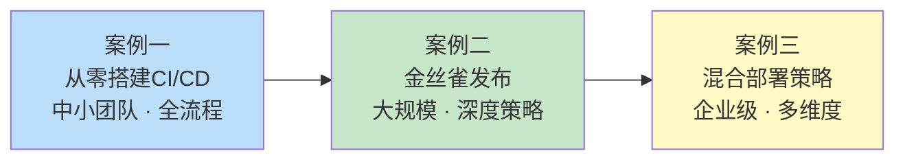
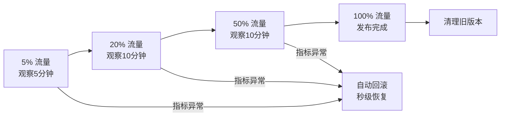

# 实战案例

***

## 本节概述

理论知识的价值最终要通过实战来验证。本节精选三个覆盖不同规模、不同场景的CI/CD实战案例，每个案例都从真实业务痛点出发，完整演示从问题定义、技术选型、架构设计到落地实施的全过程。三个案例形成由浅入深的递进关系：



| 维度 | 案例一：从零搭建CI/CD流水线 | 案例二：金丝雀发布实践 | 案例三：混合部署策略 |
|------|--------------------------|----------------------|---------------------|
| **团队规模** | 8人中小团队 | 30+微服务中型团队 | 多业务线企业级 |
| **技术栈** | Python + FastAPI + K8s | Istio服务网格 + K8s | 多语言混合 + 混合云 |
| **核心挑战** | 从手动部署到自动化 | 发布风险控制与灰度 | 异构环境统一管理 |
| **工具链** | GitHub Actions + ArgoCD | Istio + Prometheus + 自研分析器 | Argo Rollouts + Terraform |
| **阅读时间** | 约40分钟 | 约50分钟 | 约35分钟 |
| **前置知识** | 46.1-46.2 基础理论 | 46.3-46.4 部署策略 | 46.5-46.8 综合理论 |

***

## 案例一：从零搭建CI/CD流水线

> **适用读者**：刚开始接触CI/CD的团队，或正在从手动部署向自动化转型的中小团队。

### 场景描述

某互联网公司订单微服务（Order Service），团队8人，采用Python 3.12 + FastAPI技术栈。在搭建CI/CD之前，团队面临五个核心痛点：手动部署耗时20-30分钟且易出错、缺乏测试自动化导致线上Bug率高、环境不一致引发"在我机器上可以运行"问题、无快速回滚机制、部署不可追溯。

### 案例覆盖内容

本案例以GitHub Actions为CI/CD平台，Docker为容器化方案，Kubernetes为目标部署环境，ArgoCD实现GitOps自动同步，完整演示从代码提交到生产上线的全链路自动化：

- **静态检查与代码质量**：Ruff、mypy、Bandit三层检查 + pre-commit本地钩子
- **测试策略与执行**：单元测试（pytest）+ 集成测试（Docker Compose服务容器）+ 覆盖率门禁（80%阈值）
- **安全扫描**：依赖漏洞扫描（pip-audit）+ 容器镜像扫描（Trivy）+ 密钥泄露检测（Gitleaks）
- **构建与推送**：多阶段Dockerfile + Buildx缓存 + GHCR镜像仓库
- **GitOps部署**：ArgoCD Application配置 + Kustomize多环境管理 + 自动同步策略
- **分支策略**：GitHub Flow + 分支保护规则 + 环境保护规则

### 核心产出

代码提交 → 静态检查 → 单元测试 → 集成测试 → 安全扫描 → 构建镜像 → 推送仓库 → ArgoCD同步 → K8s部署 → 健康检查

核心指标：流水线总耗时 < 15分钟，测试覆盖率 > 80%，部署成功率 > 99%，回滚时间 < 2分钟。

### 关联章节

| 本案例知识点 | 理论基础章节 | 核心技巧章节 |
|-------------|-------------|-------------|
| 主干开发 vs 功能分支 | 46.1 持续集成理论根基 | — |
| 流水线阶段设计 | 46.2 持续部署流水线模型 | 46.9 流水线设计最佳实践 |
| ArgoCD + GitOps | 46.3 GitOps声明式管理 | 46.11 GitOps落地实践 |
| 制品版本管理 | 46.2 制品管理 | 46.10 制品管理与版本策略 |
| DevSecOps安全扫描 | 46.8 CI/CD安全实践 | — |
| Kustomize多环境 | — | 46.11 GitOps落地实践 |

***

## 案例二：金丝雀发布实践

> **适用读者**：已具备CI/CD基础，正在追求更精细发布策略的中大型团队。

### 场景描述

某在线支付平台日均2000万笔交易，峰值QPS达8000，系统由30余个微服务组成。此前采用滚动更新，但面临发布风险不可控、缺乏灰度能力、故障定位困难、发布窗口受限（仅凌晨2:00-6:00）等问题。过去6个月数据显示：月均发布12次，其中3次导致故障，故障影响5-50万用户，平均恢复时间45分钟。

### 案例覆盖内容

本案例选择Istio + 自研分析器方案，完整实现自动化金丝雀发布体系：

- **流量管理**：Istio VirtualService权重路由 + DestinationRule子集定义 + 会话保持策略
- **金丝雀分析器**：基于Prometheus指标的自动化对比分析，覆盖错误率、延迟P50/P95/P99、吞吐量、饱和度四大维度
- **晋级策略**：5% → 20% → 50% → 100% 四阶段渐进式晋级，每阶段独立观察窗口
- **自动回滚**：连续失败3次自动触发回滚，回滚后持续监控确认恢复
- **Grafana可视化**：金丝雀发布专属监控面板，实时对比stable vs canary指标
- **Prometheus告警规则**：基于PromQL的多维度告警，覆盖业务指标与基础设施指标

### 核心产出



核心成果：故障影响范围控制在总流量5%以内，故障检测时间从15分钟缩短到2分钟，回滚时间从分钟级缩短到秒级，发布窗口从凌晨扩展到全天。

### 关联章节

| 本案例知识点 | 理论基础章节 | 核心技巧章节 |
|-------------|-------------|-------------|
| 金丝雀部署原理 | 46.4 部署策略分类与对比 | 46.14 监控与告警集成 |
| Istio流量管理 | 46.3 GitOps声明式管理 | 46.11 GitOps落地实践 |
| 指标对比分析 | — | 46.14 监控与告警集成 |
| 自动回滚机制 | 46.7 回滚策略与发布安全 | — |
| Prometheus + Grafana | 46.14 监控与告警集成 | — |

***

## 案例三：混合部署策略

> **适用读者**：需要在同一集群中管理多种部署策略的中大型团队，或有多业务线差异化发布需求的企业。

### 场景描述

某电商平台同时运营核心交易系统、内容推荐引擎和内部工具平台三大业务线，对可用性、发布频率和资源效率有截然不同的要求：

- **核心交易系统**：要求零停机、秒级回滚，可接受双倍资源开销
- **内容推荐引擎**：需要A/B测试驱动的渐进式发布，关注业务指标转化
- **内部工具平台**：无状态服务，追求最高资源效率，发布频率低

单一部署策略无法同时满足三种场景，团队需要一套混合部署方案。

### 案例覆盖内容

本案例展示如何在同一Kubernetes集群中，根据不同业务特点选择和组合不同的部署策略：

- **蓝绿部署实战**：核心交易系统的零停机切换方案，包含数据库迁移的兼容处理
- **金丝雀 + A/B测试组合**：推荐引擎的渐进式发布 + 业务指标驱动的晋级决策
- **滚动更新优化**：内部工具平台的轻量级部署 + PDB（Pod Disruption Budget）保障
- **Argo Rollouts统一编排**：使用Argo Rollouts的CRD统一管理三种部署策略
- **统一监控体系**：跨业务线的部署状态仪表盘 + 统一告警策略

### 关联章节

| 本案例知识点 | 理论基础章节 | 核心技巧章节 |
|-------------|-------------|-------------|
| 蓝绿部署 | 46.4 部署策略分类与对比 | 46.9 流水线设计最佳实践 |
| A/B测试与功能标志 | 46.5 功能标志与发布解耦 | 46.12 功能标志工程实践 |
| 滚动更新 | 46.4 部署策略分类与对比 | — |
| Argo Rollouts | 46.3 GitOps声明式管理 | 46.11 GitOps落地实践 |
| 数据库迁移兼容 | 46.7 回滚策略与发布安全 | — |

***

## 案例阅读指南

### 按角色推荐阅读

| 角色 | 推荐路径 | 重点关注 |
|------|---------|---------|
| **DevOps工程师** | 案例一 → 案例二 → 案例三 | 流水线设计、GitOps配置、监控集成 |
| **SRE工程师** | 案例二 → 案例三 | 金丝雀分析、自动回滚、告警策略 |
| **架构师** | 案例三 → 案例二 | 策略选型、多业务线架构、统一管理 |
| **全栈开发者** | 案例一 → 案例三 | 测试策略、安全扫描、容器化最佳实践 |
| **技术管理者** | 本概述页 → 案例一 | 团队转型路径、ROI分析、指标定义 |

### 按团队规模推荐阅读

- **初创团队（1-5人）**：案例一的CI/CD基础 + GitHub Actions轻量方案
- **成长团队（5-20人）**：案例一完整实施 + 案例二金丝雀发布
- **成熟团队（20人以上）**：三个案例全读，重点关注案例三的混合策略和统一管理

### 按技术栈匹配

| 当前技术栈 | 推荐案例 | 理由 |
|-----------|---------|------|
| Kubernetes | 案例一 + 案例二 | GitHub Actions + ArgoCD + Istio |
| 非K8s环境 | 案例一 | CI/CD基础通用，Docker部署方案可迁移 |
| 已有Istio | 案例二 | 直接复用Istio流量管理能力 |
| 多云/混合云 | 案例三 | 统一编排 + 差异化策略 |

***

## 常见问题

### 案例中的代码可以直接复用吗？

是的。每个案例都提供了完整的配置文件和代码片段，包括GitHub Actions workflow、Kubernetes清单、Dockerfile、Prometheus规则等。建议根据自身业务场景修改以下变量后直接使用：

```bash
# 需要替换的变量
REGISTRY_URL=your-registry.example.com    # 镜像仓库地址
APP_NAME=your-service-name                 # 应用名称
NAMESPACE=your-namespace                   # Kubernetes命名空间
GITHUB_ORG=your-org                        # GitHub组织名
```

### 案例之间的依赖关系是什么？

三个案例相对独立，可以按需选择阅读。但建议的学习顺序是案例一 → 案例二 → 案例三，因为：
1. 案例一建立了CI/CD的基础认知和工具链
2. 案例二在此基础上深化了部署策略的精细化管理
3. 案例三综合运用了前两个案例的知识，解决更复杂的多场景问题

### 如果团队规模很小，需要全部实施吗？

不需要。根据团队实际情况，可以分阶段渐进式采用：

1. **第一阶段（1-2周）**：实施案例一的静态检查 + 单元测试 + 自动构建，消除手动部署
2. **第二阶段（2-4周）**：补充集成测试 + 安全扫描 + GitOps部署，建立完整流水线
3. **第三阶段（1-2月）**：引入金丝雀发布或混合部署策略，提升发布质量

***

## 案例数据一览

| 指标 | 案例一基线 | 案例一目标 | 案例二基线 | 案例二目标 |
|------|-----------|-----------|-----------|-----------|
| 部署耗时 | 20-30分钟 | < 15分钟 | 3-5分钟回滚 | < 1分钟回滚 |
| 故障影响 | 不可控 | < 1% | 5-50万用户 | < 5%流量 |
| 发布频率 | 每周1-2次 | 每天多次 | 每月12次 | 不限窗口 |
| 测试覆盖 | 人工Review | > 80%自动化 | 无灰度 | 全自动分析 |
| 回滚能力 | 无 | ArgoCD一键回滚 | 分钟级 | 秒级自动回滚 |
| 安全扫描 | 无 | 三层自动扫描 | — | — |
